# Epona: Autoregressive Diffusion World Model for Autonomous Driving

Kaiwen Zhang1,2\* Zhenyu Tang1,3\* Xiaotao Hu1,5 Xingang Pan6 Xiaoyang Guo1 Yuan Liu5 Jingwei Huang7 Li Yuan3 Qian Zhang1 Xiao-Xiao Long4 † Xun Cao4 Wei Yin1 §

1Horizon Robotics 2Tsinghua University 3Shenzhen Gruaduate School, Peking University 4Nanjing University 5Hong Kong University of Science and Technology 6Nanyang Technological University 7Tencent Hunyuan

(A) Consistent High-resolution Long Video Generation  
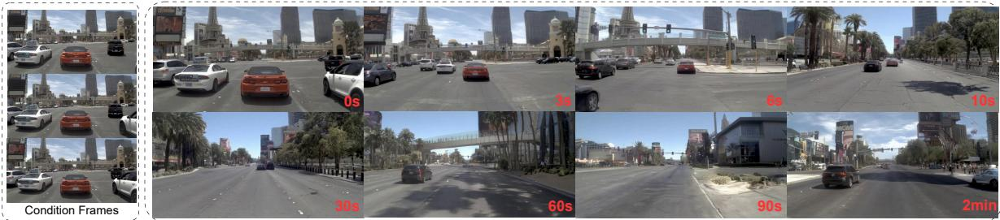

(B) Trajectory-controlled Video Generation  
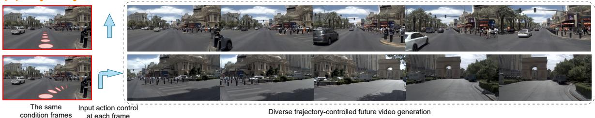  
(C)Traffic World Knowledge Understanding

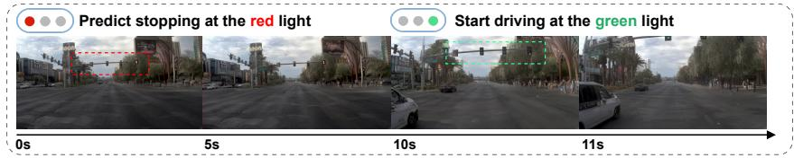

(D) End-to-End Trajectory Planning  
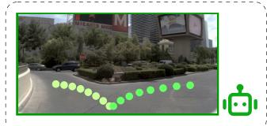  
Figure 1. Versatile capabilities of Epona. Given historical driving context, our Epona can generate consistent minutes-long future driving scenes at high resolution (A). It can be controlled by diverse trajectories (B), and understand real-world traffic knowledge (C). In addition, our world model can predict future trajectories and serve as an end-to-end real-time motion planner (D).

## Abstract

Diffusion models have demonstrated exceptional visual quality in video generation, making them promisingfor autonomous driving world modeling. However, existing video diffusion-based world models struggle with flexible-length, long-horizon predictions and integrating trajectory planning. This is because conventional video diffusion models rely on globaljoint distribution modeling offixed-length frame sequences rather than sequentially constructing localized distributions at each timestep. In this work, we propose Epona, an autoregressive diffusion world model that enables localized spatiotemporal distribution modeling

through two key innovations: 1) Decoupled spatiotemporal factorization that separates temporal dynamics modelingfromfine-grainedfuture world generation, and 2) Modular trajectory and video prediction that seamlessly integrate motion planning with visual modeling in an end-toend framework. Our architecture enables high-resolution, long-duration generation while introducing a novel chainof-forward training strategy to address error accumulation in autoregressive loops. Experimental results demonstrate state-of-the-art performance with 7.4% FVD improvement and minutes longer prediction duration compared to prior works. The learned world model further serves as a realtime motion planner, outperforming strong end-to-endplanners on NAVSIM benchmarks.

## 1. Introduction

Recently, with the rapid development of video generation models, world models have attracted significant attention and emerged as a powerful paradigm for physical world simulations and autonomous decision-making [1, 13, 21, 34]. These foundation models enable agents to understand inherent world knowledge and predict future dynamics, making them particularly promising for autonomous driving. Unlike traditional separate perception-planning pipelines, which require extensive annotations and explicit supervision, generative driving world models [11, 16, 18, 24, 26, 59, 60, 63, 70] integrate visual scene understanding with future prediction in a self-supervised manner, offering a new solution toward end-to-end autonomous driving.

Generative world models primarily fall into two categories: diffusion-based approaches and GPT-style autoregressive methods. The diffusion-based paradigm (e.g., Vista [18]), while achieving impressive visual fidelity through joint distribution modeling of fixed-length videos [3, 23, 47, 50], fundamentally suffers from its inability to model per-timestep local distributions. This limitation manifests in critical deficiencies: failure to support variable-length long-range prediction crucial for dynamic world simulation, and infeasible trajectory planning due to the lack of mutlimodal prediction mechanism.

Conversely, GPT-style approaches [5, 44, 45, 55] address temporal flexibility through autoregressive next-token prediction (as seen in GAIA-1 [24]). However, the quantization and tokenization process significantly degrades visual quality and planning precision. Moreover, the causal nature of autoregressive transformers constrains them to predicting only the next action rather than planning long-horizon trajectories [11], limiting their potential to serve as end-to-end driving planners. Both paradigms reveal complementary shortcomings - diffusion models lack temporal decomposition while autoregressive transformers sacrifice continuous visual precision - highlighting the need for a unified framework that reconciles these divergent advantages for competent driving world modeling.

We introduce Epona, an autoregressive diffusion world model that achieves high-resolution long-horizon video generation and accurate trajectory planning. Our core innovation comes from three key designs: 1) Decoupled spatiotemporal factorization. While existing video diffusion methods model joint spatial-temporal distributions of past and future frames, we assume their temporal latent modeling lacks explicit causality constraints, leading to error accumulation in long sequences. Epona addresses this through spacetime-disentangled processing: A GPTstyle transformer with causal attention handles temporal dynamics in compressed latent space, while twin diffusion transformers separately handle spatial rendering and trajectory generation. 2) Asynchronous multi-modal generation. Building upon this foundation, we decouple trajectory planning from visual generation through parallel denoising processes. Two specialized DiTs [33, 41] asynchronously generate 3-second vehicle trajectories and the single next future frame. Both streams share flow-matching objectives [2, 36, 37] conditioned on the same temporal latent, ensuring alignment while preserving modality-specific optimizations. 3) A chain-of-forward training strategy addresses error accumulation and content drift in autoregressive loops.

Epona offers several additional advantages. 1) Longhorizon generation. Our autoregressive diffusion model can achieve long-time generation over up to 2 minutes, significantly outperforming existing world models. 2) Realtime trajectory planning. The separate multi-modal generation architecture enables to perform trajectory planning solely while video prediction is deactivated, significantly reducing the inference FLOPS. This enables high-quality and even real-time trajectory planning, achieving rates of up to 20 Hz. 3) Visual detail preservation. Our autoregressive formulation adopts continuous visual tokenizer instead of discrete ones, thus preserving rich scene details.

Extensive experiments demonstrate the effectiveness and superiority of our world model. For video generation, our model achieves state-of-the-art FVD [52] on the NuScenes [6] benchmark, surpassing the best-performing Vista [18] by 7.4%, while extending generation length from 15 seconds to over 2 minutes (600 frames). Thanks to joint supervision with trajectory prediction, Epona allows action control to simulate diverse driving scenarios, as shown in Fig. 1 (B). For motion planning, our method outperforms strong end-to-end planners on NAVSIM [12] without perception inputs (e.g., 3D boxes/lanes). Notably, we observe that Epona learns essential traffic world knowledge (e.g., stop driving at red light) purely from self-supervised future prediction tasks, as shown in Fig. 1 (C). This suggests that our world model can implicitly learn real-world driving dynamics, making it a promising direction for next-generation autonomous driving systems.

## 2. Related Work

## 2.1. World Models for Autonomous Driving

Constructing real-world driving world models have drawn considerable attention in recent years, among which visioncentric approaches gain prominence due to their superior sensor flexibility, data accessibility, and more human-like representation forms. Early efforts primarily focused on adapting pre-trained diffusion models (e.g., Stable Diffusion [3, 47]) to driving scenarios through fine-tuning. However, these methods either lacked critical planning modules [16, 18, 19] or were limited to low-resolution, shortterm generation [17, 38, 59, 60, 64, 65], making them unsuitable for consistent long-range prediction and real-time planning. Recent work [11, 24, 26, 63, 70] explored harnessing GPT-like architecture to unify visual and action modeling and achieved long-range autoregressive generation. Yet, these methods require encoding images and trajectories into discrete tokens [14, 29, 54], which significantly degrades visual fidelity and trajectory precision. Similarly, while the newly released Cosmos [1] foundation model can serve as a driving world model, it does not introduce a new framework, facing the same limitations as the previous methods. In addition, its large parameter count and high computational demands limit its practicality. In contrast, we propose a novel autoregressive diffusion world model framework for autonomous driving, enabling longrange autoregressive generation in continuous visual and trajectory representations.

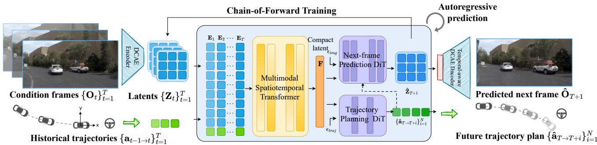  
Figure 2. Overview of Epona. Our world model utilizes a multimodal spatiotemporal transformer to process the historical context of the first T frames and employs a next-frame prediction DiT to generate the frame at T + 1 and a trajectory planning DiT to forecast the future N-frame pose trajectory. By adopting a chain-of-forward strategy, our approach enables high-quality and long-horizon video generation with an autoregressive manner.

## 2.2. Long Video Generation

Long-term prediction is not only a key challenge for current video generation models but also a crucial capability for robust world models, as it reflects the model’s ability to learn consistent environment dynamics and accurately simulate real-world temporal progression [13]. Since original video diffusion models (e.g. SVD [3]) are limited to fixed-length short clips generation, prior methods have explored extrapolating video length by noise rescheduling [43], overlapped generation [57, 58] or hierarchical generation [66]. However, these techniques fail to resolve inherent model constraints, often resulting in inconsistencies and abrupt visual changes in long videos. Autoregressive approaches [11, 56, 61] naturally support variable-length generation but suffer from quality degradation due to domain shift between teacher-forcing training and error accumulation in sampling. GameNGen [53] and Driving-World [26] introduce noise augmentation and random token dropout during training to alleviate the problem by simulating the error in sampling, but still limited to specific model architectures. We propose a general chain-of-forward strategy allowing the model to directly learn inference errors during training, effectively reducing autoregressive drift. Meanwhile, recent works such as Diffusion Forcing [8, 49] and FIFO-Diffusion [31] explore integrating autoregressive generation in video diffusion by adjusting frame-wise noise levels and leveraging causal network designs. Our model adopts a similar causal temporal modeling strategy but redefines the architecture into a two-stage end-to-end framework, allowing joint generation of motion plans and nextframe images.

## 3. Method

In this section, we formally present the model framework and training techniques of Epona. We begin with preliminaries on diffusion models in Sec. 3.1 and discuss our world model formulation design insights in Sec. 3.2. Then we introduce our proposed autoregressive diffusion world model framework in Sec. 3.3, including three dedicated modules: a multimodal spatiotemporal transformer to capture historical context, a trajectory planning DiT to generate future 3-seconds trajectories, and a next-frame prediction DiT to generate the next-frame images. To mitigate autoregressive drift and enable long-horizon video generation, we propose a simple yet effective chain-of-forward training strategy, detailed in Sec.3.4. Additionally, to enhance video quality, we introduce a temporal-aware DCAE decoder in Sec.3.5. An overview of our method is illustrated in Fig. 2.

## 3.1. Preliminary

Diffusion models [23, 50] are a family of powerful generative models that transform noise samples $x _ { ( 1 ) }$ drawn from a prior distribution $p _ { 1 } = \mathcal { N } ( \mathbf { 0 } , \mathbf { I } )$ into data samples $x _ { ( 0 ) }$ from the target distribution in terms of a differentiable equation:

$$
\begin{array} { r } { d x _ { ( t ) } = v _ { \Theta } ( x _ { ( t ) } , t ) d t , t \in [ 0 , 1 ] , } \end{array}\tag{1}
$$

where velocity v is parametrized by a neural network Θ. Rectified flow [2, 36, 37] proposes to define a straight prob-

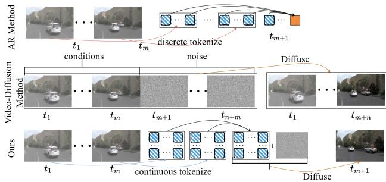  
Figure 3. Comparison of Different World Modeling Formulation. Up: Conventional autoregressive pipeline quantizes continous images into discrete tokens and perform next-token prediction iteratively. Middle: The video-diffusion-based methods generate future n frames simultaneously. Down: Our method autoregressively predicts fine-grained future frames in continuous space.

ability path between $p _ { 0 }$ and $p _ { 1 }$ to improve training and sampling efficiency and optimize the network \Theta using a velocity prediction loss:

$$
\begin{array} { r } { x _ { ( t ) } = ( 1 - t ) x _ { ( 0 ) } + t \epsilon , \epsilon \sim \mathcal { N } ( \mathbf { 0 } , \mathbf { I } ) , } \end{array}\tag{2}
$$

$$
\begin{array} { r } { \mathcal { L } _ { R F } = \mathbb { E } _ { \boldsymbol { x } _ { ( 0 ) } , \epsilon , t } \left[ \Vert \boldsymbol { v } _ { \Theta } ( \boldsymbol { x } _ { ( t ) } , t ) - ( \boldsymbol { x } _ { ( 0 ) } - \epsilon ) \Vert ^ { 2 } \right] , } \end{array}\tag{3}
$$

which has proven to be an effective and scalable approach in state-of-the-art image and video generation models $[ 1 5 ,$ 27, 33]. In Epona, we adopt the diffusion model and rectified flow objective for both next-frame image and trajectory generation. Particularly, to enhance efficiency, we encode images into compact latents using a pre-trained deep compression encoder [9] and adopt a latent diffusion model [47] for image synthesis.

## 3.2. Reformulation of World Model Designs

In this section, we discuss different world model formulation design choices, as illustrated in Fig. 3. Given a sequence of previous front-view camera observations $\{ \mathbf { O } _ { t } \} _ { t = 1 } ^ { T }$ and the corresponding driving trajectory $\{ \mathbf { a } _ { t - 1  t } \} _ { t = 1 } ^ { T } ,$ the goal of driving world moels is to predict future driving dynamics based on historical context. Here, each driving action $\begin{array} { r l } { \mathbf { a } _ { t _ { 1 }  t _ { 2 } } } & { { } : = } \end{array}$ $( \Delta \theta _ { t _ { 1 }  t _ { 2 } } , \Delta x _ { t _ { 1 }  t _ { 2 } } , \Delta y _ { t _ { 1 }  t _ { 2 } } ) \ \in \ { \mathbb R } ^ { 3 }$ represents the vehicle’s motion from $t _ { 1 }$ to $t _ { 2 } ,$ , where \Delta \theta denotes the orientation change, and $( \Delta x , \Delta y )$ specify the relative displacement in the ego-coordinate frame. For consistency, we define $\mathbf { a } _ { 0 \to 1 } = ( 0 , 0 , 0 )$ . Existing methods tackle this problem by formulating world modeling in the following two ways: Video diffusion-based world models. Current leading driving world models, like Vista [18], formulates world modeling in the form of video diffusion models [3], which jointly capture the global spatiotemporal distribution of both past and a fixed-length future,

$$
p \left( \{ \mathbf { O } _ { T + i } \} _ { i = 1 } ^ { n } , \{ \mathbf { O } _ { t } , \mathbf { a } _ { t } \} _ { t = 1 } ^ { T } \right) .
$$

This formulation disrupts the causal temporal structure between historical observations and future predictions, limiting its ability to model real-world progressive dynamics and generate flexible-length long-term videos.

GPT-based world models. Alternatively, autoregressive transformer-based world models [11, 24, 26] discretize image observations into token sequences $\begin{array} { r l } { \mathbf { O } _ { t } } & { { } = } \end{array}$ $[ \mathbf { t } _ { 1 } , \mathbf { t } _ { 2 } , \cdots , \mathbf { t } _ { L } ]$ and model the conditional image distribution as a token-by-token prediction,

$$
\prod _ { i = 1 } ^ { L } p ( \mathbf { t } _ { i } \mid \mathbf { t } _ { < i } , \{ \mathbf { O } _ { t } , \mathbf { a } _ { t } \} _ { t = 1 } ^ { T } ) .
$$

However, this independent token modeling weakens spatial correlations and the quantization process distortes highfrequency details, leading to degraded generation quality.

Our approach. In contrast, we formulate world modeling as a sequentialfuture prediction process in the temporal domain. Specifically, given past driving observations $\{ \mathbf { O } _ { t } \} _ { t = 1 } ^ { T }$ and the driving trajectory $\{ \mathbf { a } _ { t - 1  t } \} _ { t = 1 } ^ { T }$ , our model predicts both a policy for future trajectory planning,

$$
\pi ( \{ \mathbf { a } _ { T  T + i } \} _ { i = 1 } ^ { n } \mid \{ \mathbf { O } _ { t } , \mathbf { a } _ { t - 1  t } \} _ { t = 1 } ^ { T } ) ,
$$

and a conditional distribution over the next-frame camera observation as a whole,

$$
p ( \mathbf { O } _ { T + 1 } \mid \{ \mathbf { O } _ { t } , \mathbf { a } _ { t - 1  t } \} _ { t = 1 } ^ { T } , \mathbf { a } _ { T  T + 1 } ) .
$$

The next-frame prediction is conditioned on either a modelpredicted action or an externally provided action ${ \bf a } _ { T  T + 1 }$ By decoupling causal temporal modeling from fine-grained future prediction, our model can generate flexible-length long videos autoregressively in continuous representations. Moreover, by factorizing trajectory planning from visual generation, our model can seamlessly serve as a real-time motion planner, bridging a critical gap between current driving world models and end-to-end motion planners.

## 3.3. Epona: Autoregressive Diffusion World Model

Based on the reformulated world modeling design, we propose Epona, an autoregressive diffusion world model for autonomous driving. Our framework consists of three key components. First, a Multimodal Spatiotemporal Transformer (MST) encodes historical context $\{ \mathbf { O } _ { t } , \mathbf { a } _ { t } \} _ { t = 1 } ^ { T }$ into a compact latent representation, effectively capturing environmental context and driving dynamics. Then, based on the historical latents, we employ two specialized diffusion transformers to predict fine-grained future details, including a tiny Trajectory Planning Transformer (TrajDiT) that models the policy $\pi$ for trajectory planning, and a Next-frame Prediction Transformer (VisDiT) that models the visual distribution $p$ for future image generation. This modular design enables a range of autonomous driving applications.

For instance, MST and VisDiT can be used independently for controllable driving simulations, while MST and TrajDiT facilitate real-time motion planning.

Multimodal Spatiotemporal Transformer (MST). Given the encoded past driving scenes $\{ \mathbf { Z } _ { t } \} _ { t = 1 } ^ { T }$ and trajectory $\{ \mathbf { a } _ { t - 1  t } \} _ { t = 1 } ^ { T }$ , we introduce a multimodal spatiotemporal transformer to effectively integrate temporal dynamics and multimodal information from historical context for future prediction. Inspired by prior work in video generation and world modeling [4, 26, 39], our approach employs interleaved multimodal spatial attention layers and causal temporal attention layers. This design progressively incorporates historical information into a compact latent representation while significantly reducing memory consumption compared to full-sequence attention. Additionally, this design naturally supports historical contexts of variable length.

Specifically, we first project the flattened visual latent patches $\textbf { Z } \doteq \mathbb { R } ^ { B \times T \times \dot { L } \times \check { C } }$ and action sequences ${ \textbf { a } } \in$ $\mathbb { R } ^ { B \times T \times 3 }$ into an embedding space. Then we concatenate them along the spatial dimension and add temporal positional embeddings to obtain the latent embedding sequence $\mathbf { E } \in \mathbb { R } ^ { B \times T \times ( L + \mathbf { \bar { 3 } } ) \times D }$ . This sequence is processed through interleaved multimodal spatiotemporal layers as follows (using einops [46] notation):

$$
\begin{array} { r l } & { \mathbf { E }  \mathrm { ~ r e a r r a n g e } ( \mathbf { E } , \mathrm { ~ ( b ~ \ t ) ~ \tau ~ 1 ~ \subset ~ \tau ~  ~ \tau ( b ~ \tau 1 ) ~ \tau ~ t ~ \subset ~ \tau ~ } ) } \\ & { \mathbf { E }  \mathrm { c a u s a l \tau e m p o r a l L a y e r } ( \mathbf { E } , \mathrm { c a u s a l M a s k } ) } \\ & { \mathbf { E }  \mathrm { r e a r r a n g e } ( \mathbf { E } , \mathrm { ~ ( b ~ \tau 1 ) ~ \tau ~ t ~ \subset ~ \tau ~  ~ \tau ( b ~ \tau  t ) ~ \tau ~ 1 ~ \subset ~ } ) } \\ & { \mathbf { E }  \mathrm { M u l t i m o d a l S p a t i a l L a y e r } ( \mathbf { E } ) , } \end{array}
$$

where B is the batch size, T is the number of conditioning frames, $L = H \times W$ is the number of flattened latents in an image, C is the image latent channel dimension, D is the embedding dimension, and CausalMask is the triangular causal attention mask. Finally, we use the latent embedding of the last frame, $\mathbf { F } ~ \in ~ \bar { \mathbb { R } ^ { B \times ( L + 3 ) \times D } }$ , as the compact latent representation for the next-stage prediction. After training, this embedding encapsulates the historical context $\{ \mathbf { O } _ { t } , \mathbf { a } _ { t - 1  t } \} _ { t = 1 } ^ { T }$

Trajectory Planning Diffusion Transformer (TrajDiT). TrajDiT predicts future trajectories using a tiny diffusion transformer. Following the DiT frameworks in most advanced open-source text-to-image and video generation models [27, 33], we adopt a Dual-Single-Stream architecture. In the dual-stream phase, the historical latent representation F and trajectory data are processed independently through transformer blocks, with only attention operations linking them. In the single-stream phase, they are concatenated to pass through subsequent transformer blocks for effective information fusion. Detailed architecture can be found in the supplementary material.

During training, we add noise to the target trajectories $\overline { { \mathbf { a } } } \in \mathbb { R } ^ { B \times N \times 3 }$ using Eq. 2. The model then predicts velocity $v _ { t r a j }$ conditioned on F, where N is the planning horizon. We optimize using the rectified flow loss:

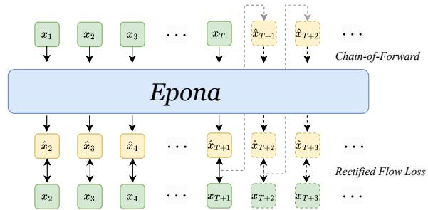  
Figure 4. Concept illustration of our training process. Here x can be either image latents or trajectories.

$$
\mathcal { L } _ { t r a j } = \mathbb { E } _ { \overline { { \mathbf { a } } } , \epsilon , t } \left[ \| v _ { t r a j } \big ( \overline { { \mathbf { a } } } _ { ( t ) } , t \big ) - \big ( \overline { { \mathbf { a } } } - \epsilon \big ) \| ^ { 2 } \right] .\tag{4}
$$

For inference, random Gaussian noise is iteratively denoised conditioned on F to generate future trajectory plans. Next-frame Prediction Diffusion Transformer (VisDiT). VisDiT has a similar architecture as TrajDiT, with an additional modulation [41] branch for action control ${ \bf a } _ { T  T + 1 } .$ We also use the flow loss for visual supervision:

$$
\mathcal { L } _ { v i s } = \mathbb { E } _ { \mathbf { Z } _ { T + 1 } , \epsilon , t } \left[ \| v _ { v i s } ( \mathbf { Z } _ { T + 1 ( t ) } , t ) - ( \mathbf { Z } _ { T + 1 } - \epsilon ) \| ^ { 2 } \right] ,\tag{5}
$$

Together, the total loss jointly optimizes the entire world model:

$$
\mathcal { L } = \mathcal { L } _ { t r a j } + \mathcal { L } _ { v i s } .\tag{6}
$$

During inference, VisDiT denoises $\hat { \mathbf { Z } } _ { T + 1 }$ , conditioned on F and the action either predicted by TrajDiT or provided by user. The latents are then decoded using the DCAE decoder to generate the next-frame image $\hat { \mathbf { O } } _ { T + 1 }$

## 3.4. Chain-of-Forward Training

With our proposed autoregressive diffusion world model, we can autoregressively generate future videos frame by frame. However, long-term generation suffers from a longstanding autoregressive drift problem [53]: during training, the model predicts the next frame using ground-truth historical context, whereas during inference, it relies on its own past predictions. This domain gap between teacher-forcing training and autoregressive sampling leads to error accumulation and rapid quality degradation.

To mitigate this, we introduce a chain-of-forward training strategy. Periodically, we perform multiple forward passes using self-predicted frames to enhance the model’s robustness to inference noise (see Fig. 4). Notably, to ensure training efficiency, instead of sampling next-frame latents from pure noise, we leverage the model-predicted velocity $v _ { \Theta }$ to estimate the denoised latents in one step:

$$
\boldsymbol { \hat { x } } _ { ( 0 ) } = \boldsymbol { x } _ { ( t ) } + t \boldsymbol { v } _ { \Theta } ( \boldsymbol { x } _ { ( t ) } , t )\tag{7}
$$

Table 1. Comparisons of generated videos on the NuScenes [6] validation set. Our model achieves state-of-the-art FVD score compared to existing driving world models, while extending the video length to over two minutes. \*The max duration number indicates the horizon that produces plausible results, following existing methods.
<table><tr><td>Metric</td><td>DriveGAN [32]</td><td>DriveDreamer [59]</td><td>WoVoGen [38]</td><td>Drive-WM [60]</td><td>GenAD (OpenDV) [65]</td><td> $\mathrm { V i s t a } \left[ \mathrm { 1 8 } \right]$ </td><td>DrivingWorld [26]</td><td>Ours</td></tr><tr><td>FID↓</td><td>73.4</td><td>52.6</td><td>27.6</td><td>15.8</td><td>15.4</td><td>6.9</td><td>7.4</td><td>7.5</td></tr><tr><td>FVD↓</td><td>502.3</td><td>452.0</td><td>417.7</td><td>122.7</td><td>184.0</td><td>89.4</td><td>90.9</td><td>82.8</td></tr><tr><td>Max Duration / Frames*</td><td>N/A</td><td>4s / 48</td><td>2.5s / 5</td><td>8s / 16</td><td>4s / 8</td><td>15s / 150</td><td>40s / 400</td><td>120s / 600</td></tr></table>

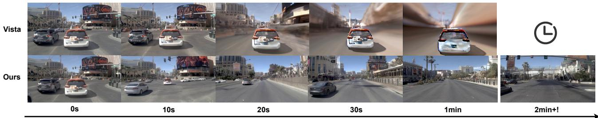  
Figure 5. Qualitative Comparison between Vista [18] and Epona. Zoom in for better views.

The estimated $\hat { \boldsymbol { x } } _ { ( 0 ) }$ , along with previous conditioned frames, is then used in the next forward pass to autoregressively generate subsequent frames. This process simulates prediction noise, helping the model adapt to deviations and improving long-term video generation quality.

## 3.5. Temporal-aware DCAE Decoder

Unlike conventional autoencoders that downsample images by a factor of 8, DCAE [9] progressively increases this to 32, reducing latent tokens by 16×. In our world model, we adopt DCAE for image encoding to improve training efficiency and reduce memory usage, enabling conditioning on longer historical contexts.

However, as an image autoencoder, DCAE lacks temporal interactions, causing flickering when decoding video frame by frame, which degrades visual quality. To address this, we propose a temporal-aware DCAE to enhance interframe consistency. Specifically, to maximize pretrained parameters while minimizing architectural changes, we introduce spatiotemporal self-attention layers before the DCAE decoder while keeping the encoder fixed during fine-tuning. This facilitates multi-frame interactions, greatly improving temporal consistency in generated videos.

## 4. Experiment

## 4.1. Implementation Details

World Model. Our Epona consists of 2.5 B parameters, including a 12-layer multimodal spatiotemporal transformer with 1.3 B parameters, a 12-layer next-frame prediction diffusion transformer with 1.2 B parameters, and a 2-layer trajectory planning diffusion transformer with 50 M parameters. It is trained on publicly available videos from the NuPlan dataset [7] and 700 scenes from the NuScenes dataset [6] from scratch, all images are resized to 512×1024. We utilize the rectified flow [37] objective for both video generation and trajectory planning tasks, training the entire model in an end-to-end manner. The training was conducted on 48 NVIDIA A100 GPUs for nearly two weeks, with a total of 600k iterations and a batch size of 96. During training, we apply Chain-of-Forward every 10 steps, each time performing three forward passes. We use the AdamW optimizer with a learning rate of $1 \times 1 0 ^ { - 4 }$ and set the weight decay to $5 \times 1 0 ^ { - 2 }$ . For inference, we report our speed for each module on a single NVIDIA 4090 GPU in Table 2. In all our experiments, we set our DiT sampling step to 100. Notice that with MST and TrajDiT, our world model can seamlessly serve as a real-time motion planner.

Table 2. Inference speed. We evaluate our inference speed for generating a 3-second trajectory and a 512 \times 1024 image per module on a single NVIDIA 4090 GPU.
<table><tr><td>DiT sampling steps</td><td>MST</td><td>TrajDiT</td><td>VisDiT</td></tr><tr><td>10</td><td>~0.02s</td><td>~0.03s</td><td> ${ \sim } 0 . 3 \mathrm { s }$ </td></tr><tr><td>100</td><td>~0.02s</td><td>~0.3s</td><td>~2s</td></tr></table>

Evaluations on video generation. We employ 1628 video clips from the NuPlan test set [7] and 1646 video clips from the NuScenes validation dataset [6] for performance evaluation, respectively. During the test, our world model is conditioned on 10 consecutive past frames to generate the subsequent frame and repeat the process autoregressively to synthesize future video frames. We use the Frechet Video Distance (FVD) [52] and the Frechet Inception Distance (FID) [22] to evaluate the quality of the generated videos.

Evaluations on trajectory planning. We evaluate trajectory planning using the NuScenes benchmark [6] and the NAVSIM benchmark [12]. For the NuScenes, we use L2 error and collision rate as the evaluation metrics following the existing works [25, 48, 70] to evaluate the planning performance. L2 error measures the L2 distance between the predicted and ground truth trajectories, while the collision rate measures the frequency of predicted trajectory intersections with objects. The NAVSIM benchmark assesses performance using the predictive driver model score (PDMS), derived from five factors, as shown in Table 4.

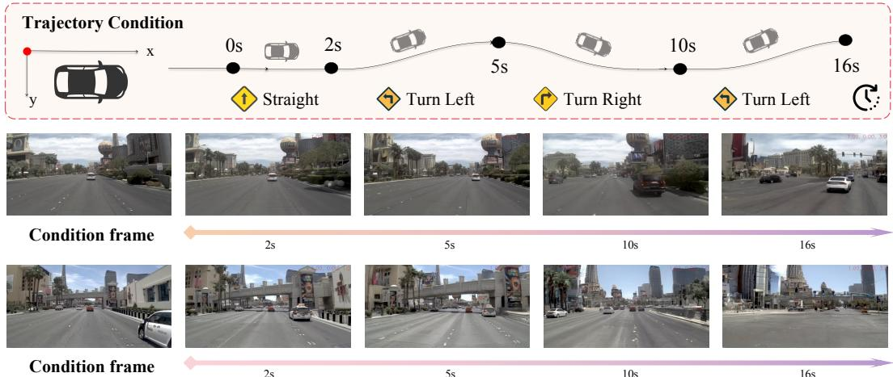  
Figure 6. Trajectory-controlled video generation. Our world model can generate controllable videos based on predefined trajectories.

## 4.2. Evaluation of Video Generation

Quantitative Comparison of Generated Videos. We present a quantitative comparison with existing methods on the NuScenes dataset [6] in Table 1. Since most methods are not publicly available, we compare with the reported results from their respective papers. Notably, the existing methods (e.g., Vista [18]) fine-tune video diffusion models pretrained on large-scale datasets, while our world model, including next-frame DiT, is trained from scratch. As shown in Table 1, our generated videos achieve state-of-the-art FVD scores, indicating smoother and more realistic video generation quality. Moreover, our world model can generate significantly longer video frames compared to existing approaches as shown in Table 1.

Qualitative Comparison of Generated Videos. We provide a qualitative comparison with the state-of-the-art opensource driving world model, Vista [18]. Since Vista is a 25-frame fixed-length video diffusion model, we perform rollout to generate longer videos as illustrated in their paper. As shown in Fig. 5, our Epona generates consistent long-horizon driving scenes with high-fidelity visuals and detailed structures and vehicles.

Trajectory-controlled Video Generation. Fig. 6 illustrates the pose controllability of our model. Given the predefined pose trajectory, the different condition frames can generate future frames that conform to the corresponding motion path, which is crucial for obtaining autonomous driving videos under extreme scenarios.

Extra Long-range Video Generation. Epona combines the strengths of autoregressive and diffusion models, facilitating the generation of high-quality, long-duration videos conditioned on input frames. As shown in Fig.5 and Fig.7, our model can autoregressively generate minute-long driving videos with high fidelity and consistency, without noticeable drift. More long-term generation videos are provided in the supplementary materials.

## 4.3. Evaluation of Trajectory Planning

For the NuScenes benchmark [6], we compare our world model with several existing methods, as shown in Table 3. Although our model does not achieve the best results, it attains competitive performance without any additional supervision. It is worth noting that incorporating more supervision typically leads to better performance but cost expensive annotations. Additionally, similar to Doe-1 [70], our model only utilizes the front camera, whereas other methods rely on multi-view inputs for planning. As shown in Table 3, our approach can generate reasonable trajectories while achieving the lowest collision rate for a 1-second horizon, which is crucial for long-term realistic video predictions. For the more challenging NAVSIM benchmark [12], as shown in Table 4, our method achieves state-of-the-art results in overall PDMS when conditioned on the past 2 seconds of observations to predict 4-second future trajectories, showing the strong motion planning capability.

## 4.4. Ablation Study

Effect of Shared Latent for Multi-modal Joint Prediction. To assess the benefit of jointly modeling scene and trajectory via a shared latent representation, we conduct an ablation by disabling video prediction and training the model solely for trajectory prediction. This variant is evaluated on the NAVISIM test set. As shown in Tab. 5, removing video prediction leads to a noticeable drop in planning performance. This result highlights the advantage of the shared latent F, which encourages the world model to better capture complex driving dynamics by leveraging visual signals. This ablation confirms that coupling video and trajectory prediction within a unified latent space in world models significantly benefits downstream planning tasks.

Effect of Chain-of-Forward Training. To evaluate the

w/o Chain-of-Forward

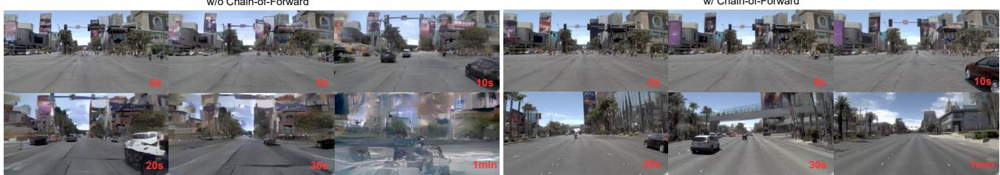  
w/ Chain-of-Forward

Figure 7. Qualitative Comparison between long videos generated by models w/ and w/o Chain-of-Forward training. Left: Visual quality deteriorates rapidly after 10–20 seconds. Right: The same driving scenes with Chain-of-Forward training maintain high visual quality, generating minute-long videos without significant degradation. Zoom in for better views.  
Table 3. End-to-end motion planning performance on the NuScenes [6] dataset. Note that our model achieves a low collision rate, demonstrating its understanding of basic traffic rules via simple next-frame prediction. ∗ represents only using the front camera as input.
<table><tr><td rowspan="2">Method</td><td rowspan="2">Input</td><td rowspan="2">Auxiliary Supervision</td><td colspan="4">L2 (m) ↓</td><td colspan="4">Collision Rate (%) ↓</td></tr><tr><td>1s</td><td>2s</td><td>3s</td><td>Avg.</td><td>1s</td><td>2s</td><td>3s</td><td>Avg.</td></tr><tr><td>ST-P3 [25]</td><td>Camera</td><td>Map &amp; Box &amp; Depth</td><td>1.33</td><td>2.11</td><td>2.90</td><td>2.11</td><td>0.23</td><td>0.62</td><td>1.27</td><td>0.71</td></tr><tr><td>UniAD [48]</td><td>Camera</td><td>Map &amp; Box &amp; Motion &amp; Tracklets &amp; Occ</td><td>0.48</td><td>0.96</td><td>1.65</td><td>1.03</td><td>0.05</td><td>0.17</td><td>0.71</td><td>0.31</td></tr><tr><td>OccNet [51]</td><td>Camera</td><td>3D-Occ &amp; Map &amp; Box</td><td>1.29</td><td>2.13</td><td>2.99</td><td>2.14</td><td>0.21</td><td>0.59</td><td>1.37</td><td>0.72</td></tr><tr><td>OccWorld [68]</td><td>Camera</td><td>3D-Occ</td><td>0.52</td><td>1.27</td><td>2.41</td><td>1.40</td><td>0.12</td><td>0.40</td><td>2.08</td><td>0.87</td></tr><tr><td>VAD-Tiny [30]</td><td>Camera</td><td>Map &amp; Box &amp; Motion</td><td>0.60</td><td>1.23</td><td>2.06</td><td>1.30</td><td>0.31</td><td>0.53</td><td>1.33</td><td>0.72</td></tr><tr><td>VAD-Base [30]</td><td>Camera</td><td>Map &amp; Box &amp; Motion</td><td>0.54</td><td>1.15</td><td>1.98</td><td>1.22</td><td>0.04</td><td>0.39</td><td>1.17</td><td>0.53</td></tr><tr><td>GenAD [69]</td><td>Camera</td><td>Map &amp; Box &amp; Motion</td><td>0.36</td><td>0.83</td><td>1.55</td><td>0.91</td><td>0.06</td><td>0.23</td><td>1.00</td><td>0.43</td></tr><tr><td>Doe-1 [70]</td><td>Camera*</td><td>QA</td><td>0.50</td><td>1.18</td><td>2.11</td><td>1.26</td><td>0.04</td><td>0.37</td><td>1.19</td><td>0.53</td></tr><tr><td>Ours</td><td>Camera*</td><td>None</td><td>0.61</td><td>1.17</td><td>1.98</td><td>1.25</td><td>0.01</td><td>0.22</td><td>0.85</td><td>0.36</td></tr></table>

Table 4. End-to-end motion planning performance on the NAVSIM [12] test set. NC: no at-fault collision. DAC: drivable area compliance. TTC: time-to-collision. Comf.: comfort. EP: ego progress. PDMS: the predictive driver model score. LAW[35] is in the perception-free setting. Our world model outperforms strong end-to-end planners in the overall PDMS score.
<table><tr><td>Method</td><td>Input</td><td>NC↑</td><td>DAC ↑</td><td>TTC ↑</td><td>Comf. ↑</td><td>EP↑</td><td>PDMS ↑</td></tr><tr><td>Human</td><td>1</td><td>100</td><td>100</td><td>100</td><td>99.9</td><td>87.5</td><td>94.8</td></tr><tr><td>UniAD[48]</td><td>Camera</td><td>97.8</td><td>91.9</td><td>92.9</td><td>100</td><td>78.8</td><td>83.4</td></tr><tr><td>PARA-Drive[62]</td><td>Camera</td><td>97.9</td><td>92.4</td><td>93.0</td><td>99.8</td><td>79.3</td><td>84.6</td></tr><tr><td>LAW[35]</td><td>Camera</td><td>96.4</td><td>95.4</td><td>88.7</td><td>99.9</td><td>81.7</td><td>84.6</td></tr><tr><td>TransFuser[42]</td><td>Camera &amp; Lidar</td><td>97.7</td><td>92.8</td><td>92.8</td><td>100</td><td>79.2</td><td>84.0</td></tr><tr><td>DRAMA[67]</td><td>Camera &amp; Lidar</td><td>98.0</td><td>93.1</td><td>94.8</td><td>100</td><td>80.1</td><td>85.5</td></tr><tr><td>VADv2[10]</td><td>Camera &amp; Lidar</td><td>97.2</td><td>89.1</td><td>91.9</td><td>100</td><td>76.0</td><td>80.9</td></tr><tr><td>Ours</td><td>Camera</td><td>97.9</td><td>95.1</td><td>93.8</td><td>99.9</td><td>80.4</td><td>86.2</td></tr></table>

Table 5. Comparison of planning results on the NAVSIM test set. Jointly predicting the next scene using a shared latent significantly improves planning performance.

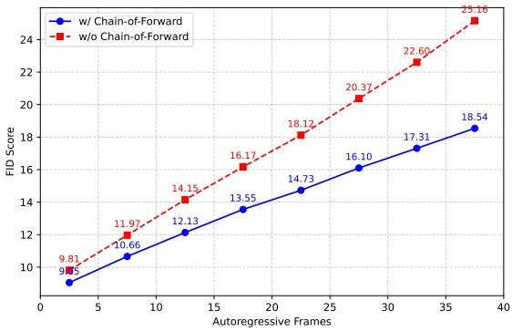

<table><tr><td>Method</td><td>NC↑</td><td>DAC ↑</td><td>TTC ↑</td><td>Comf. ↑</td><td>EP↑</td><td>PDMS ↑</td></tr><tr><td>Ours w/o Joint Training</td><td>94.5</td><td>89.7</td><td>88.1</td><td>99.9</td><td>74.7</td><td>78.1</td></tr><tr><td>Ours</td><td>97.9</td><td>95.1</td><td>93.8</td><td>99.9</td><td>80.4</td><td>86.2</td></tr></table>

Figure 8. Effect of Chain-of-Forward training. FID comparison in NuPlan test set between models w/ and w/o Chain-of-Forward training strategy.

impact of our chain-of-forward strategy on model performance, we conduct an ablation study comparing results with and without this strategy. Given that our model iteratively generates the next frame, the chain-of-forward approach simulates potential inference errors during training, thereby enhancing the model’s robustness. As shown in Fig. 7 and Fig. 8, as the model autoregressively generates longer sequences, the gap in visual quality and FID score between models with and without the chain-of-forward strategy becomes increasingly significant, validating its effectiveness in long-term video generation. More ablations can be found in the supplementary material.

## 5. Conclusion

We have presented Epona, an autoregressive diffusion world model for autonomous driving that jointly predicts high-fidelity future trajectories and driving scenes based on historical driving context. Thanks to our proposed decoupled spatiotemporal modeling and asynchronous multimodal generation strategies, our model achieves highquality and long-term prediction. In addition, our model could serves as a real-time motion planner via performing trajectory planning. We have demonstrated that our approach significantly advances the state of the art in driving world models, uncovering the large potential for building next-generation autonomous driving systems.

## References

[1] Niket Agarwal, Arslan Ali, Maciej Bala, Yogesh Balaji, Erik Barker, Tiffany Cai, Prithvijit Chattopadhyay, Yongxin Chen, Yin Cui, Yifan Ding, et al. Cosmos world foundation model platform for physical ai. arXiv preprint arXiv:2501.03575, 2025. 2, 3

[2] Michael S. Albergo and Eric Vanden-Eijnden. Building normalizing flows with stochastic interpolants, 2023. 2, 3

[3] Andreas Blattmann, Tim Dockhorn, Sumith Kulal, Daniel Mendelevitch, Maciej Kilian, Dominik Lorenz, Yam Levi, Zion English, Vikram Voleti, Adam Letts, et al. Stable video diffusion: Scaling latent video diffusion models to large datasets. arXiv preprint arXiv:2311.15127, 2023. 2, 3, 4

[4] A. Blattmann, Robin Rombach, Huan Ling, Tim Dockhorn, Seung Wook Kim, Sanja Fidler, and Karsten Kreis. Align your latents: High-resolution video synthesis with latent diffusion models. CVPR, pages 22563–22575, 2023. 5

[5] Tom Brown, Benjamin Mann, Nick Ryder, Melanie Subbiah, Jared D Kaplan, Prafulla Dhariwal, Arvind Neelakantan, Pranav Shyam, Girish Sastry, Amanda Askell, et al. Language models are few-shot learners. Advances in Neural Information Processing Systems (NeurIPS), 33:1877–1901, 2020. 2

[6] Holger Caesar, Varun Bankiti, Alex H Lang, Sourabh Vora, Venice Erin Liong, Qiang Xu, Anush Krishnan, Yu Pan, Giancarlo Baldan, and Oscar Beijbom. nuscenes: A multimodal dataset for autonomous driving. In Proceedings of the IEEE/CVF conference on computer vision and pattern recognition, pages 11621–11631, 2020. 2, 6, 7, 8

[7] Holger Caesar, Juraj Kabzan, Kok Seang Tan, Whye Kit Fong, Eric Wolff, Alex Lang, Luke Fletcher, Oscar Beijbom, and Sammy Omari. nuplan: A closed-loop ml-based planning benchmark for autonomous vehicles. arXiv preprint arXiv:2106.11810, 2021. 6, 1

[8] Boyuan Chen, Diego Marti Monso, Yilun Du, Max Simchowitz, Russ Tedrake, and Vincent Sitzmann. Diffusion forcing: Next-token prediction meets full-sequence diffusion, 2024. 3

[9] Junyu Chen, Han Cai, Junsong Chen, Enze Xie, Shang Yang, Haotian Tang, Muyang Li, Yao Lu, and Song Han. Deep compression autoencoder for efficient high-resolution diffusion models. arXiv preprint arXiv:2410.10733, 2024. 4, 6

[10] Shaoyu Chen, Bo Jiang, Hao Gao, Bencheng Liao, Qing Xu, Qian Zhang, Chang Huang, Wenyu Liu, and Xinggang Wang. Vadv2: End-to-end vectorized autonomous driving via probabilistic planning. arXiv preprint arXiv:2402.13243, 2024. 8

[11] Yuntao Chen, Yuqi Wang, and Zhaoxiang Zhang. Drivinggpt: Unifying driving world modeling and planning with multi-modal autoregressive transformers. arXiv preprint arXiv:2412.18607, 2024. 2, 3, 4, 1

[12] Daniel Dauner, Marcel Hallgarten, Tianyu Li, Xinshuo Weng, Zhiyu Huang, Zetong Yang, Hongyang Li, Igor Gilitschenski, Boris Ivanovic, Marco Pavone, Andreas Geiger, and Kashyap Chitta. Navsim: Data-driven nonreactive autonomous vehicle simulation and benchmarking. In NeurIPS, 2024. 2, 6, 7, 8

[13] Jingtao Ding, Yunke Zhang, Yu Shang, Yuheng Zhang, Zefang Zong, Jie Feng, Yuan Yuan, Hongyuan Su, Nian Li, Nicholas Sukiennik, et al. Understanding world or predicting future? a comprehensive survey of world models. arXiv preprint arXiv:2411.14499, 2024. 2, 3

[14] Patrick Esser, Robin Rombach, and Bjorn Ommer. Taming¨ transformers for high-resolution image synthesis, 2020. 3

[15] Patrick Esser, Sumith Kulal, Andreas Blattmann, Rahim Entezari, Jonas Muller, Harry Saini, Yam Levi, Dominik¨ Lorenz, Axel Sauer, Frederic Boesel, Dustin Podell, Tim Dockhorn, Zion English, Kyle Lacey, Alex Goodwin, Yannik Marek, and Robin Rombach. Scaling rectified flow transformers for high-resolution image synthesis, 2024. 4

[16] Ruiyuan Gao, Kai Chen, Bo Xiao, Lanqing Hong, Zhenguo Li, and Qiang Xu. Magicdrivedit: High-resolution long video generation for autonomous driving with adaptive con trol. arXiv preprint arXiv:2411.13807, 2024. 2, 1

[17] Ruiyuan Gao, Kai Chen, Enze Xie, Lanqing Hong, Zhenguo Li, Dit-Yan Yeung, and Qiang Xu. MagicDrive: Street view generation with diverse 3d geometry control. In ICLR, 2024. 2

[18] Shenyuan Gao, Jiazhi Yang, Li Chen, Kashyap Chitta, Yihang Qiu, Andreas Geiger, Jun Zhang, and Hongyang Li. Vista: A generalizable driving world model with high fidelity and versatile controllability. arXiv preprint arXiv:2405.17398, 2024. 2, 4, 6, 7

[19] Songen Gu, Wei Yin, Bu Jin, Xiaoyang Guo, Junming Wang, Haodong Li, Qian Zhang, and Xiaoxiao Long. Dome: Tam ing diffusion model into high-fidelity controllable occupancy world model. ArXiv, abs/2410.10429, 2024. 2

[20] Xi Guo, Chenjing Ding, Haoxuan Dou, Xin Zhang, Weixuan Tang, and Wei Wu. Infinitydrive: Breaking time limits in driving world models, 2024. 1

[21] David Ha and Jurgen Schmidhuber. World models.¨ arXiv preprint arXiv:1803.10122, 2018. 2

[22] Martin Heusel, Hubert Ramsauer, Thomas Unterthiner, Bernhard Nessler, and Sepp Hochreiter. Gans trained by a two time-scale update rule converge to a local nash equilibrium. Advances in neural information processing systems, 30, 2017. 6

[23] Jonathan Ho, Ajay Jain, and Pieter Abbeel. Denoising diffusion probabilistic models. In Advances in Neural Information Processing Systems, pages 6840–6851. Curran Associates, Inc., 2020. 2, 3

[24] Anthony Hu, Lloyd Russell, Hudson Yeo, Zak Murez, George Fedoseev, Alex Kendall, Jamie Shotton, and Gianluca Corrado. Gaia-1: A generative world model for autonomous driving. arXiv preprint arXiv:2309.17080, 2023. 2, 3, 4, 1

[25] Shengchao Hu, Li Chen, Penghao Wu, Hongyang Li, Junchi Yan, and Dacheng Tao. St-p3: End-to-end vision-based autonomous driving via spatial-temporal feature learning. In European Conference on Computer Vision, pages 533–549. Springer, 2022. 6, 8

[26] Xiaotao Hu, Wei Yin, Mingkai Jia, Junyuan Deng, Xiaoyang Guo, Qian Zhang, Xiaoxiao Long, and Ping Tan. Drivingworld: Constructingworld model for autonomous driving via

video gpt. arXiv preprint arXiv:2412.19505, 2024. 2, 3, 4, 5, 6

[27] Tencent Hunyuan. Hunyuanvideo: A systematic framework for large video generative models, 2024. 4, 5, 1, 2

[28] Fan Jia, Weixin Mao, Yingfei Liu, Yucheng Zhao, Yuqing Wen, Chi Zhang, Xiangyu Zhang, and Tiancai Wang. Adriver-i: A general world model for autonomous driving, 2023. 1

[29] Mingkai Jia, Wei Yin, Xiaotao Hu, Jiaxin Guo, Xiaoyang Guo, Qian Zhang, Xiao-Xiao Long, and Ping Tan. Mgvq: Could vq-vae beat vae? a generalizable tokenizer with multigroup quantization. arXiv preprint arXiv:2507.07997, 2025. 3

[30] Bo Jiang, Shaoyu Chen, Qing Xu, Bencheng Liao, Jiajie Chen, Helong Zhou, Qian Zhang, Wenyu Liu, Chang Huang, and Xinggang Wang. Vad: Vectorized scene representation for efficient autonomous driving. In Proceedings of the IEEE/CVF International Conference on Computer Vision, pages 8340–8350, 2023. 8

[31] Jihwan Kim, Junoh Kang, Jinyoung Choi, and Bohyung Han. Fifo-diffusion: Generating infinite videos from text without training. In NeurIPS, 2024. 3

[32] Seung Wook Kim, Jonah Philion, Antonio Torralba, and Sanja Fidler. Drivegan: Towards a controllable high-quality neural simulation. In Proceedings of the IEEE/CVF Conference on Computer Vision and Pattern Recognition, pages 5820–5829, 2021. 6

[33] Black Forest Labs. Flux. https://github.com/ black-forest-labs/flux, 2024. 2, 4, 5, 1

[34] Yann LeCun. A path towards autonomous machine intelligence version 0.9. 2, 2022-06-27. Open Review, 62(1):1–62, 2022. 2

[35] Yingyan Li, Lue Fan, Jiawei He, Yuqi Wang, Yuntao Chen, Zhaoxiang Zhang, and Tieniu Tan. Enhancing end-to-end autonomous driving with latent world model. 2024. 8

[36] Yaron Lipman, Ricky T. Q. Chen, Heli Ben-Hamu, Maximilian Nickel, and Matt Le. Flow matching for generative modeling, 2023. 2, 3

[37] Xingchao Liu, Chengyue Gong, and Qiang Liu. Flow straight and fast: Learning to generate and transfer data with rectified flow. arXiv preprint arXiv:2209.03003, 2022. 2, 3, 6

[38] Jiachen Lu, Ze Huang, Jiahui Zhang, Zeyu Yang, and Li Zhang. WoVoGen: World Volume-Aware Diffusion for Controllable Multi-Camera Driving Scene Generation. arXiv preprint arXiv:2312.02934, 2023. 2, 6

[39] Xin Ma, Yaohui Wang, Gengyun Jia, Xinyuan Chen, Ziwei Liu, Yuan-Fang Li, Cunjian Chen, and Yu Qiao. Latte: Latent diffusion transformer for video generation, 2024. 5

[40] Yiyang Ma, Xingchao Liu, Xi aokang Chen, Wen Liu, Chengyue Wu, Zhiyu Wu, Zizheng Pan, Zhenda Xie, Haowei Zhang, Xingkai Yu, Liang Zhao, Yisong Wang, Jiaying Liu, and Chong Ruan. Janusflow: Harmonizing autoregression and rectified flow for unified multimodal understanding and generation. ArXiv, abs/2411.07975, 2024. 2

[41] William Peebles and Saining Xie. Scalable diffusion models with transformers. In Proceedings of the IEEE/CVF inter-

national conference on computer vision, pages 4195–4205, 2023. 2, 5

[42] Aditya Prakash, Kashyap Chitta, and Andreas Geiger. Multimodal fusion transformer for end-to-end autonomous driving. In CVPR, 2021. 8

[43] Haonan Qiu, Menghan Xia, Yong Zhang, Yingqing He, Xin tao Wang, Ying Shan, and Ziwei Liu. Freenoise: Tuning-free longer video diffusion via noise rescheduling, 2023. 3

[44] Alec Radford, Karthik Narasimhan, Tim Salimans, and Ilya Sutskever. Improving language understanding by generative pre-training. OpenAI blog, 2018. 2

[45] Alec Radford, Jeffrey Wu, Rewon Child, David Luan, Dario Amodei, and Ilya Sutskever. Language models are unsupervised multitask learners. OpenAI blog, 1(8):9, 2019. 2

[46] Alex Rogozhnikov. Einops: Clear and reliable tensor manip ulations with einstein-like notation. In International Conference on Learning Representations, 2022. 5

[47] Robin Rombach, Andreas Blattmann, Dominik Lorenz, Patrick Esser, and Bjorn Ommer. High-resolution image syn-¨ thesis with latent diffusion models, 2022. 2, 4

[48] Xiaogang Shi, Bin Cui, Gillian Dobbie, and Beng Chin Ooi. Uniad: A unified ad hoc data processing system. ACM Transactions on Database Systems (TODS), 42(1):1–42, 2016. 6, 8

[49] Kiwhan Song, Boyuan Chen, Max Simchowitz, Yilun Du, Russ Tedrake, and Vincent Sitzmann. History-guided video diffusion, 2025. 3

[50] Yang Song, Jascha Sohl-Dickstein, Diederik P Kingma, Ab hishek Kumar, Stefano Ermon, and Ben Poole. Score-based generative modeling through stochastic differential equations. In ICLR, 2021. 2, 3

[51] Wenwen Tong, Chonghao Sima, Tai Wang, Li Chen, Silei Wu, Hanming Deng, Yi Gu, Lewei Lu, Ping Luo, Dahua Lin, et al. Scene as occupancy. In Proceedings of the IEEE/CVF International Conference on Computer Vision, pages 8406– 8415, 2023. 8

[52] Thomas Unterthiner, Sjoerd Van Steenkiste, Karol Kurach, Raphael Marinier, Marcin Michalski, and Sylvain Gelly. Towards accurate generative models of video: A new metric & challenges. arXiv preprint arXiv:1812.01717, 2018. 2, 6

[53] Dani Valevski, Yaniv Leviathan, Moab Arar, and Shlomi Fruchter. Diffusion models are real-time game engines, 2024. 3, 5

[54] Aaron van den Oord, Oriol Vinyals, and koray kavukcuoglu. Neural discrete representation learning. In Advances in Neural Information Processing Systems. Curran Associates, Inc., 2017. 3

[55] Ashish Vaswani, Noam Shazeer, Niki Parmar, Jakob Uszkoreit, Llion Jones, Aidan N Gomez, Łukasz Kaiser, and Illia Polosukhin. Attention is all you need. Advances in neural information processing systems, 30, 2017. 2

[56] Ruben Villegas, Mohammad Babaeizadeh, Pieter-Jan Kindermans, Hernan Moraldo, Han Zhang, Mohammad Taghi Saffar, Santiago Castro, Julius Kunze, and Dumitru Erhan. Phenaki: Variable length video generation from open domain textual description, 2022. 3

[57] Fu-Yun Wang, Wenshuo Chen, Guanglu Song, Han-Jia Ye, Yu Liu, and Hongsheng Li. Gen-l-video: Multi-text to long video generation via temporal co-denoising. arXiv preprint arXiv:2305.18264, 2023. 3

[58] Fu-Yun Wang, Zhaoyang Huang, Qiang Ma, Guanglu Song, Xudong Lu, Weikang Bian, Yijin Li, Yu Liu, and Hongsheng Li. Zola: Zero-shot creative long animation generation with short video model. In ECCV, 2024. 3

[59] Xiaofeng Wang, Zheng Zhu, Guan Huang, Xinze Chen, Jiagang Zhu, and Jiwen Lu. Drivedreamer: Towards real-worlddriven world models for autonomous driving. arXiv preprint arXiv:2309.09777, 2023. 2, 6

[60] Yuqi Wang, Jiawei He, Lue Fan, Hongxin Li, Yuntao Chen, and Zhaoxiang Zhang. Driving into the Future: Multiview Visual Forecasting and Planning with World Model for Autonomous Driving. In CVPR, 2024. 2, 6

[61] Yuqing Wang, Tianwei Xiong, Daquan Zhou, Zhijie Lin, Yang Zhao, Bingyi Kang, Jiashi Feng, and Xihui Liu. Loong: Generating minute-level long videos with autoregressive language models, 2024. 3

[62] Xinshuo Weng, Boris Ivanovic, Yan Wang, Yue Wang, and Marco Pavone. Para-drive: Parallelized architecture for realtime autonomous driving. In CVPR, 2024. 8

[63] Yanhao Wu, Haoyang Zhang, Tianwei Lin, Lichao Huang, Shujie Luo, Rui Wu, Congpei Qiu, Wei Ke, and Tong Zhang. Generating multimodal driving scenes via next-scene prediction. In CVPR, 2025. 2, 3

[64] Zebin Xing, Xingyu Zhang, Yang Hu, Bo Jiang, Tong He, Qian Zhang, Xiaoxiao Long, and Wei Yin. Goalflow: Goaldriven flow matching for multimodal trajectories generation in end-to-end autonomous driving. ArXiv, abs/2503.05689, 2025. 2

[65] Jiazhi Yang, Shenyuan Gao, Yihang Qiu, Li Chen, Tianyu Li, Bo Dai, Kashyap Chitta, Penghao Wu, Jia Zeng, Ping Luo, Jun Zhang, Andreas Geiger, Yu Qiao, and Hongyang Li. Generalized Predictive Model for Autonomous Driving. In CVPR, 2024. 2, 6

[66] Shengming Yin, Chenfei Wu, Huan Yang, Jianfeng Wang, Xiaodong Wang, Minheng Ni, Zhengyuan Yang, Linjie Li, Shuguang Liu, Fan Yang, Jianlong Fu, Gong Ming, Lijuan Wang, Zicheng Liu, Houqiang Li, and Nan Duan. Nuwa-xl: Diffusion over diffusion for extremely long video generation, 2023. 3

[67] Chengran Yuan, Zhanqi Zhang, Jiawei Sun, Shuo Sun, Zefan Huang, Christina Dao Wen Lee, Dongen Li, Yuhang Han, Anthony Wong, Keng Peng Tee, and Marcelo H. Ang Jr au2. Drama: An efficient end-to-end motion planner for autonomous driving with mamba, 2024. 8

[68] Wenzhao Zheng, Weiliang Chen, Yuanhui Huang, Borui Zhang, Yueqi Duan, and Jiwen Lu. Occworld: Learning a 3d occupancy world model for autonomous driving. In European conference on computer vision, pages 55–72. Springer, 2024. 8

[69] Wenzhao Zheng, Ruiqi Song, Xianda Guo, Chenming Zhang, and Long Chen. Genad: Generative end-to-end autonomous driving. In European Conference on Computer Vision, pages 87–104. Springer, 2024. 8

[70] Wenzhao Zheng, Zetian Xia, Yuanhui Huang, Sicheng Zuo, Jie Zhou, and Jiwen Lu. Doe-1: Closed-loop autonomous driving with large world model. arXiv preprint arXiv:2412.09627, 2024. 2, 3, 6, 7, 8

[71] Chunting Zhou, Lili Yu, Arun Babu, Kushal Tirumala, Michihiro Yasunaga, Leonid Shamis, Jacob Kahn, Xuezhe Ma, Luke S. Zettlemoyer, and Omer Levy. Transfusion: Predict the next token and diffuse images with one multi-modal model. ArXiv, abs/2408.11039, 2024. 2