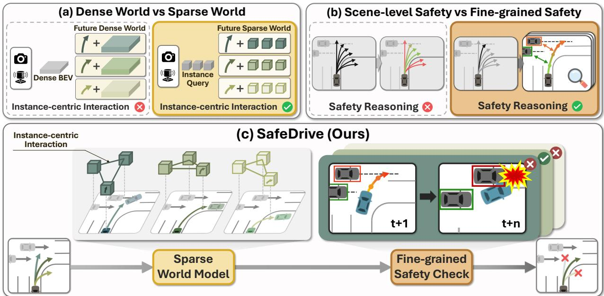
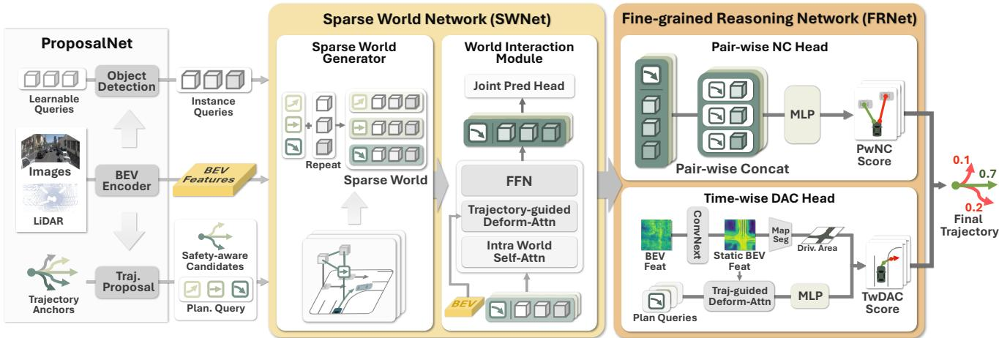
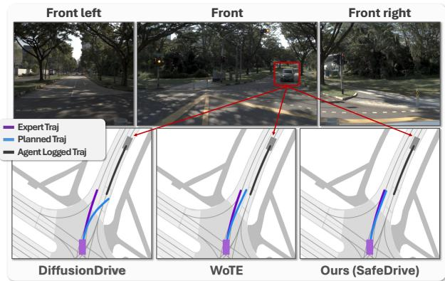
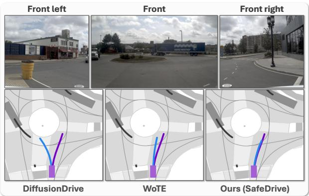
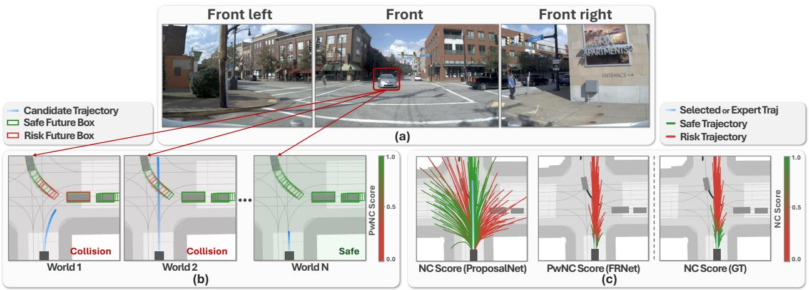

# SafeDrive: Fine-Grained Safety Reasoning for End-to-End Driving in a Sparse World

Jungho Kim Jiyong Oh Seunghoon Yu Hongjae Shin Donghyuk Kwak Jun Won Choi† Seoul National University, Republic of Korea

{jhkim, jyoh, shyu, hjshin, dhkwak}@adr.snu.ac.kr junwchoi@snu.ac.kr https://spa-junghokim.github.io/SafeDrive-Page/

  
Figure 1. Comparison of end-to-end planning paradigms and the SafeDrive framework. (a) Dense world models provide limited modeling of instance-centric interactions, whereas sparse world models capture them effectively. (b) Scene-level safety evaluation lacks agent- and timestep-level risk localization, whereas fine-grained evaluation identifies which agents are at risk and when. (c) SafeDrive integrates sparse world modeling with fine-grained safety reasoning, enabling the generation of safe and interaction-aware trajectories

## Abstract

The end-to-end (E2E) paradigm, which maps sensor inputs directly to driving decisions, has recently attracted significant attention due to its unified modeling capability and scalability. However, ensuring safety in this unified framework remains one of the most critical challenges. In this work, we propose SafeDrive, an E2E planning framework designed to perform explicit and interpretable safety reasoning through a trajectory-conditioned Sparse World Model. SafeDrive comprises two complementary networks: the Sparse World Network (SWNet) and the Fine-grained

Reasoning Network (FRNet). SWNet constructs trajectoryconditioned sparse worlds that simulate the future behaviors of critical dynamic agents and road entities, providing interaction-centric representations for downstream reasoning. FRNet then evaluates agent-specific collision risks and temporal adherence to drivable regions, enabling precise identification of safety-critical events across future timesteps. SafeDrive achieves state-of-the-art performance on both open-loop and closed-loop benchmarks. On NAVSIM, it records a PDMS of91.6 and an EPDMS of87.5, with only 61 collisions out of 12,146 scenarios (0.5%). On Bench2Drive, SafeDrive attains a 66.8% driving score.

## 1. Introduction

Autonomous driving ultimately places safety at its core, as even rare failures can lead to critical risks in real-world environments. Traditional modular pipelines, which execute perception, prediction, and planning in sequence, often suffer from error propagation between modules and may result in unsafe or inconsistent driving behaviors. To alleviate these issues, end-to-end (E2E) autonomous driving has emerged as a unified learning framework that directly maps sensor inputs to driving decisions. By integrating all components into a single model, E2E models reduce cross-module dependencies and improve robustness against accumulated errors, leading to more stable and reliable driving outcomes. This integration and scalability have further accelerated the adoption of imitation learning [2, 8, 11, 12, 29, 30, 34, 42], enabling models to learn expert driving behaviors from large-scale data. Nevertheless, imitation learning still faces fundamental limitations, as it primarily focuses on reproducing expert behaviors without explicitly reasoning about the underlying factors that lead to unsafe behaviors or potential risks.

To incorporate safety into end-to-end decision making, recent studies [1, 15, 21, 23, 40] have proposed trajectoryevaluation-based frameworks (see Figure 1 (b)). These methods quantitatively assess candidate trajectories in terms of collision risk, lane departure, and driving comfort, providing scene-level safety evaluations before selecting the final driving plan. While these approaches are effective for ensuring safety at a coarse level, their reasoning remains largely implicit. They evaluate safety by scoring entire trajectories based on global scene representations, without explicitly modeling why a trajectory is safe or under what specific conditions safety may be compromised. As a result, they overlook fine-grained safety, which requires explicit reasoning over surrounding agents, temporal dependencies, and localized risk dynamics. Due to this limitation, such models struggle to accurately distinguish trajectories that may lead to collisions when small deviations occur in complex interaction scenarios.

Another line of research [20, 31, 39, 43–45] explores world-model rollouts, which simulate the evolution of a scene in response to the ego vehicle’s future actions (see Figure 1 (a)). These approaches predict how the environment may unfold across multiple plausible futures, allowing autonomous systems to anticipate complex traffic situations and support safety-critical decision making. Beyond simple future prediction, world models simulate latent scene evolution to construct a coherent world representation for robust planning and reasoning. Previous methods implement this paradigm using dense spatial representations, such as occupancy-based [31, 39, 45] or BEV-based [20, 43] world models, to simulate scene evolution under various hypothetical scenarios. However, dense scene representations are often insufficient for capturing complex risk factors that emerge from dynamic interactions among agents. Since these representations describe the environment in a gridcentric manner, they lack explicit mechanisms to model the relational dynamics between the ego agent and potential risk factors, ultimately limiting their ability to perform safety-critical reasoning.

To address these challenges, we introduce a novel endto-end driving framework, referred to as SafeDrive. As illustrated in Figure 1 (c), SafeDrive distinguishes itself from existing end-to-end planning approaches by introducing a sparse world model designed for instance-level interaction and safety reasoning. To realize this design, we propose two primary modules: the Sparse World Network (SWNet) and the Fine-grained Reasoning Network (FRNet).

SWNet employs Sparse World Model that constructs ego-trajectory-conditioned sparse world representations to simulate plausible future state evolutions of a finite set of entities within a scene. Unlike previous world models that generate dense scene representations, our Sparse World Model focuses on key dynamic agents and essential road elements. This enables the model to predict the future behaviors of critical scene components and explicitly capture their interactive dynamics with the ego agent, conditioned on the ego’s motion. During simulation, the predicted motions of the ego and surrounding agents are jointly refined, ensuring mutual consistency between their behaviors. To model these pair-wise inter-agent interactions, we employ a self-attention mechanism that allows information exchange across all dynamic agents in the scene.

Using future states spanned by the Sparse World Model, FRNet can effectively assess the safety of a given ego trajectory plan. Most existing approaches estimate safety scores by encoding the ego trajectory together with the entire scene representation. While this holistic approach simplifies the formulation, it places the burden on the model to determine which aspects of the scene are relevant for safety evaluation, which could limit the accuracy. To overcome this limitation, we introduce a fine-grained safety reasoning that enables more precise and interpretable safety assessment.

To design this framework, we draw inspiration from how human drivers respond to potential future risks. When facing a risky situation, a human driver first identifies the relevant agents that could potentially lead to a collision and then evaluates which driving plan would be most appropriate based on the anticipated future behaviors of those agents. Motivated by this observation, we propose a collision assessment framework that estimates collision risk in a pair-wise manner between the ego agent and each dynamic agent in the scene. The model predicts the likelihood of contact for every agent at each future timestep, allowing it to reason precisely about when and how potential collisions may occur. By focusing the model’s role to evaluating pair-wise collision risks between interacting agents, our approach achieves a more accurate and rigorous safety analysis.

In parallel, we introduce a complementary safety reasoning module that evaluates temporal drivable area compliance. By leveraging road entities represented in the Sparse World Model, this module predicts the spatial and temporal points at which the ego agent may violate road boundaries or lane constraints. Together, these mechanisms enable FRNet to deliver detailed, interpretable, and temporally grounded safety assessments.

We evaluate SafeDrive on both the open-loop NAVSIM and the closed-loop Bench2Drive benchmarks. On the realworld NAVSIM dataset, SafeDrive achieves a PDMS of 91.6 and an EPDMS of 87.5, corresponding to only 61 collisions across 12,146 scenes (0.5%), establishing a new state of the art in safety-critical planning performance. In the closed-loop Bench2Drive simulation, SafeDrive attains a 66.8% driving score, demonstrating strong robustness and stability under interactive driving conditions that require real-world decision making.

The contributions of this study are summarized below:

• We present SafeDrive, an end-to-end planning framework that leverages a sparse world model to perform finegrained, instance-level safety reasoning for reliable driving decisions.

• We introduce SWNet, which constructs trajectoryconditioned sparse worlds and models the structural relationships among scene entities, serving as a foundation for interpretable instance-level safety reasoning.

• We propose FRNet that explicitly models pair-wise collision risks and time-wise lane adherence, enabling finegrained safety assessment grounded in instance-level interactions.

• Extensive evaluations on both open-loop (NAVSIM) and closed-loop (Bench2Drive) benchmarks verify the superior robustness and reliability of SafeDrive under diverse and safety-critical driving scenarios.

## 2. Related Works

## 2.1. End-to-End Planning

End-to-end autonomous driving mitigates error propagation in modular pipelines by integrating perception, prediction, and planning within a unified model. UniAD [8] established this paradigm with a query-based sequential transformer. Subsequent works improved efficiency and scalability through parallelized architectures [11, 34] and compact scene representations [12, 30]. To ensure safety under diverse real-world conditions, recent approaches incorporate trajectory evaluation mechanisms. Hydra-MDP [15, 21] incorporates rule-based safety criteria such as collision risk, lane departure, and comfort to guide trajectory selection. DriveSuprim [40] employs multi-stage scoring and data augmentation to improve generalization.

## 2.2. World Model for Autonomous Driving

World models in autonomous driving predict future states conditioned on the ego vehicle’s actions, enabling proactive reasoning about complex traffic situations. A prominent line of research leverages this capability to generate realistic future scenarios in video form [5, 7, 9, 18, 32, 33], supporting data augmentation and simulation-based validation. Beyond scene generation, recent approaches integrate predictive scene understanding directly into the planning process for safety-aware decision making [16, 19, 20, 26, 43, 45]. OccWorld [45] and DriveWorld [26] model actionconditioned scene evolution in a 4D occupancy space, providing temporally consistent geometry for end-to-end planning. LAW [19] and SSR [16] improve planning performance by self-supervising the evolution of latent future representations. WoTE [20] predicts future BEV states and utilizes them to enhance trajectory evaluation and safety assessment reliability.

## 3. Method

## 3.1. Overview

The overall architecture of SafeDrive is illustrated in Figure 2. SafeDrive consists of three core modules: Proposal-Net, SWNet, and FRNet. ProposalNet first preprocesses the input sensor data to generate the key components required for sparse world construction, namely object queries, BEV features, and planning queries. SWNet then constructs a Sparse World for each candidate trajectory, explicitly modeling the future motions of surrounding instances and their interactions with the ego vehicle in an instance-centric manner. Finally, FRNet performs fine-grained safety reasoning over these interaction-aware representations, precisely identifying potential collision risks and lane violations at the level of individual agents and timesteps.

## 3.2. ProposalNet

ProposalNet encodes multi-modal sensor inputs into a unified BEV feature map and detects surrounding instances in the scene. Leveraging these perceptual outputs, it evaluates the coarse safety and feasibility of trajectory anchors at the scene level and filters out unsafe or infeasible ones, producing a compact set of safety-aware trajectory candidates for constructing sparse worlds.

BEV Encoder. It generates spatio-temporal BEV features by processing multi-modal data captured by cameras and LiDAR sensors. Image features are extracted using a backbone network such as ResNet-34 [6], while LiDAR point clouds are encoded into BEV representations through voxel encoding [38]. Following BEVFormer-M [22], learnable BEV queries fuse the two modalities into a unified BEV map by attending to both image and LiDAR features. To encode temporal context, BEV features from previous timesteps are concatenated with the current feature and passed through convolutional layers to generate spatiotemporal BEV features $F _ { \mathrm { B E V } }$

  
Figure 2. Overall architecture of SafeDrive. ProposalNet evaluates the scene-level safety of anchor trajectories using BEV features and selects safety-aware candidates. SWNet constructs trajectory-conditioned Sparse Worlds by simulating the future behaviors of dynamic agents and road entities. FRNet performs fine-grained safety reasoning by estimating pair-wise No Collision scores and evaluating Time wise Drivable Area Compliance scores over time, enabling interpretable and temporally grounded safety assessment.

Object Detection. Learnable object queries extract instance-level representations from FBEV using deformable attention [22] and are decoded into instance queries. These instance queries are then used to estimate the centroids, headings, classification scores, and motion states of surrounding instances. Queries below a classification score threshold are discarded, and the remaining instance queries together with their predicted trajectories are passed to SWNet for sparse world construction.

Trajectory Candidate Generation. We define K trajectory anchors $\mathcal { A } = \{ A ^ { j } \} _ { j = } ^ { K }$ obtained via K-means clustering on ego trajectories from the training dataset. These anchors are embedded through an MLP to produce planning queries ${ \mathcal Q } _ { \mathrm { p l a n } } ~ = ~ \{ q _ { \mathrm { p l a n } } ^ { j } \} _ { j = 1 } ^ { K }$ , which are then encoded via trajectory-guided deformable attention that samples $F _ { \mathrm { B E V } }$ along each anchor trajectory:

$$
\hat { \mathcal { Q } } _ { \mathrm { p l a n } } = \mathrm { F F N } \big ( \mathrm { D e f o r m  – A t t n } _ { \mathrm { t r a j } } ( \mathcal { Q } _ { \mathrm { p l a n } } , \mathcal { A } , F _ { \mathrm { B E V } } ) \big ) .\tag{1}
$$

The resulting queries are decoded through MLP heads to predict refined trajectories, an imitation score, and scenelevel safety scores across five criteria: no at-fault collision (NC), drivable area compliance (DAC), time-to-collision (TTC), comfort (C), and ego progress (EP). A weighted log-sum of these terms is used to select the $\mathrm { t o p } { - } K ^ { \prime }$ safetyaware planning queries and their corresponding trajectories for downstream sparse world construction.

## 3.3. Sparse World Network (SWNet)

SWNet consists of two components: the Sparse World Generator and the World Interaction Module. The Sparse World Generator constructs a Sparse World for each safetyaware planning query by combining it with the surrounding instances. The World Interaction Module then models trajectory-conditioned interactions between the ego vehicle and surrounding instances, jointly refining their future motions within the same world.

Sparse World Generator. For each of the $K ^ { \prime }$ safetyaware planning queries, we construct a Sparse World by replicating the instance queries and their trajectories $K ^ { \prime }$ times and concatenating each copy with the corresponding planning query. The resulting $K ^ { \prime }$ independent Sparse Worlds W are each composed of a single planning query and all surrounding instance queries.

World Interaction Module. The World Interaction Module enhances each Sparse World by modeling instancecentric interactions between the ego trajectory and surrounding instances. It first applies intra-world self-attention to model the relational dependencies among all queries within each world, and then performs trajectory-guided deformable attention to aggregate spatio-temporal features from $F _ { \mathrm { B E V } }$ along the predicted future trajectories $\mathcal { T } _ { \mathrm { w o r l d } }$ of

all entities in the world:

$$
\begin{array} { r l } & { \hat { \mathcal { W } } = \mathrm { W o r l d - S e l f A t t n } ( \mathcal { W } ) , } \\ & { \hat { \mathcal { W } } = \mathrm { F F N } \big ( \mathrm { D e f o r m - A t t n _ { t r a j } } ( \bar { \mathcal { W } } , \mathcal { T } _ { \mathrm { w o r l d } } , F _ { \mathrm { B E V } } \big ) \big ) . } \end{array}\tag{2}
$$

By jointly predicting the future motions of the ego vehicle and surrounding instances within each world, the module captures how each instance dynamically interacts with the ego’s planned motion, ensuring mutual consistency between their behaviors.

## 3.4. Fine-grained Reasoning Network (FRNet)

FRNet determines the final driving trajectory through finegrained safety assessment over the interaction-aware representations from SWNet. Specifically, it computes two complementary safety metrics for each candidate: Pair-wise No Collision (PwNC) and Time-wise Drivable Area Compliance (TwDAC).

(i) Pair-wise No Collision. PwNC evaluates the ego vehicle’s interaction safety with each surrounding instance by estimating the probability of maintaining safe and nonconflicting motion patterns over future timesteps. Each planning query is paired with every instance query in the same world via concatenation, and the resulting pair-wise features are passed through an MLP head with sigmoid activation to predict the collision-free probability $p _ { \mathrm { p w n c } } ^ { i , j } \in$ $[ 0 , 1 ] ^ { H }$ between the j-th planned trajectory and the i-th surrounding instance over future horizon H. The overall PwNC score $P _ { \mathrm { P w N C } } ^ { j }$ is then obtained by multiplying across all N surrounding instances and timesteps:

$$
P _ { \mathrm { P w N C } } ^ { j } = \prod _ { i = 1 } ^ { N } \prod _ { h = 1 } ^ { H } p _ { \mathrm { p w n c } } ^ { i , j } ( h ) .\tag{3}
$$

(ii) Time-wise Drivable Area Compliance. TwDAC evaluates whether each candidate trajectory stays within drivable regions over time. Since $F _ { \mathrm { B E V } }$ contains both dynamic and static information, we extract static spatial priors $F _ { \mathrm { B E V } } ^ { \mathrm { s t a t i c } }$ for drivable-area reasoning by applying a ConvNeXtv2 [35] block with a lightweight segmentation head that predicts static map elements such as drivable areas and lane centerlines. Trajectory-guided deformable attention is then applied over FstaticBEV BEV using refined future positions as reference points, and TwDAC scores $p _ { \mathrm { t w d a c } } ^ { j } \in [ 0 , 1 ] ^ { H }$ of the j-th planned trajectory over horizon H are predicted via an MLP head with sigmoid activation.

However, the learned scores alone may lack precision near drivable-area boundaries. To mitigate this issue, we sample the drivable-area probability map $M _ { \mathrm { D r i v } }$ from the predicted BEV segmentation map at nine key points of each future ego box (center, corners, and edge midpoints). The final TwDAC score of the j-th planning query is computed by multiplying all sampled probabilities across timesteps and sampled points:

$$
P _ { \mathrm { T w D A C } } ^ { j } = \prod _ { h = 1 } ^ { H } \left( p _ { \mathrm { t w d a c } } ^ { j } ( h ) \times \prod _ { k = 1 } ^ { 9 } M _ { \mathrm { D r i v } } ^ { j } ( h , k ) \right) ,\tag{4}
$$

where $M _ { \mathrm { D r i v } } ^ { j } ( h , k )$ is the drivable-area probability sampled via bilinear interpolation at the k-th key point of the j-th ego box at timestep h.

(iii) Safety Integration and Trajectory Selection. To determine the final driving plan, FRNet integrates the finegrained safety metrics with the scene-level evaluations of each candidate trajectory to produce a unified safety assessment. Given the refined planning queries from SWNet, we predict planning-related terms such as imitation score, EP, C, and TTC through lightweight MLP heads. These estimates are combined with PwNC and TwDAC via a weighted log-sum in the log-probability space to obtain an overall safety score for each candidate. The trajectory with the highest score is then selected as the final driving plan.

## 3.5. Loss Function

The overall training loss of SafeDrive is defined as a weighted sum of task-specific objectives:

$$
\begin{array} { r l } & { \mathcal { L } _ { \mathrm { t o t a l } } = \lambda _ { 1 } \mathcal { L } _ { \mathrm { d e t - m o t i o n } } + \lambda _ { 2 } \mathcal { L } _ { \mathrm { s e g } } + \lambda _ { 3 } \mathcal { L } _ { \mathrm { p l a n } } } \\ & { ~ + \lambda _ { 4 } \mathcal { L } _ { \mathrm { P w N C } } + \lambda _ { 5 } \mathcal { L } _ { \mathrm { T w D A C } } + \lambda _ { 6 } \mathcal { L } _ { \mathrm { S L - s a f e t y } } , } \end{array}\tag{5}
$$

where each coefficient $\lambda _ { i }$ adjusts the relative contribution of its corresponding component. $\mathcal { L } _ { \mathrm { d e t - m o t i o n } }$ supervises detection, classification, and motion prediction of surrounding instances. $\mathcal { L } _ { \mathrm { s e g } }$ is used for BEV segmentation of static map elements such as drivable areas and lane centerlines. $\mathcal { L } _ { \mathrm { p l a n } }$ is applied to trajectory refinement and imitation score prediction based on expert driving behaviors. $\mathcal { L } _ { \mathrm { P w N C } }$ and LTwDAC supervise FRNet’s estimation of the fine-grained safety scores. Finally, ${ \mathcal { L } } _ { \mathrm { S L - s a f e t y } }$ covers the scene-level safety terms in ProposalNet and SWNet, including NC, DAC, EP, C, and TTC.

## 4. Experiments

## 4.1. Dataset & Metrics

To comprehensively evaluate our method, we conducted both open-loop and closed-loop evaluations using two benchmarks.

NAVSIM (Open-loop Evaluation). NAVSIM [4] is a real-world, planning-oriented benchmark built upon Open-Scene [3], a compact redistribution of nuPlan [13], focusing on complex intention-changing scenarios while excluding trivial stationary ones. The dataset provides 360° perception from eight cameras and five LiDARs with 2 Hz annotations that include HD maps and bounding boxes. We trained and evaluated our model on the official navtrain (103k) and navtest (12k) splits. For evaluation, NAVSIM adopts closed-loop-derived metrics to assess open-loop safety and fidelity: the PDM Score (PDMS) and its extended version (EPDMS). The PDMS integrates five criteria (NC, DAC, TTC, EP, and C), and EPDMS additionally includes Driving Direction Compliance (DDC), Traffic Light Compliance (TLC), Lane Keeping (LK), History Comfort (HC), and Extended Comfort (EC).

Table 1. Evaluation of PDMS performance on the NAVSIM dataset. "C" and "L" denote Camera and LiDAR inputs, respectively. The best and second-best results are highlighted in bold and underline, respectively. Unless noted, models use ResNet-34 as the image backbone, and "†" marks the one using V2-99. The "-" denotes that the associated results are not available.
<table><tr><td>Method</td><td>Venue</td><td>Input</td><td>NC</td><td>DAC</td><td>TTC</td><td>EP</td><td>Comfort</td><td>PDMS</td></tr><tr><td>Human</td><td>一</td><td>一</td><td>100.0</td><td>100.0</td><td>100.0</td><td>87.5</td><td>99.9</td><td>94.8</td></tr><tr><td>UniAD [8]</td><td>CVPR 2023</td><td>C</td><td>97.8</td><td>91.9</td><td>92.9</td><td>78.8</td><td>100</td><td>83.4</td></tr><tr><td>Transfuser [27]</td><td>CVPR 2021</td><td>C&amp;L</td><td>97.7</td><td>92.8</td><td>92.8</td><td>79.2</td><td>100</td><td>84.0</td></tr><tr><td>PARA-Drive [34]</td><td>CVPR 2024</td><td>C</td><td>97.9</td><td>92.4</td><td>93.0</td><td>79.3</td><td>99.8</td><td>84.0</td></tr><tr><td>LAW [19]</td><td>ICLR 2025</td><td>C</td><td>96.4</td><td>95.4</td><td>88.7</td><td>81.7</td><td>99.9</td><td>84.6</td></tr><tr><td>DistillDrive [41]</td><td>ICCV 2025</td><td>C&amp;L</td><td>98.1</td><td>94.6</td><td>93.6</td><td>81.0</td><td>100</td><td>86.2</td></tr><tr><td>Hydra-MDP [21]</td><td>arXiv 2024</td><td>C&amp;L</td><td>98.3</td><td>96.0</td><td>94.6</td><td>78.7</td><td>100</td><td>86.5</td></tr><tr><td>DiffusionDrive [24]</td><td>CVPR 2025</td><td>C&amp;L</td><td>98.2</td><td>96.2</td><td>94.7</td><td>82.2</td><td>100</td><td>88.1</td></tr><tr><td>WoTE [20]</td><td>ICCV 2025</td><td>C&amp;L</td><td>98.5</td><td>96.8</td><td>94.9</td><td>81.9</td><td>99.9</td><td>88.3</td></tr><tr><td>GaussianFusion [25]</td><td>NeurIPS 2025</td><td>C&amp;L</td><td>98.3</td><td>97.2</td><td>94.6</td><td>83.0</td><td></td><td>88.8</td></tr><tr><td>SeerDrive [43]</td><td>NeurIPS 2025</td><td>C&amp;L C&amp;L</td><td>98.4</td><td>97.0</td><td>94.9</td><td>83.2</td><td>99.9</td><td>88.9</td></tr><tr><td>GoalFlow† [37]</td><td>CVPR 2025</td><td></td><td>98.4</td><td>98.3</td><td>94.6</td><td>85.0</td><td>100</td><td>90.3</td></tr><tr><td>SafeDrive (Ours)</td><td></td><td>C&amp;L</td><td>99.5</td><td>99.0</td><td>97.2</td><td>84.3</td><td>100</td><td>91.6</td></tr></table>

Table 2. Evaluation of EPDMS performance on the NAVSIM dataset. "C" and "L" denote Camera and LiDAR inputs, respectively. All methods use a ResNet-34 backbone for a fair comparison. Methods marked with "\*" are reproduced from released checkpoints.
<table><tr><td>Method</td><td>Venue</td><td>Input</td><td>NC</td><td>DAC</td><td>DDC</td><td>TLC</td><td>EP</td><td>TTC</td><td>LK</td><td>HC</td><td>EC</td><td>EPDMS</td></tr><tr><td>Hydra-MDP++ [15]</td><td>arXiv 2025</td><td>C</td><td>97.2</td><td>97.5</td><td>99.4</td><td>99.6</td><td>83.1</td><td>96.5</td><td>94.4</td><td>98.2</td><td>70.9</td><td>81.4</td></tr><tr><td>DriveSuprim [40]</td><td>arXiv 2025</td><td>C</td><td>97.5</td><td>96.5</td><td>99.4</td><td>99.6</td><td>88.4</td><td>96.6</td><td>95.5</td><td>98.3</td><td>77.0</td><td>83.1</td></tr><tr><td>WoTE* [20]</td><td>ICCV 2025</td><td>C&amp;L</td><td>98.5</td><td>96.8</td><td>98.8</td><td>99.8</td><td>86.0</td><td>97.9</td><td>95.4</td><td>98.3</td><td>83.0</td><td>84.1</td></tr><tr><td>DiffusionDrive* [24]</td><td>CVPR 2025</td><td>C&amp;L</td><td>98.2</td><td>96.2</td><td>99.5</td><td>99.8</td><td>87.4</td><td>97.4</td><td>97.0</td><td>98.3</td><td>87.8</td><td>84.8</td></tr><tr><td>GaussianFusion [25]</td><td>NeurIPS 2025</td><td>C&amp;L</td><td>98.3</td><td>97.3</td><td>99.0</td><td>97.4</td><td>87.5</td><td>97.4</td><td>97.4</td><td>98.3</td><td></td><td>85.0</td></tr><tr><td>SafeDrive (Ours)</td><td>■</td><td>C&amp;L</td><td>99.5</td><td>99.0</td><td>99.7</td><td>99.9</td><td>88.6</td><td>98.9</td><td>97.5</td><td>98.2</td><td>81.9</td><td>87.5</td></tr></table>

Bench2Drive (Closed-loop Evaluation). Bench2Drive [10] is a CARLA-based benchmark containing 220 safetycritical driving routes across all towns. The dataset is collected from the expert model Think2Drive [17], comprising 1,000 clips (950 for training and 50 for validation). It evaluates closed-loop performance using two key metrics: Driving Score and Success Rate. Details of the NAVSIM and Bench2Drive metrics are provided in the Appendix.

## 4.2. Implementation Details

SafeDrive employs ResNet-34 [6] as the image backbone and SECOND [38] as the LiDAR backbone, and adopts BEVFormer-M [22] as the BEV encoder. This design choice prioritizes high-quality detection and BEV segmentation performance essential for fine-grained safety reasoning, where BEVFormer-M outperforms the Transfuser [27] backbone on these tasks. The number of camera views is 3 for NAVSIM and 4 for Bench2Drive, with image resolutions of 256×512 and 576×1024, respectively. The number of trajectory anchors K is initialized to 256, and the number of candidate trajectories $K ^ { \prime }$ is 128. ProposalNet and SWNet consist of two and four decoding layers, respectively. The planning horizon is 4 seconds (8 future steps) for NAVSIM and 3 seconds (6 steps) for Bench2Drive. For both benchmarks, the model was first pretrained on object detection and BEV segmentation, followed by full end-to-end training.

We used four H100 80GB GPUs, with a batch size of 32 per GPU for perception pretraining and 16 for full-model training. Perception pretraining was conducted for 60 epochs on NAVSIM [4] and 20 epochs on Bench2Drive [10], followed by 15 epochs of end-to-end fine-tuning, using the Adam [14] optimizer with a cosine learning rate schedule and warmup. Additional training details are provided in the Appendix.

Table 3. Closed-loop Results on Bench2Drive Benchmark.
<table><tr><td>Method</td><td>Venue</td><td>DS</td><td>SR(%)</td></tr><tr><td>TCP [36] VAD [12] UniAD-Base [8] BridgeAD [42] Hydra-MDP [21] WoTE [20]</td><td>NeurIPS 2022 ICCV 2023 CVPR 2023 CVPR 2025 arXiv 2024</td><td>40.70 42.35 45.81 50.06 59.95 61.71</td><td>15.00 15.00 16.36 22.73 29.82</td></tr><tr><td>DriveDPO [28]</td><td>ICCV 2025 NeurIPS 2025 ■</td><td>62.02 66.77</td><td>31.36 30.62 42.40</td></tr><tr><td>DriveTransformer [11] SafeDrive (Ours)</td><td>ICLR 2025</td><td>63.46</td><td>35.01</td></tr></table>

## 4.3. Performance Comparison

Results on NAVSIM. Table 1 summarizes the performance of SafeDrive on the NAVSIM test benchmark using the PDMS metric. SafeDrive significantly outperforms previous state-of-the-art methods [8, 19–21, 24, 25, 27, 34, 37, 41], achieving a SOTA performance with a PDMS of 91.6. Notably, its fine-grained safety reasoning yields an NC score of 99.5, corresponding to only 61 collisions out of 12,146 test cases, and a DAC score of 99.0, indicating high adherence to drivable-area constraints. SafeDrive also achieves the highest overall performance on the extended evaluation, with an EPDMS of 87.5 (Table 2).

Results on Bench2Drive. Table 3 presents the closedloop evaluation results of several end-to-end autonomous driving methods [8, 11, 12, 20, 21, 28, 36, 42] on the Bench2Drive benchmark. The proposed SafeDrive achieves state-of-the-art performance among all compared methods. SafeDrive surpasses the previous state-of-the-art model, DriveTransformer [11], by 3.31 points in Driving Score, demonstrating that our model achieves consistent and robust driving performance across diverse scenarios.

## 4.4. Ablation Study

Contribution of Main Components. In our investigation detailed in Table 4, we explored the contribution of each SafeDrive component. Due to the effects of the proposed trajectory-guided deformable attention, replacing the DiffusionDrive [24] head with ProposalNet yields a 0.5 PDMS improvement. Introducing scene-level safety on top of this results in an additional gain of 1.0 PDMS. Adding SWNet and FRNet yields performance gains of 0.8 each. Finally, adding both SWNet and FRNet yields an additional 0.7 gain, showing that sparse-world instance-level interactions are essential for fine-grained safety reasoning and safe driving behavior.

Table 4. Ablation study for evaluating the main components. "Diff" denotes the DiffusionDrive [24] head, "Prop" indicates the ProposalNet, and "SL Eval" refers to the scene-level safety evaluation.
<table><tr><td colspan="6">Diff Prop SL Eval SWNet FRNet | NC DAC</td></tr><tr><td>√</td><td></td><td></td><td>98.8</td><td>96.3 95.8</td><td>82.3</td><td>88.6</td></tr><tr><td>√</td><td></td><td></td><td>98.9</td><td>95.1</td><td>83.2</td><td>89.1</td></tr><tr><td>√</td><td>√</td><td></td><td>97.1 99.0 97.7</td><td>96.3</td><td>83.5</td><td>90.1</td></tr><tr><td>√</td><td>√</td><td></td><td>99.2 98.2</td><td>96.7</td><td>84.4</td><td>90.9</td></tr><tr><td>√</td><td>√</td><td>√</td><td>99.2 98.5</td><td>96.0</td><td>84.6</td><td>90.9</td></tr><tr><td>√</td><td>了</td><td>√</td><td>99.5 99.0</td><td>97.2</td><td>84.3</td><td>91.6</td></tr></table>

Table 5. Ablation study on world representation. "S" and "F" denote scene-level and fine-grained safety, respectively.
<table><tr><td>World Representation</td><td>Safety</td><td>NC DAC TTC</td><td>PDMS</td></tr><tr><td>No</td><td>=</td><td>|99.0 97.7 96.3</td><td>90.1</td></tr><tr><td>BEV</td><td>1</td><td>98.8 98.0 95.5</td><td>90.3</td></tr><tr><td>BEV</td><td>S</td><td>99.2 98.3 96.5</td><td>90.9</td></tr><tr><td>Sparse</td><td>S</td><td>99.2 98.2</td><td>96.7 90.9</td></tr><tr><td>Sparse</td><td>S+F</td><td>99.5 99.0</td><td>97.2 91.6</td></tr></table>

Table 6. Ablation study on the impact of PwNC and TwDAC.
<table><tr><td>PwNC</td><td>TwDAC</td><td>NC</td><td>DAC</td><td>TTC</td><td>PDMS</td></tr><tr><td rowspan="3">L</td><td></td><td>99.2</td><td>98.5</td><td>96.0</td><td>90.9</td></tr><tr><td></td><td>99.5</td><td>98.7</td><td>97.3</td><td>91.5</td></tr><tr><td>√</td><td>99.2</td><td>99.0</td><td>96.7</td><td>91.4</td></tr><tr><td></td><td>√</td><td>99.5</td><td>99.0</td><td>97.2</td><td>91.6</td></tr></table>

Effect of the World Representation. Table 5 presents the performance of different world-model representations when safety evaluation is applied. Since BEV lacks instance-level awareness, it fails to benefit from fine-grained safety reasoning, whereas Sparse World supports such checks and yields an additional 0.7 PDMS gain.

Impact of Fine-Grained Safety Reasoning. Table 6 presents the experimental results of using PwNC and TwDAC scores within FRNet. PwNC and TwDAC individually provide 0.6 and 0.5 performance improvements, respectively, and using them together yields a 0.7 improvement.

Figure 3. Qualitative comparison with other SOTA models on the NAVSIM test set. The expert trajectory (GT) is shown in purple, the predicted trajectories of each model are shown in blue, and the log-replayed future trajectories of surrounding agents are shown in black.  
  
Figure 4. Visualization of the PwNC-based reasoning process. (a) Current scene images. (b) Predicted PwNC values overlaid on future positions of surrounding vehicles (green: safe, red: risky). (c) Candidate trajectory scoring by ProposalNet (NC), FRNet (PwNC), and GT (NC).

## 4.5. Qualitative Results

Qualitative results compared with SOTA models. Figure 3 illustrates the qualitative results generated by the proposed SafeDrive. We compare our method with other competitive methods [20, 24], and SafeDrive generates trajectories of higher fidelity compared to other models.

Qualitative analysis of the reasoning process for PwNC. Figure 4 illustrates the fine-grained reasoning process of SafeDrive using PwNC. As shown in Figure 4 (b), the trajectory assigned the highest score by ProposalNet results in a collision, revealing the limitation of scene-level safety evaluation. In contrast, FRNet leverages the predicted collision likelihood and timing (PwNC) to identify the risk and select a safe alternative trajectory through fine-grained reasoning. These visualizations demonstrate that SafeDrive enables interpretable and safety-oriented decision making beyond what scene-level evaluation can achieve.

## 5. Conclusion

Safety in end-to-end autonomous driving has largely relied on coarse, scene-level evaluations that fail to reason about when, where, and with whom a collision may occur. In this paper, we presented SafeDrive, which addresses this gap through sparse world modeling and fine-grained safety reasoning at the level of individual agents and timesteps. Our key insight is that explicit instance-level interaction modeling, rather than holistic scene encoding, is essential for identifying safety-critical events with the precision required for reliable autonomous driving. Extensive experiments on NAVSIM and Bench2Drive validate this claim, demonstrating that fine-grained reasoning over sparse world representations leads to substantial gains in both collision avoidance and drivable-area compliance. Nevertheless, PwNC and TwDAC remain proxy measures derived from model predictions rather than formal safety guarantees, and closing this gap represents a future direction.

## Acknowledgments

This work was supported by Institute of Information & communications Technology Planning & Evaluation (IITP) grant funded by the Korea government(MSIT) [NO.RS-2021-II211343, Artificial Intelligence Graduate School Program (Seoul National University)], the Technology Innovation Program (RS-2025-25448249, E2E Autonomous Driving Reference Data Construction and Core Technology Development) funded By the Ministry of Trade, Industry & Resources (MOTIR, Korea), and the National Research Foundation (NRF) funded by the Korean government (MSIT) (No. RS-2024-00421129).

## References

[1] Shaoyu Chen, Bo Jiang, Hao Gao, Bencheng Liao, Qing Xu, Qian Zhang, Chang Huang, Wenyu Liu, and Xinggang Wang. Vadv2: End-to-end vectorized autonomous driving via probabilistic planning. arXiv preprint arXiv:2402.13243, 2024.

[2] Zhili Chen, Maosheng Ye, Shuangjie Xu, Tongyi Cao, and Qifeng Chen. Ppad: Iterative interactions of prediction and planning for end-to-end autonomous driving. In European Conference on Computer Vision, pages 239–256. Springer, 2024.

[3] OpenScene Contributors. Openscene: The largest up-todate 3d occupancy prediction benchmark in autonomous driving. https://github.com/OpenDriveLab/ OpenScene, 2023.

[4] Daniel Dauner, Marcel Hallgarten, Tianyu Li, Xinshuo Weng, Zhiyu Huang, Zetong Yang, Hongyang Li, Igor Gilitschenski, Boris Ivanovic, Marco Pavone, et al. Navsim: Data-driven non-reactive autonomous vehicle simulation and benchmarking. Advances in Neural Information Processing Systems, 37:28706–28719, 2024.

[5] Shenyuan Gao, Jiazhi Yang, Li Chen, Kashyap Chitta, Yihang Qiu, Andreas Geiger, Jun Zhang, and Hongyang Li. Vista: A generalizable driving world model with high fidelity and versatile controllability. Advances in Neural Information Processing Systems, 37:91560–91596, 2024.

[6] Kaiming He, Xiangyu Zhang, Shaoqing Ren, and Jian Sun. Deep residual learning for image recognition. In Proceedings of the IEEE Conference on Computer Vision and Pattern Recognition, pages 770–778, 2016.

[7] Anthony Hu, Lloyd Russell, Hudson Yeo, Zak Murez, George Fedoseev, Alex Kendall, Jamie Shotton, and Gianluca Corrado. Gaia-1: A generative world model for autonomous driving. arXiv preprint arXiv:2309.17080, 2023.

[8] Yihan Hu, Jiazhi Yang, Li Chen, Keyu Li, Chonghao Sima, Xizhou Zhu, Siqi Chai, Senyao Du, Tianwei Lin, Wenhai Wang, et al. Planning-oriented autonomous driving. In Proceedings of the IEEE/CVF Conference on Computer Vision and Pattern Recognition, pages 17853–17862, 2023.

[9] Fan Jia, Weixin Mao, Yingfei Liu, Yucheng Zhao, Yuqing Wen, Chi Zhang, Xiangyu Zhang, and Tiancai Wang. Adriver-i: A general world model for autonomous driving. arXiv preprint arXiv:2311.13549, 2023.

[10] Xiaosong Jia, Zhenjie Yang, Qifeng Li, Zhiyuan Zhang, and Junchi Yan. Bench2drive: Towards multi-ability bench marking of closed-loop end-to-end autonomous driving. Advances in Neural Information Processing Systems, 37:819– 844, 2024.

[11] Xiaosong Jia, Junqi You, Zhiyuan Zhang, and Junchi Yan. Drivetransformer: Unified transformer for scalable end-toend autonomous driving. arXiv preprint arXiv:2503.07656, 2025.

[12] Bo Jiang, Shaoyu Chen, Qing Xu, Bencheng Liao, Jiajie Chen, Helong Zhou, Qian Zhang, Wenyu Liu, Chang Huang, and Xinggang Wang. Vad: Vectorized scene representa tion for efficient autonomous driving. In Proceedings of the IEEE/CVF International Conference on Computer Vision, pages 8340–8350, 2023.

[13] Napat Karnchanachari, Dimitris Geromichalos, Kok Seang Tan, Nanxiang Li, Christopher Eriksen, Shakiba Yaghoubi, Noushin Mehdipour, Gianmarco Bernasconi, Whye Kit Fong, Yiluan Guo, et al. Towards learning-based planning: The nuplan benchmark for real-world autonomous driving. In 2024 IEEE International Conference on Robotics and Au tomation (ICRA), pages 629–636. IEEE, 2024.

[14] Diederik P. Kingma and Jimmy Ba. Adam: A method for stochastic optimization. In International Conference on Learning Representations, 2015.

[15] Kailin Li, Zhenxin Li, Shiyi Lan, Yuan Xie, Zhizhong Zhang, Jiayi Liu, Zuxuan Wu, Zhiding Yu, and Jose M Alvarez. Hydra-mdp++: Advancing end-to-end driving via expert-guided hydra-distillation. arXiv preprint arXiv:2503.12820, 2025.

[16] Peidong Li and Dixiao Cui. Navigation-guided sparse scene representation for end-to-end autonomous driving. In The Thirteenth International Conference on Learning Represen tations, 2025.

[17] Qifeng Li, Xiaosong Jia, Shaobo Wang, and Junchi Yan. Think2drive: Efficient reinforcement learning by thinking with latent world model for autonomous driving (in carla v2). In European Conference on Computer Vision, pages 142–158. Springer, 2024.

[18] Xiaofan Li, Yifu Zhang, and Xiaoqing Ye. Drivingdiffusion: layout-guided multi-view driving scenarios video generation with latent diffusion model. In European Conference on Computer Vision, pages 469–485. Springer, 2024.

[19] Yingyan Li, Lue Fan, Jiawei He, Yuqi Wang, Yuntao Chen, Zhaoxiang Zhang, and Tieniu Tan. Enhancing end-to-end autonomous driving with latent world model. In The Thirteenth International Conference on Learning Representa tions, 2025.

[20] Yingyan Li, Yuqi Wang, Yang Liu, Jiawei He, Lue Fan, and Zhaoxiang Zhang. End-to-end driving with online trajectory evaluation via bev world model. arXiv preprint arXiv:2504.01941, 2025.

[21] Zhenxin Li, Kailin Li, Shihao Wang, Shiyi Lan, Zhiding Yu, Yishen Ji, Zhiqi Li, Ziyue Zhu, Jan Kautz, Zuxuan Wu, et al. Hydra-mdp: End-to-end multimodal planning with multitarget hydra-distillation. arXiv preprint arXiv:2406.06978, 2024.

[22] Zhiqi Li, Wenhai Wang, Hongyang Li, Enze Xie, Chonghao Sima, Tong Lu, Qiao Yu, and Jifeng Dai. Bevformer: learning bird’s-eye-view representation from lidar-camera via spatiotemporal transformers. IEEE Transactions on Pattern Analysis and Machine Intelligence, 2024.

[23] Zhenxin Li, Wenhao Yao, Zi Wang, Xinglong Sun, Joshua Chen, Nadine Chang, Maying Shen, Zuxuan Wu, Shiyi Lan, and Jose M Alvarez. Generalized trajectory scoring for end-to-end multimodal planning. arXiv preprint arXiv:2506.06664, 2025.

[24] Bencheng Liao, Shaoyu Chen, Haoran Yin, Bo Jiang, Cheng Wang, Sixu Yan, Xinbang Zhang, Xiangyu Li, Ying Zhang, Qian Zhang, et al. Diffusiondrive: Truncated diffusion model for end-to-end autonomous driving. In Proceedings of the IEEE/CVF Conference on Computer Vision and Pattern Recognition, pages 12037–12047, 2025.

[25] Shuai Liu, Quanmin Liang, Zefeng Li, Boyang Li, and Kai Huang. Gaussianfusion: Gaussian-based multi-sensor fusion for end-to-end autonomous driving. In The Thirty-ninth Annual Conference on Neural Information Processing Systems, 2025.

[26] Chen Min, Dawei Zhao, Liang Xiao, Jian Zhao, Xinli Xu, Zheng Zhu, Lei Jin, Jianshu Li, Yulan Guo, Junliang Xing, et al. Driveworld: 4d pre-trained scene understanding via world models for autonomous driving. In Proceedings of the IEEE/CVF Conference on Computer Vision and Pattern Recognition, pages 15522–15533, 2024.

[27] Aditya Prakash, Kashyap Chitta, and Andreas Geiger. Multimodal fusion transformer for end-to-end autonomous driving. In Proceedings of the IEEE/CVF Conference on Computer Vision and Pattern Recognition, pages 7077–7087, 2021.

[28] ShuYao Shang, Yuntao Chen, Yuqi Wang, Yingyan Li, and Zhaoxiang Zhang. Drivedpo: Policy learning via safety dpo for end-to-end autonomous driving. In The Thirty-ninth Annual Conference on Neural Information Processing Systems, 2025.

[29] Ziying Song, Caiyan Jia, Lin Liu, Hongyu Pan, Yongchang Zhang, Junming Wang, Xingyu Zhang, Shaoqing Xu, Lei Yang, and Yadan Luo. Don’t shake the wheel: Momentumaware planning in end-to-end autonomous driving. In Proceedings of the IEEE/CVF Conference on Computer Vision and Pattern Recognition, pages 22432–22441, 2025.

[30] Wenchao Sun, Xuewu Lin, Yining Shi, Chuang Zhang, Haoran Wu, and Sifa Zheng. Sparsedrive: End-to-end autonomous driving via sparse scene representation. In 2025 IEEE International Conference on Robotics and Automation (ICRA), pages 8795–8801. IEEE, 2025.

[31] Lening Wang, Wenzhao Zheng, Yilong Ren, Han Jiang, Zhiyong Cui, Haiyang Yu, and Jiwen Lu. Occsora: 4d occupancy generation models as world simulators for autonomous driving. arXiv preprint arXiv:2405.20337, 2024.

[32] Xiaofeng Wang, Zheng Zhu, Guan Huang, Xinze Chen, Jiagang Zhu, and Jiwen Lu. Drivedreamer: Towards real-worlddriven world models for autonomous driving. In European Conference on Computer Vision, pages 55–72. Springer, 2024.

[33] Yuqi Wang, Jiawei He, Lue Fan, Hongxin Li, Yuntao Chen, and Zhaoxiang Zhang. Driving into the future: Multiview visual forecasting and planning with world model for au tonomous driving. In Proceedings of the IEEE/CVF Con ference on Computer Vision and Pattern Recognition, pages 14749–14759, 2024.

[34] Xinshuo Weng, Boris Ivanovic, Yan Wang, Yue Wang, and Marco Pavone. Para-drive: Parallelized architecture for realtime autonomous driving. In Proceedings of the IEEE/CVF Conference on Computer Vision and Pattern Recognition, pages 15449–15458, 2024.

[35] Sanghyun Woo, Shoubhik Debnath, Ronghang Hu, Xinle Chen, Zhuang Liu, In So Kweon, and Saining Xie. Convnext v2: Co-designing and scaling convnets with masked autoencoders. In Proceedings of the IEEE/CVF Conference on Computer Vision and Pattern Recognition, pages 16133– 16142, 2023.

[36] Penghao Wu, Xiaosong Jia, Li Chen, Junchi Yan, Hongyang Li, and Yu Qiao. Trajectory-guided control prediction for end-to-end autonomous driving: A simple yet strong baseline. Advances in Neural Information Processing Systems, 35:6119–6132, 2022.

[37] Zebin Xing, Xingyu Zhang, Yang Hu, Bo Jiang, Tong He, Qian Zhang, Xiaoxiao Long, and Wei Yin. Goalflow: Goal driven flow matching for multimodal trajectories generation in end-to-end autonomous driving. In Proceedings of the IEEE/CVF Conference on Computer Vision and Pattern Recognition, pages 1602–1611, 2025.

[38] Yan Yan, Yuxing Mao, and Bo Li. Second: Sparsely embed ded convolutional detection. Sensors, 18(10):3337, 2018.

[39] Yu Yang, Jianbiao Mei, Yukai Ma, Siliang Du, Wenqing Chen, Yijie Qian, Yuxiang Feng, and Yong Liu. Driving in the occupancy world: Vision-centric 4d occupancy forecasting and planning via world models for autonomous driving. In Proceedings of the AAAI Conference on Artificial Intelli gence, pages 9327–9335, 2025.

[40] Wenhao Yao, Zhenxin Li, Shiyi Lan, Zi Wang, Xinglong Sun, Jose M Alvarez, and Zuxuan Wu. Drivesuprim: Towards precise trajectory selection for end-to-end planning. arXiv preprint arXiv:2506.06659, 2025.

[41] Rui Yu, Xianghang Zhang, Runkai Zhao, Huaicheng Yan, and Meng Wang. Distilldrive: End-to-end multi-mode autonomous driving distillation by isomorphic hetero-source planning model. In Proceedings of the IEEE/CVF Interna tional Conference on Computer Vision, pages 26188–26197, 2025.

[42] Bozhou Zhang, Nan Song, Xin Jin, and Li Zhang. Bridging past and future: End-to-end autonomous driving with historical prediction and planning. In Proceedings of the IEEE/CVF Conference on Computer Vision and Pattern Recognition, pages 6854–6863, 2025.

[43] Bozhou Zhang, Nan Song, Xiatian Zhu, Jiankang Deng, Li Zhang, et al. Future-aware end-to-end driving: Bidirectional modeling of trajectory planning and scene evolution. In The Thirty-ninth Annual Conference on Neural Information Pro cessing Systems, 2025.

[44] Kaiwen Zhang, Zhenyu Tang, Xiaotao Hu, Xingang Pan, Xiaoyang Guo, Yuan Liu, Jingwei Huang, Li Yuan, Qian

Zhang, Xiao-Xiao Long, Xun Cao, and Wei Yin. Epona: Autoregressive diffusion world model for autonomous driving. In Proceedings of the IEEE/CVF International Conference on Computer Vision (ICCV), 2025.

[45] Wenzhao Zheng, Weiliang Chen, Yuanhui Huang, Borui Zhang, Yueqi Duan, and Jiwen Lu. Occworld: Learning a 3d occupancy world model for autonomous driving. In European Conference on Computer Vision, pages 55–72. Springer, 2024.