# Reasoning Multi-Agent Behavioral Topology for Interactive Autonomous Driving

Haochen Liu1,2 Li Chen2,3 Yu Qiao2 Chen Lv1† Hongyang Li2,3† 1 Nanyang Technological University 2 Shanghai AI Lab 3 University of Hong Kong

## Abstract

Autonomous driving system aims for safe and social-consistent driving through the behavioral integration among interactive agents. However, challenges remain due to multi-agent scene uncertainty and heterogeneous interaction. Current dense and sparse behavioral representations struggle with inefficiency and inconsistency in multi-agent modeling, leading to instability of collective behavioral patterns when integrating prediction and planning (IPP). To address this, we initiate a topological formation that serves as a compliant behavioral foreground to guide downstream trajectory generations. Specifically, we introduce Behavioral Topology (BeTop), a pivotal topological formulation that explicitly represents the consensual behavioral pattern among multi-agent future. BeTop is derived from braid theory to distill compliant interactive topology from multi-agent future trajectories. A synergistic learning framework (BeTopNet) supervised by BeTop facilitates the consistency of behavior prediction and planning within the predicted topology priors. Through imitative contingency learning, BeTop also effectively manages behavioral uncertainty for prediction and planning. Extensive verification on large-scale real-world datasets, including nuPlan and WOMD, demonstrates that BeTop achieves state-of-the-art performance in both prediction and planning tasks. Further validations on the proposed interactive scenario benchmark showcase planning compliance in interactive cases. Code and model is available at https://github.com/OpenDriveLab/BeTop.

## 1 Introduction

Autonomous driving system aspires to safe, humanoid, and socially compatible maneuvers [1]. This drives for formulation, prediction, and negotiation of collective future behaviors among interactive agents and autonomous vehicles (AVs) [2]. Remarkable accuracy is achieved by learning-based paradigms [3], including end-to-end modular design [4–7], social modeling [8, 9], and trajectorylevel integration [10–13]. However, substantial challenges arise in real-world cases due to scene uncertainty and volatile interactive patterns for multi-agent future behaviors.

To embrace compliant patterns for multi-agent future behaviors, current formulations fall into two mainstreams, dense representation and sparse representation (Fig. 1). Dense representation quantizes agent behaviors under ego-centric rasterization, forecasting bird’s eye view (BEV) occupancy probabilities [14, 7, 15] or temporal flow [16–18]. It is easy to deduce interactions, perform scalable behaviors for agents [19], and align with BEV perceptions [20]. Still, dense representation is hindered by frozen receptions. It causes safety-vulnerable intractability and occlusions potentially interacting with ego maneuvers [16, 21]. Contrary to pixel-wise behavioral probability, sparse representation forecasts agent-anchored set of trajectories [22–25] or intention distributions [10, 26, 27]. Its multimodal formulation for each agent marks the elasticity in diverse behavioral uncertainty and tractability under flexile spatial semantics. However, behavioral misalignment [28] and modality collapse [24] impede compliant multi-agent modeling, requiring exponential computations with growth agent numbers [29]. Issues particularly result in unstable and slow behavioral learning when exposed to predictions and planning (IPP) [30]. Typical solutions by conditional prediction [31, 28, 32] or game-theoretic reasoning [8, 33] often lead to nonstrategic maneuvers [34] due to non-compliant rollouts in adjusting interactive behaviors. This calls for a re-formulation for multi-agent behaviors, which should stabilize collective behavioral patterns in a compliant manner for IPP objectives.

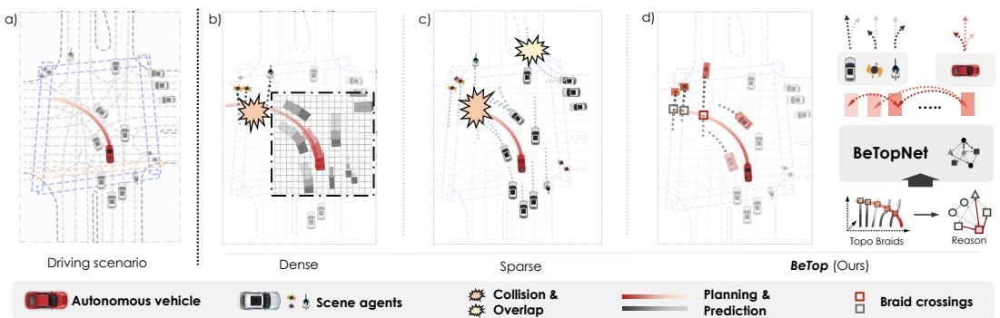  
Figure 1: Multi-agent Behavioral Formulation. (a) A typical driving scenario in Arizona, US [35]; (b) Dense representation conducts scalable occupancy prediction jointly, but restrained reception leads to unbounded collisions with planning; (c) Sparse supervision derives multi-agent trajectories with multi-modalities, while it struggles with conflicts among integrated prediction and planning; (d) BeTop reasons future topological behaviors for all scene-agents through braids theory, funneling interactive eventual agents (in highlighted colors) and guiding compliant joint prediction and planning.

The decision-making process for human drivers provides valuable insights. Humans primarily determine the future behavior of interacted agents for decision-making without relying on their specific states [2, 36]. Thus, an effective strategy involves assessing agent-wise behavioral impact on planning maneuvers, and reasoning about compliant interactions. Our fundamental insight is that compliant multi-agent behaviors exhibit topological formations, which can be identified by distilling consensual interactions from future behaviors. Prior works have approached this challenge through structural design [37, 38] or implicit relational learning [39–41] using GNNs [42] or Transformers [43]. Other studies quantify uncertainty by topological properties [44, 45]. Nevertheless, current literature is scarce in formulating explicit future supervision of compliant multi-agent behavioral patterns.

To this end, we launch the multi-agent behavior formulation termed as Behavioral Topology (BeTop). At its core, BeTop explicitly forms the topological supervision of consensual multi-agent future interactions, and reasons to guide prediction and planning. BeTop stems from braid theory [46], which infers compliant interactions of multiple paths from the intertwining of their braids. This empowers BeTop to intuitively distill forward intertwines (occupancy) as joint topology from braided multi-agent future trajectories (Fig. 1), marrying dense and sparse representation. With the aid of BeTop, we introduce a synergistic Transformer-based learning stack, BeTopNet, for learning IPP objectives. To implement, an iterative decoding strategy simultaneously reasons about Behavioral Topology and generates trajectory sets. Then the topology-guided local attention, embedded in each decoder layer, selectively queries behavioral semantics from social-compliant agents within the predicted BeTop priors. To further alleviate multi-agent uncertainty through topological guidance, a contingency planning paradigm is fitfully deployed. We lay out the imitative contingency learning process, which regulates the safety-ensured short-term plan. It maintains the long-range uncertainty by reasoned joint predictions from BeTop. Experimental results exhibit enhanced consistency and accuracy for prediction and planning in real-world scenarios. Testing in proposed interactive cases further highlights the planning ability of BeTopNet. To sum up, our contributions are three-fold:

• We bring in the concept of Behavioral Topology, a multi-agent behavioral formulation for topological reasoning that explicitly supervises consensual future interactions jointly for the IPP system.

• A synergistic learning framework BeTopNet, offering joint planning and prediction guided by topology reasoning, is devised. Topology-guided local attention and imitative contingency planning could resolve scene compliance and multi-agent uncertainty.

• Benchmarking on nuPlan [47] and WOMD [35], our approach demonstrates strong performance in both planning strategy and prediction accuracy. BeTopNet witnesses evident improvement over previous counterparts, $e . g . , + 7 . 9 \%$ in general planning score, +3.8% under interactive cases, +4.1% mAP for joint prediction, and +2.3% mAP for marginal prediction.

## 2 Related work

Multi-agent behavioral modeling. Carving the collective future behavior of diverse agents is imperative for socially-consistent driving maneuver. Earlier approaches centered around occupancy prediction [14, 5, 4, 48]. Forecasting the spatial presence under dense BEV representation [49, 20] offers flexibility of arbitrary agents [17, 50, 19] and alignment with perception [7, 51]. However, rigidity in resolution induces scenario occlusion [16], rendering intractable occupancy [21]. In parallel, sparse representation consolidates multi-agent behavior into cohesive modalities across future trajectories [52, 22, 53, 54] or intentions [27, 10, 26, 55]. Joint future behaviors are derived through goal-based sampling or recombination from marginal predictions [56–58]. However, the collection of joint modalities is susceptible to mode collapse and entails exponential complexity [29, 59]. Meanwhile, topological representation has garnered traction as motion primitives [60, 61] or tools [44, 45] for scenario quantification, yet topological properties delineating collective future behaviors remain largely unexplored. Our BeTop targets the issue, marrying dense behavior probabilities by topology with the sparse motion from joint predictions to present structured future behaviors.

On the other hand, inconsistent communal agent behaviors have motivated leveraging future interactions. Implicit approaches obtain tacit interactions with attention [62, 32, 63] or GNN [24, 64, 37, 65] from final motion regressions. Nonetheless, the implicit supervisions are found inefficient in dynamic scenarios [22]. Contrarily, explicitly reasoning mutual behaviors by conditional factorization [31, 66], relation reasoning [41, 40], or entropy-based methods [67, 68] offer consistent behavioral priors. However, hefty variance across agent dynamics and scenario geometries yield unstable inference. Distinguished from them, BeTop crafts a compact topological supervision that stabilize future interactions among multi-agent behaviors. Derived from topological braids, BeTop offers a topological equivalent behavioral representation to guide compliant forecasting and planning.

Integrated prediction and planning. IPP system aims to harmonize trajectory-based learning of future interactive behaviors between the ego vehicle and social agents. Rule-based approaches [69–71] integrate handcrafted future interactions to evaluate candidate planning profiles, offering remarkable outcomes in rule-powered reactive simulation [47]. Still, the absence of real-world behaviors exhibits significant gaps in interactive scenarios. Learning-based methods yield imitative planning by integrating predictions within holistic modeling [72–74]. However, history-based coalitions pose challenges in supervising future homology among agents. Recently, hybrid pipelines [8, 75] have utilized post-processing and optimization upon learning-based models to realize behavior interactions among predictions and planning. This can entail significant computational overhead, and imitative planning tends to overestimate hereditary uncertainty in behavior predictions. Tree-based [10, 27] and contingency-enabled [76, 11] works seek to balance planning preemption and aggression in the face of behavior uncertainty. Nonetheless, pipelines without holistic interactions fall into passive planning maneuvers and incur high exponential cost for predictions. In our work, BeTop provides an explicit prior for future interactive behaviors which enhances compliant trajectory generations. Moreover, the synergistic prediction and contingency planning networks with BeTop effectively manage behavioral uncertainty.

## 3 Behavioral Topology

Presenting BeTop, we commence the Behavioral Topology formulation and task statement of IPP for autonomous driving in Sec. 3.1. Then, we demonstrate the BeTopNet network architecture (Fig. 3) for topological reasoning and IPP generation in Sec. 3.2. Finally, in Sec. 3.3, we propose the imitative contingency learning process by topological guidance for the proposed network.

## 3.1 Formulation

Problem formulation. We consider the driving scenario with $N _ { a }$ agents as $A _ { 1 : N _ { a } }$ at presence $t = 0$ along with the scenario map M. The states over historical horizon $\bar { T } _ { h }$ are denoted as $\mathbf { \bar { X } } _ { 1 }$ for AV and as ${ \bf X } _ { 2 : N _ { a } }$ for scenario agents, respectively, where ${ \bf X } _ { n } = \{ { \bf x } ^ { - T _ { h } : 0 } \} _ { n } , n \in [ 1 , N _ { a } ]$ . The objective for integrated prediction and planning is to jointly predict scene agents’ trajectories ${ \mathbf { Y } } _ { 2 : N _ { a } }$ as well as AV planning $\bar { \mathbf Y } _ { 1 }$ over a future horizon $T _ { f }$ as $\mathbf { Y } _ { n } = \{ \mathbf { y } ^ { 1 : T _ { f } } \} _ { n } , n \in [ 1 , N _ { a } ]$

Figure 2: BeTop formulation. Joint future trajectories are transformed to braid sets, and then form joint topology through intertwine indicators.  
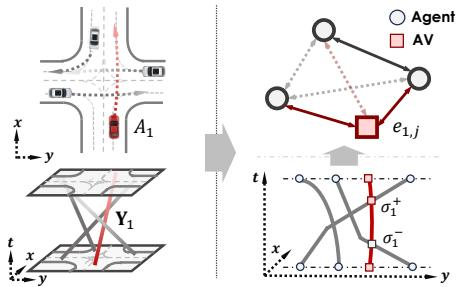

Table 1: Analysis on different behavioral formulations. BeTop labels behave most similarly to human annotations [35], excelling over other formulations like k nearest GT or local attention.
<table><tr><td>Behavioral Formulations</td><td colspan="2">WOMD Acc. ↑ AUC↑</td></tr><tr><td>Expert [35]</td><td>1.000</td><td>1.000</td></tr><tr><td>GT top-k Local attention [22]</td><td>0.833 0.951</td><td>0.702 0.522</td></tr><tr><td>JFP graph [67]</td><td>0.955</td><td>0.500</td></tr><tr><td>BeTop (Ours)</td><td>0.967</td><td>0.731</td></tr></table>

Topological formulation. We leverage the braid theory [46], which probes explicit formulations for compliant multi-agent interactions from future data $\mathbf { Y } _ { 1 : N _ { a } }$ . Intuitively, it denotes a transform process for $\mathbf { Y } _ { 1 : N _ { c } }$ with respective agent coordinates, and then gathers each future forward intertwine (occupancy) as joint interactions. Formally, consider the braid group ${ \bf B } _ { N _ { a } } = \{ \sigma _ { n } \}$ by $N _ { a }$ primitive braids $\sigma _ { n } ,$ each of which $\sigma _ { n } = ( f _ { 1 } ^ { n } , \cdot \cdot \cdot , \bar { f } _ { N _ { a } } ^ { n } )$ denotes a tuple of monotonically increased functions $f : \mathbb { R } ^ { 3 } \times \mathbf { Y }  \mathbb { R } ^ { 2 } \times I$ mapping from Cartesian $( \vec { x } , \vec { y } , \vec { t } )$ to lateral coordinate $( \vec { y } , \vec { t } )$ for agent future $\mathbf { Y } .$ . Specifically, the function $f _ { i } ^ { n }$ in $\sigma _ { n }$ is defined as $f _ { i } ^ { n }  ( \mathbf { Y } _ { i } - \mathbf { b } _ { n } ) \mathbf { R } _ { n } ; 1 \leq i , n \leq N _ { a } .$ , where $ { \mathbf { b } } _ { n }$ and ${ \mathbf { R } } _ { n }$ denote the left-hand transform matrix to local coordinate of agent $A _ { n }$ . The joint interactive behaviors are identified as a set of braids having intertwines $\{ \sigma _ { n } ^ { \pm } \} \subset { \bf B } _ { N _ { c } }$ over others [45], as shown in Fig. 2. Opposite to implicit methods [22, 67, 41] banking on future distance heuristic, each intertwine in the braid can signify an explicit behavioral response, distinguishing between assertive $( \sigma _ { n } ^ { + }$ , elicit yielding from others) and passive $( \sigma _ { n } ^ { - }$ , yield to others) maneuvers. To avert difficulties in dynamic braid set inference, we redraft multi-agent braids from a topology reasoning perspective.

Named by BeTop, the goal is to reason a topological graph $\mathcal { G } = ( \nu , \mathcal { E } )$ for multi-agent future behaviors $( \mathrm { F i g . ~ } 2 )$ . Expressly, node topology ${ \cal { V } } = \{ \breve { \bf { Y } } _ { n } \}$ is denoted by multi-agent future trajectories. We can then reformulate the braid set $\left\{ \sigma _ { n } ^ { \pm } \right\}$ as an edge topology $e _ { i j } \to \mathcal { E } \in \mathbb { R } ^ { \bar { N } _ { a } \times N _ { a } } ; 1 \leq i , j \leq N _ { a }$ for future interactive behaviors. Each topology element $e _ { i j }$ can be defined by two braid functions $f _ { i } ^ { i } , f _ { j } ^ { i } \in \sigma _ { i }$ assessing the future interwines along with $\mathbf { Y } _ { i } , \mathbf { Y } _ { j }$ as: eij = maxt $\textbf { I } \big ( f _ { i } ^ { i } ( \mathbf { y } _ { i } ^ { t } ) , f _ { j } ^ { i } ( \mathbf { y } _ { j } ^ { t } ) \big )$ Here I is an intertwine indicator by segment intersection [77] under lateral coordinates. With favorable properties proved in Appendix B, we can formulate the reasoning task as:

$$
\mathcal G ^ { * } = ( \operatorname* { m a x } \hat { \mathcal V } , \operatorname* { m a x } \hat { \mathcal E } ) .\tag{1}
$$

Agent future $\hat { \mathbf Y }$ in node term $\hat { \mathcal { V } }$ is defined by Gaussian mixtures (GMM) and optimized in Sec. 3.3. The edge topology reasoning $\hat { \mathcal { E } }$ can be specified as a probabilistic inference problem by:

$$
\operatorname* { m a x } \hat { \mathcal { E } } = \operatorname* { m a x } \sum _ { i } \sum _ { j } e _ { i j } \log e _ { i j } + ( 1 - e _ { i j } ) \log ( 1 - e _ { i j } ) ,\tag{2}
$$

where $1 \leq i , j \leq N _ { a }$ . Synergistic reasoning structures are then established optimizing $\mathcal { G } ^ { * }$

Comparative analysis. To highlight BeTop’s position among various formulations, we first conduct a preliminary analysis to assess behavioral similarity by retrieving future interactive agent pairs using human annotations [35]. Human likeness is quantified by classification metrics, including accuracy and the area under the curve (AUC), with annotated interactive IDs. As depicted in Table 1, labeled BeTop achieves the closest behavioral similarity compared with other well-accepted formulations in the community. Compared with retrieving k nearest strategy $( k = 6 )$ by ground-truth future states, we observe advanced differentiation in non-interactive behaviors (+16.1% Acc., +4.13% AUC) by BeTop. We then look into the generic learning-based structure by attention [22] or dynamic graph [67] for interactive behaviors. Despite high accuracy, their inferior AUC scores imply difficulties in retrieving precise interactivity compared with BeTop (+19.9 AUC). We refer analytical content in Appendix B. This draft for a reasoning framework BeTop prompting joint behaviors.

## 3.2 BeTopNet

As presented in Fig. 3, we introduce the synergistic learning framework reasoning BeTop in response to the series of challenges. It encompasses a Transformer backended encoder-decoder network. With encoded scene semantics X; M, the proposed network features a synergistic decoder which reasons and guides BeTop. Reason heads for topology $\hat { \mathcal { E } }$ and IPP for $\hat { \mathcal { V } }$ comprise the behavioral graph $\mathcal { G }$

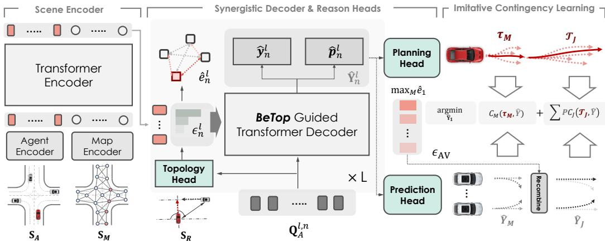  
Figure 3: The BeTopNet Architecture. BeTop establishes an integrated network for topological behavior reasoning, comprising three fundamentals. Scene encoder generates scene-aware attributes for agent $\mathbf { S } _ { A }$ and map $\mathbf { S } _ { M }$ . Initialized by $\mathbf { S } _ { R }$ and $\mathbf { Q } _ { A }$ , synergistic decoder reasons edge topology $\hat { e } _ { n } ^ { l }$ and trajectories $\hat { \mathbf { Y } } _ { n } ^ { l }$ iteratively from topology-guided local attention. Branched planning $\boldsymbol { \tau } \in \hat { \mathbf { Y } } _ { 1 }$ with predictions and topology are optimized jointly by imitative contingency learning.

Scene encoder. We leverage a scene-centric coordinate system following planning-oriented principle [7]. Scene attributes comprise historical agent states $\check { \mathbf { X } } \in \mathbb { R } ^ { N _ { a } \times \ T _ { h } \times \check { D _ { a } } }$ and map polyline inputs $\mathbf { \dot { M } } \in \mathbb { R } ^ { N _ { m } \times \ L _ { m } \times D _ { m } }$ , where we portion $N _ { m }$ map segments with length $L _ { m }$ from full scene map. Both attributes are encoded separately as $\mathbf { S } _ { A } ^ { ' \nu } \in \mathbb { R } ^ { N _ { a } \times D }$ and $\mathbf { S } _ { M } \in \breve { \mathbb { R } } ^ { N _ { m } \times \breve { D } }$ and concatenated as scene features $\mathbf { S } = [ \mathbf { S } _ { A } ; \mathbf { S } _ { M } ] \in \mathbf { \bar { \mathbb { R } } } ^ { ( N _ { a } + N _ { m } ) \times \bar { D } }$ . A stack of Transformer encoders with local attention are directly employed in capturing regional interactions from encoded scene semantics $\mathbf { S } _ { A } , \mathbf { S } _ { M }$

Synergistic decoder. Retaining encoded scene features $\mathbf { S } _ { A } , \mathbf { S } _ { M }$ , we zoom in the decoding strategy that asks for: 1) interactively reason simultaneous BeTop formulations; 2) selectively decoding of compliant interactive semantics leveraging reasoned topology priors. To this end, we introduce the iterative process of $N$ Transformer decoder layers contributed to all agents, pursuing the basis from [78]. To iron out the scene uncertainties, a multi-modal set of M decoding queries ${ \bf Q } _ { \ A } ^ { 0 } \in \mathbb { R } ^ { M \times D }$ are initialized for multi-agent future trajectories. Meanwhile, relative attributes ${ \bf S } _ { R } \in \mathbb { R } ^ { \dot { N } _ { a } \times N _ { a } \times D _ { R } }$ are deployed through MLPs as topology features ${ \bf Q } _ { R } ^ { 0 } \in \mathbb { R } ^ { N _ { a } \times N _ { a } \times D }$ for edge topology reasoning.

Next, we devise dual infostreams to the iterative decoding process for $\hat { \mathcal { V } }$ of future trajectories and $\hat { \mathcal { E } }$ of future topology. Given agent $A _ { n } .$ , the decoding process in layer l follows:

$$
\mathbf { Q } _ { R } ^ { l , n } = \mathrm { T o p o D e c o d e r } \left( \mathbf { Q } _ { A } ^ { l - 1 , n } , \mathbf { Q } _ { R } ^ { l - 1 , n } , \mathbf { S } _ { A } \right) , \hat { e } _ { n } ^ { l } = \mathrm { T o p o H e a d } \left( \mathbf { Q } _ { R } ^ { l , n } \right) ,\tag{3}
$$

$$
\mathbf { Q } _ { A } ^ { l , n } = \operatorname { T r a n s D e c o d e r } \left( \mathbf { Q } _ { A } ^ { l - 1 , n } , \mathbf { S } _ { A } , \mathbf { S } _ { M } , \hat { \mathbf { Y } } _ { n } ^ { l - 1 } , \hat { e } _ { n } ^ { l } \right) , \hat { \mathbf { Y } } _ { n } ^ { l } = \operatorname { I P P H e a d } ( \mathbf { Q } _ { A } ^ { l , n } ) ,\tag{4}
$$

where both future trajectories $\hat { \mathbf { Y } } _ { n } \in \hat { \mathcal { V } }$ and interactive topology $\hat { e } _ { n } \in \hat { \mathcal { E } }$ in BeTop are decoded in synergistic manners. Reasoned edge topology $\hat { e } _ { n } ^ { l } \in \mathbb { R } ^ { M \times N _ { a } ^ { \bullet } }$ are garnered by topological decoder with query broadcasting $\mathbf { Q } _ { A } ^ { l - 1 , n }$ ; Reasoning nodes for $\hat { { \mathbf Y } } _ { n }$ , a Transformer decoder with topology-guided local attention are drafted serving $\hat { e } _ { n } ^ { l }$ as priors. We provide further details in Appendix C.1.

Topology-guided local attention. Querying whole-scene agent semantics results in misaligned interactive agents and sparse attention. This motivates our design for local attention guided by the reasoned topology $\hat { e } _ { n } ^ { l } \in \mathbb { R } ^ { M \times N _ { a } }$ as priors. Specifically, we retrieve the top-K index $\epsilon _ { n } ^ { l } \in \mathbb { R } ^ { \tilde { M } \times K }$ priored from $\hat { e } _ { n } ^ { l }$ for eventual interactive agents behaviors with $A _ { n }$ . Interactive indices are directly leveraged in gathering $\mathbf { S } _ { A }$ selectively for local cross-attention. This process is formed as:

$$
{ \bf C } _ { A } ^ { l , n } = \mathrm { T o p o A t t n } ( { \bf Q } _ { A } ^ { l - 1 , n } , { \bf S } _ { A } , \hat { e } _ { n } ^ { l } )  \mathrm { M u l t i H e a d A t t n } ( q = { \bf Q } _ { A } ^ { l - 1 , n } ; k , v = { \bf S } _ { A } ^ { i \in \epsilon _ { n } ^ { l } } ) .\tag{5}
$$

where $\epsilon _ { n } ^ { l } = \mathrm { a r g m a x } _ { K } ( \hat { e } _ { n } ^ { l } )$ . Topology-guided agent features $\mathbf { C } _ { A } ^ { l , n }$ are then aggregated in each layer.

Reason heads. Given respective decoding features $\mathbf { Q } _ { R } ^ { l , n }$ and $\mathbf { Q } _ { A } ^ { l , n }$ for each layer, we affix reason heads accustomed to corresponding formulations for $\hat { e } _ { n }$ and $\hat { { \mathbf Y } } _ { n }$ . Referred in Eq. (3), the topology head, planning head, and prediction head (IPP heads) are jointly devised by stacked MLPs in reasoning BeTop results. For agent $A _ { n }$ in each layer, reason heads decode GMM components of future states $\hat { { \bf y } } _ { n } ^ { \bf \bar { \Psi } } \in \mathbb { R } ^ { M \times T _ { f } \times 5 }$ (referring to $( \mu _ { x } , \mu _ { y }$ , log $\sigma _ { x }$ , log $\sigma _ { y } , \rho )$ per step) with mixture score $\hat { { \bf p } } _ { n } \in \mathbb { R } ^ { M } , \{ \hat { \bf y } _ { n } , \hat { \bf p } _ { n } \} \in \hat { \bf Y } _ { n }$ , as well as interactive edge topology $\hat { e } _ { n } ^ { l } \in \mathbb { R } ^ { M \times N _ { a } }$ for BeTop.

## 3.3 Imitative Contingency Learning

Pursuing the target in Eq. (1), BeTopNet learns end-to-end objectives imitating human-like multi-agent behaviors, integrating compliant behaviors by contingency planning under scenario uncertainties.

Imitation learning. Imitation objectives are firstly established in regulating multi-agent behavioral states $\{ \hat { \mathbf { Y } } _ { n } \} \subset \hat { \mathcal { V } }$ while maximizing their interactive distributions ${ \hat { \mathcal { E } } } .$ The imitative objective for $\hat { \mathbf Y }$ is defined by the negative log-likelihood (NLL) from best-reasoned components $m ^ { * }$ closest to ground-truths, as denoted: $\begin{array} { r } { \mathcal { L } _ { \mathcal { V } } = \sum _ { t } ^ { T _ { f } } \mathcal { L } _ { \mathrm { N L L } } \big ( \hat { \mathbf { y } } _ { n } ^ { m ^ { * } , t } , \hat { \mathbf { p } } _ { n } ^ { m ^ { * } } , \mathbf { Y } _ { n } \big ) } \end{array}$ . Followed Eq. (2), the behavioral distributions for edge topology are computed by binary cross-entropy (BCE) given gathered $\hat { e } _ { n } ^ { m ^ { * } } \in$ $\mathbb { R } ^ { N _ { a } }$ , formulated as $\begin{array} { r } { \mathcal { L } \varepsilon = \sum _ { j } ^ { N _ { a } } \mathcal { H } ( \hat { e } _ { n , j } ^ { m ^ { * } } , e _ { n , j } ) } \end{array}$ over $N _ { a }$ agents jointly.

Integrated contingency planning. To integrate compliant behavior learning for $\mathcal { G }$ amidst multiagent scenario uncertainties, contingency planning [79, 76] is turned out an apt solution. Bridging immediate safe maneuvers $\tau _ { M }$ to branched planning sets $\{ \tau _ { J } \}$ with joint prediction, it adjourns uncertain decisions and ensures actual safety. While direct joint prediction may lose diversity [11], reasoned topology $\hat { \mathcal { E } }$ serves as a suitable medium distilling future interactive agents for efficient joint combination. Given imitative AV planning outputs $\boldsymbol { \tau } \subset \hat { \mathbf { Y } } _ { 1 }$ with branching time $t _ { b } \in ( 1 , T _ { f } )$ integrating contingency learning asks for a safe short-term plan $\tau _ { M } \in \mathcal { T } _ { M } , \mathcal { T } _ { M } \in \mathbb { R } ^ { M \times t _ { b } \times 2 }$ to full marginal predictions $\hat { Y } _ { M } = \hat { \mathbf { Y } } _ { 2 : N _ { a } }$ , as well as M branched planning sets $\mathcal { T } _ { J } ^ { m } = \{ \tau _ { J } ^ { 1 : M _ { b } } \} _ { m }$ guided by joint predictions $\hat { Y } _ { J } ^ { m }$ . This is defined by:

$$
\tau _ { M } ^ { * } = \underset { \tau \subset \hat { \mathbf { Y } } _ { 1 } } { \mathrm { a r g m i n } } \underset { \hat { Y } } { \mathrm { m a x } } C _ { M } \left( \tau _ { M } , \hat { Y } _ { M } \right) + \underset { m } { \sum } P ( \hat { Y } _ { J } ^ { m } ) C _ { J } \left( \mathcal { T } _ { J } ^ { m } , \hat { Y } _ { J } ^ { m } \right) ,\tag{6}
$$

where max ˆ $C _ { M }$ denotes worst-case cost fir $\tau _ { M } ;$ Joint predictions $\hat { Y } _ { J }$ with scene probabilities $P ( \hat { Y } _ { J } )$ are recombined by $K _ { M }$ interactive agent subsets, indexing $\epsilon _ { \mathrm { A V } } \in \mathbb { R } ^ { K _ { M } }$ from sorted AV $\mathrm { \ t o p o l o g y { : } ~ } \epsilon _ { \mathrm { A V } } = \mathrm { \ a r g m a x } _ { K _ { M } } ( \operatorname* { m a x } _ { M } \hat { e } _ { 1 } )$ ). It is described by joint costs $C _ { J }$ in guiding branched planning maneuvers. Specifically, both cost functions are defined by the repulsive potential field [8] discouraging planning proximity with respective prediction formulations.

Training loss. BeTopNet is trained end-to-end through imitative objectives and contingency planning costs by weighted integration for each layer, whenever applicable (for the datasets). Please refer to Appendix C.2 for additional details.

## 4 Experiment

With preliminary analysis in Sec. 3.1, this section further discovers the following questions: 1) Can BeTop perform compliant planning via BeTopNet, especially in interactive scenarios? 2) Can BeTop achieve accurate marginal and joint predictions of heterogeneous agents under diverse real-world cases? 3) Can the formulated BeTop facilitate existing state-of-the-art prediction and planning methods? and 4) How do the functionalities in BeTopNet affect the performance?

Benchmark and metrics. BeTop is verified on diverse benchmarks. We leverage two large-scale real-world datasets, $i . e .$ , nuPlan [47] and Waymo Open Motion Dataset (WOMD) [35], which are presently the most diverse motion datasets in manifesting planning and prediction performance. For planning tasks in nuPlan, there are in total 1M training cases with 8s horizons. 8,300 separated testing set are chosen by Test14-Hard and Test14-Random benchmarks [73] for hard-core and general driving scenes. With further demands verifying maneuvers under interactive cases, we build the Test14-Inter benchmark filtering 1,340 scenes by testing set. Scenarios ranging 15 seconds are tested under three tasks: 1) open-loop (OL), 2) close-loop non-reactive (CL-NR) simulations, and 3) reactive (CL-R) ones by nuPlan simulator. We report the official Planning Scores [80] computed by each task. The motion prediction tasks in WOMD share 487k training scenarios, with 44k validation and 44k testing set separately partitioned under two challenges: 1) The Marginal prediction challenge [81] forecasting multiple scene agents independently; 2) The Joint prediction challenge [82] predicting joint trajectory collections by two interactive agents. Primary metrics of mAP and Soft mAP are ranked for official leaderboards [81, 82]. We leave experimental details in Appendix D.

Table 2: Performance comparison of open- and closed-loop planning on nuPlan benchmarks. BeTopNet positions top average planning score and non-reactive simulation amongst SOTA planning systems by all types (rule, learning, and hybrid), especially under difficult benchmarked scenarios.
<table><tr><td rowspan="2">Type</td><td rowspan="2">Method</td><td colspan="4">Test14 Hard</td><td colspan="4">Test14 Random</td></tr><tr><td>OLS↑</td><td>CLS-NR ↑</td><td>CLS ↑</td><td>Avg. ↑</td><td>OLS ↑</td><td>CLS-NR ↑</td><td>CLS ↑</td><td>Avg. ↑</td></tr><tr><td>Expert</td><td>Log Replay</td><td>1.000</td><td>0.860</td><td>0.688</td><td>0.849</td><td>1.000</td><td>0.940</td><td>0.759</td><td>0.900</td></tr><tr><td rowspan="2">Rule</td><td>IDM [70]</td><td>0.201</td><td>0.562</td><td>0.623</td><td>0.462</td><td>0.342</td><td>0.704</td><td>0.724</td><td>0.590</td></tr><tr><td>PDM-Closed [69]</td><td>0.264</td><td>0.651</td><td>0.752</td><td>0.556</td><td>0.463</td><td>0.901</td><td>0.916</td><td>0.760</td></tr><tr><td>Hybrid</td><td>GameFormer [8] PDM-Hybrid [69]</td><td>0.753 0.738</td><td>0.666 0.660</td><td>0.688 0.758</td><td>0.702 0.719</td><td>0.794 0.822</td><td>0.808 0.902</td><td>0.793 0.916</td><td>0.798 0.880</td></tr><tr><td rowspan="6">Learning</td><td>UrbanDriver [74]</td><td>0.769</td><td>0.515</td><td></td><td></td><td></td><td></td><td></td><td></td></tr><tr><td>PDM-Open [69]</td><td>0.791</td><td>0.335</td><td>0.491</td><td>0.592</td><td>0.824 0.841</td><td>0.633 0.528</td><td>0.610</td><td>0.689</td></tr><tr><td>PlanCNN [72]</td><td>0.524</td><td>0.494</td><td>0.358</td><td>0.495 0.513</td><td>0.629</td><td>0.697</td><td>0.572 0.675</td><td>0.647</td></tr><tr><td></td><td></td><td>0.432</td><td>0.522</td><td></td><td></td><td></td><td></td><td>0.667</td></tr><tr><td>GC-PGP [83]]</td><td>0.738</td><td>0.726</td><td>0.396</td><td>0.522 0.725</td><td>0.773 0.871</td><td>0.560 0.865</td><td>0.514 0.806</td><td>0.616</td></tr><tr><td>PlanTF [73] BeTopNet (Ours)</td><td>0.833 0.840</td><td>0.771</td><td>0.617 0.688</td><td>0.766</td><td>0.876</td><td>0.902</td><td>0.857</td><td>0.847 0.878</td></tr></table>

Table 3: nuPlan closed-loop planning results on the proposed interactive benchmark. BeTopNet achieves desirable PDMScore, with planning safety, road compliance, and driving progress.
<table><tr><td rowspan="2">Type</td><td rowspan="2">Method</td><td colspan="7">Test14 Inter</td></tr><tr><td>Col. Avoid ↑</td><td>Drivable ↑</td><td>Direction ↑</td><td>Progress ↑</td><td>TTC ↑</td><td>Comfort ↑</td><td>PDMScore ↑</td></tr><tr><td>Expert</td><td>Log Replay</td><td>1.000</td><td>1.000</td><td>1.000</td><td>0.881</td><td>1.000</td><td>0.999</td><td>0.950</td></tr><tr><td>Rule</td><td>PDM-Closed [69]</td><td>0.886</td><td>1.000</td><td>1.000</td><td>0.818</td><td>0.853</td><td>0.999</td><td>0.833</td></tr><tr><td rowspan="5">Learning</td><td>Constant Acc.</td><td>0.449</td><td>0.509</td><td>0.651</td><td>0.048</td><td>0.419</td><td>1.000</td><td>0.108</td></tr><tr><td>UrbanDriver [74]</td><td>0.970</td><td>0.955</td><td>0.992</td><td>0.798</td><td>0.932</td><td>1.000</td><td>0.854</td></tr><tr><td>PlanCNN [72]</td><td>0.902</td><td>0.895</td><td>0.973</td><td>0.678</td><td>0.859</td><td>0.999</td><td>0.720</td></tr><tr><td>PlanTF [73]</td><td>0.982</td><td>0.946</td><td>0.992</td><td>0.825</td><td>0.952</td><td>0.999</td><td>0.871</td></tr><tr><td>BeTopNet (Ours)</td><td>0.983</td><td>0.960</td><td>0.999</td><td>0.859</td><td>0.950</td><td>0.999</td><td>0.894</td></tr></table>

## 4.1 Main Result

Performance for interactive planning. Table 2 demonstrates the planning results under difficult and regular test cases. Notably, BeTopNet marks top average planning scores, achieving +7.9% in hard cases and excels +6.2% (CLS-NR) in closed-loop simulations. Specifically, it gains solid improvements against learning-based planners. This can be attributed to topological formulations learning stabilized joint behavioral patterns, boosting +6.2%, +4.3% non-reactive simulations by real world logs and enhancing reactive simulation (+11.5%, +6.3%). Contingency objectives enhance uncertainty compliance, leading to expanded results in hard scenarios. Meanwhile, BeTopNet also outperforms rule-based and hybrid planning agents asking for post-optimizations [8] or hefty rules in coinciding with reactive simulation setups [69, 70]. We report +15.8% and +18.4% results of non-reactive simulation in hard cases and close performance in general scenes. Moreover, interactive planning compliance is also verified in the proposed Test14-Inter benchmark centering on interactive scenarios. As in Table 3, BeTopNet fosters +3.8% planning score over previous methods, marking +5.5% driving progress and +2.9% driving compliance closest to human performance. Qualitative results of interactive scenarios in Fig. 5(a-d) further corroborate planning compliance by BeTop.

Performance for marginal and joint motion prediction. Marginal prediction results are in Table 4. Without the aids of model ensembles or extra data [25, 59], BeTopNet outperforms existing approaches, manifesting +2.7% and +3.4% mAP metrics comparing concurrent methods [53, 86] for compliant predictions. Exhibited strong prediction displacement metric (−4.3% minFDE) over methods using extra pretraining [85], it should be noted that displacement metric is less illustrative as it discounts uncertainty scoring. BeTopNet further outperforms +6.0% and +26.1% Soft mAP over multi-agent predictors solely leveraging scenario attention [25] or graph [24]. N. Table 5 exhibits the joint prediction results. BeTopNet outperforms all methods in both mAP metrics (+4.1%, +3.7% Soft mAP and mAP), presenting robust prediction compliance credit to BeTop formulations for stable future interaction patterns and aligned by local attention in BeTopNet. Particularly, BeTop shows interactive compliance, improving +5.1% mAP over recent auto-regressive approaches [32], boosting +25.4% mAP with game-theoretic methods [8] by a large margin. Fig. 5 (e-h) demonstrates the qualitative prediction performance by BeTopNet. At the time of submission, BeTopNet ranked 1st on both WOMD prediction leaderboards [82, 81].

Table 4: Performance of marginal prediction on WOMD Motion Leaderboard. BeTopNet surpasses existing motion predictors without model ensemble or using extra data. † extra LIDAR data and pretrained model. Primary metric
<table><tr><td>Set split</td><td>Method</td><td>minADE↓</td><td>minFDE↓</td><td>Miss Rate ↓</td><td>mAP↑</td><td>Soft mAP ↑</td></tr><tr><td rowspan="7">Test</td><td>ReCoAt [84]</td><td>0.7703</td><td>1.6668</td><td>0.2437</td><td>0.2711</td><td></td></tr><tr><td>HDGT [24]</td><td>0.5933</td><td>1.2055</td><td>0.1854</td><td>0.3577</td><td>0.3709</td></tr><tr><td>MTR [22]</td><td>0.6050</td><td>1.2207</td><td>0.1351</td><td>0.4129</td><td>0.4216</td></tr><tr><td>MTR++ [25]</td><td>0.5906</td><td>1.1939</td><td>0.1298</td><td>0.4329</td><td>0.4414</td></tr><tr><td>MGTR† [85]</td><td>0.5918</td><td>1.2135</td><td>0.1298</td><td>0.4505</td><td>0.4599</td></tr><tr><td>EDA [53]</td><td>0.5718</td><td>1.1702</td><td>0.1169</td><td>0.4487</td><td>0.4596</td></tr><tr><td>ControlMTR [86] BeTopNet (Ours)</td><td>0.5897 0.5723</td><td>1.1916 1.1668</td><td>0.1282</td><td>0.4414</td><td>0.4572 0.4678</td></tr><tr><td rowspan="4">Val</td><td>MTR [22]</td><td></td><td></td><td>0.1176</td><td>0.4566</td><td></td></tr><tr><td></td><td>0.6046</td><td>1.2251</td><td>0.1366</td><td>0.4129</td><td></td></tr><tr><td>EDA [53]</td><td>0.5708</td><td>1.1730</td><td>0.1178</td><td>0.4353</td><td></td></tr><tr><td>BeTopNet (Ours)</td><td>0.5716</td><td>1.1640</td><td>0.1177</td><td>0.4416</td><td></td></tr></table>

Table 5: Performance of joint prediction on WOMD Interaction Leaderboard. BeTopNet outperforms in both mAP metrics. Primary metric.
<table><tr><td>Set split</td><td>Method</td><td>minADE↓</td><td>minFDE↓</td><td>Miss Rate ↓</td><td>mAP↑</td><td>Soft mAP ↑</td></tr><tr><td>Test</td><td>HeatIRm4 [37] M2I [31] GameFormer [8] AMP [32] MTR++ [25]</td><td>1.4197 1.3506 0.9721 0.9073 0.8795</td><td>3.2595 2.8325 2.2146 2.0415 1.9505</td><td>0.7224 0.5538 0.4933 0.4212 0.4143</td><td>0.0804 0.1239 0.1923 0.2294 0.2326</td><td>0.1982 0.2365</td></tr><tr><td>Val</td><td>BeTopNet (Ours) MTR [22] AMP [32] BeTopNet (Ours)</td><td>0.9744 0.9132 0.8910 0.9304</td><td>2.2744 2.0536 2.0133 2.1340</td><td>0.4355 0.4372 0.4172 0.4154</td><td>0.2412 0.1992 0.2344 0.2366</td><td>0.2368 0.2466</td></tr></table>

## 4.2 Ablation Study

Instructed by the last two motivating questions, we investigate the effect of BeTop formulations and components inside BeTopNet. For efficient study, we randomly partition 20% of WOMD train set for prediction, and directly report the planning results by Test14-Random benchmark, which are both representative for the original datasets as verified by [22, 73].

Synergy with existing state-of-the-art methods. We first study the effect adjoining BeTop as synergistic objectives over existing SOTA methods in planning and prediction. Described in Table 6 and Table 7, BeTop augments +2.1% and 2.0% planning score with learning-based and rule-based planners, respectively. Similar compliance effects are also witnessed in guiding strong motion predictors, bringing +1.1%, +2.4% improved mAP with −1.7% prediction errors of minADE.

Number of interactive agents for topology-guided local attention. In determining the number K future interactive agents for BeTopNet in local attention, we validate the prediction mAP under an array of agent numbers. Shown in Fig. 4, we observe a converging effect, with maximum +3.7% mAP by the growing number of interactive agents. A drop of −1.8% mAP is captured after the peak performance of K = 32. It is due to falsely accepting non-interactive agent values by large K.

Different functionalities in BeTopNet. We further investigate the effects of different functionalities for BeTopNet in Table 8. Compared to the full model, ablations in ID.1 and ID.2 underscore the imitative contingency learning process for costs (−2.9% CLS) and contingency branching (−1% CLS-NR). Sole imitative BeTopNet performs the best OLS (ID.2), while the stabilizing effects found in Sec. 4.1 are verified (−2.8% CLS-NR) in comparing ID.3-ID.5 for joint interactive patterns.

Table 6: Results of integrating BeTop by strong planning baselines in nuPlan benchmark.
<table><tr><td rowspan="2">Method</td><td colspan="4">nuPlan</td></tr><tr><td>OLS↑</td><td>CLS-NR ↑</td><td>CLS ↑</td><td>Avg. ↑</td></tr><tr><td>PDM [69]</td><td>0.463</td><td>0.898</td><td>0.918</td><td>0.760</td></tr><tr><td>PDM [69] +BeTop</td><td>0.488</td><td>0.916</td><td>0.902</td><td>0.770</td></tr><tr><td>PlanTF [73]</td><td>0.871</td><td>0.864</td><td>0.805</td><td>0.847</td></tr><tr><td>PlanTF [73] +BeTop</td><td>0.878</td><td>0.882</td><td>0.807</td><td>0.856</td></tr></table>

Table 7: Results of integrating BeTop by strong prediction baselines in WOMD benchmark.
<table><tr><td rowspan="2">Method</td><td colspan="4">WOMD</td></tr><tr><td>minADE↓</td><td>minFDE↓</td><td>MR↓</td><td>mAP↑</td></tr><tr><td>MTR [22]</td><td>0.6046</td><td>1.2251</td><td>0.1366</td><td>0.4164</td></tr><tr><td>MTR [22] +BeTop</td><td>0.5941</td><td>1.2049</td><td>0.1328</td><td>0.4249</td></tr><tr><td>EDA [53]</td><td>0.5708</td><td>1.1730</td><td>0.1178</td><td>0.4353</td></tr><tr><td>EDA [53] +BeTop</td><td>0.5742</td><td>1.1853</td><td>0.1181</td><td>0.4407</td></tr></table>

Figure 4: Results of different interactive agents number for local attention. We observe a convergence effect for the selection of K.  
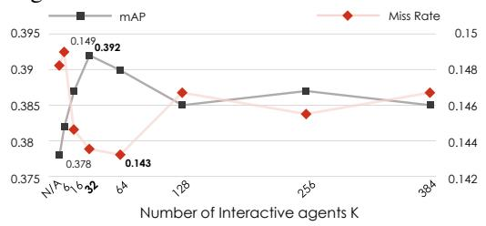

Table 8: Results of BeTopNet planning performance with different components. Contingency is the key for closed-loop simulation.
<table><tr><td>ID</td><td>Ablative Components</td><td>OLS ↑</td><td>nuPlan CLS-NR ↑</td><td>CLS ↑</td></tr><tr><td>0</td><td>BeTopNet</td><td>0.876</td><td>0.902</td><td>0.857</td></tr><tr><td>1</td><td>No branched plan</td><td>0.879</td><td>0.894</td><td>0.830</td></tr><tr><td>2</td><td>No cost learning</td><td>0.882</td><td>0.888</td><td>0.807</td></tr><tr><td>3</td><td>BeTop only</td><td>0.877</td><td>0.876</td><td>0.804</td></tr><tr><td>4</td><td>No local attention</td><td>0.871</td><td>0.852</td><td>0.804</td></tr><tr><td>5</td><td>Encoders only</td><td>0.867</td><td>0.827</td><td>0.784</td></tr></table>

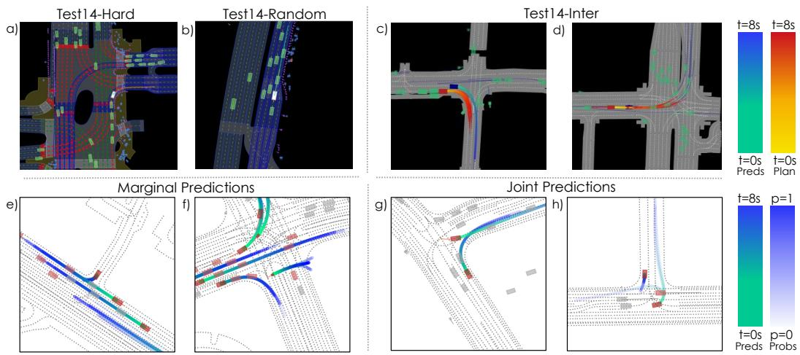  
Figure 5: Qualitative results of planning and prediction in nuPlan and WOMD. BeTopNet performs compliant reaction simulations in a) yielding for pedestrians; b) cruising in dense traffic. Interactive scenarios (c,d) further present the consistency of contingency learning. BeTopNet predicts both compliant marginal (e,f) and joint (g,h) multi-agent predictions under diverse scenarios. Future interactive behavior patterns can also be consistently reasoned (rendered in light red) with BeTop.

## 5 Conclusion

In this paper, we present BeTop, a topological new-look for multi-agent behavioral formulation. Derived by braid theory, the reasoning tasks for BeTop are drafted supervising joint interactive patterns with integrated prediction and planning. A synergistic network, BeTopNet, is established with an imitative contingency learning process to boost compliant BeTop reasoning. Experiments on nuPlan and WOMD verify BeTopNet’s state-of-the-art performance in prediction and planning.

Limitation and Future work. Current BeTop considers one-step future topology alone, and focuses on prediction and planning. Future work would be centered on developing a recursive version of BeTop in multi-step, multi-agent reasoning and coordination. Another promising direction would be the connectivity of BeTop upon perceptions as tracking for the end-to-end paradigm, as well as an extension on reasoning behaviors under 3D scenarios for multiple autonomous agents.

## Acknowledgments

This work was supported in part by the Agency for Science, Technology and Research (A\*STAR), Singapore, under the MTC Individual Research Grant (M22K2c0079), the ANR-NRF Joint Grant (No.NRF2021-NRF-ANR003 HM Science), the Ministry of Education (MOE), Singapore, under the Tier 2 Grant (MOE-T2EP50222-0002), National Key R&D Program of China (2022ZD0160104), NSFC (62206172), and Shanghai Committee of Science and Technology (23YF1462000).

## References

[1] Long Chen, Yuchen Li, Chao Huang, Bai Li, Yang Xing, Daxin Tian, Li Li, Zhongxu Hu, Xiaoxiang Na, Zixuan Li, Siyu Teng, Chen Lv, Jinjun Wang, Dongpu Cao, Nanning Zheng, and Fei-Yue Wang. Milestones in autonomous driving and intelligent vehicles: Survey of surveys. TIV, 2022. 1

[2] Wenshuo Wang, Letian Wang, Chengyuan Zhang, Changliu Liu, and Lijun Sun. Social interactions for autonomous driving: A review and perspectives. Foundations and Trends in Robotics, 2022. 1, 2, 17

[3] Li Chen, Penghao Wu, Kashyap Chitta, Bernhard Jaeger, Andreas Geiger, and Hongyang Li. End-to-end autonomous driving: Challenges and frontiers. PAMI, 2024. 1

[4] Sergio Casas, Abbas Sadat, and Raquel Urtasun. MP3: A unified model to map, perceive, predict and plan. In CVPR, 2021. 1, 3

[5] Shengchao Hu, Li Chen, Penghao Wu, Hongyang Li, Junchi Yan, and Dacheng Tao. ST-P3: End-to-end vision-based autonomous driving via spatial-temporal feature learning. In ECCV, 2022. 3

[6] Haochen Liu, Zhiyu Huang, Wenhui Huang, Haohan Yang, Xiaoyu Mo, and Chen Lv. Hybrid-prediction integrated planning for autonomous driving. arXiv preprint arXiv:2402.02426, 2024.

[7] Yihan Hu, Jiazhi Yang, Li Chen, Keyu Li, Chonghao Sima, Xizhou Zhu, Siqi Chai, Senyao Du, Tianwei Lin, Wenhai Wang, Lewei Lu, Xiaosong Jia, Qiang Liu, Jifeng Dai, Yu Qiao, and Hongyang Li. Planning oriented autonomous driving. In CVPR, 2023. 1, 3, 5

[8] Zhiyu Huang, Haochen Liu, and Chen Lv. GameFormer: Game-theoretic modeling and learning of transformer-based interactive prediction and planning for autonomous driving. In ICCV, 2023. 1, 2, 3, 6, 7, 8, 16, 19, 20, 21, 22

[9] Ye Yuan, Xinshuo Weng, Yanglan Ou, and Kris M Kitani. AgentFormer: Agent-aware transformers for socio-temporal multi-agent forecasting. In ICCV, 2021. 1

[10] Yuxiao Chen, Peter Karkus, Boris Ivanovic, Xinshuo Weng, and Marco Pavone. Tree-structured policy planning with learned behavior models. In ICRA, 2023. 1, 3

[11] Alexander Cui, Sergio Casas, Abbas Sadat, Renjie Liao, and Raquel Urtasun. LookOut: Diverse multifuture prediction and planning for self-driving. In ICCV, 2021. 3, 6

[12] Stefano Pini, Christian S Perone, Aayush Ahuja, Ana Sofia Rufino Ferreira, Moritz Niendorf, and Sergey Zagoruyko. Safe real-world autonomous driving by learning to predict and plan with a mixture of experts. In ICRA, 2023.

[13] Penghao Wu, Xiaosong Jia, Li Chen, Junchi Yan, Hongyang Li, and Yu Qiao. Trajectory-guided control prediction for end-to-end autonomous driving: A simple yet strong baseline. In NeurIPS, 2022. 1

[14] Anthony Hu, Zak Murez, Nikhil Mohan, Sofía Dudas, Jeffrey Hawke, Vijay Badrinarayanan, Roberto Cipolla, and Alex Kendall. FIERY: Future instance prediction in bird’s-eye view from surround monocular cameras. In ICCV, 2021. 1, 3, 16

[15] Yihan Hu, Kun Li, Pingyuan Liang, Jingyu Qian, Zhening Yang, Haichao Zhang, Wenxin Shao, Zhuangzhuang Ding, Wei Xu, and Qiang Liu. Imitation with spatial-temporal heatmap: 2nd place solution for nuplan challenge. arXiv preprint arXiv:2306.15700, 2023. 1

[16] Reza Mahjourian, Jinkyu Kim, Yuning Chai, Mingxing Tan, Ben Sapp, and Dragomir Anguelov. Occupancy flow fields for motion forecasting in autonomous driving. RA-L, 2022. 1, 3

[17] Haochen Liu, Zhiyu Huang, and Chen Lv. Multi-modal hierarchical transformer for occupancy flow field prediction in autonomous driving. In ICRA, 2023. 3

[18] Ben Agro, Quinlan Sykora, Sergio Casas, and Raquel Urtasun. Implicit occupancy flow fields for perception and prediction in self-driving. In CVPR, 2023. 1, 16

[19] Jinkyu Kim, Reza Mahjourian, Scott Ettinger, Mayank Bansal, Brandyn White, Ben Sapp, and Dragomir Anguelov. StopNet: Scalable trajectory and occupancy prediction for urban autonomous driving. In ICRA, 2022. 1, 3

[20] Hongyang Li, Chonghao Sima, Jifeng Dai, Wenhai Wang, Lewei Lu, Huijie Wang, Jia Zeng, Zhiqi Li, Jiazhi Yang, Hanming Deng, Hao Tian, Enze Xie, Jiangwei Xie, Li Chen, Tianyu Li, Yang Li, Yulu Gao, Xiaosong Jia, Si Liu, Jianping Shi, Dahua Lin, and Yu Qiao. Delving into the devils of bird’s-eye-view perception: A review, evaluation and recipe. PAMI, 2024. 1, 3

[21] Haochen Liu, Zhiyu Huang, and Chen Lv. Occupancy prediction-guided neural planner for autonomous driving. In ITSC, 2023. 1, 3, 16

[22] Shaoshuai Shi, Li Jiang, Dengxin Dai, and Bernt Schiele. Motion transformer with global intention localization and local movement refinement. In NeurIPS, 2022. 1, 3, 4, 8, 9, 18, 19, 20, 22, 23

[23] Xiaosong Jia, Li Chen, Penghao Wu, Jia Zeng, Junchi Yan, Hongyang Li, and Yu Qiao. Towards capturing the temporal dynamics for trajectory prediction: a coarse-to-fine approach. In CoRL, 2022.

[24] Xiaosong Jia, Penghao Wu, Li Chen, Yu Liu, Hongyang Li, and Junchi Yan. HDGT: Heterogeneous driving graph transformer for multi-agent trajectory prediction via scene encoding. PAMI, 2023. 1, 3, 7, 8, 16, 20

[25] Shaoshuai Shi, Li Jiang, Dengxin Dai, and Bernt Schiele. MTR++: Multi-agent motion prediction with symmetric scene modeling and guided intention querying. PAMI, 2024. 1, 7, 8, 16, 20

[26] Zhiyu Huang, Chen Tang, Chen Lv, Masayoshi Tomizuka, and Wei Zhan. Learning online belief prediction for efficient pomdp planning in autonomous driving. arXiv preprint arXiv:2401.15315, 2024. 1, 3

[27] Zhiyu Huang, Peter Karkus, Boris Ivanovic, Yuxiao Chen, Marco Pavone, and Chen Lv. DTPP: Differentiable joint conditional prediction and cost evaluation for tree policy planning in autonomous driving. In ICRA, 2024. 1, 3

[28] Zhiyu Huang, Haochen Liu, Jingda Wu, and Chen Lv. Conditional predictive behavior planning with inverse reinforcement learning for human-like autonomous driving. TITS, 2023. 1, 2, 16

[29] Jiquan Ngiam, Vijay Vasudevan, Benjamin Caine, Zhengdong Zhang, Hao-Tien Lewis Chiang, Jeffrey Ling, Rebecca Roelofs, Alex Bewley, Chenxi Liu, Ashish Venugopal, David J Weiss, Benjamin Sapp, Zhifeng Chen, and Jonathon Shlens. Scene Transformer: A unified architecture for predicting future trajectories of multiple agents. In ICLR, 2022. 2, 3

[30] Steffen Hagedorn, Marcel Hallgarten, Martin Stoll, and Alexandru Condurache. Rethinking integration of prediction and planning in deep learning-based automated driving systems: a review. arXiv preprint arXiv:2308.05731, 2023. 2

[31] Qiao Sun, Xin Huang, Junru Gu, Brian C Williams, and Hang Zhao. M2I: From factored marginal trajectory prediction to interactive prediction. In CVPR, 2022. 2, 3, 8, 16, 20

[32] Xiaosong Jia, Shaoshuai Shi, Zijun Chen, Li Jiang, Wenlong Liao, Tao He, and Junchi Yan. AMP: Autoregressive motion prediction revisited with next token prediction for autonomous driving. arXiv preprint arXiv:2403.13331, 2024. 2, 3, 8, 16, 20, 22

[33] Jose Luis Vazquez Espinoza, Alexander Liniger, Wilko Schwarting, Daniela Rus, and Luc Van Gool. Deep interactive motion prediction and planning: Playing games with motion prediction models. In L4DC, 2022. 2, 16

[34] Wei Zhan, Changliu Liu, Ching-Yao Chan, and Masayoshi Tomizuka. A non-conservatively defensive strategy for urban autonomous driving. In ITSC, 2016. 2

[35] Scott Ettinger, Shuyang Cheng, Benjamin Caine, Chenxi Liu, Hang Zhao, Sabeek Pradhan, Yuning Chai, Ben Sapp, Charles R. Qi, Yin Zhou, Zoey Yang, Aurélien Chouard, Pei Sun, Jiquan Ngiam, Vijay Vasudevan, Alexander McCauley, Jonathon Shlens, and Dragomir Anguelov. Large scale interactive motion forecasting for autonomous driving: The waymo open motion dataset. In ICCV, 2021. 2, 4, 6, 20, 23, 29

[36] Dan Xie, Tianmin Shu, Sinisa Todorovic, and Song-Chun Zhu. Learning and inferring “dark matter” and predicting human intents and trajectories in videos. PAMI, 2017. 2

[37] Xiaoyu Mo, Zhiyu Huang, Yang Xing, and Chen Lv. Multi-agent trajectory prediction with heterogeneous edge-enhanced graph attention network. TITS, 2022. 2, 3, 8, 20

[38] Zhiyu Huang, Xiaoyu Mo, and Chen Lv. Multi-modal motion prediction with transformer-based neural network for autonomous driving. In ICRA, 2022. 2

[39] Yuriy Biktairov, Maxim Stebelev, Irina Rudenko, Oleh Shliazhko, and Boris Yangel. PRANK: motion prediction based on ranking. In NeurIPS, 2020. 2

[40] Daehee Park, Hobin Ryu, Yunseo Yang, Jegyeong Cho, Jiwon Kim, and Kuk-Jin Yoon. Leveraging future relationship reasoning for vehicle trajectory prediction. In ICLR, 2023. 3, 16

[41] Jiachen Li, Fan Yang, Masayoshi Tomizuka, and Chiho Choi. EvolveGraph: Multi-agent trajectory prediction with dynamic relational reasoning. In NeurIPS, 2020. 2, 3, 4, 16

[42] Thomas N. Kipf and Max Welling. Semi-supervised classification with graph convolutional networks. In ICLR, 2017. 2

[43] Ashish Vaswani, Noam Shazeer, Niki Parmar, Jakob Uszkoreit, Llion Jones, Aidan N Gomez, Łukasz Kaiser, and Illia Polosukhin. Attention is all you need. In NeurIPS, 2017. 2

[44] Christoforos Mavrogiannis, Jonathan DeCastro, and Siddhartha S Srinivasa. Analyzing multiagent interactions in traffic scenes via topological braids. In ICRA, 2022. 2, 3, 16, 17

[45] Christoforos Mavrogiannis, Jonathan A DeCastro, and Siddhartha S Srinivasa. Abstracting road traffic via topological braids: Applications to traffic flow analysis and distributed control. IJRR, 2023. 2, 3, 4, 16, 17

[46] Emil Artin. Theory of braids. Annals ofMathematics, 1947. 2, 4, 16

[47] Napat Karnchanachari, Dimitris Geromichalos, Kok Seang Tan, Nanxiang Li, Christopher Eriksen, Shakiba Yaghoubi, Noushin Mehdipour, Gianmarco Bernasconi, Whye Kit Fong, Yiluan Guo, and Holger Caesar. Towards learning-based planning: The nuplan benchmark for real-world autonomous driving. In ICRA, 2024. 2, 3, 6, 20

[48] Mayank Bansal, Alex Krizhevsky, and Abhijit Ogale. ChauffeurNet: Learning to drive by imitating the best and synthesizing the worst. arXiv preprint arXiv:1812.03079, 2018. 3

[49] Zhiqi Li, Wenhai Wang, Hongyang Li, Enze Xie, Chonghao Sima, Tong Lu, Yu Qiao, and Jifeng Dai. BEVFormer: Learning bird’s-eye-view representation from multi-camera images via spatiotemporal transformers. In ECCV, 2022. 3

[50] Alexey Kamenev, Lirui Wang, Ollin Boer Bohan, Ishwar Kulkarni, Bilal Kartal, Artem Molchanov, Stan Birchfield, David Nistér, and Nikolai Smolyanskiy. PredictionNet: Real-time joint probabilistic traffic prediction for planning, control, and simulation. In ICRA, 2022. 3

[51] Zetong Yang, Li Chen, Yanan Sun, and Hongyang Li. Visual point cloud forecasting enables scalable autonomous driving. In CVPR, 2024. 3

[52] Jiyang Gao, Chen Sun, Hang Zhao, Yi Shen, Dragomir Anguelov, Congcong Li, and Cordelia Schmid. VectorNet: Encoding hd maps and agent dynamics from vectorized representation. In CVPR, 2020. 3

[53] Longzhong Lin, Xuewu Lin, Tianwei Lin, Lichao Huang, Rong Xiong, and Yue Wang. EDA: Evolving and distinct anchors for multimodal motion prediction. In AAAI, 2024. 3, 7, 8, 9, 19, 20, 22, 24

[54] Charlie Tang and Russ R Salakhutdinov. Multiple futures prediction. In NeurIPS, 2019. 3

[55] Siyuan Qi and Song-Chun Zhu. Intent-aware multi-agent reinforcement learning. In ICRA, 2018. 3

[56] Thomas Gilles, Stefano Sabatini, Dzmitry Tsishkou, Bogdan Stanciulescu, and Fabien Moutarde. THOMAS: Trajectory heatmap output with learned multi-agent sampling. In ICLR, 2022. 3

[57] Thomas Gilles, Stefano Sabatini, Dzmitry Tsishkou, Bogdan Stanciulescu, and Fabien Moutarde. GO-HOME: Graph-oriented heatmap output for future motion estimation. In ICRA, 2022.

[58] Junru Gu, Chen Sun, and Hang Zhao. DenseTNT: End-to-end trajectory prediction from dense goal sets. In ICCV, 2021. 3

[59] Balakrishnan Varadarajan, Ahmed Hefny, Avikalp Srivastava, Khaled S. Refaat, Nigamaa Nayakanti, Andre Cornman, Kan Chen, Bertrand Douillard, Chi Pang Lam, Dragomir Anguelov, and Benjamin Sapp. MultiPath++: Efficient information fusion and trajectory aggregation for behavior prediction. In ICRA, 2022. 3, 7

[60] Junha Roh, Christoforos Mavrogiannis, Rishabh Madan, Dieter Fox, and Siddhartha Srinivasa. Multimodal trajectory prediction via topological invariance for navigation at uncontrolled intersections. In CoRL, 2020. 3

[61] Christoforos Mavrogiannis, Krishna Balasubramanian, Sriyash Poddar, Anush Gandra, and Siddhartha S Srinivasa. Winding through: Crowd navigation via topological invariance. RA-L, 2022. 3, 16

[62] Nigamaa Nayakanti, Rami Al-Rfou, Aurick Zhou, Kratarth Goel, Khaled S Refaat, and Benjamin Sapp. Wayformer: Motion forecasting via simple & efficient attention networks. In ICRA, 2023. 3, 23

[63] Zikang Zhou, Luyao Ye, Jianping Wang, Kui Wu, and Kejie Lu. HiVT: Hierarchical vector transformer for multi-agent motion prediction. In ICCV, 2022. 3

[64] Alexander Cui, Sergio Casas, Kelvin Wong, Simon Suo, and Raquel Urtasun. GoRela: Go relative for viewpoint-invariant motion forecasting. In ICRA, 2023. 3, 18

[65] Tim Salzmann, Boris Ivanovic, Punarjay Chakravarty, and Marco Pavone. Trajectron++: Dynamicallyfeasible trajectory forecasting with heterogeneous data. In ECCV, 2020. 3

[66] Luke Rowe, Martin Ethier, Eli-Henry Dykhne, and Krzysztof Czarnecki. FJMP: Factorized joint multiagent motion prediction over learned directed acyclic interaction graphs. In CVPR, 2023. 3, 16

[67] Wenjie Luo, Cheol Park, Andre Cornman, Benjamin Sapp, and Dragomir Anguelov. JFP: Joint future prediction with interactive multi-agent modeling for autonomous driving. In CoRL, 2022. 3, 4, 16

[68] Sergio Casas, Cole Gulino, Simon Suo, Katie Luo, Renjie Liao, and Raquel Urtasun. Implicit latent variable model for scene-consistent motion forecasting. In ECCV, 2020. 3

[69] Daniel Dauner, Marcel Hallgarten, Andreas Geiger, and Kashyap Chitta. Parting with misconceptions about learning-based vehicle motion planning. In CoRL, 2023. 3, 7, 9, 18, 19, 20, 21, 23

[70] Martin Treiber, Ansgar Hennecke, and Dirk Helbing. Congested traffic states in empirical observations and microscopic simulations. Physical review E, 2000. 7, 20, 2

[71] Peng Hang, Chen Lv, Yang Xing, Chao Huang, and Zhongxu Hu. Human-like decision making for autonomous driving: A noncooperative game theoretic approach. TITS, 2020. 3

[72] Katrin Renz, Kashyap Chitta, Otniel-Bogdan Mercea, A. Sophia Koepke, Zeynep Akata, and Andreas Geiger. PlanT: Explainable planning transformers via object-level representations. In CoRL, 2022. 3, 7, 20, 21

[73] Jie Cheng, Yingbing Chen, Xiaodong Mei, Bowen Yang, Bo Li, and Ming Liu. Rethinking imitation-based planner for autonomous driving. In ICRA, 2024. 6, 7, 8, 9, 18, 20, 21, 22, 24

[74] Oliver Scheel, Luca Bergamini, Maciej Wolczyk, Błazej Osi˙ nski, and Peter Ondruska. Urban Driver:´ Learning to drive from real-world demonstrations using policy gradients. In CoRL, 2021. 3, 7, 20, 21

[75] Peter Karkus, Boris Ivanovic, Shie Mannor, and Marco Pavone. DiffStack: A differentiable and modular control stack for autonomous vehicles. In CoRL, 2022. 3

[76] Tong Li, Lu Zhang, Sikang Liu, and Shaojie Shen. MARC: Multipolicy and risk-aware contingency planning for autonomous driving. RA-L, 2023. 3, 6

[77] Franklin Antonio. Faster line segment intersection. In Graphics Gems III (IBM Version), pages 199–202. Elsevier, 1992. 4

[78] Shilong Liu, Feng Li, Hao Zhang, Xiao Yang, Xianbiao Qi, Hang Su, Jun Zhu, and Lei Zhang. DAB-DETR: Dynamic anchor boxes are better queries for detr. In ICLR, 2022. 5

[79] Jason Hardy and Mark Campbell. Contingency planning over probabilistic obstacle predictions for autonomous road vehicles. TRO, 2013. 6

[80] Holger Caesar, Juraj Kabzan, Kok Seang Tan, Whye Kit Fong, Eric Wolff, Alex Lang, Luke Fletcher, Oscar Beijbom, and Sammy Omari. NuPlan: A closed-loop ml-based planning benchmark for autonomous vehicles. arXiv preprint arXiv:2106.11810, 2021. 7, 20, 23, 29

[81] Waymo. Waymo open dataset motion prediction challenge 2024. https://waymo.com/open/ challenges/2024/motion-prediction/. 7, 8, 20, 22

[82] Waymo. Waymo open dataset interaction prediction challenge 2021. https://waymo.com/open/ challenges/2021/interaction-prediction/. 7, 8, 20, 22

[83] Marcel Hallgarten, Martin Stoll, and Andreas Zell. From prediction to planning with goal conditioned lane graph traversals. In ITSC, 2023. 7, 20, 21

[84] Zhiyu Huang, Xiaoyu Mo, and Chen Lv. ReCoAt: A deep learning-based framework for multi-modal motion prediction in autonomous driving application. In ITSC, 2022. 8

[85] Yiqian Gan, Hao Xiao, Yizhe Zhao, Ethan Zhang, Zhe Huang, Xin Ye, and Lingting Ge. MGTR: Multi-granular transformer for motion prediction with lidar. In ICRA, 2024. 7, 8

[86] Jiawei Sun, Chengran Yuan, Shuo Sun, Shanze Wang, Yuhang Han, Shuailei Ma, Zefan Huang, Anthony Wong, Keng Peng Tee, and Marcelo H Ang Jr. ControlMTR: Control-guided motion transformer with scene-compliant intention points for feasible motion prediction. arXiv preprint arXiv:2404.10295, 2024. 7, 8, 20

[87] Mitchell A Berger. Topological invariants in braid theory. Letters in Mathematical Physics, 2001. 16

[88] Zhiqi Li, Zhiding Yu, Shiyi Lan, Jiahan Li, Jan Kautz, Tong Lu, and Jose M Alvarez. Is ego status all you need for open-loop end-to-end autonomous driving? In CVPR, 2024. 18, 20

[89] Charles R Qi, Hao Su, Kaichun Mo, and Leonidas J Guibas. PointNet: Deep learning on point sets for 3d classification and segmentation. In CVPR, 2017. 18

[90] Zetong Yang, Li Jiang, Yanan Sun, Bernt Schiele, and Jiaya Jia. A unified query-based paradigm for point cloud understanding. In CVPR, 2022. 19

[91] Zikang Zhou, Jianping Wang, Yung-Hui Li, and Yu-Kai Huang. Query-centric trajectory prediction. In CVPR, 2023. 19

[92] Jie Cheng, Yingbing Chen, and Qifeng Chen. PLUTO: Pushing the limit of imitation learning-based planning for autonomous driving. arXiv preprint arXiv:2404.14327, 2024. 19, 20, 21

[93] NAVSIM Contributors. NAVSIM: Data-driven non-reactive autonomous vehicle simulation. https: //github.com/autonomousvision/navsim, 2024. 20

[94] Daniel Dauner, Marcel Hallgarten, Tianyu Li, Xinshuo Weng, Zhiyu Huang, Zetong Yang, Hongyang Li, Igor Gilitschenski, Boris Ivanovic, Marco Pavone, Andreas Geiger, and Kashyap Chitta. NAVSIM: Data-driven non-reactive autonomous vehicle simulation and benchmarking. arXiv, 2406.15349, 2024. 20

[95] Lan Feng, Mohammadhossein Bahari, Kaouther Messaoud Ben Amor, Éloi Zablocki, Matthieu Cord, and Alexandre Alahi. UniTraj: A unified framework for scalable vehicle trajectory prediction. In ECCV, 2024. 23

## Appendix

A Discussions 16   
B Properties of BeTop 16   
C Implementation Details 18   
C.1 Model Structure . 18   
C.2 Imitative Contingency Learning 19   
D Experimental Setup Details 20   
D.1 Planning on nuPlan . 20   
D.2 Prediction on WOMD 20   
D.3 Training Setup . 21   
E Additional Quantitative Results 21   
E.1 Planning . 21   
E.2 Prediction 22   
F Additional Ablation Studies 22   
G Additional Qualitative Results 23   
H License of Assets 23

## A Discussions

Towards a better understanding of this work, we supplement intuitive questions that may raise. Note that the following list does not indicate the manuscript was submitted to a previous venue or not.

## Q1: How does BeTop bridge and discern with dense, sparse, and topological representations?

BeTop is derived from braid theory [46], reasoning the topology that explicitly labels consensual interactions as dense, occupancy-like intertwines from sparse, braided future trajectories of multiagent behaviors. Unlike fixed occupancy [14, 21, 18], BeTop dynamically forecasts behavioral interactions by agents collectively, serving as a guiding medium for node reasoning in joint planning and prediction compared to standard sparse predictions [25, 24, 66]. Differentiating from typical topological approaches, BeTop explicitly formulates coordinated multi-agent behaviors and reasons topology in occupancy manners, rather than relying on implicit relation graph learning [41, 67, 40] or complex braid inference [44, 45, 61].

## Q2: Why is BeTop allied with contingency instead of conditional or game-theoretic reasoning?

Contingency plays the most suitable role in BeTopNet, addressing multi-agent uncertainty by deferring uncertain planning with long-term joint predictions from interactive agents under behavioral compliance. This aligns with BeTop’s reasoning targets, which aim to achieve a one-shot consensus among all behaviors by formulating future behavior as coordinated joint interactions. This synergy al leviates the challenges led by game-theoretic reasoning [8, 33] or conditional integration [31, 28, 32], which are struggled by multi-step interactive rollouts and unstable joint behavioral patterns.

## Q3: What would be the broader impact andfuture direction?

BeTop steps the first trial towards an explicit topological formulation and reasoning paradigm for multi-agent interactive behaviors. This serves as a basis in exploring immense interactive behaviors in the real-world, and is reasoned by the autonomous agents jointly in a coordinated manner. For instance, BeTop with enlarged scalability and dimension may summarize the topology for all behaviors in 3D scenarios or even larger spaciality, and may reasoned through end-to-end BeTopNet as a foundation behavioral model. Moreover, we can consider BeTop’s capability as collective maneuvers, which can be further leveraged in coordinating naturalistic and efficient decision-making for multiple autonomous agents.

## B Properties of BeTop

In this section, we supplement additional properties that characterize the formulation of Behavioral Topology (BeTop). Analytically, BeTop is highlighted with: 1) geometric invariant (Theorem B.1); 2) approximated topological invariant (Theorem B.2); and 3) asymmetric topology (Theorem B.3).

Theorem B.1 (Geometric Invariant). The topology results of $\mathcal { E } \subset \mathcal { G }$ in BeTop remain unchanged given arbitrary geometrical transformations for the collective scene trajectories ${ \bf Y } _ { n }$

Proof. Given arbitrary rotation $\mathbf { H } \in \mathbb { R } ^ { 2 \times 2 }$ and shifting b $\in \mathbb { R } ^ { 2 }$ . Consider the mapping g for elementary topology $e _ { i j } \in \mathcal { E }$ from future trajectories $( \mathbf { Y } _ { i } , \bar { \mathbf { Y } } _ { j } ) , i \neq j \in [ 1 , N _ { a } ]$ , the local transformation $f : g \to h \circ f$ to i’s coordinate is invariant, such tha $\bar { h } \big ( f ( \dot { \mathbf { Y } } _ { i } , \mathbf { Y } _ { j } ) \big ) = h \big ( f ( \mathbf { H } \mathbf { Y } _ { i } + \mathbf { b } , \mathbf { H } \mathbf { Y } _ { j } + \mathbf { b } ) \big )$ Hence, given the function sets $f _ { j } ^ { i } \in \sigma _ { i } \subset f , \mathbf { I } \in h$ defined in Sec. 3.1; $e _ { i j } \in \mathcal { E }$ is also invariant.

Remark 1. The Theorem B.1 proves the behavioral stability of BeTop given arbitrary multi-agent trajectories patterns for planning and predictions. Any rotations and movement of the original scene will not interfere with the formulated results of BeTop.

Definition B.1 (Topological Invariant). Given future trajectory pairs $( \mathbf { Y } _ { i } , \mathbf { Y } _ { j } ) , i \neq j \in [ 1 , N _ { A } ]$ with certain current heading $( \theta _ { i } ^ { 0 } , \theta _ { j } ^ { 0 } )$ , the sum of future relative angles (winding number) $w _ { i j } =$ $\textstyle { \frac { 1 } { 2 \pi } } \sum _ { 0 } ^ { T _ { f } } \Delta \theta _ { i j } ^ { t }$ form its first-order [87] topological invariant.

Proof. Consider the polar representation for the closed form $\psi _ { i } ( t ) = | | \psi _ { i } ( t ) | | e ^ { i \theta _ { i } ( t ) }$ . Where $\psi _ { i } :$ $[ 0 , \bar { T _ { m } } ] \to \mathbb { C } \backslash \{ 0 \} , i \overleftarrow { \mathrm { ~ \in ~ } } [ 0 , \bar { n } ]$ , we can define the winding function $\begin{array} { r } { \begin{array} { r } { \overrightarrow { \lambda _ { i } } ( t ) \ = \ \frac { 1 } { 2 \pi i } \int _ { \psi _ { i } } d z / z , z \ = } \end{array} } \end{array}$ $\psi _ { i } ( t ) , t \in [ 0 , T _ { m } ]$ . This Cauchy formula [2] can be further integrated as:

$$
\lambda _ { i } ( t ) = \frac { 1 } { 2 \pi i } \log ( \frac { | | \psi _ { i } ( t ) | | } { | | \psi _ { i } ( 0 ) | | } ) + \frac { 1 } { 2 \pi } ( \theta _ { i } ( t ) - \theta _ { i } ( 0 ) ) .\tag{7}
$$

We are interested in the real (first-order) part of $\lambda _ { i } ( t )$ which is an invariant topologically. Hence, the trajectory pairs $( { \bf Y } _ { i } , { \bf Y } _ { j } ) , 0 < t \leq T _ { f } < T _ { m }$ can be described as: $\mathbf { Y } _ { i } = \psi _ { i } : ( 0 , T _ { f } ]$ ]. The joint invariant across future $\begin{array} { r } { w _ { i j } = \sum _ { t } ^ { T _ { f } } ( \lambda _ { i } ( t ) - \lambda _ { j } ( t ) ) } \end{array}$ then becomes:

$$
w _ { i j } = \frac { 1 } { 2 \pi } \sum _ { t } ^ { T _ { f } } ( \theta _ { i } ^ { t } - \theta _ { j } ^ { t } ) - \frac { 1 } { 2 \pi } \sum _ { t } ^ { T _ { f } } ( \theta _ { i } ^ { 0 } - \theta _ { j } ^ { 0 } ) .\tag{8}
$$

As the current heading pair $( \theta _ { i } ^ { 0 } , \theta _ { j } ^ { 0 } )$ is certain, the invariant becomes $\begin{array} { r } { w _ { i j } = \frac { 1 } { 2 \pi } \sum _ { 0 } ^ { T _ { f } } \Delta \theta _ { i j } ^ { t } } \end{array}$ which proofs the definition. □

Corollary B.1.1. Given any $\Delta \theta _ { i j } ^ { t } \in \left[ - \frac { \pi } { 2 } , \frac { \pi } { 2 } \right]$ , where $0 < i . j < N _ { a } , t \in ( 0 , T _ { f } ]$ , and the constant $\eta _ { i } , \eta _ { j } \in \mathbb { R }$ , the transformed $\begin{array} { r } { w _ { i j } ^ { T } = \sum _ { 0 } ^ { T _ { f } } ( \eta _ { j } } \end{array}$ sin $\Delta \theta _ { i j } ^ { t } - \eta _ { i }$ sin $\theta _ { i } ^ { t } )$ is also topological invariant.

Proof. The defined function sin(·) is a monotone mapping under $[ - \frac { \pi } { 2 } , \frac { \pi } { 2 } ]$ . Hence, this firstly enables $\sum _ { 0 } ^ { T _ { f } } \eta _ { i }$ sin $\theta _ { i } ^ { t }$ uniquely defines $\mathbf { Y } _ { i }$ . More than that, $w _ { i j } ^ { T }$ is the unique mapping value of $w _ { i j }$ with $\mathbf { Y } _ { i }$ under defined transformation, and thereby keep the invariant property. □

Theorem B.2. The edge topology $\mathcal { E } \subset \mathcal { G }$ is an approximate of topological invariant, so that $e _ { i j } \in \mathcal { E } , 0 < i , j \le N _ { a }$ is characterized by $w _ { i j }$

Proof. Given future trajectories $\mathbf { Y } _ { i } , \mathbf { Y } _ { j }$ , we consider the braid functions $\sigma _ { i }$ maps monotonically increased transformations $f _ { i } ^ { i } , f _ { j } ^ { i }$ to i’s local coordinate,as defined in Sec. 3.1. We assume a continuous future horizon $( 0 , T _ { f } ]$ where the headings for $f _ { j } ^ { i } ( { \bf Y } _ { j } )$ is defined by relative angles $\Delta \theta _ { i j } ( t )$ . Thereby, the transformed lateral trajectory for agent j can be formed as: $\textstyle \int _ { 0 } ^ { t } \eta _ { j }$ sin $\Delta \theta _ { i j } ( t ) d t$ . Similarly, $f _ { i } ^ { i } ( { \bf Y } _ { i } )$ can be formed as $\textstyle \int _ { 0 } ^ { t } \eta _ { j }$ sin $\theta _ { i } ( t ) d t$ , where $\eta _ { i } , \eta _ { j }$ denotes small constant step lengths.These form the original intersection function I in Sec. 3.1 as:

$$
\mathbf { I } ( f _ { i } ^ { i } ( \mathbf { y } _ { i } ^ { t } ) , f _ { j } ^ { i } ( \mathbf { y } _ { j } ^ { t } ) )  \int _ { 0 } ^ { t } ( \eta _ { j } \sin { \Delta \theta _ { i j } ^ { t } } - \eta _ { i } \sin { \theta _ { i } ^ { t } } ) d t ,\tag{9}
$$

where $\mathbf { I } ( \cdot ) = 0$ denotes braid intertwine for interactive behaviors. As the term in Corollary B.1.1 of $w _ { i j } ^ { T }$ (the sum of the right term) is an approximate (discretization) of the right term, this proves the edge topology $e _ { i j } \in \mathcal { E }  \operatorname* { m a x } _ { T _ { f } } { \bf I } ( \cdot )$ as the approximation of topological invariant. □

Remark 2. The Theorem B.2 proves the generality of BeTop in terms of future interactive behavioral patterns. The approximated topological invariant property prompts a representative of various future states sharing similar behavioral or identical interactive patterns by BeTop.

Theorem B.3 (Asymmetric Topology). Edge topology $\mathcal { E } \subset \mathcal { G }$ is not symmetric such that $\exists i , j , e _ { i j } \notin$ $e _ { j i } , 0 < i , j \leq N _ { a }$

Proof. Given Eq. (9) defined in Theorem B.2,we can always construct a case $\exists t _ { i } , t _ { j } \in ( 0 , T _ { f } ]$ , the intersection I $\big ( f _ { i } ^ { i } ( \mathbf { y } _ { i } ^ { t _ { i } } ) , f _ { j } ^ { i } ( \mathbf { y } _ { j } ^ { t _ { i } } ) \big ) = 0$ , but $\mathbf { I } ( f _ { i } ^ { j } ( \mathbf { y } _ { j } ^ { t _ { j } } ) , f _ { i } ^ { j } ( \mathbf { y } _ { i } ^ { t _ { j } } ) ) \neq 0$ , which prove the claim. □

Remark 3. The Theorem B.3 proves a more naturalistic interactive behavior of BeTop. It is likely in a real-world scenario that the future behavior of agent $A _ { i }$ is interacted by agent $A _ { j }$ , while $A _ { j }$ does not.

Computational complexity. The complexity in computing full $\mathcal { E }$ is $\mathcal { O } ( N _ { a } ^ { 2 } )$ . In practice, we downscale the sourced as the agents of interests $\bar { N } _ { I } < \bar { N } _ { a }$ , such that $\mathcal { O } ( \dot { N } _ { I } \ddot { N } _ { a } )$ . It is much less than braid sequence inference [45] with maximum $\mathsf { \bar { O } } ( ( N _ { a } - 1 ) ^ { N _ { a } } )$ computational costs. Further analytical proof of computational efficiency leveraging braids can be found in [44].

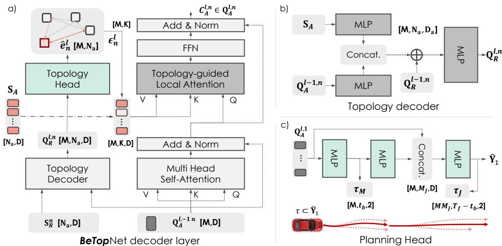  
Figure 6: Structural details in BeTopNet. a) The learning structure of single synergistic decoder layer featuring TransDecoder and TopoAttn design; b) The structure inside topology decoder network of TopoDecoder; c) Branched planning head design corresponding to contingency planning.

## C Implementation Details

In this section, we instantiate further details for BeTop on the configurations for BeTopNet structure, and provide contingency learning paradigms for both prediction and planning challenges.

## C.1 Model Structure

Subjecting to different testing requirements defined in nuPlan and WOMD, we set up two model variants for BeTopNet in formulating planning and prediction challenges. Apart from topology reasoning for interactive behaviors, for planning challenges, BeTopNet integrates both tasks of prediction and planning. In the prediction challenges under marginal and joint settings, BeTopNet is allocated only with the prediction parts. The structural details are illustrated below.

Scene inputs. Carving the driving scenarios involves historical agent states X and map polylines M as scene inputs. For planning settings, we collect scene agent states with past $T _ { h } = \bar { 2 }$ seconds at 10Hz, leaving basic kinematic states as $( x , y , v _ { x } , v _ { y } , \theta )$ , joining with agent shapes and types. We only keep the current state for ego vehicle (AV) in preventing closed-loop gap [73, 69, 88] with open-loop training as recently discussed in the community. $N _ { m } = 2 5 6$ segments of the map with length $L _ { m } = 2 0$ are gathered by scene-centric manners considering positions, traffic lights, and speed limits. The prediction task is built on WOMD considering $T _ { h } = 1$ seconds at 10Hz with scenarios of larger scalability. It is followed by full scene agents with $N _ { m } = 7 6 8$ map segments of identical states for both X and M.

Scene encoder. Both scene attributes X, M are firstly encoded leveraging layered point encoder [89] to hidden dimension D shared throughout the BeTopNet structures, with $D = 1 2 8$ for planning and $D = 2 5 6$ for prediction tasks. A stack of Transformer encoders is then devised with 4 layers in planning and 6 in prediction for $\mathbf { S } _ { A } , \mathbf { S } _ { M }$ . Due to scalable settings for prediction tasks, local attention with the nearest 16 keys is built in each layer. Following [22, 73], the dense prediction head is adopted for all agents after the encoder, enhancing future semantics.

Synergistic decoder. Depicted in Fig. 6, the decoder structure is founded by an iterative stack of L Transformer decoders querying M modes of future trajectories Yˆ with dual stream in reasoning topology ${ \hat { \mathcal { E } } } .$ Consisting of $L = 6$ and $L = 4$ decoders for prediction and planning respectively, it is initialized jointly by relative features $\mathbf { Q } _ { R } ^ { 0 , n }$ and decoding queries $\mathbf { Q } _ { A } ^ { 0 , n }$ . Relative attributes $\mathbf { S } _ { R }$ are computed efficiently following [64] for relative distance and headings. $M = 6$ learnable embedding are devised as $\mathbf { Q } _ { A } ^ { 0 , { \dot { n } } }$ for planning, and we utilize the anchored ones [22] with $M = 6 4$ in prediction tasks. As displayed in Fig. 6(a), dual queries $\mathbf { Q } _ { A } ^ { j - 1 , n } , \mathbf { Q } _ { R } ^ { j - 1 , n }$ are served from the last level. The decoding process (following Eq. (3)) iteratively reasons $\hat { e } _ { n } ^ { l }$ from TopoDecoder, serving as a prior guiding agent semantics by TopoAttn inside TransDecoder, which concurrently aggregates scene semantics from agents $\mathbf { S } _ { A }$ and maps $\mathbf { S } _ { M }$ . Expressly, the structure of TopoDecoder (Fig. 6(b)) comprises simple MLPs and update $\mathbf { Q } _ { R } ^ { l , n }$ by concatenation sourcing query features $\mathbf { Q } _ { A } ^ { j - 1 , n }$ with agent semantics $\mathbf { S } _ { A }$ , and connect residuals $\mathbf { Q } _ { R } ^ { \bar { l } - 1 , n }$ from last layer. Decoding queries $\mathbf { Q } _ { A } ^ { l , n }$ is updated by a concatenation from aggregated agent feature $\mathbf { C } _ { A } ^ { l , n }$ , map features $\mathbf { C } _ { M } ^ { l , n }$ , and agent semantics $\mathbf { S } _ { A } ^ { n }$ directly from encoder. Agent feature $\mathbf { C } _ { A } ^ { l , n }$ is aggregated by TopoAttn, where the local attention is devised using deployments from [90] indexing $K = 3 2$ agents from reasoned topology $\hat { e } _ { n } ^ { l }$ . We omit the aggregation process for map features, which performs the vanilla Transformer decoder structure for planning and dynamic collection form by [22] under prediction tasks for hefty map features.

Reason heads. Following the contents in Sec. 3.2, reason heads in decoding prediction and topology follow simple MLPs given respective decoding queries. For the planning head, it leverages a cascaded design for branched contingency planning with multi-modalities (Fig. 6(c)). Specifically, the short-planning $\tau _ { M }$ is decoded by the AV future states $\{ \hat { y } _ { 1 } ^ { 1 : t _ { b } } \} _ { m }$ from first stage head with $m \in M$ modes, where $t _ { b } = 3$ denotes the branching time. They are then detached and leveraged as prior for the branched planning. Successive MLPs project and reshape the short-term contingency prior by $\mathbb { R } ^ { M \times M _ { J } \times D }$ for $M _ { J } = 6$ branches planning $\dot { \tau } _ { J } ^ { m }$ under each of $\tau _ { M } ^ { m }$ . Further concatenated by broadcasted decoding queries, the planning head generates $M \cdot M _ { J }$ trajectories $\hat { \mathbf { Y } } _ { 1 }$ 1 for AV.

## C.2 Imitative Contingency Learning

Efficient joint prediction recombination. Retrieving the top-performed joint predictions from full marginal predictions $\hat { Y } _ { M }$ sequentially is time-consuming with exponentially complexity. Hence, we firstly downscale the potentially interested agents $N _ { I }$ by sorting the AV-reasoned topology $\hat { e } _ { 1 } ^ { L }$ with the largest $K _ { M } = 4$ value as index given the planning task. For the joint prediction task, $N _ { I } = 2$ is annotated already from the original data. Then, we leverage the tensor broadcasting mechanism in efficiently retrieving $M = 6$ largest joint distributions $P ( \hat { Y } _ { J } ^ { M } )$ and joint trajectories $\hat { Y } _ { J } ^ { M }$ from $N _ { I }$ interacted agents. Given a tensor $\mathbf { P } _ { J } \in \mathbb { R } ^ { M ^ { N _ { I } } }$ initialized by ones, the joint score is computed by $N _ { I }$ times of iterative broadcasting ${ \hat { \mathbf { p } } } _ { n }$ on the n-th dimension for $\mathbf { P } _ { J }$ as $\begin{array} { r } { P _ { J } = \operatorname* { m a x } _ { M } \prod _ { n } ^ { N _ { I } } \mathbf { P } _ { J } ^ { ( n ) } \otimes \hat { \mathbf { p } } _ { n } } \end{array}$ This process only costs 1.6ms in computing $N _ { I } = 4$ joint predictions for contingency planning.

Imitative contingency objectives. Followed by learning objectives derived in Sec. 3.3, the imitation objectives for each layer can be represented as $\mathcal { L } _ { \mathrm { I L } } = \bar { \mathcal { L } _ { \mathcal { V } } } + \lambda _ { 1 } \mathcal { L } \varepsilon . ~ \lambda _ { 1 } = 5 0$ weighting BCE loss for edge topology reasoning, the NLL loss for ${ \mathcal { L } } _ { \nu }$ is formulated as:

$$
\begin{array} { r } { \mathcal { L } _ { \mathrm { N L L } } = \log \sigma _ { x } + \log \sigma _ { y } + \frac { \log \left( 1 - \rho ^ { 2 } \right) } { 2 } + \frac { 1 } { 2 ( 1 - \rho ^ { 2 } ) } \left( \left( \frac { d _ { x } } { \sigma _ { x } } \right) ^ { 2 } + \left( \frac { d _ { y } } { \sigma _ { y } } \right) ^ { 2 } - 2 \rho \frac { d _ { x } d _ { y } } { \sigma _ { x } \sigma _ { y } } \right) - \log p ( m ^ { * } ) , } \end{array}\tag{10}
$$

where $d _ { x } , d _ { y }$ denotes the difference with ground-truths. In determining the component $m ^ { * }$ , we leverage a winner-take-all (WTA) strategy [91] in planning by measuring the average displacements (ADE) with groung-truths. For prediction tasks, $m ^ { * }$ is selected from the closest anchor as in [53]. For the learnable cost functions max $C _ { M } ( \cdot ) , C _ { J } ( \cdot )$ in contingency planning, we leverage the repulsive potential field [8] delineating planning with prediction by $\phi = \mathrm { m i n } _ { d } 1 / ( 1 + d ( \tau , \hat { \mathbf { y } } ) )$ ). For max $C _ { M } ( \cdot )$ ϕ is gathered across $T _ { f }$ considering the worst case under full marginal prediction $\hat { Y } _ { M }$ comprising $N _ { a } = 3 2$ scene agents. For the branched cost $C _ { J } ( \cdot )$ , ϕ for each branch is computed considering joint prediction from $N _ { I } = 4$ agents. Following the objective defined in Eq. (6), the learnable contingency cost is defined as: $\begin{array} { r } { \mathcal { L } _ { \mathrm { C L } } = C _ { M } + \sum _ { m } ^ { M } P ( \hat { Y } _ { J } ^ { m } ) C _ { J } ^ { m } } \end{array}$ . Hence, the general objectives for planning become:

$$
\begin{array} { r } { \mathcal { L } = \mathcal { L } _ { \mathcal { V } } + \lambda _ { 1 } \mathcal { L } _ { \mathcal { E } } + \lambda _ { 2 } \mathcal { L } _ { \mathrm { C L } } , } \end{array}\tag{11}
$$

where $\lambda _ { 2 } = 5$ is the contingency costs weight. Prediction tasks are updated only by ${ \mathcal { L } } _ { \mathrm { I L } }$ .

Inference. Different from the training process, for the planning task we directly select the full planning trajectory of $T _ { f } = 8$ seconds by highest scoring $\tau ^ { * } = \mathrm { a r g m a x } _ { C } \hat { \mathbf { Y } } _ { 1 }$ , subjecting to the original task settings in nuPlan. The scoring results are a combination from original confidence $\hat { { \bf p } } _ { 1 }$ and the short-term cost $C _ { M } \ [ 6 9 ] \colon C = { \hat { \mathbf { p } } } _ { 1 } + \lambda _ { m } C _ { M }$ , where $\lambda _ { m } = 0 . 5$ facilitates short-term planning compliance [92]. For the prediction task, a post-processing module following [53] is leveraged in selecting $M = 6$ marginal or joint trajectories of $\dot { T } _ { f } = 8$ seconds among 3 agent types in WOMD.

## D Experimental Setup Details

In this section, we provide extra details demonstrated in Sec. 4 for the experiment setups, including detailed settings for the proposed benchmark, testing metrics, state-of-the-art baselines, and training.

## D.1 Planning on nuPlan

Testing metrics. For open-loop planning tests, the open-loop score (OLS) serves as the general statistics weighting displacement metrics and miss rates. For closed-loop simulations, both metrics (CLS, CLS-NR) are weighted by a series of statistics measuring 1) driving safety, 2) planning progress, 3) driving comforts, and 4) rule obeying. The PDMScore [93, 94] compared in Table 3 is basically a replica of the closed-loop score for efficient computations. It is denoted as:

$$
\mathtt { P D M } _ { \mathtt { S c o r e } } = \mathtt { C A } \cdot \mathtt { D A C } \cdot \mathtt { D D C } \cdot \frac { w _ { 1 } \mathtt { T T C } + w _ { 2 } \mathtt { D C } + w _ { 3 } \mathtt { E P } } { \sum w _ { i } } ,\tag{12}
$$

where the sub-metrics are abbreviations referred in Table 3. All general metrics range from 0 to 1.

Test14-Inter. We launch the Test14-Inter benchmark in verifying the planning systems under typical corner cases containing rich social interactions, or dynamic profiles by complex map forms. This is highly motivated by the issues raised in [69, 88], that massive scenarios may also be completed by a simple motion model. Specifically, we adopt a mining heuristic defining corner cases by which human experts excel but the motion model (constant acceleration vehicle, CAV) fails. For efficient mining, we directly assess planning results by PDMScore and define the criteria as:

$$
\begin{array} { r } { ( \mathtt { P D M } _ { \mathtt { S c o r e } } \mathtt { C A V } < \gamma ) \wedge \big ( \mathtt { P D M } _ { \mathtt { S c o r e } } \mathtt { E x p e r t } \ge ( 1 - \gamma ) \big ) , } \end{array}\tag{13}
$$

where $\gamma = 0 . 1$ denotes a scoring threshold for cases that cannot be easily solved by regular motion profiles of the planning maneuvers. As future work, we aim to explore more interactive scenarios aggravating by BeTop as an enhancement.

Val14. In pursuing comprehensive comparisons with current methods, we also manifest BeTopNet in the Val14 set proposed in [69]. It is a subset of 1040 scenes from the validation set. However, since a portion of validation scenes are shared with the training set in nuPlan [80], we argue this is less representative of testing fairness for learning-based methods. Hence, we only place it as supplementary.

Baselines. For all baselines presented in the planning task, we directly report their previous benchmark results. Additional results in the proposed benchmark (Table 3) and ablation studies (Table 6) are re-implemented by the official releases [69, 72, 47, 69]. Expressly, we study the state-of-the-art planning systems categorized by: 1) Rule-based: performing maneuvers by designate rules with the reactive agents [70] or mimicking the planning score [69]; 2) Hybrid: incorporating rules [69] or post-optimizations [8] with a learning-based model; and 3) Learning-based: end-to-end planning with GNN [83, 74] or Transformer [72, 73] enabled models, as well as concurrent methods [92] augmented by representation learning. For ablation studies in Table 6, BeTop is trained directly by the proposed topology decoder with the original PlanT [73] pipeline. For the PDM [69] as a rule-based planning system, we integrate BeTop by replacing the original rule-based motion model with predictions generated from BeTopNet.

## D.2 Prediction on WOMD

Testing metrics. For the prediction task, the mean AP (mAP) and Soft-mAP scores are assigned as the primary metrics in computing multi-modal predictions modeled by marginal or joint distributions [35, 81, 82]. Displacement metrics of minADE and minFDE provide the multi-modal prediction errors closest to ground truths without considering the prediction scores.

Baselines. We also directly provide the prediction results displayed on the official leaderboards in Tables 4 and 5. Ablation studies in Table 7 are reproduced by the official codes [22, 53]. The prediction performance of BeTopNet is compared against SOTA baselines by: 1) GNN-enabled interactive graph [37, 24]; 2) conditional or game-theoretic behavioral interactions [31, 8]; 3) DETRbased Transformer attentions [22, 25, 53, 86]; and 4) auto-regressive modeling [32].

Table 9: Detailed nuPlan closed-loop simulation results in Val14 benchmark. BeTopNet highlights leading results among SOTA methods in safety and compliance, outperforms learning-based agents.
<table><tr><td rowspan="2">Type</td><td rowspan="2">Method</td><td colspan="7">Val14</td></tr><tr><td>CA↑</td><td>TTC ↑</td><td>DDC↑</td><td>DC↑ EP↑</td><td>Speed ↑</td><td>CLS-NR ↑</td><td>CLS-R ↑</td></tr><tr><td>Expert</td><td>Log Replay</td><td>0.987</td><td>0.944</td><td>0.981</td><td>0.993 0.989</td><td>0.965</td><td>0.937</td><td>0.812</td></tr><tr><td rowspan="2">Rule</td><td>IDM [70]</td><td>0.909</td><td>0.834</td><td>0.941</td><td>0.944</td><td>0.862 0.973</td><td>0.793</td><td>0.793</td></tr><tr><td>PDM-Closed [69]</td><td>0.981</td><td>0.933</td><td>0.998</td><td>0.955 0.921</td><td>0.998</td><td>0.932</td><td>0.930</td></tr><tr><td>Hybrid</td><td>GameFormer [8]</td><td>0.943</td><td>0.867</td><td>0.948</td><td>0.933</td><td>0.890 0.987</td><td>0.829</td><td>0.838</td></tr><tr><td rowspan="7">Learning</td><td>UrbanDriver [74]</td><td>0.856</td><td>0.803</td><td>0.908</td><td>1.000 0.808</td><td>0.915</td><td>0.677</td><td>0.648</td></tr><tr><td>PDM-Open [69]</td><td>0.745</td><td>0.691</td><td>0.879</td><td>0.995 0.698</td><td>0.977</td><td>0.502</td><td>0.548</td></tr><tr><td>PlanCNN [72]</td><td>0.869</td><td>0.814</td><td>0.850</td><td>0.814 0.806</td><td>0.980</td><td>0.669</td><td>0.646</td></tr><tr><td>GC-PGP [83]</td><td>0.858</td><td>0.801</td><td>0.897</td><td>0.900 0.603</td><td>0.993</td><td>0.611</td><td>0.549</td></tr><tr><td>PlanTF [73]</td><td>0.941</td><td>0.907</td><td>0.968</td><td>0.937 0.898</td><td>0.977</td><td>0.853</td><td>0.771</td></tr><tr><td>PLUTO [92]</td><td>0.961</td><td>0.933</td><td>0.985</td><td>0.964 0.895</td><td>0.981</td><td>0.890</td><td>0.800</td></tr><tr><td>BeTopNet (Ours)</td><td>0.966</td><td>0.916</td><td>0.995</td><td>0.932 0.866</td><td>0.971</td><td>0.883</td><td>0.837</td></tr></table>

Table 10: Detailed nuPlan closed-loop planning results (PDMScore) on Test14-Random benchmark.
<table><tr><td rowspan="2">Type</td><td rowspan="2">Method</td><td colspan="7">Test14 Random</td></tr><tr><td>Col. Avoid ↑</td><td>Drivable ↑</td><td>Direction ↑</td><td>Progress ↑</td><td>TTC ↑</td><td>Comfort ↑</td><td>PDMScore ↑</td></tr><tr><td>Expert</td><td>Log Replay</td><td>0.996</td><td>0.962</td><td>0.996</td><td>0.664</td><td>0.985</td><td>1.000</td><td>0.832</td></tr><tr><td>Rule</td><td>PDM-Closed [69]</td><td>0.934</td><td>0.984</td><td>0.996</td><td>0.867</td><td>0.911</td><td>0.996</td><td>0.888</td></tr><tr><td rowspan="5">Learning</td><td>Constant Acc.</td><td>0.846</td><td>0.907</td><td>0.915</td><td>0.436</td><td>0.804</td><td>1.000</td><td>0.592</td></tr><tr><td>UrbanDriver [74]</td><td>0.965</td><td>0.961</td><td>0.986</td><td>0.611</td><td>0.957</td><td>1.000</td><td>0.788</td></tr><tr><td>PlanCNN [72]</td><td>0.935</td><td>0.938</td><td>0.971</td><td>0.591</td><td>0.888</td><td>0.989</td><td>0.736</td></tr><tr><td>PlanTF [73]</td><td>0.966</td><td>0.948</td><td>0.625</td><td>0.626</td><td>0.918</td><td>0.992</td><td>0.768</td></tr><tr><td>BeTopNet (Ours)</td><td>0.989</td><td>0.977</td><td>0.989</td><td>0.673</td><td>0.969</td><td>1.000</td><td>0.833</td></tr></table>

Table 11: Detailed nuPlan closed-loop planning results (PDMScore) on Test14-Hard benchmark.
<table><tr><td rowspan="2">Type</td><td rowspan="2">Method</td><td colspan="7">Test14 Hard</td></tr><tr><td>Col. Avoid ↑</td><td>Drivable ↑</td><td>Direction ↑</td><td>Progress ↑</td><td>TTC ↑</td><td>Comfort ↑</td><td>PDMScore ↑</td></tr><tr><td>Expert</td><td>Log Replay</td><td>0.985</td><td>0.945</td><td>0.970</td><td>0.658</td><td>0.955</td><td>1.000</td><td>0.786</td></tr><tr><td>Rule</td><td>PDM-Closed [69]</td><td>0.933</td><td>0.952</td><td>0.976</td><td>0.779</td><td>0.852</td><td>0.981</td><td>0.811</td></tr><tr><td rowspan="5">Learning</td><td>Constant Acc.</td><td>0.845</td><td>0.871</td><td>0.861</td><td>0.415</td><td>0.800</td><td>1.000</td><td>0.552</td></tr><tr><td>UrbanDriver [74]</td><td>0.946</td><td>0.944</td><td>0.992</td><td>0.581</td><td>0.903</td><td>1.000</td><td>0.731</td></tr><tr><td>PlanCNN [72]</td><td>0.909</td><td>0.908</td><td>0.937</td><td>0.555</td><td>0.860</td><td>0.992</td><td>0.675</td></tr><tr><td>PlanTF [73]</td><td>0.984</td><td>0.961</td><td>0.996</td><td>0.649</td><td>0.961</td><td>0.996</td><td>0.813</td></tr><tr><td>BeTopNet (Ours)</td><td>0.968</td><td>0.945</td><td>0.972</td><td>0.747</td><td>0.908</td><td>0.996</td><td>0.813</td></tr></table>

## D.3 Training Setup

BeTopNet for both prediction and planning tasks are trained in end-to-end manners by AdamW optimizer with 4 NVIDIA A100 GPUs. The learning rate is configured as $1 e ^ { - 4 }$ scheduled with the multi-step reduction strategy. The planning model is trained by 25 epochs with a batch size of 128, while the prediction task is trained with 30 epochs with a batch of 256.

## E Additional Quantitative Results

## E.1 Planning

Additional planning results in Val14. We evaluate the closed-loop simulation performance under Val14 in Table 9, BeTopNet hovers strong planning results and is comparable (+4.6% CLS) to concurrent learning-based methods [92] leveraging extra contrasting learning for training augmentations. BeTopNet is also featured by leading driving safety (+2.7% CA, +1.0% TTC) and compliance (+2.8% DDC) compared with other strong models [73, 8]. However, due to the data leakage of Val14 with training set by a part of shared scenarios, we only provide the results as a reference.

Additional planning effects in Test14. To delve into the planning results of BeTopNet, we present statistics measuring by another detailed metric, PDMScore, for both of the Test14 benchmarks in Table 2. Exhibited in Tables 10 and 11, BeTopNet delivers strong maneuver safety and compliance, marking solid PDMScore from both benchmarks. Compared with learning-based methods, BeTopNet excels in closed-loop driving progress (+15.1%, +7.5% EP), safety (+5.6% TTC, +2.9% CA), and the general score (+8.5% PDMScore). For rule-based systems, the leading performance is empirically by virtue of a constant driving progress. This may refer to an unresolved copy-cat problem [73] for imitative planners. It requires further integration and fallback with rule-based methods for on-board AD system design in practice.

Table 12: Marginal predictions on WOMD Motion Leaderboard [81]. Primary metric.
<table><tr><td>Category</td><td>Method</td><td>minADE↓</td><td>minFDE↓</td><td>Miss Rate ↓</td><td>mAP ↑</td><td>Soft mAP ↑</td></tr><tr><td rowspan="3">Vehicle</td><td>MTR [22]</td><td>0.7642</td><td>1.5257</td><td>0.1514</td><td>0.4494</td><td>0.4590</td></tr><tr><td>EDA [53]</td><td>0.6808</td><td>1.3921</td><td>0.1164</td><td>0.4833</td><td>0.4972</td></tr><tr><td>BeTopNet (Ours)</td><td>0.6814</td><td>1.3888</td><td>0.1172</td><td>0.4860</td><td>0.4995</td></tr><tr><td rowspan="2">Pedestrian</td><td>MTR [22]</td><td>0.3486</td><td>0.7270</td><td>0.0753</td><td>0.4331</td><td>0.4409</td></tr><tr><td>EDA [53] BeTopNet (Ours)</td><td>0.3426 0.3451</td><td>0.7080 0.7142</td><td>0.0670</td><td>0.4680</td><td>0.4778</td></tr><tr><td rowspan="3">Cyclist</td><td>MTR [22]</td><td>0.7022</td><td>1.4093</td><td>0.0668</td><td>0.4777</td><td>0.4875</td></tr><tr><td>EDA [53]</td><td>0.6920</td><td>1.4106</td><td>0.1786 0.1673</td><td>0.3561 0.3947</td><td>0.3650</td></tr><tr><td>BeTopNet (Ours)</td><td>0.6905</td><td>1.3975</td><td>0.1688</td><td>0.4060</td><td>0.4037 0.4163</td></tr></table>

Table 13: Joint predictions on WOMD Interaction Leaderboard [82]. Primary metric.
<table><tr><td>Category</td><td>Method</td><td>minADE↓</td><td>minFDE↓</td><td>Miss Rate ↓</td><td>mAP↑</td><td>Soft mAP ↑</td></tr><tr><td>Vehicle</td><td>GameFormer [8] AMP [32] BeTopNet (Ours)</td><td>1.0499 0.9862 1.0216</td><td>2.4044 2.2286 2.3970</td><td>0.4321 0.3726 0.3738</td><td>0.2469 0.3104 0.3374</td><td>0.2564 0.3196 0.3308</td></tr><tr><td>Pedestrian</td><td>GameFormer [8] AMP [32] BeTopNet (Ours)</td><td>0.7978 0.6823 0.7862</td><td>1.8195 1.5244 1.8412</td><td>0.4713 0.3716 0.4074</td><td>0.1962 0.2359 0.2212</td><td>0.2014 0.2423 0.2267</td></tr><tr><td>Cyclist</td><td>GameFormer [8] AMP [32] BeTopNet (Ours)</td><td>1.0686 1.0533 1.1155</td><td>2.4199 2.3715 2.5850</td><td>0.5765 0.5194 0.5253</td><td>0.1367 0.1420 0.1717</td><td>0.1338 0.1477 0.1756</td></tr></table>

## E.2 Prediction

Per-category marginal prediction. In Table 12, We mainfest the prediction performance of BeTop-Net under each prediction category. Compared against the concurrent SOTA motion predictors [53], BeTopNet demonstrates superior mAP-based metrics among all types for compliant predictions. Specifically, overall improvements in Cyclist denote refined interactive patterns captured by BeTop, as the cyclist predictions are the most uncertain task with less reliance on map information.

Per-category joint prediction. We further instantiate the per-category joint prediction of BeTopNet with SOTA methods in Table 13. Compared with concurrent methods [32] featuring auto-regressive decoding, BeTopNet achieves robust displacement metrics, while outperforming in prediction compliance of mAP metrics (+8.7%, +20.9% mAP) due to advanced joint modality scoring stabilized by edge topology in BeTopNet. Moreover, the coordinated joint behaviors reasoned by BeTopNet largely mitigate the unstable patterns against game-theoretic method [8] (−15.6%, −15.7%, −9.7% Miss Rate) under similar model architecture.

## F Additional Ablation Studies

Scaling effects of model and decoding agents. The scalability challenges begin with the scaling of our BeTopNet models to accommodate varying scene agents and map. Experimentally, we configure BeTopNet with different model scales to evaluate whether our approach maintains its effectiveness.

In Table 14, BeTopNet is evaluated by three model scales varying in decoding modalities and dimensions. The results demonstrate that BeTopNet consistently improves prediction accuracy, with an increase from 0.391 to 0.442 (+13.4% mAP) and a decrease in the Miss Rate (−11.9%). This showcases its enhanced robustness in handling multi-agent settings by enlarging model scales.

In Table 15, BeTopNet reports comparable computational costs compared to [22], while with better prediction accuracy shown in Table 12. The similar latency is due to the topo-guided attention, which reduces the KV features in agent aggregation during decoding. While BeTop introduces extra computations for reasoning, it requires more GPU memory for cached topology tensors.

Table 14: Effects of varied model scale. BeTopNet shows scalability with the number of decoding modalities and feature dimensions.
<table><tr><td>Scale</td><td>mAP↑</td><td>Miss Rate ↓</td><td>Latency (ms)</td><td># Params. (M)</td></tr><tr><td>Small</td><td>0.391</td><td>0.131</td><td>45</td><td>28.91</td></tr><tr><td>Medium</td><td>0.437</td><td>0.119</td><td>65</td><td>28.91</td></tr><tr><td>Base</td><td>0.442</td><td>0.117</td><td>70</td><td>45.38</td></tr></table>

Table 15: Effects of varied decoding agents. Computational costs of [22] are reported in the parenthesis after ours.
<table><tr><td># Decoding Agents</td><td>Latency (ms)</td><td>GPU Memory (G)</td></tr><tr><td>8</td><td>89 (84)</td><td>6.5 (5.2)</td></tr><tr><td>16</td><td>120 (123)</td><td>10.8 (7.1)</td></tr><tr><td>32</td><td>166 (193)</td><td>19.2 (15.6)</td></tr></table>

Table 16: Effects of varied temporal granularity in BeTop. Future interactions are split into various intervals for multi-step BeTop labels. A fine-grained topology reasoning for the whole prediction horizon results in a slightly improved performance and increased computational costs simultaneously.
<table><tr><td>Interval</td><td>minADE↓</td><td>minFDE↓</td><td>Miss Rate ↓</td><td>mAP↑</td><td>Inference Latency (ms)</td><td>Training Latency (ms)</td><td># Params. (M)</td></tr><tr><td>1(Base)</td><td>0.637</td><td>1.328</td><td>0.144</td><td>0.392</td><td>70.0</td><td>101.6</td><td>45.380</td></tr><tr><td>2</td><td>0.633</td><td>1.325</td><td>0.145</td><td>0.394</td><td>75.5</td><td>110.6</td><td>45.382</td></tr><tr><td>4</td><td>0.634</td><td>1.326</td><td>0.142</td><td>0.391</td><td>80.0</td><td>133.4</td><td>45.386</td></tr><tr><td>8</td><td>0.641</td><td>1.347</td><td>0.147</td><td>0.389</td><td>90.0</td><td>255.0</td><td>45.393</td></tr></table>

Table 17: Effects of varied model foundation by Wayformer [62]. Synergistic decoder design by BeTopNet demonstrate solid multi-agent interaction understanding compared with vanilla design.
<table><tr><td>Method</td><td>minADE↓</td><td>minFDE↓</td><td>Miss Rate ↓</td><td>mAP↑</td></tr><tr><td>Wayformer</td><td>0.661</td><td>1.417</td><td>0.199</td><td>0.281</td></tr><tr><td>Wayformer+BeTop</td><td>0.637</td><td>1.364</td><td>0.178</td><td>0.290</td></tr><tr><td>Wayformer+BeTopNet</td><td>0.604</td><td>1.261</td><td>0.166</td><td>0.344</td></tr></table>

Temporal granularity in BeTop. Table 16 explores the effect of varied temporal granularity in BeTop, with minimal adjustments to BeTopNet. In our study, future interactions are split into multistep BeTop labels. Topology reasoning task is then deployed through expanded MLP Topo Head for output steps. Compared to the baseline 1-step reasoning, multi-step BeTop reasoning slightly improves performance (e.g., 2-steps, +0.2 mAP), with a corresponding increase in computational costs for additional steps. This highlights the potential of multi-step reasoning to enhance BeTopNet in interactive scenarios, while refining temporal granularity for more accurate and efficient interactions remains an open question. We believe how to effectively leverage multi-step BeTopNet represents an interesting area for future exploration.

Synergy with additional model foundation. To understand the generalization under different model foundations, we conduct additional ablations integrating BeTop with reproduced Wayformer [62] in [95]. As reported in Table 17, incorporating BeTop as supervision improves vanilla Wayformer with a −6.2% Miss Rate and +3.2% mAP. Furthermore, integrating BeTopNet significantly boosts performance, achieving a +18.6% mAP and −7.2% Miss Rate. This enhancement is due to synergistic decoder design, which uses iterative BeTop reasoning and Topo-guided attention to refine trajectories by selectively aggregating interactive features.

## G Additional Qualitative Results

Additional planning results. We provide the qualitative closed-loop simulations for all of the benchmarks in Test14, as shown in Figs. 7 and 8.

Additional prediction results. We provide the qualitative prediction results for BeTop with reasoned edge topology under both marginal (Fig. 10) and joint (Fig. 9) challenge settings.

## H License of Assets

Data for nuPlan [80] and WOMD [35] are complied with CC-BY-NC 4.0 licence and Apache License 2.0; The code for re-implementations are under Apache License 2.0 for PDM [69] and MTR [22], and

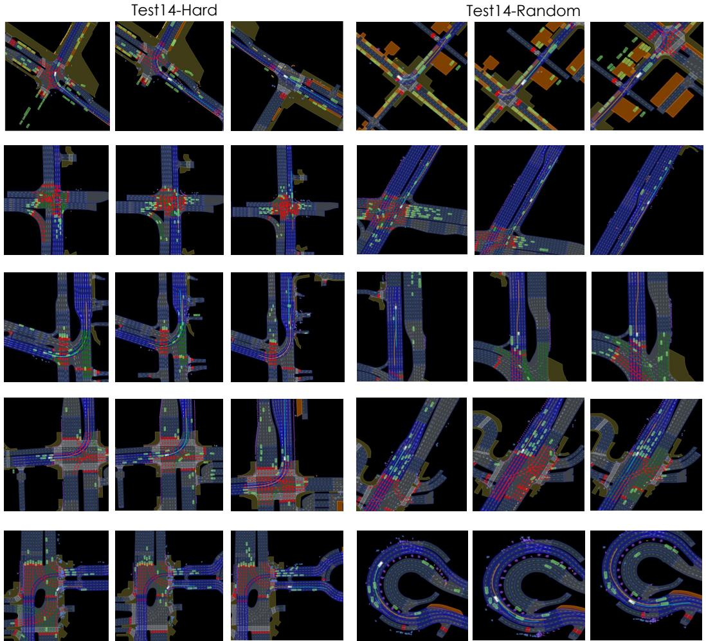  
Figure 7: Qualitative results of BeTopNet in nuPlan planning under Test14 simulations. Each row of the figures render closed-loop simulations at 1s, 8s, and 15s temporal frames. As illustrated, BeTopNet performs consistent planning under challenging driving scenarios of diverse categories.

MIT License for EDA [53] and PlanTF [73], respectively. The source code and our trained models will be publicly available under the Apache License 2.0.

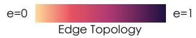

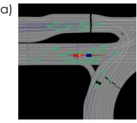

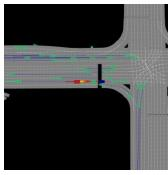

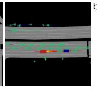

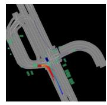

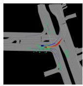

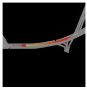

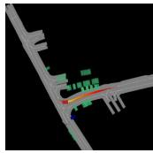

Joint Probability  
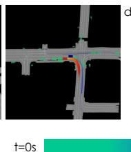

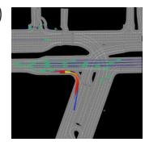

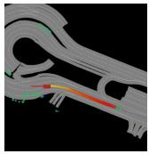

Prediction  
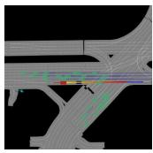

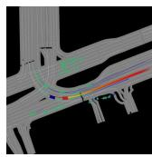  
Planning

Figure 8: Qualitative results of BeTopNet in nuPlan planning under Test14-Inter. BeTopNet performs compliant planning under: (a) yielding to front agents; (b) cruising on various road structure; (c-d) interactive behaviors among two or more agents with dense traffic.  
Vehicle to vehicle (V2V)  
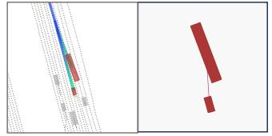

Vehicle to cyclist (V2C)  
Vehicle to pedestrian (V2P)  
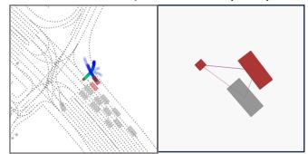

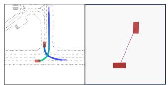

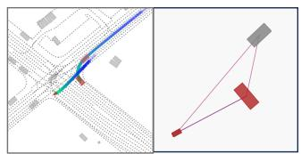

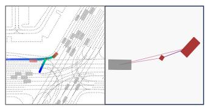

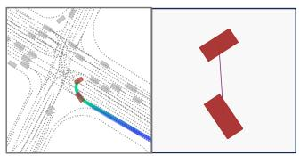

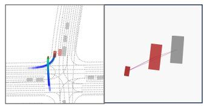

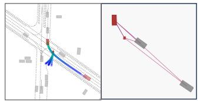

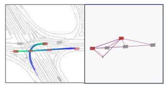

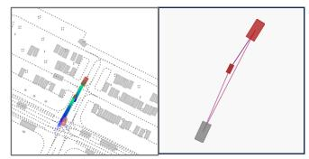

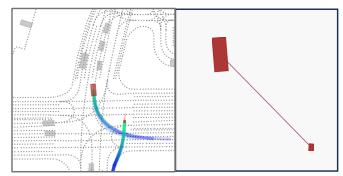

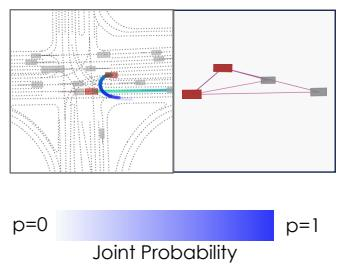

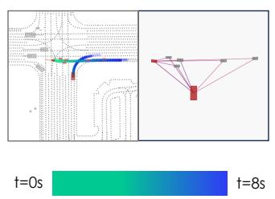  
Prediction

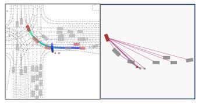  
Figure 9: Qualitative results of BeTopNet in WOMD joint prediction. Joint predictions among heterogeneous agents are categorized by each column (V2V, V2C, and V2P) with corresponding TopK reasoned topology. As depicted, BeTopNet can accurately capture the future interactive behaviors via edge topology reasoning compared with the human annotations of interactive agents (rendered in red). Moreover, BeTopNet may source on potential interactions as rendered in grey.

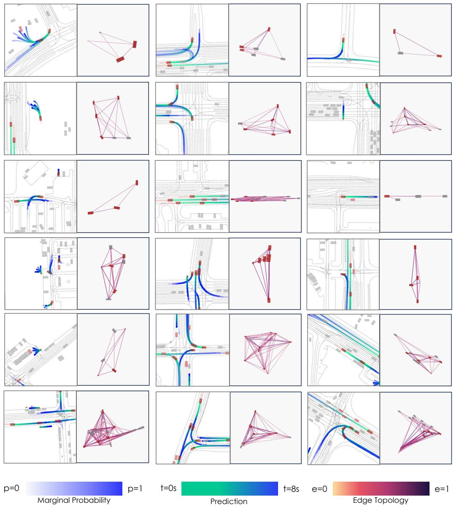  
Figure 10: Qualitative results of BeTopNet in WOMD marginal prediction. BeTopNet performs compliant and accurate marginal predictions on multiple agents, reasoning diverse edge topology which stabilizes the behavioral patterns for future interactions.

## NeurIPS Paper Checklist

## 1. Claims

Question: Do the main claims made in the abstract and introduction accurately reflect the paper’s contributions and scope?

Answer: [Yes]

Justification: Clear introduction with contributions and scopes in Sec. 1. We provide extra insightful Q&A in Appendix A to further position our scope.

Guidelines:

• The answer NA means that the abstract and introduction do not include the claims made in the paper.

• The abstract and/or introduction should clearly state the claims made, including the contributions made in the paper and important assumptions and limitations. A No or NA answer to this question will not be perceived well by the reviewers.

• The claims made should match theoretical and experimental results, and reflect how much the results can be expected to generalize to other settings.

• It is fine to include aspirational goals as motivation as long as it is clear that these goals are not attained by the paper.

## 2. Limitations

Question: Does the paper discuss the limitations of the work performed by the authors?

Answer: [Yes]

Justification: We discuss limitations in Sec. 5.

Guidelines:

• The answer NA means that the paper has no limitation while the answer No means that the paper has limitations, but those are not discussed in the paper.

• The authors are encouraged to create a separate "Limitations" section in their paper.

• The paper should point out any strong assumptions and how robust the results are to violations of these assumptions (e.g., independence assumptions, noiseless settings, model well-specification, asymptotic approximations only holding locally). The authors should reflect on how these assumptions might be violated in practice and what the implications would be.

• The authors should reflect on the scope of the claims made, e.g., if the approach was only tested on a few datasets or with a few runs. In general, empirical results often depend on implicit assumptions, which should be articulated.

• The authors should reflect on the factors that influence the performance of the approach. For example, a facial recognition algorithm may perform poorly when image resolution is low or images are taken in low lighting. Or a speech-to-text system might not be used reliably to provide closed captions for online lectures because it fails to handle technical jargon.

• The authors should discuss the computational efficiency of the proposed algorithms and how they scale with dataset size.

• If applicable, the authors should discuss possible limitations of their approach to address problems of privacy and fairness.

• While the authors might fear that complete honesty about limitations might be used by reviewers as grounds for rejection, a worse outcome might be that reviewers discover limitations that aren’t acknowledged in the paper. The authors should use their best judgment and recognize that individual actions in favor of transparency play an important role in developing norms that preserve the integrity of the community. Reviewers will be specifically instructed to not penalize honesty concerning limitations.

## 3. Theory Assumptions and Proofs

Question: For each theoretical result, does the paper provide the full set of assumptions and a complete (and correct) proof?

Answer: [Yes]

Justification: We provide comprehensive formulations in Sec. 3.1. We also provide full analytical proof in Appendix B, as well as empirical verification in Fig. 1 apart from experiments.

Guidelines:

• The answer NA means that the paper does not include theoretical results.

• All the theorems, formulas, and proofs in the paper should be numbered and crossreferenced.

• All assumptions should be clearly stated or referenced in the statement of any theorems.

• The proofs can either appear in the main paper or the supplemental material, but if they appear in the supplemental material, the authors are encouraged to provide a short proof sketch to provide intuition.

• Inversely, any informal proof provided in the core of the paper should be complemented by formal proofs provided in appendix or supplemental material.

• Theorems and Lemmas that the proof relies upon should be properly referenced.

## 4. Experimental Result Reproducibility

Question: Does the paper fully disclose all the information needed to reproduce the main experimental results of the paper to the extent that it affects the main claims and/or conclusions of the paper (regardless of whether the code and data are provided or not)?

Answer: [Yes]

Justification: Main experimental results of Sec. 4.1 are listed directly from the official leaderboards. We provide the methodology for formulation, model structure and optimization process in Sec. 3. The corresponding details for implementations and experiments are expressly illustrated in Appendices C and D.

Guidelines:

• The answer NA means that the paper does not include experiments.

• If the paper includes experiments, a No answer to this question will not be perceived well by the reviewers: Making the paper reproducible is important, regardless of whether the code and data are provided or not.

• If the contribution is a dataset and/or model, the authors should describe the steps taken to make their results reproducible or verifiable.

• Depending on the contribution, reproducibility can be accomplished in various ways. For example, if the contribution is a novel architecture, describing the architecture fully might suffice, or if the contribution is a specific model and empirical evaluation, it may be necessary to either make it possible for others to replicate the model with the same dataset, or provide access to the model. In general. releasing code and data is often one good way to accomplish this, but reproducibility can also be provided via detailed instructions for how to replicate the results, access to a hosted model (e.g., in the case of a large language model), releasing of a model checkpoint, or other means that are appropriate to the research performed.

• While NeurIPS does not require releasing code, the conference does require all submissions to provide some reasonable avenue for reproducibility, which may depend on the nature of the contribution. For example

(a) If the contribution is primarily a new algorithm, the paper should make it clear how to reproduce that algorithm.

(b) If the contribution is primarily a new model architecture, the paper should describe the architecture clearly and fully.

(c) If the contribution is a new model (e.g., a large language model), then there should either be a way to access this model for reproducing the results or a way to reproduce the model (e.g., with an open-source dataset or instructions for how to construct the dataset).

(d) We recognize that reproducibility may be tricky in some cases, in which case authors are welcome to describe the particular way they provide for reproducibility. In the case of closed-source models, it may be that access to the model is limited in some way (e.g., to registered users), but it should be possible for other researchers to have some path to reproducing or verifying the results.

## 5. Open access to data and code

Question: Does the paper provide open access to the data and code, with sufficient instructions to faithfully reproduce the main experimental results, as described in supplemental material?

Answer: [Yes]

Justification: All data, baselines and results are already publicly available [80, 35]. Code will be available.

Guidelines:

• The answer NA means that paper does not include experiments requiring code.

• Please see the NeurIPS code and data submission guidelines (https://nips.cc/ public/guides/CodeSubmissionPolicy) for more details.

• While we encourage the release of code and data, we understand that this might not be possible, so “No” is an acceptable answer. Papers cannot be rejected simply for not including code, unless this is central to the contribution (e.g., for a new open-source benchmark).

• The instructions should contain the exact command and environment needed to run to reproduce the results. See the NeurIPS code and data submission guidelines (https: //nips.cc/public/guides/CodeSubmissionPolicy) for more details.

• The authors should provide instructions on data access and preparation, including how to access the raw data, preprocessed data, intermediate data, and generated data, etc.

• The authors should provide scripts to reproduce all experimental results for the new proposed method and baselines. If only a subset of experiments are reproducible, they should state which ones are omitted from the script and why.

• At submission time, to preserve anonymity, the authors should release anonymized versions (if applicable).

• Providing as much information as possible in supplemental material (appended to the paper) is recommended, but including URLs to data and code is permitted.

## 6. Experimental Setting/Details

Question: Does the paper specify all the training and test details (e.g., data splits, hyperparameters, how they were chosen, type of optimizer, etc.) necessary to understand the results?

Answer: [Yes]

Justification: See details in Sec. 4. We also provide some settings in Appendix D and will release the code.

Guidelines:

• The answer NA means that the paper does not include experiments.

• The experimental setting should be presented in the core of the paper to a level of detail that is necessary to appreciate the results and make sense of them.

• The full details can be provided either with the code, in appendix, or as supplemental material.

## 7. Experiment Statistical Significance

Question: Does the paper report error bars suitably and correctly defined or other appropriate information about the statistical significance of the experiments?

Answer: [No]

Justification: All the experiments are tested by weighted mean metrics for official comparisons.

Guidelines:

• The answer NA means that the paper does not include experiments.

• The authors should answer "Yes" if the results are accompanied by error bars, confidence intervals, or statistical significance tests, at least for the experiments that support the main claims of the paper.

• The factors of variability that the error bars are capturing should be clearly stated (for example, train/test split, initialization, random drawing of some parameter, or overall run with given experimental conditions).

• The method for calculating the error bars should be explained (closed form formula, call to a library function, bootstrap, etc.)

• The assumptions made should be given (e.g., Normally distributed errors).

• It should be clear whether the error bar is the standard deviation or the standard error of the mean.

• It is OK to report 1-sigma error bars, but one should state it. The authors should preferably report a 2-sigma error bar than state that they have a 96% CI, if the hypothesis of Normality of errors is not verified.

• For asymmetric distributions, the authors should be careful not to show in tables or figures symmetric error bars that would yield results that are out of range (e.g. negative error rates).

• If error bars are reported in tables or plots, The authors should explain in the text how they were calculated and reference the corresponding figures or tables in the text.

## 8. Experiments Compute Resources

Question: For each experiment, does the paper provide sufficient information on the computer resources (type of compute workers, memory, time of execution) needed to reproduce the experiments?

Answer: [Yes]

Justification: We provide compute resource details and related information in Appendix D. Guidelines:

• The answer NA means that the paper does not include experiments.

• The paper should indicate the type of compute workers CPU or GPU, internal cluster, or cloud provider, including relevant memory and storage.

• The paper should provide the amount of compute required for each of the individual experimental runs as well as estimate the total compute.

• The paper should disclose whether the full research project required more compute than the experiments reported in the paper (e.g., preliminary or failed experiments that didn’t make it into the paper).

## 9. Code Of Ethics

Question: Does the research conducted in the paper conform, in every respect, with the NeurIPS Code of Ethics https://neurips.cc/public/EthicsGuidelines?

Answer: [Yes]

Justification: The research conforms the Code of Ethics in all aspects.

Guidelines:

• The answer NA means that the authors have not reviewed the NeurIPS Code of Ethics.

• If the authors answer No, they should explain the special circumstances that require a deviation from the Code of Ethics.

• The authors should make sure to preserve anonymity (e.g., if there is a special consideration due to laws or regulations in their jurisdiction).

## 10. Broader Impacts

Question: Does the paper discuss both potential positive societal impacts and negative societal impacts of the work performed?

Answer: [Yes]

Justification: We have discussed broader impacts in Q3 in Appendix A.

Guidelines:

• The answer NA means that there is no societal impact of the work performed.

• If the authors answer NA or No, they should explain why their work has no societal impact or why the paper does not address societal impact.

• Examples of negative societal impacts include potential malicious or unintended uses (e.g., disinformation, generating fake profiles, surveillance), fairness considerations (e.g., deployment of technologies that could make decisions that unfairly impact specific groups), privacy considerations, and security considerations.

• The conference expects that many papers will be foundational research and not tied to particular applications, let alone deployments. However, if there is a direct path to any negative applications, the authors should point it out. For example, it is legitimate to point out that an improvement in the quality of generative models could be used to generate deepfakes for disinformation. On the other hand, it is not needed to point out that a generic algorithm for optimizing neural networks could enable people to train models that generate Deepfakes faster.

• The authors should consider possible harms that could arise when the technology is being used as intended and functioning correctly, harms that could arise when the technology is being used as intended but gives incorrect results, and harms following from (intentional or unintentional) misuse of the technology.

• If there are negative societal impacts, the authors could also discuss possible mitigation strategies (e.g., gated release of models, providing defenses in addition to attacks, mechanisms for monitoring misuse, mechanisms to monitor how a system learns from feedback over time, improving the efficiency and accessibility of ML).

## 11. Safeguards

Question: Does the paper describe safeguards that have been put in place for responsible release of data or models that have a high risk for misuse (e.g., pretrained language models, image generators, or scraped datasets)?

Answer: [NA]

Justification: This paper poses no such risks.

Guidelines:

• The answer NA means that the paper poses no such risks.

• Released models that have a high risk for misuse or dual-use should be released with necessary safeguards to allow for controlled use of the model, for example by requiring that users adhere to usage guidelines or restrictions to access the model or implementing safety filters.

• Datasets that have been scraped from the Internet could pose safety risks. The authors should describe how they avoided releasing unsafe images.

• We recognize that providing effective safeguards is challenging, and many papers do not require this, but we encourage authors to take this into account and make a best faith effort.

## 12. Licenses for existing assets

Question: Are the creators or original owners of assets (e.g., code, data, models), used in the paper, properly credited and are the license and terms of use explicitly mentioned and properly respected?

Answer: [Yes]

Justification: We cite the papers for the used datasets and models in the paper, and list corresponding licenses in Appendix H.

Guidelines:

• The answer NA means that the paper does not use existing assets.

• The authors should cite the original paper that produced the code package or dataset.

• The authors should state which version of the asset is used and, if possible, include a URL.

• The name of the license (e.g., CC-BY 4.0) should be included for each asset.

• For scraped data from a particular source (e.g., website), the copyright and terms of service of that source should be provided.

• If assets are released, the license, copyright information, and terms of use in the package should be provided. For popular datasets, paperswithcode.com/datasets has curated licenses for some datasets. Their licensing guide can help determine the license of a dataset.

• For existing datasets that are re-packaged, both the original license and the license of the derived asset (if it has changed) should be provided.

• If this information is not available online, the authors are encouraged to reach out to the asset’s creators.

## 13. New Assets

Question: Are new assets introduced in the paper well documented and is the documentation provided alongside the assets?

Answer: [Yes]

Justification: We will release new assets including code and models. Details are in Appendix H.

Guidelines:

• The answer NA means that the paper does not release new assets.

• Researchers should communicate the details of the dataset/code/model as part of their submissions via structured templates. This includes details about training, license, limitations, etc.

• The paper should discuss whether and how consent was obtained from people whose asset is used.

• At submission time, remember to anonymize your assets (if applicable). You can either create an anonymized URL or include an anonymized zip file.

## 14. Crowdsourcing and Research with Human Subjects

Question: For crowdsourcing experiments and research with human subjects, does the paper include the full text of instructions given to participants and screenshots, if applicable, as well as details about compensation (if any)?

Answer: [NA]

Justification: This paper does not involve crowdsourcing nor research with human subjects. Guidelines:

• The answer NA means that the paper does not involve crowdsourcing nor research with human subjects.

• Including this information in the supplemental material is fine, but if the main contribution of the paper involves human subjects, then as much detail as possible should be included in the main paper.

• According to the NeurIPS Code of Ethics, workers involved in data collection, curation, or other labor should be paid at least the minimum wage in the country of the data collector.

## 15. Institutional Review Board (IRB) Approvals or Equivalent for Research with Human Subjects

Question: Does the paper describe potential risks incurred by study participants, whether such risks were disclosed to the subjects, and whether Institutional Review Board (IRB) approvals (or an equivalent approval/review based on the requirements of your country or institution) were obtained?

Answer: [NA]

Justification: This paper does not involve crowdsourcing nor research with human subjects.

Guidelines:

• The answer NA means that the paper does not involve crowdsourcing nor research with human subjects.

• Depending on the country in which research is conducted, IRB approval (or equivalent) may be required for any human subjects research. If you obtained IRB approval, you should clearly state this in the paper.

• We recognize that the procedures for this may vary significantly between institutions and locations, and we expect authors to adhere to the NeurIPS Code of Ethics and the guidelines for their institution.

• For initial submissions, do not include any information that would break anonymity (if applicable), such as the institution conducting the review.