# Test-Time Trajectory Optimization for Autonomous Driving

Yihong Xu1,\* Eloi Zablocki ´ 1,\* Yuan Yin1 Elias Ramzi1 Ellington Kirby1 Alexandre Boulch1 Matthieu Cord1,2

1valeo.ai, Paris, France 2Sorbonne Universite, CNRS, ISIR, F-75005 Paris, France´

Abstract: End-to-end planners for autonomous driving typically generate a set of candidate trajectories, score each one, and return the highest-scoring candidate. However, the scorer is applied only after the proposals are generated and cannot influence the set of trajectories: a weak set of candidates limits planning performance regardless of the scorer’s quality. We instead treat the scorer as a learned trajectory-level reward function and search for trajectories that maximize it. Our method, TOAD, runs the Cross-Entropy Method at test time, warm-started from the planner’s proposals. It requires no retraining and is plug-and-play for existing planners. Across six base planners, TOAD improves results on NAVSIM-v1 (94.7 PDMS), NAVSIM-v2 (56.3 EPDMS), and the closed-loop HUGSIM benchmark. The code will be made publicly available via the project page.

Keywords: autonomous driving, end-to-end planning, test-time optimization

## 1 Introduction

End-to-end (E2E) planning has become the leading approach for autonomous driving [1, 2, 3]. A single network maps sensor data and ego state directly to a driving trajectory. Several state-of-the-art methods share a common recipe. They first generate a finite set of candidate trajectories, either drawn from a large pre-computed vocabulary [4, 5, 6, 7] or produced on the fly [8, 9, 10]. A scorer then picks the best trajectory from this set.

The scorer is at the core of the planning pipeline. It is trained to imitate an oracle of driving quality (safety, progress, comfort), and can therefore be seen as a learned, trajectory-level reward function, an objective that can be optimized. Yet current planners use it only once: generation is one-shot, and the scorer only ranks the fixed set of proposals. If every candidate is poor, the planner has no recourse and still returns the best of a bad set. We see this as a missed opportunity and ask whether the scorer can be used for more: not just rank a fixed set once, but guide a search for trajectories that score well.

We introduce TOAD, a test-time procedure that turns the frozen scorer into the objective of a search over trajectories, at no training cost. Concretely, TOAD wraps a frozen E2E planner in an inferencetime loop based on the Cross-Entropy Method (CEM) [11]. At each iteration, we sample trajectories from a Gaussian distribution, score them with the frozen scorer, refit the Gaussian to the top-k candidates (‘elites’), and repeat. The search is warm-started with the planner’s selected trajectory and confined to its neighborhood, which limits how far the search can drift from the scorer’s training distribution.

A key finding is that not all trained scorers can serve as rewards. Test-time search succeeds only when the scorer stays accurate beyond its training proposals, since it explores trajectories outside any fixed set. Scorers fit to a fixed vocabulary [4, 5, 6, 7] fail: they are accurate on their own candidates but degrade sharply elsewhere, and our loop with them drops below the baseline, despite looking strong under standard ranking evaluation. Only a disentangled scorer trained to evaluate freely decoded trajectories [8] works in TOAD. Test-time search thus exposes a hidden weakness in standard scorers that ranking evaluation cannot reveal.

As it only requires only a frozen planner and a generalizing scorer, TOAD is plug-and-play. We attach a single frozen scorer to six base planners, iPad [10], Hydra-MDP [4], GTRS [5], ZTRS [6], RAP [9], and DrivoR [8], and improve PDMS for all six on NAVSIM-v1 [12] and EPDMS on NAVSIM-v2 [13]. Gains are largest for lower-performing planners and smallest for stronger ones (+43.6% on iPad, +3.1% on DrivoR), as TOAD closes the gap between the base planner and the scorer’s best-scoring trajectory. The gains come from the search itself, not from a stronger scorer: simply re-ranking the base planner’s proposals with the scorer can even hurt performance, whereas TOAD improves it. On NAVSIM-v2, DrivoR + TOAD reaches 56.3 EPDMS, a new state of the art that nearly matches the privileged PDM-Closed (56.6) [14]. TOAD also improves DrivoR’s zero-shot HD-Score on the photorealistic closed-loop HUGSIM simulator [15]. Code will be released.

Our contributions are as follows:

• We reframe the E2E trajectory scorer as a learned reward function that can be optimized, not only used to rank a one-shot set of proposals.

• We propose TOAD, a test-time search that plugs into any base planner with no retraining.

• We show that a successful optimization requires a scorer that generalizes beyond its training proposals, exposing a weakness in fixed-vocabulary scorers.

• Across six planners, TOAD gives consistent gains on NAVSIM-v1 and NAVSIM-v2, a new state of the art on NAVSIM-v2, and improved closed-loop performance on HUGSIM, at negligible cost.

## 2 Related Work

## End-to-End Driving and ‘Score-and-Select’ Approaches.

E2E learning is now dominant in autonomous driving. Early systems used complex pipelines of hand-designed modules for detection, tracking, and mapping [16, 17]. Recent methods instead map sensors and ego state to a trajectory with a single network [2, 18, 19], often dropping 3D supervision and bird’s-eye-view representations [20, 8]. Progress is measured on open-loop or pseudo closed-loop benchmarks such as NAVSIM-v1/v2 [12, 13] and simulators such as HUGSIM [15].

The strongest E2E planners share a recipe: they generate candidate trajectories, score each, and output the highest scored [4]. Candidates come from a large vocabulary of pre-computed trajectories [4, 5, 6] or are generated on the fly, e.g., by diffusion or learnable queries [20, 21, 10, 9, 8]. Either way, the scorer is trained to imitate a driving-quality oracle and selects the trajectory by argmax. A clear trend is to enlarge the candidate set with ever denser vocabularies [22, 7] which increases runtime latency [8] and often overfits the scorer to the fixed vocabulary. Further, oracle studies show an ideal selection can beat the human driver [22], suggesting the candidate set, not the scorer, often limits performance. Some scorers are trained to transfer across vocabularies [5]. However, they still rank a fixed set, which differs from staying accurate on freely searched trajectories. We instead ask whether a trained scorer can act as a reward function and search for trajectories beyond that set, further boosting the performance.

## Test-Time Optimization and Search for Planning.

Sampling-based optimization and MPC have a long history in robotics and driving. Gradient-free samplers like the Cross-Entropy Method [11, 23, 24] and Model Predictive Path Integral control [25] sample trajectories, score a cost, and refit toward low-cost regions, typically inside Model Predictive Control (MPC). Classical MPC for driving uses hand-designed costs; later work learns parts of it, e.g., cost maps from images [26] or cost weights in a differentiable planner [27]. Closer to us, UniAD [2] post-optimizes its trajectory against a predicted occupancy map at inference. We share this search-at-test-time idea but optimize a full learned end-to-end scorer, without predicting any intermediate representation such as future occupancy maps.

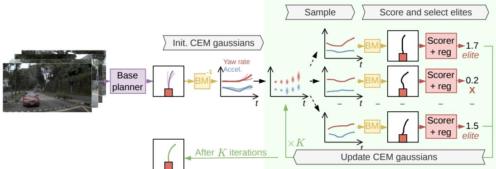  
Figure 1: Overview of TOAD. A frozen base planner outputs trajectory proposals and a selected anchor $\tau _ { \mathrm { b a s e } }$ (left). Trajectories are mapped to controls by the inverse bicycle model $( \mathrm { B M } ^ { - 1 } )$ . Then, a Cross-Entropy Method (CEM) loop runs for K steps in control space: sample controls, rolls them out with the bicycle model (BM), scores them under ‘Scorer + reg’ (the learned reward with comfort and anchor regularizers), refits the Gaussian to the highest-scoring elites. The scorer and BM are frozen.

Test-time training adapts the model itself rather than the trajectory. Centaur [28] updates an E2E planner at test time by minimizing an uncertainty measure over its predictions. We are complementary and lighter: model weights stay frozen, we only search the trajectory space.

Inference-time search on a fixed model has driven large gains in language models, via inference-time reasoning [29, 30] and search guided by verifiers or reward models [31]. This is appearing in driving too: re-ranking candidates with a vision-language model [32] or scoring them online with a learned world model [33, 34]. We also search at inference, but over a continuous trajectory space rather than a fixed set, using a single learned scorer rather than an auxiliary model.

Learned scorers as rewards connect our setting to model-based RL, where a learned reward guides action selection. Several driving methods use a reward during training: RL fine-tuning of planners [35], reinforced diffusion for generation [36], and RLHF for driving styles [37]. We instead use a frozen, already-trained scorer purely at inference, as the search objective, with no policy learning and no change to the generator.

## 3 Method

We present TOAD, illustrated in Fig. 1, a scorer-based method that enhances trajectories produced by an arbitrary planner at test time. We introduce the scorer in Sec. 3.1 and then detail the optimization algorithm and its design choices in Sec. 3.2.

## 3.1 Scorer as a Reward Function

Our method uses a scorer $S$ as a reward function over trajectories. A trajectory $\tau = ( p _ { 1 } , \ldots , p _ { n _ { p } } )$ is a sequence of $n _ { p }$ future poses $p _ { t } = ( x _ { t } , y _ { t } , \theta _ { t } ) \in \mathbb { R } ^ { 3 }$ in the ego frame. Conditioned on the observation o (sensor inputs and ego state) and the goal g (target or route), the scorer maps a complete trajectory to a scalar, $S ( \tau ; o , g ) \in \mathbb { R } . S$ is a neural network trained jointly with a base planner. We treat S as a reward function over the trajectory space, which we treat as the action space. This enables searching for reward-maximal trajectories rather than ranking a fixed candidate set.

## 3.2 Test-Time Trajectory Search

We instantiate this search with the Cross-Entropy Method (CEM) [11], a classical sampling-based optimizer. To keep the search where the scorer is reliable, we confine it to a trust region around the base planner’s proposals (Fig. 1, left). The following paragraphs describe and motivate each design choice; we ablate them individually in Sec. 5.

Optimizing in control space. For the sampling-based search, the choice of search space is not obvious. Sampling directly in pose space would yield jagged, dynamically infeasible trajectories, since it ignores vehicle dynamics entirely. We instead inject this prior through a kinematic bicycle model (BM) and search over a sequence of controls,

$$
u = ( u _ { t } ) _ { t = 1 } ^ { n _ { p } } , \qquad u _ { t } = ( a _ { t } , \omega _ { t } ) \in \mathbb { R } ^ { 2 } ,\tag{1}
$$

where $a _ { t }$ and $\omega _ { t }$ are the per-step longitudinal acceleration and yaw rate. Our BM is invertible, so controls and trajectories are equivalent representations. From a control sequence u we roll out a trajectory at the current ego speed $v _ { 0 }$ as $\tau = \mathrm { B M } ( u , v _ { 0 } )$ , and recover the controls by inverse kinematics, $u = \mathrm { B M } ^ { - 1 } ( \tau , v _ { 0 } )$ , both illustrated in Fig. 1. This approach is standard in sampling-based control [25, 23] and trajectory optimization [38, 39], and buys two properties for free: every sample is smooth and feasible, and the comfort, defined on accelerations (the controls) and jerks (their derivatives), can be computed directly from u.

Planner-based trust region. In principle, CEM can run from any initialization (see Fig. 4a for ablations). We instead deliberately constrain the search to a small trust region around the base trajectory proposal conditioned on the observation o and the navigation goal $^ { g , }$ because the learned scorer of Sec. 3.1 is more reliable nearby. Outside this region, the search can drift toward trajectories that the scorer rates highly but cannot truly judge, which could lead to reward hacking.

Formally, we assume access to a trained base planner that maps an observation o and a goal $g$ to a set of $N$ candidate trajectories together with a selected trajectory,

$$
\mathrm { B A S E P L A N N E R } ( o , g ) = ( { \mathcal T } , \tau _ { \mathrm { b a s e } } ) , \quad \tau _ { \mathrm { b a s e } } \in { \mathcal T } = \{ \tau ^ { ( i ) } \} _ { i = 1 } ^ { N } .\tag{2}
$$

This formulation covers existing planners, including single-candidate ones where $\mathcal { T } = \{ \tau _ { \mathrm { b a s e } } \}$ . Given the ego speed $v _ { 0 }$ , these map equivalently to control sequences, $\mathcal { U } = \{ u ^ { ( i ) } = \mathrm { B M } ^ { - 1 } \big ( \tau ^ { ( i ) } , v _ { 0 } \big ) \} _ { i = 1 } ^ { N } ,$ with a selected one $u _ { \mathrm { b a s e } }$ . We use these to define the trust region, with $u _ { \mathrm { b a s e } }$ its anchor, while the spread of U sets its extent.

TOAD: CEM with trust region prior. In TOAD, the trust-region prior shapes both the CEM cost and its initialization. CEM maximizes $J ( u )$ , an objective combining S and two closed-form regularizers:

$$
J ( u ) = S \big ( \mathrm { B M } ( u , v _ { 0 } ) ; o , g \big ) \ - \ \lambda _ { a } C _ { \mathrm { a n c h o r } } ( u ) \ - \ \lambda _ { c } C _ { \mathrm { c o m f } } ( u ) .\tag{3}
$$

The first regularizer, $C _ { \mathrm { a n c h o r } } ( u ) = \| u - u _ { \mathrm { b a s e } } \| ^ { 2 }$ , ties the search to the trust region by penalizing deviation from the anchor. The second, $C _ { \mathrm { { c o m f } } } .$ , accumulates squared violations of the standard kinematic comfort limits (longitudinal and lateral acceleration, jerk, yaw rate, and yaw acceleration); being exact and closed-form, it supplies a signal the learned scorer estimates only coarsely. We evaluate $C _ { \mathrm { c o m f } }$ over the future controls and the last executed control, penalizing uncomfortable transitions from the vehicle’s recent motion.

To start the search, the CEM mean is set to the anchor, $\mu _ { 0 } = u _ { \mathrm { b a s e } } ;$ the standard deviation starts from the spread of the base planner’s own proposals, $\sigma _ { 0 } = \operatorname* { m a x } ( \beta \cdot \operatorname { s t d } ( \mathcal { U } ) , \epsilon )$ with $\beta < 1$ and a small floor ϵ that prevents exploration from collapsing entirely. Exploration thus depends on the planner’s own uncertainty. We run CEM over controls with a Gaussian $\mathcal { N } ( \mu _ { k } , \mathrm { d i a g } ( \sigma _ { k } ^ { 2 } ) )$ in $\mathbb { R } ^ { 2 n _ { p } }$ . At iteration $k = 1 , \ldots , K$ , we draw M control sequences, roll them out, evaluate $J ,$ and keep the E highest-scoring sequences as the elite set $\mathcal { E } _ { k }$ . We then refit the Gaussian to the elites: $\mu _ { k } = \mathrm { m e a n } ( \mathcal { E } _ { k } ) , \sigma _ { k } = \mathrm { s t d } ( \mathcal { E } _ { k } )$

After the final iteration, we roll out per CEM standards the trajectory induced by the converged mean, $\tau _ { \mathrm { m e a n } } = \mathrm { B M } ( \mu _ { K } , v _ { 0 } )$ . We return whichever of it and the base proposal $\tau _ { \mathrm { b a s e } }$ maximizes the cost,

$$
\tau ^ { \star } = \underset { \tau \in \{ \tau _ { \mathrm { m e a n } } , \tau _ { \mathrm { b a s e } } \} } { \arg \operatorname* { m a x } } S ( \tau ; o , g ) - \lambda _ { c } C _ { \mathrm { c o m f } } \bigl ( \mathrm { B M } ^ { - 1 } ( \tau , v _ { 0 } ) \bigr ) .\tag{4}
$$

$C _ { \mathrm { a n c h o r } }$ is excluded here: the CEM mean should not be penalized for deviating from the anchor. Comparing against $\tau _ { \mathrm { b a s e } }$ guarantees the returned trajectory never has a lower cost than $\tau _ { \mathrm { b a s e } }$

Scorer choice. CEM requires a scorer that stays accurate off the base planner’s proposal distribution, which is why TOAD uses DrivoR’s disentangled scorer [8]. We highlight one property of our setup: the same scorer serves every base planner and need not be the planner’s own.

Table 1: NAVSIM-v1. Comparison to existing camera-only methods on (navtest). Scores are the higher is better. Full comparison in Tab. 5.
<table><tr><td>Method</td><td>PDMS (↑)</td></tr><tr><td>PDM-Closed [14] Human driver [12]</td><td>89.1 94.8</td></tr><tr><td>ZTRS (V2-99) [6]</td><td>86.9</td></tr><tr><td>+ TOAD</td><td>89.0 (↑2.4%)</td></tr><tr><td>GTRS (V2-99) [5]</td><td>90.4</td></tr><tr><td>+ TOAD</td><td>90.9 (↑0.6%)</td></tr><tr><td>Hydra-MDP [4]</td><td>90.9</td></tr><tr><td>+ TOAD</td><td>91.4 (↑0.6%)</td></tr><tr><td>iPad [10]</td><td>91.7</td></tr><tr><td>+ TOAD</td><td>93.4 (↑1.9%)</td></tr><tr><td>RAP-DINO [9]</td><td>93.8</td></tr><tr><td>+ TOAD</td><td>93.9 (↑0.1%)</td></tr><tr><td>DrivoR [8]</td><td>94.6</td></tr><tr><td>+ TOAD</td><td>94.7 (↑0.1%)</td></tr></table>

Table 2: NAVSIM-v2 navhard-two-stage. Comparison to existing methods on the NAVSIM-v2 benchmark test set using the EPDMS [13]. Full comparison in Tab. 6.
<table><tr><td rowspan=1 colspan=1>Method        EPDMS (↑)</td></tr><tr><td rowspan=1 colspan=1>PDM-Closed [14] 56.6</td></tr><tr><td rowspan=1 colspan=1>iPad [10]       34.7</td></tr><tr><td rowspan=1 colspan=1>+ TOAD       49.8 (↑43.6%)</td></tr><tr><td rowspan=1 colspan=1>RAP-DINO [9]  39.6</td></tr><tr><td rowspan=1 colspan=1>+ TOAD       49.0 (↑23.9%)</td></tr><tr><td rowspan=1 colspan=1>Hydra-MDP [4]  40.9</td></tr><tr><td rowspan=1 colspan=1>+ TOAD       49.7 (↑21.6%)</td></tr><tr><td rowspan=1 colspan=1>GTRS [5]       45.4</td></tr><tr><td rowspan=1 colspan=1>+ TOAD       51.7 (↑13.8%)</td></tr><tr><td rowspan=1 colspan=1>ZTRS [6]       48.1</td></tr><tr><td rowspan=1 colspan=1>+ TOAD       49.2 (↑ 2.3%)</td></tr><tr><td rowspan=1 colspan=1>DrivoR [8]      54.6</td></tr><tr><td rowspan=1 colspan=1>+ TOAD       56.3 (↑ 3.1%)</td></tr></table>

Table 3: What drives the gain? On top of iPad [10] and Hydra-MDP [4] we compare TOAD against (i) trajectory-smoothing, (ii) re-scoring, and (iii) using different scorers as reward.
<table><tr><td>Method</td><td>EPDMS (↑)</td></tr><tr><td>iPad [10]</td><td>34.7</td></tr><tr><td>+ Smoothing (BM)</td><td>35.0 (↑ 0.8%)</td></tr><tr><td>+ Re-scoring w/ DrivoR</td><td>45.6 (↑31.5%)</td></tr><tr><td>+ Re-scoring w/ GTRS</td><td>34.5 (↓ 0.6%)</td></tr><tr><td>+ Re-scoring w/ SparseDriveV2</td><td>30.3 (↓12.5%)</td></tr><tr><td>+ Search w/ GTRS scorer</td><td>23.9 (↓31.1%)</td></tr><tr><td>+ Search w/ SparseDriveV2 scorer + TOAD (search w/ DrivoR scorer)</td><td>34.6 (↓ 0.4%)</td></tr><tr><td></td><td>49.8 (↑43.6%)</td></tr><tr><td>Hydra-MDP [4]</td><td>40.9</td></tr><tr><td>+ Smoothing (BM)</td><td>38.8 (↓ 5.1%)</td></tr><tr><td>+ Re-scoring w/ DrivoR</td><td>37.3 (↓ 8.8%)</td></tr><tr><td>+ Re-scoring w/ GTRS</td><td>40.3 (↓ 1.5%)</td></tr><tr><td>+ Re-scoring w/ SparseDriveV2</td><td>9.5 (↓76.9%)</td></tr><tr><td>+ Search w/ GTRS scorer</td><td>38.1 (↓ 6.9%)</td></tr><tr><td>+ Search w/ SparseDriveV2 scorer</td><td>29.6 (↓27.7%)</td></tr><tr><td>+ TOAD (search w/ DrivoR scorer) 49.7 (↑21.6%)</td><td></td></tr></table>

## 4 Experimental Results

We evaluate our test-time search on standard driving benchmarks. TOAD consistently improves various base planners on NAVSIM-v1/2, setting a new state of the art on NAVSIM-v2. It also improves over DrivoR on the closed-loop HUGSIM benchmark (Sec. 4.2). We then demonstrate TOAD requires a scorer that is standalone from the trajectory head (Sec. 4.3). Finally, we isolate the source of the gain, and ablate the design choices (Sec. 5). Our code will be open-sourced.

## 4.1 Experimental Setup

Benchmarks and metrics. We evaluate on NAVSIM-v1 [12] (navtest split) and NAVSIM-v2 [13] (navhard-two-stage split), two pseudo-closed-loop benchmarks built on real driving logs. We also evaluate on HUGSIM [15], a closed-loop evaluation benchmark with photorealistic scenes constructed using 3D Gaussian Splatting [40]. For the ablation, we use warmup-two-stage\* as validation set for NAVSIM-v2 containing 7 scenes. Metrics are detailed in App. A.

Base planners. We show that TOAD is plug-and-play, by evaluating it on six base planners spanning both proposal styles, i.e., fixed-vocabulary scorers (Hydra-MDP [4], GTRS [5], ZTRS [6]) and on-the-fly generators (iPad [10], RAP [9], DrivoR [8]). For each, we use the public checkpoint and its released trajectory proposals; no models are updated.

Hyperparameters. Unless stated otherwise, we run K = 5 CEM iterations for planners with on-the-fly generators and K = 100 for those with fixed-vocabulary scorers due to its much larger vocabulary (>8K) that initializes the search. The per-iteration candidate count M is fixed to 64 considering search inference cost, and the elite count to $E = M / 8$ . We use an initial-std scale of $\beta = 0 . 5$ , floored at $\epsilon _ { a } = 0 . 1 \mathrm { m / s ^ { 2 } }$ and $\epsilon _ { \omega } = 0 . 0 2 5 \mathrm { r a d / s }$ . The objective uses comfort weight $\lambda _ { c } = 0 . 0 5$ and anchor weight $\lambda _ { a } = 0 . 5 .$ . All values above are kept fixed across base planners and benchmarks; ablations are conducted in Sec. 5.

## 4.2 Main results

NAVSIM-v2 [13] and NAVSIM-v1 [12]. Tab. 1 and Tab. 2 reports NAVSIM-v1 navtest and NAVSIM-v2 navhard-two-stage results. TOAD improves every base planner on both benchmarks. On NAVSIM-v2 the gains range from +2.3% (ZTRS) to +43.6% (iPad), and they compress the ranking: the six planners start almost 20 EPDMS points apart (34.7 to 54.6) but all land between 49.0 and 56.3 after search. The weakest planners gain the most, while DrivoR, already the strongest, gains +3.1% to reach 56.3 EPDMS, outperforming the strongest learned method (DriveFuture [41], see in Tab. 6, 55.5) and is only 0.3 behind the privileged PDM-Closed (56.6), which uses ground-truth perception. Complete benchmark tables are provided in Tab. 5 and Tab. 6.

Table 4: HUGSIM [15] zero-shot scores. TOAD improves safety (NC, DAC, TTC) and comfort, raising HD-Score, while route completion (RC) sometimes drops, indicating more cautious driving.
<table><tr><td rowspan="3"></td><td colspan="6">KITTI360 [42]</td><td colspan="6">nuScenes [43]</td><td colspan="6">Pandaset [44]</td><td colspan="6">Waymo [45]</td></tr><tr><td>NC</td><td>DAC</td><td>TTC</td><td>Comf.</td><td></td><td>RC</td><td>HDS</td><td>NC</td><td>DAC</td><td>TTC</td><td>Comf.</td><td>RC</td><td>HDS</td><td>NC</td><td>DAC</td><td>TTC</td><td>Comf.</td><td>RC HDS</td><td>NC DAC</td><td>TTC</td><td>Comf.</td><td>RC</td><td></td><td>HDS</td></tr><tr><td>LTF</td><td>32.4</td><td>86.4</td><td>25.1</td><td></td><td>97.3</td><td>19.4</td><td>8.0</td><td>56.1</td><td>99.7</td><td>49.8</td><td>95.4</td><td>50.1</td><td>35.1</td><td>44.7</td><td>100.0</td><td>36.2</td><td>92.1</td><td>51.3</td><td>28.2 49.1</td><td>93.9</td><td>42.1</td><td>95.4</td><td>38.3</td><td>23.8</td></tr><tr><td>UniAD</td><td>[46] [2] 48.</td><td>.1 85.1</td><td>19.8</td><td></td><td>37.2</td><td>23.5</td><td>5.9</td><td>71.8</td><td>99.2</td><td>63.3</td><td>79.3</td><td>49.1</td><td>37.5</td><td>68.2</td><td>100.0</td><td>58.1</td><td>77.3</td><td>49.5 36.7</td><td>76.9</td><td>94.3</td><td>66.3</td><td>71.3</td><td>56.2</td><td>44.4</td></tr><tr><td>VAD</td><td>[18] 24.4</td><td>83.2</td><td>15.0</td><td></td><td>94.2</td><td>17.1</td><td>3.9</td><td>57.2</td><td>97.6</td><td>42.9</td><td>97.4</td><td>43.1</td><td>24.5</td><td>42.4</td><td>100.0</td><td>26.5</td><td>94.9</td><td>38.7 15.4</td><td>46.6</td><td>85.5 32.6</td><td></td><td>94.9</td><td>29.4</td><td>11.0</td></tr><tr><td>GTRS-D</td><td>[5] 47.9</td><td>90.4</td><td>43.1</td><td></td><td>94.4</td><td>29.5</td><td>19.5</td><td>71.3</td><td>99.8</td><td>64.8</td><td>96.0</td><td>59.3</td><td>47.4</td><td>55.7</td><td>99.9</td><td>48.0</td><td>91.6</td><td>56.0 37.2</td><td>65.5</td><td>96.4 61.0</td><td></td><td>95.1</td><td>52.5</td><td>41.0</td></tr><tr><td>DrivoR</td><td>[8] 44.0</td><td>89.9</td><td>40.8</td><td></td><td>93.6</td><td>28.8</td><td>17.7</td><td>57.0</td><td>100.0</td><td>51.3</td><td>93.0</td><td>54.2</td><td>39.7</td><td>50.8</td><td>99.9</td><td>44.0</td><td>89.8</td><td>58.3 35.1</td><td>64.0</td><td>96.8 58.6</td><td></td><td>94.1</td><td>56.5</td><td>44.2</td></tr><tr><td>DrivoR + TOAD</td><td>49.5</td><td>90.9</td><td>46.1</td><td></td><td>99.1</td><td>26.9</td><td>18.4</td><td>69.1</td><td>100.0</td><td>63.9</td><td>98.3</td><td>60.9</td><td>49.9</td><td>57.3</td><td>100.0</td><td>)51.6</td><td>98.4</td><td>54.5 38.0</td><td>70.3</td><td>96.7 66.6</td><td></td><td>97.9</td><td>51.1 42.8</td><td></td></tr></table>

The search uses whichever sub-score has room to improve. On the harder, out-of-distribution NAVSIM-v2 scenes it trades a little progress for large safety gains in no-collision, drivable-area, and time-to-collision see Tab. 6. On the near-saturated NAVSIM-v1, where safety is already high, it instead extends progress. Again the weakest planners gain most (ZTRS +2.4%, iPad +1.9%) and the strongest least, with DrivoR reaching 94.7 PDMS, the top entry and -0.1 below the human driver.

HUGSIM [15]. Tab. 4 reports zero-shot closed-loop evaluation, applying TOAD on top of DrivoR. The safety sub-metrics (no-collision, drivable-area, time-to-collision) and, above all, comfort improve on nearly all four datasets, the comfort gain a direct effect of the control-space search. These gains raise the HUGSIM Driving Score (HDS) where there is room, most clearly on nuScenes (DrivoR: 39.7 to 49.9) and KITTI360. Route completion tends to drop, showing that the searched policy drives more cautiously, and on Waymo this caution leaves the score slightly lower. The improvements transfer to a closed-loop simulator with no tuning suggests they reflect genuinely safer driving.

Qualitative Results. We show in Fig. 2a the refined trajectory manages to avoid collision from the car in front. Using TOAD we produce a better trajectory, inexistent in the original set of trajectories. Aligned with the observations in Fig. 4c, the reward is not always precise and can occasionally fail. Such failures may occur when visual cues are unreliable due to limited visibility, illustrated in Fig. 2b.

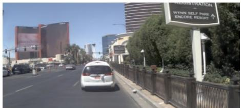

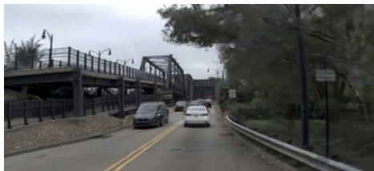

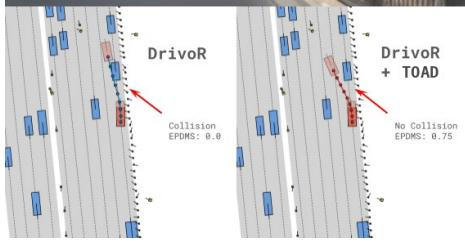  
(a) Success case

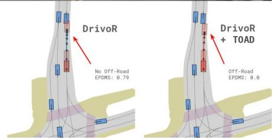  
(b) Failure case  
Figure 2: Visualization example of improvements and failures found by TOAD on top of DrivoR [8].

## 4.3 The gains require search and a generalizing scorer

Two factors explain TOAD’s gains: they come from search discovering new trajectories rather than re-ranking or smoothing existing ones, and they only appear with a scorer that remains accurate off the proposal distribution. We verify both in Tab. 3, with two base planners iPad [10] and Hydra-MDP [4] on navhard-two-stage. Detailed performance breakdown can be found in Tab. 7.

Search versus re-ranking and smoothing. We compare TOAD against two simpler modifications of the base planner. Smoothing (BM) maps the selected trajectory through the bicycle model to remove jitter without changing its route; it has little effect (iPad +0.8%, Hydra-MDP −5.1%), showing the gains are from better trajectories, as seen in Fig. 2. Re-scoring re-ranks the original proposals with a scorer, without new trajectories. When using DrivoR’s scorer as in TOAD, re-ranking is inconsistent: it improves iPad (+31.5%) but hurts Hydra-MDP (−8.8%). In contrast, TOAD consistently improves performance (+43.6% and +21.6%). The gains therefore come from search discovering better trajectories outside the proposal set, not from reordering or smoothing existing ones.

The scorer must generalize. We also run the search with different scorers as rewards. Only the DrivoR scorer [8] improves performance; GTRS [5] and SparseDriveV2 [7] reduce it below baseline (e.g., iPad drops to 23.9 with GTRS). We attribute this to their training setup. GTRS and SparseDriveV2 are trained to score a fixed vocabulary of precomputed trajectories, so they receive no supervision away from that set and need not behave sensibly there. DrivoR, by contrast, is trained jointly with a trajectory generator while remaining disentangled from it, forcing it to score freely decoded trajectories rather than a fixed grid. We hypothesize this is why it remains reliable on the off-proposal trajectories explored by our search, making it the only scorer suitable as a reward.

## 4.4 Computation Footprint

Fig. 3 reports the per-sample (batchsize=1) inference cost of each base planner + TOAD, measured on a single NVIDIA A100. We splut the execution time in three parts: base planner, scorer backbone, and search itself. The scorer’s perception backbone (a ViT-S encoder, around 100 ms) is computed once per frame; the search then reuses these cached features and re-runs only the lightweight scoring head on each sampled trajectory. The search itself (blue) therefore adds only 1.9 (K = 5) to 20.4 ms (K = 100), against total inference times of 100 to 780 ms.

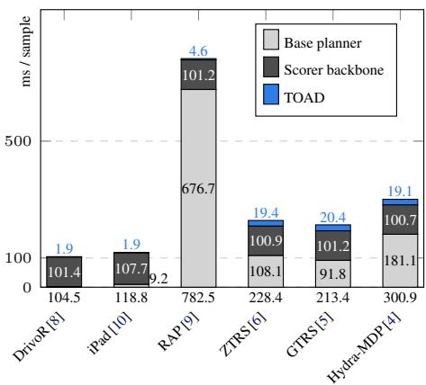

The search cannot avoid running the scorer’s perception backbone in the first place. In DrivoR the scorer is part of the base planner, sharing a single backbone: scoring reuses the features the planner already extracted, and the search is close to free (1.9 ms on top of DrivoR’s forward pass). When the scorer is external, it needs its own

Figure 3: Per-sample inference cost across methods. The bar length is the total inference time per sample, decomposed into the base planner (light gray), the scorer backbone (dark gray), and our test-time optimization (TOAD, blue).

perception, redundant with the planner’s, so features are extracted twice. This is the roughly 100 ms scorer backbone carried by other planners in Fig. 3. The lesson is to build well-generalizing scorers directly into the planner, then strong test-time search comes essentially for free.

## 5 Ablation Study

TOAD component ablation. We ablate the different components in TOAD with iPad [10]. • Warmstart. We compare the warm start initialization against a normal initialization, with a mean set to zero and the standard deviation to one. • Bicycle model. As an alternative of smoothed control space, TOAD can also operate directly in the trajectory space. In this setting (traj. space), we directly sample trajectories consisting of 8 future (x, y) locations in bird’s-eye view coordinates. • Reward terms. We study the importance of different reward terms: scorer reward, comfort reward and anchor reward, by comparing them against both the vanilla baseline without TOAD and thefull configuration.

(a) TOAD Component ablation  
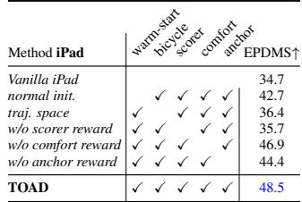

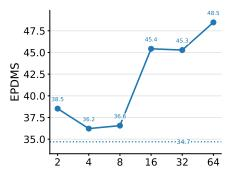  
(b) Per-iteration candidate M. $K \ = \ 5 ,$ E = max(1, M/8).

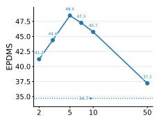  
(c) CEM iterations K. M = 64, E = 8.

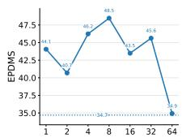  
(d) Number of elites E. M = 64 and K = 5.  
Figure 4: Ablation study of TOAD with iPad on warmup-two-stage.

In Fig. 4a, first observation is that with TOAD, the overall performance is improved compared to vanilla planner. We observe that the initialization from a standard normal distribution still achieves competitive performance (42.7 vs. 48.5), suggesting that TOAD can generalize to a broader class of E2E planners that output only a single trajectory without associated scores.

Another important observation is that the scorer reward provides the primary optimization signal, leading to a substantial performance gain (48.5 vs. 35.7). In contrast, the comfort and anchor rewards provide complementary improvements (48.5 vs. 46.9, 44.4). Finally, optimization in the control space consistently outperforms optimization in trajectory space. We hypothesize that this is because the control space (e.g., acceleration and yaw rate) is naturally bounded, whereas trajectory coordinates are unbounded and therefore more difficult to optimize effectively.

Number of candidates M, iterations K, and elites E. Overall, TOAD consistently outperforms the vanilla baseline across different hyperparameter settings, demonstrating its robustness and low sensitivity to hyperparameter choices. As shown in Fig. 4b, performance generally improves as the number of sampled candidates increases. Interestingly, sampling only two control sequences already yields an improvement over the vanilla baseline without TOAD. To maintain a low inference overhead, we cap the number of candidates at 64, resulting in less than 1.9 ms runtime per execution.

In Fig. 4c, we observe that the warm-start initialization enables rapid convergence, with iPad reaching peak performance after 5 iterations. The performance degradation observed with additional iterations highlights the imperfect correlation between the learned scorer and the true EPDMS objective. For instance, the scorer does not explicitly model extended comfort metrics that require temporal consistency across adjacent frames. Finally, Fig. 4d shows that selecting 8 elites empirically provides the best performance under a candidate budget of 64, corresponding to approximately one-eighth of the sampled candidates. This result offers a practical guideline for choosing CEM hyperparameters.

## 6 Conclusion

Trajectory scorers in end-to-end planning are learned reward functions, yet only used to rank a fixed candidate set. We show that this set, not the scorer, is the real bottleneck. TOAD, a simple CEM loop that searches against the frozen scorer, improves six base planners across NAVSIM-v1, NAVSIM-v2, and HUGSIM, at negligible cost and with no retraining. CEM can only succeed if the scorer stays accurate off the proposal distribution, which most current scorers do not. This points to a clear direction: planners whose scorer is built to generalize, so that strong test-time search comes for free.

Limitations. TOAD warm-starts from a base planner’s proposals, whereas a sufficiently accurate scorer and optimizer should in principle allow searching from scratch. This raises the question of whether scaling the scorer with more data and capacity could eventually remove the need for a base planner altogether. A second limitation is the reliance on DrivoR’s supervised disentangled scorer. A promising direction for future work is to reduce the reliance on costly trajectory-level annotations needed to train such a scorer, for instance through self-supervised or world model-based rewards.

## Acknowledgments

We thank Renaud Marlet for constant support throughout the project as well as Marc Lafon and Andrei Bursuc for helpful discussions. This work was granted access to the HPC resources of IDRIS under the allocations A0201016239, A0181016239 and A0181016203 made by GENCI. We acknowledge chair VISA DEEP (ANR-20- CHIA-0022), Cluster PostGenAI@Paris (ANR-23-IACL 0007, FRANCE 2030), and EuroHPC Joint Undertaking for awarding the project ID EU2025R01-032 access to Karolina, Czech Republic.

## References

[1] M. Bojarski, D. Del Testa, D. Dworakowski, B. Firner, B. Flepp, P. Goyal, L. D. Jackel, M. Monfort, U. Muller, J. Zhang, et al. End to end learning for self-driving cars. arXiv preprint arXiv:1604.07316, 2016.

[2] Y. Hu, J. Yang, L. Chen, K. Li, C. Sima, X. Zhu, S. Chai, S. Du, T. Lin, W. Wang, L. Lu, X. Jia, Q. Liu, J. Dai, Y. Qiao, and H. Li. Planning-oriented autonomous driving. In CVPR, 2023.

[3] K. Renz, L. Chen, E. Arani, and O. Sinavski. Simlingo: Vision-only closed-loop autonomous driving with language-action alignment. In CVPR, 2025.

[4] Z. Li, K. Li, S. Wang, S. Lan, Z. Yu, Y. Ji, Z. Li, Z. Zhu, J. Kautz, Z. Wu, et al. Hydramdp: End-to-end multimodal planning with multi-target hydra-distillation. arXiv preprint arXiv:2406.06978, 2024.

[5] Z. Li, W. Yao, Z. Wang, X. Sun, J. Chen, N. Chang, M. Shen, Z. Wu, S. Lan, and J. M. Alvarez. Generalized trajectory scoring for end-to-end multimodal planning. arXiv preprint arXiv:2506.06664, 2025.

[6] Z. Li, W. Yao, Z. Wang, X. Sun, J. Chen, N. Chang, M. Shen, J. Song, Z. Wu, S. Lan, et al. Ztrs: Zero-imitation end-to-end autonomous driving with trajectory scoring. arXiv preprint arXiv:2510.24108, 2025.

[7] W. Sun, X. Lin, K. Chen, Z. Pei, X. Li, Y. Shi, and S. Zheng. Sparsedrivev2: Scoring is all you need for end-to-end autonomous driving. arXiv preprint arXiv:2603.29163, 2026.

[8] E. Kirby, A. Boulch, Y. Xu, Y. Yin, G. Puy, E. Zablocki, A. Bursuc, S. Gidaris, R. Marlet, F. Bartoccioni, A.-Q. Cao, N. Samet, T.-H. Vu, and M. Cord. Driving on registers. In CVPR, 2026.

[9] L. Feng, Y. Gao, E. Zablocki, Q. Li, W. Li, S. Liu, M. Cord, and A. Alahi. Rap: 3d rasterization augmented end-to-end planning. In ICLR, 2026.

[10] K. Guo, H. Liu, X. Wu, J. Pan, and C. Lv. ipad: Iterative proposal-centric end-to-end autonomous driving. arXiv preprint arXiv:2505.15111, 2025.

[11] R. Y. Rubinstein and D. P. Kroese. The cross-entropy method: a unified approach to combinatorial optimization, Monte-Carlo simulation, and machine learning. Springer, 2004.

[12] D. Dauner, M. Hallgarten, T. Li, X. Weng, Z. Huang, Z. Yang, H. Li, I. Gilitschenski, B. Ivanovic, M. Pavone, et al. Navsim: Data-driven non-reactive autonomous vehicle simulation and benchmarking. In NeurIPS, 2024.

[13] W. Cao, M. Hallgarten, T. Li, D. Dauner, X. Gu, C. Wang, Y. Miron, M. Aiello, H. Li, I. Gilitschenski, B. Ivanovic, M. Pavone, A. Geiger, and K. Chitta. Pseudo-simulation for autonomous driving. In CoRL, 2025.

[14] D. Dauner, M. Hallgarten, A. Geiger, and K. Chitta. Parting with misconceptions about learning-based vehicle motion planning. In CoRL, 2023.

[15] H. Zhou, L. Lin, J. Wang, Y. Lu, D. Bai, B. Liu, Y. Wang, A. Geiger, and Y. Liao. HUGSIM: A real-time, photo-realistic and closed-loop simulator for autonomous driving. IEEE Trans. Pattern Anal. Mach. Intell., 2026.

[16] W. Zeng, W. Luo, S. Suo, A. Sadat, B. Yang, S. Casas, and R. Urtasun. End-to-end interpretable neural motion planner. In CVPR, 2019.

[17] E. Yurtsever, J. Lambert, A. Carballo, and K. Takeda. A survey of autonomous driving: Common practices and emerging technologies. IEEE Access, 2020.

[18] B. Jiang, S. Chen, Q. Xu, B. Liao, J. Chen, H. Zhou, Q. Zhang, W. Liu, C. Huang, and X. Wang. Vad: Vectorized scene representation for efficient autonomous driving. In ICCV, 2023.

[19] X. Weng, B. Ivanovic, Y. Wang, Y. Wang, and M. Pavone. Para-drive: Parallelized architecture for real-time autonomous driving. In CVPR, 2024.

[20] B. Liao, S. Chen, H. Yin, B. Jiang, C. Wang, S. Yan, X. Zhang, X. Li, Y. Zhang, Q. Zhang, et al. Diffusiondrive: Truncated diffusion model for end-to-end autonomous driving. In CVPR, 2025.

[21] Z. Xing, X. Zhang, Y. Hu, B. Jiang, T. He, Q. Zhang, X. Long, and W. Yin. Goalflow: Goaldriven flow matching for multimodal trajectories generation in end-to-end autonomous driving. In CVPR, 2025.

[22] W. Yao, Z. Li, S. Lan, Z. Wang, X. Sun, J. M. Alvarez, and Z. Wu. Drivesuprim: Towards ´ precise trajectory selection for end-to-end planning. In AAAI, 2026.

[23] M. Kobilarov. Cross-entropy motion planning. Int. J. Robotics Res., 2012.

[24] C. Pinneri, S. Sawant, S. Blaes, J. Achterhold, J. Stueckler, M. Rol´ınek, and G. Martius. Sample-efficient cross-entropy method for real-time planning. In CoRL, 2020.

[25] G. Williams, N. Wagener, B. Goldfain, P. Drews, J. M. Rehg, B. Boots, and E. A. Theodorou. Information theoretic MPC for model-based reinforcement learning. In ICRA, 2017.

[26] P. Drews, G. Williams, B. Goldfain, E. A. Theodorou, and J. M. Rehg. Aggressive deep driving: Combining convolutional neural networks and model predictive control. In CoRL, 2017.

[27] Z. Huang, H. Liu, J. Wu, and C. Lv. Differentiable integrated motion prediction and planning with learnable cost function for autonomous driving. IEEE Trans. Neural Networks Learn. Syst., 2024.

[28] C. Sima, K. Chitta, Z. Yu, S. Lan, P. Luo, A. Geiger, H. Li, and J. M. Alvarez. Centaur: Robust end-to-end autonomous driving with test-time training. arXiv preprint arXiv:2503.11650, 2025.

[29] A. Jaech, A. Kalai, A. Lerer, A. Richardson, A. El-Kishky, A. Low, A. Helyar, A. Madry, A. Beutel, A. Carney, et al. Openai o1 system card. arXiv preprint arXiv:2412.16720, 2024.

[30] D. Guo, D. Yang, H. Zhang, J. Song, P. Wang, Q. Zhu, R. Xu, R. Zhang, S. Ma, X. Bi, et al. Deepseek-r1: Incentivizing reasoning capability in llms via reinforcement learning. arXiv preprint arXiv:2501.12948, 2025.

[31] B. Brown, J. Juravsky, R. Ehrlich, R. Clark, Q. V. Le, C. Re, and A. Mirhoseini. Large language´ monkeys: Scaling inference compute with repeated sampling. arXiv preprint arXiv:2407.21787, 2024.

[32] P. Zheng, Y. Zhao, Z. Gong, H. Zhu, and S. Wu. Simplevsf: Vlm-scoring fusion for trajectory prediction of end-to-end autonomous driving. arXiv preprint arXiv:2510.17191, 2025.

[33] Y. Li, Y. Wang, Y. Liu, J. He, L. Fan, and Z. Zhang. End-to-end driving with online trajectory evaluation via BEV world model. In ICCV, 2025.

[34] J. Sun, F. Xue, T. Long, C. Liu, J.-F. Hu, W.-S. Zheng, and N. Sebe. Risk-aware world model predictive control for generalizable end-to-end autonomous driving. arXiv preprint arXiv:2602.23259, 2026.

[35] Y. Li, K. Xiong, X. Guo, F. Li, S. Yan, G. Xu, L. Zhou, L. Chen, H. Sun, B. Wang, et al. Recogdrive: A reinforced cognitive framework for end-to-end autonomous driving. In ICLR, 2026.

[36] Z. Song, L. Liu, H. Pan, B. Liao, M. Guo, L. Yang, Y. Zhang, S. Xu, C. Jia, and Y. Luo. Diver: Reinforced diffusion breaks imitation bottlenecks in end-to-end autonomous driving. arXiv preprint arXiv:2507.04049, 2025.

[37] D. Li, C. Li, Y. Wang, J. Ren, X. Wen, P. Li, L. Xu, K. Zhan, P. Jia, X. Lang, et al. Learning personalized driving styles via reinforcement learning from human feedback. arXiv preprint arXiv:2503.10434, 2025.

[38] N. Hanselmann, K. Renz, K. Chitta, A. Bhattacharyya, and A. Geiger. KING: generating safety-critical driving scenarios for robust imitation via kinematics gradients. In ECCV, 2022.

[39] Y. Yin, P. Khayatan, E. Zablocki, A. Boulch, and M. Cord. Regents: Real-world safety-critical´ driving scenario generation made stable. In ECCV Workshops, 2024.

[40] B. Kerbl, G. Kopanas, T. Leimkuhler, and G. Drettakis. 3d gaussian splatting for real-time¨ radiance field rendering. ACM Transactions on Graphics, 2023.

[41] Y. Hong, X. Zhou, Y. Li, X. Zhou, L. Liu, Y. Luo, S. Xu, L. Yang, and Z. Song. Drivefuture: Future-aware latent world models for autonomous driving. arXiv preprint arXiv:2605.09701, 2026.

[42] Y. Liao, J. Xie, and A. Geiger. KITTI-360: A novel dataset and benchmarks for urban scene understanding in 2d and 3d. TPAMI, 2023.

[43] H. Caesar, V. Bankiti, A. H. Lang, S. Vora, V. E. Liong, Q. Xu, A. Krishnan, Y. Pan, G. Baldan, and O. Beijbom. nuscenes: A multimodal dataset for autonomous driving. In CVPR, 2020.

[44] P. Xiao, Z. Shao, S. Hao, Z. Zhang, X. Chai, J. Jiao, Z. Li, J. Wu, K. Sun, K. Jiang, Y. Wang, and D. Yang. Pandaset: Advanced sensor suite dataset for autonomous driving. In ITSC, 2021.

[45] P. Sun, H. Kretzschmar, X. Dotiwalla, A. Chouard, V. Patnaik, P. Tsui, J. Guo, Y. Zhou, Y. Chai, B. Caine, V. Vasudevan, W. Han, J. Ngiam, H. Zhao, A. Timofeev, S. Ettinger, M. Krivokon, A. Gao, A. Joshi, Y. Zhang, J. Shlens, Z. Chen, and D. Anguelov. Scalability in perception for autonomous driving: Waymo open dataset. In CVPR, 2020.

[46] K. Chitta, A. Prakash, B. Jaeger, Z. Yu, K. Renz, and A. Geiger. Transfuser: Imitation with transformer-based sensor fusion for autonomous driving. TPAMI, 2022.

[47] Y. Wang, X. Li, W. Wang, J. Zhang, Y. Li, Y. Chen, X. Wang, and Z. Zhang. Unified visionlanguage-action model. arXiv preprint arXiv:2506.19850, 2025.

[48] Y. Chen, Y. Wang, and Z. Zhang. Drivinggpt: Unifying driving world modeling and planning with multi-modal autoregressive transformers. In ICCV, 2025.

[49] C. Shi, S. Shi, K. Sheng, B. Zhang, and L. Jiang. Drivex: Omni scene modeling for learning generalizable world knowledge in autonomous driving. In ICCV, 2025.

[50] Y. Zheng, P. Yang, Z. Xing, Q. Zhang, Y. Zheng, Y. Gao, P. Li, T. Zhang, Z. Xia, P. Jia, et al. World4drive: End-to-end autonomous driving via intention-aware physical latent world model. In ICCV, 2025.

[51] C. Yuan, Z. Zhang, J. Sun, S. Sun, Z. Huang, C. D. W. Lee, D. Li, Y. Han, A. Wong, K. P. Tee, et al. Drama: An efficient end-to-end motion planner for autonomous driving with mamba. In ISRR, 2024.

[52] S. Chen, B. Jiang, H. Gao, B. Liao, Q. Xu, Q. Zhang, C. Huang, W. Liu, and X. Wang. Vadv2: End-to-end vectorized autonomous driving via probabilistic planning. arXiv preprint arXiv:2402.13243, 2024.

[53] M. Wozniak, L. Liu, Y. Cai, and P. Jensfelt. PRIX: learning to plan from raw pixels for end-to-end autonomous driving. IEEE Robotics Autom. Lett., 2026.

[54] Z. Zhou, T. Cai, S. Z. Zhao, Y. Zhang, Z. Huang, B. Zhou, and J. Ma. Autovla: A visionlanguage-action model for end-to-end autonomous driving with adaptive reasoning and reinforcement fine-tuning. NeurIPS, 2025.

[55] Y. Li, S. Shang, W. Liu, B. Zhan, H. Wang, Y. Wang, Y. Chen, X. Wang, Y. An, C. Tang, et al. Drivevla-w0: World models amplify data scaling law in autonomous driving. arXiv preprint arXiv:2510.12796, 2025.

[56] K. Li, Z. Li, S. Lan, Y. Xie, Z. Zhang, J. Liu, Z. Wu, Z. Yu, and J. M. Alvarez. Hydramdp++: Advancing end-to-end driving via expert-guided hydra-distillation. arXiv e-prints, pages arXiv–2503, 2025.

[57] L. Liu, C. Jia, G. Yu, Z. Song, J. Li, F. Jia, P. Wu, X. Hao, and Y. Luo. Guideflow: Constraint-guided flow matching for planning in end-to-end autonomous driving. arXiv preprint arXiv:2511.18729, 2025.

[58] B. Jiang, S. Chen, B. Liao, X. Zhang, W. Yin, Q. Zhang, C. Huang, W. Liu, and X. Wang. Senna: Bridging large vision-language models and end-to-end autonomous driving. arXiv preprint arXiv:2410.22313, 2024.

[59] B. Sun, Y. Cao, Y. Wang, R. Wang, J. Shang, X. Feng, J. Lu, J. Shi, S. Yang, X. Yan, et al. Minddrive: An all-in-one framework bridging world models and vision-language model for end-to-end autonomous driving. arXiv preprint arXiv:2512.04441, 2025.

[60] Z. Zhou, R. Yang, Y. Guo, S. X. Chen, T. Feng, K. Pistunova, Y. Shen, L. Su, J. Ma, et al. Spanvla: Efficient action bridging and learning from negative-recovery samples for visionlanguage-action model. arXiv preprint arXiv:2604.19710, 2026.

[61] A. Jiang, Y. Gao, Z. Sun, Y. Wang, J. Wang, J. Chai, Q. Cao, Y. Heng, H. Jiang, Y. Dong, et al. Diffvla: Vision-language guided diffusion planning for autonomous driving. arXiv preprint arXiv:2505.19381, 2025.

[62] H. Tian, T. Li, H. Liu, J. Yang, Y. Qiu, G. Li, J. Wang, Y. Gao, Z. Zhang, L. Wang, H. Ye, T. Tan, L. Chen, and H. Li. Simscale: Learning to drive via real-world simulation at scale. In CVPR, 2026.

## A Driving Metrics

In the study, we use the official metrics as defined by their original benchmarks.

NAVSIM-v1 [12]. We use the Predictive Driver Model Score (PDMS) which aggregates submetrics: No-at-fault Collisions (NC), Drivable Area Compliance (DAC), Time to Collision (TTC), Ego progress (EP), Ego Comfort (Comf.). Details of subscore descriptions and aggregation strategy can be found in the original benchmark paper.

NAVSIM-v2 [13]. We use the Extended Predictive Driver Model Score (EPDMS), computed over the two stages of the evaluation. Compared to PDMS, the EPDMS includes additional Driving direction Compliance (DDC), Traffic-line compliance (TLC) and Lane Keeping (LK), and replaces the ego comfort metric by the History Comfort (HC) and the Extended Comfort (EC).

HUGSIM [15]. We use the official HUGSIM Driving Score (HD-SCore or HDS), which mimic the NAVSIM-v1/2 metrics. It uses five sub-scores: no collisions (NC), drivable area compliance (DAC), time-to-collision (TTC), comfort (COM) and Route Completion (RC) which replaces the ego progress by the percentage of route covered by the agent in the current scenario.

## B Evolution of Trajectories during CEM

In Fig. 5, we illustrate the increase in reward and the corresponding improvement in the EPDMS score throughout optimization. We also observe that the mean elite trajectory distribution is progressively refined, shifting toward the right lane and exhibiting better forward progress. This behavior differs from both the vanilla and human trajectories.

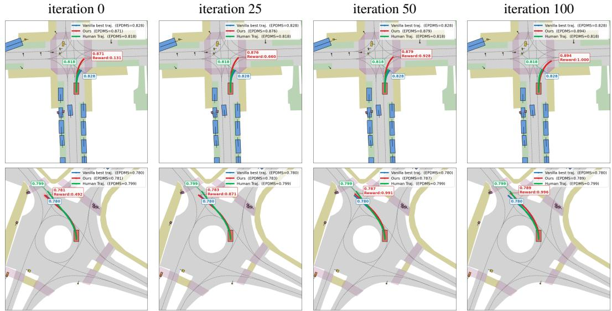  
Figure 5: CEM iteration visualization. We visualize the progress of CEM iteration in TOAD, with Hydra-MDP [4].

## B.1 Detailed Results in NAVSIM Benchmarks

NAVSIM-v1 detailed results. In Tab. 5 we report PDMS and its constituent sub-metrics on navtest. Tab. 5 shows that the safety columns (NC, DAC, TTC) are already saturated for every base planner. Thus, TOAD improves PDMS on the different base planner by boosting the ego progress sub-metric (EP), while maintaining on-par performance on the safety sub-metrics. Leading to an increase in PDMS for all 6 base planners.

Table 5: NAVSIM-v1. Comparison to existing camera-only methods on the NAVSIM-v1 benchmark on test set (navtest). Scores are higher is better.
<table><tr><td>Method</td><td colspan="6">NC DAC TTC</td></tr><tr><td>PDM-Closed</td><td>[14]94.6</td><td></td><td>99.8</td><td>89.9</td><td>86.9 99.9</td><td>PDMS 89.1</td></tr><tr><td>Human driver</td><td>[12]</td><td>100</td><td>100</td><td>100 99.9</td><td>87.5</td><td>94.8</td></tr><tr><td>Ego-stat. MLP [12]</td><td></td><td>93.077.3</td><td>83.6</td><td>100</td><td>62.8</td><td>65.6</td></tr><tr><td>UniVLA</td><td>[47]</td><td>96.9</td><td>91.1 91.7</td><td>96.7</td><td>76.8</td><td>81.7</td></tr><tr><td>DrivingGPT</td><td>[48]</td><td>98.9</td><td>90.7 94.9</td><td>95.6</td><td>79.7</td><td>82.4</td></tr><tr><td>UniAD</td><td>[2]</td><td>97.8</td><td>91.9 92.9</td><td>100</td><td>78.8</td><td>83.4</td></tr><tr><td>LTF</td><td>[46]</td><td>97.4</td><td>92.8 92.4</td><td>100</td><td>79.0</td><td>83.8</td></tr><tr><td>PARA-Drive</td><td>[19]</td><td>97.9</td><td>92.4 93.0</td><td>99.8</td><td>79.3</td><td>84.0</td></tr><tr><td>DriveX-S</td><td>[49]</td><td>97.5</td><td>94.0 93.0</td><td>100</td><td>79.7</td><td>84.5</td></tr><tr><td>World4Drive</td><td>[50]</td><td>97.4 94.3</td><td>92.8</td><td>100</td><td>79.9</td><td>85.1</td></tr><tr><td>DRAMA</td><td>[51]</td><td>98.0</td><td>93.1 94.8</td><td>100</td><td>80.1</td><td>85.5</td></tr><tr><td>VAD-v2</td><td>[52]</td><td>98.1 94.8</td><td>94.3</td><td>100</td><td>80.6</td><td>86.2</td></tr><tr><td>PRIX</td><td>[53]</td><td>98.1</td><td>96.3 94.1</td><td>100</td><td>82.3</td><td>87.8</td></tr><tr><td>DiffusionDrive [20]</td><td></td><td>98.2</td><td>96.2 94.7</td><td>100</td><td>82.2</td><td>88.1</td></tr><tr><td>DIVER</td><td>[36]</td><td>98.5</td><td>96.5 94.9</td><td>100</td><td>82.6</td><td>88.3</td></tr><tr><td>AutoVLA</td><td>[54]</td><td>98.4</td><td>95.6 98.0</td><td>99.9</td><td>81.9</td><td>89.1</td></tr><tr><td>DriveVLA-W0[55]</td><td></td><td>98.7</td><td>99.1 95.3</td><td>99.3</td><td>83.3</td><td>90.2</td></tr><tr><td>ReCogDrive</td><td>[35]</td><td>97.9 97.3</td><td>94.9</td><td>100</td><td>87.3</td><td>90.8</td></tr><tr><td>Hydra-MDP++[56]</td><td></td><td>98.6 98.6</td><td>95.1</td><td>100</td><td>85.7</td><td>91.0</td></tr><tr><td>Centaur</td><td>[28]</td><td>99.5 98.9</td><td>98.0</td><td>100</td><td>85.9</td><td>92.6</td></tr><tr><td>DriveSuprim</td><td>[22]</td><td>98.6</td><td>98.6 95.5</td><td>100</td><td>91.3</td><td>93.5</td></tr><tr><td>ZTRS (V2-99)</td><td>[6]</td><td>98.8 99.5</td><td>95.1</td><td>100</td><td>74.7</td><td>86.9</td></tr><tr><td>+ TOAD</td><td></td><td></td><td>98.4 98.6 94.3</td><td>100</td><td>82.1</td><td>89.0 (↑2.4%)</td></tr><tr><td>GTRS (V2-99) [5]</td><td></td><td>99.0 98.9</td><td>95.9</td><td>100</td><td>82.8</td><td>90.4</td></tr><tr><td>+ TOAD</td><td></td><td>98.9</td><td>98.1 96.3</td><td>100</td><td>84.8</td><td>90.9 (↑0.6%)</td></tr><tr><td>Hydra-MDP</td><td>[4]</td><td>98.5</td><td>98.7 94.9</td><td>100</td><td>85.5</td><td>90.9</td></tr><tr><td>+ TOAD</td><td></td><td>98.7 98.0</td><td>95.4</td><td>100</td><td>87.2</td><td>91.4 (↑0.6%)</td></tr><tr><td>iPad</td><td>[10]</td><td>98.6</td><td>98.3 94.9</td><td>100</td><td>88.0</td><td>91.7</td></tr><tr><td>+ TOAD</td><td></td><td>99.0</td><td>99.3 96.4</td><td>100</td><td>89.1</td><td>93.4 (↑1.9%)</td></tr><tr><td>RAP-DINO</td><td>[9]</td><td>99.1 98.9</td><td>96.7</td><td>100</td><td>90.3</td><td>93.8</td></tr><tr><td>+ TOAD</td><td></td><td>99.0</td><td>99.2 96.6</td><td>100</td><td>90.1</td><td>93.9 (↑0.1%)</td></tr><tr><td>DrivoR</td><td>[8]</td><td>99.1</td><td>99.2 96.9</td><td>100</td><td>91.6</td><td>94.6</td></tr><tr><td>+ TOAD</td><td></td><td>99.099.3</td><td>96.8</td><td>100</td><td>91.8</td><td>94.7 (↑0.1%)</td></tr></table>

NAVSIM-v2 detailed results. In Tab. 6 we report EPDMS and its Stage-1 and Stage-2 sub-metrics on navhard-two-stage. Tab. 6 shows that, unlike on navtest, the safety columns (NC, DAC, TTC) still leave headroom on these harder out-of-distribution scenes. Thus, TOAD improves EPDMS on the different base planners by raising the safety sub-metrics while trading off a small amount of ego progress (EP), with the shift concentrated in the more demanding Stage 2. Leading to an increase in EPDMS for all 6 base planners.

What drives the gain: detailed results. In Tab. 7 we report the per-sub-metric breakdown of smoothing, re-scoring, and search with different scorers, on top of iPad and Hydra-MDP. Tab. 7 shows that smoothing leaves nearly every sub-metric unchanged, re-scoring moves individual submetrics inconsistently across the two planners, and search with fixed-vocabulary scorers (GTRS, SparseDriveV2) degrades several sub-metrics at once. Only TOAD with the DrivoR scorer raises the safety sub-metrics jointly without collapsing progress. Confirming that the gain arises from the synergy in TOAD between search and an off-proposal-accurate scorer, rather than from scoring alone.

Table 6: NAVSIM-v2 navhard-two-stage. Comparison to existing methods on the NAVSIM-v2 benchmark test set using the EPDMS [13].
<table><tr><td rowspan=1 colspan=16>Stage 1                                Stage 2Method            NCDAC DDCTLCEPTTCLKHCECNCDAC DDCTLCEPTTCLKHCECEPDMS</td></tr><tr><td rowspan=1 colspan=1>PDM-Closed   [14]</td><td rowspan=1 colspan=6>94.498.810099.510093.599.387.736.0</td><td rowspan=1 colspan=8>90.590.695.498.410086.674.291.929.7</td><td rowspan=1 colspan=1>56.6</td></tr><tr><td rowspan=1 colspan=1>TransFuser     [46]</td><td rowspan=1 colspan=6>96.279.599.199.584.195.194.297.579.1</td><td rowspan=1 colspan=8>77.770.284.298.085.175.645.495.775.9</td><td rowspan=1 colspan=1>23.1</td></tr><tr><td rowspan=1 colspan=1>DiffusionDrive  [20]</td><td rowspan=1 colspan=4>96.079.797.499.581.393.1</td><td rowspan=1 colspan=2>90.896.873.8</td><td rowspan=1 colspan=2>82.172.2</td><td rowspan=1 colspan=2>88.598.7</td><td rowspan=1 colspan=2>85.178.8</td><td rowspan=1 colspan=1>49.2</td><td rowspan=1 colspan=1>89.371.2</td><td rowspan=1 colspan=1>24.2</td></tr><tr><td rowspan=1 colspan=1>GuideFlow     [57]</td><td rowspan=1 colspan=4>96.680.596.399.382.394.9</td><td rowspan=1 colspan=2>91.597.767.8</td><td rowspan=1 colspan=2>87.376.7</td><td rowspan=1 colspan=2>88.899.2</td><td rowspan=1 colspan=2>84.385.1</td><td rowspan=1 colspan=1>49.7</td><td rowspan=1 colspan=1>93.144.5</td><td rowspan=1 colspan=1>27.1</td></tr><tr><td rowspan=1 colspan=1>Senna-E2E     [58]</td><td rowspan=1 colspan=4>95.686.098.999.683.995.1</td><td rowspan=1 colspan=2>95.397.675.6</td><td rowspan=1 colspan=2>78.674.8</td><td rowspan=1 colspan=1>84.8</td><td rowspan=1 colspan=1>98.2</td><td rowspan=1 colspan=2>88.275.7</td><td rowspan=1 colspan=1>46.9</td><td rowspan=1 colspan=1>96.065.8</td><td rowspan=1 colspan=1>27.2</td></tr><tr><td rowspan=1 colspan=1>MindDrive     [59]</td><td rowspan=1 colspan=4>96.186.098.899.383.395.6</td><td rowspan=1 colspan=2>94.497.674.7</td><td rowspan=1 colspan=3>82.679.186.4</td><td rowspan=1 colspan=1>98.0</td><td rowspan=1 colspan=2>85.379.4</td><td rowspan=1 colspan=2>49.296.571.0</td><td rowspan=1 colspan=1>30.9</td></tr><tr><td rowspan=1 colspan=1>World4Drive    [50]</td><td rowspan=1 colspan=4>97.389.197.699.760.596.8</td><td rowspan=1 colspan=2>87.793.160.0</td><td rowspan=1 colspan=2>91.482.0</td><td rowspan=1 colspan=1>91.0</td><td rowspan=1 colspan=1>98.5</td><td rowspan=1 colspan=1>53.1</td><td rowspan=1 colspan=1>90.6</td><td rowspan=1 colspan=2>52.393.362.8</td><td rowspan=1 colspan=1>34.9</td></tr><tr><td rowspan=1 colspan=1>SpanVLA      [60]</td><td rowspan=1 colspan=2>98.494.397.8</td><td rowspan=1 colspan=1>99.9</td><td rowspan=1 colspan=1>85.797.2</td><td rowspan=1 colspan=2>94.297.672.1</td><td rowspan=1 colspan=2>86.984.3</td><td rowspan=1 colspan=1>87.1</td><td rowspan=1 colspan=1>98.2</td><td rowspan=1 colspan=1>85.5</td><td rowspan=1 colspan=1>82.7</td><td rowspan=1 colspan=2>62.396.867.4</td><td rowspan=1 colspan=1>40.1</td></tr><tr><td rowspan=1 colspan=1>DriveSuprim    [22]</td><td rowspan=1 colspan=1>98.995.1</td><td rowspan=1 colspan=1>99.2</td><td rowspan=1 colspan=1>99.6</td><td rowspan=1 colspan=1>76.199.1</td><td rowspan=1 colspan=2>94.797.654.2</td><td rowspan=1 colspan=1>87.9</td><td rowspan=1 colspan=1>88.8</td><td rowspan=1 colspan=1>89.6</td><td rowspan=1 colspan=1>98.8</td><td rowspan=1 colspan=1>80.3</td><td rowspan=1 colspan=1>86.0</td><td rowspan=1 colspan=1>53.5</td><td rowspan=1 colspan=1>97.156.1</td><td rowspan=1 colspan=1>42.1</td></tr><tr><td rowspan=1 colspan=1>DiffVLÁ      [61]</td><td rowspan=1 colspan=1>95.799.2</td><td rowspan=1 colspan=1>100.0</td><td rowspan=1 colspan=1>100.0</td><td rowspan=1 colspan=1>85.996.4</td><td rowspan=1 colspan=2>97.195.084.2</td><td rowspan=1 colspan=1>81.2</td><td rowspan=1 colspan=1>88.8</td><td rowspan=1 colspan=1>94.6</td><td rowspan=1 colspan=1>99.0</td><td rowspan=1 colspan=1>86.0</td><td rowspan=1 colspan=1>76.4</td><td rowspan=1 colspan=1>59.8</td><td rowspan=1 colspan=1>98.680.4</td><td rowspan=1 colspan=1>45.0</td></tr><tr><td rowspan=1 colspan=1>GTRS-E       [5]</td><td rowspan=1 colspan=1>98.999.3</td><td rowspan=1 colspan=1>99.8</td><td rowspan=1 colspan=1>99.8</td><td rowspan=1 colspan=1>75.298.4</td><td rowspan=1 colspan=2>96.097.651.6</td><td rowspan=1 colspan=1>92.3</td><td rowspan=1 colspan=1>93.3</td><td rowspan=1 colspan=1>94.6</td><td rowspan=1 colspan=1>99.2</td><td rowspan=1 colspan=1>73.1</td><td rowspan=1 colspan=1>91.2</td><td rowspan=1 colspan=1>53.9</td><td rowspan=1 colspan=1>96.756.8</td><td rowspan=1 colspan=1>49.4</td></tr><tr><td rowspan=1 colspan=1>SimScale      [62]</td><td rowspan=1 colspan=1>99.699.1</td><td rowspan=1 colspan=2>99.9100.0</td><td rowspan=1 colspan=1>69.699.6</td><td rowspan=1 colspan=1>95.8</td><td rowspan=1 colspan=1>95.628.4</td><td rowspan=1 colspan=1>94.5</td><td rowspan=1 colspan=1>94.2</td><td rowspan=1 colspan=1>95.8</td><td rowspan=1 colspan=1>99.2</td><td rowspan=1 colspan=1>75.8</td><td rowspan=1 colspan=1>92.8</td><td rowspan=1 colspan=1>60.1</td><td rowspan=1 colspan=1>96.143.2</td><td rowspan=1 colspan=1>53.2</td></tr><tr><td rowspan=1 colspan=1>DriveFuture    [41]</td><td rowspan=1 colspan=3>99.899.8100.099.6</td><td rowspan=1 colspan=1>85.799.8</td><td rowspan=1 colspan=1>98.7</td><td rowspan=1 colspan=1>97.666.2</td><td rowspan=1 colspan=1>90.6</td><td rowspan=1 colspan=1>87.5</td><td rowspan=1 colspan=2>94.199.1</td><td rowspan=1 colspan=2>84.688.8</td><td rowspan=1 colspan=2>58.393.545.6</td><td rowspan=1 colspan=1>55.5</td></tr><tr><td rowspan=1 colspan=1>iPad          [10]</td><td rowspan=1 colspan=4>96.294.996.899.682.095.8</td><td rowspan=1 colspan=2>94.297.8 42.2</td><td rowspan=1 colspan=2>83.683.2</td><td rowspan=1 colspan=1>84.8</td><td rowspan=1 colspan=1>97.7</td><td rowspan=1 colspan=2>85.479.7</td><td rowspan=1 colspan=2>46.895.2 38.9</td><td rowspan=1 colspan=1>34.7</td></tr><tr><td rowspan=1 colspan=1>+ TOAD</td><td rowspan=1 colspan=1>97.797.1</td><td rowspan=1 colspan=2>99.699.8</td><td rowspan=1 colspan=1>75.698.4</td><td rowspan=1 colspan=2>93.697.643.1</td><td rowspan=1 colspan=1>93.0</td><td rowspan=1 colspan=1>91.0</td><td rowspan=1 colspan=1>93.1</td><td rowspan=1 colspan=1>98.8</td><td rowspan=1 colspan=1>78.4</td><td rowspan=1 colspan=1>91.2</td><td rowspan=1 colspan=1>54.8</td><td rowspan=1 colspan=1>97.641.1</td><td rowspan=1 colspan=1>49.8 (↑43.6%)</td></tr><tr><td rowspan=1 colspan=1>RAP-DINO (ViT-H) [9]</td><td rowspan=1 colspan=1>97.194.4</td><td rowspan=1 colspan=2>98.899.8</td><td rowspan=1 colspan=1>83.996.9</td><td rowspan=1 colspan=2>94.796.4 66.2</td><td rowspan=1 colspan=1>83.2</td><td rowspan=1 colspan=1>83.9</td><td rowspan=1 colspan=1>87.4</td><td rowspan=1 colspan=1>98.0</td><td rowspan=1 colspan=1>86.9</td><td rowspan=1 colspan=1>80.4</td><td rowspan=1 colspan=1>52.395.2</td><td rowspan=1 colspan=1>52.4</td><td rowspan=1 colspan=1>39.6</td></tr><tr><td rowspan=1 colspan=1>+ TOAD</td><td rowspan=1 colspan=1>97.195.3</td><td rowspan=1 colspan=2>99.4100.0</td><td rowspan=1 colspan=1>80.397.8</td><td rowspan=1 colspan=2>92.997.6 64.4</td><td rowspan=1 colspan=1>89.9</td><td rowspan=1 colspan=1>89.7</td><td rowspan=1 colspan=1>92.5</td><td rowspan=1 colspan=1>98.2</td><td rowspan=1 colspan=1>81.4</td><td rowspan=1 colspan=1>87.7</td><td rowspan=1 colspan=1>52.197.2</td><td rowspan=1 colspan=1>51.1</td><td rowspan=1 colspan=1>49.0 (↑23.9%)</td></tr><tr><td rowspan=1 colspan=1>Hydra-MDP     [4]</td><td rowspan=1 colspan=1>98.494.2</td><td rowspan=1 colspan=2>99.699.8</td><td rowspan=1 colspan=1>82.798.0 9</td><td rowspan=1 colspan=2>5.8 97.8 66.2</td><td rowspan=1 colspan=1>85.2</td><td rowspan=1 colspan=1>82.5</td><td rowspan=1 colspan=1>89.7</td><td rowspan=1 colspan=1>98.5</td><td rowspan=1 colspan=1>85.2</td><td rowspan=1 colspan=1>82.5</td><td rowspan=1 colspan=1>50.7 9</td><td rowspan=1 colspan=1>5.4 47.7</td><td rowspan=1 colspan=1>40.9</td></tr><tr><td rowspan=1 colspan=1>+ TOAD</td><td rowspan=1 colspan=3>98.195.199.3100.0</td><td rowspan=1 colspan=1>78.098.2</td><td rowspan=1 colspan=2>89.197.855.1</td><td rowspan=1 colspan=1>91.4</td><td rowspan=1 colspan=1>90.1</td><td rowspan=1 colspan=1>94.3</td><td rowspan=1 colspan=1>98.5</td><td rowspan=1 colspan=2>80.188.9</td><td rowspan=1 colspan=1>55.797.6</td><td rowspan=1 colspan=1>45.2</td><td rowspan=1 colspan=1>49.7 (↑21.6%)</td></tr><tr><td rowspan=1 colspan=1>GTRS (V2-99)     [5]</td><td rowspan=1 colspan=3>98.995.199.199.6</td><td rowspan=1 colspan=1>76.299.1</td><td rowspan=1 colspan=2>94.997.654.2</td><td rowspan=1 colspan=1>88.1</td><td rowspan=1 colspan=1>88.8</td><td rowspan=1 colspan=1>89.3</td><td rowspan=1 colspan=1>98.9</td><td rowspan=1 colspan=1>98.9</td><td rowspan=1 colspan=1>85.9</td><td rowspan=1 colspan=1>53.796.8</td><td rowspan=1 colspan=1>56.9</td><td rowspan=1 colspan=1>45.4</td></tr><tr><td rowspan=1 colspan=1>+ TOAD</td><td rowspan=1 colspan=3>98.796.499.299.8</td><td rowspan=1 colspan=1>74.698.7</td><td rowspan=1 colspan=2>89.197.660.9</td><td rowspan=1 colspan=1>91.2</td><td rowspan=1 colspan=1>91.5</td><td rowspan=1 colspan=1>95.1</td><td rowspan=1 colspan=1>98.5</td><td rowspan=1 colspan=1>75.7</td><td rowspan=1 colspan=1>89.2</td><td rowspan=1 colspan=2>57.8 98.5 54.3</td><td rowspan=1 colspan=1>51.7 (↑13.8%)</td></tr><tr><td rowspan=1 colspan=1>ZTRS (V2-99)     [6]</td><td rowspan=1 colspan=3>98.997.6100 100</td><td rowspan=1 colspan=1>66.798.9</td><td rowspan=1 colspan=2>96.296.7 44.0</td><td rowspan=1 colspan=1>91.1</td><td rowspan=1 colspan=1>90.4</td><td rowspan=1 colspan=1>95.8</td><td rowspan=1 colspan=1>99.0</td><td rowspan=1 colspan=1>63.6</td><td rowspan=1 colspan=1>89.8</td><td rowspan=1 colspan=2>60.4 97.6 66.1</td><td rowspan=1 colspan=1>48.1</td></tr><tr><td rowspan=1 colspan=1>+ TOAD</td><td rowspan=1 colspan=4>98.796.999.699.671.0 98.4</td><td rowspan=1 colspan=2>90.7197.6 62.2</td><td rowspan=1 colspan=1>92.3</td><td rowspan=1 colspan=1>90.2</td><td rowspan=1 colspan=2>94.098.5</td><td rowspan=1 colspan=1>67.89</td><td rowspan=1 colspan=1>0.4 5</td><td rowspan=1 colspan=2>8.8 99.2 57.3</td><td rowspan=1 colspan=1>49.2 (↑ 2.3%)</td></tr><tr><td rowspan=1 colspan=1>DrivoR (ViT-S)     [8]</td><td rowspan=1 colspan=4>99.198.299.399.875.4 98.7 9</td><td rowspan=1 colspan=2>4.9 97.6 70.2</td><td rowspan=1 colspan=1>92.3</td><td rowspan=1 colspan=1>91.6</td><td rowspan=1 colspan=2>97.399.1 7</td><td rowspan=1 colspan=1>5.7 9</td><td rowspan=1 colspan=1>0.6 5</td><td rowspan=1 colspan=2>6.1 98.4 44.7</td><td rowspan=1 colspan=1>54.6</td></tr><tr><td rowspan=1 colspan=1>+ TOAD</td><td rowspan=1 colspan=6>98.998.299.4100.0 74.6 98.9 94.0 97.6 66.7</td><td rowspan=1 colspan=8>93.694.097.598.8 74.192.0 57.1 98.0 47.3</td><td rowspan=1 colspan=1>56.3 (↑ 3.1%)</td></tr></table>

Table 7: What drives the gain? (i) trajectory-smoothing, (ii) re-scoring the original proposals with DrivoR scorer [8], GTRS scorer [5] and SparseDriveV2 [7], and (iii) using different scorers as rewards — on top of iPad [10] and Hydra-MDP [4]. Evaluation on NAVSIM-v2 with EPDMS [13]; larger is better.
<table><tr><td rowspan="2">Method</td><td colspan="4">Stage 1</td><td colspan="4">Stage 2</td><td rowspan="2">EPDMS</td></tr><tr><td>NC</td><td>DAC DDC</td><td>TLC</td><td>EP TTC LK</td><td>HC EC NC</td><td> DAC DDC TLC</td><td>EP</td><td>TTC LK HC EC</td></tr><tr><td>iPad</td><td>[10] 96.2 94.9</td><td>96.8</td><td>99.6 82.0</td><td>95.8 94.2 97.8 42.2</td><td>83.6 83.2</td><td>84.8</td><td>97.7 85.4 79.7</td><td>46.8 95.2 38.9</td><td>34.7</td></tr><tr><td>+ Smoothing (BM)</td><td>96.0 94.0</td><td>96.6</td><td>99.3 82.4</td><td>95.6 94.4 97.8 60.9</td><td>81.6 80.2</td><td>85.6</td><td>97.9 85.7 78.3</td><td>46.7 97.2 56.8</td><td>35.0 (↑ 0.8%)</td></tr><tr><td>+ Re-scoring w/ DrivoR</td><td>98.7 97.8</td><td>99.9</td><td>99.6 75.2</td><td>98.7 94.4 88.9 44.0</td><td>90.2 87.4</td><td>92.8</td><td>98.7 74.0 88.1</td><td>53.2 91.9 43.6</td><td>45.6 (↑31.5%)</td></tr><tr><td>+ Re-scoring w/ GTRS</td><td>95.3 87.3</td><td>93.8</td><td>99.6 69.9</td><td>95.6 90.2 89.6 34.2</td><td>90.4 83.6</td><td>92.6</td><td>98.6 56.4 87.9</td><td>54.7 95.5 59.1</td><td>34.5 (↓ 0.6%)</td></tr><tr><td>+ Re-scoring w/ SparseDriveV2</td><td>96.7 85.1</td><td>98.7</td><td>100.0 79.4</td><td>96.4 95.6 92.0 36.9</td><td>85.0 76.1</td><td>87.1</td><td>98.5 77.2 84.1</td><td>51.9 87.5 37.3</td><td>30.3 (↓12.5%)</td></tr><tr><td>+ Search w/ GTRS-Scorer</td><td>93.3 77.8</td><td>89.8</td><td>99.8 59.9</td><td>94.0 79.1 94.2 15.6</td><td>88.1 75.6</td><td>91.2</td><td>98.2 64.3 87.0</td><td>57.0 96.4 30.6</td><td>23.9 (↓31.1%)</td></tr><tr><td>+ Search w/ SparseDriveV2 scorer</td><td>96.9 86.9</td><td>96.7</td><td>100.0 74.7</td><td>96.9 86.0 97.6 32.0</td><td>90.6 84.5</td><td>88.6</td><td>98.4 75.1 88.2</td><td>50.5 97.4 48.7</td><td>34.6 (↓ 0.4%)</td></tr><tr><td>+ TOAD (search w/ DrivoR scorer)</td><td>97.7 97.1</td><td>99.6</td><td>99.8 75.6</td><td>98.4 93.6 97.6 43.1</td><td>93.0 91.0</td><td>93.1</td><td>98.8 78.4 91.2</td><td>54.8 97.6 41.1</td><td>49.8 (↑43.6%)</td></tr><tr><td>Hydra-MDP</td><td>[4] 98.4</td><td>94.2 99.6</td><td>99.8 82.7</td><td>98.0 95.8 97.8 66.2</td><td>85.2 82.5</td><td>89.7</td><td>98.5 85.2 82.5</td><td>50.7 95.4 47.7</td><td>40.9</td></tr><tr><td>+ Smoothing (BM)</td><td>98.2 92.4</td><td>99.3</td><td>100.0 83.0</td><td>97.8 96.0 97.8 65.8</td><td>84.4 80.9</td><td>88.2</td><td>86.3 80.7</td><td>51.1 95.4 50.7</td><td></td></tr><tr><td>+ Re-scoring w/ DrivoR</td><td>98.2 90.7</td><td>99.1</td><td>99.8 64.0</td><td>97.6 90.0 74.9 8.0</td><td>94.3 90.8</td><td>96.6</td><td>98.3 65.1 92.5</td><td>55.9 74.8 18.2</td><td>38.8 (↓ 5.1%)</td></tr><tr><td>+ Re-scoring w/ GTRS</td><td>97.3 98.7</td><td>99.9</td><td>99.6 63.5</td><td>97.1 92.7 85.1 15.1</td><td>91.9 92.8</td><td>95.1</td><td>99.3</td><td>58.1 79.5 18.4</td><td>37.3 (↓ 8.8%)</td></tr><tr><td>+ Re-scoring w/ SparseDriveV2</td><td>90.7 52.9</td><td>87.2</td><td>99.6 76.9</td><td>88.7 81.3 96.4 14.7</td><td>81.9 51.2</td><td>82.1</td><td>98.8 65.1 90.8 98.5 78.1 79.4</td><td>52.0 96.5 21.7</td><td>40.3 (↓ 1.5%)</td></tr><tr><td>+ Search w/ GTRS-Scorer</td><td>96.0 92.9</td><td>96.7</td><td>99.6 82.4</td><td>96.7 93.8 97.8 60.4</td><td>85.4 83.0</td><td>87.1</td><td>98.8 85.8 83.0</td><td>52.0 96.7 46.9</td><td>9.5 (↓76.9%) 38.1 (↓ 6.9%)</td></tr><tr><td>+ Search w/ SparseDriveV2 scorer</td><td>95.9 78.7</td><td>95.0</td><td>100.0 78.9</td><td>95.1 85.8 97.6 52.4</td><td>87.6 77.3</td><td>85.6</td><td>98.9 83.0</td><td>84.0 47.8 96.9 51.8</td><td>29.6 (↓27.7%)</td></tr><tr><td>+ TOAD (search w/ DrivoR scorer)</td><td>98.1 95.1</td><td>99.3</td><td>100.0 78.0</td><td>98.2 89.1 97.8 55.1</td><td>91.4 90.1</td><td>94.3</td><td>98.5 80.1 88.9</td><td>55.7 97.6 45.2</td><td>49.7 (↑21.6%)</td></tr></table>