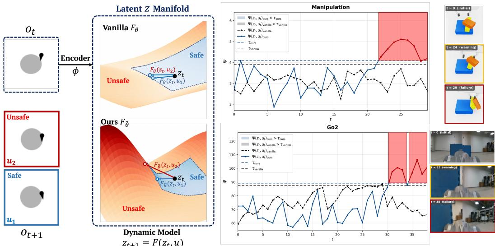
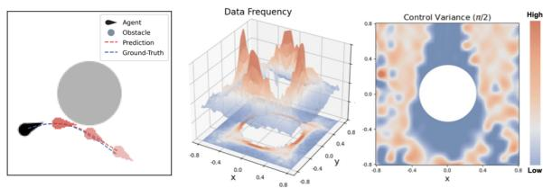
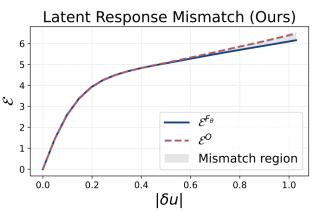
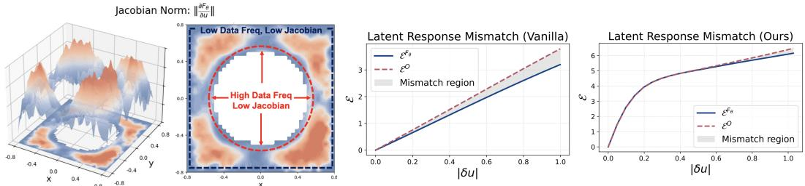
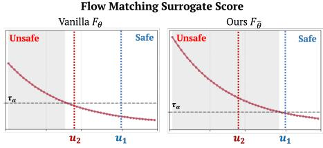
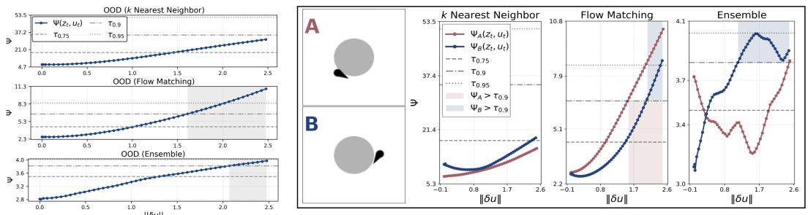
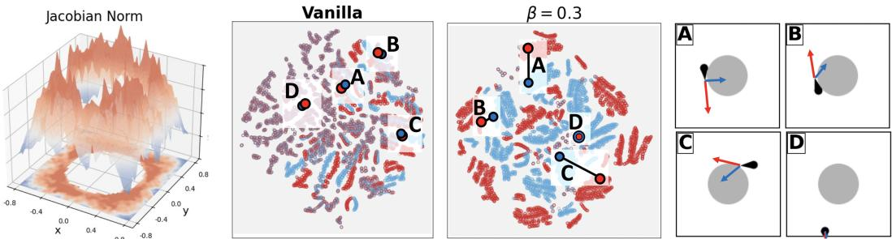
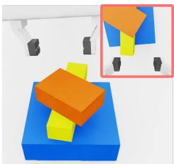
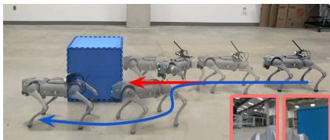
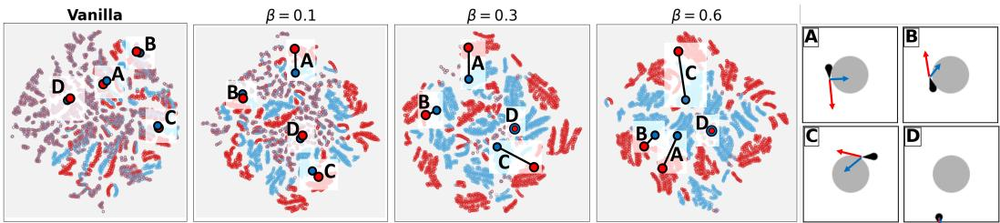

# Sensitivity Shaping for Latent Modeling

Hongzhan Yu<sup>1</sup>, Chenghao Li<sup>1</sup>, Ruipeng Zhang<sup>1</sup>, Henrik Christensen<sup>1</sup>, Sicun Gao<sup>1</sup>

<sup>1</sup>University of California San Diego

{hoy021, chl235, ruz019, hichrist, sig049}@ucsd.edu

Abstract: Generative dynamics models enable planning in challenging robotic systems, but safe deployment requires reliably detecting policy-induced out-ofdistribution (OOD) transitions. Existing methods typically treat the learned dynamics as fixed and attach post hoc support surrogates. We show that these surrogates can fail when the dynamics are locally insensitive to critical action choices: unsupported control actions may produce latent predictions that resemble demonstrated transitions, suppressing OOD signals despite large true predictive errors. To address this, we introduce support-conditioned control-sensitivity regularization, which promotes sensitive local response to control input changes in learned dynamics in high-support training regions. This preserves control-induced variation while limiting unstable extrapolation due to weak empirical support. Experiments in vision-based obstacle avoidance, manipulation, and real-robot navigation show improved OOD detection and safer closed-loop planning.

Keywords: Generative dynamics model; Out-of-distribution detection

## 1 Introduction

Generative models that capture system dynamics through latent representations (such as world models [1]) have emerged as promising components for robotics. These models aim to support predictive reasoning beyond reactive control prediction, by mapping high-dimensional observations into a latent manifold that preserves transition-relevant structure. They have enabled planning and control in challenging systems where analytical dynamics are unavailable, including vision-based manipulation [2, 3] and robot navigation under partial observability in dynamic environments [4, 5, 6].

A critical bottleneck of generative dynamics models is that they are vulnerable to deployment-time distribution shift [7, 8]. Such shift arises when the model is queried on out-of-distribution (OOD) state-action inputs, often due to the deviation between deployed policies from the behavior policy which induces changes to the state-visitation distribution [7, 8]. In such OOD cases, bounding prediction errors is challenging. Prior work mitigates this issue by broadening the training distribution, for example through web-scale multimodal data [9, 10, 11, 12, 13] or foundation-model priors [14, 15, 16]. However, there is a consensus on the scarcity of robot interaction data relative to other domains [17, 18, 19, 20], and the scale of the training data alone does not guarantee coverage of task-critical counterfactuals or reliable generalization beyond the training manifold.

These limitations motivate uncertainty-aware analysis that aims to detect transitions that depart from the training support [21]. Existing methods typically design surrogate scores to measure uncertainty, such as: ensembles use inter-model disagreement [22], density models estimate likelihood under a learned data distribution [23], and nearest-neighbor methods measure distance to observed transitions [24]. During planning, these scores are incorporated as penalties to discourage unsupported controls [25]. However, most approaches treat OOD analysis as a post hoc diagnostic, and calibrate surrogates scores with conformal prediction which bounds the false rejection rate for in-distribution inputs at a prescribed level [26]. Yet, safe model-based control also requires the complementary property: genuinely unsupported transitions should be reliably rejected. This property is not guaranteed by calibration alone; it depends on whether the surrogate score captures true support mismatch along rollout distributions and thereby provides an informative proxy for prediction error. Importantly, surrogate-measured support mismatch need not align with actual prediction error (Figure 1).

  
Figure 1: Overview of sensitivity shaping for reliable OOD detection in generative dynamics models. Controlinsensitive models respond weakly to control inputs, yielding inaccurate yet in-distribution-looking predictions that obscure OOD detection. (Left) At a safety-critical state $o _ { t } .$ , different controls lead to distinct outcomes, e.g., a safe transition under $u _ { 1 }$ and an unsafe one under $u _ { 2 } .$ However, the vanilla model trained on failure-free data fail to capture true system consequences due to control-insensitivity which flattens the dynamics landscape over controls, making the predicted next latent states $z _ { 1 }$ and $z _ { 2 }$ nearly indistinguishable. Our sensitivity regularizer promotes nontrivial control responses, measured via the Frobenius norm of the control-Jacobian within learned dynamics, and improves detectability of unsupported transitions in the latent space. (Right) On undemonstrated failure rollouts in manipulation and real-robot navigation, the vanilla model fails to detect OOD before failure, with scores remaining below the calibrated threshold. In contrast, the sensitivity-regularized model flags OOD earlier, with red shading marking steps classified as OOD.

In this paper, we improve OOD analysis for generative dynamics models by shaping the local sensitivity in the learned dynamics landscape. We identify control insensitivity as a critical failure mode, where learned dynamics respond too weakly to control inputs and underrepresent the true responses. Under this failure mode, undemonstrated controls yield predictions that spuriously resemble the training distribution despite large true predictive errors, causing standard support-based OOD surrogates to fail. To address this, we introduce a sensitivity regularizer applied to well-supported regions of the training distribution. The regularizer encourages nontrivial Frobenius norms on the control Jacobian, encouraging locally responsive dynamics without attempting to guarantee accurate prediction for arbitrary unseen controls. By preventing control-induced predictions from collapsing to overly similar latent transitions, the method makes unsupported transitions easier to detect.

Overall, we make the following contributions. First, we analyze control sensitivity in generative dynamics models through a vision-based obstacle-avoidance case study, demonstrating how control insensitivity degrades OOD detection (Section 3). Second, we propose a support-conditioned sensitivity regularizer that promotes local responsiveness of the learned dynamics and improves detectability of unsupported transitions (Section 4). Finally, we show that this method enhances control sensitivity, improves OOD detection, and enables more reliable OOD-aware planning across simulated and real-robot experiments (Section 5).

Related Work. Generative dynamics models learn latent representations and transition dynamics from high-dimensional observations for prediction, planning, and control [1]. Recurrent State-Space Models (RSSMs) [27], trained with variational objectives [28, 29, 30], form the basis of the Dreamer family [31, 32, 33, 34], which optimizes policies through imagined latent rollouts. These models have been applied to embodied robotic tasks such as manipulation, navigation, and locomotion [2, 4, 35, 5, 36]. However, learned dynamics can become unreliable under deployment-time distribution shift [37, 38], which is especially problematic for safety-critical control [39, 40, 41]. Existing outof-distribution (OOD) analysis methods monitor such failures using distance-based scores [42, 43, 44, 45], density- or energy-based criteria [46, 47, 48, 49], or ensemble uncertainty [8, 38, 7], often to trigger runtime interventions or safety filters [50, 51, 52, 25]. These approaches are largely post hoc and depend on the learned representation. In contrast, we show that OOD detectability can be limited by the learned latent dynamics themselves, and propose to improve it by shaping control sensitivity during dynamics learning.

## 2 Preliminaries

Generative Dynamics Models. Consider a discrete-time dynamical system. At each time step t, the agent observes $o _ { t } \in \mathcal { O }$ , applies $u _ { t } \in \mathcal { U } .$ , and transitions to $o _ { t + 1 } = f ( o _ { t } , u _ { t } )$ where $f : \mathcal { O } \times \mathcal { U } \to \mathcal { O }$ Generative dynamics models approximate f in a lower-dimensional latent space $\mathcal { Z }$ involving

$$
\mathrm { E n c o d e r : } z _ { t } \in \mathcal { Z } \sim \phi _ { \theta } ( \cdot \mid o _ { t } ) , \qquad \mathrm { D y n a m i c s : } z _ { t + 1 } \in \mathcal { Z } \sim F _ { \theta } ( \cdot \mid z _ { t } , u _ { t } ) .\tag{1}
$$

The key training objective is latent predictive consistency: the dynamics prior predicted from $\left( { { z } _ { t } } , { { u } _ { t } } \right)$ should align with the encoder posterior of the next observation, i.e, $F _ { \theta } ( \cdot \mid z _ { t } , u _ { t } ) \approx \phi _ { \theta } ( \cdot \mid o _ { t + 1 } )$

Out-of-Distribution (OOD) Analysis. OOD analysis studies whether a learned model is queried outside the support of its training data. We use an OOD surrogate: $\Psi : \mathcal { Z } \times \mathcal { U }  \mathbb { R } ^ { + }$ , where larger values indicate lower support. Common choices include: k nearest neighbor (kNN) distances to training latent transitions [24], Flow Matching negative log-density estimated via a learned flow to a Gaussian base [23], and Ensemble disagreement across independently dynamics models [22]. Inductive conformal prediction (ICP) [26] provides a principal way to convert a chosen surrogate into an OOD boundary: on a held-out in-distribution calibration set, for a prescribed level $\alpha , \tau _ { \alpha }$ is chosen as the the empirical (1−α)-quantile of Ψ. A pair $( z _ { t } , u _ { t } )$ is classified as OOD if $\Psi ( z _ { t } , u _ { t } ) >$ $\tau _ { \alpha } .$ , yielding a false rejection probability for in-distribution samples bounded by α.

## 3 Analysis: Control-Conditioned Sensitivity in Latent Dynamics

Control insensitivity creates a fundamental failure mode for OOD analysis: when the learned dynamics depend weakly on controls, they may produce inaccurate predictions that nevertheless appear compatible with the training distribution. Since OOD surrogates measure support rather than transition correctness, such errors can evade detection. We study this issue in safety-critical systems [53], where failure-free data often provide limited control diversity near critical regions, making controldependent transitions weakly identifiable and inducing local control insensitivity.

## 3.1 Running Example: Vision-Based Dubins Obstacle Avoidance

We illustrate this failure mode in a visionbased obstacle-avoidance case study. The agent follows constant-speed Dubins dynamics with a scalar steering-rate input and observes bird’s-eye-view images. We train generative dynamics models using DreamerV3 [33] on collision-free trajectories collected with expert and random controls. Figure 2-Left shows that the trained model can accurately predict future states for demonstrated state-control pairs.

Training Data Analysis. Figure 2-Middle shows that samples concentrate near the

  
Figure 2: Dubins system. (Left) RGB obesrvations. Overlays show that model-predicted future states accurately tracks the ground-truth. (Middle) Training-data density over the spatial map, showing denser coverage near the obstacle and sparser coverage farther away. (Right) Spatial controlvariance map for heading $\pi / 2$ . Low variance near the obstacle indicates limited control diversity under safe constraints.

central obstacle, while regions farther away are comparatively sparse. In contrast, the empirical control variance is low near the obstacle (Figure 2-Right), since the exclusion of failure trajectories restricts near-boundary demonstrations to controls that remain safe. This reduced control diversity weakens the identifiability of control-dependent dynamics in safety-critical regions.



  
Figure 3: Sensitivity analysis in the obstacle-avoidance system. From left to right: $^ { ( \mathbf { a } , \mathbf { b } ) }$ Control-Jacobian norms for demonstrated latent state-control pairs, project onto the 2D position space and averaged within discretized bins; blue indicates lower sensitivity and red indicates higher sensitivity. Low sensitivity regions arise from limited control diversity or sparse data coverage. (c) The vanilla, control-insensitive dynamics deviate from the true system responses even under small perturbations. (d) The sensitivity-regularized dynamics better match the true response, substantially reducing small-perturbation mismatch.

## 3.1.1 Control Sensitivity of the Learned Dynamics

Measuring Control Sensitivity. We first formalize the sensitivity measure. For an arbitrary latent state-control pair $\left( { { z } _ { t } } , { { u } _ { t } } \right)$ , we fix $z _ { t }$ and view the learned transition as a differential function of the control input: $F _ { \theta } ( z _ { t } , \cdot ) : \mathcal { U } \subseteq \mathbb { R } ^ { | \mathcal { U } | } \to \mathcal { Z } \subseteq \mathbb { R } ^ { | \mathcal { Z } | }$ . Its Jacobian $J _ { u } F _ { \theta } ( z _ { t } , u _ { t } ) \in \mathbb { R } ^ { | \mathcal { Z } | \times | \mathcal { U } | }$ maps a control perturbation direction δu to the first-order change in the predicted next latent state:

$$
\mathrm { d } F _ { \theta } ( z _ { t } , u _ { t } ) [ \delta u ] = J _ { u } F _ { \theta } ( z _ { t } , u _ { t } ) \cdot \delta u : = \left. { \frac { \mathrm { d } } { \mathrm { d } \varepsilon } } F _ { \theta } ( z _ { t } , u _ { t } + \varepsilon \partial u ) \right| _ { \varepsilon = 0 } .\tag{2}
$$

We measure control sensitivity by the Frobenius norm of this Jacobian, i.e., $\Vert J _ { u } F _ { \theta } ( z _ { t } , u _ { t } ) \Vert _ { F } ~ =$ $\begin{array} { r } { ( \sum _ { i = 1 } ^ { | \mathcal { Z } | } \sum _ { j = 1 } ^ { | \mathcal { U } | } ( J _ { u } F _ { \theta } ( z _ { t } , u _ { t } ) ) _ { i j } ^ { 2 } ) ^ { 1 / 2 } } \end{array}$ . This norm aggregates first-order responses across control directions, serving as a continuous analogue of average sensitivity for Boolean functions [54], and a standard measure of neural network sensitivity [55].

Sensitivity Results. Figure $^ { 3 - ( \mathrm { a } , \mathrm { b } ) }$ visualizes control-Jacobian Frobenius norms over demonstrated state-control pairs. The results shows two low-sensitivity regimes: sparse outer regions near the position-space boundary, and near-obstacle regions with substantial state coverage but limited control diversity. Low sensitivity indicates that the learned dynamics respond weakly to changes in the control input, producing similar next-latent predictions for distinct controls. However, the true Dubins dynamics (see Appendix) demand stronger sensitivity: the steering-rate input affects the heading with state-independent gain, while constant forward speed induces position changes of fixed magnitude. Thus, for a fixed control perturbation, the true response should be comparable across states and should not vanish near the safety boundary.

To quantify this mismatch, we compare the model-predicted dynamics response with the true system response. For an arbitrary latent-valued transition map $H .$ , define its control-induced response as $\Delta _ { H } ( x , u ; \partial u ) \triangleq H ( x , u + \delta u ) - H ( x , u )$ . This measures the change in H at input x induced by perturbing the control from u to $u + \partial u$ . Let $\mathbb { G } : \mathcal { O } \times \mathcal { U } \to \mathcal { O }$ denote the one-step observation transition, and write $H _ { O } ( o , u ) \triangleq \phi _ { \theta } ( \mathbb { G } ( o , u ) )$ . For $\left( o _ { t } , u _ { t } \right)$ , with $z _ { t } \sim \phi _ { \theta } ( \cdot \mid o _ { t } )$ , we measure

$$
\begin{array} { r } { \mathcal { E } ^ { F _ { \theta } } ( z _ { t } , u _ { t } ; \delta u ) \triangleq \| \Delta _ { F _ { \theta } } ( z _ { t } , u _ { t } ; \partial u ) \| _ { 2 } ^ { 2 } , \quad \mathcal { E } ^ { O } ( o _ { t } , u _ { t } ; \delta u ) \triangleq \| \Delta _ { H _ { O } } ( o _ { t } , u _ { t } ; \partial u ) \| _ { 2 } ^ { 2 } , } \end{array}\tag{3}
$$

where ${ \mathcal { E } } ^ { F _ { \theta } }$ is the model-predicted response and $\mathcal { E } ^ { O }$ is the true response in the same latent space. Figure $_ { 3 - \mathsf { C } }$ shows that, over near-obstacle low-sensitivity samples identified in Figure 2, the gap between ${ \mathcal { E } } ^ { F _ { \theta } }$ and $\mathcal { E } ^ { O }$ grows with $\lVert \delta u \rVert$ , indicating that learned dynamics increasingly underestimate control-induced variation away from demonstrated controls. Importantly, since the gap appears even for small perturbations, the mismatch is local and can compound rapidly under recursive rollouts, showing that the learned control-insensitive dynamics underrepresents the true system dynamics.



  
Figure 4: OOD surrogate responses to perturbations. (Left) Average surrogate scores over near-obstacle samples as demonstrated controls are perturbed. Dashed horizontal lines denote conformal thresholds at coverage levels 0.75, 0.90, and 0.95; shaded regions indicate perturbations classified as OOD under the 0.90-coverage threshold. Although scores generally increase with $\mathit { \Pi } \left\| \delta u \right\|$ , each misses some safety-critical perturbations to varying degrees. (Right) Qualitative sample-level responses. In Scenario A, the ensemble score decreases under perturbations because shared control-insensitive dynamics cause disagreement to overlook transition error.

## 3.1.2 Impact on OOD Analysis

We next discuss how control insensitivity degrades OOD analysis. The failures stem from a mismatch between latent transition geometry and prediction error: if perturbed controls yield predicted transitions close to the demonstrated distribution, support-based scores may not reflect the true transition error as these surrogates mainly assess compatibility with the training distribution.

Empirical Results. Over near-obstacle, low-sensitivity samples, we perturb demonstrated controls by δu and measure scores as $\Vert \delta u \Vert$ increases; Figure 4 reports results, showing that OOD scores need not track increasing control deviation. For kNN which measures latent distance to training samples, control-insensitive predictions can falsely resemble training distribution and therefore receive small nearest-neighbor distances. Accordingly, its average scores remain below the 0.90- coverage OOD threshold across the full range of $\lVert \delta u \rVert$ Ensemble scores appear more responsive on average but can be non-monotonic at the sample level: when members share the same control-insensitive bias, disagreement reflects inter-model variance rather than shared

Flow Matching Surrogate Score

Figure $5 { : }$ Flow-matching scores for the state o<sub>t</sub> in Figure 1. Dashed lines indicate calibrated thresholds. For the unsafe control $u _ { 2 } .$ , vanilla dynamics (left) assigns an in-distribution score due to control-insensitivity, whereas the proposed sensitivity-regularized dynamics (right) correctly identifies the transition as OOD.

transition error and may even decrease with $\lVert \delta u \rVert$ . Flow matching performs best, but perturbed transitions near the training manifold may still be mapped through well-trained regions of the flow and assigned high likelihood. Iterative flow integration can further smooth small deviations, reduc ing the contrast between perturbed and demonstrated transitions and causing some safety-critical perturbations to be missed (Figure 5). These results show that post hoc OOD surrogates cannot fully compensate for collapsed control-conditioned transitions.

## 4 Method: Support-Conditioned Control Sensitivity Regularization

We mitigate control insensitivity to facilitate OOD detection by regularizing the learned dynamics to maintain nontrivial control-Jacobian norms in well-supported regions of the training distribution. The goal is not to guarantee accurate prediction under arbitrary controls, but to prevent undemon strated controls from collapsing to overly similar latent transitions. For a latent state–control pair $( z _ { t } , u _ { t } )$ and valid control perturbations δu, a first-order expansion shows that the average local response to control perturbations is governed by the control Jacobian:

$$
{  { \mathbb E } } _ { \delta u } \left[ \left\| \Delta _ { F _ { \theta } } ( z _ { t } , u _ { t } ; \partial u ) \right\| _ { 2 } ^ { 2 } \right] \approx {  { \mathbb E } } _ { \delta u } \left[ \| J _ { u } F _ { \theta } ( z _ { t } , u _ { t } ) \delta u \| _ { 2 } ^ { 2 } \right] = \frac { \bar { \sigma } _ { u } ^ { 2 } } { | \mathcal { U } | } \| J _ { u } F _ { \theta } ( z _ { t } , u _ { t } ) \| _ { F } ^ { 2 } ,\tag{4}
$$

  
Figure 6: Sensitivity analysis with sensitivity-regularized dynamics. From left to right: (a) Control-Jacobian norms of the regularized dynamics, showing increased responsiveness in near-obstacle regions that were previously control-insensitive. $\mathbf { ( b , c ) }$ PCA+t-SNE visualizations of latent transitions under demonstrated controls (red) and undemonstrated controls (blue). The vanilla model (b) exhibits substantial overlap, indicating underrepresented control-induced variation, whereas the regularized model (c) shows improved separation achieved by the proposed non-contrastive sensitive regularization. (d) Annotated states for marked points in (b,c).

where $\bar { \sigma } _ { u } = \mathbb { E } _ { \partial u } [ \| \partial u \| _ { 2 } ]$ is the expected perturbation magnitude. While the Frobenius norm does not lower-bound every perturbation direction, enforcing a non-vanishing norm promotes aggregate control responsiveness and mitigate collapse onto demonstrated transitions.

Support-Conditioned Targeting. Uniformly enforcing strong local responsiveness across the training manifold can degrade prediction in weakly supported regions: a global Jacobian constraint may increase local Lipschitz constants and amplify extrapolation errors through sensitive transitions [56]. We therefore apply sensitivity regularization only in high-supported regions, where empirical observations sufficiently constrain the latent dynamics. To identify these regions, we use kNN surrogate on in-distribution samples as a parameter-free proxy for local support. Since this assessment ranks demonstrated inputs, it is not subject to the control-insensitivity artifacts.

Control Sensitivity Regularization. Since the encoder evolves during training, we periodically update the high-support set, denoted as D<sup>¯</sup>, by retaining the $\beta .$ -fraction of samples with the smallest latent-space kNN distances. On this set, we promote local control sensitivity with

$$
\mathcal { L } _ { \mathrm { r e g } } = \mathbb { E } _ { \left( o _ { t } , u _ { t } \right) \sim \bar { \mathbb { D } } } \left[ \left( g - \left\| \frac { \partial F _ { \theta } ( z _ { t } , u _ { t } ) } { \partial u _ { t } } \right\| _ { F } ^ { 2 } \right) _ { + } \right] ,\tag{5}
$$

where $( \cdot ) _ { + } = \operatorname* { m a x } ( \cdot , 0 )$ and $g > 0$ sets the lower bound on the squared norm, penalizing vanishing sensitivity while avoiding unbounded growth. To reduce computational cost, we estimate the Frobenius norm using Hutchinson’s identity [57]. The final objective is: $\mathcal { L } = \mathcal { L } _ { \mathrm { d y n } } + \lambda _ { r e g } \mathcal { L } _ { \mathrm { r e g } }$ , where $\mathcal { L } _ { \mathrm { d y n } }$ denotes the standard generative dynamics training loss and $\lambda _ { r e g }$ is the regularization weight.

## 5 Experiments

## 5.1 Dubins Obstacle Avoidance

We first evaluate the proposed method on the Dubins system introduced in Section 3; training configurations are provided in the Appendix. We evaluate whether the regularized dynamics recover stronger control sensitivity and improve downstream OOD-aware planning.

Sensitivity Analysis. Figure 6-a shows that, compared to the unregularized model (Figure 3), the proposed sensitivity-regularized dynamics exhibits substantially stronger responsiveness in nearobstacle regions. To inspect the induced latent geometry, Figure $^ { 6 - ( \mathsf { b } , \mathsf { c } ) }$ visualizes predicted nextlatent states for the top 20% high-support training samples. For each sample, we construct an undemonstrated transition by replacing its control with the one farthest from the empirical control distribution. Given the pairs $\left( { { z } _ { t } } , { { u } _ { t } } \right)$ , we unroll the learned dynamics and and project the predicted next-latent states $z _ { t + 1 } \sim F _ { \theta } ( \cdot \mid z _ { t } , u _ { t } )$ using PCA followed by t-SNE. For the unregularized model, demonstrated and undemonstrated transitions substantially overlap, indicating that controlinsensitive dynamics map distinct controls to overly similar latent predictions. In contrast, the regularized model yields improved separation despite using a non-contrastive Jacobian regularizer. The remaining overlap typically corresponds to common near-initial or near-terminal states. Figure 3-d shows that the regularized model more closely tracks the ground-truth latent response $\mathcal { E } ^ { O }$

OOD-Aware Planning. We use calibrated OOD thresholds as one-step safety filters for a random reference controller. At each time step, we reject the proposed control $u _ { t } ^ { \mathrm { r e f } }$ if its induced transition has an OOD score above the calibrated threshold. Upon rejection, we execute the sampled alternative with the lowest OOD score. We report: $\rho _ { \mathrm { s u c c } } ,$ , the fraction of safe trajectories; $\rho _ { \mathrm { f i l t } }$ , the fraction of rejected reference control; and $\rho _ { \mathrm { v i o l } }$ , the fraction of executed transitions classified as OOD.

Results. Table 1 compares safety filters built from vanilla and the proposed regularized dynamics. Flow matching outperforms kNN, consistent with the preceding analysis showing that flow matching is most responsive. Ensemble consistently underperforms, likely due to spurious inter-member agreement on far-OOD inputs [45, 24]; this issue is amplified in the one-step filtering where the surrogate must provide reliable local rankings of candidate controls. Across all three surrogates, filters based on the regularized dynamics improve over their vanilla counterparts, achieving higher success rates and lower OOD vi-

<table><tr><td>Method</td><td>Ψ</td><td> $\rho _ { \mathrm { s u c c } }$  ↑</td><td> $\rho _ { \mathrm { f i l t } }$ </td><td> $\rho _ { \mathrm { v i o l } } \downarrow$ </td></tr><tr><td>Vanilla</td><td>kNN FM ENS</td><td>0.600 0.910 0.380</td><td>0.340 0.309 0.459</td><td>0.273 0.153 0.327</td></tr><tr><td>Ours</td><td>kNN FM ENS</td><td>0.800 0.960 0.440</td><td>0.323 0.323 0.425</td><td>0.166 0.104 0.297</td></tr></table>

Table 1: Obstacle-avoidance with filtering of a random policy (200 trials).

olation rates. These results indicate that enhanced control sensitivity improves OOD-aware safety filtering by increasing detectability of unsupported candidate controls.

## 5.2 Block Plucking Manipulation

Setup. We next consider a manipulation task in which a Franka arm extracts the middle block from a three-block stack without dropping the top block (Figure 7). Observations are RGB images from wrist-mounted and tabletop cameras, together with 7-dimensional proprioception. The controls are a 6-DoF end-effector pose increment and a discrete gripper command.

We evaluate OOD-aware planning using the ensemble surrogate and a reachability-based safety filter [25]. Unlike the one-step filter, this filter is trained on imagined latent rollouts to reason about long-horizon OOD risk. Given an OOD surrogate Ψ and a calibrated threshold $\tau _ { \alpha }$ at calibration level $\alpha ,$ the reachability filter learns to avoid trajectories that enter latent states z from which all admissible controls are OOD, i.e., $\mathrm { m i n } _ { u \in \mathcal { U } } \Psi ( z , u ) > \tau _ { \alpha }$ Because trajectories may remain safe but fail to complete the task, we replace success rate with the failure rate $\rho _ { \mathrm { f a i l } }$ and the incompletion rate $\rho _ { \mathrm { i n c } } .$ We also report the reconstruction error $\mathcal { E } _ { \mathrm { r e c o n } } ,$ defined as the negative loglikelihood of the observations under the trained decoder’s reconstruction

  
Figure 7: Observations in block-plucking.

distribution, as a proxy for how closely executed trajectories remain within the training support.

Results. Table 2 evaluates a mediocre reference policy with $\rho _ { \mathrm { f a i l } } \approx 0 . 2 5$ . Compared with the filter trained on vanilla dynamics, the filter trained on sensitivity-regularized dynamics achieves a lower failure rate with moderate intervention. It also produces the lowest reconstruction error, suggesting that the filtered trajectories remain the closest to the training support.

Table 7 filters a policy trained on imagined rollouts to maximize the learned reward [33]. This setting evaluates the full offline pipeline: learning dynamics and rewards from data, then training both policy and OOD filter entirely through latent imagination. We note that larger α tightens the OOD threshold, yielding a more conservative filter: $\alpha = 0 . 2$ minimizes reconstruction error and failures, but maximizes task incompletions by suppressing progressive controls. Conversely, a smaller α improves in-distribution coverage but enables aggressive, risker planning when the learned dynamics or OOD surrogates are imperfect. Notably, the filter built from sensitivity-regularized dynamics at $\alpha = 0 . 0 5$ outperforms the vanilla-dynamics filter at $\alpha = 0 . 1$ , suggesting that improved control sensitivity preserve safety while reducing the need for overly conservative calibration.

<table><tr><td>Filter</td><td>α</td><td>ρfail ↓</td><td> $\rho _ { \mathrm { i n c } }$ </td><td> $\rho _ { \mathrm { f i l t } }$ </td><td> $\mathcal { E } _ { \mathrm { r e c o n } } \downarrow$ </td></tr><tr><td>None</td><td>N/A</td><td>0.243</td><td>0.096</td><td>0.000</td><td>2335.99</td></tr><tr><td>Vanilla</td><td>0.10</td><td>0.196</td><td>0.047</td><td>0.242</td><td>2215.32</td></tr><tr><td>Ours</td><td>0.10</td><td>0.150</td><td>0.047</td><td>0.269</td><td>2196.11</td></tr></table>

<table><tr><td>Filter</td><td>α</td><td>ρfail ↓</td><td> $\rho _ { \mathrm { i n c } }$ </td><td> $\rho _ { \mathrm { { f i l t } } }$ </td><td> $\mathcal { E } _ { \mathrm { r e c o n } } \downarrow$ </td></tr><tr><td>Vanilla</td><td>0.10</td><td>0.118</td><td>0.013</td><td>0.154</td><td>2207.55</td></tr><tr><td>Ours</td><td>0.20</td><td>0.046</td><td>0.157</td><td>0.322</td><td>2036.50</td></tr><tr><td>Ours</td><td>0.10</td><td>0.047</td><td>0.053</td><td>0.199</td><td>2146.66</td></tr><tr><td>Ours</td><td>0.05</td><td>0.085</td><td>0.007</td><td>0.100</td><td>2204.37</td></tr></table>

Table 2: Block-plucking with filtering of a medicore policy (100 trials).  
Table 3: Block-plucking with filtering of the policy trained from the same dynamics model (100 trials).

## 5.3 Real-Robot Static-Obstacle Avoidance

Setup. Lastly, we study a real-robot obstacle-avoidance system using images from two body-mounted cameras (Figure 8). We collect 60 minutes of collision-free teleoperation using three discrete commands: turn left, move straight, and turn right, all executed at a fixed forward speed of 0.5 m/s. Despite the discrete control space, the control-sensitivity view still applies, as control insensitivity is data-induced limitation of learned dynamics and discrete commands are embedded as continuous inputs to the learned dynamics.

Results. Table 4 reports filtering results for a random reference policy, using one-step filters for kNN and flow matching and a reachability-based filter for ensemble. The kNN surrogate provides limited performance, reflecting the difficulty of using latent distances in real-world visual settings where covering all observation variations is impossible. Flow matching performs best under the available data budget and improves further when paired with the sensitivityregularized dynamics, suggesting that parametric density surrogates can effectively model high-dimensional support without exhaustive coverage. The ensemble filter incurs frequent interventions because long-horizon imagined roll-

  
Figure 8: Real-robot obstacle avoidance system. The unfiltered trajectory (red) results in failure, whereas the flow-matching filter (blue) avoids it. Bottom-right insets show body-camera observations.

<table><tr><td>Method</td><td>Ψ</td><td>ρsucc ↑</td><td>ρfilt</td><td>ρviol ↓</td></tr><tr><td rowspan="3">Vanilla</td><td>kNN</td><td>0.240</td><td>0.047</td><td>0.027</td></tr><tr><td>FM</td><td>0.900</td><td>0.343</td><td>0.155</td></tr><tr><td>ENS</td><td>0.150</td><td>0.543</td><td>0.507</td></tr><tr><td rowspan="3">Ours</td><td>kNN</td><td>0.380</td><td>0.040</td><td>0.026</td></tr><tr><td>FM</td><td>1.000</td><td>0.326</td><td>0.154</td></tr><tr><td>ENS</td><td>0.750</td><td>0.592</td><td>0.557</td></tr></table>

Table 4: Real-robot with filtering of a random policy (50 trials).

outs can amplify spurious OOD classification. Nevertheless, its large $\rho _ { \mathrm { s u c c } }$ improvement with regularized dynamics indicates that reachability-based filtering is particularly sensitive to control conditioned transition collapse. We interpret $\rho _ { \mathrm { v i o l } }$ cautiously, as unmodeled camera variations can induce observation-level OOD events orthogonal to our focus. Overall, we show that that enhancing control sensitivity improves OOD detection and OOD-aware planning on hardware. Supplementary videos provide comparisons of the resulting behavioral differences.

## 6 Conclusion

This work identifies control insensitivity in generative dynamics models as a key failure mode for OOD analysis. We show that weak sensitivity can cause unsupported controls to produce indistribution-looking predictions, systematically suppressing OOD signals. To mitigate this, we introduce a support-conditioned sensitivity regularizer that enforces non-vanishing control-Jacobian norms in high-support regions of the training distribution. Through sensitivity analyses and safety filtering experiments, we demonstrate improved OOD detection and safer model-based control.

Limitations. The proposed regularizer relies on latent kNN-based support estimates; poor representations or distance metric may lead to misidentified support regions. Periodic support-set updates also add computational cost for large datasets. Future work should study scalable and adaptive support estimation, richer visual representations, and broader hardware validation.

## References

[1] D. Ha and J. Schmidhuber. World models. arXiv preprint arXiv:1803.10122, 2(3), 2018.

[2] P. Wu, A. Escontrela, D. Hafner, P. Abbeel, and K. Goldberg. Daydreamer: World models for physical robot learning. In Conference on robot learning, pages 2226–2240. PMLR, 2023.

[3] J. Guo, X. Ma, Y. Wang, M. Yang, H. Liu, and Q. Li. Flowdreamer: A rgb-d world model with flow-based motion representations for robot manipulation. IEEE Robotics and Automation Letters, 11(3):2466–2473, 2026.

[4] S. Shanks, J. Embley-Riches, J. Liu, A. M. Delfaki, C. Ciliberto, and D. Kanoulas. Dreamernav: learning-based autonomous navigation in dynamic indoor environments using world models. Frontiers in Robotics and AI, 12:1655171, 2025.

[5] H. Lai, J. Cao, J. Xu, H. Wu, Y. Lin, T. Kong, Y. Yu, and W. Zhang. World model-based perception for visual legged locomotion. In 2025 IEEE International Conference on Robotics and Automation (ICRA), pages 11531–11537. IEEE, 2025.

[6] J. Y. Koh, H. Lee, Y. Yang, J. Baldridge, and P. Anderson. Pathdreamer: A world model for indoor navigation. In Proceedings of the IEEE/CVF International Conference on Computer Vision, pages 14738–14748, 2021.

[7] T. Yu, G. Thomas, L. Yu, S. Ermon, J. Y. Zou, S. Levine, C. Finn, and T. Ma. Mopo: Modelbased offline policy optimization. Advances in Neural Information Processing Systems, 33: 14129–14142, 2020.

[8] R. Kidambi, A. Rajeswaran, P. Netrapalli, and T. Joachims. Morel: Model-based offline reinforcement learning. Advances in neural information processing systems, 33:21810–21823, 2020.

[9] A. Radford, J. W. Kim, C. Hallacy, A. Ramesh, G. Goh, S. Agarwal, G. Sastry, A. Askell, P. Mishkin, J. Clark, et al. Learning transferable visual models from natural language supervision. In International conference on machine learning, pages 8748–8763. PmLR, 2021.

[10] S. Y. Gadre, G. Ilharco, A. Fang, J. Hayase, G. Smyrnis, T. Nguyen, R. Marten, M. Wortsman, D. Ghosh, J. Zhang, et al. Datacomp: In search of the next generation of multimodal datasets. Advances in Neural Information Processing Systems, 36:27092–27112, 2023.

[11] C. Jia, Y. Yang, Y. Xia, Y.-T. Chen, Z. Parekh, H. Pham, Q. Le, Y.-H. Sung, Z. Li, and T. Duerig. Scaling up visual and vision-language representation learning with noisy text supervision. In International conference on machine learning, pages 4904–4916. PMLR, 2021.

[12] C. Schuhmann, R. Beaumont, R. Vencu, C. Gordon, R. Wightman, M. Cherti, T. Coombes, A. Katta, C. Mullis, M. Wortsman, et al. Laion-5b: An open large-scale dataset for training next generation image-text models. Advances in neural information processing systems, 35: 25278–25294, 2022.

[13] O. Simeoni, H. V. Vo, M. Seitzer, F. Baldassarre, M. Oquab, C. Jose, V. Khalidov,´ M. Szafraniec, S. Yi, M. Ramamonjisoa, et al. Dinov3. arXiv preprint arXiv:2508.10104, 2025.

[14] D. Driess, F. Xia, M. S. Sajjadi, C. Lynch, A. Chowdhery, A. Wahid, J. Tompson, Q. Vuong, T. Yu, W. Huang, et al. Palm-e: An embodied multimodal language model. 2023.

[15] M. Ahn, A. Brohan, N. Brown, Y. Chebotar, O. Cortes, B. David, C. Finn, C. Fu, K. Gopalakrishnan, K. Hausman, et al. Do as i can, not as i say: Grounding language in robotic affordances. arXiv preprint arXiv:2204.01691, 2022.

[16] K. Black, N. Brown, D. Driess, A. Esmail, M. Equi, C. Finn, N. Fusai, L. Groom, K. Hausman, B. Ichter, S. Jakubczak, T. Jones, L. Ke, S. Levine, A. Li-Bell, M. Mothukuri, S. Nair, K. Pertsch, L. X. Shi, J. Tanner, Q. Vuong, A. Walling, H. Wang, and U. Zhilinsky. π<sub>0</sub>: A vision-language-action flow model for general robot control, 2026. URL https://arxiv. org/abs/2410.24164.

[17] A. O’Neill, A. Rehman, A. Maddukuri, A. Gupta, A. Padalkar, A. Lee, A. Pooley, A. Gupta, A. Mandlekar, A. Jain, et al. Open x-embodiment: Robotic learning datasets and rt-x models: Open x-embodiment collaboration 0. In 2024 IEEE International Conference on Robotics and Automation (ICRA), pages 6892–6903. IEEE, 2024.

[18] A. Brohan, N. Brown, J. Carbajal, Y. Chebotar, J. Dabis, C. Finn, K. Gopalakrishnan, K. Hausman, A. Herzog, J. Hsu, et al. Rt-1: Robotics transformer for real-world control at scale. arXiv preprint arXiv:2212.06817, 2022.

[19] B. Zitkovich, T. Yu, S. Xu, P. Xu, T. Xiao, F. Xia, J. Wu, P. Wohlhart, S. Welker, A. Wahid, et al. Rt-2: Vision-language-action models transfer web knowledge to robotic control. In Conference on Robot Learning, pages 2165–2183. PMLR, 2023.

[20] Y. Ma, Z. Song, Y. Zhuang, J. Hao, and I. King. A survey on vision-language-action models for embodied ai. arXiv preprint arXiv:2405.14093, 2024.

[21] J. Yang, K. Zhou, Y. Li, and Z. Liu. Generalized out-of-distribution detection: A survey. CoRR, abs/2110.11334, 2021. URL https://arxiv.org/abs/2110.11334.

[22] K. Chua, R. Calandra, R. McAllister, and S. Levine. Deep reinforcement learning in a handful of trials using probabilistic dynamics models, 2018. URL https://arxiv.org/abs/1805. 12114.

[23] Y. Lipman, R. T. Q. Chen, H. Ben-Hamu, M. Nickel, and M. Le. Flow matching for generative modeling, 2023. URL https://arxiv.org/abs/2210.02747.

[24] Y. Sun, Y. Ming, X. Zhu, and Y. Li. Out-of-distribution detection with deep nearest neighbors, 2022. URL https://arxiv.org/abs/2204.06507.

[25] J. Seo, K. Nakamura, and A. Bajcsy. Uncertainty-aware latent safety filters for avoiding outof-distribution failures. arXiv preprint arXiv:2505.00779, 2025.

[26] A. N. Angelopoulos and S. Bates. A gentle introduction to conformal prediction and distribution-free uncertainty quantification. arXiv preprint arXiv:2107.07511, 2021.

[27] D. Hafner, T. Lillicrap, I. Fischer, R. Villegas, D. Ha, H. Lee, and J. Davidson. Learning latent dynamics for planning from pixels. In International conference on machine learning, pages 2555–2565. PMLR, 2019.

[28] J. Chung, K. Kastner, L. Dinh, K. Goel, A. C. Courville, and Y. Bengio. A recurrent latent variable model for sequential data. Advances in neural information processing systems, 28, 2015.

[29] D. J. Rezende, S. Mohamed, and D. Wierstra. Stochastic backpropagation and approximate inference in deep generative models. In International conference on machine learning, pages 1278–1286. PMLR, 2014.

[30] D. P. Kingma and M. Welling. Auto-encoding variational bayes. arXiv preprint arXiv:1312.6114, 2013.

[31] D. Hafner, T. Lillicrap, J. Ba, and M. Norouzi. Dream to control: Learning behaviors by latent imagination. arXiv preprint arXiv:1912.01603, 2019.

[32] D. Hafner, T. Lillicrap, M. Norouzi, and J. Ba. Mastering atari with discrete world models. arXiv preprint arXiv:2010.02193, 2020.

[33] D. Hafner, J. Pasukonis, J. Ba, and T. Lillicrap. Mastering diverse domains through world models. arXiv preprint arXiv:2301.04104, 2023.

[34] D. Hafner, W. Yan, and T. Lillicrap. Training agents inside of scalable world models. arXiv preprint arXiv:2509.24527, 2025.

[35] W. Huang, Y.-W. Chao, A. Mousavian, M.-Y. Liu, D. Fox, K. Mo, and L. Fei-Fei. Pointworld: Scaling 3d world models for in-the-wild robotic manipulation. arXiv preprint arXiv:2601.03782, 2026.

[36] G. Zhou, H. Pan, Y. LeCun, and L. Pinto. Dino-wm: World models on pre-trained visual features enable zero-shot planning. arXiv preprint arXiv:2411.04983, 2024.

[37] D. Hendrycks and K. Gimpel. A baseline for detecting misclassified and out-of-distribution examples in neural networks. arXiv preprint arXiv:1610.02136, 2016.

[38] B. Lakshminarayanan, A. Pritzel, and C. Blundell. Simple and scalable predictive uncertainty estimation using deep ensembles. Advances in neural information processing systems, 30, 2017.

[39] N. Lambert, B. Amos, O. Yadan, and R. Calandra. Objective mismatch in model-based rein forcement learning. arXiv preprint arXiv:2002.04523, 2020.

[40] W. Huang, J. Ji, C. Xia, B. Zhang, and Y. Yang. Safedreamer: Safe reinforcement learning with world models. arXiv preprint arXiv:2307.07176, 2023.

[41] L. Brunke, M. Greeff, A. W. Hall, Z. Yuan, S. Zhou, J. Panerati, and A. P. Schoellig. Safe learning in robotics: From learning-based control to safe reinforcement learning. Annual Review of Control, Robotics, and Autonomous Systems, 5(1):411–444, 2022.

[42] K. Lee, K. Lee, H. Lee, and J. Shin. A simple unified framework for detecting out-ofdistribution samples and adversarial attacks. Advances in neural information processing systems, 31, 2018.

[43] J. Wong, A. Tung, A. Kurenkov, A. Mandlekar, L. Fei-Fei, S. Savarese, and R. Mart´ın-Mart´ın. Error-aware imitation learning from teleoperation data for mobile manipulation. In Conference on Robot Learning, pages 1367–1378. PMLR, 2022.

[44] H. Liu, S. Dass, R. Mart´ın-Mart´ın, and Y. Zhu. Model-based runtime monitoring with interactive imitation learning. In 2024 IEEE International Conference on Robotics and Automation (ICRA), pages 4154–4161. IEEE, 2024.

[45] S. Fort, J. Ren, and B. Lakshminarayanan. Exploring the limits of out-of-distribution detection. Advances in neural information processing systems, 34:7068–7081, 2021.

[46] E. Nalisnick, A. Matsukawa, Y. W. Teh, D. Gorur, and B. Lakshminarayanan. Do deep generative models know what they don’t know? arXiv preprint arXiv:1810.09136, 2018.

[47] W. Liu, X. Wang, J. Owens, and Y. Li. Energy-based out-of-distribution detection. Advances in neural information processing systems, 33:21464–21475, 2020.

[48] W. Morningstar, C. Ham, A. Gallagher, B. Lakshminarayanan, A. Alemi, and J. Dillon. Density of states estimation for out of distribution detection. In International Conference on Artificial Intelligence and Statistics, pages 3232–3240. PMLR, 2021.

[49] M. S. Graham, W. H. Pinaya, P.-D. Tudosiu, P. Nachev, S. Ourselin, and J. Cardoso. Denoising diffusion models for out-of-distribution detection. In Proceedings ofthe IEEE/CVF Conference on Computer Vision and Pattern Recognition, pages 2948–2957, 2023.

[50] C. Agia, R. Sinha, J. Yang, Z.-a. Cao, R. Antonova, M. Pavone, and J. Bohg. Unpacking failure modes of generative policies: Runtime monitoring of consistency and progress. arXiv preprint arXiv:2410.04640, 2024.

[51] M. Salehi, H. Mirzaei, D. Hendrycks, Y. Li, M. H. Rohban, and M. Sabokrou. A unified survey on anomaly, novelty, open-set, and out-of-distribution detection: Solutions and future challenges. arXiv preprint arXiv:2110.14051, 2021.

[52] R. Sinha, A. Sharma, S. Banerjee, T. Lew, R. Luo, S. M. Richards, Y. Sun, E. Schmerling, and M. Pavone. A system-level view on out-of-distribution data in robotics. arXiv preprint arXiv:2212.14020, 2022.

[53] S. Bansal, M. Chen, S. Herbert, and C. J. Tomlin. Hamilton-jacobi reachability: A brief overview and recent advances. In 2017 IEEE 56th annual conference on decision and control (CDC), pages 2242–2253. IEEE, 2017.

[54] M. Hahn. Theoretical limitations of self-attention in neural sequence models. Transactions of the Association for Computational Linguistics, 8:156–171, 2020. doi:10.1162/tacl a 00306.

[55] R. Novak, Y. Bahri, D. A. Abolafia, J. Pennington, and J. Sohl-Dickstein. Sensitivity and generalization in neural networks: an empirical study. arXiv preprint arXiv:1802.08760, 2018.

[56] Q. Zhang, Q. Feng, J. T. Zhou, Y. Bian, Q. Hu, and C. Zhang. The best of both worlds: On the dilemma of out-of-distribution detection. Advances in Neural Information Processing Systems, 37:69716–69746, 2024.

[57] M. F. Hutchinson. A stochastic estimator of the trace of the influence matrix for laplacian smoothing splines. Communications in Statistics-Simulation and Computation, 18(3):1059– 1076, 1989.

[58] A. Renyi. On measures of entropy and information. In ´ Proceedings of the fourth Berkeley symposium on mathematical statistics and probability, volume 1: contributions to the theory ofstatistics, volume 4, pages 547–562. University of California Press, 1961.

[59] Unitree Robotics. Unitree RL Lab. https://github.com/unitreerobotics/unitree\_ rl\_lab, 2025. Commit a1b2c3d4e5f6, accessed June 2026.

## Appendix

In this appendix, we provide details on the out-of-distribution (OOD) surrogates used in the paper (Section 7), present pseudocode for the proposed method (Section 8), and report the experimental setup and ablation studies (Section 9).

## 7 Out-of-Distribution Analysis

OOD analysis estimates empirical training support using a non-conformity score

$$
\Psi : \mathcal { Z } \times \mathcal { U }  \mathbb { R } _ { + } ,\tag{6}
$$

which assigns a scalar score to each latent state-control pair. The goal is to measure the compatibility or typicality of a queried pair $\left( { { z } _ { t } } , { { u } _ { t } } \right)$ relative to the distribution of training demonstrations, serving as a proxy for whether the dynamics model is evaluated in a data-supported regime. Ideally, this score is informative of predictive reliability: low nonconformity suggests that the model prediction is constrained by nearby training data, whereas high nonconformity indicates a higher risk of prediction error without requiring access to the true next state.

Notations. Denote the training and held-out calibration sets by

$$
\mathbb { D } = \{ ( o _ { t } ^ { ( i ) } , u _ { t } ^ { ( i ) } ) \} _ { i = 1 } ^ { N } , \qquad \mathbb { D } _ { \mathrm { c a l } } = \{ ( o _ { t } ^ { ( j ) } , u _ { t } ^ { ( j ) } ) \} _ { j = 1 } ^ { N _ { \mathrm { c a l } } }\tag{7}
$$

where both sets consist of observation-control pairs. For OOD analysis, we treat the learned encoder $\phi _ { \theta } : \mathcal { O }  \mathcal { Z }$ and latent dynamics model $F _ { \theta } : \mathcal { Z } \times \mathcal { U }  \mathcal { Z }$ as fixed. Applying the encoder and dynamics model yields the latent transition sets

$$
\mathbb { Z } = \{ ( z _ { t } ^ { ( i ) } , u _ { t } ^ { ( i ) } , \bar { z } _ { t + 1 } ^ { ( i ) } ) \} _ { i = 1 } ^ { N } , \qquad \mathbb { Z } _ { \mathrm { c a l } } = \{ ( z _ { t } ^ { ( j ) } , u _ { t } ^ { ( j ) } , \bar { z } _ { t + 1 } ^ { ( j ) } ) \} _ { j = 1 } ^ { N _ { \mathrm { c a l } } }\tag{8}
$$

where $\boldsymbol { z } _ { t } ^ { ( i ) } \sim \phi _ { \theta } ( \cdot  { | \mathbf { \delta } ^ { ( i ) } ) , } \bar { \boldsymbol { z } } _ { t + 1 } ^ { ( i ) } \sim F _ { \theta } ( \boldsymbol { z } _ { t } ^ { ( i ) } , u _ { t } ^ { ( i ) } )$ , with analogous definitions for the calibration set. We evaluate OOD surrogate scores on these latent state-control pairs, using the associated predicted successor when required. We next describe the three surrogates used in this work.

## 7.1 k-Nearest-Neighbor (kNN)

The kNN surrogate [24] measures the latent-space distance from a predicted transition to its k nearest neighbors observed in the training data. Given a query latent state-control pair $( z , u )$ , we compute its predicted successor $\bar { z } = F _ { \theta } ( z , u )$ . The kNN surrogate then identifies the k calibration transitions whose predicted successors $\bar { z } _ { t + 1 } ^ { ( j ) }$ are closest to z¯ in latent space:

$$
\Psi ^ { \mathrm { k N N } } ( z , u ) = \frac { 1 } { k } \sum _ { j \in \mathcal { N } _ { k } ( \bar { z } ) } d ( \bar { z } , \bar { z } _ { t + 1 } ^ { ( j ) } ) ,\tag{9}
$$

where $\mathcal { N } _ { k } ( \bar { z } )$ denotes the indices of the k nearest neighbors of z¯ in the calibration successor set $\{ \bar { z } _ { t + 1 } ^ { ( j ) } \} _ { j = 1 } ^ { N _ { \mathrm { c a l } } }$ , measured by Euclidean distance d. A larger value in $\Psi ^ { \mathrm { k N N } }$ indicates that the predicted successor lies farther from the empirical latent transition support.

## 7.2 Flow Matching (FM)

The flow-matching surrogate [23] estimates training support through a learned conditional density over predicted successors; i.e., for $\bar { z } _ { t + 1 } = F _ { \theta } ( z _ { t } , u _ { t } )$ , it learns the conditional distribution $p _ { \gamma } ( \bar { z } _ { t + 1 } \mid$ $z _ { t } , u _ { t } )$ . We parameterize this distribution with a conditional flow whose vector field is

$$
v _ { \gamma } : \mathcal { Z } \times [ 0 , 1 ] \times ( \mathcal { Z } \times \mathcal { U } ) \to \mathcal { Z } ,\tag{10}
$$

where $v _ { \gamma } ( \tilde { z } _ { s } , s \mid z _ { t } , u _ { t } )$ takes an interpolated latent sample $\tilde { z } _ { s } ,$ a flow time $s \in [ 0 , 1 ]$ , and conditioning context $( z _ { t } , u _ { t } )$ , and outputs the velocity used to transport samples between the predictedsuccessor distribution and a Gaussian base distribution.

For training, given $\left( z _ { t } , u _ { t } , \bar { z } _ { t + 1 } \right) \sim \mathbb { Z } ,$ we sample flow time $s \sim \mathrm { U n i f } ( [ 0 , 1 ] )$ and a gaussian base $\epsilon \sim \mathcal { N } ( 0 , I )$ , and define the linear interpolation $\tilde { z } _ { s } ^ { \epsilon } ( \bar { z } _ { t + 1 } ) = ( 1 - s ) \bar { z } _ { t + 1 } + s \epsilon$ . The flow model is trained to match the target velocity $\epsilon - \bar { z } _ { t + 1 } $

$$
\operatorname* { m i n } _ { \gamma } ; \mathbb { E } _ { ( z _ { t } , u _ { t } , \bar { z } _ { t + 1 } ) \sim \mathbb { Z } , s , \epsilon } \left[ \| v _ { \gamma } ( \tilde { z } _ { s } ^ { \epsilon } ( \bar { z } _ { t + 1 } ) , s \mid z _ { t } , u _ { t } ) - ( \epsilon - \bar { z } _ { t + 1 } ) \| _ { 2 } ^ { 2 } \right] .\tag{11}
$$

To assign an OOD score for a query $( z , u )$ , we compute its predicted successor $\bar { z } = F _ { \theta } ( z , u )$ and integrate the learned flow from z¯ toward the Gaussian base distribution. Let $y ^ { ( 0 ) } = \bar { z }$ , choose L integration steps with $\Delta s = 1 / L ( L = 1 0$ in our implementation) , and set $s ^ { ( l ) } = l \Delta s$ . We iterate

$$
y ^ { ( \ell + 1 ) } = y ^ { ( \ell ) } + \Delta s v _ { \gamma } ( y ^ { ( \ell ) } , s ^ { ( \ell ) } \mid z , u ) , \quad l \in 0 , \ldots , L - 1 .\tag{12}
$$

The OOD score is defined by the Gaussian negative log-density proxy of the mapped point:

$$
\Psi ^ { \mathrm { F M } } ( z , u ) = - \log \mathcal { N } ( y ^ { ( L ) } ; 0 , I ) \propto \frac { 1 } { 2 } \left. y ^ { ( L ) } \right. _ { 2 } ^ { 2 } ,\tag{13}
$$

Larger values indicate that the predicted successor maps to a lower-density region of the Gaussian base distribution and is therefore less supported by the learned transition distribution. The OOD threshold is obtained by evaluating the trained flow on the calibration set $\mathbb { Z } _ { \mathrm { c a l } }$

## 7.3 Ensemble

The ensemble surrogate [22] uses inter-model disagreement as a proxy for low training support. It is built from independently trained transition predictors, each trained to imitate the frozen latent dynamics $F _ { \theta }$ . For M ensemble members $( M = 1 0$ in our implementation), member m parameterizes a Gaussian predictive distribution

$$
\begin{array} { r } { q _ { \gamma ^ { ( m ) } } \big ( \cdot \mid z _ { t } , u _ { t } \big ) = \mathcal { N } \big ( \mu _ { \gamma ^ { ( m ) } } , \Sigma _ { \gamma ^ { ( m ) } } \big ) , \qquad m = 1 , \ldots , M , } \end{array}\tag{14}
$$

where the network outputs both the mean and standard deviation, and is trained on Z by minimizing the negative log-likelihood of the model-predicted successor:

$$
\operatorname* { m i n } _ { \gamma ^ { ( m ) } } \ \mathbb { E } _ { ( z _ { t } , u _ { t } , \bar { z } _ { t + 1 } ) \sim \mathbb { Z } } \left[ - \log q _ { \gamma ^ { ( m ) } } ( \bar { z } _ { t + 1 } \mid z _ { t } , u _ { t } ) \right] .\tag{15}
$$

For a query $( z , u )$ , let the ensemble predictive mixture be

$$
\bar { q } ( \cdot \mid z , u ) = \frac 1 M \sum _ { m = 1 } ^ { M } q _ { \gamma ^ { ( m ) } } ( \cdot \mid z , u ) .\tag{16}
$$

We define the ensemble OOD score using the Jensen–Renyi divergence:´

$$
\Psi ^ { \mathrm { E N S } } ( z , u ) = \mathcal { H } _ { \eta } ( \bar { q } ( \cdot \mid z , u ) ) - \frac { 1 } { M } \sum _ { m = 1 } ^ { M } \mathcal { H } _ { \eta } \left( q _ { \gamma ^ { ( m ) } } ( \cdot \mid z , u ) \right) ,\tag{17}
$$

where $\mathcal { H } _ { \eta }$ denotes Renyi entropy of order ´ η [58]. Larger values indicate stronger inter-model disagreement and therefore lower support under the learned transition distribution.

## 8 Algorithm

Algorithm 1 summarizes how the proposed sensitivity regularization is incorporated into standard generative dynamics training. Training first proceeds without regularization until step $N _ { \mathrm { s t a r t } }$ , allowing the encoder representation to stabilize before computing kNN-based support estimates. During this warm-up phase, the model is trained only with the standard DreamerV3-style dynamics objective $\mathcal { L } _ { \mathrm { d y n } }$ , which includes latent dynamics consistency and prediction/reconstruction losses. Afterward, the high-support set D<sup>¯</sup> is updated periodically by ranking training samples using latent-space kNN distance and retaining the $\beta \mathrm { . }$ -fraction with smallest scores (Line 7). The regularization term $\mathcal { L } _ { \mathrm { r e g } }$ is then computed on this set and added to the base objective with weight $\lambda _ { \mathrm { r e g } }$ (Line 10).

```latex
Algorithm 1 Sensitivity Regularization
Require: Dataset $\mathbb { D } = \{ ( o _ { t } , u _ { t } , o _ { t + 1 } ) \}$ , margin $^ { g , }$ percentile $\beta ,$ start step $N _ { \mathrm { s t a r t } }$ , update interval
$N _ { \mathrm { u p d a t e } } ,$ total steps $N _ { \mathrm { t o t a l } } .$ , regularization weight $\lambda _ { \mathrm { r e g } }$
1: Initialize encoder ϕ and dynamics model $F _ { \theta }$
2: for $n = 1 , \ldots , N _ { \mathrm { t o t a l } }$ do
3: Sample minibatch $( o _ { t } , u _ { t } , o _ { t + 1 } ) \sim \mathbb { D }$
4: Compute base loss $\mathcal { L } _ { \mathrm { d y n } }$ ▷ Vanilla training objective
5: if $n > N _ { \mathrm { s t a r t } }$ then
6: if n mod $N _ { \mathrm { u p d a t e } } = 0$ then
7: Update high-support set $\bar { \mathbb D }$
8: end if
9: Compute the regularization $\mathcal { L } _ { \mathrm { r e g } }$ on $\bar { \mathbb { D } }$ ▷ Eq. (3)
10: $\mathcal { L }  \overline { { \mathcal { L } } } _ { \mathrm { d y n } } + \lambda _ { \mathrm { r e g } } ^ { - } \mathcal { L } _ { \mathrm { r e g } }$
11: end if
12: Update parameters θ using $\nabla _ { \boldsymbol { \theta } } \mathcal { L }$
13: end for
```

Explicitly forming the full control Jacobian for $\mathcal { L } _ { \mathrm { r e g } }$ is costly, since each latent state-control pair requires materializing a $J _ { u } F _ { \theta } ( z _ { t } , u _ { t } ) \in \mathbb { R } ^ { | \mathcal { Z } | \times | \mathcal { U } | }$ matrix. To reduce this cost, we estimate its Frobenius norm using Hutchinson’s identity [57]:

$$
\begin{array} { r } { \| J _ { u } F _ { \theta } ( z _ { t } , u _ { t } ) \| _ { F } ^ { 2 } = \mathbb { E } _ { v \sim \mathcal { N } ( 0 , I _ { | u | } ) } \left[ \| J _ { u } F _ { \theta } ( z _ { t } , u _ { t } ) \cdot v \| _ { 2 } ^ { 2 } \right] , } \end{array}
$$

where $v \in \mathbb { R } ^ { | \mathcal { U } | }$ is an input-dimensional Gaussian probe vectors. Each Monte Carlo sample only requires a Jacobian–vector product, which can be computed by automatic differentiation without explicitly constructing the full Jacobian. In our implementation, we use 5 probe vectors per training query, yielding a differentiable Monte Carlo estimate of $\| J _ { u } F _ { \theta } ( z _ { t } , u _ { t } ) \| _ { F } ^ { 2 }$ for the regularization loss.

## 9 Experiments

## 9.1 Dubins Obstacle Avoidance

We consider a vision-based obstacle-avoidance system with constant-speed Dubins dynamics. The agent moves at $v = 1 \mathrm { m } / \mathrm { s }$ with scalar steering-rate control $u _ { t } \in [ - 1 . 2 5 , 1 . 2 5 ]$ rad/s and a discrete timestep of $\Delta t = 0 . 0 5 \mathrm { s }$ . The unsafe set is a disk of radius 0.4 m centered at the origin. Observations are bird’s-eye-view RGB images of $1 2 8 \times 1 2 8 \times 3$

We provide the low-dimensional Dubins dynamics to support the sensitivity discussion in Section 3.1.1. Let $( x _ { t } , y _ { t } , \theta _ { t } )$ denote the agent position and heading. The discrete-time dynamics are

$$
\left[ \begin{array} { l } { x _ { t + 1 } } \\ { y _ { t + 1 } } \\ { \theta _ { t + 1 } } \end{array} \right] = \left[ \begin{array} { l } { x _ { t } } \\ { y _ { t } } \\ { \theta _ { t } } \end{array} \right] + \Delta t \left[ \begin{array} { l } { v \cos \theta _ { t } } \\ { v \sin \theta _ { t } } \\ { u _ { t } } \end{array} \right] .
$$

The unsafe set is the disk $\{ ( x , y , \theta ) : x ^ { 2 } + y ^ { 2 } \leq 0 . 4 ^ { 2 } \}$ . Since the steering-rate input affects heading with state-independent gain and the speed is constant, the true dynamics do not become inherently control-insensitive near the safety boundary; for a fixed control perturbation, the induced response should remain comparable and non-vanishing across states.

Architectures. We use DreamerV3 [33] as the generative dynamics backbone. Each image observation is first mapped to an embedding $e _ { t } = \operatorname { E n c } _ { \theta } ( o _ { t } )$ using a convolutional encoder with depth 32, kernel size 4, and minimum spatial resolution 4, followed by a 5-layer MLP with 1024 hidden units per layer. All layers use SiLU activations and layer normalization. The latent state used for prediction and planning is the RSSM state ${ \boldsymbol { z } } _ { t } = \left( h _ { t } , s _ { t } \right)$ , where $h _ { t } \in \mathbb { R } ^ { 5 1 2 }$ is the deterministic recurrent state and $s _ { t } \in \mathbb { R } ^ { 3 2 }$ is the stochastic latent state. The encoder embedding $e _ { t } = \operatorname { E n c } _ { \theta } ( o _ { t } )$ is not itself the latent state; rather, it is used for observation-conditioned inference of the posterior

$$
q _ { \theta } { \big ( } s _ { t } \ | \ h _ { t } , e _ { t } { \big ) } , \qquad e _ { t } = \operatorname { E n c } _ { \theta } { \big ( } o _ { t } { \big ) } .\tag{18}
$$

  
Figure 9: PCA+t-SNE visualizations of latent transition representations under demonstrated controls (red) and undemonstrated controls (blue) for different support fractions $\beta .$ . Increasing $\beta$ improves separation between the two sets, while $\beta = 0 . 3$ already achieves separation comparable to $\beta = 0 . 6$

During imagined rollouts, future observations are unavailable, so the model uses the RSSM prior: given $\boldsymbol { z } _ { t } = \left( h _ { t } , s _ { t } \right)$ and control $u _ { t } ,$ the transition model computes

$$
h _ { t + 1 } = f _ { \theta } ( h _ { t } , s _ { t } , u _ { t } ) , \qquad s _ { t + 1 } \sim p _ { \theta } ( \cdot \mid h _ { t + 1 } ) ,\tag{19}
$$

where $p _ { \theta } ( s _ { t + 1 } \ | \ h _ { t + 1 } )$ is the prior over the next stochastic latent state before observing $o _ { t + 1 }$ . The next latent state is $\boldsymbol { z } _ { t + 1 } = ( h _ { t + 1 } , s _ { t + 1 } )$ , and we denote this learned latent transition compactly by $F _ { \theta } ( { \cdot } \mid z _ { t } , u _ { t } )$ . During training, the prior $p _ { \theta } ( s _ { t + 1 } \ | \ h _ { t + 1 } )$ is aligned with the posterior $q _ { \theta } ( s _ { t + 1 }$ $h _ { t + 1 } , e _ { t + 1 } )$ , together with the standard reconstruction and prediction losses. We perform OOD analysis on the full RSSM latent representation, including both $h _ { t }$ and posterior $s _ { t }$

Training. We train the gnerative dynamics model for 200,000 gradient steps using the standard DreamerV3 objective $\mathcal { L } _ { \mathrm { d y n } }$ . For the proposed method, support-conditioned regularization is activated after 100,000 steps, allowing the encoder representation to stabilize before kNN-based support estimation. The high-support set is then refreshed every 10,000 steps by computing latent-space kNN distances with $k = 2 0$ under the Euclidean metric. Because the latent representation changes during training, we recompute the latent embeddings at each refresh and perform kNN search using FAISS on GPU. Unless otherwise specified, we use support fraction $\beta = 0 . 3 ,$ sensitivity margin $g = 8$ for the squared control-Jacobian norm, regularization weight $\lambda _ { \mathrm { r e g } } = 0 . 4$ , and 5 Hutchinson probe vectors per training sample. OOD thresholds are calibrated with level $\alpha = 0 . 1$

Ablation on $\beta .$ We ablate the support fraction $\beta ,$ , which controls the fraction of training samples targeted by the sensitivity regularizer. Figure 9 visualizes predicted latent transitions for the vanilla model and regularized models with $\beta \in \{ 0 . 1 , 0 . 3 , 0 . 6 \}$ , following the same PCA+t-SNE protocol as Figure $^ { 6 - ( \mathsf { b } , \mathsf { c } ) }$ . Increasing $\beta$ improves the separation between demonstrated and undemonstrated transitions, indicating stronger control-induced variation in latent space. However, $\beta = 0 . 3$ already achieves sep-

<table><tr><td>Method</td><td> $\beta$ </td><td> $\mathcal { E } _ { z } \downarrow$ </td><td> $\mathcal { E } _ { \mathrm { r e c o n } } \downarrow$ </td></tr><tr><td>Vanilla</td><td>N/A</td><td> $6 . 2 9 \times 1 0 ^ { - 2 }$ </td><td>45.27</td></tr><tr><td rowspan="3">Ours</td><td>0.1</td><td> $7 . 5 1 \times 1 0 ^ { - 2 }$ </td><td>31.70</td></tr><tr><td>0.3</td><td> $6 . 1 4 \times 1 0 ^ { - 2 }$ </td><td>35.88</td></tr><tr><td>0.6</td><td> $\mathbf { 5 . 9 2 \times 1 0 ^ { - 2 } }$ </td><td>39.57</td></tr></table>

Table 5: Predictive performance for Dubins obstacle avoidance.

aration comparable to $\beta = 0 . 6$ , while larger $\beta$ may degrade downstream performance by applying sensitivity regularization to lower-support regions.

Table 5 compares the predictive accuracy of the vanilla and sensitivity-regularized models for different support fractions $\beta .$ . We report: 1) the latent consistency error $\mathcal { E } _ { z } ,$ , measuring the discrepancy between the dynamics prior before observing $o _ { t + 1 }$ and the encoder posterior after observing $o _ { t + 1 }$ , and 2) the reconstruction error $\mathcal { E } _ { \mathrm { r e c o n } }$ , defined as the decoder negative log-likelihood of the observation under the predicted reconstruction distribution. Compared with the vanilla model, the regularized models with $\beta = 0 . 3$ and $\beta = 0 . 6$ achieve lower $\mathcal { E } _ { z } ,$ with $\mathcal { E } _ { z }$ decreasing as $\beta$ increases. Interestingly, $\mathcal { E } _ { \mathrm { r e c o n } }$ worsens consistently as $\beta$ increases, even though the improvement in $\mathcal { E } _ { z }$ suggests better alignment between the dynamics prior and encoder posterior in latent space. This indicates a trade-off: broader sensitivity regularization sharpens the latent transition geometry and improves identifiability of control-induced variation, but can reduce the smoothness needed for accurate reconstruction.

Table 6 reports one-step safety filtering results for a random policy. The main-paper results use $\beta ~ = ~ 0 . 3$ , which gives the best overall performance for both kNN and flowmatching surrogates. We show that even $\beta =$ 0.1 improves over the vanilla model, showing that regularizing a small high-support subset is already beneficial. However, increasing $\beta$ from 0.3 to 0.6 degrades performance, consistent with the predictive-performance trend in Table 5. Overall, these results support the need for support-conditioned targeting: applying the sensitivity regularizer too broadly

<table><tr><td> $\Psi$ </td><td>Method</td><td> $\beta$ </td><td> $\rho _ { \mathrm { s u c c } }$  ↑</td><td> $\rho _ { \mathrm { f i l t } }$ </td><td> $\rho _ { \mathrm { v i o l } } \downarrow$ </td></tr><tr><td rowspan="3">kNN</td><td>Vanilla</td><td>N/A</td><td>0.600</td><td>0.340</td><td>0.273</td></tr><tr><td>Ours</td><td>0.1</td><td>0.715</td><td>0.327</td><td>0.184</td></tr><tr><td></td><td>0.3 0.6</td><td>0.800 0.705</td><td>0.323 0.338</td><td>0.166 0.201</td></tr><tr><td rowspan="3">FM</td><td>Vanilla</td><td>N/A</td><td>0.910</td><td>0.309</td><td>0.153</td></tr><tr><td></td><td>0.1</td><td>0.920</td><td>0.359</td><td>0.171</td></tr><tr><td>Ours</td><td>0.3</td><td>0.960</td><td>0.323</td><td>0.104</td></tr><tr><td></td><td></td><td>0.6</td><td>0.925</td><td>0.340</td><td>0.140</td></tr></table>

Table 6: Obstacle-avoidance with filtering of a random policy (200 trials).

can include lower-support regions, sharpen the learned dynamics where extrapolation errors dominate, and consequently reduce both reconstruction quality and downstream safety-filtering performance. Thus, larger β is not necessarily preferable despite stronger latent alignment.

## 9.2 Block-Plucking Manipulation

We consider a vision-based manipulation task in IsaacLab, where a Franka arm extracts the middle block from a three-block stack while keeping the top block stably supported by the bottom block. Observations consist of RGB images from wrist-mounted and tabletop cameras, each of size $2 5 6 \times 2 5 6 \times 3$ , together with a 7-dimensional proprioceptive input encoding robot state and gripper configuration. The control input consists of a 6-DoF end-effector pose increment, comprising 3-D translation and 3-D rotation, and a discrete gripper open/close command. All continuous control dimensions are normalized to [−0.5, 0.5].

Architectures. For the manipulation task, we use a Dreamer-style RSSM with a discrete stochastic latent state. The latent state is ${ \boldsymbol z } _ { t } ~ = ~ ( h _ { t } , s _ { t } )$ , where $h _ { t } \in \mathbb { R } ^ { 5 1 2 }$ is the deterministic recurrent state, and $s _ { t } = ( s _ { t } ^ { 1 } , \ldots , s _ { t } ^ { 3 2 } )$ consists of 32 categorical variables. Each $s _ { t } ^ { j }$ takes one of 32 one-hot classes, so the stochastic state is represented as a collection of discrete one-hot variables. Given $\boldsymbol { z } _ { t } = \left( h _ { t } , s _ { t } \right)$ and control $u _ { t } .$ , the transition model updates the recurrent state and predicts logits for the next stochastic state:

$$
h _ { t + 1 } = f _ { \theta } ( h _ { t } , s _ { t } , u _ { t } ) , \qquad \ell _ { t + 1 } = g _ { \theta } ( h _ { t + 1 } ) \in \mathbb { R } ^ { 3 2 \times 3 2 } ,\tag{20}
$$

where $\ell _ { t } ^ { j } \in \mathbb { R } ^ { 3 2 }$ denotes the logits for the j-th categorical variable. The prior over the next stochastic latent state is factorized as

$$
p _ { \theta } \big ( s _ { t + 1 } \ | \ h _ { t + 1 } \big ) = \prod _ { j = 1 } ^ { 3 2 } \mathrm { C a t } \Big ( s _ { t + 1 } ^ { j } \ \mathrm { s o f t m a x } ( \ell _ { t + 1 } ^ { j } ) \Big ) ,
$$

where $\operatorname { C a t } ( \cdot ; \pi )$ denotes a categorical distribution over the 32 one-hot classes with probabilities π. Imagined rollouts recursively update $h _ { t }$ and sample $s _ { t + 1 }$ from this learned categorical prior. Visual observations are encoded by convolutional encoders, proprioceptive inputs by a 5-layer MLP with 1024 hidden units, and all networks use SiLU activations with layer normalization.

Training. We train the generative dynamics model for 250,000 gradient steps using the standard DreamerV3 objective. For the proposed method, support-conditioned regularization is activated after 150,000 steps, with the high-support set refreshed every 10,000 steps using latent-space kNN distances with $k = 2 0$ under Euclidean metric. We use support fraction $\beta = 0 . 2$ , sensitivity margin $g = 8$ , and regularization weight $\lambda _ { \mathrm { r e g } } = 0 . 2$ . For kNN computation with discrete stochastic latents, distances are computed on the one-hot latent representations rather than the categorical logits.

Training of reachability filters. We train the reachability filters with Soft Actor-Critic (SAC) entirely over imagined latent rollouts generated by the learned dynamics. [25]. Both the actor and critic operate in the latent space: the actor maps latent states z to controls, while the critic estimates latentstate-control values. Given an OOD surrogate Ψ and calibrated threshold $\tau _ { \alpha }$ , the reachability objective learns an Hamilton–Jacobi–Isaacs (HJI) safety value function that keeps imagined trajectories away from the avoid set

$$
\mathcal { A } _ { \alpha } = \left\{ z \in \mathcal { Z } : \operatorname* { m i n } _ { u \in \mathcal { U } } \Psi ( z , u ) > \tau _ { \alpha } \right\} .\tag{21}
$$

Since $\tau _ { \alpha }$ directly changes $A _ { \alpha }$ , we train a separate reachability policy for each calibration level α reported in Table 3. The actor and critic each use two hidden layers with 512 units and SiLU activations. Policies are diagonal Gaussians with learned standard deviations clipped to [0.1, 1.0]. Imagined rollouts have horizon 15, and policy optimization backpropagates through the learned latent dynamics. We train for up to 200,000 updates with discount factor 0.997 and TD-λ = 0.95.

Ablation on $\mathbf { \delta } _ { \mathbf { \delta } _ { \mathbf { \delta } _ { \mathbf { \delta } _ { \mathbf { \delta } _ { \mathbf { \delta } _ { \delta } \mathrm { ~ \delta ~ } _ { \mathbf { \delta } _ { \delta } \mathrm { ~ \delta ~ } _ { \mathrm { ~ \delta } ~ } } } } } } } \mathbf { \delta } _ { \mathbf { \delta } _ { \mathbf { \delta } _ { \mathbf { \delta } _ { \mathrm { ~ \delta ~ } } } } }$ Table 7 ablates the sensitivity margin $^ { g , }$ which sets the target lower bound on the control-Jacobian norm. We report $g = 8$ in the main paper, as it achieves the lowest failure rate among the tested values. With $g \ = \ 5 ,$ , the filter still improves safety over the vanilla baseline and even obtains the lowest reconstruction error, but requires the most frequent intervention. We do

<table><tr><td>Filter</td><td> $g$ </td><td> $\rho _ { \mathrm { f a i l } } \downarrow$ </td><td> $\rho _ { \mathrm { i n c } }$ </td><td> $\rho _ { \mathrm { f i l t } }$ </td><td> $\mathcal { E } _ { \mathrm { r e c o n } } \downarrow$ </td></tr><tr><td>Vanilla</td><td>N/A</td><td>0.118</td><td>0.013</td><td>0.154</td><td>2207.55</td></tr><tr><td rowspan="3">Ours</td><td>5</td><td>0.073</td><td>0.029</td><td>0.360</td><td>2134.88</td></tr><tr><td>8</td><td>0.047</td><td>0.053</td><td>0.199</td><td>2146.66</td></tr><tr><td>12</td><td>0.128</td><td>0.020</td><td>0.225</td><td>2237.44</td></tr></table>

Table 7: Block-plucking filtering results for regularized models with varying sensitivity margin g.

not aim to explain this effect in this work, and instead treat g as a task-dependent hyperparameter selected by validation performance. Moreover, increasing the margin to $g = 1 2$ degrades both failure rate and reconstruction error, suggesting that overly strong sensitivity regularization can oversharpen the latent dynamics and harm downstream performance.

## 9.3 Real-Robot Static-Obstacle Avoidance

We evaluate on a real-world static-obstacle avoidance task using a Unitree Go2 quadruped. The robot executes one of three discrete high-level commands: turn left, move straight, or turn right, at a fixed forward speed of $0 . 5 , \mathrm { m } / \mathrm { s }$ . Because safety filtering requires real-time command overriding, we replace the built-in locomotion interface with a learned low-level Reinforcement Learning (RL) controller trained using [59]. Observations consist of synchronized first-person RGB images from two body-mounted cameras, each of size $2 5 6 \times 2 5 6 \times 3$ . Images are transmitted via UDP to an offboard workstation with an RTX 5090 GPU, where the learned dynamics and safety filter are evaluated; the selected filtered command is then sent back to the robot. The camera acquisition and offboard inference loop operate at 10, Hz, giving a control timestep of 0.1, s.

Architectures and Training. We use the same Dreamer-style latent dynamics architecture as in the manipulation task, with a 512-dimensional deterministic recurrent state and a $3 2 \times 3 2$ discrete stochastic latent state. The visual encoders also match the manipulation setup. The model is trained for 200,000 gradient steps, with support-conditioned regularization activated after 100,000 steps. We use g = 6, λ<sub>reg</sub> = 0.2, β = 0.2 and $\alpha = 0 . 0 5$

Training of reachability filters. Since the control space is discrete, we train the reachability filter using Deep Q-Network (DQN) over imagined latent rollouts following [25]. The Q-network is an MLP with two hidden layers of width 100 and ReLU activations. Training runs for 100,000 updates with discount factor 0.9999, using imagined rollouts of horizon 15.