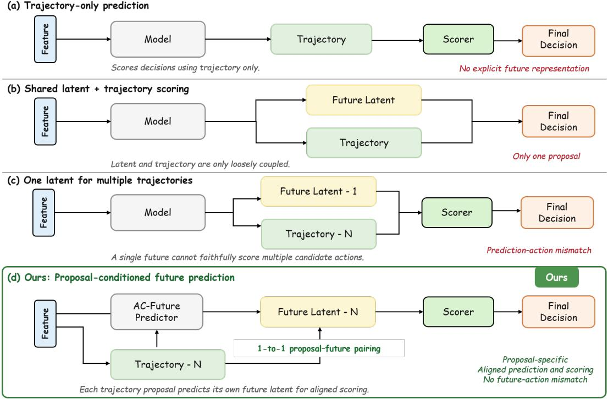
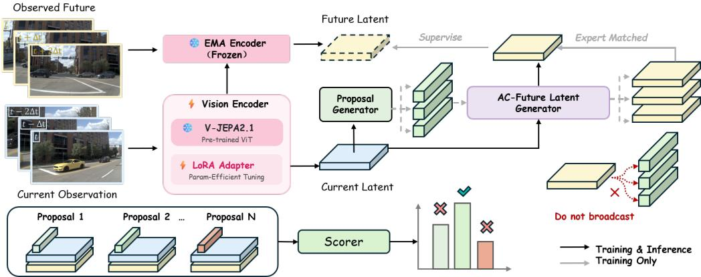
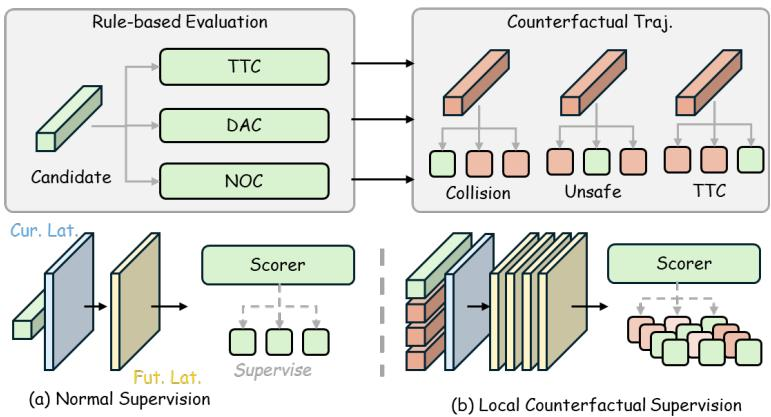
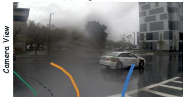
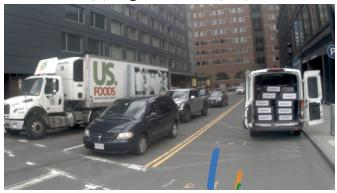
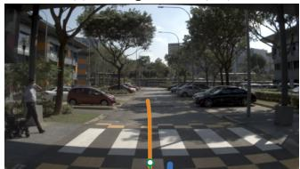
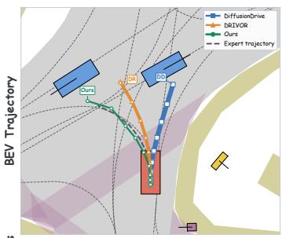
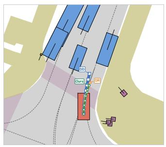
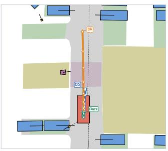

# DA-WAM: DECISION-ALIGNED FUTURE LATENTS FOR DRIVING WORLD MODELS

Ruiguo Zhong1, Benshan Ma1, Xiaolong Chen1, Lang Zhang2∗, Mingyue Feng2, Yaonong Wang2, Pei Liu1†, Jun Ma1,3

1The Hong Kong University of Science and Technology (Guangzhou) 2Leapmotor

3The Hong Kong University of Science and Technology rzhong151@connect.hkust-gz.edu.cn

## ABSTRACT

Anticipating how scenes evolve under ego actions is fundamental to safe autonomous driving, yet the full potential of world models for decision-making remains unrealized. The critical challenge lies in ensuring that future modeling is not merely predictive, but decision-informative: the predicted future must directly shape which trajectory is selected. Existing approaches decouple future representation learning from planning optimization, or share predicted states across trajectory candidates, thereby diluting the action-specific consequences that ought to guide selection. To bridge this gap, we propose DA-WAM, a framework that unifies predictive representation learning, action-conditioned future modeling, and trajectory scoring under a single decision-making objective. DA-WAM maintains predictive supervision throughout planner optimization via an online encoder and a stable momentum target, allowing future representations to co-evolve with the driving task. An action-conditioned predictor generates a distinct future latent state per trajectory candidate, which is then evaluated by a future-latentconditioned factorized scorer. For the expert-matched trajectory, the predicted future latent is supervised by the observed future representation, while safety-critical hard negatives provide additional supervision near planning boundaries. Extensive experiments on NAVSIM-v1 and NAVSIM-v2 demonstrate state-of-the-art performance, while ablations and diagnostic analyses validate the key components. Code: https://github.com/LeapWM/da-wam.

## 1 INTRODUCTION

Safe and effective autonomous driving requires reasoning about how the scene would evolve under each candidate ego action. World models address this challenge by predicting future visual or latent states from current observations and proposed actions Wang et al. (2024); Li et al. (2025b); Zheng et al. (2025). Yet the fundamental question is not simply whether a model can predict the future, but whether its predictions are decision-informative: do the predicted consequences of each candidate action directly determine how that trajectory is evaluated? To realize the full potential of world models, future prediction must therefore be tightly coupled with decision making, such that each candidate is scored against the future predicted specifically for that action.

Existing approaches pursue future prediction along two broad directions, but neither direction alone guarantees this coupling. Methods such as DriveWorld Min et al. (2024), LAW Li et al. (2025b), Drive-JEPA Wang et al. (2026c), and Latent-WAM Wang et al. (2026b) use temporal prediction primarily to strengthen scene representations or trajectory learning. Although these approaches learn rich predictive features, predictive pretraining and planner optimization are often stage-separated; fixed or frozen encoders consequently cannot adapt their future representations to the specific demands of trajectory scoring. A second line of work brings predicted futures more directly into planning. Drive-WM Wang et al. (2024) generates future views for planning, WoTE Li et al. (2025c)

  
Figure 1: Prediction–action alignment in trajectory scoring. (a) Trajectory-only prediction provides no explicit future representation to the scorer. (b) Loosely coupled latent fusion incorporates a future representation but generates only a single trajectory proposal, precluding candidate-specific future comparison. (c) Sharing one future latent across multiple candidates creates a prediction– action mismatch. (d) DA-WAM predicts a distinct future latent for each candidate and scores the trajectory with its corresponding latent, establishing a one-to-one trajectory–future correspondence.

evaluates trajectories through a BEV world model, World4Drive Zheng et al. (2025) reasons over intention-conditioned latent futures, and DriveFuture Hong et al. (2026) conditions its planner on a predicted future latent. These methods move closer to using future predictions at decision time, yet predicted states may still be shared, pooled, or only weakly associated with individual candidates. As summarized in Fig. 1, these designs weaken the correspondence between an action and its predicted consequence. The scorer may therefore rely primarily on geometric cues rather than the scene-conditioned future content that distinguishes safe from unsafe outcomes.

We argue that the planning value of a world model is bounded by how directly its predictions influence candidate-level scoring. Evaluating each candidate against its own predicted future would allow the planner to exploit action-specific consequences, such as collisions, lane departures, or traffic-rule violations, when distinguishing geometrically similar yet safety-critical trajectories. Realizing this capability requires overcoming two interconnected barriers. At the representation level, predictive features must continue to adapt during planner optimization so that the learned future structure remains aligned with the planning objective. At the planning level, the scorer must evaluate a distinct future latent state for each candidate; shared or pooled futures obscure the action-specific consequences that should guide selection.

To this end, we propose DA-WAM, a decision-aligned world action model. DA-WAM maintains predictive supervision throughout planner optimization via a LoRA-adapted Video Joint Embedding Predictive Architecture (V-JEPA) 2.1 online encoder paired with an exponential moving average (EMA) target encoder, ensuring that future representations co-evolve with the driving task rather than being frozen after pretraining. An action-conditioned predictor generates a distinct future latent state for every trajectory candidate through explicit scene–trajectory interaction, and a factorized future-latent-conditioned scorer evaluates each candidate jointly with its corresponding latent state. Because offline logs provide observed futures only for the executed expert trajectory, dense JEPA supervision is applied to the expert-matched candidate, while safety-critical hard negatives supply additional local comparisons near planning boundaries. These hard negatives are geometrically similar to the expert-matched candidate but differ in safety outcomes, discouraging the scorer from relying on geometry alone.

Our contributions are threefold:

• We propose decision-aligned future latent learning, which associates each candidate trajectory with a distinct predicted future and uses its action-specific consequences to guide trajectory selection.

• We introduce a unified training framework that continues predictive representation learning during planner optimization, allowing the latent space to adapt to the driving objective rather than remain fixed after pretraining.

• We provide a supervision strategy that combines expert-matched future targets with safetycritical hard negatives, improving the scorer’s ability to distinguish geometrically similar candidates that lead to different safety outcomes.

## 2 RELATED WORK

## 2.1 JOINT-EMBEDDING PREDICTION AND LATENT PLANNING

JEPAs capture high-level semantic and temporal representations by predicting latent features of future states rather than reconstructing pixel-level details Assran et al. (2025); Mur-Labadia et al. (2026). In end-to-end autonomous driving, this paradigm offers an efficient avenue to model scene evolution, which is crucial for forecasting the downstream impact of ego decisions. Recent works such as DriveWorld Min et al. (2024) and LAW Li et al. (2025b) use future dynamics to enrich visual scene representations for motion planning. Drive-JEPA Wang et al. (2026c) adapts pretrained video JEPAs to trajectory planning via fine-tuning, while Auto-JEPA Yang et al. (2026) predicts continuous intent embeddings with a frozen visual backbone to rank candidate paths. Similarly, Latent-WAM Wang et al. (2026b) jointly trains a spatial encoder against an exponential moving average latent target but discards the dynamics branch at test time.

A fundamental tension underlying these approaches is the trade-off between the generality of predictive representations and the task-specific needs of trajectory scoring. Existing methods typically address this trade-off through frozen pretraining, multistage pipelines, or inference-time removal, which can weaken the coupling between future dynamics and policy optimization. In contrast, we maintain predictive JEPA supervision throughout planner optimization. This enables future latent representations to co-evolve with the scoring objective and serve as direct conditioning inputs during inference rather than auxiliary training-time features.

## 2.2 ACTION-CONDITIONED DRIVING WORLD MODELS

Recognizing that visual environments evolve differently under different ego maneuvers, recent world models explicitly condition future predictions on hypothetical actions or trajectory proposals. Drive-WM Wang et al. (2024) synthesizes multiview video futures under alternative driving commands, whereas LAW Li et al. (2025b) and WoTE Li et al. (2025c) predict trajectory-conditioned latent states or bird’s-eye-view (BEV) dynamics. World4Drive Zheng et al. (2025) forecasts multiple intention-guided latent futures and validates paths using an internal evaluator. Concurrently, Drive-Future Hong et al. (2026), IDOL Zhang et al. (2026), and LCDrive Tan et al. (2026) use future latents for diffusion guidance, inverse-dynamics refinement, and latent chain-of-thought reasoning, respectively.

While these works validate the premise of action conditioning, they often aggregate, pool, or weakly fuse the predicted futures across proposals. Consequently, the candidate evaluator receives a homogenized scene representation, diluting the fine-grained, safety-critical consequences specific to each trajectory. We bridge this gap by establishing an explicit one-to-one correspondence: DA-WAM generates a distinct future latent state for every candidate trajectory and feeds it directly into the scorer, allowing trajectory selection to use candidate-specific counterfactual evidence.

## 2.3 CANDIDATE GENERATION AND TRAJECTORY SCORING

Candidate-based planners generate multiple plausible trajectories and select the optimal one according to scene context and planning objectives. DiffusionDrive efficiently models multimodal action distributions through anchor-guided truncated diffusion Liao et al. (2025). DrivoR compresses multi-camera features into camera-aware register tokens and uses separate transformer decoders to generate and score candidates Kirby et al. (2026). GTRS and ZTRS formulate candidate evaluation as explicit trajectory scoring Li et al. (2025e;d). Beyond geometric and scene-based scoring, DriveSuprim employs coarse-to-fine trajectory selection to distinguish hard-negative trajectories Yao et al. (2026), and BeyondDrive constructs safety-critical, expert-proximate hard negatives to learn safety boundaries in trajectory space Wang et al. (2026a).

These works have significantly advanced both the generation and evaluation of trajectory candidates. Nonetheless, the scoring signal remains predominantly anchored in current scene geometry and immediate motion patterns. Predicted futures are rarely incorporated into the scorer in an explicit, per-candidate manner, despite their potential to distinguish geometrically similar but safety-critical candidates. We operate within the established candidate-based planning paradigm and augment the scorer with action-conditioned future latent states, thereby enabling trajectory selection based on predicted consequences rather than current geometry alone.

## 3 METHODOLOGY

## 3.1 PROBLEM FORMULATION AND FRAMEWORK OVERVIEW

In this section, we formalize the trajectory planning problem and describe how DA-WAM couples future latent prediction with per-candidate trajectory evaluation.

Given the current visual observation $X _ { t } ,$ the planner first obtains a set of $N$ ego trajectory candidates $ { \mathcal { T } } = \{ \tau _ { i } \} _ { i = 1 } ^ { N }$ . The planning objective is to evaluate the utility of each candidate and select the trajectory with the optimal predicted outcome.

The overall architecture of DA-WAM is illustrated in Fig. 2. Given $X _ { t }$ and $\tau$ , the framework operates in three main steps:

• Observation Encoding: The online encoder $E _ { \theta }$ maps $X _ { t }$ to scene latent tokens $Z _ { t }$ . During training, an EMA target encoder $E _ { \bar { \theta } }$ additionally extracts target features $Z _ { t + \Delta }$ from the future frame $X _ { t + \Delta }$

• Action-Conditioned Future Prediction: Each trajectory $\tau _ { i }$ is mapped to an action representation $a _ { i } . \mathrm { A }$ shared predictor $P _ { \phi }$ then fuses $a _ { i }$ with $Z _ { t }$ to forecast the candidate-specific future latent state $\widehat { Z } _ { i }$

• Trajectory Scoring: $\mathbf { A }$ shared scorer $S _ { \psi }$ evaluates the triplet $( Z _ { t } , a _ { i } , \widehat { Z } _ { i } )$ for each candidate, predicting both interpretable planning factors $\widehat { \mathbf { q } } _ { i }$ and an overall utility score $\widehat { s } _ { i }$ . The candidate with the highest score is selected for execution.

Training and Inference Paradigm. Training accounts for the fundamental counterfactual limitation of offline driving logs: each scene provides only an expert trajectory $\tau ^ { \mathrm { e x p } }$ and its corresponding executed future $X _ { t + \Delta }$ . To prevent assigning the observed expert future to unexecuted counterfactual trajectories, we match $\tau ^ { \mathrm { e x p } }$ to the closest candidate and apply the dense latent prediction loss exclusively to its predicted future. Meanwhile, all candidates receive factor, utility, and ranking supervision, with expert-proximate hard negatives providing critical contrastive signals near planning decision boundaries. During inference, DA-WAM operates without access to future observations or expert priors, and the EMA target network is omitted. Only the online encoder, predictor, and scorer are activated to evaluate generated candidates in real time. The main notation used throughout the method is summarized in Appendix A.

## 3.2 JEPA-DRIVEN PREDICTIVE REPRESENTATION ADAPTATION

To preserve predictive world knowledge while tailoring representations to downstream navigation, DA-WAM adapts features via a dual online-target architecture. Given the current observation $X _ { t }$

  
Figure 2: Overview of DA-WAM. The online encoder $E _ { \theta }$ first maps the current observation $X _ { t }$ to scene tokens $Z _ { t }$ . For each candidate trajectory $\tau _ { i } ,$ , its action representation $a _ { i }$ is combined with $Z _ { t }$ via the predictor $P _ { \phi }$ to forecast a candidate-specific future latent state $\widehat { Z } _ { i }$ . A shared scorer $S _ { \psi }$ then evaluates the triplet $( Z _ { t } , a _ { i } , \widehat { Z } _ { i } )$ to predict interpretable planning factors $\widehat { \mathbf { q } } _ { i }$ and an overall utility score $\widehat { s } _ { i }$ . Training: An EMA target encoder extracts target latents $Z _ { t + \Delta }$ from the observed future frame to supervise only the expert-matched prediction, while safety-critical hard negatives enhance boundary discrimination. Inference: Only the online encoder, predictor, and scorer are activated, requiring no future observations or expert priors.

the online encoder extracts spatial scene tokens:

$$
Z _ { t } = E _ { \theta } ( X _ { t } ) ,\tag{1}
$$

where $Z _ { t } \in \mathbb R ^ { M \times D }$ comprises M latent tokens of feature dimension D.

We initialize $E _ { \theta }$ with a pretrained V-JEPA 2.1 backbone and inject Low-Rank Adaptation (LoRA) modules into selected transformer layers. While the base network remains frozen, the LoRA parameters are jointly updated by gradients from future prediction and trajectory planning. This design retains the pretrained backbone’s representational capabilities while adapting the latent space to driving-specific objectives.

During training, the observed future frame $X _ { t + \Delta }$ is processed by a target network with stop-gradient (sg):

$$
\begin{array} { r } { Z _ { t + \Delta } = \mathrm { s g } \left( E _ { \bar { \theta } } ( X _ { t + \Delta } ) \right) , } \end{array}\tag{2}
$$

whose parameters $\bar { \theta }$ are updated as an EMA of the online parameters $\theta \colon$

$$
\bar { \theta }  \mu \bar { \theta } + ( 1 - \mu ) \theta ,\tag{3}
$$

where $\mu \in \ [ 0 , 1 )$ is the momentum coefficient. This momentum update yields stable, slowlyevolving regression targets and prevents representational collapse. The target branch is used exclusively during training; only the adapted online encoder is deployed for inference.

## 3.3 ACTION-CONDITIONED COUNTERFACTUAL WORLD MODELING

Autonomous planning requires anticipating outcomes conditioned on specific ego actions. Rather than assuming a single global future, DA-WAM constructs candidate-specific future latent states for all N candidate trajectories.

Each candidate $\tau _ { i }$ is parameterized as a temporal sequence of future ego states $( \mathrm { e . g . }$ , position and heading) and encoded as an action representation by a trajectory encoder:

$$
a _ { i } = E _ { \tau } ( \tau _ { i } ) .\tag{4}
$$

A shared future predictor $P _ { \phi }$ then uses the action query to attend to the current scene tokens:

$$
\widehat { Z } _ { i } = P _ { \phi } \left( Q = a _ { i } , K = Z _ { t } , V = Z _ { t } \right) , \qquad i = 1 , \ldots , N .\tag{5}
$$

Within $P _ { \phi } , a _ { i }$ serves as the query, while the spatial scene tokens $Z _ { t }$ provide the keys and values. The resulting action-specific context conditions the latent prediction tokens, enabling a single observation to produce distinct counterfactual latent futures. Sharing predictor parameters across all N candidates avoids introducing candidate-specific model biases; differences among $\widehat { Z } _ { i }$ are instead driven by the action queries $a _ { i }$

Expert Matching for Counterfactual Futures. Although the model predicts N counterfactual fu tures, offline datasets record only the outcome corresponding to the executed expert trajectory $\tau ^ { \mathrm { e x p } }$ Applying the observed future target to unexecuted candidates would provide incorrect supervision for counterfactual actions. Therefore, we restrict dense predictive supervision to the expert-matched candidate:

$$
\boldsymbol { i } ^ { \mathrm { e x p } } = \arg \operatorname* { m i n } _ { \boldsymbol { i } } \mathrm { A D E } \left( \tau _ { i } , \tau ^ { \mathrm { e x p } } \right) ,\tag{6}
$$

where $\operatorname { A D E } ( { \mathord { \cdot } } )$ denotes average displacement error.

The predictive loss is then computed token-wise exclusively for the expert-matched candidate:

$$
\mathcal { L } _ { \mathrm { p r e d } } = \frac { 1 } { M } \sum _ { m = 1 } ^ { M } \ell \left( \widehat { Z } _ { i ^ { \mathrm { e x p } } , m } , Z _ { t + \Delta , m } \right) ,\tag{7}
$$

where $\ell ( \cdot )$ is the adopted feature regression loss.

The remaining $N - 1$ counterfactual latents cannot receive direct feature-level supervision because their corresponding outcomes are unobserved. Instead, they are optimized indirectly through the downstream trajectory-scoring losses. This alignment avoids assigning observed outcomes to unexecuted actions while still allowing all predicted latents to inform final trajectory selection.

## 3.4 FUTURE-LATENT-CONDITIONED TRAJECTORY SCORING

Predicting action-conditioned future states is valuable only if these imagined outcomes directly govern trajectory decision-making. To this end, DA-WAM evaluates each candidate trajectory by explicitly conditioning its score on its own predicted future latent state.

For each candidate trajectory $\tau _ { i } ,$ a scoring transformer cross-attends the current scene tokens $Z _ { t } .$ the action representation $a _ { i } .$ , and the predicted future latent state $\widehat { Z } _ { i }$ to produce a unified trajectory representation:

$$
h _ { i } = S _ { \psi } ^ { \mathrm { e n c } } \left( Z _ { t } , \widehat { Z } _ { i } , a _ { i } \right) ,\tag{8}
$$

where $\psi$ encompasses all learnable parameters in the scoring module. The encoder $S _ { \psi } ^ { \mathrm { e n c } }$ preserves fine-grained token-level interactions rather than pooling futures into a coarse proposal-invariant vector. Because its parameters are shared across candidates, differences in scores arise from candidate geometry and the corresponding predicted outcomes rather than candidate-specific scorer parame ters.

Factorized Planning Heads. To ground trajectory evaluation in explicit driving priors, dedicated linear heads decode intermediate planning-relevant factors directly from $h _ { i } \mathbf { \cdot }$

$$
\begin{array} { r } { \widehat { \mathbf { q } } _ { i } = S _ { \psi } ^ { \mathrm { f a c t o r } } ( h _ { i } ) = \left[ \widehat { q } _ { i } ^ { \mathrm { N C } } , \widehat { q } _ { i } ^ { \mathrm { D A C } } , \widehat { q } _ { i } ^ { \mathrm { E P } } , \widehat { q } _ { i } ^ { \mathrm { T T C } } , \widehat { q } _ { i } ^ { \mathrm { C o m f o r t } } \right] . } \end{array}\tag{9}
$$

These entries represent no-at-fault collision (NC), drivable area compliance (DAC), ego progress (EP), time to collision (TTC), and comfort, respectively. Each dimension is supervised by simulation-derived or rule-based trajectory metrics.

Subsequently, a utility head aggregates the holistic feature $h _ { i }$ and the predicted factor vector $\widehat { \mathbf { q } } _ { i }$ to output a comprehensive scalar utility:

$$
\widehat { s } _ { i } = S _ { \psi } ^ { \mathrm { s c o r e } } \left( h _ { i } , \widehat { \mathbf { q } } _ { i } \right) ,\tag{10}
$$

where $\widehat { s } _ { i }$ serves as the final ranking score for selecting a candidate during deployment. This factorized architecture improves interpretability while regularizing the trajectory feature space.

  
Figure 3: Safety-critical hard-negative trajectory supervision. Conventional training evaluates a sparse set of generated candidates using rule-based NC, DAC, and TTC factors. DA-WAM additionally retrieves expert-proximate hard-negative trajectories that are geometrically similar to the expert trajectory but differ in safety outcomes. Generated candidates and hard negatives query the same scene representation and share one future-latent-conditioned trajectory scorer. Hard-negative labels are training-only planning targets rather than observed future representations.

Trajectory-Level Counterfactual Safety Supervision. Randomly sampled candidate sets often exhibit large geometric differences, allowing the scorer to rely on coarse cues such as curvature and speed rather than scene-dependent safety consequences. We therefore augment each scene with expert-proximate, safety-critical hard negatives. These trajectories remain geometrically close to the expert but lead to substantially different safety outcomes, providing counterfactual supervision near planning boundaries.

For each scenario, candidate trajectories $\tau _ { j } ^ { - }$ are retrieved from an offline trajectory bank subject to dual constraints:

$$
\begin{array} { r } { d _ { \mathrm { t r a j } } ( \tau _ { j } ^ { - } , \tau ^ { \mathrm { e x p } } ) < \epsilon _ { \mathrm { g e o } } , } \\ { \Delta _ { \mathrm { s a f e t y } } ( \tau _ { j } ^ { - } , \tau ^ { \mathrm { e x p } } ) > \epsilon _ { \mathrm { s a f e t y } } , } \end{array}\tag{11}
$$

where $\epsilon _ { \mathrm { g e o } }$ enforces geometric closeness to the expert, while $\boldsymbol { \epsilon } _ { \mathrm { s a f e t y } }$ requires a pronounced degradation in safety metrics (e.g., an impending collision or lane departure).

Figure 3 summarizes how these trajectories augment the generated candidates during training. Each $\cdot \bar { \cdot }$ is appended to the candidate set, encoded as $a _ { i } ^ { - } = E _ { \tau } ( \tau _ { i } ^ { - } )$ , and processed by Eq. 5 to condition its own future latent before entering the shared scorer. Because its corresponding visual future is unobserved, a hard negative is excluded from expert matching and direct future-feature supervision, but still receives factor, utility, and ranking targets. This construction encourages the scorer to distinguish the consequences of different ego behaviors under the same scene context.

## 3.5 TRAINING OBJECTIVES AND INFERENCE

The proposed framework is trained end-to-end using a composite loss function derived from predictive feature alignment and planning objectives.

For each candidate i, we use external planning metrics to provide factor targets $\mathbf { q } _ { i }$ and an overall utility target $s _ { i }$ . The factorized planning loss enforces fidelity to specific driving requirements:

$$
\mathcal { L } _ { \mathrm { f a c t o r } } = \sum _ { i } \sum _ { k \in \mathcal { K } } \lambda _ { k } \ell _ { k } \left( \widehat { q } _ { i } ^ { k } , q _ { i } ^ { k } \right) ,\tag{12}
$$

where $\kappa$ denotes the set of planning factors, such as no-at-fault collision and time to collision. The loss function $\ell _ { k }$ is tailored to the target $q _ { i } ^ { k }$ ; for example, mean squared error (MSE) is used for continuous factors, while binary cross-entropy (BCE) is used for binary factors.

The direct supervision on the final utility score is given by:

$$
\mathcal { L } _ { \mathrm { s c o r e } } = \sum _ { i } \ell _ { \mathrm { s c o r e } } \left( \widehat { s } _ { i } , s _ { i } \right) .\tag{13}
$$

To ensure robust relative ranking, we construct preference pairs $( i , j )$ based on their ground-truth utilities $s _ { i }$ and $s _ { j } \colon$

$$
y _ { i j } = \mathbb { I } \left[ s _ { i } > s _ { j } \right] .\tag{14}
$$

The pairwise ranking objective employs a standard cross-entropy formulation over the sigmoid difference of predicted scores:

$$
\mathcal { L } _ { \mathrm { r a n k } } = - \sum _ { ( i , j ) } \left[ y _ { i j } \log \sigma \left( \widehat { s } _ { i } - \widehat { s } _ { j } \right) + \left( 1 - y _ { i j } \right) \log \sigma \left( \widehat { s } _ { j } - \widehat { s } _ { i } \right) \right] .\tag{15}
$$

As noted in Section 3.4, pairs involving safety-critical hard negatives are either oversampled or assigned greater loss weights, emphasizing preferences between safe and unsafe candidates near local decision boundaries.

The total training objective integrates the predictive feature-alignment loss $( \mathcal { L } _ { \mathrm { p r e d } }$ from Eq. 7) with the planning losses:

$$
\mathcal { L } = \lambda _ { \mathrm { p r e d } } \mathcal { L } _ { \mathrm { p r e d } } + \lambda _ { \mathrm { f a c t o r } } \mathcal { L } _ { \mathrm { f a c t o r } } + \lambda _ { \mathrm { s c o r e } } \mathcal { L } _ { \mathrm { s c o r e } } + \lambda _ { \mathrm { r a n k } } \mathcal { L } _ { \mathrm { r a n k } } .\tag{16}
$$

This composite objective respects the observational constraints of offline data: $\mathcal { L } _ { \mathrm { p r e d } }$ is applied exclusively to the expert-matched candidate, which provides observed-future supervision, while all candidates, including generated candidates and hard negatives, contribute to $\bar { \mathcal { L } } _ { \mathrm { f a c t o r } } , \mathcal { L } _ { \mathrm { s c o r e } } ,$ and $\mathcal { L } _ { \mathrm { r a n k } }$

Inference. During inference, the system requires only the current observation $X _ { t }$ and the set of generated trajectory candidates $\tau$ . Training-only components, including the target encoder $E _ { \bar { \theta } } .$ expert matching, and hard-negative retrieval, are not used.

The online inference sequence is as follows:

• The online encoder $E _ { \theta }$ extracts the scene representation $Z _ { t }$

• The action-conditioned predictor $P _ { \phi }$ generates a future latent state $\widehat { Z } _ { i }$ for every candidate $\tau _ { i } \in \mathcal { T }$

• The future-latent-conditioned scorer $S _ { \psi }$ computes the planning factors $\widehat { \mathbf { q } } _ { i }$ and overall utility $\widehat { s } _ { i }$ for each candidate based on $( Z _ { t } , \widehat { Z } _ { i } , a _ { i } )$

The final planned trajectory $\tau ^ { \star }$ is selected by maximizing the predicted utility score:

$$
\tau ^ { \star } = \arg \operatorname* { m a x } _ { \tau _ { i } \in \mathcal { T } } \widehat { s } _ { i } .\tag{17}
$$

At inference, each candidate is evaluated together with its own predicted future latent, preserving the one-to-one correspondence between candidate trajectories and predicted outcomes during ranking.

## 4 EXPERIMENTS

## 4.1 EXPERIMENTAL SETUP

Datasets and Evaluation Metrics. Our primary evaluation is conducted on the NAVSIM-v1 navtest split Dauner et al. (2024), which contains 12,146 driving scenarios. We report the Predictive Driver Model Score (PDMS) together with its five components: No-at-Fault Collision (NC), Drivable Area Compliance (DAC), Ego Progress (EP), Time to Collision (TTC), and Comfort. Drivable Direction Compliance (DDC), provided by the evaluation pipeline, is included as an additional diagnostic. Unless stated otherwise, all scores are multiplied by 100. We further evaluate DA-WAM under the broader compliance criteria of NAVSIM-v2 navtest, using the Extended Predictive Driver Model Score (EPDMS).

Table 1: NAVSIM-v1 benchmark comparison. Camera-only methods on the navtest split. All scores are scaled by 100, and higher is better for every metric.
<table><tr><td>Method</td><td>Venue</td><td>NC</td><td>DAC</td><td>TTC</td><td>Comfort</td><td>EP</td><td>PDMS</td></tr><tr><td>PDM-Closed Dauner et al. (2023)</td><td>CoRL&#x27;23</td><td>94.6</td><td>99.8</td><td>89.9</td><td>86.9</td><td>99.9</td><td>89.1</td></tr><tr><td>Human driver Dauner et al. (2024)</td><td>NeurIPS&#x27;24</td><td>100.0</td><td>100.0</td><td>100.0</td><td>99.9</td><td>87.5</td><td>94.8</td></tr><tr><td>Ego-stat. MLP Dauner et al. (2024)</td><td>NeurIPS&#x27;24</td><td>93.0</td><td>77.3</td><td>83.6</td><td>100.0</td><td>62.8</td><td>65.6</td></tr><tr><td>UniVLA Wang et al. (2026d)</td><td>ICLR&#x27;26</td><td>96.9</td><td>91.1</td><td>91.7</td><td>96.7</td><td>76.8</td><td>81.7</td></tr><tr><td>DrivingGPT Chen et al. (2025)</td><td>ICCV’25</td><td>98.9</td><td>90.7</td><td>94.9</td><td>95.6</td><td>79.7</td><td>82.4</td></tr><tr><td>UniAD Hu et al. (2023)</td><td>CVPR&#x27;23</td><td>97.8</td><td>91.9</td><td>92.9</td><td>100.0</td><td>78.8</td><td>83.4</td></tr><tr><td>DriveX-S Shi et al. (2025)</td><td>ICCV’25</td><td>97.5</td><td>94.0</td><td>93.0</td><td>100.0</td><td>79.7</td><td>84.5</td></tr><tr><td>World4Drive Zheng et al. (2025)</td><td>ICCV’25</td><td>97.4</td><td>94.3</td><td>92.8</td><td>100.0</td><td>79.9</td><td>85.1</td></tr><tr><td>VAD-v2 Jiang et al. (2026)</td><td>ICLR&#x27;26</td><td>98.1</td><td>94.8</td><td>94.3</td><td>100.0</td><td>80.6</td><td>86.2</td></tr><tr><td>PRIX Wozniak et al. (2026)</td><td>RA-L&#x27;26</td><td>98.1</td><td>96.3</td><td>94.1</td><td>100.0</td><td>82.3</td><td>87.8</td></tr><tr><td>DiffusionDrive Liao et al. (2025)</td><td>CVPR&#x27;25</td><td>98.2</td><td>96.2</td><td>94.7</td><td>100.0</td><td>82.2</td><td>88.1</td></tr><tr><td>DIVER Song et al. (2026)</td><td>TPAMI&#x27;26</td><td>98.5</td><td>96.5</td><td>94.9</td><td>100.0</td><td>82.6</td><td>88.3</td></tr><tr><td>AutoVLA Zhou et al. (2026)</td><td>NeurIPS&#x27;25</td><td>98.4</td><td>95.6</td><td>98.0</td><td>99.9</td><td>81.9</td><td>89.1</td></tr><tr><td>DriveVLA-W0 Li et al. (2026)</td><td>ICLR’26</td><td>98.7</td><td>99.1</td><td>95.3</td><td>99.3</td><td>83.3</td><td>90.2</td></tr><tr><td>ReCogDrive Xiong et al. (2026)</td><td>ICLR’26</td><td>97.9</td><td>97.3</td><td>94.9</td><td>100.0</td><td>87.3</td><td>90.8</td></tr><tr><td>Hydra-MDP++ Li et al. (2025a)</td><td>arXiv&#x27;25</td><td>98.6</td><td>98.6</td><td>95.1</td><td>100.0</td><td>85.7</td><td>91.0</td></tr><tr><td>DiffusionDriveV2 Zou et al. (2025) iPad Guo et al. (2026)</td><td>arXiv&#x27;25</td><td>98.3</td><td>97.9</td><td>94.8</td><td>99.9</td><td>87.5</td><td>91.2</td></tr><tr><td>SparseDriveV2 Sun et al. (2026)</td><td>arXiv&#x27;25</td><td>98.6 98.5</td><td>98.3 98.4</td><td>94.9</td><td>100.0</td><td>88.0</td><td>91.7</td></tr><tr><td>Centaur Sima et al. (2025)</td><td>arXiv&#x27;26</td><td>99.5</td><td>98.9</td><td>95.0</td><td>99.9 100.0</td><td>88.6</td><td>92.0</td></tr><tr><td></td><td>arXiv&#x27;25</td><td></td><td></td><td>98.0</td><td></td><td>85.9</td><td>92.6</td></tr><tr><td>DrivoR Kirby et al. (2026)</td><td>CVPR&#x27;26</td><td>98.9</td><td>98.3 98.6</td><td>96.2 95.5</td><td>100.0</td><td>89.1</td><td>93.1</td></tr><tr><td>DriveSuprim Yao et al. (2026)</td><td>AAAI&#x27;26</td><td>98.6 99.1</td><td>98.9</td><td>96.8</td><td>100.0 99.8</td><td>91.3 90.0</td><td>93.5 93.7</td></tr><tr><td colspan="8">DA-WAM</td></tr></table>

Implementation Details. Each input comprises two historical frames from the front camera. The proposal module produces 32 candidate trajectories, with each candidate represented by eight future ego poses. Conditioned on each candidate, the action-conditioned predictor forecasts a candidatespecific scene latent 0.5 seconds into the future. The visual encoders are initialized from pretrained V-JEPA 2.1 Mur-Labadia et al. (2026); the online branch is adapted with Low-Rank Adaptation (LoRA), and the target branch is updated by exponential moving average (EMA).

We train all primary NAVSIM-v1 variants for 20 epochs on 8 GPUs with a batch size of 8 per GPU, selecting checkpoints according to validation performance. In matched studies, the training data, parameter initialization, proposal generator, optimization schedule, checkpoint-selection rule, and evaluation protocol are held fixed. The resulting controls compare four prediction settings: no future prediction, a shared global future, the current latent, and an action-conditioned future. We also isolate the contribution of hard-negative supervision.

## 4.2 MAIN RESULTS

Tables 1 and 2 summarize the public benchmark results. Among the compared learning-based planners, DA-WAM obtains the best overall planning score on both benchmarks, reaching 93.7 PDMS on NAVSIM-v1 and 87.7 EPDMS on NAVSIM-v2. We next examine the results under each evaluation protocol.

Benchmarking on NAVSIM-v1. Table 1 compares DA-WAM with camera-only methods on the NAVSIM-v1 navtest split. DA-WAM slightly surpasses the strongest prior learned planner in PDMS and achieves 99.1 NC, 98.9 DAC, and 90.0 EP. The result reflects a favorable balance between safety, road compliance, and driving progress. This public benchmark comparison complements the controlled matched study in Table 3.

Benchmarking on NAVSIM-v2. Table 2 reports results on the NAVSIM-v2 navtest leaderboard for methods using ResNet-34 and ViT/L backbones. Under the expanded metric set, DA-WAM achieves particularly strong TTC and Lane Keeping scores of 97.9 and 97.6, respectively. These results raise EPDMS to 87.7, exceeding the strongest comparison by 0.2 points.

Table 2: NAVSIM-v2 benchmark comparison. Methods with ResNet-34 and ViT/L visual backbones on the navtest split. All scores are scaled by 100, and higher is better for every metric.
<table><tr><td>Method</td><td>Img. Backbone</td><td>NC</td><td>DAC</td><td>DDC</td><td>TL</td><td>EP</td><td>TTC</td><td>LK</td><td>HC</td><td>EC</td><td>EPDMS</td></tr><tr><td>Ego Status MLP</td><td>ResNet-34</td><td>93.1</td><td>77.9</td><td>92.7</td><td>99.6</td><td>86.0</td><td>91.5</td><td>89.4</td><td>98.3</td><td>85.4</td><td>64.0</td></tr><tr><td>TransFuser Chitta et al. (2022)</td><td>ResNet-34</td><td>96.9</td><td>89.9</td><td>97.8</td><td>99.7</td><td>87.1</td><td>95.4</td><td>92.7</td><td>98.3</td><td>87.2</td><td>76.7</td></tr><tr><td>Hydra-MDP++ Li et al. (2025a)</td><td>ResNet-34</td><td>97.2</td><td>97.5</td><td>99.4</td><td>99.6</td><td>83.1</td><td>96.5</td><td>94.4</td><td>98.2</td><td>70.9</td><td>81.4</td></tr><tr><td>DriveSuprim Yao et al. (2026)</td><td>ResNet-34</td><td>97.5</td><td>96.5</td><td>99.4</td><td>99.6</td><td>88.4</td><td>96.6</td><td>95.5</td><td>98.3</td><td>77.0</td><td>83.1</td></tr><tr><td>ARTEMIS Feng et al. (2025)</td><td>ResNet-34</td><td>98.3</td><td>95.1</td><td>98.6</td><td>99.8</td><td>81.5</td><td>97.4</td><td>96.5</td><td>98.3</td><td>98.3</td><td>83.1</td></tr><tr><td>DiffusionDriveV2 Zou et al. (2025)</td><td>ResNet-34</td><td>97.7</td><td>96.6</td><td>99.2</td><td>99.8</td><td>88.9</td><td>97.2</td><td>96.0</td><td>97.8</td><td>91.0</td><td>87.5</td></tr><tr><td>SparseDriveV2 Sun et al. (2026)</td><td>ResNet-34</td><td>98.1</td><td>98.1</td><td>99.6</td><td>99.8</td><td>91.1</td><td>97.3</td><td>96.9</td><td>98.2</td><td>78.4</td><td>86.7</td></tr><tr><td>Hydra-MDP++ Li et al. (2025a)</td><td>ViT/L</td><td>98.4</td><td>98.0</td><td>99.4</td><td>99.8</td><td>87.5</td><td>97.7</td><td>95.3</td><td>98.3</td><td>77.4</td><td>85.1</td></tr><tr><td>DriveSuprim Yao et al. (2026)</td><td>ViT/L</td><td>97.8</td><td>97.9</td><td>99.5</td><td>99.9</td><td>90.6</td><td>97.1</td><td>96.6</td><td>98.3</td><td>77.9</td><td>86.0</td></tr><tr><td>DA-WAM</td><td>ViT/L</td><td>98.4</td><td>98.4</td><td>99.1</td><td>99.9</td><td>88.6</td><td>97.9</td><td>97.6</td><td>97.8</td><td>79.6</td><td>87.7</td></tr></table>

## 4.3 ABLATION STUDIES

Future-Prediction Configuration Ablation. Table 3 compares matched future-prediction configurations and evaluates the contribution of safety-critical hard-negative supervision.

Table 3: Matched ablation of future-prediction configurations on the NAVSIM-v1 navtest split. All metrics are scaled by 100, and higher is better. In the hard-negative column, a checkmark and a cross denote enabled and disabled supervision, respectively; a dash denotes that the setting is not applicable.
<table><tr><td>Configuration</td><td>Hard neg.</td><td>PDMS</td><td>NC</td><td>DAC</td><td>EP</td><td>TTC</td><td>Comfort</td></tr><tr><td>No Future Prediction</td><td>一</td><td>93.31</td><td>98.45</td><td>98.27</td><td>91.36</td><td>95.48</td><td>99.99</td></tr><tr><td>Shared Global Future</td><td>一</td><td>92.81</td><td>99.02</td><td>98.46</td><td>88.68</td><td>96.54</td><td>99.99</td></tr><tr><td>Current-Latent Conditioning</td><td></td><td>93.25</td><td>98.44</td><td>98.19</td><td>91.38</td><td>95.49</td><td>99.94</td></tr><tr><td>Action-Conditioned Future</td><td>x</td><td>93.46</td><td>98.88</td><td>98.58</td><td>90.47</td><td>96.33</td><td>99.69</td></tr><tr><td></td><td>√</td><td>93.68</td><td>99.11</td><td>98.88</td><td>89.97</td><td>96.81</td><td>99.77</td></tr></table>

The no-future-prediction planner already achieves 93.31 PDMS, demonstrating the strength of a conventional end-to-end planner. The current-latent control performs similarly at 93.25, showing that an additional pathway alone provides little benefit. The shared-global-future control improves NC and TTC but reduces EP from 91.36 to 88.68, resulting in the lowest PDMS of 92.81. Sharing one future across all candidates introduces a prediction–action mismatch and encourages an averaged representation that weakens candidate discrimination.

Action conditioning restores the correspondence between each trajectory and its predicted future, raising PDMS to 93.46 without hard negatives. This exceeds the no-future-prediction, sharedglobal-future, and current-latent controls by 0.15, 0.65, and 0.21 points, respectively. Adding counterfactual safety supervision further improves PDMS to 93.68, together with higher NC, DAC, TTC, and Comfort, while EP decreases from 90.47 to 89.97. These results suggest that candidate-specific futures provide useful action-level evidence, while safety-critical hard negatives further sharpen the scorer’s discrimination near planning boundaries.

Predictive-Representation Ablation. This ablation jointly analyzes online-encoder adaptation, the V-JEPA predictive objective, and the target-encoder policy. Table 4 distinguishes V-JEPA 2.0 from V-JEPA 2.1, whose predictive objective uses dense latent supervision, while comparing frozen, LoRA-adapted, and fully fine-tuned online encoders. It then fixes the online encoder to LoRA and enables the V-JEPA 2.1 dense loss to compare frozen, separate, shared, and EMA target-encoder policies. All matched variants use the same initialization, proposal set, training schedule, and checkpoint-selection rule.

Table 4: Ablation of online-encoder adaptation, dense prediction loss, and target-encoder policy on the NAVSIM-v1 navtest split. In the Dense loss column, a checkmark denotes the V-JEPA 2.1 dense latent objective, whereas a cross denotes the V-JEPA 2.0 objective. PDMS is scaled by 100, and higher is better.
<table><tr><td colspan="2">Adaptation Dense loss Target PDMS</td></tr><tr><td colspan="2">Online-encoder adaptation and predictive objective</td></tr><tr><td>Frozen x</td><td>Frozen 91.26</td></tr><tr><td>Frozen √</td><td>Frozen 91.95</td></tr><tr><td>LoRA x</td><td>Frozen 92.74</td></tr><tr><td>LoRA √</td><td>Frozen 92.98</td></tr><tr><td>Full ft. √</td><td>Frozen 92.62</td></tr></table>

Target-encoder policy (LoRA + dense loss)
<table><tr><td>LoRA</td><td>√</td><td>Separate</td><td>93.10</td></tr><tr><td>LoRA</td><td>√</td><td>Shared</td><td>93.34</td></tr><tr><td>LoRA</td><td></td><td>EMA</td><td>93.68</td></tr></table>

Dense latent supervision improves PDMS for both the frozen encoder (91.26 to 91.95) and the LoRA-adapted encoder (92.74 to 92.98). Under the dense objective, LoRA adaptation outperforms full fine-tuning by 0.36 points. With LoRA fixed, the EMA target encoder achieves the best result, improving PDMS from 92.98 with a frozen target to 93.68.

(a) Large left turn  

(b) Tight traffic (NC)  

(c) Yielding conflict (NC)  

<table><tr><td>Method</td><td>NC</td><td>DAC</td><td>EP</td><td>TTC</td><td>COM</td><td>PDMS</td></tr><tr><td>DiffusionDrive</td><td>0</td><td>100</td><td>0</td><td>0</td><td>100</td><td>0</td></tr><tr><td>DRIVOR</td><td>0</td><td>100</td><td>0</td><td>0</td><td>100</td><td>0</td></tr><tr><td>Ours</td><td>100</td><td>100</td><td>100</td><td>100</td><td>100</td><td>100</td></tr></table>

<table><tr><td>Method</td><td>NC</td><td>DAC</td><td>EP</td><td>TTC</td><td>COM</td><td>PDMS</td></tr><tr><td>DiffusionDrive</td><td>0</td><td>100</td><td>0</td><td>0</td><td>100</td><td>0</td></tr><tr><td>DRIVOR</td><td>0</td><td>100</td><td>0</td><td>0</td><td>100</td><td>0</td></tr><tr><td>Ours</td><td>100</td><td>100</td><td>100</td><td>100</td><td>100</td><td>100</td></tr></table>

Figure 4: Qualitative comparison of trajectory selection. Camera views (top), BEV trajectories (middle), and per-scene metric scores (bottom) are shown for (a) a large left turn, (b) tight traffic, and (c) a yielding conflict. The trajectories produced by DiffusionDrive, DrivoR, and DA-WAM are shown in blue, orange, and green, respectively, with the expert trajectory shown as a dashed line. In (a), DA-WAM more closely follows the expert trajectory and achieves the highest EP and PDMS scores. In (b) and (c), DA-WAM avoids the conflicts that lead to NC and TTC failures for both baselines.

Candidate-Count Ablation. Table 5 evaluates sensitivity to the number of trajectory candidates while keeping the remaining configuration fixed. PDMS improves consistently up to 32 candidates and remains close with 64 candidates, supporting the use of 32 candidates in the final configuration.

Table 5: Candidate-count ablation. Influence of the number of candidate trajectories on the NAVSIM-v1 navtest split, with all other settings fixed. PDMS is scaled by 100, and higher is better.
<table><tr><td>Candidates</td><td>1</td><td>8</td><td>16</td><td>32</td><td>64</td></tr><tr><td>PDMS</td><td>87.11</td><td>90.76</td><td>91.89</td><td>93.68</td><td>93.68</td></tr></table>

## 4.4 QUALITATIVE ANALYSIS

Fig. 4 compares DA-WAM with DiffusionDrive and DrivoR across three representative driving scenarios. In the large-left-turn scenario, all methods remain collision-free, whereas DA-WAM more closely follows the expert trajectory and achieves substantially higher EP and PDMS scores. In the tight-traffic and yielding-conflict scenarios, both baselines incur NC and TTC failures, while DA-WAM selects safer trajectories that avoid the conflicting agents and attain full scores across all reported metrics. These examples demonstrate that the proposed scorer maintains progress when executing an unconstrained turn while prioritizing safety in the presence of imminent traffic conflicts.

## 5 CONCLUSION

World models are most valuable for autonomous driving when their predictions directly inform trajectory selection. DA-WAM closes the gap between prediction and planning by learning future representations together with the driving task, predicting a distinct future for each candidate trajectory, and evaluating every candidate against its corresponding outcome. Expert-matched supervision keeps future learning consistent with the observed data, while safety-critical hard negatives improve discrimination near planning boundaries. Experiments on NAVSIM-v1 and NAVSIM-v2 achieve competitive results, and ablation studies provide evidence for the contribution of the main design choices. Overall, our findings suggest that predicting a plausible future alone may not be sufficient for effective planning. The prediction should also correspond to the action being evaluated and contribute to the final decision. By strengthening this connection, DA-WAM offers a practical approach to making future modeling more relevant to trajectory planning.

## REFERENCES

Mido Assran, Adrien Bardes, David Fan, Quentin Garrido, Russell Howes, Matthew Muckley, Ammar Rizvi, Claire Roberts, Koustuv Sinha, Artem Zholus, et al. V-JEPA 2: Self-Supervised Video Models Enable Understanding, Prediction and Planning. arXiv preprint arXiv:2506.09985, 2025.

Yuntao Chen, Yuqi Wang, and Zhaoxiang Zhang. DrivingGPT: Unifying Driving World Modeling and Planning with Multi-Modal Autoregressive Transformers. In International Conference on Computer Vision, pp. 26890–26900. IEEE, 2025.

Kashyap Chitta, Aditya Prakash, Bernhard Jaeger, Zehao Yu, Katrin Renz, and Andreas Geiger. TransFuser: Imitation with Transformer-Based Sensor Fusion for Autonomous Driving. IEEE transactions on pattern analysis and machine intelligence, 45(11):12878–12895, 2022.

Daniel Dauner, Marcel Hallgarten, Andreas Geiger, and Kashyap Chitta. Parting with Misconceptions about Learning-based Vehicle Motion Planning. In Conference on Robot Learning, pp. 1268–1281. PMLR, 2023.

Daniel Dauner, Marcel Hallgarten, Tianyu Li, Xinshuo Weng, Zhiyu Huang, Zetong Yang, Hongyang Li, Igor Gilitschenski, Boris Ivanovic, Marco Pavone, et al. NAVSIM: Data-Driven Non-Reactive Autonomous Vehicle Simulation and Benchmarking. Advances in Neural Information Processing Systems, 37:28706–28719, 2024.

Renju Feng, Ning Xi, Duanfeng Chu, Rukang Wang, Zejian Deng, Anzheng Wang, Liping Lu, Jinxiang Wang, and Yanjun Huang. ARTEMIS: Autoregressive End-to-End Trajectory Planning with Mixture of Experts for Autonomous Driving. IEEE Robotics and Automation Letters, 11(1): 226–233, 2025.

Ke Guo, Haochen Liu, Xiaojun Wu, Jia Pan, and Chen Lv. iPad: Iterative proposal-centric end-toend autonomous driving. IEEE Robotics and Automation Letters, 2026.

Yufeng Hong, Xiaotian Zhou, Yingyan Li, Xiangpo Zhou, Lin Liu, Yadan Luo, Shaoqing Xu, Lei Yang, and Ziying Song. DriveFuture: Future-Aware Latent World Models for Autonomous Driving. arXiv preprint arXiv:2605.09701, 2026.

Yihan Hu, Jiazhi Yang, Li Chen, Keyu Li, Chonghao Sima, Xizhou Zhu, Siqi Chai, Senyao Du, Tianwei Lin, Wenhai Wang, et al. Planning-oriented autonomous driving. In Computer Vision and Pattern Recognition, pp. 17853–17862. IEEE, 2023.

Bo Jiang, Shaoyu Chen, Hao Gao, Bencheng Liao, Qian Zhang, Wenyu Liu, and Xinggang Wang. VADv2: End-to-End Vectorized Autonomous Driving via Probabilistic Planning. In International Conference on Learning Representations, volume 2026, pp. 68886–68900, 2026.

Ellington Kirby, Alexandre Boulch, Yihong Xu, Yuan Yin, Gilles Puy, Eloi Zablocki, Andrei Bursuc,´ Spyros Gidaris, Renaud Marlet, Florent Bartoccioni, et al. Driving on registers. In Computer Vision and Pattern Recognition, pp. 32058–32069, 2026.

Kailin Li, Zhenxin Li, Shiyi Lan, Yuan Xie, Zhizhong Zhang, Jiayi Liu, Zuxuan Wu, Zhiding Yu, and Jose M Alvarez. Hydra-MDP++: Advancing End-to-End Driving via Expert-Guided Hydra-Distillation. arXiv preprint arXiv:2503.12820, 2025a.

Yingyan Li, Lue Fan, Jiawei He, Yuqi Wang, Yuntao Chen, Zhaoxiang Zhang, and Tieniu Tan. Enhancing End-to-End Autonomous Driving with Latent World Model. In International Conference on Learning Representations, volume 2025, pp. 42942–42959, 2025b.

Yingyan Li, Yuqi Wang, Yang Liu, Jiawei He, Lue Fan, and Zhaoxiang Zhang. End-to-End Driving with Online Trajectory Evaluation via BEV World Model. In International Conference on Computer Vision, pp. 27137–27146. IEEE, 2025c.

Yingyan Li, Shuyao Shang, Weisong Liu, Bing Zhan, Haochen Wang, Yuqi Wang, Yuntao Chen, Xiaoman Wang, Yasong An, Chufeng Tang, et al. DriveVLA-W0: World Models Amplify Data Scaling Law in Autonomous Driving. In International Conference on Learning Representations, volume 2026, pp. 7890–7911, 2026.

Zhenxin Li, Wenhao Yao, Zi Wang, Xinglong Sun, Jingde Chen, Nadine Chang, Maying Shen, Jingyu Song, Zuxuan Wu, Shiyi Lan, et al. ZTRS: Zero-Imitation End-to-End Autonomous Driving with Trajectory Scoring. arXiv preprint arXiv:2510.24108, 2025d.

Zhenxin Li, Wenhao Yao, Zi Wang, Xinglong Sun, Joshua Chen, Nadine Chang, Maying Shen, Zuxuan Wu, Shiyi Lan, and Jose M Alvarez. Generalized trajectory scoring for end-to-end multimodal planning. arXiv preprint arXiv:2506.06664, 2025e.

Bencheng Liao, Shaoyu Chen, Haoran Yin, Bo Jiang, Cheng Wang, Sixu Yan, Xinbang Zhang, Xiangyu Li, Ying Zhang, Qian Zhang, et al. DiffusionDrive: Truncated Diffusion Model for Endto-End Autonomous Driving. In Computer Vision and Pattern Recognition, pp. 12037–12047. IEEE, 2025.

Chen Min, Dawei Zhao, Liang Xiao, Jian Zhao, Xinli Xu, Zheng Zhu, Lei Jin, Jianshu Li, Yulan Guo, Junliang Xing, et al. DriveWorld: 4D Pre-Trained Scene Understanding via World Models for Autonomous Driving. In Computer Vision and Pattern Recognition, pp. 15522–15533. IEEE, 2024.

Lorenzo Mur-Labadia, Matthew Muckley, Amir Bar, Mido Assran, Koustuv Sinha, Mike Rabbat, Yann LeCun, Nicolas Ballas, and Adrien Bardes. V-jepa 2.1: Unlocking dense features in video self-supervised learning. arXiv preprint arXiv:2603.14482, 2026.

Chen Shi, Shaoshuai Shi, Kehua Sheng, Bo Zhang, and Li Jiang. DriveX: Omni Scene Modeling for Learning Generalizable World Knowledge in Autonomous Driving. In International Conference on Computer Vision, pp. 28599–28609. IEEE, 2025.

Chonghao Sima, Kashyap Chitta, Zhiding Yu, Shiyi Lan, Ping Luo, Andreas Geiger, Hongyang Li, and Jose M Alvarez. Centaur: Robust End-to-End Autonomous Driving with Test-Time Training. arXiv preprint arXiv:2503.11650, 2025.

Ziying Song, Lin Liu, Hongyu Pan, Bencheng Liao, Mingzhe Guo, Lei Yang, Yongchang Zhang, Shaoqing Xu, Caiyan Jia, and Yadan Luo. DIVER: Reinforced Diffusion Breaks Imitation Bottlenecks in End-to-End Autonomous Driving. IEEE Transactions on Pattern Analysis and Machine Intelligence, pp. 1–17, 2026.

Wenchao Sun, Xuewu Lin, Keyu Chen, Zixiang Pei, Xiang Li, Yining Shi, and Sifa Zheng. Sparsedrivev2: Scoring is all you need for end-to-end autonomous driving. arXiv preprint arXiv:2603.29163, 2026.

Shuhan Tan, Kashyap Chitta, Yuxiao Chen, Ran Tian, Yurong You, Yan Wang, Wenjie Luo, Yulong Cao, Philipp Krahenb ¨ uhl, Marco Pavone, et al. Latent Chain-of-Thought World Modeling for ¨ End-to-End Autonomous Driving. In Conference on Computer Vision and Pattern Recognition, pp. 39724–39733, 2026.

Junli Wang, Zhihua Hua, Xueyi Liu, Zebin Xing, Haochen Tian, Kun Ma, Hangjun Ye, Guang Chen, Long Chen, and Qichao Zhang. Beyond Imitation: Learning Safe End-to-End Autonomou Driving from Hard Negatives. arXiv preprint arXiv:2605.19771, 2026a.

Linbo Wang, Yupeng Zheng, Qiang Chen, Shiwei Li, Yichen Zhang, Zebin Xing, Qichao Zhang, Xiang Li, Deheng Qian, Pengxuan Yang, et al. Latent-WAM: Latent World Action Modeling for End-to-End Autonomous Driving. arXiv preprint arXiv:2603.24581, 2026b.

Linhan Wang, Zichong Yang, Chen Bai, Guoxiang Zhang, Xiaotong Liu, Xiaoyin Zheng, Xiao-Xiao Long, Chang-Tien Lu, and Cheng Lu. Drive-JEPA: Video JEPA Meets Multimodal Trajectory Distillation for End-to-End Driving. arXiv preprint arXiv:2601.22032, 2026c.

Yuqi Wang, Jiawei He, Lue Fan, Hongxin Li, Yuntao Chen, and Zhaoxiang Zhang. Driving Into the Future: Multiview Visual Forecasting and Planning with World Model for Autonomous Driving. In Conference on Computer Vision and Pattern Recognition, pp. 14749–14759. IEEE, 2024.

Yuqi Wang, Xinghang Li, Wenxuan Wang, Junbo Zhang, Yingyan Li, Yuntao Chen, Xinlong Wang, and Zhaoxiang Zhang. Unified Vision-Language-Action Model. In International Conference on Learning Representations, volume 2026, pp. 80929–80944, 2026d.

Maciej Wozniak, Lianhang Liu, Yixi Cai, and Patric Jensfelt. PRIX: Learning to Plan From Raw Pixels for End-to-End Autonomous Driving. IEEE Robotics and Automation Letters, 11(5):6400– 6407, 2026.

Kaixin Xiong, Xiangyu Guo, Fang Li, Sixu Yan, Gangwei Xu, Lijun Zhou, Long Chen, Haiyang Sun, Bing Wang, Kun Ma, et al. Recogdrive: A reinforced cognitive framework for end-to-end autonomous driving. In International Conference on Learning Representations, volume 2026, pp. 157518–157556, 2026.

Jiwei Yang, Zhengxian Chen, Chaosheng Huang, and Jun Li. Auto-JEPA: A Latent World Model of Continuous Intent for End-to-End Autonomous Driving. arXiv preprint arXiv:2607.29031, 2026.

Wenhao Yao, Zhenxin Li, Shiyi Lan, Zi Wang, Xinglong Sun, Jose M Alvarez, and Zuxuan Wu. Drivesuprim: Towards precise trajectory selection for end-to-end planning. In Proceedings of the AAAI Conference on Artificial Intelligence, volume 40, pp. 11910–11918, 2026.

Chenghao Zhang, Timin Li, and Dongmei Li. IDOL: Inverse-Dynamics-Guided Future Prediction for End-to-End Autonomous Driving. arXiv preprint arXiv:2605.31476, 2026.

Yupeng Zheng, Pengxuan Yang, Zebin Xing, Qichao Zhang, Yuhang Zheng, Yinfeng Gao, Pengfei Li, Teng Zhang, Zhongpu Xia, Peng Jia, et al. World4Drive: End-to-End Autonomous Driving via Intention-Aware Physical Latent World Model. In International Conference on Computer Vision, pp. 28632–28642. IEEE, 2025.

Zewei Zhou, Tianhui Cai, Seth Zhao, Yun Zhang, Zhiyu Huang, Bolei Zhou, and Jiaqi Ma. Autovla: A vision-language-action model for end-to-end autonomous driving with adaptive reasoning and reinforcement fine-tuning. Advances in Neural Information Processing Systems, 38: 27920–27956, 2026.

Jialv Zou, Shaoyu Chen, Bencheng Liao, Zhiyu Zheng, Yuehao Song, Lefei Zhang, Qian Zhang, Wenyu Liu, and Xinggang Wang. DiffusionDriveV2: Reinforcement Learning-Constrained Truncated Diffusion Modeling in End-to-End Autonomous Driving. arXiv preprint arXiv:2512.07745, 2025.

## A NOTATION

Table 6 summarizes the main symbols used in the formulation of DA-WAM.

Table 6: Main notation used in DA-WAM.
<table><tr><td>Symbol</td><td>Meaning</td></tr><tr><td> $X _ { t } , X _ { t + \Delta }$ </td><td>Current and observed future visual inputs.</td></tr><tr><td> $\mathcal { T } = \{ \tau _ { i } \} _ { i = 1 } ^ { N }$ </td><td>Set of N candidate ego trajectories.</td></tr><tr><td> $\tau ^ { \mathrm { e x p } } , \tau _ { i } ^ { - } , \tau ^ { \star }$ </td><td>Expert, hard-negative, and finally selected trajectories.</td></tr><tr><td> $E _ { \theta } , E _ { \bar { \theta } }$ </td><td>Online encoder and EMA target encoder.</td></tr><tr><td> $Z _ { t } , Z _ { t + \Delta }$ </td><td>Current scene latent and observed future latent target.</td></tr><tr><td> $a _ { i } = E _ { \tau } ( \tau _ { i } )$ </td><td>Action representation of candidate  $\tau _ { i } .$ </td></tr><tr><td> $\widehat { Z } _ { i } = P _ { \phi } ( Z _ { t } , a _ { i } )$ </td><td>Future latent predicted for candidate  $\tau _ { i } .$ </td></tr><tr><td> $S _ { \psi }$ </td><td>Shared future-latent-conditioned trajectory scorer.</td></tr><tr><td> $i ^ { \mathrm { e x p } }$ </td><td>Index of the candidate matched to the expert trajectory.</td></tr><tr><td> $\mathbf { q } _ { i } , \widehat { \mathbf { q } } _ { i }$ </td><td>Target and predicted planning-factor vectors.</td></tr><tr><td> $s _ { i } , \widehat { s } _ { i }$ </td><td>Target and predicted overall trajectory utilities.</td></tr><tr><td> $M , D$ </td><td>Number of latent tokens and token dimension.</td></tr><tr><td> $\mu$ </td><td>Momentum coefficient for the EMA target encoder.</td></tr><tr><td> $\kappa$ </td><td>Set of supervised planning factors.</td></tr><tr><td> $\mathcal { L } _ { \mathrm { p r e d } } , \mathcal { L } _ { \mathrm { f a c t o r } }$ </td><td>Future-prediction and planning-factor losses.</td></tr><tr><td> $\mathcal { L } _ { \mathrm { s c o r e } } , \mathcal { L } _ { \mathrm { r a n k } }$ </td><td>Utility-regression and pairwise-ranking losses.</td></tr><tr><td> $\lambda .$ </td><td>Weights used to combine the training losses.</td></tr></table>