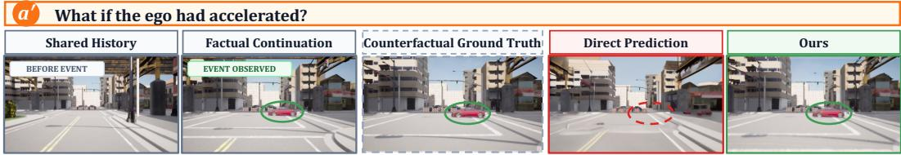
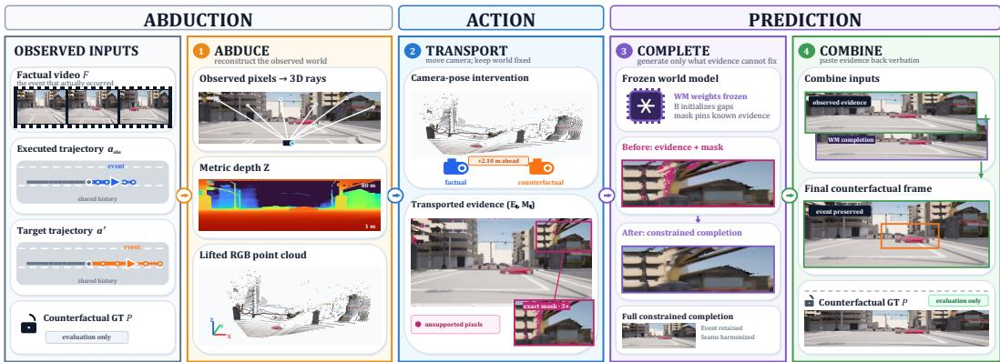
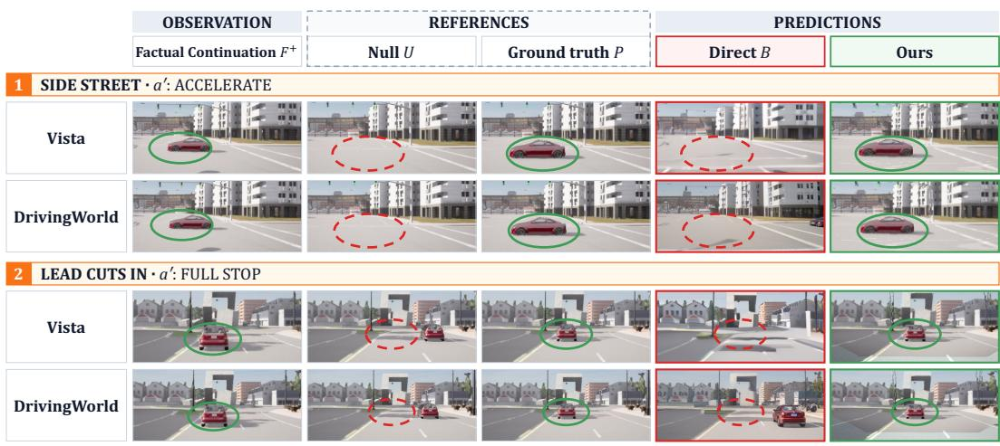
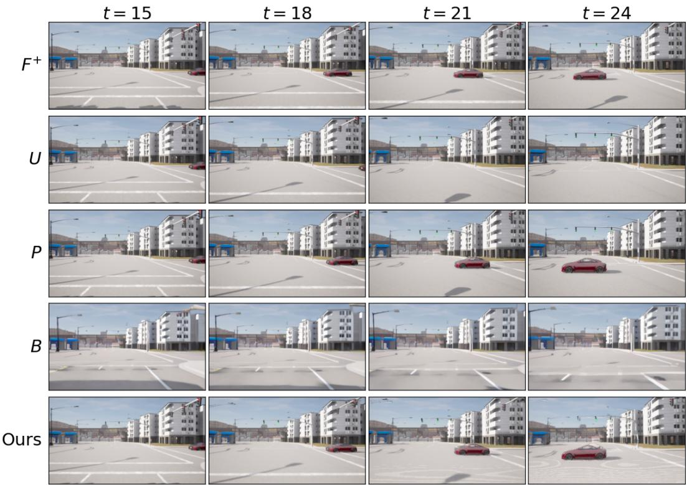

# How Can Driving World Models Do Counterfactual Prediction?

Jiaru Zhang1∗, Can Cui2, Yi Xu2, Xin Ye2, Ruqi Zhang1, Ziran Wang1 1Purdue University 2Bosch Center for Artificial Intelligence {jiaru, ruqiz, ziran}@purdue.edu

## Abstract

Driving world models are often interpreted as counterfactual simulators for observed driving episodes: given a factual driving log, they are asked what would have happened under an alternative ego action. In this paper, we identify a fundamental mismatch between this goal and direct action-conditioned prediction. The direct prediction uses the shared history and the alternative action but not the factual continuation observed after that history. It can therefore generate a plausible future without preserving what actually happened in this episode. We formalize this gap using the causal recipe of abduction, action, and prediction and study it in a setting with a short time horizon, where the alternative ego action does not alter how surrounding agents evolve. To make the gap measurable, we construct a controlled simulation benchmark with factual outcomes and matched counterfactual outcomes. Across two representative world models, direct predictions fail to match the counterfactual ground truth, supporting our analysis. As a constructive check of this analysis, we introduce a deliberately simple, trainingfree pipeline that moves observed evidence into the counterfactual view and lets the frozen model complete what remains unknown. Even this simple construction raises the overall recovered fraction substantially and reduces perceptual distance to the matched counterfactual on both models. We hope this work draws attention to this gap and motivates better counterfactual prediction methods for driving world models.

## 1 Introduction

“. . . What might have been is an abstraction / Remaining a perpetual possibility / Only in a world of speculation. . . ”

T.S. Eliot, “Burnt Norton”

What might have been is the defining object of counterfactual prediction. This problem arises throughout autonomous driving, where we often want to know the result of an alternative action. For example, suppose we have a short factual driving log of what actually happened, which shows a car emerging from a side street or another vehicle cutting in. After observing the episode, we ask what the camera would have recorded had the ego followed a different trajectory, accelerating or braking to a stop. In this setting, the ego’s alternative action changes only its viewpoint and direct consequences. A faithful answer must therefore remain tied to the recorded episode: the same car emerges or cuts in, while what follows from the ego’s changed motion may differ. This is what separates a counterfactual from an ordinary prediction, which may return any plausible continuation consistent with the history.

Currently, driving world models are widely considered capable of counterfactual prediction. For example, Vista claims a “counterfactual reasoning ability” to “predict the counterfactual consequences caused by abnormal actions” [Gao et al., 2024]. Drive-WM states that “our Drive-WM can generate counterfactual events” [Wang et al., 2024b]. Industrial world models have likewise made related counterfactual claims [Jiang et al., 2026, Parker-Holder and Fruchter, 2025]. The standard paradigm for counterfactual prediction is straightforward. The models receive an alternative action, typically represented by a target trajectory, and generate the corresponding future. The underlying assumption is that conditioning the model on a counterfactual action is sufficient to yield a valid counterfactual prediction [Gao et al., 2024, Wang et al., 2024b]. We refer to the resulting output as the direct action-conditioned prediction, or simply the direct prediction.

  
Figure 1: Counterfactual prediction for one observed episode. The shared history shows the ego approaching an intersection. In the factual continuation, a red car emerges from a side street as the ego follows its recorded trajectory. We ask what the camera would have recorded had the ego instead accelerated along the target trajectory a′ shown in the header. The counterfactual ground truth shows that the car would still have emerged. The direct prediction, which uses the shared history and a′, fails to preserve this event, whereas Ours additionally uses the factual continuation and recovers the car near its counterfactual location.

However, a mismatch lies in the information each prediction uses. The direct action-conditioned prediction only conditions on the shared history and target trajectory, while the requested counterfactual must also account for the factual continuation. In the case above, the shared history alone does not reveal whether or when a vehicle later emerged from the side street or cut in. Without that evidence, the model has no basis for preserving the particular event in that episode and can return a fluent video that is consistent with the action but omits the specific factual event. Fig. 1 illustrates this failure. The shared history shows the ego approaching an intersection, while a later frame from the factual continuation shows a car emerging from a side street. Given the shared history and ego acceleration, the direct prediction does not preserve this emergence, even though running the same world again under that action shows that it would still have occurred.

In this paper, we first give this failure a precise causal reading. It reflects a confusion between the direct prediction and the counterfactual prediction, a distinction made precise by Pearl’s ladder of causation [Pearl, 2009, Pearl and Mackenzie, 2018]. The ladder separates three questions. Rung 1 is the conditional prediction from passive observation, rung 2 is the effect of an intervention in general, and rung 3 is the counterfactual prediction, i.e., what would have happened under a different action in a specific episode that has already been observed. A genuine counterfactual prediction, which answers what would have happened in this very world had we acted differently, requires abduction, which is the process of using the observed factual continuation to infer the underlying state of that specific world. The direct prediction fails to do this. Because current driving world models are queried with an alternative action using only the shared history, ignoring the factual continuation, their output is a general future under that action rather than a precise counterfactual prediction for this particular episode.

To make the distinction measurable, we need the counterfactual ground truth, i.e., the video that would have been recorded under the alternative action in the same world. However, real driving can never provide it, because each episode is observed under exactly one action and the future under any alternative action will never be recorded. As an alternative, we turn to the CARLA simulator [Dosovitskiy et al., 2017], where the same world can be simulated multiple times under different actions, producing an exact reference in our controlled setting. Using this simulator, we build a benchmark for counterfactual prediction in driving scenarios. Each case provides a factual driving log, including the full RGB video and its synchronized executed ego trajectory, together with a target trajectory that defines the counterfactual query. Running the same world with the alternative action yields the counterfactual ground truth. This ground truth hence enables an evaluation protocol that can quantitatively compare the performance of different prediction methods.

Using this evaluation protocol, we quantitatively demonstrate that direct predictions from both diffusion-based and autoregressive driving world models struggle with counterfactual prediction. To address this, we propose a deliberately simple framework grounded in our causal formulation.

Concretely, it first transports evidence from the factual continuation into the counterfactual camera view. Then, it uses world models to complete what that evidence does not determine. The framework requires no training and leaves the model weights unchanged. Experiments on our benchmark show that it recovers much of the event signal lost by direct prediction and substantially improves visual fidelity across both model families. In summary, our contributions include:

• We identify and causally analyze the gap between direct action-conditioned prediction and true counterfactual prediction, attributing this failure to the omission of evidence from the factual continuation.

• We construct a controlled CARLA benchmark with simulated counterfactual ground truths, making this gap quantitatively measurable.

• We provide a simple training-free construction that supplies the missing evidence to frozen world models. On our benchmark it recovers much of the event signal lost by direct prediction, which confirms the diagnosis and gives future methods a reference point.

## 2 Related Work

## 2.1 Driving World Models and Their Counterfactual Claims

Driving world models learn to predict future driving observations or scene states from recorded context. Many video-based models additionally support control through ego actions, trajectories, or commands. Diffusion-based examples include DriveDreamer [Wang et al., 2024a], which generates videos from an initial frame and structured traffic information; Drive-WM [Wang et al., 2024b], which generates controllable multiview futures and uses them for planning; and Vista [Gao et al., 2024], which supports high-fidelity generation and versatile action control. Autoregressive examples include GAIA-1 [Hu et al., 2023], which predicts image tokens from video, text, and action context; OccWorld [Zheng et al., 2024], which tokenizes 3D occupancy and forecasts future scene and ego states; and DrivingWorld [Hu et al., 2024], which employs a pose-conditioned video GPT.

Many of these models claim counterfactual prediction capabilities. Vista and Drive-WM present videos generated under abnormal or alternative maneuvers as evidence of counterfactual reasoning. Similarly, industrial world models make related claims. Waymo demonstrates counterfactual driving by simulating a past recorded drive under an alternative route [Jiang et al., 2026]. Google DeepMind’s general-purpose Genie 3 supports promptable world events for counterfactual scenarios [Parker-Holder and Fruchter, 2025]. Related work also studies vision-language counterfactual reasoning in OmniDrive [Wang et al., 2025b], controllable safety-critical traffic generation in CCDiff [Lin et al., 2025], and action-controlled video simulation and reward estimation in ReSim [Yang et al., 2025].

## 2.2 Counterfactual and Causal Prediction

In causality, counterfactual prediction has a precise definition. Pearl’s hierarchy organizes the questions a learner can answer into observational prediction, interventional effects, and counterfactuals over a specific realized episode [Pearl, 2009, Pearl and Mackenzie, 2018], and the hierarchy is strict, in that higher rungs are in general not identifiable from information at lower rungs alone [Bareinboim et al., 2022]. In structural causal models the counterfactual has an exact recipe: abduction of the exogenous state from the observed outcome, replacement of the action, and prediction through the same mechanism [Pearl, 2009]. The tradition of potential outcomes formalizes the same object as the outcome a unit would have exhibited under a different treatment, and reality reveals only one of the potential outcomes per unit [Holland, 1986]. When the available data and causal assumptions do not uniquely identify a counterfactual distribution, classical work characterizes the resulting bounds [Balke and Pearl, 1994, Manski, 2003]. A recent position paper argues that causal considerations are essential for foundation world models in embodied AI and calls for concrete counterfactual task and evaluation metrics [Gupta et al., 2024].

## 3 Problem Setup and Counterfactual Analysis

## 3.1 Problem Setup

We formalize a counterfactual prediction task based on a short, fully recorded factual driving log. This log contains an RGB video from the front camera synchronized with the executed ego motion. It records a particular driving episode in which the ego follows a path while surrounding agents may cut in, cross the road, or brake. We then pose the counterfactual query, asking what the ego camera would have recorded had the ego executed a different action, such as early braking or acceleration. Questions of this form arise when vehicle logs are examined after the fact for incident analysis, safety auditing, or liability assessment. In these settings, the complete factual log exists by definition, and the value of the answer lies in its being about this realized episode rather than an arbitrary plausible continuation.

Inputs. At query time, we are given a factual driving log $( F , a _ { \mathrm { o b s } } )$ , comprising the full video F and its synchronized executed ego trajectory $a _ { \mathrm { o b s } } ,$ , represented by the vehicle’s position and heading at each frame. The shared history H is the initial synchronized prefix of the factual log, including the video and ego motion, which is common to both the executed and target trajectories. We write $F ^ { + }$ for the RGB frames in $F$ after the shared history interval, namely the factual continuation under the executed trajectory. Although these frames occur later on the episode timeline, they are observed evidence when the query is posed. The query additionally specifies the alternative action $a ^ { \prime } ,$ , represented by its target position and heading at each frame.

Expected output. The desired output is the video that would have followed $a ^ { \prime }$ in this same world. In our setting, this means preserving what actually happened and changing only what the new action directly affects.

Scope. We study counterfactuals over a short time horizon where the alternative ego action alters the camera viewpoint while the surrounding environment follows predetermined behaviors. This openloop setting fits queries about the second or so after the ego action changes, since driver perception and reaction times are themselves on the order of a second [Green, 2000], leaving surrounding agents little time to respond. It makes the question empirically checkable, since a world whose other agents follow predetermined behaviors can be replayed under the alternative action to record the outcome that would have followed.

## 3.2 What Causal Theory Prescribes

Our target counterfactual is the outcome under the alternative action $a ^ { \prime }$ for the same realized world, where the other agents move as they did. In causal terms, this is a counterfactual at rung 3 conditioned on the outcome [Bareinboim et al., 2022]. It conditions on the factual continuation $F ^ { + }$ in addition to $H ,$ thereby updating what is known about the realized episode. Direct prediction instead uses $H$ and $a ^ { \prime }$ alone. Letting $\breve { Y }$ denote the video that follows the history under a given action and $Y _ { a ^ { \prime } }$ its value under $a ^ { \prime }$ , the two are

$$
\underbrace { p { \left( Y _ { a ^ { \prime } } \mid H , F ^ { + } \right) } } _ { \mathrm { c o u n t e r f a c t u a l p r e d i c t i o n } } \mathrm { v s . } \underbrace { p { \left( Y \mid H , a ^ { \prime } \right) } } _ { \mathrm { d i r e c t p r e d i c t i o n } } .\tag{1}
$$

For simplicity, we leave the original action $a _ { \mathrm { o b s } }$ implicit.

Causal theory also prescribes, in full generality, how the target should be computed [Pearl, 2009]. Letting $G$ denote the mechanism taking the world w and an action to an outcome, the observation itself arose as $F ^ { + } = G ( w , a _ { \mathrm { o b s } } )$ . We have

$$
\underbrace { w \sim p ( w \mid H , F ^ { + } ) } _ { \mathrm { a b d u c t i o n } } \longrightarrow \underbrace { a ^ { \prime } } _ { \mathrm { a c t i o n } } \longrightarrow \underbrace { Y _ { a ^ { \prime } } = G ( w , a ^ { \prime } ) } _ { \mathrm { p r e d i c t i o n } } .\tag{2}
$$

First comes abduction, which uses the shared history and factual continuation to infer the state of the world that was realized. Next, the action step applies the alternative ego action. Finally, prediction propagates the recovered state through the mechanism under the new action.

## 3.3 Why Direct Prediction Is Insufficient

In practice, world models are trained on (history, action, future) triples to model $p ( Y \mid H , a )$ . Given H and $a ^ { \prime }$ , the direct procedure generates $\smash { B \stackrel { \cdot } { \sim } p ( Y \mid H , a ^ { \prime } ) }$ , which we call the direct prediction. Such outputs are commonly regarded as counterfactual predictions [Gao et al., 2024, Wang et al., 2024b]. As $a ^ { \prime }$ is specified by the query rather than observed as evidence, it does not update the posterior over w beyond H. Therefore, only when the logged action carries no information about the world beyond the history does conditioning on $a ^ { \prime }$ coincide with intervening, and the right side of Eq. (1) equals the interventional prediction $\mathsf { \tilde { p } } ( Y \mid H , \mathrm { d o } ( a ^ { \prime } ) )$ at rung 2, where $\mathrm { d o } ( a ^ { \prime } )$ sets the ego action to $a ^ { \prime } .$ . However, the remaining gap to the counterfactual lies in the conditioning evidence alone, since rung 3 additionally conditions on the factual outcome $F ^ { + }$ . Written as mixtures over the world, the two sides of Eq. (1) are

$$
p ( Y \mid H , a ^ { \prime } ) = \int p \big ( Y \mid w , a ^ { \prime } \big ) p ( w \mid H ) d w ,\tag{3}
$$

$$
p ( Y _ { a ^ { \prime } } \mid H , F ^ { + } ) = \int p \big ( Y \mid w , a ^ { \prime } \big ) p ( w \mid H , F ^ { + } ) d w .\tag{4}
$$

The direct prediction, Eq. (3), infers the world from H alone. It therefore mixes over $p ( w \mid H )$ whereas the counterfactual uses the posterior for this episode, $p ( w \mid H , F ^ { + } )$ . Whenever $\dot { F } ^ { + }$ carries outcome information absent from H, these two distributions differ.

## 4 Methodology

## 4.1 Overview

Problem decomposition. As shown in Eqs. (3) and (4), the factual continuation $F ^ { + }$ updates what is known about the realized world. Therefore, to instantiate the abduction step of Eq. (2), we ask which parts of the counterfactual view this evidence determines. The answer splits into two. One part of the counterfactual view shows surfaces that F also observes, where, given the sensing setup above, the counterfactual differs only in where the camera is. On that part the posterior $p ( w \mid H , F ^ { + } )$ concentrates on the observed surfaces, and the outcome is determined up to the error of recovering their geometry from monocular video. Other parts remain unseen in $F ,$ such as regions behind occluders or beyond the field of view. Since two worlds can produce the same observations in $F$ and still differ in unobserved regions, the posterior retains uncertainty in these regions and every completion consistent with the evidence is admissible.

Our approach. The split above assigns the work. Where the world is pinned by evidence, the task is transport that carries the observations into the new viewpoint. Geometric methods based on depth reprojection or novel view synthesis [Shih et al., 2020, Kerbl et al., 2023, Yan et al., 2024, Van Hoorick et al., 2024, Wang et al., 2025a] can do this. The remaining regions require a prior that chooses whether the area behind a bus contains road, curb, or another car, and a driving world model supplies it through its history-and-action interface, which yields the mixture over $p ( w$ $H )$ in Eq. (3). Our method bridges the two. Geometry transports the observed evidence where it determines the answer, the frozen world model completes the scene wherever only a prior can, and the final Combine stage restores the transported evidence in the output.

## 4.2 Pipeline

As shown in Fig. 2, our method follows the three steps from Eq. (2) with four stages. Abduce implements the observable part of abduction, Transport implements the action step, and Complete and Combine together implement the prediction step. Together, these stages implement the split in Sec. 4.1.

Abduce. A frozen depth model [Yang et al., 2024] estimates the relative distance of each pixel from the camera in every frame of $F ^ { + }$ . We use the visible road and the approximate height of the camera above it to convert these values to distances in meters. The fixed camera model then maps each observed pixel to a colored 3D point, forming an RGB point cloud of the observed scene.

Transport. Because the camera is rigidly mounted, the executed trajectory $a _ { \mathrm { o b s } }$ and target trajectory $a ^ { \prime }$ determine, at each time step, the relative pose between the camera that did film the scene and the camera that would have filmed it. Then, forward splatting with a depth buffer reprojects the lifted points into the counterfactual view, producing a warped evidence image $E _ { t }$ and a support mask $M _ { t } \colon$ $\bar { ( E _ { t } , M _ { t } ) } = \mathrm { s p l a t } \big ( \mathrm { l i f t } ( F ^ { + } ; a _ { \mathrm { o b s } } )$ , camt(a′). The mask marks the supported region, the pixels of the counterfactual frame whose corresponding 3D point is visible in $F ^ { + }$ . Within this region, each pixel takes its value from the factual pixel observing the same surface point. The time-aligned factual frame is the primary donor because it shows moving agents at the correct time. To fill residual holes, we further admit projections from other frames of $\breve { F } ^ { + }$ , favoring pixels whose projections agree across frames. We refer to this refinement as filling from multiple frames (MF).

  
Figure 2: Overview of our method. The factual driving log comprises RGB video $F$ and its executed ego trajectory $a _ { \mathrm { o b s } } ,$ while the target trajectory $a ^ { \prime }$ specifies the counterfactual action. The four stages instantiate the causal recipe of abduction, action, and prediction. (1) Abduce recovers the observed part of the realized world from the factual log. (2) Transport applies the target action by moving the camera from $a _ { \mathrm { o b s } } \tan ^ { \prime } a ^ { \prime }$ while holding the world fixed, yielding factual evidence $E _ { t }$ and a support mask $M _ { t }$ in the counterfactual view for each frame t of the prediction window. $( 3 - 4 )$ Complete and Combine implement prediction: the frozen world model generates the unsupported regions, while the Combine stage restores the transported evidence in the output. The counterfactual ground truth $P ,$ , the replay of the same world under a′ defined in Sec. 5, serves as an evaluation reference.

Complete. The frozen world model generates the unsupported regions under the target trajectory $a ^ { \prime }$ while preserving the transported evidence. We first construct an input video that uses $E _ { t }$ where $M _ { t } = 1$ and the corresponding frame of the direct prediction B everywhere else. For the diffusion model, sampling starts midway through the denoising process from a noisy encoding of this input video [Meng et al., 2022]. After every denoising step i, the evidence region is restored at the corresponding noise level [Lugmayr et al., 2022], $x  M \odot ( z _ { E } + \sigma _ { i } \varepsilon ) + ( 1 - M ) \odot x ,$ , where x is the current video representation, $z _ { E }$ is the encoded input video, M holds the support masks $M _ { t }$ resampled to the resolution of $z _ { E } , \sigma _ { i }$ is the current noise level, and ε is random noise. Each cell of M stores the fraction of its pixels covered by evidence (Appendix B). For the autoregressive VQ model, tokens covered by transported evidence stay fixed to the input-video tokens, while the model generates the remaining tokens normally.

Combine. Encoding and decoding through the world model can blur transported pixels. The Combine stage restores the reliable transported pixels in the completed frame and blends their boundary smoothly, giving the output frame $\hat { Y } _ { t } , \hat { Y } _ { t } = \alpha _ { t } \odot E _ { t } + ( 1 - \alpha _ { t } ) \odot \operatorname { c c } ( C _ { t } )$ , where $C _ { t }$ is the completed frame. The weight $\alpha _ { t }$ is 1 inside the reliable part of the support mask and gradually decreases to 0 near its boundary. The map cc adjusts the colors of $C _ { t }$ to match the transported evidence; the adjustment stays within a small range and changes smoothly across frames.

Our method runs entirely at inference time with all pretrained networks frozen. Its case-specific inputs are the factual driving log $( F , a _ { \mathrm { o b s } } )$ and target trajectory $a ^ { \prime } .$ The camera setup is shared across cases. More implementation details are provided in Appendix B.

## 5 Benchmark and Metrics

## 5.1 The Benchmark

Motivation. Real driving records one outcome for each episode, while counterfactual evaluation requires a matched outcome under an alternative action, which is never available in the real world. Therefore, we turn to the CARLA simulator to build a benchmark in the controlled simulation [Dosovitskiy et al., 2017]. With CARLA, we can obtain counterfactual ground truths by running the same simulated world again. For quantitative comparison, we also use CARLA to record a run of the same world where the event is never triggered, which serves as a reference video.

Construction. In our benchmark, each case starts from one placement, an initial configuration of the ego and one event agent, e.g., a lead vehicle or a car waiting in a side street. Both follow predefined open-loop motion scripts. We then run the same world three times, varying only the ego action and the presence of the event, and record each run as an RGB sequence with synchronized ego motion. The first run follows the executed trajectory and the event occurs, yielding the factual log $( F , a _ { \mathrm { o b s } } )$ The second follows the target trajectory $a ^ { \prime }$ while the rest of the world replays identically, yielding the counterfactual ground truth ${ \bar { P } } .$ . The third follows the same target trajectory $a ^ { \prime }$ in a run where the event is never triggered, yielding the null reference $U .$ . Each arm contains 25 frames captured at 10 fps and $5 7 6 \times 3 2 0$ resolution. All three arms share the 15-frame history H and diverge only in the 10-frame prediction window. P and U are reserved for scoring. Counterfactual edits retime the ego along its factual path. The ego accelerates, slows down, or comes to a full stop, so the query changes only the ego motion.

Composition. The benchmark contains 186 cases drawn from 72 placements across three towns and three scenario types. The headline type, in which a vehicle emerges from a side street, is the cleanest test. Its event is first revealed in the factual continuation $F ^ { + }$ , which occupies the same time interval as the prediction window. The secondary clean type involves a lead vehicle cutting in. The lead brake type is a confounded control, since an accelerating ego makes the lead vehicle, which is already visible, loom larger, mimicking the event signal through geometry alone. Cases from one placement reuse the same initial setup and factual episode specification. Composition, capture protocol, and benchmark checks are documented in Appendix A.

## 5.2 Metrics

To evaluate a counterfactual prediction, we look at two dimensions. The first is whether it depicts the right world, the one where the event actually happened. The second is whether it depicts that world well, with clear, seamless, and coherent content. We therefore score two complementary axes, one semantic and one perceptual.

Counterfactual signal recovered. The headline metric asks whether the prediction contains the right world. Let $s ( \cdot , \cdot )$ be the cosine similarity of corresponding frame embeddings, averaged over the frames of the prediction window, and let $\Delta ( \hat { Y } ) = s ( \hat { Y } , P ) - s ( \hat { Y } , U )$ be the preference of a prediction $\hat { Y }$ for the counterfactual over the null. To make this preference comparable across cases, we linearly rescale it using the two reference values as endpoints:

$$
\operatorname { R e c } ( { \hat { Y } } ) = { \frac { \Delta ( { \hat { Y } } ) - \Delta ( U ) } { \Delta ( P ) - \Delta ( U ) } } .\tag{5}
$$

We call this score the recovered fraction. By construction, $\operatorname { R e c } ( U ) = 0$ corresponds to complete event omission, $\operatorname { R e c } ( P ) = 1$ corresponds to reproducing the reference event, and $\operatorname { R e c } ( \hat { Y } ) = 0 . 5$ means $\hat { Y }$ is equally similar to $P$ and U. A prediction whose preference lies between the two reference values scores in (0, 1), and the scale is not clipped outside them. For a set of cases, each ∆ in Eq. (5) is averaged over the cases. For the encoders, we use DINOv2 ViT-B/14 [Oquab et al., 2024] and CLIP ViT-L/14 [Radford et al., 2021], and write Rec and Rec for the recovered fraction under each.

Perceptual fidelity. Because the true counterfactual P exists, we measure quality as perceptual distance to it directly, using LPIPS [Zhang et al., 2018] between each predicted frame and the corresponding frame of $P .$ Unlike an embedding of the whole image, LPIPS compares deep features spatially, so locally wrong content, seams, and blur all accrue distance.

  
Figure 3: Qualitative comparison at a representative frame late in the prediction window. The upper block shows a vehicle emerging from a side street under ego acceleration and the lower block a lead vehicle cutting in while the ego brakes to a full stop. Each block has one row for Vista and one for DrivingWorld. Columns show the factual continuation F+, the references used only for evaluation, U (event-free null) and P (counterfactual ground truth), and the predictions B (direct prediction) and Ours. Ellipses mark the event location, solid where the event vehicle is present and dashed where it is absent. Within each row, B and Ours use the same frozen model, shared history H, and target trajectory a′. B omits or misplaces the event vehicle, whereas Ours recovers it near the location shown in ${ \dot { P } } .$

## 6 Experiments

## 6.1 Setup

We compare our framework with the direct prediction on the same frozen backbone and case. Both are given the same shared history H and target trajectory a′. The direct prediction B follows the backbone’s native history conditioning. Ours additionally uses the factual continuation $F ^ { + }$ and its synchronized executed ego motion to transport visual evidence into the counterfactual view. The two procedures instantiate the two sides of Eq. (1), so the comparison exactly diagnoses the value of the factual evidence. We evaluate two publicly released models with different architectures. Vista [Gao et al., 2024] is a latent diffusion model conditioned on an anchor frame and target trajectory. DrivingWorld [Hu et al., 2024] is an autoregressive model over VQ tokens conditioned on frame history, pose, and heading. B follows each model’s native conditioning protocol, and Ours retains that conditioning and the frozen weights, adding the Abduce, Transport, Complete, and Combine stages. The main comparison reports means over five seeds: B resamples the native generation process, whereas Ours resamples completion while holding the transported evidence fixed. We use the metrics of Sec. 5. Each inference run uses one A100 GPU. Each value in the tables is the mean over five seeds, and the ± value beneath it is the maximum deviation from that mean.

## 6.2 Qualitative Comparison

Fig. 3 exposes a failure that visual quality alone would miss. Despite producing fluent video, B resembles U. Where a vehicle emerges from a side street, neither backbone shows it. Where the lead vehicle cuts in, Vista removes the vehicle and DrivingWorld leaves it in its original lane, so neither preserves the realized event. In both scenarios Ours places the vehicle at approximately the location and pose shown in P on both backbones. Transport largely determines this geometry; the remaining seams and mild warp artifacts are reflected in LPIPS. Fig. 4 in Appendix C further show one case across the full prediction window, showing the same pattern.

## 6.3 Quantitative Comparison

Tab. 1 directly tests the two implications of the analysis.

<table><tr><td rowspan="2">Scenario type</td><td colspan="2">RecD↑</td><td colspan="2">Recc↑</td><td colspan="2">LPIPS↓</td></tr><tr><td>B</td><td>Ours</td><td>B</td><td>Ours</td><td>B</td><td>Ours</td></tr><tr><td colspan="7">Vista (diffusion)</td></tr><tr><td rowspan="3">side street lead cuts in lead brake Overall</td><td></td><td></td><td></td><td></td><td>0.29 0.75 0.25 0.72 0.415 0.172 ±.005 ±.003 ±.007 ±.001 ±.0075 ±.0003</td><td></td></tr><tr><td></td><td>0.45 0.73 0.38 0.73 0.465 0.167 ±.011 ±.002 ±.056 ±.005 ±.0046 ±.0007 0.50 0.59 0.41 0.48 0.407 0.167</td><td></td><td></td><td></td><td></td></tr><tr><td>±.022 ±.005 ±.036 ±.002 ±.0029 ±.0005</td><td>0.38 0.70 0.33 0.65 0.423 0.169 ±.006 ±.002 ±.015 ±.002</td><td></td><td></td><td></td><td></td></tr><tr><td colspan="5">DrivingWorld (autoregressive) 0.39 0.67 0.28 0.71 0.309 0.214</td><td>2 ±.0043 ±.0003</td><td></td></tr><tr><td>side street lead cuts in</td><td></td><td>±.009 ±.004 ±.010 ±.003 ±.0014 ±.0002</td><td></td><td></td><td>0.25 0.74 0.23 0.67 0.288 0.212</td><td></td></tr><tr><td>lead brake</td><td></td><td>±.027 ±.003 ±.012 ±.004 ±.0048 ±.0003</td><td></td><td></td><td></td><td></td></tr><tr><td></td><td></td><td>±.018 ±.003 ±.016 ±.006 ±.0021 ±.0003</td><td></td><td></td><td></td><td></td></tr><tr><td></td><td></td><td>0.37 0.550.23 0.51 0.284 0.208</td><td></td><td></td><td></td><td></td></tr><tr><td></td><td></td><td></td><td></td><td></td><td></td><td></td></tr><tr><td></td><td></td><td></td><td></td><td></td><td></td><td></td></tr><tr><td></td><td></td><td></td><td></td><td></td><td></td><td></td></tr><tr><td>Overall</td><td>±.008 ±.001 ±.007 ±.001 ±.0013 ±.0002</td><td>0.31 0.67 0.24 0.64 0.291 0.211</td><td></td><td></td><td></td><td></td></tr></table>

Table 1: Main results by scenario type. Each pair of columns compares the direct prediction B with Ours on the same frozen backbone, and the better value is in bold. $\mathrm { R e c } _ { \mathrm { D } }$ and $\mathrm { R e c _ { C } }$ are recovered fractions computed with DINOv2 and CLIP, and LPIPS is computed against P.

<table><tr><td>Components</td><td colspan="3">Vista</td><td colspan="3">DrivingWorld</td></tr><tr><td>Tr MF Cm Cb RecD↑ Recc↑ LPIPS ↓ RecD↑ Recc↑ LPIPS ↓</td><td colspan="6"></td></tr><tr><td></td><td>0.38</td><td>0.33</td><td>0.423</td><td>0.31</td><td>0.24</td><td>0.291</td></tr><tr><td>√√</td><td>±.006 0.68</td><td>±.015 0.65</td><td>±.0043 0.195</td><td>±.008 0.67</td><td>±.007 0.66</td><td>±.0013 0.238</td></tr><tr><td>√-√ √</td><td>±.003 0.69</td><td>±.002 0.64</td><td>±.0002 0.187</td><td>±.001 0.65</td><td>±.001</td><td>±.0002</td></tr><tr><td></td><td>±.005</td><td>±.003</td><td>±.0004</td><td>±.003</td><td>0.63 ±.003</td><td>0.223 ±.0005</td></tr><tr><td>√√√√</td><td>0.70</td><td>0.65</td><td>0.169</td><td>0.67</td><td>0.64</td><td>0.211</td></tr><tr><td></td><td>±.002</td><td>±.002</td><td>±.0003</td><td>±.001</td><td>±.001</td><td>±.0002</td></tr></table>

Table 2: Ablation of transport (Tr), filling from multiple frames (MF), completion (Cm), and the Combine stage (Cb). The first row is the direct prediction B, and the last row is the full method.

Direct predictions miss the realized event. For almost all scenarios, the mean for B lies below 0.5, ranging from 0.23 to 0.45, indicating B remains closer to the event-free null U than to the matched counterfactual replay $P ,$ consistently across both backbones and encoders. This pattern supports the analysis in Sec. 3 that conditioning on the shared history and target trajectory alone does not reliably preserve events specific to the episode that are revealed only in the factual continuation $F ^ { + }$

Ours succeeds. With the same frozen backbones, Ours raises the overall recovered fraction to 0.64– 0.70. LPIPS falls from 0.423 to 0.169 on Vista and from 0.291 to 0.211 on DrivingWorld. Because the direct prediction and Ours use the same frozen backbones, these gains arise from supplying and preserving factual evidence specific to each episode, consistent with our theoretical analysis.

## 6.4 Ablations

Following the pipeline described in Sec. 4, Tab. 2 isolates four implementation components: transport (Tr), its refinement that fills from multiple frames (MF), completion (Cm), and the Combine stage (Cb). Tr moves evidence from the corresponding factual frame into the counterfactual view, MF uses nearby factual frames to fill residual holes, Cm fills and harmonizes the remaining unsupported regions with the frozen world model, and Cb restores the transported evidence after completion. We compare the direct prediction B; Tr+MF, which retains pixels from B in the unsupported regions; Tr+Cm+Cb, which uses the time-aligned factual frame followed by the Complete and Combine stages; and the full Tr+MF+Cm+Cb pipeline.

Transport carries the event signal. The Tr+MF variant reaches $\mathrm { R e c _ { D } / R e c _ { C } }$ of 0.68/0.65 on Vista and 0.67/0.66 on DrivingWorld, compared with 0.38/0.33 and 0.31/0.24 for the direct prediction. These results show that transport recovers much of the event signal lost by the direct prediction.

The Complete and Combine stages improve visual fidelity. Transport with filling from multiple frames recovers the event but can still leave visible seams and unsupported regions inherited from the direct prediction. Adding the Complete and Combine stages reduces LPIPS from 0.195 to 0.169 on Vista and from 0.238 to 0.211 on DrivingWorld. The lower LPIPS values are consistent with fewer visual artifacts after these stages. The full version with filling from multiple frames also achieves a higher recovered fraction and lower LPIPS than the variant using one frame, suggesting that agreement across frames produces cleaner and more reliable transported evidence. Appendix C reports intermediate outputs after completion and examines how the choice of factual evidence affects transport.

## 6.5 Cost

On a single A100 GPU, Ours takes about 90 s per Vista case and 108 s per DrivingWorld case, compared with 47 s and 45 s for direct prediction. Our method adds inference-time processing while keeping all model parameters frozen. The resulting runtime is practical for the offline counterfactual analysis considered here. Runtimes for each stage and peak memory usage are reported in Appendix B.

## 7 Conclusion

A common practice in driving world models is to treat direct action-conditioned prediction as counterfactual prediction. In this paper, we first identified a fundamental mismatch between direct prediction and counterfactual prediction. The direct prediction conditions on the shared history and target trajectory, but not on the factual continuation already observed when the counterfactual query is posed. It therefore marginalizes events that should remain unchanged under the counterfactual action rather than preserving them. To make this failure measurable, we constructed a controlled benchmark with factual outcomes and matched counterfactual ground truths. We further built a deliberately simple pipeline that transports evidence, as a constructive check that supplying the missing evidence closes much of the gap. Across two world models, it recovered much of the event signal lost by direct predictions and improved visual fidelity using frozen model weights. For limitations and future work, please refer to Appendix D.

## References

Alexander Balke and Judea Pearl. Counterfactual probabilities: Computational methods, bounds, and applications. In Proceedings ofthe Tenth Conference on Uncertainty in Artificial Intelligence, pages 46–54, 1994. 3

Elias Bareinboim, Juan D. Correa, Duligur Ibeling, and Thomas Icard. On pearl’s hierarchy and the foundations of causal inference. In Probabilistic and Causal Inference: The Works of Judea Pearl, pages 507–556. ACM, 2022. 3, 4

Holger Caesar, Juraj Kabzan, Kok Seang Tan, Whye Kit Fong, Eric Wolff, Alex Lang, Luke Fletcher, Oscar Beijbom, and Sammy Omari. nuPlan: A closed-loop ML-based planning benchmark for autonomous vehicles. arXiv preprint arXiv:2106.11810, 2021. 17

Alexey Dosovitskiy, German Ros, Felipe Codevilla, Antonio Lopez, and Vladlen Koltun. CARLA: An open urban driving simulator. In Proceedings of the 1st Annual Conference on Robot Learning, 2017. 2, 7

Shenyuan Gao, Jiazhi Yang, Li Chen, Kashyap Chitta, Yihang Qiu, Andreas Geiger, Jun Zhang, and Hongyang Li. Vista: A generalizable driving world model with high fidelity and versatile controllability. In Advances in Neural Information Processing Systems, 2024. 1, 2, 3, 5, 8

Marc Green. “how long does it take to stop?” Methodological analysis of driver perception-brake times. Transportation Human Factors, 2(3):195–216, 2000. 4

Tarun Gupta, Wenbo Gong, Chao Ma, Nick Pawlowski, Agrin Hilmkil, Meyer Scetbon, Marc Rigter, Ade Famoti, Ashley Juan Llorens, Jianfeng Gao, Stefan Bauer, Danica Kragic, Bern-

hard Scholkopf, and Cheng Zhang. The essential role of causality in foundation world models for¨ embodied AI. arXiv preprint arXiv:2402.06665, 2024. 3

Paul W. Holland. Statistics and causal inference. Journal of the American Statistical Association, 81(396):945–960, 1986. 3

Anthony Hu, Lloyd Russell, Hudson Yeo, Zak Murez, George Fedoseev, Alex Kendall, Jamie Shotton, and Gianluca Corrado. GAIA-1: A generative world model for autonomous driving. arXiv preprint arXiv:2309.17080, 2023. 3

Xiaotao Hu, Wei Yin, Mingkai Jia, Junyuan Deng, Xiaoyang Guo, Qian Zhang, Xiaoxiao Long, and Ping Tan. Drivingworld: Constructing world model for autonomous driving via video GPT. arXiv preprint arXiv:2412.19505, 2024. 3, 8

Xiaosong Jia, Zhenjie Yang, Qifeng Li, Zhiyuan Zhang, and Junchi Yan. Bench2drive: Towards multi-ability benchmarking of closed-loop end-to-end autonomous driving. In Advances in Neural Information Processing Systems, 2024. 17

Chiyu Max Jiang, Xander Masotto, and Bo Sun. The waymo world model: A new frontier for autonomous driving simulation. Waymo blog, https://waymo.com/blog/2026/02/ the-waymo-world-model-a-new-frontier-for-autonomous-driving-simulation/, 2026. 1, 3

Bernhard Kerbl, Georgios Kopanas, Thomas Leimkuhler, and George Drettakis. 3D Gaussian splat-¨ ting for real-time radiance field rendering. ACM Transactions on Graphics, 42(4), 2023. 5

Haohong Lin, Xin Huang, Tung Phan-Minh, David Hayden, Huan Zhang, Ding Zhao, Siddhartha Srinivasa, Eric Wolff, and Hongge Chen. Causal composition diffusion model for closed-loop traffic generation. In Proceedings of the IEEE/CVF Conference on Computer Vision and Pattern Recognition, pages 27542–27552, 2025. 3

Andreas Lugmayr, Martin Danelljan, Andres Romero, Fisher Yu, Radu Timofte, and Luc Van Gool. Repaint: Inpainting using denoising diffusion probabilistic models. In Proceedings of the IEEE/CVF Conference on Computer Vision and Pattern Recognition, 2022. 6

Charles F. Manski. Partial Identification ofProbability Distributions. Springer, 2003. 3

Chenlin Meng, Yutong He, Yang Song, Jiaming Song, Jiajun Wu, Jun-Yan Zhu, and Stefano Ermon. SDEdit: Guided image synthesis and editing with stochastic differential equations. In International Conference on Learning Representations, 2022. 6

Maxime Oquab, Timothee Darcet, Th ´ eo Moutakanni, Huy Vo, Marc Szafraniec, Vasil Khalidov,´ et al. DINOv2: Learning robust visual features without supervision. Transactions on Machine Learning Research, 2024. 7

Jack Parker-Holder and Shlomi Fruchter. Genie 3: A new frontier for world models. Google DeepMind blog, https://deepmind.google/blog/ genie-3-a-new-frontier-for-world-models/, 2025. 1, 3

Judea Pearl. Causality: Models, Reasoning, and Inference. Cambridge University Press, 2nd edition, 2009. 2, 3, 4

Judea Pearl and Dana Mackenzie. The Book of Why: The New Science of Cause and Effect. Basic Books, 2018. 2, 3

Alec Radford, Jong Wook Kim, Chris Hallacy, Aditya Ramesh, Gabriel Goh, Sandhini Agarwal, et al. Learning transferable visual models from natural language supervision. In International Conference on Machine Learning, 2021. 7

Meng-Li Shih, Shih-Yang Su, Johannes Kopf, and Jia-Bin Huang. 3D photography using contextaware layered depth inpainting. In Proceedings of the IEEE/CVF Conference on Computer Vision and Pattern Recognition, 2020. 5

Basile Van Hoorick, Rundi Wu, Ege Ozguroglu, Kyle Sargent, Ruoshi Liu, Pavel Tokmakov, Achal Dave, Changxi Zheng, and Carl Vondrick. Generative camera dolly: Extreme monocular dynamic novel view synthesis. In European Conference on Computer Vision, 2024. 5

Qitai Wang, Lue Fan, Yuqi Wang, Yuntao Chen, and Zhaoxiang Zhang. FreeVS: Generative view synthesis on free driving trajectory. In International Conference on Learning Representations, 2025a. 5

Shihao Wang, Zhiding Yu, Xiaohui Jiang, Shiyi Lan, Min Shi, Nadine Chang, Jan Kautz, Ying Li, and Jose M. Alvarez. Omnidrive: A holistic vision-language dataset for autonomous driving with counterfactual reasoning. In Proceedings of the IEEE/CVF Conference on Computer Vision and Pattern Recognition, 2025b. 3

Xiaofeng Wang, Zheng Zhu, Guan Huang, Xinze Chen, Jiagang Zhu, and Jiwen Lu. Drivedreamer: Towards real-world-driven world models for autonomous driving. In European Conference on Computer Vision, 2024a. 3

Yuqi Wang, Jiawei He, Lue Fan, Hongxin Li, Yuntao Chen, and Zhaoxiang Zhang. Driving into the future: Multiview visual forecasting and planning with world model for autonomous driving. In Proceedings of the IEEE/CVF Conference on Computer Vision and Pattern Recognition, 2024b. 1, 2, 3, 5

Yunzhi Yan, Haotong Lin, Chenxu Zhou, Weijie Wang, Haiyang Sun, Kun Zhan, Xianpeng Lang, Xiaowei Zhou, and Sida Peng. Street gaussians: Modeling dynamic urban scenes with gaussian splatting. In European Conference on Computer Vision, 2024. 5

Jiazhi Yang, Kashyap Chitta, Shenyuan Gao, Long Chen, Yuqian Shao, Xiaosong Jia, Hongyang Li, Andreas Geiger, Xiangyu Yue, and Li Chen. Resim: Reliable world simulation for autonomous driving. In Advances in Neural Information Processing Systems, 2025. 3

Lihe Yang, Bingyi Kang, Zilong Huang, Zhen Zhao, Xiaogang Xu, Jiashi Feng, and Hengshuang Zhao. Depth anything V2. In Advances in Neural Information Processing Systems, 2024. 5, 14

Richard Zhang, Phillip Isola, Alexei A. Efros, Eli Shechtman, and Oliver Wang. The unreasonable effectiveness of deep features as a perceptual metric. In Proceedings ofthe IEEE/CVF Conference on Computer Vision and Pattern Recognition, 2018. 7

Wenzhao Zheng, Weiliang Chen, Yuanhui Huang, Borui Zhang, Yueqi Duan, and Jiwen Lu. Occworld: Learning a 3d occupancy world model for autonomous driving. In European Conference on Computer Vision, 2024. 3

## Supplementary Material

A Benchmark Details 13   
A.1 Composition . . 13   
A.2 Capture and Sequence Construction 13   
A.3 Metadata for Each Case 13   
A.4 Benchmark Checks 14   
A.5 Scoring Metrics . 14   
B Method Details 14   
C Additional Analyses 15   
C.1 The Recovered Event Develops over Time 15   
C.2 Results Are Stable across Seeds 16   
C.3 Complete Fills the Holes and Combine Restores the Evidence 16   
C.4 Transport Requires the Correct Episode and Time 17   
D Limitations and Future Work 17

## A Benchmark Details

This section documents the construction and scoring of the 186 benchmark cases.

## A.1 Composition

Tab. 3 breaks the 186 cases down by scenario type and target ego action. The cases come from the 72 placements of Sec. 5, with 27 for lead brake, 26 for side street, and 19 for lead cuts in. Every placement contributes an acceleration case, and the braking and full stop cases cover subsets of these placements. The town distribution is Town01 (60), Town03 (72), and Town10HD (54). We also collected 10 pedestrian crossing cases. This sample is too small for a separate comparison, so the reported results use the 186 vehicle cases.

## A.2 Capture and Sequence Construction

All data are rendered in CARLA 0.9.15 in synchronous mode with a fixed simulation step of 0.05 s. A single front RGB camera (576 × 320, 70◦ horizontal field of view) is mounted 1.5 m forward of and 1.5 m above the ego actor origin of a vehicle.tesla.model3. Two simulation steps are taken between stored frames.

Frames 0–14 form the shared history H, and frames 15–24 form the prediction window. In F, the prediction window is the factual continuation $F ^ { + }$ . The replays P and U use the same scene setup during the history, apart from small rendering variations. In U, the event vehicle is present with the same starting state, and its scripted maneuver is pushed beyond the captured window. The lead vehicle keeps its speed, the side street vehicle stays waiting, and the cutting-in vehicle keeps its lane. From the first prediction frame, the target trajectory scales the displacement between consecutive factual positions by 1.6, 0.4, or 0 for acceleration, braking, or a full stop.

## A.3 Metadata for Each Case

Each case includes a meta.json file. It records the case identifiers, map, action edit, ego and event vehicle spawn poses, and the parameters of the scripted vehicle motion. It also stores the ego positions and headings for F, P, and U, together with a vehicle visibility summary and minimum approach distance. Some side street cases additionally record the distance to the junction. These records provide the camera motion used by evidence transport and the geometry used by the benchmark checks.

<table><tr><td colspan="4">Scenario type Total Accel. Brake Full stop</td></tr><tr><td>side street</td><td>60</td><td>26 17</td><td>17</td></tr><tr><td>lead cuts in</td><td>45</td><td>19 13</td><td>13</td></tr><tr><td>lead brake</td><td>81</td><td>27 27</td><td>27</td></tr><tr><td>Total</td><td>186</td><td>72 57</td><td>57</td></tr></table>

Table 3: Benchmark composition by scenario type and target ego action.

## A.4 Benchmark Checks

The geometric check determines inclusion in the benchmark. Using the recorded ego and vehicle trajectories, a forward 70◦ view, and a maximum distance of 60 m, it verifies that the scripted event vehicle is visible in the factual camera view in at least two frames. All 186 reported cases pass this check. A separate image check compares $P$ and U. It checks their agreement at the end of the shared history and the appearance of a localized difference during the prediction window. This second check is an audit after capture and uses simple image thresholds. It passes 167 cases and flags 19 for review. The flags concentrate in combinations where the action edit weakens the visible event, for example a braking edit that lets the lead vehicle recede, and in cases whose image differences are close to rendering noise. Scoring without the flagged cases leaves the comparison between the direct prediction and Ours unchanged, so all 186 cases remain in the reported benchmark.

## A.5 Scoring Metrics

For a prediction $\hat { Y }$ , the preference $\Delta ( \hat { Y } )$ of Sec. 5 is computed as

$$
\Delta ( \hat { Y } ) = \frac { 1 } { 1 0 } \sum _ { t = 1 5 } ^ { 2 4 } \left[ \cos ( \phi ( \hat { Y } _ { t } ) , \phi ( P _ { t } ) ) - \cos ( \phi ( \hat { Y } _ { t } ) , \phi ( U _ { t } ) ) \right] ,
$$

where ϕ is the frozen encoder and its output is normalized to unit $L _ { 2 }$ norm.

For each case, let

$$
d = \frac { 1 } { 1 0 } \sum _ { t = 1 5 } ^ { 2 4 } \left[ 1 - \cos ( \phi ( P _ { t } ) , \phi ( U _ { t } ) ) \right] .
$$

Then $\Delta ( P ) = d$ and $\Delta ( U ) = - d ,$ so the recovered fraction in Eq. (5) becomes $( \Delta ( \hat { Y } ) + d ) / ( 2 d )$ For a set of cases, we average ∆ and d separately and report $( \overline { { \Delta } } + \bar { d } ) / ( 2 \bar { d } )$ . Scores outside [0, 1] are retained. LPIPS is computed with the AlexNet backbone and averaged over the ten frames of the prediction window. For DrivingWorld, the reference frames are resized to the model’s 512 × 256 output size before comparison.

## B Method Details

Input resolution. Vista uses the benchmark frames at their native resolution of $5 7 6 \times 3 2 0 .$ . For DrivingWorld, we resize each frame to 512 × 284 with bicubic interpolation and crop 14 pixels from the top and bottom, producing the model’s $5 1 2 \times 2 5 6$ input while preserving the aspect ratio. All constants in this section were set during initial development and then kept fixed for the reported runs.

Abduce and Transport. We estimate relative depth with Depth Anything V2 Small [Yang et al., 2024]. The fixed image resolution and horizontal field of view determine the focal length and image center. We use a road patch near the bottom center of the image and a camera height constant of 1.8 m above the road surface to convert relative depth into distance. The 1.5 m mount height in Appendix A is measured from the ego actor origin rather than the road.

We remove pixels at sharp depth changes, where the estimated 3D position is less reliable, using a relative depth gradient threshold of 0.15. We sample the source image at twice its resolution and keep the nearest projected 3D point at each target pixel. Three rounds of neighboring pixel averaging close narrow holes of 1–3 pixels.

In filling from multiple frames (MF), a pixel with one available projection is retained. When several frames project to the same pixel and their average spread across channels is below 28 intensity levels, we retain their median RGB value. Otherwise the pixel stays unsupported and is left to the Complete stage. Before filling a region, we match the donor frame’s brightness and contrast to the accepted evidence near its boundary.

Complete. On Vista, the native EDM diffusion sampler uses 25 steps and starts at schedule index 14 (σ ≈ 6.4). The 15 history frames remain fixed. We first resize the evidence mask to the latent representation. Each 8 × 8 cell stores the fraction of its pixels covered by evidence. This fraction serves as M in the restoration step, so a partly covered cell is only partly fixed to the evidence. On DrivingWorld, an evidence token is kept fixed when transported evidence covers at least 60% of its 16 × 16 image patch.

Combine. To form the region where α = 1, we shrink the support mask M by 2 pixels, which removes uncertain boundary pixels. The transition to the completed image is blended over 12 pixels for Vista and 24 pixels for DrivingWorld. The wider transition reduces visible boundaries between DrivingWorld’s 16 × 16 image tokens. The map cc applies a linear color adjustment that matches the model output to the transported evidence near the boundary. For each channel, the contrast scale lies in [0.8, 1.25] and the brightness shift lies within ±25 intensity levels. We average the adjustment with that of the previous frame using weight 0.5 to keep the appearance stable over time.

Cost breakdown. Timings begin after model loading, use one A100 with batch size 1, and are averaged over three cases, one from each scenario type. Ours computes the direct prediction B once, at about 47 s for Vista and 45 s for DrivingWorld, since B fills the unsupported regions of the input video for Complete. Beyond this, depth estimation takes about 3 s, transport on the CPU takes about 18 s, and Combine takes about 2 s for both models. Completion takes about 21 s for Vista and 40 s for DrivingWorld. Up to rounding, these components sum to the total runtimes of about 90 s and 108 s reported in the main text. Peak GPU memory is 49 GB for Ours and 39 GB for B on Vista. Both methods use about 12 GB on DrivingWorld. Experiments run on Ubuntu 24.04, with PyTorch 2.0.1 and CUDA 11.8 for Vista and PyTorch 2.5.1 and CUDA 12.1 for DrivingWorld.

## C Additional Analyses

## C.1 The Recovered Event Develops over Time

Fig. 3 in the main text compares the methods at one late frame. The prediction is a video, so we also follow one case across the whole prediction window. In Fig. 4, a side street case with Vista, the vehicle becomes visible in Ours by frame 18 and advances across the junction as it does in P. The B frames grow blurrier over the window, while Ours keeps the background sharp. The recovered event thus develops over time rather than appearing at a single frame.

  
Figure 4: A temporal comparison for a side street case in Town03 with Vista. The columns show frames 15, 18, 21, and 24. The rows show the factual continuation $F ^ { + }$ , null reference U, counterfactual ground truth P, direct prediction B, and Ours. The vehicle emerges over time in $F ^ { + } , P ,$ , and Ours.

## C.2 Results Are Stable across Seeds

For the seed means reported in Tabs. 1 and 2, we first average each case’s ∆ across seeds and then aggregate across cases. Vista uses a deterministic per-case seed and DrivingWorld a global seed, each varied across the five runs. Across the five seeds, the overall DINOv2 recovered fraction of B spans 0.377–0.388 on Vista and 0.305–0.321 on DrivingWorld, and overall LPIPS spans 0.419– 0.426 and 0.290–0.292. The low scores of the direct prediction are therefore stable across seeds, and the deviations of Ours are smaller still, as the ± values in the two tables show. P and U are most similar for lead brake cases, so the denominator of the recovered fraction is small there and small changes in the encoder output are magnified.

## C.3 Complete Fills the Holes and Combine Restores the Evidence

Tab. 2 compares end-to-end variants of the pipeline. Such a comparison leaves open what the last two stages contribute individually and why the Combine stage is needed. We therefore score the same runs at three checkpoints, before completion, after completion, and after the final Combine stage. Tab. 4 reports the checkpoints as means over five seeds; the intermediate stage deviates from its mean by at most 0.003 in the recovered fractions and 0.001 in LPIPS. On DrivingWorld, both recovered fractions dip after completion and return after Combine, and LPIPS follows the same pattern. The dip reflects the loss from passing the full image through the token encoder and decoder, and the recovery quantifies the effect of the Combine stage. On Vista, whose completion operates in a continuous latent space, the dip nearly vanishes, and LPIPS improves at each stage. In sum, Complete supplies the unsupported regions, Combine keeps the transported evidence intact, and the two together lower LPIPS on both models.

<table><tr><td rowspan="2">Stage</td><td colspan="3">Vista</td><td colspan="3">DrivingWorld</td></tr><tr><td>RecD</td><td>Recc</td><td>LPIPS</td><td>RecD</td><td>Recc</td><td>LPIPS</td></tr><tr><td>Tr+MF</td><td>0.68</td><td>0.65</td><td>0.195</td><td>0.67</td><td>0.66</td><td>0.238</td></tr><tr><td>+ Complete</td><td>0.69</td><td>0.62</td><td>0.180</td><td>0.52</td><td>0.45</td><td>0.261</td></tr><tr><td>+ Combine (full)</td><td>0.70</td><td>0.65</td><td>0.169</td><td>0.67</td><td>0.64</td><td>0.211</td></tr></table>

Table 4: Scores at the three checkpoints of the pipeline, as means over five seeds. Tr+MF is transport with filling from multiple frames, before the frozen model is used. Higher recovered fractions and lower LPIPS are better. The first and last rows match the corresponding rows of Tab. 2.

## C.4 Transport Requires the Correct Episode and Time

The main comparison shows that Ours recovers the event signal, and this section asks where the gain comes from. If pasting any additional pixels helped, evidence from a wrong time or a wrong episode would score as well as the matching evidence. This diagnostic therefore fixes the pipeline and varies only the evidence source, using one seed and transport from a single frame. We first use the factual frame at the matching time. We then replace it with the factual frame five frames earlier, with the final history frame $F _ { 1 4 }$ , or with a frame from another case with the same scenario and action edit. The donor from another case is selected from the same town when possible and has a similar minimum approach distance.

As Tab. 5 shows, evidence from the matching time and case reaches a Rec of 0.66 on Vista and 0.67 on DrivingWorld. Evidence from an earlier time produces 0.35–0.41, close to the direct prediction at 0.31–0.38. Evidence from another case still contains a similar vehicle event and therefore reaches 0.62–0.64, but its LPIPS rises to 0.564 on Vista and 0.556 on DrivingWorld. Rec follows the same pattern. Together, the two metrics show that successful transport depends on evidence from the correct episode and time.

## D Limitations and Future Work

The choices that enable our controlled open-loop setting also introduce several directions for future work. The benchmark scripts the surrounding agents, which is what makes the matched counterfactual reference P obtainable. Over longer horizons, surrounding agents react to the ego, and transported evidence then preserves behavior that the counterfactual action would have changed. For example, a pedestrian who would have stopped if the ego had slowed would keep walking in the transported evidence. A natural next step is to detect such cases, for example with posterior predictive checks on the abduced world, and to extend the protocol to closed-loop scenario suites with reactive agents [Jia et al., 2024, Caesar et al., 2021].

On the experimental side, both world models are evaluated outside their training render domain. The causal analysis does not depend on the render domain, and each model is evaluated under its authors’ released inference protocol, yet a replication with a world model trained on the benchmark’s render domain would complement the present comparison. On the method side, monocular depth error degrades the transported evidence and can leave visible seams, and the unsupported holes inherit the completion quality of the backbone. Since every network in the pipeline is frozen and replaceable, advances in depth estimation and in world models transfer to the method directly.

Finally, the method reads the factual continuation, which exists only after the episode has been recorded, so it serves the retrospective queries of Sec. 3.1. The open-loop protocol is a controlled research instrument, so applications such as liability assessment would additionally call for the reactive extensions discussed above. Extending the framework to decision time, where the outcome is still unobserved, is a further direction.

<table><tr><td rowspan="2">Evidence</td><td colspan="3">Vista</td><td colspan="3">DrivingWorld</td></tr><tr><td>RecD</td><td>Recc</td><td>LPIPS</td><td>RecD</td><td>Recc</td><td>LPIPS</td></tr><tr><td>matching evidence</td><td>0.66</td><td>0.65</td><td>0.225</td><td>0.67</td><td>0.64</td><td>0.261</td></tr><tr><td>five frames earlier</td><td>0.40</td><td>0.44</td><td>0.276</td><td>0.41</td><td>0.47</td><td>0.323</td></tr><tr><td>final history frame</td><td>0.35</td><td>0.39</td><td>0.229</td><td>0.36</td><td>0.43</td><td>0.290</td></tr><tr><td>different case</td><td>0.62</td><td>0.58</td><td>0.564</td><td>0.64</td><td>0.59</td><td>0.556</td></tr><tr><td>direct prediction B</td><td>0.38</td><td>0.32</td><td>0.419</td><td>0.31</td><td>0.24</td><td>0.291</td></tr></table>

Table 5: Evidence source controls on 186 cases using one seed. Each evidence row uses transport from one frame, with the corresponding direct prediction B supplying the remaining pixels. Higher recovered fractions and lower LPIPS are better.