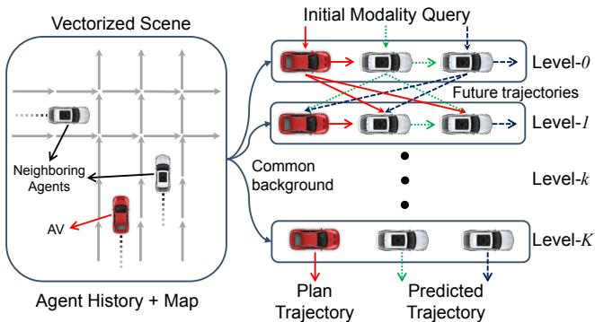
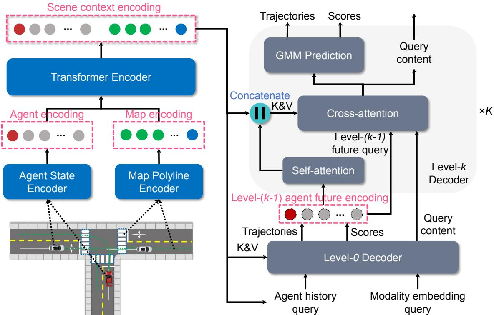
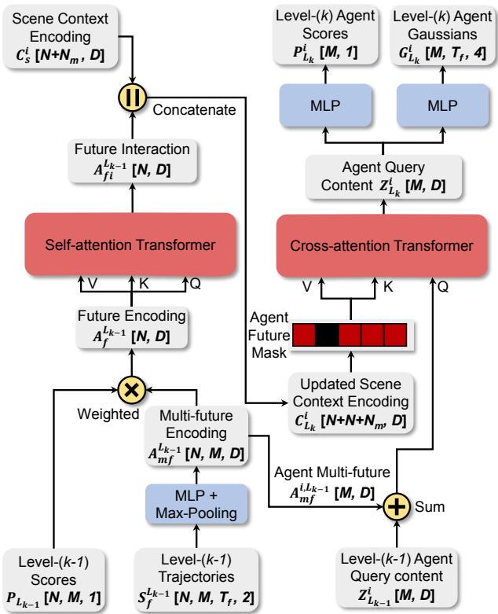
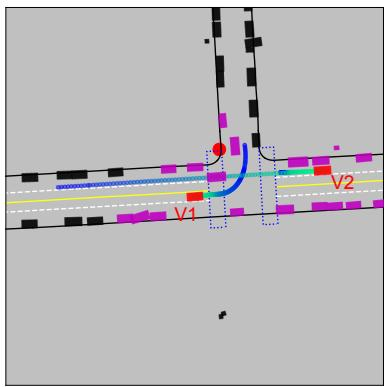
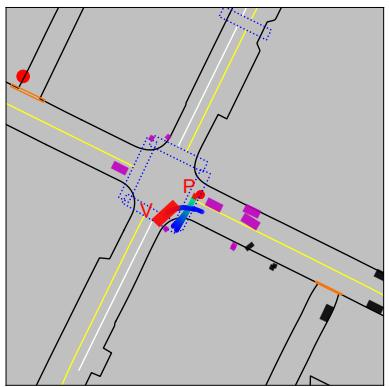
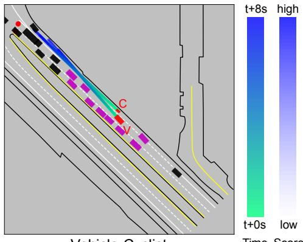
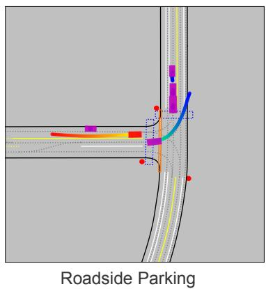
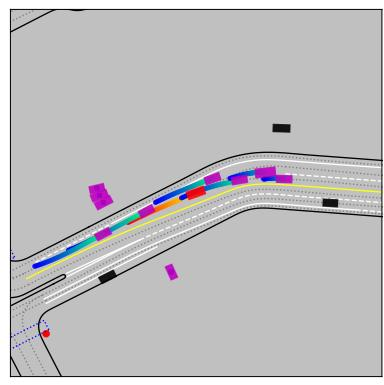
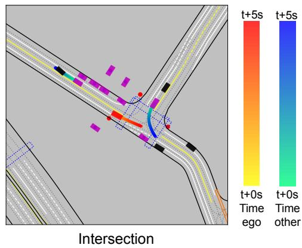

# GameFormer: Game-theoretic Modeling and Learning of Transformer-based Interactive Prediction and Planning for Autonomous Driving

Zhiyu Huang†, Haochen Liu†, Chen Lv∗ Nanyang Technological University, Singapore † Equal contribution {zhiyu001,haochen002}@e.ntu.edu.sg ∗ Corresponding author lyuchen@ntu.edu.sg

## Abstract

Autonomous vehicles operating in complex real-world environments require accurate predictions ofinteractive behaviors between traffic participants. This paper tackles the interaction prediction problem by formulating it with hierarchical game theory and proposing the GameFormer model for its implementation. The model incorporates a Transformer encoder, which effectively models the relationships between scene elements, alongside a novel hierarchical Transformer decoder structure. At each decoding level, the decoder utilizes the prediction outcomesfrom the previous level, in addition to the shared environmental context, to iteratively refine the interaction process. Moreover, we propose a learning process that regulates an agent’s behavior at the current level to respond to other agents’ behaviors from the preceding level. Through comprehensive experiments on large-scale real-world driving datasets, we demonstrate the state-of-the-art accuracy of our model on the Waymo interaction prediction task. Additionally, we validate the model’s capacity to jointly reason about the motion plan of the ego agent and the behaviors of multiple agents in both open-loop and closed-loop planning tests, outperforming various baseline methods. Furthermore, we evaluate the efficacy of our model on the nuPlan planning benchmark, where it achieves leading performance. Project website: https://mczhi.github.io/GameFormer/

## 1. Introduction

Accurately predicting the future behaviors of surrounding traffic participants and making safe and sociallycompatible decisions are crucial for modern autonomous driving systems. However, this task is highly challenging due to the complexities arising from road structures, traffic norms, and interactions among road users [14, 23, 24]. In recent years, deep neural network-based approaches have shown remarkable advancements in prediction accuracy and scalability [7, 11, 15, 22, 40]. In particular, Transformers have gained prominence in motion prediction [25,31,32,35,

  
Figure 1. Hierarchical game theoretic modeling of agent interactions. The historical states of agents and maps are encoded as background information; a level-0 agent’s future is predicted independently based on the initial modality query; a level-k agent responds to all other level-(k − 1) agents.

45, 47] because of their flexibility and effectiveness in processing heterogeneous information from the driving scene, as well as their ability to capture interrelationships among the scene elements.

Despite the success of existing prediction models in encoding the driving scene and representing interactions through agents’ past trajectories, they often fail to explicitly model agents’ future interactions and their interaction with the autonomous vehicle (AV). This limitation results in a passive reaction from the AV’s planning module to the prediction results. However, in critical situations such as merge, lane change, and unprotected left turn, the AV needs to proactively coordinate with other agents. Therefore, joint prediction and planning are necessary for achieving more interactive and human-like decision-making. To address this, a typical approach is the recently-proposed conditional prediction model [17,34,36,37,39], which utilizes the AV’s internal plans to forecast other agents’ responses to the AV. Although the conditional prediction model mitigates the interaction issue, such a one-way interaction still neglects the dynamic mutual influences between the AV and other road users. From a game theory perspective, the current prediction/planning models can be regarded as leader-follower games with limited levels of interaction among agents.

In this study, we utilize a hierarchical game-theoretic framework (level-k game theory) [5, 42] to model the interactions among various agents [27, 28, 41] and introduce a novel Transformer-based prediction model named Game-Former. Stemming from insights in cognitive science, levelk game theory offers a structured approach to modeling interactions among agents. At its core, the theory introduces a hierarchy of reasoning depths denoted by k. A level-0 agent acts independently without considering the possible actions of other agents. As we move up the hierarchy, a level-1 agent considers interactions by assuming that other agents are level-0 and predicts their actions accordingly. This process continues iteratively, where a level-k agent predicts others’ actions assuming they are level-(k−1) and responds based on these predictions. Our model aligns with the spirit of level-k game theory by considering agents’ reasoning levels and explicit interactions.

As illustrated in Fig. 1, we initially encode the driving scene into background information, encompassing vectorized maps and observed agent states, using Transformer encoders. In the future decoding stage, we follow the level-k game theory to design the structure. Concretely, we set up a series of Transformer decoders to implement level-k reasoning. The level-0 decoder employs only the initial modality query and encoded scene context as key and value to predict the agent’s multi-modal future trajectories. Then, at each iteration k, the level-k decoder takes as input the predicted trajectories from the level-(k−1) decoder, along with the background information, to predict the agent’s trajectories at the current level. Moreover, we design a learning process that regulates the agents’ trajectories to respond to the trajectories of other agents from the previous level while also staying close to human driving data. The main contributions of this paper are summarized as follows:

1. We propose GameFormer, a Transformer-based interactive prediction and planning framework. The model employs a hierarchical decoding structure to capture agent interactions, iteratively refine predictions, and is trained based on the level-k game formalism.

2. We demonstrate the state-of-the-art prediction performance of our GameFormer model on the Waymo interaction prediction benchmark.

3. We validate the planning performance of the Game-Former framework in open-loop driving scenes and closed-loop simulations using the Waymo open motion dataset and the nuPlan planning benchmark.

## 2. Related Work

## 2.1. Motion Prediction for Autonomous Driving

Neural network models have demonstrated remarkable effectiveness in motion prediction by encoding contextual scene information. Early studies utilize long short-term memory (LSTM) networks [1] to encode the agent’s past states and convolutional neural networks (CNNs) to process the rasterized image of the scene [7, 12, 21, 34]. To model the interaction between agents, graph neural networks (GNNs) [4, 13, 20, 30] are widely used for representing agent interactions via scene or interaction graphs. More recently, the unified Transformer encoder-decoder structure for motion prediction has gained popularity, e.g., Scene-Transformer [32] and WayFormer [31], due to their compact model description and superior performance. However, most Transformer-based prediction models focus on the encoding part, with less emphasis on the decoding part. Motion Transformer [35] addresses this limitation by proposing a well-designed decoding stage that leverages iterative local motion refinement to enhance prediction accuracy. Inspired by iterative refinement and hierarchical game theory, our approach introduces a novel Transformer-based decoder for interaction prediction, providing an explicit way to model the interactions between agents.

Regarding the utilization of prediction models for planning tasks, numerous works focus on multi-agent joint motion prediction frameworks [14, 24, 30, 38] that enable efficient and consistent prediction of multi-modal multi-agent trajectories. An inherent issue in existing motion prediction models is that they often ignore the influence of the AV’s actions, rendering them unsuitable for downstream planning tasks. To tackle this problem, several conditional multiagent motion prediction models [8, 17, 36] have been proposed by integrating AV planning information into the prediction process. However, these models still exhibit oneway interactions, neglecting the mutual influence among agents. In contrast, our approach aims to jointly predict the future trajectories of surrounding agents and facilitate AV planning through iterative mutual interaction modeling.

## 2.2. Learning for Decision-making

The primary objective of the motion prediction module is to enable the planning module to make safe and intelligent decisions. This can be achieved through the use of offline learning methods that can learn decision-making policies from large-scale driving datasets. Imitation learning stands as the most prevalent approach, which aims to learn a driving policy that can replicate expert behaviors [19, 44]. Offline reinforcement learning [26] has also gained interest as it combines the benefits of reinforcement learning and large collected datasets. However, direct policy learning lacks interpretability and safety assurance, and often suffers from distributional shifts. In contrast, planning with a learned motion prediction model is believed to be more interpretable and robust [3, 6, 18, 46], making it a more desirable way for autonomous driving. Our proposed approach aims to enhance the capability of prediction models that can improve interactive decision-making performance.

  
Figure 2. Overview of our proposed GameFormer framework. The scene context encoding is obtained via a Transformer-based encoder; the level-0 decoder takes the modality embedding and agent history encodings as query and outputs level-0 future trajectories and scores; the level-k decoder uses a self-attention module to model the level-(k − 1) future interaction and append it to the scene context encoding.

## 3. GameFormer

We introduce our interactive prediction and planning framework, called GameFormer, which adopts the Transformer encoder-decoder architecture (see Fig. 2). In the following sections, we first define the problem and discuss the level-k game theory that guides the design of the model and learning process in Sec. 3.1. We then describe the encoder component of the model, which encodes the scene context, in Sec. 3.2, and the decoder component, which incorporates a novel interaction modeling concept, in Sec. 3.3. Finally, we present the learning process that accounts for interactions among different reasoning levels in Sec. 3.4.

## 3.1. Game-theoretic Formulation

We consider a driving scene with N agents, where the AV is denoted as $A _ { 0 }$ and its neighboring agents as $A _ { 1 } , \cdots , A _ { N - 1 }$ at the current time $t \ = \ 0 .$ Given the historical states of all agents (including the AV) over an observation horizon $T _ { h } , \mathbf { \check { S } } = \{ \mathbf { s } _ { i } ^ { - T _ { h } : 0 } \}$ , as well as the map information M including traffic lights and road waypoints, the goal is to jointly predict the future trajectories of neighboring agents $\mathbf { Y } _ { 1 : N - : } ^ { 1 : \bar { T } _ { f } }$ over the future horizon $T _ { f } .$ as well as a planned trajectory for the AV ${ \bf Y } _ { 0 } ^ { 1 : T _ { f } }$ . In order to capture the uncertainty, the results are multi-modal future trajectories for the AV and neighboring agents, denoted by $\mathbf { \check { Y } } _ { i } ^ { 1 : T _ { f } } = \{ \mathbf { y } _ { j } ^ { 1 : T _ { f } } , p _ { j } | j = 1 : \check { M } \}$ , where $\mathbf { \bar { y } } _ { j } ^ { 1 : T _ { f } }$ is a sequence of predicted states, $p _ { j }$ the probability of the trajectory, and M the number of modalities.

We leverage level-k game theory to model agent interactions in an iterative manner. Instead of simply predicting a single set of trajectories, we predict a hierarchy of trajectories to model the cognitive interaction process. At each reasoning level, with the exception of level-0, the decoder takes as input the prediction results from the previous level, which effectively makes them a part of the scene, and estimates the responses of agents in the current level to other agents in the previous level. We denote the predicted multi-modal trajectories (essentially a Gaussian mixture model) of agent i at reasoning level k as $\pi _ { i } ^ { ( k ) }$ , which can be regarded as a policy for that agent. The policy $\pi _ { i } ^ { ( k ) }$ is conditioned on the policies of all other agents except the i-th agent at level-(k − 1), denoted by $\pi _ { \lnot i } ^ { ( k - \bar { 1 } ) }$ . For instance, the AV’s policy at level-2 $\pi _ { 0 } ^ { ( 2 ) }$ would take into account all neighboring agents’ policies at level-1 $\pi _ { 1 : N - 1 } ^ { ( 1 ) }$ Formally, the i-th agent’s level-k policy is set to optimize the following objective:

$$
\operatorname* { m i n } _ { \pi _ { i } } \mathcal { L } _ { i } ^ { k } \left( \pi _ { i } ^ { ( k ) } \mid \pi _ { \neg i } ^ { ( k - 1 ) } \right) ,\tag{1}
$$

where $\mathcal { L } ( \cdot )$ is the loss (or cost) function. It is important to note that policy π here represents the multi-modal predicted trajectories (GMM) of an agent and that the loss function is calculated on the trajectory level.

For the level-0 policies, they do not take into account probable actions or reactions of other agents and instead behave independently. Based on the level-k game theory framework, we design the future decoder, which we elaborate upon in Section 3.3.

## 3.2. Scene Encoding

Input representation. The input data comprises historical state information of agents, $\dot { S _ { p } } \in \mathbb { R } ^ { N \times T _ { h } \times \dot { d } _ { s } }$ , where $d _ { s }$ represents the number of state attributes, and local vectorized map polylines $M \in \mathbb { R } ^ { N \times N _ { m } \times N _ { p } \times d _ { p } }$ . For each agent, we find $N _ { m }$ nearby map elements such as routes and crosswalks, each containing $N _ { p }$ waypoints with $d _ { p }$ attributes. The inputs are normalized according to the state of the ego agent, and any missing positions in the tensors are padded with zeros.

Agent History Encoding. We use LSTM networks to encode the historical state sequence $S _ { p }$ for each agent, resulting in a tensor $A _ { p } \in \mathbb { R } ^ { \hat { N } \times D }$ , which contains the past features of all agents. Here, D denotes the hidden feature dimension.

Vectorized Map Encoding. To encode the local map polylines of all agents, we use the multi-layer perceptron (MLP) network, which generates a map feature tensor $M _ { p } \in \mathbb { R } ^ { N \times N _ { m } \times N _ { p } \times D }$ with a feature dimension of $D$ . We then group the waypoints from the same map element and use max-pooling to aggregate their features, reducing the number of map tokens. The resulting map feature tensor is reshaped into $\mathbf { \bar { \boldsymbol { M } } } _ { r } \in \mathbb { R } ^ { N \times N _ { m r } \times D }$ , where $N _ { m r }$ represents the number of aggregated map elements.

Relation Encoding. We concatenate the agent features and their corresponding local map features to create an agent-wise scene context tensor $C ^ { i } = [ A _ { p } , M _ { p } ^ { i } ] \in$ ${ \mathbb R } ^ { ( N + N _ { m r } ) \times D }$ for each agent. We use a Transformer encoder with E layers to capture the relationships among all the scene elements in each agent’s context tensor $C ^ { i }$ . The Transformer encoder is applied to all agents, generating a final scene context encoding $C _ { s } \in \mathbb { R } ^ { N \times ( N + \sqrt { m } r ) \times D }$ , which represents the common environment background inputs for the subsequent decoder network.

## 3.3. Future Decoding with Level-k Reasoning

Modality embedding. To account for future uncertainties, we need to initialize the modality embedding for each possible future, which serves as the query to the level-0 decoder. This can be achieved through either a heuristicsbased method, learnable initial queries [31], or through a data-driven method [35]. Specifically, a learnable initial modality embedding tensor $\dot { I } \in \mathbb { R } ^ { N \times M \times D }$ is generated, where M represents the number of future modalities.

Level-0 Decoding. In the level-0 decoding layer, a multi-head cross-attention Transformer module is utilized, which takes as input the combination of the initial modality embedding I and the agent’s historical encoding in the final scene context $C _ { s , A _ { p } }$ (by inflating a modality axis), resulting in $( C _ { s , A _ { p } } + I ) \stackrel { \scriptscriptstyle ^ { p } } { \in } \mathbb { R } ^ { N \times M \times D }$ as the query and the scene context encoding $C _ { s }$ as the key and value. The attention is applied to the modality axis for each agent, and the query content features can be obtained after the attention layer as $Z _ { L _ { 0 } } ~ \in ~ \mathbb { R } ^ { N \times M \times D }$ . Two MLPs are appended to the query content features $Z _ { L _ { 0 } }$ to decode the GMM components of predicted futures $G _ { L _ { 0 } } ^ { \mathrm { ~ ~ } } \in \mathrm { ~ \mathbb { R } ^ { { N } \times { M } \times { T } _ { f } \times { 4 } } ~ }$ (corresponding to $( \mu _ { x } , \mu _ { y } , \log \sigma _ { x }$ , log $\sigma _ { y } )$ at every timestep) and the scores of these components $\mathbf { \bar { \mathit { P } } } _ { L _ { 0 } } \in \mathbb { R } ^ { \mathit { N } \times \mathit { \bar { M } } \times 1 }$

  
Figure 3. The detailed structure of a level-k interaction decoder.

Interaction Decoding. The interaction decoding stage contains K decoding layers corresponding to $K$ reasoning levels. In the level-k layer $( k \ \geq \ 1 )$ , it receives all agents’ trajectories from the level-(k − 1) layer $S _ { f } ^ { L _ { k - 1 } } \in$ $\mathbb { R } ^ { N \times M \times T _ { f } \times 2 }$ (the mean values of the GMM $G _ { L _ { k - 1 } } )$ and use an MLP with max-pooling on the time axis to encode the trajectories, resulting in a tensor of agent multi-modal future trajectory encoding $A _ { m f } ^ { L _ { k - 1 } } \in \mathbb { R } ^ { N \times M \times D }$ . Then, we apply weighted-average-pooling on the modality axis with the predicted scores from the level- $( k - 1 )$ layer $P _ { L _ { k - 1 } }$ to obtain the agent future features $A _ { f } ^ { L _ { k - 1 } } \in \mathbb { R } ^ { N \times D }$ . We use a multi-head self-attention Transformer module to model the interactions between agent future trajectories $A _ { f i } ^ { L _ { k - 1 } }$ and concatenate the resulting interaction features with the scene context encoding from the encoder part. This yields an updated scene context encoding for agent i, denoted by ${ C } _ { L _ { k } } ^ { i } =$ $[ A _ { f i } ^ { L _ { k - 1 } } , C _ { s } ^ { i } ] \ \in \ \mathbb { R } ^ { ( N + N _ { m } + N ) \times D }$ We adopt a multi-head cross-attention Transformer module with the query content features from the level-(k − 1) layer $Z _ { L _ { k - 1 } } ^ { i }$ and agent future features $A _ { m f } ^ { L _ { k - 1 } } , ( Z _ { L _ { k - 1 } } ^ { i } + A _ { m f } ^ { i , L _ { k - 1 } } ) \in \mathbb { R } ^ { M \times D }$ as query and the updated scene context encoding $C _ { L _ { k } } ^ { i }$ as key and value. We use a masking strategy to prevent an agent from accessing its own future information from the last layer. For example, agent $A _ { 0 }$ can only get access to the future interaction features of other agents $\{ A _ { 1 } , \cdot \cdot \cdot , A _ { N - 1 } \}$ . Finally, the resulting query content tensor from the cross-attention module $Z _ { L _ { k } } ^ { i }$ is passed through two MLPs to decode the agent’s GMM components and scores, respectively. Fig. 3 illustrates the detailed structure of a level-k interaction decoder. Note that we share the level-k decoder for all agents to generate multi-agent trajectories at that level. At the final level of interaction decoding, we can obtain multi-modal trajectories for the AV and neighboring agents $G _ { L _ { K } }$ , as well as their scores $P _ { L _ { K } }$

## 3.4. Learning Process

We present a learning process to train our model using the level-k game theory formalism. First, we employ imitation loss as the primary loss to regularize the agent’s behaviors, which can be regarded as a surrogate for factors such as traffic regulations and driving styles. The future behavior of an agent is modeled as a Gaussian mixture model (GMM), where each mode m at time step t is described by a Gaussian distribution over the $( x , y )$ coordinates, characterized by mean $\mu _ { m } ^ { t }$ and covariance $\boldsymbol { \sigma } _ { m } ^ { t }$ . The imitation loss is computed using the negative log-likelihood loss from the best-predicted component $m ^ { * }$ (closest to the ground truth) at each timestep, as formulated:

$$
\mathcal { L } _ { I L } = \sum _ { t = 1 } ^ { T _ { f } } \mathcal { L } _ { N L L } \big ( \mu _ { m ^ { * } } ^ { t } , \sigma _ { m ^ { * } } ^ { t } , p _ { m * } , \mathbf { s } _ { t } \big ) .\tag{2}
$$

The negative log-likelihood loss function $\mathcal { L } _ { N L L }$ is defined as follows:

$$
\mathcal { L } _ { N L L } = \log \sigma _ { x } + \log \sigma _ { y } + \frac { 1 } { 2 } \left( \left( \frac { d x } { \sigma _ { x } } \right) ^ { 2 } + \left( \frac { d x } { \sigma _ { x } } \right) ^ { 2 } \right) - \log ( p _ { m * } ) ,\tag{3}
$$

where $d _ { x } = \mathbf { s } _ { x } - \mu _ { x }$ and $d _ { y } = \mathbf { s } _ { y } - \mu _ { y } , ( \mathbf { s } _ { x } , \mathbf { s } _ { y } )$ is groundtruth position; $p _ { m * }$ is the probability of the selected component, and we use the cross-entropy loss in practice.

For a level-k agent $A _ { i } ^ { ( k ) }$ , we design an auxiliary loss function inspired by prior works [4, 16, 29] that considers the agent’s interactions with others. The safety of agent interactions is crucial, and we use an interaction loss (applicable only to decoding levels $k \geq 1 )$ to encourage the agent to avoid collisions with the possible future trajectories of other level- $( k - 1 )$ agents. Specifically, we use a repulsive potential field in the interaction loss to discourage the agent’s future trajectories from getting too close to any possible trajectory of any other level- $\cdot ( k - 1 )$ agent $A _ { \lnot i } ^ { ( k - 1 ) }$ The interaction loss is defined as follows:

$$
\mathcal { L } _ { I n t e r } = \sum _ { m = 1 } ^ { M } \sum _ { t = 1 } ^ { T _ { f } } \operatorname* { m a x } _ { \forall j \neq i } \frac { 1 } { d \left( \hat { \mathbf { s } } _ { m , t } ^ { ( i , k ) } , \hat { \mathbf { s } } _ { n , t } ^ { ( j , k - 1 ) } \right) + 1 } ,\tag{4}
$$

where $d ( \cdot , \cdot )$ is the $L _ { 2 }$ distance between the future states $( ( x , y )$ positions), m is the mode of the agent i, n is the mode of the level- $( k - 1 )$ agent j. To ensure activation of the repulsive force solely within close proximity, a safety margin is introduced, meaning the loss is only applied to interaction pairs with distances smaller than a threshold.

The total loss function for the level-k agent i is the weighted sum of the imitation loss and interaction loss.

$$
\mathcal { L } _ { i } ^ { k } ( \pi _ { i } ^ { ( k ) } ) = w _ { 1 } \mathcal { L } _ { I L } ( \pi _ { i } ^ { ( k ) } ) + w _ { 2 } \mathcal { L } _ { I n t e r } ( \pi _ { i } ^ { ( k ) } , \pi _ { \neg i } ^ { ( k - 1 ) } ) ,\tag{5}
$$

where $w _ { 1 }$ and w2 are the weighting factors to balance the influence of the two loss terms.

## 4. Experiments

## 4.1. Experimental Setup

Dataset. We set up two different model variants for different evaluation purposes. The prediction-oriented model is trained and evaluated using the Waymo open motion dataset (WOMD) [9], specifically addressing the task of predicting the joint trajectories of two interacting agents. For the planning tasks, we train and test the models on both WOMD with selected interactive scenarios and the nuPlan dataset [2] with a comprehensive evaluation benchmark.

Prediction-oriented model. We adopt the setting of the WOMD interaction prediction task, where the model predicts the joint future positions of two interacting agents 8 seconds into the future. The neighboring agents within the scene will serve as the background information in the encoding stage, while only the two labeled interacting agents joint future trajectories are predicted. The model is trained on the entire WOMD training dataset, and we employ the official evaluation metrics, which include minimum average displacement error (minADE), minimum final displacement error (minFDE), miss rate, and mean average precision (mAP). We investigate two different prediction model settings. Firstly, we consider the joint prediction setting, where only $M = 6$ joint trajectories of the two agents are predicted [32]. Secondly, we examine the marginal prediction setting and train our model to predict $M = 6 4$ marginal trajectories for each agent in the interaction pair. During inference, the EM method proposed in MultiPath++ [40] is employed to generate a set of 6 marginal trajectories for each agent, from which the top 6 joint predictions are selected for these two agents.

Planning-oriented model. We introduce another model variant designed for planning tasks. Specifically, this variant takes into account multiple neighboring agents around the AV and predicts their future trajectories. The model is trained and tested across two datasets: WOMD and nu-Plan. For WOMD, we randomly select 10,000 20-second scenarios, where 9,000 of them are used for training and the remaining 1,000 for validation. Then, we evaluate the model’s joint prediction and planning performance on 400 9-second interactive and dynamic scenarios (e.g., lanechange, merge, and left-turn) in both open-loop and closedloop settings. To conduct closed-loop testing, we utilize a log-replay simulator [18] to replay the original scenarios involving other agents, with our planner taking control of the AV. In open-loop testing, we employ distance-based error metrics, which include planning ADE, collision rate, miss rate, and prediction ADE. In closed-loop testing, we focus on evaluating the planner’s performance in a realistic driving context by measuring metrics including success rate (no collision or off-route), progress along the route, longitudinal acceleration and jerk, lateral acceleration, and position errors. For the nuPlan dataset, we design a comprehensive planning framework and adhere to the nuPlan challenge settings to evaluate the planning performance. Specifically, we evaluate the planner’s performance in three tasks: open-loop planning, closed-loop planning with non-reactive agents, and closed-loop with reactive agents. These tasks are evaluated using a comprehensive set of metrics provided by the nuPlan platform, and an overall score is derived based on these tasks. More information about our models is provided in the supplementary material.

## 4.2. Main Results

## 4.2.1 Interaction Prediction

Within the prediction-oriented model, we use a stack of $E = 6$ Transformer encoder layers, and the hidden feature dimension is set to $D = 2 5 6$ . We consider 20 neighboring agents around the two interacting agents as background information and employ $K = 6$ decoding layers. The model only generates trajectories for the two labeled interacting agents. Moreover, the local map elements for each agent comprise possible lane polylines and crosswalk polylines.

Quantitative results. Table 1 summarizes the prediction performance of our model in comparison with state-ofthe-art methods on the WOMD interaction prediction (joint prediction of two interacting agents) benchmark. The metrics are averaged over different object types (vehicle, pedestrian, and cyclist) and evaluation times (3, 5, and 8 seconds). Our joint prediction model (GameFormer (J, M=6)) outperforms existing methods in terms of position errors. This can be attributed to its superior ability to capture future interactions between agents through an iterative process and to predict future trajectories in a scene-consistent manner. However, the scoring performance of the joint model is limited without predicting an over-complete set of trajectories and aggregation. To mitigate this issue, we employ the marginal prediction model (GameFormer (M, M=64)) with EM aggregation, which significantly improves the scoring performance (better mAP metric). The overall performance of our marginal model is comparable to that of the ensemble and more complicated MTR model [35]. Nevertheless, it is worth noting that marginal ensemble models may not be practical for real-world applications due to their substantial computational burden. Therefore, we utilize the joint prediction model, which provides better prediction accuracy and computational efficiency, for planning tests.

Table 1. Comparison with state-of-the-art models on the WOMD interaction prediction benchmark
<table><tr><td>Model</td><td>minADE (↓)</td><td>minFDE (↓)</td><td>Miss rate (↓)</td><td>mAP (↑)</td></tr><tr><td>LSTM baseline [9]</td><td>1.9056</td><td>5.0278</td><td>0.7750</td><td>0.0524</td></tr><tr><td>Heat [30]</td><td>1.4197</td><td>3.2595</td><td>0.7224</td><td>0.0844</td></tr><tr><td>AIR2 [43]</td><td>1.3165</td><td>2.7138</td><td>0.6230</td><td>0.0963</td></tr><tr><td>SceneTrans [32]</td><td>0.9774</td><td>2.1892</td><td>0.4942</td><td>0.1192</td></tr><tr><td>DenseTNT [15]</td><td>1.1417</td><td>2.4904</td><td>0.5350</td><td>0.1647</td></tr><tr><td>M2I [37]</td><td>1.3506</td><td>2.8325</td><td>0.5538</td><td>0.1239</td></tr><tr><td>MTR [35]</td><td>0.9181</td><td>2.0633</td><td>0.4411</td><td>0.2037</td></tr><tr><td>GameFormer (M, M=64)</td><td>0.9721</td><td>2.2146</td><td>0.4933</td><td>0.1923</td></tr><tr><td>GameFormer (J, M=6)</td><td>0.9161</td><td>1.9373</td><td>0.4531</td><td>0.1376</td></tr></table>

Qualitative results. Fig. 4 illustrates the interaction prediction performance of our approach in several typical scenarios. In the vehicle-vehicle interaction scenario, two distinct situations are captured by our model: vehicle 2 accelerates to take precedence at the intersection, and vehicle 2 yields to vehicle 1. In both cases, our model predicts that vehicle 1 creeps forward to observe the actions of vehicle 2 before executing a left turn. In the vehicle-pedestrian scenario, our model predicts that the vehicle will stop and wait for the pedestrian to pass before starting to move. In the vehicle-cyclist interaction scenario, where the vehicle intends to merge into the right lane, our model predicts the vehicle will decelerate and follow behind the cyclist in that lane. Overall, the results manifest that our model can capture multiple interaction patterns of interacting agents and accurately predict their possible joint futures.

## 4.2.2 Open-loop Planning

We first conduct the planning tests in selected WOMD scenarios with a prediction/planning horizon of 5 seconds. The model uses a stack of $E = 6$ Transformer encoder layers, and we consider 10 neighboring agents closest to the ego vehicle to predict $M = 6$ joint future trajectories for them.

Determining the decoding levels. To determine the optimal reasoning levels for planning, we analyze the impact of decoding layers on open-loop planning performance, and the results are presented in Table 2. Although the planning ADE and prediction ADE exhibit a slight decrease with additional decoding layers, the miss rate and collision rate are at their lowest when the decoding level is 4. The intuition behind this observation is that humans are capable of performing only a limited depth of reasoning, and the optimal iteration depth empirically appears to be 4 in this test.

  
Vehicle-Vehicle

  
Vehicle-Pedestrian

  
Vehicle-Cyclist  
Figure 4. Qualitative results of the proposed method in interaction prediction (multi-modal joint prediction of two interacting agents). The red boxes are interacting agents to predict and the magenta boxes are background neighboring agents.

  
Merge

  
Figure 5. Qualitative results of the proposed method in open-loop planning. The red box is the AV and the magenta boxes are its neighboring agents; the red trajectory is the plan of the AV and the blue ones are the predictions of neighboring agents.

Table 2. Influence of decoding levels on open-loop planning
<table><tr><td>Level</td><td>Planning ADE</td><td>Collision Rate</td><td>Miss Rate</td><td>Prediction ADE</td></tr><tr><td>0</td><td>0.9458</td><td>0.0384</td><td>0.1154</td><td>1.0955</td></tr><tr><td>1</td><td>0.8846</td><td>0.0305</td><td>0.0994</td><td>0.9377</td></tr><tr><td>2</td><td>0.8529</td><td>0.0277</td><td>0.0897</td><td>0.8875</td></tr><tr><td>3</td><td>0.8423</td><td>0.0269</td><td>0.0816</td><td>0.8723</td></tr><tr><td>4</td><td>0.8329</td><td>0.0198</td><td>0.0753</td><td>0.8527</td></tr><tr><td>5</td><td>0.8171</td><td>0.0245</td><td>0.0777</td><td>0.8361</td></tr><tr><td>6</td><td>0.8208</td><td>0.0238</td><td>0.0826</td><td>0.8355</td></tr></table>

Quantitative results. Our joint prediction and planning model employs 4 decoding layers, and the results of the final decoding layer (the most-likely future evaluated by the trained scorer) are utilized as the plan for the AV and predictions for other agents. We set up some imitation learningbased planning methods as baselines, which are: 1) vanilla imitation learning (IL), 2) deep imitative model (DIM) [33], 3) MultiPath++ [40] (which predicts multi-modal trajectories for the ego agent), 4) MTR-e2e (end-to-end variant with learnable motion queries) [35], and 5) differentiable integrated prediction and planning (DIPP) [18]. Table 3 reports the open-loop planning performance of our model in comparison with the baseline methods. The results reveal that our model performs significantly better than vanilla IL and DIM, because they are just trained to output the ego’s trajectory while not explicitly predicting other agents’ future behaviors. Compared to performant motion prediction models (MultiPath++ and MTR-e2e), our model also shows better planning metrics for the ego agent. Moreover, our model outperforms DIPP (a joint prediction and planning method) in both planning and prediction metrics, especially the collision rate. These results emphasize the advantage of our model, which explicitly considers all agents’ future behaviors and iteratively refines the interaction process.

Qualitative results. Fig. 5 displays qualitative results of our model’s open-loop planning performance in complex driving scenarios. For clarity, only the most-likely trajectories of the agents are displayed. These results demonstrate that our model can generate a plausible future trajectory for the AV and handle diverse interaction scenarios, and predictions of the surrounding agents enhance the interpretability of our planning model’s output.

Table 3. Evaluation of open-loop planning performance in selected WOMD scenarios
<table><tr><td rowspan=1 colspan=1>Method</td><td rowspan=1 colspan=1>Collision rate (%)</td><td rowspan=1 colspan=1>Miss rate (%)</td><td rowspan=1 colspan=1>Planning error (m)@1s    $@ 3 \mathrm { s }$     $@ 5 \mathrm { s }$ </td><td rowspan=1 colspan=1>Prediction error (m)ADE      FDE</td></tr><tr><td rowspan=1 colspan=1>Vanilla IL</td><td rowspan=1 colspan=1>4.25</td><td rowspan=1 colspan=1>15.61</td><td rowspan=1 colspan=1>0.216  1.273  3.175</td><td rowspan=1 colspan=1></td></tr><tr><td rowspan=1 colspan=1>DIM</td><td rowspan=1 colspan=1>4.96</td><td rowspan=1 colspan=1>17.68</td><td rowspan=1 colspan=1>0.483  1.869  3.683</td><td rowspan=1 colspan=1>一</td></tr><tr><td rowspan=2 colspan=1>MultiPath++MTR-e2e</td><td rowspan=1 colspan=1>2.86</td><td rowspan=1 colspan=1>8.61</td><td rowspan=1 colspan=1>0.146  0.948  2.719</td><td rowspan=2 colspan=1></td></tr><tr><td rowspan=1 colspan=1>2.32</td><td rowspan=1 colspan=1>8.88</td><td rowspan=1 colspan=1>0.141  0.888  2.698</td></tr><tr><td rowspan=1 colspan=1>DIPP</td><td rowspan=1 colspan=1>2.33</td><td rowspan=1 colspan=1>8.44</td><td rowspan=1 colspan=1>0.135  0.928  2.803</td><td rowspan=1 colspan=1>0.925     2.059</td></tr><tr><td rowspan=1 colspan=1>Ours</td><td rowspan=1 colspan=1>1.98</td><td rowspan=1 colspan=1>7.53</td><td rowspan=1 colspan=1>0.129  0.836  2.451</td><td rowspan=1 colspan=1>0.853     1.919</td></tr></table>

Table 4. Evaluation of closed-loop planning performance in selected WOMD scenarios
<table><tr><td rowspan="2">Method</td><td rowspan="2">Success rate (%)</td><td rowspan="2">Progress (m)</td><td rowspan="2"> $_ { \mathrm { A c c e l e r a t i o n } }$   $( m / s ^ { 2 } )$ </td><td rowspan="2"> $\operatorname { J e r k }$   $( m / s ^ { 3 } )$ </td><td rowspan="2"> $\operatorname { L a t e r a l } \operatorname { a c c } .$   $( m / s ^ { 2 } )$ </td><td colspan="3">Position error to expert driver (m)</td></tr><tr><td>@3s</td><td>@5s</td><td>@8s</td></tr><tr><td>Vanilla IL</td><td>0</td><td>6.23</td><td>1.588</td><td>16.24</td><td>0.661</td><td>9.355</td><td>20.52</td><td>46.33</td></tr><tr><td>RIP</td><td>19.5</td><td>12.85</td><td>1.445</td><td>14.97</td><td>0.355</td><td>7.035</td><td>17.13</td><td>38.25</td></tr><tr><td>CQL</td><td>10</td><td>8.28</td><td>3.158</td><td>25.31</td><td>0.152</td><td>10.86</td><td>21.18</td><td>40.17</td></tr><tr><td>DIPP</td><td> $6 8 . 1 2 { \pm } 5 . 5 1 $ </td><td> $4 1 . 0 8 { \pm } 5 . 8 8 $ </td><td> $1 . 4 4 { \pm } 0 . 1 8$ </td><td> $1 2 . 5 8 { \pm } 3 . 2 3 $ </td><td> $0 . 3 1 { \pm } 0 . 1 1$ </td><td> $6 . 2 2 { \pm } 0 . 5 2$ </td><td> $1 5 . 5 5 { \pm } 1 . 1 2 $ </td><td> $2 6 . 1 0 { \scriptstyle \pm 3 . 8 8 }$ </td></tr><tr><td>Ours</td><td> $7 3 . 1 6 { \pm } 6 . 1 4$ </td><td> $4 4 . 9 4 { \pm } 7 . 6 9$ </td><td> $1 . 1 9 2 0 . 1 5$ </td><td> $1 3 . 6 3 { \pm } 2 . 8 8 $ </td><td> $0 . 3 2 { \pm } 0 . 0 9$ </td><td> $5 . 8 9 { \pm } 0 . 7 8 $ </td><td> $1 2 . 4 3 { \pm } 0 . 5 1 $ </td><td> $2 1 . 0 2 { \pm } 2 . 4 8$ </td></tr><tr><td>DIPP (w/ refinement)</td><td> $9 2 . 1 6 { \pm } 0 . 6 2 $ </td><td> $5 1 . 8 5 { \pm } 0 . 1 4$ </td><td> $0 . 5 8 { \pm } 0 . 0 3$ </td><td> $1 . 5 4 { \pm } 0 . 1 9$ </td><td> $0 . 1 1 { \pm } 0 . 0 1$ </td><td> $2 . 2 6 { \pm } 0 . 1 0$ </td><td> $5 . 5 5 { \pm } 0 . 2 4 $ </td><td> $1 2 . 5 3 { \pm } 0 . 4 8 $ </td></tr><tr><td>Ours (w/ refinement)</td><td> $\mathbf { 9 4 . 5 0 { \scriptstyle \pm 0 . 6 6 } }$ </td><td> ${ \pm 2 . 6 7 \pm 0 . 3 3 }$ </td><td> $\mathbf { 0 . 5 3 \pm 0 . 0 2 }$ </td><td> $1 . 5 6 { \pm } 0 . 2 3 $ </td><td> $\mathbf { 0 . 1 0 { \overset { . } { \bot } } 0 . 0 1 }$ </td><td> $2 . 1 1 { \pm } 0 . 2 1 $ </td><td> ${ \bf 4 . 8 7 \pm 0 . 1 8 }$ </td><td> ${ \bf 1 1 . 1 3 \pm 0 . 3 3 }$ </td></tr></table>

## 4.2.3 Closed-loop Planning

## 4.2.4 nuPlan Benchmark Evaluation

We evaluate the closed-loop planning performance of our model in selected WOMD scenarios. Within a simulated environment [18], we execute the planned trajectory generated by the model and update the ego agent’s state at each time step, while other agents follow their logged trajectories from the dataset. Since other agents do not react to the ego agent, the success rate is a lower bound for safety assessment. For planning-based methods (DIPP and our proposed method), we project the output trajectory onto a reference path to ensure the ego vehicle’s adherence to the roadway. Additionally, we employ a cost-based refinement planner [18], which utilizes the initial output trajectory and the predicted trajectories of other agents to explicitly regulate the ego agent’s actions. Our method is compared against four baseline methods: 1) vanilla IL, 2) robust imitative planning (RIP) [10], 3) conservative Q-learning (CQL) [26], and 4) DIPP [18]. We report the means and standard deviations of the planning-based methods over three training runs (models trained with different seeds). The quantitative results of closed-loop testing are summarized in Table 4. The results show that the IL and offline RL methods exhibit subpar performance in the closed-loop test, primarily due to distributional shifts and casual confusion. In contrast, planningbased methods perform significantly better across all metrics. Without the refinement step, our model outperforms DIPP because it captures agent interactions more effectively and thus the raw trajectory is closer to an expert driver. With the refinement step, the planner becomes more robust against training seeds, and our method surpasses DIPP because it can deliver better predictions of agent interactions and provide a good initial plan to the refinement planner.

To handle diverse driving scenarios in the nuPlan platform [2], we develop a comprehensive planning framework GameFormer Planner. It fulfills all important steps in the planning pipeline, including feature processing, path planning, model query, and motion refinement. We increase the prediction and planning horizon to 8 seconds to meet benchmark requirements. The evaluation is conducted over three tasks: open-loop (OL) planning, closed-loop (CL) planning with non-reactive agents, and closed-loop planning with reactive agents. The score for each individual task is calculated using various metrics and scoring functions, and an overall score is obtained by aggregating these task-specific scores. It is important to note that we reduce the size of our model (encoder and decoder layers) due to limited computational resources on the test server. The performance of our model on the nuPlan test benchmark is presented in Table 5, in comparison with other competitive learning-based methods and a rule-based approach (IDM Planner). The results reveal the capability of our planning framework in achieving high-quality planning results across the evaluated tasks. Moreover, the closed-loop visualization results illustrate the ability of our model to facilitate the ego vehicle in making interactive and human-like decisions.

Table 5. Results on the nuPlan planning test benchmark
<table><tr><td>Method</td><td>Overall</td><td>OL</td><td>CL non-reactive</td><td>CL reactive</td></tr><tr><td>Hoplan</td><td>0.8745</td><td>0.8523</td><td>0.8899</td><td>0.8813</td></tr><tr><td>Multi_path</td><td>0.8477</td><td>0.8758</td><td>0.8165</td><td>0.8506</td></tr><tr><td>GameFormer</td><td>0.8288</td><td>0.8400</td><td>0.8087</td><td>0.8376</td></tr><tr><td>Urban Driver</td><td>0.7467</td><td>0.8629</td><td>0.6821</td><td>0.6952</td></tr><tr><td>IDM Planner</td><td>0.5912</td><td>0.2944</td><td>0.7243</td><td>0.7549</td></tr></table>

## 4.3. Ablation Study

Effects of agent future modeling. We investigate the impact of different agent future modeling settings on openloop planning performance in WOMD scenarios. We compare our base model to three ablated models: 1) No future: agent future trajectories from the preceding level are not incorporated in the decoding process at the current level, 2) No self-attention: agent future trajectories are incorporated but not processed through a self-attention module, and 3) No interaction loss: the model is trained without the proposed interaction loss. The results, as presented in Table 6, demonstrate that our game-theoretic approach can significantly improve planning and prediction accuracy. It underscores the advantage of utilizing the future trajectories of agents from the previous level as contextual information for the current level. Additionally, incorporating a self-attention module to represent future interactions among agents improves the accuracy of planning the prediction. Using the proposed interaction loss during training can significantly reduce the collision rate.

Table 6. Influence of future modeling on open-loop planning
<table><tr><td></td><td>Planning ADE</td><td>Collision Rate</td><td>Miss Rate</td><td>Prediction ADE</td></tr><tr><td>No future</td><td>0.9210</td><td>0.0295</td><td>0.0963</td><td>0.9235</td></tr><tr><td>No self-attention</td><td>0.8666</td><td>0.0231</td><td>0.0860</td><td>0.8856</td></tr><tr><td>No interaction loss</td><td>0.8415</td><td>0.0417</td><td>0.0846</td><td>0.8486</td></tr><tr><td>Base</td><td>0.8329</td><td>0.0198</td><td>0.0753</td><td>0.8527</td></tr></table>

Influence of decoder structures. We investigate the influence of decoder structures on the open-loop planning task in WOMD scenarios. Specifically, we examine two ablated models. First, we assess the importance of incorporating k independent decoder layers, as opposed to training a single shared interaction decoder and iteratively applying it k times. Second, we explore the impact of simplifying the decoder into a multi-layer Transformer that does not generate intermediate states. This translates into applying the loss solely to the final decoding layer, rather than all intermediate layers. The results presented in Table 7 demonstrate better open-loop planning performance for the base model (independent decoding layers with intermediate trajectories). This design allows each layer to capture different levels of relationships, thereby facilitating hierarchical modeling. In addition, the omission of intermediate trajectory outputs can degrade the model’s performance, highlighting the necessity of regularizing the intermediate state outputs.

Table 7. Influence of decoder structures on open-loop planning
<table><tr><td></td><td>Planning ADE</td><td>Collision Rate</td><td>Miss Rate</td><td>Prediction ADE</td></tr><tr><td>Base</td><td>0.8329</td><td>0.0198</td><td>0.0753</td><td>0.8547</td></tr><tr><td>Shared decoder</td><td>0.9196</td><td>0.0382</td><td>0.0860</td><td>0.9095</td></tr><tr><td>Multi-layer decoder</td><td>0.9584</td><td>0.0353</td><td>0.0988</td><td>0.9637</td></tr></table>

Ablation results on the interaction prediction task. We investigate the influence of the decoder on the WOMD interaction prediction task. Specifically, we vary the decoding levels from 0 to 8 to determine the optimal decoding level for this task. Moreover, we remove either the agent future encoding part from the decoder or the self-attention module (for modeling agent future interactions) to investigate their influences on prediction performance. We train the ablated models using the same training set and evaluate their performance on the validation set. The results in Table 8 reveal that the empirically optimal number of decoding layers is 6 for the interaction prediction task. It is evident that fewer decoding layers fail to adequately capture the interaction dynamics, resulting in subpar prediction performance. However, using more than 6 decoding layers may introduce training instability and overfitting issues, leading to worse testing performance. Similarly, we find that incorporating predicted agent future information is crucial for achieving good performance, and using selfattention to model the interaction among agents’ futures can also improve prediction accuracy.

Table 8. Decoder ablation results on interaction prediction
<table><tr><td>Decoding layers</td><td>minADE</td><td>minFDE</td><td>Miss Rate</td><td>mAP</td></tr><tr><td>K=0</td><td>1.0505</td><td>2.2905</td><td>0.5113</td><td>0.1226</td></tr><tr><td>K=1</td><td>1.0169</td><td>2.1876</td><td>0.5061</td><td>0.1281</td></tr><tr><td>K=3</td><td>0.9945</td><td>2.1143</td><td>0.5026</td><td>0.1265</td></tr><tr><td>K=6</td><td>0.9133</td><td>1.9251</td><td>0.4564</td><td>0.1339</td></tr><tr><td>K=8</td><td>0.9839</td><td>2.1515</td><td>0.5003</td><td>0.1255</td></tr><tr><td>K=6 w/o future</td><td>0.9862</td><td>2.0848</td><td>0.4979</td><td>0.1256</td></tr><tr><td>K=6 w/o self-attention</td><td>0.9263</td><td>1.9931</td><td>0.4599</td><td>0.1281</td></tr></table>

## 5. Conclusions

This paper introduces GameFormer, a Transformerbased model that utilizes hierarchical game theory for interactive prediction and planning. Our proposed approach incorporates novel level-k interaction decoders in the Transformer prediction model that iteratively refine the future trajectories of interacting agents. We also implement a learning process that regulates the predicted behaviors of agents based on the prediction results from the previous level. Experimental results on the Waymo open motion dataset demonstrate that our model achieves state-of-the-art accuracy in interaction prediction and outperforms baseline methods in both open-loop and closed-loop planning tests. Moreover, our proposed planning framework delivers leading performance on the nuPlan planning benchmark.

## Acknowledgement

This work was supported in part by the A\*STAR AME Young Individual Research Grant (No. A2084c0156), the MTC Individual Research Grants (No.M22K2c0079), the ANR-NRF joint grant (No.NRF2021-NRF-ANR003 HM Science), and the SUG-NAP Grant of Nanyang Technological University, Singapore.

## References

[1] Alexandre Alahi, Kratarth Goel, Vignesh Ramanathan, Alexandre Robicquet, Li Fei-Fei, and Silvio Savarese. Social lstm: Human trajectory prediction in crowded spaces. In Proceedings of the IEEE conference on computer vision and pattern recognition, pages 961–971, 2016. 2

[2] Holger Caesar, Juraj Kabzan, Kok Seang Tan, Whye Kit Fong, Eric Wolff, Alex Lang, Luke Fletcher, Oscar Beijbom, and Sammy Omari. nuplan: A closed-loop ml-based planning benchmark for autonomous vehicles. In CVPR ADP3 workshop, 2021. 5, 8

[3] Sergio Casas, Abbas Sadat, and Raquel Urtasun. Mp3: A unified model to map, perceive, predict and plan. In Proceedings of the IEEE/CVF Conference on Computer Vision and Pattern Recognition, pages 14403–14412, 2021. 2

[4] Yuxiao Chen, Boris Ivanovic, and Marco Pavone. Scept: Scene-consistent, policy-based trajectory predictions for planning. In Proceedings of the IEEE/CVF Conference on Computer Vision and Pattern Recognition, pages 17103– 17112, 2022. 2, 5

[5] Miguel A Costa-Gomes, Vincent P Crawford, and Nagore Iriberri. Comparing models of strategic thinking in van huyck, battalio, and beil’s coordination games. Journal of the European Economic Association, 7(2-3):365–376, 2009. 2

[6] Alexander Cui, Sergio Casas, Abbas Sadat, Renjie Liao, and Raquel Urtasun. Lookout: Diverse multi-future prediction and planning for self-driving. In Proceedings of the IEEE/CVF International Conference on Computer Vision, pages 16107–16116, 2021. 2

[7] Henggang Cui, Vladan Radosavljevic, Fang-Chieh Chou, Tsung-Han Lin, Thi Nguyen, Tzu-Kuo Huang, Jeff Schneider, and Nemanja Djuric. Multimodal trajectory predictions for autonomous driving using deep convolutional networks. In 2019 International Conference on Robotics and Automation (ICRA), pages 2090–2096. IEEE, 2019. 1, 2

[8] Jose Luis Vazquez Espinoza, Alexander Liniger, Wilko Schwarting, Daniela Rus, and Luc Van Gool. Deep interactive motion prediction and planning: Playing games with motion prediction models. In Learning for Dynamics and Control Conference, pages 1006–1019. PMLR, 2022. 2

[9] Scott Ettinger, Shuyang Cheng, Benjamin Caine, Chenx Liu, Hang Zhao, Sabeek Pradhan, Yuning Chai, Ben Sapp, Charles R Qi, Yin Zhou, et al. Large scale interactive motion forecasting for autonomous driving: The waymo open motion dataset. In Proceedings of the IEEE/CVF International Conference on Computer Vision, pages 9710–9719, 2021. 5, 6

[10] Angelos Filos, Panagiotis Tigkas, Rowan McAllister, Nicholas Rhinehart, Sergey Levine, and Yarin Gal. Can autonomous vehicles identify, recover from, and adapt to distribution shifts? In International Conference on Machine Learning, pages 3145–3153. PMLR, 2020. 8

[11] Jiyang Gao, Chen Sun, Hang Zhao, Yi Shen, Dragomir Anguelov, Congcong Li, and Cordelia Schmid. Vectornet: Encoding hd maps and agent dynamics from vectorized representation. In Proceedings of the IEEE/CVF Conference

on Computer Vision and Pattern Recognition, pages 11525– 11533, 2020. 1

[12] Thomas Gilles, Stefano Sabatini, Dzmitry Tsishkou, Bogdan Stanciulescu, and Fabien Moutarde. Home: Heatmap output for future motion estimation. In 2021 IEEE International Intelligent Transportation Systems Conference (ITSC), pages 500–507. IEEE, 2021. 2

[13] Thomas Gilles, Stefano Sabatini, Dzmitry Tsishkou, Bogdan Stanciulescu, and Fabien Moutarde. Gohome: Graphoriented heatmap output for future motion estimation. In 2022 International Conference on Robotics and Automation (ICRA), pages 9107–9114. IEEE, 2022. 2

[14] Thomas Gilles, Stefano Sabatini, Dzmitry Tsishkou, Bogdan Stanciulescu, and Fabien Moutarde. Thomas: Trajectory heatmap output with learned multi-agent sampling. In International Conference on Learning Representations, 2022. 1, 2

[15] Junru Gu, Chen Sun, and Hang Zhao. Densetnt: End-to-end trajectory prediction from dense goal sets. In Proceedings of the IEEE/CVF International Conference on Computer Vision, pages 15303–15312, 2021. 1, 6

[16] Niklas Hanselmann, Katrin Renz, Kashyap Chitta, Apratim Bhattacharyya, and Andreas Geiger. King: Generating safety-critical driving scenarios for robust imitation via kinematics gradients. In European Conference on Computer Vision, pages 335–352. Springer, 2022. 5

[17] Zhiyu Huang, Haochen Liu, Jingda Wu, and Chen Lv. Conditional predictive behavior planning with inverse reinforcement learning for human-like autonomous driving. IEEE Transactions on Intelligent Transportation Systems, 2023. 1, 2

[18] Zhiyu Huang, Haochen Liu, Jingda Wu, and Chen Lv. Differentiable integrated motion prediction and planning with learnable cost function for autonomous driving. IEEE transactions on neural networks and learning systems, 2023. 2, 6, 7, 8

[19] Zhiyu Huang, Chen Lv, Yang Xing, and Jingda Wu. Multimodal sensor fusion-based deep neural network for end-toend autonomous driving with scene understanding. IEEE Sensors Journal, 21(10):11781–11790, 2020. 2

[20] Zhiyu Huang, Xiaoyu Mo, and Chen Lv. Multi-modal motion prediction with transformer-based neural network for autonomous driving. In 2022 International Conference on Robotics and Automation (ICRA), pages 2605–2611. IEEE, 2022. 2

[21] Zhiyu Huang, Xiaoyu Mo, and Chen Lv. Recoat: A deep learning-based framework for multi-modal motion prediction in autonomous driving application. In 2022 IEEE 25th International Conference on Intelligent Transportation Systems (ITSC), pages 988–993. IEEE, 2022. 2

[22] Xiaosong Jia, Li Chen, Penghao Wu, Jia Zeng, Junchi Yan, Hongyang Li, and Yu Qiao. Towards capturing the temporal dynamics for trajectory prediction: a coarse-to-fine approach. In Conference on Robot Learning, pages 910–920. PMLR, 2023. 1

[23] Xiaosong Jia, Liting Sun, Masayoshi Tomizuka, and Wei Zhan. Ide-net: Interactive driving event and pattern extrac-

tion from human data. IEEE Robotics and Automation Letters, 6(2):3065–3072, 2021. 1

[24] Xiaosong Jia, Liting Sun, Hang Zhao, Masayoshi Tomizuka, and Wei Zhan. Multi-agent trajectory prediction by combining egocentric and allocentric views. In Conference on Robot Learning, pages 1434–1443. PMLR, 2022. 1, 2

[25] Xiaosong Jia, Penghao Wu, Li Chen, Yu Liu, Hongyang Li, and Junchi Yan. Hdgt: Heterogeneous driving graph transformer for multi-agent trajectory prediction via scene encoding. IEEE Transactions on Pattern Analysis and Machine Intelligence (TPAMI), 2023. 1

[26] Aviral Kumar, Aurick Zhou, George Tucker, and Sergey Levine. Conservative q-learning for offline reinforcement learning. Advances in Neural Information Processing Systems, 33:1179–1191, 2020. 2, 8

[27] Nan Li, Ilya Kolmanovsky, Anouck Girard, and Yildiray Yildiz. Game theoretic modeling of vehicle interactions at unsignalized intersections and application to autonomous vehicle control. In 2018 Annual American Control Conference (ACC), pages 3215–3220, 2018. 2

[28] Nan Li, Dave W Oyler, Mengxuan Zhang, Yildiray Yildiz, Ilya Kolmanovsky, and Anouck R Girard. Game theoretic modeling of driver and vehicle interactions for verification and validation of autonomous vehicle control systems. IEEE Transactions on control systems technology, 26(5):1782– 1797, 2017. 2

[29] Jerry Liu, Wenyuan Zeng, Raquel Urtasun, and Ersin Yumer. Deep structured reactive planning. In 2021 IEEE International Conference on Robotics and Automation (ICRA), pages 4897–4904. IEEE, 2021. 5

[30] Xiaoyu Mo, Zhiyu Huang, Yang Xing, and Chen Lv. Multi-agent trajectory prediction with heterogeneous edgeenhanced graph attention network. IEEE Transactions on Intelligent Transportation Systems, 2022. 2, 6

[31] Nigamaa Nayakanti, Rami Al-Rfou, Aurick Zhou, Kratarth Goel, Khaled S Refaat, and Benjamin Sapp. Wayformer: Motion forecasting via simple & efficient attention networks. arXiv preprint arXiv:2207.05844, 2022. 1, 2, 4

[32] Jiquan Ngiam, Vijay Vasudevan, Benjamin Caine, Zhengdong Zhang, Hao-Tien Lewis Chiang, Jeffrey Ling, Rebecca Roelofs, Alex Bewley, Chenxi Liu, Ashish Venugopal, et al. Scene transformer: A unified architecture for predicting future trajectories of multiple agents. In International Conference on Learning Representations, 2021. 1, 2, 5, 6

[33] Nicholas Rhinehart, Rowan McAllister, and Sergey Levine. Deep imitative models for flexible inference, planning, and control. In International Conference on Learning Representations, 2019. 7

[34] Tim Salzmann, Boris Ivanovic, Punarjay Chakravarty, and Marco Pavone. Trajectron++: Dynamically-feasible trajectory forecasting with heterogeneous data. In European Conference on Computer Vision, pages 683–700. Springer, 2020. 1, 2

[35] Shaoshuai Shi, Li Jiang, Dengxin Dai, and Bernt Schiele. Motion transformer with global intention localization and local movement refinement. Advances in Neural Information Processing Systems, 2022. 1, 2, 4, 6, 7

[36] Haoran Song, Wenchao Ding, Yuxuan Chen, Shaojie Shen, Michael Yu Wang, and Qifeng Chen. Pip: Planninginformed trajectory prediction for autonomous driving. In European Conference on Computer Vision, pages 598–614. Springer, 2020. 1, 2

[37] Qiao Sun, Xin Huang, Junru Gu, Brian C Williams, and Hang Zhao. M2i: From factored marginal trajectory prediction to interactive prediction. In Proceedings of the IEEE/CVF Conference on Computer Vision and Pattern Recognition, pages 6543–6552, 2022. 1, 6

[38] Qiao Sun, Xin Huang, Brian C Williams, and Hang Zhao. Intersim: Interactive traffic simulation via explicit relation modeling. In 2022 IEEE/RSJ International Conference on Intelligent Robots and Systems (IROS), pages 11416–11423. IEEE, 2022. 2

[39] Ekaterina Tolstaya, Reza Mahjourian, Carlton Downey, Balakrishnan Vadarajan, Benjamin Sapp, and Dragomir Anguelov. Identifying driver interactions via conditional behavior prediction. In 2021 IEEE International Conference on Robotics and Automation (ICRA), pages 3473–3479. IEEE, 2021. 1

[40] Balakrishnan Varadarajan, Ahmed Hefny, Avikalp Srivastava, Khaled S Refaat, Nigamaa Nayakanti, Andre Cornman, Kan Chen, Bertrand Douillard, Chi Pang Lam, Dragomir Anguelov, et al. Multipath++: Efficient information fusion and trajectory aggregation for behavior prediction. In 2022 International Conference on Robotics and Automation (ICRA), pages 7814–7821. IEEE, 2022. 1, 5, 7

[41] Wenshuo Wang, Letian Wang, Chengyuan Zhang, Changliu Liu, Lijun Sun, et al. Social interactions for autonomous driving: A review and perspectives. Foundations and Trends® in Robotics, 10(3-4):198–376, 2022. 2

[42] James R Wright and Kevin Leyton-Brown. Beyond equilibrium: Predicting human behavior in normal-form games. In Twenty-Fourth AAAI Conference on Artificial Intelligence, 2010. 2

[43] David Wu and Yunnan Wu. Air2 for interaction prediction. arXiv preprint arXiv:2111.08184, 2021. 6

[44] Danfei Xu, Yuxiao Chen, Boris Ivanovic, and Marco Pavone. Bits: Bi-level imitation for traffic simulation. In 2023 IEEE International Conference on Robotics and Automation (ICRA), pages 2929–2936. IEEE, 2023. 2

[45] Ye Yuan, Xinshuo Weng, Yanglan Ou, and Kris M Kitani. Agentformer: Agent-aware transformers for socio-temporal multi-agent forecasting. In Proceedings of the IEEE/CVF International Conference on Computer Vision, pages 9813– 9823, 2021. 1

[46] Wenyuan Zeng, Wenjie Luo, Simon Suo, Abbas Sadat, Bin Yang, Sergio Casas, and Raquel Urtasun. End-to-end interpretable neural motion planner. In Proceedings of the IEEE/CVF Conference on Computer Vision and Pattern Recognition, pages 8660–8669, 2019. 2

[47] Zikang Zhou, Luyao Ye, Jianping Wang, Kui Wu, and Kejie Lu. Hivt: Hierarchical vector transformer for multi-agent motion prediction. In Proceedings of the IEEE/CVF Conference on Computer Vision and Pattern Recognition, pages 8823–8833, 2022. 1