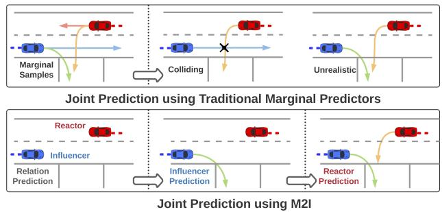
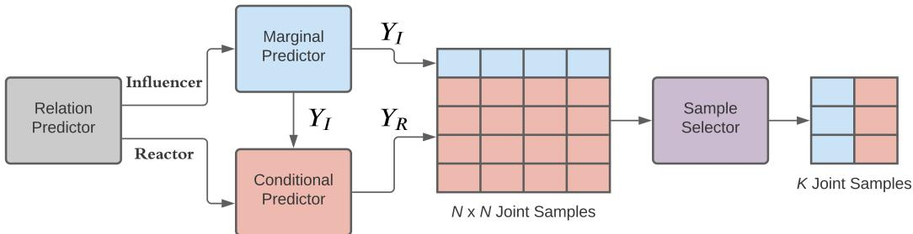
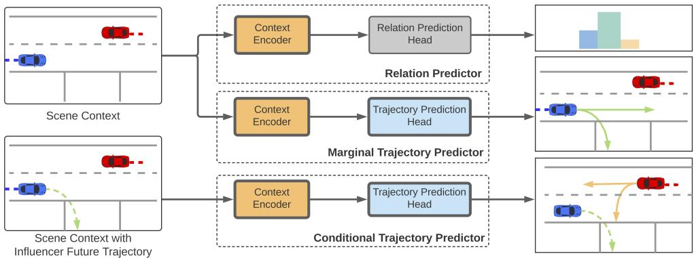
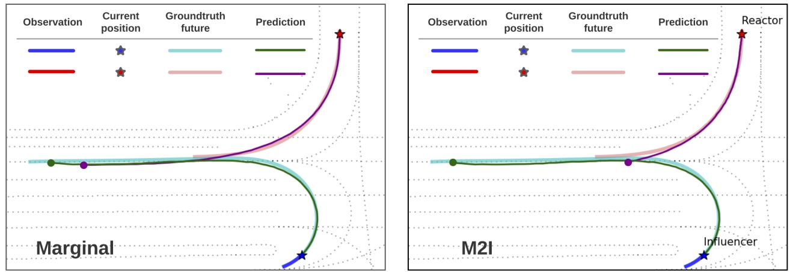
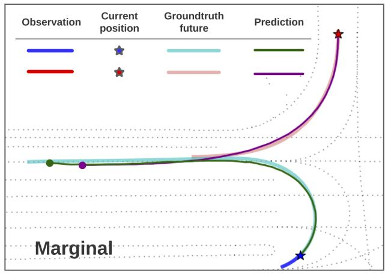
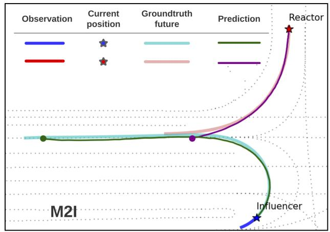

# M2I: From Factored Marginal Trajectory Prediction to Interactive Prediction

Qiao Sun1\* Xin Huang2∗† Junru Gu1 Brian C. Williams2 Hang Zhao1‡ 1IIIS, Tsinghua University 2CSAIL, Massachusetts Institute of Technology

## Abstract

Predicting future motions of road participants is an important task for driving autonomously in urban scenes. Existing models excel at predicting marginal trajectories for single agents, yet it remains an open question to jointly predict scene compliant trajectories over multiple agents. The challenge is due to exponentially increasing prediction space as a function of the number of agents. In this work, we exploit the underlying relations between interacting agents and decouple the joint prediction problem into marginal prediction problems. Ourproposed approach M2I first classifies interacting agents as pairs ofinfluencers and reactors, and then leverages a marginal prediction model and a conditional prediction model to predict trajectories for the influencers and reactors, respectively. The predictionsfrom interacting agents are combined and selected according to their joint likelihoods. Experiments show that our simple but effective approach achieves state-of-the-art performance on the Waymo Open Motion Dataset interactive prediction benchmark.

## 1. Introduction

Trajectory prediction is widely used by intelligent driving systems to infer future motions of nearby agents and identify risky scenarios to enable safe driving. Recent advances have shown great success in predicting accurate trajectories by learning from real-world driving examples. Many existing trajectory prediction works [5, 12, 15, 26, 28, 38] focus on generating marginal prediction samples of future trajectories over individual agents, failing to reason about their interactions in the future. As a result, the prediction samples over multiple agents may overlap with each other and result in sub-optimal performance.

We present a motivating example in Fig. 1, in which a marginal predictor produces a set of prediction samples separately for two interacting agents, as visualized in the top left figure. While the predictions for each agent are reasonable without considering the presence of the other, some trajectory pairs will collide when considering them jointly. For instance, it is unlikely that the red agent turns left while the blue agent goes forward, as indicated in the top middle example in Fig. 1. Therefore, it is necessary to predict scene compliant trajectories with the existence of multiple agents to support better prediction accuracy.

  
Figure 1. A motivating example of M2I. Top: Traditional marginal predictor often produces scene inconsistent trajectory predictions that collide with each other. Even for non-colliding predictions, it ignores the potential interaction between agent futures and may predict unrealistic behaviors. Bottom: Our proposed approach M2I predicts scene compliant trajectories by first identifying an influencer reactor pair in the scene. It then predicts marginal trajectories for the influencer and reactive trajectories for the reactor.

To generate scene compliant trajectories, one can learn a joint predictor to predict trajectories in a joint space over multiple agents; however, it suffers from an exponentially increasing prediction space as the number of agents increases. As investigated by [15], while it is feasible to predict a set of goals for a single agent, the goal space increases exponentially with the number of agents and becomes unmanageable for even two agents with a few hundred goal candidates for each agent. A more computationally efficient alternative to producing scene compliant trajectories is to post-process marginal prediction samples by pruning colliding ones; however, such an ad-hoc approach fails to take into account potential agent interactions in the future and may ignore other conflicts which are hard to prune by heuristics. For instance, although the prediction sample in the top right figure in Fig. 1 is collision-free, the red agent may slow down when turning left to keep a safe distance from the blue agent. Such an interactive behavior is hard to be captured by a marginal predictor as it is unaware of the future behavior of the other agents in the scene.

In this paper, we propose M2I that leverages marginal and conditional trajectory predictors to efficiently predict scene compliant multi-agent trajectories, by approximating the joint distribution as a product of a marginal distribution and a conditional distribution. The factorization assumes two types of agents: the influencer that behaves independently without considering the other agents, and the reactor that reacts to the behavior of the influencer. This assumption is inspired by the recent study on the underlying correlations between interactive agent trajectories [39]. Under the assumption, we leverage a standard marginal predictor to generate prediction samples for the influencer, and a conditional predictor to roll out future trajectories for the reactor conditioned on the future trajectory of the influencer. The advantage of our proposed approach M2I is illustrated in the bottom figures in Fig. 1, in which we first predict the relations of the interactive agents. Given the relations, we predict the future trajectories of the influencer and then predict reactive behaviors of the reactor conditioned on each influencer prediction. As causality in driving interaction remains an open problem [39], we pre-label the influencerreactor relation based on a heuristic, and propose a relation predictor to classify interactive relations at inference time.

Our contributions are three-fold. First, we propose a simple but effective framework M2I that leverages marginal and conditional predictors to generate accurate and scene compliant multi-agent trajectories. The framework does not assume a specific predictor structure, allowing it to be adopted by a wide range of backbone prediction models. Second, we propose a relation predictor that infers highlevel relations among interactive agents to decouple the prediction space. Third, we demonstrate our framework using a goal-conditioned prediction model. Experiments show that M2I achieves state-of-the-art performance on the Waymo Open Motion Dataset interactive prediction benchmark.

## 2. Related Work

Trajectory prediction for traffic agents has been studied extensively in recent years. Due to uncertainty in human intent, the future trajectories are probabilistic and multimodal. To handle the multi-modality problem, [5, 35] propose models that output behavior predictions as Gaussian mixture models (GMMs), in which each mixture component represents a single modality. Instead of parameterizing the prediction distribution, generative models, such as generative adversarial models (GANs) [16, 18, 47] and (conditional) variational autoencoders (VAEs) [26, 29, 35, 44], produce trajectory samples to approximate the distribution space. These generative models suffer from sample inefficiency and require many samples to cover diverse driving scenarios [18].

More recently, a family of models are proposed to improve prediction accuracy and coverage by first predicting high-level intentions, such as goal targets [11, 13, 15, 29, 34, 46], lanes to follow [21, 37], and maneuver actions [8, 9, 19, 24], before predicting low-level trajectories conditioning on the intention. Such models demonstrate great success in predicting accurate trajectories for single agents in popular trajectory prediction benchmarks, such as Argoverse [6] and Waymo Open Motion Dataset [10]. While our proposed approach M2I can use an arbitrary prediction model, we choose to adopt an anchor-free goal-based predictor [15] because of its outstanding performance.

In the rest of the section, we introduce the literature closely related to our approach, on interactive trajectory prediction and conditional trajectory prediction.

## 2.1. Interactive Trajectory Prediction

Predicting scene compliant trajectories for multiple agents remains an open question due to its complexity. Early work leverages hand-crafted interaction models, such as social forces [17] and energy functions [43]. These handcrafted functions require manual tuning and have difficulties modeling highly complicated and nonlinear interactions. In contrast, learning-based methods achieve better accuracy by learning interactions from realistic driving data: [2, 16] utilize social pooling mechanisms to capture social influences from neighbor agents to predict interactive pedestrian trajectories in crowded scenes; [3, 4, 31, 35] build a graph neural network (GNN) to learn the agent-to-agent interactions; [22, 27, 32, 33, 38] leverage attention and transformer mechanisms to learn multi-agent interaction behaviors. In this work, we build a sparse graph with directed edges representing dependencies between agent nodes, but our approach differs from existing graph-based models in a few ways. First, it adopts explicit influencer-reactor relations and offers better interpretability in agent interactions. Second, M2I predicts scene compliant trajectories through marginal and conditional predictors to afford better computational efficiency. Third, it utilizes the future trajectory of influencer agents to predict conditional behaviors for the reactors for better accuracy. This also allows M2I to be used for counterfactual reasoning in simulation applications by varying influencer trajectories.

Existing marginal prediction work produces scene compliant trajectories by leveraging an auxiliary collision loss [27] or a critic based on an inverse reinforcement learning framework [40] that discourages colliding trajectories. In this work, we focus on identifying agent relations explicitly as influencers and reactors to generate scene compliant predictions. Our work is relevant to [23, 25] that predicts interacting types before predicting scene compliant trajectories, but we further exploit the structure of the decoupled relations and the influence of low-level influencer trajectories, as opposed to only providing the high-level interaction labels as the input to the trajectory predictor.

  
Figure 2. Overview of M2I. The relation predictor predicts influencer-reactor relations for interacting agents. The marginal predictor generates marginal predictions for the influencer. The conditional predictor generates predictions for the reactor, conditioned on each influencer trajectory. The sample selector chooses a subset of representative joint samples as output.

## 2.2. Conditional Trajectory Prediction

Conditional prediction approaches study the correlations between future agent trajectories, by predicting trajectories conditioned on the future trajectory of another agent [20,35,39]. These approaches often rely on the future trajectory of the autonomous vehicle or a robot whose future plan is known to the predictor. Our work goes beyond by conditioning on the future trajectory of another agent to be predicted. Despite the prediction errors of the conditioned agent, we show that our model outperforms marginal predictors that do not account for the interactive correlations.

## 3. Approach

In this section, we introduce a formal problem formulation and an overview of M2I, followed by detailed explanations of each model used in the approach.

## 3.1. Problem Formulation

Given observed states $X = ( M , S )$ , including the map states M and the observed states S of all agents in a scene, the goal is to predict the future states of the interacting agents Y up to a finite horizon T. We assume the interacting agents are pre-labeled in a given scene, which is available in common interactive prediction datasets such as [10, 45]. As the distribution over Y is a joint distribution over multiple agents, we approximate it as the factorization over a marginal distribution and a conditional distribution:

$$
P ( Y | X ) = P ( Y _ { I } , Y _ { R } | X ) \approx P ( Y _ { I } | X ) P ( Y _ { R } | X , Y _ { I } ) .\tag{1}
$$

The factorization in Eq. (1) first assigns the interacting agents as the influencer $Y _ { I }$ and the reactor $Y _ { R } ,$ , and decouples the joint distribution as the marginal distribution over the influencer and the conditional distribution over the reactor. This factorization allows us to reduce the complexity of learning a joint distribution to learning more tractable distributions. In the case where two agents are not interacting, the factorization can be simplified as two marginal distributions:

$$
P ( Y | X ) \approx P ( Y _ { I } | X ) P ( Y _ { R } | X ) ,\tag{2}
$$

where there is no conditional dependence between the agents. Such independence is presumed by many marginal prediction models that predict the marginal distribution without considering other agents in the scene.

We focus on two interactive agents in this paper and aim to tackle the pairwise interactive trajectory prediction problem proposed by [10]. For scenarios involving more than two interactive agents, our approach can be modified by predicting the relations over all the agents and chaining multiple marginal and conditional distributions together, assuming no loopy influence:

$$
P _ { N > 2 } ( Y | X ) \approx \prod _ { i = 1 } ^ { N } P ( Y _ { i } | X , \mathbf { Y } _ { i } ^ { \mathrm { i n f } } ) ,\tag{3}
$$

where N is the number of total interactive agents, and $\mathbf { Y } _ { i } ^ { \mathrm { i n f } }$ is the set of influencer agents for agent i predicted by the relation predictor. We refer to examples of multi-agent relation predictions in ??.

## 3.2. Model Overview

Our proposed approach M2I is summarized in Fig. 2. It includes a relation predictor to predict the influencer and the reactor in a scene, a marginal predictor to predict future trajectories of the influencer, a conditional predictor to predict future trajectories of the reactor conditioned on the future trajectory of the influencer, and a sample selector to select a set of representative joint prediction samples. Although M2I includes three different learned models, they share the same encoder-decoder structure and adopt the same context encoder to learn context information, as illustrated in Fig. 3. The conditional predictor takes an augmented scene context input that includes the influencer future trajectory to learn reactive behaviors for the reactor. In the following, we introduce each model with more details.

## 3.3. Relation Predictor

We propose a relation predictor to classify whether an interacting agent is an influencer or a reactor, based on the pass yield relation between two agents. Similar to [23], we assume three types of relations: PASS, YIELD, and NONE, and determine the relation using the following heuristics. Given two agent future trajectories $y _ { 1 }$ and $y _ { 2 }$ with $T$ steps, we first compute the closest spatial distance between two agents to determine whether a pass yield relation exists:

  
Figure 3. M2I includes three models that share the same context encoder. The relation predictor includes a relation prediction head to predict distribution over relation types. The marginal predictor adopts a trajectory prediction head to produce multi-modal prediction samples. The conditional trajectory predictor takes an augmented scene context input as the influencer future trajectory.

$$
\begin{array} { r } { d _ { I } = \operatorname* { m i n } _ { \tau _ { 1 } = 1 } ^ { T } \operatorname* { m i n } _ { \tau _ { 2 } = 1 } ^ { T } | | y _ { 1 } ^ { \tau _ { 1 } } - y _ { 2 } ^ { \tau _ { 2 } } | | _ { 2 } . } \end{array}\tag{4}
$$

If $d _ { I } > \epsilon _ { d } .$ which is a dynamic threshold depending on the agent size, the agents never get too close to each other and thus we label the relation type as none. Otherwise, we obtain the time step from each agent at which they reach the closest spatial distance, such that:

$$
\begin{array} { r l r } { t _ { 1 } } & { = } & { \arg \operatorname* { m i n } _ { \tau _ { 1 } = 1 } ^ { T } \operatorname* { m i n } _ { \tau _ { 2 } = 1 } ^ { T } \lvert | y _ { 1 } ^ { \tau _ { 1 } } - y _ { 2 } ^ { \tau _ { 2 } } \rvert | _ { 2 } , } \end{array}\tag{5}
$$

$$
\begin{array} { r l r } { t _ { 2 } } & { = } & { \arg \operatorname* { m i n } _ { \tau _ { 2 } = 1 } ^ { T } \operatorname* { m i n } _ { \tau _ { 1 } = 1 } ^ { T } \lvert | y _ { 1 } ^ { \tau _ { 1 } } - y _ { 2 } ^ { \tau _ { 2 } } \rvert | _ { 2 } . } \end{array}\tag{6}
$$

When $t _ { 1 } ~ > ~ t _ { 2 }$ , we define that agent 1 yields to agent 2, as it takes longer for agent 1 to reach the interaction point. Otherwise, we define that agent 1 passes agent 2.

After labeling the training data with three interaction types, we propose an encoder-decoder-based model to classify an input scenario into a distribution over these types. As shown in Fig. 3, the relation predictor model consists of a context encoder that extracts the context information, including the observed states of the interacting agents and nearby agents and map coordinates, into a hidden vector, as well as a relation prediction head that outputs the probability over each relation type. There is a rich set of literature on learning context information from a traffic scene, such as [7, 12, 14, 28]. Our model could utilize any existing context encoder thanks to its modular design, and we defer a detailed explanation of our choice in Sec. 4. The relation prediction head consists of one layer of multi-layer perceptron (MLP) to output the probability logits over each relation.

The loss to train the relation predictor is defined as:

$$
\mathcal { L } _ { \mathrm { r e l a t i o n } } = \mathcal { L } _ { c e } ( R , \hat { R } ) ,\tag{7}
$$

where $\mathcal { L } _ { c e }$ is the cross entropy loss, R is the predicted relation distribution, and $\hat { R }$ is the ground truth relation.

Given the predicted relation, we can assign each agent as an influencer or a reactor. If the relation is none, both agents are influencer, such that their future behaviors are independent of each other, as in Eq. (2). If the relation is agent 1 yielding to agent 2, we assign agent 1 as the reactor and agent 2 as the influencer. If the relation is agent 1 passing agent 2, we flip the influencer and reactor labels.

## 3.4. Marginal Trajectory Predictor

We propose a marginal trajectory predictor for the influencer based on an encoder-decoder structure, as shown in Fig. 3, which is widely adopted in the trajectory prediction literature [10, 14, 46]. The predictor utilizes the same context encoder as in Sec. 3.3, and generates a set of prediction samples associated with confidence scores using a trajectory prediction head. Although our approach can take an arbitrary prediction head, we focus on an anchor-free goal-based prediction head because of its outstanding performance in trajectory prediction benchmarks, and defer a detailed explanation in Sec. 4.

## 3.5. Conditional Trajectory Predictor

The conditional trajectory predictor is similar to the marginal predictor, except that it takes an augmented scene context that includes the future trajectory of the influencer, as shown in Fig. 3. This allows the features of the influencer future trajectory to be extracted and learned in the same way as other context features. The encoded scene feature is used by the trajectory prediction head, which shares the same model as in the marginal predictor, to produce multimodal prediction samples.

## 3.6. Sample Selector

Given the predicted relations of the influencer and the reactor, we predict N samples with confidence scores (or probabilities) for the influencer using the marginal predictor, and for each influencer sample, we predict N samples for the reactor using the conditional predictor. The number of joint samples is thus $N ^ { 2 }$ , and the probability of each joint sample is a product of the marginal probability and the conditional probability. We further reduce the size of the joint samples to $K$ as evaluating each prediction sample for downstream tasks such as risk assessment can be expensive [41]. In M2I, we select the K samples from $N ^ { 2 }$ candidates with the highest joint likelihoods.

## 3.7. Inference

At inference time, we generate the joint predictions following the procedure illustrated in Fig. 2. First, we call the relation predictor and choose the interaction relation with the highest probability. Second, for the predicted influencer, we generate N trajectory samples using the marginal predictor. Third, for each influencer sample, we generate N samples for the predicted reactor using the conditional predictor. Fourth, we use the sample selector to select K representative samples from $N ^ { 2 }$ candidates. In the case where the predicted relation is none, we use the marginal predictor for both agents to obtain $N ^ { 2 }$ trajectory pairs, and follow the same sample selection step.

## 4. Experiments

In this section, we introduce the dataset benchmark and details of the model, followed by a series of experiments to demonstrate the effectiveness of M2I.

## 4.1. Dataset

We train and validate M2I in the Waymo Open Motion Dataset (WOMD), a large-scale driving dataset collected from realistic traffic scenarios. We focus on the interactive prediction task to predict the joint future trajectories of two interacting agents for the next 8 seconds with 80 time steps, given the observations, including 1.1 seconds of agent states with 11 time steps that may include missing observations and the map state. The dataset includes 204,166 scenarios in the training set and 43,479 examples in the validation set. The dataset provides labels on which agents are likely to interact, yet it does not specify how they interact. During training, we pre-label the interaction type (yield, pass, or none) of the interacting agents according to Sec. 3.3.

## 4.2. Metrics

We follow the WOMD benchmark by using the following metrics: minADE measures the average displacement error between the ground truth future joint trajectory and the closest predicted sample out of $K = 6$ joint samples. This metric is widely adopted since [16] to measure the prediction error against a multi-modal distribution. minFDE measures the final displacement error between the ground truth end positions in the joint trajectory and the closest predicted end positions from K joint samples. Miss rate (MR) measures the percentage of none of the K joint prediction samples are within a given lateral and longitudinal threshold of the ground truth trajectory. The threshold depends on the initial velocity of the predicted agents. More details are described in [10]. Overlap rate (OR) measures the level of scene compliance as the percentage of the predicted trajectory of any agent overlapping with the predicted trajectories of other agents. This metric only considers the most likely joint prediction sample. A lower overlap rate indicates the predictions are more scene compliant. In this paper, we slightly modify the metric definition compared to the original version of WOMD, which considers the overlapping among all objects including the ones not predicted, so that we can measure directly the overlapping between predicted agents. Mean average precision (mAP) measures the area under the precision-recall curve of the prediction samples given their confidence scores. Compared to minADE/minFDE metrics that are only measured against the best sample regardless of its score, mAP measures the quality of confidence score and penalizes false positive predictions [10]. It is the official ranking metric used by WOMD benchmark and we refer to [10] for the implementation.

## 4.3. Model Details

We present the detailed implementation of our model and training procedure in the following sections.

## 4.3.1 Context Encoder

The context encoder leverages both vectorized and rasterized representations to encode traffic context. Vectorized representation takes the traffic context, including observed agent states and map states, as vectors. It is efficient at covering a large spatial space. Rasterized representation draws traffic context on a single image with multiple channels and excels at capturing geometrical information. Both representations have achieved top performance in trajectory prediction benchmarks such as Argoverse and WOMD [6, 10, 12, 14, 15].

In M2I, we use the best of both worlds. First, we leverage a vector encoder based on VectorNet [12] that takes observed agent trajectories and lane segments as a set of polylines. Each polyline is a set of vectors that connect neighboring points together. For each polyline, the vector encoder runs an MLP to encode the feature of vectors within the polyline and a graph neural network to encode their dependencies followed by a max-pooling layer to summarize the feature of all the vectors. The polyline features, including agent polyline features and map polyline features, are processed by cross attention to obtain the final agent feature that includes information on the map and nearby agents. We refer to [12] for detailed implementations.

In addition to encoding the vectorized feature, we utilize a second encoder to learn features from a rasterized representation. Following [14], we first rasterize the input states into an image with 60 channels, including the position of the agents at each past time frame with the map information. The size of the image is 224×224 and each pixel represents an area of 1m × 1m. We run a pre-trained VGG16 [36] model as the encoder to obtain the rasterized feature. The output of the context encoder is a concatenation of the vectorized feature and the rasterized feature.

Conditional Context Encoder The context encoder in the conditional trajectory predictor processes the additional influencer future trajectory in the following ways. First, the future trajectory is added to the vectorized representation as an extra vector when running VectorNet. In parallel, we create extra 80 channels on the rasterized representation and draw the $( x , y )$ positions over 80 time steps in the next 8 seconds. We run the pre-trained VGG16 model to encode the augmented image, and combine the output feature with the vectorized feature as the final output.

## 4.3.2 Relation Prediction Head

The relation prediction head has one layer of MLP with one fully connected layer for classification. The MLP has a hidden size of 128, followed by a layer normalization layer and a ReLU activation layer. The output is the logits over three types of relations, as described in Sec. 3.3.

## 4.3.3 Trajectory Prediction Head

The trajectory prediction head adopts DenseTNT [15] to generate multi-modal future predictions for its outstanding performance in the marginal prediction benchmarks. It first predicts the distribution of the agent goals as a heatmap, through a lane scoring module that identifies likely lanes to follow, a feature encoding module that uses the attention mechanism to extract features between goals and lanes, and a probability estimation module that predicts the likelihood of goals. Next, the prediction head regresses the full trajectory over the prediction horizon conditioned on the goal. The prediction head can be combined with the context encoder and trained end-to-end.

## 4.3.4 Training Details

At training time, we train each model, including the relation predictor, marginal predictor, and conditional predictor, separately. Each model is trained on the training set from WOMD with a batch size of 64 for 30 epochs on 8 Nvidia RTX 3080 GPUs. The data is batched randomly. We use an Adam optimizer and a learning rate scheduler that decays the learning rate by 30% every 5 epochs, with an initial value of 1e-3. The hidden size in the model is 128, if not specified. We observe consistent performance over different learning rates and batch sizes. When training the conditional predictor, we use the teacher forcing technique by providing the ground truth future trajectory of the influencer agent.

## 4.4. Quantitative Results

In Tab. 1, we compare our model with the following baselines, including the top ranked published models on the WOMD interaction prediction challenge leaderboard [1]: Waymo LSTM Baseline [10] is the official baseline provided by the benchmark. It leverages an LSTM encoder to encode observed agent trajectories, and an MLP-based prediction head to generate multiple samples. Waymo Full Baseline [10] is an extended version of the Waymo LSTM Baseline, by leveraging a set of auxiliary encoders to encode context information. SceneTransformer [32] is a transformer-based model that leverages attention to combine features across road graphs and agent interactions both spatially and temporally. The model achieves state-ofthe-art performance in the WOMD benchmark in both the marginal prediction task and the interactive prediction task. HeatIRm4 [30] models the agent interaction as a directed edge feature graph and leverages an attention network to extract interaction features. It was the winner of the 2021 WOMD challenge. $\mathbf { A } \mathbf { R } ^ { 2 }$ [42] adopts a marginal anchorbased model using a raster representation. The model generates joint predictions by combining marginal predictions from each agent. It achieved the top performance at the WOMD challenge. Baseline Marginal is our baseline model that leverages the same marginal predictor as M2I to generate N marginal prediction samples for both agents, without considering their future interactions. When combining the marginal predictions into joint predictions, we take the top K marginal pairs out of $\hat { N } ^ { 2 }$ options given their joint probabilities as the product of marginal probabilities. This is a common practice to combine marginal predictions into joint predictions, as in [4, 10]. Baseline Joint is our baseline model that jointly predicts the goals and trajectories for both interacting agents, using the same context encoder and the trajectory prediction head as in M2I. As the joint goal space grows exponentially with the number of agents, we can only afford a small number of goal candi dates for each agent. To ease the computational complexity, we leverage a marginal predictor to predict the top 80 goals for each agent and obtain $8 0 \times 8 0$ goal pairs for joint goal and trajectory prediction. As a result, this baseline tradeoffs prediction accuracy with computational feasibility by using a reduced set of goals.

## 4.4.1 Validation Set

We present the results in the interactive validation set in the top half of Tab. 1, where the baseline results are reported as in [10,32]. Our model M2I outperforms both Waymo baselines in terms of all metrics. Compared to the current stateof-the-art model SceneTransformer, M2I achieves a better mAP, the official ranking metric, over vehicles, and a better miss rate over pedestrians. Although M2I has higher minFDE errors, it has improved the mAP over all agents (the most right column) by a large margin, meaning our model generates a more accurate distribution using its predicted confidence scores and outputs fewer false positive predictions. In addition, as our proposed approach does not assume a specific prediction model, it could leverage SceneTransformer as the context encoder to achieve better minFDE, and we defer it as future work. When compared with our own baselines that share the same context encoder and prediction head, M2I outperforms the marginal predictor, which assumes independence between two agents, and a joint predictor, which only affords a small set of goal candidates due to computational constraints.

<table><tr><td></td><td></td><td colspan="3">Vehicle (8s)</td><td colspan="3">Pedestrian (8s)</td><td colspan="3">Cyclist (8s)</td><td>All (8s)</td></tr><tr><td>Set</td><td>Model</td><td>mFDE↓</td><td>MR↓</td><td>mAP ↑</td><td>mFDE↓</td><td>MR↓</td><td>mAP↑</td><td>mFDE↓</td><td>MR↓</td><td>mAP↑</td><td>mAP↑</td></tr><tr><td>Val.</td><td>Waymo LSTM Baseline [10]</td><td></td><td>0.88</td><td>0.01</td><td></td><td>0.93</td><td>0.02</td><td></td><td>0.98</td><td>0.00</td><td>0.01</td></tr><tr><td></td><td>Waymo Full Baseline [10]</td><td>6.07</td><td>0.66</td><td>0.08</td><td>4.20</td><td>1.00</td><td>0.00</td><td>6.46</td><td>0.83</td><td>0.01</td><td>0.03</td></tr><tr><td></td><td>SceneTransformer [32]</td><td>3.99</td><td>0.49</td><td>0.11</td><td>3.15</td><td>0.62</td><td>0.06</td><td>4.69</td><td>0.71</td><td>0.04</td><td>0.07</td></tr><tr><td></td><td>Baseline Marginal</td><td>6.26</td><td>0.60</td><td>0.16</td><td>3.59</td><td>0.63</td><td>0.04</td><td>6.47</td><td>0.76</td><td>0.03</td><td>0.07</td></tr><tr><td>M2I</td><td>Baseline Joint</td><td>11.31</td><td>0.64</td><td>0.14</td><td>3.44</td><td>0.93</td><td>0.01</td><td>7.16</td><td>0.82</td><td>0.01</td><td>0.05</td></tr><tr><td></td><td></td><td>5.49</td><td>0.55</td><td>0.18</td><td>3.61</td><td>0.60</td><td>0.06</td><td>6.26</td><td>0.73</td><td>0.04</td><td>0.09</td></tr><tr><td>Test</td><td>Waymo LSTM Baseline [10]</td><td>12.40</td><td>0.87</td><td>0.01</td><td>6.85</td><td>0.92</td><td>0.00</td><td>10.84</td><td>0.97</td><td>0.00</td><td>0.00</td></tr><tr><td></td><td>HeatIRm4 [30]</td><td>7.20</td><td>0.80</td><td>0.07</td><td>4.06</td><td>0.80</td><td>0.05</td><td>6.69</td><td>0.85</td><td>0.01</td><td>0.04</td></tr><tr><td>AIR² [42]</td><td></td><td>5.00</td><td>0.64</td><td>0.10</td><td>3.68</td><td>0.71</td><td>0.04</td><td>5.47</td><td>0.81</td><td>0.04</td><td>0.05</td></tr><tr><td></td><td>SceneTransformer [32]</td><td>4.08</td><td>0.50</td><td>0.10</td><td>3.19</td><td>0.62</td><td>0.05</td><td>4.65</td><td>0.70</td><td>0.04</td><td>0.06</td></tr><tr><td>M2I</td><td></td><td>5.65</td><td>0.57</td><td>0.16</td><td>3.73</td><td>0.60</td><td>0.06</td><td>6.16</td><td>0.74</td><td>0.03</td><td>0.08</td></tr></table>

Table 1. Joint metrics on the interactive validation and test set. The best performed metrics are bolded and the grey cells indicate the ranking metric used by the WOMD benchmark. M2I outperforms both Waymo baselines and challenge winners. Compared to the current state-of-the art model SceneTransformer, it improves the mAP metric by a large margin over vehicles and all agents, demonstrating its advantage in learning a more accurate probability distribution and producing fewer false positive predictions.

## 4.4.2 Testing Set

We show the results in the interactive test set in the bottom half of Tab. 1. For a fair comparison, we use the numbers reported on the official benchmark website [1] and only include the published models. Similar to the observations from the validation set, we observe that M2I improves mAP metrics by a large margin, compared to past WOMD interaction prediction challenge winners [30,42] and the existing state-of-the-art model [32].

## 4.5. Ablation Study

We present ablation studies on the relation predictor, conditional predictor, and generalization to other predictors.

## 4.5.1 Relation Prediction

We measure the performance of our relation predictor on the validation dataset and observe an accuracy of 90.09%. We verify the significance of an accurate relation predictor by comparing the performance of vehicle trajectory predictions using the predicted relations and using the ground truth relations, and observe a gap of 3.05% in terms of mAP at 8s.

<table><tr><td>Model</td><td>minADE↓</td><td>minFDE↓</td><td>MR↓</td><td>mAP↑</td></tr><tr><td>M2I Marginal</td><td>1.70</td><td>3.45</td><td>0.23</td><td>0.30</td></tr><tr><td>M2I Conditional GT</td><td>1.46</td><td>2.43</td><td>0.12</td><td>0.41</td></tr><tr><td>M2I Conditional P1</td><td>1.75</td><td>3.49</td><td>0.25</td><td>0.26</td></tr></table>

Table 2. Comparison between the marginal predictor and the conditional predictor over marginal metrics for vehicle reactors at 8s.

## 4.5.2 Conditional Prediction

We validate the effectiveness of our conditional predictor by comparing its performance against the marginal predictor (M2I Marginal) for vehicle reactor trajectory prediction. The results are summarized in Tab. 2. When the conditional predictor takes the ground truth future trajectory of the influencer agent (c.f. M2I Conditional GT), it generates predictions for the reactor agent with better performance across all metrics. This validates our hypothesis on the dependence between the influencer trajectory and the reactor trajectory. As the ground truth trajectories are not available at inference time, we present the prediction results when the conditional predictor takes the best predicted influencer trajectory as M2I Conditional P1. It is not surprising to see that the performance is inferior to the marginal predictor results, due to errors in influencer prediction. However, as we show in Tab. 1, our model is able to outperform the marginal baseline model by including more than one sample from the influencer and selecting the most likely joint samples.

## 4.5.3 Generalizing to Other Predictors

We demonstrate that our proposed approach can be extended to other existing predictor models to validate its generalizability. In this experiment, we replace the context encoder with VectorNet [12] and the prediction head with

Figure 4. Example prediction using Baseline Marginal (left) and M2I (right). The marginal predictor produces overlapping and inaccurate predictions. M2I successfully identifies the influencer and reactor (the predicted relation type is annotated next to the current position of each agent) in a challenging interactive scene and achieves better prediction accuracy and scene compliance.
<table><tr><td>Model</td><td>minADE↓</td><td>minFDE↓</td><td>OR↓</td><td>mAP↑</td></tr><tr><td>TNT Marginal</td><td>3.43</td><td>8.72</td><td>0.42</td><td>0.10</td></tr><tr><td>TNT Joint</td><td>5.30</td><td>14.07</td><td>0.34</td><td>0.13</td></tr><tr><td>TNT M2I</td><td>3.38</td><td>8.46</td><td>0.20</td><td>0.14</td></tr></table>

Table 3. Joint metrics on the interactive validation set for vehicles at 8s. We replace the context encoder and the prediction head in M2I and baselines with a different model. We observe a similar trend in performance improvement, especially over OR and mAP, which validates the generalizability of our proposed approach.

TNT [46], which is an anchor-based goal-conditioned prediction model, and obtain a variant of M2I named TNTM2I. We compare this variant with a marginal predictor baseline (TNT Marginal) and a joint predictor baseline (TNT Joint) using the same VectorNet and TNT backbones.

The results, summarized in Tab. 3, show that our approach consistently improves all metrics, especially OR and mAP, by a large margin when using a different predictor model. The improvements indicate that our proposed approach generalizes to other predictors and generates scene compliant and accurate future trajectories.

## 4.6. Qualitative Results

We present a challenging interactive scenario in Fig. 4, and visualize the most likely prediction sample from a marginal baseline and M2I. In this scenario, the red agent is yielding to the blue agent who is making a U-turn. The marginal predictor on the left fails to capture the interaction and predicts overlapping trajectories. On the other hand, M2I successfully identifies the underlying interaction relation, and predicts an accurate trajectory for the influencer and an accurate reactor trajectory that reacts to the predicted influencer trajectory. As a result, M2I achieves better prediction accuracy and scene compliance.

## 5. Conclusion

In conclusion, we propose a simple but effective joint prediction framework M2I through marginal and conditional predictors, by exploiting the factorized relations between interacting agents. M2I uses a modular encoderdecoder architecture, allowing it to choose from a variety of context encoders and prediction heads. Experiments on the interactive Waymo Open Motion Dataset benchmark show that our framework achieves state-of-the-art performance. In the ablation study, we show the generalization of our framework using a different predictor model.

Limitations We identify the following limitations. First, there exists a gap when comparing our model to the stateof-the-art in terms of the minFDE metric, indicating that our approach still has room for improvement. Thanks to its modular design, we plan to extend M2I to use SceneTransformer [32] as the context encoder and fill the gap. Second, the performance of M2I heavily depends on the size of interactive training data, especially when training the relation predictor and the conditional trajectory predictor. Looking at Tab. 1, we see that our approach improves the mAP metrics by a large margin on vehicles because of sufficient vehicle interactions in the training data, but the improvement is more negligible over the other two types due to lack of interactive scenarios involving pedestrians and cyclists. Finally, M2I assumes no mutual influence between interacting agents, allowing it to decouple joint agent distributions into marginal and conditional distributions. While we have observed an obvious influencer according to our heuristics in almost all the interactive scenarios in the Waymo Open Motion Dataset, we defer predicting for more complicated scenarios involving mutual influence (and loopy influence for more than two agents) as future work.

## References

[1] Waymo open motion dataset interaction prediction. https://waymo.com/open/challenges/2021/ interaction-prediction/, 2021. [Online; Accessed November 16th 2021].

[2] Alexandre Alahi, Kratarth Goel, Vignesh Ramanathan, Alexandre Robicquet, Li Fei-Fei, and Silvio Savarese. Social LSTM: Human trajectory prediction in crowded spaces. In Proceedings of the IEEE conference on computer vision and pattern recognition, pages 961–971, 2016.

[3] Sergio Casas, Cole Gulino, Renjie Liao, and Raquel Urtasun. SpAGNN: Spatially-aware graph neural networks for relational behavior forecasting from sensor data. In 2020 IEEE International Conference on Robotics and Automation (ICRA), pages 9491–9497. IEEE, 2020.

[4] Sergio Casas, Cole Gulino, Simon Suo, Katie Luo, Renjie Liao, and Raquel Urtasun. Implicit latent variable model for scene-consistent motion forecasting. In Proceedings of the European Conference on Computer Vision (ECCV). Springer, 2020.

[5] Yuning Chai, Benjamin Sapp, Mayank Bansal, and Dragomir Anguelov. MultiPath: Multiple probabilistic anchor trajectory hypotheses for behavior prediction. In Conference on Robot Learning (CoRL), 2019.

[6] Ming-Fang Chang, John Lambert, Patsorn Sangkloy, Jagjeet Singh, Slawomir Bak, Andrew Hartnett, De Wang, Peter Carr, Simon Lucey, Deva Ramanan, et al. Argoverse: 3d tracking and forecasting with rich maps. In Proceedings of the IEEE Conference on Computer Vision and Pattern Recognition, pages 8748–8757, 2019.

[7] Henggang Cui, Vladan Radosavljevic, Fang-Chieh Chou, Tsung-Han Lin, Thi Nguyen, Tzu-Kuo Huang, Jeff Schneider, and Nemanja Djuric. Multimodal trajectory predictions for autonomous driving using deep convolutional networks. In 2019 International Conference on Robotics and Automation (ICRA), pages 2090–2096. IEEE, 2019.

[8] Shengzhe Dai, Zhiheng Li, Li Li, Nanning Zheng, and Shuofeng Wang. A flexible and explainable vehicle motion prediction and inference framework combining semisupervised aog and st-lstm. IEEE Transactions on Intelligent Transportation Systems, 2020.

[9] Nachiket Deo and Mohan M Trivedi. Multi-modal trajectory prediction of surrounding vehicles with maneuver based lstms. In 2018 IEEE Intelligent Vehicles Symposium (IV), pages 1179–1184. IEEE, 2018.

[10] Scott Ettinger, Shuyang Cheng, Benjamin Caine, Chenxi Liu, Hang Zhao, Sabeek Pradhan, Yuning Chai, Ben Sapp, Charles R Qi, Yin Zhou, et al. Large scale interactive motion forecasting for autonomous driving: The waymo open motion dataset. In Proceedings of the IEEE/CVF International Conference on Computer Vision, pages 9710–9719, 2021.

[11] Liangji Fang, Qinhong Jiang, Jianping Shi, and Bolei Zhou. TPNet: Trajectory proposal network for motion prediction. In Proceedings of the IEEE/CVF Conference on Computer Vision and Pattern Recognition, pages 6797–6806, 2020.

[12] Jiyang Gao, Chen Sun, Hang Zhao, Yi Shen, Dragomir Anguelov, Congcong Li, and Cordelia Schmid. VectorNet:

Encoding hd maps and agent dynamics from vectorized representation. In Proceedings of the IEEE/CVF Conference on Computer Vision and Pattern Recognition, pages 11525– 11533, 2020.

[13] Thomas Gilles, Stefano Sabatini, Dzmitry Tsishkou, Bogdan Stanciulescu, and Fabien Moutarde. GOHOME: Graphoriented heatmap output for future motion estimation. arXiv preprint arXiv:2109.01827, 2021.

[14] Thomas Gilles, Stefano Sabatini, Dzmitry Tsishkou, Bogdan Stanciulescu, and Fabien Moutarde. HOME: Heatmap output for future motion estimation. In IEEE International Intelligent Transportation Systems Conference (ITSC), pages 500–507. IEEE, 2021.

[15] Junru Gu, Chen Sun, and Hang Zhao. DenseTNT: End-toend trajectory prediction from dense goal sets. In Proceedings of the IEEE/CVF International Conference on Computer Vision, pages 15303–15312, 2021.

[16] Agrim Gupta, Justin Johnson, Li Fei-Fei, Silvio Savarese, and Alexandre Alahi. Social GAN: Socially acceptable trajectories with generative adversarial networks. In Proceedings of the IEEE conference on computer vision and pattern recognition, pages 2255–2264, 2018.

[17] Dirk Helbing and Peter Molnar. Social force model for pedestrian dynamics. Physical review E, 51(5):4282, 1995.

[18] Xin Huang, Stephen G McGill, Jonathan A DeCastro, Luke Fletcher, John J Leonard, Brian C Williams, and Guy Rosman. DiversityGAN: Diversity-aware vehicle motion prediction via latent semantic sampling. IEEE Robotics and Automation Letters, 5(4):5089–5096, 2020.

[19] Xin Huang, Guy Rosman, Igor Gilitschenski, Ashkan Jasour, Stephen G McGill, John J Leonard, and Brian C Williams. HYPER: Learned hybrid trajectory prediction via factored inference and adaptive sampling. In International Conference on Robotics and Automation (ICRA), 2022.

[20] Siddhesh Khandelwal, William Qi, Jagjeet Singh, Andrew Hartnett, and Deva Ramanan. What-if motion prediction for autonomous driving. arXiv preprint arXiv:2008.10587, 2020.

[21] ByeoungDo Kim, Seong Hyeon Park, Seokhwan Lee, Elbek Khoshimjonov, Dongsuk Kum, Junsoo Kim, Jeong Soo Kim, and Jun Won Choi. LaPred: Lane-aware prediction of multimodal future trajectories of dynamic agents. In Proceedings of the IEEE/CVF Conference on Computer Vision and Pattern Recognition, pages 14636–14645, 2021.

[22] Vineet Kosaraju, Amir Sadeghian, Roberto Mart´ın-Mart´ın, Ian Reid, Hamid Rezatofighi, and Silvio Savarese. Social-BiGAT: Multimodal trajectory forecasting using bicycle-gan and graph attention networks. Advances in Neural Information Processing Systems, 32, 2019.

[23] Sumit Kumar, Yiming Gu, Jerrick Hoang, Galen Clark Haynes, and Micol Marchetti-Bowick. Interaction-based trajectory prediction over a hybrid traffic graph. In 2021 IEEE/RSJ International Conference on Intelligent Robots and Systems (IROS), pages 5530–5535. IEEE, 2020.

[24] Yen-Ling Kuo, Xin Huang, Andrei Barbu, Stephen G McGill, Boris Katz, John J Leonard, and Guy Rosman. Trajectory prediction with linguistic representations. In Inter-

national Conference on Robotics and Automation (ICRA), 2022.

[25] Donsuk Lee, Yiming Gu, Jerrick Hoang, and Micol Marchetti-Bowick. Joint interaction and trajectory prediction for autonomous driving using graph neural networks. arXiv preprint arXiv:1912.07882, 2019.

[26] Namhoon Lee, Wongun Choi, Paul Vernaza, Christopher B Choy, Philip HS Torr, and Manmohan Chandraker. DESIRE: Distant future prediction in dynamic scenes with interacting agents. In Proceedings of the IEEE Conference on Computer Vision and Pattern Recognition, pages 336–345, 2017.

[27] Lingyun Luke Li, Bin Yang, Ming Liang, Wenyuan Zeng, Mengye Ren, Sean Segal, and Raquel Urtasun. End-toend contextual perception and prediction with interaction transformer. In 2020 IEEE/RSJ International Conference on Intelligent Robots and Systems (IROS), pages 5784–5791. IEEE, 2020.

[28] Ming Liang, Bin Yang, Rui Hu, Yun Chen, Renjie Liao, Song Feng, and Raquel Urtasun. Learning lane graph representations for motion forecasting. In European Conference on Computer Vision, pages 541–556. Springer, 2020.

[29] Karttikeya Mangalam, Harshayu Girase, Shreyas Agarwal, Kuan-Hui Lee, Ehsan Adeli, Jitendra Malik, and Adrien Gaidon. It is not the journey but the destination: Endpoint conditioned trajectory prediction. In Proceedings of the European Conference on Computer Vision (ECCV), August 2020.

[30] Xiaoyu Mo, Zhiyu Huang, and Chen Lv. Multi-modal interactive agent trajectory prediction using heterogeneous edge-enhanced graph attention network. Workshop on Autonomous Driving, CVPR, 2021.

[31] Abduallah Mohamed, Kun Qian, Mohamed Elhoseiny, and Christian Claudel. Social-STGCNN: A social spatiotemporal graph convolutional neural network for human trajectory prediction. In Proceedings of the IEEE/CVF Conference on Computer Vision and Pattern Recognition, pages 14424–14432, 2020.

[32] Jiquan Ngiam, Benjamin Caine, Vijay Vasudevan, Zhengdong Zhang, Hao-Tien Lewis Chiang, Jeffrey Ling, Rebecca Roelofs, Alex Bewley, Chenxi Liu, Ashish Venugopal, et al. Scene Transformer: A unified architecture for predicting multiple agent trajectories. In International Conference on Learning Representations (ICLR), 2022.

[33] Kamra Nitin, Zhu Hao, Trivedi Dweep, Zhang Ming, and Liu Yan. Multi-agent trajectory prediction with fuzzy query attention. In Advances in Neural Information Processing Systems (NeurIPS), 2020.

[34] Nicholas Rhinehart, Rowan McAllister, Kris Kitani, and Sergey Levine. PRECOG: Prediction conditioned on goals in visual multi-agent settings. In Proceedings of the IEEE International Conference on Computer Vision, pages 2821– 2830, 2019.

[35] Tim Salzmann, Boris Ivanovic, Punarjay Chakravarty, and Marco Pavone. Trajectron++: Multi-agent generative trajectory forecasting with heterogeneous data for control. In Proceedings of the European Conference on Computer Vision (ECCV). Springer, 2020.

[36] Karen Simonyan and Andrew Zisserman. Very deep convolutional networks for large-scale image recognition. arXiv preprint arXiv:1409.1556, 2014.

[37] Haoran Song, Di Luan, Wenchao Ding, Michael Y Wang, and Qifeng Chen. Learning to predict vehicle trajectories with model-based planning. In Conference on Robot Learning (CoRL), 2021.

[38] Charlie Tang and Russ R Salakhutdinov. Multiple futures prediction. In Advances in Neural Information Processing Systems, pages 15424–15434, 2019.

[39] Ekaterina Tolstaya, Reza Mahjourian, Carlton Downey, Balakrishnan Vadarajan, Benjamin Sapp, and Dragomir Anguelov. Identifying driver interactions via conditional behavior prediction. In 2021 IEEE International Conference on Robotics and Automation (ICRA), pages 3473–3479. IEEE, 2021.

[40] T. van der Heiden, N. S. Nagaraja, C. Weiss, and E. Gavves. SafeCritic: Collision-aware trajectory prediction. In British Machine Vision Conference Workshop, 2019.

[41] Allen Wang, Xin Huang, Ashkan Jasour, and Brian Williams. Fast risk assessment for autonomous vehicles using learned models of agent futures. In Robotics: Science and Systems, 2020.

[42] David Wu and Yunan Wu. Air2 for interaction prediction. Workshop on Autonomous Driving, CVPR, 2021.

[43] Kota Yamaguchi, Alexander C Berg, Luis E Ortiz, and Tamara L Berg. Who are you with and where are you going? In Proceedings of the IEEE conference on computer vision and pattern recognition, pages 1345–1352, 2011.

[44] Ye Yuan and Kris Kitani. Diverse trajectory forecasting with determinantal point processes. In International Conference on Learning Representations (ICLR), 2020.

[45] Wei Zhan, Liting Sun, Di Wang, Haojie Shi, Aubrey Clausse, Maximilian Naumann, Julius Kummerle, Hendrik Konigshof, Christoph Stiller, Arnaud de La Fortelle, et al. Interaction dataset: An international, adversarial and cooperative motion dataset in interactive driving scenarios with semantic maps. arXiv preprint arXiv:1910.03088, 2019.

[46] Hang Zhao, Jiyang Gao, Tian Lan, Chen Sun, Benjamin Sapp, Balakrishnan Varadarajan, Yue Shen, Yi Shen, Yuning Chai, Cordelia Schmid, et al. TNT: Target-driven trajectory prediction. In Conference on Robot Learning (CoRL), 2020.

[47] Tianyang Zhao, Yifei Xu, Mathew Monfort, Wongun Choi, Chris Baker, Yibiao Zhao, Yizhou Wang, and Ying Nian Wu. Multi-agent tensor fusion for contextual trajectory prediction. In Proceedings of the IEEE Conference on Computer Vision and Pattern Recognition, pages 12126–12134, 2019.