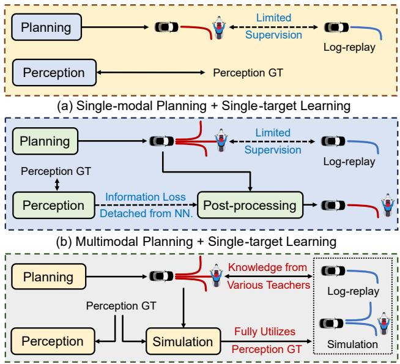
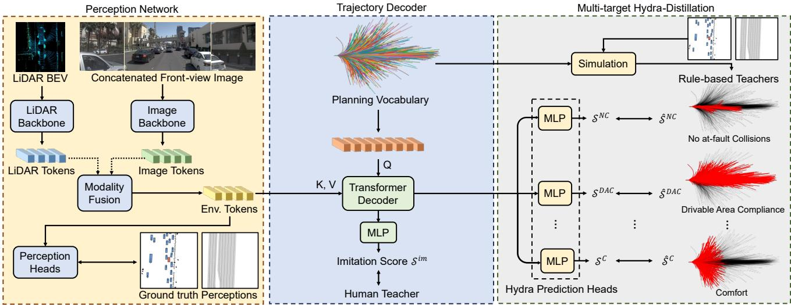

# Hydra-MDP: End-to-end Multimodal Planning with Multi-target Hydra-Distillation

Zhenxin Li1, 2 Kailin Li3 Shihao Wang1, 4 Shiyi Lan1 Zhiding Yu1 Yishen Ji5 Zhiqi Li5 Ziyue Zhu6 Jan Kautz1 Zuxuan Wu2 Yu-Gang Jiang2 Jose M. Alvarez1 1NVIDIA 2Fudan University 3East China Normal University 4Beijing Institute of Technology 5Nanjing University 6Nankai University

## Abstract

We propose Hydra-MDP, a novel paradigm employing multiple teachers in a teacher-student model. This approach uses knowledge distillationfrom both human and rule-based teachers to train the student model, whichfeatures a multihead decoder to learn diverse trajectory candidates tailored to various evaluation metrics. With the knowledge of rulebased teachers, Hydra-MDP learns how the environment influences the planning in an end-to-end manner instead of resorting to non-differentiable post-processing. This method achieves the 1st place in the Navsim challenge, demonstrating significant improvements in generalization across diverse driving environments and conditions. More details by visiting https://github.com/NVlabs/Hydra-MDP.

## 1. Introduction

End-to-end autonomous driving, which involves learning a neural planner with raw sensor inputs, is considered a promising direction to achieve full autonomy. Despite the promising progress in this field [11, 12], recent studies [4, 8, 14] have exposed multiple vulnerabilities and limitations of imitation learning (IL) methods, particularly the inherent issues in open-loop evaluation, such as the dysfunctional metrics and implicit biases [8, 14]. This is critical as it fails to guarantee safety, efficiency, comfort, and compliance with traffic rules. To address this main limitation, several works have proposed incorporating closed-loop metrics, which more effectively evaluate end-to-end autonomous driving by ensuring that the machine-learned planner meets essential criteria beyond merely mimicking human drivers.

Therefore, end-to-end planning is ideally a multi-target and multimodal task, where multi-target planning involves meeting various evaluation metrics from either open-loop and closed-loop settings. In this context, multimodal indicates the existence of multiple optimal solutions for each metric.

Existing end-to-end approaches [4, 11, 12] often try to consider closed-loop evaluation via post-processing, which is not streamlined and may result in the loss of additional information compared to a fully end-to-end pipeline. Meanwhile, rule-based planners [8, 18] struggle with imperfect perception inputs. These imperfect inputs degrade the performance of rule-based planning under both closed-loop and open-loop metrics, as they rely on predicted perception instead of ground truth (GT) labels.

  
(c) Multimodal Planning + Multi-target Learning (Ours)  
Figure 1. Comparison between End-to-end Planning Paradigms.

To address the issues, we propose a novel end-to-end autonomous driving framework called Hydra-MDP (Multimodal Planning with Multi-target Hydra-distillation). Hydra-MDP is based on a novel teacher-student knowledge distillation (KD) architecture. The student model learns diverse trajectory candidates tailored to various evaluation metrics through KD from both human and rule-based teachers. We instantiate the multi-target Hydra-distillation with a multihead decoder, thus effectively integrating the knowledge from specialized teachers. Hydra-MDP also features an extendable KD architecture, allowing for easy integration of additional teachers.

  
Figure 2. The Overall Architecture of Hydra-MDP.

The student model uses environmental observations during training, while the teacher models use ground truth (GT) data. This setup allows the teacher models to generate better planning predictions, helping the student model to learn effectively. By training the student model with environmental observations, it becomes adept at handling realistic conditions where GT perception is not accessible during testing.

Our contributions are summarized as follows:

1. We propose a universal framework of end-to-end multimodal planning via multi-target hydra-distillation, allowing the model to learn from both rule-based planners and human drivers in a scalable manner.

2. Our approach achieves the state-of-the-art performance under the simulation-based evaluation metrics on Navsim.

## 2. Solution

## 2.1. Preliminaries

Let O represent sensor observations, $\hat { P }$ and P denote ground truth and predicted perceptions (e.g. 3D object detection, lane detection), Tˆ be the expert trajectory, and $T ^ { * }$ be the predicted trajectory. $\mathcal { L } _ { i m }$ represents the imitation loss. We first introduce the two prevailing paradigms and our proposed paradigm (Fig. 1) in this section:

A. Single-modal Planning + Single-target Learning. In this paradigm [11, 12, 14], the planning network directly regresses the planned trajectory from the sensor observations. Ground truth perceptions can be used as auxiliary supervision but does not influence the planning output. Perception losses are not included in the formula for simplicity. The whole processing can be formulated as:

$$
\mathcal { L } = \mathcal { L } _ { i m } ( T ^ { * } , \hat { T } ) ,\tag{1}
$$

where $\mathcal { L } _ { i m }$ is usually an L2 loss.

B. Multimodal Planning + Single-target Learning. This approach [1, 4] predicts multiple trajectories $\{ T _ { i } \} _ { i = 1 } ^ { k }$ , whose similarities to the expert trajectory are computed:

$$
\mathcal { L } = \sum _ { i } \mathcal { L } _ { i m } ( T _ { i } , \hat { T } ) ,\tag{2}
$$

where $\mathcal { L } _ { i m }$ can be KL-Divergence [4] or the max-margin loss [1]. Perception outputs $P$ are explicitly used to postprocess suitable trajectories via a cost function $f ( T _ { i } , P )$ . The trajectory with the lowest cost is selected:

$$
\begin{array} { r } { T ^ { * } = \underset { T _ { i } } { \arg \operatorname* { m i n } } f ( T _ { i } , P ) , } \end{array}\tag{3}
$$

which is a non-differentiable process based on imperfect perception P.

C. Multimodal Planning + Multi-target Learning. We propose this paradigm to simultaneously predict various costs (e.g., collision cost, drivable area compliance cost) via a neural network $\tilde { f } .$ This is performed in a teacher-student distillation manner, where the teacher has access to ground truth perception $\hat { P }$ but the student relies only on sensor observations O. This paradigm can be formulated as:

$$
\mathcal { L } = \sum _ { i } \mathcal { L } _ { i m } ( T _ { i } , \hat { T } ) + \mathcal { L } _ { k d } ( f ( T _ { i } , \hat { P } ) , \tilde { f } ( T _ { i } , O ) ) .\tag{4}
$$

Here, we only consider one cost function $f$ for clarity. The trajectory with the lowest predicted cost is selected:

$$
\begin{array} { r } { T ^ { * } = \underset { T _ { i } } { \arg \operatorname* { m i n } } \tilde { f } ( T _ { i } , O ) . } \end{array}\tag{5}
$$

We stress that this framework is not restricted by nondifferentiable post-processing. It can be easily scaled in an end-to-end fashion by involving more cost functions or leveraging imitation similarity in our implementation (Sec. 2.4).

## 2.2. Overall Framework

As shown in Fig. 2, Hydra-MDP consists of two networks: a Perception Network and a Trajectory Decoder.

Perception Network. Our perception network builds upon the official challenge baseline Transfuser [5, 6], which consists of an image backbone, a LiDAR backbone, and perception heads for 3D object detection and BEV segmentation. Multiple transformer layers [19] connect features from stages of both backbones, extracting meaningful information from different modalities. The final output of the perception network comprises environmental tokens $F _ { e n v } { } _ { : }$ which encode abundant semantic information derived from both images and LiDAR point clouds.

Trajectory Decoder. Following Vadv2 [4], we construct a fixed planning vocabulary to discretize the continuous action space. To build the vocabulary, we first sample 700K trajectories randomly from the original nuPlan database [2]. Each trajectory $T _ { i } ( i = 1 , . . . , k )$ consists of 40 timestamps of $( x , y , h e a d i n g )$ , corresponding to the desired 10Hz frequency and a 4-second future horizon in the challenge. The planning vocabulary $\nu _ { k }$ is formed as K-means clustering centers of the 700K trajectories, where k denotes the size of the vocabulary. $\nu _ { k }$ is then embedded as k latent queries with an MLP, sent into layers of transformer encoders [19], and added to the ego status $E \colon$

$$
\mathcal V _ { k } ^ { \prime } = T r a n s f o r m e r ( Q , K , V = M l p ( \mathcal V _ { k } ) ) + E .\tag{6}
$$

To incorporate environmental clues in $F _ { e n v } ,$ , transformer decoders are leveraged:

$$
\mathcal V _ { k } ^ { \prime \prime } = T r a n s f o r m e r ( Q = \mathcal V _ { k } ^ { \prime } , K , V = F _ { e n v } ) .\tag{7}
$$

Using the log-replay trajectory $\hat { T }$ , we implement a distancebased cross-entropy loss to imitate human drivers:

$$
\mathcal { L } _ { i m } = - \sum _ { i = 1 } ^ { k } y _ { i } \log ( S _ { i } ^ { i m } ) ,\tag{8}
$$

where $S _ { i } ^ { i m }$ is the i-th softmax score of $\mathcal { V } _ { k } ^ { \prime \prime }$ , and $y _ { i }$ is the imitation target produced by L2 distances between log-replays and the vocabulary. Softmax is applied on L2 distances to produce a probability distribution:

$$
y _ { i } = \frac { e ^ { - \left( \hat { T } - T _ { i } \right) ^ { 2 } } } { \sum _ { j = 1 } ^ { k } e ^ { - ( \hat { T } - T _ { j } ) ^ { 2 } } } .\tag{9}
$$

The intuition behind this imitation target is to reward trajectory proposals that are close to human driving behaviors.

## 2.3. Multi-target Hydra-Distillation

Though the imitation target provides certain clues for the planner, it is insufficient for the model to associate the planning decision with the driving environment under the closedloop setting, leading to failures such as collisions and leaving drivable areas [14]. Therefore, to boost the closed-loop performance of our end-to-end planner, we propose Multi-target Hydra-Distillation, a learning strategy that aligns the planner with simulation-based metrics in this challenge.

The distillation process expands the learning target through two steps: (1) running offline simulations [8] of the planning vocabulary $\nu _ { k }$ for the entire training dataset; (2) introducing supervision from simulation scores for each trajectory in $\nu _ { k }$ during the training process. For a given scenario, step 1 generates ground truth simulation scores $\{ \hat { S } _ { i } ^ { m } | i = 1 , . . . , k \} _ { m = 1 } ^ { | M | }$ for each metric $m \in M$ and the i-th trajectory, where M represents the set of closed-loop metrics used in the challenge. For score predictions, latent vectors $\mathcal { V } _ { k } ^ { \prime \prime }$ are processed with a set of Hydra Prediction Heads, yielding predicted scores $\{ \boldsymbol { S } _ { i } ^ { m } | i = 1 , . . . , k \} _ { m = 1 } ^ { | M | }$ . With a binary cross-entropy loss, we distill rule-based driving knowledge into the end-to-end planner:

$$
\begin{array} { r } { \mathcal { L } _ { k d } = - \sum _ { m , i } \hat { S } _ { i } ^ { m } \log S _ { i } ^ { m } + ( 1 - \hat { S } _ { i } ^ { m } ) \log ( 1 - S _ { i } ^ { m } ) . } \end{array}\tag{10}
$$

For a trajectory $T _ { i }$ , its distillation loss of each sub-score acts as a learned cost value in Eq. 4, measuring the violation of particular traffic rules associated with that metric.

## 2.4. Inference and Post-processing

## 2.4.1 Inference

Given the predicted imitation scores $\{ S _ { i } ^ { i m } | i = 1 , . . . , k \}$ and metric sub-scores $\{ \boldsymbol { S } _ { i } ^ { m } | i = 1 , . . . , k \} _ { m = 1 } ^ { | M | }$ , we calculate an assembled cost measuring the likelihood of each trajectory being selected in the given scenario as follows:

$$
\begin{array} { r l r } & { } & { \tilde { f } ( T _ { i } , O ) = - \ ( w _ { 1 } \log { S _ { i } ^ { i m } } + w _ { 2 } \log { S _ { i } ^ { N C } } + w _ { 3 } \log { S _ { i } ^ { D A C } } } \\ & { } & { ~ + \ w _ { 4 } \log { ( 5 S _ { i } ^ { T T C } + 2 S _ { i } ^ { C } + 5 S _ { i } ^ { E P } ) } ) , ~ ( 1 1 ) } \end{array}
$$

where $\{ w _ { i } \} _ { i = 1 } ^ { 4 }$ represent confidence weighting parameters to mitigate the imperfect fitting of different teachers. The optimal combination of weights is obtained via grid search, which typically fall within the following ranges: $0 . 0 1 ~ \leq$ $w _ { 1 } \leq 0 . 1 , 0 . 1 \leq w _ { 2 } , w _ { 3 } \leq 1 , 1 \leq w _ { 4 } \leq 1 0$ , indicating the necessity to prioritize rule-based costs over imitation. Finally, the trajectory with the lowest overall cost is chosen.

## 2.4.2 Model Ensembling

We present two model ensembling techniques: Mixture of Encoders and Sub-score Ensembling. The former technique uses a linear layer to combine features from different vision encoders, while the latter calculates a weighted sum of subscores from independent models for trajectory selection.

## 3. Experiments

## 3.1. Dataset and metrics

Dataset. The Navsim dataset builds on the existing Open-Scene [7] dataset, a compact version of nuPlan [3] with only relevant annotations and sensor data sampled at 2 Hz. The dataset primarily focuses on scenarios involving changes in intention, where the ego vehicle’s historical data cannot be extrapolated into a future plan. The dataset provides annotated 2D high-definition maps with semantic categories and 3D bounding boxes for objects. The dataset is split into two parts: Navtrain and Navtest, which respectively contain 1192 and 136 scenarios for training/validation and testing.

<table><tr><td>Method</td><td>Inputs</td><td>NC</td><td>DAC</td><td>EP</td><td>TTC</td><td>C</td><td></td><td>Score</td></tr><tr><td>PDM-Closed [8]</td><td>Perception GT</td><td>94.6</td><td>99.8</td><td>89.9</td><td>86.9</td><td>99.9</td><td></td><td>89.1</td></tr><tr><td>Transfuser [5]</td><td>LiDAR &amp; Camera</td><td>96.5</td><td>87.9</td><td>73.9</td><td>90.2</td><td>100</td><td></td><td>78.0</td></tr><tr><td>Vadv2-V4096 [4]*</td><td>LiDAR &amp; Camera</td><td>97.1</td><td>88.8</td><td>74.9</td><td>91.4</td><td>100</td><td></td><td>79.7</td></tr><tr><td>Vadv2  $\mathcal { V } _ { 4 0 9 6 } \ [ 4 ] ^ { * } \mathrm { - P P }$ </td><td>LiDAR &amp; Camera</td><td>97.0</td><td>89.1</td><td>75.0</td><td>91.2</td><td>100</td><td></td><td>79.9</td></tr><tr><td>Vadv2  $\nu _ { 8 1 9 2 } [ 4 ] ^ { * }$ </td><td>LiDAR &amp; Camera</td><td>97.2</td><td>89.1</td><td>76.0</td><td>91.6</td><td>100</td><td></td><td>80.9</td></tr><tr><td>Hydra-  ${ \bf \cdot M D P - } \mathcal { V } _ { 4 0 9 6 }$ </td><td>LiDAR &amp; Camera</td><td>97.7</td><td>91.5</td><td>77.5</td><td>92.7</td><td>100</td><td></td><td>82.6</td></tr><tr><td>Hydra-MDP-V8192</td><td>LiDAR &amp; Camera</td><td>97.9</td><td>91.7</td><td>77.6</td><td>92.9</td><td>100</td><td></td><td>83.0</td></tr><tr><td>Hydra-MDP-V8192-PDM</td><td>LiDAR &amp; Camera</td><td>97.5</td><td>88.9</td><td>74.8</td><td>92.5</td><td>100</td><td></td><td>80.2</td></tr><tr><td>Hydra-MDP-  $\nu _ { 8 1 9 2 } – \mathrm { W }$ </td><td>LiDAR &amp; Camera</td><td>98.1</td><td>96.1</td><td>77.8</td><td>93.9</td><td>100</td><td></td><td>85.7</td></tr><tr><td>Hydra-MDP-V8192-W-EP</td><td>LiDAR &amp; Camera</td><td>98.3</td><td>96.0</td><td>78.7</td><td>94.6</td><td>100</td><td></td><td>86.5</td></tr></table>

Table 1. Performance on the Navtest Split. ⋄ The official Navsim implementation of PDM-Closed is potentially prone to errors due to inconsistent braking maneuvers and offset formulation compared with the nuPlan implementation [8]. All end-to-end methods use the official Transfuser [5] as the perception network. \* Our distance-based imitation loss is adopted for training. PP: Transfuser perception is used for post-processing. PDM: The learning target is the overall PDM score. W: Weighted confidence during inference. EP: The model is trained to fit the continuous EP (Ego Progress) metric.
<table><tr><td>Method</td><td>一 Img. Resolution</td><td>Backbone</td><td>一 NC</td><td>DAC</td><td>EP</td><td>TTC</td><td>C</td><td>1</td><td>Score</td></tr><tr><td>PDM-Closed [8]</td><td>|</td><td></td><td>一 94.6</td><td></td><td>99.8</td><td>89.9</td><td>86.9</td><td>99.9 一</td><td>89.1</td></tr><tr><td>Hydra-MDP-A</td><td>一  $2 5 6 \times 1 0 2 4$ </td><td>ViT-L*</td><td>一 98.4</td><td></td><td>97.7</td><td>85.0</td><td>94.5</td><td>100 一</td><td>89.9</td></tr><tr><td>Hydra-MDP-B 1</td><td> $5 1 2 \times 2 0 4 8$ </td><td>V2-99</td><td>一 98.4</td><td>97.8</td><td></td><td>86.5</td><td>93.9</td><td>100 一</td><td>90.3</td></tr><tr><td>Hydra-MDP-C</td><td> $2 5 6 \times 1 0 2 4$   $2 5 6 \times 1 0 2 4$   $5 1 2 \times 2 0 4 8$ </td><td>ViT-L* ViT-L† V2-99</td><td>98.7</td><td>98.2</td><td></td><td>86.5</td><td>95.0</td><td>100</td><td>91.0</td></tr></table>

Table 2. The Impact of Scaling Up on the Navtest Split. ⋄ The official Navsim implementation of PDM-Closed. \* ViT-L is initialized from Depth Anything [20]. †ViT-L is EVA [9] pretrained on Objects365 [17] and COCO [15]. V2-99 [13] is initialized from DD3D [16].

Metrics. For this challenge, we evaluate our models based on the PDM score, which can be formulated as follows:

$$
\begin{array} { r } { P D M _ { s c o r e } = N C \times D A C \times D D C \times \frac { ( 5 \times T T C + 2 \times C + 5 \times E P ) } { 1 2 } , } \end{array}\tag{12}
$$

where sub-metrics NC, DAC, TTC, C, EP correspond to the No at-fault Collisions, Drivable Area Compliance, Time to Collision, Comfort, and Ego Progress. For the distillation process and subsequent results, DDC is neglected due to an implementation problem.1.

## 3.2. Implementation Details

We train our models on the Navtrain split using 8 NVIDIA A100 GPUs, with a total batch size of 256 across 20 epochs. The learning rate and weight decay are set to $1 \times 1 0 ^ { - 4 }$ and 0.0 following the official baseline. LiDAR points from 4 frames are splatted onto the BEV plane to form a density BEV feature, which is encoded using ResNet34 [10]. For images, the front-view image is concatenated with the center-cropped front-left-view and front-right-view images, yielding an input resolution of $2 5 6 \times 1 0 2 4$ by default. ResNet34 is also applied for feature extraction unless otherwise specified. No data or test-time augmentations are used.

## 3.3. Main Results

Our results, presented in Tab. 1, highlight the absolute advantage of Hydra-MDP over the baseline. In our exploration of different planning vocabularies [4], utilizing a larger vocabulary $\nu _ { 8 1 9 2 }$ demonstrates improvements across different methods. Furthermore, non-differentiable post-processing yields fewer performance gains than our framework, while weighted confidence enhances the performance comprehensively. To ablate the effect of different learning targets, the continuous metric EP (Ego Progress) is not considered in early experiments and we attempt the distillation of the overall PDM score. Nonetheless, the irregular distribution of the PDM score incurs performance degradation, which suggests the necessity of our multi-target learning paradigm. In the final version of $\mathrm { H y d r a - M D P - } \mathcal { V } _ { \mathrm { 8 1 9 2 } } \mathrm { - } \mathrm { W - } \mathrm { E P } ,$ the distillation of EP can improve the corresponding metric.

## 3.4. Scaling Up and Model Ensembling

Previous literature [11] suggests larger backbones only lead to minor improvements in planning performance. Nevertheless, we further demonstrate the scalability of our model with larger backbones. Tab. 2 shows three best-performing versions of Hydra-MDP with ViT-L [9, 20] and V2-99 [13] as the image backbone. For the final submission, we use the ensembled sub-scores of these three models for inference.

## References

[1] Sourav Biswas, Sergio Casas, Quinlan Sykora, Ben Agro, Abbas Sadat, and Raquel Urtasun. Quad: Query-based interpretable neural motion planning for autonomous driving. arXiv preprint arXiv:2404.01486, 2024. 2

[2] Holger Caesar, Juraj Kabzan, Kok Seang Tan, Whye Kit Fong, Eric Wolff, Alex Lang, Luke Fletcher, Oscar Beijbom, and Sammy Omari. nuplan: A closed-loop ml-based planning benchmark for autonomous vehicles. arXiv preprint arXiv:2106.11810, 2021. 3

[3] Holger Caesar, Juraj Kabzan, Kok Seang Tan, Whye Kit Fong, Eric Wolff, Alex Lang, Luke Fletcher, Oscar Beijbom, and Sammy Omari. nuplan: A closed-loop ml-based planning benchmark for autonomous vehicles. arXiv preprint arXiv:2106.11810, 2021. 3

[4] Shaoyu Chen, Bo Jiang, Hao Gao, Bencheng Liao, Qing Xu, Qian Zhang, Chang Huang, Wenyu Liu, and Xinggang Wang. Vadv2: End-to-end vectorized autonomous driving via probabilistic planning. arXiv preprint arXiv:2402.13243, 2024. 1, 2, 3, 4

[5] Kashyap Chitta, Aditya Prakash, Bernhard Jaeger, Zehao Yu, Katrin Renz, and Andreas Geiger. Transfuser: Imitation with transformer-based sensor fusion for autonomous driving. IEEE Transactions on Pattern Analysis and Machine Intelligence, 2022. 3, 4

[6] NAVSIM Contributors. Navsim: Data-driven non-reactive autonomous vehicle simulation. https://github.com/ autonomousvision/navsim, 2024. 3

[7] OpenScene Contributors. Openscene: The largest up-todate 3d occupancy prediction benchmark in autonomous driving. https://github.com/OpenDriveLab/ OpenScene, 2023. 3

[8] Daniel Dauner, Marcel Hallgarten, Andreas Geiger, and Kashyap Chitta. Parting with misconceptions about learningbased vehicle motion planning. In Conference on Robot Learning, pages 1268–1281. PMLR, 2023. 1, 3, 4

[9] Yuxin Fang, Quan Sun, Xinggang Wang, Tiejun Huang, Xinlong Wang, and Yue Cao. Eva-02: A visual representation for neon genesis. arXiv preprint arXiv:2303.11331, 2023. 4

[10] Kaiming He, Xiangyu Zhang, Shaoqing Ren, and Jian Sun. Deep residual learning for image recognition. In Proceedings of the IEEE conference on computer vision and pattern recognition, pages 770–778, 2016. 4

[11] Yihan Hu, Jiazhi Yang, Li Chen, Keyu Li, Chonghao Sima, Xizhou Zhu, Siqi Chai, Senyao Du, Tianwei Lin, Wenhai Wang, et al. Planning-oriented autonomous driving. In Proceedings ofthe IEEE/CVF Conference on Computer Vision and Pattern Recognition, pages 17853–17862, 2023. 1, 2, 4

[12] Bo Jiang, Shaoyu Chen, Qing Xu, Bencheng Liao, Jiajie Chen, Helong Zhou, Qian Zhang, Wenyu Liu, Chang Huang, and Xinggang Wang. Vad: Vectorized scene representation for efficient autonomous driving. In Proceedings ofthe IEEE/CVF International Conference on Computer Vision, pages 8340– 8350, 2023. 1, 2

[13] Youngwan Lee, Joong-won Hwang, Sangrok Lee, Yuseok Bae, and Jongyoul Park. An energy and gpu-computation efficient backbone network for real-time object detection. In

Proceedings ofthe IEEE/CVF conference on computer vision and pattern recognition workshops, pages 0–0, 2019. 4

[14] Zhiqi Li, Zhiding Yu, Shiyi Lan, Jiahan Li, Jan Kautz, Tong Lu, and Jose M Alvarez. Is ego status all you need for open-loop end-to-end autonomous driving? arXiv preprint arXiv:2312.03031, 2023. 1, 2, 3

[15] Tsung-Yi Lin, Michael Maire, Serge Belongie, James Hays, Pietro Perona, Deva Ramanan, Piotr Dollar, and C Lawrence´ Zitnick. Microsoft coco: Common objects in context. In Computer Vision–ECCV 2014: 13th European Conference, Zurich, Switzerland, September 6-12, 2014, Proceedings, Part V 13, pages 740–755. Springer, 2014. 4

[16] Dennis Park, Rares Ambrus, Vitor Guizilini, Jie Li, and Adrien Gaidon. Is pseudo-lidar needed for monocular 3d object detection? In Proceedings of the IEEE/CVF International Conference on Computer Vision, pages 3142–3152, 2021. 4

[17] Shuai Shao, Zeming Li, Tianyuan Zhang, Chao Peng, Gang Yu, Xiangyu Zhang, Jing Li, and Jian Sun. Objects365: A large-scale, high-quality dataset for object detection. In Proceedings ofthe IEEE/CVF international conference on com puter vision, pages 8430–8439, 2019. 4

[18] Martin Treiber, Ansgar Hennecke, and Dirk Helbing. Congested traffic states in empirical observations and microscopic simulations. Physical review E, 62(2):1805, 2000. 1

[19] Ashish Vaswani, Noam Shazeer, Niki Parmar, Jakob Uszkoreit, Llion Jones, Aidan N Gomez, Łukasz Kaiser, and Illia Polosukhin. Attention is all you need. Advances in neural information processing systems, 30, 2017. 3

[20] Lihe Yang, Bingyi Kang, Zilong Huang, Xiaogang Xu, Jiashi Feng, and Hengshuang Zhao. Depth anything: Unleashing the power of large-scale unlabeled data. arXiv preprint arXiv:2401.10891, 2024. 4