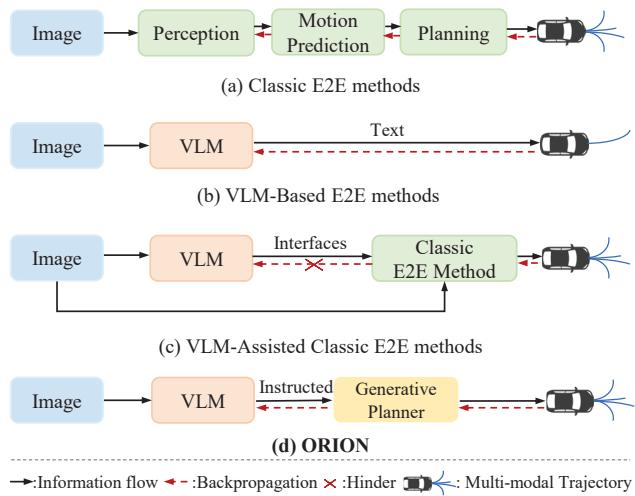
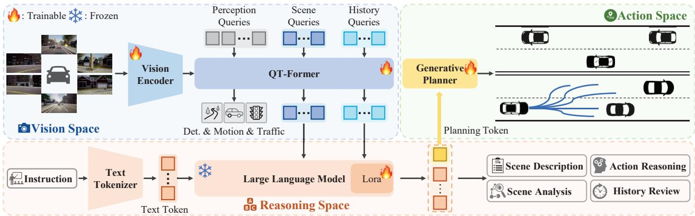
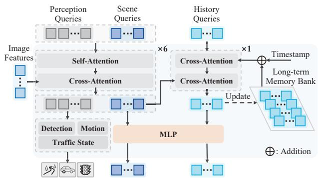
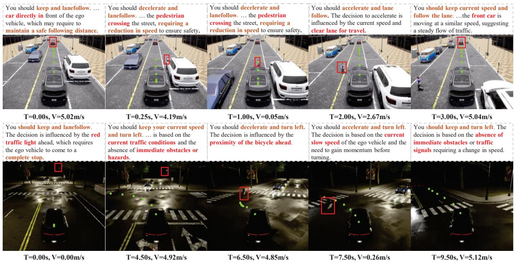
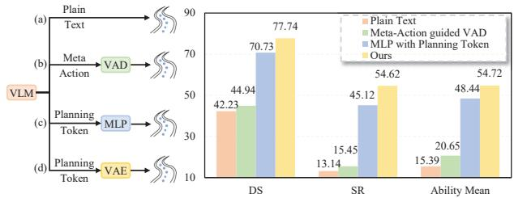

# ORION: A Holistic End-to-End Autonomous Driving Framework by Vision-Language Instructed Action Generation

Haoyu Fu1∗, Diankun Zhang2∗, Zongchuang Zhao1∗, Jianfeng Cui2, Dingkang Liang1†, Chong Zhang2, Dingyuan Zhang1, Hongwei Xie2†, Bing Wang2, Xiang Bai1-

1 Huazhong University of Science and Technology, 2 Xiaomi EV hyfu, zcuangzhao, dkliang @hust.edu.cn https://xiaomi-mlab.github.io/Orion/

## Abstract

End-to-end (E2E) autonomous driving methods still struggle to make correct decisions in interactive closed-loop evaluation due to limited causal reasoning capability. Current methods attempt to leverage the powerful understanding and reasoning abilities of Vision-Language Models (VLMs) to resolve this dilemma. However, the problem is still open that few VLMs for E2E methods perform well in the closed-loop evaluation due to the gap between the semantic reasoning space and the purely numerical trajectory output in the action space. To tackle this issue, we propose ORION, a hOlistic E2E autonomous dRiving framework by vIsion-language instructed actiON generation. ORION uniquely combines a QT-Former to aggregate long-term history context, a Large Language Model (LLM) for driving scenario reasoning, and a generativeplannerfor precision trajectory prediction. ORION further aligns the reasoning space and the action space to implement a unified E2E optimizationfor both visual question-answering (VQA) and planning tasks. Our method achieves an impressive closed-loop performance of 77.74 Driving Score (DS) and 54.62% Success Rate (SR) on the challenge Bench2Drive datasets, which outperforms state-of-the-art (SOTA) methods by a large margin of14.28 DS and 19.61% SR.

## 1. Introduction

End-to-end (E2E) autonomous driving has witnessed significant advancements in recent years. Classic E2E methods [9, 19, 26, 69, 72] integrate perception [28, 44, 68], prediction [8, 16, 51], and planning [18, 45] modules through multi-task learning, as shown in Fig. 1(a). These methods optimize driving trajectories by imitating expert demonstrations, achieving promising performance in the openloop evaluation [7, 55]. Nevertheless, these methods lack the common sense to complete complex causal reasoning. As a result, they struggle with comprehensive closed-loop benchmarks [24] that require autonomous decision-making and dynamic environmental interactions. Recently, Vision-Language Models (VLMs) [1, 11, 40, 59] have accumulated rich world knowledge and aligned vision-language space between the vision encoder [46, 67] and Large-Language Models (LLMs) through the large-scale data training, providing new insight for achieving E2E autonomous driving.

  
Figure 1. The comparison of different E2E paradigms. Our ORION framework establishes the differentiable connection between reasoning and action space via the generative planner.

Leveraging VLMs for E2E autonomous driving is not trivial since VLM’s ability exists in the reasoning space, while E2E methods only need the numerical planning results in the action space. Although some convenient methods [20, 75] leverage VLM output trajectories by finetuning private models [3] or by employing discrete special tokens, these approaches essentially still perform text classification tasks. Besides, limited by the intrinsic autoregressive mechanism of VLMs, the trajectories these method output lack diversity [54], which is inconsistent with the natural uncertainty of human planning [9]. Therefore, directly using VLM for E2E autonomous driving may produce suboptimal solutions in complex scenes [65]. Other methods endeavor to bridge the gap via utilizing VLM output meta-action (e.g., turn left) to assist classic E2E methods [27, 41], as shown in Fig. 1(c). They adopt a carefully crafted interface to transmit the reasoning space information into the action space. However, this paradigm decouples these two spaces, hindering collaborative optimization between the trajectory optimization and the VLM reasoning process. Thus, the capabilities of VLM for E2E planning are not fully leveraged by the above framework.

To tackle this problem, we propose a hOlistic E2E autonomous dRiving framework by vIsion-language instructed actiON generation, termed ORION. Inspired by the field of conditional generation [29, 39, 48, 49], where the semantic information controls the generation of detailed image features, we find that the generative model can construct a unified distribution of diverse types of data (e.g., image, text). Therefore, considering that the reasoning space of VLM and the action space of trajectory belong to different domains, we introduce a generative planner to establish a unified latent representation for aligning the two spaces. With the help of the introduced module, we take advantage of VLMs’ reasoning information to construct trajectory, facilitating the model to capture the causal relationship between scene information and driving behavior.

Furthermore, it is well-known that long-term memory is necessary for E2E autonomous driving since historical information often influences trajectory planning within the current scene. Existing VLMs for E2E methods [20, 65] typically concatenate multi-frame images for temporal modeling. They are constrained by the token length of VLM and incur significant computational overhead. Instead, motivated by OmniDrive [61], which extracts features through Q-Former-styled architecture, we introduce QT-Former, a query-based temporal module. Besides focusing on the information of the objects in the scene, we also consider the long-term context of the scene. By leveraging a memory bank and a set of history queries, QT-Former effectively stores and extracts essential historical scene information to aggregate long-term visual context, further enhancing the temporal perception ability of reasoning and action space.

We evaluate the closed-loop driving ability of ORION on the Bench2Drive dataset, which builds interactive scenarios based on the CARLA [12] simulator. ORION achieves 77.74 Driving Score (DS) and 54.62% Success Rate (SR), surpassing previous SOTA methods [25] with 14.28 driving scores and 19.61% success rates, demonstrating the powerful superiority of ORION.

The benefits of ORION are from three aspects: 1) Thanks to the capability of the generative model to characterize the latent distribution of data, we bridge the gap between the reasoning space of VLM and the action space of trajectories through a generative planner, enabling the VLM to understand the scene and instruct trajectory generation. 2) The QT-former in ORION effectively captures long-term temporal dependencies, enabling the model to integrate temporal vision context into reasoning and action spaces. 3) Without bells and whistles, ORION achieves excellent performance in the Bench2Drive closed-loop benchmark. Experiments also show that ORION is compatible with diverse generative models, which further demonstrate the flexibility of our proposed framework.

## 2. Related work

## 2.1. End-to-End Autonomous Driving

End-to-end autonomous driving (E2E-AD) [64, 70] aims to directly process raw sensor data to predict motion trajectories and control signals, jointly optimizing the entire system to minimize error accumulation. Recent works like UniAD [19] and VAD [26] integrate perception and motion prediction into a unified planning framework. VADv2 [9] introduces probabilistic planning, outputting the probabilistic distribution of action and sampling one action to control the vehicle. GenAD [72] and DiffusionDrive [33] employ the generative model to predict multi-modal trajectory. However, these methods mainly excel in open-loop evaluation, where the model could readily overfit to the ego status, as highlighted in Ego-MLP [66] and BEV-Planner [32]. Although some studies [9, 22, 23, 72] adopt closed-loop evaluation in CARLA [12] to assess robust driving ability, their performance remains suboptimal, revealing a notable gap between their open-loop and closed-loop results. Thus, we aim to construct an E2E-AD system with strong consistency between open-loop and closed-loop performance.

## 2.2. Vision-Language Models (VLMs)

Recently, Vision-Language Models (VLMs) [1, 3, 11, 31, 36, 59] have extended large language models (LLMs) [40, 57] to multiple modalities using various vision encoders [46, 67], demonstrating strong vision contextual understanding and reasoning. LLaVA series [36, 37] introduce the visual instruction tuning to perform image-text alignment, while Monkey [31] improves detail comprehension by dividing images. InternVL series [10, 11] further enhances the vision detail understanding via a dynamic resolution strategy. However, most methods map the visual feature into language space through MLP, incurring high computational costs due to numerous image tokens. To alleviate this burden, QwenVL [4] and Flamingo [2] reduce token redundancy using cross-attention, while Qwen2VL [59] enhances efficiency with dynamic resolution and multimodal rotary position embedding (M-RoPE) for simultaneously processing diverse modalities.

  
Figure 2. The pipeline of our ORION, a holistic E2E framework aligning vision-reasoning-action space. It consists of three key compo nents: a QT-Former to extract long-term context and link the vision space of the vision encoder and LLM’s reasoning space; the LLM for performing textual tasks and predicting a planning token; and a generative planner that bridges reasoning and action space for generating a multi-modal trajectory conditioned by the planning token.

Many works [6, 63, 73] have explored VLMs for downstream tasks, while ORION combines VLMs with generative planners for autonomous driving.

## 2.3. VLM for End-to-End Autonomous Driving

VLMs showcase excellent contextual understanding, comprehensive world knowledge, and impressive generalization, motivating their application in autonomous driving. Some methods [20, 61, 65] directly employ VLMs for environment perception and explainable trajectory prediction in text form. For example, Omnidrive [61] adopts Stream-PETR [60] as Q-Formar3D to compress current scene features and performs trajectory prediction through LLM’s text prediction. EMMA [20], trained on large-scale data, enables Gemini [3] to predict discrete textual planning with strong open-loop performance. Other studies [27, 56] integrate VLMs with representative E2E models in a fast-slow dual system. DriveVLM [56] leverages VLM to predict the low-frequency trajectory, which will be refined by an E2E model. Senna [27] further replaces the low-frequency with the meta-action, guiding the VAD [26] to predict motion. These methods only implement the open-loop evaluation. Although DriveMLM [62] and LMDrive [50] leverage the VLM to implement closed-loop evaluation, they struggle with processing complex scenarios limited by the simple CARLA Town05Long benchmark.

In contrast, we propose a holistic E2E framework that employs a generative planner to bridge the reasoning space of VLM and the action space of trajectories, enabling interpretable driving decisions and precise trajectory generation in complex real-world scenarios of Bench2Drive.

  
Figure 3. The detailed architecture of QT-Former. It accepts diverse queries and image features as inputs to detect traffic elements, predict motion, and aggregate long-term vision context.

## 3. Method

In this paper, we present ORION. As shown in Fig. 2, ORION first encodes the image tokens with a vision encoder. Then, a QT-Former (Sec. 3.1) leverages diverse queries to aggregate long-term vision context and perceive traffic elements. The LLM (Sec. 3.2) subsequently combines the vision features with user instructions to generate a planning token. Finally, a generative planner (Sec. 3.3) bridges reasoning and action space, predicting a multimodal trajectory conditioned by the planning token.

## 3.1. QT-Former

To compress and extract multi-view image features $F _ { m }$ derived from the vision encoder while achieving long-term information modeling, we introduce QT-Former, a querybased temporal module, as shown in Fig. 3. Specifically, following Q-Former3D [61], we first set up two types of learnable queries, the scene queries $Q _ { s } \in \hat { \mathbb { R } ^ { N _ { s } \times C _ { q } } }$ and the perception queries $Q _ { p } \in \mathbb { R } ^ { N _ { p } \times C _ { q } }$ , where $N _ { s }$ and $N _ { p }$ are the number of scene and perception queries, respectively, and $C _ { q }$ is the channel of queries. $Q _ { s } , Q _ { p }$ are processed through self-attention (SA) to exchange their information. Then they interact with image features $F _ { m }$ with 3D positional encoding [38] $P _ { m }$ in the cross-attention (CA) module. After that, the perception queries are fed into the multiple auxiliary heads for object detection(e.g., objects and map), traffic state (e.g. traffic signs, traffic lights, and whether the traffic light affects the ego vehicle), and motion prediction of dynamic agents. The scene queries serve as tokens representing the key information of the current scene.

Additionally, we employ a set of history queries $Q _ { h } \in$ $\mathbb { R } ^ { N _ { h } \times C _ { q } }$ and a long-term memory bank $\boldsymbol { M } ^ { \bullet } \in \mathrm { \widehat { R } } ^ { ( N _ { h } \times n ) \times C _ { q } }$ to efficiently retrieve and store essential historical scene information $( e . g .$ , preceding road conditions and traffic light status), where $N _ { h }$ is the number of history queries and n is the maximum history frame length. We utilize the $Q _ { h }$ to extract the former frame queries in M with relative timestamp embedding $P _ { t }$ through a CA block. Then $Q _ { h }$ interacts with current scene features $Q _ { \varepsilon }$ in another CA block, enabling the extraction of relevant details about the current scenario. This process can be formulated as:

$$
\begin{array} { l } { { Q _ { h } = \mathrm { C A } ( Q _ { h } , M + P _ { t } , M + P _ { t } ) , } } \\ { { \hat { Q } _ { h } = \mathrm { C A } ( Q _ { h } , Q _ { s } , Q _ { s } ) , } } \end{array}\tag{1}
$$

where $P _ { t }$ denotes the relative timestamp embedding.

Subsequently, the updated history queries $\hat { Q } _ { h }$ are stored in the memory bank M following the First-In-First-Out (FIFO) replacement policy, formulated as:

$$
M = [ \hat { Q } _ { h } ^ { t - n } , \cdot \cdot \cdot , \hat { Q } _ { h } ^ { t - 1 } , \hat { Q } _ { h } ^ { t } ] ,\tag{2}
$$

where t is the current frame time, n is the stored frame length of M.

Although some methods [52, 60] also leverage the memory bank to store preceding information, they typically perceive all or one-step compressed vision features of the current frame. Instead, we initialize a few numbers of the history queries to further extract the current compressed scene information, reducing the storage burden while enhancing long-term scene understanding ability.

Finally, we leverage two-layer MLP to convert the updated history queries ${ \hat { Q } } _ { h }$ and current scene features $Q _ { s }$ to corresponding history tokens $x _ { h }$ and scene tokens $x _ { s }$ in the reasoning space of LLM.

## 3.2. Large Language Model

The LLM is pivotal to our framework because the highquality reasoning of the current driving scenario is necessary to instruct the generator to generate a reasonable and correct trajectory generation in action space. As shown in Fig. 2, the user instruction $X _ { q } ,$ including scene description, history information review, scene analysis, and action reasoning, is first encoded into language tokens $\boldsymbol { x } _ { q } ~ \in \mathbb { R } ^ { L \times C }$ by the text tokenizer, where L is the token length and $C$ is the dimension of LLM. Then, the scene tokens $x _ { s }$ and history tokens $x _ { h }$ are combined with the language tokens $x _ { q }$ and fed into LLM. Leveraging its abundant world knowledge and outstanding reasoning ability, LLM performs hierarchical text-based reasoning tasks in the driving scenario. Meanwhile, we design a planning QA template with a special planning token s for LLM as the final QA to accumulate the understanding and reasoning context of the entire driving scenario to the $s ,$ formally written as:

$$
s \sim p ( s \mid x _ { s } , x _ { h } , x _ { q } , x _ { a } ) ,\tag{3}
$$

where $x _ { a }$ denotes the generation answer of LLM. The embedding of the planning token s will serve as a condition to control the trajectory generation.

To compensate for the lack of high-quality VQA annotations within closed-loop simulation to train LLMs for comprehensively understanding driving scenarios, we extend the Bench2Drive dataset via a fully automatic VQA annotation pipeline powered by Qwen2-VL [59] and propose our VQA dataset for close-loop simulation driving scenario Bench2Drive, Chat-B2D. We provide detailed information on Chat-B2D and its annotation pipeline in the Appendix.

## 3.3. Generative Planner

Generative models [15, 29, 49] can achieve deep representation learning of data distributions through latent space construction, effectively capturing critical features and intrinsic correlations within data. Recent researches [5, 39, 48] have demonstrated semantic correlations between latent spaces of different modalities, where adjusting the distribution parameters of one modality space enables precise control over the generation process of another modality space.

Inspired by the generative domain, we introduce a generative planner to bridge the gap between the reasoning and action space. Specifically, we formulate the current trajectory a in action space as a conditional probability distribution $p ( a \mid s )$ , where s is the planning token. To construct $p ( a \mid s )$ , there are many excellent methods in the generation field (e.g., variational autoencoders (VAE) [29] and diffusion model [49]).

As there are essential differences in the distribution between the reasoning space of VLM and the action space of trajectory, we use the VAE [29] model to align them in the Gaussian distribution. We employ two-layer MLPs to project both the state s and the ground-truth trajectory t into Gaussian variables z in the latent space, denoted as:

$$
p ( z _ { s } | s ) \sim N ( \mu _ { s } , \sigma _ { s } ^ { 2 } ) , p ( z _ { t } | t ) \sim N ( \mu _ { t } , \sigma _ { t } ^ { 2 } ) ,\tag{4}
$$

where $N ( \mu , \sigma ^ { 2 } )$ denotes a Gaussian distribution with a mean of $\mu ,$ and standard deviation of $\sigma .$ We then use Kullback-Leibler divergence loss to enforce distribution matching, represented as:

$$
\begin{array} { r } { \mathcal { L } _ { v a e } = D _ { K L } ( p ( \mathbf { z } | \mathbf { s } ) , p ( \mathbf { z } | \mathbf { t } ) ) . } \end{array}\tag{5}
$$

We then use the GRU decoder in GenAD [72] to decode the trajectory from the latent space z. Significantly, the functions of VAE in this paper are not the same as VAE of GenAD. The former only uses a single token encoded in the reasoning space from the perspective of the ego vehicle as input, aiming to bridge the gap between reasoning space and action space. The latter leverages the features of all agents encoded in the BEV space as input, designed to learn specific patterns of the highly structured trajectories of both the ego vehicle and other agents.

Additionally, we also attempt to replace the VAE with alternative generative models, such as the diffusion model for trajectory generation. Benefiting from the proposed method that bridges the gap between the reasoning and action space through distribution learning in latent space, our framework still demonstrates superior performance compared to other methods (detailed in Sec. 4.5).

## 3.4. Training Objectives

For the detection task of the proposed QT-Former, the detection loss is defined as $\mathcal { L } _ { d e t } = \mathcal { L } _ { c l s } + \mathcal { L } _ { r e g }$ , where $\mathcal { L } _ { c l s }$ is focal loss [35] and $\mathcal { L } _ { r e g }$ is L1 loss. For the traffic state and motion prediction, the losses are defined as $\mathcal { L } _ { t r a }$ and $\mathcal { L } _ { m } = \mathcal { L } _ { m c l s } + \mathcal { L } _ { m r e g } ,$ , respectively, where $\mathcal { L } _ { t r a }$ and $\mathcal { L } _ { m c l s }$ are focal loss, and $\mathcal { L } _ { m r e g }$ is L1 loss. The total loss of QT-Former is:

$$
\mathcal { L } _ { q t } = \mathcal { L } _ { d e t } + \mathcal { L } _ { t r a } + \mathcal { L } _ { m } .\tag{6}
$$

For the LLM, we leverage the auto-regressive crossentropy loss $\mathcal { L } _ { c e }$ . For the Generative Planner in our framework, $\mathcal { L } _ { v a e }$ is the Kullback-Leibler divergence loss used to align the reasoning space and action space. Following VAD [26], we adopt the collision loss $\mathcal { L } _ { c o l } .$ , boundary loss $\mathcal { L } _ { b d }$ , and MSE loss $\mathcal { L } _ { m s e }$ for the planning prediction. The total loss of generative planner is:

$$
\mathcal { L } _ { g p } = \mathcal { L } _ { v a e } + \mathcal { L } _ { m s e } + \mathcal { L } _ { c o l } + \mathcal { L } _ { b d } .\tag{7}
$$

In summary, total loss of the proposed ORION is:

$$
\mathcal { L } = \mathcal { L } _ { q t } + \mathcal { L } _ { c e } + \mathcal { L } _ { g p } .\tag{8}
$$

The loss weight follows [26, 60, 72] without special design.

## 4. Experiments

## 4.1. Dataset and Evaluation Metrics

Dataset. We train and evaluate ORION on the Bench2drive dataset [24], a closed-loop evaluation protocol under

CARLA V2 [12] for E2E autonomous driving. It provides an official training set where we use the base set (1000 clips) for fair comparison with all the other baselines, which is divided into 950 clips for training and 50 clips for open-loop validation. Each clip captures approximately 150 meters of continuous driving within a specific traffic scene. For closed-loop evaluation, we evaluate the proposed method on the official set of 220 short routes designed by Bench2drive, spanning 44 interactive scenarios with 5 routes per scenario. Additionally, we compare our method with other baselines on nuScenes [7] open-loop evaluation (details in Appendix). Evaluation Metrics. Bench2drive includes five metrics for closed-loop evaluation: Driving Score (DS), Success Rate (SR), Efficiency, Comfortness, and Multi-Ability. The Success Rate quantifies the proportion of routes successfully completed within the allotted time. The Driving Score follows CARLA [12], incorporating both route completion status and violation penalties, where infractions reduce the score via discount factors. Efficiency and Comfortness are used to measure the speed performance and comfort of the autonomous driving system during the driving process, respectively. Multi-Ability measures 5 advanced skills independently for urban driving. For open-loop evaluation, we use the L2 distance error and the collision rate. Additionally, we use CIDEr [58], BLEU [42], and ROUGE-L [34] to evaluate the performance of ORION on VQA tasks.

## 4.2. Implementation Details

Model Setting. Consistent with classic E2E baselines [19, 26, 72] on Bench2Drive, ORION is a fully HD map-free method that only uses the Navigation Command (NC) as an input condition for the trajectory predictions rather than locations of lane center (i.e., target point, TP). ORION is an anchor-free method that outputs 6 mode trajectory predictions corresponding to the 6 NC defined in Bench2Drive.

Training Process. All experiments are conducted on 32 NVIDIA A800 GPUs with 80 GB of memory. Following Omnidrive [61], we adopt EVA-02-L [13] as the vision encoder. Vicuna v1.5 [71] is employed in ORION and finetuned using LoRA [17], with the rank dimension and alpha set to 16. The default number of scene, perception, and historical queries are 512, 600, and 16, respectively. We set the Memory Bank’s stored frame number n to 16. During training, data augmentations are applied to input images, which are first resized to a resolution of 640  640. More training details are provided in the Appendix.

## 4.3. Main Results

As reported in Tab. 1, the performance of ORION significantly exceeds all end-to-end methods on Bench2Drive, even the method with expert feature distillation. Specifically, ORION surpasses the latest SOTA method Drive-Transformer [25] by +14.28 DS and +19.61% SR. It also achieves improvements of +13.52 DS and +21.54% SR over DriveAdapter [22], even if DriveAdapter distills the expert feature from Think2Drive [30] and accepts two modalities (i.e., camera and LiDAR) inputs. The above promising results effectively demonstrate the superiority of our ORION.

Table 1. Closed-loop, Open-loop and Multi-Ability Results of E2E-AD Methods in Bench2Drive under base set. C/L refers to cam era/LiDAR. Avg.L2 is averaged over the predictions in 2 seconds under 2Hz, similar to UniAD. \* denote expert feature distillation. Ref: Reference, Con: Condition, Mod: modality, NC: navigation command, TP: target point, DS: Driving Score, SR: Success Rate, Eff: Effi ciency, Com: Comfortness, M: Merging, O: Overtaking, EB: Emergency Brake, GW: Give Way, TS: Traffic Sign.
<table><tr><td rowspan="2">Method</td><td rowspan="2">Ref</td><td rowspan="2">Con Mod</td><td rowspan="2"></td><td colspan="4">Closed-loop</td><td>Open-loop</td><td colspan="5">Ability (%) ↑</td></tr><tr><td>DS↑</td><td>SR(%)↑</td><td>Eff.↑</td><td>Com.↑</td><td>Avg.L2 (m)</td><td>M</td><td>0</td><td>EB</td><td>GW TS</td><td>Mean</td></tr><tr><td>TCP* [64]</td><td>NeurIPS 22 TP</td><td></td><td>C</td><td>40.70</td><td>15.00</td><td>54.26</td><td>47.80</td><td>1.70</td><td>16.18 20.00</td><td></td><td>20.0010.00</td><td>6.99</td><td>14.63</td></tr><tr><td>TCP-ctrl*</td><td>NeurIPS 22</td><td>TP TP</td><td>C</td><td>30.47</td><td>7.27</td><td>55.97</td><td>51.51</td><td></td><td>10.29</td><td>4.44</td><td></td><td>10.00 10.006.45</td><td>8.23</td></tr><tr><td>TCP-traj*</td><td>NeurIPS 22</td><td>C</td><td></td><td>59.90</td><td>30.00</td><td>76.54</td><td>18.08</td><td>1.70</td><td>8.89</td><td></td><td></td><td>24.2951.6740.0046.28</td><td>34.22</td></tr><tr><td>TCP-traj w/o distillation</td><td>NeurIPS 22 TP</td><td>C TP</td><td></td><td>49.30</td><td>20.45</td><td>78.78</td><td>22.96</td><td>1.96</td><td>17.14</td><td>6.67</td><td></td><td>40.0050.0028.72</td><td>28.51</td></tr><tr><td>ThinkTwice* [23]</td><td>CVPR 23</td><td>C</td><td></td><td>62.44</td><td>31.23</td><td>69.33</td><td>16.22</td><td>0.95</td><td>27.3818.42 35.82 50.00 54.23</td><td></td><td></td><td></td><td>37.17</td></tr><tr><td>DriveAdapter* [22]</td><td>ICCV 23</td><td>TP C&amp;L</td><td></td><td>64.22</td><td>33.08</td><td>70.22</td><td>16.01</td><td>1.01</td><td>28.82 26.38 48.76 50.00 56.43</td><td></td><td></td><td></td><td>42.08</td></tr><tr><td>AD-MLP [66]</td><td>arXiv 23</td><td>NC C</td><td></td><td>18.05</td><td>0.00</td><td>48.45</td><td>22.63</td><td>3.64</td><td>0.00 0.00</td><td>0.00</td><td>0.00</td><td>4.35</td><td>0.87</td></tr><tr><td>UniAD-Tiny [19]</td><td>CVPR 23</td><td>NC</td><td>C</td><td>40.73</td><td>13.18</td><td>123.9247.04</td><td></td><td>0.80</td><td>8.89 9.33</td><td></td><td>20.00 20.00 15.43</td><td></td><td>14.73</td></tr><tr><td>UniAD-Base [19]</td><td>CVPR 23</td><td>NC</td><td>C</td><td>45.81</td><td>16.36</td><td>129.2143.58</td><td></td><td>0.73</td><td></td><td>14.1017.78 21.6710.0014.21</td><td></td><td></td><td>15.55</td></tr><tr><td>VAD [26]</td><td>ICCV 23</td><td>NC</td><td>C</td><td>42.35</td><td>15.00</td><td>157.9446.01</td><td></td><td>0.91</td><td></td><td>8.11 24.44 18.64 20.00 19.15</td><td></td><td></td><td>18.07</td></tr><tr><td>GenAD [72]</td><td>ECCV 24</td><td>NC</td><td>C</td><td>44.81</td><td>15.90</td><td></td><td></td><td></td><td></td><td></td><td></td><td></td><td></td></tr><tr><td>MomAD[53]</td><td>CVPR 25</td><td>NC</td><td>C</td><td>44.54</td><td>16.71</td><td>170.2148.63</td><td></td><td>0.87</td><td></td><td></td><td></td><td></td><td></td></tr><tr><td>DriveTransformer-Large [25]</td><td>ICLR 25</td><td>NC</td><td>C</td><td>63.46</td><td>35.01</td><td>100.64 20.78</td><td></td><td>0.62</td><td></td><td>17.5735.0048.3640.00 52.10</td><td></td><td></td><td>38.60</td></tr><tr><td>ORION (Ours)</td><td></td><td>NC</td><td>C</td><td>77.74(+14.28) 54.62(+19.61) 151.48 17.38</td><td></td><td></td><td></td><td>0.68</td><td></td><td>25.00 71.11 78.33 30.00 69.15 54.72(+16.12)</td><td></td><td></td><td></td></tr></table>

Additionally, the Multi-Ability results are also illustrated in Tab. 1. ORION achieves +16.12% and +12.64% performance improvements compared with DriveTransformer [25] and DriveAdapter [22] in the average ability, respectively. Specifically, our model demonstrates outstanding performance in some scenarios, such as Overtaking (71.11%), Emergency Brake (78.33%), and Traffic Sign (69.15%), which shows that our model benefits from the powerful reasoning capability of VLM to understand the causal interaction between the ego vehicle, dynamic elements and static elements (Traffic Signs) in driving scenarios. On the other hand, our model falls behind DriveAdapter in Merging and Give Way, which shows that ORION is not good at making lane-changing decisions. The phenomenon may be caused by the more diverse decision-making timing for lane-changing, making the model encounter difficulties in capturing the correct causal relationship [22].

## 4.4. Qualitative Results

The qualitative results of ORION in two canonical closeloop evaluation scenarios of Bench2Drive are shown in Fig. 4. It shows both the driving action reasoning and trajectory prediction outputted by our model, as well as the corresponding ego-vehicle states. We observe that ORION can capture the correct causal relationship in the scenario and make correct driving decisions, then predict the planning trajectory following the reasoning instruction, demonstrating the surprising interpretability of our method. More qualitative results can be found in the Appendix.

## 4.5. Ablation Study

Advantages of the vision-language instructed action generation. To validate the effectiveness of the planning generation paradigm proposed in this paper, extensive experiments are conducted to compare our paradigm with canonical trajectory prediction paradigms of VLMbased autonomous driving methods, including (a) plain text outputs [20, 61], (b) dual system (e.g. VAD [26]) outputs guided by elaborated design VLM interface (e.g. meta-action) [27], and (c) special token decode outputs by MLP [47], as shown in the left part of Fig. 5. To ensure the fairness of the ablations, experiments of different paradigms use the same sensor inputs, vision encoder, QT-former, and VLM as our ORION and are trained by the same strategy. Only the output formats of VLMs are adjusted according to the requirements of different paradigms.

The results are illustrated in the right part of Fig. 5. The plain text paradigm performs the worst (42.23 DS, 13.14% SR, and 15.39% mean ability), indicating the limitations of plain text output in closed-loop driving scenarios, potentially due to its inadequate numerical reasoning capabilities [14, 43]. Compared with the plain text paradigm, the dual-system paradigm only obtains a slight performance improvement. Note that the reproduced results of the dualsystem paradigm are very close to the official results of VAD in Tab. 1. The results may indicate that the performance of the dual-system paradigm may be bottlenecked by the insufficient capabilities of classic E2E methods. Although the effectiveness of the MLP decoder paradigm has been validated in CarLLava [47], our paradigm still shows a performance gain of +7.01 DS, +9.5% SR, and +6.28% average ability. The results may be caused by the fact that the MLP is the simplest way to align features between different spaces, which is consistent with the viewpoint presented in this paper. Additionally, the MLP-decoder struggles with handling multi-modal trajectory [9, 21], making it still significantly lag behind ORION in closed-loop evaluation.

  
Figure 4. Qualitative results of ORION on the Bench2Drive closed-loop evaluation set. The brown, red, and green refer to the action decision, the objects that influence driving decisions, and the prediction trajectory, respectively.

  
Figure 5. Advantages of the vision-language instructed action generation. DS and SR denote Driving Score and Success Rate separately. VAD [26] is a classic E2E model.

Analysis on different generative planners. We then investigate the effect of employing different generative planners to bridge the reasoning-action space. Specifically, we implement the diffusion model by simply replacing the VAE, which uses K-means trajectory anchors as prior information and outputs 20 mode trajectory predictions. The results are listed in Tab. 2. Note that VAE-based trajectory generation demonstrates a significant performance improvement over the diffusion-based. We argue the main reasons are as follows: 1) Compared with the conditional denoising process of diffusion, the latent space of VAE more directly and effectively aligns the reasoning information of VLM to the multi-modal action space. 2) The training process of VAE is inherently more stable, facilitating better alignment between the reasoning and action spaces. Surprisingly, even using diffusion, ORION still surpasses the DriveTransformer in Tab. 1 by +8.51 DS, +11.53% SR, and +8.08% average ability. This impressive result emphasizes the effectiveness and flexibility of our framework.

Table 2. Ablation on diverse generative planner. DS and SR denote Driving Score and Success Rate separately.
<table><tr><td rowspan="2">Generative Planner</td><td colspan="2">Closed-loop</td><td colspan="2">Open-loop</td><td rowspan="2">Ability Avg.</td></tr><tr><td>DS↑</td><td>SR(%)↑</td><td>Avg. L2 (m) ↓ Avg. col (%)↓</td><td></td></tr><tr><td>Diffusion</td><td>71.97</td><td>46.54</td><td>0.73</td><td>0.96</td><td>46.68</td></tr><tr><td>VAE (Ours)</td><td>77.74</td><td>54.62</td><td>0.68</td><td>0.47</td><td>54.72</td></tr></table>

Effectiveness of QT-Former designs. Tab. 3 shows the detailed ablations of each design in the introduced QT-Former. By leveraging explicit traffic state supervision (ID-2), ORION achieves 74.65 DS and 49.31% SR, which already outperforms DriveAdapter [22] and DriveTRansformer [25] by a large margin and makes an improvement of +18.32 and +23.26% compared with the baseline (ID-1). This is because a better understanding of traffic signals helps ORION directly reduce infractions in closed-loop evaluation. It is worth noting that due to the causal confusion [22], it’s not trivial for previous methods to fully understand the corresponding causal relationships by simply introducing traffic state supervision, especially when encountering mixed expert behaviors before traffic signs [22, 23, 25, 64]. This result also proves that ORION can better utilize the reasoning ability of VLM to capture the causal relationship between scene information and driving behavior by aligning reasoning space and action space. This conclusion also can be verified by the results in Tab. 1, where ORION shows a significant advantage in traffic sign ability (+17.05%) compared to previous E2E methods [25].

Table 3. Ablation on QT-Former designs in different frameworks. DS and SR denote Driving Score and Success Rate separately. Traffic state means using explicit traffic state supervision. T: Plain Text, G: Instructed Generator
<table><tr><td rowspan="2">ID</td><td rowspan="2">Traffic State</td><td rowspan="2">Motion Pred.</td><td rowspan="2">Memory Bank</td><td colspan="2">Output type</td><td colspan="2">Closed-loop</td></tr><tr><td>T</td><td>G</td><td>DS↑</td><td>SR(%) ↑</td></tr><tr><td>1</td><td></td><td></td><td></td><td></td><td>√</td><td>56.33</td><td>26.05</td></tr><tr><td>2</td><td>√</td><td></td><td></td><td></td><td>√</td><td>74.65</td><td>49.31</td></tr><tr><td>3</td><td>√</td><td>√</td><td></td><td></td><td>√</td><td>74.07</td><td>49.77</td></tr><tr><td>4</td><td>√</td><td>√</td><td>√</td><td></td><td>√</td><td>77.74</td><td>54.62</td></tr><tr><td>5</td><td></td><td></td><td></td><td>√</td><td></td><td>25.45</td><td>10.38</td></tr><tr><td>6</td><td>√</td><td>√</td><td>√</td><td>√</td><td></td><td>42.23</td><td>13.14</td></tr></table>

Table 4. Ablation of history queries number. DS and SR denote Driving Score and Success Rate separately.
<table><tr><td rowspan="2">Query Num.  $N _ { h }$ </td><td colspan="2">Closed-loop</td><td colspan="2">Open-loop</td></tr><tr><td>DS↑</td><td>SR(%) ↑</td><td></td><td>Avg. L2 (m) ↓ Avg. col (%)↓</td></tr><tr><td>0</td><td>65.10</td><td>38.83</td><td>0.67</td><td>0.61</td></tr><tr><td>8</td><td>68.09</td><td>39.09</td><td>0.66</td><td>0.62</td></tr><tr><td>16</td><td>74.10</td><td>44.66</td><td>0.68</td><td>0.55</td></tr><tr><td>32</td><td>62.46</td><td>37.73</td><td>0.65</td><td>0.73</td></tr></table>

Then, we combine the motion prediction module in the QT-Former’s perception head, which gains a slight improvement of +0.4% SR and further reduces the collision rate. The slight degradation on DS may be caused by the trade-off between DS and SR in the CARLA benchmark protocol [74]. Involving a memory bank into QT-Former and supervised by QA pairs about historical information leads to an increase of +3.67 DS and +4.85% SR and boosts the final performance to 77.74 DS and 54.62% SR, which demonstrates our model can benefit from the long-temporal memory of vision tokens.

We also apply QT-former to the plain text output type. By leveraging its design, we improve the model’s performance by 16.78 DS and 2.78% SR over the baseline (ID-5). Meanwhile, with the same QT-former designs, our ORION framework achieves further improvements of 35.51

Table 5. Effectiveness of auxiliary VQA task training. DS and SR denote Driving Score and Success Rate separately. C/B/R refers to CIDEr/BLEU/ROUGE-L. FT: Fine Tuning
<table><tr><td rowspan="2">ID</td><td rowspan="2">FT</td><td rowspan="2">VQA Planning FT</td><td colspan="2">Closed-loop</td><td colspan="2">Language</td><td>Open-loop</td></tr><tr><td></td><td>DS↑ SR(%) ↑</td><td>C↑</td><td>B↑ R↑</td><td>Avg. L2 (m) ↓</td></tr><tr><td>1</td><td>√</td><td></td><td></td><td></td><td></td><td>65.65 50.82 77.65</td><td></td></tr><tr><td>2</td><td></td><td>√</td><td>74.10</td><td>44.66</td><td></td><td></td><td>0.68</td></tr><tr><td>3</td><td>√</td><td>√</td><td>77.74</td><td>54.62</td><td></td><td>65.7752.4977.58</td><td>0.68</td></tr></table>

DS and 41.48% SR compared with the plain text output mode, demonstrating the effectiveness of our approach.

Influence of history queries number. We conduct ablation experiments to further study the influence of the historical token number. Here, to accelerate the training process, we only train the model by the planning trajectory and history QA pairs without other auxiliary VQA tasks. The results are detailed in Tab. 4. Increasing the historical query number $N _ { h }$ from 0 to 8 brings a significant performance boost around 2.99 DS and 0.26% SR. Further increasing $N _ { h }$ from 8 to 16 leads to the sweet point that achieves the best performance of 74.10 DS and 44.66% SR. However, enlarging $N _ { h }$ from 16 to 32 shows a significant performance degradation. We argue that introducing more historical queries hinders the VLM from capturing the current frame features and latent space optimization in the generative planner.

Influence between VQA task training and planning task training. As shown in Tab. 5. The model cannot obtain both reasoning and planning capabilities with single-task training. Surprisingly, when we train on two tasks simultaneously during training, ORION achieves better performance in both planning and language metrics compared to singletask training. Specifically, the multi-task training leads to improvements of +3.64 DS and +9.66% SR in the planning task, as well as a performance gain of +0.98 CIDEr, +2.56 BLEU, and +0.92 ROUGR-L in the VQA tasks. Furthermore, the results also validate the high quality and validity of the Chat-B2D dataset produced by our auto-pipeline.

## 5. Conclusion

This paper focuses on the challenge of aligning the reasoning space of VLM with the action space in E2E autonomous driving. This dilemma hinders existing methods from simultaneously understanding driving scenarios and generating high-quality multimodal trajectories. To tackle this, we introduce ORION, a holistic end-to-end autonomous driving framework by vision-language instructed action generation. By leveraging the proposed QT-Former and generative planner, we effectively bridge the vision-reasoning-action space. Extensive experiments show that ORION outperforms SOTA methods in closed-loop planning, demonstrating its effectiveness and flexibility.

## 6. Acknowledgments

This work was supported by the NSFC (62225603 and 623B2038).

## References

[1] Josh Achiam, Steven Adler, Sandhini Agarwal, Lama Ahmad, Ilge Akkaya, Florencia Leoni Aleman, Diogo Almeida, Janko Altenschmidt, Sam Altman, Shyamal Anadkat, et al. Gpt-4 technical report. arXiv preprint arXiv:2303.08774, 2023. 1, 2

[2] Jean-Baptiste Alayrac, Jeff Donahue, Pauline Luc, Antoine Miech, Iain Barr, Yana Hasson, Karel Lenc, Arthur Mensch, Katherine Millican, Malcolm Reynolds, et al. Flamingo: a visual language model for few-shot learning. In Proc. ofAdvances in Neural Information Processing Systems, 2022. 3

[3] Rohan Anil, Sebastian Borgeaud, Yonghui Wu, Jean-Baptiste Alayrac, Jiahui Yu, Radu Soricut, Johan Schalkwyk, Andrew M Dai, Anja Hauth, Katie Millican, et al. Gemini: A family of highly capable multimodal models. arXiv preprint arXiv:2312.11805, 1, 2023. 2, 3

[4] Jinze Bai, Shuai Bai, Shusheng Yang, Shijie Wang, Sinan Tan, Peng Wang, Junyang Lin, Chang Zhou, and Jingren Zhou. Qwen-vl: A frontier large vision-language model with versatile abilities. arXiv preprint arXiv:2308.12966, 2023. 3

[5] James Betker, Gabriel Goh, Li Jing, Tim Brooks, Jianfeng Wang, Linjie Li, Long Ouyang, Juntang Zhuang, Joyce Lee, Yufei Guo, et al. Improving image generation with better captions. Computer Science., page 8, 2023. 4

[6] Kevin Black, Noah Brown, Danny Driess, Adnan Esmail, Michael Equi, Chelsea Finn, Niccolo Fusai, Lachy Groom, Karol Hausman, Brian Ichter, et al. π0: A vision-languageaction flow model for general robot control. arXiv preprint arXiv:2410.24164, 2024. 3

[7] Holger Caesar, Varun Bankiti, Alex H Lang, Sourabh Vora, Venice Erin Liong, Qiang Xu, Anush Krishnan, Yu Pan, Giancarlo Baldan, and Oscar Beijbom. nuscenes: A multimodal dataset for autonomous driving. In Proc. of IEEE Intl. Conf. on Computer Vision and Pattern Recognition, pages 11621–11631, 2020. 1, 5

[8] Yuning Chai, Benjamin Sapp, Mayank Bansal, and Dragomir Anguelov. Multipath: Multiple probabilistic anchor trajectory hypotheses for behavior prediction. arXiv preprint arXiv:1910.05449, 2019. 1

[9] Shaoyu Chen, Bo Jiang, Hao Gao, Bencheng Liao, Qing Xu, Qian Zhang, Chang Huang, Wenyu Liu, and Xinggang Wang. Vadv2: End-to-end vectorized autonomous driving via probabilistic planning. arXiv preprint arXiv:2402.13243, 2024. 1, 2, 7

[10] Zhe Chen, Weiyun Wang, Hao Tian, Shenglong Ye, Zhangwei Gao, Erfei Cui, Wenwen Tong, Kongzhi Hu, Jiapeng Luo, Zheng Ma, et al. How far are we to gpt-4v? closing the gap to commercial multimodal models with open-source suites. Science China Information Sciences, page 220101, 2024. 2

[11] Zhe Chen, Jiannan Wu, Wenhai Wang, Weijie Su, Guo Chen, Sen Xing, Muyan Zhong, Qinglong Zhang, Xizhou Zhu,

Lewei Lu, et al. Internvl: Scaling up vision foundation models and aligning for generic visual-linguistic tasks. In Proc. of IEEE Intl. Conf. on Computer Vision and Pattern Recognition, pages 24185–24198, 2024. 1, 2

[12] Alexey Dosovitskiy, German Ros, Felipe Codevilla, Antonio Lopez, and Vladlen Koltun. Carla: An open urban driving simulator. In Conf. on Robot Learning, pages 1–16, 2017. 2, 5

[13] Yuxin Fang, Quan Sun, Xinggang Wang, Tiejun Huang, Xinlong Wang, and Yue Cao. Eva-02: A visual representation for neon genesis. Image and Vision Computing, page 105171, 2024. 5

[14] Simon Frieder, Luca Pinchetti, Ryan-Rhys Griffiths, Tommaso Salvatori, Thomas Lukasiewicz, Philipp Petersen, and Julius Berner. Mathematical capabilities of chatgpt. In Proc. of Advances in Neural Information Processing Systems, 2023. 6

[15] Ian Goodfellow, Jean Pouget-Abadie, Mehdi Mirza, Bing Xu, David Warde-Farley, Sherjil Ozair, Aaron Courville, and Yoshua Bengio. Generative adversarial networks. Communications ofthe ACM, pages 139–144, 2020. 4

[16] Junru Gu, Chenxu Hu, Tianyuan Zhang, Xuanyao Chen, Yilun Wang, Yue Wang, and Hang Zhao. Vip3d: End-to-end visual trajectory prediction via 3d agent queries. In Proc. of IEEE Intl. Conf. on Computer Vision and Pattern Recognition, pages 5496–5506, 2023. 1

[17] Edward J Hu, Yelong Shen, Phillip Wallis, Zeyuan Allen-Zhu, Yuanzhi Li, Shean Wang, Lu Wang, and Weizhu Chen. Lora: Low-rank adaptation of large language models. In Proc. ofIntl. Conf. on Learning Representations, 2022. 5

[18] Shengchao Hu, Li Chen, Penghao Wu, Hongyang Li, Junchi Yan, and Dacheng Tao. St-p3: End-to-end vision-based autonomous driving via spatial-temporal feature learning. In Proc. of European Conference on Computer Vision, pages 533–549, 2022. 1

[19] Yihan Hu, Jiazhi Yang, Li Chen, Keyu Li, Chonghao Sima, Xizhou Zhu, Siqi Chai, Senyao Du, Tianwei Lin, Wenhai Wang, et al. Planning-oriented autonomous driving. In Proc. of IEEE Intl. Conf. on Computer Vision and Pattern Recognition, pages 17853–17862, 2023. 1, 2, 5, 6

[20] Jyh-Jing Hwang, Runsheng Xu, Hubert Lin, Wei-Chih Hung, Jingwei Ji, Kristy Choi, Di Huang, Tong He, Paul Covington, Benjamin Sapp, et al. Emma: End-to-end multimodal model for autonomous driving. arXiv preprint arXiv:2410.23262, 2024. 1, 2, 3, 6

[21] Bernhard Jaeger, Kashyap Chitta, and Andreas Geiger. Hidden biases of end-to-end driving models. In Porc. of IEEE Intl. Conf. on Computer Vision, pages 8240–8249, 2023. 7

[22] Xiaosong Jia, Yulu Gao, Li Chen, Junchi Yan, Patrick Langechuan Liu, and Hongyang Li. Driveadapter: Breaking the coupling barrier of perception and planning in end-to-end autonomous driving. In Porc. ofIEEE Intl. Conf. on Computer Vision, 2023. 2, 6, 7, 8

[23] Xiaosong Jia, Penghao Wu, Li Chen, Jiangwei Xie, Conghui He, Junchi Yan, and Hongyang Li. Think twice before driving: Towards scalable decoders for end-to-end autonomous driving. In Proc. of IEEE Intl. Conf. on Computer Vision and Pattern Recognition, 2023. 2, 6, 8

[24] Xiaosong Jia, Zhenjie Yang, Qifeng Li, Zhiyuan Zhang, and Junchi Yan. Bench2drive: Towards multi-ability benchmarking of closed-loop end-to-end autonomous driving. In Proc. of Advances in Neural Information Processing Systems, 2024. 1, 5

[25] Xiaosong Jia, Junqi You, Zhiyuan Zhang, and Junchi Yan. Drivetransformer: Unified transformer for scalable end-toend autonomous driving. In Proc. of Intl. Conf. on Learning Representations, 2025. 2, 5, 6, 7, 8

[26] Bo Jiang, Shaoyu Chen, Qing Xu, Bencheng Liao, Jiajie Chen, Helong Zhou, Qian Zhang, Wenyu Liu, Chang Huang, and Xinggang Wang. Vad: Vectorized scene representation for efficient autonomous driving. In Proc. of IEEE Intl. Conf. on Computer Vision and Pattern Recognition, pages 8340– 8350, 2023. 1, 2, 3, 5, 6, 7

[27] Bo Jiang, Shaoyu Chen, Bencheng Liao, Xingyu Zhang, Wei Yin, Qian Zhang, Chang Huang, Wenyu Liu, and Xinggang Wang. Senna: Bridging large vision-language models and end-to-end autonomous driving. arXiv preprint arXiv:2410.22313, 2024. 2, 3, 6

[28] Xiaohui Jiang, Shuailin Li, Yingfei Liu, Shihao Wang, Fan Jia, Tiancai Wang, Lijin Han, and Xiangyu Zhang. Far3d: Expanding the horizon for surround-view 3d object detection. In Proc. of the AAAI Conf. on Artificial Intelligence, pages 2561–2569, 2024. 1

[29] Diederik P Kingma. Auto-encoding variational bayes. arXiv preprint arXiv:1312.6114, 2013. 2, 4

[30] Qifeng Li, Xiaosong Jia, Shaobo Wang, and Junchi Yan. Think2drive: Efficient reinforcement learning by thinking with latent world model for autonomous driving (in carlav2). In Proc. of European Conference on Computer Vision, pages 142–158, 2024. 6

[31] Zhang Li, Biao Yang, Qiang Liu, Zhiyin Ma, Shuo Zhang, Jingxu Yang, Yabo Sun, Yuliang Liu, and Xiang Bai. Monkey: Image resolution and text label are important things for large multi-modal models. In Proc. of IEEE Intl. Conf. on Computer Vision and Pattern Recognition, pages 26763– 26773, 2024. 2

[32] Zhiqi Li, Zhiding Yu, Shiyi Lan, Jiahan Li, Jan Kautz, Tong Lu, and Jose M Alvarez. Is ego status all you need for openloop end-to-end autonomous driving? In Proc. ofIEEE Intl. Conf. on Computer Vision and Pattern Recognition, pages 14864–14873, 2024. 2

[33] Bencheng Liao, Shaoyu Chen, Haoran Yin, Bo Jiang, Cheng Wang, Sixu Yan, Xinbang Zhang, Xiangyu Li, Ying Zhang, Qian Zhang, et al. Diffusiondrive: Truncated diffusion model for end-to-end autonomous driving. In Proc. of IEEE Intl. Conf. on Computer Vision and Pattern Recognition, 2025. 2

[34] Chin-Yew Lin. Rouge: A package for automatic evaluation of summaries. In Proc. Annual Meeting of the Association for Computational Linguistics Workshop, pages 74–81, 2004. 5

[35] Tsung-Yi Lin, Priya Goyal, Ross Girshick, Kaiming He, and Piotr Dollar. Focal loss for dense object detection. In ´ Porc. of IEEE Intl. Conf. on Computer Vision, pages 2980–2988, 2017. 5

[36] Haotian Liu, Chunyuan Li, Qingyang Wu, and Yong Jae Lee.

Visual instruction tuning. In Proc. of Advances in Neural Information Processing Systems, 2023. 2

[37] Haotian Liu, Chunyuan Li, Yuheng Li, Bo Li, Yuanhan Zhang, Sheng Shen, and Yong Jae Lee. Llava-next: Improved reasoning, ocr, and world knowledge, 2024. 2

[38] Yingfei Liu, Tiancai Wang, Xiangyu Zhang, and Jian Sun. Petr: Position embedding transformation for multi-view 3d object detection. In Proc. of European Conference on Computer Vision, pages 531–548, 2022. 4

[39] Yixin Liu, Kai Zhang, Yuan Li, Zhiling Yan, Chujie Gao, Ruoxi Chen, Zhengqing Yuan, Yue Huang, Hanchi Sun, Jianfeng Gao, et al. Sora: A review on background, technology, limitations, and opportunities of large vision models. arXiv preprint arXiv:2402.17177, 2024. 2, 4

[40] Haoyu Lu, Wen Liu, Bo Zhang, Bingxuan Wang, Kai Dong, Bo Liu, Jingxiang Sun, Tongzheng Ren, Zhuoshu Li, Hao Yang, et al. Deepseek-vl: towards real-world visionlanguage understanding. arXiv preprint arXiv:2403.05525, 2024. 1, 2

[41] Jianbiao Mei, Yukai Ma, Xuemeng Yang, Licheng Wen, Xinyu Cai, Xin Li, Daocheng Fu, Bo Zhang, Pinlong Cai, Min Dou, et al. Continuously learning, adapting, and improving: A dual-process approach to autonomous driving. In Proc. of Advances in Neural Information Processing Systems, 2024. 2

[42] Kishore Papineni, Salim Roukos, Todd Ward, and Wei-Jing Zhu. Bleu: a method for automatic evaluation of machine translation. In Proc. Annual Meeting of the Association for Computational Linguistics, pages 311–318, 2002. 5

[43] Shuai Peng, Ke Yuan, Liangcai Gao, and Zhi Tang. Mathbert: A pre-trained model for mathematical formula understanding. arXiv preprint arXiv:2105.00377, 2021. 6

[44] Jonah Philion and Sanja Fidler. Lift, splat, shoot: Encoding images from arbitrary camera rigs by implicitly unprojecting to 3d. In Proc. ofEuropean Conference on Computer Vision, pages 194–210, 2020. 1

[45] Aditya Prakash, Kashyap Chitta, and Andreas Geiger. Multimodal fusion transformer for end-to-end autonomous driving. In Proc. of IEEE Intl. Conf. on Computer Vision and Pattern Recognition, pages 7077–7087, 2021. 1

[46] Alec Radford, Jong Wook Kim, Chris Hallacy, Aditya Ramesh, Gabriel Goh, Sandhini Agarwal, Girish Sastry, Amanda Askell, Pamela Mishkin, Jack Clark, et al. Learning transferable visual models from natural language supervision. In Proc. of Intl. Conf. on Machine Learning, pages 8748–8763, 2021. 1, 2

[47] Katrin Renz, Long Chen, Ana-Maria Marcu, Jan Hunermann, Benoit Hanotte, Alice Karnsund, Jamie¨ Shotton, Elahe Arani, and Oleg Sinavski. Carllava: Vision language models for camera-only closed-loop driving. arXiv preprint arXiv:2406.10165, 2024. 6, 7

[48] Robin Rombach, Andreas Blattmann, Dominik Lorenz, Patrick Esser, and Bjorn Ommer. High-resolution image syn- ¨ thesis with latent diffusion models. In Proc. of IEEE Intl. Conf. on Computer Vision and Pattern Recognition, pages 10684–10695, 2022. 2, 4

[49] Olaf Ronneberger, Philipp Fischer, and Thomas Brox. Unet: Convolutional networks for biomedical image segmentation. In Proc. of Intl. Conf. on Medical Image Computing and Computer Assisted Intervention, pages 234–241, 2015. 2, 4

[50] Hao Shao, Yuxuan Hu, Letian Wang, Guanglu Song, Steven L Waslander, Yu Liu, and Hongsheng Li. Lmdrive: Closed-loop end-to-end driving with large language models. In Proc. ofIEEE Intl. Conf. on Computer Vision and Pattern Recognition, pages 15120–15130, 2024. 3

[51] Shaoshuai Shi, Li Jiang, Dengxin Dai, and Bernt Schiele. Motion transformer with global intention localization and local movement refinement. In Proc. of Advances in Neural Information Processing Systems, pages 6531–6543, 2022. 1

[52] Enxin Song, Wenhao Chai, Guanhong Wang, Yucheng Zhang, Haoyang Zhou, Feiyang Wu, Haozhe Chi, Xun Guo, Tian Ye, Yanting Zhang, et al. Moviechat: From dense token to sparse memory for long video understanding. In Proc. of IEEE Intl. Conf. on Computer Vision and Pattern Recognition, pages 18221–18232, 2024. 4

[53] Ziying Song, Caiyan Jia, Lin Liu, Hongyu Pan, Yongchang Zhang, Junming Wang, Xingyu Zhang, Shaoqing Xu, Lei Yang, and Yadan Luo. Don’t shake the wheel: Momentumaware planning in end-to-end autonomous driving. In Proc. of IEEE Intl. Conf. on Computer Vision and Pattern Recognition, 2025. 6

[54] Yixuan Su, Tian Lan, Yan Wang, Dani Yogatama, Lingpeng Kong, and Nigel Collier. A contrastive framework for neural text generation. In Proc. ofAdvances in Neural Information Processing Systems, pages 21548–21561, 2022. 2

[55] Pei Sun, Henrik Kretzschmar, Xerxes Dotiwalla, Aurelien Chouard, Vijaysai Patnaik, Paul Tsui, James Guo, Yin Zhou, Yuning Chai, Benjamin Caine, et al. Scalability in perception for autonomous driving: Waymo open dataset. In Proc. of IEEE Intl. Conf. on Computer Vision and Pattern Recognition, pages 2446–2454, 2020. 1

[56] Xiaoyu Tian, Junru Gu, Bailin Li, Yicheng Liu, Yang Wang, Zhiyong Zhao, Kun Zhan, Peng Jia, Xianpeng Lang, and Hang Zhao. Drivevlm: The convergence of autonomous driving and large vision-language models. arXiv preprint arXiv:2402.12289, 2024. 3

[57] Hugo Touvron, Louis Martin, Kevin Stone, Peter Albert, Amjad Almahairi, Yasmine Babaei, Nikolay Bashlykov, Soumya Batra, Prajjwal Bhargava, Shruti Bhosale, et al. Llama 2: Open foundation and fine-tuned chat models. arXiv preprint arXiv:2307.09288, 2023. 2

[58] Ramakrishna Vedantam, C Lawrence Zitnick, and Devi Parikh. Cider: Consensus-based image description evaluation. In Proc. of IEEE Intl. Conf. on Computer Vision and Pattern Recognition, pages 4566–4575, 2015. 5

[59] Peng Wang, Shuai Bai, Sinan Tan, Shijie Wang, Zhihao Fan, Jinze Bai, Keqin Chen, Xuejing Liu, Jialin Wang, Wenbin Ge, et al. Qwen2-vl: Enhancing vision-language model’s perception of the world at any resolution. arXiv preprint arXiv:2409.12191, 2024. 1, 2, 3, 4

[60] Shihao Wang, Yingfei Liu, Tiancai Wang, Ying Li, and Xiangyu Zhang. Exploring object-centric temporal modeling

for efficient multi-view 3d object detection. In Porc. ofIEEE Intl. Conf. on Computer Vision, pages 3621–3631, 2023. 3, 4, 5

[61] Shihao Wang, Zhiding Yu, Xiaohui Jiang, Shiyi Lan, Min Shi, Nadine Chang, Jan Kautz, Ying Li, and Jose M Alvarez. Omnidrive: A holistic llm-agent framework for autonomous driving with 3d perception, reasoning and planning. In Proc. of IEEE Intl. Conf. on Computer Vision and Pattern Recognition, 2024. 2, 3, 4, 5, 6

[62] Wenhai Wang, Jiangwei Xie, ChuanYang Hu, Haoming Zou, Jianan Fan, Wenwen Tong, Yang Wen, Silei Wu, Hanming Deng, Zhiqi Li, et al. Drivemlm: Aligning multi-modal large language models with behavioral planning states for autonomous driving. arXiv preprint arXiv:2312.09245, 2023. 3

[63] Jiannan Wu, Muyan Zhong, Sen Xing, Zeqiang Lai, Zhaoyang Liu, Zhe Chen, Wenhai Wang, Xizhou Zhu, Lewei Lu, Tong Lu, et al. Visionllm v2: An end-to-end generalist multimodal large language model for hundreds of visionlanguage tasks. Advances in Neural Information Processing Systems, 37:69925–69975, 2024. 3

[64] Penghao Wu, Xiaosong Jia, Li Chen, Junchi Yan, Hongyang Li, and Yu Qiao. Trajectory-guided control prediction for end-to-end autonomous driving: A simple yet strong baseline. In Proc. ofAdvances in Neural Information Processing Systems, 2022. 2, 6, 8

[65] Shuo Xing, Chengyuan Qian, Yuping Wang, Hongyuan Hua, Kexin Tian, Yang Zhou, and Zhengzhong Tu. Openemma: Open-source multimodal model for end-to-end autonomous driving. In Proc. of IEEE Winter Conf. on Applications of Computer Vision, pages 1001–1009, 2025. 2, 3

[66] Jiang-Tian Zhai, Ze Feng, Jinhao Du, Yongqiang Mao, Jiang-Jiang Liu, Zichang Tan, Yifu Zhang, Xiaoqing Ye, and Jingdong Wang. Rethinking the open-loop evaluation of end-to-end autonomous driving in nuscenes. arXiv preprint arXiv:2305.10430, 2023. 2, 6

[67] Xiaohua Zhai, Basil Mustafa, Alexander Kolesnikov, and Lucas Beyer. Sigmoid loss for language image pre-training. In Porc. of IEEE Intl. Conf. on Computer Vision, pages 11975–11986, 2023. 1, 2

[68] Diankun Zhang, Zhijie Zheng, Haoyu Niu, Xueqing Wang, and Xiaojun Liu. Fully sparse transformer 3-d detector for lidar point cloud. IEEE Transactions on Geoscience and Remote Sensing, 61:1–12, 2023. 1

[69] Diankun Zhang, Guoan Wang, Runwen Zhu, Jianbo Zhao, Xiwu Chen, Siyu Zhang, Jiahao Gong, Qibin Zhou, Wenyuan Zhang, Ningzi Wang, et al. Sparsead: Sparse query-centric paradigm for efficient end-to-end autonomous driving. arXiv preprint arXiv:2404.06892, 2024. 1

[70] Zhejun Zhang, Alexander Liniger, Dengxin Dai, Fisher Yu, and Luc Van Gool. End-to-end urban driving by imitating a reinforcement learning coach. In Porc. of IEEE Intl. Conf. on Computer Vision, 2021. 2

[71] Lianmin Zheng, Wei-Lin Chiang, Ying Sheng, Siyuan Zhuang, Zhanghao Wu, Yonghao Zhuang, Zi Lin, Zhuohan Li, Dacheng Li, Eric Xing, et al. Judging llm-as-a-judge with mt-bench and chatbot arena. In Proc. ofAdvances in Neural

Information Processing Systems, pages 46595–46623, 2023. 5

[72] Wenzhao Zheng, Ruiqi Song, Xianda Guo, Chenming Zhang, and Long Chen. Genad: Generative end-to-end autonomous driving. In Proc. of European Conference on Computer Vision, pages 87–104, 2024. 1, 2, 5, 6

[73] Xin Zhou, Dingkang Liang, Sifan Tu, Xiwu Chen, Yikang Ding, Dingyuan Zhang, Feiyang Tan, Hengshuang Zhao, and Xiang Bai. Hermes: A unified self-driving world model for simultaneous 3d scene understanding and generation. In Porc. ofIEEE Intl. Conf. on Computer Vision, 2025. 3

[74] Julian Zimmerlin, Jens Beißwenger, Bernhard Jaeger, Andreas Geiger, and Kashyap Chitta. Hidden biases of endto-end driving datasets. arXiv preprint arXiv:2412.09602, 2024. 8

[75] Brianna Zitkovich, Tianhe Yu, Sichun Xu, Peng Xu, Ted Xiao, Fei Xia, Jialin Wu, Paul Wohlhart, Stefan Welker, Ayzaan Wahid, et al. Rt-2: Vision-language-action models transfer web knowledge to robotic control. In Conference on Robot Learning, pages 2165–2183. PMLR, 2023. 1