# Think2Drive: Eficient Reinforcement Learning by Thinking with Latent World Model for Autonomous Driving (in CARLA-v2)

Qifeng Li∗ , Xiaosong Jia∗ , Shaobo Wang, and Junchi Yan†

Shanghai Jiao Tong University, Shanghai 200240, China {liqifeng, jiaxiaosong, shaobowang1009, yanjunchi}@sjtu.edu.cn ∗ Equal contributions †Correspondence (partly supported by NSFC 92370201)

Abstract. Real-world autonomous driving (AD) like urban driving involves many corner cases. The lately released AD Benchmark CARLA Leaderboard v2 (a.k.a. CARLA v2) involves 39 new common events in the driving scene, providing a more quasi-realistic testbed compared to CARLA Leaderboard v1. It poses new challenges and so far no literature has reported any success on the new scenarios in V2. In this work, we take the initiative of directly training a neural planner and the hope is to handle the corner cases flexibly and efectively. To our best knowledge, we develop the first model-based RL method (named Think2Drive) for AD, with a compact latent world model to learn the transitions of the environment, and then it acts as a neural simulator to train the agent i.e. planner. It significantly boosts the training eficiency of RL thanks to the low dimensional state space and parallel computing of tensors in the latent world model. Think2Drive is able to run in an expert-level proficiency in CARLA v2 within 3 days of training on a single A6000 GPU, and to our best knowledge, so far there is no reported success (100% route completion) on CARLA v2. We also develop CornerCaseRepo, a benchmark that supports the evaluation of driving models by scenarios. We also propose a balanced metric to evaluate the performance by route completion, infraction number, and scenario density.

Keywords: Autonomous driving · Neural planner · World model · Modelbased reinforcement learning · CARLA v2 · Think2Drive

We are getting to the point where there’s one last piece of the system that needs to be a neural net which is the planning and control function.

Elon Musk, 2023 Tesla Annual Shareholder Meeting

Vehicle control is the final piece of the Tesla FSD AI puzzle. That will drop >300k lines of C++ control code by 2 orders of magnitude. It is training as I write this.

Elon Musk, Twitter August, 2023

## 1 Introduction

Autonomous driving (AD) [18,29,44], especially urban driving, requires the vehicles to engage with dense and diverse trafic participants [22,24,25] and adapt to complex and dynamic trafic scenarios. Traditional manually-crafted rule-based planning methods struggle to handle these scenarios due to their reliance on exhaustive coverage of all cases, which is nearly impossible for long-tail scenarios [27, 31]. Additionally, ensuring compatibility between new and existing rules becomes increasingly challenging as the decision tree expands [2]. As a result, there is a trend that to adopt neural planner, ofering hope for scaling up with data and computation to achieve full driving autonomy.

There have emerged benchmarks for the development and validation of planning methods in AD, e.g. HighwayEnv [28] and CARLA Leaderboard v1 (a.k.a. CARLA v1) [8]. However, in these pioneering benchmarks, the behaviors of environment agents are usually simple and the diversity and complexity of road conditions are often limited, bearing a gap to real-world driving. In fact, most of their tasks can be efectively addressed by rule-based approaches [6] via basic skills like lane following, adherence to trafic signs, and collision avoidance, which is however well below the dificulty level of real-world urban driving. For instance, in CARLA v1, the rule-based Autopilot with only hundreds of lines of code could achieve nearly perfect performance [20]. Thus, methods developed for or verified in these environments are possibly unable to handle many common real-world trafic scenarios, which significantly limits their practical value.

A quasi-realistic benchmark, CARLA Leaderboard v2 (a.k.a. CARLA v2) [3] was released in November 2022, encompassing 39 real-world corner cases in addition to its v1 version with 10 cases. For instance, there are scenarios where the ego vehicle is on a two-way single-lane road and encounters a construction zone ahead. It requires the ego agent to invade the opposite lane when it is suficiently clear, circumventing the construction area, and promptly merging back into the original lane afterward. In particular, corner cases, as their names suggest, are sparse in both the real world and the routes provided by CARLA v2, posing a long-tail problem for learning.

Being aware of the dificulty of the new benchmark, the CARLA team also provides several human demonstrations of completing these scenarios. Though humans could efortlessly navigate such scenarios, it is highly non-trivial to write into rules, not to mention adopting the popular imitation learning methods [19] with few samples, as succeed in CARLA v1. Due to the much-increased dificulty, widely used rule-based experts like autopilot [20] and learning-based experts like Roach [45] (by model-free RL) both can not work in CARLA v2 at all. Up to date, there is no success reported on CARLA v2, one year after its release.

In this paper, we aim to obtain the driving policy under such a quasi-realistic AD benchmark by learning, ambitiously with a model-based RL [13] approach which hopefully would enjoy two merits: data eficiency and flexibility against complex scenarios. Note that developing model-based RL can be nontrivial, w.r.t. the specific domain. It not only involves dificulties intrinsic to AD such as complex road conditions and highly interactive behaviors in long-tailed distributions, but also engineering problems of CARLA e.g. collecting massive samples eficiently from a cumbersome simulator. In contrast, to our best knowledge, existing RL methods for AD [4, 45] are mostly model-free [32, 36], which would inherently sufer from data ineficiency in CARLA v2 due to its complexity. There are also a few model-based RL methods applied to AD [7, 17] in simple benchmarks, but far from solving CARLA v2.

Specifically, we model the environment’s transition function in AD using a world model [10, 14, 16] and employ it as a neural network simulator, to make the planner ‘think’ to drive (Think2Drive) in the learned latent space.

In this way, the data eficiency could be significantly increased since the neural network could in parallel conduct hundreds of rollouts with a much faster iteration speed compared to the physical simulator i.e. CARLA. However, even with the state-of-the-art model-based methods [16], it is still highly non-trivial to adopt them for AD which has its unique characteristics as mentioned below compared to Atari or MineCraft as done in [16]. Specifically, we consider three major obstacles in model-based RL for quasi-realistic AD.

1) Policy degradation. There might exist contradictions among optimal policies of diferent scenarios. For instance, for scenario I where the front vehicle suddenly brakes, and scenario II where the planner has to merge into high-speed trafic, the former requires the planner to keep a safe distance from the preceding vehicle, while the latter demands proactive engagement with the front vehicles. Consequently, the driving model will be easily trapped in the local optima. To mitigate this issue, we randomly re-initialize all weights of the planner in the middle of training while keeping the world model unchanged inspired by [33], allowing the planner to escape local optima for policy degradation preventing. As the world model can provide the planner with accurate and dense rewards, the reinitialized planner can better deal with the cold-start problem.

2) Long-tail nature. As mentioned above, the long-tail nature of AD tasks poses a significant challenge for the planner to handle all the corner cases. We implement an automated scenario generator that can generate scenarios based on road situations, thus providing the planner with abundant, scenario-dense data. We further design a termination-priority replay strategy, ensuring that the world model and planner prioritize exploration on long-tailed valuable states.

3) Vehicle heading stabilization. For a learning-based planner, maintaining the same action over a long time is hard. However, stability and smoothness of control are required in the context of autonomous driving, such as maintaining a steady steer value on a straight lane. Therefore, we also introduce a steering cost function to stabilize the vehicle’s heading.

Beyond these three major obstacles, the training of a model-based AD planner also encounters challenges such as initial running dificulties, delayed learning signals, etc. We address them brick by brick, with a detailed discussion provided in Sec. 3.3. By developing all the above techniques, we manage to establish our model, Think2Drive, which has achieved the pioneering feat of successfully addressing all 39 quasi-realistic scenarios within 3 days of training on a single GPU A6000. Think2Drive can also serve as a planning module or teacher model for learning-based driving models.

The highlights of the paper are as follows. 1) To our best knowledge, it is the first model-based RL approach for AD (i.e. neural planner) in literature that manages to handle quasi-realistic scenarios with techniques like resetting technique, automated scenario generation, termination-priority replay strategy, steering cost function, etc. 2) We propose a new and balanced metric to evaluate the performance by route completion, infraction number and scenario density. 3) Experimental results on CARLA V2 and the proposed CornerCaseRepo benchmark show the superiority of our approach. A demo of our proficient planner on CARLA V2 test routes is available at https://thinklab-sjtu.github.io/CornerCaseRepo/

## 2 Related Works

Model-based Reinforcement Learning. Model-based reinforcement learning explicitly utilizes a world model to learn the transition of the environment and make the actor purely interact with the world model to improve data eficiency. PlaNet [14] proposes the recurrent state-space model (RSSM) to model both the deterministic and stochastic part of the environment followed by many later works [12,15,16,35]. For instance, Dreamer [12], Dreamer2 [15], and Dreamer3 [16] progressively improve the performance of the world model based on RSSM. Notably, DreamerV3 achieves state-of-the-art performance across multiple tasks including Minecraft and Crafter, without the need of parameter tuning by employing techniques including symlog loss and free bits. Daydreamer [43] further extends the application of model-based approaches to physical robots.

We note that model-based RL is especially fit for AD since 1) the super data eficiency of the model-based method could be the key to deal with the long-tailed issue of AD while the physical simulator is usually burdensome; 2) the transition of AD scenes under rasterized BEV is relatively easy to learn compared to Atari or MineCraft, which means one would be able to train an accurate world model.

Reinforcement Learning-based Agents in CARLA. Reinforcement learn ing is an important technique to obtain planning agents in CARLA, which could serve as expert models. [5] explores the utilization of BEV data as input for DDQN [39], TD3 [9], and SAC [11], with the added step of pre-training the image encoder on expert trajectories. [34] investigates the integration of IL with reinforcement learning. MaRLn [38] uses raw sensor inputs to train a reinforcement learning (RL) agent, failing to achieve good performance in Leaderboard v1. Roach [45] is the state-of-the-art model-free RL agent widely used as the expert model of recent end-to-end AD [23, 26, 41, 42], yet it fails to handle the CARLA v2 (details in Sec. 4.4). There are also a few model-based RL methods applied to AD [7, 17] in simple benchmarks, but the dificulty is far from CARLA v2. Notably, after the publishing of Think2Drive, PDM-lite [21], a recently released rule-based planner (after our arxiv version [30]), is able to solve all scenarios in CARLA Leaderboard v2 as well. However, they adopt diferent hyper-parameters for diferent scenarios, which requires heavy manual labor.

## 3 Methodology

## 3.1 Problem Formulation with Model-based RL

As our focus is on planning, we use the input of privileged information $x _ { t }$ including bounding boxes of surrounding agents and obstacles, HD-Map, states of trafic lights, etc, eliminating the influence of perception. The required output is the control signals: A : throttle, steer, brake.

We construct a planner model $\pi _ { \eta }$ which outputs action $a _ { t }$ based on current state $s _ { t }$ and construct a world model F to learn the transition of the driving scene so that the planner model could drive and be trained by “think" instead of directly interacting with the physical simulator. The iteration process of “think" is as follows: given an initial input $x _ { t }$ at time-step t sampled from the record, the world model encodes it as state $s _ { t }$ . Then, the planner generates $a _ { t }$ based on $s _ { t }$ . Finally, the world model predicts the reward $r _ { t } .$ , termination status $c _ { t } .$ , and the future state $s _ { t + 1 }$ with $s _ { t }$ and $a _ { t }$ as input. The overall pipeline is:

$$
s _ { t }  F _ { \theta } ^ { E n c } ( x _ { t } ) , \quad a _ { t }  \pi ( s _ { t } ) , \quad s _ { t + 1 }  F _ { \theta } ^ { P r e } ( s _ { t } , a _ { t } )\tag{1}
$$

By rollouting in the latent state space $s _ { t }$ of the world model, the planner can think and learn eficiently, without interacting with the heavy physical simulator.

## 3.2 World Model Learning and Planner Learning

We use DreamerV3 [16]’s structure and objective to train the world model and planner model. Note that our main novelty lies in the first successful adoption of latent world model to AD.

World Model Learning. It has four components in line with [16]:

$$
\begin{array} { r l } { \mathrm { R S S M } \left\{ \begin{array} { l l } { \mathrm { S e q u e n c e ~ m o d e l } ; } & { \quad h _ { t } = f _ { \theta } \left( h _ { t - 1 } , z _ { t - 1 } , a _ { t - 1 } \right) } \\ { \mathrm { E n c o d e r } ; } & { \quad z _ { t } \sim q _ { \theta } \left( z _ { t } \mid h _ { t } , x _ { t } \right) } \\ { \mathrm { D y n a m i c s ~ p r e d i c t o r } ; } & { \quad \hat { z } _ { t } \sim p _ { \theta } \left( \hat { z } _ { t } \mid h _ { t } \right) } \\ { \mathrm { R e w a r d ~ p r e d i c t o r } ; } & { \quad \hat { r } _ { t } \sim p _ { \theta } \left( \hat { r } _ { t } \mid h _ { t } , z _ { t } \right) } \\ { \mathrm { T e r m i n a t i o n ~ p r e d i c t o r } ; } & { \quad \hat { c } _ { t } \sim p _ { \theta } \left( \hat { c } _ { t } \mid h _ { t } , z _ { t } \right) } \\ { \mathrm { D e c o d e r } ; } & { \quad \hat { x } _ { t } \sim p _ { \theta } \left( \hat { x } _ { t } \mid h _ { t } , z _ { t } \right) } \end{array} \right. } \end{array}\tag{2}
$$

where RSSM is to provide an accurate transition function of the environment in latent space and perform eficient rollouts for the planner model. It decomposes the state representation $s _ { t }$ into stochastic representation $z _ { t }$ and deterministic hidden state $h _ { t }$ based on Eq. (1) to better model the corresponding deterministic and stochastic aspects of the true transition function. The encoder first maps raw input $x _ { t }$ to latent representation $z _ { t } ,$ then the sequence model predicts the future hidden state $h _ { t + 1 }$ based on the representation $z _ { t } ,$ , action $a _ { t } ,$ , and history hidden state $h _ { t }$ . The reward predictor forecasts the reward $r _ { t }$ associated with the model state $s _ { t } ~ = ~ ( h _ { t } , z _ { t } )$ and the termination predictor predicts the termination flags $c _ { t } \in \{ 0 , 1 \}$ , which both provide learning signals for the planner model. The decoder reconstructs inputs to ensure informative representation and generate interpretable images. Specifically, the world model’s training loss [16] consists of:

$$
\begin{array} { r l } & { \mathcal { L } _ { \mathrm { p r e d } } ( \theta ) \doteq - \ln p _ { \theta } \left( x _ { t } \mid z _ { t } , h _ { t } \right) - \ln p _ { \theta } \left( r _ { t } \mid z _ { t } , h _ { t } \right) - \ln p _ { \theta } \left( c _ { t } \mid z _ { t } , h _ { t } \right) } \\ & { \mathcal { L } _ { \mathrm { d y n } } ( \theta ) \doteq \operatorname* { m a x } \left( 1 , \mathrm { K L } \left[ \mathrm { f z } \left( q _ { \theta } \left( z _ { t } \mid h _ { t } , x _ { t } \right) \right) \| p _ { \theta } \left( z _ { t } \mid h _ { t } \right) \right] \right) } \\ & { \mathcal { L } _ { \mathrm { r e p } } ( \theta ) \doteq \operatorname* { m a x } \left( 1 , \mathrm { K L } \left[ q _ { \theta } \left( z _ { t } \mid h _ { t } , x _ { t } \right) \| \mathrm { f z } \left( p _ { \theta } \left( z _ { t } \mid h _ { t } \right) \right) \right] \right) } \end{array}\tag{3}
$$

where the prediction loss $\mathcal { L } _ { \mathrm { p r e d } }$ trains both the decoder and the termination predictor via binary cross-entropy. Symlog loss [16] is utilized to train the reward predictor. By minimizing the KL divergence between the prior $p _ { \theta } \left( z _ { t } \mid h _ { t } \right)$ , the dynamics loss $\mathcal { L } _ { \mathrm { d y n } }$ trains the sequence model to predict the next representation, and the representation loss $\mathcal { L } _ { \mathrm { r e p } }$ is used to lower the dificulty of this prediction. The two losses difer in the position of parameter-freeze operation $\operatorname { f z } ( \cdot )$

Given a rollout of $x _ { 1 : T } .$ , actions $a _ { 1 : T }$ , rewards $r _ { 1 : T }$ , and termination flag $c _ { 1 : T }$ from records, the overall loss is:

$$
\mathcal { L } ( \theta ) \doteq \mathrm { E } _ { q _ { \theta } } \sum _ { t = 1 } ^ { T } \left( \beta _ { \mathrm { p r e d } } \mathcal { L } _ { \mathrm { p r e d } } ^ { t } ( \theta ) + \beta _ { \mathrm { d y n } } \mathcal { L } _ { \mathrm { d y n } } ^ { t } ( \theta ) + \beta _ { \mathrm { r e p } } \mathcal { L } _ { \mathrm { r e p } } ^ { t } ( \theta ) \right)\tag{4}
$$

Planner Learning. The planner is learned via an actor-critic [37] architecture, where the planner model serves as the actor and a critic model is constructed to assist its learning. Benefiting from the world model, the planner model can purely think to drive in the latent space with high eficiency. Specifically, given an input $x _ { t }$ at t from the record as a start point, the world model first maps it to $s _ { t } = \left( z _ { t } , h _ { t } \right)$ . Then, the world model and the planner model conduct T steps exploration: $\langle \hat { s } _ { 1 : T } , a _ { 0 : T } , r _ { 0 : T } , c _ { 0 : T } \rangle$ . The planner model $\pi _ { \eta } \left( a \vert s \right)$ tries to maximize the expected discounted return generated by the reward predictor: $\sum _ { t } \gamma \hat { r } _ { t }$ while the critic learns to evaluate each state conditioned on the planner’s policy: $V ( s _ { T } ) \approx \mathrm { E } _ { s \sim F _ { \theta } , a \sim \pi _ { \eta } } \left( R _ { t } \right)$

To handle the accumulated error over the horizon T, the expected return is clipped by $T \ = \ 1 5$ and the left return is estimated by the critic: $R _ { T ; \mathrm { ~  ~ } } =$ $v ( s _ { T } )$ . We follow DreamerV3 by employing the bucket-sorting rewards and twohot encoding to stably train the critic. Given the two-hot encoded target $y _ { t } =$ $\mathrm { f z } ( \mathrm { t w o h o t } ( \mathrm { s y m l o g } ( R _ { t } ^ { \lambda } ) ) ) \}$ ), the cross-entropy loss is used to train the critic [16]:

$$
\mathcal { L } _ { \mathrm { c r i t i c } } \left( \psi \right) \doteq - \sum _ { t = 1 } ^ { T } { y _ { t } ^ { \top } \ln { p _ { \psi } } \left( \cdot \mid s _ { t } \right) }\tag{5}
$$

where the softmax distribution $p _ { \psi } \left( \cdot \mid s _ { t } \right)$ over equal split buckets is the output of the critic. The reward expectation term for actor training is normalized by moving statistics [15, 40]:

$$
\mathcal { L } ( \boldsymbol { \theta } ) \doteq \sum _ { t = 1 } ^ { T } \left( \mathrm { E } _ { \pi _ { \eta } , p _ { \theta } } \left[ \frac { \mathrm { f } _ { \mathrm { Z } } \left( R _ { t } ^ { \lambda } \right) } { \operatorname* { m a x } ( 1 , S ) } \right] - \beta _ { e n } \mathrm { H } \left[ \pi _ { \eta } \left( a _ { t } \mid s _ { t } \right) \right] \right)\tag{6}
$$

where S is the decaying mean of the range from their $5 ^ { t h }$ to the $9 5 ^ { t h }$ batch percentile. More details can be found in [16].

## 3.3 Challenges and Our Devised Bricks

After having the training paradigm determined, it is still not ready to solve the problem, as the autonomous driving scene has very diferent characteristics compared to Atari or MineCraft, e.g. policy degradation(Challenge 1 ), long-tail nature(Challenge 2,3), car heading stabilization(Challenge 4 ), and some other obstacles(Challenge 5,6,7 ). These obstacles make it highly non-trivial to adopt MBRL for AD. We devise essential Bricks to address them one by one.

Challenge 1 : During training, the agent may be trapped in the local optimal policy of easy scenarios. This issue arises from potential contradictions in optimal strategies required for diferent scenarios. For example, in scenario I where the front vehicle suddenly brakes and scenario II where the planner has to merge into high-speed trafic, the former requires the planner to keep a safe distance from the preceding vehicle, while the latter demands proactive engagement with the front vehicles. Since the former is much easier than the latter, the model can be easily trapped into the local optima of keeping safe distance.

Brick 1: We leverage the reset technique [33] in the middle of the training process where we randomly re-initialize all the parameters of the planner, allowing it to escape from the local optima. Notably, diferent from those model-free methods, the cold-start problem of the reset trick is less damaging since we have the well-trained world model to provide dense rewards.

Challenge 2 : The 39 scenarios are sparse in the released routes of CARLA v2. It brings a long-tail problem, incurring skewed exploration over trivial states. Also, the released scenarios are coupled with specified waypoints. As a result, the scenarios happen in a few fixed locations with limited diversity.

Brick 2: We implement an automated scenario generator. Given a route, it can automatically split the route into multiple short routes and generate scenarios according to the road situation. As a result, the training process is able to acquire numerous shorter routes with dense scenarios. Besides, we build a benchmark CornerCaseRepo for evaluation which could estimate the detailed capabilities under each scenario while the oficial test routes are too long and thus their results are dificult to analyze.

Challenge 3: Valuable transitions occur non-uniformly over time and thus it is ineficient to train the world model under uniform sampling. For example, in a 10-second red trafic light, an optimal policy with a decision frequency of 10 FPS will produce 100 consecutive frames of low-value transition, indicating that the exploration space of the planner remains highly imbalanced and long-tailed.

Brick 3: One kind of valuable transition can be easily located, i.e. the K frames preceding the termination frame of an episode. Such terminations are either due to biases in the world model or exploration behavior, both of which could be especially valuable for the world model to learn the transition functions. Consequently, we employ a termination-priority sampling strategy where we either randomly sample or sample at the termination state with equal probability.

Table 1: Driving performance and infraction of agents on the proposed CornerCaseRepo benchmark. Mean and standard deviation are over 3 runs.
<table><tr><td>Input</td><td>Method</td><td>Driving score</td><td>Weighted DS</td><td>Route completion</td><td>Infraction penalty</td><td>Collision pedestrians</td><td>Collision vehicles</td><td>Collision layout</td><td>Red light Infraction</td><td>Stop sign infraction</td><td>Agent blocked</td></tr><tr><td>Privileged Information</td><td>Roach [45] Think2Drive</td><td>57.5±9</td><td>54.8±0.5</td><td>96.4±1.1</td><td>0.59±0.28</td><td>0.85±0.56</td><td>8.42±4.65</td><td>0.85±0.51</td><td>0.56±0.45</td><td>0.49±0.44</td><td>0.78±0.31</td></tr><tr><td></td><td>(Ours) Think2Drive</td><td>83.8±1</td><td>89.0±0.2</td><td>99.6±0.1</td><td></td><td>0.84 ± 0.01 0.16±0.01</td><td>1.2±0.5</td><td></td><td></td><td></td><td>0.29±0.02 0.14±0.01 0.03±0.01 0.08±0.01</td></tr><tr><td>Raw Sensors</td><td>+TCP [42]</td><td>36.40±12.23 29.6±0.2</td><td></td><td>85.88±8.26</td><td>0.41±0.32</td><td>0.46±0.32</td><td></td><td>9.92±5.12 6.75±3.08</td><td>3.27±1.64</td><td>5.03±3.82</td><td>6.18±4.62</td></tr></table>

Challenge 4 : For reinforcement learning agents, particularly stochastic agents, maintaining a consistent action over an extended trajectory presents a challenge. For example, as could be observed in the demo of Roach [45], the head of the ego vehicle would fluctuates even when driving in the straight road. However, this consistency is often a requisite in the context of autonomous driving.

Brick 4: We incorporate a steering cost function into the training of our agent. This cost function has enabled our model to achieve stable navigation.

Challenge 5: The dificulty varies across scenarios. Directly training an agent with all scenarios may result in an excessively steep learning curve. Specifically, for these safety-critical scenarios requiring subtle control of the ego vehicles, it has a high risk of having violations or collisions and thus the model would be trapped in the over-conservation local optima (as evidenced in Sec. 4.7).

Brick 5: Inspired by curriculum learning [1], prior to undertaking unified training across all scenarios, we conduct a warm-up training stage for the RL model, using simple lane following and simple-turn scenarios so that the model has the basic driving skills and then we let it deal with these complex scenarios.

Challenge 6 : The dynamics of the driving environment are relatively stable compared to many stochastic tasks. The world model can gradually learn a more accurate transition function of the environment and generate more precise rewards for the planner. While the agent network relies on delayed, world modelgenerated rewards, requiring a longer time to converge. If the training ratio for both the world model and the agent is set equivalently, as is common in many tasks, this could decelerate the training process.

Brick 6: We set an incremental train ratio for the planner model where at the end the train ratio of the planner will be four times that of the world model, to expedite the convergence speed.

Challenge 7: RL training necessitates eficient exploration and environment resets, while the time cost of every reset in CARLA is unacceptable (> 40s to load the route and instantiate all scenarios).

Brick 7: We wrap CARLA as an RL environment with standardized APIs and boost its running eficiency via asynchronous reloading and parallel execution. Details can be found in Fig. 4, Sec. 4.7

Table 2: Performance of Think2Drive on the 39 scenarios in CARLA v2. The success rate denotes the statistical frequency of achieving 100% route completion with zero instances of infraction. A high success rate does not necessarily mean a high driving score, e.g. in YieldToEmergencyVehicle, the vehicle may finish its route but fails to yield to the emergency vehicle.
<table><tr><td>Scenario</td><td>Success Rate</td><td>Scenario</td><td>Success Rate</td><td>Scenario</td><td>Success Rate</td><td>Scenario</td><td>Success Rate</td></tr><tr><td>ParkingExit</td><td>0.89</td><td>Hazard AtSidelane</td><td>0.75</td><td>Vinilla Turn</td><td>0.99</td><td>Invading Turn</td><td>0.90</td></tr><tr><td>Signalized LeftTurn</td><td>0.95</td><td>Signalized RightTurn</td><td>0.76</td><td>OppositeVehicle TakingPriority</td><td>0.89</td><td>OppositeVehicle RunningRedLight</td><td>0.85</td></tr><tr><td>Accident</td><td>0.81</td><td>Accident TwoWays</td><td>0.61</td><td>Crossing BicycleFlow</td><td>0.83</td><td>Highway CutIn</td><td>1.0</td></tr><tr><td>Construction</td><td>0.84</td><td>Construction TwoWays</td><td>0.72</td><td>Interurban ActorFlow</td><td>0.83</td><td>InterurbanAdvanced ActorFlow</td><td>0.8</td></tr><tr><td>Blocked Intersection</td><td>0.80</td><td>Enter ActorFlow</td><td>0.65</td><td>NonSignalized RightTurn</td><td>0.75</td><td>NonSignalizedJunction LeftTurnEnterFlow</td><td>0.67</td></tr><tr><td>MergerInto SlowTraffic</td><td>0.67</td><td>MergerInto SlowTrafficV2</td><td>0.87</td><td>Highway Exit</td><td>0.83</td><td>NonSignalized JunctionLeftTurn</td><td>0.79</td></tr><tr><td>SignalizedJunction LeftTurnEnterFlow</td><td>0.86</td><td>Vehicle TurningRoute</td><td>0.78</td><td>VehicleTurning RoutePedestrian</td><td>0.75</td><td>Pedestrain Crossing</td><td>0.91</td></tr><tr><td>YieldTo EmergencyVehicle</td><td>0.92</td><td>Hard Brake</td><td>1.0</td><td>Parking CrossingPedestrian</td><td>0.98</td><td>Dynamic ObjectCrossing</td><td>0.94</td></tr><tr><td>Vehicles DooropenTwoWays</td><td>0.78</td><td>HazardAt SideLaneTwoWays</td><td>0.92</td><td>Parked Obstacle</td><td>0.90</td><td>ParkedObstacle TwoWays</td><td>0.91</td></tr><tr><td>Static CutIn</td><td>0.85</td><td>Parking CutIn</td><td>0.90</td><td>ControlLoss</td><td>0.78</td><td></td><td></td></tr></table>

## 4 Experiment

## 4.1 CARLA Leaderboard v2

CARLA v2 is based on the CARLA simulator with version bigger than 0.9.13 (V1 on 0.9.10). We evaluate our planner with CARLA 0.9.14. CARLA team initially proposed Leaderboard v1, which is composed of basic tasks such as lane following, turning, collision avoidance, and etc. Then, to facilitate quasi-realistic urban driving, CARLA v2 is released, which encompasses multitude complex scenarios previously absent in v1. These scenarios pose serious challenges.

Since the release of CARLA v2, no team has managed to get a spot to tackle these scenarios, despite the availability of perfect logs scoring 100% on each scenario, provided by the CARLA oficial platform to aid in related research. In our analysis, there are four primary reasons to the dificulty of v2: 1) Extended Route Lengths: In CARLA v2, the routes extend between 7 to 10 kilometers, a substantial increase from the roughly 1-kilometer routes in v1. 2) Complex and Abundant Scenarios: Each route contains around 60 scenarios, which require the driving methods to be able to handle complex road conditions and conduct subtle control. 3) Exponential decay scoring rules: The leaderboard employs a scoring mechanism that penalizes infractions through multiplication penalty factors <1 . In scenarios with extended routes and a multitude of scenarios, models struggle to attain high scores. 4) Limited data: the CARLA team only provides a set of 90 training routes coupled with scenarios while routes randomly generated by researchers, does not have oficial API support for the placement of scenarios.

## 4.2 CornerCaseRepo Benchmark

In the oficial benchmark, multiple scenarios are along a single long route, making it hard to train and evaluate the model. To address this deficiency, we introduce the CornerCaseRepo benchmark, consisting of 1,600 routes for training and 390 routes for evaluation. Every route in the benchmark contains only one type of scenario with a length < 300 meters so that the training and evaluation of diferent scenarios are decoupled. In the training set, there are 40 routes for each scenario and 40 routes without any scenarios. The routes are sampled randomly during the RL training process. There are 10 routes for each scenario in the evaluation routes. For evaluation, the routes are sampled sequentially until all routes have been evaluated. CornerCaseRepo supports the use of the CARLA metrics (e.g. driving scores, route completion) to analyze the performance of each scenario separately, providing convenience for debugging.

## 4.3 Weighted Driving Score

As described in Sec. 4.1, the scoring rules of CARLA leaderboard is imperfect for driving policy evaluation. For instance, consider a driving model with an average infraction rate of 0.2 per kilometer and a penalty factor of 0.8. Under the hypothetical ideal condition where route completion is 100% for both 5- kilometer and 10-kilometer test routes, the driving scores would be 0.8 and 0.64, i.e., the longer the distance traveled, the lower the final driving score. To avoid such counter-intuitive phenomenon, we propose a new metric named Weighted Driving Score (WDS), formed as:

$$
\mathrm { W D S } = \mathrm { R C } * \prod _ { i } ^ { m } \mathrm { p e n a l t y } _ { i } ^ { n _ { i } }\tag{7}
$$

where RC means route completion rate, m is the total number of types of infractions considered, penalty is the penalty factor for infraction type i oficially defined in CARLA, and n = Number of Infractions (when there is no scenario, we Scenario Density set n = Number of Infractions in which case Weighted Driving Score=Driving Score). Weighted Driving Score efectively balances the weight between route completion, number of infractions, and scenario density, providing a measure of the average infractions encountered by the ego vehicle over routes.

## 4.4 Performance

Tab. 1 and Fig. 1 show results on CornerCaseRepoThe overall training time˙ on one A6000 GPU with AMD Epyc 7542 CPU – 128 logical cores is 3 days. For the baseline expert model, we implement Roach [45], where we replace our model-based RL model with model-free PPO [36] and keep all other techniques the same. Both experts are trained on 1600 routes and evaluated on other 390 routes of CornerCaseRepo benchmark for 3 runs. Think2Drive outperforms Roach by a large margin, showing the advantages of model-based RL.

Table 3: Performance on oficial test routes.
<table><tr><td>Method</td><td>benchmark</td><td>|Driving Weighted Scores Driving Score Complete %</td><td>Route</td></tr><tr><td>Roach (Expert) Think2Drive (Ours)</td><td>CARLA Leaderboard v1</td><td>84.0 90.2 90.2</td><td>95.0 99.7</td></tr><tr><td>PPO (Expert) Think2Drive (Ours)</td><td>CARLA Leaderboard v2</td><td>0.7 0.6 56.8 91.7</td><td>1.0 98.6</td></tr></table>

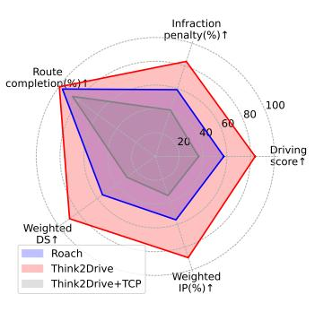  
(a) Driving performance.

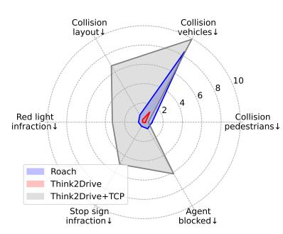  
(b) Infractions per kilometer.  
Fig. 1: Driving performance and infractions on CornerCaseRepo.

We also choose and train an end-to-end baseline TCP [42], a lightweight yet competitive student model on CARLA Leaderboard v1, as the imitation learning agent. We train TCP with 200K frames collected by the Think2Drive expert under diferent weather. We could observe that TCP, as a student model with only raw sensor inputs, has a large performance gap with both expert models, as caused by the dificulty of perception as well as the imitation process.

We also evaluate Think2Drive on the oficial test routes of CARLA Leaderboard v1 & v2 and compare it with the expert model of Roach. As illustrated in Tab. 3, Think2Drive not only outperforms Roach in the easier CARLA Leaderboard v1(no scenarios) but also achieves significantly superior performance in the more complex v2 routes. PPO achieved remarkably low scores, a consequence of its rapid convergence to local optima, beyond which the policy ceases to improve further even with the help of the reset technique. We argue that the reason for this phenomenon is that after each reset, PPO has to relearn the policy from the trajectories stored in the replay bufer, which contain inherent reward noise due to the AD characteristics. Conversely, a model-based planner can get accurate and smooth rewards from the world model.

## 4.5 Infraction Analysis on Hard Scenarios

We analyze the performance of Think2Drive in all scenarios, and give the success rate of the scenarios in Tab. 2.

The scenarios Accident, Construction, and HazardAtSidelane along with their respective TwoWays versions, belong to the category of RouteObstacles scenarios. In these scenarios, the ego vehicle is required to perform lane changes to maneuver around obstacles, particularly in the case of the TwoWays versions where the ego vehicle needs to switch to the opposite lane. Such scenarios demand the ego vehicle to acquire a sophisticated lane negotiation policy, especially in the TwoWays scenarios where the ego vehicle must execute lane changing, maneuver around obstacles, and return to its original lane within a short time window. Failed cases in these scenarios typically result from collisions with an opposite car during the process of returning to the original lane after bypassing the obstacles. CARLA Leaderboard v2 generates randomly the opposite trafic flow with speed and interval range within [8, 18] and [15, 50] (typical value, may vary with specific road conditions) in the TwoWays scenarios, which may lead to a significantly constrained time window (e.g.less 1 second) for bypassing obstacles when the speed is large while the interval is small. Consequently, the ego vehicle is required to rapidly accelerate from speed = 0 to its maximum speed, and the ego vehicle usually runs at a high speed and is close to the opposite car when returning to its original lane, which leads to a high risk of collisions.

The scenarios SignalizedLeftTurn, CrossingBicycleFlow, SignalizedRightTurn and BlockedInterSection belong to JunctionNegotiate type. In these scenarios, the ego vehicle has to interrupt the opposite dense car or bicycle flow, merge into the dense trafic flow, and stop at the junction to await road clearance. In CARLA Leaderboard v2, the trafic flow of these scenarios is configured to be very aggressive, meaning it does not proactively yield to the ego vehicle. The ego vehicle needs to maintain a reasonable distance from other vehicles to avoid collisions. For instance, in the SignalizedRightTurn scenario, it is expected to merge into trafic with an interval within [15, 25] meters and a speed within [12, 20] m/s. With a vehicle length of approximately 3 meters, the ego vehicle must not only accelerate rapidly to match the trafic speed in a short time but also maintain a safe following distance from other vehicles.

## 4.6 Visualization of World Model Prediction

The world model is capable of imaging observation transitions and future rewards based on the agent’s actions, and it can decode them back into the interpretable masks under BEV. Fig. 2 visualizes the initial input and the predicted BEV masks within timestep 50. We could observe that the world model could generate authentic future states, demonstrating one advantage of adopting model-based RL for AD - the transition function is usually easy to learn.

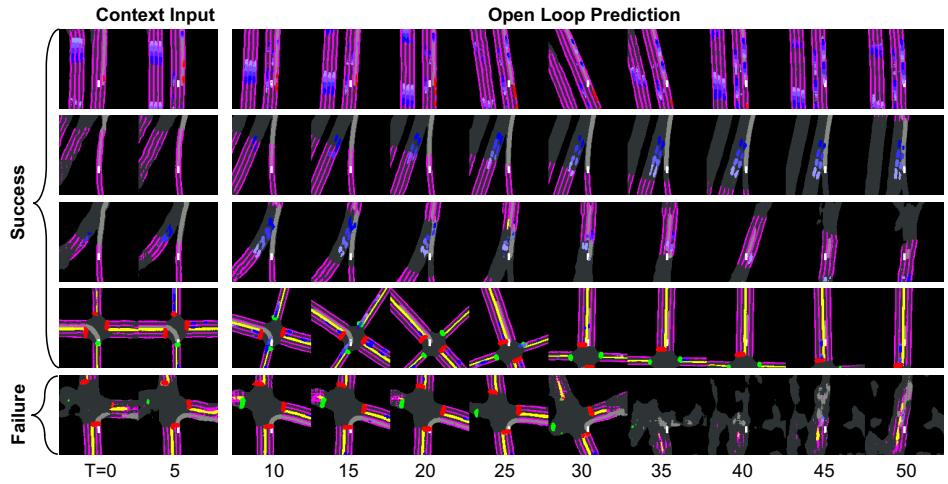  
Fig. 2: Prediction by the world model using the first 5 frames. It can predict reasonable future frames. In the failure case, the planner runs a red light and the world model terminates the episode, so the subsequent predictions are randomly generated.

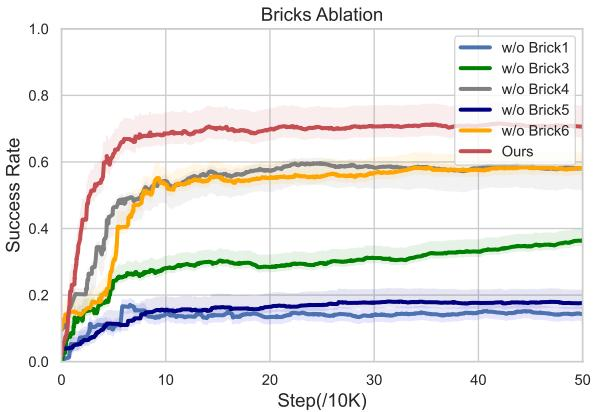  
Fig. 3: Ablation of diferent bricks devised in the paper.

## 4.7 Ablation Study

We conduct ablation on bricks 1, 3-6 (bricks 2 and 7 are foundational for Think2Drive). Fig. 3 presents the results over 500K steps, showing that the absence of any single brick significantly diminishes the performance of Think2Drive. Specifically, bricks 1 and 5 exert the most substantial impact on the final performance. The omission of the warmup stage (brick 5) results in an overly steep learning curve, while forgoing the reset technique (brick 1) predisposes the planner to be stuck in policies only efective in some easy scenarios, both of which lead to the model being trapped in the local optima. The absence of priority sampling (brick 3) is observed to reduce the model’s exploration eficiency, evidenced by the ascending yet slow curve $( \mathrm { w } / \mathrm { o }$ brick 3). Brick 6 afects the learning eficiency of the planner, where employing a higher training ratio for the planner enables the model to achieve superior performance within the same number of steps. The absence of a steering cost function (brick 4) compromises vehicle steering stability, increasing the propensity for collisions.

## 5 Implement Details

For the input representation, we utilize BEV semantic segmentation masks $i _ { R L } \in \{ 0 , \bar { 1 } \} ^ { H \times \bar { W } \times C }$ as image input, where each channel denotes the occurrence of certain types of objects. It is generated from the privileged information obtained from the simulator and consists of C masks of size $H \times W$ . In these C masks, the route, lanes, and lane markings are all static and thus could be represented by a single mask while those dynamic objects (e.g. vehicles and pedestrians) have T masks where each mask represents their state at one history time-step. Additionally, we feed speed, control action, and relative height of the ego vehicle at the previous time steps as input $v _ { R L } \in \mathbb { R } ^ { K }$ . More specific details in Appendix B, Tab. 4 and Tab. 5.

For output representation, we discretize the continuous action into 30 actions to reduce the complexity. The discretized actions are presented in Tab. 6.

Reward Shaping. It is shaped to make the planner keep safe driving and finish the route as much as possible, which consists of four parts: 1) Speed reward $r _ { s p e e d }$ is used to train the ego vehicle to keep a safe speed, depending on the distance to other objects and their type. 2) Travel reward $r _ { t r a v e l }$ is the distance traveled along the target routes at each tick of CARLA. Travel reward encourages the ego vehicle to finish more target routes. 3) Deviation penalty $p _ { d e v i a t i o n }$ is the negative value of the distance between the ego vehicle and the lane center. It is normalized by the max deviation threshold $D _ { m a x } . 4 )$ Steering cost $c _ { s t e e r }$ is used to make the ego vehicle drive more smoother. We set it as the diference between the current steer and the last one. The overall reward is given by:

$$
r = r _ { s p e e d } + \alpha _ { t r } r _ { t r a v e l } + \alpha _ { d e } p _ { d e v i a t i o n } + \alpha _ { s t } c _ { s t e e r }\tag{8}
$$

## 6 Conclusion

We have proposed a purely learning-based planner, Think2Drive, for quasirealistic trafic scenarios. Benefiting from the model-based RL paradigm, It can drive proficiently in CARLA Leaderboard $\mathrm { v 2 }$ with all 39 scenarios within 3 days of training on a single GPU. We also devise tailored bricks such as resetting technique, automated scenario generation, termination-priority replay strategy, and steering cost function to address the obstacles associated with applying modelbased RL to autonomous driving tasks. Think2Drive highlights and validates a feasible approach, model-based $\mathrm { R L , }$ for quasi-realistic autonomous driving. Our model can also serve as a data collection model, providing expert driving data for end-to-end autonomous driving models.

## References

1. Bengio, Y., Louradour, J., Collobert, R., Weston, J.: Curriculum learning. In: Proceedings of the 26th annual international conference on machine learning. pp. 41–48 (2009)

2. Brooks, F.P.: The Mythical Man-Month: Essays on Softw. Addison-Wesley Longman Publishing Co., Inc., USA, 1st edn. (1978)

3. CARLA: Carla autonomous driving leaderboard (2022), https://leaderboard.carla.org/

4. Chekroun, R., Toromanof, M., Hornauer, S., Moutarde, F.: Gri: General reinforced imitation and its application to vision-based autonomous driving. Robotics 12(5), 127 (2023)

5. Chen, J., Yuan, B., Tomizuka, M.: Model-free deep reinforcement learning for urban autonomous driving. In: 2019 IEEE Intelligent Transportation Systems Conference (ITSC) (Oct 2019). https://doi.org/10.1109/itsc.2019.8917306, http://dx. doi.org/10.1109/itsc.2019.8917306

6. Chitta, K., Prakash, A., Jaeger, B., Yu, Z., Renz, K., Geiger, A.: Transfuser: Imitation with transformer-based sensor fusion for autonomous driving. Pattern Analysis and Machine Intelligence (PAMI) (2023)

7. Diehl, C., Sievernich, T., Krüger, M., Hofmann, F., Bertram, T.: Umbrella: Uncertainty-aware model-based ofline reinforcement learning leveraging planning. arXiv preprint arXiv:2111.11097 (2021)

8. Dosovitskiy, A., Ros, G., Codevilla, F., Lopez, A., Koltun, V.: Carla: An open urban driving simulator. In: Conference on robot learning. pp. 1–16. PMLR (2017)

9. Fujimoto, S., Hoof, H., Meger, D.: Addressing function approximation error in actor-critic methods. arXiv: Artificial Intelligence,arXiv: Artificial Intelligence (Feb 2018)

10. Ha, D., Schmidhuber, J.: World models. arXiv preprint arXiv:1803.10122 (2018)

11. Haarnoja, T., Zhou, A., Abbeel, P., Levine, S.: Soft actor-critic: Of-policy maximum entropy deep reinforcement learning with a stochastic actor. arXiv: Learning,arXiv: Learning (Jan 2018)

12. Hafner, D., Lillicrap, T., Ba, J., Norouzi, M.: Dream to control: Learning behaviors by latent imagination. arXiv preprint arXiv:1912.01603 (2019)

13. Hafner, D., Lillicrap, T., Fischer, I., Villegas, R., Ha, D., Lee, H., Davidson, J.: Learning latent dynamics for planning from pixels. In: Chaudhuri, K., Salakhutdinov, R. (eds.) Proceedings of the 36th International Conference on Machine Learning. Proceedings of Machine Learning Research, vol. 97, pp. 2555–2565. PMLR (09–15 Jun 2019), https://proceedings.mlr.press/v97/hafner19a.html

14. Hafner, D., Lillicrap, T., Fischer, I., Villegas, R., Ha, D., Lee, H., Davidson, J.: Learning latent dynamics for planning from pixels. In: International conference on machine learning. pp. 2555–2565. PMLR (2019)

15. Hafner, D., Lillicrap, T., Norouzi, M., Ba, J.: Mastering atari with discrete world models. arXiv preprint arXiv:2010.02193 (2020)

16. Hafner, D., Pasukonis, J., Ba, J., Lillicrap, T.: Mastering diverse domains through world models (2023)

17. Henaf, M., Canziani, A., LeCun, Y.: Model-predictive policy learning with uncertainty regularization for driving in dense trafic. arXiv preprint arXiv:1901.02705 (2019)

18. Hu, Y., Yang, J., Chen, L., Li, K., Sima, C., Zhu, X., Chai, S., Du, S., Lin, T., Wang, W., Lu, L., Jia, X., Liu, Q., Dai, J., Qiao, Y., Li, H.: Planning-oriented

autonomous driving. In: Proceedings of the IEEE/CVF Conference on Computer Vision and Pattern Recognition (2023)

19. Hussein, A., Gaber, M.M., Elyan, E., Jayne, C.: Imitation learning: A survey of learning methods. ACM Computing Surveys (CSUR) 50(2), 1–35 (2017)

20. Jaeger, B., Chitta, K., Geiger, A.: Hidden biases of end-to-end driving models (2023)

21. Jens Beißwenger, A.G.: Pdm-lite: A rule-based planner for carla leaderboard 2.0. Technical report, University of Tübingen (2024), https://github.com/ autonomousvision/carla\_garage/blob/leaderboard\_2/doc/report.pdf

22. Jia, X., Chen, L., Wu, P., Zeng, J., Yan, J., Li, H., Qiao, Y.: Towards capturing the temporal dynamics for trajectory prediction: a coarse-to-fine approach. In: Liu, K., Kulic, D., Ichnowski, J. (eds.) Proceedings of The 6th Conference on Robot Learning. Proceedings of Machine Learning Research, vol. 205, pp. 910–920. PMLR (14–18 Dec 2023), https://proceedings.mlr.press/v205/jia23a.html

23. Jia, X., Gao, Y., Chen, L., Yan, J., Liu, P.L., Li, H.: Driveadapter: Breaking the coupling barrier of perception and planning in end-to-end autonomous driving. In: Proceedings of the IEEE/CVF International Conference on Computer Vision. pp. 7953–7963 (2023)

24. Jia, X., Sun, L., Tomizuka, M., Zhan, W.: Ide-net: Interactive driving event and pattern extraction from human data. IEEE Robotics and Automation Letters 6(2), 3065–3072 (2021). https://doi.org/10.1109/LRA.2021.3062309

25. Jia, X., Wu, P., Chen, L., Li, H., Liu, Y.S., Yan, J.: Hdgt: Heterogeneous driving graph transformer for multi-agent trajectory prediction via scene encoding. IEEE Transactions on Pattern Analysis and Machine Intelligence 45, 13860–13875 (2022), https://api.semanticscholar.org/CorpusID:248965065

26. Jia, X., Wu, P., Chen, L., Xie, J., He, C., Yan, J., Li, H.: Think twice before driving: Towards scalable decoders for end-to-end autonomous driving. In: Proceedings of the IEEE/CVF Conference on Computer Vision and Pattern Recognition. pp. 21983–21994 (2023)

27. Karnchanachari, N., Geromichalos, D., Tan, K.S., Li, N., Eriksen, C., Yaghoubi, S., Mehdipour, N., Bernasconi, G., Fong, W.K., Guo, Y., et al.: Towards learningbased planning: The nuplan benchmark for real-world autonomous driving. arXiv preprint arXiv:2403.04133 (2024)

28. Leurent, E.: An environment for autonomous driving decision-making. https:// github.com/eleurent/highway-env (2018)

29. Li, H., Sima, C., Dai, J., Wang, W., Lu, L., Wang, H., Zeng, J., Li, Z., Yang, J., Deng, H., Tian, H., Xie, E., Xie, J., Chen, L., Li, T., Li, Y., Gao, Y., Jia, X., Liu, S., Shi, J., Lin, D., Qiao, Y.: Delving into the devils of bird’s-eye-view perception: A review, evaluation and recipe. IEEE Transactions on Pattern Analysis and Machine Intelligence pp. 1–20 (2023). https://doi.org/10.1109/TPAMI.2023.3333838

30. Li, Q., Jia, X., Wang, S., Yan, J.: Think2drive: Eficient reinforcement learning by thinking in latent world model for quasi-realistic autonomous driving (in carla-v2) (2024), https://arxiv.org/abs/2402.16720

31. Lu, H., Jia, X., Xie, Y., Liao, W., Yang, X., Yan, J.: Activead: Planning-oriented active learning for end-to-end autonomous driving (2024), https://arxiv.org/ abs/2403.02877

32. Mnih, V., Kavukcuoglu, K., Silver, D., Graves, A., Antonoglou, I., Wierstra, D., Riedmiller, M.: Playing atari with deep reinforcement learning. arXiv preprint arXiv:1312.5602 (2013)

33. Nikishin, E., Schwarzer, M., D’Oro, P., Bacon, P.L., Courville, A.: The primacy bias in deep reinforcement learning. In: International conference on machine learning. pp. 16828–16847. PMLR (2022)

34. Rhinehart, N., McAllister, R., Levine, S.: Deep imitative models for flexible inference, planning, and control. Computer Vision and Pattern Recognition,Computer Vision and Pattern Recognition (Oct 2018)

35. Schrittwieser, J., Antonoglou, I., Hubert, T., Simonyan, K., Sifre, L., Schmitt, S., Guez, A., Lockhart, E., Hassabis, D., Graepel, T., et al.: Mastering atari, go, chess and shogi by planning with a learned model. Nature 588(7839), 604–609 (2020)

36. Schulman, J., Wolski, F., Dhariwal, P., Radford, A., Klimov, O.: Proximal policy optimization algorithms. arXiv preprint arXiv:1707.06347 (2017)

37. Sutton, R.S., McAllester, D., Singh, S., Mansour, Y.: Policy gradient methods for reinforcement learning with function approximation. Advances in neural information processing systems 12 (1999)

38. Toromanof, M., Wirbel, E., Moutarde, F.: End-to-end model-free reinforcement learning for urban driving using implicit afordances. In: CVPR. pp. 7153–7162 (2020)

39. Van Hasselt, H., Guez, A., Silver, D.: Deep reinforcement learning with double q-learning. Proceedings of the AAAI Conference on Artificial Intelligence (Jun 2022). https://doi.org/10.1609/aaai.v30i1.10295, http://dx.doi.org/10. 1609/aaai.v30i1.10295

40. Williams, R.J.: Simple statistical gradient-following algorithms for connectionist reinforcement learning. Machine learning 8, 229–256 (1992)

41. Wu, P., Chen, L., Li, H., Jia, X., Yan, J., Qiao, Y.: Policy pre-training for autonomous driving via self-supervised geometric modeling. In: International Conference on Learning Representations (2023)

42. Wu, P., Jia, X., Chen, L., Yan, J., Li, H., Qiao, Y.: Trajectory-guided control prediction for end-to-end autonomous driving: A simple yet strong baseline. Advances in Neural Information Processing Systems 35, 6119–6132 (2022)

43. Wu, P., Escontrela, A., Hafner, D., Abbeel, P., Goldberg, K.: Daydreamer: World models for physical robot learning. In: Conference on Robot Learning. pp. 2226– 2240. PMLR (2023)

44. Yang, Z., Jia, X., Li, H., Yan, J.: Llm4drive: A survey of large language models for autonomous driving (2023)

45. Zhang, Z., Liniger, A., Dai, D., Yu, F., Van Gool, L.: End-to-end urban driving by imitating a reinforcement learning coach. In: Proceedings of the IEEE/CVF International Conference on Computer Vision (ICCV) (2021)

# Think2Drive: Eficient Reinforcement Learning by Thinking with Latent World Model for Autonomous Driving (in CARLA-v2)

## A Discription of CARLA v2 Scenarios

CARLA v2 provides 39 corner scenarios which are common in real driving environments. These scenarios can generally be divided into two categories: regular road scenarios and junction scenarios. Here we give a detailed description of each scenario:

## A.1 Regular road scenarios

These scenarios are related to regular road segments

1. ControlLoss

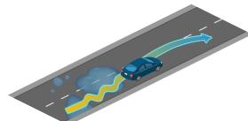

The ego vehicle loses control due to bad conditions on the road and it must recover, coming back to its original lane.

2. ParkingExit

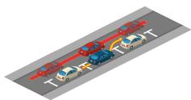

The ego vehicle must exit a parallel parking bay into a flow of trafic.

3. ParkingCutIn

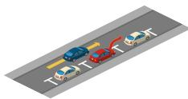

The ego vehicle must slow down or brake to allow a parked vehicle exiting a parallel parking bay to cut in front.

4. StaticCutIn  
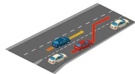

The ego vehicle must slow down or brake to allow a vehicle of the slow trafic flow in the adjacent lane to cut in front. Compared to ParkingCutIn, there are more cars in the adjacent lane and any one of them may cut in.

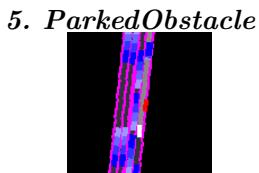

The ego vehicle encounters a parked vehicle blocking part of the lane and must perform a lane change into trafic moving in the same direction to avoid it.

## 6. ParkedObstacleTwoWays

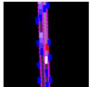

The ’TwoWays’ version of ParkedObstacle. The ego vehicle encounters a parked vehicle blocking the lane and must perform a lane change into trafic moving in the opposite direction to avoid it.

## 7. Construction

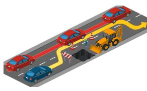

The ego vehicle encounters a construction site blocking and must perform a lane change into trafic moving in the same direction to avoid it. Compared to ParkedObstacle, the construction occupies more width of the lane. The ego vehicle has to completely deviate from its task route temporarily to bypass the construction zone.

## 8. ConstructionTwoWays

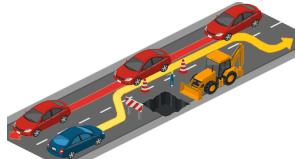

The ’TwoWays’ version of Construction.

## 9. Accident

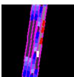

The ego vehicle encounters multiple accident cars blocking part of the lane and must perform a lane change into trafic moving in the same direction to avoid it. Compared to ParkedObstacle and Construction, these accident cars occupy more length along the lane. The ego vehicle has to completely deviate from its task route for a longer time to bypass the accident zone.

## 10. AccidentTwoWays

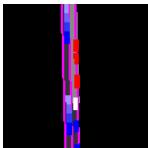

The ’TwoWays’ version of Accident. Compared to ParkedObstacleTwoWays and ConstructionTwoWays, there is a much shorter time window for the ego vehicle to bypass the route obstacles (i.g. accident cars).

## 11. HazardAtSideLane

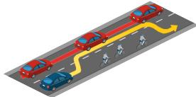

The ego vehicle encounters a slow-moving hazard blocking part of the lane. The ego vehicle must brake or maneuver next to a lane of trafic moving in the same direction to avoid it.

## 12. HazardAtSideLaneTwoWays

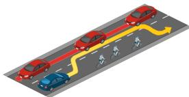

The ego vehicle encounters a slow-moving hazard blocking part of the lane. The ego vehicle must brake or maneuver to avoid it next to a lane of trafic moving in the opposite direction.

## 13. VehiclesDooropenTwoWays

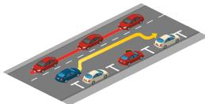

## 14. DynamicObjectCrossing

The ego vehicle encounters a parked vehicle opening a door into its lane and must maneuver to avoid it.

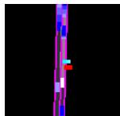

A walker or bicycle behind a static prop crosses the road suddenly when the ego vehicle is close to the prop. The ego vehicle must make a hard brake promptly.

## 15. ParkingCrossingPedestrian

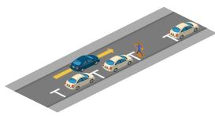  
16. HardBrake

The ego vehicle encounters a pedestrian emerging from behind a parked vehicle and advancing into the lane. The ego vehicle must brake or maneuver to avoid it. Compared to DynamicObjectCrossing, the pedestrian is closer to the road and the ego vehicle has to act more timely.

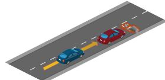

The leading vehicle decelerates suddenly and the ego vehicle must perform an emergency brake or an avoidance maneuver.

## 17. YieldToEmergencyVehicle

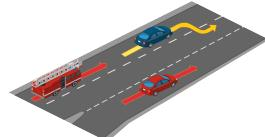

The ego vehicle is approached by an emergency vehicle coming from behind. The ego vehicle must maneuver to allow the emergency vehicle to pass.

18. InvadingTurn  
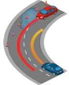

When the ego vehicle is about to turn right, a vehicle coming from the opposite lane invades the ego’s lane, forcing the ego to move right to avoid a possible collision.

## A.2 Junction scenarios

These scenarios are related to junctions.

1. PedestrainCrossing

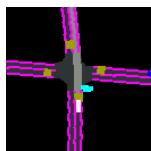

While the ego vehicle is entering a junction, a group of natural pedestrians suddenly cross the road and ignore the trafic light. The ego vehicle must stop and wait for all pedestrians to pass even though there is a green trafic light or a clear junction.

## 2. VehicleTurningRoutePedestrian

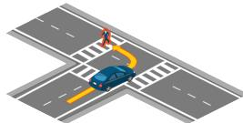

While performing a maneuver, the ego vehicle encounters a pedestrian crossing the road and must perform an emergency brake or an avoidance maneuver.

3. VehicleTurningRoute While performing a maneuver, the ego vehicle encounters a bicycle crossing the road and must perform an emergency brake or an avoidance maneuver. Compared to VehicleTurningRoutePedestrian, the bicycle moves faster and the ego has to brake earlier.

## 4. BlockedIntersection

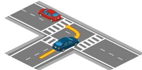

While performing a maneuver, the ego vehicle encounters a stopped vehicle on the road and must perform an emergency brake or an avoidance maneuver.

## 5. SignalizedJunctionLeftTurn

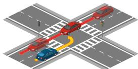

The ego vehicle is performing an unprotected left turn at an intersection, yielding to oncoming trafic.

## 6. SignalizedJunctionLeftTurnEnterFlow

The ego vehicle is performing an unprotected left turn at an intersection, merging into opposite trafic.

## 7. NonSignalizedJunctionLeftTurn

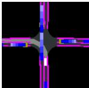

Non-signalized version of SignalizedJunctionLeftTurn. The ego has to negotiate with the opposite vehicles without trafic lights.

## 8. NonSignalizedJunctionLeftTurnEnterFlow

Non-signalized version of SignalizedJunctionLeftTurnEnterFlow.

## 9. SignalizedJunctionRightTurn

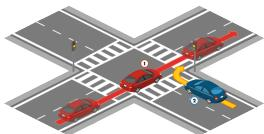

The ego vehicle is turning right at an intersection and has to safely merge into the trafic flow coming from its left.

## 10. NonSignalizedJunctionRightTurn

Non-signalized version of SignalizedJunctionRightTurn. The ego has to negotiate with the trafic flow without trafic lights.

## 11. EnterActorFlows

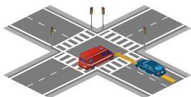

A flow of cars runs a red light in front of the ego when it enters the junction, forcing it to react (interrupting the flow or merging into the flow). These vehicles are ’special’ ones such as police cars, ambulances, or firetrucks.

## 12. HighwayExit

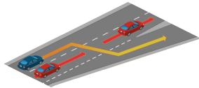

The ego vehicle must cross a lane of moving trafic to exit the highway at an of-ramp.

## 13. MergerIntoSlowTrafic

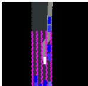

The ego vehicle must merge into a slow trafic flow on the of-ramp when exiting the highway.

## 14. MergerIntoSlowTraficV2

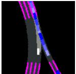

The ego vehicle must merge into a slow trafic flow coming from the on-ramp when driving on highway roads.

## 15. InterurbanActorFlow

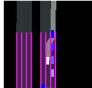

The ego vehicle leaves the interurban road by turning left, crossing a fast trafic flow.

## 16. InterurbanAdvancedActorFlow

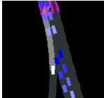

The ego vehicle incorporates into the interurban road by turning left, first crossing a fast trafic flow, and then merging into another one.

## 17. HighwayCutIn

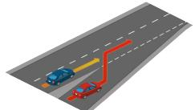

The ego vehicle encounters a vehicle merging into its lane from a highway on-ramp. The ego vehicle must decelerate, brake, or change lanes to avoid a collision.

## 18. CrossingBicycleFlow

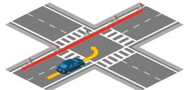

The ego vehicle needs to perform a turn at an intersection yielding to bicycles crossing from either the left.

## 19. OppositeVehicleRunningRedLight

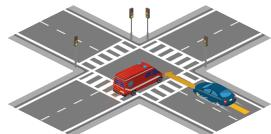

The ego vehicle is going straight at an intersection but a crossing vehicle runs a red light, forcing the ego vehicle to avoid the collision.

## 20. OppositeVehicleTakingPriority

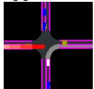

Non-signalized version of OppositeVehicleTakingPriority.

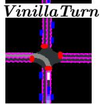

## 21. VinillaTurn

A basic scenario for the ego vehicle to learn the basic trafic rules, e.g. stop signs and trafic lights.

## B Input & Output Representation

Table 4: Composition of the BEV representation. Each static object occupies 1 dimension out of the $C = 3 4$ , while each dynamic object occupies 4 dimensions out of the $C = 3 4$
<table><tr><td colspan="4">C = 34</td></tr><tr><td> $\overline { { \mathrm { S t a t i c } ( C _ { s } = 1 ) } }$ </td><td></td><td> $\overline { { \mathrm { D y n a m i c } ( C _ { d } = 4 ) } }$ </td><td>greenyellow&amp;red stop</td></tr><tr><td>yellow white road route ego lane line line</td><td colspan="3">emergency obstacle vehicle walker car</td></tr></table>

Table 5: Dimension of input and output representation. The T temporal masks are from historical time-steps: $[ - 1 6 , - 1 1 , - 6 , - 1 ]$
<table><tr><td>H W</td><td> $\mathrm { ~ C ~ T ~ M ~ }$ </td></tr><tr><td>128128 34 4 30</td><td></td></tr></table>

Table 6: The discretized actions. The continuous action space is decomposed into 30 discrete actions, each for specific values of throttle, steer, and brake. Each action is rational and legitimate.
<table><tr><td colspan="8">Throttle Brake Steer| |Throttle Brake Steer Throttle Brake Steer</td></tr><tr><td>0</td><td>1</td><td>0</td><td>0.3</td><td>0 -0.7</td><td>0.3</td><td>0</td><td>0.7</td></tr><tr><td>0.7</td><td>0</td><td>-0.5</td><td>0.3</td><td>0 -0.5</td><td>0</td><td>0</td><td>-1</td></tr><tr><td>0.7</td><td>0</td><td>-0.3</td><td>0.3</td><td>0 -0.3</td><td>0</td><td>0</td><td>-0.6</td></tr><tr><td>0.7</td><td>0</td><td>-0.2</td><td>0.3</td><td>0</td><td>-0.2</td><td>0 0</td><td>-0.3</td></tr><tr><td>0.7</td><td>0</td><td>-0.1</td><td>0.3</td><td>0</td><td>-0.1</td><td>0 0</td><td>-0.1</td></tr><tr><td>0.7</td><td>0</td><td>0</td><td>0.3</td><td>0</td><td>0</td><td>0 0</td><td>0</td></tr><tr><td>0.7</td><td>0</td><td>0.1</td><td>0.3</td><td>0</td><td>0.1</td><td>0 0</td><td>0.1</td></tr><tr><td>0.7</td><td>0</td><td>0.2</td><td>0.3</td><td>0</td><td>0.2</td><td>0 0</td><td>0.3</td></tr><tr><td>0.7</td><td>0</td><td>0.3</td><td>0.3</td><td>0</td><td>0.3</td><td>0 0</td><td>0.6</td></tr><tr><td>0.7</td><td>0</td><td>0.5</td><td>0.3</td><td>0</td><td>0.5</td><td>0 0</td><td>1</td></tr></table>

## C Simulator Execution Mode

We boost CARLA running eficiency via asynchronous reloading and parallel execution which could avoid the waiting time caused by the long preparation time of starting a new route, as shown in Fig. 4. For each 100K steps of execution, it can reduce about 1 day time cost.

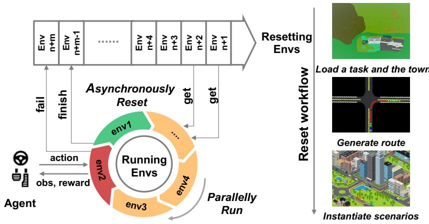  
Fig. 4: Procedure of the Wrapped RL Environment. The right shows the workflow of each reset. In large maps like town12 and town13, the entire reset workflow takes about 1 minute.

## D Hyper-parameters

Table 7: Hyper-parameters of the neural network. The CNN encoder maps the 128 × 128 BEV to the 4 × 4 feature map by 4 × 4 convolutional kernel with stride 2. The flattened feature maps, concatenated with the state features output by the MLP encoder, are then input to the RSSM which consists of GRU cells and a few dense layers. The structure of the decoder inverts that of the encoder and outputs the reconstructed mask and state vector. Please refer to DreamerV3 [16] for details about network.

<table><tr><td colspan="3">GRU recurrent units CNN multiplier Dense hidden units MLP layers Parameters</td></tr><tr><td>512</td><td>96 512</td><td>5 104M</td></tr></table>