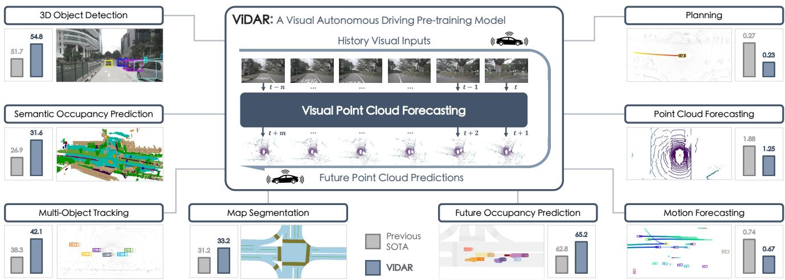
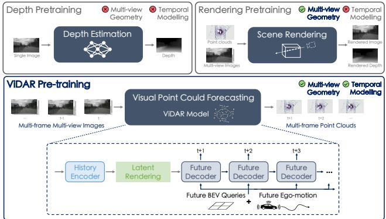
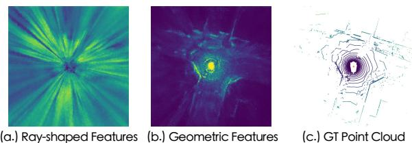
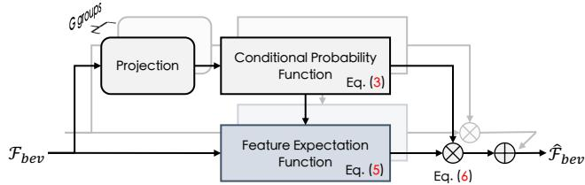
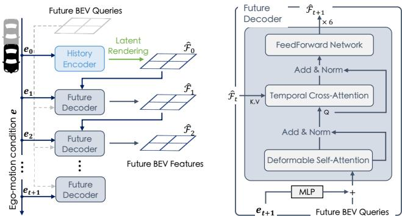
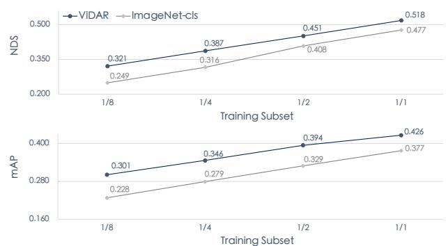

# Visual Point Cloud Forecasting enables Scalable Autonomous Driving

Zetong Yang Li Chen Yanan Sun Hongyang Li

OpenDriveLab and Shanghai AI Lab

  
Figure 1. ViDAR is a visual autonomous driving pre-training framework, which leverages the estimation of future point clouds from historical visual inputs as the pre-text task. We term this new pre-text task as visual point cloud forecasting. With the aid of ViDAR, we achieve substantial improvement spanning a diverse spectrum of downstream applications for perception, prediction, and planning.

## Abstract

In contrast to extensive studies on general vision, pretraining for scalable visual autonomous driving remains seldom explored. Visual autonomous driving applications requirefeatures encompassing semantics, 3D geometry, and temporal information simultaneously for joint perception, prediction, and planning, posing dramatic challenges for pre-training. To resolve this, we bring up a new pre-training task termed as visual point cloud forecasting - predicting future point clouds from historical visual input. The key merit of this task captures the synergic learning of semantics, 3D structures, and temporal dynamics. Hence it shows superiority in various downstream tasks. To cope with this new problem, we present ViDAR, a general model to pretrain downstream visual encoders. It first extracts historical embeddings by the encoder. These representations are then transformed to 3D geometric space via a novel Latent Rendering operator for future point cloud prediction. Experiments show significant gain in downstream tasks, e.g., 3.1% NDS on 3D detection, ∼10% error reduction on motion forecasting, and ∼15% less collision rate on planning.

## 1. Introduction

Recently, the community has witnessed rapid development in visual, or camera-only autonomous driving, with input being monocular or multi-view images [50, 63, 69, 70, 76, 89]. Leveraging visual inputs, existing approaches demonstrate superior capability of extracting Bird’s-Eye-View (BEV) features [6, 28, 45, 52, 61, 88], and performing well in perception [29, 51, 54, 67], prediction [17, 27, 65], and planning [30, 31]. Despite significant improvements in applications, these models rely on precise 3D annotations to a great extent, which are often difficult to collect, e.g., occupancy [3, 10], 3D boxes [5, 16, 64], trajectories [15], and thus are challenging to scale up for production.

Considering the expensive labeling workflow, pretraining [2, 18, 62] has emerged as a crucial approach to scale up downstream applications. The key idea is to define pretext tasks that leverage large amounts of readily available data to learn meaningful representations. This enhances downstream performance though labeled data is limited.

Though extensive research of pre-training in computer vision has been conducted [8, 20–22, 33, 66, 78, 79], its application in visual autonomous driving remains seldom explored. Visual autonomous driving poses great challenges in pre-training as it requires the features to maintain semantics, 3D geometry, and temporal dynamics at the same time for joint perception, prediction, and planning [7, 77]. As a result, most models still rely on supervised pre-training, like 3D detection [60, 69] or occupancy [58, 67, 81], using labeled data that is often unavailable at scale [39]. Some approaches propose estimating depth [60] or rendering masked scenes [82] as pre-training. They use Image-LiDAR pairs as a means of achieving scalable annotation-free pre-training. However, they struggle in either multi-view 3D geometry or temporal modeling (Figure 2). Depth estimation retrieves depth from one image, limited in multi-view geometry; rendering techniques reconstruct scenes from multi-view images but lacking temporal modeling. However, temporal modeling is crucial in end-to-end autonomous driving systems, e.g., UniAD [27], especially for prediction and planning which are the ultimate goals and require accurate scene flow and object motion for decision-making. Due to the absence of temporal modeling, existing approaches are insufficient for pretraining the end-to-end system.

In this work, we explore pre-training tailored for end-toend visual autonomous driving applications, including not only perception but also prediction and planning [7]. We formulate a new pre-text task, visual point cloud forecasting (Figure 2), to fully exploit information of semantics, 3D geometry, and temporal dynamics behind the raw Image-LiDAR sequences, with being scalable into consideration. It predicts future point clouds from historical visual images.

The main rationale of visual point cloud forecasting lies in the simultaneous supervision of semantics, 3D structure, and temporal modeling. By compelling the model to predict the future from history, it supervises the extraction of scene flow and object motion which are crucial for temporal modeling and future estimation. Meanwhile, it involves the reconstruction of point clouds from images, which supervises the multi-view geometry and semantic modeling. Therefore, features from visual point cloud forecasting embed information of both geometric and temporal hints, beneficial for perception, tracking, and planning simultaneously.

To this end, we present ViDAR, a general visual point cloud forecasting approach for pre-training (Figure 2). Vi-DAR includes three parts, History Encoder, Latent Rendering operator, and Future Decoder. The History Encoder is the target structure for pre-training. It could be any visual BEV encoder [45] to embed visual sequences into BEV space. These BEV features are sent to the Latent Rendering operator. Latent Rendering plays a crucial role in enabling ViDAR benefit downstream performance. It solves the rayshaped BEV features issue [46, 90], models 3D geometric latent space, and bridges encoder and decoder. The Future Decoder is an auto-regressive transformer that takes historical BEV features to iteratively predict future point clouds for arbitrary timestamps.

  
Figure 2. Comparisons among visual autonomous driving pretraining paradigms and our ViDAR architecture. Compared to existing methods, visual point cloud forecasting jointly models multi-view geometry and temporal dynamics. We then propose Vi-DAR, using Image-LiDAR sequences to pre-train visual encoders.

ViDAR provides a comprehensive solution for visual autonomous driving pre-training. We test ViDAR on nuScenes dataset [5] in terms of point cloud forecasting and downstream verifications. Though with visual inputs, ViDAR still outperforms previous forecasting methods using point clouds, ∼33% Chamfer Distance reduction on point cloud estimation of 1s future. ViDAR also improves downstream performance. Using Image-LiDAR sequences only, ViDAR surprisingly outperforms 3D detection pre-training [69], e.g., by 1.1% mAP and 2.5% mIoU for detection and semantic occupancy prediction, under the same data scale. If also based on the 3D detection pre-training, ViDAR boosts previous methods by 4.3% mAP and 4.6% mIoU. Further, due to the effective pre-training on the joint capture of geometric and temporal information, ViDAR improves UniAD [27] on all tasks for end-to-end autonomous driving including perception, prediction, and planning by a large margin (Figure 1). Experimental results validate that visual point cloud forecasting enables scalable autonomous driving.

## 2. Related Work

Pre-training for Visual Autonomous Driving. Pretraining for scalable applications has been extensively studied in general vision. These approaches can be roughly divided into contrastive approaches [8, 20, 34, 66], which learn discriminative features from positive and negative pairs; and masked signal modeling [13, 21, 73, 80], which recover discarded signals from remained signals to capture a comprehensive understanding of global semantics.

In contrast, pre-training for visual autonomous driving is still under-explored. Visual autonomous driving poses great challenges as it requires semantic understanding, 3D structural awareness, and temporal modeling at the same time, for joint perception, prediction, and planning. Existing vision methods mainly consider semantics; methods based on Image-LiDAR pairs [60, 82] struggle with temporal modeling; other supervised strategies [67, 69] are not scalable. In this work, we propose visual point cloud forecasting, which simultaneously models semantics, temporal dynamics, and 3D geometry by a uniform process, and is easily scaled up. Point Cloud Forecasting. Point cloud forecasting, one of the most fundamental self-supervised tasks for autonomous driving, predicts future point clouds from past point cloud inputs. Previous works use range image [4, 57], a representation obtained by projecting point clouds to dense 2D images using sensor intrinsic and extrinsic parameters. Based on historical range images, they apply 3D convolutions [56], or LSTMs [74, 75] to predict future point clouds. Yet, they additionally model the motion of sensor intrinsic and extrinsic parameters. Later methods factor out the estimation of sensors by introducing 4D occupancy prediction [36] and differentiable ray-casting [35], which ensures a better modeling of the world. Compared to prior literature, we aim at visual point cloud forecasting, using past images to predict future point clouds. Meanwhile, we raise this task as a pre-training paradigm for visual autonomous driving and demonstrate its superiority in a wide range of downstream applications.

## 3. Methodology

In this section, we elaborate on our ViDAR, a visual point cloud forecasting approach for general autonomous driving pre-training. We begin with an overview of ViDAR in Section 3.1, and subsequently delve into Latent Rendering and Future Decoder in Section 3.2 and Section 3.3, respectively.

## 3.1. Overview

As depicted in Figure 2, ViDAR comprises three components: (a) a History Encoder, also the target structure of pre-training, which extracts BEV embeddings $\mathcal { F } _ { \mathrm { { b e v } } }$ from visual sequence inputs I; It can be any visual BEV encoder [28, 45, 52]; (b) a Latent Rendering operator, which simulates the volume rendering operation in latent space so as to obtain geometric embedding $\hat { \mathcal { F } } _ { \mathrm { b e v } }$ from ${ \mathcal { F } } _ { \mathrm { { b e v } } } ;$ and (c) a Future Decoder, which predicts future BEV features $\hat { \mathcal { F } } _ { t }$ at timestamps $t \in \{ 1 , 2 , \ldots \}$ in an auto-regressive manner. Finally, a prediction head is followed to project $\hat { \mathcal { F } } _ { t }$ into 3D occupancy volume $\mathcal { P } _ { t } .$ . This process is formulated as:

$$
\begin{array} { r l } { \mathcal { F } _ { \mathrm { b e v } } ~ = \mathtt { E n c o d e r } ( \mathcal { T } ) , } & { } \\ { \hat { \mathcal { F } } _ { \mathrm { b e v } } ~ = \mathtt { L a t e n t R e n d e r } ( \mathcal { F } _ { \mathrm { b e v } } ) , } & { } \\ { \hat { \mathcal { F } } _ { t } } & { = \mathtt { D e c o d e r } ( \hat { \mathcal { F } } _ { t - 1 } ) , ~ \mathrm { w h e r e } ~ \hat { \mathcal { F } } _ { 0 } = \hat { \mathcal { F } } _ { \mathrm { b e v } } , } \\ { \mathcal { P } _ { t } } & { = \mathtt { P r o j e c t i o n } ( \hat { \mathcal { F } } _ { t } ) . } \end{array}\tag{1}
$$

Point cloud predictions are obtained from the predicted occupancy volume $\mathcal { P } _ { t }$ . This process is similar to the previous point cloud forecasting method [36]. Specifically, we first cast rays from the origin to various designated directions, then figure out the distance of waypoints along each ray with the maximum occupancy response, and finally compute the point position according to the distance and corresponding ray direction.

## 3.2. Latent Rendering

A straightforward solution of visual point cloud forecasting for pre-training is to incorporate the History Encoder and Future Decoder directly with differentiable ray-casting [36], which is the crucial component in state-of-the-art point cloud forecasting methods to render point clouds from predicted occupancy volume and compute loss for backpropagation. However, our experimental results show that this approach does not yield improvements and even has a detrimental effect on the downstream tasks due to the defective geometric feature modeling ability.

Preliminary. Differentiable ray-casting is a volume rendering process operating on an occupancy volume, denoted as $\mathcal { P } \in \mathbb { R } ^ { L \times H \times }$ . It renders depths of various rays and subsequently converts the depths with corresponding ray directions to point clouds.

Formally, starting from the origin sensor position, ${ \textbf { o } } \in$ $\mathbb { R } ^ { 3 }$ , differentiable ray-casting casts n rays with varying directions, $\mathbf { d } \in \mathbb { R } ^ { n \times 3 }$ . Along each ray i, it uniformly samples m waypoints at different distances $\lambda ^ { ( j ) } ~ \in ~ \mathbb { R } , j ~ \in$ $\{ 1 , 2 , . . . , m \}$ until reaching the boundary of the 3D space. The coordinates of these waypoints are calculated as:

$$
\mathbf { x } ^ { ( i , j ) } = \mathbf { o } + \lambda ^ { ( j ) } \mathbf { d } ^ { ( i ) } .\tag{2}
$$

Those waypoint coordinates, $\textbf { x } \in \mathbb { R } ^ { n \times m \times 3 }$ , are used to compute occupancy values. This process is quantized [36], wherein the waypoints are discretized to occupancy volume grids. Then, the values of waypoints are derived as the associated values of volume grids, $\mathbf { p } ^ { ( i , j ) } = \mathcal { P } ^ { ( [ \mathbf { x } ^ { ( i , j ) } ] ) }$ ). Here [·] denotes a rounding operation for discretizing waypoints.

Differentiable ray-casting renders the corresponding depth of the i-th ray, $\hat { \lambda } ^ { \left( i \right) }$ , by an integral process:

$$
\hat { \mathbf { p } } ^ { ( i , j ) } = \bigg [ \prod _ { k = 1 } ^ { j - 1 } ( 1 - \mathbf { p } ^ { ( i , k ) } ) \bigg ] \mathbf { p } ^ { ( i , j ) } ,\tag{3}
$$

$$
\hat { \lambda } ^ { ( i ) } = \sum _ { j = 1 } ^ { m } \hat { \mathbf { p } } ^ { ( i , j ) } \lambda ^ { ( j ) } .\tag{4}
$$

For simplicity, we name Eq. 3 and Eq. 4 as conditional probability function and distance expectation function. The conditional probability function determines the occupancy of a grid by considering the conditional probability that prior waypoints are unoccupied and the ray terminates at this particular grid; the distance expectation function retrieves depths from the occupancy of grids in 3D volume. L1 loss is then applied to supervise the rendered depth for training point cloud forecasting.

  
Figure 3. Ray-shaped Features vs. Geometric Features. Rayshaped features show similar feature responses on BEV grids along the same ray; while geometric features from the Latent Rendering maintain discriminative 3D geometry and can describe the 3D world in latent space.

<table><tr><td>Forecasting Structure</td><td>N/A</td><td>Differentiable Ray-casting</td><td>Latent Rendering</td></tr><tr><td>NDS (%)</td><td>44.11</td><td>40.20 (-3.91)</td><td>47.58 (+3.47)</td></tr></table>

Table 1. Downstream detection performance under different forecasting structures. “N/A” represents the baseline without forecasting pre-training. We observe a performance drop when directly using History Encoder and Future Decoder with differentiable ray-casting for pre-training; while, with the Latent Rendering operator, the performance is significantly improved.

Despite the great success of differentiable ray-casting in the task of point cloud forecasting, its application in visual point cloud forecasting pre-training does not bring any benefit for downstream performance (Table 1). After such pretraining, ray-shaped features [46, 90], where grids along the same ray tend to possess similar features (Figure 3 - (a.)), are observed. The underlying reason is that waypoints along the same ray in 3D space usually correspond to the same pixel in the visual image, resulting in a tendency to learn similar feature responses. As a consequence, these ray-shaped features are not discriminative and representative enough when transferred to downstream applications, leading to reduced performance.

Latent Rendering. In order to extract more discriminative and representative features, we introduce the Latent Rendering operator. It first computes the ray-wise feature through a feature expectation function, then customizes features of each grid by weighting the ray-wise feature with its associated conditional probability. The overall structure is depicted in Figure 4.

To be specific, inspired by Eq. (4), the feature expectation function is formulated in a similar form:

$$
\hat { \mathcal { F } } ^ { ( i ) } = \sum _ { k = 1 } ^ { m } \hat { \mathbf { p } } ^ { ( i , k ) } \mathcal { F } _ { \mathrm { b e v } } ^ { ( k ) } ,\tag{5}
$$

where i represents the ray extending from the origin to the i-th BEV grid. Here, pˆ is the conditional probability, computed through the conditional probability function Eq. (3), which takes as input the learnable independent probability projected from $\mathcal { F } _ { b e v }$ . The ray-wise features are shared by all grids lying in the same ray.

  
Figure 4. Multi-group Latent Rendering comprises several Latent Rendering running in parallel for different channels. Latent Rendering captures geometric features by the conditional probability function and the feature extraction function. “L” means concatenating multi-group features among channel dimensions.

Then, we compute the grid feature as:

$$
\hat { \mathcal { F } } _ { \mathrm { b e v } } = \hat { \mathbf { p } } \cdot \hat { \mathcal { F } } ,\tag{6}
$$

which highlights the response of BEV grids with higher conditional probability so as to make $\hat { \mathcal { F } } _ { b e v }$ discriminative. This enables the BEV encoder to learn the geometric features during pre-training (Figure 3 - (b.)).

To enhance the diversity of geometric features, we further design the multi-group Latent Rendering. By parallelizing multiple Latent Rendering on different feature channels, we allow ray-wise features to maintain diverse information, leading to better downstream performance.

As described in Eq. (3), the conditional probability of each BEV grid is determined not only by its own independent response, but also by the response of all its prior grids. Consequently, in the pre-training phase, once the model raises the response of a particular BEV grid, the corresponding responses of all its prior and subsequent grids are suppressed, which mitigates the issue of ray-shaped features during pre-training. After the pre-training with Latent Rendering, it is generally observed that there are only a few peaks with higher responses on a specific ray, indicating the presence of objects or structures in the scene. This effectively promotes a more accurate and consistent understanding of the 3D environment.

## 3.3. Future Decoder

The Future Decoder predicts the next BEV features $\hat { \mathcal { F } } _ { t }$ of frame t based on the inputs of previous BEV latent space $\hat { \mathcal { F } } _ { t - 1 }$ and the expected next ego-motion, et. The predicted features are then used to generate point clouds as Eq. (1).

Architecture. As depicted in Figure 5, Future Decoder is a transformer that can be iteratively used to predict future BEV features from the last roll-out embeddings in an auto-regressive manner. In the t-th iteration, it first encodes the ego-motion condition $\mathbf { e } _ { t } ,$ which describes the expected coordinates and heading of ego-vehicle in the next frame, into high-dimensional embeddings by multi-layer perceptron (MLP), which are then added to future BEV queries as inputs of the transformer. Then, 6 transformer layers, composed of a Deformable Self-Attention [93], a Temporal Cross-Attention and a FeedForward Network [14], are used to predict the future $\hat { \mathcal { F } } _ { t }$ based on the condition and the last BEV features $\hat { \mathcal { F } } _ { t - 1 }$

  
Figure 5. Future Decoder iteratively predicts the next BEV features, $\hat { \mathcal { F } } _ { t } ,$ , from the conditions of ego-motion $\mathbf { e } _ { t }$ and the last BEV features, to enable specific future predictions with any ego-control.

The Temporal Cross-Attention layer follows the design of Deformable Cross-Attention [93]. The difference lies in the reference coordinates of query points. In the context of Deformable Cross-Attention [93], “reference coordinates” refer to the corresponding positions of query points on the feature maps of keys and values. Typically, they are consistent. However, as for Future Decoder, due to the moving of the ego-vehicle, the ego-coordinate systems between the last and target frame are not necessarily aligned. Therefore, we additionally compute the reference coordinates of future BEV queries in previous BEV feature maps, according to the ego-motion condition, to align coordinate systems.

After obtaining the next BEV features $\hat { \mathcal { F } } _ { t }$ , we use a projection layer to generate the occupancy volume $\mathcal { P } _ { t }$

Loss. Instead of using L1 loss to supervise the depths of various rays, we directly apply ray-wise cross-entropy loss to maximize the response of points along its corresponding ray, as we have already obtained geometric features after the Latent Rendering operator. To be specific, for each groundtruth point of the t-th future point clouds, we cast a ray from the origin position o (the sensor position) towards the point, uniformly sample some waypoints along the ray until out of the volume, and compute cross-entropy loss for the ray to maximize the response of the point position and minimize the response of other waypoint positions. This process is formulated as:

$$
\mathcal { L } = - \frac { 1 } { T n } \sum _ { t = 1 } ^ { T } \sum _ { i = 1 } ^ { n } \log \left( \frac { e ^ { \mathcal { P } _ { t } ^ { ( \mathbf { g } ^ { ( i ) } ) } } } { \sum _ { j } e ^ { \mathcal { P } _ { t } ^ { ( \mathbf { x } ^ { ( i , j ) } ) } } + e ^ { \mathcal { P } _ { t } ^ { ( \mathbf { g } ^ { ( i ) } ) } } } \right) ,\tag{7}
$$

where T, n indicate the number of future supervisions and the number of points in the t-th ground-truth point clouds. $\mathbf { g } ^ { ( i ) }$ and $\mathbf { x } ^ { ( i , j ) }$ are the coordinates of i-th ground-truth point and j-th waypoints along the same ray. $\mathcal { P } _ { t } ^ { ( \cdot ) }$ is trilinear interpolation to obtain corresponding values from volume $\mathcal { P } _ { t }$

## 4. Experiments

This section investigates the following questions:

• Can future point clouds be estimated from visual history, and how about ViDAR compared to point cloud methods?

• Can ViDAR help perception, prediction, and planning at the same time so as for scalable autonomous driving?

• Can ViDAR reduce the reliance of downstream applications on precise human annotations?

• How do different modules affect final performance?

## 4.1. Setup

Dataset. We conduct experiments on the challenging nuScenes [5] dataset, which is a large-scale dataset with 1,000 autonomous driving sequences. This dataset is widely utilized in perception tasks including 3D object detection [28, 43–45, 83–87], multi-object tracking [24, 59, 91], and semantic occupancy prediction [10, 67]. It has also become a popular benchmark for subsequent research on end-to-end autonomous driving, including map segmentation [40, 68], trajectory predictions [17, 47], future occupancy prediction [23, 92], and open-loop planning [26, 27, 32].

Implementation Details. We base our implementation on mmDet3D codebase [9] and conduct downstream verifications on BEVFormer for 3D detection, OccNet [67] for semantic occupancy prediction, and UniAD [27] for unified perception, prediction, and planning. We choose those downstream baselines due to their effectiveness on a wide range of tasks and sharing the same BEV encoder structure, BEVFormer encoder [45]. Without any specifications, the default historical encoder of ViDAR is the BEVFormerbase encoder, consisting of a ResNet101-DCN [11, 19] backbone with an FPN neck [49] and additional 6 encoder layers to extract BEV features from multi-view image sequences, which is consistent with downstream models.

To render geometric features, we use a 16-group Latent Rendering. Each group is responsible for rendering latent spaces of 16 channels given the features of 256 channels after the BEVFormer-base encoder. The Future Decoder is a 6-layer structure with a channel of 256 for each. The future BEV queries are 200 × 200 learnable tokens indicating a valid perception range of [-51.2m, 51.2m] for the X and $Y$ axis. We then use a projection layer with output channels as 16 to transform the predicted future BEV features to occupancy volume prediction $\mathcal { P } \in \mathbb { R } ^ { 2 0 0 \times 2 0 0 \times 1 6 }$ , where 16 indicates the height dimension with a range of [-5m, 3m].

<table><tr><td>History Horizon</td><td>Method</td><td>Modality</td><td colspan="5">Chamfer Distance (m2) ↓ 0.5s 1.0s 1.5s 2.0s 2.5s 3.0s</td></tr><tr><td rowspan="2">1s</td><td rowspan="2">4D-Occ [36]</td><td>L</td><td>1.26 1.88</td><td></td><td></td><td></td><td></td></tr><tr><td>C</td><td>1.11 1.25</td><td>1.40</td><td>1.57</td><td>1.76</td><td>1.97</td></tr><tr><td rowspan="2">3s</td><td rowspan="2">4D-Occ [36] ViDAR</td><td>L</td><td>0.91</td><td>1.13 1.30</td><td>1.53</td><td>1.72</td><td>2.11</td></tr><tr><td>C</td><td>1.01</td><td>1.12 1.25</td><td>1.38</td><td>1.54</td><td>1.73</td></tr></table>

Table 2. Point cloud forecasting. ViDAR surpasses prior stateof-the-art method on future prediction, using visual input only.

During pre-training, we use 5 frames of historical multiview images and iterate the Future Decoder 6 times to predict point clouds for the future 3 seconds (each frame has 0.5 second interval). In each training step, we randomly select 1 future prediction for computing loss and detach the gradients of the others to save GPU memory. We pre-train the system for 50 epochs by AdamW optimizer [37, 55] with an initial learning of 2e-4 adjusted by cosine annealing strategy. For fine-tuning, we follow the same training strategy as the officially released downstream models.

## 4.2. Main Results

We now demonstrate the effectiveness of ViDAR across different tasks. First, we test the ability of ViDAR as a point cloud forecasting framework and compare it with the stateof-the-art approach that uses LiDAR inputs. Then, we show its advancement as a visual autonomous driving pre-training solution. We report the downstream comparison results in the order of perception-prediction-planning with previous state-of-the-art models on the nuScenes validation dataset. Downstream Settings. For downstream verifications, we test ViDAR to pre-train BEV encoders under different initialization settings, listed as the following:

• ViDAR-cls: The BEV encoders are initialized with the backbone pre-trained for ImageNet classification [12], followed by ViDAR pre-training on nuScenes dataset.

• ViDAR-2D-det: The BEV encoder backbones are first pre-trained for 2D object detection on COCO dataset [48] before ViDAR pre-training on nuScenes dataset.

• ViDAR-3D-det: The BEV encoder backbones are pretrained first by 3D detection on the nuScenes dataset, using FCOS3D [69], before ViDAR pre-training.

For UniAD experiments, after ViDAR pre-training, we first fine-tune BEVFormer for 3D detection, which is then used as the initialization for subsequent two-stage fine-tuning, consistent with the UniAD official implementation.

Point Cloud Forecasting. In Table 2, we present comparisons between our ViDAR and the previous state-of-the-art point cloud forecasting method, 4D-Occ [36]. The evaluation metric is Chamfer Distance. We evaluate both methods using input time horizons of 1s and 3s, corresponding to input sequences of 2 frames and 6 frames, respectively, following the same setup as in 4D-Occ. To provide detailed comparisons of performance, we report the quantitative forecasting results for each future timestamp. Only points within the range of [-51.2m, 51.2m] on the X- and Y-axis are considered during evaluation.

<table><tr><td rowspan=1 colspan=1>Methods</td><td rowspan=1 colspan=1>Encoder</td><td rowspan=1 colspan=1>Pre-train</td><td rowspan=1 colspan=1>mAP (%) NDS (%)</td></tr><tr><td rowspan=10 colspan=1>BEV-Former[45]</td><td rowspan=2 colspan=1>RN50 [19]</td><td rowspan=2 colspan=1>ImageNet-cls [12]ViDAR-cls</td><td rowspan=1 colspan=1>25.2    35.4</td></tr><tr><td rowspan=1 colspan=1>29.0    38.8</td></tr><tr><td rowspan=2 colspan=1>RN101 [19]</td><td rowspan=2 colspan=1>ImageNet-cls [12]ViDAR-cls</td><td rowspan=1 colspan=1>37.7    47.7</td></tr><tr><td rowspan=1 colspan=1>42.6    51.8</td></tr><tr><td rowspan=2 colspan=1></td><td rowspan=2 colspan=1>nus-3D-det [69]ViDAR-3D-det</td><td rowspan=1 colspan=1>41.5    51.7</td></tr><tr><td rowspan=1 colspan=1>45.8    54.8</td></tr><tr><td rowspan=2 colspan=1>Intern-S [71]</td><td rowspan=2 colspan=1>COCO-2D-det [48]ViDAR-2D-det</td><td rowspan=1 colspan=1>41.5    51.2</td></tr><tr><td rowspan=1 colspan=1>47.6    56.4</td></tr><tr><td rowspan=2 colspan=1>Intern-B [71]</td><td rowspan=2 colspan=1>COCO-2D-det [48]ViDAR-2D-det</td><td rowspan=1 colspan=1>42.9    52.0</td></tr><tr><td rowspan=1 colspan=1>50.1    57.6</td></tr></table>

Table 3. Detection performance of BEVFormer with and without ViDAR pre-training under various backbones and initializations.

As presented in Table 2, ViDAR consistently outperforms 4D-Occ on both 1s and 3s settings, despite utilizing visual inputs exclusively. Specifically, with 1s history input, ViDAR achieves remarkable improvement over 4D-Occ, reducing forecasting errors by ∼33% for future 1s predictions. When using 3s inputs, we observe a ∼ 18% error reduction for 3s forecasting. Moreover, due to the autoregressive design of our Future Decoder, ViDAR effectively predicts arbitrary future, though with the constraint of a limited 1s input horizon. These experiments demonstrate the effectiveness of ViDAR for point cloud forecasting.

Perception. We verify ViDAR on four downstream perception tasks, 3D object detection, semantic occupancy prediction, map segmentation, and multi-object tracking. In Table 3 and Table 4, we compare the performance of BEVFormer [45] and OccNet [67] with and without Vi-DAR pre-training under different backbones and initialization settings for 3D detection and semantic occupancy prediction, respectively. Notably, ViDAR, using solely Image-LiDAR sequences, outperforms 3D detection supervised pre-training (The 4th & the 5th row in Table 3, 42.6% mAP to 41.5% mAP; The 2nd & the 3rd row in Table 4, 29.57% mIoU to 26.98% mIoU). Furthermore, we also observe huge improvements in map segmentation (Table 5) and multi-object tracking (Table 6). These experiments demonstrate the effectiveness of ViDAR as a scalable pretraining method for enhancing 3D geometry modeling.

Prediction. The motion forecasting comparisons are presented in Table 7. As shown, ViDAR significantly improves the performance of UniAD [27]. For instance, we observe a ∼10% error reduction in minADE and a 3.5% improvement in EPA. In Table 8, we provide the comparison between UniAD with and without ViDAR pre-training in future occupancy prediction. The results demonstrate that ViDAR enhances the performance of UniAD for all areas. We observe improvements of 2.4% IoU and 2.7% VPQ for nearby areas, as well as improvements of 2.0% IoU and 2.5% VPQ for distant areas. With ViDAR pre-training, UniAD overcomes its limitation in occupancy forecasting for distant objects and now outperforms BEVerse [92] in all areas. These experiments highlight the effectiveness of ViDAR in enhancing downstream models in utilizing temporal information and improving their prediction performance.

<table><tr><td rowspan=1 colspan=1>Methods</td><td rowspan=1 colspan=1>Encoder</td><td rowspan=1 colspan=1>Pre-train</td><td rowspan=1 colspan=1>mIoU (%) ↑</td></tr><tr><td rowspan=6 colspan=1>OccNet [67]</td><td rowspan=4 colspan=1>RN101 [19]</td><td rowspan=2 colspan=1>ImageNet-cls [12]ViDAR-cls</td><td rowspan=1 colspan=1>24.35</td></tr><tr><td rowspan=1 colspan=1>29.57</td></tr><tr><td rowspan=2 colspan=1>nus-3D-det [69]ViDAR-3D-det</td><td rowspan=1 colspan=1>26.98</td></tr><tr><td rowspan=1 colspan=1>31.67</td></tr><tr><td rowspan=4 colspan=1></td><td rowspan=2 colspan=1>Intern-S [71]</td><td rowspan=2 colspan=1>COCO-2D-det [48]ViDAR-2D-det</td><td rowspan=1 colspan=1>24.92</td></tr><tr><td rowspan=1 colspan=1>30.51</td></tr><tr><td rowspan=2 colspan=1>Intern-B [71]</td><td rowspan=2 colspan=1>COCO-2D-det [48]ViDAR-2D-det</td><td rowspan=1 colspan=1>25.24</td></tr><tr><td rowspan=1 colspan=1>31.69</td></tr></table>

Table 4. Semantic Occupancy Prediction. ViDAR consistently improves OccNet on different backbones and initializations.
<table><tr><td rowspan=1 colspan=1>Methods</td><td rowspan=1 colspan=1>Encoder</td><td rowspan=1 colspan=1>Pre-train</td><td rowspan=1 colspan=1>Lanes (%) ↑</td></tr><tr><td rowspan=1 colspan=1>BEVFormer [45]</td><td rowspan=1 colspan=1>RN101</td><td rowspan=1 colspan=1>nus-3D-det [69]</td><td rowspan=1 colspan=1>23.9</td></tr><tr><td rowspan=2 colspan=1>UniAD [27]</td><td rowspan=2 colspan=1>RN101</td><td rowspan=2 colspan=1>nus-3D-det [45]ViDAR-3D-det</td><td rowspan=1 colspan=1>31.3</td></tr><tr><td rowspan=1 colspan=1>33.2</td></tr></table>

Table 5. Map segmentation. ViDAR improves UniAD on online mapping. The metric is segmentation IoU.
<table><tr><td rowspan=1 colspan=1>Methods</td><td rowspan=1 colspan=1>Encoder</td><td rowspan=1 colspan=1>Pre-train</td><td rowspan=1 colspan=1>AMOTA (%) ↑</td></tr><tr><td rowspan=1 colspan=1>ViP3D [17]</td><td rowspan=1 colspan=1>RN50</td><td rowspan=1 colspan=1>nus-3D-det [72]</td><td rowspan=1 colspan=1>21.7</td></tr><tr><td rowspan=1 colspan=1>QD3DT [24]</td><td rowspan=1 colspan=1>RN101</td><td rowspan=1 colspan=1></td><td rowspan=1 colspan=1>24.2</td></tr><tr><td rowspan=1 colspan=1>MUTR3D [91]</td><td rowspan=1 colspan=1>RN101</td><td rowspan=1 colspan=1>ImageNet-cls</td><td rowspan=1 colspan=1>29.4</td></tr><tr><td rowspan=1 colspan=1>DQTrack-DETR3D [44]</td><td rowspan=1 colspan=1>RN101</td><td rowspan=1 colspan=1>nus-3D-det [72]</td><td rowspan=1 colspan=1>36.7</td></tr><tr><td rowspan=1 colspan=1>DQTrack-UVTR [44]</td><td rowspan=1 colspan=1>RN101</td><td rowspan=1 colspan=1>nus-3D-det [41]</td><td rowspan=1 colspan=1>39.6</td></tr><tr><td rowspan=2 colspan=1>DQTrack-Stereo [44]DQTrack-PETRv2 [44]</td><td rowspan=1 colspan=1>RN101</td><td rowspan=1 colspan=1>nus-3D-det [42]</td><td rowspan=1 colspan=1>40.7</td></tr><tr><td rowspan=1 colspan=1>V2-99</td><td rowspan=1 colspan=1>nus-3D-det [53]</td><td rowspan=1 colspan=1>44.6</td></tr><tr><td rowspan=2 colspan=1>UniAD-Stage1 [27]</td><td rowspan=2 colspan=1>RN101</td><td rowspan=2 colspan=1>nus-3D-det [45]ViDAR-3D-det</td><td rowspan=1 colspan=1>39.0</td></tr><tr><td rowspan=1 colspan=1>45.1</td></tr></table>

Table 6. Multi-object tracking. With ViDAR, UniAD outperforms previous end-to-end trackers using solely visual images.

Planning. Due to the effective temporal modeling and advanced future prediction capabilities, ViDAR significantly improves UniAD by reducing its average collision rate within 3 seconds by ∼15%. Moreover, it achieves a substantial decrease in the average planning displacement error by 0.21m and enables UniAD to outperform the state-ofthe-art method, VAD [32], on nuScenes open-loop planning evaluation. These improvements demonstrate the effectiveness of ViDAR as a valuable pre-training approach for endto-end autonomous driving. The enhanced performance in collision avoidance and planning accuracy highlights the potential of ViDAR in enhancing the safety and efficiency of downstream autonomous driving applications.

<table><tr><td>Methods</td><td>minADE (m) ↓</td><td>minFDE (m) ↓</td><td>MR↓</td><td>EPA↑</td></tr><tr><td>PnPNet [47]</td><td>1.15</td><td>1.95</td><td>0.226</td><td>0.222</td></tr><tr><td>ViP3D [17]]</td><td>2.05</td><td>2.84</td><td>0.246</td><td>0.226</td></tr><tr><td>UniAD [27]</td><td>0.75</td><td>1.08</td><td>0.158</td><td>0.463</td></tr><tr><td>ViDAR</td><td>0.67</td><td>0.99</td><td>0.149</td><td>0.498</td></tr></table>

Table 7. Motion forecasting. ViDAR effectively enhances temporal modeling, which in turn boosts UniAD in future motion forecasting, showing consistent improvements on different metrics.
<table><tr><td>Methods</td><td>VPQ-n. ↑</td><td>VPQ-f. ↑</td><td>IoU-n. ↑</td><td>IoU-f. ↑</td></tr><tr><td>Fiery [23]</td><td>50.2</td><td>29.9</td><td>59.4</td><td>36.7</td></tr><tr><td>StretchBEV [1]</td><td>46.0</td><td>29.0</td><td>55.5</td><td>37.1</td></tr><tr><td>ST-P3 [26]</td><td></td><td>32.1</td><td></td><td>38.9</td></tr><tr><td>BEVerse [92]</td><td>54.3</td><td>36.1</td><td>61.4</td><td>40.9</td></tr><tr><td>UniAD [27]</td><td>54.6</td><td>33.9</td><td>62.8</td><td>40.1</td></tr><tr><td>ViDAR</td><td>57.3</td><td>36.4</td><td>65.4</td><td>42.1</td></tr></table>

Table 8. Future occupancy prediction. ViDAR improves UniAD on future occupancy prediction for objects in both near (noted as “n.”, 30x30m) and far (noted as “f.”, 50x50m) evaluation areas.

<table><tr><td>Methods</td><td>Modality</td><td>| Avg.Col. (3s) (%) ↓</td><td>Avg.L2 (3s) (m) ↓</td></tr><tr><td>FF [25]</td><td>L</td><td>0.43</td><td>1.43</td></tr><tr><td>EO [35]</td><td>L</td><td>0.33</td><td>1.60</td></tr><tr><td>ST-P3 [26]</td><td>C</td><td>0.71</td><td>2.11</td></tr><tr><td>VAD [32]</td><td>C</td><td>0.41</td><td>1.05</td></tr><tr><td>UniAD [27]</td><td>C</td><td>0.27</td><td>1.12</td></tr><tr><td>ViDAR</td><td>C</td><td>0.23</td><td>0.91</td></tr></table>

Table 9. Planning. ViDAR improves UniAD in terms of both collision avoidance and planning accuracy. Note that, the reported numbers are obtained by averaging the results of each timestamp in the future 3 seconds, which is consistent with the reported results of VAD [32] and ST-P3 [26] at the 3s timestamp instead of the averaged one. Please refer to GitHub:Issue for more details.

Joint Perception-Prediction-Planning. Finally, we summarize the improvements of ViDAR on the state-of-theart end-to-end visual autonomous driving system, UniAD [27], for joint perception, prediction, and planning. As depicted in Table 10, ViDAR brings substantial improvements on all sub-modules of UniAD for perception (Detection, Tracking, Mapping), prediction (Motion Forecasting and Future Occupancy Prediction), and planning at the same time. These consistent improvements illustrate that visual point cloud forecasting effectively exploits the information of semantics, 3D geometry, and temporal dynamics behind the easily obtainable Image-LiDAR sequences. This, consequently, enables scalable visual autonomous driving.

<table><tr><td rowspan="2">Method</td><td colspan="2">Detection</td><td colspan="2">Tracking</td><td colspan="2">Mapping</td><td colspan="2">Motion Forecasting</td><td colspan="2"></td><td colspan="4">Future Occupancy Prediction</td><td colspan="2">Planning</td></tr><tr><td>NDS ↑</td><td>mAP↑</td><td>AMOTA↑</td><td>AMOTP↓</td><td>IDS↓</td><td>IoU-lane↑</td><td>IoU-road↑</td><td>minADE↓</td><td>minFDE↓</td><td>MR↓</td><td>IoU-n.↑</td><td>IoU-f.↑</td><td>VPQ-n.↑</td><td>VPQ-f.↑</td><td>avg.L2↓</td><td>avg.Col.↓</td></tr><tr><td>UniAD</td><td>49.36</td><td>37.96</td><td>38.3</td><td>1.32</td><td>1054</td><td>31.3</td><td>69.1</td><td>0.75</td><td>1.08</td><td>0.158</td><td>62.8</td><td>40.1</td><td>54.6</td><td>33.9</td><td>1.12</td><td>0.27</td></tr><tr><td>ViDAR</td><td>52.57</td><td>42.33</td><td>42.0</td><td>1.25</td><td>991</td><td>33.2</td><td>71.4</td><td>0.67</td><td>0.99</td><td>0.149</td><td>65.4</td><td>42.1</td><td>57.3</td><td>36.4</td><td>0.91</td><td>0.23</td></tr></table>

Table 10. Performance gain of ViDAR for joint perception, prediction, and planning. ViDAR consistently improves UniAD [27] on all tasks towards end-to-end autonomous driving, validating its effectiveness for scalable visual autonomous driving.

  
Figure 6. Validation of ViDAR on Fine-tuning with limited supervised data. We verify ViDAR on supervision efficiency by reducing available annotations for 3D object detection during downstream fine-tuning (from the full training set to a 1/8th subset) and observe a continuous improvement on each subset.

## 4.3. Ablative Study

We conduct further analysis of ViDAR on improving the performance of downstream models with limited supervised data, and the effect of the Latent Rendering operation on learning 3D geometric latent space. More ablation studies can be found in the supplementary materials.

Efficiency of Supervised Pre-training. The primary objective of pre-training is to minimize the dependence on precise 3D annotations. In Figure 6, we demonstrate the effectiveness of ViDAR in reducing the reliance of modern 3D detectors on accurate 3D box annotations. We fine-tune BEVFormer-base using partial 3D annotations on nuScenes, ranging from the full dataset to a 1/8 subset.

As depicted in Figure 6, ViDAR exhibits a remarkable reduction in the dependence on 3D annotations. Notably, BEVFormer, pre-trained by ViDAR, surpasses its counterpart under full supervision by 1.7% mAP, while using only half of the supervised samples, i.e., 39.4% mAP vs. 37.7% mAP. Consequently, through ViDAR, we can reduce half of 3D annotations without sacrificing precision. Additionally, we observe a consistent trend of increasing improvements as the available supervision decreases. For instance, the mAP improvements are 4.9%, 6.5%, 6.7%, and 7.3% when fine-tuned on the full, half, a quarter, and 1/8th subsets. These results highlight the potential of ViDAR in harnessing large amounts of Image-LiDAR sequences.

Effect of Latent Rendering operator. Latent Rendering is the key component of ViDAR, which enables visual point cloud forecasting to effectively contribute to downstream applications. It addresses the ray-shaped features issue encountered during pre-training. In Table 11, we verify its effectiveness by comparing the performance of downstream models pre-trained by ViDAR with the Latent Rendering or not. The downstream model is BEVFormer-small [45] for 3D object detection. For context, the baseline performance with ImageNet-cls pre-training is 44.11% NDS.

<table><tr><td>Groups of Latent R.</td><td>N/A</td><td>1</td><td>2</td><td>4</td><td>8</td><td>16</td></tr><tr><td>NDS (%)</td><td>40.20</td><td>39.18</td><td>43.36</td><td>45.53</td><td>47.01</td><td>47.58</td></tr></table>

Table 11. Ablation of Latent Rendering for downstream finetuning. We compare the performance of 3D detection pre-trained by ViDAR without the Latent Rendering operation (denoted as “N/A”) and by ViDAR with different groups of Latent Rendering.

As depicted in Table 11, when the Latent Rendering is missing (denoted as “N/A”), also referred to as the baseline in Section 3.2, a significant decline is observed in downstream performance after fine-tuning, from 44.11% NDS to 40.20% NDS. In contrast, with the 16-group Latent Rendering, the performance improves to 47.58% NDS, a notable 3.47% NDS improvement over the baseline.

We conduct a comparison of Latent Rendering with different parallel groups in Table 11 as well. The results demonstrate a consistent improvement by dividing channels into more groups and integrating information separately.

## 5. Conclusion

In this paper, we introduced visual point cloud forecasting, which predicts future point clouds from historical visual images, as a new pre-training task for end-to-end autonomous driving. We developed ViDAR, a general model to pre-train visual BEV encoders, and designed a Latent Rendering operator to solve the ray-shaped feature issue. To conclude, our work demonstrates that visual point cloud forecasting enables scalable autonomous driving.

Limitations and Future Work. Though with the potential of scalability, in this paper, we mainly conduct pre-training on Image-LiDAR sequences from nuScenes dataset, of which the data scale is still limited. As for the future, we plan to scale up the pre-training data of ViDAR, study visual point cloud forecasting across diverse datasets, and use publicly available Image-LiDAR sequences as much as possible to train a foundation visual autonomous driving model [38].

## References

[1] Adil Kaan Akan and Fatma Guney. StretchBEV: Stretch-¨ ing Future Instance Prediction Spatially and Temporally. In ECCV, 2022. 7

[2] Randall Balestriero, Mark Ibrahim, Vlad Sobal, Ari Morcos, Shashank Shekhar, Tom Goldstein, Florian Bordes, Adrien Bardes, Gregoire Mialon, Yuandong Tian, Avi Schwarzschild, Andrew Gordon Wilson, Jonas Geiping, Quentin Garrido, Pierre Fernandez, Amir Bar, Hamed Pirsiavash, Yann LeCun, and Micah Goldblum. A Cookbook of Self-supervised Learning. arXiv preprint arXiv:2304.12210, 2023. 1

[3] J. Behley, M. Garbade, A. Milioto, J. Quenzel, S. Behnke, C. Stachniss, and J. Gall. SemanticKITTI: A Dataset for Semantic Scene Understanding of LiDAR Sequences. In ICCV, 2019. 1

[4] Alex Bewley, Pei Sun, Thomas Mensink, Dragomir Anguelov, and Cristian Sminchisescu. Range Conditioned Dilated Convolutions for Scale Invariant 3D Object Detection. arXiv preprint arXiv:2005.09927, 2021. 3

[5] Holger Caesar, Varun Bankiti, Alex H. Lang, Sourabh Vora, Venice Erin Liong, Qiang Xu, Anush Krishnan, Yu Pan, Giancarlo Baldan, and Oscar Beijbom. nuScenes: A Multimodal Dataset for Autonomous Driving. In CVPR, 2020. 1, 2, 5

[6] Li Chen, Chonghao Sima, Yang Li, Zehan Zheng, Jiajie Xu, Xiangwei Geng, Hongyang Li, Conghui He, Jianping Shi, Yu Qiao, and Junchi Yan. PersFormer: 3D Lane Detection via Perspective Transformer and the OpenLane Benchmark. In ECCV, 2022. 1

[7] Li Chen, Penghao Wu, Kashyap Chitta, Bernhard Jaeger, Andreas Geiger, and Hongyang Li. End-to-end Autonomous Driving: Challenges and Frontiers. arXiv preprint arXiv:2306.16927, 2023. 2

[8] Xinlei Chen, Haoqi Fan, Ross Girshick, and Kaiming He. Improved Baselines with Momentum Contrastive Learning. arXiv preprint arXiv:2003.04297, 2020. 1, 2

[9] MMDetection3D Contributors. MMDetection3D: Open-MMLab next-generation platform for general 3D object detection. https://github.com/open-mmlab/ mmdetection3d, 2020. 5

[10] OpenScene Contributors. OpenScene: The Largest Up-to-Date 3D Occupancy Prediction Benchmark in Autonomous Driving, 2023. 1, 5

[11] Jifeng Dai, Haozhi Qi, Yuwen Xiong, Yi Li, Guodong Zhang, Han Hu, and Yichen Wei. Deformable Convolutional Networks. In ICCV, 2017. 5

[12] Jia Deng, Wei Dong, Richard Socher, Li-Jia Li, Kai Li, and Li Fei-Fei. ImageNet: A Large-Scale Hierarchical Image Database. In CVPR, 2009. 6, 7

[13] Jacob Devlin, Ming-Wei Chang, Kenton Lee, and Kristina Toutanova. BERT: Pre-training of Deep Bidirectional Transformers for Language Understanding. arXiv preprint arXiv:1810.04805, 2018. 2

[14] Alexey Dosovitskiy, Lucas Beyer, Alexander Kolesnikov, Dirk Weissenborn, Xiaohua Zhai, Thomas Unterthiner,

Mostafa Dehghani, Matthias Minderer, Georg Heigold, Sylvain Gelly, Jakob Uszkoreit, and Neil Houlsby. An Image is Worth 16x16 Words: Transformers for Image Recognition at Scale. In ICLR, 2021. 5

[15] Scott Ettinger, Shuyang Cheng, Benjamin Caine, Chenxi Liu, Hang Zhao, Sabeek Pradhan, Yuning Chai, Ben Sapp, Charles Qi, Yin Zhou, Zoey Yang, Aurelien Chouard, Pei´ Sun, Jiquan Ngiam, Vijay Vasudevan, Alexander McCauley, Jonathon Shlens, and Dragomir Anguelov. Large Scale Interactive Motion Forecasting for Autonomous Driving: The Waymo Open Motion Dataset. In ICCV, 2021. 1

[16] Andreas Geiger, Philip Lenz, Christoph Stiller, and Raquel Urtasun. Vision meets robotics: The KITTI dataset. I. J. Robotics Res., 2013. 1

[17] Junru Gu, Chenxu Hu, Tianyuan Zhang, Xuanyao Chen, Yilun Wang, Yue Wang, and Hang Zhao. ViP3D: End-to-end visual trajectory prediction via 3d agent queries. In CVPR, 2023. 1, 5, 7

[18] Jie Gui, Tuo Chen, Jing Zhang, Qiong Cao, Zhenan Sun, Hao Luo, and Dacheng Tao. A Survey on Self-supervised Learning: Algorithms, Applications, and Future Trends. arXiv preprint arXiv:2301.05712, 2023. 1

[19] Kaiming He, Xiangyu Zhang, Shaoqing Ren, and Jian Sun. Deep Residual Learning for Image Recognition. In CVPR, 2016. 5, 6, 7

[20] Kaiming He, Haoqi Fan, Yuxin Wu, Saining Xie, and Ross Girshick. Momentum Contrast for Unsupervised Visual Representation Learning. In CVPR, 2020. 1, 2

[21] Kaiming He, Xinlei Chen, Saining Xie, Yanghao Li, Piotr Dollar, and Ross Girshick. Masked Autoencoders Are Scal-´ able Vision Learners. In CVPR, 2022. 2

[22] Ji Hou, Benjamin Graham, Matthias Nießner, and Saining Xie. Exploring Data-Efficient 3D Scene Understanding with Contrastive Scene Contexts. In CVPR, 2021. 1

[23] Anthony Hu, Zak Murez, Nikhil Mohan, Sof´ıa Dudas, Jeffrey Hawke, Vijay Badrinarayanan, Roberto Cipolla, and Alex Kendall. FIERY: Future Instance Segmentation in Bird’s-Eye view from Surround Monocular Cameras. In ICCV, 2021. 5, 7

[24] Hou-Ning Hu, Yung-Hsu Yang, Tobias Fischer, Trevor Darrell, Fisher Yu, and Min Sun. Monocular Quasi-Dense 3D Object Tracking. TPAMI, 2022. 5, 7

[25] Peiyun Hu, Aaron Huang, John Dolan, David Held, and Deva Ramanan. Safe Local Motion Planning with Self-Supervised Freespace Forecasting. In CVPR, 2021. 7

[26] Shengchao Hu, Li Chen, Penghao Wu, Hongyang Li, Junchi Yan, and Dacheng Tao. ST-P3: End-to-end Vision-based Autonomous Driving via Spatial-Temporal Feature Learning. In ECCV, 2022. 5, 7

[27] Yihan Hu, Jiazhi Yang, Li Chen, Keyu Li, Chonghao Sima, Xizhou Zhu, Siqi Chai, Senyao Du, Tianwei Lin, Wenhai Wang, Lewei Lu, Xiaosong Jia, Qiang Liu, Jifeng Dai, Yu Qiao, and Hongyang Li. Planning-oriented Autonomous Driving. In CVPR, 2023. 1, 2, 5, 6, 7, 8

[28] Junjie Huang, Guan Huang, Zheng Zhu, Ye Yun, and Dalong Du. BEVDet: High-performance Multi-camera 3D Object Detection in Bird-Eye-View. arXiv preprint arXiv:2112.11790, 2021. 1, 3, 5

[29] Yuanhui Huang, Wenzhao Zheng, Yunpeng Zhang, Jie Zhou, and Jiwen Lu. Tri-Perspective View for Vision-Based 3D Semantic Occupancy Prediction. In CVPR, 2023. 1

[30] Xiaosong Jia, Yulu Gao, Li Chen, Junchi Yan, Patrick Langechuan Liu, and Hongyang Li. DriveAdapter: Breaking the Coupling Barrier of Perception and Planning in End-to-End Autonomous Driving. In ICCV, 2023. 1

[31] Xiaosong Jia, Penghao Wu, Li Chen, Jiangwei Xie, Conghui He, Junchi Yan, and Hongyang Li. Think Twice before Driving: Towards Scalable Decoders for End-to-End Autonomous Driving. In CVPR, 2023. 1

[32] Bo Jiang, Shaoyu Chen, Qing Xu, Bencheng Liao, Jiajie Chen, Helong Zhou, Qian Zhang, Wenyu Liu, Chang Huang, and Xinggang Wang. VAD: Vectorized Scene Representation for Efficient Autonomous Driving. In ICCV, 2023. 5, 7

[33] Li Jiang, Zetong Yang, Shaoshuai Shi, Vladislav Golyanik, Dengxin Dai, and Bernt Schiele. Self-supervised Pretraining with Masked Shape Prediction for 3D Scene Understanding. In CVPR, 2023. 1

[34] Prannay Khosla, Piotr Teterwak, Chen Wang, Aaron Sarna, Yonglong Tian, Phillip Isola, Aaron Maschinot, Ce Liu, and Dilip Krishnan. Supervised Contrastive Learning. arXiv preprint arXiv:2004.11362, 2020. 2

[35] Tarasha Khurana, Peiyun Hu, Achal Dave, Jason Ziglar, David Held, and Deva Ramanan. Differentiable Raycasting for Self-Supervised Occupancy Forecasting. In ECCV, 2022. 3, 7

[36] Tarasha Khurana, Peiyun Hu, David Held, and Deva Ramanan. Point Cloud Forecasting as a Proxy for 4D Occupancy Forecasting. In CVPR, 2023. 3, 6

[37] Diederik P. Kingma and Jimmy Ba. Adam: A Method for Stochastic Optimization. In ICLR, 2015. 6

[38] Hongyang Li, Yang Li, Huijie Wang, Jia Zeng, Pinlong Cai, Huilin Xu, Dahua Lin, Junchi Yan, Feng Xu, Lu Xiong, Jingdong Wang, Futang Zhu, Kai Yan, Chunjing Xu, Tiancai Wang, Beipeng Mu, Shaoqing Ren, Zhihui Peng, and Yu Qiao. Open-sourced Data Ecosystem in Autonomous Driving: the Present and Future. arXiv preprint arXiv:2312.03408, 2023. 8

[39] Hongyang Li, Chonghao Sima, Jifeng Dai, Wenhai Wang, Lewei Lu, Huijie Wang, Jia Zeng, Zhiqi Li, Jiazhi Yang, Hanming Deng, Hao Tian, Enze Xie, Jiangwei Xie, Li Chen, Tianyu Li, Yang Li, Yulu Gao, Xiaosong Jia, Si Liu, Jianping Shi, Dahua Lin, and Yu Qiao. Delving Into the Devils of Bird’s-Eye-View Perception: A Review, Evaluation and Recipe. TPAMI, 2023. 2

[40] Tianyu Li, Li Chen, Huijie Wang, Yang Li, Jiazhi Yang, Xiangwei Geng, Shengyin Jiang, Yuting Wang, Hang Xu, Chunjing Xu, Junchi Yan, Ping Luo, and Hongyang Li. Graph-based Topology Reasoning for Driving Scenes. arXiv preprint arXiv:2304.05277, 2023. 5

[41] Yanwei Li, Yilun Chen, Xiaojuan Qi, Zeming Li, Jian Sun, and Jiaya Jia. Unifying Voxel-based Representation with Transformer for 3D Object Detection. In NeurIPS, 2022. 7

[42] Yinhao Li, Han Bao, Zheng Ge, Jinrong Yang, Jianjian Sun, and Zeming Li. BEVStereo: Enhancing Depth Estimation in

Multi-View 3D Object Detection with Temporal Stereo. In AAAI, 2023. 7

[43] Yinhao Li, Zheng Ge, Guanyi Yu, Jinrong Yang, Zengran Wang, Yukang Shi, Jianjian Sun, and Zeming Li. BEVDepth: Acquisition of Reliable Depth for Multi-view 3D Object Detection. In AAAI, 2023. 5

[44] Yanwei Li, Zhiding Yu, Jonah Philion, Anima Anandkumar, Sanja Fidler, Jiaya Jia, and Jose Alvarez. End-to-end 3D Tracking with Decoupled Queries. In ICCV, 2023. 7

[45] Zhiqi Li, Wenhai Wang, Hongyang Li, Enze Xie, Chonghao Sima, Tong Lu, Yu Qiao, and Jifeng Dai. BEV-Former: Learning Bird’s-Eye-View Representation from Multi-Camera Images via Spatiotemporal Transformers. In ECCV, 2022. 1, 2, 3, 5, 6, 7, 8

[46] Zhiqi Li, Zhiding Yu, Wenhai Wang, Anima Anandkumar, Tong Lu, and Jose Manuel ´ Alvarez. FB-BEV: BEV Rep-´ resentation from Forward-Backward View Transformations. ICCV, 2023. 2, 4

[47] Ming Liang, Bin Yang, Wenyuan Zeng, Yun Chen, Rui Hu, Sergio Casas, and Raquel Urtasun. PnPNet: End-to-End Perception and Prediction With Tracking in the Loop. In CVPR, 2020. 5, 7

[48] Tsung-Yi Lin, Michael Maire, Serge J. Belongie, James Hays, Pietro Perona, Deva Ramanan, Piotr Dollar, and´ C. Lawrence Zitnick. Microsoft COCO: Common Objects in Context. In ECCV, 2014. 6, 7

[49] Tsung-Yi Lin, Piotr Dollar, Ross B. Girshick, Kaiming He,´ Bharath Hariharan, and Serge J. Belongie. Feature Pyramid Networks for Object Detection. In CVPR, 2017. 5

[50] Haisong Liu, Yao Teng, Tao Lu, Haiguang Wang, and Limin Wang. SparseBEV: High-Performance Sparse 3D Object Detection from Multi-Camera Videos. arXiv preprint arXiv:2308.09244, 2023. 1

[51] Haisong Liu, Haiguang Wang, Yang Chen, Zetong Yang, Jia Zeng, Li Chen, and Limin Wang. Fully Sparse 3D Panoptic Occupancy Prediction. arXiv preprint arXiv:2312.17118, 2023. 1

[52] Yingfei Liu, Tiancai Wang, Xiangyu Zhang, and Jian Sun. PETR: Position Embedding Transformation for Multi-View 3D Object Detection. In ECCV, 2022. 1, 3

[53] Yingfei Liu, Junjie Yan, Fan Jia, Shuailin Li, Qi Gao, Tiancai Wang, Xiangyu Zhang, and Jian Sun. PETRv2: A Unified Framework for 3D Perception from Multi-Camera Images. In ICCV, 2023. 7

[54] Zhijian Liu, Haotian Tang, Alexander Amini, Xinyu Yang, Huizi Mao, Daniela L Rus, and Song Han. BEVFusion: Multi-Task Multi-Sensor Fusion with Unified Bird’s-Eye View Representation. In ICRA, 2023. 1

[55] Ilya Loshchilov and Frank Hutter. Decoupled Weight Decay Regularization. arXiv preprint arXiv:1711.05101, 2019. 6

[56] B. Mersch, X. Chen, J. Behley, and C. Stachniss. Self-supervised Point Cloud Prediction Using 3D Spatiotemporal Convolutional Networks. In CoRL, 2021. 3

[57] Gregory P. Meyer, Ankit Laddha, Eric Kee, Carlos Vallespi-Gonzalez, and Carl K. Wellington. LaserNet: An Efficient Probabilistic 3D Object Detector for Autonomous Driving. In CVPR, 2019. 3

[58] Chen Min, Liang Xiao, Dawei Zhao, Yiming Nie, and Bin Dai. Occupancy-MAE: Self-Supervised Pre-Training Large-Scale LiDAR Point Clouds With Masked Occupancy Autoencoders. TIV, 2023. 2

[59] Ziqi Pang, Zhichao Li, and Naiyan Wang. SimpleTrack: Understanding and Rethinking 3D Multi-object Tracking. arXiv preprint arXiv:2111.09621, 2021. 5

[60] Dennis Park, Rares Ambrus, Vitor Guizilini, Jie Li, and Adrien Gaidon. Is Pseudo-Lidar Needed for Monocular 3D Object Detection? In ICCV, 2021. 2, 3

[61] Cody Reading, Ali Harakeh, Julia Chae, and Steven L. Waslander. Categorical Depth DistributionNetwork for Monocular 3D Object Detection. In CVPR, 2021. 1

[62] Ravid Shwartz-Ziv and Yann LeCun. To Compress or Not to Compress–Self-Supervised Learning and Information Theory: A Review. arXiv preprint arXiv:2304.09355, 2023. 1

[63] Chonghao Sima, Katrin Renz, Kashyap Chitta, Li Chen, Hanxue Zhang, Chengen Xie, Ping Luo, Andreas Geiger, and Hongyang Li. DriveLM: Driving with Graph Visual Question Answering. arXiv preprint arXiv:2312.14150, 2023. 1

[64] Pei Sun, Henrik Kretzschmar, Xerxes Dotiwalla, Aurelien Chouard, Vijaysai Patnaik, Paul Tsui, James Guo, Yin Zhou, Yuning Chai, Benjamin Caine, Vijay Vasudevan, Wei Han, Jiquan Ngiam, Hang Zhao, Aleksei Timofeev, Scott Ettinger, Maxim Krivokon, Amy Gao, Aditya Joshi, Yu Zhang, Jonathon Shlens, Zhifeng Chen, and Dragomir Anguelov. Scalability in Perception for Autonomous Driving: Waymo Open Dataset. In CVPR, 2020. 1

[65] Izzeddin Teeti, Salman Khan, Ajmal Shahbaz, Andrew Bradley, and Fabio Cuzzolin. Vision-based Intention and Trajectory Prediction in Autonomous Vehicles: A Survey. In IJCAI, 2022. 1

[66] Yonglong Tian, Dilip Krishnan, and Phillip Isola. Contrastive Multiview Coding. In ECCV, 2020. 1, 2

[67] Wenwen Tong, Chonghao Sima, Tai Wang, Li Chen, Silei Wu, Hanming Deng, Yi Gu, Lewei Lu, Ping Luo, Dahua Lin, and Hongyang Li. Scene as Occupancy. In ICCV, 2023. 1, 2, 3, 5, 6, 7

[68] Huijie Wang, Tianyu Li, Yang Li, Li Chen, Chonghao Sima, Zhenbo Liu, Bangjun Wang, Peijin Jia, Yuting Wang, Shengyin Jiang, Feng Wen, Hang Xu, Ping Luo, Junchi Yan, Wei Zhang, and Hongyang Li. OpenLane-V2: A Topology Reasoning Benchmark for Unified 3D HD Mapping. In NeurIPS Datasets and Benchmarks, 2023. 5

[69] Tai Wang, Xinge Zhu, Jiangmiao Pang, and Dahua Lin. FCOS3D: Fully Convolutional One-Stage Monocular 3D Object Detection. In ICCV Workshops, 2021. 1, 2, 3, 6, 7

[70] Tai Wang, Qing Lian, Chenming Zhu, Xinge Zhu, and Wenwei Zhang. MV-FCOS3D++: Multi-View Camera-Only 4D Object Detection with Pretrained Monocular Backbones. arXiv preprint arXiv:2207.12716, 2022. 1

[71] Wenhai Wang, Jifeng Dai, Zhe Chen, Zhenhang Huang, Zhiqi Li, Xizhou Zhu, Xiaowei Hu, Tong Lu, Lewei Lu, Hongsheng Li, Xiaogang Wang, and Yu Qiao. InternImage: Exploring Large-Scale Vision Foundation Models with Deformable Convolutions. In CVPR, 2023. 6, 7

[72] Yue Wang, Vitor Guizilini, Tianyuan Zhang, Yilun Wang, Hang Zhao, , and Justin M. Solomon. DETR3D: 3D Object Detection from Multi-view Images via 3D-to-2D Queries. In CoRL, 2021. 7

[73] Chen Wei, Haoqi Fan, Saining Xie, Chao-Yuan Wu, Alan Yuille, and Christoph Feichtenhofer. Masked Feature Prediction for Self-Supervised Visual Pre-Training. In CVPR, 2022. 2

[74] Xinshuo Weng, Jianren Wang, Sergey Levine, Kris Kitani, and Nicholas Rhinehart. Inverting the Pose Forecasting Pipeline with SPF2: Sequential Pointcloud Forecasting for Sequential Pose Forecasting. arXiv preprint arXiv:2003.08376, 2020. 3

[75] Xinshuo Weng, Junyu Nan, Kuan-Hui Lee, Rowan McAllister, Adrien Gaidon, Nicholas Rhinehart, and Kris M Kitani. S2Net: Stochastic Sequential Pointcloud Forecasting. In ECCV, 2022. 3

[76] Penghao Wu, Xiaosong Jia, Li Chen, Junchi Yan, Hongyang Li, and Yu Qiao. Trajectory-guided Control Prediction for End-to-end Autonomous Driving: A Simple yet Strong Baseline. In NeurIPS, 2022. 1

[77] Penghao Wu, Li Chen, Hongyang Li, Xiaosong Jia, Junchi Yan, and Yu Qiao. Policy Pre-training for Autonomous Driving via Self-supervised Geometric Modeling. In ICLR, 2023. 2

[78] Zhirong Wu, Yuanjun Xiong, Stella X Yu, and Dahua Lin. Unsupervised Feature Learning via Non-Parametric Instance Discrimination. In CVPR, 2018. 1

[79] Saining Xie, Jiatao Gu, Demi Guo, Charles R Qi, Leonidas Guibas, and Or Litany. PointContrast: Unsupervised Pretraining for 3D Point Cloud Understanding. In ECCV, 2020. 1

[80] Zhenda Xie, Zheng Zhang, Yue Cao, Yutong Lin, Jianmin Bao, Zhuliang Yao, Qi Dai, and Han Hu. SimMIM: A Simple Framework for Masked Image Modeling. In CVPR, 2022. 2

[81] Xiangchao Yan, Runjian Chen, Bo Zhang, Jiakang Yuan, Xinyu Cai, Botian Shi, Wenqi Shao, Junchi Yan, Ping Luo, and Yu Qiao. SPOT: Scalable 3D Pre-training via Occupancy Prediction for Autonomous Driving. arXiv preprint arXiv:2309.10527, 2023. 2

[82] Honghui Yang, Sha Zhang, Di Huang, Xiaoyang Wu, Haoyi Zhu, Tong He, Shixiang Tang, Hengshuang Zhao, Qibo Qiu, Binbin Lin, Xiaofei He, and Wanli Ouyang. UniPAD: A Universal Pre-training Paradigm for Autonomous Driving. arXiv preprint arXiv:2310.08370, 2023. 2, 3

[83] Zetong Yang, Yanan Sun, Shu Liu, Xiaoyong Shen, and Jiaya Jia. IPOD: Intensive Point-based Object Detector for Point Cloud. CoRR, 2018. 5

[84] Zetong Yang, Yanan Sun, Shu Liu, Xiaoyong Shen, and Jiaya Jia. STD: Sparse-to-Dense 3D Object Detector for Point Cloud. ICCV, 2019.

[85] Zetong Yang, Yanan Sun, Shu Liu, and Jiaya Jia. 3DSSD: Point-based 3D Single Stage Object Detector, 2020.

[86] Zetong Yang, Yanan Sun, Shu Liu, Xiaojuan Qi, and Jiaya Jia. CN: Channel Normalization for Point Cloud Recognition. In ECCV, 2020.

[87] Zetong Yang, Yin Zhou, Zhifeng Chen, and Jiquan Ngiam. 3D-MAN: 3D Multi-Frame Attention Network for Object Detection. In CVPR, 2021. 5

[88] Zetong Yang, Li Jiang, Yanan Sun, Bernt Schiele, and Jiaya Jia. A Unified Query-based Paradigm for Point Cloud Understanding. In CVPR, 2022. 1

[89] Zetong Yang, Zhiding Yu, Chris Choy, Renhao Wang, Anima Anandkumar, and Jose M. Alvarez. Improving Distant 3D Object Detection Using 2D Box Supervision. arXiv preprint arXiv:2403.09230, 2024. 1

[90] Jia Zeng, Li Chen, Hanming Deng, Lewei Lu, Junchi Yan, Yu Qiao, and Hongyang Li. Distilling Focal Knowledge From Imperfect Expert for 3D Object Detection. In CVPR, 2023. 2, 4

[91] Tianyuan Zhang, Xuanyao Chen, Yue Wang, Yilun Wang, and Hang Zhao. MUTR3D: A Multi-camera Tracking Framework via 3D-to-2D Queries. In CVPR, 2022. 5, 7

[92] Yunpeng Zhang, Zheng Zhu, Wenzhao Zheng, Junjie Huang, Guan Huang, Jie Zhou, and Jiwen Lu. BEVerse: Unified Perception and Prediction in Birds-Eye-View for Vision-Centric Autonomous Driving. arXiv preprint arXiv:2205.09743, 2022. 5, 7

[93] Xizhou Zhu, Weijie Su, Lewei Lu, Bin Li, Xiaogang Wang, and Jifeng Dai. Deformable DETR: Deformable Transformers for End-to-End Object Detection. In ICLR, 2020. 5