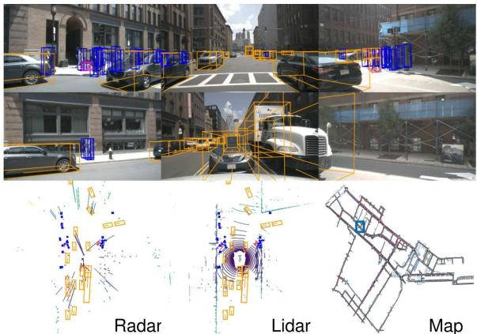
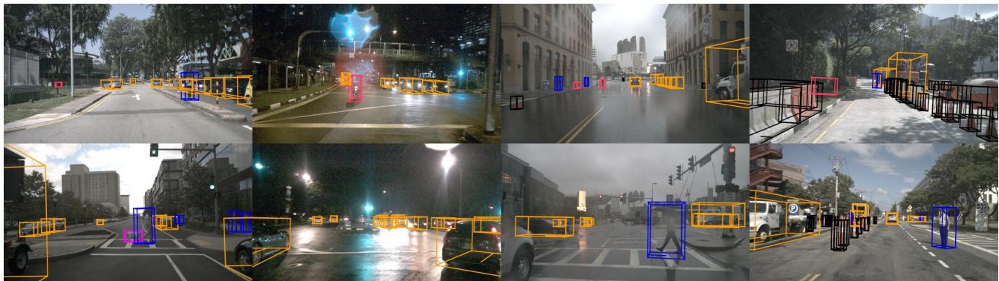
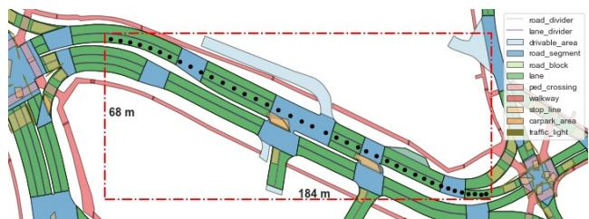
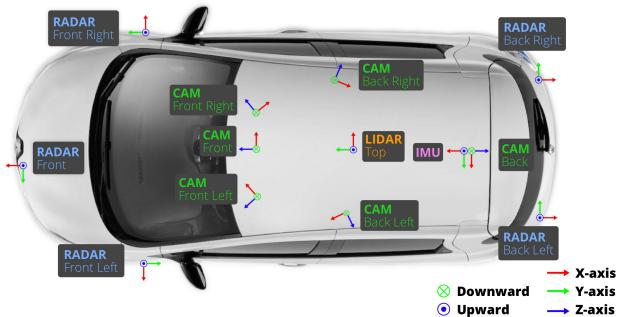
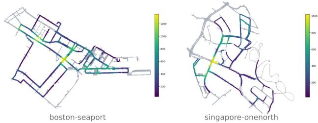
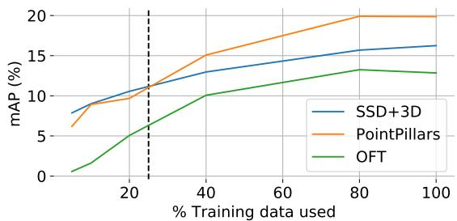
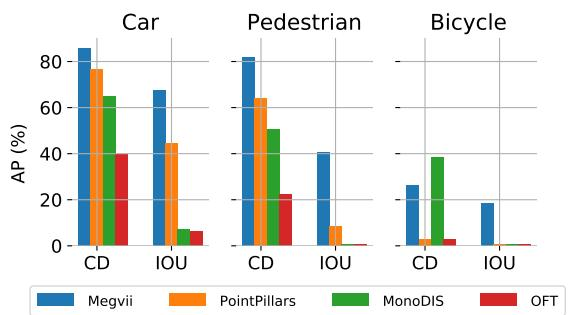

# nuScenes: A multimodal dataset for autonomous driving

Holger Caesar, Varun Bankiti, Alex H. Lang, Sourabh Vora, Venice Erin Liong, Qiang Xu, Anush Krishnan, Yu Pan, Giancarlo Baldan, Oscar Beijbom nuTonomy: an APTIV company nuscenes@nutonomy.com

nuscenes@nutonomy.com

## Abstract

Robust detection and tracking of objects is crucial for the deployment of autonomous vehicle technology. Image based benchmark datasets have driven development in computer vision tasks such as object detection, tracking and segmentation of agents in the environment. Most autonomous vehicles, however, carry a combination of cameras and range sensors such as lidar and radar. As machine learning based methodsfor detection and tracking become more prevalent, there is a need to train and evaluate such methods on datasets containing range sensor data along with images. In this work we present nuTonomy scenes (nuScenes), thefirst dataset to carry thefull autonomous vehicle sensor suite: 6 cameras, 5 radars and 1 lidar, all with full 360 degree field of view. nuScenes comprises 1000 scenes, each 20s long and fully annotated with 3D bounding boxes for 23 classes and 8 attributes. It has 7x as many annotations and 100x as many images as the pioneering KITTI dataset. We define novel 3D detection and tracking metrics. We also provide careful dataset analysis as well as baselines for lidar and image based detection and tracking. Data, development kit and more information are available online1.

## 1. Introduction

Autonomous driving has the potential to radically change the cityscape and save many human lives [78]. A crucial part of safe navigation is the detection and tracking of agents in the environment surrounding the vehicle. To achieve this, a modern self-driving vehicle deploys several sensors along with sophisticated detection and tracking algorithms. Such algorithms rely increasingly on machine learning, which drives the need for benchmark datasets. While there is a plethora of image datasets for this purpose (Table 1), there is a lack of multimodal datasets that exhibit the full set of challenges associated with building an autonomous driving perception system. We released the nuScenes dataset to address this gap2.

  
"Ped with pet, bicycle, car makes a u-turn, lane change, peds crossing crosswalk" Figure 1. An example from the nuScenes dataset. We see 6 different camera views, lidar and radar data, as well as the human annotated semantic map. At the bottom we show the human written scene description.

Multimodal datasets are of particular importance as no single type of sensor is sufficient and the sensor types are complementary. Cameras allow accurate measurements of edges, color and lighting enabling classification and localization on the image plane. However, 3D localization from images is challenging [13, 12, 57, 80, 69, 66, 73]. Lidar pointclouds, on the other hand, contain less semantic information but highly accurate localization in 3D [51]. Furthermore the reflectance of lidar is an important feature [40, 51]. However, lidar data is sparse and the range is typically limited to 50-150m. Radar sensors achieve a range of 200- 300m and measure the object velocity through the Doppler effect. However, the returns are even sparser than lidar and less precise in terms of localization. While radar has been used for decades [1, 3], we are not aware of any autonomous driving datasets that provide radar data.

Since the three sensor types have different failure modes during difficult conditions, the joint treatment of sensor data is essential for agent detection and tracking. Literature [46] even suggests that multimodal sensor configurations are not just complementary, but provide redundancy in the face of sabotage, failure, adverse conditions and blind spots. And while there are several works that have proposed fusion methods based on cameras and lidar [48, 14, 64, 52, 81, 75, 29], PointPillars [51] showed a lidar-only method that performed on par with existing fusion based methods. This suggests more work is required to combine multimodal measurements in a principled manner.

  
Figure 2. Front camera images collected from clear weather (col 1), nighttime (col 2), rain (col 3) and construction zones (col 4).

In order to train deep learning methods, quality data annotations are required. Most datasets provide 2D semantic annotations as boxes or masks (class or instance) [8, 19, 33, 85, 55]. At the time of the initial nuScenes release, only a few datasets annotated objects using 3D boxes [32, 41, 61], and they did not provide the full sensor suite. Following the nuScenes release, there are now several sets which contain the full sensor suite (Table 1). Still, to the best of our knowledge, no other 3D dataset provides attribute annotations, such as pedestrian pose or vehicle state.

Existing AV datasets and vehicles are focused on particular operational design domains. More research is required on generalizing to “complex, cluttered and unseen environments” [36]. Hence there is a need to study how detection methods generalize to different countries, lighting (daytime vs. nighttime), driving directions, road markings, vegetation, precipitation and previously unseen object types.

Contextual knowledge using semantic maps is also an important prior for scene understanding [82, 2, 35]. For example, one would expect to find cars on the road, but not on the sidewalk or inside buildings. With the notable exception of [45, 10], most AV datasets do not provide semantic maps.

## 1.1. Contributions

From the complexities of the multimodal 3D detection challenge, and the limitations of current AV datasets, a large-scale multimodal dataset with 360◦ coverage across all vision and range sensors collected from diverse situations alongside map information would boost AV sceneunderstanding research further. nuScenes does just that, and it is the main contribution of this work.

nuScenes represents a large leap forward in terms of data volumes and complexities (Table 1), and is the first dataset to provide 360◦ sensor coverage from the entire sensor suite. It is also the first AV dataset to include radar data and captured using an AV approved for public roads. It is further the first multimodal dataset that contains data from nighttime and rainy conditions, and with object attributes and scene descriptions in addition to object class and location. Similar to [84], nuScenes is a holistic scene understanding benchmark for AVs. It enables research on multiple tasks such as object detection, tracking and behavior modeling in a range of conditions.

Our second contribution is new detection and tracking metrics aimed at the AV application. We train 3D object detectors and trackers as a baseline, including a novel approach of using multiple lidar sweeps to enhance object detection. We also present and analyze the results of the nuScenes object detection and tracking challenges.

Third, we publish the devkit, evaluation code, taxonomy, annotator instructions, and database schema for industrywide standardization. Recently, the Lyft L5 [45] dataset adopted this format to achieve compatibility between the different datasets. The nuScenes data is published under CC BY-NC-SA 4.0 license, which means that anyone can use this dataset for non-commercial research purposes. All data, code, and information is made available online3.

Since the release, nuScenes has received strong interest from the AV community [90, 70, 50, 91, 9, 5, 68, 28, 49, 86, 89]. Some works extended our dataset to introduce new annotations for natural language object referral [22] and highlevel scene understanding [74]. The detection challenge enabled lidar based and camera based detection works such as [90, 70], that improved over the state-of-the-art at the time of initial release [51, 69] by 40% and 81% (Table 4). nuScenes has been used for 3D object detection [83, 60], multi-agent forecasting [9, 68], pedestrian localization [5], weather augmentation [37], and moving pointcloud prediction [27]. Being still the only annotated AV dataset to provide radar data, nuScenes encourages researchers to explore radar and sensor fusion for object detection [27, 42, 72].

<table><tr><td rowspan=1 colspan=1>Dataset</td><td rowspan=1 colspan=1>Year</td><td rowspan=1 colspan=1>Sce-nes</td><td rowspan=1 colspan=1>Size(hr)</td><td rowspan=1 colspan=1>RGBimgs</td><td rowspan=1 colspan=1>PCslidar††</td><td rowspan=1 colspan=1>PCsradar</td><td rowspan=1 colspan=1>Ann.frames</td><td rowspan=1 colspan=1>3Dboxes</td><td rowspan=1 colspan=1>Night /Rain</td><td rowspan=1 colspan=1>Maplayers</td><td rowspan=1 colspan=1>Clas-ses</td><td rowspan=1 colspan=1>Locations</td></tr><tr><td rowspan=1 colspan=1>CamVid [8]</td><td rowspan=1 colspan=1>2008</td><td rowspan=1 colspan=1>4</td><td rowspan=1 colspan=1>0.4</td><td rowspan=1 colspan=1>18k</td><td rowspan=1 colspan=1>0</td><td rowspan=1 colspan=1>0</td><td rowspan=1 colspan=1>700</td><td rowspan=1 colspan=1>0</td><td rowspan=1 colspan=1>No/No</td><td rowspan=1 colspan=1>0</td><td rowspan=1 colspan=1>32</td><td rowspan=1 colspan=1>Cambridge</td></tr><tr><td rowspan=1 colspan=1>Cityscapes [19]</td><td rowspan=1 colspan=1>2016</td><td rowspan=1 colspan=1>n/a</td><td rowspan=1 colspan=1></td><td rowspan=1 colspan=1>25k</td><td rowspan=1 colspan=1>0</td><td rowspan=1 colspan=1>0</td><td rowspan=1 colspan=1>25k</td><td rowspan=1 colspan=1>0</td><td rowspan=1 colspan=1>No/No</td><td rowspan=1 colspan=1>0</td><td rowspan=1 colspan=1>30</td><td rowspan=1 colspan=1>50 cities</td></tr><tr><td rowspan=1 colspan=1>Vistas [33]</td><td rowspan=1 colspan=1>2017</td><td rowspan=1 colspan=1>n/a</td><td rowspan=1 colspan=1>-</td><td rowspan=1 colspan=1>25k</td><td rowspan=1 colspan=1>0</td><td rowspan=1 colspan=1>0</td><td rowspan=1 colspan=1>25k</td><td rowspan=1 colspan=1>0</td><td rowspan=1 colspan=1>Yes/Yes</td><td rowspan=1 colspan=1>0</td><td rowspan=1 colspan=1>152</td><td rowspan=1 colspan=1>Global</td></tr><tr><td rowspan=1 colspan=1>BDD100K [85]</td><td rowspan=1 colspan=1>2017</td><td rowspan=1 colspan=1>100k</td><td rowspan=1 colspan=1>1k</td><td rowspan=1 colspan=1>100M</td><td rowspan=1 colspan=1>0</td><td rowspan=1 colspan=1>0</td><td rowspan=1 colspan=1>100k</td><td rowspan=1 colspan=1>0</td><td rowspan=1 colspan=1>Yes/Yes</td><td rowspan=1 colspan=1>0</td><td rowspan=1 colspan=1>10</td><td rowspan=1 colspan=1>NY, SF</td></tr><tr><td rowspan=1 colspan=1>ApolloScape [41]</td><td rowspan=1 colspan=1>2018</td><td rowspan=1 colspan=1></td><td rowspan=1 colspan=1>100</td><td rowspan=1 colspan=1>144k</td><td rowspan=1 colspan=1>0**</td><td rowspan=1 colspan=1>0</td><td rowspan=1 colspan=1>144k</td><td rowspan=1 colspan=1>70k</td><td rowspan=1 colspan=1>Yes/No</td><td rowspan=1 colspan=1>0</td><td rowspan=1 colspan=1>8-35</td><td rowspan=1 colspan=1>4x China</td></tr><tr><td rowspan=1 colspan=1>D2-City [11]</td><td rowspan=1 colspan=1>2019</td><td rowspan=1 colspan=1>1k†</td><td rowspan=1 colspan=1>-</td><td rowspan=1 colspan=1>700k†</td><td rowspan=1 colspan=1>0</td><td rowspan=1 colspan=1>0</td><td rowspan=1 colspan=1>700k†</td><td rowspan=1 colspan=1>0</td><td rowspan=1 colspan=1>No/Yes</td><td rowspan=1 colspan=1>0</td><td rowspan=1 colspan=1>12</td><td rowspan=1 colspan=1>5x China</td></tr><tr><td rowspan=1 colspan=1>KITTI [32]</td><td rowspan=1 colspan=1>2012</td><td rowspan=1 colspan=1>22</td><td rowspan=1 colspan=1>1.5</td><td rowspan=1 colspan=1>15k</td><td rowspan=1 colspan=1>15k</td><td rowspan=1 colspan=1>0</td><td rowspan=1 colspan=1>15k</td><td rowspan=1 colspan=1>200k</td><td rowspan=1 colspan=1>No/No</td><td rowspan=1 colspan=1>0</td><td rowspan=1 colspan=1>8</td><td rowspan=1 colspan=1>Karlsruhe</td></tr><tr><td rowspan=1 colspan=1>AS lidar [54]</td><td rowspan=1 colspan=1>2018</td><td rowspan=1 colspan=1></td><td rowspan=1 colspan=1>2</td><td rowspan=1 colspan=1>0</td><td rowspan=1 colspan=1>20k</td><td rowspan=1 colspan=1>0</td><td rowspan=1 colspan=1>20k</td><td rowspan=1 colspan=1>475k</td><td rowspan=1 colspan=1>-1-</td><td rowspan=1 colspan=1>0</td><td rowspan=1 colspan=1>6</td><td rowspan=1 colspan=1>China</td></tr><tr><td rowspan=1 colspan=1>KAIST [17]</td><td rowspan=1 colspan=1>2018</td><td rowspan=1 colspan=1></td><td rowspan=1 colspan=1></td><td rowspan=1 colspan=1>8.9k</td><td rowspan=1 colspan=1>8.9k</td><td rowspan=1 colspan=1>0</td><td rowspan=1 colspan=1>8.9k</td><td rowspan=1 colspan=1>0</td><td rowspan=1 colspan=1>Yes/No</td><td rowspan=1 colspan=1>0</td><td rowspan=1 colspan=1>3</td><td rowspan=1 colspan=1>Seoul</td></tr><tr><td rowspan=1 colspan=1>H3D [61]</td><td rowspan=1 colspan=1>2019</td><td rowspan=1 colspan=1>160</td><td rowspan=1 colspan=1>0.77</td><td rowspan=1 colspan=1>83k</td><td rowspan=1 colspan=1>27k</td><td rowspan=1 colspan=1>0</td><td rowspan=1 colspan=1>27k</td><td rowspan=1 colspan=1>1.1M</td><td rowspan=1 colspan=1>No/No</td><td rowspan=1 colspan=1>0</td><td rowspan=1 colspan=1>8</td><td rowspan=1 colspan=1>SF</td></tr><tr><td rowspan=1 colspan=1>nuScenes</td><td rowspan=1 colspan=1>2019</td><td rowspan=1 colspan=1>1k</td><td rowspan=1 colspan=1>5.5</td><td rowspan=1 colspan=1>1.4M</td><td rowspan=1 colspan=1>400k</td><td rowspan=1 colspan=1>1.3M</td><td rowspan=1 colspan=1>40k</td><td rowspan=1 colspan=1>1.4M</td><td rowspan=1 colspan=1>Yes/Yes</td><td rowspan=1 colspan=1>11</td><td rowspan=1 colspan=1>23</td><td rowspan=1 colspan=1>Boston, SG</td></tr><tr><td rowspan=1 colspan=1>Argoverse [10]</td><td rowspan=1 colspan=1>2019</td><td rowspan=1 colspan=1>113†</td><td rowspan=1 colspan=1>0.6†</td><td rowspan=1 colspan=1>490k†</td><td rowspan=1 colspan=1>44k</td><td rowspan=1 colspan=1>0</td><td rowspan=1 colspan=1>22k†</td><td rowspan=1 colspan=1>993k†</td><td rowspan=1 colspan=1>Yes/Yes</td><td rowspan=1 colspan=1>2</td><td rowspan=1 colspan=1>15</td><td rowspan=1 colspan=1>Miami, PT</td></tr><tr><td rowspan=1 colspan=1>Lyft L5 [45]</td><td rowspan=1 colspan=1>2019</td><td rowspan=1 colspan=1>366</td><td rowspan=1 colspan=1>2.5</td><td rowspan=1 colspan=1>323k</td><td rowspan=1 colspan=1>46k</td><td rowspan=1 colspan=1>0</td><td rowspan=1 colspan=1>46k</td><td rowspan=1 colspan=1>1.3M</td><td rowspan=1 colspan=1>No/No</td><td rowspan=1 colspan=1>7</td><td rowspan=1 colspan=1>9</td><td rowspan=1 colspan=1>Palo Alto</td></tr><tr><td rowspan=1 colspan=1>Waymo Open [76]</td><td rowspan=1 colspan=1>2019</td><td rowspan=1 colspan=1>1k</td><td rowspan=1 colspan=1>5.5</td><td rowspan=1 colspan=1>1M</td><td rowspan=1 colspan=1>200k</td><td rowspan=1 colspan=1>0</td><td rowspan=1 colspan=1>200k</td><td rowspan=1 colspan=1>12M</td><td rowspan=1 colspan=1>Yes/Yes</td><td rowspan=1 colspan=1>0</td><td rowspan=1 colspan=1>4</td><td rowspan=1 colspan=1>3x USA</td></tr><tr><td rowspan=1 colspan=1>A*3D [62]</td><td rowspan=1 colspan=1>2019</td><td rowspan=1 colspan=1>n/a</td><td rowspan=1 colspan=1>55</td><td rowspan=1 colspan=1>39k</td><td rowspan=1 colspan=1>39k</td><td rowspan=1 colspan=1>0</td><td rowspan=1 colspan=1>39k</td><td rowspan=1 colspan=1>230k</td><td rowspan=1 colspan=1>Yes/Yes</td><td rowspan=1 colspan=1>0</td><td rowspan=1 colspan=1>7</td><td rowspan=1 colspan=1>SG</td></tr><tr><td rowspan=1 colspan=1>A2D2 [34]</td><td rowspan=1 colspan=1>2019</td><td rowspan=1 colspan=1>n/a</td><td rowspan=1 colspan=1></td><td rowspan=1 colspan=1></td><td rowspan=1 colspan=1></td><td rowspan=1 colspan=1>0</td><td rowspan=1 colspan=1>12k</td><td rowspan=1 colspan=1></td><td rowspan=1 colspan=1>-1-</td><td rowspan=1 colspan=1>0</td><td rowspan=1 colspan=1>14</td><td rowspan=1 colspan=1>3x Germany</td></tr></table>

Table 1. AV dataset comparison. The top part of the table indicates datasets without range data. The middle and lower parts indicate datasets (not publications) with range data released until and after the initial release of this dataset. We use bold highlights to indicate the best entries in every column among the datasets with range data. Only datasets which provide annotations for at least car, pedestrian and bicycle are included in this comparison. (†) We report numbers only for scenes annotated with cuboids. (‡) The current Waymo Open dataset size is comparable to nuScenes, but at a 5x higher annotation frequency. (††) Lidar pointcloud count collected from each lidar. (\*\*) [41] provides static depth maps. (-) indicates that no information is provided. SG: Singapore, NY: New York, SF: San Francisco, PT: Pittsburgh, AS: ApolloScape.

## 1.2. Related datasets

The last decade has seen the release of several driving datasets which have played a huge role in sceneunderstanding research for AVs. Most datasets have focused on 2D annotations (boxes, masks) for RGB camera images. CamVid [8], Cityscapes [19], Mapillary Vistas [33], D2-City [11], BDD100k [85] and Apolloscape [41] released ever growing datasets with segmentation masks. Vistas, D2-City and BDD100k also contain images captured during different weather and illumination settings. Other datasets focus exclusively on pedestrian annotations on images [20, 25, 79, 24, 88, 23, 58]. The ease of capturing and annotating RGB images have made the release of these large image-only datasets possible.

On the other hand, multimodal datasets, which are typically comprised of images, range sensor data (lidars, radars), and GPS/IMU data, are expensive to collect and annotate due to the difficulties of integrating, synchronizing, and calibrating multiple sensors. KITTI [32] was the pioneering multimodal dataset providing dense pointclouds from a lidar sensor as well as front-facing stereo images and GPS/IMU data. It provides 200k 3D boxes over 22 scenes which helped advance the state-of-the-art in 3D object detection. The recent H3D dataset [61] includes 160 crowded scenes with a total of 1.1M 3D boxes annotated over 27k frames. The objects are annotated in the full 360◦ view, as opposed to KITTI where an object is only annotated if it is present in the frontal view. The KAIST multispectral dataset [17] is a multimodal dataset that consists of RGB and thermal camera, RGB stereo, 3D lidar and GPS/IMU. It provides nighttime data, but the size of the dataset is limited and annotations are in 2D. Other notable multimodal datasets include [15] providing driving behavior labels, [43] providing place categorization labels and [6, 55] providing raw data without semantic labels.

After the initial nuScenes release, [76, 10, 62, 34, 45] followed to release their own large-scale AV datasets (Table 1). Among these datasets, only the Waymo Open dataset [76] provides significantly more annotations, mostly due to the higher annotation frequency (10Hz vs. 2Hz)4. A\*3D takes an orthogonal approach where a similar number of frames (39k) are selected and annotated from 55 hours of data. The Lyft L5 dataset [45] is most similar to nuScenes. It was released using the nuScenes database schema and can therefore be parsed using the nuScenes devkit.

## 2. The nuScenes dataset

Here we describe how we plan drives, setup our vehicles, select interesting scenes, annotate the dataset and protect the privacy of third parties.

Drive planning. We drive in Boston (Seaport and South Boston) and Singapore (One North, Holland Village and Queenstown), two cities that are known for their dense traffic and highly challenging driving situations. We emphasize the diversity across locations in terms of vegetation, buildings, vehicles, road markings and right versus left-hand traffic. From a large body of training data we manually select 84 logs with 15h of driving data (242km travelled at an average of 16km/h). Driving routes are carefully chosen to capture a diverse set of locations (urban, residential, nature and industrial), times (day and night) and weather conditions (sun, rain and clouds).

<table><tr><td>Sensor</td><td>Details</td></tr><tr><td>6x Camera</td><td>RGB, 12Hz capture frequency, 1/1.8&quot; CMOS sensor, 1600 × 900 resolution, auto exposure, JPEG com- pressed</td></tr><tr><td>1x Lidar</td><td>Spinning, 32 beams, 20Hz capture frequency, 360° horizontal FOV, -30° to 10° vertical FOV, ≤ 70m range, ±2cm accuracy, up to 1.4M points per second.</td></tr><tr><td>5x Radar</td><td>≤ 250m range, 77GHz, FMCW, 13Hz capture fre- quency, ±0.1km/h vel. accuracy</td></tr><tr><td>GPS &amp; IMU</td><td>GPS, IMU, AHRS. 0.2° heading, 0.1° roll/pitch, 20mm RTK positioning, 1000Hz update rate</td></tr></table>

Table 2. Sensor data in nuScenes.

Car setup. We use two Renault Zoe supermini electric cars with an identical sensor layout to drive in Boston and Singapore. See Figure 4 for sensor placements and Table 2 for sensor details. Front and side cameras have a 70◦ FOV and are offset by 55◦. The rear camera has a FOV of 110◦.

Sensor synchronization. To achieve good cross-modality data alignment between the lidar and the cameras, the exposure of a camera is triggered when the top lidar sweeps across the center of the camera’s FOV. The timestamp of the image is the exposure trigger time; and the timestamp of the lidar scan is the time when the full rotation of the current lidar frame is achieved. Given that the camera’s exposure time is nearly instantaneous, this method generally yields good data alignment5. We perform motion compensation using the localization algorithm described below.

Localization. Most existing datasets provide the vehicle location based on GPS and IMU [32, 41, 19, 61]. Such localization systems are vulnerable to GPS outages, as seen on the KITTI dataset [32, 7]. As we operate in dense urban areas, this problem is even more pronounced. To accurately localize our vehicle, we create a detailed HD map of lidar points in an offline step. While collecting data, we use a Monte Carlo Localization scheme from lidar and odometry information [18]. This method is very robust and we achieve localization errors of ≤ 10cm. To encourage robotics research, we also provide the raw CAN bus data (e.g. velocities, accelerations, torque, steering angles, wheel speeds) similar to [65].

Maps. We provide highly accurate human-annotated semantic maps of the relevant areas. The original rasterized map includes only roads and sidewalks with a resolution of 10px/m. The vectorized map expansion provides information on 11 semantic classes as shown in Figure 3, making it richer than the semantic maps of other datasets published since the original release [10, 45]. We encourage the use of localization and semantic maps as strong priors for all tasks.

  
Figure 3. Semantic map of nuScenes with 11 semantic layers in different colors. To show the path of the ego vehicle we plot each keyframe ego pose from scene-0121 with black spheres.

Finally, we provide the baseline routes - the idealized path an AV should take, assuming there are no obstacles. This route may assist trajectory prediction [68], as it simplifies the problem by reducing the search space of viable routes.

Scene selection. After collecting the raw sensor data, we manually select 1000 interesting scenes of 20s duration each. Such scenes include high traffic density (e.g. intersections, construction sites), rare classes (e.g. ambulances, animals), potentially dangerous traffic situations (e.g. jaywalkers, incorrect behavior), maneuvers (e.g. lane change, turning, stopping) and situations that may be difficult for an AV. We also select some scenes to encourage diversity in terms of spatial coverage, different scene types, as well as different weather and lighting conditions. Expert annotators write textual descriptions or captions for each scene (e.g.: “Wait at intersection, peds on sidewalk, bicycle crossing, jaywalker, turn right, parked cars, rain”).

Data annotation. Having selected the scenes, we sample keyframes (image, lidar, radar) at 2Hz. We annotate each of the 23 object classes in every keyframe with a semantic category, attributes (visibility, activity, and pose) and a cuboid modeled as x, y, z, width, length, height and yaw angle. We annotate objects continuously throughout each scene if they are covered by at least one lidar or radar point. Using expert annotators and multiple validation steps, we achieve highly accurate annotations. We also release intermediate sensor frames, which are important for tracking, prediction and object detection as shown in Section 4.2. At capture frequencies of 12Hz, 13Hz and 20Hz for camera, radar and lidar, this makes our dataset unique. Only the Waymo Open dataset provides a similarly high capture frequency of 10Hz.

  
Figure 4. Sensor setup for our data collection platform.

  
Figure 5. Spatial data coverage for two nuScenes locations. Colors indicate the number of keyframes with ego vehicle poses within a 100m radius across all scenes.

Annotation statistics. Our dataset has 23 categories including different vehicles, types of pedestrians, mobility devices and other objects (Figure 8-SM). We present statistics on geometry and frequencies of different classes (Figure 9- SM). Per keyframe there are 7 pedestrians and 20 vehicles on average. Moreover, 40k keyframes were taken from four different scene locations (Boston: 55%, SG-OneNorth: 21.5%, SG-Queenstown: 13.5%, SG-HollandVillage: 10%) with various weather and lighting conditions (rain: 19.4%, night: 11.6%). Due to the finegrained classes in nuScenes, the dataset shows severe class imbalance with a ratio of 1:10k for the least and most common class annotations (1:36 in KITTI). This encourages the community to explore this long tail problem in more depth.

Figure 5 shows spatial coverage across all scenes. We see that most data comes from intersections. Figure 10-SM shows that car annotations are seen at varying distances and as far as 80m from the ego-vehicle. Box orientation is also varying, with the most number in vertical and horizontal angles for cars as expected due to parked cars and cars in the same lane. Lidar and radar points statistics inside each box annotation are shown in Figure 14-SM. Annotated objects contain up to 100 lidar points even at a radial distance of 80m and at most 12k lidar points at 3m. At the same time they contain up to 40 radar returns at 10m and 10 at 50m. The radar range far exceeds the lidar range at up to 200m.

## 3. Tasks & Metrics

The multimodal nature of nuScenes supports a multitude of tasks including detection, tracking, prediction & localization. Here we present the detection and tracking tasks and metrics. We define the detection task to only operate on sensor data between [t−0.5, t] seconds for an object at time t, whereas the tracking task operates on data between [0, t].

## 3.1. Detection

The nuScenes detection task requires detecting 10 object classes with 3D bounding boxes, attributes (e.g. sitting vs. standing), and velocities. The 10 classes are a subset of all 23 classes annotated in nuScenes (Table 5-SM).

Average Precision metric. We use the Average Precision (AP) metric [32, 26], but define a match by thresholding the 2D center distance d on the ground plane instead of intersection over union (IOU). This is done in order to decouple detection from object size and orientation but also because objects with small footprints, like pedestrians and bikes, if detected with a small translation error, give 0 IOU (Figure 7). This makes it hard to compare the performance of vision-only methods which tend to have large localization errors [69].

We then calculate AP as the normalized area under the precision recall curve for recall and precision over 10%. Operating points where recall or precision is less than 10% are removed in order to minimize the impact of noise commonly seen in low precision and recall regions. If no operating point in this region is achieved, the AP for that class is set to zero. We then average over matching thresholds of D = {0.5, 1, 2, 4} meters and the set of classes C:

$$
{ \mathrm { m A P } } = { \frac { 1 } { | \mathbb { C } | | \mathbb { D } | } } \sum _ { c \in \mathbb { C } } \sum _ { d \in \mathbb { D } } \mathbf { A P } _ { c , d }\tag{1}
$$

True Positive metrics. In addition to AP, we measure a set of True Positive metrics (TP metrics) for each prediction that was matched with a ground truth box. All TP metrics are calculated using d = 2m center distance during matching, and they are all designed to be positive scalars. In the proposed metric, the TP metrics are all in native units (see below) which makes the results easy to interpret and compare. Matching and scoring happen independently per class and each metric is the average of the cumulative mean at each achieved recall level above 10%. If 10% recall is not achieved for a particular class, all TP errors for that class are set to 1. The following TP errors are defined:

Average Translation Error (ATE) is the Euclidean center distance in 2D (units in meters). Average Scale Error (ASE) is the 3D intersection over union (IOU) after aligning orientation and translation (1 − IOU). Average Orientation Error (AOE) is the smallest yaw angle difference between prediction and ground truth (radians). All angles are measured on a full 360◦ period except for barriers where they are measured on a $1 8 0 ^ { \circ }$ period. Average Velocity Error (AVE) is the absolute velocity error as the L2 norm of the velocity differences in 2D (m/s). Average Attribute Error (AAE) is defined as 1 minus attribute classification accuracy (1 − acc). For each TP metric we compute the mean TP metric (mTP) over all classes:

$$
\mathrm { m T P } = \frac { 1 } { | \mathbb { C } | } \sum _ { c \in \mathbb { C } } \mathrm { T P } _ { c }\tag{2}
$$

We omit measurements for classes where they are not well defined: AVE for cones and barriers since they are stationary; AOE of cones since they do not have a well defined orientation; and AAE for cones and barriers since there are no attributes defined on these classes.

nuScenes detection score. mAP with a threshold on IOU is perhaps the most popular metric for object detection [32, 19, 21]. However, this metric can not capture all aspects of the nuScenes detection tasks, like velocity and attribute estimation. Further, it couples location, size and orientation estimates. The ApolloScape [41] 3D car instance challenge disentangles these by defining thresholds for each error type and recall threshold. This results in 10 × 3 thresholds, making this approach complex, arbitrary and unintuitive. We propose instead consolidating the different error types into a scalar score: the nuScenes detection score (NDS).

$$
\mathrm { N D S } = \frac { 1 } { 1 0 } [ 5 \mathrm { m A P } + \sum _ { \mathrm { m T P } \in \mathrm { T P } } ( 1 - \mathrm { m i n } ( 1 , \mathrm { m T P } ) ) ]\tag{3}
$$

Here mAP is mean Average Precision (1), and TP the set of the five mean True Positive metrics (2). Half of NDS is thus based on the detection performance while the other half quantifies the quality of the detections in terms of box location, size, orientation, attributes, and velocity. Since mAVE, mAOE and mATE can be larger than 1, we bound each metric between 0 and 1 in (3).

## 3.2. Tracking

In this section we present the tracking task setup and metrics. The focus of the tracking task is to track all detected objects in a scene. All detection classes defined in Section 3.1 are used, except the static classes: barrier, construction and trafficcone.

AMOTA and AMOTP metrics. Weng and Kitani [77] presented a similar 3D MOT benchmark on KITTI [32]. They point out that traditional metrics do not take into account the confidence of a prediction. Thus they develop Average Multi Object Tracking Accuracy (AMOTA) and Average Multi Object Tracking Precision (AMOTP), which average MOTA and MOTP across all recall thresholds. By comparing the KITTI and nuScenes leaderboards for detection and tracking, we find that nuScenes is significantly more difficult. Due to the difficulty of nuScenes, the traditional MOTA metric is often zero. In the updated formulation sMOTA [77]6, MOTA is therefore augmented by a term to adjust for the respective recall:

$$
s M O T A _ { r } = \operatorname* { m a x } \left( 0 , \ 1 \ - \ { \frac { I D S _ { r } + F P _ { r } + F N _ { r } - ( 1 - r ) P } { r P } } \right)
$$

This is to guarantee that sMOTA values span the entire [0, 1] range. We perform 40-point interpolation in the recall range [0.1, 1] (the recall values are denoted as R). The resulting sAMOTA metric is the main metric for the tracking task:

$$
s A M O T A = \frac { 1 } { | \mathcal { R } | } \sum _ { r \in \mathcal { R } } s M O T A _ { r }
$$

Traditional metrics. We also use traditional tracking metrics such as MOTA and MOTP [4], false alarms per frame, mostly tracked trajectories, mostly lost trajectories, false positives, false negatives, identity switches, and track fragmentations. Similar to [77], we try all recall thresholds and then use the threshold that achieves highest sMOTA .

TID and LGD metrics. In addition, we devise two novel metrics: Track initialization duration (TID) and longest gap duration (LGD). Some trackers require a fixed window of past sensor readings or perform poorly without a good initialization. TID measures the duration from the beginning of the track until the time an object is first detected. LGD computes the longest duration of any detection gap in a track. If an object is not tracked, we assign the entire track duration as TID and LGD. For both metrics, we compute the average over all tracks. These metrics are relevant for AVs as many short-term track fragmentations may be more acceptable than missing an object for several seconds.

## 4. Experiments

In this section we present object detection and tracking experiments on the nuScenes dataset, analyze their characteristics and suggest avenues for future research.

## 4.1. Baselines

We present a number of baselines with different modalities for detection and tracking.

Lidar detection baseline. To demonstrate the performance of a leading algorithm on nuScenes, we train a lidaronly 3D object detector, PointPillars [51]. We take advantage of temporal data available in nuScenes by accumulating lidar sweeps for a richer pointcloud as input. A single network was trained for all classes. The network was modified to also learn velocities as an additional regression target for each 3D box. We set the box attributes to the most common attribute for each class in the training data.

Image detection baseline. To examine image-only 3D object detection, we re-implement the Orthographic Feature Transform (OFT) [69] method. A single OFT network was used for all classes. We modified the original OFT to use a SSD detection head and confirmed that this matched published results on KITTI. The network takes in a single image from which the full $3 6 0 ^ { \circ }$ predictions are combined together from all 6 cameras using non-maximum suppression (NMS). We set the box velocity to zero and attributes to the most common attribute for each class in the train data.

Detection challenge results. We compare the results of the top submissions to the nuScenes detection challenge 2019. Among all submissions, Megvii [90] gave the best performance. It is a lidar based class-balanced multi-head network with sparse 3D convolutions. Among image-only submissions, MonoDIS [70] was the best, significantly outperforming our image baseline and even some lidar based methods. It uses a novel disentangling 2D and 3D detection loss. Note that the top methods all performed importance sampling, which shows the importance of addressing the class imbalance problem.

Tracking baselines. We present several baselines for tracking from camera and lidar data. From the detection challenge, we pick the best performing lidar method (Megvii [90]), the fastest reported method at inference time (PointPillars [51]), as well as the best performing camera method (MonoDIS [70]). Using the detections from each method, we setup baselines using the tracking approach described in [77]. We provide detection and tracking results for each of these methods on the train, val and test splits to facilitate more systematic research. See the Supplementary Material for the results of the 2019 nuScenes tracking challenge.

## 4.2. Analysis

Here we analyze the properties of the methods presented in Section 4.1, as well as the dataset and matching function.

The case for a large benchmark dataset. One of the contributions of nuScenes is the dataset size, and in particular the increase compared to KITTI (Table 1). Here we examine the benefits of the larger dataset size. We train Point-Pillars [51], OFT [69] and an additional image baseline, SSD+3D, with varying amounts of training data. SSD+3D has the same 3D parametrization as MonoDIS [70], but use a single stage design [53]. For this ablation study we train PointPillars with 6x fewer epochs and a one cycle optimizer schedule [71] to cut down the training time. Our main finding is that the method ordering changes with the amount of data (Figure 6). In particular, PointPillars performs similar to SSD+3D at data volumes commensurate with KITTI, but as more data is used, it is clear that PointPillars is stronger. This suggests that the full potential of complex algorithms can only be verified with a bigger and more diverse training set. A similar conclusion was reached by [56, 59] with [59] suggesting that the KITTI leaderboard reflects the data aug. method rather than the actual algorithms.

The importance of the matching function. We compare performance of published methods (Table 4) when using our proposed 2m center-distance matching versus the IOU matching used in KITTI. As expected, when using IOU matching, small objects like pedestrians and bicycles fail to achieve above 0 AP, making ordering impossible (Figure 7). In contrast, center distance matching declares MonoDIS a clear winner. The impact is smaller for the car class, but also in this case it is hard to resolve the difference between MonoDIS and OFT.

  
Figure 6. Amount of training data vs. mean Average Precision (mAP) on the val set of nuScenes. The dashed black line corresponds to the amount of training data in KITTI [32].

  
Figure 7. Average precision vs. matching function. CD: Center distance. IOU: Intersection over union. We use IOU = 0.7 for car and IOU = 0.5 for pedestrian and bicycle following KITTI [32]. We use CD = 2m for the TP metrics in Section 3.1.

The matching function also changes the balance between lidar and image based methods. In fact, the ordering switches when using center distance matching to favour MonoDIS over both lidar based methods on the bicycle class (Figure 7). This makes sense since the thin structures of bicycles make them difficult to detect in lidar. We conclude that center distance matching is more appropriate to rank image based methods alongside lidar based methods.

Multiple lidar sweeps improve performance. According to our evaluation protocol (Section 3.1), one is only allowed to use 0.5s of previous data to make a detection decision. This corresponds to 10 previous lidar sweeps since the lidar is sampled at 20Hz. We device a simple way of incorporating multiple pointclouds into the PointPillars baseline and investigate the performance impact. Accumulation is implemented by moving all pointclouds to the coordinate system of the keyframe and appending a scalar time-stamp to each point indicating the time delta in seconds from the keyframe. The encoder includes the time delta as an extra decoration for the lidar points. Aside from the advantage of richer pointclouds, this also provides temporal information, which helps the network in localization and enables velocity prediction. We experiment with using 1, 5, and 10 lidar sweeps. The results show that both detection and velocity estimates improve with an increasing number of lidar sweeps but with diminishing rate of return (Table 3).

<table><tr><td rowspan=1 colspan=1>Lidar sweeps</td><td rowspan=1 colspan=1>Pretrain</td><td rowspan=1 colspan=1>ing NDS (</td><td rowspan=1 colspan=1>%) mAP (%)</td><td rowspan=1 colspan=1>mAVE (m/s)</td></tr><tr><td rowspan=1 colspan=1>1</td><td rowspan=1 colspan=1>KITTI</td><td rowspan=1 colspan=1>31.8</td><td rowspan=1 colspan=1>21.9</td><td rowspan=1 colspan=1>1.21</td></tr><tr><td rowspan=1 colspan=1>5</td><td rowspan=1 colspan=1>KITTI</td><td rowspan=1 colspan=1>42.9</td><td rowspan=1 colspan=1>27.7</td><td rowspan=1 colspan=1>0.34</td></tr><tr><td rowspan=1 colspan=1>10</td><td rowspan=1 colspan=1>KITTI</td><td rowspan=1 colspan=1>44.8</td><td rowspan=1 colspan=1>28.8</td><td rowspan=1 colspan=1>0.30</td></tr><tr><td rowspan=1 colspan=1>10</td><td rowspan=1 colspan=1>ImageNet</td><td rowspan=1 colspan=1>44.9</td><td rowspan=1 colspan=1>28.9</td><td rowspan=1 colspan=1>0.31</td></tr><tr><td rowspan=1 colspan=1>10</td><td rowspan=1 colspan=1>None</td><td rowspan=1 colspan=1>44.2</td><td rowspan=1 colspan=1>27.6</td><td rowspan=1 colspan=1>0.33</td></tr></table>

Table 3. PointPillars [51] detection performance on the val set. We can see that more lidar sweeps lead to a significant performance increase and that pretraining with ImageNet is on par with KITTI.

Which sensor is most important? An important question for AVs is which sensors are required to achieve the best detection performance. Here we compare the performance of leading lidar and image detectors. We focus on these modalities as there are no competitive radar-only methods in the literature and our preliminary study with PointPillars on radar data did not achieve promising results. We compare PointPillars, which is a fast and light lidar detector with MonoDIS, a top image detector (Table 4). The two methods achieve similar mAP (30.5% vs. 30.4%), but PointPillars has higher NDS (45.3% vs. 38.4%). The close mAP is, of itself, notable and speaks to the recent advantage in 3D estimation from monocular vision. However, as discussed above the differences would be larger with an IOU based matching function.

Class specifc performance is in Table 7-SM. PointPillars was stronger for the two most common classes: cars (68.4% vs. 47.8% AP), and pedestrians (59.7% vs. 37.0% AP). MonoDIS, on the other hand, was stronger for the smaller classes bicycles (24.5% vs. 1.1% AP) and cones (48.7% vs. 30.8% AP). This is expected since 1) bicycles are thin objects with typically few lidar returns and 2) traffic cones are easy to detect in images, but small and easily overlooked in a lidar pointcloud. 3) MonoDIS applied importance sampling during training to boost rare classes. With similar detection performance, why was NDS lower for MonoDIS? The main reasons are the average translation errors (52cm vs. 74cm) and velocity errors (1.55m/s vs. 0.32m/s), both as expected. MonoDIS also had larger scale errors with mean IOU 74% vs. 71% but the difference is small, suggesting the strong ability for image-only methods to infer size from appearance.

The importance of pre-training. Using the lidar baseline we examine the importance of pre-training when training a detector on nuScenes. No pretraining means weights are initialized randomly using a uniform distribution as in [38]. ImageNet [21] pretraining [47] uses a backbone that was first trained to accurately classify images. KITTI [32] pretraining uses a backbone that was trained on the lidar pointclouds to predict 3D boxes. Interestingly, while the KITTI pretrained network did converge faster, the final performance of the network only marginally varied between different pretrainings (Table 3). One explanation may be that while KITTI is close in domain, the size is not large enough.

<table><tr><td rowspan=2 colspan=1>Method</td><td rowspan=1 colspan=1>NDS</td><td rowspan=1 colspan=1>mAP</td><td rowspan=1 colspan=1>mATE</td><td rowspan=1 colspan=1>mASE</td><td rowspan=1 colspan=1>mAOE</td><td rowspan=1 colspan=1>mAVE</td><td rowspan=1 colspan=1>mAAE</td></tr><tr><td rowspan=1 colspan=1>(%)</td><td rowspan=1 colspan=1>(%)</td><td rowspan=1 colspan=1>(m)</td><td rowspan=1 colspan=1>(1-iou)</td><td rowspan=1 colspan=1>(rad)</td><td rowspan=1 colspan=1>(m/s)</td><td rowspan=1 colspan=1>(1-acc)</td></tr><tr><td rowspan=1 colspan=1>OFT [69]†</td><td rowspan=1 colspan=1>21.2</td><td rowspan=1 colspan=1>12.6</td><td rowspan=1 colspan=1>0.82</td><td rowspan=1 colspan=1>0.36</td><td rowspan=1 colspan=1>0.85</td><td rowspan=1 colspan=1>1.73</td><td rowspan=1 colspan=1>0.48</td></tr><tr><td rowspan=1 colspan=1>SSD+3D†</td><td rowspan=1 colspan=1>26.8</td><td rowspan=1 colspan=1>16.4</td><td rowspan=1 colspan=1>0.90</td><td rowspan=1 colspan=1>0.33</td><td rowspan=1 colspan=1>0.62</td><td rowspan=1 colspan=1>1.31</td><td rowspan=1 colspan=1>0.29</td></tr><tr><td rowspan=1 colspan=1>MDIS [70]†</td><td rowspan=1 colspan=1>38.4</td><td rowspan=1 colspan=1>30.4</td><td rowspan=1 colspan=1>0.74</td><td rowspan=1 colspan=1>0.26</td><td rowspan=1 colspan=1>0.55</td><td rowspan=1 colspan=1>1.55</td><td rowspan=1 colspan=1>0.13</td></tr><tr><td rowspan=1 colspan=1>PP [51]</td><td rowspan=1 colspan=1>45.3</td><td rowspan=1 colspan=1>30.5</td><td rowspan=1 colspan=1>0.52</td><td rowspan=1 colspan=1>0.29</td><td rowspan=1 colspan=1>0.50</td><td rowspan=1 colspan=1>0.32</td><td rowspan=1 colspan=1>0.37</td></tr><tr><td rowspan=1 colspan=1>Megvii [90]</td><td rowspan=1 colspan=1>63.3</td><td rowspan=1 colspan=1>52.8</td><td rowspan=1 colspan=1>0.30</td><td rowspan=1 colspan=1>0.25</td><td rowspan=1 colspan=1>0.38</td><td rowspan=1 colspan=1>0.25</td><td rowspan=1 colspan=1>0.14</td></tr></table>

Table 4. Object detection results on the test set of nuScenes. PointPillars, OFT and SSD+3D are baselines provided in this paper, other methods are the top submissions to the nuScenes detection challenge leaderboard. (†) use only monocular camera images as input. All other methods use lidar. PP: PointPillars [51], MDIS: MonoDIS [70].

Better detection gives better tracking. Weng and Kitani [77] presented a simple baseline that achieved stateof-the-art 3d tracking results using powerful detections on KITTI. Here we analyze whether better detections also imply better tracking performance on nuScenes, using the image and lidar baselines presented in Section 4.1. Megvii, PointPillars and MonoDIS achieve an sAMOTA of 17.9%, 3.5% and 4.5%, and an AMOTP of 1.50m, 1.69m and 1.79m on the val set. Compared to the mAP and NDS detection results in Table 4, the ranking is similar. While the performance is correlated across most metrics, we notice that MonoDIS has the shortest LGD and highest number of track fragmentations. This may indicate that despite the lower performance, image based methods are less likely to miss an object for a protracted period of time.

## 5. Conclusion

In this paper we present the nuScenes dataset, detection and tracking tasks, metrics, baselines and results. This is the first dataset collected from an AV approved for testing on public roads and that contains the full 360◦ sensor suite (lidar, images, and radar). nuScenes has the largest collection of 3D box annotations of any previously released dataset. To spur research on 3D object detection for AVs, we introduce a new detection metric that balances all aspects of detection performance. We demonstrate novel adaptations of leading lidar and image object detectors and trackers on nuScenes. Future work will add image-level and pointlevel semantic labels and a benchmark for trajectory prediction [63].

Acknowledgements. The nuScenes dataset was annotated by Scale.ai and we thank Alexandr Wang and Dave Morse for their support. We thank Sun Li, Serene Chen and Karen Ngo at nuTonomy for data inspection and quality control, Bassam Helou and Thomas Roddick for OFT baseline results, Sergi Widjaja and Kiwoo Shin for the tutorials, and Deshraj Yadav and Rishabh Jain from EvalAI [30] for setting up the nuScenes challenges.

## References

[1] Giancarlo Alessandretti, Alberto Broggi, and Pietro Cerri. Vehicle and guard rail detection using radar and vision data fusion. IEEE Transactions on Intelligent Transportation Systems, 2007. 1

[2] Dan Barnes, Will Maddern, and Ingmar Posner. Exploiting 3d semantic scene priors for online traffic light interpretation. In IVS, 2015. 2

[3] Klaus Bengler, Klaus Dietmayer, Berthold Farber, Markus Maurer, Christoph Stiller, and Hermann Winner. Three decades of driver assistance systems: Review and future perspectives. ITSM, 2014. 1

[4] Keni Bernardin, Alexander Elbs, and Rainer Stiefelhagen. Multiple object tracking performance metrics and evaluation in a smart room environment. In ECCV Workshop on Visual Surveillance, 2006. 6

[5] Lorenzo Bertoni, Sven Kreiss, and Alexandre Alahi. Monoloco: Monocular 3d pedestrian localization and uncertainty estimation. In ICCV, 2019. 2

[6] Jose-Luis Blanco-Claraco, Francisco-´ Angel Moreno-Dueas,´ and Javier Gonzalez-Jim´ enez. The M´ alaga urban dataset:´ High-rate stereo and lidar in a realistic urban scenario. IJRR, 2014. 3

[7] Martin Brossard, Axel Barrau, and Silvere Bonnabel. AI-\` IMU Dead-Reckoning. arXiv preprint arXiv:1904.06064, 2019. 4

[8] Gabriel J. Brostow, Jamie Shotton, Julien Fauqueur, and Roberto Cipolla. Segmentation and recognition using structure from motion point clouds. In ECCV, 2008. 2, 3

[9] Sergio Casas, Cole Gulino, Renjie Liao, and Raquel Urtasun. Spatially-aware graph neural networks for relational behavior forecasting from sensor data. arXiv preprint arXiv:1910.08233, 2019. 2

[10] Ming-Fang Chang, John W Lambert, Patsorn Sangkloy, Jagjeet Singh, Slawomir Bak, Andrew Hartnett, De Wang, Peter Carr, Simon Lucey, Deva Ramanan, and James Hays. Argoverse: 3d tracking and forecasting with rich maps. In CVPR, 2019. 2, 3, 4

[11] Z. Che, G. Li, T. Li, B. Jiang, X. Shi, X. Zhang, Y. Lu, G. Wu, Y. Liu, and J. Ye. D2-City: A large-scale dashcam video dataset of diverse traffic scenarios. arXiv:1904.01975, 2019. 3

[12] Xiaozhi Chen, Kaustav Kundu, Yukun Zhu, Andrew G Berneshawi, Huimin Ma, Sanja Fidler, and Raquel Urtasun. 3d object proposals for accurate object class detection. In NIPS, 2015. 1

[13] Xiaozhi Chen, Laustav Kundu, Ziyu Zhang, Huimin Ma, Sanja Fidler, and Raquel Urtasun. Monocular 3d object de tection for autonomous driving. In CVPR, 2016. 1

[14] Xiaozhi Chen, Huimin Ma, Ji Wan, Bo Li, and Tian Xia. Multi-view 3d object detection network for autonomous driving. In CVPR, 2017. 2

[15] Yiping Chen, Jingkang Wang, Jonathan Li, Cewu Lu, Zhipeng Luo, Han Xue, and Cheng Wang. Lidar-video driving dataset: Learning driving policies effectively. In CVPR, 2018. 3

[16] Hsu-kuang Chiu, Antonio Prioletti, Jie Li, and Jeannette Bohg. Probabilistic 3d multi-object tracking for autonomous driving. arXiv preprint arXiv:2001.05673, 2020. 15, 16

[17] Yukyung Choi, Namil Kim, Soonmin Hwang, Kibaek Park, Jae Shin Yoon, Kyounghwan An, and In So Kweon. KAIST multi-spectral day/night data set for autonomous and assisted driving. IEEE Transactions on Intelligent Transportation Systems, 2017. 3

[18] Z. J. Chong, B. Qin, T. Bandyopadhyay, M. H. Ang, E. Frazzoli, and D. Rus. Synthetic 2d lidar for precise vehicle localization in 3d urban environment. In ICRA, 2013. 4

[19] Marius Cordts, Mohamed Omran, Sebastian Ramos, Timo Rehfeld, Markus Enzweiler, Rodrigo Benenson, Uwe Franke, Stefan Roth, and Bernt Schiele. The Cityscapes dataset for semantic urban scene understanding. In CVPR, 2016. 2, 3, 4, 6, 12

[20] Navneet Dalal and Bill Triggs. Histograms of oriented gradients for human detection. In CVPR, 2005. 3

[21] Jia Deng, Wei Dong, Richard Socher, Li-Jia Li, Kai Li, and Li Fei-Fei. ImageNet: A large-scale hierarchical image database. In CVPR, 2009. 6, 8

[22] Thierry Deruyttere, Simon Vandenhende, Dusan Grujicic, Luc Van Gool, and Marie-Francine Moens. Talk2car: Taking control of your self-driving car. arXiv preprint arXiv:1909.10838, 2019. 2

[23] Piotr Dollar, Christian Wojek, Bernt Schiele, and Pietro Per-´ ona. Pedestrian detection: An evaluation of the state of the art. PAMI, 2012. 3

[24] Markus Enzweiler and Dariu M. Gavrila. Monocular pedestrian detection: Survey and experiments. PAMI, 2009. 3

[25] Andreas Ess, Bastian Leibe, Konrad Schindler, and Luc Van Gool. A mobile vision system for robust multi-person tracking. In CVPR, 2008. 3

[26] Mark Everingham, Luc Van Gool, Christopher K. I. Williams, John Winn, and Andrew Zisserman. The pascal visual object classes (VOC) challenge. International Journal ofComputer Vision, 2010. 5

[27] Hehe Fan and Yi Yang. PointRNN: Point recurrent neural network for moving point cloud processing. arXiv preprint arXiv:1910.08287, 2019. 2

[28] Di Feng, Christian Haase-Schuetz, Lars Rosenbaum, Heinz Hertlein, Fabian Duffhauss, Claudius Glaeser, Werner Wiesbeck, and Klaus Dietmayer. Deep multi-modal object detection and semantic segmentation for autonomous driving: Datasets, methods, and challenges. arXiv preprint arXiv:1902.07830, 2019. 2

[29] D. Feng, C. Haase-Schuetz, L. Rosenbaum, H. Hertlein, C. Glaeser, F. Timm, W. Wiesbeck, and K. Dietmayer. Deep multi-modal object detection and semantic segmentation for autonomous driving: Datasets, methods, and challenges. arXiv:1902.07830, 2019. 2

[30] EvalAI: Towards Better Evaluation Systems for AI Agents. D. yadav and r. jain and h. agrawal and p. chattopadhyay and t. singh and a. jain and s. b. singh and s. lee and d. batra. arXiv:1902.03570, 2019. 8

[31] Andrea Frome, German Cheung, Ahmad Abdulkader, Marco Zennaro, Bo Wu, Alessandro Bissacco, Hartwig Adam,

Hartmut Neven, and Luc Vincent. Large-scale privacy protection in google street view. In ICCV, 2009. 12

[32] Andreas Geiger, Philip Lenz, and Raquel Urtasun. Are we ready for autonomous driving? the KITTI vision benchmark suite. In CVPR, 2012. 2, 3, 4, 5, 6, 7, 8, 12

[33] Neuhold Gerhard, Tobias Ollmann, Samuel Rota Bulo, and Peter Kontschieder. The Mapillary Vistas dataset for semantic understanding of street scenes. In ICCV, 2017. 2, 3

[34] Jakob Geyer, Yohannes Kassahun, Mentar Mahmudi, Xavier Ricou, Rupesh Durgesh, Andrew S. Chung, Lorenz Hauswald, Viet Hoang Pham, Maximilian Mhlegg, Sebastian Dorn, Tiffany Fernandez, Martin Jnicke, Sudesh Mirashi, Chiragkumar Savani, Martin Sturm, Oleksandr Vorobiov, and Peter Schuberth. A2D2: AEV autonomous driving dataset. http://www.a2d2.audi, 2019. 3

[35] Hugo Grimmett, Mathias Buerki, Lina Paz, Pedro Pinies, Paul Furgale, Ingmar Posner, and Paul Newman. Integrating metric and semantic maps for vision-only automated parking. In ICRA, 2015. 2

[36] Junyao Guo, Unmesh Kurup, and Mohak Shah. Is it safe to drive? an overview of factors, challenges, and datasets for driveability assessment in autonomous driving. arXiv:1811.11277, 2018. 2

[37] Shirsendu Sukanta Halder, Jean-Francois Lalonde, and Raoul de Charette. Physics-based rendering for improving robustness to rain. In ICCV, 2019. 2

[38] Kaiming He, Xiangyu Zhang, Shaoqing Ren, and Jian Sun. Delving deep into rectifiers: Surpassing human-level performance on imagenet classification. In ICCV, 2015. 8

[39] Kaiming He, Xiangyu Zhang, Shaoqing Ren, and Jian Sun. Deep residual learning for image recognition. In CVPR, 2016. 12, 15

[40] Namdar Homayounfar, Wei-Chiu Ma, Shrinidhi Kowshika Lakshmikanth, and Raquel Urtasun. Hierarchical recurrent attention networks for structured online maps. In CVPR, 2018. 1

[41] Xinyu Huang, Peng Wang, Xinjing Cheng, Dingfu Zhou, Qichuan Geng, and Ruigang Yang. The apolloscape open dataset for autonomous driving and its application. arXiv:1803.06184, 2018. 2, 3, 4, 6, 12

[42] Vijay John and Seiichi Mita. Rvnet: Deep sensor fusion of monocular camera and radar for image-based obstacle detection in challenging environments, 2019. 2

[43] Hojung Jung, Yuki Oto, Oscar M. Mozos, Yumi Iwashita, and Ryo Kurazume. Multi-modal panoramic 3d outdoor datasets for place categorization. In IROS, 2016. 3

[44] Rudolph Emil Kalman. A new approach to linear filtering and prediction problems. Transactions of the ASME–Journal ofBasic Engineering, 82(Series D):35–45, 1960. 16

[45] R. Kesten, M. Usman, J. Houston, T. Pandya, K. Nadhamuni, A. Ferreira, M. Yuan, B. Low, A. Jain, P. Ondruska, S. Omari, S. Shah, A. Kulkarni, A. Kazakova, C. Tao, L. Platin sky, W. Jiang, and V. Shet. Lyft Level 5 AV Dataset 2019. https://level5.lyft.com/dataset/, 2019. 2, 3, 4

[46] Jaekyum Kim, Jaehyung Choi, Yechol Kim, Junho Koh, Chung Choo Chung, and Jun Won Choi. Robust camera lidar

sensor fusion via deep gated information fusion network. In IVS, 2018. 1

[47] Alex Krizhevsky, Ilya Sutskever, and Geoffrey E Hinton. Imagenet classification with deep convolutional neural networks. In NIPS, 2012. 8

[48] Jason Ku, Melissa Mozifian, Jungwook Lee, Ali Harakeh, and Steven Waslander. Joint 3d proposal generation and object detection from view aggregation. In IROS, 2018. 2

[49] Charles-Eric No´ el La¨ flamme, Franc¸ois Pomerleau, and Philippe Giguere. Driving datasets literature review. \` arXiv preprint arXiv:1910.11968, 2019. 2

[50] Nitheesh Lakshminarayana. Large scale multimodal data capture, evaluation and maintenance framework for autonomous driving datasets. In ICCVW, 2019. 2

[51] Alex H. Lang, Sourabh Vora, Holger Caesar, Lubing Zhou, Jiong Yang, and Oscar Beijbom. Pointpillars: Fast encoders for object detection from point clouds. In CVPR, 2019. 1, 2, 6, 7, 8, 14, 15, 16

[52] Ming Liang, Bin Yang, Shenlong Wang, and Raquel Urtasun. Deep continuous fusion for multi-sensor 3d object detection. In ECCV, 2018. 2

[53] Wei Liu, Dragomir Anguelov, Dumitru Erhan, Christian Szegedy, Scott Reed, Cheng-Yang Fu, and Alexander C Berg. SSD: Single shot multibox detector. In ECCV, 2016. 7

[54] Yuexin Ma, Xinge Zhu, Sibo Zhang, Ruigang Yang, Wenping Wang, and Dinesh Manocha. Trafficpredict: Trajectory prediction for heterogeneous traffic-agents http: //apolloscape.auto/tracking.html. In AAAI, 2019. 3

[55] Will Maddern, Geoffrey Pascoe, Chris Linegar, and Paul Newman. 1 year, 1000 km: The oxford robotcar dataset. IJRR, 2017. 2, 3

[56] Gregory P Meyer, Ankit Laddha, Eric Kee, Carlos Vallespi-Gonzalez, and Carl K Wellington. Lasernet: An efficient probabilistic 3d object detector for autonomous driving. In CVPR, 2019. 7

[57] Arsalan Mousavian, Dragomir Anguelov, John Flynn, and Jana Kosecka. 3d bounding box estimation using deep learning and geometry. In CVPR, 2017. 1

[58] Luk Neumann, Michelle Karg, Shanshan Zhang, Christian Scharfenberger, Eric Piegert, Sarah Mistr, Olga Prokofyeva, Robert Thiel, Andrea Vedaldi, Andrew Zisserman, and Bernt Schiele. Nightowls: A pedestrians at night dataset. In ACCV, 2018. 3

[59] Jiquan Ngiam, Benjamin Caine, Wei Han, Brandon Yang, Yuning Chai, Pei Sun, Yin Zhou, Xi Yi, Ouais Alsharif, Patrick Nguyen, Zhifeng Chen, Jonathon Shlens, and Vijay Vasudevan. Starnet: Targeted computation for object detection in point clouds. arXiv preprint arXiv:1908.11069, 2019. 7

[60] Farzan Erlik Nowruzi, Prince Kapoor, Dhanvin Kolhatkar, Fahed Al Hassanat, Robert Laganiere, and Julien Rebut. How much real data do we actually need: Analyzing object detection performance using synthetic and real data. In ICML Workshop on AI for Autonomous Driving, 2019. 2

[61] Abhishek Patil, Srikanth Malla, Haiming Gang, and Yi-Ting Chen. The H3D dataset for full-surround 3d multi-object detection and tracking in crowded urban scenes. In ICRA, 2019. 2, 3, 4, 12

[62] Quang-Hieu Pham, Pierre Sevestre, Ramanpreet Singh Pahwa, Huijing Zhan, Chun Ho Pang, Yuda Chen, Armin Mustafa, Vijay Chandrasekhar, and Jie Lin. A\*3D Dataset: Towards autonomous driving in challenging environments. arXiv:1909.07541, 2019. 3

[63] Tung Phan-Minh, Elena Corina Grigore, Freddy A. Boulton, Oscar Beijbom, and Eric M. Wolff. Covernet: Multimodal behavior prediction using trajectory sets. In CVPR, 2020. 8

[64] Charles R Qi, Wei Liu, Chenxia Wu, Hao Su, and Leonidas J. Guibas. Frustum pointnets for 3d object detection from RGB-D data. In CVPR, 2018. 2

[65] Vasili Ramanishka, Yi-Ting Chen, Teruhisa Misu, and Kate Saenko. Toward driving scene understanding: A dataset for learning driver behavior and causal reasoning. In CVPR, 2018. 4

[66] Akshay Rangesh and Mohan M. Trivedi. Ground plane polling for 6dof pose estimation of objects on the road. In arXiv:1811.06666, 2018. 1

[67] Shaoqing Ren, Kaiming He, Ross Girshick, and Jian Sun. Faster R-CNN: Towards real-time object detection with region proposal networks. In NIPS, 2015. 12

[68] Nicholas Rhinehart, Rowan McAllister, Kris M. Kitani, and Sergey Levine. PRECOG: Predictions conditioned on goals in visual multi-agent scenarios. In ICCV, 2019. 2, 4

[69] Thomas Roddick, Alex Kendall, and Roberto Cipolla. Orthographic feature transform for monocular 3d object detection. In BMVC, 2019. 1, 2, 5, 6, 7, 8, 14, 15

[70] Andrea Simonelli, Samuel Rota Bulo, Lorenzo Porzi, Manuel Lopez-Antequera, and Peter Kontschieder. Disentangling monocular 3d object detection. ICCV, 2019. 2, 7, 8, 15, 16

[71] Leslie N. Smith. A disciplined approach to neural network hyper-parameters: Part 1 – learning rate, batch size, momentum, and weight decay. arXiv preprint arXiv:1803.09820, 2018. 7

[72] Sourabh Vora, Alex H Lang, Bassam Helou, and Oscar Beijbom. Pointpainting: Sequential fusion for 3d object detection. In CVPR, 2020. 2

[73] Yan Wang, Wei-Lun Chao, Divyansh Garg, Bharath Hariharan, Mark Campbell, and Kilian Q. Weinberger. Pseudo-lidar from visual depth estimation: Bridging the gap in 3d object detection for autonomous driving. In CVPR, 2019. 1

[74] Ziyan Wang, Buyu Liu, Samuel Schulter, and Manmohan Chandraker. Dataset for high-level 3d scene understanding of complex road scenes in the top-view. In CVPRW, 2019. 2

[75] Zining Wang, Wei Zhan, and Masayoshi Tomizuka. Fusing bird’s eye view lidar point cloud and front view camera image for 3d object detection. In IVS, 2018. 2

[76] Waymo. Waymo Open Dataset: An autonomous driving dataset, 2019. 3

[77] Xinshuo Weng and Kris Kitani. A baseline for 3d multiobject tracking. arXiv preprint arXiv:1907.03961, 2019. 6, 7, 8, 16

[78] L. Woensel and G. Archer. Ten technologies which could change our lives. European Parlimentary Research Service, 2015. 1

[79] Christian Wojek, Stefan Walk, and Bernt Schiele. Multi-cue onboard pedestrian detection. In CVPR, 2009. 3

[80] Bin Xu and Zhenzhong Chen. Multi-level fusion based 3d object detection from monocular images. In CVPR, 2018. 1

[81] Danfei Xu, Dragomir Anguelov, and Ashesh Jain. Pointfusion: Deep sensor fusion for 3d bounding box estimation. In CVPR, 2018. 2

[82] Bin Yang, Ming Liang, and Raquel Urtasun. HDNET: Exploiting HD maps for 3d object detection. In CoRL, 2018. 2

[83] Yangyang Ye, Chi Zhang, Xiaoli Hao, Houjin Chen, and Zhaoxiang Zhang. SARPNET: Shape attention regional proposal network for lidar-based 3d object detection. Neurocomputing, 2019. 2

[84] Senthil Yogamani, Ciaran Hughes, Jonathan Horgan, Ganesh´ Sistu, Padraig Varley, Derek O’Dea, Michal Uricar, Ste-´ fan Milz, Martin Simon, Karl Amende, et al. Woodscape: A multi-task, multi-camera fisheye dataset for autonomous driving. In ICCV, 2019. 2

[85] Fisher Yu, Wenqi Xian, Yingying Chen, Fangchen Liu, Mike Liao, Vashisht Madhavan, and Trevor Darrell. BDD100K: A diverse driving video database with scalable annotation tooling. arXiv:1805.04687, 2018. 2, 3

[86] Ekim Yurtsever, Jacob Lambert, Alexander Carballo, and Kazuya Takeda. A survey of autonomous driving: Common practices and emerging technologies. arXiv preprin arXiv:1906.05113, 2019. 2

[87] Kaipeng Zhang, Zhanpeng Zhang, Zhifeng Li, and Yu Qiao. Joint face detection and alignment using multitask cascaded convolutional networks. SPL, 23(10), 2016. 12

[88] Shanshan Zhang, Rodrigo Benenson, and Bernt Schiele. Citypersons: A diverse dataset for pedestrian detection. In CVPR, 2017. 3

[89] Hao Zhou and Jorge Laval. Longitudinal motion planning for autonomous vehicles and its impact on congestion: A survey. arXiv preprint arXiv:1910.06070, 2019. 2

[90] Benjin Zhu, Zhengkai Jiang, Xiangxin Zhou, Zeming Li, and Gang Yu. Class-balanced grouping and sampling for point cloud 3d object detection. arXiv:1908.09492, 2019. 2, 6, 7, 8, 16

[91] Jing Zhu and Yi Fang. Learning object-specific distance from a monocular image. In ICCV, 2019. 2