# DriveDreamer: Towards Real-world-driven World Models for Autonomous Driving

Xiaofeng Wang\*1 Zheng Zhu\*1 Guan Huang1,2 Xinze Chen1 Jiagang Zhu1 Jiwen Lu2 1GigaAI 2Tsinghua University

Project Page: https://drivedreamer.github.io

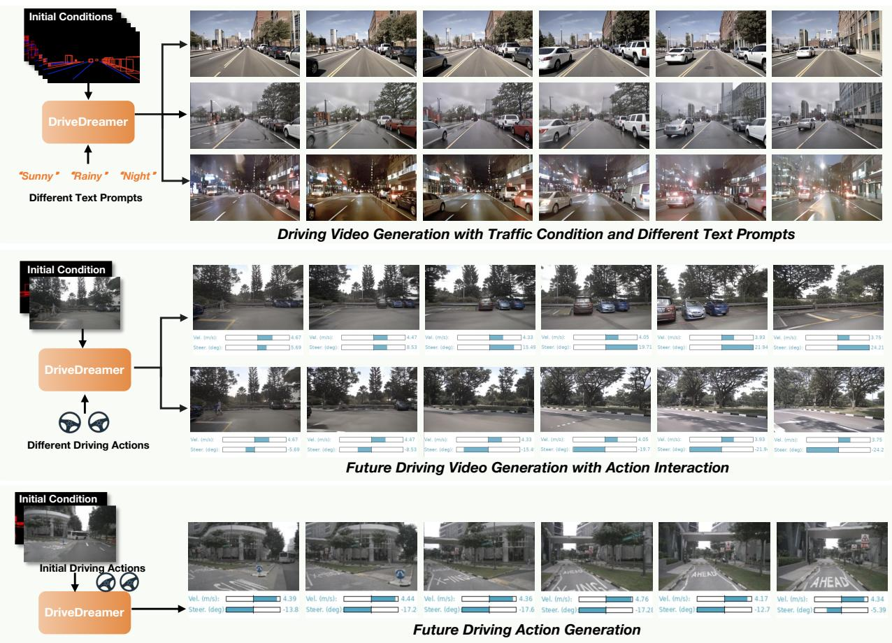  
Figure 1. DriveDreamer demonstrates a comprehensive understanding of driving scenarios. It excels in controllable driving video generation, aligning seamlessly with text prompts and structured traffic constraints. DriveDreamer can also interact with the driving scene and predict different future driving videos, based on input actions. Furthermore, DriveDreamer extends its utility to anticipate future actions.

## Abstract

World models, especially in autonomous driving, are trending and drawing extensive attention due to their capacity for comprehending driving environments. The established world model holds immense potential for the generation of high-quality driving videos, and driving policies for safe maneuvering. However, a critical limitation

in relevant research lies in its predominant focus on gaming environments or simulated settings, thereby lacking the representation of real-world driving scenarios. Therefore, we introduce DriveDreamer, a pioneering world model entirely derivedfrom real-world driving scenarios. Regarding that modeling the world in intricate driving scenes entails an overwhelming search space, we propose harnessing the powerful diffusion model to construct a comprehensive representation of the complex environment. Furthermore, we introduce a two-stage training pipeline. In the initial phase, DriveDreamer acquires a deep understanding ofstructured traffic constraints, while the subsequent stage equips it with the ability to anticipate future states. The proposed Drive-Dreamer is the first world model established from realworld driving scenarios. We instantiate DriveDreamer on the challenging nuScenes benchmark, and extensive experiments verify that DriveDreamer empowers precise, controllable video generation thatfaithfully captures the structural constraints of real-world traffic scenarios. Additionally, DriveDreamer enables the generation of realistic and reasonable driving policies, opening avenues for interaction and practical applications.

## 1. Introduction

Spurred by insights from AGI (Artificial General Intelligence) and the principles of embodied AI, a profound transformation in autonomous driving is underway. Autonomous vehicles rely on sophisticated systems that engage with and comprehend the real driving world. At the heart of this evolution is the integration of world models [15,17–19]. World models hold great promise for generating diverse and realistic driving videos, encompassing even long-tail scenarios, which can be utilized to train various driving perception approaches. Furthermore, the predictive capabilities in world models facilitate end-to-end driving, ushering in a new era of autonomous driving experiences.

Deriving latent dynamics of world models from visual signals was initially introduced in video prediction [8, 11, 19]. By extrapolating from observed visual sequences, video prediction methods can infer future states of the environment, effectively modeling how objects and entities within a scene will evolve over time. However, modeling the intricate driving scenarios in pixel space is challenging due to the large sampling space [5, 7]. To alleviate this problem, recent research endeavors have sought innovative strategies to enhance sampling efficiency. ISO-Dream [52] explicitly disentangles visual dynamics into controllable and uncontrollable states. MILE [29] strategically incorporates world modeling within the Bird’s Eye View (BEV) semantic segmentation space, complementing world modeling with imitation learning. SEM2 [13] further extends the Dreamer framework into BEV segmentation maps, utilizing Reinforce Learning (RL) for training. Despite the progress witnessed in world models, a critical limitation in relevant research lies in its predominant focus on simulation environments.

In this paper, we propose DriveDreamer, which pioneers the construction of comprehensive world models from real driving videos and human driver behaviors. Considering the intricate nature of modeling real-world driving scenes, we introduce the Autonomous-driving Diffusion Model (Auto-DM), which empowers the ability to create a comprehensive representation of the complex driving environment. We propose a two-stage training pipeline. In the first stage, we train Auto-DM by incorporating traffic structural information as intermediate conditions, which significantly enhances sampling efficiency. Consequently, Auto-DM exhibits remarkable capabilities in comprehending real-world driving scenes, particularly concerning the dynamic foreground objects and the static background. In the secondstage training, we establish the world model through video prediction. Specifically, driving actions are employed to iteratively update future traffic structural conditions, which enables DriveDreamer to anticipate variations in the driving environment based on different driving strategies. Moreover, DriveDreamer extends its predictive prowess to foresee forthcoming driving policies, drawing from historical observations and Auto-DM features. Thus creating a executable, and predictable driving world model.

The main contributions of this paper can be summarized as follows: (1) We introduce DriveDreamer, which is the first world model derived from real-world driving scenarios. DriveDreamer can jointly enable the generation of high-quality driving videos and reasonable driving policies. (2) To enhance the comprehension of real-world driving scenes and expedite the world model convergence, we introduce the Autonomous-driving Diffusion Model and a two-stage training pipeline. The first-stage training enables the comprehension of traffic structural information, and the second-stage video prediction training empowers the predictive capacity. (3) DriveDreamer can controllably generate driving scene videos that are highly aligned with traffic constraints (see Fig. 1), enhancing the training of driving perception methods (e.g., 3D detection). Besides, Drive-Dreamer can generate future driving policies based on historical observations and Auto-DM features. Notably, Drive-Dreamer achieves promising planning results in open-loop assessments on the nuScenes dataset.

## 2. Related Work

## 2.1. Diffusion Model

Diffusion models represent a family of probabilistic generative models that progressively introduce noise to data and subsequently learn to reverse this process for the purpose of generating samples [73]. These models have recently garnered significant attention due to their exceptional performance in various applications, setting new benchmarks in image synthesis [1, 14, 49, 55, 57], video generation [21, 23, 35, 60, 67, 74], and 3D content generation [6, 43, 53, 69]. To enhance the controllable generation capability, ControlNet [76], GLIGEN [42], T2I-Adapter [48] and Composer [32] have been introduced to utilize various control inputs, including depth maps, segmentation maps, canny edges, and sketches. Concurrently, BEVControl [72], MagicDrive [12] and DrivingDiffuson [41] incorporate layout conditions to enhance image generation. The fundamental essence of diffusion-based generative models lies in their capacity to comprehend and understand the intricacies of the world. Harnessing the power of these diffusion models, DriveDreamer seeks to comprehend the complex realm of autonomous-driving scenarios.

## 2.2. Video Generation

Video generation and video prediction are effective approaches to understanding the visual world. In the realm of video generation, several standard architectures have been employed, including Variational Autoencoders (VAEs) [8,28], auto-regressive models [34,56,61,70], flowbased models [40], and Generative Adversarial Networks (GANs) [46, 58, 62, 65]. Recently, the burgeoning diffusion models [9, 24, 25, 49, 50, 57] have also been extended to the domain of video generation. Video diffusion models [21, 23, 35, 60, 67, 74] exhibit higher-quality video generation capabilities, producing realistic frames and transitions between frames while offering enhanced controllability. They accommodate various input control conditions such as text, canny, sketch, semantic maps, and depth maps.

Video prediction models represent a specialized form of video generation models, sharing numerous similarities. In particular, video prediction involves anticipating future video changes based on historical video observations [8, 11, 19, 27, 64]. DriveGAN [36] establishes associations between driving actions and pixels, predicting future driving videos by specifying future driving policies. In contrast, DriveDreamer incorporates structured traffic conditions, text prompts, and driving actions as inputs, empowering precise, realistic video and action generation that are faithfully aligned with real-world driving scenarios.

## 2.3. World Models

World models have been extensively explored in modelbased imitation learning, demonstrating remarkable success in various applications [15–20, 37, 44, 59, 71]. These approaches typically leverage Variational Autoencoders (VAE) [39] and Long Short-Term Memory (LSTM) [26] to model transition dynamics and rendering functionality. World methods target at establishing dynamic models of environments, enabling agents to be predictive of the future. This aspect is of paramount importance in autonomous driving, where precise predictions about the future are essential for safe maneuvering. However, constructing world models in autonomous driving presents unique challenges, primarily due to the high sample complexity inherent in realworld driving tasks [5]. To address these problems, ISO-

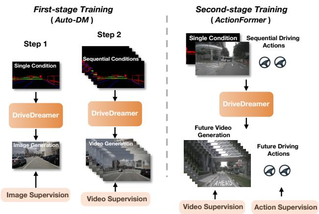  
Figure 2. Two-stage training pipeline of DriveDreamer.

Dream [52] introduces an explicit disentanglement of visual dynamics into controllable and uncontrollable states. MILE [29] strategically incorporates world modeling within the BEV semantic segmentation space, enhancing world modeling through imitation learning. SEM2 [13] extends the Dreamer framework into BEV segmentation maps, employing reinforcement learning for training. Despite the progress witnessed in world models, a critical limitation in relevant research lies in its predominant focus on simulation environments. The transition to real-world driving scenarios remains an under-explored frontier.

## 3. DriveDreamer

The overall framework of DriveDreamer is depicted in Fig 3. The framework begins with an initial reference frame $I _ { 0 }$ and its corresponding road structural information $( i . e . ,$ HDMap $H _ { 0 }$ and 3D box $B _ { 0 } )$ . Within this context, DriveDreamer leverages the proposed ActionFormer to predict forthcoming road structural features in the latent space. These predicted features serve as conditions and are provided to Auto-DM, which generates future driving videos. Simultaneously, the utilization of text prompts allows for dynamic adjustments to the driving scenario style (e.g., weather and time of the day). Moreover, Drive-Dreamer incorporates historical action information and the multi-scale latent features extracted from Auto-DM, which are combined to generate reasonable future driving actions. In essence, DriveDreamer offers a comprehensive framework that seamlessly integrates multi-modal inputs to generate future driving videos and driving policies, thereby advancing the capabilities of autonomous-driving systems.

Regarding the extensive search space of establishing world models in real-world driving scenarios, we introduce a two-stage training strategy for DriveDreamer. This strategy is designed to significantly enhance sampling efficiency and expedite model convergence. The two-stage training is illustrated in Fig. 2. There are two steps in the first-stage training. Step 1 involves utilizing the single-frame structured condition, which guides DriveDreamer to generate driving scene image, facilitating its comprehension of structural traffic constraints. Step 2 extends its understanding into video generation. The second-stage training enables DriveDreamer to interact with the environment and predict future states effectively. This phase takes an initial frame image along with its corresponding structured information as input. Simultaneously, sequential driving actions are provided, with the model expected to generate future driving videos and future driving actions. In the following sections, we delve into the specifics of the model architecture and training pipelines.

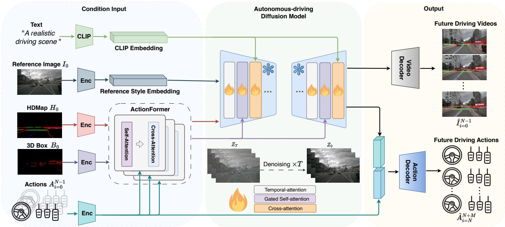  
Figure 3. Overall framework of DriveDreamer. The framework initiates with reference frame $I _ { 0 }$ and road structural information (i.e., HDMap $H _ { 0 }$ and 3D box $B _ { 0 } )$ . DriveDreamer employs the ActionFormer to predict future road structural features, which serve as conditions provided to Auto-DM, generating future driving videos $\hat { I } _ { i = 0 } ^ { N - 1 }$ . Additionally, text prompts enable dynamic scenario style adjustments. The model integrates past driving actions and multi-scale features from Auto-DM to generate plausible future driving actions $\hat { A } _ { i = N } ^ { N + M }$

## 3.1. First-stage Training

Auto-DM. In DriveDreamer, we introduce Auto-DM, to model and comprehend driving scenarios from real-world driving videos. It is noted that comprehending driving scenes solely from pixel space presents challenges due to extensive search space in real-world driving scenarios. To mitigate this, we explicitly incorporate structured traffic information as conditional inputs.

The overall structure of Auto-DM is illustrated in Fig. 4, where traffic conditions are projected onto the image plane, generating HDMap conditions $\{ H _ { i } \} _ { i = 0 } ^ { N - 1 } \in \mathcal { R } ^ { N \times } \dot { H } { \times } \dot { W } { \times } 3$ and 3D boxes conditions $\{ B _ { i } \} _ { i = 0 } ^ { \tilde { N } - 1 } \in \mathcal { R } ^ { N \times N _ { B } \times 1 6 }$ , along with the box categories $\{ { \bf { \dot { C } } } _ { i } \} _ { i = 0 } ^ { N - 1 } \in { \mathcal { R } } ^ { N \times N _ { B } } ( N$ is the number of video frames, and $N _ { B }$ is the predefined maximum box numbers with zero padded). In this following, unless specified, the subscript i is omitted for readability. To enable controllability, the spatially aligned conditions H are encoded by convolution layers and then concatenated with $\mathcal { Z } _ { t }$ , where $\{ \mathcal { Z } _ { t } \} _ { i = 0 } ^ { N - 1 }$ are noisy latent features generated by the forward diffusion process [57]. For position conditions $( i . e . $ , 3D boxes) that are not spatially aligned with $\mathcal { Z } _ { t }$ we first aggregate position embeddings $H ^ { p } \colon$

$$
H ^ { p } = \mathcal { F } _ { \alpha } ( [ C _ { e } , \mathrm { F o u r i e r } ( B ) ] ) ,\tag{1}
$$

where ${ \mathcal { F } } _ { a }$ is MLP layers, $C _ { e }$ is CLIP [54] embed box categories features, Fourier(·) is Fourier embedding [47], and [·] is the concatenation operation. Then gated self-attention [42] is leveraged to integrate position embeddings $H ^ { p }$ with visual signals v from the original UNet features [57]:

$$
v = v + \operatorname { t a n h } ( \eta ) \cdot \mathrm { T S } ( \mathcal { F } _ { s } ( [ v , H ^ { p } ] ) ) ,\tag{2}
$$

where $\eta$ is a learnable parameter, $\mathcal { F } _ { s }$ is self-attention, and $\mathrm { T S } ( \cdot )$ is the token selection operation that considers visual tokens only [42].

To further empower Auto-DM with comprehension of driving dynamics, we introduce temporal attention layers $\mathcal { F } _ { t }$ to enhance frame coherence in the generated videos:

$$
\mathcal { F } _ { t } ( v ) = \mathrm { R e s h a p e } ( \mathcal { F } _ { s } ( \mathrm { R e s h a p e } ( v + \mathcal { T } _ { \mathrm { p o s } } ) ) ) ,\tag{3}
$$

where we first reshape the visual signal v from $\mathcal { R } ^ { N \times C \times H \times W } \mathrm { ~ t o ~ } \mathcal { R } ^ { C \times N H W }$ . The shape transformation facilitates the frame-wise self-attention layers $\mathcal { F } _ { s }$ to learn inter-frame dynamics. $\tau _ { \mathrm { p o s e } }$ denotes temporal position embeddings that are encoded by sinusoidal function [2]. Finally, we restore the visual signal to its original dimensions, thus ensuring the feature integrity. Notably, the same architecture can be extended to generate multi-view images (see Fig. 6), where the $\mathcal { F } _ { s }$ solely attends to neighbor views. Additionally, a stack of frame-wise attention and view-wise attention contributes to multi-view video generation (see supplement for more details).

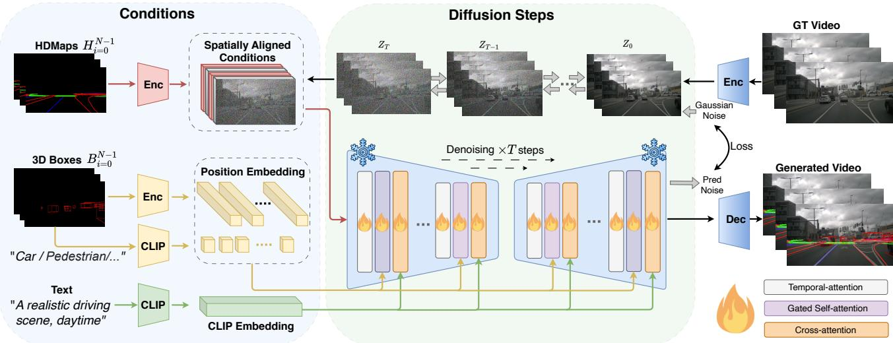  
Figure 4. Overall structure of the Auto-DM. Auto-DM takes three types of control conditions as inputs. Spatially aligned conditions $( i . e .$ , HDMap $H _ { i = 0 } ^ { N - 1 } )$ , are concatenated with noise images and fed into the diffusion steps. Position conditions, represented by 3D boxes $B _ { i = 0 } ^ { N - 1 }$ and their labels, are flattened and utilized in the gated self-attention. Text prompts are incorporated into diffusion steps using crossattention, influencing the style of the generated driving video. Temporal attention layers are employed to ensure the consistency of the generated video frames. The diffusion steps estimate noise and generate loss with the input noise to optimize Auto-DM.

Furthermore, cross-attention layers [57] are utilized to facilitate feature interactions between text inputs and visual signals, empowering text descriptions to influence driving scene attributes such as weather and time of day. In the next, we will elaborate on the first-stage training pipeline, which involves two steps.

Step 1 training. The Auto-DM incorporates input solely from a single frame of structured traffic conditions, coupled with supervision from a single-frame image. For structured traffic conditions, HDMaps and 3D boxes are obtained either from human annotations or pertained perception methods (e.g., LAV [4], BEVerse [77], UniAD [31]). Then threechannel HDMaps (lane boundary, lane divider, and pedestrian crossing) and eight-corner 3D boxes are projected onto the image plane to generate corresponding conditions. Notably, during step 1 training, temporal attention layers are omitted, which enables the network to focus exclusively on learning the traffic structural constraints, expediting the convergence of the training process.

Step 2 training. The Auto-DM incorporates input from multiple frames of structured traffic conditions and is supervised using driving videos. In contrast to step 1, learning from videos allows Auto-DM to gain a deeper understanding of the intricate motion transitions in driving scenarios. Building upon the pretrained models established in step 1, step 2 incorporates temporal attention layers into the model architecture. These additional parameters enable the Auto-DM to focus on the temporal dynamics present in the input data, further enhancing its ability to capture and interpret the nuanced temporal aspects of driving scenes.

In step 1 and step 2 training, the proposed Auto-DM is trained using the same noise schedule as the underlying image model [57]. Specifically, the forward process gradually adds noise ϵ to the latent feature $\mathcal { Z } _ { 0 } .$ , resulting in the noisy latent feature ${ \mathcal { Z } } _ { T }$ . Then we train $\epsilon _ { \phi }$ to predict the noise we added, and the trainable parameters $\phi$ are optimized via:

$$
\operatorname* { m i n } _ { \phi } \mathcal { L } = \mathbb { E } _ { \mathcal { Z } _ { 0 } , \epsilon \sim \mathcal { N } ( \mathbf { 0 } , \mathbf { I } ) , t , c } \left[ \left\| \epsilon - \epsilon _ { \phi } \left( \mathcal { Z } _ { t } , t , c \right) \right\| _ { 2 } ^ { 2 } \right] ,\tag{4}
$$

where $\phi$ denotes the trainable parameters involved in the gated self-attention, temporal attention, and cross-attention layers, and time step t is uniformly sampled from [1, T].

## 3.2. Second-stage Training

Based on the first-stage training, DriveDreamer has obtained comprehension of the structured traffic information. However, the desired world model should also be predictive of the future and can interact with the environment. Therefore, we embark on the second phase of our approach. In this phase, we leverage the video prediction task to establish the driving world model. Specifically, the video prediction task entails providing an initial observation $I _ { 0 } , H _ { 0 } , B _ { 0 }$ , as well as driving actions $\{ A _ { i } \} _ { i = 0 } ^ { T - 1 }$ , with the desired outcome being the future driving videos $\{ I _ { i } \} _ { i = 1 } ^ { T }$ , and future driving actions $\{ A _ { i } \} _ { i = T } ^ { T + N }$

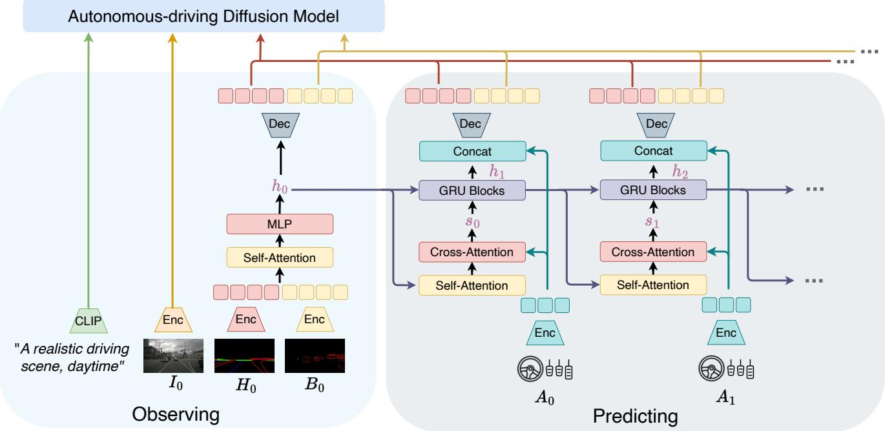  
Figure 5. Overall structure of ActionFormer. The initial structural conditions $H _ { 0 }$ and $B _ { 0 }$ are first encoded and flattened into a 1D latent space. These latent features are then concatenated and processed through self-attention and MLP layers, generating the hidden state. Cross-attention layers establish associations between hidden states and driving actions. Gated Recurrent Units (GRUs) are employed to iteratively predict future hidden states. These predicted hidden states are further concatenated with action features and decoded into future traffic structural conditions to be fed into Auto-DM.

ActionFormer. Recall that the trained Auto-DM can generate driving videos $\{ I _ { i } \} _ { i = 0 } ^ { T }$ based on sequential structured information $\{ H _ { i } \} _ { i = 0 } ^ { T } , \{ \bar { B _ { i } } \} _ { i = 0 } ^ { T }$ . However, in the video prediction task, future traffic structural conditions beyond the present timestamp is unavailable. To address this challenge, we introduce the ActionFormer, which leverages driving actions $\{ A _ { i } \} _ { i = 0 } ^ { T - 1 }$ to iteratively predict future structural conditions. The overall architecture of ActionFormer is in Fig. 5. Firstly the initial structural conditions $H _ { 0 } , B _ { 0 }$ are encoded and flattened into 1D latent space. The latent features are concatenated and aggregated by self-attention and MLP layers to generate the hidden state $\mathbf { h } _ { 0 }$ . Subsequently, crossattention layers $\mathcal { F } _ { c a }$ are utilized to construct associations between hidden states and driving actions. Then latent variable $\mathbf { s } _ { t }$ is parameterized as:

$$
\mathbf { s } _ { t } \sim \mathcal { N } \left( \mu _ { \theta } \left( \mathcal { F } _ { c a } ( \mathbf { h } _ { t } , A _ { t } ) \right) , \sigma _ { \theta } \left( \mathcal { F } _ { c a } ( \mathbf { h } _ { t } , A _ { t } ) \right) I \right) ,\tag{5}
$$

where $\mu _ { \boldsymbol { \theta } } , \sigma _ { \boldsymbol { \theta } }$ are layers to learn Gaussian parameters. To predict future hidden states, we employ Gated Recurrent

Units (GRUs) to iteratively make updates:

$$
\mathbf { h } _ { t + 1 } = \mathscr { F } _ { \mathrm { G R U } } ( \mathbf { h } _ { t } , \mathbf { s } _ { t } ) .\tag{6}
$$

These hidden states are concatenated with action features and are decoded into future traffic structural conditions. It’s noted that the Actionformer forecasts future traffic conditions at the feature level, which mitigates noise interference at the pixel level, resulting in more robust predictions. Besides the traffic structural conditions generated by Actionformer and the text prompt condition, we process the reference image condition $I _ { 0 }$ similar to [2]. Based on the above conditions, we extend Auto-DM to jointly generate future driving videos $\{ I _ { i } \} _ { i = 1 } ^ { T }$ and driving actions $\stackrel { - } { \{ A _ { i } \} } _ { i = T } ^ { T + N }$ . We formalize this process as a generative probabilistic model, where the joint probability can be factorized as:

$$
\begin{array} { l } { { \displaystyle p \left( I _ { 0 : T } , A _ { 0 : T + N } , \mathbf { h } _ { 0 : T } , \mathbf { s } _ { 0 : T - 1 } \right) } \ ~ } \\ { { \displaystyle ~ = p \left( I _ { 1 : T } , A _ { T : T + N } \mid \mathbf { h } _ { 0 : T } , \mathbf { s } _ { 0 : T - 1 } , A _ { 0 : T - 1 } , I _ { 0 } \right) } } \\ { { \displaystyle ~ \prod _ { t = 0 } ^ { T } p \left( \mathbf { h } _ { t } , \mathbf { s } _ { t } \mid \mathbf { h } _ { t - 1 } , \mathbf { s } _ { t - 1 } , A _ { t } \right) , } } \end{array}\tag{7}
$$

where

$$
\begin{array} { r l } & { p \left( \mathbf { h } _ { t } , \mathbf { s } _ { t } \mid \mathbf { h } _ { t - 1 } , \mathbf { s } _ { t - 1 } , A _ { t } \right) } \\ & { \qquad = p \left( \mathbf { h } _ { t } \mid \mathbf { h } _ { t - 1 } , \mathbf { s } _ { t - 1 } \right) p \left( \mathbf { s } _ { t } \mid \mathbf { h } _ { t } , A _ { t } \right) } \\ & { p \left( I _ { 1 : T } , A _ { T : T + N } \mid \mathbf { h } _ { 0 : T } , \mathbf { s } _ { 0 : T - 1 } , A _ { 0 : T - 1 } , I _ { 0 } \right) } \\ & { \qquad = p \left( I _ { 1 : T } \mid \mathbf { h } _ { 0 : T } , \mathbf { s } _ { 0 : T - 1 } , A _ { 0 : T - 1 } , I _ { 0 } \right) } \\ & { \qquad p \left( A _ { T : T + N } \mid \mathbf { h } _ { 0 : T } , \mathbf { s } _ { 0 : T - 1 } , A _ { 0 : T - 1 } , I _ { 0 } \right) . } \end{array}\tag{8}
$$

Considering updating hidden states $p ( \mathbf { h } _ { t } \mid \mathbf { h } _ { t - 1 } , \mathbf { s } _ { t - 1 } )$ is a deterministic process (Eq. 6), only latent variables st are needed to be inferred to maximize the marginal likelihood of observation $p ( I _ { 1 : T } , A _ { T : T + N } )$ . Therefore, variational distribution $q _ { \mathrm { v d } }$ is introduced to conduct variational inference:

$$
\begin{array} { l } { { \displaystyle q _ { \mathrm { v d } } \triangleq q \left( \mathbf { h } _ { 1 : T } , \mathbf { s } _ { 1 : T } \mid I _ { 0 : T } , A _ { 0 : T + N } \right) } } \\ { { \displaystyle \quad = \prod _ { t = 1 } ^ { T } q \left( \mathbf { h } _ { t } \mid \mathbf { h } _ { t - 1 } , \mathbf { s } _ { t - 1 } \right) q \left( \mathbf { s } _ { t } \mid I _ { \leq t } , A _ { < t } \right) , } } \end{array}\tag{9}
$$

where $q \left( \mathbf { h } _ { t } \mid \mathbf { h } _ { t - 1 } , \mathbf { s } _ { t - 1 } \right) = p \left( \mathbf { h } _ { t } \mid \mathbf { h } _ { t - 1 } , \mathbf { s } _ { t - 1 } \right)$ . Similar to [29], the variational lower bound can be derived as:

$$
\begin{array} { r l } & { \log p \left( I _ { 1 : T } , \ A _ { T : T + N } \right) \geq } \\ & { \mathbb { E } _ { q \left( \mathbf { h } _ { 1 : T } , \mathbf { s } _ { 1 : T } | I _ { 0 : T } , A _ { 0 : T + N } \right) } \bigl [ \underbrace { \log p \left( I _ { 1 : T } \mid \mathbf { h } _ { 0 : T } , \mathbf { s } _ { 0 : T - 1 } , A _ { 0 : T - 1 } , I _ { 0 } \right) } _ { \mathrm { v i d e o p r e d i c t i o n } } } \\ & { \quad + \underbrace { \log p \left( A _ { T : T + N } \mid \mathbf { h } _ { 0 : T } , \mathbf { s } _ { 0 : T - 1 } , A _ { 0 : T - 1 } , I _ { 0 } \right) } _ { \mathrm { a c t i o n p r e d c i t i o n } } \bigr ] . } \end{array}\tag{10}
$$

Note that the posterior and prior matching [29] is not included, as we empirically find the simplified variational lower bound produces similar plausible results. In Eq. 10, the video prediction and action prediction parts can be modeled by Gaussian distributions $\begin{array} { r } { \mathcal { N } ( \mathcal { G } ( \mathbf { h } _ { 0 : T } , A _ { 0 : T - 1 } , I _ { 0 } ) , } \end{array}$ , I) and Laplace distribution Laplace $( \pi ( \mathbf { h } _ { 0 : T } , A _ { 0 : T - 1 } , I _ { 0 } ) , 1 )$ Therefore, we employ mean-squared error and $L _ { 1 }$ loss to optimize the video prediction training. ${ \mathcal { G } } , \pi$ are learnable layers involved in ActionFormer, Auto-DM, video decoder (i.e., VAE decoder) and action decoder. For action prediction details, we first pool multi-scale UNet features from Auto-DM. The pooled features are concatenated with historical action features, which are then decoded by MLP layers to generate future driving actions.

Based on the two-stage training, DriveDreamer has acquired a comprehensive understanding of the driving world, encompassing the structural constraints of traffic, predictions of future driving states, and interaction with the established world model.

## 4. Experiment

## 4.1. Experiment Details

Dataset. The training data is sourced from the real-world driving dataset nuScenes [3], comprising a total of 700 training videos and 150 validation videos. Each video includes ${ \sim } 2 0$ seconds of footage captured by six surroundview cameras. The videos have a frame rate of 12Hz, resulting in ∼1M video frames available for training. During the first-stage training, we utilize the nuScenes-devkit [51] to acquire HDMap annotations (lane boundary, lane divider, and pedestrian crossing) corresponding to 12Hz frames, which are then projected onto the image plane. Considering the nuScenes dataset only provides 2Hz 3D bounding box annotations, we supplement this with 12Hz bounding box annotations from [68]. In the second-stage training, we employ the yaw angle and velocity of the ego-car as the driving action inputs. Besides, we extract scene description information $( e . g .$ , weather and time) from the nuScenes annotation, which serves as text conditions.

Training. The proposed Auto-DM is built upon Stable Diffusion v1.4 [57], whose original parameters are frozen. In step 1 of first-stage training, our model is trained for 40 epochs with a batch size of 16. In step 2, Auto-DM is trained for 10 epochs with a batch size of 1, with video frame length $N = 3 2$ , and spatial size of 448×256. During second-stage video prediction training, our model predicts 16 frame driving videos $I _ { 1 : 1 6 }$ and 16 future driving actions $I _ { 1 7 : 3 2 : }$ and the model is trained for 10 epochs on a batch size of 1. All the experiments are conducted on A800 GPUs, and we use the AdamW optimizer [38] with a learning rate $5 \times 1 0 ^ { - 5 }$

Evaluation. We conducted a comprehensive evaluation of the proposed DriveDreamer, employing both qualitative and quantitative assessments. We utilized frame-wise Frechet Inception Distance (FID) [´ 22] and Frechet Video´ Distance (FVD) [63] to evaluate the generation quality, where the evaluated image is resized to $4 4 8 \times 2 5 6$ . Besides, to verify the generated images enhance the training of driving perception methods, DriveDreamer is evaluated through 3D object detection, with FCOS3D [66] and BEV-Fusion [45] as baseline methods. Furthermore, we test the performance of driving policy generation. Following the settings in [30], we evaluate output driving trajectories for future 3 seconds.

## 4.2. Controllable Driving Video Generation

The proposed DriveDreamer exhibits a profound comprehension of driving scenarios, capable of controllably generating diverse driving videos. In this subsection, we first demonstrate that, based on first-stage training, Drive-Dreamer can generate diverse driving videos under structured traffic conditions. Besides, we verify that the generated images can enhance the training of driving perception methods. Furthermore, DriveDreamer showcases its versatility by responding to different input actions, allowing for the control of the vehicle’s trajectory and consequently generating diverse driving videos.

As shown in Fig. 1 and Fig 6, DriveDreamer exhibits proficiency in producing images and videos that adhere meticulously to structured traffic conditions (more visualizations are in supplement). Significantly, we can also manipulate the text prompt to induce variations in the generated videos, encompassing changes in weather and time of day. To further validate the generation quality, we extract 4K traffic conditions (from the nuScenes training set) to generate driving images. The generated images are combined with real images for training the 3D detection task. Results in Tab. 1 indicate that training with our synthetic data significantly enhances the performance of 3D detection. Specifically, compared with training without synthetic data, the mAP metrics of FCOS3D and BEVFusion are improved by 0.7 and 3.0.

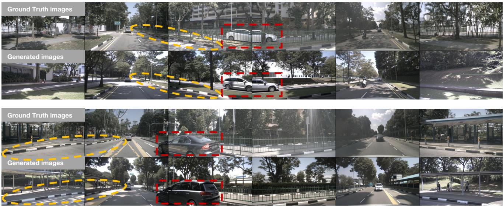  
Figure 6. Visualizations of generated multi-view images, where the generation conditions (HDMaps, 3D boxes) are from nuScenes validation set. Regions highlighted by red rectangles and yellow circles indicate that the generated images share multi-view consistency and are aligned with ground truth conditions.

<table><tr><td>Methods</td><td>Resolution</td><td>Data</td><td>mAP (↑)</td><td>NDS (↑)</td></tr><tr><td>FCOS3D [66]</td><td> $1 6 0 0 \times 9 0 0$ </td><td>w/o synthetic data</td><td>30.2</td><td>38.1</td></tr><tr><td>FCOS3D [66]</td><td> $1 6 0 0 \times 9 0 0$ </td><td>w 4K synthetic data</td><td>30.9 (+0.7)</td><td>38.3 (+0.2)</td></tr><tr><td>BEVFusion [45]</td><td> $7 0 4 \times 2 5 6$ </td><td>w/o synthetic data</td><td>32.8</td><td>37.6</td></tr><tr><td>BEVFusion [45]</td><td> $7 0 4 \times 2 5 6$ </td><td>w 4K synthetic data</td><td>35.8 (+3.0)</td><td>39.5 (+1.9)</td></tr></table>

Table 1. Performance of synthetic data augmentation on training 3D object detection.

In addition to the utilization of structured traffic conditions for generating driving videos, DriveDreamer exhibits the capability to diversify the generated driving videos by adapting to different driving actions. As depicted in Fig. 1 (more visualizations are in supplement), starting from an initial frame paired with its corresponding structural information, DriveDreamer can generate distinct videos based on various driving actions, such as videos depicting left and right turns. In summary, DriveDreamer excels in producing a wide spectrum of driving scene videos, characterized by both high controllability and diversity. Thus, Drive-Dreamer holds promise for training autonomous-driving systems across a wide range of tasks, encompassing even corner cases and long-tail scenarios.

In the quantitative experiment, we extract ego-car driving actions from the nuScenes validation set as conditions to generate driving videos. For comparison, we train Drive-GAN [36] on the nuScenes dataset, employing the same training settings as those used for Drivedreamer. Besides, we train Drivedreamer without ActionFormer as a baseline (specifically, the action features are directly concatenated with the zero-padded structured traffic conditions). The results are presented in Tab. 2, where we evaluate the quality of generated videos. Notably, our approach without firststage training achieves superior FID and FVD scores compared to DriveGAN. This observation underscores the effectiveness of leveraging a powerful diffusion model in visually comprehending driving scenarios. Furthermore, our findings reveal that Drivedreamer after first-stage training, exhibits an improved understanding of the structured information within driving scenes, resulting in higher-quality video generation. Lastly, we observe that the proposed ActionFormer effectively leverages the traffic structural information knowledge acquired during the first-stage training. Compared to the concatenation baseline approach, the ActionFormer iteratively updates future structured information based on input actions, which further enhances the quality of generated videos.

<table><tr><td>Methods</td><td>1st-stage train (Auto-DM)</td><td>2nd-stage train (ActionFormer)</td><td>FID (↓)</td><td>FVD (↓)</td></tr><tr><td>DriveGAN [36]</td><td>一</td><td>一</td><td>27.8</td><td>390.8</td></tr><tr><td>DriveDreamer</td><td></td><td></td><td>15.9</td><td>363.3</td></tr><tr><td>DriveDreamer</td><td>√</td><td></td><td>15.3</td><td>349.6</td></tr><tr><td>DriveDreamer</td><td>√</td><td></td><td>14.9</td><td>340.8</td></tr></table>

Table 2. Comparison of generation quality on nuScenes validation.

## 4.3. Driving Action Generation

In addition to its capacity for generating highly controllable driving videos, DriveDreamer demonstrates the ability to predict reasonable driving actions. As depicted in

<table><tr><td>Method</td><td>Visual Info.</td><td>Action Info.</td><td> $\overline { { L _ { 2 } } }$  Avg. (m)</td><td>Col. Avg. (%)</td></tr><tr><td>ST-P3 [30]</td><td>√</td><td></td><td>2.11</td><td>0.71</td></tr><tr><td>UniAD [31]</td><td> $\checkmark$ </td><td></td><td>1.65</td><td>0.31</td></tr><tr><td>AD-MLP [75]</td><td></td><td>√</td><td>0.29</td><td>0.19</td></tr><tr><td>VAD [33]</td><td>√</td><td>√</td><td>0.37</td><td>0.14</td></tr><tr><td>DriveDreamer</td><td>√</td><td>√</td><td>0.29</td><td>0.15</td></tr></table>

Table 3. Open-loop planning performance on nuScenes validation set. The evaluation settings are the same as ST-P3 [30].

Fig. 1, provided with an initial frame condition and past driving actions, DriveDreamer can generate future driving actions that align with real-world scenarios . Furthermore, we conduct a quantitative assessment of the prediction accuracy. Specifically, MLP layers [75] are utilized to encode past driving action information. Additionally, multi-scale UNet features are pooled as visual cues. The two modality features are then concatenated to learn future driving trajectories (more implementation details are in supplement). The results of open-loop evaluation on the nuScenes dataset are presented in Tab. 3. Remarkably, the average $L _ { 2 }$ trajectory error of DriveDreamer is merely 0.29m, surpassing the performance of the multi-modality method VAD [33]. In addition, DriveDreamer relatively decreases the average collision rate reported in [75] by 21%, confirming that the visual features learned by DriveDreamer contribute to end-to-end autonomous driving, thereby enhancing driving safety.

## 5. Discussion and Conclusion

DriveDreamer represents a significant advancement in the field of world modeling, particularly in the context of autonomous driving. By focusing on real-world driving scenarios and harnessing the power of the diffusion model, DriveDreamer has demonstrated its ability to comprehend complex environments, generate high-quality driving videos, and formulate realistic driving policies. While prior research primarily concentrated on gaming or simulated environments, DriveDreamer extends the boundaries of world modeling to encompass the intricacies of actual driving conditions. DriveDreamer paves the way for future research in autonomous driving, emphasizing the importance of real-world representation for more accurate modeling and decision-making in this critical domain.

## References

[1] Fan Bao, Shen Nie, Kaiwen Xue, Chongxuan Li, Shi Pu, Yaole Wang, Gang Yue, Yue Cao, Hang Su, and Jun Zhu. One transformer fits all distributions in multi-modal diffusion at scale. arXiv preprint arXiv:2303.06555, 2023. 2

[2] Andreas Blattmann, Robin Rombach, Huan Ling, Tim Dockhorn, Seung Wook Kim, Sanja Fidler, and Karsten Kreis. Align your latents: High-resolution video synthesis with latent diffusion models. In CVPR, 2023. 5, 6

[3] Holger Caesar, Varun Bankiti, Alex H. Lang, Sourabh Vora, Venice Erin Liong, Qiang Xu, Anush Krishnan, Yu Pan, Giancarlo Baldan, and Oscar Beijbom. nuscenes: A multimodal dataset for autonomous driving. CVPR, 2019. 7, 12

[4] Dian Chen and Philipp Krahenb ¨ uhl. Learning from all vehi-¨ cles. In CVPR, 2022. 5

[5] Li Chen, Penghao Wu, Kashyap Chitta, Bernhard Jaeger, Andreas Geiger, and Hongyang Li. End-to-end autonomous driving: Challenges and frontiers. arXiv preprint arXiv:2306.16927, 2023. 2, 3

[6] Rui Chen, Yongwei Chen, Ningxin Jiao, and Kui Jia. Fantasia3d: Disentangling geometry and appearance for high-quality text-to-3d content creation. arXiv preprint arXiv:2303.13873, 2023. 2

[7] Felipe Codevilla, Eder Santana, Antonio M Lopez, and´ Adrien Gaidon. Exploring the limitations of behavior cloning for autonomous driving. In CVPR, 2019. 2

[8] Emily Denton and Rob Fergus. Stochastic video generation with a learned prior. In ICML, 2018. 2, 3

[9] Prafulla Dhariwal and Alexander Nichol. Diffusion models beat gans on image synthesis. NeurIPS, 2021. 3

[10] Stefan Elfwing, Eiji Uchibe, and Kenji Doya. Sigmoidweighted linear units for neural network function approximation in reinforcement learning. Neural networks, 2018. 12

[11] Jean-Yves Franceschi, Edouard Delasalles, Mickael Chen,¨ Sylvain Lamprier, and Patrick Gallinari. Stochastic latent residual video prediction. In ICML, 2020. 2, 3

[12] Ruiyuan Gao, Kai Chen, Enze Xie, Lanqing Hong, Zhenguo Li, Dit-Yan Yeung, and Qiang Xu. Magicdrive: Street view generation with diverse 3d geometry control. arXiv preprint arXiv:2310.02601, 2023. 3

[13] Zeyu Gao, Yao Mu, Ruoyan Shen, Chen Chen, Yangang Ren, Jianyu Chen, Shengbo Eben Li, Ping Luo, and Yanfeng Lu. Enhance sample efficiency and robustness of end-to-end urban autonomous driving via semantic masked world model. arXiv preprint arXiv:2210.04017, 2022. 2, 3

[14] Shuyang Gu, Dong Chen, Jianmin Bao, Fang Wen, Bo Zhang, Dongdong Chen, Lu Yuan, and Baining Guo. Vector quantized diffusion model for text-to-image synthesis. In CVPR, 2022. 2

[15] David Ha and Jurgen Schmidhuber. Recurrent world models¨ facilitate policy evolution. NeurIPS, 2018. 2, 3

[16] Danijar Hafner, Kuang-Huei Lee, Ian Fischer, and Pieter Abbeel. Deep hierarchical planning from pixels. NeurIPS, 2022. 3

[17] Danijar Hafner, Timothy Lillicrap, Jimmy Ba, and Mohammad Norouzi. Dream to control: Learning behaviors by latent imagination. arXiv preprint arXiv:1912.01603, 2019. 2, 3

[18] Danijar Hafner, Timothy Lillicrap, Mohammad Norouzi, and Jimmy Ba. Mastering atari with discrete world models. arXiv preprint arXiv:2010.02193, 2020. 2, 3

[19] Danijar Hafner, Jurgis Pasukonis, Jimmy Ba, and Timothy Lillicrap. Mastering diverse domains through world models. arXiv preprint arXiv:2301.04104, 2023. 2, 3

[20] Danijar Hafner, Jurgis Pasukonis, Jimmy Ba, and Timothy Lillicrap. Mastering diverse domains through world models. arXiv preprint arXiv:2301.04104, 2023. 3

[21] William Harvey, Saeid Naderiparizi, Vaden Masrani, Christian Weilbach, and Frank Wood. Flexible diffusion modeling of long videos. NeurIPS, 2022. 2, 3

[22] Martin Heusel, Hubert Ramsauer, Thomas Unterthiner, Bernhard Nessler, and Sepp Hochreiter. Gans trained by a two time-scale update rule converge to a local nash equilibrium. NeurIPS, 2017. 7

[23] Jonathan Ho, William Chan, Chitwan Saharia, Jay Whang, Ruiqi Gao, Alexey Gritsenko, Diederik P Kingma, Ben Poole, Mohammad Norouzi, David J Fleet, et al. Imagen video: High definition video generation with diffusion models. arXiv preprint arXiv:2210.02303, 2022. 2, 3

[24] Jonathan Ho, Ajay Jain, and Pieter Abbeel. Denoising diffusion probabilistic models. NeurIPS, 2020. 3

[25] Jonathan Ho, Chitwan Saharia, William Chan, David J Fleet, Mohammad Norouzi, and Tim Salimans. Cascaded diffusion models for high fidelity image generation. JMLR, 2022. 3

[26] Sepp Hochreiter and Jurgen Schmidhuber. Long short-term¨ memory. Neural computation, 1997. 3

[27] Tobias Hoppe, Arash Mehrjou, Stefan Bauer, Didrik Nielsen,¨ and Andrea Dittadi. Diffusion models for video prediction and infilling. arXiv preprint arXiv:2206.07696, 2022. 3

[28] Jun-Ting Hsieh, Bingbin Liu, De-An Huang, Li F Fei-Fei, and Juan Carlos Niebles. Learning to decompose and disentangle representations for video prediction. NeurIPS, 2018. 3

[29] Anthony Hu, Gianluca Corrado, Nicolas Griffiths, Zachary Murez, Corina Gurau, Hudson Yeo, Alex Kendall, Roberto Cipolla, and Jamie Shotton. Model-based imitation learning for urban driving. NeurIPS, 2022. 2, 3, 7

[30] Shengchao Hu, Li Chen, Penghao Wu, Hongyang Li, Junch Yan, and Dacheng Tao. St-p3: End-to-end vision-based autonomous driving via spatial-temporal feature learning. In ECCV, 2022. 7, 9

[31] Yihan Hu, Jiazhi Yang, Li Chen, Keyu Li, Chonghao Sima, Xizhou Zhu, Siqi Chai, Senyao Du, Tianwei Lin, Wenha Wang, Lewei Lu, Xiaosong Jia, Qiang Liu, Jifeng Dai, Yu Qiao, and Hongyang Li. Planning-oriented autonomous driving. In CVPR, 2023. 5, 9

[32] Lianghua Huang, Di Chen, Yu Liu, Yujun Shen, Deli Zhao, and Jingren Zhou. Composer: Creative and controllable image synthesis with composable conditions. arXiv preprint arXiv:2302.09778, 2023. 3

[33] Bo Jiang, Shaoyu Chen, Qing Xu, Bencheng Liao, Jiajie Chen, Helong Zhou, Qian Zhang, Wenyu Liu, Chang Huang, and Xinggang Wang. Vad: Vectorized scene representation for efficient autonomous driving. arXiv preprint arXiv:2303.12077, 2023. 9

[34] Nal Kalchbrenner, Aaron Oord, Karen Simonyan, Ivo Dani-¨ helka, Oriol Vinyals, Alex Graves, and Koray Kavukcuoglu. Video pixel networks. In ICML, 2017. 3

[35] Levon Khachatryan, Andranik Movsisyan, Vahram Tadevosyan, Roberto Henschel, Zhangyang Wang, Shant

Navasardyan, and Humphrey Shi. Text2video-zero: Text-toimage diffusion models are zero-shot video generators. arXiv preprint arXiv:2303.13439, 2023. 2, 3

[36] Seung Wook Kim, Jonah Philion, Antonio Torralba, and Sanja Fidler. Drivegan: Towards a controllable high-quality neural simulation. In CVPR, 2021. 3, 8

[37] Seung Wook Kim, Yuhao Zhou, Jonah Philion, Antonio Torralba, and Sanja Fidler. Learning to simulate dynamic environments with gamegan. In CVPR, 2020. 3

[38] Diederik P Kingma and Jimmy Ba. Adam: A method for stochastic optimization. arXiv preprint arXiv:1412.6980, 2014. 7

[39] Diederik P Kingma and Max Welling. Auto-encoding variational bayes. arXiv preprint arXiv:1312.6114, 2013. 3

[40] Manoj Kumar, Mohammad Babaeizadeh, Dumitru Erhan, Chelsea Finn, Sergey Levine, Laurent Dinh, and Durk Kingma. Videoflow: A flow-based generative model for video. arXiv preprint arXiv:1903.01434, 2019. 3

[41] Xiaofan Li, Yifu Zhang, and Xiaoqing Ye. Drivingdiffusion: Layout-guided multi-view driving scene video generation with latent diffusion model. arXiv preprint arXiv:2310.07771, 2023. 3

[42] Yuheng Li, Haotian Liu, Qingyang Wu, Fangzhou Mu, Jianwei Yang, Jianfeng Gao, Chunyuan Li, and Yong Jae Lee. Gligen: Open-set grounded text-to-image generation. In CVPR, 2023. 2, 4

[43] Chen-Hsuan Lin, Jun Gao, Luming Tang, Towaki Takikawa, Xiaohui Zeng, Xun Huang, Karsten Kreis, Sanja Fidler, Ming-Yu Liu, and Tsung-Yi Lin. Magic3d: High-resolution text-to-3d content creation. In CVPR, 2023. 2

[44] Jessy Lin, Yuqing Du, Olivia Watkins, Danijar Hafner, Pieter Abbeel, Dan Klein, and Anca Dragan. Learning to model the world with language. arXiv preprint arXiv:2308.01399, 2023. 3

[45] Zhijian Liu, Haotian Tang, Alexander Amini, Xinyu Yang, Huizi Mao, Daniela L Rus, and Song Han. Bevfusion: Multitask multi-sensor fusion with unified bird’s-eye view representation. In ICRA, 2023. 7, 8, 13

[46] Michael Mathieu, Camille Couprie, and Yann LeCun. Deep multi-scale video prediction beyond mean square error. arXiv preprint arXiv:1511.05440, 2015. 3

[47] Ben Mildenhall, Pratul P Srinivasan, Matthew Tancik, Jonathan T Barron, Ravi Ramamoorthi, and Ren Ng. Nerf: Representing scenes as neural radiance fields for view synthesis. Communications ofthe ACM, 2021. 4, 12

[48] Chong Mou, Xintao Wang, Liangbin Xie, Jian Zhang, Zhongang Qi, Ying Shan, and Xiaohu Qie. T2i-adapter: Learning adapters to dig out more controllable ability for text-to-image diffusion models. arXiv preprint arXiv:2302.08453, 2023. 2

[49] Alex Nichol, Prafulla Dhariwal, Aditya Ramesh, Pranav Shyam, Pamela Mishkin, Bob McGrew, Ilya Sutskever, and Mark Chen. Glide: Towards photorealistic image generation and editing with text-guided diffusion models. arXiv preprint arXiv:2112.10741, 2021. 2, 3

[50] Alexander Quinn Nichol and Prafulla Dhariwal. Improved denoising diffusion probabilistic models. In ICML, 2021. 3

[51] nuScenes Contributors. The devkit of the nuscenes dataset. https : / / github . com / nutonomy / nuscenes - devkit, 2019. 7

[52] Minting Pan, Xiangming Zhu, Yunbo Wang, and Xiaokang Yang. Iso-dream: Isolating and leveraging noncontrollable visual dynamics in world models. NeurIPS, 2022. 2, 3

[53] Ben Poole, Ajay Jain, Jonathan T Barron, and Ben Mildenhall. Dreamfusion: Text-to-3d using 2d diffusion. arXiv preprint arXiv:2209.14988, 2022. 2

[54] Alec Radford, Jong Wook Kim, Chris Hallacy, Aditya Ramesh, Gabriel Goh, Sandhini Agarwal, Girish Sastry, Amanda Askell, Pamela Mishkin, Jack Clark, et al. Learning transferable visual models from natural language supervision. In ICML. 4

[55] Aditya Ramesh, Prafulla Dhariwal, Alex Nichol, Casey Chu, and Mark Chen. Hierarchical text-conditional image generation with clip latents. arXiv preprint arXiv:2204.06125, 2022. 2

[56] MarcAurelio Ranzato, Arthur Szlam, Joan Bruna, Michael Mathieu, Ronan Collobert, and Sumit Chopra. Video (language) modeling: a baseline for generative models of natural videos. arXiv preprint arXiv:1412.6604, 2014. 3

[57] Robin Rombach, Andreas Blattmann, Dominik Lorenz, Patrick Esser, and Bjorn Ommer. High-resolution image syn-¨ thesis with latent diffusion models. In CVPR, 2022. 2, 3, 4, 5, 7

[58] Masaki Saito, Eiichi Matsumoto, and Shunta Saito. Temporal generative adversarial nets with singular value clipping. In ICCV, 2017. 3

[59] Younggyo Seo, Danijar Hafner, Hao Liu, Fangchen Liu, Stephen James, Kimin Lee, and Pieter Abbeel. Masked world models for visual control. In CoRL, 2023. 3

[60] Uriel Singer, Adam Polyak, Thomas Hayes, Xi Yin, Jie An, Songyang Zhang, Qiyuan Hu, Harry Yang, Oron Ashual, Oran Gafni, et al. Make-a-video: Text-to-video generation without text-video data. arXiv preprint arXiv:2209.14792, 2022. 2, 3

[61] Nitish Srivastava, Elman Mansimov, and Ruslan Salakhudinov. Unsupervised learning of video representations using lstms. In ICML, 2015. 3

[62] Sergey Tulyakov, Ming-Yu Liu, Xiaodong Yang, and Jan Kautz. Mocogan: Decomposing motion and content for video generation. In CVPR, 2018. 3

[63] Thomas Unterthiner, Sjoerd Van Steenkiste, Karol Kurach, Raphael Marinier, Marcin Michalski, and Sylvain Gelly. Towards accurate generative models of video: A new metric & challenges. arXiv preprint arXiv:1812.01717, 2018. 7

[64] Vikram Voleti, Alexia Jolicoeur-Martineau, and Chris Pal. Mcvd-masked conditional video diffusion for prediction, generation, and interpolation. NeurIPS, 2022. 3

[65] Carl Vondrick, Hamed Pirsiavash, and Antonio Torralba. Generating videos with scene dynamics. NeurIPS, 29, 2016. 3

[66] Tai Wang, Xinge Zhu, Jiangmiao Pang, and Dahua Lin. Fcos3d: Fully convolutional one-stage monocular 3d object detection. In CVPR, 2021. 7, 8, 13

[67] Xiang Wang, Hangjie Yuan, Shiwei Zhang, Dayou Chen, Jiuniu Wang, Yingya Zhang, Yujun Shen, Deli Zhao, and Jingren Zhou. Videocomposer: Compositional video synthesis with motion controllability. arXiv preprint arXiv:2306.02018, 2023. 2, 3

[68] Xiaofeng Wang, Zheng Zhu, Yunpeng Zhang, Guan Huang, Yun Ye, Wenbo Xu, Ziwei Chen, and Xingang Wang. Are we ready for vision-centric driving streaming perception? the asap benchmark. In CVPR, 2023. 7

[69] Zhengyi Wang, Cheng Lu, Yikai Wang, Fan Bao, Chongxuan Li, Hang Su, and Jun Zhu. Prolificdreamer: High-fidelity and diverse text-to-3d generation with variational score distillation. arXiv preprint arXiv:2305.16213, 2023. 2

[70] Dirk Weissenborn, Oscar Tackstr¨ om, and Jakob Uszkor-¨ eit. Scaling autoregressive video models. arXiv preprint arXiv:1906.02634, 2019. 3

[71] Philipp Wu, Alejandro Escontrela, Danijar Hafner, Pieter Abbeel, and Ken Goldberg. Daydreamer: World models for physical robot learning. In CoRL, 2023. 3

[72] Kairui Yang, Enhui Ma, Jibin Peng, Qing Guo, Di Lin, and Kaicheng Yu. Bevcontrol: Accurately controlling streetview elements with multi-perspective consistency via bev sketch layout. arXiv preprint arXiv:2308.01661, 2023. 3

[73] Ling Yang, Zhilong Zhang, Yang Song, Shenda Hong, Runsheng Xu, Yue Zhao, Yingxia Shao, Wentao Zhang, Bin Cui, and Ming-Hsuan Yang. Diffusion models: A comprehensive survey of methods and applications. arXiv preprint arXiv:2209.00796, 2022. 2

[74] Ruihan Yang, Prakhar Srivastava, and Stephan Mandt. Diffusion probabilistic modeling for video generation. arXiv preprint arXiv:2203.09481, 2022. 2, 3

[75] Jiang-Tian Zhai, Ze Feng, Jihao Du, Yongqiang Mao, Jiang-Jiang Liu, Zichang Tan, Yifu Zhang, Xiaoqing Ye, and Jingdong Wang. Rethinking the open-loop evaluation of endto-end autonomous driving in nuscenes. arXiv preprint arXiv:2305.10430, 2023. 9, 12

[76] Lvmin Zhang, Anyi Rao, and Maneesh Agrawala. Adding conditional control to text-to-image diffusion models, 2023. 2

[77] Yunpeng Zhang, Zheng Zhu, Wenzhao Zheng, Junjie Huang, Guan Huang, Jie Zhou, and Jiwen Lu. Beverse: Unified perception and prediction in birds-eye-view for vision-centric autonomous driving. arXiv preprint arXiv:2205.09743, 2022. 5

In the supplement materials, we first elaborate on the implementation details of DriveDreamer, including model architecture and synthetic data training details. Then, we present additional visualization results.

## 6. Implementation Details

Condition encoders. In DriveDreamer, diverse encoders are employed to embed different condition inputs, including the reference image, HDMap, 3D box, and action. The detailed architectures of these encoders are listed in Table 4. For spatially aligned conditions, such as the reference image $\dot { I } \in \mathcal { R } ^ { \mathbf { \bar { H } } \times \mathbf { \check { W } } \times 3 }$ and HDMap $H \in \mathcal { R } ^ { H \times W \times 3 }$ , a stack of 2D convolution layers is utilized to perform downsampling, ensuring the final output dimensions align with those of the diffusion noise. For unstructured conditions like the 3D box $B \in \mathcal { R } ^ { N \times N _ { B } \times 1 6 }$ and action $A \in \mathcal { R } ^ { N \times 2 }$ , Multilayer Perceptron (MLP) layers are employed for encoding features.

<table><tr><td>Conditions</td><td>Layer Description</td><td>Output Size</td></tr><tr><td>Ref. Img. (Step A)</td><td> $\mathrm { C o n v } 2 \mathrm { D } , 4 \times 4 , \mathrm { S } 4$ </td><td> $H / 4 \times W / 4 \times 4$ </td></tr><tr><td>Ref. Img. (Step B)</td><td> $\mathrm { C o n v } 2 \mathrm { D } , 4 \times 4 , \mathrm { S } 4$ </td><td> $H / 1 6 \times W / 1 6 \times 4$ </td></tr><tr><td>Ref. Img. (Step C)</td><td> $\mathrm { C o n v } 2 \mathrm { D } , 4 \times 4 , \mathrm { S } 4$ </td><td> $H / 6 4 \times W / 6 4 \times 8$ </td></tr><tr><td>HDMap (Step A)</td><td> $\overline { { \mathrm { C o n v } 2 \mathrm { D } , 4 \times 4 , \mathrm { S } 4 } }$ </td><td> $\overline { { H / 4 \times W / 4 \times 4 } }$ </td></tr><tr><td>HDMap (Step B)</td><td> $\mathrm { C o n v } 2 \mathrm { D } , 4 \times 4 , \mathrm { S } 4$ </td><td> $H / 1 6 \times W / 1 6 \times 4$ </td></tr><tr><td>HDMap (Step C)</td><td> $\mathrm { C o n v } 2 \mathrm { D } , 4 \times 4 , \mathrm { S } 4$ </td><td> $H / 6 4 \times W / 6 4 \times 8$ </td></tr><tr><td>3D Box (Step A)</td><td>FourierEmbedder [47]</td><td> $\overline { { N \times N _ { B } \times 2 5 6 } }$ </td></tr><tr><td>3D Box (Step B)</td><td>MLP</td><td> $N \times N _ { B } \times 5 1 2$ </td></tr><tr><td>3D Box (Step C)</td><td>MLP</td><td> $N \times N _ { B } \times 7 6 8$ </td></tr><tr><td>Action (Step A)</td><td>MLP</td><td></td></tr><tr><td></td><td></td><td> $\overline { { N \times 3 2 } }$ </td></tr><tr><td>Action (Step B)</td><td>MLP</td><td> $N \times 1 2 8$ </td></tr></table>

Table 4. Encoder architecture details, where S denotes stride, and each convolution layer and MLP layer are followed by Sigmoid Linear Units [10].

Multi-view generation. The framework of DriveDreamer can be easily extended to multi-view image/video generation. The model architecture comparison between video generation, multi-view image generation and multi-view video generation are shown in Fig. 7. For multi-view image generation, the model framework is the same as that of video generation, except that the frame-vise attention layers are replaced with view-wise attention layers. Besides, the view-wise attention layers construct associations solely between adjacent views. For multi-view video generation, view-wise attention layers and frame-wise attention layers are stacked to process diffusion latent features, which results in view-consistent and frame-consistent videos (see Fig. 8).

Action prediction architecture. For action prediction, the multi-modal features are first concatenated:

$$
\mathrm { C O N C A T } ( \mathcal { F } _ { \mathrm { p } } ( U _ { 0 } ) , \mathcal { F } _ { \mathrm { p } } ( U _ { 1 } ) , \mathcal { F } _ { \mathrm { p } } ( U _ { 2 } ) , \mathcal { F } _ { \mathrm { p } } ( U _ { 3 } ) , A _ { f } ) ,\tag{11}
$$

Video Generation  
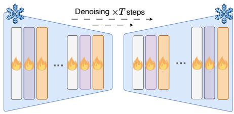

Multi-view Image Generation  
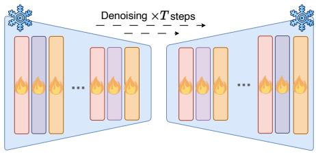

Multi-view Video Generation  
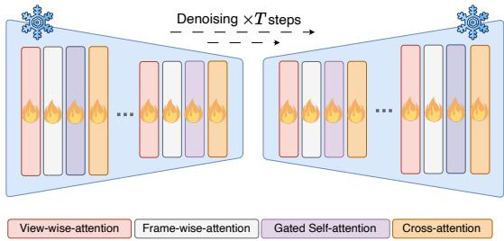  
Figure 7. Model architecture comparison between video generation, multi-view image generation and multi-view video generation.

where $\mathcal { F } _ { \mathfrak { p } }$ is the average pooling operation, $\begin{array} { r l } { U _ { i } ( i } & { { } = } \end{array}$ 0, 1, 2, 3) are multi-scale UNet features, and $A _ { f }$ is the encoded driving action (i.e., velocity and yaw angle) features. Then we use MLP layers [75] to learn future driving actions. For trajectory prediction evaluation, following [75], $A _ { f }$ is additionally extracted from high-level command, accelerate and past trajectories, and we use the same action feature encoder of [75].

Synthetic data training. We leverage data generated by DriveDreamer to augment the training of 3D detection tasks. Specifically, DriveDreamer is fine-tuned with higher-resolution images, where the training data is from nuScenes [3]. Consequently, DriveDreamer can generate high-fidelity images with a resolution of $7 6 8 \times 4 4 8$ . Then the generated images are resized to the original resolution of $1 6 0 0 \times 9 0 0$ , which can be utilized to train various offthe-shelf 3D detectors. During the training process, we randomly select 4000 samples (3D boxes and HDMap) from the nuScenes training set, which are employed to generate multi-view images. These synthetic data are mixed with the original training set to train 3D detectors. In the experiment, we train each baseline (i.e., FCOS3D [66] and BEVFusion [45]) for 12 epochs. The results presented in Tab. 1 demonstrate that our approach significantly improves the performance of downstream tasks.

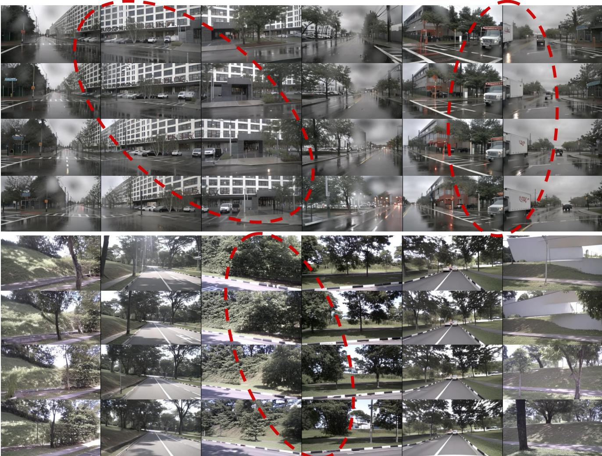  
Figure 8. Visualizations of the generated multi-view video. Regions highlighted by red circles indicate that the generated videos are viewconsistent and frame-consistent.

## 7. Visualizations

As shown in Fig. 9, DriveDreamer exhibits significant proficiency in producing a diverse range of driving scene videos that adhere meticulously to structured traffic conditions, comprising elements such as HDMaps and 3D boxes. Significantly, we can also manipulate the text prompt to induce variations in the generated videos, encompassing changes in weather and time of day. This heightened adaptability contributes substantially to the multifaceted nature of the generated video outputs. In addition to the utilization of structured traffic conditions for generating driving videos,

DriveDreamer exhibits the capability to diversify the generated driving videos by adapting to different driving actions. As depicted in Fig. 10, starting from an initial frame paired with its corresponding structural information, Drive-Dreamer can generate distinct videos based on various driving actions, such as videos depicting left and right turns. Apart from its capacity for generating highly controllable driving videos, DriveDreamer demonstrates the ability to predict reasonable driving actions. As depicted in Fig. 11, provided with an initial frame condition and past driving actions, DriveDreamer can generate future driving actions that align with real-world scenarios. Comparative analysis of the generated actions against corresponding ground truth videos reveals that DriveDreamer consistently predicts sensible driving actions, even in complex situations such as intersections, obeying traffic lights, and executing turns.

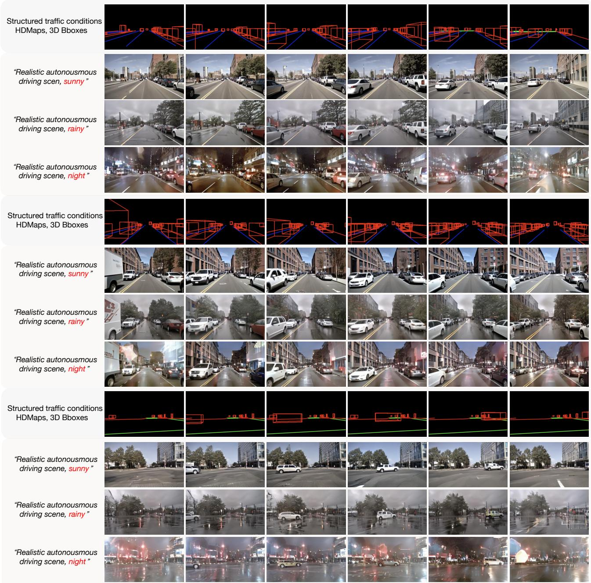  
Figure 9. Driving video generation with structured traffic conditions (HDMaps and 3D boxes), where text prompts are utilized to adjust driving scenario style (e.g., weather and time of the day).

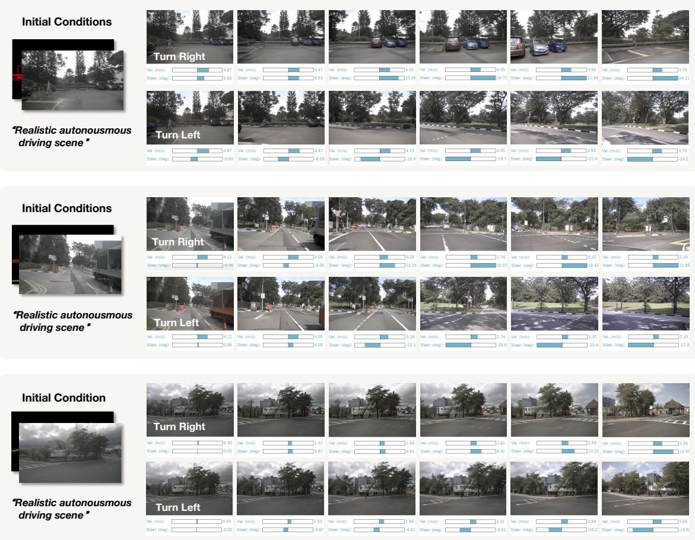  
Figure 10. Future driving video generation with driving actions interaction, where different driving actions (e.g. turn left, turn right) can produce corresponding driving videos.

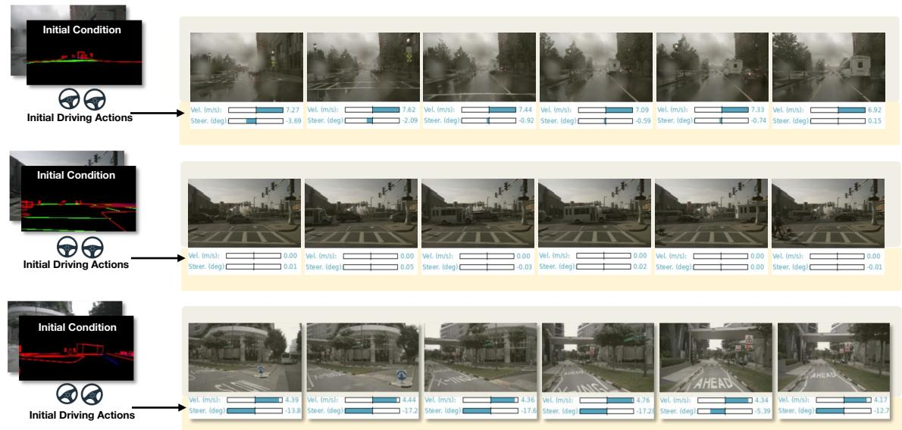  
Figure 11. Visualization of the predicted future driving actions, along with the corresponding ground truth driving video.