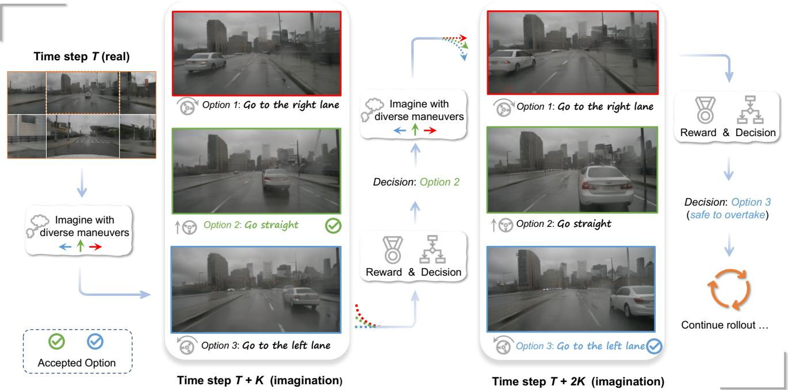
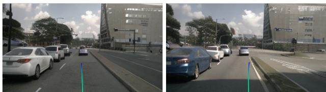
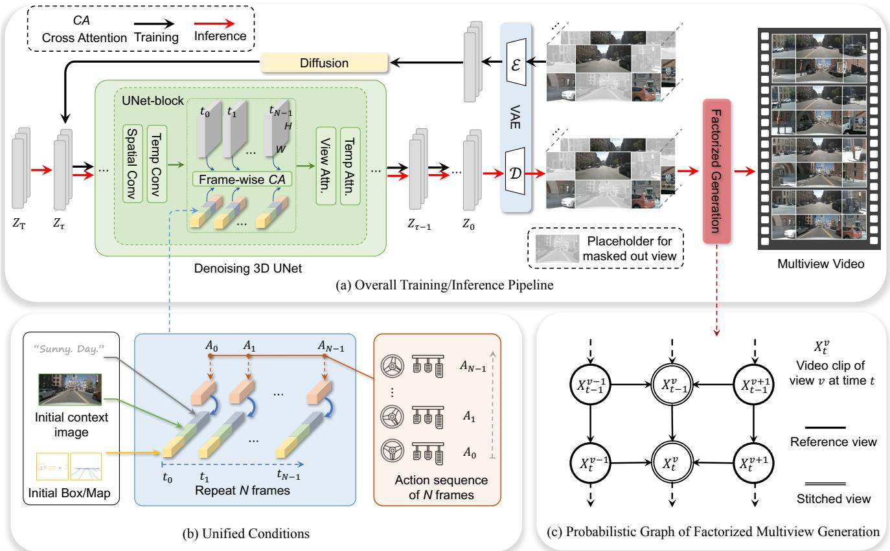
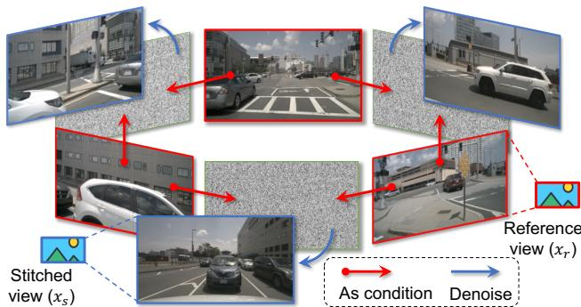
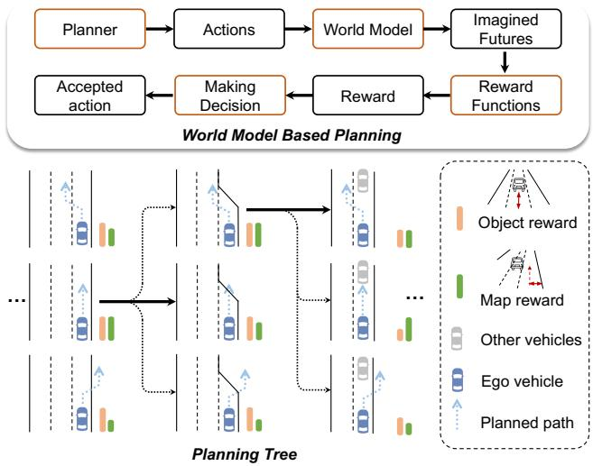
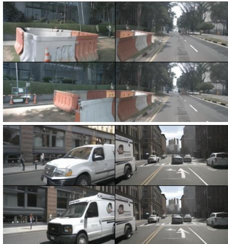
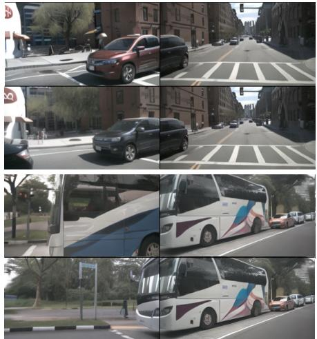
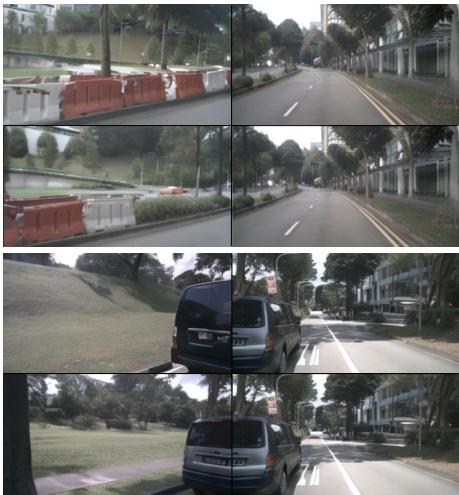
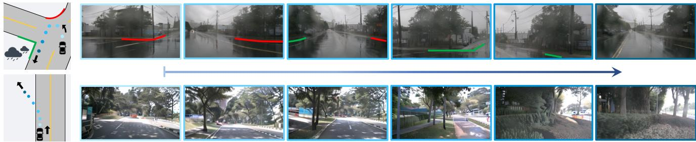

# Driving into the Future: Multiview Visual Forecasting and Planning with World Model for Autonomous Driving

Yuqi Wang1,2⇤, Jiawei He1,2⇤, Lue Fan2⇤, Hongxin Li1,2⇤, Yuntao Chen3B, Zhaoxiang Zhang1,2,3,4B 1 School of Artificial Intelligence, University of Chinese Academy of Sciences (UCAS) 2 CRIPAC, MAIS, Institute of Automation, Chinese Academy of Sciences (CASIA) 3 Centre for Artificial Intelligence and Robotics (HKISI CAS) 4 Shanghai AI Laboratory

wangyuqi2020,fanlue2019,lihongxin2021,zhaoxiang.zhang @ia.ac.cn

jwhe2024,chenyuntao08 @gmail.com

Project Page: https://drive-wm.github.io Code: https://github.com/BraveGroup/Drive-WM

  
Figure 1. Multiview visual forecasting and planning by world model. At time step T, the world model imagines the multiple futures at T + K, and finds it is safe to keep going straight at T. Then the model realizes that the ego car will be too close to the front car according to the imagination of time step T + 2K, so it decides to change to the left lane for a safe overtaking.

## Abstract

In autonomous driving, predicting future events in advance and evaluating theforeseeable risks empowers autonomous vehicles to better plan their actions, enhancing safety and efficiency on the road. To this end, we propose Drive-WM, the first driving world model compatible with existing end-to-end planning models. Through a joint spatialtemporal modeling facilitated by view factorization, our model generates high-fidelity multiview videos in driving

scenes. Building on its powerful generation ability, we showcase the potential of applying the world model for safe driving planning for the first time. Particularly, our Drive-WM enables driving into multiple futures based on distinct driving maneuvers, and determines the optimal trajectory according to the image-based rewards. Evaluation on real-world driving datasets verifies that our method could generate high-quality, consistent, and controllable multiview videos, opening up possibilities for real-world simulations and safe planning.

## 1. Introduction

The emergence of end-to-end autonomous driving [34, 35, 59] has recently garnered increasing attention. These approaches take multi-sensor data as input and directly output planning results in a joint model, allowing for joint optimization of all modules. However, it is questionable whether an end-to-end planner trained purely on expert driving trajectories has sufficient generalization capabilities when faced with out-of-distribution (OOD) cases. As illustrated in Figure 2, when the ego vehicle’s position deviates laterally from the center line, the end-to-end planner struggles to generate a reasonable trajectory. To alleviate this problem, we propose improving the safety of autonomous driving by developing a predictive model that can foresee planner degradation before decision-making. This model, known as a world model [23, 24, 40], is designed to predict future states based on current states and ego actions. By visually envisioning the future in advance and obtaining feedback from different futures before actual decision-making, it can provide more rational planning, enhancing generalization and safety in end-to-end autonomous driving.

However, learning high-quality world models compatible with existing end-to-end autonomous driving models is challenging, despite successful attempts in game simulations [23–25, 51] and laboratory robotics environments [16, 24]. Specifically, there are three main challenges: (1) The driving world model requires modeling in high-resolution pixel space. The previous low-resolution image [24] or vectorized state space [6] methods cannot effectively represent the numerous fine-grained or non-vectorizable events in the real world. Moreover, vector space world models need extra vector annotations and suffer from state estimation noise of perception models. (2) Generating multiview consistent videos is difficult. Previous and concurrent works are limited to single view video [33, 36, 68] or multiview image generation [21, 58, 74], leaving multiview video generation an open problem for comprehensive environment observation needed in autonomous driving. (3) It is challenging to flexibly accommodate various heterogeneous conditions like changing weather, lighting, ego actions, and road/obstacle/vehicle layouts.

To address these challenges, we propose Drive-WM. Inspired by latent video diffusion models [4, 17, 53, 78], we introduce multiview and temporal modeling for jointly generating multiple views and frames. To further enhance multiview consistency, we propose factorizing the joint modeling to predict intermediate views conditioned on adjacent views, greatly improving consistency between views. We also introduce a simple yet effective unified condition interface enabling flexible use of heterogeneous conditions like images, text, 3D layouts, and actions, greatly simplifying conditional generation. Finally, building on the multiview world model, we explore end-to-end planning applications to enhance autonomous driving safety, as shown in Figure 1. The main contributions of our work can be summarized as follows.

  
(a) Planning with ego on centerline (b) Planning with ego off centerline  
Figure 2. Ego vehicle’s slight deviation from centerline causes motion planner to struggle generating reasonable trajectories. We shift the ego location 0.5m to the right to create an out-ofdomain case. (a) shows the reasonable trajectory prediction of the VAD [35] method under normal data, and (b) shows the irrational trajectory when encountering out-of-distribution cases.

• We propose Drive-WM, a multiview world model capable of generating high-quality, controllable, and consistent multiview videos in autonomous driving scenes.

• Extensive experiments on the nuScenes dataset showcase the leading video quality and controllability. Drive-WM also achieves superior multiview consistency, evaluated by a novel keypoint matching based metric.

• We are the first to explore the potential application of the world model in end-to-end planning for autonomous driving. We experimentally show that our method could enhance the overall soundness of planning and robustness in out-of-distribution situations.

## 2. Related Works

## 2.1. Video Generation and Prediction

Video generation aims to generate realistic video samples. Various generation methods have been proposed in the past, including VAE-based (Variational Autoencoder) [20, 38, 63, 66], GAN-based (Generative Adversarial Networks) [5, 19, 36, 54, 61, 75], flow-based [14, 39] and auto-regressive models [22, 69, 73]. Notably, the recent success of diffusion-based models in the realm of image generation [45, 49, 50] has ignited growing interest in applying diffusion models to the realm of video generation [27, 31]. Diffusion-based methods have yielded significant enhancements in realism, controllability, and temporal consistency. Text-conditional video generation has garnered more attention due to its controllable generation, and a plethora of methods have emerged [3, 4, 30, 53, 71, 78].

Video prediction can be regarded as a special form of generation, leveraging past observations to anticipate future frames [2, 11, 26, 31, 46, 64, 65, 70]. Especially in autonomous driving, DriveGAN [36] learns to simulate a driving scenario with vehicle control signals as its input. GAIA-1 [33] and DriveDreamer [68] further extend to actionconditional diffusion models, enhancing the controllability and realism of generated videos. However, these previous works are limited to monocular videos and fail to comprehend the overall 3D surroundings. We have pioneered the generation of multiview videos, allowing for better integration with current BEV perception and planning models.

## 2.2. World Model for Planning

The world model [40] learns a general representation of the world and predicts future world states resulting from a sequence of actions. Learning world models in either game [23–25, 48, 52] or lab environments [16, 18, 72] has been widely studied. Dreamer [24] learns a latent dynamics model from past experience to predict state values and actions in a latent space. It is capable of handling challenging visual control tasks in the DeepMind Control Suite [60]. DreamerV2 [25] improves upon Dreamer to achieve human-level performance on Atari games. DreamerV3 [26] uses larger networks and learns to obtain diamonds in Minecraft from scratch given sparse rewards, which is considered a long-standing challenge. Day-Dreamer [72] applies Dreamer [24] to training 4 robots online in the real world and solves locomotion and manipulation tasks without changing hyperparameters. Recently, learning world models in driving scenes has gained attention. MILE [32] employs a model-based imitation learning method to jointly learn a dynamics model and driving behaviour in CARLA [15]. There also a series of works [1, 12, 13, 28] investigating offline reinforcement learning for model-based planning. The aforementioned works are limited to either simulators or well-controlled lab environments. In contrast, our world model, through future envisioning, can be integrated with existing end-to-end driving planners to enhance planning performance in realworld scenarios.

## 3. Multi-view Video Generation

In this section, we first present how to jointly model the multiple views and frames, which is presented in Sec 3.1. Then we enhance multiview consistency by factorizing the joint modeling in Sec 3.2. Finally, Sec. 3.3 elaborates on how we build a unified condition interface to integrate the multiple heterogeneous conditions.

## 3.1. Joint Modeling of Multiview Video

To jointly model multiview temporal data, we start with the well-studied image diffusion model and adapt it into multiview-temporal scenarios by introducing additional temporal layers and multiview layers. In this subsection, we first present the overall formulation of joint modeling and elaborate on the temporal and multiview layers.

Formulation. We assume access to a dataset $p _ { \mathrm { d a t a } }$ of multiview videos, such that $\mathbf { x } \in \mathbb { R } ^ { T \times K \times 3 \times H \times W }$ , x ⇠ pdata is a sequence of $T$ images with K views, with height and width H and W. Given encoded video latent representation $\mathcal { E } ( \mathbf { x } ) ~ = ~ \mathbf { z } ~ \in ~ \mathbb { R } ^ { T \cdot K \times C \times \hat { H } \times \hat { W } }$ , diffused inputs $\mathbf { z } _ { \tau } = \alpha _ { \tau } \mathbf { z } + \sigma _ { \tau } \mathbf { \epsilon } , \epsilon \sim \mathcal { N } ( \mathbf { 0 } , I )$ , here $\alpha _ { \tau }$ and $\sigma _ { \tau }$ define a noise schedule parameterized by a diffusion time step ⌧ . A denoising model $\mathbf { f } _ { \theta , \phi , \psi }$ (parameterized by spatial parameters ✓, temporal parameters  and multiview parameters ) receives the diffused ${ \bf z } _ { \tau }$ as input and is optimized by minimizing the denoising score matching objective

$$
\mathbb { E } _ { \mathbf { z } \sim p _ { \mathrm { d a t a } } , \tau \sim p _ { \tau } , \epsilon \sim \mathcal { N } ( \mathbf { 0 } , I ) } [ \lVert \mathbf { y } - \mathbf { f } _ { \theta , \phi , \psi } ( \mathbf { z } _ { \tau } ; \mathbf { c } , \tau ) \rVert _ { 2 } ^ { 2 } ] ,\tag{1}
$$

where c is the condition, and target $\mathbf { y }$ is the random noise ✏.   
$p _ { \tau }$ is a uniform distribution over the diffusion time ⌧.

Temporal encoding layers. We first introduce temporal layers to lift the pretrained image diffusion model into a temporal model. The temporal encoding layer is attached after the 2D spatial layer in each block, following established practice in VideoLDM [4]. The spatial layer encodes the latent $\mathbf { z } \in \mathbb { R } ^ { T \cdot K \times C \times \hat { H } \times \hat { W } }$ in a frame-wise and viewwise manner. Afterward, we rearrange the latent to hold out the temporal dimension, denoted as (TK)CHW  KCTHW, to apply the 3D convolution in spatio-temporal dimensions THW. Then we arrange the latent to (KHW)TC and apply standard multi-head self-attention to the temporal dimension, enhancing the temporal dependency. The notation $\phi$ in Eq. 1 stands for the parameters of this part.

Multiview encoding layers. To jointly model the multiple views, there must be information exchange between different views. Thus we lift the single-view temporal model to a multi-view temporal model by introducing multiview encoding layers. In particular, we rearrange the latent as (KHW)TC  (THW)KC to hold out the view dimension. Then a self-attention layer parameterized by in Eq. 1 is employed across the view dimension. Such multiview attention allows all views to possess similar styles and consistent overall structure.

Multiview temporal tuning. Given the powerful image diffusion models, we do not train the temporal multiview network from scratch. Instead, we first train a standard image diffusion model with single-view image data and conditions, which corresponds to the parameter ✓ in Eq. 1. Then we freeze the parameters ✓ and fine-tune the additional temporal layers () and multiview layers ( ) with video data.

## 3.2. Factorization of Joint Multiview Modeling

Although the joint distributions in Sec. 3.1 could yield similar styles between different views, it is hard to ensure strict consistency in their overlapped regions. In this subsection, we introduce the distribution factorization to enhance multiview consistency. We first present the formulation of factorization and then describe how it cooperates with the aforementioned joint modeling.

  
Figure 3. Overview of the proposed framework. (a) illustrates the training and inference pipeline of the proposed method. (b) visualizes the unified conditions leveraged to control the generation of multi-view video. (c) represents the probabilistic graph of factorized multiview generation. It takes the 3-view output from (a) as input to generate other views, enhancing the multi-view consistency.

Formulation. Let $\mathbf { x } _ { i }$ denote the sample of i-th view, Sec. 3.1 essentially models the joint distribution $p ( \mathbf { x } _ { 1 , \ldots , K } )$ which can be transformed into

$$
p ( \mathbf { x } _ { 1 , \ldots , K } ) = p ( \mathbf { x } _ { 1 } ) p ( \mathbf { x } _ { 2 } | \mathbf { x } _ { 1 } ) \ldots p ( \mathbf { x } _ { K } | \mathbf { x } _ { 1 } , \ldots , \mathbf { x } _ { K - 1 } ) .\tag{2}
$$

Eq. 2 indicates that different views are generated in an autoregressive manner, where a new view is conditioned on existing views. These conditional distributions can ensure better view consistency because new views are aware of the content in existing views. However, such an autoregressive generation is inefficient, making such full factorization infeasible in practice.

To simplify the modeling in Eq. 2, we partition all views into two types: reference views ${ \bf x } _ { r }$ and stitched views $\mathbf { x } _ { s } .$ For example, in nuScenes dataset, reference views can be the $\{ \mathrm { F } , \quad \mathrm { B L } , \quad \mathrm { B R } \} ^ { 2 }$ , and stitched views can be $\left\{ { \mathrm { F L } } , \quad { \mathrm { B } } , \quad { \mathrm { F R } } \right\}$ . We use the term “stitched” because a stitched view appears to be “stitched” from its two neighboring reference views. Views belonging to the same type do not overlap with each other, while different types of views may overlap. This inspires us to first model the joint distribution of reference views. Here the joint modeling is effective for those non-overlapped reference views since they do not necessitate strict consistency. Then the distribution of $\mathbf { x } _ { s }$ is modeled as a conditional distribution conditioned on the ${ \bf x } _ { r }$ . Figure 4 illustrates the basic concept of multiview factorization in nuScenes. In this sense, we simplify Eq. 2 into

$$
p ( \mathbf { x } ) = p ( \mathbf { x } _ { s } , \mathbf { x } _ { r } ) = p ( \mathbf { x } _ { s } | \mathbf { x } _ { r } ) p ( \mathbf { x } _ { r } ) .\tag{3}
$$

Considering the temporal coherence, we incorporate previous frames as additional conditions. The Eq. 3 can be re-written as

$$
p ( \mathbf { x } ) = p ( \mathbf { x } _ { s } , \mathbf { x } _ { r } | \mathbf { x } _ { p r e } ) = p ( \mathbf { x } _ { s } | \mathbf { x } _ { r } , \mathbf { x } _ { p r e } ) p ( \mathbf { x } _ { r } | \mathbf { x } _ { p r e } ) ,\tag{4}
$$

where $\mathbf { x } _ { p r e }$ is context frames (e.g., the last two frames) from previously generated video clips. The distribution of reference views $p ( \mathbf { x } _ { r } | \mathbf { x } _ { p r e } )$ is implemented by the pipeline in Sec. 3.1. As for $p ( \mathbf { x } _ { s } | \mathbf { x } _ { r } , \mathbf { x } _ { p r e } )$ , we adopt the similar pipeline but incorporate neighboring reference views as an additional condition as Figure 4 shows. We introduce how to use conditions in the following subsection.

  
Figure 4. Illustration of factorized multi-view generation. We take the sensor layout in nuScenes as an example.

## 3.3. Unified Conditional Generation

Due to the great complexity of the real world, the world model needs to leverage multiple heterogeneous conditions. In our case, we utilize initial context frames, text descriptions, ego actions, 3D boxes, BEV maps, and reference views. More conditions can be further included for better controllability. Developing specialized interface for each one is time-consuming and inflexible to incorporate more conditions. To address this issue, we introduce a unified condition interface, which is simple yet effective in integrating multiple heterogeneous conditions. In the following, we first introduce how we encode each condition, and then describe the unified condition interface.

Image condition. We treat initial context frames (i.e., the first frame of a clip) and reference views as image conditions. A given image condition $\textbf { I } \in \mathbb { R } ^ { 3 \times H \times W }$ is encoded and flattened to a sequence of d-dimension embeddings $\mathbf { i } = ( i _ { 1 } , i _ { 2 } , . . . , i _ { n } ) \in \mathbb { R } ^ { n \times d }$ , using ConvNeXt as encoder [44]. Embeddings from different images are concatenated in the first dimension of n.

Layout condition. Layout condition refers to 3D boxes, HD maps, and BEV segmentation. For simplicity, we project the 3D boxes and HD maps into a 2D perspective view. In this way, we leverage the same strategy with image condition encoding to encode the layout condition, resulting in a sequence of embeddings $\mathbf { l } = ( l _ { 1 } , l _ { 2 } , . . . , l _ { k } ) \in \mathbb { R } ^ { k \times d }$ . k is the total number of embeddings from the projected layouts and BEV segmentation.

Text condition. We follow the convention of diffusion models to adopt a pre-trained CLIP [47] as the text encoder. Specifically, we combine view information, weather, and light to derive a text description. The embeddings are denoted as ${ \mathbf e } = ( e _ { 1 } , e _ { 2 } , . . . , e _ { m } ) \in \mathbb { R } ^ { m \times d }$

Action condition. Action conditions are indispensable for the world model to generate the future. To be compatible with the existing planning methods [35], we define the action in a time step as $( \Delta x , \Delta y )$ , which represents the movement of ego location to the next time step. We use an MLP to map the action into a d-dimension embedding $\mathbf { a } \in \mathbb { R } ^ { 2 \times d }$

  
Figure 5. End-to-end planning pipeline with our world model. We display the components of our planning pipeline at the top and illustrate the decision-making process in the planning tree using image-based rewards at the bottom.

A unified condition interface. So far, all the conditions are mapped into d-dimension feature space. We take the concatenation of required embeddings as input for the denoising UNet. Taking action-based joint video generation as an example, this allows us to utilize the initial context images, initial layout, text description, and frame-wise action sequence. So we have unified condition embeddings in a certain time t as

$$
\mathbf { c } _ { t } = [ \mathbf { i } _ { 0 } , \mathbf { l } _ { 0 } , \mathbf { e } _ { 0 } , \mathbf { a } _ { t } ] \in \mathbb { R } ^ { ( n + k + m + 2 ) \times d } ,\tag{5}
$$

where subscript t stands for the t-th generated frame and subscript 0 stands for the current real frame. We emphasize that such a combination of different conditions offers a unified interface and can be adjusted by the request. Finally, $\mathbf { c _ { t } }$ interacts with the latent $\mathbf { z _ { t } }$ in 3D UNet by cross attention in a frame-wise manner (Figure 3 (a)).

## 4. World Model for End-to-End Planning

Blindly planning actions without anticipating consequences is dangerous. Leveraging our world model enables comprehensive evaluation of possible futures for safer planning. In this section, we explore end-to-end planning using the world model for autonomous driving, an uncharted area.

## 4.1. Tree-based Rollout with Actions

We describe planning with world models in this section. At each time step, we leverage the world model to generate predicted future scenarios for trajectory candidates sampled from the planner, evaluate the futures using an image-based reward function, and select the optimal trajectory to extend the planning tree.

As shown in Figure 5, we define the planning tree as a series of predicted ego trajectories that evolve over time. For each time, the real multiview images can be captured by the camera. The pre-trained planner takes the real multiview images as input and samples possible trajectory candidates. To be compatible with the input of mainstream planner, we define its action $\mathbf { a } _ { \mathbf { t } }$ at time t as $( x _ { t + 1 } - x _ { t } , y _ { t + 1 } - y _ { t } )$ for each trajectory, where $x _ { t }$ and $y _ { t }$ are the ego locations at time t. Given the actions, we adopt the condition combination in Eq. 5 for the video generation. After the generation, we leverage an image-based reward function to choose the optimal trajectory as the decision. Such a generation-decision process can be repeated to form a tree-based rollout.

## 4.2. Image-based Reward Function

After generating the future videos for planned trajectories, reward functions are required to evaluate the soundness of the multiple futures.

We first get the rewards from perception results. Particularly, we utilize image-based 3D object detector [42] and online HDMap predictor [43] to obtain the perception results on the generated videos. Then we define map reward and object reward, inspired by traditional planner [8, 35]. The map reward includes two factors, distance away from the curb, encouraging the ego vehicle to stay in the correct drivable area, and centerline consistency, preventing ego from frequently changing lanes and deviating from the lane in the lateral direction. The object reward means the distance away from other road users in longitudinal and lateral directions. This reward avoids the collision between the ego vehicle and other road users. The total reward is defined as the product of the object reward and the map reward. We finally select the ego prediction with the maximum reward. Then the planning tree forwards to the next timestamp and plans the subsequent trajectory iteratively.

Since the proposed world model operates in pixel space, it can further get rewards from the non-vectorized representation to handle more general cases. For example, the sprayed water from the sprinkler and damaged road surface are hard to be vectorized by the supervised perception models, while the world model trained from massive unlabeled data could generate such cases in pixel space. Leveraging the recent powerful foundational models such as GPT-4V, the planning process can get more comprehensive rewards from the non-vectorized representation. In the appendix, we showcase some typical examples.

## 5. Experiments

## 5.1. Setup

Dataset. We adopt the nuScenes [7] dataset for experiments, which is one of the most popular datasets for 3D perception and planning. It comprises a total of 700 training videos and 150 validation videos. Each video includes around 20 seconds captured by six surround-view cameras. Training scheme. We crop and resize the original image from $1 6 0 0 \times 9 0 0 ~ \mathrm { t o } ~ 3 8 4 \times 1 9 2$ . Our model is initialized with Stable Diffusion checkpoints [49]. For additional details, please refer to the appendix B.

Model variants. We support action-based video generation and layout-based video generation. The former gives the ego action of each frame as the condition, while the latter gives the layout (3D box, map information) of each frame.

Metric evaluation. Our evaluation covers three aspects: generation quality, controllability of generated content, and planning. Further details are available in the appendix D.

Multiview consistency evaluation. We introduced a novel metric, the Key Points Matching (KPM) score, to evaluate multi-view consistency. This metric utilizes a pre-trained matching model [56] to calculate the average number of matching key points, thereby quantifying the KPM score. Please refer to the appendix D for detailed calculation.

## 5.2. Main Results of Multi-view Video Generation

We first demonstrate our superior generation quality and controllability. Here the generation is conditioned on frame-wise 3D layouts. Our model is trained in nuScenes train split, and evaluated with the conditions in val split.

Generation quality. Since we are the first one to explore multi-view video generation, we make separate comparisons with previous methods in multi-view images and single-view videos, respectively. For multi-view image generation, we remove the temporal layers in Sec. 3.1. Table 1a showcases the main results. In single-view image generation, we achieve 12.99 FID, achieving a significant improvement over previous methods. For video generation, our method exhibits a significant quality improvement compared to past single-view video generation methods, achieving 15.8 FID and 122.7 FVD. Additionally, our method is the first work to generate consistent multi-view videos, which is quantitatively demonstrated in Sec. 5.3.

Controllability. In Table 1b, we examine the controllability of our method on the nuScenes val split. For foreground controllability, we evaluate the performance of 3D object detection on the generated multiview videos, reporting $\mathrm { \ m A P _ { o b j } }$ . Additionally, we segment the foreground on the BEV layouts, reporting mIoUfg. Regarding background control, we report the mIoU of road segmentation. Furthermore, we evaluate $\mathrm { \ m A P _ { \mathrm { m a p } } }$ for HDMap performance. This superior controllability highlights the effectiveness of the unified condition interface (Sec. 3.3) and demonstrates the potential of the world model as a neural simulator.

## 5.3. Ablation Study for Multiview Video Generation

To validate the effectiveness of our design decisions, we conduct ablation studies on the key features of the model, as illustrated in Table 2. The experiments are conducted under layout-based video generation.

<table><tr><td>Method</td><td>Multi-view Video</td><td>FID↓ FVD↓</td></tr><tr><td>BEVGen [58]</td><td>√</td><td>25.54</td></tr><tr><td>BEVControl [74]</td><td>√</td><td>24.85</td></tr><tr><td>MagicDrive [21]</td><td>√</td><td>16.20</td></tr><tr><td>Ours</td><td>√</td><td>12.99</td></tr><tr><td>DriveGAN [36]</td><td>√</td><td>73.4 502.3</td></tr><tr><td>DriveDreamer [68]</td><td>V</td><td>52.6 452.0</td></tr><tr><td>Ours</td><td>√ √</td><td>15.8 122.7</td></tr></table>

(a) Generation quality.

<table><tr><td>Method</td><td> $\mathrm { \ m A P _ { o b j } \ } \mathrm { \ } 1$ </td><td> $\mathrm { \ m A P _ { \mathrm { m a p } } }$  ←</td><td> $\mathrm { m I o U _ { f g } \uparrow }$ </td><td> $\mathrm { m I o U _ { b g } \uparrow }$ </td></tr><tr><td>GT (real image)</td><td>37.78</td><td>59.30</td><td>36.08</td><td>72.36</td></tr><tr><td>BEVGen [58]</td><td></td><td></td><td>5.89</td><td>50.20</td></tr><tr><td>LayoutDiffusion [76]</td><td>3.68</td><td></td><td>15.51</td><td>35.31</td></tr><tr><td>GLIGEN [41]</td><td>15.42</td><td></td><td>22.02</td><td>38.12</td></tr><tr><td>BEVControl [74]</td><td>19.64</td><td></td><td>26.80</td><td>60.80</td></tr><tr><td>MagicDrive [21]</td><td>12.30</td><td></td><td>27.01</td><td>61.05</td></tr><tr><td>Ours</td><td>20.66</td><td>37.68</td><td>27.19</td><td>65.07</td></tr></table>

(b) Generation controllability.

Table 1. Multi-view video generation performance on nuScenes. For each task, we test the corresponding models trained on the nuScenes training set. Our Drive-WM surpasses all other methods in both quality and controllability evaluation.
<table><tr><td>Temp emb. Layout Cond.</td><td>|FID↓</td><td>FVD↓</td><td>KPM(%)↑</td></tr><tr><td>√</td><td>20.3</td><td>212.5</td><td>31.5</td></tr><tr><td></td><td>18.9</td><td>153.8</td><td>44.6</td></tr><tr><td>√</td><td>15.8</td><td>122.7</td><td>45.8</td></tr></table>

(a) Ablations of unified condition.

<table><tr><td>Temp Layers View Layers | FID↓ FVD↓ KPM(%)↑</td><td></td><td></td><td></td><td></td></tr><tr><td></td><td></td><td>23.3</td><td>228.5</td><td>40.8</td></tr><tr><td>√</td><td></td><td>16.2</td><td>127.1</td><td>40.9</td></tr><tr><td>√</td><td>√</td><td>15.8</td><td>122.7</td><td>45.8</td></tr></table>

(b) Ablations of multiview temporal tuning.

<table><tr><td>Method</td><td>KPM(%)↑</td><td>FVD↓</td><td>FID↓</td></tr><tr><td>Joint Modeling</td><td>45.8</td><td>122.7</td><td>15.8</td></tr><tr><td>Factorized Generation</td><td>94.4</td><td>116.6</td><td>16.4</td></tr></table>

(c) Ablations of factorized generation.  
Table 2. Ablations of the components in model design. The experiments are conducted under the layout-based video generation (See model variants in Sec. 5.1) from nuScenes validation set.

Unified condition. In Table 2a, we find that the layout condition has a significant impact on the model’s ability, improving both the quality and consistency of the generated videos. Additionally, temporal embedding can enhance the quality of the generated videos.

Model design. In Table 2b, we explore the role of the temporal and view layers in multiview temporal tuning. The experiment shows that simply adopting the multiview layer without factorization (Sec. 3.2) slightly improve the KPM.

Factorized multiview generation. As indicated in Table 2c, factorized generation notably improves the consistency among multiple views, increasing from 45.8% to 94.4%, in contrast to joint modeling. This enhancement is achieved while ensuring the quality of both images and videos. Qualitative results are illustrated in Figure 6.

## 5.4. Exploring Planning with World Model

In this subsection, we explore the application of the world model in end-to-end planning, which is under-explored in recent works for autonomous driving. Our attempts lie in two aspects. (1) We first demonstrate that evaluating the generated futures is helpful in planning. (2) Then we showcase that the world model can be leveraged to improve planning in some out-of-distribution cases.

Tree-based planning. We conduct the experiments to show the performance of our tree-based planning. Instead of using the ground truth driving command, we sample planned trajectories from VAD according to the three commands “Go straight”, “Turn left”, and “Turn right”. Then the sampled actions are used for our tree-based planning (Sec. 4). As shown in Table 3, our tree-based planner outperforms random driving commands, sampled driving commands based on the dataset distribution, and even achieves performance close to the ground truth command. Besides, in Table 4, we ablate two adopted rewards and the results indicate that the combined reward outperforms each subreward, particularly in terms of the object collision metric.

Recovery from OOD ego deviation. The core of handling OOD cases is to utilize powerful foundation models to generate reliable OOD training data and obtain reliable rewards. Using our world model, we can simulate the outof-distribution ego locations in pixel space. In particular, we shift the ego location laterally by 0.5 meters, like the right one in Figure 2. In this situation, the performance of the existing end-to-end planner VAD [35] undergoes a significant decrease (see Table 5 row 2). To alleviate the problem, we fine-tune the planner with generated video supervised by the trajectory that the ego-vehicle drives back to

<table><tr><td rowspan="2">Method</td><td colspan="3">L2 (m) ↓</td><td rowspan="2"></td><td colspan="3">Collision (%) ↓</td></tr><tr><td>1s</td><td>2s 3s</td><td>Avg.</td><td>1s</td><td>2s 3s</td><td>Avg.</td></tr><tr><td>VAD (GT cmd)</td><td>0.41</td><td>0.70</td><td>1.05</td><td>0.72</td><td>0.07</td><td>0.17 0.41</td><td>0.22</td></tr><tr><td>VAD (random cmd)</td><td>0.51</td><td>0.97 1.57</td><td>1.02</td><td>0.34</td><td>0.74</td><td>1.72</td><td>0.93</td></tr><tr><td>VAD (sampled cmd)</td><td>0.46</td><td>0.83 1.31</td><td>0.87</td><td>0.23</td><td>0.42</td><td>0.76</td><td>0.47</td></tr><tr><td>Ours</td><td></td><td>0.43 0.77 1.20</td><td>0.80</td><td></td><td>0.10 0.21 0.48</td><td></td><td>0.26</td></tr></table>

Table 3. Planning performance on nuScenes. Instead of using the ground truth driving command, we use our tree-based planning to select the best out of three commands.

Figure 6. Qualitative results of factorized multiview generation. For each compared pair, the upper row is generated without factorization, and the lower row is generated with factorization.  
  
Figure 7. Counterfactual events generation. Top: turning around at a T-shape intersection on a rainy day. Note that our training set does not contain any turning-around samples. Bottom: running over a non-drivable area.

<table><tr><td rowspan=2 colspan=1>Map ObjectReward Reward</td><td rowspan=1 colspan=1>L2 (m) ↓</td><td rowspan=1 colspan=1></td><td rowspan=1 colspan=2>Collision (%) ↓</td></tr><tr><td rowspan=1 colspan=1>1s 2s  3s</td><td rowspan=1 colspan=1>Avg.</td><td rowspan=1 colspan=1>1s  2s 3s</td><td rowspan=1 colspan=1>Avg.</td></tr><tr><td rowspan=4 colspan=1>√√√</td><td rowspan=1 colspan=1>0.510.971.57</td><td rowspan=1 colspan=1>1.02</td><td rowspan=1 colspan=1>0.340.741.72</td><td rowspan=1 colspan=1>0.93</td></tr><tr><td rowspan=1 colspan=1>0.4550.821.29</td><td rowspan=1 colspan=1>0.85</td><td rowspan=1 colspan=1>0.120.330.72</td><td rowspan=1 colspan=1>0.39</td></tr><tr><td rowspan=1 colspan=1>0.430.771.20</td><td rowspan=1 colspan=1>0.80</td><td rowspan=1 colspan=1>0.120.21 0.48</td><td rowspan=1 colspan=1>0.27</td></tr><tr><td rowspan=1 colspan=1>0.43 0.771.20</td><td rowspan=1 colspan=1>0.80</td><td rowspan=1 colspan=1>0.10 0.21 0.48</td><td rowspan=1 colspan=1>0.26</td></tr></table>

Table 4. Image-based reward function design. We use two subrewards, map reward and object reward.
<table><tr><td rowspan="2">OOD World Model f.t.</td><td colspan="4">L2 (m) ↓</td><td colspan="4">Collision (%) ↓</td></tr><tr><td>1s</td><td>2s</td><td>3s</td><td>Avg.</td><td>1s</td><td>2s</td><td>3s</td><td>Avg.</td></tr><tr><td></td><td></td><td>0.41</td><td>0.70</td><td>1.05</td><td>0.72</td><td>0.07 0.17</td><td>0.41</td><td>0.22</td></tr><tr><td>√</td><td></td><td>0.73 0.99</td><td>91.33</td><td>1.02</td><td>1.25</td><td>1.62</td><td>1.91</td><td>1.59</td></tr><tr><td>√</td><td>√</td><td>0.500.791.17</td><td></td><td>0.82</td><td></td><td>0.720.84  1.16</td><td></td><td>0.91</td></tr></table>

Table 5. Out-of-domain planning. We define OOD location with a lateral deviation of 0.5 meters from the ego vehicle.

the lane. Learning from these OOD data, the performance of the planner can be better and near normal levels.

## 5.5. Counterfactual Events

Given an initial observation and the action, our Drive-WM can generate counterfactual events, such as turning around and running over non-drivable areas (Figure 7), which are significantly different from the training data. The ability to generate such counterfactual data reveals again that our Drive-WM has the potential to foresee and handle out-ofdistribution cases.

## 6. Conclusion

We introduce Drive-WM, the first multiview world model for autonomous driving. Our method exhibits the capability to generate high-quality and consistent multiview videos under diverse conditions, leveraging information from textual descriptors, layouts, or ego actions to control video generation. The introduced factorized generation significantly enhances spatial consistency across various views. Besides, extensive experiments on nuScenes dataset show that our method could enhance the overall soundness of planning and robustness in out-of-distribution situations.

## Acknowledgments

This work was supported in part by the National Key R&D Program of China (No. 2022ZD0160102), the National Natural Science Foundation of China (No. U21B2042, No. 62072457), the innoHK funding, and in part by the 2035 Innovation Program of CAS.

## References

[1] Arthur Argenson and Gabriel Dulac-Arnold. Model-based offline planning. In ICLR, 2020. 3

[2] Mohammad Babaeizadeh, Mohammad Taghi Saffar, Suraj Nair, Sergey Levine, Chelsea Finn, and Dumitru Erhan. Fitvid: Overfitting in pixel-level video prediction. arXiv preprint arXiv:2106.13195, 2021. 2

[3] Andreas Blattmann, Tim Dockhorn, Sumith Kulal, Daniel Mendelevitch, Maciej Kilian, Dominik Lorenz, Yam Levi, Zion English, Vikram Voleti, Adam Letts, et al. Stable video diffusion: Scaling latent video diffusion models to large datasets. arXiv preprint arXiv:2311.15127, 2023. 2

[4] Andreas Blattmann, Robin Rombach, Huan Ling, Tim Dockhorn, Seung Wook Kim, Sanja Fidler, and Karsten Kreis. Align your latents: High-resolution video synthesis with latent diffusion models. In CVPR, pages 22563–22575, 2023. 2, 3, 14, 17

[5] Tim Brooks, Janne Hellsten, Miika Aittala, Ting-Chun Wang, Timo Aila, Jaakko Lehtinen, Ming-Yu Liu, Alexei Efros, and Tero Karras. Generating long videos of dynamic scenes. NeurIPS, 35:31769–31781, 2022. 2

[6] Lars Buesing, Theophane Weber, Sebastien Racaniere, SM´ Eslami, Danilo Rezende, David P Reichert, Fabio Viola, Frederic Besse, Karol Gregor, Demis Hassabis, et al. Learning and querying fast generative models for reinforcement learning. arXiv preprint arXiv:1802.03006, 2018. 2

[7] Holger Caesar, Varun Bankiti, Alex H Lang, Sourabh Vora, Venice Erin Liong, Qiang Xu, Anush Krishnan, Yu Pan, Giancarlo Baldan, and Oscar Beijbom. nuscenes: A multimodal dataset for autonomous driving. In CVPR, pages 11621–11631, 2020. 6, 12

[8] Sergio Casas, Abbas Sadat, and Raquel Urtasun. Mp3: A unified model to map, perceive, predict and plan. In CVPR, pages 14403–14412, 2021. 6

[9] Li Chen, Chonghao Sima, Yang Li, Zehan Zheng, Jiajie Xu, Xiangwei Geng, Hongyang Li, Conghui He, Jianping Shi, Yu Qiao, and Junchi Yan. Persformer: 3d lane detection via perspective transformer and the openlane benchmark. In ECCV, 2022. 16

[10] Felipe Codevilla, Eder Santana, Antonio M Lopez, and´ Adrien Gaidon. Exploring the limitations of behavior cloning for autonomous driving. In ICCV, pages 9329–9338, 2019. 12

[11] Emily Denton and Rob Fergus. Stochastic video generation with a learned prior. In ICML, pages 1174–1183. PMLR, 2018. 2

[12] Christopher Diehl, Timo Sievernich, Martin Kruger, Frank ¨ Hoffmann, and Torsten Bertram. Umbrella: Uncertaintyaware model-based offline reinforcement learning leveraging planning. arXiv preprint arXiv:2111.11097, 2021. 3

[13] Christopher Diehl, Timo Sebastian Sievernich, Martin Kruger, Frank Hoffmann, and Torsten Bertram. Uncertainty-¨ aware model-based offline reinforcement learning for automated driving. RAL, 2023. 3

[14] Michael Dorkenwald, Timo Milbich, Andreas Blattmann, Robin Rombach, Konstantinos G Derpanis, and Bjorn Om-

mer. Stochastic image-to-video synthesis using cinns. In CVPR, pages 3742–3753, 2021. 2

[15] Alexey Dosovitskiy, German Ros, Felipe Codevilla, Antonio Lopez, and Vladlen Koltun. CARLA: An open urban driving simulator. In CoRL, pages 1–16. PMLR, 2017. 3

[16] Frederik Ebert, Chelsea Finn, Sudeep Dasari, Annie Xie, Alex Lee, and Sergey Levine. Visual foresight: Model-based deep reinforcement learning for vision-based robotic control. arXiv preprint arXiv:1812.00568, 2018. 2, 3

[17] Patrick Esser, Johnathan Chiu, Parmida Atighehchian, Jonathan Granskog, and Anastasis Germanidis. Structure and content-guided video synthesis with diffusion models. In ICCV, pages 7346–7356, 2023. 2

[18] Chelsea Finn and Sergey Levine. Deep visual foresight for planning robot motion. ICRA, pages 2786–2793, 2016. 3

[19] Gereon Fox, Ayush Tewari, Mohamed Elgharib, and Christian Theobalt. Stylevideogan: A temporal generative model using a pretrained stylegan. arXiv preprint arXiv:2107.07224, 2021. 2

[20] Jean-Yves Franceschi, Edouard Delasalles, Mickael Chen,¨ Sylvain Lamprier, and Patrick Gallinari. Stochastic latent residual video prediction. In ICML, pages 3233–3246. PMLR, 2020. 2

[21] Ruiyuan Gao, Kai Chen, Enze Xie, Lanqing Hong, Zhenguo Li, Dit-Yan Yeung, and Qiang Xu. Magicdrive: Street view generation with diverse 3d geometry control. arXiv preprint arXiv:2310.02601, 2023. 2, 7

[22] Songwei Ge, Thomas Hayes, Harry Yang, Xi Yin, Guan Pang, David Jacobs, Jia-Bin Huang, and Devi Parikh. Long video generation with time-agnostic vqgan and timesensitive transformer. In ECCV, pages 102–118. Springer, 2022. 2

[23] David Ha and Jurgen Schmidhuber. Recurrent world models ¨ facilitate policy evolution. NeurIPS, 31, 2018. 2, 3

[24] Danijar Hafner, Timothy Lillicrap, Jimmy Ba, and Mohammad Norouzi. Dream to control: Learning behaviors by latent imagination. In ICLR, 2020. 2, 3

[25] Danijar Hafner, Timothy P Lillicrap, Mohammad Norouzi, and Jimmy Ba. Mastering atari with discrete world models. In ICLR, 2021. 2, 3

[26] Danijar Hafner, Jurgis Pasukonis, Jimmy Ba, and Timothy Lillicrap. Mastering diverse domains through world models. arXiv preprint arXiv:2301.04104, 2023. 2, 3

[27] William Harvey, Saeid Naderiparizi, Vaden Masrani, Christian Weilbach, and Frank Wood. Flexible diffusion modeling of long videos. NeurIPS, 35:27953–27965, 2022. 2

[28] Mikael Henaff, Alfredo Canziani, and Yann LeCun. Modelpredictive policy learning with uncertainty regularization for driving in dense traffic. In ICLR, 2018. 3

[29] Martin Heusel, Hubert Ramsauer, Thomas Unterthiner, Bernhard Nessler, and Sepp Hochreiter. Gans trained by a two time-scale update rule converge to a local nash equilibrium. NeurIPS, 30, 2017. 17

[30] Jonathan Ho, William Chan, Chitwan Saharia, Jay Whang, Ruiqi Gao, Alexey Gritsenko, Diederik P Kingma, Ben Poole, Mohammad Norouzi, David J Fleet, et al. Imagen video: High definition video generation with diffusion models. arXiv preprint arXiv:2210.02303, 2022. 2

[31] Tobias Hoppe, Arash Mehrjou, Stefan Bauer, Didrik Nielsen,¨ and Andrea Dittadi. Diffusion models for video prediction and infilling. TMLR, 2022. 2

[32] Anthony Hu, Gianluca Corrado, Nicolas Griffiths, Zachary Murez, Corina Gurau, Hudson Yeo, Alex Kendall, Roberto Cipolla, and Jamie Shotton. Model-based imitation learning for urban driving. NeurIPS, 35:20703–20716, 2022. 3

[33] Anthony Hu, Lloyd Russell, Hudson Yeo, Zak Murez, George Fedoseev, Alex Kendall, Jamie Shotton, and Gianluca Corrado. Gaia-1: A generative world model for autonomous driving. arXiv preprint arXiv:2309.17080, 2023. 2, 20

[34] Yihan Hu, Jiazhi Yang, Li Chen, Keyu Li, Chonghao Sima, Xizhou Zhu, Siqi Chai, Senyao Du, Tianwei Lin, Wenhai Wang, et al. Planning-oriented autonomous driving. In CVPR, pages 17853–17862, 2023. 2, 18

[35] Bo Jiang, Shaoyu Chen, Qing Xu, Bencheng Liao, Jiajie Chen, Helong Zhou, Qian Zhang, Wenyu Liu, Chang Huang, and Xinggang Wang. Vad: Vectorized scene representation for efficient autonomous driving. In ICCV, pages 8340– 8350, 2023. 2, 5, 6, 7, 12, 16, 18

[36] Seung Wook Kim, Jonah Philion, Antonio Torralba, and Sanja Fidler. Drivegan: Towards a controllable high-quality neural simulation. In CVPR, pages 5820–5829, 2021. 2, 7

[37] Diederik P Kingma and Jimmy Ba. Adam: A method for stochastic optimization. arXiv preprint arXiv:1412.6980, 2014. 14

[38] Diederik P Kingma and Max Welling. Auto-encoding variational bayes. arXiv preprint arXiv:1312.6114, 2013. 2

[39] Manoj Kumar, Mohammad Babaeizadeh, Dumitru Erhan, Chelsea Finn, Sergey Levine, Laurent Dinh, and Durk Kingma. Videoflow: A conditional flow-based model for stochastic video generation. In ICLR, 2020. 2

[40] Yann LeCun. A path towards autonomous machine intelligence. 2022. 2, 3

[41] Yuheng Li, Haotian Liu, Qingyang Wu, Fangzhou Mu, Jianwei Yang, Jianfeng Gao, Chunyuan Li, and Yong Jae Lee. Gligen: Open-set grounded text-to-image generation. In CVPR, pages 22511–22521, 2023. 7

[42] Zhiqi Li, Wenhai Wang, Hongyang Li, Enze Xie, Chonghao Sima, Tong Lu, Yu Qiao, and Jifeng Dai. Bevformer: Learning bird’s-eye-view representation from multi-camera images via spatiotemporal transformers. In ECCV, pages 1– 18. Springer, 2022. 6

[43] Bencheng Liao, Shaoyu Chen, Xinggang Wang, Tianheng Cheng, Qian Zhang, Wenyu Liu, and Chang Huang. Maptr: Structured modeling and learning for online vectorized hd map construction. In ICLR, 2022. 6, 18

[44] Zhuang Liu, Hanzi Mao, Chao-Yuan Wu, Christoph Feichtenhofer, Trevor Darrell, and Saining Xie. A convnet for the 2020s. In CVPR, pages 11976–11986, 2022. 5

[45] Alexander Quinn Nichol, Prafulla Dhariwal, Aditya Ramesh, Pranav Shyam, Pamela Mishkin, Bob Mcgrew, Ilya Sutskever, and Mark Chen. Glide: Towards photorealistic image generation and editing with text-guided diffusion models. In ICML, pages 16784–16804, 2022. 2

[46] Junhyuk Oh, Xiaoxiao Guo, Honglak Lee, Richard L Lewis, and Satinder Singh. Action-conditional video prediction using deep networks in atari games. NeurIPS, 28, 2015. 2

[47] Alec Radford, Jong Wook Kim, Chris Hallacy, Aditya Ramesh, Gabriel Goh, Sandhini Agarwal, Girish Sastry, Amanda Askell, Pamela Mishkin, Jack Clark, et al. Learning transferable visual models from natural language supervision. In ICML, pages 8748–8763, 2021. 5

[48] Scott Reed, Konrad Zolna, Emilio Parisotto, Sergio Gomez´ Colmenarejo, Alexander Novikov, Gabriel Barth-maron, Mai Gimenez, Yury Sulsky, Jackie Kay, Jost Tobias Sprin-´ genberg, et al. A generalist agent. TMLR, 2022. 3

[49] Robin Rombach, Andreas Blattmann, Dominik Lorenz, Patrick Esser, and Bjorn Ommer. High-resolution image syn-¨ thesis with latent diffusion models. In CVPR, pages 10684– 10695, 2022. 2, 6, 14

[50] Nataniel Ruiz, Yuanzhen Li, Varun Jampani, Yael Pritch, Michael Rubinstein, and Kfir Aberman. Dreambooth: Fine tuning text-to-image diffusion models for subject-driven generation. In CVPR, pages 22500–22510, 2023. 2

[51] Julian Schrittwieser, Ioannis Antonoglou, Thomas Hubert, Karen Simonyan, Laurent Sifre, Simon Schmitt, Arthur Guez, Edward Lockhart, Demis Hassabis, Thore Graepel, et al. Mastering atari, go, chess and shogi by planning with a learned model. Nature, 588(7839):604–609, 2020. 2

[52] Ramanan Sekar, Oleh Rybkin, Kostas Daniilidis, Pieter Abbeel, Danijar Hafner, and Deepak Pathak. Planning to explore via self-supervised world models. In ICML, pages 8583–8592, 2020. 3

[53] Uriel Singer, Adam Polyak, Thomas Hayes, Xi Yin, Jie An, Songyang Zhang, Qiyuan Hu, Harry Yang, Oron Ashual, Oran Gafni, et al. Make-a-video: Text-to-video generation without text-video data. In ICLR, 2022. 2

[54] Ivan Skorokhodov, Sergey Tulyakov, and Mohamed Elhoseiny. Stylegan-v: A continuous video generator with the price, image quality and perks of stylegan2. In CVPR, pages 3626–3636, 2022. 2

[55] Jiaming Song, Chenlin Meng, and Stefano Ermon. Denoising diffusion implicit models. In ICLR, 2020. 14

[56] Jiaming Sun, Zehong Shen, Yuang Wang, Hujun Bao, and Xiaowei Zhou. Loftr: Detector-free local feature matching with transformers. In CVPR, pages 8922–8931, 2021. 6, 20, 21

[57] Pei Sun, Henrik Kretzschmar, Xerxes Dotiwalla, Aurelien Chouard, Vijaysai Patnaik, Paul Tsui, James Guo, Yin Zhou, Yuning Chai, Benjamin Caine, et al. Scalability in perception for autonomous driving: Waymo open dataset. In CVPR, 2020. 16

[58] Alexander Swerdlow, Runsheng Xu, and Bolei Zhou. Streetview image generation from a bird’s-eye view layout. arXiv preprint arXiv:2301.04634, 2023. 2, 7, 12

[59] Ardi Tampuu, Tambet Matiisen, Maksym Semikin, Dmytro Fishman, and Naveed Muhammad. A survey of end-to-end driving: Architectures and training methods. IEEE Trans. Neural Netw. Learn. Syst., 33(4):1364–1384, 2020. 2

[60] Yuval Tassa, Yotam Doron, Alistair Muldal, Tom Erez, Yazhe Li, Diego de Las Casas, David Budden, Abbas Ab-

dolmaleki, Josh Merel, Andrew Lefrancq, Timothy Lillicrap, and Martin Riedmiller. Deepmind control suite, 2018. 3

[61] Sergey Tulyakov, Ming-Yu Liu, Xiaodong Yang, and Jan Kautz. Mocogan: Decomposing motion and content for video generation. In CVPR, pages 1526–1535, 2018. 2

[62] Thomas Unterthiner, Sjoerd Van Steenkiste, Karol Kurach, Raphael Marinier, Marcin Michalski, and Sylvain Gelly. Towards accurate generative models of video: A new metric & challenges. arXiv preprint arXiv:1812.01717, 2018. 17

[63] Ruben Villegas, Arkanath Pathak, Harini Kannan, Dumitru Erhan, Quoc V Le, and Honglak Lee. High fidelity video prediction with large stochastic recurrent neural networks. NeurIPS, 32, 2019. 2

[64] Vikram Voleti, Alexia Jolicoeur-Martineau, and Chris Pal. Mcvd-masked conditional video diffusion for prediction, generation, and interpolation. NeurIPS, 35:23371–23385, 2022. 2

[65] Carl Vondrick, Hamed Pirsiavash, and Antonio Torralba. Generating videos with scene dynamics. NeurIPS, 29, 2016. 2

[66] Jacob Walker, Ali Razavi, and Aaron van den Oord. Pre-¨ dicting video with vqvae. arXiv preprint arXiv:2103.01950, 2021. 2

[67] Shihao Wang, Yingfei Liu, Tiancai Wang, Ying Li, and Xiangyu Zhang. Exploring object-centric temporal modeling for efficient multi-view 3d object detection. In ICCV, pages 3621–3631, 2023. 18

[68] Xiaofeng Wang, Zheng Zhu, Guan Huang, Xinze Chen, and Jiwen Lu. Drivedreamer: Towards real-world-driven world models for autonomous driving. arXiv preprint arXiv:2309.09777, 2023. 2, 7

[69] Dirk Weissenborn, Oscar Tackstr ¨ om, and Jakob Uszkoreit. ¨ Scaling autoregressive video models. In ICLR, 2020. 2

[70] Bohan Wu, Suraj Nair, Roberto Martin-Martin, Li Fei-Fei, and Chelsea Finn. Greedy hierarchical variational autoencoders for large-scale video prediction. In CVPR, pages 2318–2328, 2021. 2

[71] Jay Zhangjie Wu, Yixiao Ge, Xintao Wang, Stan Weixian Lei, Yuchao Gu, Yufei Shi, Wynne Hsu, Ying Shan, Xiaohu Qie, and Mike Zheng Shou. Tune-a-video: One-shot tuning of image diffusion models for text-to-video generation. In ICCV, pages 7623–7633, 2023. 2

[72] Philipp Wu, Alejandro Escontrela, Danijar Hafner, Pieter Abbeel, and Ken Goldberg. Daydreamer: World models for physical robot learning. In CoRL, pages 2226–2240. PMLR, 2023. 3

[73] Wilson Yan, Yunzhi Zhang, Pieter Abbeel, and Aravind Srinivas. Videogpt: Video generation using vq-vae and transformers. arXiv preprint arXiv:2104.10157, 2021. 2

[74] Kairui Yang, Enhui Ma, Jibin Peng, Qing Guo, Di Lin, and Kaicheng Yu. Bevcontrol: Accurately controlling streetview elements with multi-perspective consistency via bev sketch layout. arXiv preprint arXiv:2308.01661, 2023. 2, 7, 12, 17

[75] Sihyun Yu, Jihoon Tack, Sangwoo Mo, Hyunsu Kim, Junho Kim, Jung-Woo Ha, and Jinwoo Shin. Generating videos with dynamics-aware implicit generative adversarial networks. In ICLR, 2021. 2

[76] Guangcong Zheng, Xianpan Zhou, Xuewei Li, Zhongang Qi, Ying Shan, and Xi Li. Layoutdiffusion: Controllable diffusion model for layout-to-image generation. In CVPR, pages 22490–22499, 2023. 7

[77] Brady Zhou and Philipp Krahenb¨ uhl. Cross-view transform-¨ ers for real-time map-view semantic segmentation. In CVPR, pages 13760–13769, 2022. 16, 18

[78] Daquan Zhou, Weimin Wang, Hanshu Yan, Weiwei Lv, Yizhe Zhu, and Jiashi Feng. Magicvideo: Efficient video generation with latent diffusion models. arXiv preprint arXiv:2211.11018, 2022. 2