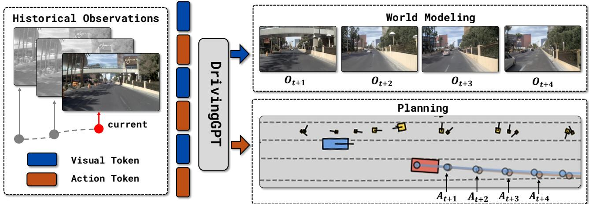
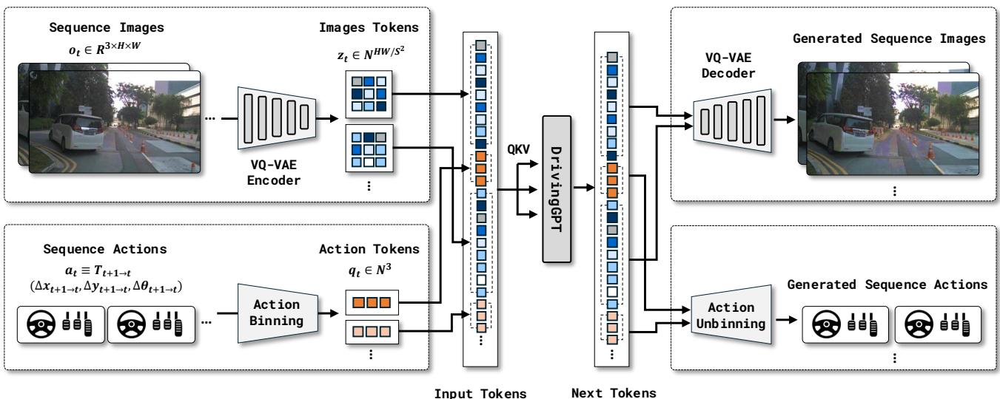
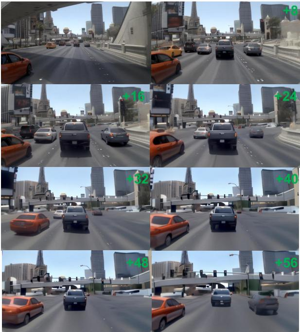
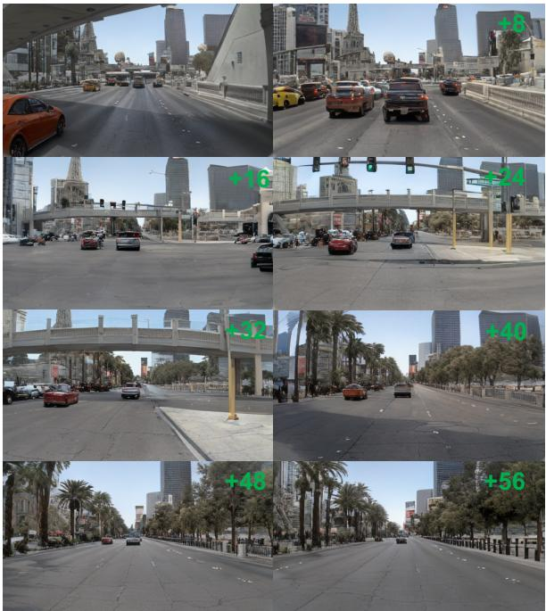
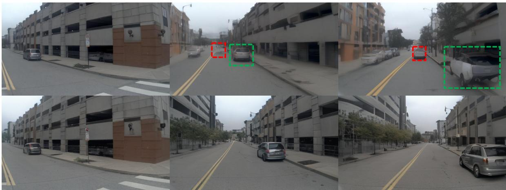
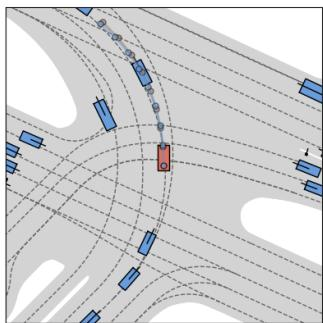
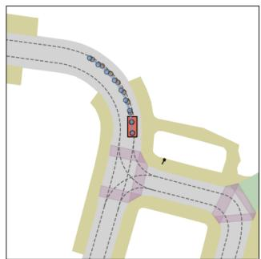
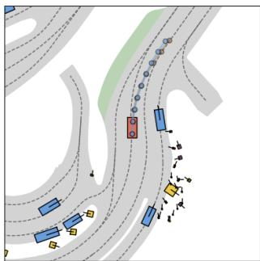
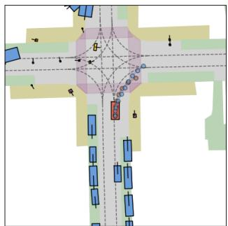

# DrivingGPT: Unifying Driving World Modeling and Planning with Multi-modal Autoregressive Transformers

Yuntao Chen3 Yuqi Wang1,2 Zhaoxiang Zhang1,2

1 New Laboratory of Pattern Recognition, Institute of Automation, Chinese Academy of Sciences 2 School of Artificial Intelligence, University of Chinese Academy of Sciences 3 HKISI, CAS

Project page: https://rogerchern.github.io/DrivingGPT

  
Figure 1. Driving as next token prediction. Our DrivingGPT treat interleaved discrete visual and action tokens of a driving sequence as a unified driving language and leverage multimodal autoregressive transformers to simultaneously perform world modeling and end-to-end planning by standard next token prediction given historical driving tokens. The red rectangle in planning denotes the ego car and the blue line is the generated trajectory while the brown line is the human driving trajectory.

## Abstract

World model-based searching and planning are widely recognized as a promising path toward human-level physical intelligence. However, current driving world models primarily rely on video diffusion models, which specialize in visual generation but lack theflexibility to incorporate other modalities like action. In contrast, autoregressive transformers have demonstrated exceptional capability in modeling multimodal data. Our work aims to unify both driving model simulation and trajectory planning into a single sequence modeling problem. We introduce a multimodal driving language based on interleaved image and action tokens, and develop DrivingGPT to learn joint world modeling and planning through standard next-token prediction. Our DrivingGPT demonstrates strong performance in both actionconditioned video generation and end-to-end planning in the VQ token space for the first time, outperforming strong baselines on large-scale nuPlan and NAVSIM benchmarks.

## 1. Introduction

Driving world models [19, 27, 31, 61, 64, 75] have gained significant attention as model-based searching and planning are widely considered essential paths toward human-level physical intelligence [34]. These models serve multiple purposes, including training data augmentation, rare scenario generation, and contingency planning. Most current world models are developed by fine-tuning existing diffusion models [1, 47], leveraging the generalization capabilities of video generation foundation models. Control signals—such as text, layout, and driving maneuvers—are incorporated through two main approaches: cross-attention between spatial features of diffusion models [36] and control signal features, or channel-level feature modulation techniques like AdaLN [43] and FiLM [44].

Despite advances in driving world models, a fundamental challenge persists: the seamless integration of world modeling and planning in a differentiable framework remains largely unresolved, thereby limiting the full potential of differentiable model-based planning. World models currently base primarily on video diffusion architectures, limiting their ability to generate multiple modalities such as text and action sequences. As a result, achieving true end-to-end integration of driving planning and world modeling within the diffusion model framework continues to be a significant technical challenge. These limitations motivate us to explore alternative architectures that naturally handle multi-modal inputs and outputs and enable end-to-end differentiable planning.

In contrast to diffusion models, autoregressive transformers with next-token prediction training targets have demonstrated exceptional modeling ability in a wide range of tasks tasks including language modeling [5, 16, 54, 59], visual question answering [39, 60], image generation [42, 46, 50, 58, 73], video prediction [20, 62, 69, 70], sequential decision making [9, 48] and robot manipulation [3, 4, 8, 41]. The natural ability of autoregressive transformers to handle sequential data and multiple modalities makes them particularly promising for integrated model-based driving planners.

In this work, we aim to leverage the modeling capabilities of autoregressive transformers for both world modeling and trajectory planning in driving tasks. Specifically, we formulate visual driving world modeling and end-to-end driving trajectory planning as a unified sequence modeling problem. We transform driving video frames into discrete tokens using pretrained VQ-VAEs [58]. Similarly, we convert driving trajectories into frame-to-frame relative actions, which are then quantized into discrete bins. We design a multi-modal driving language by unifying the image and action vocabularies, interleaving image and action tokens on a frame-by-frame basis. We use a Llama-like DrivingGPT architecture with frame-wise 1D rotary embeddings [49] to model the multi-modal driving language through standard next token prediction. Our DrivingGPT demonstrates strong performance for both world modeling and planning tasks while using 1/100 computation and data of previous methods like GAIA-1 [27]. In terms of video generation, our method surpasses the strong SVD baseline [1], outperforming it in metrics such as FID and FVD. Additionally, since video generation in DrivingGPT is jointly trained with the planning task, our approach exhibits a more accurate understanding of action conditions when generating long-horizon videos, as shown in Figure 3. Experiments on the challenging NAVSIM benchmark [15] further demonstrate the effectiveness of the proposed multi-modal driving language as a training target for planning and shows comparable performance with state-of-the-art planners [37]. Our DrivingGPT outperforms the prevalent visual encoder with an MLP trajectory decoder planner in terms of driving scores.

In summary, our key contributions are as follows:

• We propose a multi-modal driving language that unifies the visual world modeling and the trajectory planning problems into a sequence modeling task.

• We design a DrivingGPT model that successful learns these two tasks via next token prediction simultaneously for the first time in driving.

• Our DrivingGPT shows strong performance against established baselines both for action-conditioned video generation and end-to-end planning on large-scale real-world nuPlan and NAVSIM datasets.

## 2. Related Works

## 2.1. World Models for Autonomous Driving

World models [23, 24, 34] have gained significant attention in autonomous driving, aiming to predict different future states based on actions. Existing work primarily focuses on generation, whether in 2D video forecasting [19, 27, 31, 61, 63, 64, 71] or 3D spatial predictions [21, 66, 75–77]. Among these, visual modeling has received considerable attention due to its richer and more human-like representational forms. Drive-WM [64] further explores the use of future visual feedback to guide an end-to-end planner. Except GAIA-1 [27] which features an autogressive next visual token predictor with an additional diffusion image decoder, most of the previous works build on the diffusion models [1, 47]. Although diffusion models have achieved more realistic visual qualities, they still face challenges regarding temporal consistency and longer video generation. Moreover, no previous world modeling works have explored the joint prediction of action and vision modalities. In this paper, we explore autoregressive multimodal prediction, unifying planning and video generation within a single model that can simultaneously output predictions of future states and actions.

## 2.2. Generation with Autoregressive Models

Early works explored the direct autoregressive generation of images at the pixel level [56, 57]. Inspired by VQVAE [58], many methods [18, 35, 74] have encoded continuous images into discrete tokens. Recently, several approaches have drawn on the success of the next-token prediction paradigm used in large language models [54], applying it to image and video generation. In image generation, LlamaGen [50] employs a language model architecture to demonstrate that simple next-token prediction can produce high-quality images. Additionally, VAR [53] adopts a next-scale prediction generation paradigm, distinguishing itself from the sequence modeling approach of traditional language models. In video generation, Loong [65] proposes progressive shortto-long training, exploring the auto-regressive generation of long videos. Meanwhile, VideoPoet [33], Chameleon [52], and Emu3 [62] focus on multi-modal generation, integrating language comprehension with visual generation through the use of discrete tokens. In this paper, we adopt the multimodal auto-regressive paradigm, and simultaneously output video generation and planning.

## 2.3. End-to-end Autonomous Driving

End-to-end autonomous driving [2, 10, 14, 29, 32, 45, 68] has gained significant attention for its ability to directly generate vehicle motion plans from raw sensor inputs. From the evaluation benchmark, existing methods can be categorized into open-loop and closed-loop settings. For closed-loop evaluations, A broad body of research [11–13, 26, 28, 30] conducts evaluations in simulators, such as CARLA [17], nuPlan [7] and Waymax [22]. Recently, developing end-toend models on open-loop benchmarks has gained growing attention. On the nuScenes [6] benchmark, UniAD [29] introduces a unified framework that integrates multiple driving tasks and directly generates planning outputs. VAD [32] advances vectorized autonomous driving, achieving improved performance. PARA-Drive [67] designs a fully parallel end-to-end autonomous vehicle architecture, achieving state-of-the-art performance in perception, prediction, and planning, while also significantly enhancing runtime efficiency. SparseDrive [51] explores the sparse representation and proposes a hierarchical planning selection strategy. In this paper, unlike previous BEV-based planning frameworks, We have innovatively explored an autoregressive model paradigm trained using world models, and evaluate it in an open-loop setting on the NAVSIM benchmark [15].

## 3. Driving as Next Token Prediction

Autoregressive transformers trained for next-token prediction have demonstrated remarkable capabilities in diverse domains. In this work, we harness the power of autoregressive transformers for autonomous driving by combining world modeling and trajectory planning. Different from previous autoregressive world models like GAIA-1 [27], our approach converts both visual inputs and driving actions into a discrete driving language, enabling unified modeling through autoregressive transformers, as illustrated in Figure 2.

## 3.1. Problem Formulation

Like many other tasks, the driving problem can be formulated as a Markov Decision Process (MDP), which is a general mathematical framework for decision making in environments with partially random outcomes. An MDP comprises a state space S that reflects all states of the ego vehicle and the environment, an action space A, a random transition function $\nabla ( s _ { t + 1 } | s _ { t } , \mathbf { a } _ { t } )$ that describes the probability distribution of all possible outcomes given the state and action at time t, and a scalar reward function $R ( s _ { t + 1 } | s _ { t } , a _ { t } )$ that shapes the optimal action to take under certain states. In most real-world applications, we can only perceive noisy observations $\mathbf { } _ { o _ { t } }$ instead of the underlying states $s _ { t } .$ Therefore, an observation probability function $Z ( o _ { t } | s _ { t } )$ is introduced, and the MDP becomes a partially observable MDP (POMDP).

Both the end-to-end policy $\pi ( \mathbf { \boldsymbol { a } } _ { t } | \mathbf { \boldsymbol { o } } _ { t } )$ that predicts future trajectories and the observation space random transition function $\scriptstyle P ( o _ { t + 1 } | o _ { t } , \mathbf { a } _ { t } )$ that models driving world dynamics are of great importance in autonomous driving. We seek to unify these two challenges into a single sequence modeling task.

## 3.2. Multimodal Driving Sequence Modeling

Inspired by natural language modeling, a general driving sequence could be represented as a series of time-synchronized observation-action pairs $o _ { 1 } , a _ { 1 } , o _ { 2 } , a _ { 2 } , \ldots , o _ { t } , a _ { t }$ with a time horizon of $T .$ Here we need to tokenize both the observation $\mathbf { } _ { o _ { t } }$ and the action $\mathbf { } \mathbf { a } _ { t }$ into discrete tokens and form a multimodal driving language before we leverage autoregressive transformers for next token prediction.

Observation Tokenization To make our method simple, we only include the front camera image ${ \pmb o } _ { i } \in \mathbb { R } ^ { 3 \times H \times \hat { W } }$ in our observation space, leaving more advanced sensor setups like surrounding cemaras, LiDARs and IMUs for future exploration. Although pixel-level transformers [42] have shown great potential in modeling images, we still need to strike a balance between the information loss in image compression and the limited context length of transformers when dealing with long driving sequences. To incorporate more frames into our sequence modeling, we leverage VQ-VAE [18] for down-sampling images $\mathbf { o } _ { i }$ of shape $H \times W$ into image tokens $z _ { i } = \{ z _ { i j } | j = 1 , \dots , H W / S ^ { 2 } \}$ of shape $H / S \times { \bar { W } } / S$ and of vocabulary size $D ,$ here $z _ { i j }$ denotes the j-th token of the i-th image.

Action Tokenization What set our method apart from existing driving world modeling works is the ability to generate future driving actions. Unlike most end-to-end driving planners [29, 32] $\pi _ { \boldsymbol { \theta } } ( \mathbf { a } _ { t : t + N } | \mathbf { a } _ { < t } , \mathbf { s } _ { \leq t } )$ which predicts a whole driving trajectory spanning a horizon of future N timesteps. The causal nature of our next token prediction formulation prohibit us from constructing a driving sequence with a long action horizon like $o _ { 1 } , a _ { 1 } , a _ { 2 } , \ldots , a _ { N } , o _ { 2 } , a _ { 2 } , a _ { 3 } , \ldots , a _ { N + 1 } , \ldots .$ as both future observations and actions gaining too much privileged information from history actions. If we use a action horizon of $N ,$ the last history action will contains all future driving actions until timestep $N - 1$ , causing the model just learn to copy history actions instead of learning to drive based on observation. So instead of predicting a long horizon absolute driving trajectory $( { \pmb a } _ { t } , { \pmb a } _ { t + 1 } , . . . , { \pmb a } _ { t + N } ) =$ $( T _ { t + 1 } {  } _ { t } , T _ { t + 2 } {  } _ { t } , . . . , T _ { t + N + 1 } {  } _ { t } )$ , we predict a framewise relative driving trajectory $( \mathbf { a } _ { t } , \mathbf { a } _ { t + 1 } , \dots , \mathbf { a } _ { t + N } ) =$ $( T _ { t + 1  t } , T _ { t + 2  t + 1 } , \dots , T _ { t + N + 1  t + N } ) ,$ , here $\begin{array} { r l } { T _ { i } {  } _ { j } } & { { } = } \end{array}$ $( \Delta x _ { i j } , \Delta y _ { i j } , \Delta \theta _ { i j } )$ denotes the longitudinal translation, lateral translation and yaw rotation between timestep i and $j$ respectively. We quantize $\mathbf { } \mathbf { a } _ { t }$ into action tokens by first clamping each action component between their 1st and 99th percentile $\bar { \pmb { a } } _ { t } = \mathrm { m i n } ( \bar { \mathrm { m a x } } ( \pmb { a } _ { t } , \pmb { a } ^ { \mathrm { 1 s t } } ) , \pmb { a } ^ { \mathrm { 9 9 t h } } )$ , here ${ \textbf { \em a } } =$ $\{ x , y , \theta \}$ denotes different action components. We then obtain action tokens $\pmb { q } _ { t }$ by dividing clamped action components uniformly into M bins ${ \pmb q } _ { t } ^ { \mathrm { } } = \lfloor ( \bar { \pmb a } _ { t } - { \pmb a } ^ { \mathrm { 1 s t } } ) / ( { \pmb a } ^ { 9 9 \mathrm { t } } -$ ${ \pmb a } ^ { \mathrm { l s t } } ) \ast ( { \cal M } - 1 ) ]$ . Since $x , y , \theta$ are of varying magnitude and units, we quantize these three action components with different vocabularies to minimize the information loss.

  
Figure 2. Detailed network architecture and data flow of DrivingGPT. Front camera driving images are tokenized by VQ-VAE and driving actions are tokenized via component-wise binning. Image tokens and action tokens are interleaved to form a driving language. Standard LLM architecture and next token prediction training strategy are used. The predicted image tokens are grouped and decoded back to image via VQ-VAE decoder while the predicted action tokens are unbinned to get the driving trajectory.

Unified Visual Action Sequence Modeling We construct a unified driving language given the tokenized driving sequences like $z _ { 1 } , q _ { 1 } , z _ { 2 } , q _ { 2 } , . . . , z _ { T } , q _ { T }$ where ${ \boldsymbol { z } } _ { t }$ stands for images tokens $\{ z _ { t j } \} _ { j = 1 } ^ { H W / S ^ { 2 } }$ and $\pmb { q } _ { t }$ stands for action tokens $\{ q _ { t k } \} _ { k = 1 } ^ { 3 }$ , and then leverage an autoregressive transformer with causal attention masks for modeling driving as next token prediction.

We treat the visual modality and the action modality as different foreign languages and use a unified vocabulary for driving. The visual modality has a vocabulary size of D which is the codebook size of the VQ-VAE. The action modality has a vocabulary size of 3M where the M is the bin size of each action component and 3 denotes different action components. So our multimodal driving language has a vocabulary size of $D + 3 M$ . We apply frame-wise 1D rotary embedding [49] for both the image and the action tokens. The autoregressive transformers pθ then learn to model the unified token sequence $x \in \{ z \cup q \}$ with stan-

dard cross entropy loss

$$
\sum _ { t } - \log ( p _ { \theta } ( x _ { t } | x _ { < t } ) ) .\tag{1}
$$

Although the driving language model looks simple in its form, it explicitly incorporate both the driving world modeling $p _ { \theta } ( z _ { t } | \boldsymbol { z } _ { < t } , \boldsymbol { q } _ { < t } )$ and the end-to-end driving $p _ { \theta } ( \pmb q _ { t } | \pmb z _ { \le t } , \pmb q _ { < t } )$ as its sub-tasks.

Integrating Action into Trajectory Since we use the frame-to-frame relative actions in our driving language, we need to integrating them back to get the absolute driving trajectories. We perform the integration by first covert the predicted action $\left\{ q _ { t k } \right\} = \left( x _ { t } , y _ { t } , \theta _ { t } \right)$ into a 2D transformation matrix

$$
T _ { t + 1  t } = [ { \sin \theta _ { t } \mathrm { ~ \cos \theta _ { t } ~ } \xi \mathrm { { ^ { T } _ { t + 1  t } } } } = [ { \sin \theta _ { t } \mathrm { ~ \cos \theta _ { t } ~ } \xi \mathrm { { ^ { T } _ { t } } ~ } } ] .\tag{2}
$$

We then obtain the absolute pose $\begin{array} { r l } { T _ { t + k  t } } & { { } = } \end{array}$ $\Pi _ { i = 1 } ^ { k } T _ { t + i  t + i - 1 }$ by consecutive multiplying these relative pose matrices and convert it back to absolute actions accordingly.

## 4. Experiments

## 4.1. Implementation Details

Training. Both nuPlan and NAVSIM record camera images of 900 pixels height and 1600 pixels width. We resize the original image to 288×512 while keeping the aspect ratio. We the same model structure as LlamaGen [50] which features the same SwishGLU and FFN dimension design as the original Llama [54]. We use VQVAEs with spatial downsample rates of either 8 and 16 for tokenizing images, which lead to either 2304 or 576 image tokens for each front camera image. For nuPlan we use a clip horizon of 16 frames at 10Hz and for NAVSIM we use 12 frames including 4 history and 8 future frames at 2Hz by following the official evaluation protocol. We use an image vocabulary size of 16384 and an action vocabulary size of 128 per action component, so the total vocabulary for our driving language is 16768. We use the standard cross entropy loss for next token prediction. We use the AdamW optimizer with a learning rate of 10−4, a weight decay of 5 × 10−2 and 0.9/0.95 for first/second order momentum. We clip the total norm of gradients to 1.0 and use a token-level dropout rate of 0.1 for regularization. We apply random horizon image flip as an augmentation before image tokenization and the way points and yaws in actions are flipped accordingly. Models are trained for 100k iterations by default with a total batch size of 16. Our DrivingGPT contains 110M parameters for the transformers and uses no ViT visual encoder. A full training could be done on a 8× L20 GPU server within 12 hours.

  
(a) (b)Figure 3. Comparison of long video generation. We showcase a 64-frame (32-second) sequence generated on the navtest dataset. (a) SVD fine-tuning methods often exhibit limitations in generating long videos, frequently repeating past content, such as indefinitely remaining at a red light. Conversely, (b) our DrivingGPT demonstrates superior performance in generating long, diverse, and visually appealing videos.

Inference. We sample the image tokens with a temperature of 1.0 and a top-k of 2000. Since our driving language contains both image and action vocabularies, we adopt a guided sampling scheme by masking the logits of foreign vocabularies to avoid occasionally sampling tokens of other modalities when the temperature is high. For long video generation, we produce 16 frames at a time, conditioned on the previous 8 frames.

## 4.2. Datasets and Metrics

nuPlan [7]. The dataset offers a diverse range of driving scenarios spanning 1282 hours across four cities: Singapore, Boston, Pittsburgh, and Las Vegas. Due to the large scale of the full sensor dataset, only a subset comprising 128 hours of data has been released. It supports both open-loop and closed-loop evaluation and provides rich sensor data, including LiDAR point clouds and images from 8 cameras. Similar to nuScenes [6], nuPlan provides detailed humanannotated 2D high-definition semantic maps of the driving locations. For our experiments, we focus solely on the front-view camera images.

NAVSIM [15]. The NAVSIM dataset is constructed by resampling the original 10Hz data from nuPlan [7] to 2Hz. It is split into two sets: navtrain, containing 1,192 scenarios for training and validation, and navtest, comprising 136 scenarios for testing. It also support rapid testing on navmini, with 396 scenarios in total that are independent of both navtrain and navtest.

<table><tr><td>Model</td><td>Type</td><td>Fine-tune Dataset</td><td>FVD↓</td><td>FID↓</td></tr><tr><td>SVD [1]</td><td>Diffusion</td><td>一</td><td>483.76</td><td>27.80</td></tr><tr><td>CogvideoX [72]</td><td>Diffusion</td><td></td><td>848.87</td><td>31.78</td></tr><tr><td>SVD [1]</td><td>Diffusion</td><td>navtrain</td><td>227.54</td><td>24.03</td></tr><tr><td>DrivingGPT</td><td>Autoregressive</td><td>navtrain</td><td>142.61</td><td>12.78</td></tr></table>

Table 1. Video generation comparison on the navtest. Our model, trained from scratch, surpasses previous methods in video quality.

Planning Metrics. We evaluate end-to-end planning performance on the NAVSIM benchmark [15] and report the PDMS. The Predictive Driver Model Score(PDMS) is a combination of five sub-metrics: No At-Fault Collision (NC), Drivable Area Compliance (DAC), Time-to-Collision (TTC), Comfort (Comf.), and Ego Progress (EP). They provide a comprehensive analysis of different aspects of driving performance. All metrics are computed after a 4-second non-reactive simulation of the planner output. We measure the performance of end-to-end planning on the navmini split.

World Modeling Metrics. The quality of video generation is assessed using the Frechet Video Distance (FVD) [55] and the Frechet Inception Distance (FID) [25]. We select 512 videos in the navtest for fast visual quality evaluation.

## 4.3. Video Generation

Comparison of Generated Videos on navtest. We provide the quantitative comparison with several methods on the navtest in Table 1. As many video models only release model weights, we compare our method with their publicly available models. We found that both SVD [1] and CogvideoX [72] tend to generate subtle movements, which results in poor performance in driving scenarios. To ensure a fair comparison, we fine-tune the SVD model on the navtrain set. Previous video models typically rely on diffusion-based approaches, while our method is a pioneer in autoregressive video generation. Notably, our model, trained from scratch, surpasses previous methods in video generation quality.

Long Video Generation. One of the key advantages of autoregressive models is their ability to generate longduration videos by effectively leveraging historical information, resulting in more coherent video generation. In this experiment, we selected 512 video clips, each containing more than 64 frames, from the navtest dataset for evaluation. While the SVD method struggles to maintain quality when generating longer sequences, as evidenced in Table 2, our method demonstrates a remarkable ability to produce high-quality long-term sequences. The fixed frame number training limitation of SVD leads to a significant drop in image and video quality for longer sequences. In contrast, our method consistently produces high-quality images and achieves a lower FVD score, indicating a more stable and superior performance.

Moreover, compared to previous diffusion-based methods, our approach can generate more diverse and reasonable scenes. As shown in Figure 3, SVD fine-tuning methods often get stuck repeating past content when generating longer videos, such as being stuck at a red light for an extended period. In contrast, autoregressive methods exhibit significant advantages in generating long videos, leading to notable improvements in both scene content and video quality.

<table><tr><td>Model</td><td>Metric</td><td>16 Frames</td><td>32 Frames</td><td>64 Frames</td></tr><tr><td rowspan="2">SVD</td><td>FID</td><td>30.48</td><td>35.57</td><td>46.45</td></tr><tr><td>FVD</td><td>418.93</td><td>786.68</td><td>1079.28</td></tr><tr><td rowspan="2">DrivingGPT</td><td>FID</td><td>15.04</td><td>16.30</td><td>20.45</td></tr><tr><td>FVD</td><td>278.11</td><td>454.28</td><td>506.95</td></tr></table>

Table 2. Long video generation comparison. The evaluation is conducted on the navtest set with 512 clips.

Mitigating Object Hallucination. Beyond long video generation, another advantage of our method lies in its mitigation of object hallucination phenomena. As depicted in Figure 4, diffusion-based methods, due to their lack of historical information, often suffer from the sudden appearance (red box) and gradual disappearance (green box) of objects. In contrast, our autoregressive approach maintains superior consistency.

## 4.4. End-to-end Planning

Our DrivingGPT’s ability to jointly predict future images and driving actions allows for end-to-end planning performance evaluation. To rigorously evaluate the performance of our planner, we choose the more challenging NAVSIM benchmark, which is curated to provide more diverse driving maneuvers than previous nuScenes and nuPlan benchmarks. Furthermore, in light of recent discussion [38] that using the ego status will provide too much privileged information to the planner, we deliberately choose to exclude it from our driving language. Following the NAVSIM setting [15], we condition on the past 2 seconds of observations and actions to predict 4-second future trajectories. As shown in Table 3, our DrivingGPT shows a non-trivial advantage over a constant velocity baseline and a simple yet solid end-to-end planner baseline implemented with a ResNet-50 visual encoder and an MLP trajectory decoder. Despite using less informative VQ-VAE tokens as the visual input, our method achieves performance comparable to state-of-the-art planners, including LAW [37], when compared with approaches that do not rely on intermediate supervision. All baselines only uses the front-camera image and make no use of ego status as well. The results highlight the potential for jointly learning world modeling and the planning given considering that our DrivingGPT could only learn representation by reconstructing highly compressed image tokens of the driving environment. We demonstrate trajectories generated under challenging driving scenes by DrivingGPT in Figure 5.

Figure 4. Object hallucination. Top: Diffusion-based methods often exhibit object hallucination phenomena. For instance, when compar ing models fine-tuned with SVD, we observe the sudden appearance (red box) and gradual disappearance (green box) of objects. Bottom: In contrast, our autoregressive approach maintains better consistency.
<table><tr><td>Method</td><td>Input</td><td>Aux. Sup.</td><td>NC↑</td><td>DAC ↑</td><td>TTC ↑</td><td>Comf. ↑</td><td>EP↑</td><td>PDMS ↑</td></tr><tr><td>Constant Velocity</td><td>Pixels</td><td>No</td><td>66.7</td><td>63.9</td><td>45.2</td><td>100.0</td><td>23.6</td><td>24.2</td></tr><tr><td>ResNet-50 + MLP baseline</td><td>Pixels</td><td>No</td><td>92.6</td><td>89.9</td><td>86.2</td><td>96.3</td><td>73.7</td><td>77.8</td></tr><tr><td>Transfuser [13]</td><td>Pixels</td><td>Yes</td><td>96.2</td><td>94.8</td><td>91.0</td><td>97.8</td><td>80.6</td><td>84.6</td></tr><tr><td>LAW [37]</td><td>Pixels</td><td>No</td><td>93.3</td><td>94.5</td><td>87.7</td><td>97.7</td><td>79.3</td><td>82.7</td></tr><tr><td>DrivingGPT</td><td>VAE tokens</td><td>No</td><td>98.9</td><td>90.7</td><td>94.9</td><td>95.6</td><td>79.7</td><td>82.4</td></tr></table>

Table 3. End-to-end planning performance on the NAVSIM benchmark. We show the no at-fault collision (NC), drivable area com pliance (DAC), time-to-collision (TTC), comfort (Comf.), and ego progress (EP) subscores, and the PDM Score (PDMS), as percentages. Transfuser results are not fair comparison with other baselines as auxiliary supervision are used.

## 4.5. Ablation Study

Comparison of Different Visual Tokenizers. The quality of the visual tokenizer significantly impacts the upper bound of the world model’s visual prediction quality. As shown in Table 4, we evaluate several state-of-the-art discrete visual tokenizers on the navtest (NAVSIM test set), a dataset comprising 12,146 video samples. Based on our evaluation, we select LlameGen [50] as the optimal visual tokenizer for our world model.

<table><tr><td>Tokenizer</td><td>rFVD↓</td><td>rFID↓</td><td>PSNR↑</td><td>SSIM↑</td></tr><tr><td>Llama-Gen [50]</td><td>68.40</td><td>5.67</td><td>23.09</td><td>0.652</td></tr><tr><td>OpenMAGVIT2 [40]</td><td>96.32</td><td>6.70</td><td>15.57</td><td>0.410</td></tr><tr><td>Cosmos Tokenizer</td><td>178.50</td><td>27.12</td><td>25.05</td><td>0.695</td></tr></table>

Table 4. Comparison of different visual tokenizers. The evaluations are conducted on the navtest dataset with an image size of 512 ×288, and a spatial downsampling rate of 16 is applied across all encoders.

Does DrivingGPT Learn or Copy Planning Solutions? Autoregressive transformers are well-known as powerful fitting machines. In this section, we tries to answer the question that does DrivingGPT truly learn to drive or just cut corners by copying or extrapolating history driving maneuvers. We gradually replace the predicted actions(pred.) by DrivingGPT with future actions estimated solely from history actions. We simply copy the last history action as general driving trajectories do not involve any action input change. As shown in Table 5, our DrivingGPT consistently outperform all the variants that simply copy any x, y and θ history actions. One may notice that copying the previous longitudinal action x gives the worst planning results which is due to that the NAVSIM benchmark contains a lot of scenes where the ego vehicle is just start to accelerate from a stop and go. Experiment results suggest that our DrivingGPT truly learns how to drive instead of just copying history actions.

  
(a) Unprotected left turn

  
(b) Large curvature turn

  
(c) Merging into traffic

  
(d) Take better path

Figure 5. DrivingGPT planning results in complex driving scenes: (a) Unprotected left turn; (b) Large curvature turn; (c) Merging into traffic; (d) Take better path than human. The red rectangle denotes the ego car, the blue line is the generated trajectory, and the brown line is the human driving trajectory.
<table><tr><td>x</td><td>y</td><td>θ</td><td>NC↑</td><td>DAC ↑</td><td>TTC ↑</td><td>Comf. ↑</td><td>EP↑</td><td>PDMS ↑</td></tr><tr><td>pred</td><td>pred</td><td>pred</td><td>98.9</td><td>90.7</td><td>94.9</td><td>95.6</td><td>79.7</td><td>82.4</td></tr><tr><td>copy</td><td>pred</td><td>pred</td><td>75.9</td><td>89.6</td><td>63.1</td><td>100.0</td><td>48.2</td><td>53.5</td></tr><tr><td>pred</td><td>copy</td><td>pred</td><td>97.8</td><td>88.4</td><td>90.6</td><td>94.7</td><td>76.2</td><td>79.4</td></tr><tr><td>pred.</td><td>pred</td><td>copy</td><td>95.8</td><td>81.8</td><td>88.1</td><td>94.6</td><td>70.7</td><td>73.1</td></tr></table>

Table 5. Comparison of planning performance when replacing predicted actions with copied history actions for different action components. Here x, y, θ denotes the longitudinal, lateral and yaw components respectively. Pred stands for using DrivingGPTprediction and copy stands for using the action value of the last history frame. We show the no at-fault collision (NC), drivable area compliance (DAC), time-to-collision (TTC), comfort (Comf.), and ego progress (EP) subscores, and the PDM Score (PDMS), as percentages.

<table><tr><td>Dataset</td><td># Sequences</td><td># Frames / Seq |PDMS ↑</td><td></td></tr><tr><td>nuPlan uniform</td><td>651k</td><td>16</td><td>74.6</td></tr><tr><td>NAVSIM train</td><td>104k</td><td>12</td><td>82.4</td></tr></table>

Table 6. Effect of training data curation on planning performance. The results suggest that data quality plays a more important role than data quantity in driving language modeling.

Training Data Curation for Planning. Data quality plays the central role when training autoregressive transformers on other tasks like language modeling. So in this section, we study the influence of driving data quality and quantity on the performance of end-to-end planning. As shown in Table 6, models trained on high quality data like NAVSIM with only 100k driving sequences outperform those trained on 650k nuPlan driving sequences. The results suggest that data quality plays a more important role than data quantity in driving language modeling. We hypothesize this is because general driving contains too many trajectories that involve minimum action change and thus provides little information gain.

Position Embedding for Actions. Unlike GAIA-1 [27] and similar methods that use zero position embedding for actions in autoregressive transformers for video generation, we discovered that applying 1D rotary embeddings to both image and action tokens is crucial for achieving strong planning performance, as demonstrated in Table 7.

<table><tr><td></td><td>PosEmb for Image PosEmb for Action | PDMS ↑</td><td></td></tr><tr><td>√</td><td></td><td>65.3</td></tr><tr><td>√</td><td>√</td><td>82.4</td></tr></table>

Table 7. Effect of apply position embedding to tokens of different modalities on planning performance.

## 5. Conclusion

In this work, we propose a novel multi-modal driving language that effectively unifies the visual world modeling and trajectory planning into a sequence modeling task. We design a DrivingGPT that could jointly learn to generate image and action tokens for both tasks. Experiments and ablation studies on large-scale nuPlan and NAVSIM benchmarks demonstrates the effectiveness of the proposed DrivingGPT on action-conditioned video generation and endto-end planning. DrivingGPT clearly shows the viability of unified learning of world modeling and planning with a single model, setting a stepping stone for the future exploration of differentiable model-based planning.

## References

[1] Andreas Blattmann, Tim Dockhorn, Sumith Kulal, Daniel Mendelevitch, Maciej Kilian, Dominik Lorenz, Yam Levi, Zion English, Vikram Voleti, Adam Letts, et al. Stable video diffusion: Scaling latent video diffusion models to large datasets. arXiv preprint arXiv:2311.15127, 2023. 1, 2, 6

[2] Mariusz Bojarski, Davide Del Testa, Daniel Dworakowski, Bernhard Firner, Beat Flepp, Prasoon Goyal, Lawrence D Jackel, Mathew Monfort, Urs Muller, Jiakai Zhang, et al. End to end learning for self-driving cars. arXiv preprint arXiv:1604.07316, 2016. 3

[3] Anthony Brohan, Noah Brown, Justice Carbajal, Yevgen Chebotar, Joseph Dabis, Chelsea Finn, Keerthana Gopalakrishnan, Karol Hausman, Alex Herzog, Jasmine Hsu, et al. Rt-1: Robotics transformer for real-world control at scale. arXiv preprint arXiv:2212.06817, 2022. 2

[4] Anthony Brohan, Noah Brown, Justice Carbajal, Yevgen Chebotar, Xi Chen, Krzysztof Choromanski, Tianli Ding, Danny Driess, Avinava Dubey, Chelsea Finn, et al. Rt-2: Vision-language-action models transfer web knowledge to robotic control. arXiv preprint arXiv:2307.15818, 2023. 2

[5] Tom B Brown. Language models are few-shot learners. arXiv preprint arXiv:2005.14165, 2020. 2

[6] Holger Caesar, Varun Bankiti, Alex H Lang, Sourabh Vora, Venice Erin Liong, Qiang Xu, Anush Krishnan, Yu Pan, Giancarlo Baldan, and Oscar Beijbom. nuscenes: A multimodal dataset for autonomous driving. In Proceedings of the IEEE/CVF conference on computer vision and pattern recognition, pages 11621–11631, 2020. 3, 5

[7] Holger Caesar, Juraj Kabzan, Kok Seang Tan, Whye Kit Fong, Eric Wolff, Alex Lang, Luke Fletcher, Oscar Beijbom, and Sammy Omari. nuplan: A closed-loop ml-based planning benchmark for autonomous vehicles. arXiv preprint arXiv:2106.11810, 2021. 3, 5

[8] Chi-Lam Cheang, Guangzeng Chen, Ya Jing, Tao Kong, Hang Li, Yifeng Li, Yuxiao Liu, Hongtao Wu, Jiafeng Xu, Yichu Yang, et al. Gr-2: A generative video-language-action model with web-scale knowledge for robot manipulation. arXiv preprint arXiv:2410.06158, 2024. 2

[9] Lili Chen, Kevin Lu, Aravind Rajeswaran, Kimin Lee, Aditya Grover, Misha Laskin, Pieter Abbeel, Aravind Srinivas, and Igor Mordatch. Decision transformer: Reinforcement learning via sequence modeling. Advances in neural information processing systems, 34:15084–15097, 2021. 2

[10] Li Chen, Penghao Wu, Kashyap Chitta, Bernhard Jaeger, Andreas Geiger, and Hongyang Li. End-to-end autonomous driving: Challenges and frontiers. IEEE Transactions on Pattern Analysis and Machine Intelligence, 2024. 3

[11] Shaoyu Chen, Bo Jiang, Hao Gao, Bencheng Liao, Qing Xu, Qian Zhang, Chang Huang, Wenyu Liu, and Xinggang Wang. Vadv2: End-to-end vectorized autonomous driving via probabilistic planning. arXiv preprint arXiv:2402.13243, 2024. 3

[12] Kashyap Chitta, Aditya Prakash, and Andreas Geiger. Neat: Neural attention fields for end-to-end autonomous driving. In Proceedings of the IEEE/CVF International Conference on Computer Vision, pages 15793–15803, 2021.

[13] Kashyap Chitta, Aditya Prakash, Bernhard Jaeger, Zehao Yu, Katrin Renz, and Andreas Geiger. Transfuser: Imitation

with transformer-based sensor fusion for autonomous driving. IEEE Transactions on Pattern Analysis and Machine Intelligence, 45(11):12878–12895, 2022. 3, 7

[14] Felipe Codevilla, Matthias Muller, Antonio L¨ opez, Vladlen´ Koltun, and Alexey Dosovitskiy. End-to-end driving via conditional imitation learning. In 2018 IEEE international conference on robotics and automation (ICRA), pages 4693– 4700. IEEE, 2018. 3

[15] Daniel Dauner, Marcel Hallgarten, Tianyu Li, Xinshuo Weng, Zhiyu Huang, Zetong Yang, Hongyang Li, Igor Gilitschenski, Boris Ivanovic, Marco Pavone, et al. Navsim: Data-driven non-reactive autonomous vehicle simulation and benchmarking. arXiv preprint arXiv:2406.15349, 2024. 2, 3, 5, 6

[16] Jacob Devlin. Bert: Pre-training of deep bidirectional transformers for language understanding. arXiv preprint arXiv:1810.04805, 2018. 2

[17] Alexey Dosovitskiy, German Ros, Felipe Codevilla, Antonio Lopez, and Vladlen Koltun. Carla: An open urban driving simulator. In Conference on robot learning, pages 1–16. PMLR, 2017. 3

[18] Patrick Esser, Robin Rombach, and Bjorn Ommer. Taming transformers for high-resolution image synthesis. In Pro ceedings of the IEEE/CVF conference on computer vision and pattern recognition, pages 12873–12883, 2021. 2, 3

[19] Shenyuan Gao, Jiazhi Yang, Li Chen, Kashyap Chitta, Yi hang Qiu, Andreas Geiger, Jun Zhang, and Hongyang Li. Vista: A generalizable driving world model with high fidelity and versatile controllability. In Advances in Neural Informa tion Processing Systems (NeurIPS), 2024. 1, 2

[20] Songwei Ge, Thomas Hayes, Harry Yang, Xi Yin, Guan Pang, David Jacobs, Jia-Bin Huang, and Devi Parikh. Long video generation with time-agnostic vqgan and timesensitive transformer. In European Conference on Computer Vision, pages 102–118. Springer, 2022. 2

[21] Songen Gu, Wei Yin, Bu Jin, Xiaoyang Guo, Junming Wang, Haodong Li, Qian Zhang, and Xiaoxiao Long. Dome: Tam ing diffusion model into high-fidelity controllable occupancy world model. arXiv preprint arXiv:2410.10429, 2024. 2

[22] Cole Gulino, Justin Fu, Wenjie Luo, George Tucker, Eli Bronstein, Yiren Lu, Jean Harb, Xinlei Pan, Yan Wang, Xi angyu Chen, et al. Waymax: An accelerated, data-driven simulator for large-scale autonomous driving research. Advances in Neural Information Processing Systems, 36, 2024. 3

[23] David Ha and Jurgen Schmidhuber. World models.¨ arXiv preprint arXiv:1803.10122, 2018. 2

[24] Danijar Hafner, Timothy Lillicrap, Jimmy Ba, and Mohammad Norouzi. Dream to control: Learning behaviors by la tent imagination. arXiv preprint arXiv:1912.01603, 2019. 2

[25] Martin Heusel, Hubert Ramsauer, Thomas Unterthiner, Bernhard Nessler, and Sepp Hochreiter. Gans trained by a two time-scale update rule converge to a local nash equilibrium. Advances in neural information processing systems, 30, 2017. 6

[26] Anthony Hu, Gianluca Corrado, Nicolas Griffiths, Zachary Murez, Corina Gurau, Hudson Yeo, Alex Kendall, Roberto Cipolla, and Jamie Shotton. Model-based imitation learning for urban driving. Advances in Neural Information Processing Systems, 35:20703–20716, 2022. 3

[27] Anthony Hu, Lloyd Russell, Hudson Yeo, Zak Murez, George Fedoseev, Alex Kendall, Jamie Shotton, and Gianluca Corrado. Gaia-1: A generative world model for autonomous driving. arXiv preprint arXiv:2309.17080, 2023. 1, 2, 3, 8

[28] Shengchao Hu, Li Chen, Penghao Wu, Hongyang Li, Junchi Yan, and Dacheng Tao. St-p3: End-to-end vision-based autonomous driving via spatial-temporal feature learning. In European Conference on Computer Vision, pages 533–549. Springer, 2022. 3

[29] Yihan Hu, Jiazhi Yang, Li Chen, Keyu Li, Chonghao Sima, Xizhou Zhu, Siqi Chai, Senyao Du, Tianwei Lin, Wenhai Wang, et al. Planning-oriented autonomous driving. In CVPR, pages 17853–17862, 2023. 3

[30] Bernhard Jaeger, Kashyap Chitta, and Andreas Geiger. Hidden biases of end-to-end driving models. In Proceedings of the IEEE/CVF International Conference on Computer Vision, pages 8240–8249, 2023. 3

[31] Fan Jia, Weixin Mao, Yingfei Liu, Yucheng Zhao, Yuqing Wen, Chi Zhang, Xiangyu Zhang, and Tiancai Wang. Adriver-i: A general world model for autonomous driving. arXiv preprint arXiv:2311.13549, 2023. 1, 2

[32] Bo Jiang, Shaoyu Chen, Qing Xu, Bencheng Liao, Jiajie Chen, Helong Zhou, Qian Zhang, Wenyu Liu, Chang Huang, and Xinggang Wang. Vad: Vectorized scene representation for efficient autonomous driving. In ICCV, pages 8340– 8350, 2023. 3

[33] Dan Kondratyuk, Lijun Yu, Xiuye Gu, Jose Lezama, Jonathan Huang, Grant Schindler, Rachel Hornung, Vigh nesh Birodkar, Jimmy Yan, Ming-Chang Chiu, et al. Videopoet: A large language model for zero-shot video generation. In ICML, 2024. 2

[34] Yann LeCun. A path towards autonomous machine intelligence version 0.9. 2, 2022-06-27. Open Review, 62(1):1–62, 2022. 1, 2

[35] Doyup Lee, Chiheon Kim, Saehoon Kim, Minsu Cho, and Wook-Shin Han. Autoregressive image generation using residual quantization. In Proceedings ofthe IEEE/CVF Conference on Computer Vision and Pattern Recognition, pages 11523–11532, 2022. 2

[36] Yuheng Li, Haotian Liu, Qingyang Wu, Fangzhou Mu, Jianwei Yang, Jianfeng Gao, Chunyuan Li, and Yong Jae Lee. Gligen: Open-set grounded text-to-image generation. In Proceedings of the IEEE/CVF Conference on Computer Vision and Pattern Recognition, pages 22511–22521, 2023. 1

[37] Yingyan Li, Lue Fan, Jiawei He, Yuqi Wang, Yuntao Chen, Zhaoxiang Zhang, and Tieniu Tan. Enhancing end-to-end autonomous driving with latent world model. In ICLR, 2025. 2, 7

[38] Zhiqi Li, Zhiding Yu, Shiyi Lan, Jiahan Li, Jan Kautz, Tong Lu, and Jose M Alvarez. Is ego status all you need for openloop end-to-end autonomous driving? In Proceedings of the IEEE/CVF Conference on Computer Vision and Pattern Recognition, pages 14864–14873, 2024. 6

[39] Haotian Liu, Chunyuan Li, Qingyang Wu, and Yong Jae Lee. Visual instruction tuning. Advances in neural information processing systems, 36, 2024. 2

[40] Zhuoyan Luo, Fengyuan Shi, Yixiao Ge, Yujiu Yang, Limin Wang, and Ying Shan. Open-magvit2: An open-source

project toward democratizing auto-regressive visual gener ation. arXiv preprint arXiv:2409.04410, 2024. 7

[41] Abby O’Neill, Abdul Rehman, Abhinav Gupta, Abhiram Maddukuri, Abhishek Gupta, Abhishek Padalkar, Abraham Lee, Acorn Pooley, Agrim Gupta, Ajay Mandlekar, et al. Open x-embodiment: Robotic learning datasets and rt-x models. arXiv preprint arXiv:2310.08864, 2023. 2

[42] Niki Parmar, Ashish Vaswani, Jakob Uszkoreit, Lukasz Kaiser, Noam Shazeer, Alexander Ku, and Dustin Tran. Image transformer. In International conference on machine learning, pages 4055–4064. PMLR, 2018. 2, 3

[43] William Peebles and Saining Xie. Scalable diffusion models with transformers. In Proceedings of the IEEE/CVF International Conference on Computer Vision, pages 4195–4205, 2023. 1

[44] Ethan Perez, Florian Strub, Harm De Vries, Vincent Dumoulin, and Aaron Courville. Film: Visual reasoning with a general conditioning layer. In Proceedings of the AAAI con ference on artificial intelligence, 2018. 1

[45] Aditya Prakash, Kashyap Chitta, and Andreas Geiger. Multimodal fusion transformer for end-to-end autonomous driving. In Proceedings of the IEEE/CVF conference on computer vision and pattern recognition, pages 7077–7087, 2021. 3

[46] Aditya Ramesh, Mikhail Pavlov, Gabriel Goh, Scott Gray, Chelsea Voss, Alec Radford, Mark Chen, and Ilya Sutskever. Zero-shot text-to-image generation. In International confer ence on machine learning, pages 8821–8831. Pmlr, 2021. 2

[47] Robin Rombach, Andreas Blattmann, Dominik Lorenz, Patrick Esser, and Bjorn Ommer. High-resolution image¨ synthesis with latent diffusion models. In Proceedings of the IEEE/CVF conference on computer vision and pattern recognition, pages 10684–10695, 2022. 1, 2

[48] Anian Ruoss, Gregoire Del´ etang, Sourabh Medapati, Jordi´ Grau-Moya, Li Kevin Wenliang, Elliot Catt, John Reid, and Tim Genewein. Grandmaster-level chess without search. arXiv:2402.04494, 2024. 2

[49] Jianlin Su, Murtadha Ahmed, Yu Lu, Shengfeng Pan, Wen Bo, and Yunfeng Liu. Roformer: Enhanced transformer with rotary position embedding. Neurocomputing, 568:127063, 2024. 2, 4

[50] Peize Sun, Yi Jiang, Shoufa Chen, Shilong Zhang, Bingyue Peng, Ping Luo, and Zehuan Yuan. Autoregressive model beats diffusion: Llama for scalable image generation. arXiv preprint arXiv:2406.06525, 2024. 2, 5, 7, 1

[51] Wenchao Sun, Xuewu Lin, Yining Shi, Chuang Zhang, Haoran Wu, and Sifa Zheng. Sparsedrive: End-to-end autonomous driving via sparse scene representation. arXiv preprint arXiv:2405.19620, 2024. 3

[52] Chameleon Team. Chameleon: Mixed-modal early-fusion foundation models. arXiv preprint arXiv:2405.09818, 2024. 2

[53] Keyu Tian, Yi Jiang, Zehuan Yuan, Bingyue Peng, and Liwei Wang. Visual autoregressive modeling: Scalable image generation via next-scale prediction. arXiv preprint arXiv:2404.02905, 2024. 2

[54] Hugo Touvron, Thibaut Lavril, Gautier Izacard, Xavier Martinet, Marie-Anne Lachaux, Timothee Lacroix, Baptiste´ Roziere, Naman Goyal, Eric Hambro, Faisal Azhar, et al.\`

Llama: Open and efficient foundation language models. arXiv preprint arXiv:2302.13971, 2023. 2, 5

[55] Thomas Unterthiner, Sjoerd Van Steenkiste, Karol Kurach, Raphael Marinier, Marcin Michalski, and Sylvain Gelly. Towards accurate generative models of video: A new metric & challenges. arXiv preprint arXiv:1812.01717, 2018. 6

[56] Aaron Van den Oord, Nal Kalchbrenner, Lasse Espeholt, Oriol Vinyals, Alex Graves, et al. Conditional image generation with pixelcnn decoders. Advances in neural information processing systems, 29, 2016. 2

[57] Aaron Van Den Oord, Nal Kalchbrenner, and Koray¨ Kavukcuoglu. Pixel recurrent neural networks. In International conference on machine learning, pages 1747–1756. PMLR, 2016. 2

[58] Aaron Van Den Oord, Oriol Vinyals, et al. Neural discrete representation learning. Advances in neural information processing systems, 30, 2017. 2

[59] A Vaswani. Attention is all you need. Advances in Neural Information Processing Systems, 2017. 2

[60] Wenhui Wang, Hangbo Bao, Li Dong, Johan Bjorck, Zhiliang Peng, Qiang Liu, Kriti Aggarwal, Owais Khan Mohammed, Saksham Singhal, Subhojit Som, et al. Image as a foreign language: Beit pretraining for all vision and visionlanguage tasks. arXiv preprint arXiv:2208.10442, 2022. 2

[61] Xiaofeng Wang, Zheng Zhu, Guan Huang, Xinze Chen, Jiagang Zhu, and Jiwen Lu. Drivedreamer: Towards real-worlddriven world models for autonomous driving. arXiv preprint arXiv:2309.09777, 2023. 1, 2

[62] Xinlong Wang, Xiaosong Zhang, Zhengxiong Luo, Quan Sun, Yufeng Cui, Jinsheng Wang, Fan Zhang, Yueze Wang, Zhen Li, Qiying Yu, et al. Emu3: Next-token prediction is all you need. arXiv preprint arXiv:2409.18869, 2024. 2

[63] Yuqi Wang, Ke Cheng, Jiawei He, Qitai Wang, Hengchen Dai, Yuntao Chen, Fei Xia, and Zhaoxiang Zhang. Drivingdojo dataset: Advancing interactive and knowledge-enriched driving world model. arXiv preprint arXiv:2410.10738, 2024. 2

[64] Yuqi Wang, Jiawei He, Lue Fan, Hongxin Li, Yuntao Chen, and Zhaoxiang Zhang. Driving into the future: Multiview visual forecasting and planning with world model for autonomous driving. In Proceedings of the IEEE/CVF Conference on Computer Vision and Pattern Recognition, pages 14749–14759, 2024. 1, 2

[65] Yuqing Wang, Tianwei Xiong, Daquan Zhou, Zhijie Lin, Yang Zhao, Bingyi Kang, Jiashi Feng, and Xihui Liu. Loong: Generating minute-level long videos with autoregressive language models. arXiv preprint arXiv:2410.02757, 2024. 2

[66] Julong Wei, Shanshuai Yuan, Pengfei Li, Qingda Hu, Zhongxue Gan, and Wenchao Ding. Occllama: An occupancy-language-action generative world model for autonomous driving. arXiv preprint arXiv:2409.03272, 2024. 2

[67] Xinshuo Weng, Boris Ivanovic, Yan Wang, Yue Wang, and Marco Pavone. Para-drive: Parallelized architecture for realtime autonomous driving. In Proceedings of the IEEE/CVF Conference on Computer Vision and Pattern Recognition, pages 15449–15458, 2024. 3

[68] Penghao Wu, Xiaosong Jia, Li Chen, Junchi Yan, Hongyang Li, and Yu Qiao. Trajectory-guided control prediction for

end-to-end autonomous driving: A simple yet strong baseline. Advances in Neural Information Processing Systems, 35:6119–6132, 2022. 3

[69] Jiannan Xiang, Guangyi Liu, Yi Gu, Qiyue Gao, Yuting Ning, Yuheng Zha, Zeyu Feng, Tianhua Tao, Shibo Hao, Yemin Shi, et al. Pandora: Towards general world model with natural language actions and video states. arXiv preprint arXiv:2406.09455, 2024. 2

[70] Wilson Yan, Yunzhi Zhang, Pieter Abbeel, and Aravind Srinivas. Videogpt: Video generation using vq-vae and transformers. arXiv preprint arXiv:2104.10157, 2021. 2

[71] Jiazhi Yang, Shenyuan Gao, Yihang Qiu, Li Chen, Tianyu Li, Bo Dai, Kashyap Chitta, Penghao Wu, Jia Zeng, Ping Luo, Jun Zhang, Andreas Geiger, Yu Qiao, and Hongyang Li. Generalized Predictive Model for Autonomous Driving. In Proceedings of the IEEE/CVF Conference on Computer Vision and Pattern Recognition (CVPR), 2024. 2

[72] Zhuoyi Yang, Jiayan Teng, Wendi Zheng, Ming Ding, Shiyu Huang, Jiazheng Xu, Yuanming Yang, Wenyi Hong, Xiaohan Zhang, Guanyu Feng, et al. Cogvideox: Text-to-video diffusion models with an expert transformer. arXiv preprint arXiv:2408.06072, 2024. 6

[73] Jiahui Yu, Yuanzhong Xu, Jing Yu Koh, Thang Luong, Gunjan Baid, Zirui Wang, Vijay Vasudevan, Alexander Ku, Yinfei Yang, Burcu Karagol Ayan, et al. Scaling autoregressive models for content-rich text-to-image generation. arXiv preprint arXiv:2206.10789, 2(3):5, 2022. 2

[74] Lijun Yu, Jose Lezama, Nitesh B Gundavarapu, Luca Ver-´ sari, Kihyuk Sohn, David Minnen, Yong Cheng, Vighnesh Birodkar, Agrim Gupta, Xiuye Gu, et al. Language model beats diffusion–tokenizer is key to visual generation. arXiv preprint arXiv:2310.05737, 2023. 2

[75] Lunjun Zhang, Yuwen Xiong, Ze Yang, Sergio Casas, Rui Hu, and Raquel Urtasun. Copilot4d: Learning unsupervised world models for autonomous driving via discrete diffusion. In ICLR, 2024. 1, 2

[76] Yumeng Zhang, Shi Gong, Kaixin Xiong, Xiaoqing Ye, Xiao Tan, Fan Wang, Jizhou Huang, Hua Wu, and Haifeng Wang. Bevworld: A multimodal world model for autonomous driving via unified bev latent space. arXiv preprint arXiv:2407.05679, 2024.

[77] Wenzhao Zheng, Weiliang Chen, Yuanhui Huang, Borui Zhang, Yueqi Duan, and Jiwen Lu. Occworld: Learning a 3d occupancy world model for autonomous driving. arXiv preprint arXiv:2311.16038, 2023. 2