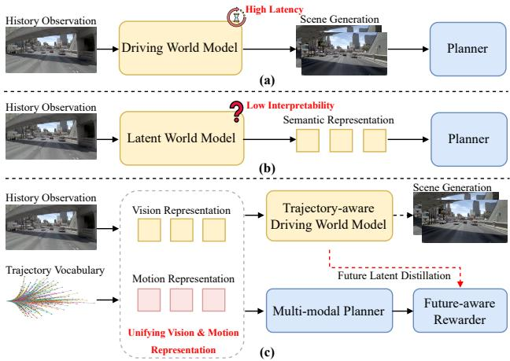
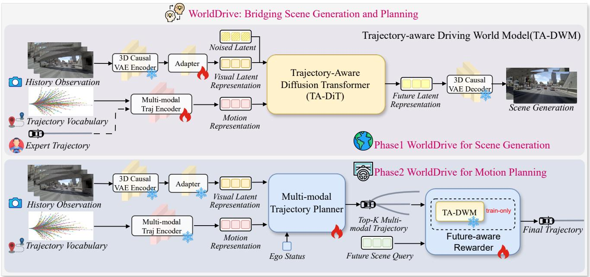
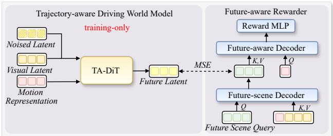
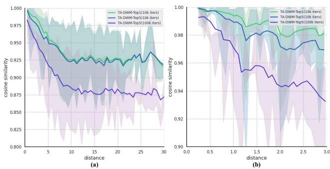
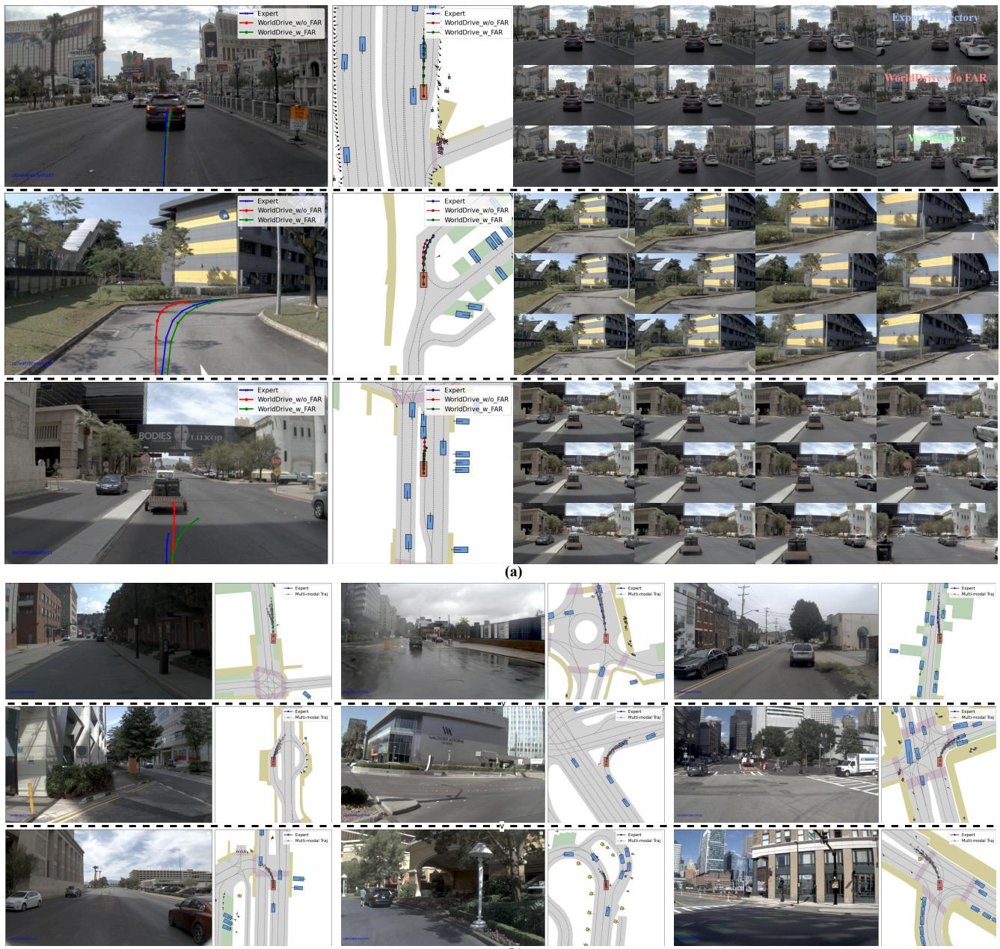
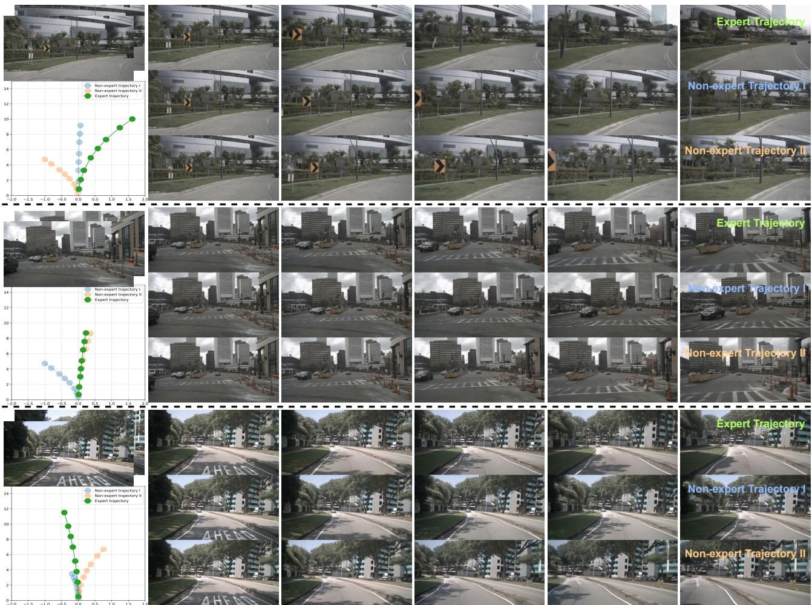
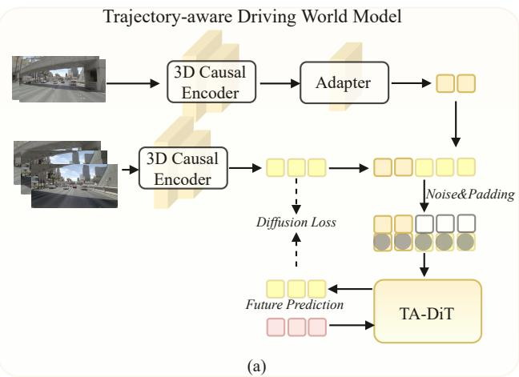
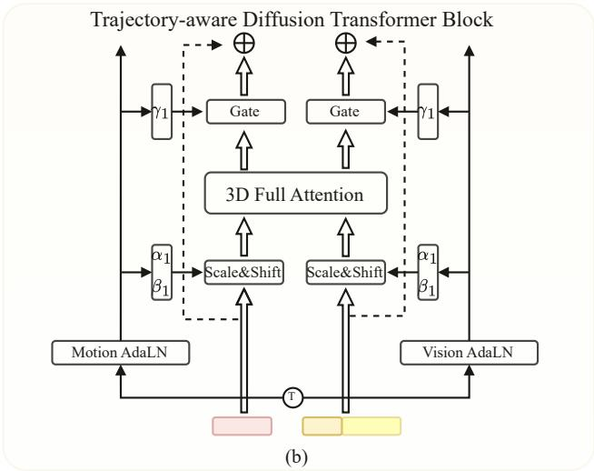
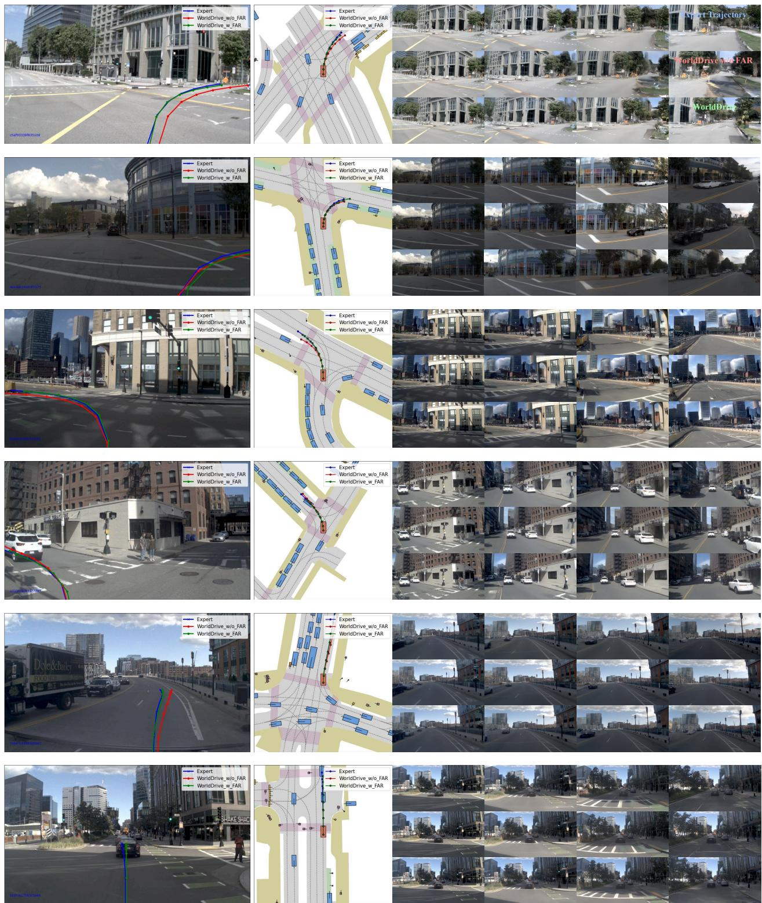
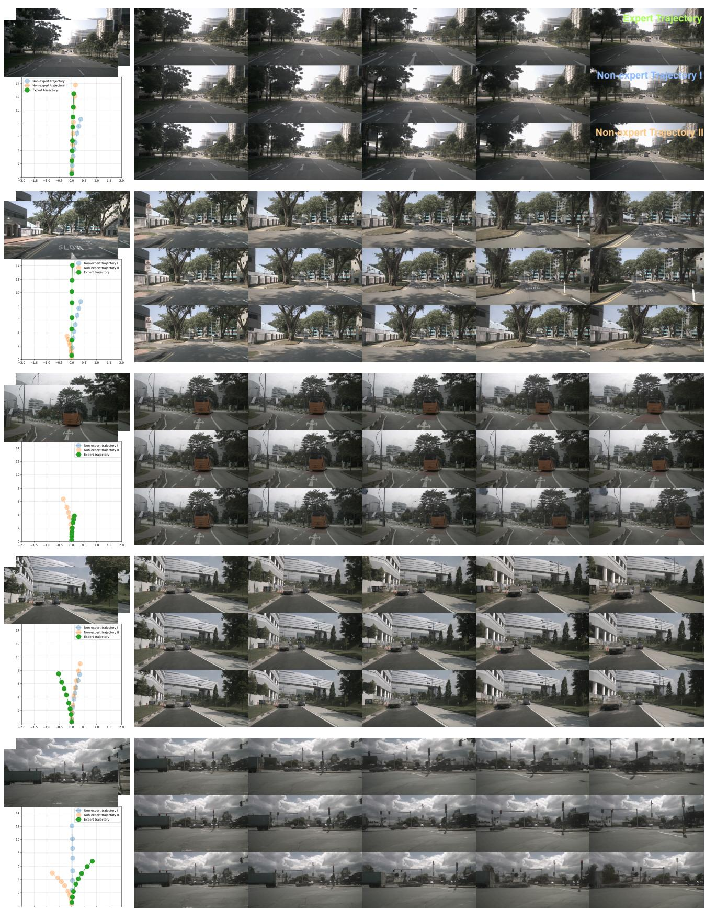

# Bridging Scene Generation and Planning: Driving with World Model via Unifying Vision and Motion Representation

Xingtai Gui1, Meijie Zhang2, Tianyi Yan1, Wencheng Han1, Jiahao Gong2, Feiyang Tan2, Cheng-zhong Xu1, Jianbing Shen1∗ 1SKL-IOTSC, CIS, University of Macau, 2Afari Intelligent Drive

## Abstract

End-to-end autonomous driving aims to generate safe and plausible planning policiesfrom raw sensor input, and con structing an effective scene representation is a critical challenge. Driving world models have shown great potential in learning rich representations by predicting the future evolution of a driving scene. However, existing driving world models primarily focus on visual scene representa tion, and motion representation is not explicitly designed to be planner-shared and inheritable, leaving a schism between the optimization of visual scene generation and the requirements ofprecise motion planning. We present World-Drive, a holistic framework that couples scene generation and real-time planning via unifying vision and motion rep resentation. We first introduce a Trajectory-aware Driving World Model, which conditions on a trajectory vocabulary to enforce consistency between visual dynamics and motion intentions, enabling the generation of diverse and plausi ble future scenes conditioned on a specific trajectory. We transfer the vision and motion encoders to a downstream Multi-modal Planner, ensuring the driving policy operates on mature representations pre-optimized by scene generation. A simple interaction between motion representation, visual representation, and ego status can generate high quality, multi-modal trajectories. Furthermore, to exploit the world model’sforesight, we propose a Future-aware Rewarder, which distills future latent representation from the frozen world model to evaluate and select optimal trajecto ries in real-time. Extensive experiments on the NAVSIM, NAVSIM-v2, and nuScenes benchmarks demonstrate that WorldDrive achieves leading planning performance among vision-only methods while maintaining high-fidelity actioncontrolled video generation capabilities, providing strong evidence for the effectiveness of unifying vision and motion representation for robust autonomous driving. The code is available at https://github.com/TabGuigui/WorldDrive.

  
Figure 1. World models for end-to-end autonomous driving. (a) Planning with future scenes generated by a driving world model. (b) Planning with semantic representation extracted from a latent world model. (c) WorldDrive bridges planning and driving world model via unifying vision and motion representation.

## 1. Introduction

End-to-end autonomous driving aspires to learn direct sensor-to-action policies [4, 7, 43], which hinges on effective visual representation learning [21, 38, 42, 60]. Propelled by recent breakthroughs in generative modeling, Driving World Models (DWMs) are emerging as a promising paradigm for autonomous driving [10, 13, 35]. By explicitly modeling the future scene evolution, DWMs provide a powerful foundation for forecasting the complex driving environments and downstream tasks.

Leveraging this predictive capability, the representation learned by DWMs holds immense potential for end-toend planning. Current integration strategies generally follow two main paradigms. One approach leverages highfidelity models to generate future scenes for downstream planners [27, 48, 56, 59]. However, this process incurs prohibitive computational costs. To mitigate this overhead, a second paradigm operates entirely within a latent world model [29, 53, 61]. Although more efficient, this approach sacrifices interpretable scene simulation and limits explicit visual verification that is valuable for safety-critical decision-making. Crucially, we identify a systemic limitation pervading both strategies: representation misalignment and task disconnection. Scene simulators are typically optimized for perceptual reconstruction, emphasizing vision representation, whereas planners are trained in isolation for action regression to encode motion representation. This lack of a unified representation — one that is shared and consistent across both scene generation and planning tasks — prevents the planner from fully leveraging the generative driving world model’s learned dynamics and motion priors.

To bridge this gap, we introduce WorldDrive, a holistic framework designed to synergize end-to-end planning with scene generation via unifying vision and motion representation. The core philosophy of WorldDrive is representation unification: we posit that the latent features capable of generating the future (scene generation) should be the same features used to decide the future (planning). To this end, we first propose a Trajectory-aware Driving World Model (TA-DWM). Unlike prior works that treat motion as a superficial condition, TA-DWM employs a multi-modal trajectory encoding scheme built on predefined trajectory anchors to construct a structured latent space where visual dynamics are intrinsically coupled with motion intentions.

This design enables representation inheritance: the robust vision and motion encoders learned by the TA-DWM are directly transferred to initialize the downstream planner. This ensures that the planner operates in a mature and consistent latent space pre-aligned by the future scene generation task. Building upon this unified representation, we design a lightweight Multi-modal Planner. Leveraging these frozen encoders, the planner uses a query-centric cross-attention mechanism to efficiently fuse historical visual context with structured motion priors, generating diverse and high-quality trajectory candidates.

To harness the predictive foresight of the world model while avoiding the high latency of explicit video generation, we further introduce the Future-aware Rewarder (FAR). Although TA-DWM is capable of synthesizing future videos, executing this generative process for every trajectory candidate is computationally prohibitive. Instead, the FAR employs a planning-oriented distillation mechanism to directly distill the future latents from the frozen world model. This approach enables WorldDrive to evaluate candidate trajectories based on their corresponding distilled future latent. This effectively aligns the planner’s selection with the world model’s learned dynamics while maintaining real-time inference speeds suitable for onboard deployment.

The main contributions of our work can be summarized as follows:

• We introduce a novel trajectory-aware driving world model (TA-DWM) that unifies the vision and motion representation. This design enables action-controllable future scene generation, producing plausible futures that are physically consistent with the conditioning trajectory.

• Leveraging the powerful representation learned by TA-DWM, we design a lightweight multi-modal planner that effectively fuses vision and motion cues. We also introduce a future-aware rewarder module that leverages the TA-DWM’s foresight without the latency of explicit video generation, enabling real-time re-scoring of trajectory candidates at inference.

• We integrate these components into WorldDrive, a holistic framework that bridges the representational schism between visual simulation and trajectory planning. Its design enables two capabilities: high-fidelity, motionconsistent future scene generation, and multi-modal, realtime planning.

• We provide extensive evidence that WorldDrive achieves state-of-the-art WM-based end-to-end planning performance on NAVSIM, NAVSIM-v2, and nuScenes while concurrently achieving high-fidelity performance on conditional scene generation tasks.

## 2. Related Works

## 2.1. End-to-end Autonomous Driving

End-to-end autonomous driving aims to directly generate motion planning from raw sensor inputs and has attracted increasing research attention [4, 7, 16, 20]. Most end-to-end autonomous driving systems follow a general framework that integrates perception, prediction, and planning in a cascaded [21, 55] or parallel manner [8, 49] with a structured BEV feature [14, 33, 34, 36]. To reduce the reliance on dense BEV features, several works have proposed the use of sparse representations [23, 24, 42, 57]. Leveraging driving priors, VADv2 [5] introduced a trajectory vocabulary as a prior for trajectory sampling. Building on this, Hydra-MDP [32] further distilled rule-based information. Additionally, DiffusionDrive [36] proposed a trajectory diffusion framework based on the trajectory vocabulary to accelerate the denoising process, and WoTE [31] utilized the trajectory anchor and future BEV state prediction to enhance the driving performance.

## 2.2. Driving World Models

Driving world models aim to predict the scene evolution from observations [10, 13, 25, 44] and have shown great potential for generating long-horizon [11, 12, 15], highfidelity [26, 47, 50], and corner-case data [40, 41, 46]. Although these methods are capable of generating driving scenarios, driving world models need to simulate reasonable scenarios based on motion conditions [17, 19, 22, 51]. Vista [12] achieved strong dynamic modeling by utilizing a larger volume of driving scenario data and introducing a motion loss. Building on this, DriVerse [28] realized trajectory-specific video generation by encoding trajectories as textual prompts and motion priors, and incorporated a motion alignment module. ReSim [52] enriched realworld human demonstrations with diverse non-expert data collected from a driving simulator. DrivingGPT [6] and Epona [58] introduced a discrete action representation at each timestep on top of an autoregressive video generation framework, enabling controllable trajectory generation.

  
Figure 2. Overall architecture of WorldDrive. WorldDrive is a holistic framework unifying vision and motion representation to bridge scene generation and planning. The training process includes Phase 1: WorldDrive for scene generation and Phase 2: WorldDrive for motion planning. The vision and motion representations are optimized through the scene generation task. In the planning stage, the planner utilizes the frozen vision and trajectory encoders and outputs top-K multi-modal trajectories. A future-aware rewarder is further designed to select the optimal trajectory from the candidates.

## 2.3. World Model for Planning

Research on optimizing planning policy using the world model has begun to show potential due to the strong representation capability [10, 13, 35]. Drive-WM [48] was the first work to introduce the driving world model into end-toend planning. It used predicted trajectories as conditions for future scenario prediction and combined perception modules to evaluate scenario safety. FSDrive [56] proposed a visual chain-of-thought pipeline for future scene generation and planning. DrivingGPT [6] and Epona [58] used discrete and continuous autoregressive models to unify the generation of driving scenarios and driving trajectories, respectively. PWM [59] and DriveVLA-W0 [30] coupled trajectory planning with world simulation via action-free future state forecasting. Considering the high cost and latency of scene generation, latent world model methods, such as LAW [29], World4Drive [61], and WorldRFT [53], demonstrated that effective scene representation can still be learned via self-supervision in latent space.

## 3. Method

As depicted in Fig. 2, WorldDrive bridges scene generation and planning by unifying vision and motion representation within a holistic framework. The system operates in two distinct yet coupled phases: Visual Simulation and Trajectory Optimization. In Phase 1, we develop a Trajectory-aware Driving World Model (TA-DWM), employing a Trajectory-aware Diffusion Transformer (TA-DiT) to synthesize future scenes. In Phase 2, the system transitions to planning. We inherit the frozen visual and trajectory encoders from Phase 1 to extract effective vision and motion representation. A learnable Multi-modal Trajectory Planner then generates diverse and high-quality trajectory candidates. A Future-aware Rewarder (FAR) further identifies the optimal trajectory considering the predicted future scene latent representations.

## 3.1. Trajectory-aware Driving World Model

The trajectory-aware driving world model (TA-DWM) builds upon a powerful video diffusion model, and we adapt it with a trajectory vocabulary as motion priors. As shown in Phase 1 of Fig. 2, we utilize a pre-trained 3D Causal VAE encoder to encode the historical observation $x \in$ $\mathbb { R } ^ { T \times 3 \times H \times W }$ . To align the generic features with the driving domain, we introduce a lightweight and trainable visual adapter. The spatio-temporal visual latent f is obtained as $f = \mathcal { E } _ { \mathrm { v i s } } ( x )$ where $f \in \mathbb { R } ^ { C \times H ^ { \prime } \times W ^ { \prime } }$ To incorporate precise motion control, we propose a Multi-modal Trajectory Encoder that decomposes complex driving behaviors into coarse intentions and fine-grained adjustments. We first construct a trajectory vocabulary $\boldsymbol { \mathcal { V } } \in \mathbb { R } ^ { N \times F \times 3 }$ by clustering a large corpus of driving logs, where each primitive serves as a motion anchor. Given an expert trajectory $Y$ , we retrieve the top-K nearest anchors $\nu _ { K }$ from the vocabulary and compute the residuals to capture motion details. The final motion embedding c is derived by fusing the anchor embeddings with the corresponding residual embeddings:

$$
c = { \mathcal E } _ { a } ( { \mathcal V } _ { K } ) + { \mathcal E } _ { o } ( Y - { \mathcal V } _ { K } ) ,\tag{1}
$$

where ${ \mathcal { E } } _ { a }$ and ${ \mathcal { E } } _ { o }$ denote the anchor encoder and offset encoder, respectively. The resulting embedding $c \in \mathbb { R } ^ { K \times C }$ serves as the condition for the diffusion model. The TA-DiT is designed to generate future latents conditioned on historical context and motion intentions. During training, the ground truth future frames $\bar { x }$ are encoded into the latent target $z _ { 0 } ~ = ~ \mathcal { E } _ { \mathrm { v i s } } ( \bar { x } )$ . We employ a standard forward diffusion process to obtain the noised state $z _ { t } .$ . The TA-DiT, $\epsilon _ { \theta } \big ( z _ { t } ; f , t , c \big )$ , is then optimized to predict the added noise. The historical latent $f$ and motion embedding c guide the generation to be both visually consistent and kinematically plausible. A detailed architectural illustration of the diffusion transformer is provided in the Appendix.

## 3.2. Multi-modal Trajectory Planner

Capitalizing on the structured latent space acquired in Phase 1, we initialize the planner by inheriting the frozen visual encoder and trajectory encoder from TA-DWM. This representation inheritance strategy ensures that the planner operates on effective and physically consistent features. To incorporate the vehicle state information, we employ a lightweight MLP to encode the ego status, including velocity, acceleration, and driving command into an embedding $\overset { \cdot } { e } \in \mathbb { R } ^ { 1 \times C }$

We formulate the trajectory planning as a set prediction problem. We treat the complete predefined anchor embeddings $Q _ { a } = { \mathcal { E } } _ { a } ( \nu )$ as queries. The context keys and values are constructed by concatenating the frozen visual latent $f$ and the ego embedding e. Through the attention mechanism, the planner aggregates relevant environmental context for each potential motion primitive:

$$
Q _ { p } = { \mathcal { D } } _ { \operatorname { p l a n } } \bigl ( Q _ { a } , [ f , e ] , [ f , e ] \bigr ) ,\tag{2}
$$

where $[ \cdot , \cdot ]$ denotes concatenation along the sequence dimension, $\mathcal { D } _ { \mathrm { p l a n } }$ is the planning transformer decoder and $Q _ { p }$ represents the enriched trajectory features.

  
Figure 3. Detailed illustration of Future-aware Rewarder. During training, the frozen world model generates future latents. A distillation mechanism aligns the future scene queries with the generated future latents. During the inference phase, the distilled scene features are directly queried by the motion representation to compute future-aware rewards.

Adhering to the scoring paradigm of [31], we employ an imitation reward model $\mathcal { D } _ { \mathrm { i m } }$ and a simulation reward model $\mathcal { D } _ { \mathrm { s i m } }$ to estimate the imitation reward and simulation reward of all trajectory anchors, and a regression network $\mathcal { D } _ { \mathrm { r e g } }$ to predict the fine-grained offsets.

Embracing the inherent multi-modality of driving scenarios, the planner outputs top-K trajectories $\hat { \mathcal { V } } _ { K }$ by selecting the anchors with the highest top-K combined scores and refining them via the predicted offsets. This strategy ensures the generation of a diverse trajectory distribution covering various plausible behaviors, thereby providing a comprehensive trajectory candidate set for the subsequent Future-aware Rewarder module.

## 3.3. Driving with Future-aware Rewarder

While TA-DWM can synthesize future latents $\{ z ^ { k } \} _ { k = 1 } ^ { K }$ for each trajectory candidate, performing the full denoising process for all candidates is computationally prohibitive for real-time planning [48, 56]. To circumvent this bottleneck while retaining the benefits of predictive foresight, we propose the Future-aware Rewarder (FAR). As shown in Fig. 3, the future latent generator (TA-DiT) is used only during training, and FAR is trained to distill the planningrelevant future latents from TA-DiT, thereby bypassing diffusion sampling at inference.

FAR introduces a set of learnable Future Scene Queries $Q _ { s } ~ \in ~ \mathbb { R } ^ { M \times C }$ as an information bottleneck for extracting planning-relevant future features. We employ a Futurescene Decoder that interacts with the shared context historical visual latent f and trajectory candidate embedding $c ^ { k }$ via cross-attention as:

$$
\hat { z } ^ { k } = \mathcal { D } _ { \mathrm { s c e n e } } ( Q _ { s } , [ f , c ^ { k } ] , [ f , c ^ { k } ] ) .\tag{3}
$$

During training, we align $\hat { z } ^ { k }$ with the target future latents $z ^ { k }$ , and this design allows the lightweight decoder to effectively distill planning-relevant dynamics generated from the

world model. A Future-aware Decoder then queries the distilled features using the trajectory embedding:

$$
\begin{array} { r } { h _ { f } ^ { k } = \mathcal { D } _ { \mathrm { f u t u r e } } ( c ^ { k } , \hat { z } ^ { k } , \hat { z } ^ { k } ) , } \end{array}\tag{4}
$$

where $h _ { f } ^ { k }$ is the future state feature for the corresponding trajectory candidate. Finally, an MLP maps $h _ { f } ^ { k }$ to a scalar reward $r _ { k } .$ , and we select the trajectory with the highest reward. By decoupling feature distillation from the heavy generation process, WorldDrive achieves real-time inference latency while ensuring that planning decisions are informed by future constraints.

## 3.4. Training Loss

We adopt a decoupled two-stage training curriculum to ensure the stable convergence of both the video diffusion transformer and the planning module. The first stage focuses exclusively on optimizing the TA-DWM to learn the latent dynamics conditioned on historical context f and expert motion c. The objective follows the standard latent diffusion formulation:

$$
\mathcal { L } _ { \mathrm { w o r l d } } = \mathbb { E } _ { z _ { 0 } , t , \epsilon } \left[ \Vert \epsilon - \epsilon _ { \theta } ( z _ { t } ; f , t , c ) \Vert _ { 2 } ^ { 2 } \right] ,\tag{5}
$$

where $\epsilon \sim \mathcal { N } ( 0 , \bf { I } )$ denotes the sampled Gaussian noise.

In the second stage, we freeze the world model and optimize the multi-modal trajectory planner. We adhere to the supervision paradigm proposed in [31]. The objective ${ \mathcal { L } } _ { \mathrm { p l a n } }$ combines a cross-entropy imitation loss, a binary crossentropy simulation loss, and an L1 regression loss for offset refinement of positive samples into a unified objective. Detailed definitions of the simulation and imitation targets are provided in the Appendix.

The training of FAR is governed by two complementary objectives: a feature distillation loss for latent alignment and a preference ranking loss for trajectory selection. First, to align the lightweight decoder with the world model’s foresight, we minimize the L2 distance between the predicted features $\hat { z } ^ { k }$ and the target features $z ^ { k }$ generated by the frozen TA-DWM:

$$
\mathcal { L } _ { \mathrm { a l i g n } } = \mathbb { E } _ { k } \left[ \| \hat { \boldsymbol { z } } ^ { k } - \mathbf { S } \mathbf { G } ( \boldsymbol { z } ^ { k } ) \| _ { 2 } ^ { 2 } \right] ,\tag{6}
$$

where $\operatorname { S G } ( \cdot )$ denotes the stop-gradient operator. For the scalar reward r, we model the trajectory selection as a preference ranking problem using the Bradley-Terry (BT) loss [39]. We construct preference pairs by contrasting the $v _ { p o s }$ against suboptimal candidates $v _ { n e g }$ in the top-K candidates using an oracle driving score. The optimization objective is to maximize the likelihood that the positive sample achieves a higher reward score as:

$$
\begin{array} { r } { \mathcal { L } _ { \mathrm { r e w a r d } } = - \mathbb { E } _ { ( v _ { \mathrm { p o s } } , v _ { \mathrm { n e g } } ) \sim \hat { \mathcal { V } } _ { K } } \left[ \log \sigma \left( r _ { \mathrm { p o s } } - r _ { \mathrm { n e g } } \right) \right] , } \end{array}\tag{7}
$$

where $\sigma ( \cdot )$ is the sigmoid function. By minimizing $\mathcal { L } _ { \mathrm { r e w a r d } } ,$ FAR learns a scoring function that effectively discriminates between candidate trajectories.

## 4. Experiments

## 4.1. Evaluation on Trajectory Planning

For the end-to-end planning task, we use the NAVSIM [9], NAVSIM-v2 [3] and nuScenes [1] benchmarks to evaluate the planning performance. NAVSIM utilizes the Predictive Driver Model Score (PDMS) as the closed-loop planning metric, which includes five sub-scores: no-at-fault collisions (NC), drivable area compliance (DAC), time-tocollision (TTC), comfort (Comf.), and ego progress (EP). NAVSIM-v2 further introduces reactive traffic with pseudo closed-loop simulation, and extends PDMS with additional compliance and comfort metrics, including traffic light compliance (TLC), driving direction compliance (DDC), lane keeping (LK), history comfort (HC), and extended comfort (EC). Together, these metrics provide a more comprehensive assessment of closed-loop driving behavior. We also utilize the nuScenes benchmark for a supplementary comparison to evaluate the performance of WorldDrive. We employ the L2 distance error and the collision rate as metrics to assess the performance of open-loop planning.

## 4.2. Evaluation on Scene Generation

To assess the generation quality of the TA-DWM, we evaluate on the nuScenes validation split. Following common practices, we employ Frechet Inception Distance (FID) [´ 18] and Frechet Video Distance [ ´ 45] to quantify the quality of generated scenes. Additionally, we conduct a quantitative analysis to evaluate the model’s sensitivity to various motion controls.

## 4.3. Implementation Details

We initialize the 3D VAE and DiT from CogVideoX pretrained weights [54]. We construct the trajectory vocabulary using K-means clustering and set the number of trajectory anchors to 256, following WoTE [31]. The visual adapter and multi-modal trajectory encoder in the planner are inherited from the pretrained TA-DWM. In Phase 1, the TA-DWM is trained on a combined dataset of driving videos from nuPlan [2] and nuScenes [1]. Optimization is performed on 16 NVIDIA A100 GPUs with a batch size of 32. In Phase 2, we freeze the encoders and train the planner for 50 epochs on the NAVSIM navtrain split using 8 NVIDIA 3090 GPUs with a batch size of 256. To train FAR, we freeze the trajectory planner and optimize FAR for 10 epochs using PDMS as the oracle for preference supervision. At inference time, WorldDrive does not perform explicit future scene generation, enabling real-time planning. Additional implementation details are provided in the supplementary material.

<table><tr><td>Method</td><td>Sensors</td><td>WM-Based</td><td>NC</td><td>DAC</td><td>TTC</td><td>Comf.</td><td>EP</td><td>PDMS</td></tr><tr><td>TransFuser [8]</td><td>MV&amp;L</td><td>X</td><td>97.7</td><td>92.8</td><td>92.8</td><td>100.0</td><td>79.2</td><td>84.0</td></tr><tr><td>Hydra-MDP [32]</td><td>MV&amp;L</td><td>X</td><td>98.3</td><td>96.0</td><td>94.6</td><td>100.0</td><td>78.7</td><td>86.5</td></tr><tr><td>DiffusionDrive [36]</td><td>MV&amp;L</td><td>X</td><td>98.2</td><td>96.2</td><td>94.7</td><td>100.0</td><td>82.2</td><td>88.1</td></tr><tr><td>WoTE [31]</td><td>MV&amp;L</td><td>V</td><td>98.5</td><td>96.8</td><td>94.9</td><td>99.9</td><td>81.9</td><td>88.3</td></tr><tr><td>UniAD [21]</td><td>MV</td><td>X</td><td>97.8</td><td>91.9</td><td>92.9</td><td>100.0</td><td>78.8</td><td>83.4</td></tr><tr><td>PARA-Drive [49]</td><td>MV MV</td><td>X</td><td>97.9</td><td>92.4</td><td>93.0</td><td>99.8</td><td>79.3</td><td>84.0</td></tr><tr><td>LAW [29]</td><td></td><td>V</td><td>96.4</td><td>95.4</td><td>88.7</td><td>99.9</td><td>81.7</td><td>84.6</td></tr><tr><td>World4Drive [61]</td><td>MV</td><td>V</td><td>97.4</td><td>94.3</td><td>92.8</td><td>100.0</td><td>79.9</td><td>85.1</td></tr><tr><td>FSDrive [56]</td><td>MV SV</td><td>V</td><td>98.2</td><td>93.8</td><td>93.3</td><td>99.9</td><td>80.1</td><td>85.1</td></tr><tr><td>DrivingGPT [6]</td><td>SV</td><td>V</td><td>98.9</td><td>90.7</td><td>94.9</td><td>95.6</td><td>79.7</td><td>82.4</td></tr><tr><td>Epona [58]</td><td>SV</td><td>V</td><td>97.9</td><td>95.1</td><td>93.8</td><td>99.9</td><td>80.4</td><td>86.2</td></tr><tr><td>ImagiDrive [27]</td><td>SV</td><td>V</td><td>98.6</td><td>96.2</td><td>94.5</td><td>100.0</td><td>80.5</td><td>87.4</td></tr><tr><td>WorldDrive</td><td></td><td>√</td><td>98.4</td><td>96.2</td><td>95.1</td><td>100.0</td><td>81.9</td><td>88.1</td></tr><tr><td>PWM [59]†</td><td>SV SV</td><td>V</td><td>98.6</td><td>95.9</td><td>95.4</td><td>100.0</td><td>81.8</td><td>88.1</td></tr><tr><td>DriveVLA-W0 [30]†</td><td>SV</td><td>V</td><td>98.7</td><td>96.2</td><td>95.5</td><td>100.0</td><td>82.2</td><td>88.4</td></tr><tr><td>WorldDrive†</td><td></td><td>√</td><td>98.4</td><td>96.8</td><td>95.2</td><td>100.0</td><td>83.3</td><td>89.0</td></tr><tr><td>DriveVLA-W0↓</td><td>SV</td><td>V</td><td>99.3</td><td>97.4</td><td>97.0</td><td>100.0</td><td>88.3</td><td>93.0</td></tr><tr><td>WorldDrive</td><td>SV</td><td>√</td><td>99.3</td><td>98.8</td><td>97.9</td><td>100.0</td><td>88.3</td><td>93.6</td></tr></table>

Table 1. NAVSIM navtest split comparison. PDMS and sub-scores reflecting closed-loop performance. MV: multi-view cameras; SV: single-view camera; L: LiDAR. †: Training with full navtrain split. ‡: Best-of-6 performance with oracle.
<table><tr><td>Method</td><td>Sensors</td><td>Stage</td><td>NC</td><td>DAC</td><td>DDC</td><td>TLC</td><td>EP</td><td>TTC</td><td>LK</td><td>HC</td><td>EC</td><td>EPDMS</td></tr><tr><td>LTF[8]</td><td>MV</td><td>S1 S2</td><td>96.2 77.7</td><td>79.5 70.2</td><td>99.1 84.2</td><td>99.5 98.0</td><td>84.1 85.1</td><td>95.1 75.6</td><td>94.2 45.4</td><td>97.5 95.7</td><td>79.1 75.9</td><td>23.1</td></tr><tr><td>DiffusionDrive[36]</td><td>MV</td><td>S1 S2</td><td>96.8 80.1</td><td>86.0 72.8</td><td>98.8 84.4</td><td>99.3 98.4</td><td>84.0 85.9</td><td>95.8 76.6</td><td>96.7 46.4</td><td>97.6 96.3</td><td>79.6 72.8</td><td>27.5</td></tr><tr><td>WorldDrive</td><td>SV</td><td>S1 S2</td><td>97.3 91.4</td><td>89.1 82.0</td><td>97.6 91.0</td><td>99.7 98.5</td><td>60.5 53.1</td><td>96.8 90.6</td><td>87.7 52.3</td><td>93.1 93.3</td><td>60.0 62.8</td><td>34.9</td></tr></table>

Table 2. NAVSIM-v2 navhard split comparison. EPDMS and sub-scores reflecting closed-loop performance. MV: multi-view cameras; SV: single-view camera.

## 4.4. WorldDrive on Trajectory Planning

Performance comparison with SOTA methods. Table 1 compares WorldDrive with state-of-the-art methods on the NAVSIM navtest split. WorldDrive achieves the best PDMS among vision-only methods. Despite relying on a singleview camera, it achieves a PDMS of 88.1, surpassing the previous best single-view method ImagiDrive [27] and Epona [58] and also outperforms leading multi-view approaches such as FSDrive [56] and World4Drive [61]. Notably, our single-view vision-only framework is competitive with multi-modal methods such as DiffusionDrive [36] and WoTE [31]. When trained on the full navtrain split, WorldDrive further improves PDMS to 89.0 and outperforms the strong world model baseline PWM [59] and DriveVLA-W0 [30]. In the best-of-N setting, we use the oracle scorer to select the best trajectory from six candidates to investigate the upper bound, and WorldDrive achieves 93.6 PDMS. This oracle result is reported only to probe the upper bound and to verify that WorldDrive generates a multi-modal candidate set, and it is not used for inference.

Table 2 reports results on NAVSIM-v2 navhard split using EPDMS and its sub-metrics under reactive traffic and pseudo closed-loop simulation. WorldDrive achieves the best EPDMS using only a single-view camera, outperforming multi-view baselines such as LTF and DiffusionDrive. The gains are consistent across most compliance and safetyrelated sub-metrics. We observe that some comfort-related metrics remain challenging, suggesting further effort for improving long-horizon efficiency while preserving safety.

As a supplementary evaluation, we present a comparison on nuScenes in Table 3. Within the world modelbased methods, WorldDrive demonstrates highly competitive results. These results corroborate the effectiveness of our framework, confirming that the synergistic optimization of visual and motion representations within the TA-DWM translates into robust planning capabilities.

<table><tr><td>Method</td><td>Sensors</td><td>L2 (m) ↓ 3s Avg.</td><td>3s</td><td>CR (%) ↓ Avg.</td></tr><tr><td>UniAD [21] VAD [24]</td><td>V V</td><td>1.04 1.05</td><td>0.73 0.63 0.72 0.43</td><td>0.61 0.21</td></tr><tr><td>SparseDrive [42] LAW [29]</td><td>V</td><td>0.96</td><td>0.61</td><td>0.18 0.08</td></tr><tr><td>World4Drive [61]</td><td>V V</td><td>1.01 0.81</td><td>0.61 0.54 0.33</td><td>0.30 0.16</td></tr><tr><td>Drive-WM [48]</td><td>V</td><td></td><td>0.50</td><td></td></tr><tr><td></td><td></td><td>1.20</td><td>0.80</td><td>0.48 0.26</td></tr><tr><td>Epona [58]</td><td>SV</td><td>1.98</td><td>1.25</td><td>0.85 0.36</td></tr><tr><td>WorldDrive</td><td>SV</td><td></td><td></td><td></td></tr><tr><td></td><td></td><td>0.68</td><td>0.42</td><td>0.38 0.16</td></tr></table>

Table 3. nuScenes validation split open-loop planning comparison. We follow the SparseDrive evaluation metric. V: multi-view camera; SV: single-view camera
<table><tr><td>VAE Pretrain</td><td>TA-DWM TA-DWM Vision</td><td>Motion</td><td>NC DAC TTC</td><td>EP</td><td>PDMS</td></tr><tr><td>×</td><td>X</td><td>X</td><td>69.0 57.6 57.2</td><td>28.7</td><td>31.4</td></tr><tr><td>√</td><td>X</td><td>X</td><td>97.6 93.6 93.2</td><td>79.5</td><td>84.9</td></tr><tr><td>√</td><td>√</td><td>X</td><td>97.9 94.1 93.3</td><td>80.7</td><td>85.8</td></tr><tr><td>√</td><td>√</td><td>√</td><td>98.4 95.1 94.7</td><td>80.4</td><td>86.9</td></tr></table>

Table 4. Planner with different pretrained representation. “VAE Pretrain” means initializing with the 3D VAE weights from CogVideoX. “TA-DWM Vision” and “TA-DWM Motion” mean initializing the vision and motion encoders from TA-DWM.

Impact of Pre-training Strategy. Table 4 dissects the benefits of the pre-training curriculum in WorldDrive. Training the planner without any pre-trained representation leads to poor driving performance. Initializing with the 3D Causal VAE provides a foundational leap to 84.9 PDMS, highlighting the importance of strong visual priors from large-scale video pretraining. Crucially, inheriting the TA-DWM vision and motion representation yields a further improve ment of 0.9 and 1.1 PDMS. These step-wise gains provide evidence that TA-DWM pretraining aligns the vision and motion feature space with downstream planning requirements, improving both overall PDMS and most sub-metrics. Trajectory Rewarder Strategy Analysis. A central challenge in multi-modal planning is selecting the best trajectory from diverse candidates. Table 5 evaluates how different inputs contribute to the reward mechanism. Simply relying on trajectory features from planner yields a marginal gain, and while efficiency improves, safety metrics slightly degrade. Incorporating FAR with distilled future latents substantially improves overall performance while simultaneously increasing both safety and efficiency.

<table><tr><td>Traj feat.</td><td>Future feat.</td><td>NC</td><td>DAC</td><td>TTC</td><td>EP</td><td>PDMS</td></tr><tr><td>X</td><td>X</td><td>98.4</td><td>95.1</td><td>94.7</td><td>80.4</td><td>86.9</td></tr><tr><td>√</td><td>X</td><td>98.3</td><td>95.3</td><td>94.3</td><td>81.2</td><td>87.0</td></tr><tr><td>√</td><td>√</td><td>98.4</td><td>96.2</td><td>95.1</td><td>81.9</td><td>88.1</td></tr></table>

Table 5. Future-aware rewarder design. “Traj feat.” means using candidate trajectory features from the planner. “Future feat.” means using future scene query and future latent distillation.
<table><tr><td>Method</td><td>NC</td><td>DAC</td><td>TTC</td><td>EP</td><td>PDMS</td><td>Latency</td></tr><tr><td>PWM†</td><td>98.0</td><td>95.1</td><td>94.1</td><td>82.4</td><td>87.3</td><td>570ms</td></tr><tr><td>PWM</td><td>98.6</td><td>95.9</td><td>95.4</td><td>81.8</td><td>88.1</td><td>850ms</td></tr><tr><td>WorldDrive</td><td>98.4</td><td>96.8</td><td>95.2</td><td>83.3</td><td>89.0</td><td>53ms</td></tr></table>

Table 6. Inference latency comparison. Latency is measured on a single NVIDIA A800 GPU. “†” means without future frame forecast.  
Figure 4. Quantitative Analysis of Motion Sensitivity. The similarity between scene representations is inversely correlated with the geometric distance. The sensitivity to both large (a) and small (b) deviations is amplified with further training.

Latency Analysis. Table 6 reports inference efficiency. DWM-based planners face a practical trade-off: incorporating future forecasts improves performance but increases inference latency. WorldDrive avoids this by distilling future latents during training and eliminating explicit future scene generation at inference. WorldDrive achieves strong planning performance with low latency, meeting real-time requirements while retaining benefits of predictive foresight.

## 4.5. WorldDrive on Scene Generation

Generation Quality on nuScenes. Table 7 presents quantitative results on the nuScenes validation split. World-Drive attains this performance without relying on the massive training data [12] or additional motion-alignment modules [28], suggesting that robust VAE priors combined with structured trajectory conditioning can yield high-fidelity simulations with a relatively simple design.

Motion sensitivity. To quantify the controllability of TA-

<table><tr><td>Metric</td><td>DriveDreamer [47]</td><td>WoVoGen [37]</td><td>GenAD [51]</td><td>Drive-WM [48]</td><td>Vista [12]</td><td>Driverse [28]</td><td>WorldDrive</td></tr><tr><td>Resolution</td><td>128×192</td><td>256×448</td><td>256×448</td><td>192×384</td><td>480×832</td><td>480×832</td><td>256×512</td></tr><tr><td>FID</td><td>52.6</td><td>27.6</td><td>15.4</td><td>15.2</td><td>18.2</td><td>20.1</td><td>12.8</td></tr><tr><td>FVD</td><td>452.0</td><td>417.7</td><td>184.0</td><td>122.7</td><td>158.0</td><td>143.5</td><td>131.7</td></tr></table>

Table 7. nuScenes validation split generated videos comparison.

  
(b)  
Figure 5. Qualitative planning result of WorldDrive on NAVSIM navtest split. (a) Planning result and the corresponding generated future scene with different trajectories. (b) Top-10 Multi-modal planning trajectories.

DWM, we analyze the correlation between motion deviations and the variations of the generated latents. We compute the cosine similarity between latents conditioned on the expert trajectory and those conditioned on trajectory anchors. Fig. 4 shows a clear inverse correlation where latent similarity decreases as the geometric distance increases. Comparing the curves at 10k and 100k iterations reveals that longer training amplifies this sensitivity. We also study the impact of the multi-modal trajectory encoder. Top-5 conditioning consistently yields stronger discrimination than the Top-1 baseline, with the most pronounced improvement in the small-deviation regime (Fig. 4(b)).

  
Figure 6. Qualitative simulation result on nuScenes. Scenes are generated with three trajectory conditions: the expert trajectory (green), and non-expert alternatives. The results show a tight coupling between the input motion and the generated scenes.

## 4.6. Qualitative Results

Qualitative Results of Planning. Fig. 5 visualizes World-Drive’s planning behavior. The planner produces physically feasible trajectories, but the base policy can deviate in challenging cases. With FAR enabled, WorldDrive re-scores candidates using distilled future information and selects a safer trajectory. As shown in the visual simulation panels, TA-DWM can be selectively invoked to generate future scenes for case analysis. Fig. 5 (b) further shows the multimodal trajectory predictions, providing qualitative evidence that the unified representation supports diverse yet feasible planning behaviors.

Qualitative Results of Scene Generation. We qualitatively evaluate TA-DWM by visualizing future scenes generated under different motion conditions in Fig. 6. We condition on the expert trajectory and two counterfactual trajectories. The results show that the generated futures closely follow the specified motion, producing plausible sequences even for counterfactual intentions such as heading toward a nondrivable area or approaching a key traffic participant.

## 5. Conclusion

We present WorldDrive, a unified framework that bridges the representational gap between scene generation and planning. By introducing the Trajectory-aware Driving World Model, we establish a feature space where visual dynamics are coupled with motion intentions. Building on this unified representation, we introduce representation inheritance that initializes a lightweight planner with mature features learned from scene generation. We further propose the Future-aware Rewarder, which leverages DWM foresight while maintaining real-time inference. Extensive experiments show that WorldDrive achieves strong planning performance and supports action-controllable scene synthesis. We hope this work inspires future research on generative world models as a foundation for safe and interpretable autonomous driving.

## References

[1] Holger Caesar, Varun Bankiti, Alex H Lang, Sourabh Vora, Venice Erin Liong, Qiang Xu, Anush Krishnan, Yu Pan, Giancarlo Baldan, and Oscar Beijbom. nuscenes: A multimodal dataset for autonomous driving. In Proceedings of the IEEE/CVF conference on computer vision and pattern recognition, pages 11621–11631, 2020. 5

[2] Holger Caesar, Juraj Kabzan, Kok Seang Tan, Whye Kit Fong, Eric Wolff, Alex Lang, Luke Fletcher, Oscar Beijbom, and Sammy Omari. nuplan: A closed-loop ml-based planning benchmark for autonomous vehicles. arXiv preprint arXiv:2106.11810, 2021. 5

[3] Wei Cao, Marcel Hallgarten, Tianyu Li, Daniel Dauner, Xunjiang Gu, Caojun Wang, Yakov Miron, Marco Aiello, Hongyang Li, Igor Gilitschenski, et al. Pseudo-simulation for autonomous driving. arXiv preprint arXiv:2506.04218, 2025. 5

[4] Li Chen, Penghao Wu, Kashyap Chitta, Bernhard Jaeger, Andreas Geiger, and Hongyang Li. End-to-end autonomous driving: Challenges and frontiers. IEEE Transactions on Pattern Analysis and Machine Intelligence, 2024. 1, 2

[5] Shaoyu Chen, Bo Jiang, Hao Gao, Bencheng Liao, Qing Xu, Qian Zhang, Chang Huang, Wenyu Liu, and Xinggang Wang. Vadv2: End-to-end vectorized autonomous driving via probabilistic planning. arXiv preprint arXiv:2402.13243, 2024. 2

[6] Yuntao Chen, Yuqi Wang, and Zhaoxiang Zhang. Drivinggpt: Unifying driving world modeling and planning with multi-modal autoregressive transformers. arXiv preprint arXiv:2412.18607, 2024. 3, 6

[7] Pranav Singh Chib and Pravendra Singh. Recent advancements in end-to-end autonomous driving using deep learning: A survey. IEEE Transactions on Intelligent Vehicles, 9 (1):103–118, 2023. 1, 2

[8] Kashyap Chitta, Aditya Prakash, Bernhard Jaeger, Zehao Yu, Katrin Renz, and Andreas Geiger. Transfuser: Imitation with transformer-based sensor fusion for autonomous driving. IEEE transactions on pattern analysis and machine intelligence, 45(11):12878–12895, 2022. 2, 6

[9] Daniel Dauner, Marcel Hallgarten, Tianyu Li, Xinshuo Weng, Zhiyu Huang, Zetong Yang, Hongyang Li, Igor Gilitschenski, Boris Ivanovic, Marco Pavone, et al. Navsim: Data-driven non-reactive autonomous vehicle simulation and benchmarking. Advances in Neural Information Processing Systems, 37:28706–28719, 2024. 5

[10] Tuo Feng, Wenguan Wang, and Yi Yang. A survey of world models for autonomous driving. arXiv preprint arXiv:2501.11260, 2025. 1, 2, 3

[11] Ruiyuan Gao, Kai Chen, Bo Xiao, Lanqing Hong, Zhenguo Li, and Qiang Xu. Magicdrive-v2: High-resolution long video generation for autonomous driving with adaptive con trol. arXiv preprint arXiv:2411.13807, 2024. 2

[12] Shenyuan Gao, Jiazhi Yang, Li Chen, Kashyap Chitta, Yi hang Qiu, Andreas Geiger, Jun Zhang, and Hongyang Li. Vista: A generalizable driving world model with high fidelity and versatile controllability. Advances in Neural Information Processing Systems, 37:91560–91596, 2024. 2, 7, 8

[13] Yanchen Guan, Haicheng Liao, Zhenning Li, Jia Hu, Runze Yuan, Guohui Zhang, and Chengzhong Xu. World models for autonomous driving: An initial survey. IEEE Transac tions on Intelligent Vehicles, 2024. 1, 2, 3

[14] Xingtai Gui, Jianbo Zhao, Wencheng Han, Jikai Wang, Jiahao Gong, Feiyang Tan, Cheng-zhong Xu, and Jianbing Shen. Trajdiff: End-to-end autonomous driving without perception annotation. arXiv preprint arXiv:2512.00723, 2025. 2

[15] Xi Guo, Chenjing Ding, Haoxuan Dou, Xin Zhang, Weix uan Tang, and Wei Wu. Infinitydrive: Breaking time limits in driving world models. arXiv preprint arXiv:2412.01522, 2024. 2

[16] Steffen Hagedorn, Marcel Hallgarten, Martin Stoll, and Alexandru Paul Condurache. The integration of prediction and planning in deep learning automated driving systems: A review. IEEE Transactions on Intelligent Vehicles, 10(5): 3626–3643, 2024. 2

[17] Mariam Hassan, Sebastian Stapf, Ahmad Rahimi, Pedro Rezende, Yasaman Haghighi, David Bruggemann, Isinsu¨ Katircioglu, Lin Zhang, Xiaoran Chen, Suman Saha, et al. Gem: A generalizable ego-vision multimodal world model for fine-grained ego-motion, object dynamics, and scene composition control. In Proceedings of the IEEE/CVF Con ference on Computer Vision and Pattern Recognition, pages 22404–22415, 2025. 2

[18] Martin Heusel, Hubert Ramsauer, Thomas Unterthiner, Bernhard Nessler, and Sepp Hochreiter. Gans trained by a two time-scale update rule converge to a local nash equilib rium. Advances in neural information processing systems, 30, 2017. 5

[19] Anthony Hu, Lloyd Russell, Hudson Yeo, Zak Murez, George Fedoseev, Alex Kendall, Jamie Shotton, and Gianluca Corrado. Gaia-1: A generative world model for autonomous driving. arXiv preprint arXiv:2309.17080, 2023. 2

[20] Tianshuai Hu, Xiaolu Liu, Song Wang, Yiyao Zhu, Ao Liang, Lingdong Kong, Guoyang Zhao, Zeying Gong, Jun Cen, Zhiyu Huang, et al. Vision-language-action models for autonomous driving: Past, present, and future. arXiv preprint arXiv:2512.16760, 2025. 2

[21] Yihan Hu, Jiazhi Yang, Li Chen, Keyu Li, Chonghao Sima, Xizhou Zhu, Siqi Chai, Senyao Du, Tianwei Lin, Wenhai Wang, et al. Planning-oriented autonomous driving. In Proceedings of the IEEE/CVF conference on computer vision

and pattern recognition, pages 17853–17862, 2023. 1, 2, 6, 7

[22] Fan Jia, Weixin Mao, Yingfei Liu, Yucheng Zhao, Yuqing Wen, Chi Zhang, Xiangyu Zhang, and Tiancai Wang. Adriver-i: A general world model for autonomous driving. arXiv preprint arXiv:2311.13549, 2023. 2

[23] Xiaosong Jia, Junqi You, Zhiyuan Zhang, and Junchi Yan. Drivetransformer: Unified transformer for scalable end-toend autonomous driving. arXiv preprint arXiv:2503.07656, 2025. 2

[24] Bo Jiang, Shaoyu Chen, Qing Xu, Bencheng Liao, Jiajie Chen, Helong Zhou, Qian Zhang, Wenyu Liu, Chang Huang, and Xinggang Wang. Vad: Vectorized scene representation for efficient autonomous driving. In Proceedings of the IEEE/CVF International Conference on Computer Vision, pages 8340–8350, 2023. 2, 7

[25] Lingdong Kong, Wesley Yang, Jianbiao Mei, Youquan Liu, Ao Liang, Dekai Zhu, Dongyue Lu, Wei Yin, Xiaotao Hu, Mingkai Jia, et al. 3d and 4d world modeling: A survey. arXiv preprint arXiv:2509.07996, 2025. 2

[26] Bohan Li, Jiazhe Guo, Hongsi Liu, Yingshuang Zou, Yikang Ding, Xiwu Chen, Hu Zhu, Feiyang Tan, Chi Zhang, Tiancai Wang, et al. Uniscene: Unified occupancy-centric driving scene generation. In Proceedings of the Computer Vision and Pattern Recognition Conference, pages 11971–11981, 2025. 2

[27] Jingyu Li, Bozhou Zhang, Xin Jin, Jiankang Deng, Xiatian Zhu, and Li Zhang. Imagidrive: A unified imagination-andplanning framework for autonomous driving. arXiv preprint arXiv:2508.11428, 2025. 1, 6

[28] Xiaofan Li, Chenming Wu, Zhao Yang, Zhihao Xu, Dingkang Liang, Yumeng Zhang, Ji Wan, and Jun Wang. Driverse: Navigation world model for driving simulation via multimodal trajectory prompting and motion alignment. arXiv preprint arXiv:2504.18576, 2025. 3, 7, 8

[29] Yingyan Li, Lue Fan, Jiawei He, Yuqi Wang, Yuntao Chen, Zhaoxiang Zhang, and Tieniu Tan. Enhancing end-to-end autonomous driving with latent world model. arXiv preprint arXiv:2406.08481, 2024. 2, 3, 6, 7

[30] Yingyan Li, Shuyao Shang, Weisong Liu, Bing Zhan, Haochen Wang, Yuqi Wang, Yuntao Chen, Xiaoman Wang, Yasong An, Chufeng Tang, et al. Drivevla-w0: World models amplify data scaling law in autonomous driving. arXiv preprint arXiv:2510.12796, 2025. 3, 6

[31] Yingyan Li, Yuqi Wang, Yang Liu, Jiawei He, Lue Fan, and Zhaoxiang Zhang. End-to-end driving with online trajectory evaluation via bev world model. arXiv preprint arXiv:2504.01941, 2025. 2, 4, 5, 6, 1

[32] Zhenxin Li, Kailin Li, Shihao Wang, Shiyi Lan, Zhiding Yu, Yishen Ji, Zhiqi Li, Ziyue Zhu, Jan Kautz, Zuxuan Wu, et al. Hydra-mdp: End-to-end multimodal planning with multitarget hydra-distillation. arXiv preprint arXiv:2406.06978, 2024. 2, 6

[33] Zhiqi Li, Wenhai Wang, Hongyang Li, Enze Xie, Chonghao Sima, Tong Lu, Qiao Yu, and Jifeng Dai. Bevformer: learning bird’s-eye-view representation from lidar-camera via spatiotemporal transformers. IEEE Transactions on Pattern Analysis and Machine Intelligence, 2024. 2

[34] Zhiqi Li, Zhiding Yu, Shiyi Lan, Jiahan Li, Jan Kautz, Tong Lu, and Jose M Alvarez. Is ego status all you need for openloop end-to-end autonomous driving? In Proceedings of the IEEE/CVF Conference on Computer Vision and Pattern Recognition, pages 14864–14873, 2024. 2

[35] Ao Liang, Lingdong Kong, Tianyi Yan, Hongsi Liu, Wesley Yang, Ziqi Huang, Wei Yin, Jialong Zuo, Yixuan Hu, Dekai Zhu, et al. Worldlens: Full-spectrum evaluations of driving world models in real world. arXiv preprint arXiv:2512.10958, 2025. 1, 3

[36] Bencheng Liao, Shaoyu Chen, Haoran Yin, Bo Jiang, Cheng Wang, Sixu Yan, Xinbang Zhang, Xiangyu Li, Ying Zhang, Qian Zhang, et al. Diffusiondrive: Truncated diffusion model for end-to-end autonomous driving. In Proceedings of the Computer Vision and Pattern Recognition Conference, pages 12037–12047, 2025. 2, 6

[37] Jiachen Lu, Ze Huang, Zeyu Yang, Jiahui Zhang, and Li Zhang. Wovogen: World volume-aware diffusion for controllable multi-camera driving scene generation. In Eu ropean Conference on Computer Vision, pages 329–345. Springer, 2024. 8

[38] Chen Min, Dawei Zhao, Liang Xiao, Jian Zhao, Xinli Xu, Zheng Zhu, Lei Jin, Jianshu Li, Yulan Guo, Junliang Xing, et al. Driveworld: 4d pre-trained scene understanding via world models for autonomous driving. In Proceedings of the IEEE/CVF conference on computer vision and pattern recognition, pages 15522–15533, 2024. 1

[39] Long Ouyang, Jeffrey Wu, Xu Jiang, Diogo Almeida, Carroll Wainwright, Pamela Mishkin, Chong Zhang, Sandhini Agarwal, Katarina Slama, Alex Ray, et al. Training language models to follow instructions with human feedback. Advances in neural information processing systems, 35:27730– 27744, 2022. 5

[40] Xuanchi Ren, Yifan Lu, Tianshi Cao, Ruiyuan Gao, Shengyu Huang, Amirmojtaba Sabour, Tianchang Shen, Tobias Pfaff, Jay Zhangjie Wu, Runjian Chen, et al. Cosmos-drivedreams: Scalable synthetic driving data generation with world foundation models. arXiv preprint arXiv:2506.09042, 2025. 2

[41] Haowei Sun, Xintao Yan, Zhijie Qiao, Haojie Zhu, Yihao Sun, Jiawei Wang, Shengyin Shen, Darian Hogue, Rajanikant Ananta, Derek Johnson, et al. Terasim: Uncovering unknown unsafe events for autonomous vehicles through generative simulation. arXiv preprint arXiv:2503.03629, 2025. 2

[42] Wenchao Sun, Xuewu Lin, Yining Shi, Chuang Zhang, Haoran Wu, and Sifa Zheng. Sparsedrive: End-to-end autonomous driving via sparse scene representation. In 2025 IEEE International Conference on Robotics and Automation (ICRA), pages 8795–8801. IEEE, 2025. 1, 2, 7

[43] Siyu Teng, Xuemin Hu, Peng Deng, Bai Li, Yuchen Li, Yunfeng Ai, Dongsheng Yang, Lingxi Li, Zhe Xuanyuan, Fenghua Zhu, et al. Motion planning for autonomous driving: The state of the art and future perspectives. IEEE Transactions on Intelligent Vehicles, 8(6):3692–3711, 2023. 1

[44] Sifan Tu, Xin Zhou, Dingkang Liang, Xingyu Jiang, Yumeng Zhang, Xiaofan Li, and Xiang Bai. The role of world mod-

els in shaping autonomous driving: A comprehensive survey. arXiv preprint arXiv:2502.10498, 2025. 2

[45] Thomas Unterthiner, Sjoerd Van Steenkiste, Karol Kurach, Raphael Marinier, Marcin Michalski, and Sylvain Gelly. Towards accurate generative models of video: A new metric & challenges. arXiv preprint arXiv:1812.01717, 2018. 5

[46] Jiawei Wang, Haowei Sun, Xintao Yan, Shuo Feng, Jun Gao, and Henry X Liu. Terasim-world: Worldwide safety-critical data synthesis for end-to-end autonomous driving. arXiv preprint arXiv:2509.13164, 2025. 2

[47] Xiaofeng Wang, Zheng Zhu, Guan Huang, Xinze Chen, Jiagang Zhu, and Jiwen Lu. Drivedreamer: Towards real-worlddrive world models for autonomous driving. In European conference on computer vision, pages 55–72. Springer, 2024. 2, 8

[48] Yuqi Wang, Jiawei He, Lue Fan, Hongxin Li, Yuntao Chen, and Zhaoxiang Zhang. Driving into the future: Multiview visual forecasting and planning with world model for autonomous driving. In Proceedings of the IEEE/CVF Conference on Computer Vision and Pattern Recognition, pages 14749–14759, 2024. 1, 3, 4, 7, 8

[49] Xinshuo Weng, Boris Ivanovic, Yan Wang, Yue Wang, and Marco Pavone. Para-drive: Parallelized architecture for realtime autonomous driving. In Proceedings of the IEEE/CVF Conference on Computer Vision and Pattern Recognition, pages 15449–15458, 2024. 2, 6

[50] Tianyi Yan, Dongming Wu, Wencheng Han, Junpeng Jiang, Xia Zhou, Kun Zhan, Cheng-zhong Xu, and Jianbing Shen. Drivingsphere: Building a high-fidelity 4d world for closedloop simulation. In Proceedings of the Computer Vision and Pattern Recognition Conference, pages 27531–27541, 2025. 2

[51] Jiazhi Yang, Shenyuan Gao, Yihang Qiu, Li Chen, Tianyu Li, Bo Dai, Kashyap Chitta, Penghao Wu, Jia Zeng, Ping Luo, et al. Generalized predictive model for autonomous driving. In Proceedings of the IEEE/CVF Conference on Computer Vision and Pattern Recognition, pages 14662–14672, 2024. 2, 8

[52] Jiazhi Yang, Kashyap Chitta, Shenyuan Gao, Long Chen, Yuqian Shao, Xiaosong Jia, Hongyang Li, Andreas Geiger, Xiangyu Yue, and Li Chen. Resim: Reliable world simulation for autonomous driving. arXiv preprint arXiv:2506.09981, 2025. 3

[53] Pengxuan Yang, Ben Lu, Zhongpu Xia, Chao Han, Yinfeng Gao, Teng Zhang, Kun Zhan, XianPeng Lang, Yupeng Zheng, and Qichao Zhang. Worldrft: Latent world model planning with reinforcement fine-tuning for autonomous driving. arXiv preprint arXiv:2512.19133, 2025. 2, 3

[54] Zhuoyi Yang, Jiayan Teng, Wendi Zheng, Ming Ding, Shiyu Huang, Jiazheng Xu, Yuanming Yang, Wenyi Hong, Xiaohan Zhang, Guanyu Feng, et al. Cogvideox: Text-to-video diffusion models with an expert transformer. arXiv preprint arXiv:2408.06072, 2024. 5

[55] Tengju Ye, Wei Jing, Chunyong Hu, Shikun Huang, Lingping Gao, Fangzhen Li, Jingke Wang, Ke Guo, Wencong Xiao, Weibo Mao, et al. Fusionad: Multi-modality fusion for prediction and planning tasks of autonomous driving. arXiv preprint arXiv:2308.01006, 2023. 2

[56] Shuang Zeng, Xinyuan Chang, Mengwei Xie, Xinran Liu, Yifan Bai, Zheng Pan, Mu Xu, Xing Wei, and Ning Guo. Futuresightdrive: Thinking visually with spatio-temporal cot for autonomous driving. arXiv preprint arXiv:2505.17685, 2025. 1, 3, 4, 6

[57] Diankun Zhang, Guoan Wang, Runwen Zhu, Jianbo Zhao, Xiwu Chen, Siyu Zhang, Jiahao Gong, Qibin Zhou, Wenyuan Zhang, Ningzi Wang, et al. Sparsead: Sparse query-centric paradigm for efficient end-to-end autonomous driving. arXiv preprint arXiv:2404.06892, 2024. 2

[58] Kaiwen Zhang, Zhenyu Tang, Xiaotao Hu, Xingang Pan, Xiaoyang Guo, Yuan Liu, Jingwei Huang, Li Yuan, Qian Zhang, Xiao-Xiao Long, et al. Epona: Autoregressive diffusion world model for autonomous driving. arXiv preprint arXiv:2506.24113, 2025. 3, 6, 7, 2

[59] Zhida Zhao, Talas Fu, Yifan Wang, Lijun Wang, and Huchuan Lu. From forecasting to planning: Policy world model for collaborative state-action prediction. arXiv preprint arXiv:2510.19654, 2025. 1, 3, 6

[60] Wenzhao Zheng, Weiliang Chen, Yuanhui Huang, Borui Zhang, Yueqi Duan, and Jiwen Lu. Occworld: Learning a 3d occupancy world model for autonomous driving. In European conference on computer vision, pages 55–72. Springer, 2024. 1

[61] Yupeng Zheng, Pengxuan Yang, Zebin Xing, Qichao Zhang, Yuhang Zheng, Yinfeng Gao, Pengfei Li, Teng Zhang, Zhongpu Xia, Peng Jia, et al. World4drive: End-to-end au tonomous driving via intention-aware physical latent world model. arXiv preprint arXiv:2507.00603, 2025. 2, 3, 6, 7

# Bridging Scene Generation and Planning: Driving with World Model via Unifying Vision and Motion Representation

Supplementary Material

## 6. Further Implementation Details

## 6.1. Trajectory-aware Driving World Model

A comprehensive overview of the architecture and data flow of the trajectory-aware driving world model is illustrated in Figure 7 (a). The pipeline first encodes both the historical context frames and the future target frames into a compact latent space using a pre-trained and frozen 3D Causal VAE. The historical latent features are further processed by a learnable Visual Adapter, which refines spatialtemporal representations for effective conditioning. The target for the diffusion process is constructed by concatenating the latent representations of both the historical and future frames along the temporal axis. Following the standard diffusion framework, we inject Gaussian noise to obtain $z _ { t }$ . The Trajectory-Aware Diffusion Transformer (TA-DiT) is then optimized to predict the noise, conditioned on the adapted historical context, the diffusion timestep t, and the multi-modal trajectory embedding. Specifically, the trajectory embedding c is injected into the transformer blocks, functioning analogously to text prompts in the original CogVideoX framework to provide high-level guidance for the generation process. The internal structure of the TA-DiT block is illustrated in Figure 7 (b).

## 6.2. Multi-modal Trajectory Planner

Adhering to the protocol proposed in [31], we adopt two types of supervision for each trajectory anchor. The imitation reward supervision $r _ { \mathrm { i m } }$ measures the distance between the trajectory anchors and the expert trajectory, while the simulation reward supervision $r _ { \mathrm { s i m } }$ assesses the trajectory quality based on safety and efficiency rules as:

$$
r _ { \mathrm { s i m } } = \{ r _ { \mathrm { s i m } } ^ { \mathrm { N C } } , r _ { \mathrm { s i m } } ^ { \mathrm { D A C } } , r _ { \mathrm { s i m } } ^ { \mathrm { T C } } , r _ { \mathrm { s i m } } ^ { \mathrm { C o m f } } , r _ { \mathrm { s i m } } ^ { \mathrm { E P } } \} ,\tag{8}
$$

where the sub-metrics represent no collisions (NC), drivable area compliance (DAC), time-to-collision (TTC), comfort (Comf), and ego progress (EP). The final reward is defined as the weighted log-sum of these rewards as:

$$
\begin{array} { r l } & { r _ { \mathrm { p l a n } } = - \big ( \omega _ { 1 } \mathrm { l o g } r _ { \mathrm { i m } } + \omega _ { 2 } \mathrm { l o g } r _ { \mathrm { s i m } } ^ { \mathrm { N C } } + \omega _ { 3 } \mathrm { l o g } r _ { \mathrm { s i m } } ^ { \mathrm { D A C } } + } \\ & { ~ \omega _ { 4 } \mathrm { l o g } \big ( 5 r _ { \mathrm { s i m } } ^ { \mathrm { T T C } } + 2 r _ { \mathrm { s i m } } ^ { \mathrm { C o m f } } + 5 r _ { \mathrm { s i m } } ^ { \mathrm { E P } } \big ) \big ) , } \end{array}\tag{9}
$$

where $\omega _ { i }$ are the hyper-parameters and are set as $\omega _ { 1 } = 0 . 1$ ， $\omega _ { 2 } = \omega _ { 3 } = 0 . 5 , \omega _ { 4 } = 1$ . For the supervision, the target of the imitation reward is calculated based on the L2 distance $d _ { i }$ between the trajectory anchor and expert trajectory and the softmax function as $\begin{array} { r } { r _ { \mathrm { i m } } ^ { * } = \frac { \exp ( - d _ { i } ) } { \sum _ { j = 1 } ^ { N } \exp ( - d _ { j } ) } } \end{array}$ . The predicted imitation scores are supervised using the Cross-Entropy (CE) loss against this target. Regarding the simulation rewards, we use the simulator to produce five rewards for evaluating a trajectory and use the Binary Cross-Entropy loss to supervise the predicted simulation rewards. For the offset regression, we identify the positive anchor, which is the closest to the expert and supervise its predicted offset using an L1 regression loss.

  
Figure 7. The details of (a) Trajectory-aware Driving World Model and (b) Trajectory-aware Diffusion Transformer block.

## 6.3. Future-aware Rewarder

A critical aspect of training the FAR is the construction of effective preference pairs. To strike a balance between training efficiency and hard-negative mining, we adopt a sampling strategy. For each scenario, we first run the planner in inference mode to generate the top-16 candidate trajectories. From this candidate set, we select the top-1 trajectory, which is the one with the highest planner score. Three trajectories with the lowest simulation scores are selected as hard negatives, and three randomly sampled trajectories from the remaining pool are selected to increase sample diversity.

These selected trajectories form preference pairs for optimization via the Bradley–Terry (BT) model loss. During the inference phase, the trajectory candidate with the highest reward score is chosen as the final output.

## 6.4. Training Details

Driving World Model Pretrain. The trajectory-aware driving world model is pre-trained in two sequential stages. In the first stage, the model is trained for 200,000 iterations on the nuPlan training dataset at a $2 5 6 \times 5 1 2$ resolution. The objective is to predict 17 future frames from a context of 8 historical frames, with all video clips sampled at 10Hz. In the second stage, we fine-tune the model on the nuScenes dataset for an additional 100k iterations under the same resolution and frame rate settings. A constant learning rate of $1 \times 1 0 ^ { - 4 }$ is employed throughout both stages. All generation metrics reported in the main paper are evaluated using this nuScenes-adapted model.

Planner and Rewarder Training. The training process for the planner and rewarder module involves three distinct steps. The process begins with a representation finetuning stage, where the pre-trained TA-DWM, including vision and motion encoders, is further trained on the NAVSIM dataset for 100k iterations at a higher resolution of $5 1 2 \times$ 1024 with a learning rate of $5 \times 1 0 ^ { - 5 }$ , following the setting in [58]. The model takes 4 historical frames (2s) to predict a 4.5s horizon (9 frames), with padding applied to meet the 3D Causal VAE’s spatial constraints. Initialized with the adapted encoder weights, which are kept frozen, the Multimodal Planner is trained for 50 epochs on the NAVSIM navtrain training set using a cosine learning rate scheduler with a peak learning rate of $6 \times 1 0 ^ { - 4 }$ . Finally, the Future-aware Rewarder (FAR) is trained for 10 epochs with a learning rate of $3 \times 1 0 ^ { - 4 }$ . The training samples are constructed using the sampling strategy detailed in Sec. 6.3.

## 7. Further Ablation Study

Top-K Candidates in FAR. Table 8 investigates the sensitivity of the Future-aware Rewarder to the number of input trajectory candidates. Increasing K from 1 to 5 yields consistent improvements in PDMS, suggesting that a larger candidate set covers more diverse driving modes and enables the rewarder to select more efficient and compliant trajectories. However, further increasing K to 10 leads to a performance drop. This indicates that an excessive num-

<table><tr><td>Top-K 1</td><td>NC</td><td>DAC</td><td>TTC</td><td>EP</td><td>PDMS</td></tr><tr><td>1</td><td>98.4</td><td>95.1</td><td>94.7</td><td>80.4</td><td>86.9</td></tr><tr><td>3</td><td>98.4</td><td>96.0</td><td>95.2</td><td>81.5</td><td>87.9</td></tr><tr><td>5</td><td>98.4</td><td>96.2</td><td>95.1</td><td>81.9</td><td>88.1</td></tr><tr><td>10</td><td>98.0</td><td>95.9</td><td>94.4</td><td>81.9</td><td>87.6</td></tr></table>

Table 8. Ablation on the number of trajectory candidates for Future-aware Rewarder. Top-K indicates the trajectories with the K highest predicted scores from the multi-modal planner.
<table><tr><td>Module</td><td>Encoders</td><td>Planner</td><td>FAR</td><td>Total</td></tr><tr><td>latency</td><td>17.9ms</td><td>18.9ms</td><td>16.2ms</td><td>53ms</td></tr></table>

Table 9. Inference latency comparison. Latency is measured on a single NVIDIA A800 GPU for the full forward pipeline of World-Drive. “Encoders” include the 3D Causal VAE, visual adapter, and trajectory encoder.

ber of trajectory candidates may introduce more low-quality trajectories, which can distract the rewarder and compromise safety metrics. Therefore, we set K=5 as the default choice, which provides the best trade-off between diversity and precision.

Feasibility Analysis. We present the detailed latency of each part of WorldDrive in Table 9. We set the batch size to 1 and the trajectory candidate number used in FAR to 5. Both the multi-modal planner and the FAR module are designed for architectural efficiency, comprised primarily of lightweight transformer decoders and MLP layers. This design facilitates exceptionally low-latency execution. The results confirm that when operating in the planning inference mode, WorldDrive meets real-time requirements, making it suitable for practical deployment.

## 8. Further Qualitative Comparison

Visualization of Planning and Scene Generation. Fig. 8 provides additional qualitative results demonstrating the planning and generation capabilities of WorldDrive on the NAVSIM dataset. Benefiting from the unified representation, the planner initially proposes a set of high-quality trajectory candidates that closely align with the expert’s decision. However, deviations may occur in complex scenarios. FAR effectively mitigates these risks by identifying and selecting the most favorable behavior, which demonstrates better alignment with the expert trajectory. In addition, we feed the selected trajectory into TA-DiT and present the generated future scene sequence. The results show that TA-DiT can synthesize realistic future videos that remain consistent with the planned trajectory.

Visualization of Action-Controllable Scene Simulation. Fig. 9 demonstrates the controllability of Trajectoryaware Driving World Model (TA-DWM). Specifically, we feed the different trajectories into TA-DWM to synthesize the corresponding expected future outcomes. As observed in the generated sequences, the synthesized scenes exhibit remarkable geometric consistency with the input motion commands. This confirms that TA-DWM does not merely memorize video textures but captures motion-consistent scene dynamics, enabling it to serve as a high-fidelity simulator for evaluating diverse planning decisions.

  
Figure 8. Qualitative results of planning and future scene generation with WorldDrive on the NAVSIM navtest split.

  
Figure 9. Qualitative results of action-controllable future scene generation with WorldDrive on the nuScenes validation set.