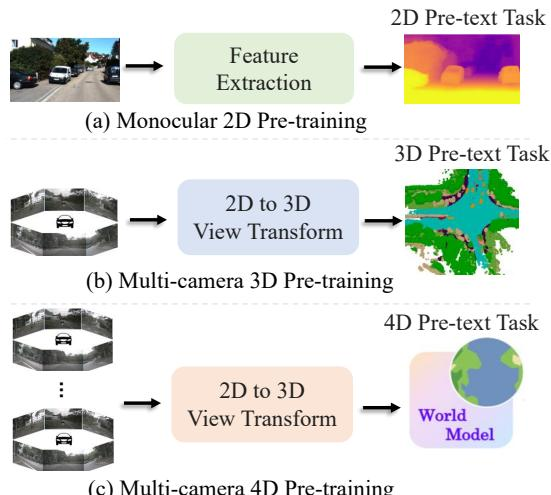
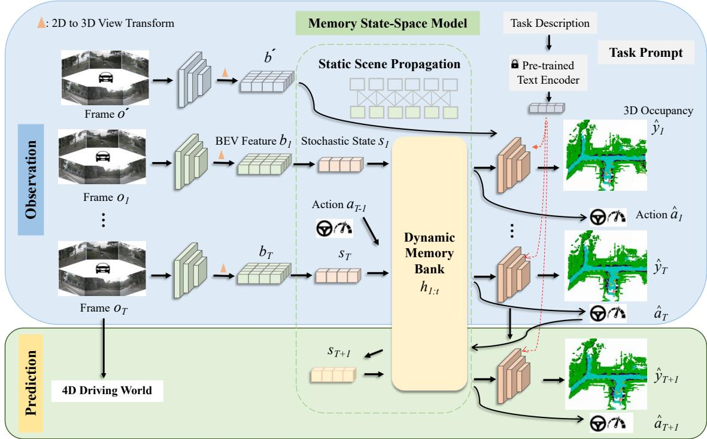
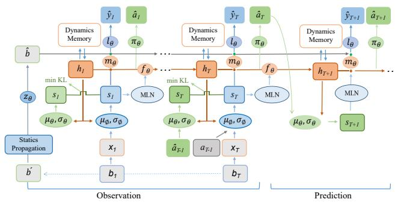
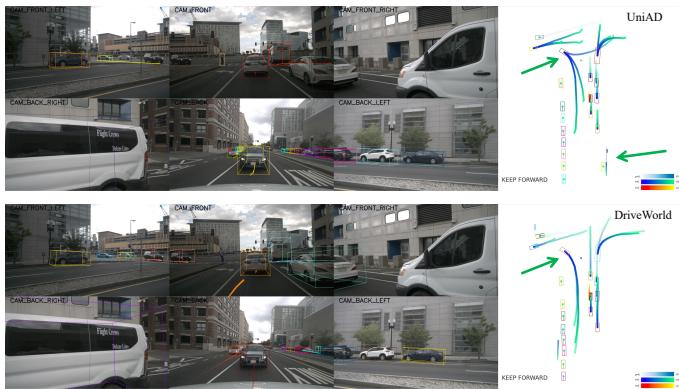

# DriveWorld: 4D Pre-trained Scene Understanding via World Models for Autonomous Driving

Chen Min1,2, Dawei Zhao2\*, Liang Xiao2\*, Jian Zhao3, Xinli Xu4, Zheng Zhu5 Lei Jin6, Jianshu Li7, Yulan Guo8, Junliang Xing9, Liping Jing10, Yiming Nie2, Bin Dai2 1School of Computer Science, Peking University

2Unmanned Systems Technology Research Center, Defense Innovation Institute 3China Telecom Institute of AI & NPU 4HKUST 5GigaAI 6BUPT 7Ant Group 8SYSU 9THU 10BJTU minchen@stu.pku.edu.cn, adamzdw@163.com, xiaoliang@nudt.edu.cn

## Abstract

Vision-centric autonomous driving has recently raised wide attention due to its lower cost. Pre-training is essential for extracting a universal representation. However, current vision-centric pre-training typically relies on either 2D or 3D pre-text tasks, overlooking the temporal characteristics ofautonomous driving as a 4D scene understanding task. In this paper, we address this challenge by introducing a world model-based autonomous driving 4D representation learning framework, dubbed DriveWorld, which is capable of pre-training from multi-camera driving videos in a spatiotemporalfashion. Specifically, we propose a Memory State-Space Modelfor spatio-temporal modelling, which consists ofa Dynamic Memory Bank modulefor learning temporalaware latent dynamics to predictfuture changes and a Static Scene Propagation module for learning spatial-aware latent statics to offer comprehensive scene contexts. We additionally introduce a Task Prompt to decouple task-aware features for various downstream tasks. The experiments demonstrate that DriveWorld delivers promising results on various autonomous driving tasks. When pre-trained with the OpenScene dataset, DriveWorld achieves a 7.5% increase in mAP for 3D object detection, a 3.0% increase in IoU for online mapping, a 5.0% increase in AMOTA for multi-object tracking, a 0.1m decrease in minADE for motion forecasting, a 3.0% increase in IoU for occupancy prediction, and a 0.34m reduction in average L2 errorforplanning.

## 1. Introduction

Autonomous driving is a complex undertaking that relies on comprehensive 4D scene understanding [1, 75]. This demands the acquisition of a robust spatio-temporal representation that can address tasks involving perception, prediction, and planning [31]. Learning spatio-temporal representations is highly challenging due to the stochastic nature of natural scenes, the partial observability of the environment, and the diversity of downstream tasks [58, 84]. Pre-training plays a crucial role in acquiring a universal representation from massive data, enabling the construction of a foundational model enriched with common knowledge [6, 35, 64, 70, 98]. However, research on pre-training for spatio-temporal representation learning in autonomous driving remains relatively limited.

  
(c) Multi-camera 4D Pre-training  
Figure 1. Comparison on different pre-training methods for visioncentric autonomous driving. (a) Monocular 2D pre-training with 2D pre-text tasks (e.g., 2D classification and depth estimation). (b) Multi-camera 3D pre-training via 3D scene reconstruction or 3D object detection. (c) The proposed 4D pre-training based on world models learns unified spatio-temporal representations.

Vision-centric autonomous driving has recently attracted increasing attention because of its lower cost [31, 33, 43, 44, 51, 77, 95]. However, as shown in Fig. 1, the existing vision-centric pre-training algorithms still predominantly rely on 2D pre-text tasks [24, 60] or 3D pre-text tasks [57, 69, 88]. DD3D [60] has demonstrated the effectiveness of depth estimation for pre-training. OccNet [69], UniScene [57], and UniPAD [88] have further extended pretraining to 3D scene reconstruction. However, these algorithms overlook the importance of 4D representation for understanding self-driving scenes.

We aim to employ world models to address 4D representation for vision-centric autonomous driving pre-training. World models excel in representing an agent’s spatiotemporal knowledge about its environment. [19, 39]. In reinforcement learning, DreamerV1 [20], DreamerV2 [22], and DreamerV3 [23] employ world models to encapsulate an agent’s experience within a predictive model, thereby facilitating the acquisition of a wide array of behaviours. MILE [27] leverages 3D geometry as an inductive bias and learns a compact latent space directly from videos of expert demonstrations to construct world models in the CARLA simulator [12]. ContextWM [82] and SWIM [54] pre-train world models with abundant in-the-wild videos to enhance the efficient learning of downstream visual tasks. More recently, GAIA-1 [28] and DriveDreamer [76] have constructed generative world models that harness video, text, and action inputs to create realistic driving scenarios using diffusion models. Unlike the aforementioned prior works on world models, our approach primarily focuses on harnessing world models to learn 4D representations for autonomous driving pre-training.

Driving inherently entails grappling with uncertainty [26]. There are two types of uncertainty in ambiguous autonomous driving scenarios: aleatoric uncertainty, stemming from the stochastic nature of the world, and epistemic uncertainty, arising from imperfect knowledge or information [15]. How to leverage past experience to predict plausible future states, and estimate missing information about the state of the world for autonomous driving remains an open problem. In this work, we explore 4D pre-training via world models to deal with both aleatoric and epistemic uncertainties. Specifically, we design the Memory State-Space Model to reduce uncertainty within autonomous driving from two aspects. Firstly, to address aleatoric uncertainty, we propose the Dynamic Memory Bank module for learning temporal-aware latent dynamics to predict future states. Secondly, to mitigate epistemic uncertainty, we propose the Static Scene Propagation module for learning spatial-aware latent statics to provide comprehensive scene context. Furthermore, we introduce Task Prompt, which leverages semantic cues as prompts to tune the feature extraction network adaptively for different driving downstream tasks.

To validate the performance of our proposed 4D pre-training approach, we conducted pre-training on the nuScenes [5] training set and the recently released largescale 3D occupancy datasets, OpenScene [11], followed by fine-tuning on the nuScenes training set. The experimental results demonstrate the superiority of our 4D pre-training approach when compared to 2D ImageNet pre-training [24], 3D occupancy pre-training [57, 69], and knowledge distillation algorithms [10]. Our 4D pre-training algorithm exhibited substantial improvements in vision-centric autonomous driving tasks, including 3D object detection, multi-object tracking, online mapping, motion forecasting, occupancy prediction, and planning. The main contributions of this work are listed below:

• We present the first 4D pre-training method based on world models for real-world vision-centric autonomous driving, which learns a compact spatio-temporal representation from multi-camera driving videos.

• We design the Memory State-Space Model, which includes a Dynamic Memory Bank module for learning temporal-aware latent dynamics, a Static Scene Propagation module for learning spatial-aware latent statics, and a Task Prompt to condition feature extraction adaptively for various tasks.

• Extensive experiments indicate DriveWorld’s pre-training aids in establishing new state-of-the-art performance in vision-centric perception, prediction, and planning tasks.

## 2. Related Work

## 2.1. Pre-training for Autonomous Driving

Based on input modalities, autonomous driving pre-training algorithms can be primarily categorized: pre-training on large-scale LiDAR point clouds [14, 91, 92] and pretraining on images [7, 40, 47]. Pre-training algorithms for large-scale LiDAR point clouds can further be classified into contrastive learning methods [8, 34, 45, 65, 67, 90], masked autoencoder methods [25, 56, 68, 85, 87], and occupancy-based approaches [4, 56, 86, 96]. To incorporate 3D spatial structure into vision-centric autonomous driving, pre-training methods involving depth estimation have seen widespread adoption [60, 83]. OccNet [69], UniScene [57], UniPAD [88], and PonderV2 [98] have introduced pretraining via 3D scene reconstruction. BEVDistill [10], DistillBEV [79], and GeoMIM [49] employ knowledge distillation to transfer geometric insights from pre-trained LiDAR point clouds detection models. However, autonomous driving presents a 4D scene understanding challenge. We propose the first 4D pre-training approach based on world models for vision-centric autonomous driving.

  
Figure 2. Overall framework of the proposed DriveWorld. Since autonomous driving heavily relies on the understanding of 4D scenes, our approach first involves the transformation of multi-camera images into a 4D space. Within the proposed Memory State-Space Model for spatio-temporal modelling, we have two essential components: the Dynamic Memory Bank, which learns temporal-aware latent dynamics for predicting future states, and the Static Scene Propagation, which learns spatial-aware latent statics to provide comprehensive scen context. This configuration facilitates the decoder’s task of reconstructing 3D occupancy and actions for both the current and future tim steps. Besides, we design the Task Prompt based on a pre-trained text encoder to adaptively decouple task-aware features for various tasks.

## 2.2. Spatial-Temporal Modeling for Autonomous Driving

In the domain of autonomous driving, there has been significant research focus on spatio-temporal modeling. BEVFormer [44] employs spatio-temporal transformers to learn BEV representations from multi-camera images. BEVDet4D [32] extends BEVDet [33] from spatial-only 3D space to the spatio-temporal 4D space. BEVStereo [42], STS [78], and SOLOFusion [61] address depth perception challenges in camera-based 3D tasks by leveraging temporal multi-view stereo (MVS) [99]. PETRv2 [52] and StreamPETR [73] utilize sparse object queries to model moving objects and enable efficient transmission of longterm temporal information. ST-P3 [30] and UniAD [31] are dedicated to building end-to-end vision-based autonomous driving systems through spatio-temporal feature learning.

## 2.3. World Models

World models enable intelligent agents to learn a state representation from past experiences and current observations, allowing them to predict future outcomes [19, 22, 39]. World models find extensive applications in reinforcement learning [22, 59, 66], and autonomous driving [3, 16, 28, 93]. In reinforcement learning, Ha and Schmidhuber [19] proposed that the world model can be trained quickly in an unsupervised manner to learn a compressed spatial and temporal representation of the environment. Methods in [18, 20, 22, 23] presuppose access to rewards and online interaction with the environment from predictions in the compact latent space of a world model. ContextWM [82] and SWIM [54] pre-train world models with abundant in-thewild videos for downstream visual tasks. In autonomous driving, Elfes [13] proposed the geometric occupancy grid as a world model for robot perception and navigation in 1989. MILE [27] proposed to build the world model by predicting the future BEV segmentation from high-resolution videos of expert demonstrations for autonomous driving. GAIA-1 [28] and DriveDreamer [76] have constructed generative world models that harness video, text, and action inputs to create realistic driving scenarios using diffusion models. Zhang et al. [93] builds unsupervised world models for the point cloud forecasting task in autonomous driving. In this paper, we imbue the robot with a pre-trained spatio-temporal representation via world models to perceive surroundings and predict the future behaviour of other par-

ticipants.

## 3. DriveWorld

Consider a sequence of observed $T$ video frames denoted as $O 1 { : } T :$ , captured by multi-view cameras, along with their corresponding expert actions, $a _ { 1 : T }$ and 3D occupancy labels $y _ { 1 : T }$ which can be acquired with the aid of LiDAR point clouds and pose data, we aim to learn a compact spatio-temporal BEV representation via world model that predicts current and future 3D occupancy given the past multi-camera images and actions. As shown in Fig. 2, the designed world model consists of an Image Encoder, a 2D to 3D View Transform (e.g., Transformers [77], LSS [62] techniques), a Memory State-Space Model which consists of a Dynamic Memory Bank module to learn the temporalaware latent dynamics and a Static Scene Propagation module to learn the spatial-aware latent statics, a Decoder to predict the actions and 3D occupancy, and a Task Prompt to condition the feature extraction for different tasks.

## 3.1. Memory State-Space Model

As autonomous vehicle moves, it sequentially conveys two types of information within its observations: the temporalaware information linked to alterations in the scene due to object mobility, and the spatial-aware information associated with scene context [82]. As illustrated in Fig. 3, to address these dynamic agents and spatial scenes separately for 4D pre-training, we propose the Dynamic Memory Bank module for temporal-aware latent dynamics and the Static Scene Propagation module for spatial-aware latent statics. Next, we will begin by introducing the probabilistic model for temporal modelling, followed by detailed presentations of the Dynamic Memory Bank module and Static Scene Propagation module.

Probabilistic Modelling. To imbue the model with the capability for temporal modelling, we first introduce two latent variables $\left( h _ { 1 : T } , s _ { 1 : T } \right)$ , where $h _ { t }$ represents the history and $s _ { t }$ signifies the stochastic state. $h _ { t }$ is updated with the past histories $h _ { 1 : t - 1 }$ and stochastic states $s _ { 1 : t - 1 }$

When images are observed, current scene perception can be obtained by utilizing past and current images. However, when predicting the future, in the absence of input images, we rely solely on past histories and states $\left( h _ { 1 : t - 1 } , s _ { 1 : t - 1 } \right)$ to predict the future states. This predictive process is akin to the probabilistic generative models [38]. For predicting future, we follow Recurrent State-Space Model [97] and construct both the posterior state distribution $q ( s _ { t } | o _ { \leq t } , a _ { < t } )$ and the prior state distribution $p ( s _ { t } | h _ { t - 1 } , s _ { t - 1 } )$ . The objective is to match the prior distribution (the anticipated outcome based on past histories and states) with the posterior distribution (the outcome derived from observed multicamera images and actions) [27].

  
Figure 3. Overall architecture of proposed the Memory State-Sapce Model (MSSM). MSSM divides the transmitted information into two categories: temporal-aware information and spatial-aware information. The Dynamic Memory Bank module utilizes motionaware layer normalization (MLN) to encode temporal-aware attributes and engages in information interaction with the dynamically updated memory bank. Meanwhile, the Static Scene Propagation module employs BEV features to represent spatial-aware latent statics, which are directly conveyed to the decoder.

Considering the high dimensionality of BEV features, we transform them into a 1D vector $\boldsymbol { x } _ { t } ~ \in ~ \mathbb { R } ^ { 5 1 2 }$ and subsequently sample the Gaussian distribution from $( h _ { t } , a _ { t - 1 } , x _ { t } )$ to generate the posterior state distribution:

$$
\begin{array} { r } { q ( s _ { t } | o _ { \leq t } , a _ { < t } ) \backsim \mathcal { N } ( \mu _ { \phi } ( h _ { t } , a _ { t - 1 } , x _ { t } ) , \sigma _ { \phi } ( h _ { t } , a _ { t - 1 } , x _ { t } ) I ) , } \end{array}\tag{1}
$$

where $s _ { t }$ is parameterised as a normal distribution with diagonal covariance and the initial distribution is set as $s _ { 1 } \ \backsim \ \mathcal { N } ( 0 , I ) . ( \mu _ { \phi } , \sigma _ { \phi } )$ are multi-layer perceptrons that parametrise the posterior state distribution.

In the absence of observed images, the model derives the prior state distribution based on historical information and predicted action:

$$
p ( s _ { t } | h _ { t - 1 } , s _ { t - 1 } ) \backsim \mathcal { N } ( \mu _ { \theta } ( h _ { t } , \hat { a } _ { t - 1 } ) , \sigma _ { \theta } ( h _ { t } , \hat { a } _ { t - 1 } ) I ) ,\tag{2}
$$

where $\left( \mu _ { \boldsymbol { \theta } } , \sigma _ { \boldsymbol { \theta } } \right)$ parameterizes the prior state distribution. $\pi _ { \theta }$ is the policy network for predicting action $\hat { a } _ { t - 1 }$ with past history $h _ { t - 1 }$ and state $s _ { t - 1 }$ . Following MILE [27], we utilize MLP for action prediction, including velocity and steering.

Dynamic Memory Bank. In the process of temporal information propagation, we aim to account for the movement of objects by incorporating motion parameters. Following StreamPETR [73], we introduce motion-aware layer normalization (MLN) into the latent dynamics propagation process. We define K moving objects and estimate their velocities. The motion attributes consist of velocity $v ,$ and relative time interval ∆t. $( v , \Delta t )$ are flattened and converted into affine vectors $\gamma$ and $\beta$ through two linear layers $( \xi _ { 1 } , \xi _ { 2 } )$ $\gamma = \xi _ { 1 } ( v , \Delta t ) , \beta = \xi _ { 2 } ( v , \Delta t )$ . Then an affine transformation is executed to yield the motion-aware latent stochastic state, denoted as $\tilde { s } _ { t } = \gamma \cdot L N ( s _ { t } ) + \beta .$ . With the motion of the vehicle, the deterministic history $h _ { t }$ can establish a dynamic memory bank $h _ { 1 : t }$ . The refined deterministic history $\tilde { h } _ { t }$ is obtained via the cross-attention mechanism with the dynamics memory bank. The transition of deterministic history is set as $h _ { t + 1 } = f _ { \theta } ( \tilde { h } _ { t } , \tilde { s } _ { t } )$

Static Scene Propagation. As the vehicle moves, consecutive frames of the scene typically depict minimal alterations, with a prominent presence of static objects such as roads, trees, and traffic signs constituting the scene’s predominant content. Converting input images into a 1D vector would lead to the loss of crucial information. In addition to conveying temporal-aware information, the world model should also be able to model spatial-aware information.

As shown in Fig. 3, we randomly select a frame $o ^ { ' }$ from frames 1 to $T$ and use its BEV features $b ^ { ' }$ to construct a latent static representation $\hat { b } = z _ { \theta } ( \boldsymbol { b } ^ { \prime } )$ describing the spatioaware structure. We combine the spatio-aware latent statics $\hat { b }$ and the temporal-aware latent dynamics $s _ { t }$ in channelwise manner. We opt not to use warping operations, allowing the model to learn a robust global representation of the entire scene and $s _ { t }$ to focus on capturing motion information. As $s _ { t }$ is learned from the BEV features $b _ { t }$ , during the model training process, BEV features simultaneously acquire representations for static scene and motion information. This holistic representation is subsequently utilized in the subsequent decoder network.

## 3.2. 3D Occupancy Prediction

Aiming at a comprehensive understanding of surrounding scenes in autonomous driving, we model the physical world into the 3D occupancy structure, utilizing the geometric form of occupancy to depict the surrounding environment of the vehicle [13, 37, 50, 53, 69]. In contrast to other world models that reconstruct the input 2D images [22, 28], the 3D occupancy decoder can introduce geometric priors of the surrounding world through pre-training to vision-based models. Unlike depth estimation pre-training [60, 83], which primarily represents object surfaces, 3D occupancy can represent the entire structure. Furthermore, unlike MILE’s BEV segmentation target [27], which omits crucial height information, 3D occupancy provides a more comprehensive description of objects. The 3D occupancy decoder is set as $\hat { y } _ { t } = l _ { \theta } ( m _ { \theta } ( \tilde { h } _ { t } , s _ { t } ) , \hat { b } )$ , where $m _ { \theta }$ is the network expanding the 1D features to the dimensions of BEV, and $l _ { \theta }$ is the 3D convolutional network for predicting occupancy.

Reconstructing 3D occupancy as the pre-text task has been demonstrated to be effective by pre-training algorithms like OccNet [69] and UniScene [57]. In comparison to OccNet and UniScene, we further extend to 4D occupancy pre-training, introducing additional prior knowledge through spatio-temporal modelling.

## 3.3. Task Prompt

While the designed pre-text task through the world model enables the learning of spatio-temporal representations, different downstream tasks focus on distinct information [48, 72]. For instance, the 3D object detection task emphasizes current spatio-aware information, while future prediction tasks prioritize temporal-aware information. Excessive focus on future information, such as the future position of a vehicle, could be detrimental to 3D object detection task.

To mitigate this problem, inspired by Semantic Prompt for few-shot image recognition [9] and Visual Exemplar driven Prompts for multi-task learning [48], we introduce the concept of “Task Prompt”, providing specific cues to different heads to guide them in extracting the task-aware features. Acknowledging the semantic connections that exist among different tasks, we leverage the Large Language Model $g _ { \varphi } ( \cdot )$ (e.g., BERT [35], CLIP [63]) to construct these task prompts. For instance, the task prompt $\boldsymbol { p } ^ { t e x t }$ for the 3D occupancy reconstruction task that focuses on the current scene is set as straightforward as “The task is to predict the 3D occupancy of the current scene”. We input the prompt $\boldsymbol { p } ^ { t e x t }$ into $g _ { \varphi } ( \cdot )$ to acquire prompt encodings $g _ { \varphi } ( p ^ { t e x t } )$ . Subsequently, we employ AdaptiveInstanceNorm [27] and CNNs to expand it to the dimensions of BEV, denoted as $q _ { \varphi } ( g _ { \varphi } ( p ^ { t e x t } ) )$ , to integrate it with the learned spatio-temporal features.

## 3.4. Pre-training Objective

The pre-training objectives of DriveWorld involve minimizing the divergence between post and prior state distributions (i.e. Kullback-Leibler (KL) divergence) and minimizing the loss related to past and future 3D occupancy (i.e. Cross-Entropy loss (CE)) and actions (i.e. L1 loss). We depicted the model observing inputs over T timesteps, followed by envisioning future 3D occupancy and actions for L steps. The overall loss function of DriveWorld is:

$$
\begin{array} { r l } & { l o s s = \displaystyle \sum _ { t = 1 } ^ { T } [ \mathrm { K L } ( q ( s _ { t } | o \le t , a _ { < t } ) \parallel p ( s _ { t } | h _ { t - 1 } , s _ { t - 1 } ) ) + \mathrm { C E } ( \hat { y } _ { t } , y _ { t } ) + } \\ & { ~ \mathrm { L } 1 ( \hat { a } _ { t } , a _ { t } ) ] + \displaystyle \sum _ { k = 1 } ^ { L } [ \mathrm { C E } ( \hat { y } _ { k } , y _ { k } ) + \mathrm { L } 1 ( \hat { a } _ { k } , a _ { k } ) ] . } \end{array}\tag{3}
$$

For the OpenScene dataset [11], we also utilize an L2 loss for occupancy flow prediction. DriveWorld is based on the Probabilistic Generative Model [22, 27, 38]. For the detailed derivation of the loss function, please refer to Section 6 in the supplementary material.

## 3.5. Fine-tuning on Downstream Tasks

Through DriveWorld, we acquire spatio-temporal BEV representations. Specifically, the network between image feature extraction and the generation of BEV features (i.e., encoder) is pre-trained. During fine-tuning, both the encoder and decoder (i.e. head network for different tasks) with Task Prompts are trained simultaneously.

## 4. Experiments

## 4.1. Experimental Setup

Dataset. We pre-train on the autonomous driving dataset nuScenes [5] and the largest-scale 3D occupancy dataset OpenScene [11], and fine-tune on nuScenes. Evaluation settings are the same as UniAD [31]. For detailed dataset descriptions, please refer to the Section 8 in the supplemental material..

Pre-training. In alignment with BEVFormer [44] and UniAD [31], we employ ResNet101-DCN [24] as the foundational backbone. For 3D occupancy prediction, we establish a voxel size of $1 6 \times 2 0 0 \times 2 0 0$ . The learning rate is set as $2 \times 1 0 ^ { - 4 }$ . By default, the pre-training phase encompasses 24 epochs. The model observes inputs over T = 4 steps, and the future prediction is set at L = 4 steps.

Fine-tuning. In the fine-tuning stage, we retain the pretrained encoder that generates BEV features and fine-tune downstream tasks. For the 3D detection task, we employed the BEVFormer [44] framework, fine-tuning its parameters without freezing the encoder, and conducted training for 24 epochs. Regarding other autonomous driving tasks, we utilized the UniAD [31] framework and loaded our fine-tuned BEVFormer weights to UniAD, adhering to a standard 20- epoch training protocol for all tasks. For UniAD, we followed its experimental setup, which involved training for 6 epochs in stage 1 and 20 epochs in stage 2. Experiments are conducted with 8 NVIDIA Tesla A100 GPUs.

## 4.2. Ablation Studies

We first perform thorough ablation studies with UniAD [31] (only fine-tune on the Stage 1 with queue length of 3 for efficiency) pre-trained on nuScenes training set to validate the effectiveness of each component of DriveWorld.

Component Analysis. We first validate the effectiveness of the proposed Memory State-Space Model (MSSM) module. As shown in Tab. 1, pre-training with the Recurrent State-Space Model (RSSM) [97] results in significantly poor 3D detection performance. This is attributed to RSSM having a 1D tensor for latent dynamics, which cannot effectively retain context information, consequently causing model disruption during pre-training. However, when Static Scene Propagation (SSP) is integrated into MSSM, direct reconstruction using BEV features leads to an approximately 1% improvement in performance. Upon introducing Dynamic Memory Bank (DMB), performance drops in

<table><tr><td rowspan="2">RSSM</td><td rowspan="2">SSP DMB</td><td rowspan="2">MSSM MLN</td><td rowspan="2">Task Prompt</td><td rowspan="2">mAP↑</td><td rowspan="2">Detection NDS↑</td><td rowspan="2">Tracking AMOTA↑</td><td rowspan="2">AMOTP↓</td><td colspan="2">Mapping</td></tr><tr><td>IoU-lane↑</td><td>IoU-road↑</td></tr><tr><td></td><td></td><td></td><td></td><td></td><td>0.416 0.517</td><td>0.355</td><td>1.336</td><td>0.301</td><td>0.671</td></tr><tr><td>√</td><td></td><td></td><td></td><td>0.381</td><td>0.494</td><td>=</td><td>=</td><td>=</td><td>=</td></tr><tr><td></td><td>√</td><td></td><td></td><td>0.429</td><td>0.528</td><td>0.365</td><td>1.327</td><td>0.319</td><td>0.688</td></tr><tr><td></td><td>√</td><td>√</td><td></td><td>0.425</td><td>0.524</td><td>0.370</td><td>1.320</td><td>0.312</td><td>0.686</td></tr><tr><td></td><td>√</td><td>√ √</td><td></td><td>0.432</td><td>0.531</td><td>0.373</td><td>1.312</td><td>0.326</td><td>0.698</td></tr><tr><td></td><td>√</td><td>√ √</td><td>√</td><td>0.436</td><td>0.534</td><td>0.379</td><td>1.308</td><td>0.329</td><td>0.705</td></tr></table>

Table 1. Ablation studies of each component of DriveWorld.

<table><tr><td rowspan="2">Pre-train</td><td rowspan="2">Fine-tune</td><td colspan="2">Detection</td><td colspan="2">Tracking</td></tr><tr><td>mAP↑</td><td>NDS↑</td><td>AMOTA↑</td><td>AMOTP↓</td></tr><tr><td>0% 1</td><td>100%</td><td>0.416</td><td>0.517</td><td>0.355</td><td>1.336</td></tr><tr><td>50% 1</td><td>100%</td><td>0.425</td><td>0.523 一</td><td>0.364</td><td>1.323</td></tr><tr><td>100%</td><td>75%</td><td>0.418</td><td>0.518</td><td>0.358</td><td>1.331</td></tr><tr><td>100% 一</td><td>100%</td><td>0.436</td><td>0.534</td><td>0.379</td><td>1.308</td></tr></table>

Table 2. Ablation studies of different scales of dataset.

<table><tr><td>Method</td><td>mAP↑</td><td>NDS↑</td><td>mATE↓</td><td>mASE↓</td><td>mAOE↓</td><td>mAVE↓</td><td>mAAE↓</td></tr><tr><td>DETR3D [77]</td><td>0.349</td><td>0.434</td><td>0.716</td><td>0.268</td><td>0.379</td><td>0.842</td><td>0.200</td></tr><tr><td>UVTR [41]</td><td>0.379</td><td>0.483</td><td>0.731</td><td>0.267</td><td>0.350</td><td>0.510</td><td>0.200</td></tr><tr><td>BEVFormer* [44]</td><td>0.377</td><td>0.477</td><td>0.708</td><td>0.280</td><td>0.450</td><td>0.433</td><td>0.198</td></tr><tr><td>+ FCOS3D [74]</td><td>0.416</td><td>0.517</td><td>0.673</td><td>0.274</td><td>0.372</td><td>0.394</td><td>0.198</td></tr><tr><td>+ OccNet [69]</td><td>0.436</td><td>0.532</td><td>0.655</td><td>0.273</td><td>0.372</td><td>0.349</td><td>0.182</td></tr><tr><td>+ UniScene [57]</td><td>0.438</td><td>0.534</td><td>0.656</td><td>0.271</td><td>0.371</td><td>0.348</td><td>0.183</td></tr><tr><td>+ BEVDistill [10]</td><td>0.439</td><td>0.536</td><td>0.653</td><td>0.271</td><td>0.372</td><td>0.343</td><td>0.180</td></tr><tr><td>+ DriveWorld†</td><td>0.442+6.5%</td><td>0.536+5.9%</td><td>0.650</td><td>0.268</td><td>0.370</td><td>0.342</td><td>0.183</td></tr><tr><td>+ DriveWorld</td><td> $0 . 4 5 2 ^ { + 7 . 5 \% }$ </td><td>0.545+6.8%</td><td>0.642</td><td>0.264</td><td>0.359</td><td>0.324</td><td>0.176</td></tr></table>

Table 3. Quantitative 3D object detection performance. ∗: we retrain BEVFormer [44] with 2D ImageNet pre-training [24].
<table><tr><td rowspan=1 colspan=1>Method</td><td rowspan=1 colspan=1>Lanes↑</td><td rowspan=1 colspan=1>Drivable↑</td><td rowspan=1 colspan=1>Divider↑ C</td><td rowspan=1 colspan=1>rossing↑</td></tr><tr><td rowspan=1 colspan=1>BEVFormer [44]BEVerse [95]</td><td rowspan=1 colspan=1>23.9</td><td rowspan=1 colspan=1>77.5</td><td rowspan=1 colspan=1>30.6</td><td rowspan=1 colspan=1>17.2</td></tr><tr><td rowspan=2 colspan=1>UniAD [31]+ OccNet [69]+ UniScene [57]+ BEVDistill [10]</td><td rowspan=1 colspan=1>31.3</td><td rowspan=1 colspan=1>69.1</td><td rowspan=1 colspan=1>25.7</td><td rowspan=1 colspan=1>13.8</td></tr><tr><td rowspan=1 colspan=1>32.132.532.7</td><td rowspan=1 colspan=1>70.270.570.4</td><td rowspan=1 colspan=1>26.326.926.8</td><td rowspan=1 colspan=1>14.214.914.7</td></tr><tr><td rowspan=1 colspan=1>+ DriveWorld†+ DriveWorld‡</td><td rowspan=1 colspan=1> $3 3 . 4 ^ { + 2 . 1 \% }$  $3 4 . 2 ^ { + 2 . 9 \% }$ </td><td rowspan=1 colspan=1> $7 1 . 3 ^ { + 2 . 2 \% }$  $7 3 . 7 ^ { + 4 . 6 \% }$ </td><td rowspan=1 colspan=1> $2 7 . 9 ^ { + 2 . 2 \% }$  $2 9 . 5 ^ { + 3 . 8 \% }$ </td><td rowspan=1 colspan=1> $1 5 . 2 ^ { + 1 . 4 \% }$  $1 7 . 2 ^ { + 3 . 4 \% }$ </td></tr></table>

Table 4. Quantitative online mapping performance.

3D detection and online mapping but improves in tracking. In motion prediction tasks, a wide perceptual field is likely necessary for the model to perform effectively. However, in detection tasks, precise localization is crucial, and a broad perceptual field could potentially introduce additional noise into the detection process. The subsequent introduction of Motion-aware Layer Normalization (MLN) yields improvements in all perception tasks. This demonstrates the importance of incorporating motion attributes when transferring dynamic information. Finally, the inclusion of the proposed task prompt decouples different information for distinct tasks, leading to further improvements in perception performance.

Dataset Scale. We also investigate the influence of pretraining and fine-tuning data volumes. Tab. 2 illustrates that augmenting the volume of data used in pre-training leads to improved performance in downstream tasks. Importantly, using just 75% of the data for fine-tuning still results in comparable performance. This finding underscores the efficacy of our 4D pre-training approach in reducing the data requirements by 25%, which translates into considerable cost savings in terms of annotation and, as such, represents a substantial practical and economic advantage.

## 4.3. Main Results

In this section, we validate the effectiveness of our proposed 4D pre-training approach based on the world model across various autonomous driving tasks. In addition to comparing it with state-of-the-art autonomous driving algorithms, we also contrast it with various pre-training algorithms, including 2D ImageNet pre-training [24], monocular 3D detection algorithm FCOS3D [74], knowledge distillation algorithm BEVDistill [10], and 3D occupancy pre-training algorithms OccNet [69] and UniScene [57], to provide a comprehensive assessment. The symbol † denotes pre-training with the training set of nuScenes [5], while ‡ signifies pre-training with the training set of OpenScene [11]. For fine-tuning, we utilize the same decoder head as UniAD [31]. “+X” indicates experimental results obtained after fine-tuning UniAD with different pre-trained model X.

3D Object Detection. We first evaluate the performance of the multi-camera 3D object detection task. The results presented in Tab. 3 show that our 4D pre-training approach based on the world model, as opposed to BEVFormer relying solely on 2D ImageNet [24] pre-training, delivers a substantial increase of 7.5% in mAP and 6.8% in NDS. BEVFormer with FCOS3D pre-training, specifically tailored for monocular 3D object detection, outperforms models that rely solely on 2D pre-training resulting in a commendable 4% increase in performance. OccNet, UniScene, and BEVDistill, which leverage 3D occupancy reconstruction and knowledge distillation as the pre-training target, result in an additional 2% performance increase. These findings underscore the effectiveness of 3D pre-training when compared to traditional 2D pre-training paradigms. Our innovative DriveWorld, which introduces 4D spatiotemporal pre-training, exhibits a modest performance improvement over OccNet, UniScene, and BEVDistill on the nuScenes dataset. When extended to the large-scale occupancy dataset OpenScene for pre-training, it contributes to an additional 1% performance enhancement.

Online Mapping. We validate the performance on the online mapping task. As shown in Tab. 4, compared to UniAD, pre-training with 3D occupancy in OccNet and UniScene results in an improvement of about 1% in IoU, and the knowledge distillation algorithm BEVDistill also enhances performance by 1%. After our 4D pre-training on nuScenes, there is a 2% improvement and a 3% improvement after pretraining on OpenScene.

<table><tr><td>Method</td><td>AMOTA↑</td><td>AMOTP↓</td><td>Recall↑</td><td>IDS↓</td></tr><tr><td>QD3DT [29]</td><td>0.242</td><td>1.518</td><td>0.399</td><td></td></tr><tr><td>MUTR3D [94]</td><td>0.294</td><td>1.498</td><td>0.427</td><td>3822</td></tr><tr><td>UniAD [31] + OccNet [69]</td><td>0.359 0.363</td><td>1.320 1.315</td><td>0.467 0.474</td><td>906 950</td></tr><tr><td>+ UniScene [57]</td><td>0.373</td><td>1.312</td><td>0.484</td><td>832</td></tr><tr><td>+ BEVDistill [10]</td><td>0.376</td><td>1.310</td><td>0.489</td><td>812</td></tr><tr><td>+ DriveWorld† + DriveWorld‡</td><td> $0 . 3 8 5 ^ { + 2 . 6 \% }$   $\mathbf { 0 . 4 1 2 ^ { + 5 . 3 \% } }$ </td><td> $1 . 3 0 3 ^ { - 1 . 7 \% }$   $1 . 2 6 6 ^ { - 5 . 4 \% }$ </td><td> $0 . 5 1 1 ^ { + 4 . 4 \% }$   $\mathbf { 0 . 5 4 5 ^ { + 7 . 8 \% } }$ </td><td> $7 1 0 ^ { - 1 9 6 }$ </td></tr></table>

Table 5. Quantitative multi-object tracking performance.
<table><tr><td rowspan=1 colspan=2>Method</td><td rowspan=1 colspan=1>minADE(m)↓</td><td rowspan=1 colspan=2>minFDE(m)↓</td><td rowspan=1 colspan=1>MR↓</td><td rowspan=1 colspan=1>EPA↑</td></tr><tr><td rowspan=2 colspan=2>PnPNet [46]ViP3D [17]</td><td rowspan=1 colspan=1>1.15</td><td rowspan=1 colspan=2>1.95</td><td rowspan=1 colspan=1>0.226</td><td rowspan=2 colspan=1>0.2220.226</td></tr><tr><td rowspan=1 colspan=1>2.05</td><td rowspan=1 colspan=2>2.84</td><td rowspan=1 colspan=1>0.246</td></tr><tr><td rowspan=4 colspan=2>UniAD [31]+ OccNet [69]+ UniScene [57]+ BEVDistill [10]</td><td rowspan=1 colspan=1>0.71</td><td rowspan=1 colspan=2>1.02</td><td rowspan=1 colspan=1>0.151</td><td rowspan=1 colspan=1>0.456</td></tr><tr><td rowspan=1 colspan=1>et [69]</td><td rowspan=1 colspan=1>0.70</td><td rowspan=1 colspan=2>1.02</td><td rowspan=1 colspan=1>0.146</td><td rowspan=2 colspan=1>0.4590.457</td></tr><tr><td rowspan=2 colspan=1>0.690.70</td><td rowspan=2 colspan=2>1.010.99</td><td rowspan=1 colspan=1>0.148</td></tr><tr><td rowspan=1 colspan=1></td><td rowspan=1 colspan=1>0.146</td><td rowspan=1 colspan=1>0.460</td></tr><tr><td rowspan=2 colspan=2>+ DriveWorld†+ DriveWorld‡</td><td rowspan=2 colspan=1> $0 . 6 7 ^ { - 0 . 0 4 }$  $\mathbf { 0 . 6 1 } ^ { - 0 . 1 0 }$ </td><td rowspan=1 colspan=2> $0 . 9 4 ^ { - 0 . 0 8 }$ </td><td rowspan=2 colspan=1>0.140-0.0110.136-0.025</td><td rowspan=2 colspan=1>0.468+0.0120.503+0.047</td></tr><tr><td rowspan=1 colspan=2> $\mathbf { 0 . 9 1 ^ { - 0 . 1 1 } }$ </td></tr></table>

Table 6. Quantitative motion forecasting performance.
<table><tr><td>Method</td><td>IoU-n↑</td><td>IoU-f↑</td><td>VPQ-n↑</td><td>VPQ-f↑</td></tr><tr><td>ST-P3 [30]</td><td></td><td>38.9</td><td></td><td>32.1</td></tr><tr><td>BEVerse [95]</td><td>61.4</td><td>40.9</td><td>54.3</td><td>36.1</td></tr><tr><td>UniAD [31]</td><td>63.4</td><td>40.2</td><td>54.7</td><td>33.5</td></tr><tr><td>+ OccNet [69]</td><td>63.9</td><td>40.8</td><td>55.1</td><td>34.2</td></tr><tr><td>+ UniScene [57]</td><td>64.3</td><td>41.2</td><td>55.3</td><td>34.9</td></tr><tr><td>+ BEVDistill [10]</td><td>64.1</td><td>40.9</td><td>54.9</td><td>33.8</td></tr><tr><td>+ DriveWorld†</td><td> $6 5 . 3 ^ { + 1 . 9 \% }$ </td><td> $4 2 . 4 ^ { + 2 . 2 \% }$ </td><td> $5 6 . 7 ^ { + 2 . 0 \% }$ </td><td> $3 5 . 3 ^ { + 1 . 8 \% }$ </td></tr></table>

Table 7. Quantitative occupancy prediction performance.
<table><tr><td rowspan="2">Method</td><td colspan="4">L2(m)↓</td><td colspan="4">Col.Rate(%).↓</td></tr><tr><td>1s</td><td>2s</td><td>3s</td><td> $\mathbf { A v g } .$ </td><td>1s</td><td>2s</td><td>3s</td><td>Avg.</td></tr><tr><td>ST-P3 [30]</td><td>1.33</td><td>2.11</td><td>2.90</td><td>2.11</td><td>0.23</td><td>0.62</td><td>1.27</td><td>0.71</td></tr><tr><td>BEVGPT [71]</td><td>0.39</td><td>0.88</td><td>1.70</td><td>1.22</td><td>-</td><td></td><td>-</td><td></td></tr><tr><td>UniAD [31]</td><td>0.48</td><td>0.96</td><td>1.65</td><td>1.03</td><td>0.05</td><td>0.17</td><td>0.71</td><td>0.31</td></tr><tr><td>+ OccNet [69]</td><td>0.49</td><td>0.95</td><td>1.64</td><td>1.02</td><td>0.07</td><td>0.15</td><td>0.69</td><td>0.30</td></tr><tr><td>+ UniScene [57]</td><td>0.47</td><td>0.91</td><td>1.56</td><td>0.98</td><td>0.05</td><td>0.16</td><td>0.64</td><td>0.28</td></tr><tr><td>+ BEVDistill [10]</td><td>0.46</td><td>0.92</td><td>1.60</td><td>0.99</td><td>0.05</td><td>0.16</td><td>0.67</td><td>0.29</td></tr><tr><td>+ DriveWorld† + DriveWorld‡</td><td>0.47-0.01 0.34-0.14</td><td>0.86−0.10 0.67-0.29</td><td>1.42-0.23 1.07 -0.58</td><td>0.92-0.11 0.69-0.34</td><td>0.05 0.04-0.01</td><td>0.13-0.04 0.12 –0.05</td><td>0.59-0.12 0.41-0.30</td><td>0.26-0.05 0.19−0.12</td></tr></table>

Table 8. Quantitative planning performance.

Multi-object Tracking. We further evaluate the performance on the multi-object tracking task, which demands a deeper consideration of temporal information. Tab. 5 illustrates the outcomes of this evaluation. It is evident that leveraging DriveWorld’s 4D pre-training results in a notable enhancement of 2.6% in terms of AMOTA. Impressively, after pre-training on OpenScene, this performance boost becomes even more significant, reaching a substantial 5.3% increase in AMOTA. In contrast, pre-training with OccNet, UniScene, and BEVDistill only provides a moderate improvement of 1.0% in AMOTA. Furthermore, Drive-World exhibits the lowest ID switch score, indicating that DriveWorld enables the model to consistently demonstrate temporal coherence for each tracklet.

  
Figure 4. Visual comparison between UniAD [31] (Top) and our DriveWorld (Bottom).

Motion Forecasting. In the motion prediction task, as demonstrated in Tab. 6, the improvement obtained from 3D pre-training (e.g., OccNet, UniScene, and BEVDistill) is notably limited. In contrast, our 4D pre-training approach, which encompasses the capability to forecast future states, significantly enhances the performance of the motion prediction task. Pre-training on nuScenes results in a reduction of 0.04m in minADE, while pre-training on OpenScene leads to a remarkable 0.1m decrease in minADE. This notable improvement is partly attributed to the larger data scale of OpenScene and the presence of valuable flow information in this dataset.

Occupancy Prediction. The UniAD’s occupancy prediction task is carried out in the 2D BEV view. As shown in Tab. 7, after undergoing 4D occupancy pre-training on OpenScene, our model exhibits impressive enhancements: a 2.8% increase in IoU-near, a 5% boost in IoU-far, a 3.4% gain in VPQ-near, and a 3.4% rise in VPQ-far. This outcome underscores the effectiveness of our pre-training approach in achieving a more comprehensive reconstruction of 4D scenes.

Planning. We finally validate the effectiveness of the proposed 4D pre-training algorithm on the planning task. As illustrated in Tab. 8, DriveWorld stands out by achieving new state-of-the-art planning results, reducing an 0.34m average L2 error and an average Collision rate of 0.12. These results surpass the prior best model, UniAD. UniAD integrates perception, prediction, and planning in a sequential fashion. Our 4D pre-training approach, which comprehensively reconstructs the 3D scene, enhances tasks focused on the current scene, such as detection and segmentation. and predicts future scenarios elevating tracking and forecasting capabilities. By combining these advantages, we further improve the performance of the final planning step. Consequently, we have developed a robust fundamental model for autonomous driving.

## 4.4. Qualitative Results

The qualitative comparison between UniAD and Drive-World is visualized in Fig. 4. UniAD exhibited false positives in detecting distant objects, and the detection accuracy was improved by DriveWorld. Additionally, UniAD made trajectory prediction errors for turning vehicles, which was addressed by DriveWorld after 4D pre-training, allowing for accurate predictions of future changes.

## 5. Conclusion

We introduce DriveWorld, a world model-based 4D pretraining method for vision-centric autonomous driving. DriveWorld learns compact spatio-temporal BEV representations via a world model that predicts 3D occupancy based on the past multi-camera images and actions. We design a Memory State-Space Model for spatio-temporal modelling, employing a Dynamic Memory Bank module to learn temporal-aware representations and a Static Scene Propagation module to learn spatial-aware representations. Additionally, a Task Prompt is introduced to guide the model toward adaptively acquiring task-specific representations. Extensive experiments demonstrate that Drive-World significantly enhances the performance of various autonomous driving tasks. The power of DriveWorld to represent 4D world knowledge opens new pathways for innovation within autonomous driving.

Limitations and Future Work. Currently, the annotation of DriveWorld is still based on LiDAR point clouds. It is essential to explore self-supervised learning for vision-centric pre-training. Besides, the effectiveness of DriveWorld has only been validated on the lightweight ResNet101 backbone; it is worthwhile to consider scaling up the dataset and the backbone size. We hope the proposed 4D pre-training method can contribute to the development of the foundation model for autonomous driving.

## References

[1] Ben Agro, Quinlan Sykora, Sergio Casas, and Raquel Urtasun. Implicit occupancy flow fields for perception and prediction in self-driving. In CVPR, pages 1379–1388, 2023. 1

[2] Jonathan T Barron, Ben Mildenhall, Matthew Tancik, Peter Hedman, Ricardo Martin-Brualla, and Pratul P Srinivasan. Mip-nerf: A multiscale representation for anti-aliasing neural radiance fields. In ICCV, pages 5855–5864, 2021. 15

[3] Daniel Bogdoll, Lukas Bosch, Tim Joseph, Helen Gremmelmaier, Yitian Yang, and J Marius Zollner. Exploring the po-¨ tential of world models for anomaly detection in autonomous driving. arXiv preprint arXiv:2308.05701, 2023. 3

[4] Alexandre Boulch, Corentin Sautier, Bjorn Michele, Gilles¨ Puy, and Renaud Marlet. Also: Automotive lidar selfsupervision by occupancy estimation. In CVPR, pages 13455–13465, 2023. 2

[5] Holger Caesar, Varun Bankiti, Alex H Lang, Sourabh Vora, Venice Erin Liong, Qiang Xu, Anush Krishnan, Yu Pan, Giancarlo Baldan, and Oscar Beijbom. nuscenes: A multimodal dataset for autonomous driving. In CVPR, pages 11621–11631, 2020. 2, 6, 7, 15

[6] Anthony Chen, Kevin Zhang, Renrui Zhang, Zihan Wang, Yuheng Lu, Yandong Guo, and Shanghang Zhang. Pimae: Point cloud and image interactive masked autoencoders for 3d object detection. In CVPR, pages 5291–5301, 2023. 1

[7] Kai Chen, Lanqing Hong, Hang Xu, Zhenguo Li, and Dit-Yan Yeung. Multisiam: Self-supervised multi-instance siamese representation learning for autonomous driving. In ICCV, pages 7546–7554, 2021. 2

[8] Runjian Chen, Yao Mu, Runsen Xu, Wenqi Shao, Chenhan Jiang, Hang Xu, Zhenguo Li, and Ping Luo. Coˆ 3: Cooperative unsupervised 3d representation learning for autonomous driving. arXiv preprint arXiv:2206.04028, 2022. 2

[9] Wentao Chen, Chenyang Si, Zhang Zhang, Liang Wang, Zilei Wang, and Tieniu Tan. Semantic prompt for few-shot image recognition. In CVPR, pages 23581–23591, 2023. 5

[10] Zehui Chen, Zhenyu Li, Shiquan Zhang, Liangji Fang, Qinhong Jiang, and Feng Zhao. Bevdistill: Cross-modal bev distillation for multi-view 3d object detection. In ICLR, 2022. 2, 6, 7

[11] OpenScene Contributors. Openscene: The largest up-to-date 3d occupancy prediction benchmark in autonomous driving, 2023. 2, 5, 6, 7, 15

[12] Alexey Dosovitskiy, German Ros, Felipe Codevilla, Antonio Lopez, and Vladlen Koltun. Carla: An open urban driving simulator. In CoRL, pages 1–16. PMLR, 2017. 2

[13] Alberto Elfes. Using occupancy grids for mobile robot perception and navigation. Computer, 22(6):46–57, 1989. 3, 5

[14] Ben Fei, Weidong Yang, Liwen Liu, Tianyue Luo, Rui Zhang, Yixuan Li, and Ying He. Self-supervised learning for pre-training 3d point clouds: A survey. arXiv preprint arXiv:2305.04691, 2023. 2

[15] Craig R Fox and Gulden ¨ Ulk ¨ umen. Distinguishing two di-¨ mensions of uncertainty. 2011. 2

[16] Zeyu Gao, Yao Mu, Ruoyan Shen, Chen Chen, Yangang Ren, Jianyu Chen, Shengbo Eben Li, Ping Luo, and Yanfeng Lu. Enhance sample efficiency and robustness of end-to-end urban autonomous driving via semantic masked world model. arXiv preprint arXiv:2210.04017, 2022. 3

[17] Junru Gu, Chenxu Hu, Tianyuan Zhang, Xuanyao Chen, Yilun Wang, Yue Wang, and Hang Zhao. Vip3d: End-to-end visual trajectory prediction via 3d agent queries. In CVPR, pages 5496–5506, 2023. 7

[18] David Ha and Jurgen Schmidhuber. Recurrent world models¨ facilitate policy evolution. In NIPS, 2018. 3

[19] David Ha and Jurgen Schmidhuber. World models.¨ arXiv preprint arXiv:1803.10122, 2018. 2, 3

[20] Danijar Hafner, Timothy Lillicrap, Jimmy Ba, and Mohammad Norouzi. Dream to control: Learning behaviors by latent imagination. In ICLR, 2019. 2, 3, 16

[21] Danijar Hafner, Timothy Lillicrap, Ian Fischer, Ruben Villegas, David Ha, Honglak Lee, and James Davidson. Learning latent dynamics for planning from pixels. In ICML, pages 2555–2565, 2019. 16

[22] Danijar Hafner, Timothy P Lillicrap, Mohammad Norouzi, and Jimmy Ba. Mastering atari with discrete world models. In ICLR, 2020. 2, 3, 5, 13, 16

[23] Danijar Hafner, Jurgis Pasukonis, Jimmy Ba, and Timothy Lillicrap. Mastering diverse domains through world models. arXiv preprint arXiv:2301.04104, 2023. 2, 3, 16

[24] Kaiming He, Xiangyu Zhang, Shaoqing Ren, and Jian Sun. Deep residual learning for image recognition. In CVPR, pages 770–778, 2016. 2, 6, 7

[25] Georg Hess, Johan Jaxing, Elias Svensson, David Hagerman, Christoffer Petersson, and Lennart Svensson. Masked autoencoder for self-supervised pre-training on lidar point clouds. In WACVW, pages 350–359, 2023. 2

[26] Anthony Hu. Neural world models for computer vision, 2023. 2

[27] Anthony Hu, Gianluca Corrado, Nicolas Griffiths, Zachary Murez, Corina Gurau, Hudson Yeo, Alex Kendall, Roberto Cipolla, and Jamie Shotton. Model-based imitation learning for urban driving. In NIPS, pages 20703–20716, 2022. 2, 3, 4, 5, 13, 16

[28] Anthony Hu, Lloyd Russell, Hudson Yeo, Zak Murez, George Fedoseev, Alex Kendall, Jamie Shotton, and Gianluca Corrado. Gaia-1: A generative world model for autonomous driving. arXiv preprint arXiv:2309.17080, 2023. 2, 3, 5

[29] Hou-Ning Hu, Yung-Hsu Yang, Tobias Fischer, Trevor Darrell, Fisher Yu, and Min Sun. Monocular quasi-dense 3d object tracking. PAMI, 45(2):1992–2008, 2022. 7

[30] Shengchao Hu, Li Chen, Penghao Wu, Hongyang Li, Junchi Yan, and Dacheng Tao. St-p3: End-to-end vision-based autonomous driving via spatial-temporal feature learning. In ECCV, pages 533–549. Springer, 2022. 3, 7

[31] Yihan Hu, Jiazhi Yang, Li Chen, Keyu Li, Chonghao Sima, Xizhou Zhu, Siqi Chai, Senyao Du, Tianwei Lin, Wenhai Wang, Lewei Lu, Xiaosong Jia, Qiang Liu, Jifeng Dai, Yu Qiao, and Hongyang Li. Planning-oriented autonomous driving. In CVPR, 2023. 1, 2, 3, 6, 7, 8

[32] Junjie Huang and Guan Huang. Bevdet4d: Exploit temporal cues in multi-camera 3d object detection. arXiv preprint arXiv:2203.17054, 2022. 3

[33] Junjie Huang, Guan Huang, Zheng Zhu, and Dalong Du. Bevdet: High-performance multi-camera 3d object detection in bird-eye-view. arXiv preprint arXiv:2112.11790, 2021. 2, 3

[34] Siyuan Huang, Yichen Xie, Song-Chun Zhu, and Yixin Zhu. Spatio-temporal self-supervised representation learning for 3d point clouds. In ICCV, pages 6535–6545, 2021. 2

[35] Jacob Devlin Ming-Wei Chang Kenton and Lee Kristina Toutanova. Bert: Pre-training of deep bidirectional transformers for language understanding. In ACL, page 2, 2019. 1, 5

[36] Bernhard Kerbl, Georgios Kopanas, Thomas Leimkuhler,¨ and George Drettakis. 3d gaussian splatting for real-time radiance field rendering. ToG, 42(4):1–14, 2023. 15

[37] Tarasha Khurana, Peiyun Hu, Achal Dave, Jason Ziglar, David Held, and Deva Ramanan. Differentiable raycasting for self-supervised occupancy forecasting. In ECCV, pages 353–369. Springer, 2022. 5

[38] Diederik P Kingma and Max Welling. Auto-encoding variational bayes. arXiv preprint arXiv:1312.6114, 2013. 4, 5

[39] Yann LeCun. A path towards autonomous machine intelligence version 0.9. 2, 2022-06-27. Open Review, 62, 2022. 2, 3

[40] Hongyang Li, Chonghao Sima, Jifeng Dai, Wenhai Wang, Lewei Lu, Huijie Wang, Enze Xie, Zhiqi Li, Hanming Deng, Hao Tian, et al. Delving into the devils of bird’s-eye-view perception: A review, evaluation and recipe. PAMI, 2023. 2

[41] Yanwei Li, Yilun Chen, Xiaojuan Qi, Zeming Li, Jian Sun, and Jiaya Jia. Unifying voxel-based representation with transformer for 3d object detection. NIPS, 35:18442–18455, 2022. 6

[42] Yinhao Li, Han Bao, Zheng Ge, Jinrong Yang, Jianjian Sun, and Zeming Li. Bevstereo: Enhancing depth estimation in multi-view 3d object detection with temporal stereo. In AAAI, pages 1486–1494, 2023. 3

[43] Yinhao Li, Zheng Ge, Guanyi Yu, Jinrong Yang, Zengran Wang, Yukang Shi, Jianjian Sun, and Zeming Li. Bevdepth: Acquisition of reliable depth for multi-view 3d object detection. In AAAI, pages 1477–1485, 2023. 2

[44] Zhiqi Li, Wenhai Wang, Hongyang Li, Enze Xie, Chonghao Sima, Tong Lu, Yu Qiao, and Jifeng Dai. Bevformer: Learning bird’s-eye-view representation from multi-camera images via spatiotemporal transformers. In ECCV, pages 1– 18. Springer, 2022. 2, 3, 6

[45] Hanxue Liang, Chenhan Jiang, Dapeng Feng, Xin Chen, Hang Xu, Xiaodan Liang, Wei Zhang, Zhenguo Li, and Luc Van Gool. Exploring geometry-aware contrast and clustering harmonization for self-supervised 3d object detection. In ICCV, pages 3293–3302, 2021. 2

[46] Ming Liang, Bin Yang, Wenyuan Zeng, Yun Chen, Rui Hu, Sergio Casas, and Raquel Urtasun. Pnpnet: End-to-end perception and prediction with tracking in the loop. In CVPR, pages 11553–11562, 2020. 7

[47] Xiwen Liang, Yangxin Wu, Jianhua Han, Hang Xu, Chunjing Xu, and Xiaodan Liang. Effective adaptation in multitask co-training for unified autonomous driving. In NIPS, pages 19645–19658, 2022. 2

[48] Xiwen Liang, Minzhe Niu, Jianhua Han, Hang Xu, Chunjing Xu, and Xiaodan Liang. Visual exemplar driven taskprompting for unified perception in autonomous driving. In CVPR, pages 9611–9621, 2023. 5

[49] Jihao Liu, Tai Wang, Boxiao Liu, Qihang Zhang, Yu Liu, and Hongsheng Li. Towards better 3d knowledge transfer via masked image modeling for multi-view 3d understanding. arXiv preprint arXiv:2303.11325, 2023. 2

[50] Xinhao Liu, Moonjun Gong, Qi Fang, Haoyu Xie, Yiming Li, Hang Zhao, and Chen Feng. Lidar-based 4d occupancy completion and forecasting. arXiv preprint arXiv:2310.11239, 2023. 5

[51] Yingfei Liu, Tiancai Wang, Xiangyu Zhang, and Jian Sun. Petr: Position embedding transformation for multi-view 3d object detection. In ECCV, pages 531–548. Springer, 2022. 2

[52] Yingfei Liu, Junjie Yan, Fan Jia, Shuailin Li, Aqi Gao, Tiancai Wang, and Xiangyu Zhang. Petrv2: A unified framework for 3d perception from multi-camera images. In ICCV, pages 3262–3272, 2023. 3

[53] Reza Mahjourian, Jinkyu Kim, Yuning Chai, Mingxing Tan, Ben Sapp, and Dragomir Anguelov. Occupancy flow fields for motion forecasting in autonomous driving. RA-L, 7(2): 5639–5646, 2022. 5

[54] Russell Mendonca, Shikhar Bahl, and Deepak Pathak. Structured world models from human videos. arXiv preprint arXiv:2308.10901, 2023. 2, 3

[55] Ben Mildenhall, Pratul P Srinivasan, Matthew Tancik, Jonathan T Barron, Ravi Ramamoorthi, and Ren Ng. Nerf: Representing scenes as neural radiance fields for view synthesis. Communications of the ACM, 65(1):99–106, 2021. 15

[56] Chen Min, Liang Xiao, Dawei Zhao, Yiming Nie, and Bin Dai. Occupancy-mae: Self-supervised pre-training largescale lidar point clouds with masked occupancy autoencoders. TIV, 2023. 2

[57] Chen Min, Liang Xiao, Dawei Zhao, Yiming Nie, and Bin Dai. Multi-camera unified pre-training via 3d scene reconstruction. RA-L, 2024. 2, 5, 6, 7, 15

[58] Lucas Nunes, Louis Wiesmann, Rodrigo Marcuzzi, Xieyuanli Chen, Jens Behley, and Cyrill Stachniss. Temporal consistent 3d lidar representation learning for semantic perception in autonomous driving. In CVPR, pages 5217–5228, 2023. 1

[59] Minting Pan, Xiangming Zhu, Yunbo Wang, and Xiaokang Yang. Iso-dream: Isolating and leveraging noncontrollable visual dynamics in world models. In NIPS, pages 23178– 23191, 2022. 3

[60] Dennis Park, Rares Ambrus, Vitor Guizilini, Jie Li, and Adrien Gaidon. Is pseudo-lidar needed for monocular 3d object detection? In ICCV, pages 3142–3152, 2021. 2, 5

[61] Jinhyung Park, Chenfeng Xu, Shijia Yang, Kurt Keutzer, Kris M Kitani, Masayoshi Tomizuka, and Wei Zhan. Time

will tell: New outlooks and a baseline for temporal multiview 3d object detection. In ICLR, 2022. 3

[62] Jonah Philion and Sanja Fidler. Lift, splat, shoot: Encoding images from arbitrary camera rigs by implicitly unprojecting to 3d. In ECCV, pages 194–210. Springer, 2020. 4

[63] Alec Radford, Jong Wook Kim, Chris Hallacy, Aditya Ramesh, Gabriel Goh, Sandhini Agarwal, Girish Sastry, Amanda Askell, Pamela Mishkin, Jack Clark, et al. Learning transferable visual models from natural language supervision. In ICML, pages 8748–8763, 2021. 5

[64] Sylvestre-Alvise Rebuffi, Hakan Bilen, and Andrea Vedaldi. Learning multiple visual domains with residual adapters. In NIPS, 2017. 1

[65] Corentin Sautier, Gilles Puy, Alexandre Boulch, Renaud Marlet, and Vincent Lepetit. Bevcontrast: Self-supervision in bev space for automotive lidar point clouds. In 3DV, 2024. 2

[66] Younggyo Seo, Junsu Kim, Stephen James, Kimin Lee, Jinwoo Shin, and Pieter Abbeel. Multi-view masked world models for visual robotic manipulation. In ICML, 2023. 3

[67] Xiaoxiao Sheng, Zhiqiang Shen, and Gang Xiao. Contrastive predictive autoencoders for dynamic point cloud self-supervised learning. In AAAI, 2023. 2

[68] Xiaoyu Tian, Haoxi Ran, Yue Wang, and Hang Zhao. Geomae: Masked geometric target prediction for self-supervised point cloud pre-training. In CVPR, pages 13570–13580, 2023. 2

[69] Wenwen Tong, Chonghao Sima, Tai Wang, Li Chen, Silei Wu, Hanming Deng, Yi Gu, Lewei Lu, Ping Luo, Dahua Lin, et al. Scene as occupancy. In ICCV, pages 8406–8415, 2023. 2, 5, 6, 7, 15

[70] Luequan Wang, Hongbin Xu, and Wenxiong Kang. Mvcontrast: Unsupervised pretraining for multi-view 3d object recognition. MIR, pages 1–12, 2023. 1

[71] Pengqin Wang, Meixin Zhu, Hongliang Lu, Hui Zhong, Xianda Chen, Shaojie Shen, Xuesong Wang, and Yinhai Wang. Bevgpt: Generative pre-trained large model for autonomous driving prediction, decision-making, and planning. arXiv preprint arXiv:2310.10357, 2023. 7

[72] Shuo Wang, Jing Li, Zibo Zhao, Dongze Lian, Binbin Huang, Xiaomei Wang, Zhengxin Li, and Shenghua Gao. Tsp-transformer: Task-specific prompts boosted transformer for holistic scene understanding. arXiv preprint arXiv:2311.03427, 2023. 5

[73] Shihao Wang, Yingfei Liu, Tiancai Wang, Ying Li, and Xiangyu Zhang. Exploring object-centric temporal modeling for efficient multi-view 3d object detection. In ICCV, 2023. 3, 4

[74] Tai Wang, Xinge Zhu, Jiangmiao Pang, and Dahua Lin. Fcos3d: Fully convolutional one-stage monocular 3d object detection. In ICCV, pages 913–922, 2021. 6, 7

[75] Tsun-Hsuan Wang, Alaa Maalouf, Wei Xiao, Yutong Ban, Alexander Amini, Guy Rosman, Sertac Karaman, and Daniela Rus. Drive anywhere: Generalizable end-to-end autonomous driving with multi-modal foundation models. arXiv preprint arXiv:2310.17642, 2023. 1

[76] Xiaofeng Wang, Zheng Zhu, Guan Huang, Xinze Chen, and Jiwen Lu. Drivedreamer: Towards real-world-driven world models for autonomous driving. arXiv preprint arXiv:2309.09777, 2023. 2, 3

[77] Yue Wang, Vitor Campagnolo Guizilini, Tianyuan Zhang, Yilun Wang, Hang Zhao, and Justin Solomon. Detr3d: 3d object detection from multi-view images via 3d-to-2d queries. In CoRL, pages 180–191, 2022. 2, 4, 6

[78] Zengran Wang, Chen Min, Zheng Ge, Yinhao Li, Zeming Li, Hongyu Yang, and Di Huang. Sts: Surround-view temporal stereo for multi-view 3d detection. arXiv preprint arXiv:2208.10145, 2022. 3

[79] Zeyu Wang, Dingwen Li, Chenxu Luo, Cihang Xie, and Xiaodong Yang. Distillbev: Boosting multi-camera 3d object detection with cross-modal knowledge distillation. In ICCV, pages 8637–8646, 2023. 2

[80] Zizhuang Wei, Qingtian Zhu, Chen Min, Yisong Chen, and Guoping Wang. Aa-rmvsnet: Adaptive aggregation recurrent multi-view stereo network. In ICCV, pages 6187–6196, 2021. 15

[81] Zizhuang Wei, Qingtian Zhu, Chen Min, Yisong Chen, and Guoping Wang. Bidirectional hybrid lstm based recurrent neural network for multi-view stereo. TVCG, 2022. 15

[82] Jialong Wu, Haoyu Ma, Chaoyi Deng, and Mingsheng Long. Pre-training contextualized world models with in-the-wild videos for reinforcement learning. In NIPS, 2023. 2, 3, 4

[83] Penghao Wu, Li Chen, Hongyang Li, Xiaosong Jia, Junchi Yan, and Yu Qiao. Policy pre-training for end-to-end autonomous driving via self-supervised geometric modeling. In ICLR, 2023. 2, 5

[84] Yanhao Wu, Tong Zhang, Wei Ke, Sabine Susstrunk, and¨ Mathieu Salzmann. Spatiotemporal self-supervised learning for point clouds in the wild. In CVPR, pages 5251–5260, 2023. 1

[85] Runsen Xu, Tai Wang, Wenwei Zhang, Runjian Chen, Jinkun Cao, Jiangmiao Pang, and Dahua Lin. Mv-jar: Masked voxel jigsaw and reconstruction for lidar-based self-supervised pre-training. In CVPR, pages 13445–13454, 2023. 2

[86] Xiangchao Yan, Runjian Chen, Bo Zhang, Jiakang Yuan, Xinyu Cai, Botian Shi, Wenqi Shao, Junchi Yan, Ping Luo, and Yu Qiao. Spot: Scalable 3d pre-training via occupancy prediction for autonomous driving. arXiv preprint arXiv:2309.10527, 2023. 2

[87] Honghui Yang, Tong He, Jiaheng Liu, Hua Chen, Boxi Wu, Binbin Lin, Xiaofei He, and Wanli Ouyang. Gd-mae: generative decoder for mae pre-training on lidar point clouds. In CVPR, pages 9403–9414, 2023. 2

[88] Honghui Yang, Sha Zhang, Di Huang, Xiaoyang Wu, Haoyi Zhu, Tong He, Shixiang Tang, Hengshuang Zhao, Qibo Qiu, Binbin Lin, et al. Unipad: A universal pre-training paradigm for autonomous driving. arXiv preprint arXiv:2310.08370, 2023. 2

[89] Yao Yao, Zixin Luo, Shiwei Li, Tian Fang, and Long Quan. Mvsnet: Depth inference for unstructured multi-view stereo. In ECCV, pages 767–783, 2018. 15

[90] Junbo Yin, Dingfu Zhou, Liangjun Zhang, Jin Fang, Cheng-Zhong Xu, Jianbing Shen, and Wenguan Wang. Proposal-

contrast: Unsupervised pre-training for lidar-based 3d object detection. In ECCV, pages 17–33. Springer, 2022. 2

[91] Jiakang Yuan, Bo Zhang, Xiangchao Yan, Tao Chen, Botian Shi, Yikang Li, and Yu Qiao. Ad-pt: Autonomous driving pre-training with large-scale point cloud dataset. In NIPS, 2023. 2

[92] Bo Zhang, Jiakang Yuan, Botian Shi, Tao Chen, Yikang Li, and Yu Qiao. Uni3d: A unified baseline for multi-dataset 3d object detection. In CVPR, pages 9253–9262, 2023. 2

[93] Lunjun Zhang, Yuwen Xiong, Ze Yang, Sergio Casas, Ru Hu, and Raquel Urtasun. Learning unsupervised world models for autonomous driving via discrete diffusion. arXiv preprint arXiv:2311.01017, 2023. 3

[94] Tianyuan Zhang, Xuanyao Chen, Yue Wang, Yilun Wang, and Hang Zhao. Mutr3d: A multi-camera tracking framework via 3d-to-2d queries. In CVPR, pages 4537–4546, 2022. 7

[95] Yunpeng Zhang, Zheng Zhu, Wenzhao Zheng, Junjie Huang, Guan Huang, Jie Zhou, and Jiwen Lu. Beverse: Unified perception and prediction in birds-eye-view for vision-centric autonomous driving. arXiv preprint arXiv:2205.09743, 2022. 2, 6, 7

[96] Zaiwei Zhang, Min Bai, and Erran Li. Implicit surface contrastive clustering for lidar point clouds. In CVPR, pages 21716–21725, 2023. 2

[97] Wenxuan Zhou, Sujay Bajracharya, and David Held. Plas: Latent action space for offline reinforcement learning. In CoRL, pages 1719–1735, 2021. 4, 6, 13

[98] Haoyi Zhu, Honghui Yang, Xiaoyang Wu, Di Huang, Sha Zhang, Xianglong He, Tong He, Hengshuang Zhao, Chunhua Shen, Yu Qiao, et al. Ponderv2: Pave the way for 3d foundataion model with a universal pre-training paradigm. arXiv preprint arXiv:2310.08586, 2023. 1, 2

[99] Qingtian Zhu, Chen Min, Zizhuang Wei, Yisong Chen, and Guoping Wang. Deep learning for multi-view stereo via plane sweep: A survey. arXiv preprint arXiv:2106.15328, 2021. 3