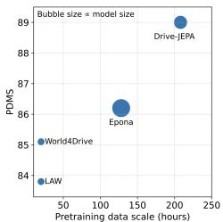
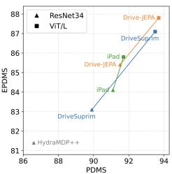
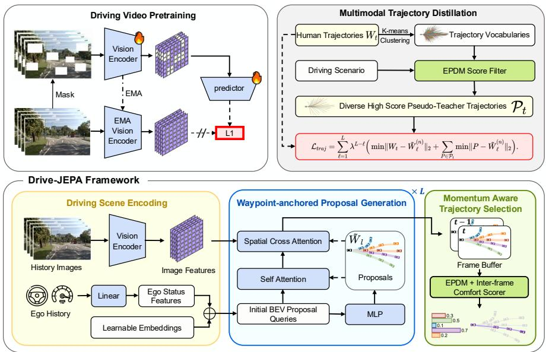
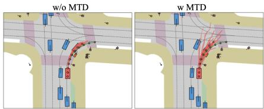
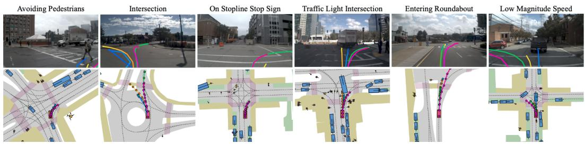
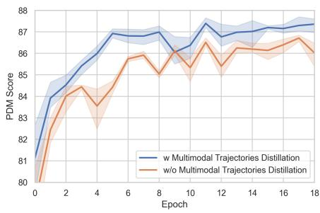
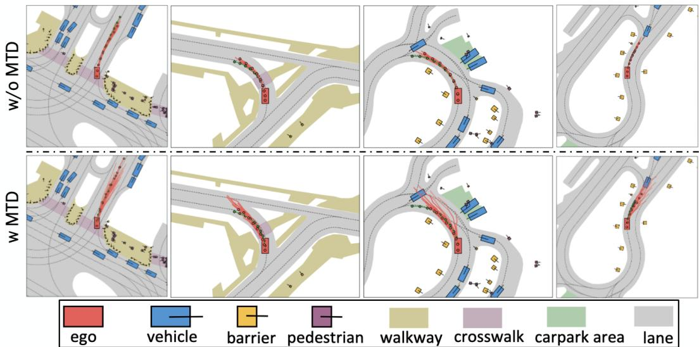

# Drive-JEPA: Video JEPA Meets Multimodal Trajectory Distillation for End-to-End Driving

Linhan Wang∗ Virginia Tech linhanwang@vt.edu

Zichong Yang Purdue University

Chen Bai† XPENG Motors

Guoxiang Zhang XPENG Motors

Xiaotong Liu Xiaoyin Zheng Xiao-Xiao Long Chang-Tien Lu Cheng Lu XPENG Motors XPENG Motors Nanjing University Virginia Tech XPENG Motors

## Abstract

End-to-end autonomous driving increasingly leverages self-supervised video pretraining to learn transferable planning representations. However, pretraining video world models for scene understanding has so far brought only limited improvements. This limitation is compounded by the inherent ambiguity of driving: each scene typically provides only a single human trajectory, making it difficult to learn multimodal behaviors. In this work, we propose Drive-JEPA, a framework that integrates Video Joint-Embedding Predictive Architecture (V-JEPA) with multimodal trajectory distillation for end-to-end driving. First, we adapt V-JEPA for end-toend driving, pretraining a ViT encoder on large-scale driving videos to produce predictive representations aligned with trajectory planning. Second, we introduce a proposal-centric planner that distills diverse simulator-generated trajectories alongside human trajectories, with a momentum-aware selection mechanism to promote stable and safe behavior. When evaluated on NAVSIM, the V-JEPA representation combined with a simple transformer-based decoder outperforms prior methods by 3 PDMS in the perception-free setting. The complete Drive-JEPA framework achieves 93.7 PDMS on v1 and 87.8 EPDMS on v2, setting a new state-of-the-art. Code is available at https://github.com/linhanwang/Drive-JEPA.

## 1 Introduction

End-to-end autonomous driving [11, 22, 35] has emerged as a promising paradigm that directly maps raw sensor observations to driving actions using a unified neural model. By eliminating hand-designed intermediate representations used in traditional modular pipelines, end-to-end approaches aim to reduce information loss and improve scalability by learning directly from large collections of human driving data.

Recently, end-to-end autonomous driving increasingly seeks to leverage self-supervised video pretraining to learn transferable representations for planning. However, pretraining video world models for scene understanding has so far brought only limited improvements. Existing approaches in this direction largely fall into two categories. First, videogenerative methods, such as VaVAM [5] and Epona [47], learn representations by reconstructing or generating videos and then transfer them to planning, but this pixel-level objective incurs heavy computation and may over-emphasize visual details that are irrelevant to decision making. Second, to reduce cost, latent world models predict compact feature dynamics (e.g., LAW [29] predicts feature T+1 from feature T, and World4Drive [48] further introduces pretrained foundation models to enrich latent targets. However, these latent approaches are typically used as auxiliary objectives and have not demonstrated clear benefits from scaling up pretraining.

  
(a) Comparison on perception-free setting

  
(b) Comparison on perception-based setting  
Figure 1: Comparison between end-toend planners on both perception-free and perception-based settings.

Orthogonally, end-to-end driving faces a supervision bottleneck: each scene typically provides only a single human trajectory, despite inherently multimodal futures. Prior works address this by generating multimodal trajectories through either discrete or continuous formulations. Discrete approaches such as VAD v2 [10] and Hydra-MDP [30] cluster trajectories into a fixed vocabulary and predict scores reflecting safety and comfort; however, their expressiveness is fundamentally limited by the coverage and quality of anchor trajectories, leading to poor generalization in out-of-vocabulary scenarios [32]. Alternatively, diffusion-based methods, including DiffusionDrive [32] and GoalFlow [43], model multimodal trajectory distributions via iterative sampling, which has shown strong generative capability. Nevertheless, these approaches remain constrained by supervision from single human trajectories per scene, inherently limiting the diversity of learned behaviors.

In this work, we propose Drive-JEPA, an end-to-end autonomous driving framework that addresses the above two bottlenecks in a unified way. First, we adapt V-JEPA [2, 3] to the driving domain to learn planning-aligned predictive representations from large-scale raw videos, improving transfer beyond prior world-model pretraining. Second, we introduce multimodal trajectory distillation that distills knowledge from simulators into a proposal-centric planner, providing diverse supervision beyond single human trajectories and enabling safer multimodal decision making.

Specifically, our framework consists of three components: Driving Video Pretraining, Multimodal Trajectory Distillation, and Momentum-aware Trajectory Selection. In the first module, we curate a large-scale driving video dataset and pretrain a ViT-based vision encoder using V-JEPA [2, 3], which learns predictive representation by predicting future latent with effective mode collapse prevention. In the second module, the waypoint-anchored proposals generation leverages deformable attention [18, 42] to aggregate BEV features [31] at trajectory waypoints and refine proposals iteratively. To increase diversity, proposals are supervised using both human trajectories and simulator-generated multimodal trajectories that satisfy safety and comfort constraints, enabling effective knowledge distillation from the simulator. Finally, the selection module assigns scores to all candidates by predicting collision risk, traffic-rule compliance, and comfort, and further incorporates a momentum aware penalty to reduce frame-to-frame trajectory distortion.

We validate Drive-JEPA on NAVSIM v1 [12], NAVSIM v2 [8] , and Bench2Drive [24]. Drive-JEPA achieves 93.7 PDMS on NAVSIM v1 and 87.8 EPDMS on NAVSIM v2, setting a new state of the art. Notably, with only a single front-view camera and a lightweight transformer planner, our V-JEPApretrained model outperforms prior work by 3 PDMS in the perception-free setting, highlighting the effectiveness of V-JEPA pretraining for planning. On Bench2Drive, the Multimodal Trajectory Distillation consistently improves driving quality, demonstrating the benefit of diverse supervision for generating safe, multimodal trajectories.

Our contributions can be summarized as follows:

• We introduce V-JEPA pretraining to end-to-end autonomous driving, boosting performance in both perception-based and perception-free settings.

• We propose a novel multimodal trajectories supervision to distill simulator knowledge to a proposal-centric framework, generating diverse multimodal trajectories.

• We design a momentum-aware trajectory selection module, enhancing driving comfort.

• Our method achieves a new state of the art on NAVSIM v1 and NAVSIM v2. In addition, our method achieves strong performance on NAVSIM even without relying on perception annotations.

## 2 Related Work

## 2.1 End-to-end autonomous driving

Early works such as ALVINN [35] and PilotNet [6] leverage large-scale human driving data to learn policies that map sensor observations directly to control actions. However, these models often lack interpretability and can degrade due to issues such as causal confusion. To mitigate this, recent studies incorporate intermediate representations and auxiliary supervision to improve robustness. Transfuser [11] fuses LiDAR and camera features in the BEV space and strengthens BEV features with BEV segmentation and 3D detection supervision. Going further, UniAD [22] unifies the full stack of driving tasks—including tracking, mapping, and motion prediction—within a single framework jointly optimized with planning. VAD [25] explores compact vectorized scene representations for efficiency, while SparseDrive [39] proposes a query-centric sparse structure as a BEV-free alternative. DriveTransformer [23] further improves efficiency by using a small set of learned queries to aggregate multi-view image features. Moreover, DiffusionDrive [32] and GoalFlow [43] investigate diffusionbased end-to-end trajectory generation. A related direction, MomAD [38], exploits cross-frame momentum for temporal consistency but regenerates the trajectory via query-space topological matching, whereas we independently cast momentum as a lightweight selection term fused with a learned scorer that jointly weighs other safety metrics. Despite these advances, end-to-end driving remains challenging due to two fundamental requirements: capturing the spatiotemporal structure of complex scenes and modeling the inherently multimodal nature of driving behaviors.

## 2.2 World Models for End-to-end driving

Video world models in autonomous driving predict how scenes evolve under ego actions. Recent progress in controllable video generation [17, 21] has enabled action-conditioned world models, suggesting their potential as learned simulators. Motivated by the idea that realistic generation implies strong dynamics understanding, several works transfer world-model knowledge to end-to-end driving. VaVIM [5] trains a causal auto-regressive video model and extends it to generate ego trajectories, while Epona [47] proposes a hybrid diffusion–auto-regressive predictor with a dual-stream diffusion decoder for joint video and trajectory synthesis. However, both approaches remain computationally heavy due to pixel-level reconstruction. To improve efficiency, latent world models predict future features instead of pixels [49]. LAW [29] integrates latent dynamics learning into end-to-end driving and achieves strong perception-free performance, and World4Drive [48] further leverages multimodal video foundation models as richer latent targets. Nonetheless, these latent approaches have not clearly demonstrated benefits from scaling to large-scale video pretraining and may suffer from representation collapse. To overcome this, we adopt V-JEPA [3] as an efficient latent world model with built-in collapse prevention, enabling scalable video pretraining for end-to-end driving.

## 2.3 MultiModal Trajectories Generation

In planning tasks such as manipulation and autonomous driving, a given scenario often offers multiple action options, requiring effective multimodal modeling. Recently, VADv2 [10] and Hydra-MDP [30] introduce a large fixed vocabulary of trajectories by discretizing and clustering the continuous action space. For each scene, this vocabulary provides a diverse multimodal choice space for driving behaviors, and planning is performed by selecting trajectories based on predicted scores. However, this paradigm is fundamentally limited by the coverage of the vocabulary and cannot generalize to out-of-vocabulary scenes. Other works introduce diffusion models to generate multimodal trajectories. DiffusionDrive [32] guides the diffusion process using a small fixed vocabulary, while GoalFlow [43] uses goal points as guidance during diffusion-based generation. Compared with computationally expensive diffusion-based methods, proposal-centric approaches such as iPad [18] iteratively refine a set of trajectory proposals using efficient deformable attention. Compared with Hydra-MDP, iPad’s proposals can be viewed as an online-generated continuous vocabulary; however, its candidates are supervised purely by a single human trajectory per scene, which limits diversity. In contrast, our Multimodal Trajectory Distillation breaks this limitation by distilling knowledge from simulatorgenerated trajectories.

## 3 Method

## 3.1 Preliminary

End-to-end Autonomous Driving In the task of end-to-end autonomous driving, the objective is to estimate the future trajectory of the ego vehicle in the form of waypoints. Formally, let

  
Figure 2: Overview of the Drive-JEPA architecture. Driving Video Pretraining learns a ViT encoder from large-scale driving videos using the self-supervised V-JEPA objective. Given the pretrained features, Waypoint-anchored Proposal Generation efficiently produces multiple trajectory proposals, whose distribution is guided by Multimodal Trajectory Distillation. Finally, Momentum-aware Trajectory Selection picks the final trajectory by accounting for cross-frame comfort.

$I _ { t } = \{ I _ { t } ^ { 1 } , I _ { t } ^ { 2 } , \ldots , I _ { t } ^ { N } \}$ denote the set of N surrounding multi-view images captured at time step t. The model is expected to predict a sequence of waypoints $W _ { t } = \{ w _ { t } ^ { 1 } , \overline { { w } } _ { t } ^ { 2 } , \ldots , \overline { { w } } _ { t } ^ { M } \}$ , where each waypoint $w _ { t } ^ { i } = ( x _ { t } ^ { i } , y _ { t } ^ { i } , \psi _ { t } ^ { i } )$ represents the predicted BEV position and heading angle of the ego vehicle at time step $t + i$ . Here, M denotes the number of future positions to be predicted. In addition, the model also takes as input the ego status of the vehicle, which includes the driving command (e.g., left, forward, right), speed, and acceleration.

V-JEPA V-JEPA [4] learns predictive video representations by estimating the latent representation of a target view y from a masked view $x ,$ where a subset of spatiotemporal patches are randomly dropped. The method adopts a meta-architecture with an encoder $E _ { \theta } ( \cdot )$ that extracts video features and a predictor $P _ { \phi } ( \cdot )$ that predicts the representations at masked locations. The encoder and predictor are optimized jointly with

$$
\operatorname* { m i n } _ { \theta , \phi , \Delta _ { y } } \ \| P _ { \phi } ( \Delta _ { y } , E _ { \theta } ( x ) ) - \mathrm { s g } ( E _ { \bar { \theta } } ( y ) ) \| _ { 1 } ,\tag{1}
$$

where $\Delta _ { y }$ is a learnable mask token indicating the dropped patch locations. The target branch uses a stop-gradient operator $\operatorname { s g } ( \cdot )$ and an exponential moving average encoder $E _ { \bar { \theta } }$ (with parameters ¯θ) to stabilize training and avoid representation collapse. The loss is computed only on masked positions. Both $E _ { \theta } ( \cdot )$ and $\bar { P } _ { \phi } ( \cdot )$ are instantiated as Vision Transformers (ViTs) [15].

## 3.2 Driving Video Pretraining

To enhance the representation for planning through self-supervised video pretraining, prior works explored pixel-space driving world models and latent world models. While the former faces expensive computation and the latter fails to scale, we propose to leverage V-JEPA in large-scale driving video pretraining.

Driving Video Dataset Curation and Scaling We initialize the ViT encoder with parameters released by V-JEPA 2 [3]. To bridge the domain gap, we curate a large-scale driving video dataset from three publicly available datasets: CoVLA [1], DrivingDojo [41], and OpenScene(trainval split) [37]. All videos are captured from a front-view camera and pro- captured fr

Table 1: Comparison with previous perception-free planners.
<table><tr><td></td><td>| LAW</td><td>World4Drive</td><td>Epona</td><td>Ours</td></tr><tr><td>Encoder size</td><td>21M</td><td>21M</td><td>1.1B</td><td>307M</td></tr><tr><td>Data scale</td><td>~20h</td><td>~20h</td><td>128h</td><td>330h</td></tr><tr><td>PDMS</td><td>83.8</td><td>85.1</td><td>86.1</td><td>89.0</td></tr></table>

cessed into 8-frame clips at a resolution of $5 1 2 \times 2 5 6$ and 2 Hz. We adopt the V-JEPA objective to train the ViT encoder in a self-supervised manner on this curated dataset. As shown in Table 1, thanks to the efficiency of the latent prediction task and effective mode-collapse prevention, we successfully scale pretraining to 330 hours with lower computational cost than prior methods.

Perception-free End-to-End Autonomous Driving Following prior world-model-based end-toend driving works, we adopt a perception-free setting for evaluation, where the model is supervised solely by human trajectories without relying on perception annotations [29]. Given spatiotemporal features extracted by the ViT encoder from the front-view image, future waypoints are predicted using a transformer decoder with learnable queries. Given the front-view inputs $I _ { t } ^ { 1 }$ and $I _ { t - 1 } ^ { \bar { 1 } } ,$ , we extract spatiotemporal features using the pretrained ViT encoder and denote them as $\mathbf { F } _ { t } \in \mathbb { R } ^ { N _ { f } \times D }$ . We introduce M learnable query embeddings $\mathbf { Q } \in \mathbb { R } ^ { M \times D }$ , each corresponding to one future waypoint. The transformer-based decoder [40] attends to $\mathbf { F } _ { t }$ via cross-attention to produce

$$
\mathbf { H } = \mathrm { T r a n s f o r m e r D e c o d e r } ( \mathbf { Q } , \mathbf { F } _ { t } ) ,
$$

which is then mapped to predicted waypoints $\hat { W } _ { t } = \mathrm { M L P } ( \mathbf { H } )$ , where $\hat { W } _ { t } = \{ \hat { w } _ { t } ^ { 1 } , \dots , \hat { w } _ { t } ^ { M } \}$ and each $\hat { w } _ { t } ^ { i } = ( \hat { x } _ { t } ^ { i } , \hat { y } _ { t } ^ { i } , \hat { \psi } _ { t } ^ { i } )$ represents the BEV position and heading at time step $t + i .$ . The network is trained end-to-end using a MSE loss between $\hat { W } _ { t }$ and the ground-truth trajectory $W _ { t }$ . Despite its simplicity, this setup significantly outperforms prior methods (Table 1), highlighting the effectiveness of V-JEPA-based driving video pretraining.

## 3.3 Waypoint-anchored Proposals Generation

Building upon the strong representations from Driving Video Pretraining, we design a planner that follows a proposal-selection paradigm. As mentioned before, a fixed vocabulary can be seen as proposals but suffers from discretization error. Inspired by iPad [18], we instead generate proposals online.

Given the visual features $\mathbf { F } _ { t } ~ \in ~ \mathbb { R } ^ { N _ { f } \times D }$ and ego status at time t, we project the ego status by a linear layer into an ego feature $\mathbf { e } _ { t } ~ \in ~ \mathbb { R } ^ { 1 \times D }$ The proposal queries are initialized as ${ \bf Q } _ { 0 } \in \mathrm { ~  ~ \Omega ~ }$ $\mathbb { R } ^ { N _ { p } \times M \times \tilde { D _ { } } }$ by adding $\mathbf { e } _ { t }$ to learnable positional embeddings, where $N _ { p }$ is the number of waypointtrajectory proposals and M is the number of future waypoints. We iteratively refine the proposal queries $\mathbf { Q } _ { \ell }$ for L iterations. At iteration ℓ, an MLP decodes $\mathbf { Q } _ { \ell }$ into waypoint-trajectory proposals $\tilde { W } _ { \ell } ~ = ~ \{ \tilde { W } _ { \ell } ^ { ( n ) } \} _ { n = 1 } ^ { N _ { p } }$ , with $\tilde { W } _ { \ell } \ \in \ \mathbb { R } ^ { N _ { p } \times M \times 3 }$ and each waypoint $( x , y , \psi )$ Using these explicit waypoint locations as anchors, we refine the queries by exchanging information among proposals and aggregating features from $\mathbf { F } _ { t }$ around each predicted waypoint via lift-splat BEV feature sampling [34]. We then update the queries with a lightweight MLP:

$$
\begin{array} { r } { \mathbf { Q } _ { \ell + 1 } = \mathrm { M L P } \left( \mathrm { W A D A } ( \mathbf { Q } _ { \ell } , \tilde { W } _ { \ell } , \mathbf { F } _ { t } ) \right) , } \end{array}
$$

where WADA denotes Waypoint-anchored Deformable Attention [42].

Because the final trajectory for planning is selected from $\tilde { W } _ { L }$ , its distribution is critical. Given a human trajectory $W _ { t }$ and the intermediate proposals $\{ \tilde { W } _ { \ell } \} _ { \ell = 0 } ^ { L - 1 }$ , a naive way to guide $\tilde { W } _ { \ell }$ is using the minimum-over-N loss [19] with discounted supervision across iterations:

$$
\mathcal { L } _ { t r a j } = \sum _ { \ell = 0 } ^ { L - 1 } \lambda ^ { L - \ell - 1 } \operatorname* { m i n } _ { n \in \{ 1 , \ldots , N _ { p } \} } \left\| { W _ { t } - \tilde { W } _ { \ell } ^ { ( n ) } } \right\| _ { 2 } ,
$$

where $\lambda = 0 . 1$ down-weights earlier iterations to encourage coarse-to-fine refinement.

However, in autonomous driving, there are often multiple valid choices beyond the single human trajectory for a scene. This naive guidance method limits the multimodality of the proposals. We present our solution in the next section.

## 3.4 Multimodal Trajectories Distillation

To alleviate sparse supervision from a single human trajectory per scene, we distill knowledge from rule-based simulators. HydraMDP [30] performs hydra-distillation by learning scores over a fixed vocabulary. Instead, we let the simulator provide multimodal trajectory targets to guide the proposal distribution.

Concretely, we start by building a trajectory vocabulary following VADv2 and HydraMDP, but use the vocabulary for a different purpose. We gather all trajectories in the training dataset, which includes more than 100k trajectories. Then we use a clustering method, k-means [16], to select trajectory centers. We select 8192 centers as the trajectory vocabulary, balancing coverage and computational cost. For each scene in the training dataset, we select high quality multimodal trajectories from the vocabulary using rule-based simulators. Following NAVSIM v2 [7, 9], we calculate the EPDM score for all trajectories. We refer to the Appendix A for the detailed definition. Specifically, we first run a PID controller to convert 8 waypoints into a denser 41-point trajectory. Then, at each timestep, we replay other road agents, traffic lights, etc., and compute collisions and other metrics. The rule-based simulator in NAVSIM v2 is designed only for evaluation. We further improve the vectorized computation efficiency to meet large-scale offline scoring needs. After obtaining scores for all trajectories in the vocabulary across all scenes in the training dataset, we select a group of multimodal trajectories $\mathcal { P } _ { t } = \{ P _ { t } ^ { 1 } , . . . , P _ { t } ^ { N _ { p s e u d o } } \}$ for each scene by ranking and thresholding. During training, we use these multimodal trajectories as pseudo-teachers to guide the proposals, instead of a single human trajectory. The final $\mathcal { L } _ { t r a j }$ is defined as:

  
Figure 3: Bird’s eye view of proposals.

$$
\sum _ { \ell = 1 } ^ { L } \lambda ^ { L - \ell } \Big ( \operatorname* { m i n } \lVert W _ { t } - \tilde { W } _ { \ell } ^ { ( n ) } \rVert _ { 2 } + \sum _ { P \in \mathcal { P } _ { t } } \operatorname* { m i n } \lVert P - \tilde { W } _ { \ell } ^ { ( n ) } \rVert _ { 2 } \Big ) .\tag{2}
$$

Here, the min operator takes the minimum over the proposal index $n \in \{ 1 , \ldots , N _ { p } \}$ at iteration ℓ. As shown in Figure 3, without Multimodal Trajectories Distillation (MTD), the proposals exhibit clear mode collapse; with MTD, they become multimodal.

## 3.5 Momentum-aware Trajectory Selection

To select the best trajectory among the proposal set for planning, we train a neural scorer to evaluate the final proposals $\{ { \tilde { W } _ { L } } ^ { ( n ) } \} _ { n = 1 } ^ { N _ { p } }$ . Concretely, we apply max pooling over the waypoint dimension to the proposal queries $\mathbf { Q } _ { L } ^ { - } \in \bar { \mathbb { R } } ^ { \bar { N } _ { p } \times M \times D }$ to obtain pooled features $\bar { \mathbf Q } _ { L } \in \mathbb R ^ { N _ { p } \times D }$ , which are then fed into a multi-layer perceptron (MLP) to produce proposal scores $\dot { S } \in \mathbb R ^ { N _ { p } \times 1 }$ . The scorer is trained with a binary cross-entropy (BCE) loss:

$$
\mathcal { L } _ { \mathrm { s c o r e } } = \operatorname { B C E } ( S , \hat { S } ) ,
$$

where $\mathrm { B C E } ( x , y ) = - y \log x - ( 1 - y ) \log ( 1 - x )$ . The supervision $\hat { S }$ is derived from simulator-based EPDMS evaluation and is also used to define candidate pseudo-targets $\mathcal { P } _ { t } = \{ P _ { t } ^ { 1 } , . . . , P _ { t } ^ { N _ { p s e u d o } } \}$ While Multimodal Trajectory Distillation improves proposal diversity, it can amplify temporal inconsistency, increasing discomfort due to larger variation across adjacent time frames. To mitigate this, we make the score momentum-aware by incorporating a comfort term. Let $\hat { W } _ { t - 1 }$ denote the selected trajectory at the previous time frame. We compute a distortion-based comfort score $S _ { c } \in \mathbb { R } ^ { N _ { p } \times 1 }$ by comparing $\hat { W } _ { t - 1 }$ with each current proposal in $\{ \tilde { W } _ { L } ^ { ( n ) } \} _ { n = 1 } ^ { N _ { p } }$ , and recalibrate the learned score via

$$
S \gets \frac { 7 S + S _ { c } } { 8 } .
$$

where the weights are following NAVSIM $\mathbf { v } 2 .$ Finally, the selected trajectory is formalized as

$$
\hat { W } _ { t } = \tilde { W } _ { L } ^ { ( n ^ { * } ) } , \quad n ^ { * } = \arg \operatorname* { m a x } _ { n \in \{ 1 , \dots , N _ { p } \} } S _ { n } ,
$$

where $S _ { n }$ denotes the recalibrated score of proposal $\tilde { W } _ { L } ^ { ( n ) }$

## 3.6 Losses

In end-to-end driving tasks, it is important to add auxiliary tasks to enhance the model’s environment understanding capability, e.g., BEV map segmentation, 3D object detection, and tracking. However, these traditional dense understanding tasks are computationally intensive. Here we use the lightweight auxiliary tasks instead [18], which contain rich spatiotemporal signals and are compatible with the proposal-centric design.

We use two auxiliary tasks: proposal-centric mapping and collision prediction. For the first task, our model predicts the on-road and on-route probabilities of the proposed waypoints in ${ \tilde { W } } _ { \ell } ,$ denoted as $R \in \mathbb { R } ^ { N _ { p } \times M \times 2 }$ . The proposal-centric mapping loss is $\mathcal { L } _ { m a p } = \mathrm { B C E } ( R , \hat { R } )$ . For proposal-centric collision prediction, we estimate the collision probability $A _ { v }$ of waypoints in $\tilde { W } _ { \ell }$ using log-replay simulation. This task not only requires the model to detect surrounding objects, but also to understand their moving pattern. The proposal-centric collision loss is $\mathcal { L } _ { c o l l i } = \Vert A _ { v } - \hat { A } _ { v } \Vert + 0 . 1 \mathrm { B C E } ( A _ { v } , \hat { A } _ { v } )$ Our Drive-JEPA is end-to-end differentiable. The training loss is defined as:

$$
\mathcal { L } = \mathcal { L } _ { t r a j } + w _ { s c o r e } \mathcal { L } _ { s c o r e } + w _ { m a p } \mathcal { L } _ { m a p } + w _ { c o l l i } \mathcal { L } _ { c o l l i } ,
$$

where $w _ { s c o r e } = 1 , w _ { m a p } = 2$ and $w _ { c o l l i } = 1$

## 4 Experiments

## 4.1 Dataset and Metrics

We evaluate our method on three benchmarks, including NAVSIM v1, NAVSIM v2 and Bench2Drive.

NAVSIM v1 NAVSIM is a real-world dataset based on OpenScene [37] and NuPlan [7]. It contains 103k and 12k diverse and challenging driving scenarios for model training (Navtrain) and evaluation (Navtest), and introduces simulation-based metrics to better review closed-loop planning capability through open-loop evaluation. During evaluation, the output trajectory is evaluated by a simulator to get rule-based simulation metric scores, including No at-fault Collisions(NC), Drivable Area Compliance(DAC), Time to Collision with bounds(TTC), Ego Progress(EP) and Comfort(C). The final PDM Score(PDMS) is derived by aggregating these metrics:

$$
P D M S = N C \times D A C \times { \frac { 5 \times ( E P + T T C ) + 2 \times C } { 1 2 } }\tag{3}
$$

NAVSIM v2 Compared with NAVSIM v1, NAVSIM v2 strengthens driving-quality evaluation by extending PDMS to EPDMS with richer rule-compliance and comfort assessment. It adds Driving Direction Compliance (DDC), Traffic Light Compliance (TLC), and Lane Keeping (LK) to better capture traffic-rule adherence, and replaces the original comfort term with History Comfort (HC) and Extended Comfort (EC) to evaluate both short- and longer-horizon smoothness.

Bench2Drive Bench2Drive [24] is a closed-loop evaluation benchmark based on CARLA [14], designed to assess end-to-end autonomous driving systems in interactive urban scenarios. The evaluation includes 220 routes spanning 44 diverse, interactive scenarios. Official metrics include Driving Score (DS), Success Rate (SR), Efficiency and Comfortness, which collectively measure navigation performance, safety, and rule adherence. For detailed metric definitions, see Appendix A.

## 4.2 Implementation Details

In the Driving Video Pretraining stage, we use 8 H800 GPUs and train for 50 epochs, which takes about 3 days. The Drive-JEPA planners are trained on two NVIDIA A30 GPUs for 20 epochs with a total batch size of 64, using the Adam [26] optimizer with a learning rate of $1 \times 1 0 ^ { - 4 }$ , while the ViT encoder uses a learning rate of $1 \times 1 0 ^ { - 5 }$ . We set $N _ { p } = 3 2$ proposals, which is efficient while achieving strong performance in our ablation studies. We use only the front-view camera, resized to 512 × 256. Despite using fewer input images than prior methods and no LiDAR, we outperform them. See Appendix B for details.

## 4.3 Main Results

Results on NAVSIM v1 As shown in Table 2, Drive-JEPA achieves the best PDMS with both ResNet34 and ViT/L backbones, surpassing the strongest prior method DriveSuprim [45] by 0.2 PDMS under ViT/L. Notably, while maintaining high safety metrics such as NC and TTC, our method achieves the best DAC and Ego Progress, resulting in safer yet more assertive driving.

Perception-free End-to-end Autonomous Driving We also evaluated our method in a perceptionfree setting, where we use a simple decoder with the pretrained ViT encoder as described in 3.2. As shown in Table 2, our method surpasses previous methods by a large margin, regardless of backbone size. The PDMS is even close to SOTA methods that rely on perception annotations, demonstrating the strength of V-JEPA pretraining.

Results on NAVSIM v2 NAVSIM v2 has more sophisticated metrics than NAVSIM v1. Our method still outperformances all prior methods. While prior methods struggle with EC, our method performs quite well while achieving good results on safety metrics, traffic rule compliance and Ego Progress.

Table 2: Quantitative comparisons on NAVSIM v1. Bold/underlined mark the best/second-best; the first block is the perception-free setting.
<table><tr><td rowspan=1 colspan=2>Method</td><td rowspan=1 colspan=8>BackboneInputsNC↑DAC↑||EP↑C↑TTC ↑ | PDMS ↑</td></tr><tr><td rowspan=2 colspan=2>LAW [29]World4Drive [48]Epona [47]Ours</td><td rowspan=2 colspan=1>resnet34resnet34ViT/GViT/L</td><td rowspan=2 colspan=1>C&amp;LC&amp;LCameraCamera</td><td rowspan=1 colspan=3>97.4  93.397.4  94.3</td><td rowspan=1 colspan=2>78.8 100  91.979.9 100  92.8</td><td rowspan=1 colspan=1>83.885.1</td></tr><tr><td rowspan=1 colspan=3>97.9  95.198.7  96.2</td><td rowspan=1 colspan=2>80.4 99.9  93.882.9 100  95.5</td><td rowspan=1 colspan=1>86.289.0</td></tr><tr><td rowspan=2 colspan=2>Transfuser [11]HydraMDP [30]</td><td rowspan=8 colspan=1>ResNet34ResNet34ResNet34ResNet34ResNet34ResNet34ResNet34ResNet34ResNet34</td><td rowspan=4 colspan=1>C&amp;LC&amp;LC&amp;LC&amp;L</td><td rowspan=2 colspan=3>97.7  92.898.3  96.0</td><td rowspan=1 colspan=2>79.2 100  92.8</td><td rowspan=1 colspan=1>84.0</td></tr><tr><td rowspan=1 colspan=1>HydraMD</td><td rowspan=1 colspan=2>78.7 100  94.6</td><td rowspan=1 colspan=1>86.5</td></tr><tr><td rowspan=6 colspan=2>HydraMDP++ [28]DiffusionDrive [32]GoalFLow [43]DriveDPO [36]DriveSuprim [45]iPad [18]Drive-JEPA(Ours)</td><td rowspan=2 colspan=3>97.6  96.098.2  96.2</td><td rowspan=1 colspan=2>80.4 100  93.1</td><td rowspan=1 colspan=1>86.6</td></tr><tr><td rowspan=1 colspan=2>82.2100  94.7</td><td rowspan=1 colspan=1>88.1</td></tr><tr><td rowspan=4 colspan=1>C&amp;LC&amp;LCameraCameraCamera</td><td rowspan=1 colspan=3>98.4  98.3</td><td rowspan=1 colspan=2>85.0 100  94.6</td><td rowspan=1 colspan=1>90.3</td></tr><tr><td rowspan=2 colspan=3>98.5  98.1</td><td rowspan=3 colspan=2>84.3 100  94.886.7 100  93.687.499.9  94.988.899.9 94.2</td><td rowspan=3 colspan=1>90.089.991.191.5</td></tr><tr><td rowspan=1 colspan=3>97.8 97.3</td></tr><tr><td rowspan=1 colspan=3>98.4 97.9</td></tr><tr><td rowspan=6 colspan=2>Hydra-MDP [30]iPad [18]DriveSuprim [45]DrivR [27]Drive-JEPA(Ours)</td><td rowspan=6 colspan=1>ViT/LViT/LViT/LViT/LViT/L</td><td rowspan=2 colspan=1>C&amp;LCamera</td><td rowspan=2 colspan=3>98.4  97.799.2</td><td rowspan=2 colspan=2>85.0100  94.587.899.7  96.3</td><td rowspan=3 colspan=1>89.991.793.5</td></tr><tr><td rowspan=1 colspan=3>99.2 97.4</td></tr><tr><td rowspan=3 colspan=1>CameraCamera</td><td rowspan=3 colspan=3>98.698.3</td><td rowspan=4 colspan=2>10089.1 100  96.291.499.9 96.2</td></tr><tr><td rowspan=2 colspan=1>98.3</td><td rowspan=2 colspan=1>89.1</td><td></td></tr><tr><td rowspan=2 colspan=1>93.193.7</td></tr><tr><td rowspan=1 colspan=1>Camera</td><td rowspan=1 colspan=3>99.1  98.2</td></tr></table>

Table 3: Quantitative comparisons on NAVSIM v2.
<table><tr><td>Method</td><td>Backbone</td><td>|NC↑</td><td>DAC↑</td><td>DDC↑</td><td>TL↑</td><td>EP↑</td><td>TTC↑</td><td>LK↑</td><td>HC↑</td><td>EC↑</td><td>EPDMS↑</td></tr><tr><td rowspan="4">Transfuser HydraMDP++ DriveSuprim</td><td>ResNet34</td><td>96.9</td><td>89.9</td><td>97.8</td><td>99.7</td><td>87.1</td><td>95.4</td><td>92.7</td><td>98.3</td><td>87.2</td><td>76.7</td></tr><tr><td>ResNet34</td><td>97.2</td><td>97.5</td><td>99.4</td><td>99.6</td><td>83.1</td><td>96.5</td><td>94.4</td><td>98.2</td><td>70.9</td><td>81.4</td></tr><tr><td>ResNet34</td><td>97.5</td><td>96.5</td><td>99.4</td><td>99.6</td><td>88.4</td><td>96.6</td><td>95.5</td><td>98.3</td><td>77.0</td><td>83.1</td></tr><tr><td>ResNet34</td><td>98.7 97.8</td><td>99.1</td><td></td><td>99.8</td><td>84.0</td><td>98.0</td><td>96.0</td><td>98.0</td><td>68.2</td><td>84.1</td></tr><tr><td rowspan="3">Ours HydraMDP++ iPad</td><td>ResNet34</td><td>98.8</td><td>97.4</td><td>99.0</td><td>99.8</td><td>83.5</td><td>98.0</td><td>96.2</td><td>98.1</td><td>85.6</td><td>85.4</td></tr><tr><td>ViT/L</td><td>98.5</td><td>98.5</td><td>99.5</td><td>99.7</td><td>87.4</td><td>97.9</td><td>95.8</td><td>98.2</td><td>75.7</td><td>85.6</td></tr><tr><td>ViT/L</td><td>98.7 98.0</td><td></td><td>98.9</td><td>99.8</td><td>86.6</td><td>98.3</td><td>97.2</td><td>98.3</td><td>74.6</td><td>85.8</td></tr><tr><td rowspan="2">DriveSuprim Ours</td><td>ViT/L</td><td>98.4</td><td>98.6</td><td>99.6</td><td>99.8</td><td>90.5</td><td>97.8</td><td>97.0</td><td>98.3</td><td>78.6</td><td>87.1</td></tr><tr><td>ViT/L</td><td>98.4</td><td>98.6</td><td>99.1</td><td>99.8</td><td>88.4</td><td>97.8</td><td>97.6</td><td>97.9</td><td>84.8</td><td>87.8</td></tr></table>

Results on Bench2Drive Bench2Drive evaluates autonomous agents in close-loop simulation. Our method achieves the best Driving Score with very competitive Efficiency. Our method surpasses another proposal-centric method iPad by 4 in Driving Score, identifying the effectiveness of Multimodal Trajectories Distillation.

  
Figure 4: Qualitative comparison of trajectories by different models in front-facing camera and bird’s eye view on different driving scenarios. Trajectories are shown for: Human Trajectory, Drive-JEPA, iPad, Transfuser.

Table 4: Quantitative comparisons on Bench2Drive.
<table><tr><td>Method</td><td>Effi.↑</td><td>Comf. ↑</td><td> $\mathbf { s } \mathbf { R } \uparrow$ </td><td> $\mathbf { D } \mathbf { S } \uparrow$ </td></tr><tr><td>AD-MLP</td><td>48.45</td><td>22.63</td><td>0.00</td><td>18.05</td></tr><tr><td>UniAD</td><td>129.21</td><td>43.58</td><td>16.36</td><td>45.81</td></tr><tr><td>VAD</td><td>157.94</td><td>46.01</td><td>15.00</td><td>42.35</td></tr><tr><td>TCP</td><td>76.54</td><td>18.08</td><td>30.00</td><td>59.90</td></tr><tr><td>DriveDPO</td><td>166.80</td><td>26.79</td><td>30.62</td><td>62.02</td></tr><tr><td>iPad</td><td>153.83</td><td>35.51</td><td>33.18</td><td>60.52</td></tr><tr><td>DriveTransformer</td><td>100.64</td><td>20.78</td><td>35.01</td><td>63.46</td></tr><tr><td>Ours</td><td>157.85</td><td>30.24</td><td>36.82</td><td>64.52</td></tr></table>

Table 5: Comparison with mainstream vision pretraining methods.
<table><tr><td>Vision Encoder</td><td>Size</td><td>PDMS↑</td></tr><tr><td>Epona [47]</td><td>ViT/G</td><td>86.2</td></tr><tr><td>ImageNet [13]</td><td>ResNet34</td><td>76.0</td></tr><tr><td>DepthAnything [44]</td><td>ViT/L</td><td>-</td></tr><tr><td>MAE [20]</td><td>ViT/L</td><td>=</td></tr><tr><td>Dinov2 [33]</td><td>ViT/L</td><td>76.1</td></tr><tr><td>Sigclip [46]</td><td>ViT/L</td><td>83.4</td></tr><tr><td>V-JEPA 2 [3]</td><td>ViT/L</td><td>86.1</td></tr><tr><td>Ours</td><td>ViT/L</td><td>89.0</td></tr></table>

Table 6: Ablation study of the proposed modules on NAVSIM v2.
<table><tr><td> $\mathcal { M } _ { 1 }$ </td><td> $\mathcal { M } _ { 2 }$ </td><td> $\mathcal { M } _ { 3 }$ </td><td> $\mathcal { M } _ { 4 }$ </td><td>|NC↑</td><td>DAC↑</td><td>DDC↑</td><td>TL↑|</td><td>EP↑</td><td>TTC↑</td><td>LK↑</td><td>HC↑</td><td>EC↑|</td><td> $\mathcal { D } \uparrow$ </td><td>EPDMS↑</td></tr><tr><td>X</td><td>X</td><td>X</td><td>X</td><td>98.7</td><td>97.8</td><td>99.1</td><td>99.8</td><td>84.0</td><td>98.0</td><td>96.0</td><td>98.0</td><td>68.2</td><td>25%</td><td>84.1</td></tr><tr><td>√</td><td>X</td><td>X</td><td>X</td><td>98.7</td><td>98.0</td><td>98.9</td><td>99.8</td><td>86.6</td><td>98.3</td><td>97.2</td><td>98.3</td><td>74.6</td><td>21%</td><td> $8 5 . 8 _ { + 1 . 7 }$ </td></tr><tr><td>X</td><td>√</td><td>X</td><td>X</td><td>98.3</td><td>98.1</td><td>99.1</td><td>99.9</td><td>89.1</td><td>97.7</td><td>97.7</td><td>98.1</td><td>69.7</td><td>24%</td><td> $8 6 . 1 _ { + 2 . 0 }$ </td></tr><tr><td>X</td><td>√</td><td>√</td><td>X</td><td>98.5</td><td>98.6</td><td>99.1</td><td>99.8</td><td>89.1</td><td>97.9</td><td>97.6</td><td>97.8</td><td>47.9</td><td>40%</td><td> $8 4 . 5 \substack { + 0 . 4 }$ </td></tr><tr><td>X</td><td>√</td><td>√</td><td>√</td><td>98.4</td><td>98.6</td><td>99.1</td><td>99.8</td><td>88.4</td><td>97.8</td><td>97.6</td><td>97.9</td><td>84.8</td><td>40%</td><td> $8 7 . 8 _ { + 3 . 7 }$ </td></tr></table>

## 4.4 Ablation Studies

Ablation studies on proposed modules We first conducted ablation studies on the proposed modules: $\mathcal { M } _ { 1 } \colon$ V-JEPA 2 checkpoints, $\mathcal { M } _ { 2 } \colon$ Driving Video Pretraining, $\mathcal { M } _ { 3 } \colon$ Multimodal Trajectories Distilla tion, and $\mathcal { M } _ { 4 } \colon$ Momentum-aware Trajectory Selection. As shown in Table 6, replacing ResNet34 with the ViT released by $\mathsf { V } \mathrm { - J } \mathsf { E P A } \ b 2 \left( \dot { \mathscr { M } } _ { 1 } \right)$ improves EPDMS. Our Driving Video Pretraining further boosts performance by reducing the domain gap $( \boldsymbol { \mathcal { M } } _ { 2 } )$ . After adding $\mathcal { M } _ { 3 }$ , the framework achieves better D (Diversity) [32] and overall metrics, which is also supported by the validation score curve in Figure 5. However, the increased diversity results in worse EC. Finally, adding $\mathcal { M } _ { 4 }$ not only largely boosts EC to 84.8, but also sets a new best record on EPDMS.

Ablation study on the number of Pseudo Teacher Trajectories. As shown in Table 7, we tried $N _ { p s e u d o } = 0 , 1 , 2 , 4 , 8$ pseudo-teacher trajectories. While the correlation between $N _ { p s e u d o }$ and EPDMS is not very strong, using pseudo-teacher trajectories consistently performs better than using none $( N _ { p s e u d o } = \dot { 0 } )$

Table 7: Ablation on number of pseudo-teacher trajectories.
<table><tr><td> $N _ { p s e u d o }$ </td><td>0</td><td>1</td><td>2</td><td>4</td><td>8</td></tr><tr><td>EPDMS</td><td>87.2</td><td>87.8</td><td>87.7</td><td>87.8</td><td>87.5</td></tr></table>

  
Figure 5: Multimodal Trajectory Distillation improves PDM score.

Ablation on Driving Video Pretraining. We use the same simple decoder with encoders pretrained by mainstream pretraining methods. As shown in Table 5, V-JEPA 2 performs the best among them. MAE and DepthAnything could not converge. This highlights the strength of the V-JEPA objective for video pretraining. In this work, we curated a large driving video dataset. The ViT/L encoder trained on this dataset with the V-JEPA objective further boosts performance, surpassing the SOTA Epona by 3 PDMS.

## 5 Conclusion

We proposed Drive-JEPA, an end-to-end driving framework that combines V-JEPA video pretraining with multimodal trajectory distillation to mitigate imitation-learning modal collapse. Pretraining a ViT encoder on large-scale driving videos yields strong planning representations, enabling a simple decoder to achieve competitive perception-free performance. Distilling simulator-guided pseudoteacher trajectories improves proposal diversity, and momentum-aware selection further enhances temporal stability and comfort. Drive-JEPA achieves state-of-the-art results on NAVSIM v1/v2 and improves closed-loop performance on Bench2Drive.

## Acknowledgments and Disclosure of Funding

## References

[1] Hidehisa Arai, Keita Miwa, Kento Sasaki, Kohei Watanabe, Yu Yamaguchi, Shunsuke Aoki, and Issei Yamamoto. Covla: Comprehensive vision-language-action dataset for autonomous driving. In 2025 IEEE/CVF Winter Conference on Applications of Computer Vision (WACV), pages 1933–1943. IEEE, 2025.

[2] Mahmoud Assran, Quentin Duval, Ishan Misra, Piotr Bojanowski, Pascal Vincent, Michael Rabbat, Yann LeCun, and Nicolas Ballas. Self-supervised learning from images with a jointembedding predictive architecture. In Proceedings of the IEEE/CVF Conference on Computer Vision and Pattern Recognition, pages 15619–15629, 2023.

[3] Mido Assran, Adrien Bardes, David Fan, Quentin Garrido, Russell Howes, Matthew Muckley, Ammar Rizvi, Claire Roberts, Koustuv Sinha, Artem Zholus, et al. V-jepa 2: Self-supervised video models enable understanding, prediction and planning. arXiv preprint arXiv:2506.09985, 2025.

[4] Adrien Bardes, Quentin Garrido, Jean Ponce, Xinlei Chen, Michael Rabbat, Yann LeCun, Mahmoud Assran, and Nicolas Ballas. Revisiting feature prediction for learning visual representations from video. arXiv preprint arXiv:2404.08471, 2024.

[5] Florent Bartoccioni, Elias Ramzi, Victor Besnier, Shashanka Venkataramanan, Tuan-Hung Vu, Yihong Xu, Loick Chambon, Spyros Gidaris, Serkan Odabas, David Hurych, et al. Vavim and vavam: Autonomous driving through video generative modeling. arXiv preprint arXiv:2502.15672, 2025.

[6] Mariusz Bojarski, Davide Del Testa, Daniel Dworakowski, Bernhard Firner, Beat Flepp, Prasoon Goyal, Lawrence D Jackel, Mathew Monfort, Urs Muller, Jiakai Zhang, et al. End to end learning for self-driving cars. arXiv preprint arXiv:1604.07316, 2016.

[7] Holger Caesar, Juraj Kabzan, Kok Seang Tan, Whye Kit Fong, Eric Wolff, Alex Lang, Luke Fletcher, Oscar Beijbom, and Sammy Omari. nuplan: A closed-loop ml-based planning benchmark for autonomous vehicles. arXiv preprint arXiv:2106.11810, 2021.

[8] Wei Cao, Marcel Hallgarten, Tianyu Li, Daniel Dauner, Xunjiang Gu, Caojun Wang, Yakov Miron, Marco Aiello, Hongyang Li, Igor Gilitschenski, Boris Ivanovic, Marco Pavone, Andreas Geiger, and Kashyap Chitta. Pseudo-simulation for autonomous driving. In Conference on Robot Learning (CoRL), 2025.

[9] Wei Cao, Marcel Hallgarten, Tianyu Li, Daniel Dauner, Xunjiang Gu, Caojun Wang, Yakov Miron, Marco Aiello, Hongyang Li, Igor Gilitschenski, et al. Pseudo-simulation for autonomous driving. arXiv preprint arXiv:2506.04218, 2025.

[10] Shaoyu Chen, Bo Jiang, Hao Gao, Bencheng Liao, Qing Xu, Qian Zhang, Chang Huang, Wenyu Liu, and Xinggang Wang. Vadv2: End-to-end vectorized autonomous driving via probabilistic planning. arXiv preprint arXiv:2402.13243, 2024.

[11] Kashyap Chitta, Aditya Prakash, Bernhard Jaeger, Zehao Yu, Katrin Renz, and Andreas Geiger. Transfuser: Imitation with transformer-based sensor fusion for autonomous driving. IEEE transactions on pattern analysis and machine intelligence, 45(11):12878–12895, 2022.

[12] Daniel Dauner, Marcel Hallgarten, Tianyu Li, Xinshuo Weng, Zhiyu Huang, Zetong Yang, Hongyang Li, Igor Gilitschenski, Boris Ivanovic, Marco Pavone, et al. Navsim: Data-driven nonreactive autonomous vehicle simulation and benchmarking. Advances in Neural Information Processing Systems, 37:28706–28719, 2024.

[13] Jia Deng, Wei Dong, Richard Socher, Li-Jia Li, Kai Li, and Li Fei-Fei. Imagenet: A largescale hierarchical image database. In 2009 IEEE conference on computer vision and pattern recognition, pages 248–255. Ieee, 2009.

[14] Alexey Dosovitskiy, German Ros, Felipe Codevilla, Antonio Lopez, and Vladlen Koltun. Carla: An open urban driving simulator. In Conference on robot learning, pages 1–16. PMLR, 2017.

[15] Alexey Dosovitskiy, Lucas Beyer, Alexander Kolesnikov, Dirk Weissenborn, Xiaohua Zhai, Thomas Unterthiner, Mostafa Dehghani, Matthias Minderer, G Heigold, S Gelly, et al. An image is worth 16x16 words: Transformers for image recognition at scale. In International Conference on Learning Representations, 2020.

[16] Matthijs Douze, Alexandr Guzhva, Chengqi Deng, Jeff Johnson, Gergely Szilvasy, Pierre-Emmanuel Mazaré, Maria Lomeli, Lucas Hosseini, and Hervé Jégou. The faiss library. 2024.

[17] Shenyuan Gao, Jiazhi Yang, Li Chen, Kashyap Chitta, Yihang Qiu, Andreas Geiger, Jun Zhang, and Hongyang Li. Vista: A generalizable driving world model with high fidelity and versatile controllability. Advances in Neural Information Processing Systems, 37:91560–91596, 2024.

[18] Ke Guo, Haochen Liu, Xiaojun Wu, Jia Pan, and Chen Lv. ipad: Iterative proposal-centric end-to-end autonomous driving. arXiv preprint arXiv:2505.15111, 2025.

[19] Agrim Gupta, Justin Johnson, Li Fei-Fei, Silvio Savarese, and Alexandre Alahi. Social gan: Socially acceptable trajectories with generative adversarial networks. In Proceedings of the IEEE conference on computer vision and pattern recognition, pages 2255–2264, 2018.

[20] Kaiming He, Xinlei Chen, Saining Xie, Yanghao Li, Piotr Dollár, and Ross Girshick. Masked autoencoders are scalable vision learners. In Proceedings of the IEEE/CVF conference on computer vision and pattern recognition, pages 16000–16009, 2022.

[21] Anthony Hu, Lloyd Russell, Hudson Yeo, Zak Murez, George Fedoseev, Alex Kendall, Jamie Shotton, and Gianluca Corrado. Gaia-1: A generative world model for autonomous driving. arXiv preprint arXiv:2309.17080, 2023.

[22] Yihan Hu, Jiazhi Yang, Li Chen, Keyu Li, Chonghao Sima, Xizhou Zhu, Siqi Chai, Senyao Du, Tianwei Lin, Wenhai Wang, et al. Planning-oriented autonomous driving. In Proceedings of the IEEE/CVF conference on computer vision and pattern recognition, pages 17853–17862, 2023.

[23] Xiaosong Jia, Junqi You, Zhiyuan Zhang, and Junchi Yan. Drivetransformer: Unified transformer for scalable end-to-end autonomous driving. In The Thirteenth International Conference on Learning Representations.

[24] Xiaosong Jia, Zhenjie Yang, Qifeng Li, Zhiyuan Zhang, and Junchi Yan. Bench2drive: Towards multi-ability benchmarking of closed-loop end-to-end autonomous driving. In NeurIPS 2024 Datasets and Benchmarks Track, 2024.

[25] Bo Jiang, Shaoyu Chen, Qing Xu, Bencheng Liao, Jiajie Chen, Helong Zhou, Qian Zhang, Wenyu Liu, Chang Huang, and Xinggang Wang. Vad: Vectorized scene representation for efficient autonomous driving. In Proceedings of the IEEE/CVF International Conference on Computer Vision, pages 8340–8350, 2023.

[26] Diederik P Kingma. Adam: A method for stochastic optimization. arXiv preprint arXiv:1412.6980, 2014.

[27] Ellington Kirby, Alexandre Boulch, Yihong Xu, Yuan Yin, Gilles Puy, Éloi Zablocki, Andrei Bursuc, Spyros Gidaris, Renaud Marlet, Florent Bartoccioni, Anh-Quan Cao, Nermin Samet, Tuan-Hung Vu, and Matthieu Cord. Driving on registers. In CVPR, 2026.

[28] Kailin Li, Zhenxin Li, Shiyi Lan, Yuan Xie, Zhizhong Zhang, Jiayi Liu, Zuxuan Wu, Zhiding Yu, and Jose M Alvarez. Hydra-mdp++: Advancing end-to-end driving via expert-guided hydra-distillation. arXiv preprint arXiv:2503.12820, 2025.

[29] Yingyan Li, Lue Fan, Jiawei He, Yuqi Wang, Yuntao Chen, Zhaoxiang Zhang, and Tieniu Tan. Enhancing end-to-end autonomous driving with latent world model. In The Thirteenth International Conference on Learning Representations.

[30] Zhenxin Li, Kailin Li, Shihao Wang, Shiyi Lan, Zhiding Yu, Yishen Ji, Zhiqi Li, Ziyue Zhu, Jan Kautz, Zuxuan Wu, et al. Hydra-mdp: End-to-end multimodal planning with multi-target hydra-distillation. arXiv preprint arXiv:2406.06978, 2024.

[31] Zhiqi Li, Wenhai Wang, Hongyang Li, Enze Xie, Chonghao Sima, Tong Lu, Qiao Yu, and Jifeng Dai. Bevformer: learning bird’s-eye-view representation from lidar-camera via spatiotemporal transformers. IEEE Transactions on Pattern Analysis and Machine Intelligence, 2024.

[32] Bencheng Liao, Shaoyu Chen, Haoran Yin, Bo Jiang, Cheng Wang, Sixu Yan, Xinbang Zhang, Xiangyu Li, Ying Zhang, Qian Zhang, et al. Diffusiondrive: Truncated diffusion model for end-to-end autonomous driving. In Proceedings of the Computer Vision and Pattern Recognition Conference, pages 12037–12047, 2025.

[33] Maxime Oquab, Timothée Darcet, Théo Moutakanni, Huy Vo, Marc Szafraniec, Vasil Khalidov, Pierre Fernandez, Daniel Haziza, Francisco Massa, Alaaeldin El-Nouby, et al. Dinov2: Learning robust visual features without supervision. arXiv preprint arXiv:2304.07193, 2023.

[34] Jonah Philion and Sanja Fidler. Lift, splat, shoot: Encoding images from arbitrary camera rigs by implicitly unprojecting to 3d. In European conference on computer vision, pages 194–210. Springer, 2020.

[35] Dean A Pomerleau. Alvinn: An autonomous land vehicle in a neural network. Advances in neural information processing systems, 1, 1988.

[36] Shuyao Shang, Yuntao Chen, Yuqi Wang, Yingyan Li, and Zhaoxiang Zhang. Drivedpo: Policy learning via safety dpo for end-to-end autonomous driving. arXiv preprint arXiv:2509.17940, 2025.

[37] Chonghao Sima, Wenwen Tong, Tai Wang, Li Chen, Silei Wu, Hanming Deng, Yi Gu, Lewei Lu, Ping Luo, Dahua Lin, and Hongyang Li. Scene as occupancy. 2023.

[38] Ziying Song, Caiyan Yang, Yuhang Wen, Lei Peng, Yanan Zhang, Jianyun Zhao, Lin Wang, Congcong Han, Yiyang Fan, Zhijie Sun, Lin Zhao, and Yadan Wu. Don’t shake the wheel: Momentum-aware planning in end-to-end autonomous driving. In Proceedings ofthe Computer Vision and Pattern Recognition Conference, 2025.

[39] Wenchao Sun, Xuewu Lin, Yining Shi, Chuang Zhang, Haoran Wu, and Sifa Zheng. Sparsedrive: End-to-end autonomous driving via sparse scene representation. In 2025 IEEE International Conference on Robotics and Automation (ICRA), pages 8795–8801. IEEE, 2025.

[40] Ashish Vaswani, Noam Shazeer, Niki Parmar, Jakob Uszkoreit, Llion Jones, Aidan N Gomez, Łukasz Kaiser, and Illia Polosukhin. Attention is all you need. Advances in neural information processing systems, 30, 2017.

[41] Yuqi Wang, Ke Cheng, Jiawei He, Qitai Wang, Hengchen Dai, Yuntao Chen, Fei Xia, and Zhao-Xiang Zhang. Drivingdojo dataset: Advancing interactive and knowledge-enriched driving world model. Advances in Neural Information Processing Systems, 37:13020–13034, 2024.

[42] Zhuofan Xia, Xuran Pan, Shiji Song, Li Erran Li, and Gao Huang. Vision transformer with deformable attention. In Proceedings of the IEEE/CVF conference on computer vision and pattern recognition, pages 4794–4803, 2022.

[43] Zebin Xing, Xingyu Zhang, Yang Hu, Bo Jiang, Tong He, Qian Zhang, Xiaoxiao Long, and Wei Yin. Goalflow: Goal-driven flow matching for multimodal trajectories generation in endto-end autonomous driving. In Proceedings of the Computer Vision and Pattern Recognition Conference, pages 1602–1611, 2025.

[44] Lihe Yang, Bingyi Kang, Zilong Huang, Xiaogang Xu, Jiashi Feng, and Hengshuang Zhao. Depth anything: Unleashing the power of large-scale unlabeled data. In Proceedings of the IEEE/CVF conference on computer vision and pattern recognition, pages 10371–10381, 2024.

[45] Wenhao Yao, Zhenxin Li, Shiyi Lan, Zi Wang, Xinglong Sun, Jose M Alvarez, and Zuxuan Wu. Drivesuprim: Towards precise trajectory selection for end-to-end planning. arXiv preprint arXiv:2506.06659, 2025.

[46] Xiaohua Zhai, Basil Mustafa, Alexander Kolesnikov, and Lucas Beyer. Sigmoid loss for language image pre-training. In Proceedings of the IEEE/CVF international conference on computer vision, pages 11975–11986, 2023.

[47] Kaiwen Zhang, Zhenyu Tang, Xiaotao Hu, Xingang Pan, Xiaoyang Guo, Yuan Liu, Jingwei Huang, Li Yuan, Qian Zhang, Xiao-Xiao Long, Xun Cao, and Wei Yin. Epona: Autoregressive diffusion world model for autonomous driving. In Proceedings ofthe IEEE/CVF International Conference on Computer Vision (ICCV), 2025.

[48] Yupeng Zheng, Pengxuan Yang, Zebin Xing, Qichao Zhang, Yuhang Zheng, Yinfeng Gao, Pengfei Li, Teng Zhang, Zhongpu Xia, Peng Jia, et al. World4drive: End-to-end autonomous driving via intention-aware physical latent world model. In Proceedings of the IEEE/CVF International Conference on Computer Vision, pages 28632–28642, 2025.

[49] Haoran Zhu, Zhenyuan Dong, Kristi Topollai, Beiyao Sha, and Anna Ewa Choromanska. Selfsupervised representation learning with joint embedding predictive architecture for automotive lidar object detection. In Proceedings of the AAAI Conference on Artificial Intelligence, volume 40, pages 13925–13933, 2026.

## A Metrics

## A.1 Extended Predictive Driver Model Score (EPDMS)

NAVSIM v2 [9] extends the PDMS metric from NAVSIM v1 to EPDMS, which is defined as:

$$
E P D M S = N C \times D A C \times D D C \times T L C \times { \frac { 5 \times ( E P + T T C ) + 2 \times ( L K + H C + E C ) } { 1 6 } }\tag{4}
$$

The subscores include: No at-fault Collision (NC), Drivable Area Compliance (DAC), Driving Direction Compliance (DDC), Traffic Light Compliance (TLC), Ego Progress (EP), Time to Collision (TTC), Lane Keeping (LK), History Comfort (HC), and Extended Comfort (EC). Among these, DDC, TLC, LK, HC, and EC are newly introduced in NAVSIM v2. We summarize them below; for full computation details, we refer readers to NAVSIM v2 [9].

Driving Direction Compliance (DDC). The ego vehicle must follow the legal direction of travel within lanes and avoid driving in oncoming lanes outside intersections.

Traffic Light Compliance (TLC). This score evaluates whether the ego vehicle obeys traffic-light phases and enters intersections only under a valid green signal.

Lane Keeping (LK). This score measures whether the ego vehicle stays near the centerline of the current lane and avoids lingering between adjacent lanes, while discouraging hesitant “half-commit” lane-change probes.

History Comfort (HC). To better assess ride comfort, we prepend the predicted trajectory with a short segment of the human driver’s recent motion using a fixed padding length of 1.5 seconds. The resulting continuous trajectory is then evaluated using the same comfort metric adopted in the nuPlan framework [7].

Extended Comfort (EC). This score checks that the predicted motion remains smooth across consecutive time steps.

## A.2 Diversity (D)

We report this metric in Table 6. Following DiffusionDrive [32], it is defined as:

$$
\mathcal { D } = 1 - \frac { 1 } { N _ { p } } \sum _ { i = 1 } ^ { N _ { p } } \frac { \mathrm { A r e a } \Big ( \tilde { W } _ { t _ { i } } \cap \bigcup _ { j = 1 } ^ { N _ { p } } \tilde { W } _ { t _ { j } } \Big ) } { \mathrm { A r e a } \Big ( \tilde { W } _ { t _ { i } } \cup \bigcup _ { j = 1 } ^ { N _ { p } } \tilde { W } _ { t _ { j } } \Big ) } .
$$

To compute the IoU between trajectories, we rasterize each trajectory polyline into a 2D occupancy mask by buffering the polyline with a 2-meter width (i.e., a 2 m-thick corridor) and projecting it onto a grid.

## A.3 Metrics used in Bench2Drive

We briefly describe the four metrics used in Bench2Drive; for full computation details, we refer readers to Bench2Drive [24].

Success Rate (SR). The proportion of routes completed successfully within the allotted time and without traffic violations.

Driving Score (DS). This score follows the official CARLA [14] metric, combining route completion with penalties for infractions.

Efficiency. CARLA includes a check for excessively low speed by comparing the ego vehicle’s speed with nearby traffic.

Comfort. This metric follows nuPlan’s [7] smoothness (comfort) protocol, which evaluates longitudinal acceleration (min/max), the maximum absolute lateral acceleration, yaw rate, yaw acceleration, longitudinal jerk, and the maximum magnitude of the jerk vector.

## B More details

Threshold. In Section 3.4, we use a threshold on simulated EPDMS to select trajectories from the vocabulary. The threshold is set to 0.95. In many scenes, more than $N _ { \mathrm { p s e u d o } }$ trajectories exceed this threshold; during training, we uniformly sample $N _ { \mathrm { p s e u d o } }$ trajectories at random from this high-quality subset.

Table 8: Input image resolution.
<table><tr><td>Method</td><td>Input image resolution</td></tr><tr><td>Transfuser</td><td> $1 0 2 4 \times 2 5 6$ </td></tr><tr><td>HydraMDP++</td><td> $1 0 2 4 \times 2 5 6$ </td></tr><tr><td>DriveSuprim</td><td> $1 0 2 4 \times 2 5 6$ </td></tr><tr><td>GoalFlow</td><td> $1 0 2 4 \times 2 5 6$ </td></tr><tr><td>iPad Ours</td><td> $4 \times 7 6 8 \times 4 3 2$   $2 \times 5 1 2 \times 2 5 6$ </td></tr></table>

Resolution. As shown in Table 8, HydraMDP++, DriveSuprim, and GoalFlow follow Transfuser in using an input resolution of $1 0 2 4 \times 2 5 6$ , formed by stacking the front, left, and right camera images. iPad uses a higher resolution $( 7 6 8 \times 4 3 2 )$ and four camera views (front, left, right, and back). Our setting uses only the front camera at $5 1 2 \times 2 5 6$ . We include both $I _ { t }$ and $I _ { t - 1 }$ , resulting in an input tensor of $2 \times 5 1 2 \times 2 5 6$

## C More visualization

  
Figure 6: Bird’s eye view of proposals. Without Mutimodal Trajectory Distillation (MTD), the proposals collapse into one mode. With MTD, the proposals show multimodal distribution.

## NeurIPS Paper Checklist

## 1. Claims

Question: Do the main claims made in the abstract and introduction accurately reflect the paper’s contributions and scope?

Answer: [Yes]

Justification: The abstract and Section 1 state our three contributions (V-JEPA driving pretraining, multimodal trajectory distillation, and momentum-aware trajectory selection); the reported 93.3 PDMS on NAVSIM v1 and 87.8 EPDMS on NAVSIM v2 are supported by the experimental results in Section 4.

Guidelines:

• The answer [N/A] means that the abstract and introduction do not include the claims made in the paper.

• The abstract and/or introduction should clearly state the claims made, including the contributions made in the paper and important assumptions and limitations. A [No] or [N/A] answer to this question will not be perceived well by the reviewers.

• The claims made should match theoretical and experimental results, and reflect how much the results can be expected to generalize to other settings.

• It is fine to include aspirational goals as motivation as long as it is clear that these goals are not attained by the paper.

## 2. Limitations

Question: Does the paper discuss the limitations of the work performed by the authors? Answer: [No]

Justification: The current draft does not include a dedicated limitations discussion; we plan to add one covering the single-front-camera assumption, the dependence on simulatorgenerated pseudo-teacher trajectories, and computational requirements before camera-ready. Guidelines:

• The answer [N/A] means that the paper has no limitation while the answer [No] means that the paper has limitations, but those are not discussed in the paper.

• The authors are encouraged to create a separate “Limitations” section in their paper.

• The paper should point out any strong assumptions and how robust the results are to violations of these assumptions (e.g., independence assumptions, noiseless settings, model well-specification, asymptotic approximations only holding locally). The authors should reflect on how these assumptions might be violated in practice and what the implications would be.

• The authors should reflect on the scope of the claims made, e.g., if the approach was only tested on a few datasets or with a few runs. In general, empirical results often depend on implicit assumptions, which should be articulated.

• The authors should reflect on the factors that influence the performance of the approach. For example, a facial recognition algorithm may perform poorly when image resolution is low or images are taken in low lighting. Or a speech-to-text system might not be used reliably to provide closed captions for online lectures because it fails to handle technical jargon.

• The authors should discuss the computational efficiency of the proposed algorithms and how they scale with dataset size.

• If applicable, the authors should discuss possible limitations of their approach to address problems of privacy and fairness.

• While the authors might fear that complete honesty about limitations might be used by reviewers as grounds for rejection, a worse outcome might be that reviewers discover limitations that aren’t acknowledged in the paper. The authors should use their best judgment and recognize that individual actions in favor of transparency play an important role in developing norms that preserve the integrity of the community. Reviewers will be specifically instructed to not penalize honesty concerning limitations.

## 3. Theory assumptions and proofs

Question: For each theoretical result, does the paper provide the full set of assumptions and a complete (and correct) proof?

Answer: [N/A]

Justification: The paper does not include formal theoretical results or proofs; the contributions are empirical (a pretraining recipe, a planner, and a selection module).

Guidelines:

• The answer [N/A] means that the paper does not include theoretical results.

• All the theorems, formulas, and proofs in the paper should be numbered and crossreferenced.

• All assumptions should be clearly stated or referenced in the statement of any theorems.

• The proofs can either appear in the main paper or the supplemental material, but if they appear in the supplemental material, the authors are encouraged to provide a short proof sketch to provide intuition.

• Inversely, any informal proof provided in the core of the paper should be complemented by formal proofs provided in appendix or supplemental material.

• Theorems and Lemmas that the proof relies upon should be properly referenced.

## 4. Experimental result reproducibility

Question: Does the paper fully disclose all the information needed to reproduce the main experimental results of the paper to the extent that it affects the main claims and/or conclusions of the paper (regardless of whether the code and data are provided or not)?

Answer: [Yes]

Justification: Section 3 fully describes the architecture, the V-JEPA pretraining objective, the proposal generator, and the momentum-aware selection module; Section 4 and Appendix B list datasets, splits, optimizer, batch size, hardware, input resolution, and the EPDMS pseudo-teacher threshold needed to reproduce the main results.

Guidelines:

• The answer [N/A] means that the paper does not include experiments.

• If the paper includes experiments, a [No] answer to this question will not be perceived well by the reviewers: Making the paper reproducible is important, regardless of whether the code and data are provided or not.

• If the contribution is a dataset and/or model, the authors should describe the steps taken to make their results reproducible or verifiable.

• Depending on the contribution, reproducibility can be accomplished in various ways. For example, if the contribution is a novel architecture, describing the architecture fully might suffice, or if the contribution is a specific model and empirical evaluation, it may be necessary to either make it possible for others to replicate the model with the same dataset, or provide access to the model. In general. releasing code and data is often one good way to accomplish this, but reproducibility can also be provided via detailed instructions for how to replicate the results, access to a hosted model (e.g., in the case of a large language model), releasing of a model checkpoint, or other means that are appropriate to the research performed.

• While NeurIPS does not require releasing code, the conference does require all submissions to provide some reasonable avenue for reproducibility, which may depend on the nature of the contribution. For example

(a) If the contribution is primarily a new algorithm, the paper should make it clear how to reproduce that algorithm.

(b) If the contribution is primarily a new model architecture, the paper should describe the architecture clearly and fully.

(c) If the contribution is a new model (e.g., a large language model), then there should either be a way to access this model for reproducing the results or a way to reproduce the model (e.g., with an open-source dataset or instructions for how to construct the dataset).

(d) We recognize that reproducibility may be tricky in some cases, in which case authors are welcome to describe the particular way they provide for reproducibility. In the case of closed-source models, it may be that access to the model is limited in some way (e.g., to registered users), but it should be possible for other researchers to have some path to reproducing or verifying the results.

## 5. Open access to data and code

Question: Does the paper provide open access to the data and code, with sufficient instructions to faithfully reproduce the main experimental results, as described in supplemental material?

Answer: [No]

Justification: All datasets used (NAVSIM v1, NAVSIM v2, and Bench2Drive) are publicly released. We do not provide an anonymized code link at submission time, but we will release the full code and pretrained checkpoints upon acceptance.

Guidelines:

• The answer [N/A] means that paper does not include experiments requiring code.

• Please see the NeurIPS code and data submission guidelines (https://neurips.cc/ public/guides/CodeSubmissionPolicy) for more details.

• While we encourage the release of code and data, we understand that this might not be possible, so [No] is an acceptable answer. Papers cannot be rejected simply for not including code, unless this is central to the contribution (e.g., for a new open-source benchmark).

• The instructions should contain the exact command and environment needed to run to reproduce the results. See the NeurIPS code and data submission guidelines (https: //neurips.cc/public/guides/CodeSubmissionPolicy) for more details.

• The authors should provide instructions on data access and preparation, including how to access the raw data, preprocessed data, intermediate data, and generated data, etc.

• The authors should provide scripts to reproduce all experimental results for the new proposed method and baselines. If only a subset of experiments are reproducible, they should state which ones are omitted from the script and why.

• At submission time, to preserve anonymity, the authors should release anonymized versions (if applicable).

• Providing as much information as possible in supplemental material (appended to the paper) is recommended, but including URLs to data and code is permitted.

## 6. Experimental setting/details

Question: Does the paper specify all the training and test details (e.g., data splits, hyperparameters, how they were chosen, type of optimizer) necessary to understand the results? Answer: [Yes]

Answer: [Yes]

Justification: Section 4 and Appendix B specify the dataset splits, input resolution, optimizer, learning rate, batch size, number of proposals $N _ { p } .$ , the EPDMS pseudo-teacher threshold of 0.95, and the evaluation protocol used.

Guidelines:

• The answer [N/A] means that the paper does not include experiments.

• The experimental setting should be presented in the core of the paper to a level of detail that is necessary to appreciate the results and make sense of them.

• The full details can be provided either with the code, in appendix, or as supplemental material.

## 7. Experiment statistical significance

Question: Does the paper report error bars suitably and correctly defined or other appropriate information about the statistical significance of the experiments?

Answer: [No]

Justification: We follow the convention in NAVSIM and Bench2Drive evaluation (e.g., DriveSuprim, iPad, GoalFlow), reporting single-run scores; multi-seed runs of the full pipeline are computationally prohibitive given the cost of V-JEPA pretraining and proposalcentric training.

Guidelines:

• The answer [N/A] means that the paper does not include experiments.

• The authors should answer [Yes] if the results are accompanied by error bars, confidence intervals, or statistical significance tests, at least for the experiments that support the main claims of the paper.

• The factors of variability that the error bars are capturing should be clearly stated (for example, train/test split, initialization, random drawing of some parameter, or overall run with given experimental conditions).

• The method for calculating the error bars should be explained (closed form formula, call to a library function, bootstrap, etc.)

• The assumptions made should be given (e.g., Normally distributed errors).

• It should be clear whether the error bar is the standard deviation or the standard error of the mean.

• It is OK to report 1-sigma error bars, but one should state it. The authors should preferably report a 2-sigma error bar than state that they have a 96% CI, if the hypothesis of Normality of errors is not verified.

• For asymmetric distributions, the authors should be careful not to show in tables or figures symmetric error bars that would yield results that are out of range (e.g., negative error rates).

• If error bars are reported in tables or plots, the authors should explain in the text how they were calculated and reference the corresponding figures or tables in the text.

## 8. Experiments compute resources

Question: For each experiment, does the paper provide sufficient information on the computer resources (type of compute workers, memory, time of execution) needed to reproduce the experiments?

Answer: [Yes]

Justification: Compute resources are reported in the experiment details (Section 4): driving video pretraining uses 8 NVIDIA H800 GPUs for 50 epochs (\~3 days), and the Drive-JEPA planners are trained on 2 NVIDIA A30 GPUs for 20 epochs with a total batch size of 64.

Guidelines:

• The answer [N/A] means that the paper does not include experiments.

• The paper should indicate the type of compute workers CPU or GPU, internal cluster, or cloud provider, including relevant memory and storage.

• The paper should provide the amount of compute required for each of the individual experimental runs as well as estimate the total compute.

• The paper should disclose whether the full research project required more compute than the experiments reported in the paper (e.g., preliminary or failed experiments that didn’t make it into the paper).

## 9. Code of ethics

Question: Does the research conducted in the paper conform, in every respect, with the NeurIPS Code of Ethics https://neurips.cc/public/EthicsGuidelines?

Answer: [Yes]

Justification: We have reviewed the NeurIPS Code of Ethics; the work uses only publicly available driving datasets, does not involve human subjects, and does not release any highrisk artifact.

Guidelines:

• The answer [N/A] means that the authors have not reviewed the NeurIPS Code of Ethics.

• If the authors answer [No], they should explain the special circumstances that require a deviation from the Code of Ethics.

• The authors should make sure to preserve anonymity (e.g., if there is a special consideration due to laws or regulations in their jurisdiction).

## 10. Broader impacts

Question: Does the paper discuss both potential positive societal impacts and negative societal impacts of the work performed?

Answer: [Yes]

Justification: Positive: more reliable end-to-end planners can improve driving safety and comfort. Negative: over-reliance on simulator-generated pseudo-teacher trajectories may transfer simulator artifacts to deployment; real-world validation beyond NAVSIM/Bench2Drive is required before any deployed system.

Guidelines:

• The answer [N/A] means that there is no societal impact of the work performed.

• If the authors answer [N/A] or [No], they should explain why their work has no societal impact or why the paper does not address societal impact.

• Examples of negative societal impacts include potential malicious or unintended uses (e.g., disinformation, generating fake profiles, surveillance), fairness considerations (e.g., deployment of technologies that could make decisions that unfairly impact specific groups), privacy considerations, and security considerations.

• The conference expects that many papers will be foundational research and not tied to particular applications, let alone deployments. However, if there is a direct path to any negative applications, the authors should point it out. For example, it is legitimate to point out that an improvement in the quality of generative models could be used to generate Deepfakes for disinformation. On the other hand, it is not needed to point out that a generic algorithm for optimizing neural networks could enable people to train models that generate Deepfakes faster.

• The authors should consider possible harms that could arise when the technology is being used as intended and functioning correctly, harms that could arise when the technology is being used as intended but gives incorrect results, and harms following from (intentional or unintentional) misuse of the technology.

• If there are negative societal impacts, the authors could also discuss possible mitigation strategies (e.g., gated release of models, providing defenses in addition to attacks, mechanisms for monitoring misuse, mechanisms to monitor how a system learns from feedback over time, improving the efficiency and accessibility of ML).

## 11. Safeguards

Question: Does the paper describe safeguards that have been put in place for responsible release of data or models that have a high risk for misuse (e.g., pre-trained language models, image generators, or scraped datasets)?

Answer: [N/A]

Justification: The paper does not release a high-risk artifact; the released model is a driving planner trained on public driving data, with no generative output that could be misused.

Guidelines:

• The answer [N/A] means that the paper poses no such risks.

• Released models that have a high risk for misuse or dual-use should be released with necessary safeguards to allow for controlled use of the model, for example by requiring that users adhere to usage guidelines or restrictions to access the model or implementing safety filters.

• Datasets that have been scraped from the Internet could pose safety risks. The authors should describe how they avoided releasing unsafe images.

• We recognize that providing effective safeguards is challenging, and many papers do not require this, but we encourage authors to take this into account and make a best faith effort.

## 12. Licenses for existing assets

Question: Are the creators or original owners of assets (e.g., code, data, models), used in the paper, properly credited and are the license and terms of use explicitly mentioned and properly respected?

Answer: [Yes]

Justification: All datasets and codebases used (NAVSIM v1/v2, Bench2Drive, nuPlan, V-JEPA, and the driving-video corpora used for pretraining) are cited at first use in Sections 3–4 with their original papers; their licenses and terms of use are respected.

Guidelines:

• The answer [N/A] means that the paper does not use existing assets.

• The authors should cite the original paper that produced the code package or dataset.

• The authors should state which version of the asset is used and, if possible, include a URL.

• The name of the license (e.g., CC-BY 4.0) should be included for each asset.

• For scraped data from a particular source (e.g., website), the copyright and terms of service of that source should be provided.

• If assets are released, the license, copyright information, and terms of use in the package should be provided. For popular datasets, paperswithcode.com/datasets has curated licenses for some datasets. Their licensing guide can help determine the license of a dataset.

• For existing datasets that are re-packaged, both the original license and the license of the derived asset (if it has changed) should be provided.

• If this information is not available online, the authors are encouraged to reach out to the asset’s creators.

## 13. New assets

Question: Are new assets introduced in the paper well documented and is the documentation provided alongside the assets?

Answer: [N/A]

Justification: The paper does not release a new dataset; the curated driving-video corpus consists entirely of previously released public datasets used under their original licenses, with no derivative dataset published.

Guidelines:

• The answer [N/A] means that the paper does not release new assets.

• Researchers should communicate the details of the dataset/code/model as part of their submissions via structured templates. This includes details about training, license, limitations, etc.

• The paper should discuss whether and how consent was obtained from people whose asset is used.

• At submission time, remember to anonymize your assets (if applicable). You can either create an anonymized URL or include an anonymized zip file.

## 14. Crowdsourcing and research with human subjects

Question: For crowdsourcing experiments and research with human subjects, does the paper include the full text of instructions given to participants and screenshots, if applicable, as well as details about compensation (if any)?

Answer: [N/A]

Justification: The paper does not involve crowdsourcing or research with human subjects. Guidelines:

• The answer [N/A] means that the paper does not involve crowdsourcing nor research with human subjects.

• Including this information in the supplemental material is fine, but if the main contribution of the paper involves human subjects, then as much detail as possible should be included in the main paper.

• According to the NeurIPS Code of Ethics, workers involved in data collection, curation, or other labor should be paid at least the minimum wage in the country of the data collector.

## 15. Institutional review board (IRB) approvals or equivalent for research with human subjects

Question: Does the paper describe potential risks incurred by study participants, whether such risks were disclosed to the subjects, and whether Institutional Review Board (IRB) approvals (or an equivalent approval/review based on the requirements of your country or institution) were obtained?

Answer: [N/A]

Justification: The paper does not involve human-subjects research, so no IRB review was required.

Guidelines:

• The answer [N/A] means that the paper does not involve crowdsourcing nor research with human subjects.

• Depending on the country in which research is conducted, IRB approval (or equivalent) may be required for any human subjects research. If you obtained IRB approval, you should clearly state this in the paper.

• We recognize that the procedures for this may vary significantly between institutions and locations, and we expect authors to adhere to the NeurIPS Code of Ethics and the guidelines for their institution.

• For initial submissions, do not include any information that would break anonymity (if applicable), such as the institution conducting the review.

## 16. Declaration of LLM usage

Question: Does the paper describe the usage of LLMs if it is an important, original, or non-standard component of the core methods in this research? Note that if the LLM is used only for writing, editing, or formatting purposes and does not impact the core methodology, scientific rigor, or originality of the research, declaration is not required.

Answer: [N/A]

Justification: LLMs were not used as an important, original, or non-standard component of the core method; any LLM use was limited to incidental writing or editing assistance, which the policy does not require declaring.

Guidelines:

• The answer [N/A] means that the core method development in this research does not involve LLMs as any important, original, or non-standard components.

• Please refer to our LLM policy in the NeurIPS handbook for what should or should not be described.