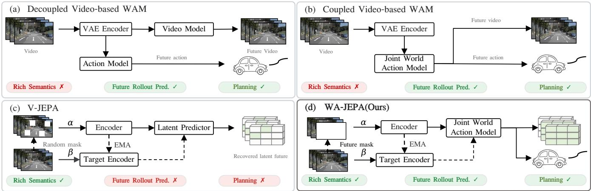
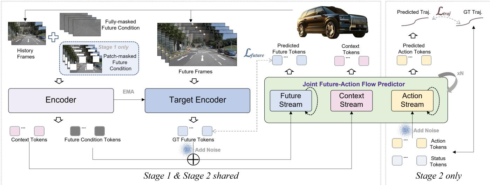
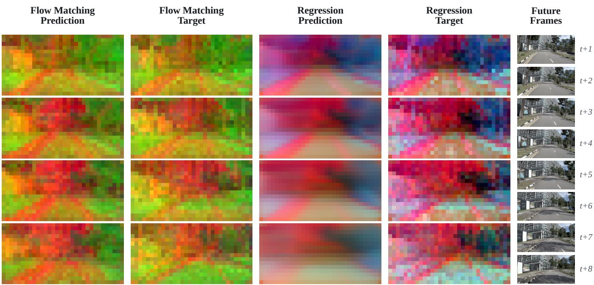
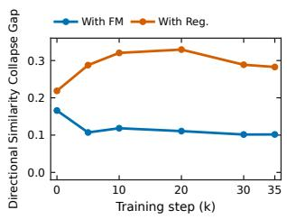
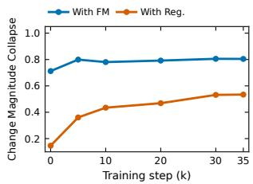
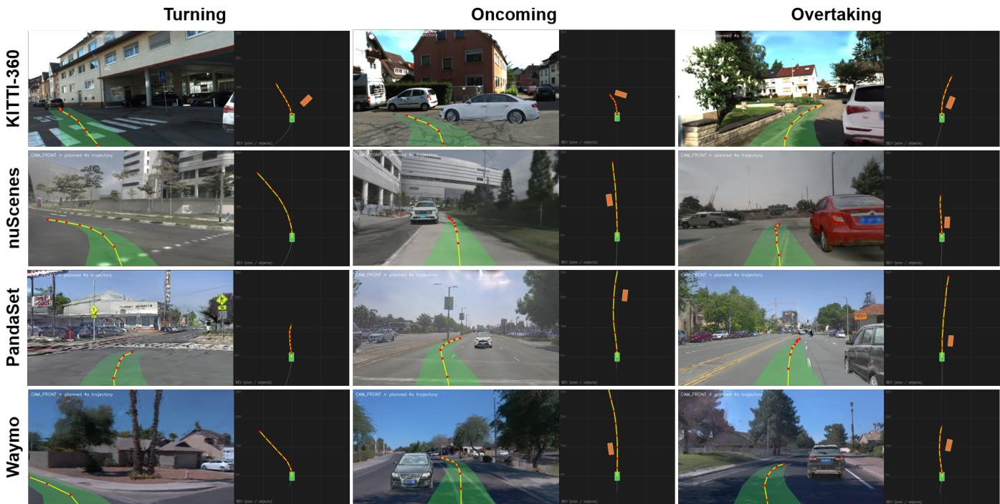
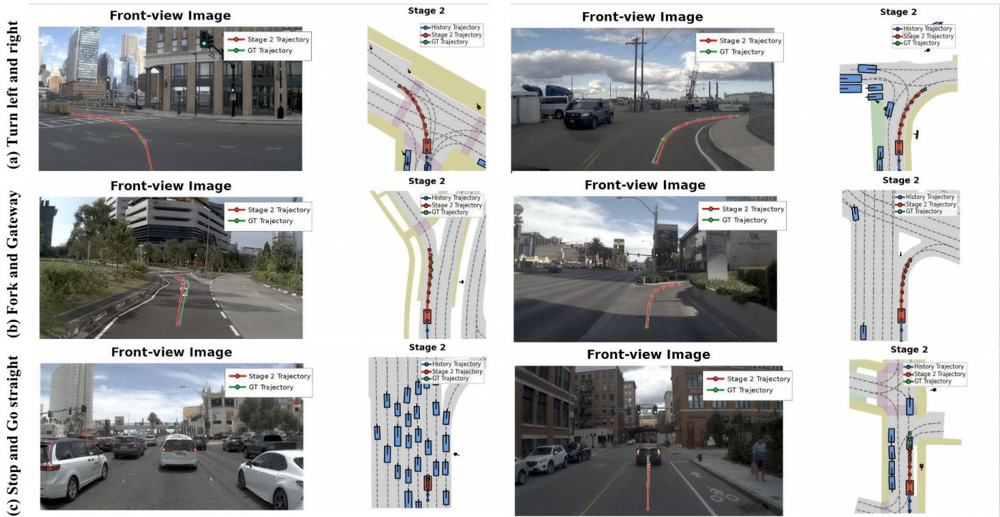

# WA-JEPA: Rethinking the Video JEPA Paradigm for World-Action Modeling in Autonomous Driving

Xinlin Wang1 ∗, Yujiao Xiang1,2 ∗, Yuheng Zhou1,3 ∗, Jingqi Wang1 ∗, Minqing Huang1 ∗‡, Jiajie Huang1,4, Dongxu Wei1 †, Tingguang Zhou1, Xiyang Wang1, Gong Chen1,5, Zhi Xu1, Feiyang Tan1, Hangning Zhou1, Mu Yang1

1Afari Intelligent Drive 2University of Electronic Science and Technology of China

3Southeast University 4Beijing University of Posts and Telecommunications 5Tianjin University

∗Equal contribution, listed in no particular order. †Project lead. ‡Corresponding author: mqhuang1211@gmail.com.

## Abstract

Video Joint Embedding Predictive Architecture (V-JEPA) learns powerful spatiotemporal representations from video through self-supervised latent feature prediction. However, V-JEPA is built around random-mask completion and deterministic regression, making it fundamentally ill-suited for autonomous driving planning that demands future-directed prediction tightly coupled with action. To address this, we rethink the V-JEPA paradigm and present WA-JEPA, a V-JEPAnative world-action model designed for autonomous driving planning. Instead of random spatiotemporal masking, WA-JEPA employs hybrid future-masked pre-training, where the model infers future latents from observed context. Departing from deterministic regression, we recast future prediction as conditional flow matching over latent futures, which substantially improves the model’s ability to generate plausible future latents for downstream planning. Finally, a joint future-action predictor is proposed to denoise future scene tokens and ego trajectories together in a unified spatiotemporal latent space, allowing action supervision to directly shape planning-relevant world representations. Pre-trained on nu-Plan videos and fine-tuned on NAVSIM, WA-JEPA reaches 91.7 EPDMS on NAVSIM-v2, surpassing the strongest endto-end and world-action baselines by 1.6 and 1.3 EPDMS, and, without HUGSIM-specific fine-tuning, attains the best HD-Score of 0.4462 on the closed-loop HUGSIM benchmark under the same evaluation protocol. These results validate V-JEPA-native world-action modeling as a powerful and scalable paradigm for autonomous driving planning. Code is available at https://github.com/AFARI-Research/WA-JEPA.

## Introduction

End-to-end (E2E) autonomous driving distinguishes itself from conventional perception-planning pipelines by learning a unified model that directly maps raw sensor observations to driving actions, thereby eliminating the compounding errors and computational ineficiencies inherent in modular architectures (Hu et al. 2023). Despite this conceptual appeal, traditional E2E methods (Jiang et al. 2023; Sun et al. 2025) heavily rely on domain-specific perception supervision (e.g., object detection, semantic segmentation, and occupancy prediction) and lack explicit reasoning capabilities, fundamentally limiting their robustness in rare and long-tail driving scenarios.

Recently, two emerging paradigms have sought to endow E2E driving models with reasoning abilities that more closely resemble human-like driving behavior. The first is the Vision-Language-Action (VLA) paradigm (Li et al. 2025e; Xu et al. 2025a; Li et al. 2025d; Jia et al. 2026), which leverages the language understanding capacity of Vision-Language Models (VLMs) to make driving decisions from sparse visual observations. In principle, this enables models to reason about complex trafic situations through natural language. However, the majority of VLA methods (Chen, Wang, and Zhang 2025; Li et al. 2025a) simply learn a direct mapping from dense visual inputs to sparse action outputs, sufering from a severe supervision deficit (Li et al. 2025d): the vast information bottleneck between rich perceptual signals and minimal action supervision leaves the model poorly constrained.

The second paradigm, World-Action Models (WAMs) (Li et al. 2025d; Xia et al. 2025; Huang et al. 2026; Wang et al. 2026b; Shi et al. 2026; Liu et al. 2026a), takes a fundamentally diferent approach: instead of relying on language as the medium of reasoning, WAMs harness the visual reasoning capability of video generation models (Wan et al. 2025; HaCohen et al. 2024), i.e., their ability to predict future scene dynamics at pixel level, to inform and guide action decisions. Because future frame prediction naturally provides dense self-supervision without requiring costly perception annotations, WAMs ofer a promising solution to the supervision deficit problem (Li et al. 2025d). Critically, this paradigm does not require linguistic reasoning, making it arguably more aligned with the visual foresight involved in driving. However, many video-generation-based WAMs perform world modeling in a latent space compressed by a Variational Autoencoder (VAE). This impoverished representation space with limited spatiotemporal semantics may constrain the model’s ability to understand and reason about the evolving driving world. A question thus arises: can we enrich the spatiotemporal semantics of the latent representations that underpin WAMs, thereby endowing them with stronger spatiotemporal reasoning and, ultimately, superior driving performance?

In parallel, a major branch of world model research, the Video Joint Embedding Predictive Architecture (V-JEPA) family (Bardes et al. 2024; Assran et al. 2025), has developed feature-level masked modeling for self-supervised learning of spatiotemporal representations from massive video corpora. These representations transfer efectively to a wide range of downstream visual understanding tasks, demonstrating remarkable spatiotemporal semantic richness. However, V-JEPA is architecturally ill-suited for planning tasks for three reasons. First, V-JEPA pre-training applies random spatiotemporal masking to videos and trains the model to predict the full sequence of features from partially masked context. This is inherently a completion objective, which lacks the future-directed predictive capability that is essential for planning. Second, V-JEPA performs this masked prediction via regression, which, while adequate for filling in missing patches within an otherwise observed temporal context, is insuficient for generating entirely unseen future tokens, a task that inherently requires generative modeling. Third, although V-JEPA can be fine-tuned for action-conditioned future prediction (Assran et al. 2025), the gap to actionable planning remains vast: existing approaches require a goal image and rely on Model Predictive Control (MPC) with multi-round optimization to recover actions, falling far short of interactive online planning.

  
Figure 1: Comparison of V-JEPA, video-based world-action models, and our WA-JEPA. Our method bridges semantic representation learning and predictive world modeling through future-frame masking.

In this paper, we rethink the V-JEPA paradigm for worldaction modeling in autonomous driving. Our goal is to preserve and leverage V-JEPA’s powerful spatiotemporal representation capacity, while fundamentally extending it with causal future generation abilities, and jointly modeling it with action. This yields a novel, V-JEPA-native World-Action Model paradigm, which we term WA-JEPA. Our core technical innovations consist of three key designs: (1) Pre-training with Hybrid Future Masking. In contrast to the original V-JEPA, which employs random spatiotemporal masking to train a context-completion model, we introduce a carefully designed hybrid future mask strategy: the model observes past frames and predicts the spatiotemporal features of future frames. This endows V-JEPA with future prediction capability, directly aligning the pre-training objective with the forward-predictive demands of planning. (2) V-JEPAbased World Modeling with Flow Matching. Rather than regressing masked features from context as in the original V-JEPA, we reformulate future prediction as a flow-based generation process over the spatiotemporal feature space. This generative formulation substantially improves the model’s ability to produce plausible futures, providing a richer evidentiary basis for downstream planning. (3) V-JEPA-based Joint World-Action Modeling. Whereas the original V-JEPA models only the visually-observed world, we extend the architecture to jointly model world states and ego actions in a unified spatiotemporal latent space. This tight coupling between visual representations and action representations enables V-JEPA-native future reasoning and decision-making within a single coherent framework.

Our contributions are summarized as follows:

• We propose a V-JEPA-native World-Action Model, WA-JEPA, which harnesses V-JEPA’s powerful spatiotemporal representations to strengthen joint world-action modeling, achieving substantial improvements in planning capability for autonomous driving.

• We introduce a suite of architectural innovations—hybrid future masking for pre-training, latent world modeling via flow matching, and joint world-action modeling—that systematically adapt the V-JEPA architecture for planning, while carefully preserving its core representation learning strengths.

• Extensive experiments on the open-loop NAVSIM-v1 and NAVSIM-v2 benchmarks establish a new state of the art, and zero-shot evaluation on the closed-loop simulator HUGSIM (Zhou et al. 2024b) shows that the gain carries over to closed-loop driving.

## Related Work

End-to-end driving and world-action models. E2E driving maps sensor observations directly to ego motion (Hu et al. 2023; Jiang et al. 2023; Liao et al. 2025), while VLA models incorporate language reasoning or VLM-guided trajectory refinement (Shao et al. 2024; Hwang et al. 2024; Zhou et al. 2026; Wang et al. 2026c). WAMs augment direct planning with learned future-scene prediction (Wang et al. 2024; Li et al. 2025c; Zhu et al. 2026; Wang et al. 2026b; Hong et al. 2026; Li et al. 2025d). As illustrated in Fig. 1(a), existing WAMs explore diferent choices of world representation and the coupling between future-scene prediction and action generation. In particular, coupled video-based WAMs jointly model future visual content and actions within a shared generative process, using video-generation priors or video latents (Liu et al. 2026a; Shi et al. 2026), as shown in Fig. 1(b). Although this coupling provides a direct interface between future-scene generation and planning, these methods inherit the limitations of video-generative latent spaces: their representations are primarily optimized for visual generation and reconstruction, which may limit semantic abstraction and the modeling of action-relevant future states.

Predictive representations for world-action modeling. Recent world-action models explore predictive representations beyond pixel-level reconstruction. Latent-WAM uses spatially aware latent scene representations for future world modeling and trajectory planning (Wang et al. 2026b), while DINO-WM predicts future features from a pre-trained DI-NOv2 encoder to support action-conditioned planning (Zhou et al. 2024a). As shown in Fig. 1(c), JEPA-based approaches learn powerful spatiotemporal representations by predicting target embeddings rather than reconstructing (Bardes et al. 2024; Assran et al. 2025). However, V-JEPA primarily provides predictive visual representations and does not directly specify how these representations should be converted into future actions or planning decisions. Drive-JEPA attempts to bridge this gap by introducing a V-JEPA encoder into an end-to-end driving model, but still relies on a separate downstream trajectory planner (Wang et al. 2026a). WA-JEPA instead extends predictive representation learning to jointly predict future world features and ego trajectories within a shared predictive representation.

## Method

## Preliminaries

Our method is greatly inspired by V-JEPA 2 (Assran et al. 2025), which learns predictive representations in latent space instead of reconstructing raw pixels. As shown in Fig. 1 (c), given a masked observation α and a target observation β, V-JEPA 2 trains a predictor to infer the target latent from the context latent:

$$
\operatorname* { m i n } _ { \theta , \psi } \| P _ { \psi } ( E _ { \theta } ( \alpha ) ) - \mathrm { s g } ( E _ { \bar { \theta } } ( \beta ) ) \| _ { 1 } ,\tag{1}
$$

where $E _ { \theta }$ is the online encoder, $E _ { \bar { \theta } }$ is the target encoder, $P _ { \psi }$ is the latent predictor, and $\operatorname { s g } ( \cdot )$ denotes stop-gradient. The target encoder is updated with an exponential moving average (EMA):

$$
\bar { \theta }  \mu \bar { \theta } + ( 1 - \mu ) \theta ,\tag{2}
$$

where $\mu$ is the EMA momentum coeficient.

## Overview

We formulate end-to-end autonomous driving as conditional future-action generation. Given historical multi-view observations $\mathcal { X } _ { 1 : H }$ , ego state s, and historical actions $\mathcal { N } _ { 1 : H }$ , the

model predicts future actions through the following mapping:

$$
f _ { \theta } \left( \mathcal { X } _ { 1 : H } , \boldsymbol { s } , \mathcal { V } _ { 1 : H } \right) \mapsto \hat { \mathcal { V } } _ { H + 1 : H + K } = \Big \{ ( \hat { x } _ { k } , \hat { y } _ { k } , \hat { \phi } _ { k } ) \Big \} _ { k = 1 , 7 } ^ { K } ,\tag{3}
$$

where $f _ { \theta }$ denotes the world-action model parameterized by θ, H and K represent the number of historical frames and future frames, respectively. Here, $( \hat { x } _ { k } , \hat { y } _ { k } )$ and $\hat { \phi } _ { k }$ denote the predicted ego position and heading at the k-th future frame over a planning horizon of K steps.

As shown in Fig. 2, WA-JEPA follows a two-stage training scheme. Stage 1 adapts pre-trained V-JEPA 2 to multi-view driving data by predicting future representations under a hybrid masking strategy. Stage 2 adds action supervision and extends the predictor with an action stream, enabling joint prediction of future scene representations and ego actions.

## Stage 1: Hybrid Future-Masked Pre-training

Stage 1 employs a hybrid objective combining a causal Fullmask branch with a Patch-mask completion branch on synchronized multi-view driving observations, without action supervision. The former learns strictly past-to-future dynamics, while the latter retains partial future context to facilitate representation learning and preserve the partial-masking paradigm of V-JEPA 2.

Multi-view spatio-temporal encoder. We adopt a pretrained V-JEPA 2 ViT-L as the visual backbone. Each training sample contains historical and future frames from C synchronized cameras:

$$
\begin{array} { r } { \mathcal { X } _ { 1 : H + K } = [ \mathcal { X } _ { 1 : H } , \mathcal { X } _ { H + 1 : H + K } ] , \qquad \mathcal { X } _ { t } = \{ X _ { t } ^ { c } \} _ { c = 1 } ^ { C } , } \end{array}\tag{4}
$$

where $X _ { t } ^ { c }$ represents the frame from the c-th camera at the t-th time step.

Subsequently, the model treats each camera stream as a separate video and processes all views independently with the shared online encoder to generate visual tokens. During training, history tokens remain visible, while masking is applied only to future tokens. Specifically, we employ a hybrid strategy that combines full future masking with patchmasked future completion. Full masking designates all future tokens as prediction targets and therefore requires prediction from historical context alone. Patch masking retains a subset of future tokens as visible conditions and predicts the remaining masked tokens, reducing the learning dificulty while retaining the partial-masking prediction style of $\dot { \mathrm { V } _ { - } }$ JEPA 2.

The outputs derived from historical frames serve as context scene tokens ${ \mathcal { Z } } _ { \mathrm { c t x } }$

$$
\mathcal { Z } _ { \mathrm { c t x } } = E _ { \theta } \left( \mathcal { X } _ { 1 : H } \right) .\tag{5}
$$

For future frames, the mask pattern $M ^ { ( m ) }$ , where m ∈ {full, patch}, is applied before the online encoder, such that only visible future patches are provided to $E _ { \theta }$ . The model then combines the encoded visible tokens with learnable mask tokens $Z _ { \mathrm { m a s k } }$ to construct the future condition tokens:

$$
{ \cal Z } _ { \mathrm { c o n d } } ^ { ( m ) } = \Phi ^ { ( m ) } \left( Z _ { \mathrm { m a s k } } , E _ { \theta } \left( X _ { H + 1 : H + K } , M ^ { ( m ) } \right) \right) ,\tag{6}
$$

  
Figure 2: Overview of WA-JEPA. Stage 1 adapts V-JEPA 2 to multi-view driving videos by predicting future representations under full-future and patch-level masks. Stage 2 initializes from this checkpoint and jointly predicts future scene representations and ego actions with the Joint Future-Action Flow Predictor.

where $\Phi ^ { ( m ) } ( \cdot )$ denotes a mask-aware fill-and-scatter operation. It initializes a full future-token sequence with learnable mask tokens and scatters the encoded visible future tokens back to their original positions according to the mask pattern. Under Full-mask, no future patch is provided to the online encoder, and $Z _ { \mathrm { c o n d } } ^ { \mathrm { ( f u l l ) } }$ therefore consists entirely of learnable mask tokens.

Meanwhile, the EMA target encoder provides unmasked target representations for the future frames, yielding the clean future scene target $\mathcal { Z } _ { \mathrm { f u t u r e } } ^ { * }$

$$
\mathcal { Z } _ { \mathrm { f u t u r e } } ^ { \ast } = E _ { \bar { \theta } } \left( \mathcal { X } _ { H + 1 : H + K } \right) .\tag{7}
$$

These target representations is used solely to provide latent supervision for future scenes.

flow-based latent future prediction. We use flow matching for future latent prediction. We use conditional flow matching with a clean-latent (x-prediction) parameterization for future latent prediction. First, we sample Gaussian noise $\epsilon _ { \mathrm { f u t u r e } } \sim { \mathcal { N } } ( 0 , I )$ with the same dimensionality as the future scene tokens and continuous flow time t. The noisy future scene tokens $\mathcal { Z } _ { t }$ at time t is obtained via linear interpolation:

$$
\mathcal { Z } _ { t } = ( 1 - t ) \epsilon _ { \mathrm { f u t u r e } } + t \mathcal { Z } _ { \mathrm { f u t u r e } } ^ { \ast } .\tag{8}
$$

The future flow predictor receives the historical context ${ \mathcal { Z } } _ { \mathrm { c t x } } ,$ future condition $\mathcal { Z } _ { \mathrm { c o n d } }$ , noisy future scene tokens $\mathcal { Z } _ { t } ,$ and temporal condition $t ,$ and predicts the clean future scene tokens $\hat { Z } _ { \mathrm { f u t u r e } } .$

$$
\hat { \mathcal { Z } } _ { \mathrm { f u t u r e } } = P _ { \psi } ^ { \mathrm { f u t u r e } } \left( \mathcal { Z } _ { \mathrm { c t x } } , \mathcal { Z } _ { \mathrm { c o n d } } , \mathcal { Z } _ { t } , t \right) .\tag{9}
$$

The future flow predictor follows an MMDiT (Multimodal Difusion Transformer)-style (Esser et al. 2024) design, primarily performing joint self-attention between context scene tokens and future scene tokens.

Training objective. In Stage 1, the model is pre-trained on multi-view driving observations from the nuPlan dataset. During this stage, the model is optimized using a mean squared error (MSE) loss on the clean future latent prediction:

$$
\mathcal { L } _ { \mathrm { S t a g e \ 1 } } = \mathcal { L } _ { \mathrm { f u t u r e } } = \frac { 1 } { N } \left. \hat { \mathcal { Z } } _ { \mathrm { f u t u r e } } - \mathrm { s g } \left( \mathcal { Z } _ { \mathrm { f u t u r e } } ^ { * } \right) \right. _ { 2 } ^ { 2 } ,\tag{10}
$$

where N denotes the number of future scene tokens included in the loss computation. This clean-latent objective corresponds to the x-prediction parameterization of conditional flow matching described above.

## Stage 2: Joint World-Action Modeling

Stage 2 introduces an action generation stream, jointly modeling future scene representations and actions within a unified model. The model is initialized using the pre-trained weights from Stage 1 and further adapted to the action planning task through action supervision.

Joint future-action predictor. In Stage 2, the joint predictor further incorporates historical actions and the compact ego state. Together, they serve as ego-motion conditions for future actions generation. Diferent from Stage 1, only full future mask is used in Stage 2 for consistency with the causal nature of driving. Future images are used only to construct supervision signals for the future scene latent prediction and are not provided as input to the student predictor.

For the action stream, we first normalize the ground-truth future actions and construct noisy actions in the normalized action space:

$$
\begin{array} { r } { \tilde { \mathcal { V } } _ { t } = ( 1 - t ) \epsilon _ { y } + t \bar { \mathcal { V } } _ { H + 1 : H + K } , \quad \epsilon _ { y } \sim \mathcal { N } ( 0 , I ) , } \\ { \qquad \quad \bar { \mathcal { V } } _ { H + 1 : H + K } = \operatorname { N o r m } ( \mathcal { V } _ { H + 1 : H + K } ) , \qquad } \end{array}\tag{11}
$$

where $\operatorname { N o r m } ( { \mathord { \cdot } } )$ denotes the action normalization operation, $\bar { \mathcal { D } } _ { H + 1 : H + K }$ denotes the normalized ground-truth future actions, $\epsilon _ { y }$ denotes Gaussian noise with the same dimensionality as the future actions, and $\tilde { \mathcal { V } } _ { t }$ denotes the noisy future actions at time t.

Subsequently, the noisy future actions $\tilde { \mathcal { V } } _ { t }$ , historical actions $\mathcal { \mathrm { { y } } } _ { 1 : H }$ , and ego state s are separately encoded and concatenated to form the action tokens $\mathcal { T } _ { \mathrm { a c t } } \mathrm { : }$

$$
\begin{array} { r } { \mathcal { T } _ { \mathrm { a c t } } = \mathrm { C o n c a t } \left[ \mathcal { T } _ { n } , \mathcal { T } _ { h } , \mathcal { T } _ { s } \right] , } \\ { \mathcal { T } _ { n } = F _ { n } ( \tilde { \mathcal { Y } } _ { t } ) , \quad \mathcal { T } _ { h } = F _ { h } ( \mathcal { Y } _ { 1 : H } ) , \quad \mathcal { T } _ { s } = F _ { s } ( s ) . } \end{array}\tag{12}
$$

where $F _ { n }$ is a linear projection, and $F _ { h }$ and $F _ { s }$ are MLP encoders.

The joint predictor models interactions among the historical context scene tokens $\mathcal { Z } _ { \mathrm { c t x } } ,$ future scene tokens $\mathcal { Z } _ { \mathrm { c o n d } }$ and noisy future scene tokens $\mathcal { Z } _ { t } .$ , and action tokens $\mathcal { T } _ { \mathrm { a c t } }$ at time t. Its future scene and action output streams are respectively defined as

$$
\begin{array} { r l } & { \hat { \mathcal { Z } } _ { \mathrm { f u t u r e } } = P _ { \psi } ^ { \mathrm { f u t u r e } } \left( \mathcal { Z } _ { \mathrm { c t x } } , \mathcal { Z } _ { \mathrm { c o n d } } , \mathcal { Z } _ { t } , \mathrm { s g } ( \mathcal { T } _ { \mathrm { a c t } } ) , t \right) , } \\ & { \quad \hat { \bar { \mathcal { V } } } _ { H + 1 : H + K } = P _ { \psi } ^ { \mathrm { a c t } } \left( \mathcal { Z } _ { \mathrm { c t x } } , \mathcal { Z } _ { \mathrm { c o n d } } , \mathcal { Z } _ { t } , \mathcal { T } _ { \mathrm { a c t } } , t \right) . } \end{array}\tag{13}
$$

Here, $P _ { \psi } ^ { \mathrm { f u t u r e } }$ and $P _ { \psi } ^ { \mathrm { a c t } }$ denote the future scene and action output streams of the same joint predictor, which also follows an MMDiT-style design, rather than two independent predictors. Under the Full-mask setting used in Stage 2, $Z _ { \mathrm { c o n d } } = Z _ { \mathrm { c o n d } } ^ { \mathrm { ( f u l l ) } }$ consists entirely of learnable mask tokens, so no future image content is visible to the joint predictor. $\hat { \bar { y } } _ { H + 1 : H + K }$ denotes the predicted normalized future actions. We apply stop-gradient sg(·) to the action tokens only in the future scene output stream, preventing the future scene prediction loss from updating the action stream. Further details and analysis of this design are provided in Appendix C.

Training objective. The future scene stream follows the future scene prediction loss defined in Stage 1. This objective preserves the model’s future scene modeling capability during action-supervised fine-tuning. The action stream predicts denoised future actions in the normalized action space and is optimized using the MSE between the predicted and ground-truth actions over all future steps:

$$
\begin{array} { c } { \displaystyle \mathcal { L } _ { \mathrm { a c t } } = \frac { 1 } { K } \sum _ { k = 1 } ^ { K } \left\| \hat { \bar { \bf y } } _ { k } - \bar { \bf y } _ { k } \right\| _ { 2 } ^ { 2 } , } \\ { \displaystyle \bar { \bf y } _ { k } = \mathrm { N o r m } \left( x _ { k } , y _ { k } , \phi _ { k } \right) , } \end{array}\tag{14}
$$

where $\bar { \mathbf { y } } _ { k }$ denotes the normalized ground-truth action at the k-th future frame, $\hat { \bar { \bf y } } _ { k }$ denotes the corresponding predicted normalized action.

Finally, the overall Stage 2 training objective is

$$
{ \mathcal { L } } _ { \mathrm { S t a g e 2 } } = \lambda _ { \mathrm { f u t u r e } } { \mathcal { L } } _ { \mathrm { f u t u r e } } + \lambda _ { \mathrm { a c t } } { \mathcal { L } } _ { \mathrm { a c t } } .\tag{15}
$$

Here, $\lambda _ { \mathrm { f u t u r e } }$ and $\lambda _ { \mathrm { a c t } }$ are the weighting coeficients for the future scene and action losses, respectively.

Planning inference. During inference, the model takes only historical multi-view observations, historical actions, and ego state as inputs. The future scene latents and normalized future actions are initialized from Gaussian noise. At each sampling step, the joint predictor estimates their clean endpoints, which are converted into velocities along the linear flow paths and iteratively integrated. Neither future images nor ground-truth future actions are required during this process.

After sampling, the predicted normalized actions are transformed back to the original action space to obtain the final future actions:

$$
\hat { \mathcal { V } } _ { H + 1 : H + K } = \mathrm { N o r m } ^ { - 1 } \left( \hat { \bar { \mathcal { V } } } _ { H + 1 : H + K } \right) .\tag{16}
$$

Here, $\mathrm { N o r m } ^ { - 1 } ( \cdot )$ denotes the action denormalization operation.

## Experiments

## Experimental Setup

Datasets, benchmarks, and metrics. In Stage 1, the model is pre-trained on multi-view driving videos from nuPlan, and Stage 2 is trained on the oficial NAVSIM navtrain split. Evaluation is performed on the held-out navtest split under NAVSIM-v1 and NAVSIM-v2 (Dauner et al. 2024; Cao et al. 2025), using the oficial PDMS and EPDMS scores and their sub-metrics, which are defined in Appendix D.

Implementation details. The model takes four historical frames from the left, front, right, and rear cameras at 256 × 512 resolution and predicts eight actions at 2 Hz. The visual encoder is initialized from the V-JEPA 2 ViT-L backbone pre-trained in Stage 1. The future scene and action streams are jointly optimized with AdamW, bfloat16 precision, and DeepSpeed ZeRO-2. Stage 1 and Stage 2 use 64 and 32 NVIDIA A800 GPUs, respectively, with a per-GPU batch size of 4. The encoder, scene projector, and joint predictor use learning rates of $1 \times 1 0 ^ { - 5 } , 1 \times 1 0 ^ { - 4 }$ , and $1 . 5 \times 1 0 ^ { - 4 }$ respectively, with weight decay 0.04. At inference, the WA-JEPA Joint future-action predictor uses 4 sampling steps. We evaluate its stochastic predictions using a fixed set of 10 seeds and report the mean, while deterministic baselines are evaluated once. Detailed settings are provided in Appendix C.

Baselines. We compare WA-JEPA with representative E2E, VLA, and WAM baselines under compatible input modalities and evaluation protocols.

## Comparison with Existing Methods

Quantitative results. As shown in Table 1, WA-JEPA achieved an EPDMS of 91.7 on NAVSIM-v2, exceeding the best-performing E2E method, SparseDriveV2, by 1.6 and the best-performing WAM method, Discrete-WAM, by 1.3. On NAVSIM-v1 (Table 3), WA-JEPA attained a PDMS of 91.8.

Zero-shot closed-loop generalization. We compare WA-JEPA with LTF (Chitta et al. 2022), DrivoR (Kirby et al. 2026), UniAD (Hu et al. 2023), and VAD (Jiang et al. 2023) on 436 HUGSIM scenarios (Zhou et al. 2024b). WA-JEPA’s two training stages use neither HUGSIM-rendered observations nor any of its four source datasets; DrivoR is similarly source-disjoint. All methods follow the common protocol detailed in Appendix A, sharing the same scenarios, controller, commands, aggregation, and metric implementation while retaining their native sensor configurations.

<table><tr><td>Method</td><td>Backbone</td><td>NC↑</td><td>DAC↑</td><td>DDC↑</td><td>TLC↑</td><td>EP↑</td><td>TTC↑</td><td>LK↑</td><td>HC↑</td><td>EC↑</td><td>EPDMS*↑</td><td>EPDMS↑</td></tr><tr><td>End-to-End Methods</td><td></td><td></td><td></td><td></td><td></td><td></td><td></td><td></td><td></td><td></td><td></td><td></td></tr><tr><td>TransFuser (Chitta et al. 2022)</td><td>RegNetY-3.2GF</td><td>96.9</td><td>89.9</td><td>97.8</td><td>99.7 87.1</td><td></td><td>95.4</td><td>92.7</td><td></td><td>98.3 87.2</td><td>76.7</td><td></td></tr><tr><td>ARTEMIS (Feng et al. 2025)</td><td>ResNet-34</td><td>98.3</td><td>95.1</td><td>98.6</td><td>99.8</td><td>81.5</td><td>97.4</td><td>96.5</td><td>98.3</td><td></td><td>83.1</td><td></td></tr><tr><td>Hydra-MDP++ (Li et al. 2025b)</td><td>V2-99</td><td>98.8</td><td>97.8</td><td>99.1</td><td>100</td><td>84.0</td><td>95.3</td><td>70.1</td><td></td><td>96.8</td><td>84.1</td><td></td></tr><tr><td>DiffusionDrive (Liao et al. 2025)</td><td>ResNet-34</td><td>98.2</td><td>95.9</td><td>99.4</td><td>99.8</td><td>87.5</td><td>97.3</td><td>96.8</td><td>98.3</td><td>87.7</td><td></td><td>84.5</td></tr><tr><td>Drive-JEPA (Wang et al. 2026a)</td><td>ResNet-34</td><td>98.8</td><td>97.4</td><td>99.0</td><td>99.8</td><td>83.5</td><td>98.0</td><td>96.2</td><td>98.1</td><td>85.6</td><td>85.4</td><td></td></tr><tr><td>Drive-JEPA† (Wang et al. 2026a)</td><td>ViT-L</td><td>98.4</td><td>98.6</td><td>99.1</td><td>99.8 88.4</td><td></td><td>97.8</td><td>97.6</td><td>97.9</td><td>84.8</td><td>87.8</td><td></td></tr><tr><td>DiffusionDriveV2 (Zou et al. 2025)</td><td>ResNet-34</td><td>97.7</td><td>96.6</td><td>99.2</td><td>99.8 88.9</td><td></td><td>97.2</td><td>96.0</td><td>97.8</td><td>91.0</td><td>85.5</td><td>87.5</td></tr><tr><td>DriveSuprim (Yao et al. 2025)</td><td>V2-99</td><td>97.8</td><td>97.9</td><td>99.5</td><td>99.9</td><td>90.6</td><td>97.1</td><td>96.6</td><td>98.3</td><td>77.9</td><td>86.0</td><td></td></tr><tr><td>SparseDriveV2 (Sun et al. 2026)</td><td>ResNet-34</td><td>98.1</td><td>98.1</td><td>99.6</td><td>99.8 91.1</td><td></td><td>97.3</td><td>96.9</td><td>98.2</td><td>78.4</td><td>86.7</td><td>90.1</td></tr><tr><td>VLA Methods</td><td></td><td></td><td></td><td></td><td></td><td></td><td></td><td></td><td></td><td></td><td></td><td></td></tr><tr><td>ReCogDrive (Li et al. 2025e)</td><td>InternVL3</td><td>98.3</td><td>95.2</td><td>99.5</td><td>99.8 87.1</td><td></td><td>97.5</td><td>96.6</td><td>98.3</td><td>86.5</td><td>83.6</td><td></td></tr><tr><td>WAM-Flow (Xu et al. 2025b)</td><td>Janus-1.5B</td><td>98.5</td><td>94.5</td><td>99.5</td><td>99.8</td><td>86.9</td><td>96.8</td><td>97.4</td><td>97.6</td><td>73.9</td><td>84.7</td><td></td></tr><tr><td>WAM-Diff (Xu et al. 2025a)</td><td>LLaDA-V</td><td>99.0</td><td>98.4</td><td>99.3</td><td>99.9</td><td>87.0</td><td>98.6</td><td>96.2</td><td>98.1</td><td>78.5</td><td></td><td>89.7</td></tr><tr><td>World-Action and World-Model Methods</td><td></td><td></td><td></td><td></td><td></td><td></td><td></td><td></td><td></td><td></td><td></td><td></td></tr><tr><td>DriveVLA-W0 (Li et al. 2025d)</td><td>Emu3-8B</td><td>98.5</td><td>99.1</td><td>98.0</td><td>99.7 86.4</td><td></td><td>98.1</td><td>93.2</td><td></td><td>97.9 58.9</td><td>86.1</td><td></td></tr><tr><td>DriveWorld-VLA (Jia et al. 2026)</td><td>InternVL</td><td>98.6</td><td>99.1</td><td>99.6</td><td>99.8</td><td>87.4</td><td>97.9</td><td>97.0</td><td>97.8</td><td>78.6</td><td></td><td>86.8</td></tr><tr><td>CoWorld-VLA (Huang et al. 2026)</td><td>Qwen3</td><td>99.1</td><td>97.0</td><td>99.6</td><td>99.9</td><td>87.9</td><td>98.5</td><td>97.7</td><td>98.2</td><td>86.2</td><td>86.2</td><td>90.0</td></tr><tr><td>DreamerAD (Yang et al. 2026)</td><td>Transformer-1.3B</td><td>98.0</td><td>97.2</td><td>99.5</td><td>99.8</td><td>87.8</td><td>97.4</td><td>97.5</td><td>98.3</td><td>72.4</td><td></td><td>87.7</td></tr><tr><td>Latent-WAM (Wang et al. 2026b)</td><td>DINOv2-B</td><td>98.1</td><td>97.3</td><td>99.6</td><td>99.8</td><td>87.7</td><td>97.3</td><td>97.6</td><td>98.1</td><td>87.3</td><td></td><td>89.3</td></tr><tr><td>DriveFuture (Hong et al. 2026)</td><td>V2-99</td><td>98.8</td><td>99.1</td><td>99.6</td><td>99.9</td><td>86.6</td><td>98.4</td><td>96.4</td><td>98.3</td><td>74.8</td><td>86.4</td><td>89.9</td></tr><tr><td>Discrete-WAM (Yao et al. 2026)</td><td>Transformer-1B</td><td>98.5</td><td>98.2</td><td>99.7</td><td></td><td>99.8 90.5</td><td>97.9</td><td>97.2</td><td>98.3</td><td>78.1</td><td>87.0</td><td>90.4</td></tr><tr><td>WA-JEPA (ours)</td><td>ViT-L</td><td>99.4</td><td>98.2</td><td>99.7</td><td>99.9 87.8</td><td></td><td>98.9</td><td>98.3</td><td>98.3 88.1</td><td></td><td>88.0</td><td>91.7</td></tr></table>

Table 1: Comparison with state-of-the-art methods on NAVSIM-v2 navtest. Methods are grouped by modeling paradigm. Backbone lists the primary visual or vision-language backbone used by each method. † marks results using auxiliary simulator derived supervision. EPDMS∗ refers to scores obtained before correction of the human-reference penalty-filter aggregation, whereas EPDMS reports the corrected scores.  
  
Figure 3: Target-referenced PCA visualization of future latent predictions from flow matching (FM) and direct regression (Reg.). For each method, a separate PCA basis is fitted to its EMA target representations and applied to both target and predicted latents. Each map represents two consecutive future frames.

<table><tr><td></td><td>WA-JEPA</td><td>LTF</td><td>DrivoR</td><td>UniAD</td><td>VAD</td></tr><tr><td>All 436 scenarios</td><td></td><td></td><td></td><td></td><td></td></tr><tr><td>NC</td><td>0.6856</td><td>0.4428</td><td>0.5217</td><td>0.6555 0.4117</td><td></td></tr><tr><td>DAC</td><td>0.9635</td><td>0.9275</td><td>0.9559</td><td>0.9320 0.9028</td><td></td></tr><tr><td>TTC</td><td>0.6120</td><td>0.3751</td><td>0.4620</td><td>0.5156 0.2798</td><td></td></tr><tr><td>Comf.</td><td>0.6620</td><td>0.9478</td><td>0.9390</td><td>0.6633 0.9534</td><td></td></tr><tr><td>PDMS</td><td>0.5717</td><td>0.3653</td><td>0.4475</td><td>0.4940 0.2831</td><td></td></tr><tr><td>RC</td><td>0.5689</td><td>0.3804</td><td>0.4721</td><td>0.4383</td><td>0.3006</td></tr><tr><td>HD-Score</td><td>0.4462</td><td>0.2310</td><td>0.3252</td><td>0.3124</td><td>0.1393</td></tr><tr><td colspan="6">HD-Score by difficulty level</td></tr><tr><td>Easy (n=80)</td><td>0.7977</td><td>0.6608</td><td>0.7799</td><td>0.6395</td><td>0.4197</td></tr><tr><td>Medium (n=157)</td><td>0.5563</td><td>0.1547</td><td>0.2911</td><td>0.3718 0.0849</td><td></td></tr><tr><td>Hard (n=96)</td><td>0.3060</td><td>0.1204</td><td>0.2000</td><td>0.2099 0.0770</td><td></td></tr><tr><td>Extreme (n=103)</td><td>0.1362</td><td>0.1167</td><td>0.1407</td><td>0.0632</td><td>0.0626</td></tr></table>

Table 2: Zero-shot closed-loop results on HUGSIM. Values are on the [0, 1] scale; higher is better, and the best result in each row is bold.
<table><tr><td colspan="6">Method NC↑ DAC↑ TTC↑ Comf.↑ EP↑ PDMS↑</td></tr><tr><td colspan="6">End-to-End Methods</td></tr><tr><td>TransFuser</td><td>97.7</td><td>92.8</td><td>92.8</td><td>10079.2</td><td>84.0</td></tr><tr><td>DiffusionDrive</td><td>98.2</td><td>96.2</td><td>94.7</td><td>100 82.2</td><td>88.1</td></tr><tr><td>Drive-JEPA</td><td>98.7</td><td>96.2</td><td>95.5</td><td>100 82.9</td><td>89.0</td></tr><tr><td colspan="6">VLA Methods</td></tr><tr><td>ReCogDrive</td><td>97.9</td><td>97.3</td><td>94.9</td><td>100 87.3</td><td>90.8</td></tr><tr><td>WAM-Flow</td><td>99.2</td><td>98.3</td><td>97.0</td><td>99.7 82.3</td><td>90.3</td></tr><tr><td>WAM-Diff</td><td>99.1</td><td>98.3</td><td>96.5</td><td>99.9 84.4</td><td>91.0</td></tr><tr><td colspan="6">World-Action and World-Model Methods</td></tr><tr><td>CoWorld-VLA</td><td>99.1</td><td>96.9</td><td>96.4</td><td>100 83.9</td><td>89.9</td></tr><tr><td>DriveVLA-W0</td><td>98.7</td><td>99.1</td><td>95.3</td><td>99.3 383.3</td><td>90.2</td></tr><tr><td>DriveWorld-VLA</td><td>99.1</td><td>98.2</td><td>96.1</td><td>100 85.9</td><td>91.3</td></tr><tr><td>DriveLaW</td><td>99.0</td><td>97.1</td><td>96.7</td><td>100 81.3</td><td>89.1</td></tr><tr><td>DriveFuture</td><td>98.8</td><td>99.1</td><td>95.4</td><td>100 84.2</td><td>90.7</td></tr><tr><td>WA-JEPA (ours)</td><td>99.5</td><td>98.3</td><td>97.7</td><td>100 85.0</td><td>91.8</td></tr></table>

Table 3: Comparison on NAVSIM-v1 navtest.

As shown in Table 2, WA-JEPA achieves the best NC, DAC, TTC, PDMS, RC, and HD-Score, improving HD-Score from 0.3252 to 0.4462. This result demonstrates that joint world–action pre-training transfers efectively to closed-loop control, with the largest gains on the medium and hard levels.

Qualitative evaluation. Qualitative results are provided in Appendix B, including closed-loop HUGSIM rollouts and NAVSIM trajectory comparisons.

## Ablation Studies

Vision encoder initialization. Table 4(a) isolates the contribution of the visual encoder. Every variant is trained directly in Stage 2 without any Stage 1 pre-training, so the models share the same Stage 2 architecture, training data, and optimization protocol and difer only in how the encoder is initialized. The publicly released V-JEPA 2 weights reach an EPDMS of 89.5, exceeding the strongest alternatives, MAE and DINOv3, by 5.7 EPDMS, whereas the three image-level self-supervised and vision–language initializations lie within 0.7 EPDMS of one another. The gap therefore tracks the V-JEPA 2 pre-training objective rather than the choice among image-level objectives, which motivates adopting a V-JEPA 2 encoder as the backbone of our world-action model.

  
(a)

  
(b)  
Figure 4: Temporal representation preservation with flow matching (FM) and direct regression (Reg.). A lower directional-similarity collapse gap and a change-magnitude collapse closer to 1 indicate better preservation of the target temporal dynamics.

<table><tr><td>Encoder</td><td>EPDMS↑</td></tr><tr><td>MAE</td><td>83.8</td></tr><tr><td>SigLIP2</td><td>83.1</td></tr><tr><td>DINOv3</td><td>83.8</td></tr><tr><td>V-JEPA 2</td><td>89.5</td></tr></table>

(a) Encoder

<table><tr><td>Patch-mask</td><td>Full-mask</td><td>EPDMS↑</td></tr><tr><td rowspan="3"></td><td></td><td>89.5</td></tr><tr><td></td><td>91.0</td></tr><tr><td>√</td><td>91.3</td></tr><tr><td>√</td><td>√</td><td>91.7</td></tr></table>

(b) Stage 1 Pre-training

<table><tr><td rowspan="2">Joint</td><td colspan="2">Future Pred.</td><td rowspan="2">EPDMS↑</td></tr><tr><td>FM</td><td>Reg.</td></tr><tr><td rowspan="4">√ √</td><td></td><td></td><td>89.9</td></tr><tr><td>√</td><td></td><td>90.8</td></tr><tr><td></td><td>√</td><td>91.1 90.7</td></tr><tr><td></td><td></td><td></td></tr><tr><td>√</td><td>√</td><td></td><td>91.7</td></tr></table>

(c) Stage 2 Component  
Table 4: Ablations on NAVSIM-v2 navtest. (a) Vision encoder selection. (b) Masking strategy in Stage 1. The first row represents the baseline that skips Stage 1 pre-training and directly uses the original pre-trained V-JEPA 2 for Stage 2 training. (c) Joint future–action predictor and future-prediction methods in Stage 2. FM and Reg. denote flow matching and direct regression, respectively. The first row denotes an action-only Stage 2 baseline initialized from the Stage 1 checkpoint and fine-tuned with aciton supervision, without joint scene-action modeling or future prediction.

Stage 1 masking strategies. Table 4(b) ablates the masking design in Stage 1. The first row directly uses the original pretrained V-JEPA 2 checkpoint without our Stage 1 pretraining on nuPlan, serving as the no-Stage 1 baseline with an EPDMS of 89.5. Applying Patch-mask alone improves EPDMS to 91.0 by providing partial future context for representation learning, while Full-mask achieves 91.3 by enforcing strictly causal past-to-future prediction. Combining both strategies yields the best performance of 91.7, outperforming the individual variants by 0.7 and 0.4, respectively. This demonstrates that Patch-mask and Full-mask provide complementary training signals.

Stage 2 scene–action coupling and future prediction. Table 4(c) ablates scene–action modeling and future-latent supervision in Stage 2. The first cascaded baseline uses only historical latent features through cross-attention and obtains 89.9 EPDMS. Adding a separate flow-based future predictor and injecting its predicted future latents through the same cross-attention design improves EPDMS to 90.8. Under joint modeling, the baseline without explicit future-latent supervision achieves 91.1. Adding direct regression reduces EPDMS to 90.7, whereas flow-based future prediction yields the best result of 91.7. These results show that future-scene prediction and joint scene–action modeling are complementary, while the choice of prediction objective also matters.

Future representation analysis. To examine how the two prediction objectives afect future representations, Fig. 4 reports two target-referenced metrics. The directional similarity collapse gap measures excessive cross-step similarity relative to the target representations (lower is better), while the change-magnitude collapse measures the predicted temporal variation relative to the targets (closer to 1 is better). Detailed definitions are provided in Appendix E. Compared with direct regression, flow matching reduces the directional similarity collapse gap from 0.30 to 0.10 and increases the change-magnitude collapse from 0.45 to 0.80. Figure 3 provides complementary qualitative evidence: flow matching retains clearer spatial structures over the prediction horizon, whereas direct regression becomes progressively smoother.

## Conclusion

We presented WA-JEPA, a V-JEPA-native world-action model that extends V-JEPA 2 from visual representation learning to future-predictive planning for autonomous driving. By combining hybrid future-masked pre-training, prediction of future latents via flow matching, and joint future– action modeling, WA-JEPA learns future scene dynamics and actions within a shared spatiotemporal latent space. WA-JEPA achieves 91.7 EPDMS on NAVSIM-v2 navtest and a 0.4462 HD-Score on 436 HUGSIM closed-loop scenarios, demonstrating strong open-loop planning and zero-shot closed-loop generalization.

## References

Assran, M.; Bardes, A.; Fan, D.; Garrido, Q.; Howes, R.;Komeili, M.; Muckley, M.; Rizvi, A.; Roberts, C.; Sinha,K.; Zholus, A.; Arnaud, S.; Gejji, A.; Martin, A.; Hogan,

F. R.; Dugas, D.; Bojanowski, P.; Khalidov, V.; Labatut, P.; Massa, F.; Szafraniec, M.; Krishnakumar, K.; Li, Y.; Ma, X.; Chandar, S.; Meier, F.; LeCun, Y.; Rabbat, M.; and Ballas, N. 2025. V-JEPA 2: Self-Supervised Video Models Enable Understanding, Prediction and Planning. arXiv:2506.09985.

Bardes, A.; Garrido, Q.; Ponce, J.; Chen, X.; Rabbat, M.; LeCun, Y.; Assran, M.; and Ballas, N. 2024. Revisiting Feature Prediction for Learning Visual Representations from Video. arXiv:2404.08471.

Cao, W.; Hallgarten, M.; Li, T.; Dauner, D.; Gu, X.; Wang, C.; Miron, Y.; Aiello, M.; Li, H.; Gilitschenski, I.; Ivanovic, B.; Pavone, M.; Geiger, A.; and Chitta, K. 2025. Pseudo-Simulation for Autonomous Driving. arXiv:2506.04218.

Chen, Y.; Wang, Y.; and Zhang, Z. 2025. Drivinggpt: Unifying driving world modeling and planning with multimodal autoregressive transformers. In Proceedings of the IEEE/CVF International Conference on Computer Vision, 26890–26900.

Chitta, K.; Prakash, A.; Jaeger, B.; Yu, Z.; Renz, K.; and Geiger, A. 2022. TransFuser: Imitation with Transformer-Based Sensor Fusion for Autonomous Driving. IEEE Transactions on Pattern Analysis and Machine Intelligence. doi:10.1109/TPAMI.2022.3200245.

Dauner, D.; Hallgarten, M.; Li, T.; Weng, X.; Huang, Z.; Yang, Z.; Li, H.; Gilitschenski, I.; Ivanovic, B.; Pavone, M.; Geiger, A.; and Chitta, K. 2024. NAVSIM: Data-Driven Non-Reactive Autonomous Vehicle Simulation and Benchmarking. arXiv:2406.15349.

Esser, P.; Kulal, S.; Blattmann, A.; Entezari, R.; Müller, J.; Saini, H.; Levi, Y.; Lorenz, D.; Sauer, A.; Boesel, F.; et al. 2024. Scaling rectified flow transformers for high-resolution image synthesis. In Forty-first international conference on machine learning.

Feng, R.; Xi, N.; Chu, D.; Wang, R.; Deng, Z.; Wang, A.; Lu, L.; Wang, J.; and Huang, Y. 2025. ARTEMIS: Autoregressive End-to-End Trajectory Planning with Mixture of Experts for Autonomous Driving. arXiv:2504.19580.

HaCohen, Y.; Chiprut, N.; Brazowski, B.; Shalem, D.; Moshe, D.; Richardson, E.; Levin, E.; Shiran, G.; Zabari, N.; Gordon, O.; Panet, P.; Weissbuch, S.; Kulikov, V.; Bitterman, Y.; Melumian, Z.; and Bibi, O. 2024. LTX-Video: Realtime Video Latent Difusion. arXiv preprint arXiv:2501.00103.

Hong, Y.; Zhou, X.; Li, Y.; Zhou, X.; Liu, L.; Luo, Y.; Xu, S.; Yang, L.; and Song, Z. 2026. DriveFuture: Future-Aware Latent World Models for Autonomous Driving. arXiv:2605.09701.

Hu, Y.; Yang, J.; Chen, L.; Li, K.; Sima, C.; Zhu, X.; Chai, S.; Du, S.; Lin, T.; Wang, W.; Lu, L.; Jia, X.; Liu, Q.; Dai, J.; Qiao, Y.; and Li, H. 2023. Planning-Oriented Autonomous Driving. In Proceedings of the IEEE/CVF Conference on Computer Vision and Pattern Recognition (CVPR), 17853– 17862.

Huang, M.; Xiang, Y.; Liang, Z.; Huang, J.; Wang, J.; Xu, Z.; Tan, F.; Zhou, H.; Yang, M.; and Che, G. 2026. Coworldvla: Thinking in a multi-expert world model for autonomous driving. arXiv preprint arXiv:2605.10426.

Hwang, J.-J.; Xu, R.; Lin, H.; Hung, W.-C.; Ji, J.; Choi, K.; Huang, D.; He, T.; Covington, P.; Sapp, B.; Zhou, Y.; Guo, J.; Anguelov, D.; and Tan, M. 2024. EMMA: End-to-End Multimodal Model for Autonomous Driving. arXiv:2410.23262.

Jia, F.; Liu, L.; Song, Z.; Jia, C.; Ye, H.; Hao, X.; and Chen, L. 2026. DriveWorld-VLA: Unified Latent-Space World Modeling with Vision–Language–Action for Autonomous Driving. arXiv:2602.06521.

Jiang, B.; Chen, S.; Xu, Q.; Liao, B.; Chen, J.; Zhou, H.; Zhang, Q.; Liu, W.; Huang, C.; and Wang, X. 2023. VAD: Vectorized Scene Representation for Eficient Autonomous Driving. In Proceedings ofthe IEEE/CVFInternational Conference on Computer Vision (ICCV), 8306–8316.

Kirby, E.; Boulch, A.; Xu, Y.; Yin, Y.; Puy, G.; Zablocki, E.; Bursuc, A.; Gidaris, S.; Marlet, R.; Bartoccioni, F.; Cao, A.-Q.; Samet, N.; Vu, T.-H.; and Cord, M. 2026. Driving on Registers. In Proceedings of the IEEE/CVF Conference on Computer Vision and Pattern Recognition (CVPR).

Li, J.; Zhang, B.; Jin, X.; Deng, J.; Zhu, X.; and Zhang, L. 2025a. ImagiDrive: A Unified Imagination-and-Planning Framework for Autonomous Driving. arXiv preprint arXiv:2508.11428.

Li, K.; Li, Z.; Lan, S.; Xie, Y.; Zhang, Z.; Liu, J.; Wu, Z.; Yu, Z.; and Alvarez, J. M. 2025b. Hydra-MDP++: Advancing End-to-End Driving via Expert-Guided Hydra-Distillation. arXiv:2503.12820.

Li, Y.; Fan, L.; He, J.; Wang, Y.; Chen, Y.; Zhang, Z.; and Tan, T. 2025c. Enhancing End-to-End Autonomous Driving with Latent World Model. In Proceedings of the International Conference on Learning Representations (ICLR).

Li, Y.; Shang, S.; Liu, W.; Zhan, B.; Wang, H.; Wang, Y.; Chen, Y.; Wang, X.; An, Y.; Tang, C.; Hou, L.; Fan, L.; and Zhang, Z. 2025d. DriveVLA-W0: World Models Amplify Data Scaling Law in Autonomous Driving. arXiv:2510.12796.

Li, Y.; Xiong, K.; Guo, X.; Li, F.; Yan, S.; Xu, G.; Zhou, L.; Chen, L.; Sun, H.; Wang, B.; Ma, K.; Chen, G.; Ye, H.; Liu, W.; and Wang, X. 2025e. ReCogDrive: A Reinforced Cognitive Framework for End-to-End Autonomous Driving. arXiv:2506.08052.

Liao, B.; Chen, S.; Yin, H.; Jiang, B.; Wang, C.; Yan, S.; Zhang, X.; Li, X.; Zhang, Y.; Zhang, Q.; and Wang, X. 2025. DifusionDrive: Truncated Difusion Model for End-to-End Autonomous Driving. In Proceedings of the IEEE/CVF Conference on Computer Vision and Pattern Recognition (CVPR), 12037–12047.

Liu, M.; Zhang, D.; Liu, J.; Cui, J.; Xie, H.; Chen, G.; Ye, H.; Yang, M. Y.; Nex, F.; and Cheng, H. 2026a. Driveva: Video action models are zero-shot drivers. arXiv preprint arXiv:2604.04198.

Shao, H.; Hu, Y.; Wang, L.; Song, G.; Waslander, S. L.; Liu, Y.; and Li, H. 2024. LMDrive: Closed-Loop End-to-End Driving with Large Language Models. In Proceedings of the IEEE/CVF Conference on Computer Vision and Pattern Recognition (CVPR), 15120–15130.

Shi, C.; Xu, J.; Shi, S.; Sheng, K.; Zhang, B.; and Jiang, L. 2026. DriveWAM: Video Generative Priors Enable Scalable World-Action Modeling for Autonomous Driving. arXiv preprint arXiv:2605.28544.

Sun, W.; Lin, X.; Chen, K.; Pei, Z.; Li, X.; Shi, Y.; and Zheng, S. 2026. SparseDriveV2: Scoring is All You Need for End-to-End Autonomous Driving. arXiv:2603.29163.

Sun, W.; Lin, X.; Shi, Y.; Zhang, C.; Wu, H.; and Zheng, S. 2025. SparseDrive: End-to-End Autonomous Driving via Sparse Scene Representation. In Proceedings ofthe IEEE International Conference on Robotics and Automation (ICRA), 8795–8801.

Wan, T.; Wang, A.; Ai, B.; Wen, B.; Mao, C.; Xie, C.-W.; Chen, D.; Yu, F.; Zhao, H.; Yang, J.; et al. 2025. Wan: Open and advanced large-scale video generative models. arXiv preprint arXiv:2503.20314.

Wang, L.; Yang, Z.; Bai, C.; Zhang, G.; Liu, X.; Zheng, X.; Long, X.-X.; Lu, C.-T.; and Lu, C. 2026a. Drive-JEPA: Video JEPA Meets Multimodal Trajectory Distillation for End-to-End Driving. arXiv:2601.22032.

Wang, L.; Zheng, Y.; Chen, Q.; Li, S.; Zhang, Y.; Xing, Z.; Zhang, Q.; Li, X.; Qian, D.; Yang, P.; Dong, Y.; Hao, C.; Ye, X.; Han, J.; Pan, Y.; and Zhao, D. 2026b. Latent-WAM: Latent World Action Modeling for End-to-End Autonomous Driving. arXiv:2603.24581.

Wang, X.; Wang, X.; Zhou, T.; Chen, G.; Gui, X.; Xu, Z.; Wu, X.; Tan, F.; Zhou, H.; and Yang, M. 2026c. ChainFlow-VLA: Causal Flow Planning with Vision-Language Models. arXiv:2605.23270.

Wang, X.; Zhu, Z.; Huang, G.; Chen, X.; Zhu, J.; and Lu, J. 2024. DriveDreamer: Towards Real-World-Drive World Models for Autonomous Driving. In Computer Vision – ECCV 2024, 55–72.

Xia, T.; Li, Y.; Zhou, L.; Yao, J.; Xiong, K.; Sun, H.; Wang, B.; Ma, K.; Chen, G.; Ye, H.; et al. 2025. Drivelaw: Unifying planning and video generation in a latent driving world. arXiv preprint arXiv:2512.23421.

Xu, M.; Cui, J.; Cai, F.; Shang, H.; Zhu, Z.; Luan, S.; Xu, Y.; Zhang, N.; Li, Y.; Cai, J.; and Zhu, S. 2025a. WAM-Dif: A Masked Difusion VLA Framework with MoE and Online Reinforcement Learning for Autonomous Driving. arXiv:2512.11872.

Xu, Y.; Cui, J.; Cai, F.; Zhu, Z.; Shang, H.; Luan, S.; Xu, M.; Zhang, N.; Li, Y.; Cai, J.; and Zhu, S. 2025b. WAM-Flow: Parallel Coarse-to-Fine Motion Planning via Discrete Flow Matching for Autonomous Driving. arXiv:2512.06112.

Yang, P.; Zheng, Y.; Xing, Z.; Zhang, Q.; Qian, D.; Wang, L.; Zhang, Y.; Guo, S.; Xia, Z.; Chen, Q.; Han, J.; Xu, L.; Pan, Y.; and Zhao, D. 2026. DreamerAD: Eficient Reinforcement Learning via Latent World Model for Autonomous Driving. arXiv:2603.24587.

Yao, W.; Li, Z.; Lan, S.; Wang, Z.; Sun, X.; Alvarez, J. M.; and Wu, Z. 2025. DriveSuprim: Towards Precise Trajectory Selection for End-to-End Planning. arXiv:2506.06659.

Yao, Z.; Liu, H.; Jiang, Y.; Zhu, Z.; Guo, Z.; Wang, J.; Liu,T.; Cui, J.; Yang, K.; Xie, H.; Zhao, J.; Chen, G.; and Ye, H.

2026. Discrete-WAM: Unified Discrete Vision-Action Token Editing for World-Policy Learning. arXiv:2606.05645.

Zhou, G.; Pan, H.; LeCun, Y.; and Pinto, L. 2024. Dino-wm: World models on pre-trained visual features enable zero-shot planning. arXiv preprint arXiv:2411.04983.

Zhou, H.; Lin, L.; Wang, J.; Lu, Y.; Bai, D.; Liu, B.; Wang, Y.; Geiger, A.; and Liao, Y. 2024. HUGSIM: A Real-Time, Photo-Realistic and Closed-Loop Simulator for Autonomous Driving. arXiv preprint arXiv:2412.01718.

Zhou, X.; Han, X.; Yang, F.; Ma, Y.; Tresp, V.; and Knoll, A. 2026. OpenDriveVLA: Towards End-to-End Autonomous Driving with Large Vision Language Action Model. Proceedings of the AAAI Conference on Artificial Intelligence, 40(16): 13782–13790.

Zhu, J.; Jia, Z.; Gao, T.; Deng, J.; Li, S.; Zhang, L.; Liu, F.; Jia, P.; and Lang, X. 2026. Other Vehicle Trajectories Are Also Needed: A Driving World Model Unifies Ego-Other Vehicle Trajectories in Video Latent Space. Proceedings of the AAAI Conference on Artificial Intelligence, 40(16): 13934–13942.

Zou, J.; Chen, S.; Liao, B.; Zheng, Z.; Song, Y.; Zhang, L.; Zhang, Q.; Liu, W.; and Wang, X. 2025. Difusion-DriveV2: Reinforcement Learning-Constrained Truncated Difusion Modeling in End-to-End Autonomous Driving. arXiv:2512.07745.

## A. HUGSIM Closed-Loop Evaluation

Protocol. The 436 scenarios span four source datasets and four dificulty levels; the dificulty distribution is reported in Table 2 of the main text and the dataset distribution in Table 6. All methods use the same scenarios, ground-truth driving commands, aggregation procedure, and HUGSIM controller and evaluator. Specifically, we use HUGSIM at commit ead17f2, which applies the trajectory-to-heading coordinate-order correction introduced in PR #57. Sensor configurations follow the original methods: LTF uses three front-view cameras, while the others use four.

We rescore all evaluated methods using this fixed code snapshot, ensuring consistent controller and metric implementations. DrivoR was originally evaluated on an earlier HUGSIM release containing 345 scenarios, whereas our evaluation uses the current 436-scenario set. Its published scores are therefore not directly comparable to those reported here. For DrivoR, we report the variant trained on the combined NAVSIM training and validation sets without the additional simulated training data introduced in SimScale. In contrast, Stage 2 of WA-JEPA uses only the NAVSIM training set.

Aggregation robustness. Within each dificulty level we average scenarios uniformly inside a source dataset and then average the four datasets uniformly, as in the HUGSIM benchmark. The single overall HD-Score is obtained by weighting the four dificulty levels by their scenario counts (80/157/96/103), following subsequent work on this benchmark. Table 5 reports two alternative rules, uniform averaging over the four datasets and uniform averaging over all 436 scenarios. The method ranking in the main text is unchanged under both.

Per-dataset results. Table 6 reports the HD-Score separately for each HUGSIM source dataset. None of the four datasets is used for either Stage 1 or Stage 2 training. WA-JEPA achieves the highest HD-Score on every dataset, indicating consistent source-disjoint generalization across diverse visual domains.

<table><tr><td>Aggregation</td><td>WA-JEPA</td><td>LTF</td><td>DrivoR</td><td>UniAD</td><td>VAD</td></tr><tr><td>Primary</td><td>0.4462</td><td>0.2310</td><td>0.3252</td><td>0.3124</td><td>0.1393</td></tr><tr><td>Dataset-uniform</td><td>0.4483</td><td>0.2300</td><td>0.3246</td><td>0.3085</td><td>0.1304</td></tr><tr><td>Scenario-uniform</td><td>0.4464</td><td>0.2243</td><td>0.3194</td><td>0.3082</td><td>0.1266</td></tr></table>

Table 5: HD-Score under three aggregation rules. Primary is the rule described above; the other two rows average uniformly over the four datasets and over all 436 scenarios, respectively. The best result in each row is bold.
<table><tr><td>Dataset</td><td>n</td><td>WA-JEPA</td><td>LTF</td><td>DrivoR</td><td>UniAD</td><td>VAD</td></tr><tr><td>nuScenes</td><td>88</td><td>0.4725</td><td>0.3334</td><td>0.3830</td><td>0.3405</td><td>0.2069</td></tr><tr><td>KITTI-360</td><td>113</td><td>0.2963</td><td>0.0969</td><td>0.2175</td><td>0.0550</td><td>0.0272</td></tr><tr><td>Waymo</td><td>108</td><td>0.5542</td><td>0.2478</td><td>0.4025</td><td>0.4372</td><td>0.1376</td></tr><tr><td>PandaSet</td><td>127</td><td>0.4702</td><td>0.2419</td><td>0.2955</td><td>0.4012</td><td>0.1500</td></tr></table>

Table 6: Per-dataset HD-Scores on the 436 HUGSIM scenarios. n denotes the number of scenarios. The best result in each row is bold.

<table><tr><td>Statistic</td><td>EPDMS</td></tr><tr><td>Number of seeds</td><td>10</td></tr><tr><td>Mean</td><td>91.7014</td></tr><tr><td>Standard deviation</td><td>0.0531</td></tr><tr><td>Standard error 95% t-confidence interval</td><td>0.0168</td></tr><tr><td>Median</td><td>[91.6634, 91.7393] 91.6960</td></tr><tr><td>Range</td><td>[91.6294, 91.8070]</td></tr></table>

Table 7: Seed-level EPDMS variability for the main WA-JEPA experiment over a fixed set of ten seeds.

## B. Qualitative Results

HUGSIM closed-loop rollouts. Figure 5 visualizes zeroshot closed-loop rollouts across turning, oncoming-vehicle encounters, and overtaking. WA-JEPA follows the drivable corridor and maintains lateral clearance from reactive agents across all four source datasets despite the visual domain gap between HUGSIM renderings and the training data.

NAVSIM trajectory predictions. Figure 6 shows representative Stage 2 predictions on NAVSIM. Across turning, fork and gateway navigation, stopping, and straight-driving scenarios, the predicted trajectories agree with the references in maneuver direction and overall geometry, with only minor local deviations.

## C. Additional Experimental Details

Details of stop-gradient design. Although the scene output stream conditions on the action tokens during the forward pass, gradients from the scene prediction loss are blocked at the action-token interface and therefore do not update the action stream. In contrast, the action output stream attends to diferentiable historical context and future scene tokens, allowing action supervision to shape the learned scene representations through the joint interaction module. This asymmetric gradient design preserves future scene prediction while encouraging the scene representations to capture future dynamics that are relevant to ego planning.

Inference details and seed-level variability. The WA-JEPA flow predictor uses 4 sampling steps. For all experiments involving stochastic noise initialization, we use a fixed set of ten seeds. For each seed, we reinitialize the sampling noise and run the full evaluation while keeping the model parameters, scenarios, and inference settings unchanged. All sub-metrics and EPDMS are computed independently for each seed, with EPDMS following Eq. (21). We report their arithmetic mean before rounding.

As shown in Table 7, the main WA-JEPA experiment achieves a mean EPDMS of 91.7014, which is reported as 91.7 in the main text after rounding. Methods without stochastic noise initialization are evaluated once, while all reproduced baselines use their native inference procedures.

## D. NAVSIM Evaluation Metrics

Evaluation follows the oficial NAVSIM protocol, with all scores computed by the pseudo-simulator on navtest. This section defines each sub-metric and the aggregation rules used in Tables 1 and 3 of the main text.

  
Figure 5: Zero-shot closed-loop rollouts of WA-JEPA on HUGSIM. Rows correspond to the four source datasets and columns to three scenario types. Each pair shows the front camera with the projected 4 s plan (left) and the BEV view with the planned trajectory and detected objects (right). The green region marks the drivable corridor, the yellow–red curve the planned trajectory, the green box the ego vehicle, and orange boxes other agents.

Sub-metrics. NAVSIM-v1 uses five sub-metrics: no-atfault collision (NC), which is 0 if the ego vehicle causes a collision and 1 otherwise (collisions for which the ego is not responsible, e.g. being rear-ended, are excluded); drivablearea compliance (DAC), which is 0 if any part of the ego footprint leaves the drivable area and 1 otherwise; time-tocollision (TTC), which is 1 when the minimum time-tocollision along the rollout stays above a safety threshold under a constant-velocity projection of the ego and surrounding agents; comfort (Comf.), which is 1 when longitudinal and lateral accelerations, jerk, and yaw rate remain within the human-driving bounds estimated from the dataset; and ego progress (EP), the ratio of the ego’s traveled distance along the route centerline to that of the privileged PDM-Closed planner, clipped to [0, 1].

NAVSIM-v2 additionally introduces: driving-direction compliance (DDC), which penalizes driving against the nominal direction of the current lane, with a graded penalty depending on the magnitude of the violation; trafic-light compliance (TLC), which is 0 if the ego crosses a stop line under a red light and 1 otherwise; lane keeping (LK), which measures whether the ego stays within its assigned lane corridor over the horizon; history comfort (HC), which evaluates comfort bounds jointly over the past trajectory and the planned trajectory, thereby penalizing abrupt transitions at the planning boundary; and extended comfort (EC), which measures the consistency of the kinematic profile across the two stages of the pseudo-simulation, so that trajectories that change sharply between rollouts are penalized.

Aggregation. Sub-metrics are grouped into multiplicative penalties $\mathcal { M } _ { \mathrm { p e n } }$ and a weighted average $\mathcal { M } _ { \mathrm { a v g } }$ . The NAVSIMv1 Predictive Driver Model Score (PDMS) is

$$
\mathrm { P D M S } = \underbrace { \mathrm { N C \cdot D A C } } _ { \mathcal { M } _ { \mathrm { p e n } } } \cdot \frac { 5 \mathrm { T T C } + 2 \mathrm { C o m f . } + 5 \mathrm { E P } } { 1 2 } ,\tag{17}
$$

so that a single safety violation drives the score to zero, while the remaining terms trade of safety margin, comfort, and progress.

The NAVSIM-v2 Extended PDMS (EPDMS) additionally applies a human-reference penalty filter before aggregating the sub-metrics. Let $s _ { i , m } ^ { \mathrm { a g e n t } }$ and $s _ { i , m } ^ { \mathrm { h u m a n } }$ denote the agent and human-reference scores, respectively, for metric m in scenario i. For original first-stage pseudo-simulation scenarios, the corrected sub-metric is defined as

$$
\tilde { s } _ { i , m } = \mathrm { f l l t e r } _ { m } \left( s _ { i , m } ^ { \mathrm { a g e n t } } , s _ { i , m } ^ { \mathrm { h u m a n } } \right) = \left\{ \begin{array} { l l } { 1 , } & { m \in \mathcal { M } _ { \mathrm { f i l t } } , } \\ { s _ { i , m } ^ { \mathrm { a g e n t } } , } & { s _ { i , m } ^ { \mathrm { h u m a n } } = 0 , } \end{array} \right.\tag{18}
$$

where $\mathcal { M } _ { \mathrm { f l t } } = \{ \mathrm { N C } , \mathrm { D A C } , \mathrm { D D C } , \mathrm { T L C } , \mathrm { E P } , \mathrm { T T C } , \mathrm { L K } , \mathrm { H C } \}$ Synthetic second-stage pseudo-simulation scenarios do not use this filter, and EC is computed subsequently from the paired rollouts. Thus, the filter does not remove scenarios;

  
Figure 6: Trajectory predictions on representative NAVSIM scenarios: (a) left and right turns, (b) fork and gateway navigation, and (c) stopping and straight driving.

it suppresses a metric-specific penalty when the human reference incurs the same violation.

Using the filtered sub-metrics, the per-scenario extended score is

$$
\begin{array} { r l } & { q _ { i } = \tilde { s } _ { i , \mathrm { N C } } \tilde { s } _ { i , \mathrm { D A C } } \tilde { s } _ { i , \mathrm { D D C } } \tilde { s } _ { i , \mathrm { T L C } } } \\ & { \qquad \times \frac { 5 \tilde { s } _ { i , \mathrm { E P } } + 5 \tilde { s } _ { i , \mathrm { T T C } } + 2 \tilde { s } _ { i , \mathrm { L K } } + 2 \tilde { s } _ { i , \mathrm { H C } } + 2 \tilde { s } _ { i , \mathrm { E C } } } { 1 6 } } \end{array}\tag{19}
$$

The final benchmark EPDMS follows the oficial two-stage NAVSIM-v2 aggregation. Let G denote the oficial mapping groups, $\mathcal { T } _ { g , b } ^ { ( r ) }$ the scenarios assigned to branch $b \in \{ 1 , 2 \}$ at pseudo-simulation stage $r \in \{ 1 , 2 \}$ , and $\alpha _ { i }$ the provided scene weight. Define

$$
\bar { q } _ { g , b } ^ { ( r ) } = \frac { \sum _ { i \in \mathcal { I } _ { g , b } ^ { ( r ) } } \alpha _ { i } q _ { i } } { \sum _ { i \in \mathcal { I } _ { g , b } ^ { ( r ) } } \alpha _ { i } } .\tag{20}
$$

The reported score is

$$
\mathrm { E P D M S } = \frac { 1 0 0 } { | \mathcal { G } | } \sum _ { g \in \mathcal { G } } \frac { 1 } { 2 } \sum _ { b = 1 } ^ { 2 } \bar { q } _ { g , b } ^ { ( 1 ) } \bar { q } _ { g , b } ^ { ( 2 ) } .\tag{21}
$$

EPDMS∗ versus EPDMS. All corrected NAVSIM-v2 results are computed using the oficial NAVSIM devkit at commit 359c7f7, which recomputes the multiplicative and weighted terms after applying the human-reference filter. EPDMS∗ denotes scores obtained with the pre-fix evaluator, whereas EPDMS denotes scores obtained with this corrected protocol. The two settings are therefore reported separately and compared only within the same evaluation protocol.

## E. Temporal Representation Metrics

We evaluate whether predicted future scene tokens preserve the temporal variation of the corresponding EMA target tokens. Consistent with the main paper, the comparison uses two target-referenced metrics: the directional similarity collapse gap (lower is better) and the change-magnitude collapse (closer to 1 is better). Both are computed in the projected scene-token space.

Dynamic-token selection. Let $\widehat { \mathbf { z } } _ { i , r , t }$ and ${ \bf z } _ { i , r , t }$ denote the predicted and target features for prediction instance i, camera–spatial location r, and future token step t. To prevent static regions from dominating the statistics, we rank locations by the target’s mean adjacent-step change,

$$
\begin{array} { r l } & { s _ { i , r } = \frac { 1 } { F - 1 } \displaystyle \sum _ { t = 0 } ^ { F - 2 } \| \mathbf { z } _ { i , r , t + 1 } - \mathbf { z } _ { i , r , t } \| _ { 2 } , } \\ & { { \mathcal A } _ { i } = \mathrm { T o p K } _ { r } ( s _ { i , r } ) . } \end{array}\tag{22}
$$

The same target-selected set $A _ { i }$ is used for both methods and both metrics. Selection is performed independently for each prediction instance.

Directional similarity collapse gap. For a feature sequence ${ \bf q } ,$ define the mean cosine similarity over all ordered

pairs of distinct future steps at the selected locations as

$$
\begin{array} { r l } & { C ( \mathbf { q } ) = \displaystyle \frac { 1 } { N _ { \mathrm { c o s } } } \sum _ { i } \sum _ { r \in \mathcal { A } _ { i } } \sum _ { t \neq u } \cos \left( \mathbf { q } _ { i , r , t } , \mathbf { q } _ { i , r , u } \right) , } \\ & { \mathrm { c o s } ( \mathbf { a } , \mathbf { b } ) = \displaystyle \frac { \mathbf { a } ^ { \mathsf { T } } \mathbf { b } } { \operatorname* { m a x } ( \| \mathbf { a } \| _ { 2 } , \epsilon ) \operatorname* { m a x } ( \| \mathbf { b } \| _ { 2 } , \epsilon ) } , \quad \epsilon = 1 0 ^ { - 6 } . } \end{array}\tag{23}
$$

where $N _ { \mathrm { c o s } }$ is the number of valid terms. The reported metric is

$$
\Delta _ { \mathrm { d i r } } = C ( \widehat { \mathbf { z } } ) - C ( \mathbf { z } ) .\tag{24}
$$

A positive value indicates that predicted future steps are more mutually similar than the targets and therefore exhibit additional directional collapse. Accordingly, lower values indicate better target-relative temporal preservation, as stated in the main text.

Change-magnitude collapse. We also compare the mean adjacent-step feature change,

$$
\begin{array} { c l } { \displaystyle } & { \displaystyle { D ( { \bf q } ) = \frac { 1 } { N _ { \Delta } } \sum _ { i } \sum _ { r \in { \mathcal A } _ { i } } \sum _ { t = 0 } ^ { F - 2 } \| { \bf q } _ { i , r , t + 1 } - { \bf q } _ { i , r , t } \| _ { 2 } , } } \\ { \displaystyle } & { \displaystyle { R _ { \Delta } = \frac { D ( \widehat { \bf z } ) } { \operatorname* { m a x } ( D ( { \bf z } ) , \epsilon ) } . } } \end{array}\tag{25}
$$

Although referred to as change-magnitude collapse in the main text, $R _ { \Delta }$ is a ratio: $R _ { \Delta } = 1$ means that the prediction preserves the target’s average temporal change, while values below 1 indicate under-variation. Thus, values closer to 1 are better for the comparisons reported in the main text.

Evaluation protocol. Both objectives use the same projected feature space, target-selected locations, and global averaging over all valid prediction instances and token pairs. For flow matching, the metric is computed from the one-step x-prediction at the sampled training flow time, without running the multi-step inference sampler; regression is evaluated from its direct latent prediction. The summary values in the main text are arithmetic means of the raw logged metrics over the common 0–36k training interval. For the standard setting, eight future frames with tubelet size 2 give $F = 4$ future token steps, and K = 64 target-dynamic locations are selected from the four-camera scene-token grid.