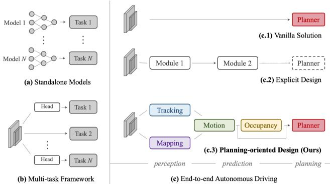
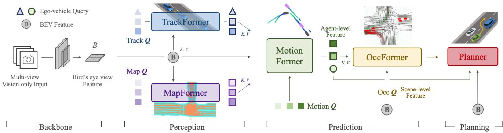
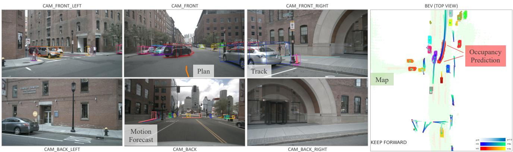

# Planning-oriented Autonomous Driving

Yihan Hu1,2∗, Jiazhi Yang1∗, Li Chen1∗†, Keyu Li1∗, Chonghao Sima1, Xizhou Zhu3,1 Siqi Chai2, Senyao Du2, Tianwei Lin2, Wenhai Wang1, Lewei Lu3, Xiaosong Jia1 Qiang Liu2, Jifeng Dai1, Yu Qiao1, Hongyang Li1†

1 OpenDriveLab and OpenGVLab, Shanghai AI Laboratory 2 Wuhan University 3 SenseTime Research ∗Equal contribution †Project lead https://github.com/OpenDriveLab/UniAD

## Abstract

Modern autonomous driving system is characterized as modular tasks in sequential order, i.e., perception, prediction, and planning. In order to perform a wide diversity of tasks and achieve advanced-level intelligence, contemporary approaches either deploy standalone models for individual tasks, or design a multi-task paradigm with separate heads. However, they might suffer from accumulative errors or deficient task coordination. Instead, we argue that a favorable framework should be devised and optimized in pursuit of the ultimate goal, i.e., planning of the self-driving car. Oriented at this, we revisit the key components within perception and prediction, and prioritize the tasks such that all these tasks contribute to planning. We introduce Unified Autonomous Driving (UniAD), a comprehensiveframework up-to-date that incorporates full-stack driving tasks in one network. It is exquisitely devised to leverage advantages of each module, and provide complementary feature abstractions for agent interaction from a global perspective. Tasks are communicated with unified query interfaces to facilitate each other toward planning. We instantiate UniAD on the challenging nuScenes benchmark. With extensive ablations, the effectiveness of using such a philosophy is proven by substantially outperforming previous state-of-the-arts in all aspects. Code and models are public

## 1. Introduction

With the successful development of deep learning, autonomous driving algorithms are assembled with a series of tasks1, including detection, tracking, mapping in perception; and motion and occupancy forecast in prediction. As depicted in Fig. 1(a), most industry solutions deploy standalone models for each task independently [38, 41], as long as the resource bandwidth of the onboard chip allows. Although such a design simplifies the R&D difficulty across teams, it bares the risk of information loss across modules, error accumulation and feature misalignment due to the isolation of optimization targets [32, 37, 47].

  
Figure 1. Comparison on the various designs of autonomous driving framework. (a) Most industrial solutions deploy separate models for different tasks. (b) The multi-task learning scheme shares a backbone with divided task heads. (c) The end-to-end paradigm unites modules in perception and prediction. Previous attempts either adopt a direct optimization on planning in (c.1) or devise the system with partial components in (c.2). Instead, we argue in (c.3) that a desirable system should be planning-oriented as well as properly organize preceding tasks to facilitate planning.

A more elegant design is to incorporate a wide span of tasks into a multi-task learning (MTL) paradigm, by plugging several task-specific heads into a shared feature extractor as shown in Fig. 1(b). This is a popular practice in many domains, including general vision [46, 51, 61], autonomous driving2 [8, 34, 57, 59], such as Transfuser [13], BEVerse [59], and industrialized products, e.g., Mobileye [38], Tesla [49], Nvidia [41], etc. In MTL, the co-training strategy across tasks could leverage feature abstraction; it could effortlessly extend to additional tasks, and save computation cost for onboard chips. However, such a scheme may cause undesirable “negative transfer” [16, 36].

<table><tr><td rowspan="2">Design</td><td rowspan="2">Approach</td><td colspan="3">Perception</td><td colspan="2">Prediction</td><td rowspan="2">Plan</td></tr><tr><td>Det.</td><td>Track Map</td><td></td><td>Motion</td><td>Occ.</td></tr><tr><td rowspan="3">(b)</td><td>NMP [57]</td><td>√</td><td></td><td></td><td>√</td><td></td><td>√</td></tr><tr><td>NEAT [12]</td><td></td><td></td><td>√</td><td></td><td></td><td>√</td></tr><tr><td>BEVerse [59]</td><td>√</td><td></td><td>√</td><td></td><td>√</td><td></td></tr><tr><td>(c.1)</td><td>[7,9,45,54]</td><td>1</td><td></td><td></td><td></td><td></td><td>√</td></tr><tr><td rowspan="6">(c.2)</td><td>PnPNet† [32] ViP3D† [18]</td><td>√ √</td><td>√ √</td><td></td><td>√ √</td><td></td><td></td></tr><tr><td>P3 [47]</td><td></td><td></td><td></td><td></td><td>√</td><td>√</td></tr><tr><td>MP3 [6]</td><td></td><td></td><td></td><td></td><td></td><td>√</td></tr><tr><td></td><td></td><td></td><td>√</td><td></td><td>√</td><td></td></tr><tr><td>ST-P3 [23]</td><td></td><td></td><td>√</td><td></td><td>S</td><td>√</td></tr><tr><td>LAV [8]</td><td>√</td><td></td><td>√</td><td>√</td><td></td><td>√</td></tr></table>

Table 1. Tasks comparison and taxonomy. “Design” column is classified as in Fig. 1. “Det.” denotes 3D object detection, “Map” stands for online mapping, and “Occ.” is occupancy map prediction. †: these works are not proposed directly for planning, yet they still share the spirit of joint perception and prediction. UniAD conducts five essential driving tasks to facilitate planning.

By contrast, the emergence of end-to-end autonomous driving [6, 8, 12, 23, 54] unites all nodes from perception, prediction and planning as a whole. The choice and priority of preceding tasks should be determined in favor of planning. The system should be planning-oriented, exquisitely designed with certain components involved, such that there are few accumulative error as in the standalone option or negative transfer as in the MTL scheme. Table 1 describes the task taxonomy of different framework designs.

Following the end-to-end paradigm, one “tabula-rasa” practice is to directly predict the planned trajectory, without any explicit supervision of perception and prediction as shown in Fig. 1(c.1). Pioneering works [7, 9, 14, 15, 45, 53, 54, 60] verified this vanilla design in the closed-loop simulation [17]. While such a direction deserves further exploration, it is inadequate in safety guarantee and interpretability, especially for highly dynamic urban scenarios. In this paper, we lean toward another perspective and ask the following question: Toward a reliable and planning-oriented autonomous driving system, how to design the pipeline in favor ofplanning? which preceding tasks are requisite?

An intuitive resolution would be to perceive surrounding objects, predict future behaviors and plan a safe maneuver explicitly, as illustrated in Fig. 1(c.2). Contemporary approaches [6,18,23,32,47] provide good insights and achieve impressive performance. However, we argue that the devil lies in the details; previous works more or less fail to consider certain components (see block (c.2) in Table 1), being reminiscent of the planning-oriented spirit. We elaborate on the detailed definition and terminology, the necessity of these modules in the Supplementary.

To this end, we introduce UniAD, a Unified Autonomous Driving algorithm framework to leverage five essential tasks toward a safe and robust system as depicted in Fig. 1(c.3) and Table 1(c.3). UniAD is designed in a planning-oriented spirit. We argue that this is not a simple stack of tasks with mere engineering effort. A key component is the querybased design to connect all nodes. Compared to the classic bounding box representation, queries benefit from a larger receptive field to soften the compounding error from upstream predictions. Moreover, queries are flexible to model and encode a variety of interactions, e.g., relations among multiple agents. To the best of our knowledge, UniAD is the first work to comprehensively investigate the joint cooperation of such a variety of tasks including perception, prediction and planning in the field of autonomous driving.

The contributions are summarized as follows. (a) we embrace a new outlook of autonomous driving framework following a planning-oriented philosophy, and demonstrate the necessity of effective task coordination, rather than standalone design or simple multi-task learning. (b) we present UniAD, a comprehensive end-to-end system that leverages a wide span of tasks. The key component to hit the ground running is the query design as interfaces connecting all nodes. As such, UniAD enjoys flexible intermediate representations and exchanging multi-task knowledge toward planning. (c) we instantiate UniAD on the challenging benchmark for realistic scenarios. Through extensive ablations, we verify the superiority of our method over previous state-of-the-arts in all aspects.

We hope this work could shed some light on the targetdriven design for the autonomous driving system, providing a starting point for coordinating various driving tasks.

## 2. Methodology

Overview. As illustrated in Fig. 2, UniAD comprises four transformer decoder-based perception and prediction modules and one planner in the end. Queries Q play the role of connecting the pipeline to model different interactions of entities in the driving scenario. Specifically, a sequence of multi-camera images is fed into the feature extractor, and the resulting perspective-view features are transformed into a unified bird’s-eye-view (BEV) feature B by an off-theshelf BEV encoder in BEVFormer [30]. Note that UniAD is not confined to a specific BEV encoder, and one can utilize other alternatives to extract richer BEV representations with long-term temporal fusion [19, 43] or multi-modality fusion [33,36]. In TrackFormer, the learnable embeddings that we refer to as track queries inquire about the agents’ information from B to detect and track agents. MapFormer takes map queries as semantic abstractions of road elements (e.g., lanes and dividers) and performs panoptic segmentation of the map. With the above queries representing agents and maps, MotionFormer captures interactions among agents and maps and forecasts per-agent future trajectories. Since the action of each agent can significantly impact others in the scene, this module makes joint predictions for all agents considered. Meanwhile, we devise an ego-vehicle query to explicitly model the ego-vehicle and enable it to interact with other agents in such a scenecentric paradigm. OccFormer employs the BEV feature B as queries, equipped with agent-wise knowledge as keys and values, and predicts multi-step future occupancy with agent identity preserved. Finally, Planner utilizes the expressive ego-vehicle query from MotionFormer to predict the planning result, and keep itself away from occupied regions predicted by OccFormer to avoid collisions.

  
Figure 2. Pipeline of Unified Autonomous Driving (UniAD). It is exquisitely devised following planning-oriented philosophy. Instead of a simple stack of tasks, we investigate the effect of each module in perception and prediction, leveraging the benefits of joint optimization from preceding nodes to final planning in the driving scene. All perception and prediction modules are designed in a transformer decoder structure, with task queries as interfaces connecting each node. A simple attention-based planner is in the end to predict future waypoints of the ego-vehicle considering the knowledge extracted from preceding nodes. The map over occupancy is for visual purpose only.

## 2.1. Perception: Tracking and Mapping

TrackFormer. It jointly performs detection and multiobject tracking (MOT) without non-differentiable postprocessing. Inspired by [56, 58], we take a similar query design. Besides the conventional detection queries utilized in object detection [5, 62], additional track queries are introduced to track agents across frames. Specifically, at each time step, initialized detection queries are responsible for detecting newborn agents that are perceived for the first time, while track queries keep modeling those agents detected in previous frames. Both detection queries and track queries capture the agent abstractions by attending to BEV feature B. As the scene continuously evolves, track queries at the current frame interact with previously recorded ones in a self-attention module to aggregate temporal information, until the corresponding agents disappear completely (untracked in a certain time period). Similar to [5], Track-Former contains N layers and the final output state $Q _ { A }$ provides knowledge of $N _ { a }$ valid agents for downstream prediction tasks. Besides queries encoding other agents surrounding the ego-vehicle, we introduce one particular ego-vehicle query in the query set to explicitly model the self-driving vehicle itself, which is further used in planning.

MapFormer. We design it based on a 2D panoptic segmentation method Panoptic SegFormer [31]. We sparsely represent road elements as map queries to help downstream motion forecasting, with location and structure knowledge encoded. For driving scenarios, we set lanes, dividers and crossings as things, and the drivable area as stuff [28]. Map-Former also has N stacked layers whose output results of each layer are all supervised, while only the updated queries $Q _ { M }$ in the last layer are forwarded to MotionFormer for agent-map interaction.

## 2.2. Prediction: Motion Forecasting

Recent studies have proven the effectiveness of transformer structure on the motion task [24,25,35,39,40,48,55], inspired by which we propose MotionFormer in the end-toend setting. With highly abstract queries for dynamic agents $Q _ { A }$ and static map $Q _ { M }$ from TrackFormer and MapFormer respectively, MotionFormer predicts all agents’ multimodal future movements, $i . e . ,$ top-k possible trajectories, in a scene-centric manner. This paradigm produces multi-agent trajectories in the frame with a single forward pass, which greatly saves the computational cost of aligning the whole scene to each agent’s coordinate [27]. Meanwhile, we pass the ego-vehicle query from TrackFormer through Motion-Former to engage ego-vehicle to interact with other agents, considering the future dynamics. Formally, the output motion is formulated as $\{ \hat { \mathbf { x } } _ { i , k } \in \mathbb { R } ^ { T \times 2 } | i = 1 , \ldots , N _ { a } ; k =$ $1 , \ldots , \kappa \}$ , where i indexes the agent, k indexes the modality of trajectories and T is the length of prediction horizon.

MotionFormer. It is composed of N layers, and each layer captures three types of interactions: agent-agent, agent-map and agent-goal point. For each motion query $Q _ { i , k }$ (defined later, and we omit subscripts i, k in the following context for simplicity), its interactions between other agents $Q _ { A }$ or map elements $Q _ { M }$ could be formulated as:

$$
Q _ { a / m } = \mathrm { M H C A } ( \mathrm { M H S A } ( Q ) , Q _ { A } / Q _ { M } ) ,\tag{1}
$$

where MHCA, MHSA denote multi-head cross-attention and multi-head self-attention [50] respectively. As it is also important to focus on the intended position, i.e., goal point, to refine the predicted trajectory, we devise an agent-goal point attention via deformable attention [62] as follows:

$$
Q _ { g } = \tt { D e f o r m a t t n } ( Q , \hat { x } _ { T } ^ { l - 1 } , B ) ,\tag{2}
$$

where $\hat { \mathbf { x } } _ { T } ^ { l - 1 }$ is the endpoint of the predicted trajectory of previous layer. $\mathsf { D e f o r m A t t n } ( q , r , x )$ , a deformable attention module [62], takes in the query q, reference point r and spatial feature x. It performs sparse attention on the spatial feature around the reference point. Through this, the predicted trajectory is further refined as aware of the endpoint surroundings. All three interactions are modeled in parallel, where the generated $Q _ { a } , Q _ { m }$ and $Q _ { g }$ are concatenated and passed to a multi-layer perceptron (MLP), resulting query context $Q _ { \mathrm { c t x } }$ . Then, $Q _ { \mathrm { c t x } }$ is sent to the successive layer for refinement or decoded as prediction results at the last layer.

Motion queries. The input queries for each layer of MotionFormer, termed motion queries, comprise two components: the query context $Q _ { \mathrm { c t x } }$ produced by the preceding layer as described before, and the query position $Q _ { \mathrm { p o s } }$ Specifically, $Q _ { \mathrm { p o s } }$ integrates the positional knowledge in four-folds as in Eq. (3): (1) the position of scene-level anchors $I ^ { s } ; ( 2 )$ the position of agent-level anchors $I ^ { a } ; ( 3 )$ current location of the agent i and (4) the predicted goal point.

$$
\begin{array} { r l } & { Q _ { \mathrm { p o s } } = \mathbf { M L P } ( \mathbf { P E } ( I ^ { s } ) ) + \mathbf { M L P } ( \mathbf { P E } ( I ^ { a } ) ) } \\ & { \qquad + \mathbf { M L P } ( \mathbf { P E } ( \hat { \mathbf { x } } _ { 0 } ) ) + \mathbf { M L P } ( \mathbf { P E } ( \hat { \mathbf { x } } _ { T } ^ { l - 1 } ) ) . } \end{array}\tag{3}
$$

Here the sinusoidal position encoding PE(·) followed by an MLP is utilized to encode the positional points and $\hat { \mathbf { x } } _ { T } ^ { 0 }$ is set as $I ^ { s }$ at the first layer (subscripts i, k are also omitted). The scene-level anchor represents prior movement statistics in a global view, while the agent-level anchor captures the possible intention in the local coordinate. They are both clustered by k-means algorithm on the endpoints of groundtruth trajectories, to narrow down the uncertainty of prediction. Contrary to the prior knowledge, the start point provides customized positional embedding for each agent, and the predicted endpoint serves as a dynamic anchor optimized layer-by-layer in a coarse-to-fine fashion.

Non-linear Optimization. Different from conventional motion forecasting works which have direct access to ground truth perceptual results, $i . e .$ , agents’ location and corresponding tracks, we consider the prediction uncertainty from the prior module in our end-to-end paradigm. Brutally regressing the ground-truth waypoints from an imperfect detection position or heading angle may lead to unrealistic trajectory predictions with large curvature and acceleration. To tackle this, we adopt a non-linear smoother [4] to adjust the target trajectories and make them physically feasible given an imprecise starting point predicted by the upstream module. The process is:

$$
\tilde { \mathbf { x } } ^ { * } = \arg \operatorname* { m i n } _ { \mathbf { x } } c ( \mathbf { x } , \tilde { \mathbf { x } } ) ,\tag{4}
$$

where x˜ and $\tilde { \mathbf { x } } ^ { * }$ denote the ground-truth and smoothed trajectory, x is generated by multiple-shooting [2], and the cost function is as follows:

$$
c ( \mathbf { x } , \tilde { \mathbf { x } } ) = \lambda _ { \mathrm { x y } } \| \mathbf { x } , \tilde { \mathbf { x } } \| _ { 2 } + \lambda _ { \mathrm { g o a l } } \| \mathbf { x } _ { T } , \tilde { \mathbf { x } } _ { T } \| _ { 2 } + \sum _ { \phi \in \Phi } \phi ( \mathbf { x } ) ,\tag{5}
$$

where $\lambda _ { \mathrm { x y } }$ and $\lambda _ { \mathrm { g o a l } }$ are hyperparameters, the kinematic function set Φ has five terms including jerk, curvature, curvature rate, acceleration and lateral acceleration. The cost function regularizes the target trajectory to obey kinematic constraints. This target trajectory optimization is only conducted in training and does not affect inference.

## 2.3. Prediction: Occupancy Prediction

Occupancy grid map is a discretized BEV representation where each cell holds a belief indicating whether it is occupied, and the occupancy prediction task is to discover how the grid map changes in the future. Previous approaches utilize RNN structure for temporally expanding future predictions from observed BEV features [20, 23, 59]. However, they rely on highly hand-crafted clustering postprocessing to generate per-agent occupancy maps, as they are mostly agent-agnostic by compressing BEV features as a whole into RNN hidden states. Due to the deficient usage of agent-wise knowledge, it is challenging for them to predict the behaviors of all agents globally, which is essential to understand how the scene evolves. To address this, we present OccFormer to incorporate both scene-level and agent-level semantics in two aspects: (1) a dense scene feature acquires agent-level features via an exquisitely designed attention module when unrolling to future horizons; (2) we produce instance-wise occupancy easily by a matrix multiplication between agent-level features and dense scene features without heavy post-processing.

OccFormer is composed of $T _ { o }$ sequential blocks where $T _ { o }$ indicates the prediction horizon. Note that $T _ { o }$ is typically smaller than $T$ in the motion task, due to the high computation cost of densely represented occupancy. Each block takes as input the rich agent features $G ^ { t }$ and the state (dense feature) $\mathbf { \nabla } \tilde { F ^ { t - 1 } }$ from the previous layer, and generates $F ^ { t }$ for timestep t considering both instance- and scene-level information. To get agent feature $G ^ { t }$ with dynamics and spatial priors, we max-pool motion queries from MotionFormer in the modality dimension denoted as $Q _ { X } \in \mathbb { R } ^ { N _ { a } \times D }$ , with D as the feature dimension. Then we fuse it with the upstream track query $Q _ { A }$ and current position embedding $P _ { A }$ via a temporal-specific MLP:

$$
G ^ { t } = \ M \mathrm { L } \mathsf { P } _ { t } ( [ Q _ { A } , P _ { A } , Q _ { X } ] ) , t = 1 , \ldots , T _ { o } ,\tag{6}
$$

where [·] indicates concatenation. For the scene-level knowledge, the BEV feature B is downscaled to 1/4 resolution for training efficiency to serve as the first block input $F ^ { 0 }$ . To further conserve training memory, each block follows a downsample-upsample manner with an attention module in between to conduct pixel-agent interaction at 1/8 downscaled feature, denoted as $F _ { \mathrm { d s } } ^ { t }$

Pixel-agent interaction is designed to unify the sceneand agent-level understanding when predicting future occupancy. We take the dense feature $F _ { \mathrm { d s } } ^ { t }$ as queries, instancelevel features as keys and values to update the dense feature over time. Detailedly, $F _ { \mathrm { d s } } ^ { t }$ is passed through a self-attention layer to model responses between distant grids, then a crossattention layer models interactions between agent features $G ^ { t }$ and per-grid features. Moreover, to align the pixel-agent correspondence, we constrain the cross-attention by an attention mask, which restricts each pixel to only look at the agent occupying it at timestep t, inspired by [10]. The update process of the dense feature is formulated as:

$$
D _ { \mathrm { d s } } ^ { t } = \mathtt { M H C A } \big ( \mathtt { M H S A } ( F _ { \mathrm { d s } } ^ { t } ) , G ^ { t } , \mathrm { a t t n . m a s k = } O _ { m } ^ { t } \big ) .\tag{7}
$$

The attention mask $O _ { m } ^ { t }$ is semantically similar to occupancy, and is generated by multiplying an additional agentlevel feature and the dense feature $F _ { \mathrm { d s } } ^ { t } ,$ , where we name the agent-level feature here as mask feature $M ^ { t } = \mathsf { M L P } ( G ^ { t } )$ After the interaction process in $\mathrm { E q . } ( 7 ) , D _ { \mathrm { d s } } ^ { t }$ is upsampled to 1/4 size of B. We further add $D _ { \mathrm { d s } } ^ { t }$ with block input $F ^ { t - 1 }$ as a residual connection, and the resulting feature $F ^ { t }$ is passed to the next block.

Instance-level occupancy. It represents the occupancy with each agent’s identity preserved. It could be simply drawn via matrix multiplication, as in recent query-based segmentation works [11, 29]. Formally, in order to get an occupancy prediction of original size $H \times W$ of BEV feature $B ,$ , the scene-level features $F ^ { t }$ are upsampled to $F _ { \mathrm { d e c } } ^ { t } \in \mathbb { R } ^ { C \times H \times W }$ by a convolutional decoder, where $C$ is the channel dimension. For the agent-level feature, we further update the coarse mask feature $M ^ { t }$ to the occupancy feature $U ^ { t } \in \mathbb { R } ^ { N _ { a } \times C }$ by another MLP. We empirically find that generating $U ^ { t }$ from mask feature $M ^ { t }$ instead of original agent feature $G ^ { t }$ leads to superior performance. The final instance-level occupancy of timestep t is:

$$
\hat { O } _ { A } ^ { t } = U ^ { t } \cdot F _ { \mathrm { d e c } } ^ { t } .\tag{8}
$$

## 2.4. Planning

Planning without high-definition (HD) maps or predefined routes usually requires a high-level command to indicate the direction to ${ \bf g 0 }$ [6, 23]. Following this, we convert the raw navigation signals $( i . e .$ , turn left, turn right and keep forward) into three learnable embeddings, named command embeddings. As the ego-vehicle query from MotionFormer already expresses its multimodal intentions, we equip it with command embeddings to form a “plan query”. We attend plan query to BEV features B to make it aware of surroundings, and then decode it to future waypoints τˆ.

To further avoid collisions, we optimize τˆ based on Newton’s method in inference only by the following:

$$
\tau ^ { * } = \arg \operatorname* { m i n } _ { \tau } f ( \tau , \hat { \tau } , \hat { O } ) ,\tag{9}
$$

where $\hat { \tau }$ is the original planning prediction, $\tau ^ { * }$ denotes the optimized planning, which is selected from multipleshooting [2] trajectories τ as to minimize cost function $f ( \cdot )$ Oˆ is a classical binary occupancy map merged from the instance-wise occupancy prediction from OccFormer. The cost function $f ( \cdot )$ is calculated by:

$$
f ( \tau , \hat { \tau } , \hat { O } ) = \lambda _ { \mathrm { c o o r d } } \lVert \tau , \hat { \tau } \rVert _ { 2 } + \lambda _ { \mathrm { o b s } } \sum _ { t } \mathcal { D } ( \tau _ { t } , \hat { O } ^ { t } ) ,\tag{10}
$$

$$
\mathcal { D } ( \tau _ { t } , \hat { O } ^ { t } ) = \sum _ { ( x , y ) \in \cal S } \frac { 1 } { \sigma \sqrt { 2 \pi } } \mathrm { e x p } ( - \frac { \| \tau _ { t } - ( x , y ) \| _ { 2 } ^ { 2 } } { 2 \sigma ^ { 2 } } ) .\tag{11}
$$

Here $\lambda _ { \mathrm { c o o r d } } , \lambda _ { \mathrm { o b s } }$ , and $\sigma$ are hyperparameters, and t indexes a timestep of future horizons. The $l _ { 2 }$ cost pulls the trajectory toward the original predicted one, while the collision term $\mathcal { D }$ pushes it away from occupied grids, considering surrounding positions confined to $S = \{ ( x , y ) | \| ( x , y ) { - \tau _ { t } } \| _ { 2 } <$ $d , \hat { O } _ { x , y } ^ { t } = 1 \}$

## 2.5. Learning

UniAD is trained in two stages. We first jointly train perception parts, $i . e .$ , the tracking and mapping modules, for a few epochs (6 in our experiments), and then train the model end-to-end for 20 epochs with all perception, prediction and planning modules. The two-stage training is found more stable empirically. We refer the audience to the Supplementary for details of each loss.

Shared matching. Since UniAD involves instance-wise modeling, pairing predictions to the ground truth set is required in perception and prediction tasks. Similar to DETR [5, 31], the bipartite matching algorithm is adopted in the tracking and online mapping stage. As for tracking, candidates from detection queries are paired with newborn ground truth objects, and predictions from track queries inherit the assignment from previous frames. The matching results in the tracking module are reused in motion and occupancy nodes to consistently model agents from historical tracks to future motions in the end-to-end framework.

<table><tr><td>ID</td><td>Track</td><td>Map</td><td>Modules Motion</td><td>Occ.</td><td>Plan</td><td>AMOTA↑</td><td>Tracking AMOTP↓</td><td>IDS↓</td><td>Mapping IoU-lane↑</td><td>IoU-road↑</td><td>minADE↓</td><td>Motion Forecasting minFDE↓</td><td>MR↓</td><td>IoU-n.↑ IoU-f.↑</td><td>Occupancy Prediction</td><td>VPQ-n.↑</td><td>VPQ-f.↑</td><td>avg.L2↓</td><td>Planning avg.Col.↓</td></tr><tr><td>0*</td><td>√</td><td>√</td><td>√</td><td>√</td><td>√</td><td>0.356</td><td>1.328</td><td>893</td><td>0.302</td><td>0.675</td><td>0.858</td><td>1.270</td><td>0.186</td><td>55.9</td><td>34.6</td><td>47.8</td><td>26.4</td><td>1.154</td><td>0.941</td></tr><tr><td>1</td><td>√</td><td></td><td></td><td></td><td></td><td>0.348</td><td>1.333</td><td>791</td><td></td><td></td><td></td><td></td><td></td><td></td><td></td><td></td><td></td><td></td><td></td></tr><tr><td>2</td><td></td><td>√</td><td></td><td></td><td></td><td></td><td></td><td></td><td>0.305</td><td>0.674</td><td></td><td></td><td></td><td></td><td></td><td></td><td></td><td></td><td></td></tr><tr><td>3</td><td>√</td><td>√</td><td></td><td></td><td></td><td>0.355</td><td>1.336</td><td>785</td><td>0.301</td><td>0.671</td><td></td><td></td><td></td><td></td><td></td><td></td><td></td><td></td><td></td></tr><tr><td>4</td><td></td><td></td><td>√</td><td></td><td></td><td></td><td></td><td></td><td></td><td></td><td>0.815</td><td>1.224</td><td>0.182</td><td></td><td></td><td></td><td></td><td></td><td></td></tr><tr><td>5 6</td><td>√</td><td></td><td>√ √</td><td></td><td></td><td>0.360</td><td>1.350</td><td>919</td><td></td><td></td><td>0.751</td><td>1.109</td><td>0.162</td><td></td><td></td><td></td><td></td><td></td><td></td></tr><tr><td></td><td>√</td><td>√</td><td></td><td></td><td></td><td>0.354</td><td>1.339</td><td>820</td><td>0.303</td><td>0.672</td><td>0.736(-9.7%)</td><td>1.066(-12.9%)</td><td>0.158</td><td></td><td></td><td></td><td></td><td></td><td></td></tr><tr><td>7 8</td><td></td><td></td><td></td><td>√</td><td></td><td></td><td></td><td></td><td></td><td></td><td></td><td></td><td></td><td>60.5</td><td>37.0</td><td>52.4</td><td>29.8</td><td></td><td></td></tr><tr><td>9</td><td>」</td><td></td><td></td><td>√</td><td></td><td>0.360</td><td>1.322</td><td>809</td><td></td><td></td><td></td><td></td><td></td><td>62.1</td><td>38.4</td><td>52.2</td><td>32.1</td><td></td><td></td></tr><tr><td></td><td>√</td><td>√</td><td>√</td><td>√</td><td></td><td>0.359</td><td>1.359</td><td>1057</td><td>0.304</td><td>0.675</td><td>0.710(-3.5%)</td><td>1.005(-5.8%)</td><td>0.146</td><td>62.3</td><td>39.4</td><td>53.1</td><td>32.2</td><td></td><td></td></tr><tr><td>10</td><td></td><td></td><td></td><td></td><td>√</td><td></td><td></td><td></td><td></td><td></td><td></td><td></td><td></td><td></td><td></td><td></td><td></td><td>1.131</td><td>0.773</td></tr><tr><td>11</td><td>√</td><td>√</td><td>√</td><td></td><td>√</td><td>0.366</td><td>1.337</td><td>889</td><td>0.303</td><td>0.672</td><td>0.741</td><td>1.077</td><td>0.157</td><td></td><td></td><td></td><td></td><td>1.014</td><td>0.717</td></tr><tr><td>12</td><td>√</td><td>√</td><td>√</td><td>√</td><td>√</td><td>0.358</td><td>1.334</td><td>641</td><td>0.302</td><td>0.672</td><td>0.728</td><td>1.054</td><td>0.154</td><td>62.3</td><td>39.5</td><td>52.8</td><td>32.3</td><td>1.004</td><td>0.430</td></tr></table>

Table 2. Detailed ablations on the effectiveness of each task. We can conclude that two perception sub-tasks greatly help motion forecasting, and prediction performance also benefits from unifying the two prediction modules. With all prior representations, our goal planning boosts significantly to ensure safety. UniAD outperforms naive MTL solution by a large margin for prediction and planning tasks, and it also owns the superiority that no substantial perceptual performance drop occurs. Only main metrics are shown for brevity. “avg.L2” and “avg.Col” are the average values across the planning horizon. ∗: ID-0 is the MTL scheme with separate heads for each task.

## 3. Experiments

We conduct experiments on the challenging nuScenes dataset [3]. In this section, we validate the effectiveness of our design in three aspects: joint results revealing the advantage of task coordination and its effect on planning, modular results of each task compared with previous methods, and ablations on the design space for specific modules. Due to space limit, the full suite of protocols, some ablations and visualizations are provided in the Supplementary.

## 3.1. Joint Results

We conduct extensive ablations as shown in Table 2 to prove the effectiveness and necessity of preceding tasks in the end-to-end pipeline. Each row of this table shows the model performance when incorporating task modules listed in the second Modules column. The first row (ID-0) serves as a vanilla multi-task baseline with separate task heads for comparison. The best result of each metric is marked in bold, and the runner-up result is underlined in each column.

Roadmap toward safe planning. As prediction is closer to planning compared to perception, we first investigate the two types of prediction tasks in our framework, i.e., motion forecasting and occupancy prediction. In Exp.10- 12, only when the two tasks are introduced simultaneously (Exp.12), both metrics of the planning L2 and collision rate achieve the best results, compared to naive endto-end planning without any intermediate tasks (Exp.10, Fig. 1(c.1)). Thus we conclude that both these two prediction tasks are required for a safe planning objective. Taking a step back, in Exp.7-9, we show the cooperative effect of two types of prediction. The performance of both tasks get improved when they are closely integrated (Exp.9, -3.5% minADE, -5.8% minFDE, -1.3 MR(%), +2.4 IoUf.(%), +2.4 VPQ-f.(%)), which demonstrates the necessity to include both agent and scene representations. Meanwhile, in order to realize a superior motion forecasting performance, we explore how perception modules could contribute in Exp.4-6. Notably, incorporating both tracking and mapping nodes brings remarkable improvement to forecasting results (-9.7% minADE, -12.9% minFDE, -2.3 MR(%)). We also present Exp.1-3, which indicate training perception sub-tasks together leads to comparable results to a single task. Additionally, compared with naive multi-task learning (Exp.0, Fig. 1(b)), Exp.12 outperforms it by a significant margin in all essential metrics (-15.2% minADE, - 17.0% minFDE, -3.2 MR(%)), +4.9 IoU-f.(%)., +5.9 VPQ f.(%), -0.15m avg.L2, -0.51 avg.Col.(%)), showing the superiority of our planning-oriented design.

## 3.2. Modular Results

Following the sequential order of perception-predictionplanning, we report the performance of each task module in comparison to prior state-of-the-arts on the nuScenes validation set. Note that UniAD jointly performs all these tasks with a single trained network. The main metric for each task is marked with gray background in tables.

Perception results. As for multi-object tracking in Table 3, UniAD yields a significant improvement of +6.5 and +14.2 AMOTA(%) compared to MUTR3D [58] and ViP3D [18] respectively. Moreover, UniAD achieves the lowest ID switch score, showing its temporal consistency for each tracklet. For online mapping in Table 4, UniAD performs well on segmenting lanes (+7.4 IoU(%) compared to BEVFormer), which is crucial for downstream agentroad interaction in the motion module. As our tracking module follows an end-to-end paradigm, it is still inferior to tracking-by-detection methods with complex associations such as Immortal Tracker [52], and our mapping results trail previous perception-oriented methods on specific classes. We argue that UniAD is to benefit final planning with perceived information rather than optimizing perception with full model capacity.

<table><tr><td>Method</td><td>AMOTA↑</td><td>AMOTP↓</td><td>Recall↑</td><td>IDS↓</td></tr><tr><td>Immortal Tracker† [52]</td><td>0.378</td><td>1.119</td><td>0.478</td><td>936</td></tr><tr><td>ViP3D [18]</td><td>0.217</td><td>1.625</td><td>0.363</td><td>=</td></tr><tr><td>QD3DT [21]</td><td>0.242</td><td>1.518</td><td>0.399</td><td></td></tr><tr><td>MUTR3D [58]</td><td>0.294</td><td>1.498</td><td>0.427</td><td>3822</td></tr><tr><td>UniAD</td><td>0.359</td><td>1.320</td><td>0.467</td><td>906</td></tr></table>

Table 3. Multi-object tracking. UniAD outperforms previous end-to-end MOT techniques (with image inputs only) on all metrics. †: Tracking-by-detection method with post-association, reimplemented with BEVFormer for a fair comparison.

<table><tr><td>Method</td><td>Lanes↑</td><td>Drivable↑</td><td>Divider↑</td><td>Crossing↑</td></tr><tr><td>VPN [42]</td><td>18.0</td><td>76.0</td><td></td><td></td></tr><tr><td>LSS [44]</td><td>18.3</td><td>73.9</td><td></td><td>=</td></tr><tr><td>BEVFormer [30]</td><td>23.9</td><td>77.5</td><td></td><td></td></tr><tr><td>BEVerse† [59]</td><td></td><td></td><td>30.6</td><td>17.2</td></tr><tr><td>UniAD</td><td>31.3</td><td>69.1</td><td>25.7</td><td>13.8</td></tr></table>

Table 4. Online mapping. UniAD achieves competitive performance against state-of-the-art perception-oriented methods, with comprehensive road semantics. We report segmentation IoU (%). †: Reimplemented with BEVFormer.

<table><tr><td>Method</td><td>minADE(m)↓</td><td>minFDE(m)↓</td><td>MR↓</td><td>EPA↑</td></tr><tr><td>PnPNet† [32]</td><td>1.15</td><td>1.95</td><td>0.226</td><td>0.222</td></tr><tr><td>ViP3D [18]</td><td>2.05</td><td>2.84</td><td>0.246</td><td>0.226</td></tr><tr><td>Constant Pos.</td><td>5.80</td><td>10.27</td><td>0.347</td><td></td></tr><tr><td>Constant Vel.</td><td>2.13</td><td>4.01</td><td>0.318</td><td></td></tr><tr><td>UniAD</td><td>0.71</td><td>1.02</td><td>0.151</td><td>0.456</td></tr></table>

Table 5. Motion forecasting. UniAD remarkably outperforms previous vision-based end-to-end methods. We also report two settings of modeling vehicles with constant positions or velocities as comparisons. †: Reimplemented with BEVFormer.

Prediction results. Motion forecasting results are shown in Table 5, where UniAD remarkably outperforms previous vision-based end-to-end methods. It reduces prediction errors by 38.3% and 65.4% on minADE compared to PnPNet-vision [32] and ViP3D [18] respectively. In terms of occupancy prediction reported in Table 6, UniAD gets notable advances in nearby areas, yielding +4.0 and +2.0 on IoU-near(%) compared to FIERY [20] and BEVerse [59] with heavy augmentations, respectively.

Planning results. Benefiting from rich spatial-temporal information in both the ego-vehicle query and occupancy, UniAD reduces planning L2 error and collision rate by 51.2% and 56.3% compared to ST-P3 [23], in terms of the average value for the planning horizon. Moreover, it notably outperforms several LiDAR-based counterparts, which is often deemed challenging for perception tasks.

## 3.3. Qualitative Results

Fig. 3 visualizes the results of all tasks for one complex scene. The ego vehicle drives with notice to the potential movement of a front vehicle and lane. In the Supplementary, we show more visualizations of challenging scenarios and one promising case for the planning-oriented design, that inaccurate results occur in prior modules while the later tasks could still recover, e.g., the planned trajectory remains reasonable though objects have a large heading angle deviation or fail to be detected in tracking results. Besides, we analyze that failure cases of UniAD are mainly under some long-tail scenarios such as large trucks and trailers, shown in the Supplementary as well.

<table><tr><td>Method</td><td>IoU-n.↑</td><td>IoU-f.↑</td><td>VPQ-n.↑</td><td>VPQ-f.↑</td></tr><tr><td>FIERY [20]</td><td>59.4</td><td>36.7</td><td>50.2</td><td>29.9</td></tr><tr><td>StretchBEV [1]</td><td>55.5</td><td>37.1</td><td>46.0</td><td>29.0</td></tr><tr><td>ST-P3 [23]</td><td></td><td>38.9</td><td></td><td>32.1</td></tr><tr><td>BEVerse† [59]</td><td>61.4</td><td>40.9</td><td>54.3</td><td>36.1</td></tr><tr><td>UniAD</td><td>63.4</td><td>40.2</td><td>54.7</td><td>33.5</td></tr></table>

Table 6. Occupancy prediction. UniAD gets significant improvement in nearby areas, which are more critical for planning. “n.” and “f.” indicates near (30×30m) and far (50×50m) evaluation ranges respectively. †: Trained with heavy augmentations.

<table><tr><td rowspan="2">Method</td><td colspan="4">L2(m)↓</td><td colspan="4">Col. Rate(%)↓</td></tr><tr><td>1s</td><td>2s</td><td>3s</td><td>Avg.</td><td>1s</td><td>2s</td><td>3s</td><td>Avg.</td></tr><tr><td>NMP† [57]</td><td></td><td>一</td><td>2.31</td><td>-</td><td>-</td><td></td><td>1.92</td><td>一</td></tr><tr><td>SA-NMP† [57]</td><td></td><td>1</td><td>2.05</td><td></td><td></td><td></td><td>1.59</td><td></td></tr><tr><td>FF† [22]</td><td>0.55</td><td>1.20</td><td>2.54</td><td>1.43</td><td>0.06</td><td>0.17</td><td>1.07</td><td>0.43</td></tr><tr><td>EO† [26]</td><td>0.67</td><td>1.36</td><td>2.78</td><td>1.60</td><td>0.04</td><td>0.09</td><td>0.88</td><td>0.33</td></tr><tr><td>ST-P3 [23]</td><td>1.33</td><td>2.11</td><td>2.90</td><td>2.11</td><td>0.23</td><td>0.62</td><td>1.27</td><td>0.71</td></tr><tr><td>UniAD</td><td>0.48</td><td>0.96</td><td>1.65</td><td>1.03</td><td>0.05</td><td>0.17</td><td>0.71</td><td>0.31</td></tr></table>

Table 7. Planning. UniAD achieves the lowest L2 error and collision rate in all time intervals and even outperforms LiDAR-based methods (†) in most cases, verifying the safety of our system.

<table><tr><td>ID</td><td>Scene-1. Anch.</td><td>Goal Inter.</td><td>Ego Q</td><td>NLO.</td><td>minADE↓</td><td>minFDE↓</td><td>MR↓</td><td>minFDE -mAP* ←</td></tr><tr><td>1</td><td></td><td></td><td></td><td></td><td>0.844</td><td>1.336</td><td>0.177</td><td>0.246</td></tr><tr><td>2</td><td>√</td><td></td><td></td><td></td><td>0.768</td><td>1.159</td><td>0.164</td><td>0.267</td></tr><tr><td>3</td><td>√</td><td>√</td><td></td><td></td><td>0.755</td><td>1.130</td><td>0.168</td><td>0.264</td></tr><tr><td>4</td><td>√</td><td>√</td><td>√</td><td></td><td>0.747</td><td>1.096</td><td>0.156</td><td>0.266</td></tr><tr><td>5</td><td>√</td><td>√</td><td>√</td><td>√</td><td>0.710</td><td>1.004</td><td>0.146</td><td>0.273</td></tr></table>

Table 8. Ablation for designs in the motion forecasting module. All components contribute to the ultimate performance. “Scenel. Anch.” denotes rotated scene-level anchors. “Goal Inter.” means the agent-goal point interaction. “Ego Q” represents the egovehicle query and “NLO.” is the non-linear optimization strategy. ∗: A metric considering detection and forecasting accuracy simultaneously, and we put details in the Supplementary.

## 3.4. Ablation Study

Effect of designs in MotionFormer. Table 8 shows that all of our proposed components described in Sec. 2.2 contribute to final performance regarding minADE, minFDE, Miss Rate and minFDE-mAP metrics. Notably, the rotated scene-level anchor shows a significant performance boost (- 15.8% minADE, -11.2% minFDE, +1.9 minFDE-mAP(%)), indicating that it is essential to do motion forecasting in the scene-centric manner. The agent-goal point interaction enhances the motion query with the planning-oriented visual feature, and surrounding agents can further benefit from considering the ego vehicle’s intention. Moreover, the non-linear optimization strategy improves the performance (-5.0% minADE, -8.4% minFDE, -1.0 MR(%), +0.7 minFDE-mAP(%)) by taking perceptual uncertainty into account in the end-to-end scenario.

  
Figure 3. Visualization results. We show results for all tasks in surround-view images and BEV. Predictions from motion and occupancy modules are consistent, and the ego vehicle is yielding to the front black car in this case. Each agent is illustrated with a unique color. Only top-1 and top-3 trajectories from motion forecasting are selected for visualization on image-view and BEV respectively.

<table><tr><td>ID</td><td>Cross. Attn.</td><td>Attn. Mask</td><td>Mask Feat.</td><td>IoU-n.↑</td><td>IoU-f.↑</td><td>VPQ-n.↑</td><td>VPQ-f.↑</td></tr><tr><td>1</td><td></td><td></td><td></td><td>61.2</td><td>39.7</td><td>51.5</td><td>31.8</td></tr><tr><td>2</td><td>√</td><td></td><td></td><td>61.3</td><td>39.4</td><td>51.0</td><td>31.8</td></tr><tr><td>3</td><td>√</td><td>√</td><td></td><td>62.3</td><td>39.7</td><td>52.4</td><td>32.5</td></tr><tr><td>4</td><td>√</td><td>√</td><td>√</td><td>62.6</td><td>39.5</td><td>53.2</td><td>32.8</td></tr></table>

Table 9. Ablation for designs in the occupancy prediction module. Cross-attention with masks and the reuse of mask feature helps improve the prediction. “Cross. Attn.” and “Attn. Mask” represent cross-attention and the attention mask in the pixel-agent interaction respectively. “Mask Feat.” denotes the reuse of the mask feature for instance-level occupancy.

<table><tr><td>ID</td><td>BEV Att.</td><td>Col. Loss</td><td>Occ. Optim.</td><td>1s</td><td>L2↓ 2s</td><td>3s</td><td>1s</td><td>Col. Rate↓ 2s</td><td>3s</td></tr><tr><td>1</td><td></td><td></td><td></td><td>0.44</td><td>0.99</td><td>1.71</td><td>0.56</td><td>0.88</td><td>1.64</td></tr><tr><td>2</td><td>√</td><td></td><td></td><td>0.44</td><td>1.04</td><td>1.81</td><td>0.35</td><td>0.71</td><td>1.58</td></tr><tr><td>3</td><td>√</td><td>√</td><td></td><td>0.44</td><td>1.02</td><td>1.76</td><td>0.30</td><td>0.51</td><td>1.39</td></tr><tr><td>4</td><td>√</td><td>√</td><td>√</td><td>0.54</td><td>1.09</td><td>1.81</td><td>0.13</td><td>0.42</td><td>1.05</td></tr></table>

Table 10. Ablation for designs in the planning module. Results demonstrate the necessity of each preceding task. “BEV Att.” indicates attending to BEV feature. “Col. Loss” denotes collision loss. “Occ. Optim.” is the optimization strategy with occupancy.

Effect of designs in OccFormer. As illustrated in Table 9, attending each pixel to all agents without locality constraints (Exp.2) results in slightly worse performance compared to an attention-free baseline (Exp.1). The occupancyguided attention mask resolves the problem and brings in gain, especially for nearby areas (Exp.3, +1.0 IoU-n.(%), +1.4 VPQ-n.(%)). Additionally, reusing the mask feature Mt instead of the agent feature to acquire the occupancy feature further enhances performance.

Effect of designs in Planner. We provide ablations on the proposed designs in planner in Table 10, i.e., attending BEV features, training with the collision loss and the optimization strategy with occupancy. Similar to previous research [22, 23], a lower collision rate is preferred for safety over naive trajectory mimicking (L2 metric), and is reduced with all parts applied in UniAD.

## 4. Conclusion and Future Work

We discuss the system-level design for the autonomous driving algorithm framework. A planning-oriented pipeline is proposed toward the ultimate pursuit for planning, namely UniAD. We provide detailed analyses on the necessity of each module within perception and prediction. To unify tasks, a query-based design is proposed to connect all nodes in UniAD, benefiting from richer representations for agent interaction in the environment. Extensive experiments verify the proposed method in all aspects.

Limitations and future work. Coordinating such a comprehensive system with multiple tasks is non-trivial and needs extensive computational power, especially trained with temporal history. How to devise and curate the system for a lightweight deployment deserves future exploration. Moreover, whether or not to incorporate more tasks such as depth estimation, behavior prediction, and how to embed them into the system, are worthy future directions as well.

Acknowledgements. This work is partially supported by National Key R&D Program of China (2022ZD0160100), and in part by Shanghai Committee of Science and Technology (21DZ1100100), and NSFC (62206172).

## References

[1] Adil Kaan Akan and Fatma Guney. StretchBEV: Stretching¨ future instance prediction spatially and temporally. In ECCV, 2022. 7

[2] Hans Georg Bock and Karl-Josef Plitt. A multiple shooting algorithm for direct solution of optimal control problems. IFAC Proceedings Volumes, 1984. 4, 5

[3] Holger Caesar, Varun Bankiti, Alex H Lang, Sourabh Vora, Venice Erin Liong, Qiang Xu, Anush Krishnan, Yu Pan, Giancarlo Baldan, and Oscar Beijbom. nuscenes: A multimodal dataset for autonomous driving. In CVPR, 2020. 6

[4] Holger Caesar, Juraj Kabzan, Kok Seang Tan, Whye Kit Fong, Eric Wolff, Alex Lang, Luke Fletcher, Oscar Beijbom, and Sammy Omari. nuplan: A closed-loop ml-based planning benchmark for autonomous vehicles. arXiv preprint arXiv:2106.11810, 2021. 4

[5] Nicolas Carion, Francisco Massa, Gabriel Synnaeve, Nicolas Usunier, Alexander Kirillov, and Sergey Zagoruyko. End-toend object detection with transformers. In ECCV, 2020. 3, 5

[6] Sergio Casas, Abbas Sadat, and Raquel Urtasun. Mp3: A unified model to map, perceive, predict and plan. In CVPR, 2021. 2, 5

[7] Dian Chen, Vladlen Koltun, and Philipp Krahenb¨ uhl. Learn-¨ ing to drive from a world on rails. In ICCV, 2021. 2

[8] Dian Chen and Philipp Krahenb¨ uhl. Learning from all vehi-¨ cles. In CVPR, 2022. 1, 2

[9] Dian Chen, Brady Zhou, Vladlen Koltun, and Philipp Krahenb¨ uhl. Learning by cheating. In¨ CoRL, 2020. 2

[10] Bowen Cheng, Ishan Misra, Alexander G. Schwing, Alexander Kirillov, and Rohit Girdhar. Masked-attention mask transformer for universal image segmentation. In CVPR, 2022. 5

[11] Bowen Cheng, Alex Schwing, and Alexander Kirillov. Perpixel classification is not all you need for semantic segmentation. In NeurIPS, 2021. 5

[12] Kashyap Chitta, Aditya Prakash, and Andreas Geiger. NEAT: Neural attention fields for end-to-end autonomous driving. In ICCV, 2021. 2

[13] Kashyap Chitta, Aditya Prakash, Bernhard Jaeger, Zehao Yu, Katrin Renz, and Andreas Geiger. Transfuser: Imitation with transformer-based sensor fusion for autonomous driving. IEEE TPAMI, 2022. 1

[14] Felipe Codevilla, Matthias Muller, Antonio L¨ opez, Vladlen´ Koltun, and Alexey Dosovitskiy. End-to-end driving via conditional imitation learning. In ICRA, 2018. 2

[15] Felipe Codevilla, Eder Santana, Antonio M Lopez, and´ Adrien Gaidon. Exploring the limitations of behavior cloning for autonomous driving. In ICCV, 2019. 2

[16] Michael Crawshaw. Multi-task learning with deep neural networks: A survey. arXiv preprint arXiv:2009.09796, 2020. 2

[17] Alexey Dosovitskiy, German Ros, Felipe Codevilla, Antonio Lopez, and Vladlen Koltun. CARLA: An open urban driving simulator. In CoRL, 2017. 2

[18] Junru Gu, Chenxu Hu, Tianyuan Zhang, Xuanyao Chen, Yilun Wang, Yue Wang, and Hang Zhao. ViP3D: End-to-end visual trajectory prediction via 3d agent queries. In CVPR, 2023. 2, 6, 7

[19] Chunrui Han, Jianjian Sun, Zheng Ge, Jinrong Yang, Runpei Dong, Hongyu Zhou, Weixin Mao, Yuang Peng, and Xiangyu Zhang. Exploring recurrent long-term temporal fusion for multi-view 3d perception. arXiv preprint arXiv:2303.05970, 2023. 2

[20] Anthony Hu, Zak Murez, Nikhil Mohan, Sof´ıa Dudas, Jeffrey Hawke, Vijay Badrinarayanan, Roberto Cipolla, and Alex Kendall. FIERY: Future instance prediction in bird’seye view from surround monocular cameras. In ICCV, 2021. 4, 7

[21] Hou-Ning Hu, Yung-Hsu Yang, Tobias Fischer, Trevor Darrell, Fisher Yu, and Min Sun. Monocular quasi-dense 3d object tracking. IEEE TPAMI, 2022. 7

[22] Peiyun Hu, Aaron Huang, John Dolan, David Held, and Deva Ramanan. Safe local motion planning with selfsupervised freespace forecasting. In CVPR, 2021. 7, 8

[23] Shengchao Hu, Li Chen, Penghao Wu, Hongyang Li, Junchi Yan, and Dacheng Tao. ST-P3: End-to-end vision-based autonomous driving via spatial-temporal feature learning. In ECCV, 2022. 2, 4, 5, 7, 8

[24] Xiaosong Jia, Liting Sun, Hang Zhao, Masayoshi Tomizuka, and Wei Zhan. Multi-agent trajectory prediction by combining egocentric and allocentric views. In CoRL, 2021. 3

[25] Xiaosong Jia, Penghao Wu, Li Chen, Hongyang Li, Yu Liu, and Junchi Yan. HDGT: Heterogeneous driving graph transformer for multi-agent trajectory prediction via scene encoding. arXiv preprint arXiv:2205.09753, 2022. 3

[26] Tarasha Khurana, Peiyun Hu, Achal Dave, Jason Ziglar, David Held, and Deva Ramanan. Differentiable raycasting for self-supervised occupancy forecasting. In ECCV, 2022. 7

[27] Jinkyu Kim, Reza Mahjourian, Scott Ettinger, Mayank Bansal, Brandyn White, Ben Sapp, and Dragomir Anguelov. Stopnet: Scalable trajectory and occupancy prediction for urban autonomous driving. arXiv preprint arXiv:2206.00991, 2022. 3

[28] Alexander Kirillov, Kaiming He, Ross Girshick, Carsten Rother, and Piotr Dollar. Panoptic segmentation. In ´ CVPR, 2019. 3

[29] Feng Li, Hao Zhang, Shilong Liu, Lei Zhang, Lionel M Ni, and Heung-Yeung Shum. Mask dino: Towards a unified transformer-based framework for object detection and segmentation. In CVPR, 2023. 5

[30] Zhiqi Li, Wenhai Wang, Hongyang Li, Enze Xie, Chonghao Sima, Tong Lu, Qiao Yu, and Jifeng Dai. BEVFormer: Learning bird’s-eye-view representation from multi-camera images via spatiotemporal transformers. In ECCV, 2022. 2, 7

[31] Zhiqi Li, Wenhai Wang, Enze Xie, Zhiding Yu, Anima Anandkumar, Jose M Alvarez, Ping Luo, and Tong Lu. Panoptic segformer: Delving deeper into panoptic segmentation with transformers. In CVPR, 2022. 3, 5

[32] Ming Liang, Bin Yang, Wenyuan Zeng, Yun Chen, Rui Hu, Sergio Casas, and Raquel Urtasun. Pnpnet: End-to-end perception and prediction with tracking in the loop. In CVPR, 2020. 1, 2, 7

[33] Tingting Liang, Hongwei Xie, Kaicheng Yu, Zhongyu Xia, Zhiwei Lin, Yongtao Wang, Tao Tang, Bing Wang, and Zhi Tang. BEVFusion: A simple and robust lidar-camera fusion framework. In NeurIPS, 2022. 2

[34] Xiwen Liang, Yangxin Wu, Jianhua Han, Hang Xu, Chunjing Xu, and Xiaodan Liang. Effective adaptation in multitask co-training for unified autonomous driving. In NeurIPS, 2022. 1

[35] Yicheng Liu, Jinghuai Zhang, Liangji Fang, Qinhong Jiang, and Bolei Zhou. Multimodal motion prediction with stacked transformers. In CVPR, 2021. 3

[36] Zhijian Liu, Haotian Tang, Alexander Amini, Xingyu Yang, Huizi Mao, Daniela Rus, and Song Han. BEVFusion: Multitask multi-sensor fusion with unified bird’s-eye view representation. In ICRA, 2023. 2

[37] Wenjie Luo, Bin Yang, and Raquel Urtasun. Fast and furious: Real time end-to-end 3d detection, tracking and motion forecasting with a single convolutional net. In CVPR, 2018. 1

[38] Mobileye. Mobileye under the hood. https://www. mobileye.com/ces-2022/, 2022. 1, 2

[39] Nigamaa Nayakanti, Rami Al-Rfou, Aurick Zhou, Kratarth Goel, Khaled S Refaat, and Benjamin Sapp. Wayformer: Motion forecasting via simple & efficient attention networks. arXiv preprint arXiv:2207.05844, 2022. 3

[40] Jiquan Ngiam, Benjamin Caine, Vijay Vasudevan, Zhengdong Zhang, Hao-Tien Lewis Chiang, Jeffrey Ling, Rebecca Roelofs, Alex Bewley, Chenxi Liu, Ashish Venugopal, David Weiss, Ben Sapp, Zhifeng Chen, and Jonathon Shlens. Scene transformer: A unified multi-task model for behavior prediction and planning. In ICLR, 2022. 3

[41] Nvidia. NVIDIA DRIVE End-to-End Solutions for Autonomous Vehicles. https://developer.nvidia. com/drive, 2022. 1, 2

[42] Bowen Pan, Jiankai Sun, Ho Yin Tiga Leung, Alex Andonian, and Bolei Zhou. Cross-view semantic segmentation for sensing surroundings. IEEE RA-L, 2020. 7

[43] Jinhyung Park, Chenfeng Xu, Shijia Yang, Kurt Keutzer, Kris Kitani, Masayoshi Tomizuka, and Wei Zhan. Time will tell: New outlooks and a baseline for temporal multi-view 3d object detection. arXiv preprint arXiv:2210.02443, 2022. 2

[44] Jonah Philion and Sanja Fidler. Lift, splat, shoot: Encoding images from arbitrary camera rigs by implicitly unprojecting to 3d. In ECCV, 2020. 7

[45] Aditya Prakash, Kashyap Chitta, and Andreas Geiger. Multimodal fusion transformer for end-to-end autonomous driving. In CVPR, 2021. 2

[46] Scott Reed, Konrad Zolna, Emilio Parisotto, Sergio Gomez Colmenarejo, Alexander Novikov, Gabriel Barth-Maron, Mai Gimenez, Yury Sulsky, Jackie Kay, Jost Tobias Springenberg, Tom Eccles, Jake Bruce, Ali Razavi, Ashley Edwards, Nicolas Heess, Yutian Chen, Raia Hadsell, Oriol Vinyals, Mahyar Bordbar, and Nando de Freitas. A generalist agent. arXiv preprint arXiv:2205.06175, 2022. 1

[47] Abbas Sadat, Sergio Casas, Mengye Ren, Xinyu Wu, Pranaab Dhawan, and Raquel Urtasun. Perceive, predict, and plan: Safe motion planning through interpretable semantic representations. In ECCV, 2020. 1, 2

[48] Shaoshuai Shi, Li Jiang, Dengxin Dai, and Bernt Schiele. Motion transformer with global intention localization and local movement refinement. In NeurIPS, 2022. 3

[49] Tesla. Tesla AI Day. https://www.youtube.com/ watch?v=ODSJsviD\_SU, 2022. 2

[50] Ashish Vaswani, Noam Shazeer, Niki Parmar, Jakob Uszkoreit, Llion Jones, Aidan N Gomez, Łukasz Kaiser, and Illia Polosukhin. Attention is all you need. In NeurIPS, 2017. 4

[51] Peng Wang, An Yang, Rui Men, Junyang Lin, Shuai Bai, Zhikang Li, Jianxin Ma, Chang Zhou, Jingren Zhou, and Hongxia Yang. Ofa: Unifying architectures, tasks, and modalities through a simple sequence-to-sequence learning framework. In ICML, 2022. 1

[52] Qitai Wang, Yuntao Chen, Ziqi Pang, Naiyan Wang, and Zhaoxiang Zhang. Immortal tracker: Tracklet never dies. arXiv preprint arXiv:2111.13672, 2021. 6, 7

[53] Penghao Wu, Li Chen, Hongyang Li, Xiaosong Jia, Junchi Yan, and Yu Qiao. Policy pre-training for autonomous driving via self-supervised geometric modeling. In ICLR, 2023. 2

[54] Penghao Wu, Xiaosong Jia, Li Chen, Junchi Yan, Hongyang Li, and Yu Qiao. Trajectory-guided control prediction for end-to-end autonomous driving: A simple yet strong baseline. In NeurIPS, 2022. 2

[55] Ye Yuan, Xinshuo Weng, Yanglan Ou, and Kris M Kitani. Agentformer: Agent-aware transformers for socio-temporal multi-agent forecasting. In ICCV, 2021. 3

[56] Fangao Zeng, Bin Dong, Tiancai Wang, Xiangyu Zhang, and Yichen Wei. Motr: End-to-end multiple-object tracking with transformer. In ECCV, 2021. 3

[57] Wenyuan Zeng, Wenjie Luo, Simon Suo, Abbas Sadat, Bin Yang, Sergio Casas, and Raquel Urtasun. End-to-end interpretable neural motion planner. In CVPR, 2019. 1, 2, 7

[58] Tianyuan Zhang, Xuanyao Chen, Yue Wang, Yilun Wang, and Hang Zhao. MUTR3D: A Multi-camera Tracking Framework via 3D-to-2D Queries. In CVPR Workshop, 2022. 3, 6, 7

[59] Yunpeng Zhang, Zheng Zhu, Wenzhao Zheng, Junjie Huang, Guan Huang, Jie Zhou, and Jiwen Lu. BEVerse: Unified perception and prediction in birds-eye-view for vision-centric autonomous driving. arXiv preprint arXiv:2205.09743, 2022. 1, 2, 4, 7

[60] Zhejun Zhang, Alexander Liniger, Dengxin Dai, Fisher Yu, and Luc Van Gool. End-to-end urban driving by imitating a reinforcement learning coach. In ICCV, 2021. 2

[61] Jinguo Zhu, Xizhou Zhu, Wenhai Wang, Xiaohua Wang, Hongsheng Li, Xiaogang Wang, and Jifeng Dai. Uniperceiver-moe: Learning sparse generalist models with conditional moes. In NeurIPS, 2022. 1

[62] Xizhou Zhu, Weijie Su, Lewei Lu, Bin Li, Xiaogang Wang, and Jifeng Dai. Deformable detr: Deformable transformers for end-to-end object detection. In ICLR, 2020. 3, 4