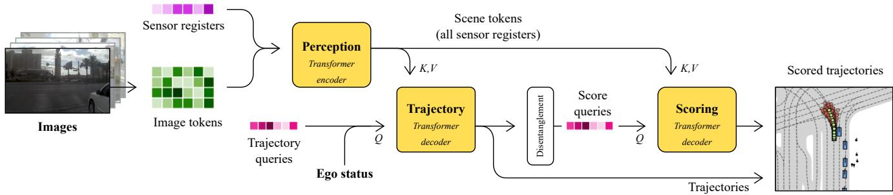
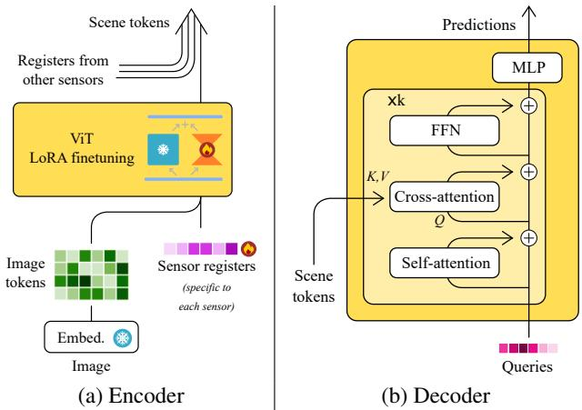
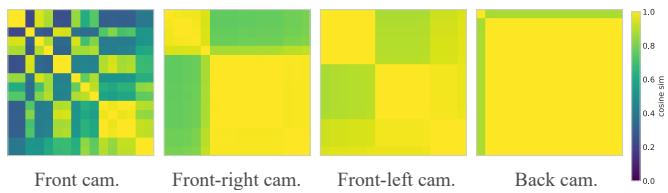
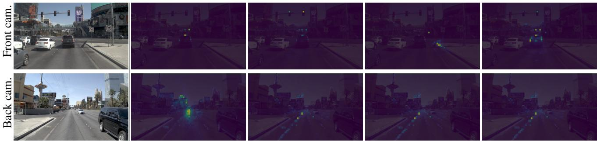
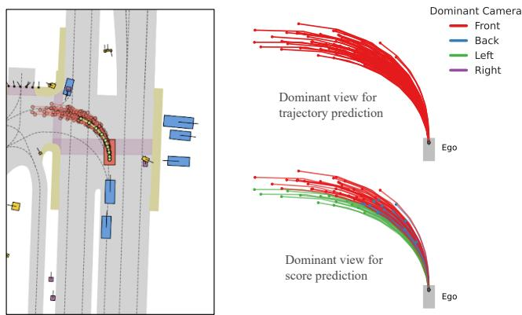
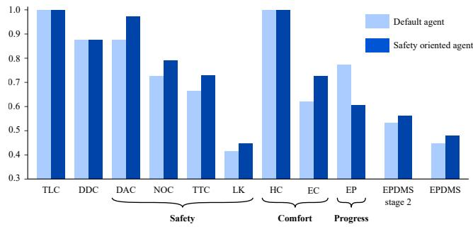

# Driving on Registers

Ellington Kirby1,\* Alexandre Boulch1,\* Yihong Xu1,\* Yuan Yin1 Gilles Puy1 Eloi Zablocki´ 1 Andrei Bursuc1 Spyros Gidaris1 Renaud Marlet1,2 Florent Bartoccioni1 Anh-Quan Cao1 Nermin Samet1 Tuan-Hung VU1 Matthieu Cord1,3

1valeo.ai, Paris, France 2LIGM, ENPC, IP Paris, UGE, CNRS, France 3Sorbonne Universite, CNRS, ISIR, F-75005 Paris, France´

## Abstract

We present DrivoR, a simple transformer-based architecture for end-to-end autonomous driving. Our approach builds on pretrained Vision Transformers (ViTs) and introduces camera-aware register tokens that compress multicamera features into a compact scene representation, significantly reducing downstream computation without sacrificing accuracy. These tokens drive two lightweight transformer decoders that generate and then score candidate trajectories. The scoring decoder learns to mimic an oracle and predicts interpretable sub-scores e.g., safety or efficiency, enabling behavior-conditioned driving at inference. Despite its minimal design, DrivoR outperforms or matches strong baselines across NAVSIM-v1/v2, and closed-loop HUGSIM benchmarks. Our results show that a pure-transformer architecture, combined with targeted token compression, is sufficient for accurate, efficient, and adaptive end-to-end driving. Code and checkpoints are available via the project page.

## 1. Introduction

End-to-end (E2E) planning has emerged as a promising direction for autonomous driving (AD), offering a single pipeline that maps raw sensor data and ego state to driving decisions [19, 46]. Besides, by avoiding intermediate annotations such as 3D boxes, these methods reduce labeling cost. Among E2E approaches, trajectoryproposal methods, whether using a large pre-computed vocabulary [6, 27, 30, 32], or generating proposals on the fly [15, 16, 33, 49], have shown strong performance.

Methods predicting multiple possible trajectories and selecting between them naturally capture the uncertainty within navigation. As in model-based RL [35], the ability to score becomes central: the scorer must reliably choose the best candidate using context encoded in the sensor features.

The sensor processing backbone producing the features that capture this context are thus key in E2E planning methods. These backbones typically dominate the parameter and FLOP count of E2E methods, often leveraging convolutional architectures like VoV-Net [26] or large pre-trained networks such as Vision Transformers [13] like EVA [14], or DINO [36]. Such backbones output thousands of tokens per frame, which must be processed for hundreds of trajectories. This creates a major computational bottleneck that only worsens as resolution or sensor count increases.

The most common solution to reducing the bottleneck is to pool these features along the spatial dimensions. However, feature pooling enforces specific resolution requirements on sensor inputs, and treats all inputs as equally informative, performing the same averaging operation across all cameras. Inspired by works like [51], we ask just how many tokens are needed to represent a driving scene?

We introduce DrivoR, a ViT-based E2E planning architecture that replaces uniform pooling with a fixed set of percamera register tokens that serve as compact scene descriptors. These tokens preserve planning-relevant context while drastically reducing the visual representation length. Using this compressed representation, DrivoR generates and scores trajectory proposals using two disentangled modules. The final trajectory is selected using predicted sub-scores, allowing behavior modulation at inference.

Our method relies only on scoring annotations (rather than explicit 3D supervision) and achieves strong results on NAVSIM-v1/v2 [5, 12], and the closed-loop HUGSIM benchmark [54]. Overall, our contributions are as follows:

• A simple transformer architecture, without intermediate BEV representations, or a large trajectory dictionary.

• The first work to explore specific, structural, advantages of ViT-based image backbones for E2E planning in the usage of register-based token compression.

• A disentangled scoring module enabling stronger performance and controllable behavior.

  
Figure 1. DrivoR architecture. The proposed architecture is composed of three transformer blocks: one encoder (perception) and two decoders (trajectory and scoring). The perception encoder compresses perceptual information in camera-aware registers for lightweight subsequent processing in the trajectory and scoring decoders. The decoded trajectories are re-embedded and detached from the gradient computation graph to disentangle scoring and generation. The final trajectory is chosen from the proposal set via the max predicted score.

## 2. Related Work

Token compression. Token reduction is central to efficient ViTs, whose attention cost grows quadratically with sequence length. Simple solutions such as patch-group pooling are parameter-free but treat all tokens uniformly. Other training-free strategies include matching-based compression [2]. Learned approaches range from Perceiver-IO’s latent queries [22] to ViT register tokens, originally introduced to fix attention sinks [10] and later used in compact generative models like TiTok [51]. Recent driving-focused works [20, 45] highlight the growing need for token reduction in real-time systems. To our knowledge, we are the first to repurpose ViT register tokens specifically for reducing visual tokens in E2E planning, enabling compact scene representations while retaining planning-critical context.

End-to-end driving. End-to-end learning has become popular in autonomous driving since the proof of concept of pioneering works [19, 24] like UniAD [19]. However, they still heavily rely on modular designs with different sub modules, such as detection, tracking and mapping, making it hard to deploy. With the introduction of more efficient (pseudo) closed-loop evaluation metrics [5, 12] or simulation [54], more recent methods [6, 8, 16, 29, 33, 43] predict the planned trajectory or actions directly from sensor inputs, a step forward toward the fully end-to-end paradigm.

These E2E methods [16, 29, 33] mostly rely on off-theshelf CNN-based (e.g., ResNet-34, ResNet-50, V2-99) image encoders without putting further attention on the design of the perception stack. Downstream in the planning stack, transformers are more robustly explored. Transfuser [8] uses transformers for LiDAR–image fusion; DriveTransformer [23] unifies multiple tasks under one transformer; and iPad [16] exploits transformer residuals for iterative trajectory refinement. Innovation has concentrated on how to use mid-level sensor features rather than on stronger pretrained backbones. When ViTs [13] are used, methods [15, 31, 32, 50] typically rely on large or huge variants without considering the computation costs. These models lean on attention to fuse heterogeneous inputs (ego state, images, LiDAR, commands), but often supplement it with costly 3D reasoning-BEV projections, deformable cross-attention, or LiDAR supervision, raising annotation and compute demands. In this context, we design a simple query-based transformer architecture, built on the much smaller ViT variants, avoiding costly complex intermediate representation, while keeping superior driving performance. Trajectory scoring. Trajectory-proposal based planning has become a compelling direction for E2E driving, introduced in Hydra-MDP [27]. Producing many possible futures and selecting one forces the model to address multimodality head-on. This shifts importance toward the scoring module, which must reliably choose the best candidate [33]. A recent state-of-the-art work on NAVSIM-v2, GTRS [32] showed that learning a sufficiently strong scorer using a ViT backbone, paired with a large trajectory vocabulary, can solve complex scenarios. We introduce the importance of separate scoring and trajectory branches in our E2E model.

## 3. Method

## 3.1. A Simple Design

We design a simple and efficient transformer based architecture for planning in autonomous driving. The overall pipeline is presented in Fig. 1. It is composed of three modules: an encoder for perception and two decoders for trajectory estimation and scoring. The model follows a classical transformer encoder-decoder architecture [42] without any complex intermediate representation.

The encoder for perception (see Sec. 3.2) is a vision transformer [13] applied per camera. In order to compress the feature map to small set of tokens, we introduce additional per-camera registers, finetuned with the backbone to encode the perceptual information. We group together all per-camera register tokens at the ViT output to form the scene tokens. The trajectories are then estimated from learned queries using a transformer decoder attending to the scene tokens via cross-attention (see Sec. 3.3). Finally, the trajectories are scored in the scoring decoder. Each trajectory becomes a query input of the decoder, which also attends to the scene tokens to produce scores (see Sec. 3.4).

  
Figure 2. Encoder and decoder architectures follow standard transformer architectures, with introduction of sensor registers in the encoder, and using these registers as scene tokens in downstream decoders.

During training, the trajectories are learned using a winner-takes-all regression loss (Sec. 3.3) and the scores are learned against an oracle scorer, e.g., provided along with the dataset (Sec. 3.4). At inference, we re-interpret our learned scoring function as a reward function, enabling driving according to several behavior conditioned policies with a single trained model.

## 3.2. Perception Encoder

At perception level, we seek to fulfill three objectives: 1) leveraging recent ViT architectures; 2) benefiting from pretrained weights; and 3) limiting the output size to contain the computational complexity in the decoders. To this end, we efficiently compress the perceptual signals into a limited set of tokens using additional registers, and finetune the backbone with LoRA. as illustrated in Fig. 2a.

For each camera, we concatenate R camera registers of size $D _ { \mathrm { V i T } }$ , along with pre-existing registers, classification token, and patch tokens. D denotes the dimension of the ViT features. All registers and tokens are fed to the ViT. We then retrieve the R camera tokens at the final layer of the ViT. The final camera tokens for each of the N cameras are finally grouped together to obtain $N \times R$ scene tokens of size $D _ { \mathrm { V i T } }$ . Note that we use per-camera registers, that is we initialize $N \times R$ registers, where N is the number of input cameras. This allows us to have camera-aware scene tokens: the model can differentiate if a given scene token is extracted from, e.g., the front, left or right camera.

This compression into a small set of camera tokens is close in spirit to Perceiver approaches [21, 22], with the noticeable difference that these approaches use crossattentions for compression. Setting up such a mechanism in the encoder would require changes in the ViT architecture.

In our case, we can directly use a pretrained ViT as initialization, and perform LoRA finetuning of the ViT backbone to learn the vision-to-register compression, reducing parameter count and speeding training.

## 3.3. Trajectories

Trajectory decoder. All decoders use the architecture depicted in Fig. 2b, which consists of a vanilla transformer decoder [42]: a stack of k transformer blocks, each made of a self-attention layer, followed by a cross-attention to the scene tokens, and a FFN, all with residual connections.

The input of the trajectory decoder consists of a set of learnable trajectory queries $Q _ { \mathrm { t r a j } } ,$ each of dimension $D _ { \mathrm { t r a j } } .$ which is also the inner dimension of the trajectory decoder. After the process, the queries are decoded into $| Q _ { \mathrm { t r a j } } |$ candidate trajectories. These queries are randomly initialized and learned during training. The ego status inputs, consisting of poses, velocities, accelerations, and driving command, are encoded and added to the trajectory queries before entering the decoder. The final trajectory tokens at the end of the transformer are decoded into trajectories with an MLP.

Each decoded candidate trajectory $\tau _ { i }$ is a sequence of $n _ { p }$ poses predicted from the current timestep t (excluded) up to a future horizon at $t + T _ { \ast }$ , T being the total prediction duration. Each pose is represented as $( x , y , \theta ) \in \mathbb { R } ^ { 3 }$ , and the full trajectory lies in $\mathbb { R } ^ { n _ { p } \times 3 }$ . The variables x and $y$ denote the longitudinal and lateral displacements, respectively, and θ is the heading. All quantities are expressed in the ego agent’s local reference frame at timestep t. The time interval between successive predicted poses is assumed to be uniform. Trajectory loss. The trajectories $\tau _ { i }$ are learned using a Winner-Takes-All (WTA) approach [17] or, equivalently, the minimum-over-n (MoN) loss [16]. Given a reference human trajectory $\hat { \tau }$ of duration $T$ and consisting of $n _ { p }$ poses, only the closest predicted trajectory is supervised, which allows the model to produce diverse candidate trajectories:

$$
\mathcal { L } _ { \mathrm { t r a j } } = \operatorname* { m i n } _ { i } \| \tau _ { i } - \hat { \tau } \| _ { 1 }\tag{1}
$$

This formulation encourages the model to consider multiple plausible pathways for a given scene.

An additional regression target $\hat { \tau } ^ { \prime }$ can be introduced to encourage the predicted trajectories to reach farther waypoints. To construct this target, a reference trajectory with duration $T ^ { \prime } > T$ is resampled to $T$ using cubic spline interpolation, producing an accelerated version that matches the number of predicted poses $n _ { p }$ . The resulting multi-target trajectory loss is written as

$$
\mathcal { L } _ { \mathrm { t r a j } } = \operatorname* { m i n } _ { i } ( \| \tau _ { i } - \hat { \tau } \| _ { 1 } + \| \tau _ { i } - \hat { \tau } ^ { \prime } \| _ { 1 } ) .\tag{2}
$$

## 3.4. Scores

Scoring decoder. The scoring decoder, which evaluates the quality of each candidate trajectory, uses an architecture mirroring that of trajectory generation.

The scoring decoder takes as input the decoded trajectories as well as perceptual information through the scene tokens. Each decoded trajectory is turned into a $D _ { \mathrm { s c o r e ^ { - } } }$ dimensional query using an MLP. All the trajectory queries are fed to the scoring decoder.

Embedding the decoded trajectories into a new feature space rather than reusing the trajectory decoder’s output tokens is key in our architecture. This enforces a separation between the information used to generate trajectories and the information used to score them: the scorer sees only the decoded trajectory, not the additional latent details still present in the trajectory tokens.

Our scoring decoder then uses cross-attentions between scene tokens and score queries, allowing gradients to flow back to the perception encoder to learn scene tokens useful for both trajectory and scoring predictions. However, we prevent the gradient from the scoring decoder from flowing back to the trajectory decoder. This prevents the trajectory decoder from being influenced by the current quality of the scoring decoder during training.

Finally we predict the six score components [12] using a dedicated MLP for each score.

Scoring for adjustable driving behavior. A key feature of our model is its ability to adapt trajectory selection to different driving preferences. For instance, one user may prioritize safety and comfort, while another may favor faster progress at the cost of smoothness. To enable such flexibility, our scoring head predicts separate sub-scores corresponding to different aspects of driving quality (e.g., safety, comfort, efficiency). These sub-scores can then be combined post-hoc into a single meta-score at inference time, allowing the relative importance of each term to be adjusted without retraining the model. We adopt the sub-scores directly from the Predictive Driver Model Score (PDMS) scorer used in NAVSIM-v1.

Scoring loss. We train our scoring network via binary cross entropy (BCE) to predict the individual sub-score components c of the PDMS, each given a weight $\lambda _ { c }$ :

$$
\mathcal { L } _ { \mathrm { s c o r e } } = \sum _ { c } \lambda _ { c } \sum _ { i } \mathrm { B C E } \left( \mathcal { G } _ { \theta _ { c } } ( \tau _ { i } ) , \mathcal { G } _ { c } ( \tau _ { i } ) \right)\tag{3}
$$

where $\mathcal { G } _ { c }$ is an oracle scorer for the sub-score $c ,$ and $\mathcal { G } _ { \theta _ { c } } ( \tau _ { i } )$ is our learned scoring head for sub-score c.

Inference. At inference, we interpret our scoring network as a reward function and our full pipeline as a driving policy which is conditioned on a specific behavior profile encapsulated in the set of weights applied to the scoring outputs. Borrowing from Offline-RL literature such as CtRL-Sim [37], we can thus condition our final scoring output on a driving behavior by modifying the values of our $\lambda _ { c } .$ , and selecting trajectories which maximize the score computed with this new set of weights. For example, this can encourage trajectories which make maximal estimated progress.

## 3.5. Final Training Loss

The training loss is the combination the trajectory loss and the scoring loss:

$$
\begin{array} { r } { \mathcal { L } = \mathcal { L } _ { \mathrm { t r a j } } + \lambda _ { s } \mathcal { L } _ { \mathrm { s c o r e } } . } \end{array}\tag{4}
$$

In practice during training, the weights of the losses are all set to 1 for ease of implementation, s.t., $\lambda _ { c } = 1$ for each sub-score c and $\lambda _ { s } = 1$

## 4. Experiments

Experimental setup. As input, we use 4 cameras (front, front left, front right and back). The perception module is a DINOv2 ViT-S [36] encoder, LoRA finetuned [18] (rank 32) following [1]. By default, we add 16 registers per camera. The decoders are 4-layer transformers with an inner dimension of 256. The feed- forward network has a dilation factor of 4. The camera registers as well as the initial trajectory tokens are randomly initialized with normal distribution $\mathcal { N } ( 0 , 1 0 ^ { - 6 } )$ . The model is trained on the navtrain split for 10 epochs, with learning rate $2 \times 1 0 ^ { - 4 }$ and cosine annealing scheduling. For the ablation studies, if not described otherwise, we train our model with this common base architecture. All ablation model scores are computed on the navval split. All models were trained on 4 NVIDIA A100 GPUs. The DrivoR model is roughly 40M parameters, significantly below comparable works.

## 4.1. Benchmarks

NAVSIM-v1. NAVSIM-v1 [12] is a dataset built out of nuPlan [4] as a subset of OpenScene [9]. As opposed to previous benchmark such as nuScenes [3], mostly formulating driving quality as a measure of similarity to the expert human trajectory, NAVSIM-v1 introduces metrics inspired from closed-loop simulation. The main metric, Predictive Driver Model Score (PDMS), is an aggregation of penalties, e.g., collisions with other, non-reactive, agents, staying onroad and in the correct direction, and avoiding near-misses with other agents. These scores are combined with qualityrelated scores such as the comfort and progress. Progress is measured as a comparison to the centerline-progress of a PDM agent [11] given access to complete ground-truth information. For training, we use default PDMS weights defined in the benchmark [12].

The results obtained on the NAVSIM-v1 benchmark are presented in Tab. 1. DrivoR outperforms all other methods on NAVSIM-v1, and nears human-level performance. We highlight the comparison to RAP [15], which we consider an orthogonal work: the large quantity of rasterized data introduced in the paper may be used in any method.

<table><tr><td>Method</td><td></td><td>NC DAC TTC</td><td> Comf.</td><td>EP</td><td>PDMS</td></tr><tr><td>PDM-Closed Human driver [12] NeurIPS’24</td><td>[11] PMLR&#x27;23</td><td>94.6 99.8 100 100</td><td>89.9 86.9 100 99.9</td><td>99.9 87.5</td><td>89.1 94.8</td></tr><tr><td>RAP-DINO†</td><td>[15] arXiv&#x27;25</td><td>99.1 98.9</td><td>96.7 100</td><td>90.3</td><td>93.8</td></tr><tr><td>Ego-stat. MLP [12] NeurIPS’24</td><td></td><td>|93.0 77.3 83.6</td><td>100</td><td>62.8|</td><td>65.6</td></tr><tr><td>UniVLA</td><td>[44] arXiv&#x27;25</td><td>96.9 91.1</td><td>91.7 96.7</td><td>76.8</td><td>81.7</td></tr><tr><td>DrivingGPT</td><td>[7] ICCV’24</td><td>98.9</td><td>90.7 94.9 95.6</td><td>79.7</td><td>82.4</td></tr><tr><td>UniAD</td><td>[19] CVPR’23</td><td>97.8 91.9</td><td>92.9 100</td><td>78.8</td><td>83.4</td></tr><tr><td>LTF</td><td>[8] TPAMI&#x27;22</td><td>97.4 92.8</td><td>92.4 100</td><td>79.0</td><td>83.8</td></tr><tr><td>PARA-Drive</td><td>[46] CVPR’24</td><td>97.9</td><td>92.4 93.0 99.8</td><td>79.3</td><td>84.0</td></tr><tr><td>DriveX-S</td><td>[38] ICCV&#x27;25</td><td>97.5 94.0</td><td>93.0</td><td>100 79.7</td><td>84.5</td></tr><tr><td>World4Drive</td><td>[53] ICCV’25</td><td>97.4 94.3</td><td>92.8</td><td>100 79.9</td><td>85.1</td></tr><tr><td>DRAMA</td><td>[52] ISRR’24</td><td>98.0 93.1 94.8</td><td>100</td><td>80.1</td><td>85.5</td></tr><tr><td>VAD-v2</td><td>[6] arXiv’24</td><td>98.1 94.8</td><td>94.3 100</td><td>80.6</td><td>86.2</td></tr><tr><td>PRIX</td><td>[47] RA-L&#x27;26</td><td>98.1 96.3</td><td>94.1 100</td><td>82.3</td><td>87.8</td></tr><tr><td>DiffusionDrive[33] CVPR&#x27;25</td><td></td><td>98.2 96.2 94.7</td><td>100</td><td>82.2</td><td>88.1</td></tr><tr><td>DIVER</td><td>[40] arXiv&#x27;25</td><td>98.5 96.5</td><td>94.9</td><td>100 82.6</td><td>88.3</td></tr><tr><td>AutoVLA</td><td>[55] NeurIPS’25</td><td>98.4</td><td>95.6 98.0</td><td>99.9 81.9</td><td>89.1</td></tr><tr><td>DriveVLA-W0[28] arXiv&#x27;25</td><td></td><td>98.7</td><td>99.1 95.3</td><td>99.3 83.3</td><td>90.2</td></tr><tr><td>ReCogDrive</td><td>[29] arXiv’25</td><td>97.9 97.3</td><td>94.9</td><td>100 87.3</td><td>90.8</td></tr><tr><td>Hydra-MDP++[27] arXiv&#x27;25</td><td></td><td>98.6 98.6</td><td>95.1</td><td>100 85.7</td><td>91.0</td></tr><tr><td>iPad</td><td>[16] arXiv&#x27;25</td><td>98.6 98.3 94.9</td><td></td><td>100 88.0</td><td>91.7</td></tr><tr><td>Centaur</td><td>[39] arXiv&#x27;25</td><td>99.5 98.9</td><td>98.0</td><td>100 85.9</td><td>92.6</td></tr><tr><td>DriveSuprim</td><td></td><td>98.6 98.6</td><td>95.5</td><td>91.3</td><td>93.5</td></tr><tr><td></td><td>[50] arXiv&#x27;25</td><td></td><td></td><td>100</td><td></td></tr><tr><td>DrivoR</td><td></td><td>99.0 98.9 96.7</td><td></td><td>100 90.0</td><td>93.7</td></tr></table>

†: RAP [15] is trained on a dataset that is 10× larger than navtrain (the default training set).

Table 1. NAVSIM-v1. Comparison to existing camera-only methods on the NAVSIM-v1 benchmark on test set (navtest). Full definition of scores in supplementary material, higher is better.
<table><tr><td></td><td colspan="5">RC</td><td colspan="5">HD-Score</td></tr><tr><td>Method</td><td>E</td><td>M</td><td>H</td><td>X</td><td>Avg.</td><td>E</td><td>M</td><td>H</td><td>X</td><td>Avg.</td></tr><tr><td>VAD [24]</td><td>51.3</td><td>31.1</td><td>25.3</td><td>26.5 67.8 35.1 26.2 40.5 38.9</td><td>31.4</td><td>36.3 58.9</td><td>9.5 18.0</td><td></td><td>8.0 11.5</td><td>13.4</td></tr><tr><td>LTF [8] UniAD[19]</td><td></td><td></td><td></td><td>78.4 60.5 33.6 17.845.9</td><td></td><td>64.9</td><td>945.8 20.6</td><td></td><td>9.8 25.9</td><td>23.7 6.6 32.7</td></tr><tr><td>DrivoR</td><td></td><td></td><td></td><td>80.9 50.5 33.8 47.1 49.8</td><td></td><td>73.3 34.6 18.8 32.5 35.7</td><td></td><td></td><td></td><td></td></tr><tr><td></td><td></td><td></td><td></td><td></td><td></td><td></td><td></td><td></td><td></td><td></td></tr></table>

E: Easy, M: Medium, H: Hard, X: Extreme  
Table 2. Photorealistic closed-loop evaluation on HUGSIM [54]. Zero-shot generalization using the DrivoR model from the NAVSIM-v1 evaluation. Scores are per difficulty and overall average road completion (RC) and HD-Score, higher always better.

NAVSIM-v2. NAVSIM-v2 [5] builds on NAVSIM-v1 with the objective of closing the gap with closed-loop, simulator driven, benchmarks. NAVSIM-v2 introduces a second stage of evaluation, where novel variations of scenes are generated via Gaussian Splatting. These novel scenes consist of perturbations of the ego vehicle status, i.e., shifts and rotations, forcing the model to generalize outside of the training distribution. NAVSIM-v2 is scored using an extended version of the score from NAVSIM-v1, termed the EPDMS. We present the results on the navhard-two-stage split of NAVSIM-v2 in table Tab. 3, where DrivoR outperforms all existing works. We note that the results in Tab. 3 were computed after an official bug fix, and thus do not include the largest GTRS-Dense model. Results on NAVSIM-2 before the fix are included in the supplementary material. We use warmup-two-stage1 as validation set for NAVSIM-v2 containing 7 scenes.

We highlight GTRS-DrivoR-ViT-S (row 4), produced by replacing the GTRS backbone with our ViT-S + registerbased compression while keeping their original vocabulary and scorer. This swap removes GTRS’s pooling in favor of our learned compression, improving performance over the similarly sized V2-99 backbone and approaching the EVA-ViT-L variants (see supplementary), while delivering over 3× higher throughput. Notably, our full SOTA model differs from this variant only in the scoring pipeline, demonstrating the gains from our scorer.

HUGSIM. For the closed-loop evaluation, we use HUGSIM [54], a benchmark with scenarios adapted from the original scenes of KITTI-360 [34], nuScenes [3], PandaSet [48], and Waymo [41]. These scenarios are reconstructed as photorealistic 3D environments in which an E2E model controls the ego agent to navigate within each scenario. The planner perceives the 3D environment through RGB cameras whose viewpoints are determined by the ego agent’s position in the scenario.

Tab. 2 reports results on the pre-challenge HUGSIM test set (345 scenarios across four difficulty levels). We follow the zero-shot protocol and evaluate with Road Completion (RC) and the HUGSIM Driving Score (HD-Score), the latter combining RC with averaged NC, DAC, TTC, and comfort. DrivoR, trained only on NAVSIM-v1 with no finetuning, achieves an RC of 49.8 and an HD-Score of 35.7—the highest among the reported baselines.

Note that we identified several anomalies 1 in the official evaluation and simulation code, including inconsistent acceleration bounds in the comfort metric computation and an incorrect heading computation for the planned trajectory provided to the controller. After applying the necessary fixes, we reproduced all scores using our corrected implementation, since the results produced by the original code are not directly comparable and do not ensure a reliable evaluation.

Efficiency We benchmark the runtime performance of DrivoR against a ViT-L baseline (GTRS) on a single element batch and an A100 GPU without quantization nor acceleration process. DrivoR obtains a more than 3x throughput improvement (from 400ms/forward to 110ms/forward), with 3x reduction in GFLOPS and peak memory usage,

<table><tr><td></td><td></td><td colspan="6">Stage 1</td><td colspan="6">Stage 2</td></tr><tr><td>Method</td><td></td><td>NC</td><td>DAC</td><td>DDC</td><td>TLC</td><td>EP</td><td>TTC LK</td><td>HC EC</td><td>NC DAC DDC</td><td>TLC EP</td><td>TTC LK</td><td>HC</td><td>EC</td><td>EPDMS</td></tr><tr><td>RAP-DINO (ViT-H)</td><td>[15]</td><td>97.1</td><td>94.4</td><td>98.8</td><td>99.8</td><td>83.9</td><td>96.9</td><td>94.7 96.4 66.2</td><td>83.2 83.9</td><td>87.4 98.0</td><td>86.9 80.4</td><td>52.3</td><td>95.2 52.4</td><td>39.6</td></tr><tr><td>GTRS-D (V2-99)</td><td>[32]</td><td>98.9</td><td>96.2</td><td>99.4</td><td>99.3</td><td>72.9</td><td>98.9</td><td>95.1 96.9 39.1</td><td>91.2 89.4</td><td>94.4 98.8</td><td>69.5 90.0</td><td>54.3</td><td>94.0 48.7</td><td>45.0</td></tr><tr><td>GTRS-A (V2-99)</td><td>[32]</td><td>98.9</td><td>95.1</td><td>99.1</td><td>99.6</td><td>76.2</td><td>99.1</td><td>94.9 97.6 54.2</td><td>88.1 88.8</td><td>89.3 98.9</td><td>98.9 85.9</td><td>53.7</td><td>96.8 56.9</td><td>45.4</td></tr><tr><td>GTRS-DrivoR (ViT-S)*</td><td></td><td>98.0</td><td>95.8</td><td>99.7</td><td>99.3</td><td>72.9</td><td>98.2</td><td>95.6 96.9 51.6</td><td>91.6</td><td>90.2</td><td>98.8 73.2 88.9</td><td>51.9</td><td>94.9 46.4</td><td>45.8</td></tr><tr><td>ZTRS (V2-99)</td><td>[31]</td><td>98.9</td><td>97.6</td><td>100</td><td>100</td><td>66.7</td><td>98.9</td><td>96.2 96.7 44.0</td><td>86.7 91.1</td><td>95.8</td><td>99.0 63.6</td><td>89.8 60.4 97.6 66.1</td><td></td><td>48.1</td></tr><tr><td>DrivoR (ViT-S)</td><td></td><td>98.8</td><td>95.1</td><td>98.9</td><td>100</td><td>72.6</td><td>98.7</td><td>94.0 97.6 73.3</td><td>90.2</td><td>90.4 88.4 91.9</td><td>98.6 70.0</td><td></td><td>88.0 50.1 98.5 76.2</td><td>48.3</td></tr></table>

∗: uses the same ViT-S backbone with registers as DrivoR, the prediction and scoring heads remain the same as in GTRS.

Table 3. NAVSIM-v2 navhard-two-stage. Comparison to existing methods on the NAVSIM-v2 benchmark test set using the EPDMS. Full definition of all scores in supplementary material, larger always better. Note: other scores reported in the literature before the official benchmark bug fix of the metrics are reported in supplementary material.

with improved scores, demonstrating a step towards real time usage of a ViT backbone. Please refer to Table 11 in the Supplementary Material for full efficiency breakdown.

## 4.2. Ablation Studies

## 4.2.1. Perception

<table><tr><td>Init.</td><td>Random</td><td>ImageNet 21k</td><td>DINOv2</td></tr><tr><td>PDMS</td><td>70.1</td><td>87.5</td><td>90.0</td></tr></table>

(a) Pretaining.
<table><tr><td rowspan=1 colspan=2>Compres- Cam. Scenesion      tokenstokens</td><td rowspan=1 colspan=1>Img. Enc.training</td><td rowspan=1 colspan=1>ParametersOptim Total</td><td rowspan=1 colspan=1>PDMS</td></tr><tr><td rowspan=2 colspan=1>(a)(b)(c)</td><td rowspan=1 colspan=1>No      4k   16k</td><td rowspan=1 colspan=1>FrozenLoRA</td><td rowspan=1 colspan=1>18.2 41.218.8 41.8</td><td rowspan=1 colspan=1>88.290.2</td></tr><tr><td rowspan=1 colspan=1>Pooling  16   64</td><td rowspan=1 colspan=1>|LoRA</td><td rowspan=1 colspan=1>18.2 41.2</td><td rowspan=1 colspan=1>89.7</td></tr><tr><td rowspan=1 colspan=1>(d)(e)</td><td rowspan=1 colspan=1>16    64Decoder16   64</td><td rowspan=1 colspan=1>|FrozenLoRA</td><td rowspan=1 colspan=1>19.3 42.319.9 42.9</td><td rowspan=1 colspan=1>86.989.3</td></tr><tr><td rowspan=1 colspan=1>(f)</td><td rowspan=1 colspan=1>16    64</td><td rowspan=2 colspan=1>Full ft.Frozen</td><td rowspan=2 colspan=1>41.2 41.218.2 41.2</td><td rowspan=2 colspan=1>88.484.4</td></tr><tr><td rowspan=1 colspan=1>(g) R</td><td rowspan=1 colspan=1>egisters16    64</td></tr><tr><td rowspan=1 colspan=2>(h)            16    64</td><td rowspan=1 colspan=1>LoRA</td><td rowspan=1 colspan=1>18.8 41.8</td><td rowspan=1 colspan=1>90.0</td></tr></table>

(b) Compression and finetuning. Note the higher performance of register based compression, nearing the model using 250x as many tokens.
<table><tr><td># Tokens per cam. per scene</td><td>Registers</td><td></td><td>PDMS</td></tr><tr><td>5</td><td>20</td><td>DINOv2</td><td>88.1</td></tr><tr><td>5 + 16</td><td>84</td><td>DINOv2 + Rand. init.</td><td>89.8</td></tr><tr><td>5</td><td>20</td><td>Rand. init.</td><td>89.7</td></tr><tr><td>8</td><td>32</td><td>Rand. init.</td><td>89.7</td></tr><tr><td>16</td><td>64</td><td>Rand. init.</td><td>90.0</td></tr><tr><td>32</td><td>128</td><td>Rand. init.</td><td>89.8</td></tr></table>

(c) Scene token count influence.  
Table 4. Ablations of the perception. All results are presented on navval using a ViT-S backbone.

Image backbone initialization. Various previous methods [15, 16] use pretrained backbones. We first study the impact of such an initialization on the planning results in Tab. 4a. First, a good initialization of the perception ViT is crucial: using a pretrained backbone improves scores by a large margin (more than 15 PDMS points). Second, using large-scale pretrained DINOv2 [36] improves further over pretraining on ImageNet21k [25]. In all subsequent experiments, we use a pretrained DINOv2 backbone.

Compression to low number of perceptual tokens. As argued in Sec. 3, using few perceptual tokens is of interest as it makes the trajectory prediction and scoring lightweight and faster. In Tab. 4b, first column, we study three compression approaches: using a pooling operation of the output feature map as in [32] (c), using a transformer decoder with 16 queries per camera (e), and our proposed approach using 16 additional registers in the model (h). For comparison purpose, we also provide models using the full feature maps, i.e., 16k scene tokens in (b). We observe that our register-based approach outperforms the pooling operation while introducing a low-overhead (0.6M parameters) at training. It also nearly reaches the performances of the nocompression model, despite using 250 times fewer tokens for downstream processing. Additionally, we observe that using a transformer decoder (with roughly the same number of parameters) does not reach the same performance.

Register token correlation. Fig. 3 shows inter-register cosine similarity for each camera. Front-camera tokens are largely de-correlated, suggesting per-register specialization. Fig. 4 confirms this: different front camera registers attend to distinct regions, e.g., lead vehicle, traffic lights, sidewalk.

Moving toward the rear cameras, similarity increases sharply: most tokens collapse to the same representation, and within the back camera only one remains distinct. The attention maps (second row of Fig. 4) reflect this collapse.

This pattern aligns with driving intuition: most attention is devoted to the scene ahead, with only brief checks behind. We hypothesize that collapsing less informative views (side/back) reduces noise for downstream planning, an effect which is impossible to observe with uniform pooling.

  
Figure 3. Cosine similarity between scene tokens. Darker indicates lower cosine similarity. Note the specialized tokens in the front cam, and collapsed tokens in the back cam, showing relative camera compression. Averaged on navval.

Finetuning strategy. Next, we study the finetuning strategy in Tab. 4b, second column, with three different settings: full finetuning (d, f), frozen backbone (a, d, g) and LoRA finetuning [18] (b, c, e, h). For frozen backbone with registers, only the registers are learnable. First, we observe that LoRA finetuning improves the results by a large margin, reaching similar conclusion as in [1] over frozen backbone. It is also the case when comparing LoRA (h) and Full finetuning (f), but to our understanding, it should be possible to close this gap with careful learning rate scheduling specific to the backbone. LoRA being more robust to these meta parameters, we use LoRA finetuning as default.

Number of registers. We present in Tab. 4c the evolution of the validation score depending on the number of camera tokens. We either use new registers randomly initialized (the 4 original registers of the DINOv2 backbone are discarded) or, we keep the DINOv2 registers along with our randomly initialized ones. In the later case, to discriminate the cameras, we add per-camera learnable positional encoding to the DINOv2 registers at the image backbone output.

First, using the DINOv2 registers does not help compared to random initialization. We observe that the already specialized registers could be a bad initialization for driving tasks. We hypothesize that similarly to full finetuning, a careful learning rate scheduling could mitigate this gap.

Second, we observe that using more registers improves the performances up to a plateau between 16 and 32 registers per camera, we thus select 16 registers.

## 4.2.2. Trajectories

The number of trajectory queries strongly affects performance. As shown in Tab. 5, increasing queries from 1 (human-only regression) to 128 yields gains that plateau around 64, which we adopt as our default.

## 4.2.3. Scoring

Tab. 6 shows our scoring pipeline ablation results.

Single vs. dual branches: (a) Using one transformer branch for both trajectory generation and scoring (with separate MLP heads) harms performance. As shown in Fig. 5, the two tasks attend to different cameras: generation focuses on the front view even for left turns, while scoring draws on left- or rear-camera features depending on trajectory sharpness or collision risk, motivating separate branches.

<table><tr><td>Num traj.</td><td>1</td><td>8</td><td>16</td><td>32</td><td>64</td><td>128</td></tr><tr><td>PDMS</td><td>80.1</td><td>87.6</td><td>88.1</td><td>89.5</td><td>90.0</td><td>90.0</td></tr></table>

Table 5. Ablations of the trajectory prediction. Influence of the number of trajectories on navval.

<table><tr><td rowspan=1 colspan=1>Separatedecoders</td><td rowspan=1 colspan=1>Disentan-glement</td><td rowspan=1 colspan=1>Scorenum.</td><td rowspan=1 colspan=1>BehaviorPDMScontrol</td></tr><tr><td rowspan=1 colspan=1>(a)   X(b)    √</td><td rowspan=1 colspan=1>一X</td><td rowspan=1 colspan=1>66</td><td rowspan=1 colspan=1>84.786.8</td></tr><tr><td rowspan=1 colspan=1>(c)   L</td><td rowspan=1 colspan=1></td><td rowspan=1 colspan=1>6</td><td rowspan=1 colspan=1>90.0</td></tr><tr><td rowspan=1 colspan=1>(d)</td><td rowspan=1 colspan=1></td><td rowspan=1 colspan=1>1</td><td rowspan=1 colspan=1>88.2     X</td></tr></table>

Table 6. Ablations of the scoring on navval. Disentanglement refers to a stop-gradient followed by an embedding of decoded trajectories. Behavior control stands for predicting all 6 PDMS components.
<table><tr><td>Targets</td><td>navval (PDMS) warmup (EPDMS)</td><td></td></tr><tr><td>(t + T)</td><td>90.0</td><td>39.4</td></tr><tr><td>(t + T) &amp; (t + T′)</td><td>90.6</td><td>37.8</td></tr></table>

Table 7. Ablations. Multiple targets for WTA regression, we report PDMS score for NAVSIM-v1 navval and EPDMS for NAVSIM-v2 warmup-two-stage.

Disentanglement: We next examine whether the scoring branch should embed trajectories in a new space. Variants (c) and (d) block gradients to the generator, while variant (b) does not. Increased separation consistently improves performance.

Sub-score prediction: Comparing (c) and (d), predicting multiple sub-scores not only enables behavior control but also improves accuracy. This is likely due to the fact that learning the final output of the scoring formula in Eq. 3 is more difficult than predicting its components.

## 4.2.4. Training

Longer trajectory. In Sec. 3, we introduced an augmentation that regresses to a second, more aggressive trajectory. Tab. 7 compares this double objective to standard regression on the human trajectory. It improves NAVSIMv1, which rewards progress over comfort, but hurts performance on NAVSIM-v2 warmup-two-stage, where perturbed agent states require more cautious driving to avoid collisions and recover safely.

Final training setup. For the final model setting, we evaluated longer training lengths. We observe that PDMS on navval increase with the number of epochs, reaching a plateau at 25 epochs. Our final model for NAVSIM-v1 is then trained for 25 epochs, on the competition split (navtrain + navval). On NAVSIM-v2 (warmup-two-stage), we observe an opposite trend, with EPDMS decreasing with the number of training epochs as well as training using the competition split. We therefore use 10 epochs for NAVSIM-v2.

  
Figure 4. Attention maps of scene tokens. From the final attention layer, front-camera tokens specialize to distinct regions (traffic light, lead vehicle, road edges), while back-camera tokens largely collapse to the same features, aside from a single distinct token.

  
Figure 5. Scoring head disentanglement. Dominant cameras are identified via cross-attention between scene tokens and score or trajectory tokens. Trajectory prediction consistently relies on the front camera, while scoring shifts attention based on trajectory behavior—underscoring the need to separate the two pipelines.

Safety-oriented agent. We evaluate the behavior of our agent obtained after tuning the score weights on warmup-two-stage. Intuitively we expect safer driving to be required for NAVSIM-v2 due to out-of-distribution scenes. In Fig. 6 we represent this agent in dark blue (“Safety-Oriented Agent”), and indeed see improved performance on safety and comfort metrics, but decreased progress, representing more passive, safe, driving.

  
Figure 6. Safety-oriented agent. Dark blue was tuned on warmup-two-stage, light blue is our NAVSIM-v1 model. The result of our behavior tuning is a more cautious, but safer agent.

## 5. Conclusion

We present DrivoR, a novel E2E driving method using register-based compression and disentangled scoring representations. DrivoR highlights that full-transformer architectures without complex intermediate states nor large trajectory dictionaries can achieve state-of-the-art results. Future works may explore compression incorporating historical frames, additional sensors or map information.

## Acknowledgments

We thank Loick Chambon for constant support throughout the project and Lan Feng for helpful discussions. This work was granted access to the HPC resources of IDRIS under the allocations AD011016241, AD011016239R1 and AD011012883R4 made by GENCI. We acknowledge chair VISA DEEP (ANR-20- CHIA-0022), Cluster Post-GenAI@Paris (ANR-23-IACL-0007, FRANCE 2030), and EuroHPC Joint Undertaking for awarding the project ID EHPC-REG-2024R02-210 access to Karolina, Czech Republic. Funded by the European Union. Views and opinions expressed are however those of the author(s) only and do not necessarily reflect those of the European Union or the European Commission. Neither the European Union nor the European Commission can be held responsible for them. This work was supported by the European Union’s Horizon Europe research and innovation programme under grant agreement No 101214398 (ELLIOT).

## References

[1] Merve Rabia Barın, Gorkay Aydemir, and Fatma G¨ uney. Ro-¨ bust bird’s eye view segmentation by adapting dinov2. In ECCV Workshops, 2024. 4, 7

[2] Daniel Bolya, Cheng-Yang Fu, Xiaoliang Dai, Peizhao Zhang, Christoph Feichtenhofer, and Judy Hoffman. Token merging: Your vit but faster. In ICLR, 2023. 2

[3] Holger Caesar, Varun Bankiti, Alex H. Lang, Sourabh Vora, Venice Erin Liong, Qiang Xu, Anush Krishnan, Yu Pan, Giancarlo Baldan, and Oscar Beijbom. nuscenes: A multimodal dataset for autonomous driving. In CVPR, 2020. 4, 5

[4] Holger Caesar, Juraj Kabzan, Kok Seang Tan, Whye Kit Fong, Eric Wolff, Alex Lang, Luke Fletcher, Oscar Beijbom, and Sammy Omari. nuplan: A closed-loop ml-based planning benchmark for autonomous vehicles. In CVPR Workshops, 2021. 4

[5] Wei Cao, Marcel Hallgarten, Tianyu Li, Daniel Dauner, Xunjiang Gu, Caojun Wang, Yakov Miron, Marco Aiello, Hongyang Li, Igor Gilitschenski, Boris Ivanovic, Marco Pavone, Andreas Geiger, and Kashyap Chitta. Pseudosimulation for autonomous driving. In CoRL, 2025. 1, 2, 5

[6] Shaoyu Chen, Bo Jiang, Hao Gao, Bencheng Liao, Qing Xu, Qian Zhang, Chang Huang, Wenyu Liu, and Xinggang Wang. Vadv2: End-to-end vectorized autonomous driving via probabilistic planning. arXiv preprint arXiv:2402.13243, 2024. 1, 2, 5

[7] Yuntao Chen, Yuqi Wang, and Zhaoxiang Zhang. Drivinggpt: Unifying driving world modeling and planning with multi-modal autoregressive transformers. In ICCV, 2025. 5

[8] Kashyap Chitta, Aditya Prakash, Bernhard Jaeger, Zehao Yu, Katrin Renz, and Andreas Geiger. Transfuser: Imitation with transformer-based sensor fusion for autonomous driving. TPAMI, 2022. 2, 5

[9] OpenScene Contributors. Openscene: The largest up-to-date 3d occupancy prediction benchmark in autonomous driving. In CVPR, 2023. 4

[10] Timothee Darcet, Maxime Oquab, Julien Mairal, and Piotr´ Bojanowski. Vision transformers need registers. In ICLR, 2024. 2

[11] Daniel Dauner, Marcel Hallgarten, Andreas Geiger, and Kashyap Chitta. Parting with misconceptions about learningbased vehicle motion planning. In CoRL, 2023. 4, 5

[12] Daniel Dauner, Marcel Hallgarten, Tianyu Li, Xinshuo Weng, Zhiyu Huang, Zetong Yang, Hongyang Li, Igor Gilitschenski, Boris Ivanovic, Marco Pavone, et al. Navsim: Data-driven non-reactive autonomous vehicle simulation and benchmarking. In NeurIPS, 2024. 1, 2, 4, 5

[13] Alexey Dosovitskiy, Lucas Beyer, Alexander Kolesnikov, Dirk Weissenborn, Xiaohua Zhai, Thomas Unterthiner, Mostafa Dehghani, Matthias Minderer, Georg Heigold, Sylvain Gelly, Jakob Uszkoreit, and Neil Houlsby. An image is worth 16x16 words: Transformers for image recognition at scale. In ICLR, 2021. 1, 2

[14] Yuxin Fang, Wen Wang, Binhui Xie, Quan Sun, Ledell Wu, Xinggang Wang, Tiejun Huang, Xinlong Wang, and Yue

Cao. Eva: Exploring the limits of masked visual representation learning at scale. In CVPR, 2023. 1

[15] Lan Feng, Yang Gao, Eloi Zablocki, Quanyi Li, Wuyang Li, Sichao Liu, Matthieu Cord, and Alexandre Alahi. Rap: 3d rasterization augmented end-to-end planning. arXiv preprint arXiv:2510.04333, 2025. 1, 2, 4, 5, 6

[16] Ke Guo, Haochen Liu, Xiaojun Wu, Jia Pan, and Chen Lv. ipad: Iterative proposal-centric end-to-end autonomous driving. arXiv preprint arXiv:2505.15111, 2025. 1, 2, 3, 5, 6

[17] Abner Guzman-Rivera, Dhruv Batra, and Pushmeet Kohli. Multiple choice learning: Learning to produce multiple structured outputs. In NeurIPS, 2012. 3

[18] Edward J Hu, Yelong Shen, Phillip Wallis, Zeyuan Allen Zhu, Yuanzhi Li, Shean Wang, Lu Wang, Weizhu Chen, et al. Lora: Low-rank adaptation of large language models. In ICLR, 2022. 4, 7

[19] Yihan Hu, Jiazhi Yang, Li Chen, Keyu Li, Chonghao Sima, Xizhou Zhu, Siqi Chai, Senyao Du, Tianwei Lin, Wenhai Wang, Lewei Lu, Xiaosong Jia, Qiang Liu, Jifeng Dai, Yu Qiao, and Hongyang Li. Planning-oriented autonomous driving. In CVPR, 2023. 1, 2, 5

[20] Boris Ivanovic, Cristiano Saltori, Yurong You, Yan Wang, Wenjie Luo, and Marco Pavone. Efficient multi-camera tokenization with triplanes for end-to-end driving. arXiv preprint arXiv:2506.12251, 2025. 2

[21] Andrew Jaegle, Felix Gimeno, Andy Brock, Oriol Vinyals, Andrew Zisserman, and Joao Carreira. Perceiver: General˜ perception with iterative attention. In ICML, 2021. 3

[22] Andrew Jaegle, Sebastian Borgeaud, Jean-Baptiste Alayrac, Carl Doersch, Catalin Ionescu, David Ding, Skanda Koppula, Daniel Zoran, Andrew Brock, Evan Shelhamer, Olivier J. Henaff, Matthew M. Botvinick, Andrew Zisser-´ man, Oriol Vinyals, and Joao Carreira. Perceiver IO: A gen-˜ eral architecture for structured inputs & outputs. In ICLR, 2022. 2, 3

[23] Xiaosong Jia, Junqi You, Zhiyuan Zhang, and Junchi Yan. Drivetransformer: Unified transformer for scalable end-toend autonomous driving. arXiv preprint arXiv:2503.07656, 2025. 2

[24] Bo Jiang, Shaoyu Chen, Qing Xu, Bencheng Liao, Jiajie Chen, Helong Zhou, Qian Zhang, Wenyu Liu, Chang Huang, and Xinggang Wang. Vad: Vectorized scene representation for efficient autonomous driving. In ICCV, 2023. 2, 5

[25] Alexander Kolesnikov, Lucas Beyer, Xiaohua Zhai, Joan Puigcerver, Jessica Yung, Sylvain Gelly, and Neil Houlsby. Big transfer (bit): General visual representation learning. In ECCV, 2020. 6

[26] Youngwan Lee, Joong-won Hwang, Sangrok Lee, Yuseok Bae, and Jongyoul Park. An energy and gpu-computation efficient backbone network for real-time object detection. In CVPR Workshops, 2019. 1

[27] Kailin Li, Zhenxin Li, Shiyi Lan, Yuan Xie, Zhizhong Zhang, Jiayi Liu, Zuxuan Wu, Zhiding Yu, and Jose M Alvarez. Hydra-mdp++: Advancing end-to-end driving via expert-guided hydra-distillation. arXiv e-prints, pages arXiv–2503, 2025. 1, 2, 5

[28] Yingyan Li, Shuyao Shang, Weisong Liu, Bing Zhan, Haochen Wang, Yuqi Wang, Yuntao Chen, Xiaoman Wang,

Yasong An, Chufeng Tang, et al. Drivevla-w0: World models amplify data scaling law in autonomous driving. arXiv preprint arXiv:2510.12796, 2025. 5

[29] Yongkang Li, Kaixin Xiong, Xiangyu Guo, Fang Li, Sixu Yan, Gangwei Xu, Lijun Zhou, Long Chen, Haiyang Sun, Bing Wang, et al. Recogdrive: A reinforced cognitive framework for end-to-end autonomous driving. arXiv preprint arXiv:2506.08052, 2025. 2, 5

[30] Zhenxin Li, Kailin Li, Shihao Wang, Shiyi Lan, Zhiding Yu, Yishen Ji, Zhiqi Li, Ziyue Zhu, Jan Kautz, Zuxuan Wu, et al. Hydra-mdp: End-to-end multimodal planning with multitarget hydra-distillation. arXiv preprint arXiv:2406.06978, 2024. 1

[31] Zhenxin Li, Wenhao Yao, Zi Wang, Xinglong Sun, Jingde Chen, Nadine Chang, Maying Shen, Jingyu Song, Zuxuan Wu, Shiyi Lan, et al. Ztrs: Zero-imitation end-to-end autonomous driving with trajectory scoring. arXiv preprint arXiv:2510.24108, 2025. 2, 6

[32] Zhenxin Li, Wenhao Yao, Zi Wang, Xinglong Sun, Joshua Chen, Nadine Chang, Maying Shen, Zuxuan Wu, Shiyi Lan, and Jose M Alvarez. Generalized trajectory scoring for end-to-end multimodal planning. arXiv preprint arXiv:2506.06664, 2025. 1, 2, 6

[33] Bencheng Liao, Shaoyu Chen, Haoran Yin, Bo Jiang, Cheng Wang, Sixu Yan, Xinbang Zhang, Xiangyu Li, Ying Zhang, Qian Zhang, et al. Diffusiondrive: Truncated diffusion model for end-to-end autonomous driving. In CVPR, pages 12037– 12047, 2025. 1, 2, 5

[34] Yiyi Liao, Jun Xie, and Andreas Geiger. KITTI-360: A novel dataset and benchmarks for urban scene understanding in 2d and 3d. TPAMI, 2023. 5

[35] Thomas M Moerland, Joost Broekens, Aske Plaat, Catholijn M Jonker, et al. Model-based reinforcement learning: A survey. Foundations and Trends in ML, 2023. 1

[36] Maxime Oquab, Timothee Darcet, Th´ eo Moutakanni, Huy V.´ Vo, Marc Szafraniec, Vasil Khalidov, Pierre Fernandez, Daniel Haziza, Francisco Massa, Alaaeldin El-Nouby, Mido Assran, Nicolas Ballas, Wojciech Galuba, Russell Howes, Po-Yao Huang, Shang-Wen Li, Ishan Misra, Michael Rabbat, Vasu Sharma, Gabriel Synnaeve, Hu Xu, Herve J´ egou,´ Julien Mairal, Patrick Labatut, Armand Joulin, and Piotr Bojanowski. Dinov2: Learning robust visual features without supervision. TMLR, 2024. 1, 4, 6

[37] Luke Rowe, Roger Girgis, Anthony Gosselin, Bruno Carrez, Florian Golemo, Felix Heide, Liam Paull, and Christopher Pal. Ctrl-sim: Reactive and controllable driving agents with offline reinforcement learning. In CoRL, 2024. 4

[38] Chen Shi, Shaoshuai Shi, Kehua Sheng, Bo Zhang, and Li Jiang. Drivex: Omni scene modeling for learning generalizable world knowledge in autonomous driving. In ICCV, 2025. 5

[39] Chonghao Sima, Kashyap Chitta, Zhiding Yu, Shiyi Lan, Ping Luo, Andreas Geiger, Hongyang Li, and Jose M Alvarez. Centaur: Robust end-to-end autonomous driving with test-time training. arXiv preprint arXiv:2503.11650, 2025. 5

[40] Ziying Song, Lin Liu, Hongyu Pan, Bencheng Liao, Mingzhe Guo, Lei Yang, Yongchang Zhang, Shaoqing Xu,

Caiyan Jia, and Yadan Luo. Breaking imitation bottlenecks: Reinforced diffusion powers diverse trajectory generation. arXiv preprint arXiv:2507.04049, 2025. 5

[41] Pei Sun, Henrik Kretzschmar, Xerxes Dotiwalla, Aurelien Chouard, Vijaysai Patnaik, Paul Tsui, James Guo, Yin Zhou, Yuning Chai, Benjamin Caine, Vijay Vasudevan, Wei Han, Jiquan Ngiam, Hang Zhao, Aleksei Timofeev, Scott Ettinger, Maxim Krivokon, Amy Gao, Aditya Joshi, Yu Zhang, Jonathon Shlens, Zhifeng Chen, and Dragomir Anguelov. Scalability in perception for autonomous driving: Waymo open dataset. In CVPR, 2020. 5

[42] Ashish Vaswani, Noam Shazeer, Niki Parmar, Jakob Uszkoreit, Llion Jones, Aidan N Gomez, Łukasz Kaiser, and Illia Polosukhin. Attention is all you need. In NeurIPS, 2017. 2, 3

[43] Tsun-Hsuan Wang, Alaa Maalouf, Wei Xiao, Yutong Ban, Alexander Amini, Guy Rosman, Sertac Karaman, and Daniela Rus. Drive anywhere: Generalizable end-to-end au tonomous driving with multi-modal foundation models. In 2024 IEEE International Conference on Robotics and Au tomation (ICRA), pages 6687–6694. IEEE, 2024. 2

[44] Yuqi Wang, Xinghang Li, Wenxuan Wang, Junbo Zhang, Yingyan Li, Yuntao Chen, Xinlong Wang, and Zhaoxiang Zhang. Unified vision-language-action model. arXiv preprint arXiv:2506.19850, 2025. 5

[45] Yan Wang, Wenjie Luo, Junjie Bai, Yulong Cao, Tong Che, Ke Chen, Yuxiao Chen, Jenna Diamond, Yifan Ding, Wen hao Ding, et al. Alpamayo-r1: Bridging reasoning and action prediction for generalizable autonomous driving in the long tail. arXiv preprint arXiv:2511.00088, 2025. 2

[46] Xinshuo Weng, Boris Ivanovic, Yan Wang, Yue Wang, and Marco Pavone. Para-drive: Parallelized architecture for realtime autonomous driving. In CVPR, 2024. 1, 5

[47] Maciej K Wozniak, Lianhang Liu, Yixi Cai, and Patric Jensfelt. Prix: Learning to plan from raw pixels for end-toend autonomous driving. arXiv preprint arXiv:2507.17596, 2025. 5

[48] Pengchuan Xiao, Zhenlei Shao, Steven Hao, Zishuo Zhang, Xiaolin Chai, Judy Jiao, Zesong Li, Jian Wu, Kai Sun, Kun Jiang, Yunlong Wang, and Diange Yang. Pandaset: Advanced sensor suite dataset for autonomous driving. In ITSC, 2021. 5

[49] Zebin Xing, Xingyu Zhang, Yang Hu, Bo Jiang, Tong He, Qian Zhang, Xiaoxiao Long, and Wei Yin. Goalflow: Goaldriven flow matching for multimodal trajectories generation in end-to-end autonomous driving. In CVPR, 2025. 1

[50] Wenhao Yao, Zhenxin Li, Shiyi Lan, Zi Wang, Xinglong Sun, Jose M Alvarez, and Zuxuan Wu. Drivesuprim: Towards precise trajectory selection for end-to-end planning. arXiv preprint arXiv:2506.06659, 2025. 2, 5

[51] Qihang Yu, Mark Weber, Xueqing Deng, Xiaohui Shen, Daniel Cremers, and Liang-Chieh Chen. An image is worth 32 tokens for reconstruction and generation. In NeurIPS, 2024. 1, 2

[52] Chengran Yuan, Zhanqi Zhang, Jiawei Sun, Shuo Sun, Zefan Huang, Christina Dao Wen Lee, Dongen Li, Yuhang Han, Anthony Wong, Keng Peng Tee, et al. Drama: An

efficient end-to-end motion planner for autonomous driving with mamba. In ISRR, 2024. 5

[53] Yupeng Zheng, Pengxuan Yang, Zebin Xing, Qichao Zhang, Yuhang Zheng, Yinfeng Gao, Pengfei Li, Teng Zhang, Zhongpu Xia, Peng Jia, et al. World4drive: End-to-end autonomous driving via intention-aware physical latent world model. In ICCV, 2025. 5

[54] Hongyu Zhou, Longzhong Lin, Jiabao Wang, Yichong Lu, Dongfeng Bai, Bingbing Liu, Yue Wang, Andreas Geiger, and Yiyi Liao. HUGSIM: A real-time, photo-realistic and closed-loop simulator for autonomous driving. CoRR, abs/2412.01718, 2024. 1, 2, 5

[55] Zewei Zhou, Tianhui Cai, Seth Z Zhao, Yun Zhang, Zhiyu Huang, Bolei Zhou, and Jiaqi Ma. Autovla: A visionlanguage-action model for end-to-end autonomous driving with adaptive reasoning and reinforcement fine-tuning. NeurIPS, 2025. 5