# Metis: A Generalizable and Efficient World-Action Model for Autonomous Driving and Urban Navigation

Jingyu Li1,2∗ Zhe Liu3∗ Dongnan Hu4,2 Junjie Wu5 Zipei Ma1,2 Wenxiao Wu6,2 Chao Han5 Zhihui Hao5 Zhikang Liu5 Kun Zhan5, Jiankang Deng7 Xiatian Zhu8 Li Zhang1,2†

1Fudan University 2Shanghai Innovation Institute 3The University of Hong Kong   
4Tongji University 5Li Auto Inc. 6Huazhong University of Science and Technology 7Imperial College London 8University of Surrey github.com/LogosRoboticsGroup/Metis

## Abstract

World action models (WAMs) have shown great promise for autonomous driving and urban navigation. Built upon Vision-Language-Action models or video generation models, existing approaches suffer key limitations: (1) High inference latency due to future observation prediction at test time, and (2) tightly coupled video and action modeling leading to representational mismatch and degraded generalization. To address both issues, we propose Metis, an end-to-end WAM framework that decouples video generation and action prediction. Specifically, Metis employs a Mixture-of-Transformers architecture with dedicated experts for video generation and action prediction, preserving the intrinsic distributional properties of each task. To enhance efficiency, we introduce an asymmetric attention mask that enables joint training of both experts while allowing the action model to bypass explicit video generation during inference. This design ensures training-inference consistency and significantly reduces computational costs without compromising planning performance. Extensive experiments demonstrate state-of-the-art performance on the NAVSIM navhard and navtest benchmarks and the CityWalker navigation benchmark, validating both the generalizability and efficiency across diverse tasks. Real-robot deployments further confirm the practical feasibility of our approach.

## 1 Introduction

Achieving safe and rational trajectory planning in Autonomous Driving (AD) and Urban Navigation (UN) requires policies that can not only react to current observations, but also anticipate how the environment evolves under agent interactions. This perspective has led to the emergence of World action models (WAMs), which integrate action generation with predictive modeling of future observations within a unified framework [72, 77, 92, 94]. By modeling future outcomes, WAMs provide a natural way to capture physical dynamics and task-relevant temporal dependencies, offering a more expressive alternative to standard Vision-Language-Action (VLA) models [41, 26, 100, 22].

Recent WAMs have been rapidly evolving, giving rise to diverse design paradigms. A natural extension of VLA-based methods toward WAMs is to augment Vision-Language Models (VLMs) [1, 46, 10, 3] with additional tokens for autoregressive future observation generation, leveraging the rich prior knowledge of VLMs while modeling future environmental dynamics, as illustrated in Figure 1 (a). Another line of approaches builds upon video generation models [92, 80, 9, 77, 79, 20], where intermediate representations are shared between video and action modules through tightly coupled designs, enabling joint modeling of future observations and actions, as illustrated in Figure 1 (b). Despite achieving impressive performance, existing methods still suffer from two key limitations. VLA-based WAMs require autoregressive future observations generation before action prediction during inference, leading to unavoidable computational latency. Video generation-based WAMs adopt tightly coupled designs, where high-dimensional visual representations can interfere with the low-dimensional action space, resulting in suboptimal trajectory planning.

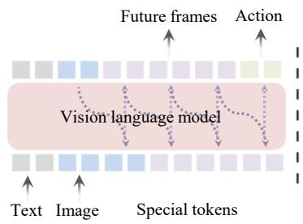  
(a) VLA-based WAM

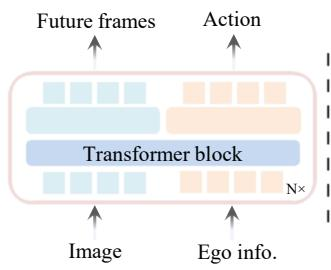  
(b) Video gen.-based WAM

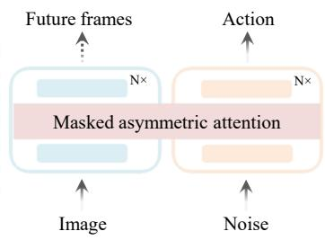  
(c) Metis (ours)  
Figure 1: Different WAM paradigms. (a) VLA-based WAMs rely on autoregressive token-based future prediction for action planning. (b) Video generation-based WAMs use tightly coupled architectures to jointly predict future video and actions. (c) Our Metis decouples video generation from action inference via an masked asymmetric attention, enabling efficient planning without video generation.

In this paper, motivated by the observation that embodied navigation ultimately requires producing actions in the physical world, while reasoning and anticipation serve as auxiliary mechanisms to support decision-making, we propose Metis, an end-to-end framework for AD and UN. Our method seamlessly combine action generation and future observations prediction within a WAM framework, as shown in Figure 1 (c). Unlike previous methods that jointly model future observations prediction and action generation within a single model, which tightly couples the action prediction and future video generation, such frameworks may inadvertently introduce generative noise into the action space during inference, potentially compromising the precision of action predictions. In contrast, our method decouples the action model from the video generation model, enabling robust action planning without generating future observations.

Specifically, Metis adopt the Mixture-of-Transformers (MoT) architecture to integrate a video generation expert and an action prediction expert, enabling the modeling of both high-level future scene dynamics and low-level trajectory planning within a shared latent space. This design helps preserve the intrinsic distributional properties of each expert, thereby improving model generalization. To enable robust and efficient inference, we further introduce an asymmetric attention mask design: future video tokens are allowed to attend to future action tokens, while the reverse direction is masked. This unidirectional information flow enables joint optimization of the video generation and action experts during training, while avoiding explicit future observation generation during inference, and ensuring consistency between training and inference. As a result, our method achieves efficient action planning compared to existing approaches that rely on explicit future prediction.

Our contributions are: (i) We propose Metis, an end-to-end World Action Model framework that decouples the action prediction model from the video generation model, enabling each component to maintain its own distributional structure and thereby improving generalization. (ii) We further introduce an asymmetric attention mask that enforces unidirectional visibility between video and action tokens. This design enables joint training of video and action models, while eliminating the need for explicit video generation during inference and maintaining consistency between training and inference. (iii) Metis achieves state-of-the-art performance on the NAVSIM (navhard and navtest) benchmarks for AD and the CityWalker benchmarks for UN. Comprehensive ablation studies confirm the effectiveness of our design, while zero-shot real-world deployments further demonstrate the superior generalization of our approach across diverse environments.

## 2 Related work

Video generation models. Recent general video generation models [50, 65, 5, 2] have advanced rapidly and are increasingly being integrated with downstream tasks such as autonomous driving and navigation. Some works [95, 23, 20, 70, 19, 18, 75, 66, 56] attempt to train autonomous driving video generation action models, primarily focusing on video generation while overlooking the planning objective. Some approaches [9, 92, 67, 77] leverage the generative capability of video generation models to improve autonomous driving planning. These methods typically employ diffusion transformer to jointly model and interact with visual and action information. Some endto-end approaches [40, 38, 72, 21, 80, 79, 32] further incorporate implicit world modeling and reinforcement learning to improve trajectory prediction, modeling scene evolution either in structured representations [40, 88] or latent space [38, 96, 81]. several navigation methods [28, 57, 59, 29] learn policies from expert trajectories, but do not explicitly model future scene evolution. However, these methods tightly couple generation and action prediction, which limits generalization.

Vision-language-action models. Many VLA-based methods [26, 78, 27, 17, 64, 60, 35, 99, 25, 69] leverage the pretrained knowledge of VLMs to achieve strong performance in autonomous driving. Some work [41, 100, 71, 93, 53] integrates reinforcement learning to enable safe driving via fast–slow reasoning. Furthermore, some methods [94, 34, 52, 87, 42, 48, 101] extend vision-language models by incorporating structured prediction of future information. For instance, FSDrive [87] and PWM [94] enable future image prediction in large models, while SGDrive [34] and DrivePI [51] enable occupancy prediction, thereby significantly improving planning quality. In addition, VLA have also been widely explored in outdoor navigation tasks [91, 90, 74, 73, 22, 97, 98, 61, 33]. NavFoM [89] trains a foundation model for navigation and autonomous driving using large-scale data. Abot-N0 [12] unifies navigation tasks in a single training framework and achieves autonomous navigation in urban environments. In contrast, rather than tightly coupling language and action, our method decouples them and leverages a world model to enhance action modeling, enabling stronger generalization across embodiments and tasks.

Worl action models. Recent works [54, 31, 37, 55, 6, 30, 8] in embodied manipulation further leverage a general architecture to integrate multiple experts, including understanding, generation, and action, into a unified model. Building upon this paradigm, some approaches [86, 83, 45, 4, 84] instantiate WAM, which incorporate world modeling, e.g., predicting future visual states, to support downstream action prediction. Overall, VLA- and WAM-based paradigms have achieved strong performance in manipulation tasks with relatively static background. However, autonomous driving and navigation involve significantly more complex and dynamic world evolution. In such settings, the WAM paradigm is better suited than VLA to model environmental dynamics and provide richer information for action planning.

## 3 Method

## 3.1 Problem formulation and notation

In autonomous driving (AD) and urban navigation (UN), action planning are typically conditioned on the current visual observation ot and language instructions l. To enhance action planning robustness, previous WAMs methods [34, 92, 25, 94, 37] incorporate future visual observations and model them jointly with actions during training:

$$
p _ { \theta } \big ( a _ { t : t + H } , v _ { t + 1 : t + N } \mid o _ { t } , l \big ) ,\tag{1}
$$

where $\mathbf { a } _ { t : t + H }$ denotes an action chunk with horizon $H ,$ and $\mathbf { v } _ { t + 1 : t + N }$ represents predicted future observations with horizon N. At inference time, these methods either jointly generate actions and future observations via joint denoising,

$$
( a _ { t : t + H } , v _ { t + 1 : t + N } ) \sim p _ { \theta } ( \cdot \mid o _ { t } , l ) ,\tag{2}
$$

or adopt an inverse dynamics formulation that infers actions based on explicitly predicted future frames [94, 37]:

$$
v _ { t + 1 : t + N } \sim p _ { \theta } \big ( v _ { t + 1 : t + N } \mid o _ { t } , l \big ) , \quad a _ { t : t + H } \sim p _ { \theta } \big ( a _ { t : t + H } \mid o _ { t } , l , v _ { t + 1 : t + N } \big ) .\tag{3}
$$

However, both paradigms require high-dimensional sampling or recursive denoising of vt+1:t+N during inference, leading to prohibitive computational overhead and latency.

To address these efficiency bottlenecks, we adopt a decoupled inference paradigm inspired by [86], where future frames are used only as supervision during training, while inference relies solely on the current observation. Formally, let $z ( o _ { t } , l )$ denote the latent representation produced by the video

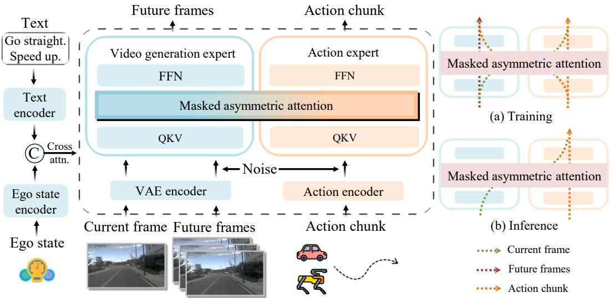  
Figure 2: Overview of our Metis. Video and action are jointly learned during training, while inference directly predicts actions from current observation.

backbone conditioned on the current observation and context. The action prediction is then modeled as:

$$
a _ { t : t + H } \sim p _ { \theta } ( a _ { t : t + H } \mid z ( o _ { t } , l ) ) .\tag{4}
$$

In this formulation, future observations are only used during training, while $z ( o _ { t } , l )$ is obtained from a single forward pass of the backbone at inference time, enabling efficient real-time planning.

## 3.2 Network architecture

To avoid interference between heterogeneous task distributions, we adopt a Mixture-of-Transformers (MoT) architecture to decouple video generation and action planning into two specialized experts,as shown in Figure 2. The video generation expert (VGE) inherits the physical priors from a large-scale video model to capture spatiotemporal dynamics, while the action expert (AE) is tailored for lowdimensional trajectory prediction. Despite this decoupling, both experts interact through a shared latent space, enabling information exchange while preserving their respective distributional structures.

We adopt Wan2.2-5B [65] as the backbone of the VGE. We reuse its pre-trained components, including a video VAE for visual encoding and a T5-based text encoder for language conditioning. To enable efficient trajectory prediction, our AE is implemented as a diffusion transformer that mirrors the layer depth of the VGE while adopting a smaller model size. In addition, to improve action policy learning, we follow prior work and introduce an agent state encoder to encode the ego state, which is combined with language instructions to condition the model. More details are provided in the Appendix.

Specifically, we organize the model inputs into three types of tokens: latent tokens of the current observation, noisy tokens of future observations, and noisy action tokens for trajectory prediction. All tokens first attend to the language embeddings through cross-attention. They are then projected into a shared latent space via expert-specific projections, where interactions are regulated by a structured attention mechanism. Finally, each expert applies its own feed-forward layers and output heads for task-specific prediction. This token-level interaction enables controlled information exchange without directly mixing representations across heterogeneous task spaces, thereby preserving the distributional structure within each expert and improving generalization.

## 3.3 Structured attention mechanisms.

Low-latency action planning is a fundamental requirement for both autonomous driving and urban navigation; however, existing WAMs [94, 35, 48, 92] often suffer from heavy inference costs, which severely limits their deployment for fast action prediction. To mitigate this latency, Some WAM approaches [39, 77] attempt to reduce the prediction horizon, downsample the resolution of future scene forecasting, or avoid explicit future video generation. While these strategies enhance inference speed, they inevitably lead to sub-optimal performance due to the lack of comprehensive spatiotemporal modeling of future states.

To break this efficiency-accuracy trade-off, we propose a novel asymmetric attention mask within our MoT framework. Unlike previous methods [92, 77], our approach manages the interaction between two experts at the representation level by introducing an asymmetric attention mask that explicitly govern the information flow between action tokens $a _ { t }$ and latent video tokens $z _ { t } .$ , as illustrated in Figure 3. Specifically, our design enforces a unilateral visibility constraint: action tokens are restricted to attend only to the current visual observation tokens, ensuring that planning is grounded in the present context.

In contrast, future video tokens are allowed to attend to both the current observation and all future action tokens. As shown in Figure 2 (b), this structured interaction allows the VGE to predict physically plausible world evolutions conditioned on the specific trajectory intended by the agent. Simultaneously, by sharing the representation space during the joint optimization process, the VGE’s predictive capacity implicitly participates in the action refinement process. This synergy ensures that the AE produces robust trajectories informed by environmental dynamics, while allowing the explicit video generation branch to be completely bypassed during inference to achieve real-time efficiency.

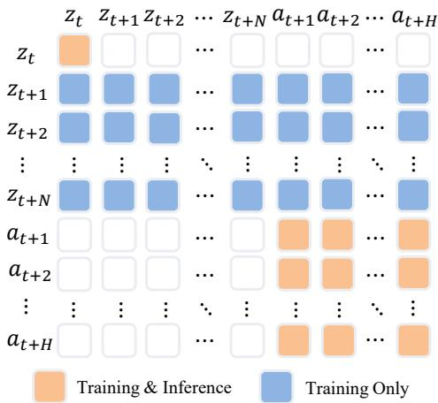

## 3.4 Training Objective

We jointly optimize action prediction and future video generation under a flow matching framework. Given current observation $o _ { t }$ and instruction l, we learn conditional flow models over both action tokens and future video tokens. For action tokens, we supervise the prediction

Figure 3: Asymmetric attention mask: both action and video tokens attend to the current timestep; video tokens can attend to action tokens, but not vice versa.

of the velocity field conditioned on the current context:

$$
\mathcal { L } _ { \mathrm { a c t } } = \mathbb { E } _ { a _ { t } , \epsilon , t , s } \left[ \| u _ { \theta } ( a _ { t : t + H } ^ { ( s ) } , s \mid o _ { t } , l ) - \dot { a } _ { t : t + H } ^ { ( s ) } \| ^ { 2 } \right] ,\tag{5}
$$

where $s \in \ [ 0 , 1 ]$ is the flow time, $a _ { t : t + H } ^ { ( s ) } = ( 1 - s ) \epsilon + s a _ { t : t + H }$ , with $\epsilon \sim \mathcal { N } ( 0 , I )$ , and the corresponding velocity field is given by $\dot { a } _ { t : t + H } = a _ { t : t + H } - \epsilon \ /$ . For future video tokens, we supervise the prediction of velocity of field conditioned on the current context and action tokens:

$$
\mathcal { L } _ { \mathrm { v i d e o } } = \mathbb { E } \left[ \| u _ { \phi } ( z _ { t + 1 : t + H } ^ { ( s ) } , s \mid o _ { t } , \hat { a } _ { t : t + H } , l ) - \dot { z } _ { t + 1 : t + H } ^ { ( s ) } \| ^ { 2 } \right] ,\tag{6}
$$

where $\hat { a } _ { t : t + H }$ denotes the predicted future action sequence, $z _ { t + 1 : t + H } ^ { ( s ) } = ( 1 - s ) \epsilon + s z _ { t + 1 : t + H }$ . The overall training objective is: $\mathcal { L } = \mathcal { L } _ { \mathrm { a c t i o n } } + \lambda \mathcal { L } _ { \mathrm { v i d e o } }$ where $\lambda = 1$ is a weighting coefficient that balances action learning and world modeling.

## 4 Experiments

Implementation details. We adopt Wan2.2-5B as the VGE and the AE shares the same architecture with a reduced hidden dimension $( d _ { a } = 1 0 2 4 )$ , resulting in a 1B-parameter branch and an overall model size of 6B. For task setup, we use an action horizon of 8 for NAVSIMv2 (4 seconds with 0.5- second intervals), where each waypoint is represented as $( x , y , \theta )$ , and a horizon of 5 for CityWalker with $( x , y )$ . We use only the front-facing camera as input, and align video and action chunks with a 1:1 temporal ratio. Both VGE and AE are trained under the same flow matching formulation. For NAVSIMv2, we use an input resolution of $6 4 0 \times 7 6 8$ and train for 60 epochs with a batch size of 64;

Table 1: Performance on the NAVSIM-v2 navhard Leaderboard. PDM-Closed uses groundtruth symbolic inputs for planning. † indicates values are copied from [63] and \* indicates values are copied from [47]; all other results are reproduced with the official code repository or official checkpoints. (S.: per-stage EPDM score.)
<table><tr><td>Method</td><td>|Reference</td><td>|Stage </td><td>|NC↑</td><td>DAC↑</td><td>DDC↑</td><td>TLC ↑|EP↑ TTC ↑ LK ↑</td><td></td><td></td><td></td><td>HC↑</td><td></td><td></td><td>EC ↑| S. ↑ | EPDMS ↑</td></tr><tr><td rowspan="2">PDM-Closed [14]</td><td rowspan="2"></td><td rowspan="2">S1 S2</td><td>94.4</td><td>78.8</td><td>100</td><td>99.5</td><td>100</td><td>93.5</td><td>99.3</td><td>87.7</td><td>36.0</td><td>=</td><td rowspan="2">51.3</td></tr><tr><td>88.1</td><td>90.6</td><td>96.3</td><td>98.5</td><td>100</td><td>83.1</td><td>73.7</td><td>91.5 25.4</td><td>-</td><td></td></tr><tr><td colspan="10">Traditional E2E-based Planner</td><td></td><td></td><td></td><td></td><td></td></tr><tr><td>LTF† [11]</td><td>T-PAMI2022</td><td>S1 S2</td><td>97.3 79.4</td><td>80.2 69.0</td><td>97.8 85.6</td><td>99.3 98.5</td><td>83.4 83.8</td><td>96.2 76.7</td><td>92.9 47.9</td><td>97.8 97.0</td><td>71.1 70.6</td><td>61.3 39.2</td><td>24.4</td></tr><tr><td>DiffusionDrive† [44]</td><td>CVPR2025</td><td>S1 S2</td><td>96.8 80.1</td><td>86.0 72.8</td><td>98.8 84.4</td><td>99.3 98.4</td><td>84.0 85.9</td><td>95.8 76.6</td><td>96.7</td><td>97.6</td><td>79.6</td><td>|66.7</td><td>27.5</td></tr><tr><td>GTRS-DP* [43]</td><td>CVPRW2025</td><td>S1 S2</td><td>94.7</td><td>78.8</td><td>96.1</td><td>99.5</td><td>83.0</td><td>94.4</td><td>46.4 92.0</td><td>96.3 97.5</td><td>72.8 72.8</td><td>40.5 -</td><td>23.8</td></tr><tr><td>GuideFlow* [47]</td><td></td><td>S1</td><td>80.3 96.6</td><td>74.4 80.5</td><td>84.9 96.3</td><td>98.0 99.3</td><td>81.9 82.3</td><td>78.8 94.9</td><td>45.4 91.5</td><td>96.7 97.7</td><td>70.1 67.8</td><td>-</td><td></td></tr><tr><td></td><td>CVPR2026</td><td>S2</td><td>87.3</td><td>76.7</td><td>88.8</td><td>99.2</td><td>84.3</td><td>85.1</td><td>49.7</td><td>93.1</td><td>44.5</td><td>=</td><td>27.1</td></tr><tr><td colspan="10">VLA-based Planner</td><td></td><td>67.7</td><td></td><td></td></tr><tr><td>ReCogDrive [41]</td><td>ICLR2026</td><td>S1 S2</td><td>96.4 80.2</td><td>78.9 65.0</td><td>98.7 82.4</td><td>99.8 98.7</td><td>82.6 85.2</td><td>95.6 76.9</td><td>94.4 43.8</td><td>97.6 96.6</td><td>74.2 71.8</td><td>37.6</td><td>25.7</td></tr><tr><td>SGDrive [34]</td><td></td><td>S1</td><td>95.8</td><td>87.6</td><td>97.8</td><td>99.8</td><td>84.4</td><td>94.7</td><td>92.9</td><td>97.8</td><td>28.9</td><td>71.1</td><td></td></tr><tr><td></td><td>CVPR2026</td><td>S2</td><td>79.4</td><td>65.4</td><td>79.1</td><td>98.9</td><td>88.9</td><td>75.3</td><td>42.7</td><td>96.4</td><td>29.6</td><td>35.2</td><td>25.5</td></tr><tr><td colspan="10">WAM-based Planner</td><td></td><td></td><td></td><td></td></tr><tr><td>Metis (Ours)</td><td></td><td>S1</td><td>96.6</td><td>87.8</td><td>99.0</td><td>99.3</td><td>84.5</td><td>95.6</td><td>97.8</td><td>97.8</td><td>77.8</td><td>75.8</td><td>32.2</td></tr><tr><td></td><td></td><td>S2</td><td>79.6</td><td>73.3</td><td>84.9</td><td>97.8</td><td>85.8</td><td>76.6</td><td>47.7</td><td>95.4</td><td>75.3</td><td>41.7</td><td></td></tr></table>

for CityWalker, we use 384 × 384 and train for 30 epochs with the same batch size. During inference, we use 10 denoising steps with classifier-free guidance (CFG = 1.0). All experiments are conducted on 8 NVIDIA H200 GPUs.

We evaluate our method on two real-world datasets covering autonomous driving and urban navigation scenarios, namely NAVSIM-v2 and CityWalk. Detailed dataset descriptions and evaluation metrics are provided in the Appendix.

NAVSIM-v2. We train our model on the navtrain subset (1,192 scenarios) and evaluate performance on two benchmarks: navhard and navtest [7]. navhard comprises 244 safety-critical real-world scenarios (Stage 1) and 4,164 3DGS-generated synthetic counterparts (Stage 2) for closed-loop evaluation. navtest includes 12,146 scenarios for assessing generalization. The two benchmarks share a rule-based planning metric, EPDMS, which evaluates performance using multiple submetrics, including No-at-fault Collisions (NC), Drivable Area Compliance (DAC), Driving Direction Compliance (DDC), Traffic Light Compliance (TLC), Time-to-Collision (TTC), Ego Progress (EP), Lane Keeping (LK), History Comfort (HC), and Extended Comfort (EC). We also provide results on NAVSIM-v1 navtest with PDMS in the Appendix.

CityWalker. The dataset [49] contains 15 hours of teleoperation data collected across diverse urban areas in New York City, with 6 hours used for fine-tuning and 9 hours for testing. We evaluate performance under several challenging scenarios, including turning, intersection crossing, detours, proximity to pedestrians, and crowded environments. We utilize Maximum Average Orientation Error (MAOE) as the primary metric to assess human-like trajectory alignment, supplemented by the average L2 distance for spatial accuracy.

Real-world experiments We deploy our model and the baseline methods on the same Unitree Go2 quadruped for real-world navigation. We adapt the PD controller provided in [73] to provide velocity command to the quadruped. We conduct zero-shot real-world experiments in both indoor and outdoor environments, demonstrating the strong generalization ability of our Metis. Detailed qualitative results are provided in the appendix, and additional videos are included in the supplementary material.

## 4.1 Main results

Navhard Leaderboard. We first evaluate our method in safety-critical closed-loop scenarios. As shown in Table 1, our method achieves the best performance in both Stage 1 and Stage 2, consistently outperforming prior approaches. Overall, it attains an EPDMS score of 32.2, demonstrating the effectiveness of the WAM paradigm in producing smooth and comfortable driving behaviors. Notably, compared to VLA-based methods [41, 34], our approach achieves consistent improvements on DAC and DDC across both stages, which measure rule compliance and trajectory feasibility. In particular, it surpasses prior methods on Stage 2 by at least 7.9 on DAC and 2.5 on DDC. This indicates that, in the absence of explicit map supervision, world modeling provides a stronger inductive bias for learning environment-constrained driving behaviors. In contrast, VLA-based methods, which rely on scene understanding and high-level reasoning, are less effective at enforcing such constraints during action generation.

Table 2: Performance comparison on NAVSIM-v2 navtest Leaderboard. \* indicates training with reinforcement learning; † indicates training on the full navtrain split; ‡ indicates the use of the best-of-N (N = 6) strategy following [100].
<table><tr><td>Method</td><td>Sensors</td><td>NC↑</td><td>DAC↑</td><td>DDC↑</td><td>TLC↑</td><td>EP↑</td><td>TTC↑</td><td>LK↑</td><td>HC↑</td><td>EC↑</td><td>EPDMS↑</td></tr><tr><td>Human Agent</td><td></td><td>100</td><td>100</td><td>99.8</td><td>100</td><td>87.4</td><td>100</td><td>100</td><td>98.1</td><td>90.1</td><td>90.3</td></tr><tr><td colspan="10">Traditional E2E-based Planner</td></tr><tr><td>TransFuser [11] 3xC+L</td><td></td><td>96.9</td><td>89.9 97.8</td><td></td><td>99.7</td><td>87.1</td><td>95.4</td><td>92.7</td><td>98.3</td><td>87.2</td><td>76.7</td></tr><tr><td>Hydra-MDP++ [36]</td><td>3xC+L</td><td>97.2</td><td>97.5</td><td>99.4</td><td>99.6</td><td>83.1</td><td>96.5</td><td>94.4</td><td>98.2</td><td>70.9</td><td>81.4</td></tr><tr><td>GTRS-Dense [43]</td><td>3xC 3xC</td><td>97.6</td><td>97.5</td><td>99.0</td><td>99.9</td><td>87.9</td><td>97.0</td><td>95.9</td><td>97.5</td><td>55.9</td><td>82.3</td></tr><tr><td>DriveSuprim [82]</td><td>3xC+L</td><td>97.5</td><td>96.5</td><td>99.4</td><td>99.6</td><td>88.4 81.5</td><td>96.6 97.4</td><td>95.5</td><td>98.3</td><td>77.0</td><td>83.1</td></tr><tr><td>ARTEMIS [16]</td><td>3xC+L</td><td>98.3</td><td>95.1</td><td>98.6</td><td>99.8</td><td></td><td></td><td>96.5</td><td>98.3</td><td></td><td>83.1</td></tr><tr><td>DiffusionDrive [44]</td><td>3xC</td><td>98.2</td><td>95.9</td><td>99.4</td><td>99.8</td><td>87.5</td><td>97.3</td><td>96.8</td><td>98.3</td><td>87.7</td><td>84.5</td></tr><tr><td>World4Drive [96]</td><td>1xC</td><td>97.8 98.8</td><td>96.3</td><td>99.4</td><td>99.8</td><td>88.3</td><td>97.1</td><td>97.7</td><td>98.0</td><td>53.9</td><td>84.8</td></tr><tr><td>Drive-JEPA [68]</td><td>3xC</td><td>97.8</td><td>97.4</td><td>99.0</td><td>99.8</td><td>83.5</td><td>98.0</td><td>96.2</td><td>98.1</td><td>85.6</td><td>85.4</td></tr><tr><td>WorldRFT* [81]</td><td></td><td></td><td>96.5</td><td>99.5</td><td>99.8 VLA-based Planner</td><td>88.5</td><td>97.0</td><td>97.4</td><td>98.1</td><td>69.1</td><td>86.7</td></tr><tr><td colspan="10"></td></tr><tr><td>ReCogDrive* [41]</td><td>1xC</td><td>98.3</td><td>95.2</td><td>99.5</td><td>99.8</td><td>87.1</td><td>97.5</td><td>96.6</td><td>98.3</td><td>86.5</td><td>83.6</td></tr><tr><td>SGDrive [34]</td><td>1xC</td><td>98.6</td><td>94.3</td><td>99.5</td><td>99.9</td><td>86.0</td><td>97.9</td><td>96.1</td><td>98.3</td><td>85.9</td><td>86.2</td></tr><tr><td>Vega [101]</td><td>1xC</td><td>98.9</td><td>95.3</td><td>99.4</td><td>99.9</td><td>87.0</td><td>98.4</td><td>96.1</td><td>98.3</td><td>76.3</td><td>86.9</td></tr><tr><td>DriveFine* [13]</td><td>1xC</td><td>98.7</td><td>97.3</td><td>98.8</td><td>99.8</td><td>88.2</td><td>97.8</td><td>97.7</td><td>98.4</td><td>84.7</td><td>87.1</td></tr><tr><td colspan="10"></td></tr><tr><td>Epona [92]</td><td>1xC</td><td>97.1</td><td>95.7</td><td>WAM-based Planner</td><td>99.7</td><td>88.6</td><td>96.3</td><td>97.0</td><td></td><td></td><td></td></tr><tr><td>DriveVLA-W0 † [39]</td><td>1xC</td><td>98.5</td><td>99.1</td><td>99.3 98.0</td><td>99.7</td><td>86.4</td><td>98.1</td><td>93.2</td><td>98.0</td><td>67.8</td><td>85.1</td></tr><tr><td></td><td></td><td></td><td></td><td></td><td>99.8</td><td>87.8</td><td>97.7</td><td></td><td>97.9</td><td>58.9</td><td>86.1</td></tr><tr><td>Metis (Ours) Metis ‡ (Ours)</td><td>1xC 1xC</td><td>98.4 98.5</td><td>97.2 97.5</td><td>99.6 99.6</td><td>99.8</td><td>87.9</td><td>97.8</td><td>97.8 98.0</td><td>98.4 98.4</td><td>88.0 90.0</td><td>89.5 90.3</td></tr></table>

Table 3: Performance comparison on CityWalker dataset. Percentages indicate the proportion of data in each scenario. “Mean” denotes the average performance across the six scenarios, while “All” represents the average over all samples. The best results are highlighted in bold. \* indicates a pretrained method using large-scale navigation data.
<table><tr><td>Method</td><td>Metric</td><td>Mean</td><td>Turn 8%</td><td>Crossing 12%</td><td>Detour 12%</td><td>Proximity 6%</td><td>Crowd 7%</td><td>Other 55%</td><td>All 100%</td></tr><tr><td colspan="10">Pretrained method</td></tr><tr><td>ABot-N0* [12]</td><td>↓ L2 (m) ↓ MAOE (°)</td><td>11.2</td><td>21.3</td><td>9.8</td><td>12.8</td><td>8.1</td><td>8.8</td><td>6.3</td><td>7.6</td></tr><tr><td colspan="10">Fine-tuned method</td></tr><tr><td>GNM [58]</td><td>↓L2 (m)</td><td>1.22</td><td>2.36</td><td>1.36</td><td>1.42</td><td>0.88</td><td>0.76</td><td>0.55</td><td>0.74</td></tr><tr><td></td><td>↓MAOE (°) ↓L2 (m)</td><td>16.2 1.30</td><td>31.1 1.91</td><td>14.8 1.13</td><td>12.5 1.14</td><td>14.7 0.77</td><td>12.8 0.66</td><td>11.0 0.57</td><td>12.1 0.70</td></tr><tr><td>ViNT [59]</td><td>↓ MAOE (°) ↓L2 (m)</td><td>16.5 1.39</td><td>31.1 2.49</td><td>15.4 1.56</td><td>12.9 1.55</td><td>14.8 1.06</td><td>13.3 0.95</td><td>11.6 0.76</td><td>12.6 0.74</td></tr><tr><td>NoMaD [62]</td><td>↓MAOE (°) ↓L2 (m)</td><td>19.1 1.11</td><td>35.1 1.27</td><td>18.5 1.00</td><td>15.6 1.15</td><td>18.1 1.06</td><td>14.3 1.12</td><td>12.8 1.06</td><td>12.1 1.07</td></tr><tr><td>CityWalker [49]</td><td>↓MAOE (°) ↓ L2 (m)</td><td>15.2</td><td>26.6</td><td>14.1</td><td>13.9</td><td>14.3</td><td>12.0</td><td>10.4</td><td>11.5</td></tr><tr><td>Metis (Ours)</td><td>↓ MAOÉ (°)</td><td>0.71 11.8</td><td>0.69 19.5</td><td>0.77 11.9</td><td>0.66 9.1</td><td>0.76 11.4</td><td>0.77 8.0</td><td>0.63 7.8</td><td>0.64 9.8</td></tr></table>

Navtest Leaderboard. On the more diverse navtest benchmark,as shown in Table 2, Metis achieves the state-of-the-art EPDMS score under a fair comparison setting, notably without relying on multistage training, reinforcement learning, or auxiliary datasets. It surpasses prior VLA-based methods by at least 2.4 points, maintaining competitive or superior performance across all metrics. This consistent advantage underscores the efficacy of integrating world modeling into action planning. Specifically, compared to methods that predict future states at fixed timestamps [101, 34], Metis shows significant gains in EP, LK, and EC. This demonstrates that by internalizing physically grounded dynamics during training, the action expert generates more rule-compliant and comfortable behaviors.

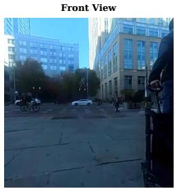

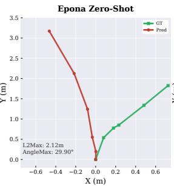

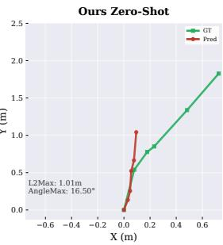

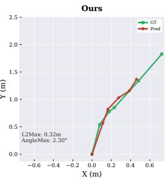  
Figure 4: Qualitative results on CityWalker. We present the zero-shot results of Epona and our method (Metis), as well as the fine-tuned results of our method.

Table 4: Ablation of image size and attention mask.
<table><tr><td rowspan="2">Image Size</td><td rowspan="2"> variant</td><td colspan="3">navtest ↑</td><td rowspan="2">navhard ↑ EPDMS</td></tr><tr><td>DAC</td><td>LK</td><td>EPDMS</td></tr><tr><td rowspan="4">320×384 640×768</td><td>Joint</td><td>96.5</td><td>97.0</td><td>87.4</td><td>28.0</td></tr><tr><td>Isolated</td><td>96.5</td><td>97.5</td><td>88.3</td><td>29.4</td></tr><tr><td>Ours</td><td>97.0</td><td>97.6</td><td>88.8</td><td>31.6</td></tr><tr><td>Ours</td><td>97.5</td><td>98.0</td><td>89.5</td><td>32.2</td></tr></table>

Table 5: Ablation of denoising steps.
<table><tr><td rowspan="2">Steps</td><td rowspan="2">navtest EPDMS</td><td colspan="3">navhard</td></tr><tr><td>S1</td><td>S2</td><td>EPDMS</td></tr><tr><td rowspan="3">1 2 5</td><td>87.2</td><td>74.5</td><td>39.8</td><td>30.4</td></tr><tr><td>89.2</td><td>76.0</td><td>40.7</td><td>31.2</td></tr><tr><td>89.4</td><td>74.5</td><td>41.4</td><td>31.4</td></tr><tr><td>10</td><td>89.5</td><td>75.8</td><td>41.7</td><td>32.2</td></tr></table>

Notably, even without RL-based fine-tuning, our approach maintains a clear advantage in EC over models [41, 13] specifically optimized for such metrics, further proving the robustness of our WAMbased representation.

CityWalker dataset. Compared to fine-tuning-based methods,as shown in Table 3, Metisachieves leading performance in both L2 error and MAOE, validating the superiority of the WAM paradigm. When compared with ABot-N0 [12] pretrained on large-scale datasets, our approach exhibits lower MAOE in complex scenarios such as Turn Detour and Crowd navigation. This demonstrates that integrating latent world dynamics with action planning provides more effective guidance than relying on logical reasoning within the linguistic space. In dense urban environments, the ability to model spatiotemporal evolution allows the AE to predict more plausible, collision-free trajectories, overcoming the limitations of language representations in providing fine-grained motion guidance.

## 4.2 Ablation studies

Ablation of asymmetric attention mask. To evaluate the effect of the proposed asymmetric attention mask, we construct two variants. The first is joint attention, which is commonly adopted in VLAbased and video-generation-based WAMs, where future video and action tokens are fully coupled. The second is isolated attention, where the two experts are completely decoupled and future video and action tokens are mutually invisible. As shown in Table 4, under the same input resolution, all variants achieve competitive performance. Our asymmetric attention mask consistently yields the best results, with more pronounced improvements on challenging scenarios. Compared to joint attention, the significant performance gain highlights the importance of decoupling future video generation from action prediction, as it helps preserve the stability of the action space. In contrast, compared to isolated attention, our method enables the action expert to implicitly capture future dynamics during training, leading to improved planning performance, particularly in complex scenarios. More detailed analyses are provided in the appendix A.

Image size. We study the impact of input image resolution on our method, as shown in Table 4. Reducing the resolution leads to consistent performance degradation on both navtest and navhard. In particular, the EPDMS score drops by 0.7 and 0.6 points on navtest and navhard, respectively. We also observe noticeable declines in DAC and LK, showing that higher resolution inputs provide richer spatial and geometric cues, which facilitate the action expert in capturing scene dynamics and producing more feasible and stable trajectories.

Denoising steps. We analyze the impact of different numbers of denoising steps on performance. As shown in Table 12, increasing the number of steps consistently improves performance on both navtest and navhard. While the performance gain is relatively modest in general scenarios, it becomes more pronounced on challenging benchmarks, indicating that additional denoising steps help refine predictions under complex dynamics.

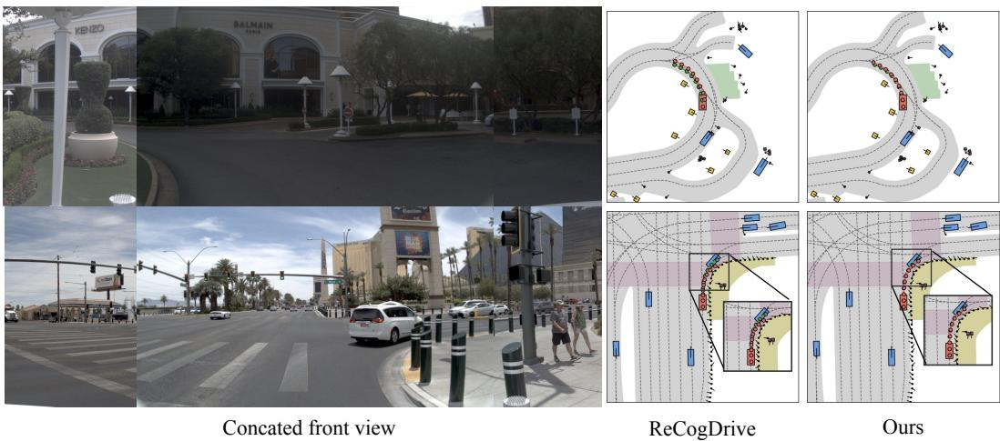  
Figure 5: Qualitative evaluation of turning scenarios on NAVSIM.

Table 6: Ablation of different VGE and AE.
<table><tr><td rowspan="2">VGE</td><td rowspan="2">AE</td><td colspan="2">navtest ↑</td><td rowspan="2">navhard ↑ EPDMS</td></tr><tr><td>PDMS</td><td>EPDMS</td></tr><tr><td>Wan2.1-1.3B</td><td>~0.24B</td><td>88.5</td><td>88.8</td><td>28.8</td></tr><tr><td>Wan2.2-14B</td><td>~0.21B</td><td>88.2</td><td>88.2</td><td>31.2</td></tr><tr><td>Wan2.2-14B</td><td>~1.04B</td><td>89.1</td><td>89.5</td><td>32.2</td></tr></table>

Table 7: Inference latency with other methods.
<table><tr><td>Method</td><td>PDMS</td><td>EPDMS</td><td>latency(s)</td></tr><tr><td>Epona [92]</td><td>86.2</td><td>85.1</td><td>0.32</td></tr><tr><td>PWM [94]</td><td>87.3</td><td></td><td>0.57</td></tr><tr><td>PWM (w/ video) [94]</td><td>88.1</td><td></td><td>0.83</td></tr><tr><td>Metis (w/ video) (ours)</td><td>89.0</td><td>89.5</td><td>1.38</td></tr><tr><td>Metis (ours)</td><td>88.9</td><td>89.2</td><td>0.17</td></tr></table>

Ablation of different VGE and AE. The impact of different VGE backbones is investigated at a 640×768 resolution, as shown in Table 6. Results indicate that although the Wan2.1-1.3B [65] variant achieves comparable performance on navtest, its deficiency in navhard reveals the limitations of lower-capacity generative priors in complex scenarios. We hypothesize that a more powerful VGE serves as a more robust world model, implicitly bolstering the AE’s reasoning via shared latent representations. Simultaneously, increasing the AE size under a fixed VGE further improves generalization across all benchmarks, underscoring the benefits of scaling the policy head alongside the generative backbone.

Inference latency of different methods. We compare the inference latency of our Metis with several representative approaches, as shown in Table 7. Epona and PWM represent WAM methods based on video generation models and large vision-language models, respectively. All methods are evaluated on a single NVIDIA RTX 4090 GPU. The configurations are determined by practical requirements. The video generation setting uses 10 denoising steps to ensure high-quality future prediction, while the action only setting uses only 2 denoising steps for efficient action inference while maintaining accuracy. We also report PDMS and EPDMS on navtest (full results are provided in the Appendix). Compared to the variant that generates future video, our action-only inference achieves up to 8× speedup, demonstrating the efficiency of our approach.

## 4.3 Qualitative Analysis

We provide qualitative results on both UN and AD tasks. For the UN task, as shown in Figure 4, our method demonstrates stronger generalization compared to Epona, achieving better zero-shot performance. After fine-tuning, it produces more accurate and stable navigation trajectories. For the AD task, compared with the previous state-of-the-art method ReCogDrive [41], our approach exhibits more reasonable and smoother behaviors, particularly in turning scenarios, as shown in Figure 5. The predicted trajectories better align with the underlying scene geometry and driving constraints. These results validate that our method effectively improves trajectory planning by enabling the action expert to implicitly capture scene dynamics during training.

## 5 Conclusion

In this paper, we propose Metis, an end-to-end WAM framework for AD and UN built upon a Mixture-of-Transformers architecture. Distinct from prior WAMs, Metis introduces an asymmetric attention mask mechanism that enables a unique "joint training, decoupled inference" paradigm. While we jointly optimize future video generation and action prediction during training to capture world dynamics, our design allows for efficient action planning without the need for explicit future observation synthesis during inference. By decoupling the low-dimensional action space from highdimensional visual generation, we preserve the distributional integrity and stability of the action model, significantly enhancing both generalization and inference efficiency. Extensive evaluations on autonomous driving and urban navigation benchmarks demonstrate that our approach achieves state-of-the-art performance, validating the effectiveness of our decoupled WAM design.

## References

[1] Josh Achiam, Steven Adler, Sandhini Agarwal, Lama Ahmad, Ilge Akkaya, Florencia Leoni Aleman, Diogo Almeida, Janko Altenschmidt, Sam Altman, Shyamal Anadkat, et al. Gpt-4 technical report. arXiv preprint arXiv:2303.08774, 2023.

[2] Arslan Ali, Junjie Bai, Maciej Bala, Yogesh Balaji, Aaron Blakeman, Tiffany Cai, Jiaxin Cao, Tianshi Cao, Elizabeth Cha, Yu-Wei Chao, et al. World simulation with video foundation models for physical ai. arXiv preprint arXiv:2511.00062, 2025.

[3] Shuai Bai, Keqin Chen, Xuejing Liu, Jialin Wang, Wenbin Ge, Sibo Song, Kai Dang, Peng Wang, Shijie Wang, Jun Tang, Humen Zhong, Yuanzhi Zhu, Mingkun Yang, Zhaohai Li, Jianqiang Wan, Pengfei Wang, Wei Ding, Zheren Fu, Yiheng Xu, Jiabo Ye, Xi Zhang, Tianbao Xie, Zesen Cheng, Hang Zhang, Zhibo Yang, Haiyang Xu, and Junyang Lin. Qwen2.5-vl technical report, 2025.

[4] Hongzhe Bi, Hengkai Tan, Shenghao Xie, Zeyuan Wang, Shuhe Huang, Haitian Liu, Ruowen Zhao, Yao Feng, Chendong Xiang, Yinze Rong, et al. Motus: A unified latent action world model. arXiv preprint arXiv:2512.13030, 2025.

[5] Jake Bruce, Michael D Dennis, Ashley Edwards, Jack Parker-Holder, Yuge Shi, Edward Hughes, Matthew Lai, Aditi Mavalankar, Richie Steigerwald, Chris Apps, et al. Genie: Generative interactive environments. In ICML, 2024.

[6] Junhao Cai, Zetao Cai, Jiafei Cao, Yilun Chen, Zeyu He, Lei Jiang, Hang Li, Hengjie Li, Yang Li, Yufei Liu, et al. Internvla-a1: Unifying understanding, generation and action for robotic manipulation. arXiv preprint arXiv:2601.02456, 2026.

[7] Wei Cao, Marcel Hallgarten, Tianyu Li, Daniel Dauner, Xunjiang Gu, Caojun Wang, Yakov Miron, Marco Aiello, Hongyang Li, Igor Gilitschenski, Boris Ivanovic, Marco Pavone, Andreas Geiger, and Kashyap Chitta. Pseudo-simulation for autonomous driving. In CoRL, 2025.

[8] Jun Cen, Chaohui Yu, Hangjie Yuan, Yuming Jiang, Siteng Huang, Jiayan Guo, Xin Li, Yibing Song, Hao Luo, Fan Wang, et al. Worldvla: Towards autoregressive action world model. arXiv preprint arXiv:2506.21539, 2025.

[9] Yuntao Chen, Yuqi Wang, and Zhaoxiang Zhang. Drivinggpt: Unifying driving world modeling and planning with multi-modal autoregressive transformers. arXiv preprint, 2024.

[10] Zhe Chen, Jiannan Wu, Wenhai Wang, Weijie Su, Guo Chen, Sen Xing, Muyan Zhong, Qinglong Zhang, Xizhou Zhu, Lewei Lu, et al. Internvl: Scaling up vision foundation models and aligning for generic visual-linguistic tasks. In CVPR, 2024.

[11] Kashyap Chitta, Aditya Prakash, Bernhard Jaeger, Zehao Yu, Katrin Renz, and Andreas Geiger. Transfuser: Imitation with transformer-based sensor fusion for autonomous driving. IEEE TPAMI, 2022.

[12] Zedong Chu, Shichao Xie, Xiaolong Wu, Yanfen Shen, Minghua Luo, Zhengbo Wang, Fei Liu, Xiaoxu Leng, Junjun Hu, Mingyang Yin, et al. Abot-n0: Technical report on the vla foundation model for versatile embodied navigation. arXiv preprint arXiv:2602.11598, 2026.

[13] Chenxu Dang, Sining Ang, Yongkang Li, Haochen Tian, Jie Wang, Guang Li, Hangjun Ye, Jie Ma, Long Chen, and Yan Wang. Drivefine: Refining-augmented masked diffusion vla for precise and robust driving. arXiv preprint arXiv:2602.14577, 2026.

[14] Daniel Dauner, Marcel Hallgarten, Andreas Geiger, and Kashyap Chitta. Parting with misconceptions about learning-based vehicle motion planning. In CoRL, 2023.

[15] Daniel Dauner, Marcel Hallgarten, Tianyu Li, Xinshuo Weng, Zhiyu Huang, Zetong Yang, Hongyang Li, Igor Gilitschenski, Boris Ivanovic, Marco Pavone, Andreas Geiger, and Kashyap Chitta. Navsim: Data-driven non-reactive autonomous vehicle simulation and benchmarking. In Advances in Neural Information Processing Systems (NeurIPS), 2024.

[16] Renju Feng, Ning Xi, Duanfeng Chu, Rukang Wang, Zejian Deng, Anzheng Wang, Liping Lu, Jinxiang Wang, and Yanjun Huang. Artemis: Autoregressive end-to-end trajectory planning with mixture of experts for autonomous driving. IEEE RA-L, 2025.

[17] Haoyu Fu, Diankun Zhang, Zongchuang Zhao, Jianfeng Cui, Dingkang Liang, Chong Zhang, Dingyuan Zhang, Hongwei Xie, Bing Wang, and Xiang Bai. Orion: A holistic end-to-end autonomous driving framework by vision-language instructed action generation. In ICCV, 2025.

[18] Yongjie Fu, Yunlong Li, and Xuan Di. Gendds: Generating diverse driving video scenarios with prompt to-video generative model. In IEEE ITSC, 2024.

[19] Ruiyuan Gao, Kai Chen, Bo Xiao, Lanqing Hong, Zhenguo Li, and Qiang Xu. Magicdrive-v2: Highresolution long video generation for autonomous driving with adaptive control. In CVPR, 2025.

[20] Shenyuan Gao, Jiazhi Yang, Li Chen, Kashyap Chitta, Yihang Qiu, Andreas Geiger, Jun Zhang, and Hongyang Li. Vista: A generalizable driving world model with high fidelity and versatile controllability. In NeurIPS, 2024.

[21] Xingtai Gui, Meijie Zhang, Tianyi Yan, Wencheng Han, Jiahao Gong, Feiyang Tan, Cheng-zhong Xu, and Jianbing Shen. Bridging scene generation and planning: Driving with world model via unifying vision and motion representation. arXiv preprint arXiv:2603.14948, 2026.

[22] Noriaki Hirose, Catherine Glossop, Dhruv Shah, and Sergey Levine. Omnivla: An omni-modal visionlanguage-action model for robot navigation. In ICRA, 2026.

[23] Xiaotao Hu, Wei Yin, Mingkai Jia, Junyuan Deng, Xiaoyang Guo, Qian Zhang, Xiaoxiao Long, and Ping Tan. Drivingworld: Constructing world model for autonomous driving via video gpt. arXiv preprint arXiv:2412.19505, 2024.

[24] Yihan Hu, Jiazhi Yang, Li Chen, Keyu Li, Chonghao Sima, Xizhou Zhu, Siqi Chai, Senyao Du, Tianwei Lin, Wenhai Wang, et al. Planning-oriented autonomous driving. In CVPR, 2023.

[25] Wenhui Huang, Songyan Zhang, Qihang Huang, Zhidong Wang, Zhiqi Mao, Collister Chua, Zhan Chen, Long Chen, and Chen Lv. Automot: A unified vision-language-action model with asynchronous mixture-of-transformers for end-to-end autonomous driving. arXiv preprint arXiv:2603.14851, 2026.

[26] Jyh-Jing Hwang, Runsheng Xu, Hubert Lin, Wei-Chih Hung, Jingwei Ji, Kristy Choi, Di Huang, Tong He, Paul Covington, Benjamin Sapp, et al. Emma: End-to-end multimodal model for autonomous driving. arXiv preprint arXiv:2410.23262, 2024.

[27] Bo Jiang, Shaoyu Chen, Bencheng Liao, Xingyu Zhang, Wei Yin, Qian Zhang, Chang Huang, Wenyu Liu, and Xinggang Wang. Senna: Bridging large vision-language models and end-to-end autonomous driving. arXiv preprint arXiv:2410.22313, 2024.

[28] Gregory Kahn, Pieter Abbeel, and Sergey Levine. Badgr: An autonomous self-supervised learning-based navigation system. RAL, 2021.

[29] Gregory Kahn, Pieter Abbeel, and Sergey Levine. Land: Learning to navigate from disengagements. RAL, 2021.

[30] Moo Jin Kim, Chelsea Finn, and Percy Liang. Fine-tuning vision-language-action models: Optimizing speed and success. arXiv preprint arXiv:2502.19645, 2025.

[31] Moo Jin Kim, Yihuai Gao, Tsung-Yi Lin, Yen-Chen Lin, Yunhao Ge, Grace Lam, Percy Liang, Shuran Song, Ming-Yu Liu, Chelsea Finn, et al. Cosmos policy: Fine-tuning video models for visuomotor control and planning. arXiv preprint arXiv:2601.16163, 2026.

[32] Ellington Kirby, Alexandre Boulch, Yihong Xu, Yuan Yin, Gilles Puy, Éloi Zablocki, Andrei Bursuc, Spyros Gidaris, Renaud Marlet, Florent Bartoccioni, Anh-Quan Cao, Nermin Samet, Tuan-Hung Vu, and Matthieu Cord. Driving on registers. In CVPR, 2026.

[33] Jingyu Li, Zhe Liu, Wenxiao Wu, and Li Zhang. Mcnav: Memory-aware dynamic cognitive map for zero-shot goal-oriented navigation. arXiv preprint arXiv:2605.19594, 2026.

[34] Jingyu Li, Junjie Wu, Dongnan Hu, Xiangkai Huang, Bin Sun, Zhihui Hao, Xianpeng Lang, Xiatian Zhu, and Li Zhang. Sgdrive: Scene-to-goal hierarchical world cognition for autonomous driving. arXiv preprint arXiv:2601.05640, 2026.

[35] Jingyu Li, Bozhou Zhang, Xin Jin, Jiankang Deng, Xiatian Zhu, and Li Zhang. Imagidrive: A unified imagination-and-planning framework for autonomous driving. arXiv preprint arXiv:2508.11428, 2025.

[36] Kailin Li, Zhenxin Li, Shiyi Lan, Yuan Xie, Zhizhong Zhang, Jiayi Liu, Zuxuan Wu, Zhiding Yu, and Jose M Alvarez. Hydra-mdp++: Advancing end-to-end driving via expert-guided hydra-distillation. arXiv preprint arXiv:2503.12820, 2025.

[37] Lin Li, Qihang Zhang, Yiming Luo, Shuai Yang, Ruilin Wang, Fei Han, Mingrui Yu, Zelin Gao, Nan Xue, Xing Zhu, Yujun Shen, and Yinghao Xu. Causal world modeling for robot control. arXiv preprint arXiv:2601.21998, 2026.

[38] Yingyan Li, Lue Fan, Jiawei He, Yuqi Wang, Yuntao Chen, Zhaoxiang Zhang, and Tieniu Tan. Enhancing end-to-end autonomous driving with latent world model. In ICLR, 2025.

[39] Yingyan Li, Shuyao Shang, Weisong Liu, Bing Zhan, Haochen Wang, Yuqi Wang, Yuntao Chen, Xiaoman Wang, Yasong An, Chufeng Tang, et al. Drivevla-w0: World models amplify data scaling law in autonomous driving. arXiv preprint arXiv:2510.12796, 2025.

[40] Yingyan Li, Yuqi Wang, Yang Liu, Jiawei He, Lue Fan, and Zhaoxiang Zhang. End-to-end driving with online trajectory evaluation via bev world model. In ICCV, 2025.

[41] Yongkang Li, Kaixin Xiong, Xiangyu Guo, Fang Li, Sixu Yan, Gangwei Xu, Lijun Zhou, Long Chen, Haiyang Sun, Bing Wang, et al. Recogdrive: A reinforced cognitive framework for end-to-end autonomous driving. arXiv preprint arXiv:2506.08052, 2025.

[42] Yongkang Li, Lijun Zhou, Sixu Yan, Bencheng Liao, Tianyi Yan, Kaixin Xiong, Long Chen, Hongwei Xie, Bing Wang, Guang Chen, et al. Unidrivevla: Unifying understanding, perception, and action planning for autonomous driving. arXiv preprint arXiv:2604.02190, 2026.

[43] Zhenxin Li, Wenhao Yao, Zi Wang, Xinglong Sun, Joshua Chen, Nadine Chang, Maying Shen, Zuxuan Wu, Shiyi Lan, and Jose M Alvarez. Generalized trajectory scoring for end-to-end multimodal planning. arXiv preprint arXiv:2506.06664, 2025.

[44] Bencheng Liao, Shaoyu Chen, Haoran Yin, Bo Jiang, Cheng Wang, Sixu Yan, Xinbang Zhang, Xiangyu Li, Ying Zhang, Qian Zhang, et al. Diffusiondrive: Truncated diffusion model for end-to-end autonomous driving. In CVPR, 2025.

[45] Yue Liao, Pengfei Zhou, Siyuan Huang, Donglin Yang, Shengcong Chen, Yuxin Jiang, Yue Hu, Jingbin Cai, Si Liu, Jianlan Luo, Liliang Chen, Shuicheng Yan, Maoqing Yao, and Guanghui Ren. Genie envisioner: A unified world foundation platform for robotic manipulation. arXiv preprint arXiv:2508.05635, 2025.

[46] Haotian Liu, Chunyuan Li, Qingyang Wu, and Yong Jae Lee. Visual instruction tuning. In NeurIPS, 2024.

[47] Lin Liu, Caiyan Jia, Guanyi Yu, Ziying Song, JunQiao Li, Feiyang Jia, Peiliang Wu, Xiaoshuai Hao, and Yadan Luo. Guideflow: Constraint-guided flow matching for planning in end-to-end autonomous driving. arXiv preprint arXiv:2511.18729, 2025.

[48] Qiqi Liu, Huan Xu, Jingyu Li, Bin Sun, Zhihui Hao, Dangen She, Xiatian Zhu, and Li Zhang. Uni-world vla: Interleaved world modeling and planning for autonomous driving. arXiv preprint arXiv:2603.27287, 2026.

[49] Xinhao Liu, Jintong Li, Yicheng Jiang, Niranjan Sujay, Zhicheng Yang, Juexiao Zhang, John Abanes, Jing Zhang, and Chen Feng. Citywalker: Learning embodied urban navigation from web-scale videos. In CVPR, 2025.

[50] Yixin Liu, Kai Zhang, Yuan Li, Zhiling Yan, Chujie Gao, Ruoxi Chen, Zhengqing Yuan, Yue Huang, Hanchi Sun, Jianfeng Gao, et al. Sora: A review on background, technology, limitations, and opportunities of large vision models. arXiv preprint arXiv:2402.17177, 2024.

[51] Zhe Liu, Runhui Huang, Rui Yang, Siming Yan, Zining Wang, Lu Hou, Di Lin, Xiang Bai, and Hengshuang Zhao. Drivepi: Spatial-aware 4d mllm for unified autonomous driving understanding, perception, prediction and planning. arXiv preprint arXiv:2512.12799, 2025.

[52] Hao Lu, Ziyang Liu, Guangfeng Jiang, Yuanfei Luo, Sheng Chen, Yangang Zhang, and Ying-Cong Chen. Uniugp: Unifying understanding, generation, and planing for end-to-end autonomous driving. arXiv preprint arXiv:2512.09864, 2025.

[53] Yuechen Luo, Fang Li, Shaoqing Xu, Zhiyi Lai, Lei Yang, Qimao Chen, Ziang Luo, Zixun Xie, Shengyin Jiang, Jiaxin Liu, et al. Adathinkdrive: Adaptive thinking via reinforcement learning for autonomous driving. arXiv preprint arXiv:2509.13769, 2025.

[54] Qi Lv, Weijie Kong, Hao Li, Jia Zeng, Zherui Qiu, Delin Qu, Haoming Song, Qizhi Chen, Xiang Deng, and Jiangmiao Pang. F1: A vision-language-action model bridging understanding and generation to actions. arXiv preprint arXiv:2509.06951, 2025.

[55] Jonas Pai, Liam Achenbach, Victoriano Montesinos, Benedek Forrai, Oier Mees, and Elvis Nava. mimicvideo: Video-action models for generalizable robot control beyond vlas. arXiv preprint arXiv:2512.15692, 2025.

[56] Lloyd Russell, Anthony Hu, Lorenzo Bertoni, George Fedoseev, Jamie Shotton, Elahe Arani, and Gianluca Corrado. Gaia-2: A controllable multi-view generative world model for autonomous driving. arXiv preprint arXiv:2503.20523, 2025.

[57] Dhruv Shah and Sergey Levine. Viking: Vision-based kilometer-scale navigation with geographic hints. In RSS, 2022.

[58] Dhruv Shah, Ajay Sridhar, Arjun Bhorkar, Noriaki Hirose, and Sergey Levine. Gnm: A general navigation model to drive any robot. In ICRA, 2023.

[59] Dhruv Shah, Ajay Sridhar, Nitish Dashora, Kyle Stachowicz, Kevin Black, Noriaki Hirose, and Sergey Levine. Vint: A foundation model for visual navigation. In CoRL, 2023.

[60] Hao Shao, Yuxuan Hu, Letian Wang, Guanglu Song, Steven L Waslander, Yu Liu, and Hongsheng Li. Lmdrive: Closed-loop end-to-end driving with large language models. In CVPR, 2024.

[61] Daeun Song, Jing Liang, Amirreza Payandeh, Amir Hossain Raj, Xuesu Xiao, and Dinesh Manocha. Vlm-social-nav: Socially aware robot navigation through scoring using vision-language models. IEEE RA-L, 2024.

[62] Ajay Sridhar, Dhruv Shah, Catherine Glossop, and Sergey Levine. Nomad: Goal masked diffusion policies for navigation and exploration. In ICRA, 2024.

[63] Haochen Tian, Tianyu Li, Haochen Liu, Jiazhi Yang, Yihang Qiu, Guang Li, Junli Wang, Yinfeng Gao, Zhang Zhang, Liang Wang, Hangjun Ye, Tieniu Tan, Long Chen, and Hongyang Li. Simscale: Learning to drive via real-world simulation at scale. arXiv preprint arXiv:2511.23369, 2025.

[64] Xiaoyu Tian, Junru Gu, Bailin Li, Yicheng Liu, Yang Wang, Zhiyong Zhao, Kun Zhan, Peng Jia, Xianpeng Lang, and Hang Zhao. Drivevlm: The convergence of autonomous driving and large vision-language models. arXiv preprint arXiv:2402.12289, 2024.

[65] Team Wan, Ang Wang, Baole Ai, Bin Wen, Chaojie Mao, Chen-Wei Xie, Di Chen, Feiwu Yu, Haiming Zhao, Jianxiao Yang, Jianyuan Zeng, Jiayu Wang, Jingfeng Zhang, Jingren Zhou, Jinkai Wang, Jixuan Chen, Kai Zhu, Kang Zhao, Keyu Yan, Lianghua Huang, Mengyang Feng, Ningyi Zhang, Pandeng Li, Pingyu Wu, Ruihang Chu, Ruili Feng, Shiwei Zhang, Siyang Sun, Tao Fang, Tianxing Wang, Tianyi Gui, Tingyu Weng, Tong Shen, Wei Lin, Wei Wang, Wei Wang, Wenmeng Zhou, Wente Wang, Wenting Shen, Wenyuan Yu, Xianzhong Shi, Xiaoming Huang, Xin Xu, Yan Kou, Yangyu Lv, Yifei Li, Yijing Liu, Yiming Wang, Yingya Zhang, Yitong Huang, Yong Li, You Wu, Yu Liu, Yulin Pan, Yun Zheng, Yuntao Hong, Yupeng Shi, Yutong Feng, Zeyinzi Jiang, Zhen Han, Zhi-Fan Wu, and Ziyu Liu. Wan: Open and advanced large-scale video generative models. arXiv preprint arXiv:2503.20314, 2025.

[66] Haiguang Wang, Daqi Liu, Hongwei Xie, Haisong Liu, Enhui Ma, Kaicheng Yu, Limin Wang, and Bing Wang. Mila: Multi-view intensive-fidelity long-term video generation world model for autonomous driving. arXiv preprint arXiv:2503.15875, 2025.

[67] Jiahao Wang, Zhenpei Yang, Yijing Bai, Yingwei Li, Yuliang Zou, Bo Sun, Abhijit Kundu, Jose Lezama, Luna Yue Huang, Zehao Zhu, et al. Drive&gen: Co-evaluating end-to-end driving and video generation models. In IROS, 2025.

[68] Linhan Wang, Zichong Yang, Chen Bai, Guoxiang Zhang, Xiaotong Liu, Xiaoyin Zheng, Xiao-Xiao Long, Chang-Tien Lu, and Cheng Lu. Drive-jepa: Video jepa meets multimodal trajectory distillation for end-to-end driving. arXiv preprint arXiv:2601.22032, 2026.

[69] Shihao Wang, Zhiding Yu, Xiaohui Jiang, Shiyi Lan, Min Shi, Nadine Chang, Jan Kautz, Ying Li, and Jose M Alvarez. Omnidrive: A holistic vision-language dataset for autonomous driving with counterfactual reasoning. In CVPR, 2025.

[70] Xiaofeng Wang, Zheng Zhu, Guan Huang, Xinze Chen, Jiagang Zhu, and Jiwen Lu. Drivedreamer: Towards real-world-drive world models for autonomous driving. In ECCV, 2024.

[71] Yan Wang, Wenjie Luo, Junjie Bai, Yulong Cao, Tong Che, Ke Chen, Yuxiao Chen, Jenna Diamond, Yifan Ding, Wenhao Ding, et al. Alpamayo-r1: Bridging reasoning and action prediction for generalizable autonomous driving in the long tail. arXiv preprint arXiv:2511.00088, 2025.

[72] Yuqi Wang, Jiawei He, Lue Fan, Hongxin Li, Yuntao Chen, and Zhaoxiang Zhang. Driving into the future: Multiview visual forecasting and planning with world model for autonomous driving. In CVPR, 2024.

[73] Meng Wei, Chenyang Wan, Jiaqi Peng, Xiqian Yu, Yuqiang Yang, Delin Feng, Wenzhe Cai, Chenming Zhu, Tai Wang, Jiangmiao Pang, and Xihui Liu. Ground slow, move fast: A dual-system foundation model for generalizable vision-language navigation. In ICLR, 2026.

[74] Meng Wei, Chenyang Wan, Xiqian Yu, Tai Wang, Yuqiang Yang, Xiaohan Mao, Chenming Zhu, Wenzhe Cai, Hanqing Wang, Yilun Chen, et al. Streamvln: Streaming vision-and-language navigation via slowfast context modeling. arXiv preprint arXiv:2507.05240, 2025.

[75] Yuqing Wen, Yucheng Zhao, Yingfei Liu, Fan Jia, Yanhui Wang, Chong Luo, Chi Zhang, Tiancai Wang, Xiaoyan Sun, and Xiangyu Zhang. Panacea: Panoramic and controllable video generation for autonomous driving. In CVPR, 2024.

[76] Xinshuo Weng, Boris Ivanovic, Yan Wang, Yue Wang, and Marco Pavone. Para-drive: Parallelized architecture for real-time autonomous driving. In Proceedings ofthe IEEE/CVF Conference on Computer Vision and Pattern Recognition, pages 15449–15458, 2024.

[77] Tianze Xia, Yongkang Li, Lijun Zhou, Jingfeng Yao, Kaixin Xiong, Haiyang Sun, Bing Wang, Kun Ma, Hangjun Ye, Wenyu Liu, et al. Drivelaw: Unifying planning and video generation in a latent driving world. In CVPR, 2026.

[78] Shuo Xing, Chengyuan Qian, Yuping Wang, Hongyuan Hua, Kexin Tian, Yang Zhou, and Zhengzhong Tu. Openemma: Open-source multimodal model for end-to-end autonomous driving. In WACV, 2025.

[79] Jiazhi Yang, Kashyap Chitta, Shenyuan Gao, Long Chen, Yuqian Shao, Xiaosong Jia, Hongyang Li, Andreas Geiger, Xiangyu Yue, and Li Chen. Resim: Reliable world simulation for autonomous driving. arXiv preprint arXiv:2506.09981, 2025.

[80] Jiazhi Yang, Shenyuan Gao, Yihang Qiu, Li Chen, Tianyu Li, Bo Dai, Kashyap Chitta, Penghao Wu, Jia Zeng, Ping Luo, et al. Generalized predictive model for autonomous driving. In CVPR, 2024.

[81] Pengxuan Yang, Ben Lu, Zhongpu Xia, Chao Han, Yinfeng Gao, Teng Zhang, Kun Zhan, XianPeng Lang, Yupeng Zheng, and Qichao Zhang. Worldrft: Latent world model planning with reinforcement fine-tuning for autonomous driving. In AAAI, 2026.

[82] Wenhao Yao, Zhenxin Li, Shiyi Lan, Zi Wang, Xinglong Sun, Jose M Alvarez, and Zuxuan Wu. Drivesuprim: Towards precise trajectory selection for end-to-end planning. In AAAI, 2026.

[83] Seonghyeon Ye, Yunhao Ge, Kaiyuan Zheng, Shenyuan Gao, Sihyun Yu, George Kurian, Suneel Indupuru, You Liang Tan, Chuning Zhu, Jiannan Xiang, et al. World action models are zero-shot policies. arXiv preprint arXiv:2602.15922, 2026.

[84] Seonghyeon Ye, Yunhao Ge, Kaiyuan Zheng, Shenyuan Gao, Sihyun Yu, George Kurian, Suneel Indupuru, You Liang Tan, Chuning Zhu, Jiannan Xiang, et al. World action models are zero-shot policies. arXiv preprint arXiv:2602.15922, 2026.

[85] Chengran Yuan, Zhanqi Zhang, Jiawei Sun, Shuo Sun, Zefan Huang, Christina Dao Wen Lee, Dongen Li, Yuhang Han, Anthony Wong, Keng Peng Tee, et al. Drama: An efficient end-to-end motion planner for autonomous driving with mamba. arXiv preprint arXiv:2408.03601, 2024.

[86] Tianyuan Yuan, Zibin Dong, Yicheng Liu, and Hang Zhao. Fast-wam: Do world action models need test-time future imagination? arXiv preprint arXiv:2603.16666, 2026.

[87] Shuang Zeng, Xinyuan Chang, Mengwei Xie, Xinran Liu, Yifan Bai, Zheng Pan, Mu Xu, Xing Wei, and Ning Guo. Futuresightdrive: Thinking visually with spatio-temporal cot for autonomous driving. arXiv preprint arXiv:2505.17685, 2025.

[88] Bozhou Zhang, Nan Song, Jingyu Li, Xiatian Zhu, Jiankang Deng, Li Zhang, et al. Future-aware end-to-end driving: Bidirectional modeling of trajectory planning and scene evolution. In NeurIPS, 2025.

[89] Jiazhao Zhang, Anqi Li, Yunpeng Qi, Minghan Li, Jiahang Liu, Shaoan Wang, Haoran Liu, Gengze Zhou, Yuze Wu, Xingxing Li, et al. Embodied navigation foundation model. arXiv preprint arXiv:2509.12129, 2025.

[90] Jiazhao Zhang, Kunyu Wang, Shaoan Wang, Minghan Li, Haoran Liu, Songlin Wei, Zhongyuan Wang, Zhizheng Zhang, and He Wang. Uni-navid: A video-based vision-language-action model for unifying embodied navigation tasks. arXiv preprint arXiv:2412.06224, 2024.

[91] Jiazhao Zhang, Kunyu Wang, Rongtao Xu, Gengze Zhou, Yicong Hong, Xiaomeng Fang, Qi Wu, Zhizheng Zhang, and He Wang. Navid: Video-based vlm plans the next step for vision-and-language navigation. RSS, 2024.

[92] Kaiwen Zhang, Zhenyu Tang, Xiaotao Hu, Xingang Pan, Xiaoyang Guo, Yuan Liu, Jingwei Huang, Li Yuan, Qian Zhang, Xiao-Xiao Long, et al. Epona: Autoregressive diffusion world model for autonomous driving. In ICCV, 2025.

[93] Songyan Zhang, Wenhui Huang, Zhan Chen, Chua Jiahao Collister, Qihang Huang, and Chen Lv. Openread: Reinforced open-ended reasoning for end-to-end autonomous driving with llm-as-critic. arXiv preprint arXiv:2512.01830, 2025.

[94] Zhida Zhao, Talas Fu, Yifan Wang, Lijun Wang, and Huchuan Lu. From forecasting to planning: Policy world model for collaborative state-action prediction. In The Thirty-ninth Annual Conference on Neural Information Processing Systems, 2025.

[95] Wenzhao Zheng, Zetian Xia, Yuanhui Huang, Sicheng Zuo, Jie Zhou, and Jiwen Lu. Doe-1: Closed-loop autonomous driving with large world model. arXiv preprint arXiv:2412.09627, 2024.

[96] Yupeng Zheng, Pengxuan Yang, Zebin Xing, Qichao Zhang, Yuhang Zheng, Yinfeng Gao, Pengfei Li, Teng Zhang, Zhongpu Xia, Peng Jia, et al. World4drive: End-to-end autonomous driving via intention-aware physical latent world model. In ICCV, 2025.

[97] Yufeng Zhong, Chengjian Feng, Feng Yan, Fanfan Liu, Liming Zheng, and Lin Ma. Robotrom-nav: A unified framework for embodied navigation integrating perception, planning, and prediction. In CVPR, 2025.

[98] Gengze Zhou, Yicong Hong, Zun Wang, Xin Eric Wang, and Qi Wu. Navgpt-2: Unleashing navigational reasoning capability for large vision-language models. In ECCV, 2024.

[99] Xin Zhou, Dingkang Liang, Sifan Tu, Xiwu Chen, Yikang Ding, Dingyuan Zhang, Feiyang Tan, Hengshuang Zhao, and Xiang Bai. Hermes: A unified self-driving world model for simultaneous 3d scene understanding and generation. In ICCV, 2025.

[100] Zewei Zhou, Tianhui Cai, Yun Zhao, Seth Z.and Zhang, Zhiyu Huang, Bolei Zhou, and Jiaqi Ma. Autovla: A vision-language-action model for end-to-end autonomous driving with adaptive reasoning and reinforcement fine-tuning. NeurIPS, 2025.

[101] Sicheng Zuo, Yuxuan Li, Wenzhao Zheng, Zheng Zhu, Jie Zhou, and Jiwen Lu. Vega: Learning to drive with natural language instructions. arXiv preprint arXiv:2603.25741, 2026.

## Appendix

## Contents

A Discussion 17   
A.1 Motivation . 17   
A.2 Discussion about different attention masks 17   
B Real world experiments 18   
C Additional experiments results 18   
C.1 NAVSIM-v1 navtest Leaderboard. 18   
D Ablation studies 18   
D.1 Ablation of action expert capacity. . 18   
D.2 Ablation of co-training between video generation and action prediction. 19   
E Qualitative results 19   
E.1 Qualitative of video generation expert . 19   
E.1.1 More qualitative results and failure case on NAVSIM . 19   
F Experiment details and evaluation metric 20   
G Limitation 22   
H Broad Impact 22

## A Discussion

## A.1 Motivation

In this study, we explore the relationship between video generation and action prediction within World action models (WAMs) for autonomous driving and urban navigation. Drawing inspiration from human cognitive processes as discussed in our introduction, we propose a framework characterized by joint training and decoupled inference. During the training phase, a loose coupling mechanism—implemented via a simple asymmetric attention module—ensures that the video generation expert (VGE) generate a future consistent with the ego-actions. This connection allows the gradients from the generation expert to backpropagate into the action expert (AE), implicitly optimizing the latter and ensuring a stable distribution within the action space. In contrast, during inference, the generation process is entirely bypassed; the model performs efficient decision-making by leveraging only the current observations for contextual information, thereby eliminating the need for explicit future world generation.

## A.2 Discussion about different attention masks

Based on the experimental results presented in the Table 8, our asymmetric attention mask achieves superior performance across all metrics under identical input conditions.

While common joint training methods (represented by Joint) exhibit strong overall performance relative to baseline approaches [94, 77, 48, 92], they lag significantly in DAC and EP metrics. This performance gap stems from the fact that during inference, the action space in these models is heavily injected with noise from the generation process, which interferes with the integrity of action prediction. As illustrated in Table 2, our method maintains an absolute lead in EP and DAC among WAM-based approaches, achieving a 2.7% improvement even over DriveLaW [77], the highest-rated model overall.

Regarding the Isolated attention mask, the complete separation of tasks prevents the action space from effectively utilizing the visual context provided by current observations. Although its DAC and EP scores are comparable to ours, its lower overall rating underscores the necessity of implicitly optimizing the action expert through the generation expert during training. This balance ensures that the model leverages sophisticated world-understanding without suffering from inference-time generation noise.

Table 8: Detailed discussion on attention mask variants.
<table><tr><td rowspan="2">Image Size</td><td rowspan="2">Variant</td><td colspan="3">navtest ↑</td><td colspan="3">navtest ↑</td><td>navhard ↑</td></tr><tr><td>DAC</td><td>EP</td><td>PDMS</td><td>DAC</td><td>EP</td><td>EPDMS</td><td>EPDMS</td></tr><tr><td rowspan="3">320×384</td><td>Joint</td><td>95.7</td><td>81.6</td><td>87.1</td><td>96.5</td><td>87.6</td><td>87.4</td><td>28.0</td></tr><tr><td>Isolated</td><td>96.5</td><td>82.6</td><td>88.0</td><td>96.9</td><td>87.7</td><td>88.3</td><td>29.4</td></tr><tr><td>Ours</td><td>96.9</td><td>82.9</td><td>88.3</td><td>97.0</td><td>87.8</td><td>88.8</td><td>31.6</td></tr></table>

## B Real world experiments

We evaluate our method in closed-loop obstacle-avoidance tests under both indoor daytime and outdoor nighttime scenarios. The following four examples, as illustrated in Figure 7 and Figure 6 the obstacle avoidance and generalization potential of our model. In the scenarios shown above, the quadruped robot is observed to plan appropriate paths, reflecting its capability to handle various environments.

## C Additional experiments results

## C.1 NAVSIM-v1 navtest Leaderboard.

As shown in Table 9, under a fair comparison on NAVSIM-v1 NavTest, our method achieves stateof-the-art performance, reaching an overall PDMS of 89.7. It also significantly outperforms prior methods on both DAC and EP metrics. Notably, compared to previous WAM-based approaches, our method attains superior performance without using the full NavTrain dataset for training. This demonstrates that our paradigm of decoupling future image generation and action prediction effectively preserves the stability of the action space distribution, leading to smoother and more reliable driving behaviors.

## D Ablation studies

## D.1 Ablation of action expert capacity.

We study the effect of the action expert capacity on planning performance. All variants share the same architecture as the video generation expert in terms of DiT depth, while varying the model size. As shown in Table 10, increasing the capacity of the action expert consistently improves planning performance. The gains are particularly pronounced on challenging settings such as navhard S2, indicating that a larger action expert is beneficial for handling complex dynamics.

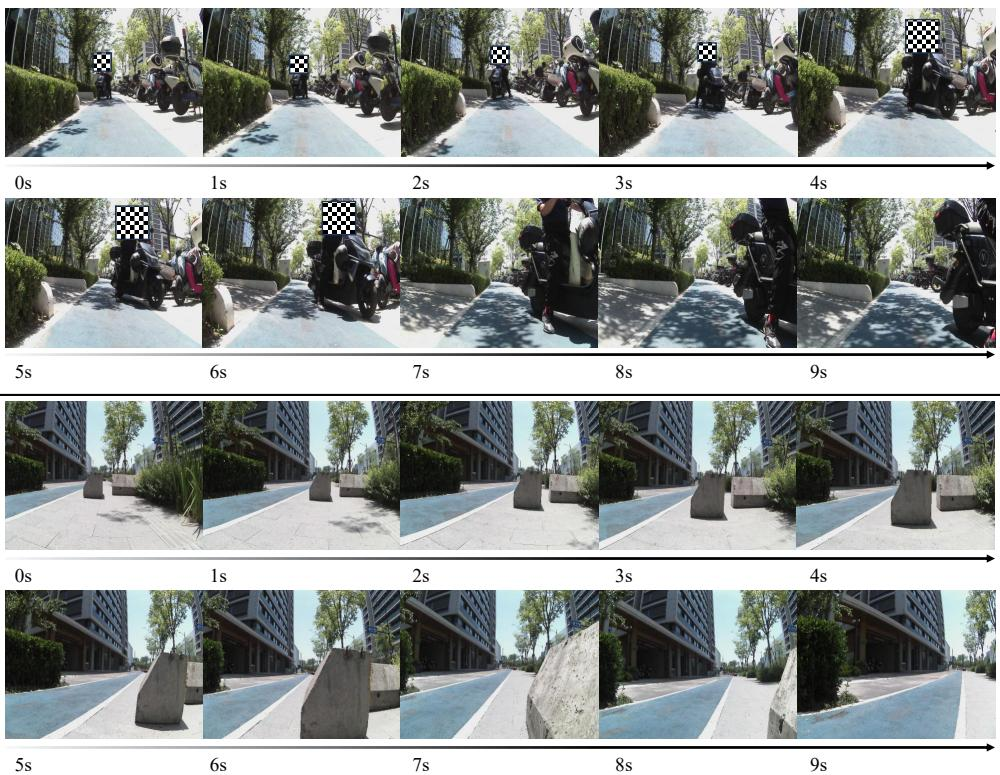  
Figure 6: Qualitative results of real-world outdoor deployment under a zero-shot setting (without any task-specific training). Sensitive biometric information (e.g., human faces) has been anonymized.

## D.2 Ablation of co-training between video generation and action prediction.

While the action expert alone already achieves strong performance, jointly training with video generation further improves both PDMS and EPDMS by a clear margin. This validates that the proposed asymmetric attention mask enables the action expert to implicitly learn dynamic world evolution from the video generation branch during training, while remaining decoupled at inference time, thereby improving generalization.

## E Qualitative results

We provide visualization results of the generation expert here, along with additional qualitative results on NAVSIM and CityWalker.

## E.1 Qualitative of video generation expert

As shown in Figure 8, we present visualization results of the generation expert in both static and dynamic scenarios. The model produces high-quality results in relatively static scenes. In contrast, under complex dynamic intersection scenarios, fine details of distant background vehicles may be lost. Nevertheless, this degradation does not noticeably affect short-term driving action prediction.

## E.1.1 More qualitative results and failure case on NAVSIM

Our method is capable of producing reasonable planning behaviors in scenarios such as lane following and turning, as illustrated in Figure 9. In open-world scenarios, our method may exhibit slight deviations during long-horizon planning due to the limitation of using only monocular-view inputs, as illustrated in Figure 10. We leave efficient multi-view world modeling for future work to further facilitate action planning.

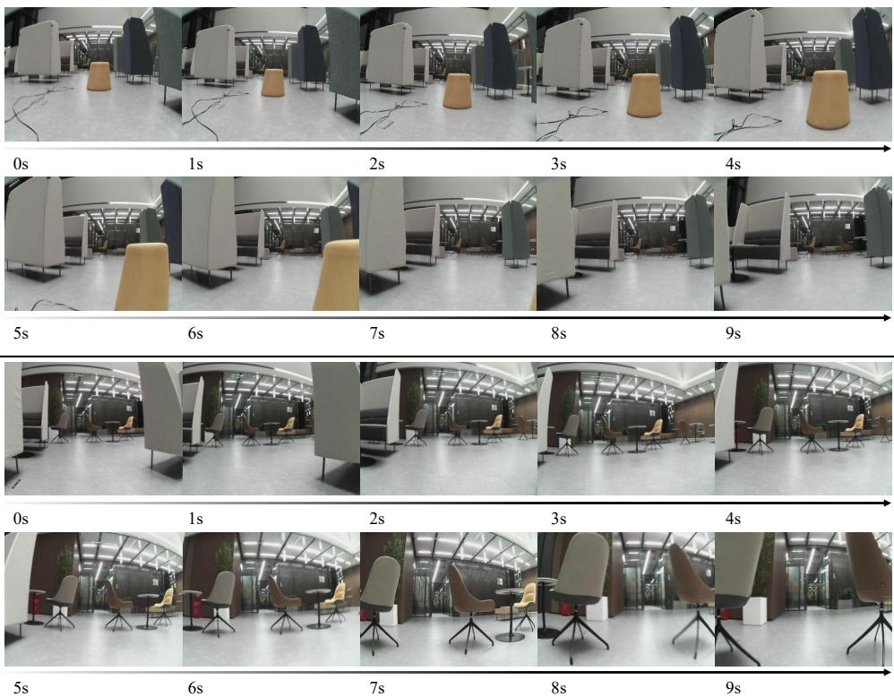  
Figure 7: Qualitative results of real-world outdoor deployment under a zero-shot setting (without any task-specific training)

Table 10: Ablation of action expert params.
<table><tr><td rowspan="2">Params</td><td rowspan="2">navtest</td><td colspan="3">navhard</td></tr><tr><td>EPDMS ↑ S1 ↑</td><td>S2↑</td><td>EPDMS↑</td></tr><tr><td>~ 0.21 B</td><td>88.2</td><td>76.0</td><td>40.7</td><td>31.2</td></tr><tr><td>~ 0.45 B</td><td>88.6</td><td>74.5</td><td>41.4</td><td>31.4</td></tr><tr><td>~ 1.04 B</td><td>89.5</td><td>75.8</td><td>41.7</td><td>32.2</td></tr></table>

Table 11: Ablation of training video generation expert.
<table><tr><td>Training Paradigm</td><td>PDMS</td><td>EPDMS</td></tr><tr><td>w/o co-train</td><td>87.4</td><td>87.9</td></tr><tr><td>w/ co-train</td><td>89.1</td><td>89.5</td></tr></table>

## F Experiment details and evaluation metric

We adopt Wan2.2-5B as the VGE and the AE shares the same architecture with a reduced hidden dimension $( d _ { a } = 1 0 2 4 )$ , resulting in a 1B-parameter branch and an overall model size of 6B. For task setup, we use an action horizon of 8 for NAVSIMv2 (4 seconds with 0.5-second intervals), where each waypoint is represented as $( x , y , \theta )$ , and a horizon of 5 for CityWalker with (x, y). We use only the front-facing camera as input, and align video and action chunks with a 1:1 temporal ratio.

Both VGE and AE are trained under the same flow matching formulation. For NAVSIMv2, we use an input resolution of 640 × 768 and train for 60 epochs with a batch size of 64; for CityWalker, we use 384×384 and train for 30 epochs with the same batch size. During inference, we use 10 denoising steps with classifier-free guidance (CFG = 1.0). All experiments are conducted on 8 NVIDIA H200 GPUs (140 GB memory each). We optimize all models using AdamW $( l r = 1 \times 1 0 ^ { - 4 }$ , weight decay 0.01) with a cosine annealing schedule, and apply mixed precision training with gradient clipping at 1.0.

We utilize two benchmarks in NAVSIMv2 [7] for end-to-end model evaluation, including navhard and navtest. navhard is the official two-stage evaluation benchmark, which contains 244 challenging real-world scenarios in the first stage and corresponding 4,164 synthetic scenarios generated by 3DGS in the second stage. navtest is a one-stage evaluation benchmark, containing a large number of 12,146 real-world scenarios. navhard focuses on assessing the model’s closed-loop performance in safety-critical situations, while navtest emphasizes generalization across diverse driving conditions. The two benchmarks share a rule-based planning metric, EPDMS [36], with

Table 9: Performance comparison on NAVSIM-v1 navtest Leaderboard. \* indicates training with reinforcement learning; -IL means imitation learning; † indicates training on the full navtrain split; ‡ indicates the use of the best-of-N (N = 6) strategy following [100].
<table><tr><td rowspan=1 colspan=5>Method                 Sensors  NC↑  DAC↑  EP↑  TTC↑   C↑   PDMS↑Human Agent        一             100    100   87.5   100    99.9     94.8Traditional E2E-based Planner</td></tr><tr><td rowspan=12 colspan=1>UniAD [24]TransFuser [11]PARA-Drive [76]LAW [38]World4Drive [96]DRAMA [85]Hydra-MDP++ [36]ARTEMIS [16]WorldRFT* [81]DiffusionDrive [44]WorldDrive [21]WoTE [40]</td><td rowspan=1 colspan=1>6xC</td><td rowspan=1 colspan=1>97.8   91.9</td><td rowspan=1 colspan=1>78.8   92.9   100.0</td><td rowspan=1 colspan=1>83.4</td></tr><tr><td rowspan=1 colspan=1>3xC+L</td><td rowspan=1 colspan=1>97.7   92.8</td><td rowspan=1 colspan=1>79.2   92.8    100</td><td rowspan=1 colspan=1>84.0</td></tr><tr><td rowspan=1 colspan=1>6xC</td><td rowspan=1 colspan=1>97.9   92.4</td><td rowspan=1 colspan=1>79.3   93.0   99.8</td><td rowspan=1 colspan=1>84.0</td></tr><tr><td rowspan=1 colspan=1>1xC</td><td rowspan=1 colspan=1>96.4   95.4</td><td rowspan=1 colspan=1>81.7   88.7   99.9</td><td rowspan=1 colspan=1>84.6</td></tr><tr><td rowspan=1 colspan=1>3xC</td><td rowspan=1 colspan=1>97.4   94.3</td><td rowspan=1 colspan=1>79.9   92.8   100.0</td><td rowspan=1 colspan=1>85.1</td></tr><tr><td rowspan=1 colspan=1>3xC+L</td><td rowspan=1 colspan=1>98.0   93.1</td><td rowspan=1 colspan=1>80.1   94.8   100.0</td><td rowspan=1 colspan=1>85.5</td></tr><tr><td rowspan=1 colspan=1>3xC+L</td><td rowspan=1 colspan=1>97.6   96.0</td><td rowspan=1 colspan=1>80.4   93.1   100.0</td><td rowspan=1 colspan=1>86.6</td></tr><tr><td rowspan=1 colspan=1>3xC+L</td><td rowspan=1 colspan=1>98.3   95.1</td><td rowspan=1 colspan=1>81.4   94.3   100.0</td><td rowspan=1 colspan=1>87.0</td></tr><tr><td rowspan=1 colspan=1>3xC</td><td rowspan=1 colspan=1>97.5   96.0</td><td rowspan=1 colspan=1>80.9   94.0   100.0</td><td rowspan=1 colspan=1>87.0</td></tr><tr><td rowspan=1 colspan=1>3xC+L</td><td rowspan=1 colspan=1>98.2   96.2</td><td rowspan=1 colspan=1>82.2   94.7   100.0</td><td rowspan=1 colspan=1>88.1</td></tr><tr><td rowspan=1 colspan=1>1xC</td><td rowspan=1 colspan=1>98.4   96.2</td><td rowspan=1 colspan=1>81.9   95.1    100</td><td rowspan=1 colspan=1>88.1</td></tr><tr><td rowspan=1 colspan=1>3xC+L</td><td rowspan=1 colspan=1>98.5   96.8</td><td rowspan=1 colspan=1>81.9   94.9   99.9</td><td rowspan=1 colspan=1>88.3</td></tr><tr><td rowspan=2 colspan=1>SeerDrive [88]Drive-JEPA [68]</td><td rowspan=1 colspan=1>3/6xC+L</td><td rowspan=1 colspan=1>98.4   97.0</td><td rowspan=1 colspan=1>83.2  94.9   99.9</td><td rowspan=1 colspan=1>88.9</td></tr><tr><td rowspan=1 colspan=1>1xC</td><td rowspan=1 colspan=1>98.7   96.2</td><td rowspan=1 colspan=1>82.9  100.0   95.5</td><td rowspan=1 colspan=1>89.0</td></tr><tr><td rowspan=5 colspan=1>AutoVLA-IL [100]ReCogDrive-IL [41]SGDrive-IL [34]Vega [101]</td><td rowspan=1 colspan=1></td><td rowspan=1 colspan=1>VLA-based Planner</td><td rowspan=1 colspan=1></td><td rowspan=1 colspan=1></td></tr><tr><td rowspan=4 colspan=1>3xC1xC1xC1xC</td><td rowspan=1 colspan=1>96.9   92.4</td><td rowspan=1 colspan=1>75.8   88.1    99.1</td><td rowspan=1 colspan=1>80.5</td></tr><tr><td rowspan=1 colspan=1>98.1   94.7</td><td rowspan=1 colspan=1>80.9   94.2   100.0</td><td rowspan=1 colspan=1>86.5</td></tr><tr><td rowspan=1 colspan=1>98.6   95.1</td><td rowspan=1 colspan=1>81.2   95.4   100.0</td><td rowspan=1 colspan=1>87.4</td></tr><tr><td rowspan=1 colspan=1>98.9   95.3</td><td rowspan=1 colspan=1>81.6   96.1   100.0</td><td rowspan=1 colspan=1>87.9</td></tr><tr><td rowspan=1 colspan=1></td><td rowspan=1 colspan=1>WA</td><td rowspan=1 colspan=1>M-based Planne</td><td rowspan=1 colspan=1>r</td><td rowspan=1 colspan=1></td></tr><tr><td rowspan=3 colspan=1>Epona [92]ImagiDrive [35]PWM†[94]</td><td rowspan=1 colspan=1>1xC</td><td rowspan=1 colspan=1>97.9   95.1</td><td rowspan=1 colspan=1>80.4   93.8   99.9</td><td rowspan=1 colspan=1>86.2</td></tr><tr><td rowspan=1 colspan=1>1xC</td><td rowspan=1 colspan=1>98.6   96.2</td><td rowspan=1 colspan=1>80.5   94.5   100.0</td><td rowspan=1 colspan=1>87.4</td></tr><tr><td rowspan=1 colspan=1>1xC</td><td rowspan=1 colspan=1>98.6   95.9</td><td rowspan=1 colspan=1>81.8   95.4   100.0</td><td rowspan=1 colspan=1>88.1</td></tr><tr><td rowspan=1 colspan=1>DriveVLA-W0 † [39]</td><td rowspan=1 colspan=1>1xC</td><td rowspan=1 colspan=1>98.7   96.2</td><td rowspan=1 colspan=1>82.2   95.5   100.0</td><td rowspan=1 colspan=1>88.4</td></tr><tr><td rowspan=2 colspan=1>UniWorldVLA † [48]DriveLAW † [77]</td><td rowspan=1 colspan=1>1xC</td><td rowspan=1 colspan=1>98.7   96.7</td><td rowspan=1 colspan=1>83.2   96.1   100.0</td><td rowspan=1 colspan=1>89.4</td></tr><tr><td rowspan=1 colspan=1>1xC</td><td rowspan=1 colspan=1>99.0   97.1</td><td rowspan=1 colspan=1>81.3   96.7   100.0</td><td rowspan=1 colspan=1>89.1</td></tr><tr><td rowspan=2 colspan=1>Metis (Ours)Metis ↓ (Ours)</td><td rowspan=2 colspan=1>1xC1xC</td><td rowspan=1 colspan=1>98.3   97.1</td><td rowspan=1 colspan=1>83.4   94.7   100.0</td><td rowspan=1 colspan=1>89.1</td></tr><tr><td rowspan=1 colspan=1>98.5   97.5</td><td rowspan=1 colspan=1>84.0   95.1   100.0</td><td rowspan=1 colspan=1>89.7</td></tr></table>

Table 12: Performance and inference latency across different hardware and denoising steps.
<table><tr><td rowspan="2">Steps</td><td colspan="2">navtest ↑</td><td>navhard ↑</td><td colspan="2">Latency (ms) ↓</td></tr><tr><td>PDMS</td><td>EPDMS</td><td>EPDMS</td><td>RTX 4090</td><td>H200</td></tr><tr><td>1</td><td>87.0</td><td>87.2</td><td>30.4</td><td>110</td><td>100</td></tr><tr><td>2</td><td>88.9</td><td>89.2</td><td>31.2</td><td>147</td><td>140</td></tr><tr><td>5</td><td>89.0</td><td>89.4</td><td>31.4</td><td>280</td><td>240</td></tr><tr><td>10</td><td>89.1</td><td>89.5</td><td>32.2</td><td>480</td><td>430</td></tr></table>

several sub-metrics:

$$
\mathrm { E P D M S } = \underbrace { \left( \prod _ { m \in \mathcal { M } _ { \mathrm { p e n } } } S _ { m } \right) } _ { \mathrm { p e n a l t i e s } } \cdot \underbrace { \left( \frac { \sum _ { m \in \mathcal { M } _ { \mathrm { a v g } } } w _ { m } S _ { m } } { \sum _ { m \in \mathcal { M } _ { \mathrm { a v g } } } w _ { m } } \right) } _ { \mathrm { w e i g h t e d a v e r a g e } } ,\tag{7}
$$

where $S _ { m }$ is the sub-metric: penalty terms set $\mathcal { M } _ { \mathrm { { p e n } } }$ includes No-at-fault Collisions (NC), Drivable Area Compliance (DAC), Driving Direction Compliance (DDC), and Traffic Light Compliance (TLC); weighted average terms set $\mathcal { M } _ { \mathrm { a v g } }$ includes Time-to-Collision (TTC), Ego Progress (EP), Lane Keeping (LK), History Comfort (HC), and extended comfort (EC). Note that EPDMS in navhard further incorporates several modifications, two-stage aggregation, reactive traffic simulation, and the exclusion of penalties in cases where the human expert driver also fails.

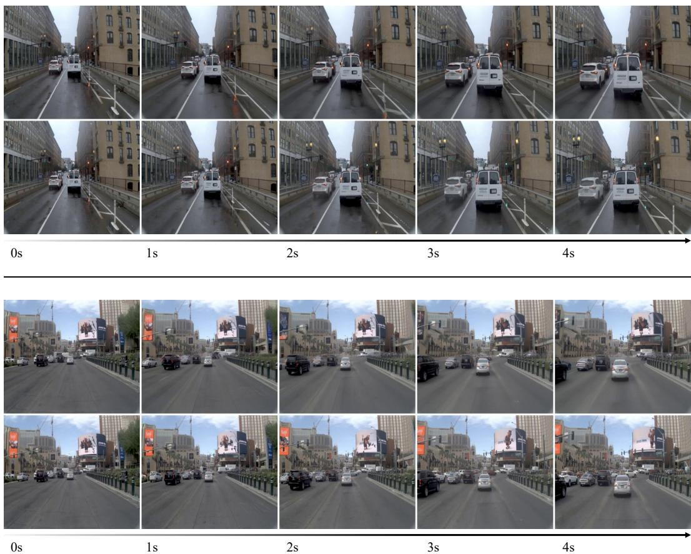  
Figure 8: Qualitative comparison of video generation results. For each pair, the top row shows the frames generated by our model, and the bottom row shows the ground truth sequences.

We also provide one benchmarks in NAVSIMv1 [15] for end-to-end model evaluation on navtest with PDMS:

$$
\mathrm { P D M S } = \underbrace { \left( \prod _ { m \in \{ \mathrm { N C , D A C } \} } \mathrm { s c o r e } _ { m } \right) } _ { \mathrm { p e n a l i t i s } } \times \underbrace { \left( \frac { \sum _ { w \in \{ \mathrm { E P , T T C , C \} } \mathrm { w e i g h t } _ { w } \times \mathrm { s c o r e } _ { w } } } { \sum _ { w \in \{ \mathrm { E P , T T C , C \} } \mathrm { w e i g h t } _ { w } } } \right) } _ { \mathrm { w e i g h t e d a v e r a g e } } .\tag{8}
$$

## G Limitation

Despite its performance, our method has limitations. First, its reliability in extreme corner cases remains to be fully validated due to the inherent data-dependent nature of world modeling. Second, the framework relies heavily on the pre-trained Video Generation Expert; while video generation is bypassed during inference, its involvement in training remains computationally intensive. Additionally, the VAE’s down-sampling ratio significantly impacts the balance between training efficiency and representation quality. Future work will focus on addressing these challenges to enhance robustness and training scalability.

## H Broad Impact

This research presents a dual-sided impact on the development of autonomous systems. On the positive side, by enabling agents to proactively reason about future environment evolution through world modeling, our framework significantly enhances the safety and decision-making efficiency of autonomous navigation, which may lead to a reduction in traffic accidents and energy consumption in smart cities. Conversely, the deployment of such technology entails potential risks: the model may exhibit unpredictable behavior in out-of-distribution (OOD) scenarios or extreme corner cases. Furthermore, its widespread adoption could disrupt the labor market for professional drivers and poses new challenges for legal frameworks regarding accountability in autonomous decision-making.

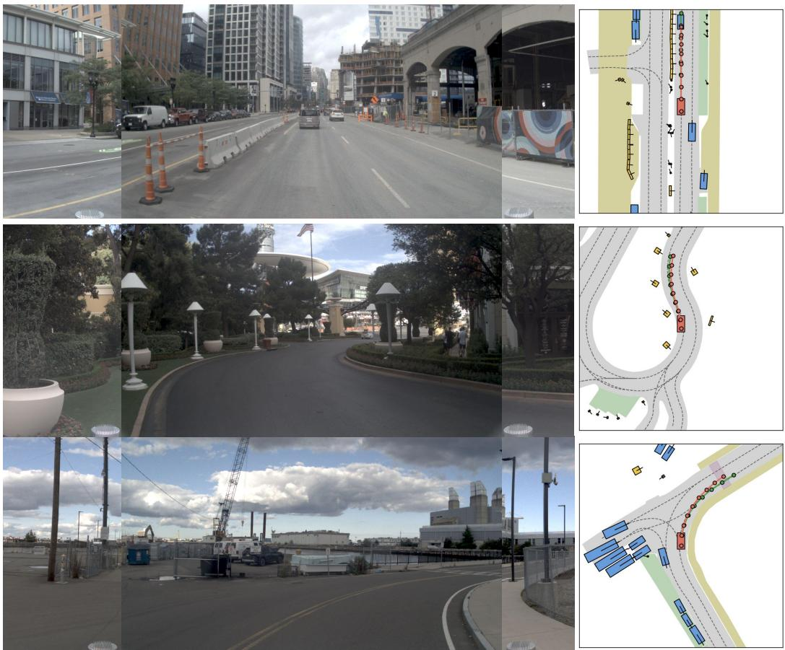

Figure 9: Qualitative results of Metisin NAVSIM [15].  
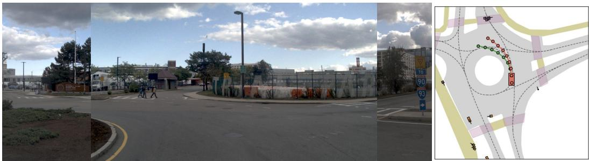  
Figure 10: Qualitative failure results of Metisin NAVSIM [15].