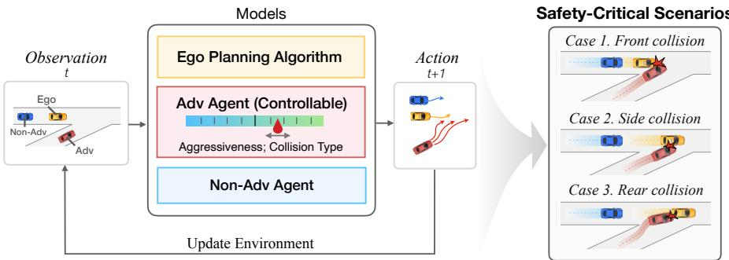
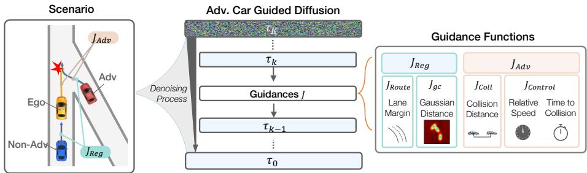
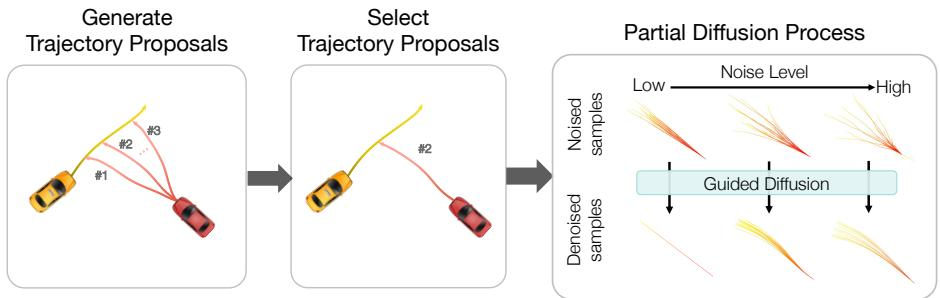
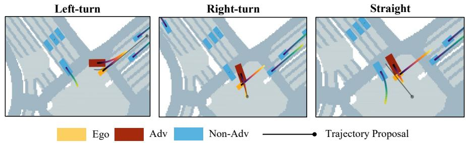

# Safe-Sim: Safety-Critical Closed-Loop Trafic Simulation with Difusion-Controllable Adversaries

Wei-Jer Chang1, Francesco Pittaluga2, Masayoshi Tomizuka1, Wei Zhan1, and Manmohan Chandraker2,3

1 UC Berkeley 2 NEC Labs America 3 UC San Diego

Abstract. Evaluating the performance of autonomous vehicle planning algorithms necessitates simulating long-tail safety-critical trafic scenarios. However, traditional methods for generating such scenarios often fall short in terms of controllability and realism; they also neglect the dynamics of agent interactions. To address these limitations, we introduce Safe-Sim, a novel difusion-based controllable closed-loop safety-critical simulation framework. Our approach yields two distinct advantages: 1) generating realistic long-tail safety-critical scenarios that closely reflect real-world conditions, and 2) providing controllable adversarial behavior for more comprehensive and interactive evaluations. We develop a novel approach to simulate safety-critical scenarios through an adversarial term in the denoising process of difusion models, which allows an adversarial agent to challenge a planner with plausible maneuvers while all agents in the scene exhibit reactive and realistic behaviors. Furthermore, we propose novel guidance objectives and a partial difusion process that enables users to control key aspects of the scenarios, such as the collision type and aggressiveness of the adversarial agent, while maintaining the realism of the behavior. We validate our framework empirically using the nuScenes and nuPlan datasets across multiple planners, demonstrating improvements in both realism and controllability. These findings afirm that difusion models provide a robust and versatile foundation for safety-critical, interactive trafic simulation, extending their utility across the broader autonomous driving landscape. Project website: https://safe-sim.github.io/.

## 1 Introduction

A key safety feature of autonomous vehicles (AVs) is their ability to navigate near-collision events in real-world scenarios. However, these events rarely occur on roads and testing AVs in such high-risk situations on public roads is unsafe. Therefore, simulation is indispensable in the development and assessment of AVs, providing a safe and reliable means to study their safety and dependability. A critical aspect of simulation is modeling the behavior of other road users, since AVs must learn to interact with them safely.

A common method of safety-critical testing of AVs involves manually designing scenarios that could potentially lead to failures, such as collisions. While this approach allows for targeted testing, it is inherently limited in scalability and lacks the comprehensiveness required for thorough evaluation [7, 8, 33]. Some recent works focus on automatically generating challenging scenarios that cause planners to fail, but their emphasis has been mostly on static scenario generation rather than dynamic, closed-loop simulations. This results in a critical gap: the behavior of other agents often does not adapt or respond to the planner’s actions, which is essential for a comprehensive safety evaluation. Furthermore, the results from these simulations often lack controllability, typically producing only a single adversarial outcome per scenario without the flexibility to explore a range of conditions and responses.

<table><tr><td>Method</td><td>Safety- Critical</td><td>Controllable</td><td>Controllable Evaluate Closed- Real- Adversary</td><td>Planner</td><td>Loop</td><td>World</td></tr><tr><td>CTG [39]</td><td>×</td><td></td><td>X</td><td>×</td><td></td><td></td></tr><tr><td>CTG++ [38]</td><td>×</td><td>L</td><td>X</td><td>×</td><td>V</td><td>L</td></tr><tr><td>STRIVE [26]</td><td>√</td><td>×</td><td>X</td><td>√</td><td>7</td><td></td></tr><tr><td>DiffScene [34]</td><td></td><td>L</td><td>X</td><td></td><td>×</td><td>X</td></tr><tr><td>SAFE-SIM (Ours)</td><td></td><td></td><td>√</td><td></td><td></td><td></td></tr></table>

Table 1: Comparison of methods. Our contribution is the development of a framework for (a) safety-critical (b) closed-loop (c) controllable adversarial simulations. These aspects are not concurrently present in previous frameworks. We formulate a novel partial difusion with novel guidance functions for stable long-term simulation and are the first to enable an ego planner to be tested against controllable adversaries with varied behavior patterns.

In this work, we introduce Safe-Sim, a closed-loop simulation framework for generating safety-critical scenarios, with a particular emphasis on controllability and realism for the behavior of agents, which allows simulations over a long horizon as needed to evaluate AV planning algorithms (Fig. 1). Diferent from prior works [26, 34, 38, 39] that primarily adhere to rule-constraint satisfaction, our approach enhances controllability by modulating adversarial vehicle behaviors within identical scenarios, thereby facilitating a broader exploration of potential outcomes. See Tab. 1 for a comprehensive comparison of these approaches.

Our approach builds upon recent developments in controllable difusion models [18, 25, 39]. Specifically, we adopt a test-time guidance to direct the denoising phase of the difusion process, using the gradients from diferentiable objectives to enhance scenario generation, enabling generation of adversarial scenarios in which and adversarial agent collides with the ego agent behaving according to specific planning policy. Additionally, we develop an novel approach, which we refer to as Partial Difusion that introduces trajectory proposals into the difusion process to provide a high degree of controllability over the type of collision scenario. Overall, our balanced integration of adversarial objectives with regularization during the guidance phase combined with Partial Difusion allows for refined control over the conditions of the generated scenarios, ensuring both their realism and relevance to safety-critical testing.

In our study, we use the nuScenes [2] and nuPlan [3] datasets to evaluate the eficacy of our method in generating safety-critical closed-loop simulations. Our results demonstrate a marked improvement in the controllability and realism of scenarios compared to previous adversarial scenario generation methods. Furthermore, we showcase the advantage of our proposed framework in varying the safety-criticality and collision types of scenarios. These attributes make our approach particularly well-suited for the closed-loop simulation of AVs, providing a more reliable and comprehensive framework for safety evaluation.

  
Fig. 1: Overview of Safe-Sim Framework for Controllable Safety-Critical Closed-Loop Simulation. This framework evaluates a planner within scenarios featuring multiple controllable reactive agents. These agents have two distinct roles: adversarial agents, which actively challenge the planner by exhibiting controllable adversarial behaviors such as specific collision types and levels of aggressiveness, and non-adversarial agents, which follow normal driving behavior to maintain the realism of the entire scene. Such a setup facilitates the generation of various realistic, interactive, and safety-critical scenarios, providing a thorough evaluation of the planner’s capabilities.

## 2 Related Work

## 2.1 Trafic Simulation

Trafic simulation can broadly be categorized into two main groups: heuristic-based and learning-based methods. In heuristic-based methods, agents are controlled by human-specified rules, such as the Intelligent Driver Model (IDM) [30] to follow a leading vehicle while maintaining a safe following distance. However, these methods have modeling capacity issues and may not reflect the real trafic distribution; a large domain gap limits its usage for planning evaluation. To close the gap, data-driven approaches learn from real driving datasets to imitate real-world behavior [23, 28, 29, 35]. TraficSim [28] utilizes a trained variational autoencoder for scene-level trafic simulation, while BITS [35] combines highlevel goal inference with low-level driving behavior imitation to enhance the realism of simulated driving behavior. Recently, the Waymo SimAgents challenge has focused on whether simulators can accurately represent real-world driving distributions [20]. However, little work has specifically focused on behavior simulation for generating safety-critical, long-tail scenarios.

Difusion models [27, 31, 32] have shown significant promise for synthetic image generation. One of the key advantages of difusion models is controllability, which can take the form of classifier [6], classifier-free [15], and reconstruction [13] guidance. Recently, controllable difusion models have been employed for planning and trafic simulation [25, 38, 39] via guidance. We adopt trajectory difusion models to develop a novel approach for generate safety-critical realistic trafic simulations in which an adversarial agent collides with an ego planner agent. Other works [19, 24] use difusion with guidance or conditioning to achieve controllable scene initialization. In contrast, we emphasize closed-loop, controllable adversarial behavior simulation based on real-world data initialization rather than scene initialization.

## 2.2 Safety-Critical Trafic Simulation

Safety-critical trafic generation plays a crucial role in training and evaluating AV systems, enhancing their capability to navigate diverse real-world scenarios and enhancing robustness. Gradient-based methods that leverage back-propagation to create safety-critical scenarios have been proposed to evaluate AV prediction and planning models [4,11]. Hanselmann et al. use kinematic gradients to modify vehicle trajectories, with the goal of improving the robustness of imitation learning planners [11]. Cao et al. have developed a model with diferentiable dynamics, enabling the generation of realistic adversarial trajectories for trajectory prediction models through backpropagation techniques [4]. Black-box optimization approaches include perturbing actions based on kinematic bicycle models [33] and using Bayesian Optimization to create adversarial self-driving scenarios that escalate collision risks with simulated entities [1]. Zhang et al. target trajectory prediction models via white- and black-box attacks that adversarially perturb real driving trajectories [37]. For an extensive review of this topic, we direct readers to Ding et al. [9].

The field has recently seen advancements in data-driven methods for safetycritical scenario generation [26,34,36]. For instance, Xu et al. introduce a difusionbased approach in CARLA, applying various adversarial optimization objectives to guide the difusion process for safety-critical scenario generation [34]. Rempe et al. proposed STRIVE to utilize gradient-based adversarial optimization on the latent space, constrained by a graph-based CVAE trafic motion model, to generate realistic safety-critical scenarios for rule-based planners [26]. However, a common limitation in these approaches is the absence of closed-loop interaction, essential for accurately simulating interactive real-world driving.

## 3 Problem Formulation

We consider a simulated interactive trafic scenario consisting of N agents; one is the ego vehicle controlled by the planner π, and the remaining N − 1 are reactive agents modeled by a function g. Our objective is to create a safety-critical closedloop collision simulation, where reactive agents demonstrate realistic, controllable behavior. Of the N−1 reactive agents, one or a subset is considered the adversarial agents (denoted as agent a), meant to collide with the ego vehicle.

The adversarial agent, formulated within the reactive agent model $^ { g , }$ is governed by an adversarial term designed (detailed in Sec. 5) to be both controllable and adversarial to the planner $\pi .$ This setup allows the adversarial agent to pose direct challenges to $\pi ,$ testing its resilience in complex scenarios. Concurrently, the other non-adversarial agents, also controlled by $g$ with varying parameters, emulate authentic, reactive behaviors, thus enriching the simulation scenario with realistic and diverse trafic conditions. The dual role of the adversarial agent and non-adversarial agents ensures that while it challenges $\pi ,$ the overall simulation environment plausibly represents real-world driving conditions.

At any given timestep $t ,$ the states of the N vehicles are represented as $\mathbf { s } _ { t } = [ \mathbf { s } _ { t } ^ { 1 } , \ldots , \mathbf { s } _ { t } ^ { N } ]$ , where $\mathbf { s } _ { t } ^ { i } = ( x _ { t } ^ { i } , y _ { t } ^ { i } , v _ { t } ^ { i } , \theta _ { t } ^ { i } )$ indicates the 2D position, speed, and yaw of vehicle $i .$ The corresponding actions for each vehicle are $\mathbf { a } _ { t } = [ \mathbf { a } _ { t } ^ { 1 } , \dots , \mathbf { a } _ { t } ^ { N } ]$ with $\mathbf { a } _ { t } ^ { i } = ( \dot { v } _ { t } ^ { i } , \dot { \theta } _ { t } ^ { i } )$ representing the acceleration and yaw rate. To predict the state at the next timestep $t + 1$ , a transition function $f$ is used, which computes $\mathbf { s } _ { t + 1 } = f ( \mathbf { s } _ { t } , \mathbf { a } _ { t } )$ based on current state and action. We adopt unicycle dynamics as the transition function.

Each agent’s decision context is $\mathbf { c } _ { t } ^ { i } .$ , which includes the agent-centric map $I ^ { i }$ and the $T _ { \mathrm { h i s t } }$ historical states of neighboring vehicles from time $t - T _ { \mathrm { h i s t } }$ to $t ,$ defined as $\mathbf { s } _ { t - T _ { \mathrm { h i s t } } : t } = \{ \mathbf { s } _ { t - T _ { \mathrm { h i s t } } } , \ldots , \mathbf { s } _ { t } \}$ . In closed-loop trafic simulation, each agent continuously generates and updates its trajectory based on the current decision context $\mathbf { c } _ { t } ^ { i }$ . After generating a trajectory, the simulation executes the first few steps of the planned actions before updating $\mathbf { c } _ { t } ^ { i }$ and re-planning. See Sec. 6.2 for more implementation details.

Planner $\pi$ The planner $\pi$ determines the ego vehicle’s future trajectory over a time horizon t to $t + T$ . The planned state sequence is denoted by $s _ { t : t + T } ^ { 1 } = \pi ( \mathbf { c } _ { t } ^ { 1 } )$ , where $\pi ( \mathbf { c } _ { t } ^ { 1 } )$ processes the historical states and map data within $\mathbf { c } _ { t } ^ { 1 }$ to plan future states based on the current scene context.

Reactive Agents $g$ The reactive agent model $^ { g , }$ parameterized by $\theta ,$ is designed to simulate the behavior of the $N - 1$ non-ego vehicles, represented by the set $\{ s _ { t : t + T } ^ { i } \} _ { i = 2 } ^ { N }$ . Each vehicle’s state sequence, $s _ { t : t + T } ^ { i }$ , is generated by $g _ { \boldsymbol { \theta } } ( \mathbf { c } _ { t } ^ { i } , \psi _ { i } )$ , which incorporates the decision context $\mathbf { c } _ { t } ^ { i }$ and a set of control parameters $\psi _ { i }$ unique to each agent. These parameters $\psi _ { i }$ enable the fine-tuning of individual behaviors within the simulation. In our approach, we train the model $g$ on real-world driving data to ensure the trajectories it produces are not only controllable, supporting the generation of various safety-critical scenarios, but also realistic.

## 4 Difusion Models for Trafic Simulation

For closed-loop safety-critical trafic simulation, the reactive agents, especially the adversarial agent, should be 1) controllable, and $2 )$ realistic. With recent advances in controllable difusion models [18,25,39], we adopt trajectory difusion models to generate realistic simulations.

We define the model’s operational trajectory as $\tau ,$ which comprises both action and state sequences: ${ \boldsymbol { \tau } } : = [ \tau _ { a } , \tau _ { s } ]$ . Specifically, $\tau _ { a } : = [ a _ { 0 } , \ldots , a _ { T - 1 } ]$ represents the sequence of actions, while $\tau _ { s } : = [ s _ { 1 } , \dots , s _ { T } ]$ denotes the corresponding sequence of states. Following the approach described in [39], our model predicts the action sequence $\tau _ { a } .$ , and the state sequence $\tau _ { s }$ can be derived starting from the initial state $s _ { 0 }$ and dynamic model $f .$

A difusion model generates a trajectory by reversing a process that incrementally adds noise. Starting with an actual trajectory $\tau _ { 0 }$ sampled from the data distribution $q ( \tau _ { 0 } )$ , a sequence of increasingly noisy trajectories $\left( \tau _ { 1 } , \tau _ { 2 } , \dots , \tau _ { K } \right)$ is produced via a forward noising process. Each trajectory $\tau _ { k }$ at step k is generated by adding Gaussian noise parameterized by a predefined variance schedule $\beta _ { k }$ [14]:

$$
q ( \tau _ { 1 : K } | \tau _ { 0 } ) : = \prod _ { k = 1 } ^ { K } q ( \tau _ { k } | \tau _ { k - 1 } ) ,\tag{1}
$$

$$
q ( \tau _ { k } | \tau _ { k - 1 } ) : = \mathcal { N } ( \tau _ { k } ; \sqrt { 1 - \beta _ { k } } \tau _ { k - 1 } , \beta _ { k } \mathbf { I } ) .\tag{2}
$$

The noising process gradually obscures the data, where the final noisy version $q ( \tau _ { K } )$ approaches $\mathcal { N } ( \tau _ { K } ; \mathbf { 0 } , \mathbf { I } )$ . The trajectory generation process is then achieved by learning the reverse of this noising process. Given a noisy trajectory $\tau _ { K }$ , the model learns to denoise it back to $\tau _ { 0 }$ through a sequence of reverse steps. Each reverse step is modeled as:

$$
p _ { \theta } ( \tau _ { k - 1 } \vert \tau _ { k } , \mathbf { c } ) : = \mathcal { N } ( \tau _ { k - 1 } ; \mu _ { \theta } ( \tau _ { k } , k , \mathbf { c } ) , \varSigma _ { k } ) ,\tag{3}
$$

where $\theta$ are learned functions that predict the mean $\mu$ of the reverse step, and $\varSigma _ { k }$ is a fixed schedule. By iteratively applying the reverse process, the model learns a trajectory distribution, efectively generating a plausible future trajectory from a noisy start.

During the trajectory prediction phase, the model estimates the final clean trajectory denoted by $\hat { \tau } _ { 0 }$ . This estimated trajectory is used to compute the mean $\mu$ as described in [21]. For more details, see supplementary material Sec. D.

## 5 Difusion Models for Safety-Critical Trafic Simulation

The difusion model, once trained on realistic trajectory data, inherently reflects the behavioral patterns present in its training distribution. However, to efectively simulate and analyze safety-critical scenarios, there is a crucial need for a mechanism that allows for the controlled manipulation of agent behaviors [18,39]. This is particularly important for generating adversarial behaviors and ensuring scene consistency in simulations.

## 5.1 Guiding Reactive Agents

Our approach specifically introduces guidance to the sampled trajectories at each denoising step, aligning them with predefined objectives $J ( \tau )$ . The concept of guidance involves using the gradient of J to subtly perturb the predicted mean of the model at each denoising step. This process enables the generation of trajectories that not only reflect realistic behavior but also cater to specific simulation needs, such as adversarial testing and maintaining scene consistency over extended periods. We adopt the reconstruction guidance (clean guidance) introduced from [16, 25]:

  
Fig. 2: Guided Difusion Process for the Adversarial Agent. This process optimizes the adversarial agent’s trajectory using the adversarial cost function $J _ { \mathrm { a d v } }$ to the ego vehicle. In particular, we introduce $J _ { \mathrm { c o n t r o l } }$ to vary the adversarial behavior. Simultaneously, it applies regularization through $J _ { \mathrm { r e g } }$ for maintaining realism.

$$
\tilde { \tau } _ { 0 } = \hat { \tau } _ { 0 } - \alpha { \Sigma } _ { k } \nabla _ { \tau _ { k } } J ( \hat { \tau } _ { 0 } )\tag{4}
$$

This strategy improves guidance robustness, yielding smoother, more stable trajectories without the usual numerical issues from noisy data.

In practice, diversifying the behavior of adversarial agents within the same scenarios is crucial for a thorough assessment of AVs. Despite the significance of this challenge, it remains largely unexplored in previous works [26, 39]

The loss function for the non-reactive agents, $J ( \tau )$ , consists of a collision term $J _ { \mathrm { c o l l } }$ , which encourages collisions between the adversarial agent and the ego agent, two control terms $J _ { \mathrm { v } }$ and $J _ { \mathrm { t t c } }$ , which control the relative speed and timeto-collision between the ego and adversarial agent respectively, a regularization term $J _ { \mathrm { G a u s s } }$ , which discourages collisions between the reactive agents, and a route guidance term $J _ { \mathrm { r o u t e } }$ , which discourages the reactive agents from going outside the road:

$$
J ( \tau ) = \rho \underbrace { ( J _ { \mathrm { c o l l } } + J _ { \mathrm { v } } + J _ { \mathrm { t t c } } ) } _ { J _ { \mathrm { a d v } } ( \tau ) } + \underbrace { J _ { \mathrm { r o u t e } } + J _ { \mathrm { G a u s s } } } _ { J _ { \mathrm { r e g } } ( \tau ) } ,\tag{5}
$$

where $\rho$ denotes a scalar weight that determines whether a reactive agent behaves adversarially towards the ego agent, i.e., whether it attempts to collide with the ego agent.

Collision with Planner We define $J _ { \mathrm { c o l l } }$ to encourage the collision between the adversarial agent and the ego agent, given by:

$$
J _ { \mathrm { c o l l } } = - \sum _ { t = 1 } ^ { T } d ( t ) ,\tag{6}
$$

where $d ( t )$ represents the distance between the ego and the adversarial agent at each time step of the planning horizon T. The adversarial agent is either preselected based on lane proximity or dynamically selected based on the distance to the ego agent. Details are in the supplementary Sec. D.4.

Safety Criticality of Collisions We control the relative speed $J _ { v }$ between the ego and adversary at each time step $( v _ { t } ^ { 1 }$ and $v _ { t } ^ { a } )$ , and the time-to-collision (TTC) cost $J _ { \mathrm { t t c } }$ [22] to control the safety criticality of potential collisions, with the latter given by:

$$
J _ { \mathrm { t t c } } = \sum _ { t = 1 } ^ { T } - \exp \left( - \frac { \tilde { t } _ { \mathrm { c o l } ( t ) } ^ { 2 } } { 2 \lambda _ { t } } - \frac { \tilde { d } _ { \mathrm { c o l } ( t ) } ^ { 2 } } { 2 \lambda _ { d } } \right) ,\tag{7}
$$

where $\tilde { t } _ { \mathrm { c o l } ( t ) }$ is the time to collision at time $t , \tilde { d } _ { \mathrm { c o l } ( t ) }$ is the distance to collision and $\lambda _ { t }$ and $\lambda _ { d }$ are bandwidth parameters for time and distance. This formula uses a constant velocity assumption. Intuitively, the time-to-collision cost favors scenarios with high relative speeds and challenging collision angles for the ego vehicle to avoid. For details of $J _ { v }$ and $J _ { \mathrm { t t c } }$ , see supplementary Sec. C.2.

Route Guidance Given an agent’s trajectory \tau and the corresponding route $r -$ —the predefined path on a lane graph from its starting point to its destination—we compute the normal distance of each point $\tau _ { t }$ on the trajectory to the route at each timestep. We then penalize deviations from the route that exceed a predefined margin d . This process is captured by the following route guidance cost function:

$$
J _ { \mathrm { r o u t e } } ( \tau , r ) = \sum _ { t = 1 } ^ { T } \operatorname* { m a x } ( 0 , | d _ { n } ( \tau _ { t } , r ) - d _ { m } | ) ,\tag{8}
$$

where $d _ { n } ( \tau _ { n } , r )$ denotes the normal distance from the point $\tau _ { t }$ on the trajectory to the nearest point on the route r at timestep t , and $d _ { m }$ represents the acceptable deviation margin from the route. In contrast to the of-road loss in prior studies [39], our proposed route guidance system more efectively indicates each agent’s intended path, improving adherence to trafic rules as demonstrated in Sec. 6. The flexibility of route guidance supports diverse agent interactions, such as modifying routes to encourage lane changes among reactive agents [29].

Gaussian Collision Guidance Given the trajectories of agents, we calculate the Gaussian distance for each pair of agents $( i , j )$ at each timestep t from 1 to $T$ The Gaussian distance between the agents takes into account both the tangential $\left( d _ { t } \right)$ and normal $\left( d _ { n } \right)$ components of the projected distances. The aggregated Gaussian distance is:

$$
J _ { \mathrm { G a u s s } } = \sum _ { t = 1 } ^ { T } \sum _ { i , j } ^ { N } \exp \left( - \frac { 1 } { 2 \sigma ^ { 2 } } \left( \lambda \cdot d _ { t } ^ { i j } ( t ) ^ { 2 } + d _ { n } ^ { i j } ( t ) ^ { 2 } \right) \right)\tag{9}
$$

  
Fig. 3: Framework for Partial Difusion. We generate proposals based on domain knowledge (e.g., collision types). Users can adjust noise levels to balance between user 18control and the model’s data distribution.

where $d _ { t } ^ { i j } ( t )$ and $d _ { n } ^ { i j } ( t )$ represent the tangential and normal distances from agent $j ^ { \cdot } \mathrm { s }$ trajectory point at time t to agent i’s heading axis, respectively, and σ is the standard deviation for these distances. In this formulation, λ is a scaling factor applied to the tangential distance $d _ { t } ^ { i j } ( t )$ . This approach contrasts with the disk approximation method, which primarily penalizes the Euclidean distance between agents. By accounting for both tangential and normal components, the Gaussian collision distance method significantly reduces collision rate, which we discuss in Sec. 6.

## 5.2 Partial Difusion: Controlling Collision Types

We introduce a novel approach through a partial difusion process, utilizing trajectory proposals to initiate the difusion process. This methodology enables the variation in collision types by the adversarial agent within the difusion, tailoring the adversarial outcomes to specific evaluation needs, the results are discussed in Sec. 6.6.

Figure 3 illustrates our framework, which is divided into three main steps to generate trajectory proposals for various collision scenarios. First, we create initial trajectory proposals $\left( \tau _ { 0 } \right)$ aimed at capturing diferent types of collisions. The next critical step involves setting the partial difusion ratio γ, which defines the specific point in the process, $k _ { p } = \gamma \cdot K$ , at which we start modifying the trajectory. Starting from step $k _ { p } ,$ we adjust the trajectory by adding a precise level of Gaussian noise $\epsilon \sim N ( 0 , I ) \colon \hat { \tau } _ { k _ { p } } = \sqrt { \bar { \alpha } _ { k _ { p } } } \tau _ { 0 } + \sqrt { 1 - \bar { \alpha } _ { k _ { p } } } \epsilon$ . The final stages include removing noise and using guided difusion for the rest of the $k _ { p }$ steps to refine the trajectory into a realistic path that suits our collision scenario goals.

To generate the trajectory proposals, we develop a rule-based approach in which we first identify the centerlines of the ego and adversarial agent and then search for potential intersections of their respective centerlines. If such an intersection exists, we generate the proposals by selecting an acceleration value and lateral ofset from the centerline that is likely to cause the desired collision type based on the projected plan of the ego agent. Note that the trajectory proposals are updated in a closed-loop manner to account for the interaction between the ego and the adversarial agent.

  
Fig. 4: Partial Difusion Results of Rule-Based Planner on NuScenes Dataset. The safety-critical scenarios show the framework’s ability to create realistic and challenging situations, varying collision types based on diferent trajectory proposals. The gradient lines reflects the planned trajectories in the next 3.2 seconds.

This method allows for precise control over the difusion trajectory, enabling adversarial agents to create customized collision scenarios. Users can adjust γ to fine-tune the balance between explicit control and the model’s trained data distribution.

## 6 Experiments

We validate the eficacy of our proposed framework via experiments with realworld driving data. Our results demonstrate that the framework can generate realistic and controllable adversarial behavior to challenge the planner.

## 6.1 Dataset

We conduct our experiments on two large-scale real-world driving datasets: nuScenes [2], which consists of 5.5 hours of driving data from two cities, and nuPlan, which consists of 1500 hours of driving data from four cities. We train the model on scenes from the nuScenes train split and evaluate it on the scenes from the nuScenes validation splits and nuPlan mini validation splits. We focus on vehicle-to-vehicle interactions.

## 6.2 Implementation Details

Baselines. We compare our approach against STRIVE [26] using their opensource implementation and our re-implementation of DifScene [34]. STRIVE is recognized for its proficiency in generating adversarial safety-critical scenarios using a learned trafic model and adversarial optimization in the latent space.

Planner. Our experiments utilize a range of diferent planners: 1) A rulebased planner, as implemented in STRIVE [26], which operates on the lane graph and employs the constant velocity model to predict future trajectories of non-ego vehicles, generating multiple trajectory candidates and selecting the one least likely to result in a collision; 2) a hybrid planner BITS [35]; 3) PDM-Closed [5], the winner of the 2023 nuPlan Planning Challenge; 4) a deterministic a learningbased Behavior Cloning (BC) planner, which utilizes a ResNet Encoder, followed by an MLP decoder to generate future trajectories; and 5) an Intelligent Driver Model (IDM) planner [30].

Difusion Model. We follow the architecture described in [39]. We represent the context using an agent-centric map and past trajectories on a rasterized map. The trafic scene is encoded using a ResNet structure [12], while the input trajectory is processed through a series of 1D temporal convolution blocks in an UNet-like architecture, as detailed in [18]. The model uses K = 100 difusion steps. During the inference phase, we generate a sample of potential future trajectories for each reactive agent in a given scene. From these, we select the trajectory that yields the lowest guidance cost. This process is referred to as filtering.

Closed-loop Simulation. The simulation framework for our experiments is built upon an open-source trafic behavior framework [35]. Within this framework, both the planner and reactive agents update their plans at a frequency of 2Hz.

## 6.3 Evaluation Metrics

Our goal is to validate that the proposed method can generate safety-critical scenarios that are both realistic and controllable. For realism assessment, in accordance with [39], we compare statistical data between simulated trajectories and actual ground trajectories. This involves calculating the Wasserstein distance between their driving profiles’ normalized histograms, focusing on the mean of mean values for three properties: longitudinal acceleration, latitudinal acceleration, and jerk. To evaluate controllability, we measure metrics related to parameters we can control, specifically relative speed and time-to-collision cost between the ego and adversarial agents.

Our method aims to evaluate the extent of control over adversarial behaviors within a single scenario. To do this, we focus on measuring collision diversity —a metric that quantifies the range of diferences in collision angles, relative speeds, and collision points. By calculating the variance of these parameters within the same scenario, we can determine how diverse and controllable the adversarial behaviors are, ensuring the scenario’s realism and controllability.

For a more nuanced understanding of realism, we analyze the collision rate – the average fractions of agents colliding, and the ofroad rate – the percentage of reactive agents going of-road, both of which are considered failure rates [35]. All metrics are averaged across scenarios. For detailed definitions and metrics, see supplementary Sec. C.

<table><tr><td>Dataset</td><td>Method</td><td>Collision (%) ↑</td><td>Other Offroad (%)↓</td><td>Adv Offroad (%) ↓</td><td>Collision Rel Speed (m/s) ↓</td><td>Realism ↓</td><td>Time (s) ↓</td></tr><tr><td rowspan="2">nuScenes</td><td>SAFE-SIM</td><td>43.2</td><td>1.8</td><td>11.4</td><td>-0.12</td><td>0.38</td><td> $\mathbf { 1 0 4 . 5 \pm 1 7 . 7 }$ </td></tr><tr><td>STRIVE DiffScene</td><td>36.4 18.2</td><td>2.2 11.4</td><td>11.4 9.0</td><td>5.52 16.4</td><td>0.85 0.52</td><td> $4 2 7 . 2 \pm 1 6 9 . 8$   $1 0 5 . 4 \pm 2 2 . 5$ </td></tr><tr><td rowspan="2">nuPlan</td><td>SAFE-SIM</td><td>80</td><td>9.4</td><td>11.7</td><td>6.75</td><td>0.27</td><td> ${ \bf 1 7 3 . 4 \pm 7 3 . 3 }$ </td></tr><tr><td>DiffScene</td><td>56.7</td><td>14.0</td><td>5.0</td><td>-2.81</td><td>0.42</td><td> $1 7 6 . 7 \pm 7 7 . 5$ </td></tr></table>

Table 2: Safety-critical Trafic Simulation. We compare our approach against STRIVE [26] and DifScene [34] for safety-critical trafic simulation with a rule-based planner. Safe-Sim outperforms STRIVE on all metrics and demonstrates higher collision rates and better realism than DifScene.

<table><tr><td>Planner</td><td>Ego-Adv Coll (%) ↑</td><td>Ego-Other Coll (%)↑</td><td>Adv Offroad (%) ↓</td><td>Coll Speed Ego Accel (m/s) ↓</td><td> $\mathrm { ( m / s ^ { 2 } ) ~ } .$  →</td><td>Realism ↓</td></tr><tr><td>BC</td><td>38.8</td><td>37.3</td><td>9.0</td><td>2.47</td><td>0.54</td><td>0.79</td></tr><tr><td>IDM</td><td>49.3</td><td>58.2</td><td>3.0</td><td>-0.40</td><td>0.94</td><td>0.78</td></tr><tr><td>Lane-Graph</td><td>34.3</td><td>37.3</td><td>1.5</td><td>2.68</td><td>1.62</td><td>0.57</td></tr><tr><td>BITS</td><td>16.4</td><td>19.4</td><td>6.0</td><td>3.07</td><td>0.95</td><td>0.79</td></tr><tr><td>PDM-Closed</td><td>26.9</td><td>50.7</td><td>1.5</td><td>2.73</td><td>1.30</td><td>0.86</td></tr></table>

Table 3: Safety-Critical Simulation for Diferent Planners. Safe-Sim can generate diverse safety-critical scenarios tailored to diferent planners, including rule based, learning-based, and hybrid planners.

## 6.4 Evaluation of Safety-Critical Trafic Simulation with Baseline Methods

We compared our method with STRIVE [26] and DifScene [34], utilizing the Lane-graph-based planner from STRIVE. The evaluation focused on collision rates between the ego and the adversarial agent (“Collision”), adversarial agent of-road rates (“Adv Ofroad”), other agents’ of-road rates (“Other Ofroad”), collision relative speed between the ego and adversary (“Collision Rel Speed”), realism of all non-ego agents (“Realism”), and simulation time.

The results, presented in Tab. 2, demonstrate that our method excels in all metrics compared to STRIVE, especially in collisions and realism. Compared to DifScene, Safe-Sim also exhibits a higher collision rate with better realism. Note that we trained models on nuScenes and tested them in nuPlan without additional fine-tuning. As illustrated in Figure 4, the qualitative examples from the NuScenes dataset demonstrate how our framework can challenge the rulebased planner with various driving situations. See supplementary Sec. A for more qualitative examples.

## 6.5 Safety-Critical Simulation with Diferent Planners

In Tab. 3, we demonstrate our framework’s ability to generate collisions across various planner types: rule-based, learning-based, and hybrid planners. Notably, the IDM planner exhibits the highest Ego-Adv collision rate. This heightened rate

<table><tr><td>TTC Cost Weight</td><td>TTC Cost</td><td>Coll Speed Coll Angle (m/s)</td><td>(deg)</td><td>Coll Rate Realism (%) ↑</td><td>↓</td></tr><tr><td>0.0</td><td>0.18</td><td>2.45</td><td>-7.43</td><td>48.2</td><td>0.76</td></tr><tr><td>1.0</td><td>0.21</td><td>2.30</td><td>0.43</td><td>53.6</td><td>0.79</td></tr><tr><td>2.0</td><td>0.26</td><td>3.78</td><td>-17.0</td><td>60.7</td><td>0.81</td></tr></table>

Table 4: Controlling Time to Collision (TTC). The table shows the impact of diferent TTC Cost weights on collision scenarios. Increasing the TTC Cost weight results in an increase in collision rate, suggesting a heightened challenge for the ego vehicle in avoiding collisions.

<table><tr><td rowspan="2">Jadv</td><td rowspan="2"> $\mathbf { J } _ { \mathrm { r e g } }$ </td><td rowspan="2">Partial Diffusion</td><td colspan="3">Collision Metrics</td><td colspan="3">Diversity</td></tr><tr><td>Collision (%) ↑</td><td>Adv Offroad (%)↓</td><td>Realism ↓</td><td>Collision Angle Var Rel Speed Var Point Var (rad) ↑</td><td>Collision (m/s) ↑</td><td>Collision (m)↑</td></tr><tr><td></td><td></td><td>X</td><td>23.9</td><td>13.8</td><td>0.58</td><td>2.22</td><td>2.99</td><td>1.62</td></tr><tr><td></td><td>V</td><td>√</td><td>29.0</td><td>14.6</td><td>0.57</td><td>3.10</td><td>1.96</td><td>5.44</td></tr><tr><td></td><td>X</td><td>X</td><td>53.5</td><td>23.1</td><td>0.58</td><td>3.34</td><td>4.81</td><td>2.47</td></tr></table>

Table 5: Ablation Study on Controllability. This study examines each component of our proposed method. Partial difusion significantly increases the variance of the collision point, resulting in a greater diversity of collision scenarios.

can be attributed to the IDM’s focus on vehicles near the same lane, potentially overlooking other vehicles in the scene. Consequently, in scenarios with the IDM planner, our framework can induce collisions at relatively lower speeds.

## 6.6 Evaluation: Controlling Safety-Criticality

A key feature of Safe-Sim is its ability to generate controllable adversarial behaviors, ofering variations not possible with previous methods.

Controlling Time-to-Collision. We control the orientation and relative speed together using the time-to-collision (TTC) cost, as described in Sec. 5. We manipulate the scenario’s safety-criticality by adjusting the relative weight of the TTC cost. To assess the impact of these adjustments, we measure the average TTC cost shortly before a collision occurs (0.5 seconds). Our observations, detailed in Tab. 4, show that increasing the TTC weight raises the TTC cost. Notably, while the relative collision speed remains fairly consistent, the collision angle shifts, indicating a greater dificulty in avoiding ego-adversary collisions. Additionally, our method can control other aspects, such as relative speed, as detailed in supplementary Sec. F.1.

## 6.7 Ablation Study on Controllability

We performed an ablation study to assess the influence of diferent guidance strategies in difusion models on the quality of simulations. This study, detailed in Table 5, aimed to quantify collision diversity. We compare against our baseline approach, consisting of regularized and adversarial objectives $\left( J _ { r e g } + J _ { a d v } \right)$ , by predetermining the selection of adversarial agents and conducting experiments with multiple seeds (three) in our framework to evaluate collision diversity. In partial difusion, we manipulated the trajectory proposal selection mechanism across centerlines with normal ofsets of -2.0, 0.0, and 2.0.

Efectiveness of Partial Difusion. Table 5 reveals that partial difusion significantly enhances both the collision point and angle diversity in comparison to the baseline approach. This underscores the capability of partial difusion to generate a wider array of collision scenarios through various trajectory proposals, illustrating its potential to explore diverse collision dynamics efectively.

Impact of the Regularization Term $\left( J _ { r e g } \right)$ . Incorporating $J _ { r e g }$ results in a notable decrease in the adversarial-collision rate, highlighting the importance of the regularization term in enhancing simulation realism. Without $J _ { r e g }$ , the collision rate between the adversarial agent and ego vehicle increases, but the adversarial vehicle goes ofroad more often, leading to scenarios that difer significantly from realistic behavior.

## 6.8 Limitation and Failure Cases

We identified areas for improvement in Safe-Sim (see supp. Fig. A4). In certain cases, the adversarial agent unrealistically collides with non-adversarial agents before reaching the ego agent. Additionally, some scenarios result in collisions where the ego planner is not at fault. While understanding how the ego planner can avoid such cases is important, creating more scenarios where the ego is at fault would be beneficial.

## 7 Conclusion

In this work, we present a closed-loop simulation framework utilizing guided difusion models for creating safety-critical scenarios to assess autonomous vehicle (AV) algorithms. Our research is in line with the goals of SO-TIF, focusing on how autonomous vehicles respond to dynamic scenarios like aggressive driving, underscoring our dedication to safety across diverse and unforeseeable conditions. Our framework introduces innovative guidance objectives tailored for controllable, stable, long-term safety-critical simulations. A key aspect of our method lies in its ability to vary the types of adversarial behavior within collision scenarios. By integrating adversarial objectives and partial difusion, we enable fine-grained control over adversarial actions. This versatility enables our framework to produce a broader range of realistic and manageable scenarios, setting a new standard in adversarial scenario generation beyond the limitations of existing approaches.

Future directions for our research include: 1) exploring the application of our framework in closed-loop policy training, and 2) developing automated methods for adjusting controllable parameters. These methods aim to facilitate the generation of diverse, long-tail scenarios. We believe this framework holds significant promise for enhancing real-world AV safety.

## Acknowledgements

This work was part of W.J. Chang’s summer internship at NEC Labs America, and he is also supported by the National Science Foundation Graduate Research Fellowship Program under Grant No. DGE 2146752. Any opinions, findings, and conclusions or recommendations expressed in this material are those of the author(s) and do not necessarily reflect the views of the National Science Foundation. The authors would like to thank Chih-Ling Chang for her insightful suggestions and assistance with figures and presentations.

## References

1. Abeysirigoonawardena, Y., Shkurti, F., Dudek, G.: Generating adversarial driving scenarios in high-fidelity simulators. In: 2019 International Conference on Robotics and Automation (ICRA). pp. 8271–8277. IEEE (2019)

2. Caesar, H., Bankiti, V., Lang, A.H., Vora, S., Liong, V.E., Xu, Q., Krishnan, A., Pan, Y., Baldan, G., Beijbom, O.: nuscenes: A multimodal dataset for autonomous driving. In: Proceedings of the IEEE/CVF conference on computer vision and pattern recognition. pp. 11621–11631 (2020)

3. Caesar, H., Kabzan, J., Tan, K.S., Fong, W.K., Wolf, E., Lang, A., Fletcher, L., Beijbom, O., Omari, S.: nuplan: A closed-loop ml-based planning benchmark for autonomous vehicles. arXiv preprint arXiv:2106.11810 (2021)

4. Cao, Y., Xiao, C., Anandkumar, A., Xu, D., Pavone, M.: Advdo: Realistic adversarial attacks for trajectory prediction. In: European Conference on Computer Vision. pp. 36–52. Springer (2022)

5. Dauner, D., Hallgarten, M., Geiger, A., Chitta, K.: Parting with misconceptions about learning-based vehicle motion planning. In: CoRL (2023)

6. Dhariwal, P., Nichol, A.: Difusion models beat gans on image synthesis. Advances in neural information processing systems 34, 8780–8794 (2021)

7. Ding, W., Chen, B., Li, B., Eun, K.J., Zhao, D.: Multimodal safety-critical scenarios generation for decision-making algorithms evaluation. IEEE Robotics and Automation Letters 6(2), 1551–1558 (2021). https://doi.org/10.1109/LRA.2021. 3058873

8. Ding, W., Chen, B., Xu, M., Zhao, D.: Learning to collide: An adaptive safetycritical scenarios generating method. In: 2020 IEEE/RSJ International Conference on Intelligent Robots and Systems (IROS). pp. 2243–2250. IEEE (2020)

9. Ding, W., Xu, C., Arief, M., Lin, H., Li, B., Zhao, D.: A survey on safety-critical driving scenario generation—a methodological perspective. IEEE Transactions on Intelligent Transportation Systems (2023)

10. Gu, T., Chen, G., Li, J., Lin, C., Rao, Y., Zhou, J., Lu, J.: Stochastic trajectory prediction via motion indeterminacy difusion. In: Proceedings of the IEEE/CVF Conference on Computer Vision and Pattern Recognition. pp. 17113–17122 (2022)

11. Hanselmann, N., Renz, K., Chitta, K., Bhattacharyya, A., Geiger, A.: King: Generating safety-critical driving scenarios for robust imitation via kinematics gradients. In: European Conference on Computer Vision. pp. 335–352. Springer (2022)

12. He, K., Zhang, X., Ren, S., Sun, J.: Deep residual learning for image recognition. In: Proceedings of the IEEE conference on computer vision and pattern recognition. pp. 770–778 (2016)

13. Ho, J., Chan, W., Saharia, C., Whang, J., Gao, R., Gritsenko, A., Kingma, D.P., Poole, B., Norouzi, M., Fleet, D.J., et al.: Imagen video: High definition video generation with difusion models. arXiv preprint arXiv:2210.02303 (2022)

14. Ho, J., Jain, A., Abbeel, P.: Denoising difusion probabilistic models. Advances in neural information processing systems 33, 6840–6851 (2020)

15. Ho, J., Salimans, T.: Classifier-free difusion guidance. arXiv preprint arXiv:2207.12598 (2022)

16. Ho, J., Salimans, T., Gritsenko, A., Chan, W., Norouzi, M., Fleet, D.J.: Video difusion models. arXiv:2204.03458 (2022)

17. Ivanovic, B., Song, G., Gilitschenski, I., Pavone, M.: trajdata: A unified interface to multiple human trajectory datasets. arXiv preprint arXiv:2307.13924 (2023)

18. Janner, M., Du, Y., Tenenbaum, J.B., Levine, S.: Planning with difusion for flexible behavior synthesis. arXiv preprint arXiv:2205.09991 (2022)

19. Lu, J., Wong, K., Zhang, C., Suo, S., Urtasun, R.: Scenecontrol: Difusion for controllable trafic scene generation. In: IEEE International Conference on Robotics and Automation (ICRA) (2024)

20. Montali, N., Lambert, J., Mougin, P., Kuefler, A., Rhinehart, N., Li, M., Gulino, C., Emrich, T., Yang, Z., Whiteson, S., et al.: The waymo open sim agents challenge. Advances in Neural Information Processing Systems 36 (2024)

21. Nichol, A.Q., Dhariwal, P.: Improved denoising difusion probabilistic models. In: International Conference on Machine Learning. pp. 8162–8171. PMLR (2021)

22. Nishimura, H., Mercat, J., Wulfe, B., McAllister, R.T., Gaidon, A.: Rap: Risk-aware prediction for robust planning. In: Conference on Robot Learning. pp. 381–392. PMLR (2023)

23. Philion, J., Peng, X.B., Fidler, S.: Trajeglish: Trafic modeling as next-token prediction. In: The Twelfth International Conference on Learning Representations (2024)

24. Pronovost, E., Ganesina, M.R., Hendy, N., Wang, Z., Morales, A., Wang, K., Roy, N.: Scenario difusion: Controllable driving scenario generation with difusion. Advances in Neural Information Processing Systems 36, 68873–68894 (2023)

25. Rempe, D., Luo, Z., Bin Peng, X., Yuan, Y., Kitani, K., Kreis, K., Fidler, S., Litany, O.: Trace and pace: Controllable pedestrian animation via guided trajectory difusion. In: Proceedings of the IEEE/CVF Conference on Computer Vision and Pattern Recognition. pp. 13756–13766 (2023)

26. Rempe, D., Philion, J., Guibas, L.J., Fidler, S., Litany, O.: Generating useful accident-prone driving scenarios via a learned trafic prior. In: Proceedings of the IEEE/CVF Conference on Computer Vision and Pattern Recognition. pp. 17305–17315 (2022)

27. Rombach, R., Blattmann, A., Lorenz, D., Esser, P., Ommer, B.: High-resolution image synthesis with latent difusion models. In: Proceedings of the IEEE/CVF conference on computer vision and pattern recognition. pp. 10684–10695 (2022)

28. Suo, S., Regalado, S., Casas, S., Urtasun, R.: Traficsim: Learning to simulate realistic multi-agent behaviors. In: Proceedings of the IEEE/CVF Conference on Computer Vision and Pattern Recognition. pp. 10400–10409 (2021)

29. Suo, S., Wong, K., Xu, J., Tu, J., Cui, A., Casas, S., Urtasun, R.: Mixsim: A hierarchical framework for mixed reality trafic simulation. In: Proceedings of the IEEE/CVF Conference on Computer Vision and Pattern Recognition. pp. 9622–9631 (2023)

30. Treiber, M., Hennecke, A., Helbing, D.: Congested trafic states in empirical obser vations and microscopic simulations. Physical review E 62(2), 1805 (2000)

31. Unknown: Midjourney. https://www.midjourney.com, accessed: 2023-11-16

32. Unknown: Openai dall-e-2. https://openai.com/product/dall-e-2, accessed: 2023-11-16

33. Wang, J., Pun, A., Tu, J., Manivasagam, S., Sadat, A., Casas, S., Ren, M., Urtasun, R.: Advsim: Generating safety-critical scenarios for self-driving vehicles. In: Proceedings of the IEEE/CVF Conference on Computer Vision and Pattern Recognition. pp. 9909–9918 (2021)

34. Xu, C., Zhao, D., Sangiovanni-Vincentelli, A., Li, B.: Difscene: Difusion-based safety-critical scenario generation for autonomous vehicles. In: The Second Workshop on New Frontiers in Adversarial Machine Learning (2023)

35. Xu, D., Chen, Y., Ivanovic, B., Pavone, M.: Bits: Bi-level imitation for trafic simulation. In: 2023 IEEE International Conference on Robotics and Automation (ICRA). pp. 2929–2936. IEEE (2023)

36. Yin, Z.H., Sun, L., Sun, L., Tomizuka, M., Zhan, W.: Diverse critical interaction generation for planning and planner evaluation. In: 2021 IEEE/RSJ International Conference on Intelligent Robots and Systems (IROS). pp. 7036–7043. IEEE (2021)

37. Zhang, Q., Hu, S., Sun, J., Chen, Q.A., Mao, Z.M.: On adversarial robustness of trajectory prediction for autonomous vehicles. In: Proceedings of the IEEE/CVF Conference on Computer Vision and Pattern Recognition. pp. 15159–15168 (2022)

38. Zhong, Z., Rempe, D., Chen, Y., Ivanovic, B., Cao, Y., Xu, D., Pavone, M., Ray, B.: Language-guided trafic simulation via scene-level difusion. arXiv preprint arXiv:2306.06344 (2023)

39. Zhong, Z., Rempe, D., Xu, D., Chen, Y., Veer, S., Che, T., Ray, B., Pavone, M.: Guided conditional difusion for controllable trafic simulation. In: 2023 IEEE International Conference on Robotics and Automation (ICRA). pp. 3560–3566. IEEE (2023)