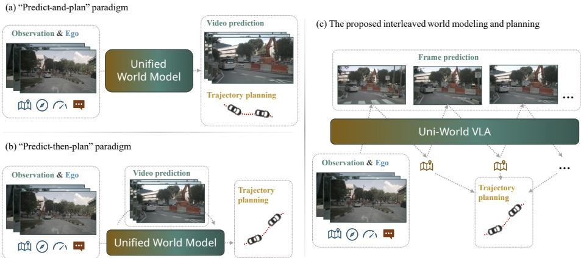
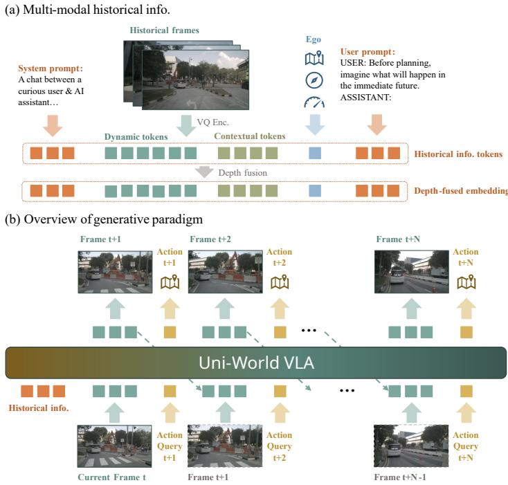
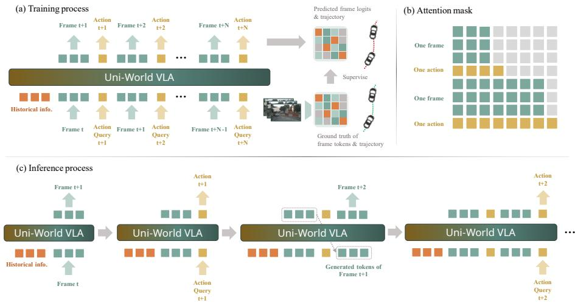
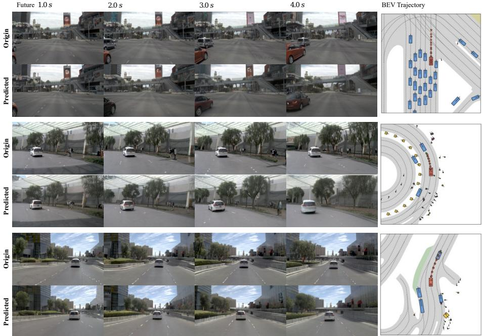
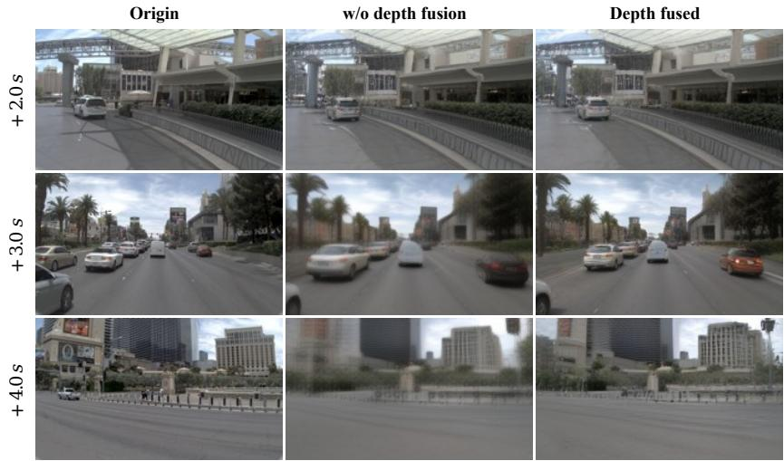
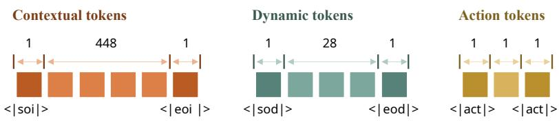
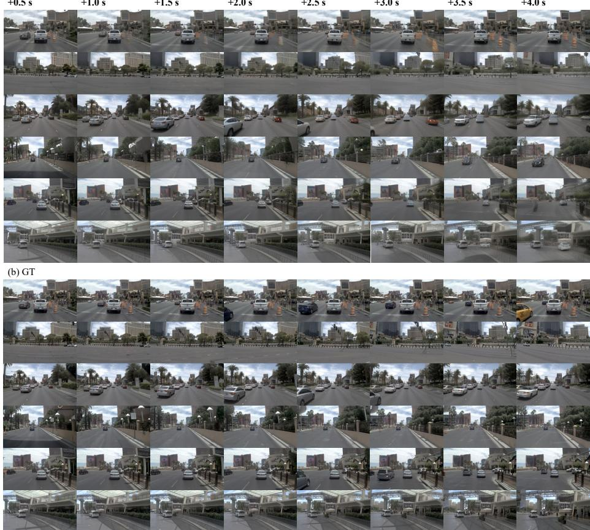
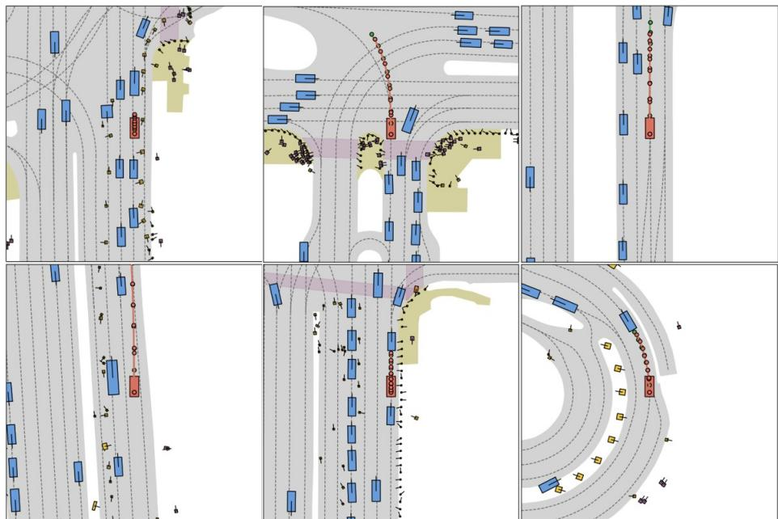

# Uni-World VLA: Interleaved World Modeling and Planning for Autonomous Driving

Qiqi Liu1,2,3§,∗, Huan Xu3∗, Jingyu Li1,2,3§, Bin Sun3†, Zhihui Hao3†, Dangen She3, Xiatian Zhu4, and Li Zhang1,2‡

1 Fudan University Shanghai Innovation Institute 3 Li Auto Inc. 4 University of Surrey

§ github.com/LogosRoboticsGroup/UniWorldVLA

Abstract. Autonomous driving requires reasoning about how the environment evolves and planning actions accordingly. Existing world-modelbased approaches typically predict future scenes first and plan afterwards, resulting in open-loop imagination that may drift from the actual decision process. In this paper, we present Uni-World VLA, a unified vision-language-action (VLA) model that tightly interleaves future frame prediction and trajectory planning. Instead of generating a full world rollout before planning, our model alternates between predicting future frames and ego actions step by step, allowing planning decisions to be continuously conditioned on the imagined future observations. This interleaved generation forms a closed-loop interaction between world modeling and control, enabling more adaptive decisionmaking in dynamic trafic scenarios. In addition, we incorporate monocular depth information into frames to provide stronger geometric cues for world modeling, improving long-horizon scene prediction. Experiments on the NAVSIM benchmark show that our approach achieves competitive closed-loop planning performance while producing high-fidelity future frame predictions. These results demonstrate that tightly coupling world prediction and planning is a promising direction for scalable VLA driving systems.

Keywords: Autonomous driving · World modeling and planning · Depth fusion

## 1 Introduction

With the rapid advancement of multi-modal large models (MLLM) and generative models, Vision-Language-Action (VLA) models [20, 25, 65] and world models [14, 61] have attracted increasing attention in autonomous driving. Unlike conventional end-to-end approaches [33, 58, 59] that primarily rely on imitation learning, VLA-based methods [30, 65] leverage rich semantic understanding to predict the ego vehicle’s future trajectory, while driving world models [7,64] forecast future scene evolution based on learned physical dynamics. Although these approaches have achieved impressive performance, they are typically developed in isolation, addressing trajectory prediction and environment modeling separately, and thus fail to efectively share and integrate complementary knowledge between the two paradigms.

  
Fig. 1: Diferent generative paradigms of unified world models for autonomous driving. (a) Unified world models perform video generation and planning as separate tasks; (b) World-conditioned trajectory prediction, where future trajectories are predicted conditioned on the generated world states; (c) Interleaved world modeling and planning (ours). Visual tokens and action queries are generated alternately, forming a closedloop interaction that respects the temporal causality of driving.

To enable knowledge sharing between world modeling and trajectory prediction, prior works [1, 26, 61, 62] have combined both objectives in a unified framework. Based on the temporal ordering of the tasks, these methods fall into two paradigms: parallel “predict-and-plan” and sequential “predict-then-plan”. In the “predict-and-plan” paradigm [1,7] (Fig. 1 (a)), world modeling and planning are integrated within a single autoregressive architecture. Despite joint training, the tasks remain functionally decoupled: world modeling focuses on high-fidelity next-frame prediction conditioned on actions, while trajectory planning maps visual observations to control outputs without explicitly leveraging the learned dynamics. In contrast, the “predict-then-plan” paradigm [26, 61, 62] (Fig. 1 (b)) first predicts future scenes and then generates the ego vehicle’s trajectory conditioned on them. A key limitation is the implicit assumption that the environment remains stationary, whereas real-world trafic is inherently non-stationary, with continuous interactions between the ego agent and surrounding vehicles.

Regardless of whether the “predict-and-plan” or “predict-then-plan” paradigm is adopted, both sufer from a common limitation. In complex urban scenarios (e.g., unprotected left turns or merging), trafic conditions evolve rapidly. If a world model generates a multi-second rollout (e.g., 4 seconds) conditioned on an initial intent, it efectively produces a “frozen hallucination” of the future. This rollout assumes that the environment will react to a fixed plan that is not updated by the observations generated during prediction. Consequently, when the planner relies on later portions of the rollout (e.g., the third second), the visual evidence may already be outdated, as it does not reflect subtle ego-vehicle adjustments made earlier in the horizon (e.g., slight braking or steering at 0.5 seconds). To address this limitation, we propose an interactive prediction-planning framework that tightly couples world modeling and planning within a single model, shown in Fig. 1 (c). Instead of separating prediction and planning, our approach performs future scene prediction and trajectory planning in an interleaved manner. At each step, the model first predicts the future world state conditioned on historical observations and past trajectories, and then plans the ego-vehicle action based on the predicted state. This step-wise interaction enables the planner to continuously update its decisions according to the evolving environment, forming an interleaved prediction-planning process.

Specifically, we design a unified autoregressive architecture that alternates between generating visual tokens and action tokens. Visual observations are first compressed into a discrete token space for eficient sequence modeling, and an MLLM [52] autoregressively predicts an interleaved sequence of future scene and ego action tokens. In this formulation, scene tokens represent the evolving world state and action tokens correspond to the ego-vehicle trajectory. Such alternating generation establishes an interaction between world modeling and planning, allowing decisions to be continuously refined based on newly predicted observations and reducing error accumulation over long horizons. To further improve temporal sensitivity, we follow [62] to introduce a bi-directional intra-frame attention mechanism that enables tokens within the same frame to capture rich spatial dependencies while preserving causal masking across time. In addition, to provide complementary geometric cues, monocular depth maps are estimated using Depth Anything 3 [34], and the resulting depth features are fused with historical frames through a cross-attention mechanism, which improves the quality of future frame prediction.

Our contributions are summarized as follows: (i) We introduce interleaved modeling and planning, a step-wise feedback paradigm that tightly couples world modeling and trajectory planning. To realize this idea, we develop a unified autoregressive architecture that alternately generates future visual tokens and action tokens, forming an interaction between prediction and control and enabling planning decisions to be continuously refined based on newly predicted observations. (ii) We further introduce a depth integration strategy that incorporates monocular depth maps and fuses the geometric features with historical frames through cross-attention, providing complementary spatial cues for future frame prediction. (iii) We evaluate the proposed approach on the highfidelity driving benchmark NAVSIM. Extensive experiments show that the interleaved generation mechanism improves both planning performance and video prediction quality.

## 2 Related Work

VLA models for autonomous driving. Fully autonomous driving remains a central goal in AI and robotics [8, 16]. Early Vision-Action models map raw sensory inputs to control commands or trajectory waypoints via imitation or reinforcement learning [8,24,32], but often struggle with high-level reasoning, interpretability, and flexible decision-making [15, 17]. VLA models integrate scene understanding, language-grounded reasoning, and actionable outputs [16, 23]. Language-mediated approaches reformulate planning as language generation: DriveGPT4 [54], GPT-Driver [36], DriveMLM [47], DriveLM [43], and AutoVLA [65] explore chain-of-thought reasoning, structured tokenization, masked language modeling, graph-based visual QA, and unified reasoning-action frameworks, respectively. Dual-system VLAs decouple high-level deliberation from trajectory planning, e.g., DriveVLM [44], DifVLA [19], and VLP [38]. Most prior methods, however, operate open-loop and lack iterative modeling of future states. Our approach addresses this by interleaving predicted future frames and actions within a unified prompt, enabling closed-loop visual-action feedback that improves planning robustness.

3D scene reconstruction. Accurate 3D scene representation is critical for autonomous driving [8, 12], providing geometric priors for tasks like object detection, path planning, and collision avoidance [5, 63]. Early approaches rely on geometric pipelines such as structure-from-motion [39, 41] and multi-view stereo [40, 42]. Neural rendering methods, including implicit radiance fields [37, 51] and explicit 3D Gaussian Splatting [18,22], enable high-quality, scalable scene reconstruction. Feed-forward geometry estimation directly predicts scene structure [10], while large-scale depth foundation models—Depth Anything 3 [34], MapAnything [21], VGGT [46], and $\pi ^ { 3 }$ [49]—provide generalizable priors, joint depth-structure prediction, and robust multi-view inference. Together, these advances equip autonomous driving systems with long-horizon spatial understanding [27].

World models for autonomous driving. World models learn internal predictive representations to simulate future states from actions [27], relying on robust 3D and spatiotemporal scene cues [5,13,57]. Recent methods move beyond visual forecasting toward interactive, policy-aware simulation: PWM [62] jointly predicts states and actions; UniDrive-WM [53] couples scene understanding, planning, and generative modeling; ImagiDrive [26] integrates VLM-driven imagination; SGDrive [25] adds hierarchical scene-to-goal reasoning; Infinite-World [50] scales to thousand-frame horizons via hierarchical memory; and ResWorld [60] models dynamic agents with temporal residuals. Most prior methods rely solely on RGB inputs, limiting geometric reasoning; we introduce depth-informed conditioning in historical visual prompts to enhance spatial awareness without explicit depth modeling in future-frame generation.

  
Fig. 2: Overview of the paradigm of alternative generation in Uni-World VLA. (a) The construction of multi-model historical information; (b) The interleaved frameaction generative paradigm.

## 3 Methods

Overview. Fig. 2 illustrates the overall paradigm of our framework for futureframe and trajectory prediction. Given past ego-centric frames and auxiliary state information, visual observations are first encoded into discrete tokens using a MagVIT-v2 [56]. Depth cues estimated by Depth Anything 3 [34] are then fused with historical visual tokens via cross attention to provide complementary geometric information. These historical inputs representing ego-state and vision, are fed into Show-o [52], a Phi-1.5-based [31] multimodal LLM. The LLM then autoregressively generates an interleaved sequence of future frame and action tokens, which are finally decoded into RGB frames by the MagVIT-v2 decoder and trajectories by an MLP.

Inputs and tokenization. Let $\big \{ I _ { t - M } , \dots , I _ { t - 1 } \big \}$ denote the M historical egocentric image frames (t denotes the current time, $I \in \mathbb { R } ^ { H \times W \times 3 }$ , where H and W are the image height and width). To capture both environmental context and temporal dynamics, we partition the historical video stream in NAVSIM [4, 11] into two complementary modalities. Contextual tokens correspond to the initial high-resolution frames that provide detailed scene semantics and structural information, while dynamic tokens are sampled at 10 Hz and at lower resolution to capture fine-grained motion cues and short-term temporal variations.

In addition to image data, we collect auxiliary ego status at time t, which includes the velocity, acceleration, and the high-level driving command of the ego vehicle. Each raw image I is encoded into a sequence of discrete visual tokens

$$
c , d = \operatorname { E n c o d e r _ { M a g V I T } } ( I )\tag{1}
$$

using the $\mathrm { M a g V I T - v 2 . }$ where c denotes the contextual tokens and d denotes the dynamic tokens. This tokenization produces a compact symbolic representation that is convenient for autoregressive sequence modeling by the LLM backbone. Moreover, the system and user text prompts are also encoded, enabling the LLM to better comprehend the scenario and the underlying task. As shown in Fig. 2(b), the model input is constructed as a short chat-style context: [System Prompt | Dynamic & Contextual Tokens | User Prompt | Ego Tokens], wher the System Prompt defines the assistant’s general behavior, encouraging helpful and detailed responses within a conversational setting and the User Prompt specifies the task objective, explicitly requiring the model to anticipate the immediate future before planning. Ego tokens concatenate ego velocity, ego acceleration, and the high-level driving command at time t, which represents the current dynamic state and navigation intent. The LLM consumes the mixed token stream and performs autoregressive generation in an interleaved manner. More details of the unified tokenizer can be found in Appendix A.

Interleaved frame-action generation. In our implementation, we generate up to $N = 8$ future frames. With a temporal interval of 0.5 seconds per frame, this corresponds to a 4.0-second prediction horizon. Unlike purely sequential video prediction, we adopt an alternative generative paradigm with step-wise interaction between visual prediction and action querying. After generating each future frame $t + k .$ , an action query corresponding to the same timestamp is fed back to the LLM to infer the predicted ego position at that time step. The predicted state is then incorporated into the subsequent generation process, forming an interleaved prediction loop (as shown in Fig. 2 (b)):

$$
\hat { d } _ { t + k } \sim p _ { \theta } ( d _ { t + k } \mid \hat { d } _ { \leq t + k - 1 } , \hat { a } _ { \leq t + k - 1 } ) ,\tag{2}
$$

$$
\hat { a } _ { t + k } \sim p _ { \theta } ( a _ { t + k } \mid \hat { d } _ { \leq t + k } , \hat { a } _ { \leq t + k - 1 } ) ,\tag{3}
$$

where $\hat { d }$ and \protec \hat a respectively represent the dynamic tokens and the action tokens. Decoding and output. Each predicted discrete token sequence $\hat { d } _ { t + k }$ is decoded by the MagVIT-v2 decoder into the corresponding RGB frame, conditioned on the contextual token $c _ { t + 2 \lfloor k / 2 \rfloor }$ that provides visual guidance at the per-second scale,

$$
\hat { I } _ { t + k } = \mathrm { D e c o d e r } _ { \mathrm { M a g V I T } } ( \hat { d } _ { t + k } ; c _ { t + 2 \lfloor k / 2 \rfloor } ) .\tag{4}
$$

The final visual output thus forms a sequence of reconstructed future frames $\{ \hat { I } _ { t + 1 } , \dots , \hat { I } _ { t + N } \}$ sampled at 0.5-second intervals. In parallel, the predicted action tokens are passed through an MLP head to obtain the corresponding ego positions $\hat { a } _ { t + 1 } , \hat { a } _ { t + 2 } , \dots , \hat { a } _ { t + N }$ , which together constitute the planned trajectory over a 4.0-second horizon.

Training objectives. The model is trained with joint supervision on both future visual token generation and trajectory prediction. During the training phase, future frames and action queries are arranged in an interleaved order as shown in the Fig. 3 (a), and are processed together by the LLM for both inference and supervision.

For visual prediction, the model outputs logits over the discrete MagVITv2 [56] vocabulary for each future frame token. [62] points out, if simply supervise the logits with cross-entropy loss, a significant proportion of the frame tokens tend to keep unchanged across adjacent frames. To alleviate this issue, wo adopt the Dynamic Focal Loss [62] that emphasize temporally varying image regions through spatial weighting. Specifically, we define the dynamic weight $\omega ( d _ { t + k } ^ { i } , d _ { t + k - 1 } ^ { i } )$ as:

$$
\omega ( d _ { t + k } ^ { i } , d _ { t + k - 1 } ^ { i } ) = \alpha \mathbb { I } ( d _ { t + k } ^ { i } \neq d _ { t + k - 1 } ^ { i } ) + \beta \mathbb { I } ( d _ { t + k } ^ { i } = d _ { t + k - 1 } ^ { i } ) , \quad \alpha > \beta\tag{5}
$$

where $\mathbb { I } ( \cdot )$ is the indicator function and $\alpha , \beta$ are hyperparameters that control the relative importance of dynamic versus static token predictions. The overall dynamic-weighted cross-entropy is defined as:

$$
\mathcal { L } _ { \mathrm { d y n } } = - \frac { 1 } { N } \sum _ { k = 1 } ^ { N } \sum _ { i = 1 } ^ { L } \omega ( d _ { t + k } ^ { i } , d _ { t + k - 1 } ^ { i } ) \log p _ { \theta } ( d _ { t + k } ^ { i } \mid \hat { d } _ { < t + k } ^ { i } , \hat { a } _ { < t + k } ^ { i } ) ,\tag{6}
$$

where L denotes the total number of predicted visual tokens within one frame. For trajectory prediction, the hidden states corresponding to action tokens are fed into an MLP head to regress the ego positions at each future step. We supervise the predicted trajectory $\hat { a } _ { t + 1 : t + N }$ using an L1 loss:

$$
\mathcal { L } _ { \mathrm { t r a j } } = \frac { 1 } { N } \sum _ { k = 1 } ^ { N } \left. \hat { a } _ { t + k } - a _ { t + k } \right. _ { 1 } .\tag{7}
$$

The final training objective is a weighted sum of the two terms:

$$
\begin{array} { r } { \mathcal { L } = \lambda _ { 1 } \mathcal { L } _ { \mathrm { d y n } } + \lambda _ { 2 } \mathcal { L } _ { \mathrm { t r a j } } , } \end{array}\tag{8}
$$

where $\lambda _ { 1 } , \lambda _ { 2 }$ balance visual generation and trajectory supervision.

The corresponding attention mask is illustrated in Fig. 3 (b). During generation of each future frame, newly generated visual tokens can attend to all previous tokens as well as all tokens within the current frame. This design allows the model to capture both temporal dependencies across past frames and spatial dependencies within a frame, facilitating coherent prediction of adjacent visual regions. Historical frames are processed with the same attention mask construction, ensuring consistent intra-frame and inter-frame context throughout the training sequence.

Inference. At inference, future frames and actions are generated step by step in an autoregressive manner (Fig. 3 (c)). Starting from the current frame $I _ { t } ,$ , the model first generates the visual tokens for t+1 , which are then decoded into the corresponding RGB frame. An action query for t+1 is subsequently fed to the LLM to predict the ego action at the same timestamp. The generated visual tokens for t+1 are appended to the context to condition the generation of $t + 2 ,$ and this process repeats until all N future frames and actions are produced. The attention masking scheme mirrors training. To improve eficiency, we leverage a KV-cache: the key and value representations from previous steps are stored and reused, so that the LLM only computes attention for newly generated tokens instead of reprocessing the entire sequence. This interleaved generation loop allows the model to iteratively reason about scene dynamics and ego-motion throughout the prediction horizon.

  
Fig. 3: Schematic illustration of training and inference process. (a) Interleaved sequence for joint video generation and trajectory supervision. (b) Causal attention mask. (c) Autoregressive interleaved inference with KV-cache reuse.

Depth integration. We adopt Depth Anything 3 [34], a state-of-the-art monocular depth estimation model, to extract depth maps from input images. The depth map extraction process is expressed as:

$$
D = { \mathrm { D e p t h A n y t h i n g 3 } } ( I ) ,\tag{9}
$$

where $I \in \mathbb { R } ^ { H \times W \times 3 }$ represents the input image and $D \in \mathbb { R } ^ { H \times W }$ is the extracted depth map.

To match input images, the extracted depth map D is resized into two diferent resolutions: 256×448 and 128×224. The two resized depth maps are then fed into two improved VIT (base on MagVIT-v2 [56]) modules, which are named context-depth-encoder (CDE) and dynamic-depth-encoder (DDE) correspondingly and serve as depth encoders.

The input image I is first subjected to vector quantization to generate image feature tokens, which are further divided into context tokens and dynamic tokens corresponding to the two resolutions of the depth map. These context tokens and dynamic tokens are then embedded separately to generate context token embeddings and dynamic token embeddings (as shown in Fig. 2 (a)), which serve as queries in the cross-attention mechanism. Specifically, the context token embeddings are used as queries to fuse with depth feature embeddings output by the CDE, and the dynamic token embeddings are used as queries to fuse with depth feature embeddings output by the DDE:

$$
E _ { q , c } = \mathrm { E m b e d } ( c ) , E _ { q , d } = \mathrm { E m b e d } ( d ) ,\tag{10}
$$

where $E _ { q , c } \in \mathbb { R } ^ { N _ { q , c } \times d }$ denotes the context token embeddings (embedded results of context tokens), and $E _ { q , d } \in \mathbb { R } ^ { N _ { q , d } \times d }$ denotes the dynamic token embeddings (embedded results of dynamic tokens). The visual token embeddings $E _ { q , c }$ and $E _ { q , d }$ act as queries and are fused with the corresponding keys and values from CDE and DDE, respectively. The cross-attention (CA) fusion processes are formulated as:

$$
E _ { \mathrm { f u s e d } , c } = \mathrm { C A } ( E _ { q , c } , D _ { k , c } , D _ { v , c } ) , E _ { \mathrm { f u s e d } , d } = \mathrm { C A } ( E _ { q , d } , D _ { k , d } , D _ { v , d } ) .\tag{11}
$$

In the above formulas, $D _ { k , c } \ ( \mathrm { k e y } )$ and $D _ { v , c }$ (value) are generated by the CDE, corresponding to the context query $E _ { q , c } ; D _ { k , d }$ and $D _ { v , d }$ are generated by the DDE, corresponding to the dynamic query $E _ { q , d }$ . Then, the fused feature embeddings $E _ { \mathrm { f u s e d } , c }$ and $E _ { \mathrm { f u s e d } , d }$ are fed into the VLM model.

## 4 Experiments

## 4.1 Experimental Setup

Dataset. We conduct all experiments on the NAVSIM [4,11] driving dataset, a high-fidelity simulated benchmark providing ego-centric RGB sequences, vehicle state information, and structured annotations for planning evaluation. We follow the oficial train/validation/test split and adopt a fixed temporal interval of 0.5 s between frames. Unless otherwise specified, the model predicts $N = 8$ future frames (4.0 seconds horizon). For the ablation study, some variants require 10 Hz sampled trajectories, while NAVSIM only provides 2 Hz logs. Therefore, the full 10 Hz trajectories are supplemented from nuPlan [3].

Evaluation metrics. We evaluate our method using both planning-oriented and video generation metrics. Planning performance is measured by the Predictive Driver Model Score (PDMS) [11], which includes five sub-metrics: no-atfault collisions (NC), drivable area compliance (DAC), time-to-collision (TTC), comfort (Comf.), and ego progress (EP). Video prediction quality is evaluated using Fréchet Video Distance (FVD) [45], which measures distribution-level realism of generated videos.

Implementation details. Our model is initialized from Policy World Model (PWM) [62], which itself is fine-tuned from Show-o [52]. For visual tokenization, we adopt the compressive MagVIT-v2 [56] tokenizer pretrained under the dualbranch framework of PWM. The tokenizer consists of two branches with separate codebooks of size 8192 each. The frozen high-resolution branch processes input images of resolution 256 × 448 and produces 448 contextual tokens per frame. The pretrained low-resolution branch processes images of resolution 128 × 224 and generates 28 dynamic tokens per frame. In addition, the weights of the depth encoders are initialized using the weights of MagVIT-v2. For Uni-World VLA, we fine-tune the model on NAVSIM for 30 epochs, selecting the best checkpoint based on PDMS (achieved at epoch 16).

The deep fusion training adopted in this paper follows a two-stage progressive paradigm, which is designed to balance the stability of feature extraction and the adaptability of cross-module fusion, ensuring the model converges stably and achieves efective feature fusion.

We use AdamW as the optimizer and train the model on 32 NVIDIA H20 GPUs. Only the front-view camera is used as input, with a training batch size of 3. The model takes 2 seconds of historical observations to autoregressively predict 8 future frames and corresponding waypoints over a 4-second horizon, where the learning rate follows a cosine annealing schedule. The specific training process and key parameter configurations are detailed as follows.

## Stage 1: Pre-training of Deep Feature Extraction Module

The CDE and DDE modules are trained in this stage. We adopt an actionfree video prediction setup to extract depth information; specifically, we only generate future frames at 10 Hz within 1 second for supervision. To preserve the representation capability of the pre-trained foundation model, its weights are completely frozen, while all other trainable parameters are unfrozen for targeted optimization. The training is conducted with a total of 5 epochs, and the learning rate is set to $3 \times 1 0 ^ { - 5 }$ to ensure stable parameter update and initial convergence of the module.

## Stage 2: Multi-modal Joint Training

Building upon the first stage, the second stage focuses on joint optimization. The pre-trained CDE and DDE modules are frozen to maintain their efective deep feature extraction capability, while the fusion module and the foundation model are unfrozen to promote their collaborative learning. We adopt Scheme E (Sec. 4.3) to supervise future frames and trajectories. This stage is trained for 16 epochs, and the learning rate is set to $2 \times 1 0 ^ { - 5 }$ , aiming to realize accurate coupling of features and full convergence of the overall model.

## 4.2 Main Results

Table 1 reports closed-loop planning performance on the NAVSIM test split. Uni-World VLA achieves the highest PDMS (89.4), indicating a strong balance of safety, comfort and forward progress, and attains the best EP (83.2) and TTC (96.4), suggesting improved eficiency of forward progress and execution safety. ResWorld [60] records marginally higher NC but uses multi-sensor input (camera + LiDAR); its aggregate PDMS (89.0) remains slightly below ours, highlighting the efectiveness of our single-view camera-only design. Other baselines (e.g.,

Table 1: Comparison with state-of-the-art methods on the NAVSIM test split. PDMS and its sub-metrics (NC, DAC, EP, TTC, and Comfort; see Sec. 4.1) evaluate closed-loop driving performance. Input modalities include multi-view cameras (C), single-view camera (SC), and multi-view cameras with LiDAR (C&L). Best results are shown in bold.
<table><tr><td>Method</td><td>| Input |</td><td>|NC↑</td><td>DAC ↑</td><td>EP↑</td><td>TTC ↑</td><td>Comf.↑</td><td>PDMS↑</td></tr><tr><td colspan="8">Traditional End-to-End Methods</td></tr><tr><td>VADv2-ν8192 [6]</td><td>C</td><td>97.2</td><td>89.1</td><td>76.0</td><td>91.6</td><td>100.0</td><td>80.9</td></tr><tr><td>UniAD [17]</td><td>C</td><td>97.8</td><td>91.9</td><td>78.8</td><td>92.9</td><td>100.0</td><td>83.4</td></tr><tr><td>TransFuser [9]</td><td>C&amp;L</td><td>97.7</td><td>92.8</td><td>79.2</td><td>92.8</td><td>100.0</td><td>84.0</td></tr><tr><td>ReCogDrive-IL [30]</td><td>SC</td><td>98.1</td><td>94.7</td><td>80.9</td><td>94.2</td><td>100.0</td><td>86.5</td></tr><tr><td>DiffusionDrive [33]</td><td>C&amp;L</td><td>98.2</td><td>96.2</td><td>82.2</td><td>94.7</td><td>100.0</td><td>88.1</td></tr><tr><td colspan="8">World Model Methods</td></tr><tr><td>DrivingGPT [7]</td><td>SC</td><td>98.9</td><td>90.7</td><td>79.7</td><td>94.9</td><td>95.6</td><td>82.4</td></tr><tr><td>Epona [61]</td><td>SC</td><td>97.9</td><td>95.1</td><td>80.4</td><td>93.8</td><td>99.9</td><td>86.2</td></tr><tr><td>ImagiDrive-A [26]</td><td>SC</td><td>98.1</td><td>96.2</td><td>80.1</td><td>94.4</td><td>100.0</td><td>86.9</td></tr><tr><td>DriveVLA-W0 [28]</td><td>SC</td><td>98.4</td><td>95.3</td><td>80.9</td><td>95.4</td><td>100.0</td><td>87.2</td></tr><tr><td>SGDrive-IL [25]</td><td>SC</td><td>98.6</td><td>95.1</td><td>81.2</td><td>95.4</td><td>100.0</td><td>87.4</td></tr><tr><td>PWM [62]</td><td>SC</td><td>98.6</td><td>95.9</td><td>81.8</td><td>95.4</td><td>100.0</td><td>88.1</td></tr><tr><td>WoTE [29]</td><td>C&amp;L</td><td>98.5</td><td>96.8</td><td>81.9</td><td>94.9</td><td>99.9</td><td>88.3</td></tr><tr><td>ResWorld [60]</td><td>C&amp;L</td><td>98.9</td><td>96.5</td><td>83.1</td><td>95.6</td><td>100.0</td><td>89.0</td></tr><tr><td>Uni-World VLA (Ours)</td><td>SC</td><td>98.7</td><td>96.7</td><td>83.2</td><td>96.1</td><td>100.0</td><td>89.4</td></tr></table>

DrivingDPT [7], WoTE [29]) perform well on individual metrics but do not match our combined PDMS.

Table 2: Comparison of video generation quality across driving world models. FVD 4.1 measures the realism of generated future video sequences. We additionally report the maximum prediction horizon, frame rate, dataset, and camera view used by each method.
<table><tr><td>Metric &amp; Settings</td><td>WoVoGen [35]</td><td>DriveDreamer [48]</td><td>SVD [2,7]</td><td>DrivingGPT [7]</td><td>GenAD [55]</td><td>Ours</td></tr><tr><td>FVD↓</td><td>417.7</td><td>340.8</td><td>227.5</td><td>142.6</td><td>184.0</td><td>141.8</td></tr><tr><td>Max Duration/Fps</td><td>2.5 s/2 Hz</td><td>4s/2 Hz</td><td>4s/2 Hz</td><td>4s/2Hz</td><td>4s/2 Hz</td><td>4s/2 Hz</td></tr><tr><td>Dataset</td><td>nuScenes</td><td>nuScenes</td><td>NAVSIM</td><td>NAVSIM</td><td>OpenDV</td><td>NAVSIM</td></tr><tr><td>View</td><td>Multi</td><td>Multi</td><td>Front</td><td>Front</td><td>Front</td><td>Front</td></tr></table>

Table 2 compares 2-Hz short-horizon video generation quality on NAVSIM and related benchmarks using FVD. Our method achieves a competitive FVD of 141.8 under the 4 s/2 Hz NAVSIM protocol, outperforming SVD [2,7], GenAD [55], DrivingGPT [7], and several prior generative baselines. More importantly, when considered together with the closed-loop results in Table 1, our model delivers substantially stronger planning performance (PDMS 89.4 vs. 82.4 of Driving-

  
Fig. 4: Visualization of predicted frames and BEV trajectories

GPT, Table 1). This demonstrates that Uni-World VLA maintains competitive visual generation quality while achieving superior planning reliability and safety.

Overall, Uni-World VLA maintains high comfort and drivable-area compliance while enhancing forward progress and TTC-based safety through the proposed interleaved generative planning scheme. Our approach also exhibits stronger holistic competitiveness by efectively balancing video fidelity and closedloop planning performance.

Fig. 4 provides qualitative comparisons of predicted future frames and corresponding BEV trajectories. Our model produces temporally consistent visual dynamics while generating smooth and safe planning trajectories that respect lane geometry and surrounding agents. Compared to prior generative baselines, the predicted motions are more stable and better aligned with feasible driving behaviors, further supporting the quantitative gains in PDMS and TTC.

## 4.3 Ablation Study

Efect of pretrain, future frames and depth. We ablate three design choices (Table 3): using a pretrained checkpoint, generating future frames to inform trajectory planning, and incorporating image depth as an additional conditioning signal.

Pretraining provides the largest improvement, increasing PDMS from 82.1 to 88.2 its subscores. Enabling future-frame generation further improves performance, raising PDMS from 88.2 to 89.2 with consistent gains in DAC, EP, and TTC. This suggests explicitly modeling future world states provides additional context for trajectory planning. Adding depth information further boosts performance: DAC increases to 96.7, EP reaches 83.2 and video quality improves, with FVD dropping from 164.2 to 141.8. Overall, combining pretraining, futureframe modeling, and depth conditioning yields the best results, showing these components complement each other for world modeling and planning.

Table 3: Ablation study on the efects of pretraining, future-frame modeling, and depth conditioning. NC, DAC, EP, TTC, Comfort, and PDMS measure planning quality, while FVD evaluates the quality of generated future frames.
<table><tr><td>Pretrain</td><td>Future Frames</td><td>Depth</td><td>NC↑</td><td>DAC ↑</td><td>EP↑</td><td>TTC ↑</td><td>Comf. ↑</td><td>PDMS ↑</td><td>FVD↓</td></tr><tr><td>X</td><td>X</td><td>X</td><td>97.1</td><td>91.4</td><td>77.4</td><td>91.5</td><td>100.0</td><td>82.1</td><td>-</td></tr><tr><td>√</td><td>X</td><td>X</td><td>98.8</td><td>95.8</td><td>82.0</td><td>95.8</td><td>100.0</td><td>88.2</td><td></td></tr><tr><td>√</td><td>√</td><td>×</td><td>98.8</td><td>96.5</td><td>82.9</td><td>96.4</td><td>100.0</td><td>89.2</td><td>164.2</td></tr><tr><td>√</td><td>√</td><td>√</td><td>98.7</td><td>96.7</td><td>83.2</td><td>96.1</td><td>100.0</td><td>89.4</td><td>141.8</td></tr></table>

  
Fig. 5: Comparison of predicted future frames with and without depth fusion

Fig. 5 compares future-frame predictions with and without depth fusion. At 2.0 s, both reconstruct the scene reasonably well, but by 3.0 s, the model without depth shows blurred structures in fast-driving scenarios. At 4.0 s, particularly in turns, depth fusion preserves clearer spatial layouts and geometric cues, keeping predictions smooth and coherent despite the coarse 2-Hz sampling.

Efect of diferent alternative generation schemes. Table 4 compares five alternative frame-action generation schemes without depth integration under the same NAVSIM evaluation protocol. The detailed token orders are illustrated by the formulas below.

A: [Prompt]→[0.1s F]→[0.5s A]→[0.2s F]→[1.0s A]→...→[0.8s F]→[4.0s A]→[0.9s F]→[1.0s F]   
B: [Prompt]→[0.1s F]→[0.1s A]→[0.2s F]→[0.2s A]→...→[1.0s F]→[1.0s,1.1s,...,3.9s,4.0s A]   
C: [Prompt]→[0.1s F]→[0.1s A]→[0.2s F]→[0.2s A]→...→[1.0s F]→[1.0s,1.5s,2.0s,...,4.0s A]   
D: [Prompt]→[0.1s F]→[0.1s 0.2s ... 1.0s A]→[0.2s F]→[0.2s 0.3s ... 1.1s A]→...→[0.9s F]→   
[0.9s 1.0s ... 1.8s A]→[1.0s F]→[0.1s 0.2s ... 1.9s 2.0s 2.5s ... 4.0s A]   
E: [Prompt]→[0.5s F]→[0.5s A]→[1.0s F]→[1.0s A]→...→[4.0s F]→[4.0s A]

Table 4: Ablation over five alternative generation schemes (without depth fusion).
<table><tr><td>Scheme</td><td>|NC ↑ DAC ↑ EP ↑ TTC ↑ Comf. ↑|PDMS ↑</td><td></td><td></td><td></td><td></td></tr><tr><td>A-cross-frequency alternation</td><td>98.8 96.4</td><td>81.2</td><td>96.0</td><td>100.0</td><td>88.3</td></tr><tr><td>B-high-frequency actions-frames</td><td>98.7</td><td>95.1 77.3</td><td>96.4</td><td>100.0</td><td>86.1</td></tr><tr><td>C-hybrid dense-then-coarse</td><td>98.7 95.8</td><td>80.6</td><td>96.0</td><td>100.0</td><td>87.8</td></tr><tr><td>D-sliding 1s action windows</td><td>98.6 94.5</td><td>78.4</td><td>95.2</td><td>99.7</td><td>85.7</td></tr><tr><td>E-2Hz aligned interleaving(Ours)</td><td>98.8</td><td>96.5 82.9</td><td>96.4</td><td>100.0</td><td>89.2</td></tr></table>

Scheme A introduces a simple cross-frequency interleaving between frames and actions. Despite the frequency mismatch, it slightly improves over the PWM baseline (PDMS 88.3), suggesting that early action conditioning on partial visual context can be beneficial. Scheme B enforces strict 10 Hz frame-action alternation and dense action prediction. This leads to a noticeable performance drop (PDMS 86.1), likely due to the mismatch between dense training supervision and the 2 Hz evaluation protocol. Scheme C adopts a hybrid strategy with dense alternation in the first second followed by coarse 2 Hz action generation. This partially mitigates the mismatch and improves performance over Scheme B (PDMS 87.8). Scheme D predicts sliding 1 s action windows for each frame. The overlapping horizons introduce conflicting supervision signals, resulting in the lowest PDMS (85.7). Scheme E aligns frame and action generation directly at the 2 Hz evaluation frequency with strict F→A (frame to action) alternation. This configuration achieves the best overall performance (PDMS 89.2), indicating that matching generation frequency with the planning/evaluation protocol improves temporal consistency and planning quality.

Efect of historical visual information. Table 5 studies the efect of historical visual information. Using both contextual and dynamic tokens over a 2.0 s history yields the best overall performance, achieving the highest PDMS (89.2), EP (82.9), and the lowest FVD (164.2), indicating stronger closed-loop planning and generation quality. Reducing the history to 1.0 s slightly improves NC and TTC but degrades PDMS and FVD, suggesting a trade-of between conservative safety margins and overall performance. Using only contextual tokens maintains competitive PDMS and the best DAC, highlighting the importance of high-resolution scene structure, whereas using only dynamic tokens significantly degrades both planning and generation metrics. Overall, contextual tokens provide spatial semantics, dynamic tokens provide motion cues, and their combination over a longer history ofers the best balance.

Table 5: Efect of historical visual information on planning (without depth fusion).
<table><tr><td>Historical Visual Info.</td><td>|NC ↑DAC ↑EP ↑TTC ↑Comf. ↑|PDMS ↑FVD ↓</td><td></td><td></td><td></td><td></td></tr><tr><td>2.0s Context+Dynamic (Ours)</td><td>98.8 96.5</td><td>82.9 96.4</td><td>100.0</td><td>89.2</td><td>164.2</td></tr><tr><td>1.0s Context+Dynamic</td><td>99.0 96.4</td><td>81.4 96.7</td><td>100.0</td><td>88.8</td><td>170.7</td></tr><tr><td>Context Only</td><td>98.6 96.8</td><td>82.3 96.2</td><td>100.0</td><td>89.1</td><td>165.5</td></tr><tr><td>Dynamic Only</td><td>97.4 90.8</td><td>76.2 92.3</td><td>100.0</td><td>81.7</td><td>203.6</td></tr></table>

## 5 Conclusion

We have introduced Uni-World VLA, a unified VLA model that interleaves world prediction and trajectory planning. In this model, a unified autoregressive architecture alternates between future frame prediction and trajectory planning, creating a tight feedback loop between predicted environment evolution and control. We also proposed enhancements to bolster this framework: the incorporation of monocular depth features via cross-attention. In experiments on the NAVSIM high-fidelity simulator, Uni-World VLA significantly outperforms prior state-of-the-art methods. It attains the highest overall driving score (PDMS) and improves both the time-to-collision (TTC) safety metric and ego progress (EP), while maintaining competitive video prediction quality (FVD) compared to baseline world models. These results demonstrate that the interleaved predictionand-planning strategy with depth fusion enables more robust, context-aware decision-making in complex driving scenarios.

## References

1. Bartoccioni, F., Ramzi, E., Besnier, V., Venkataramanan, S., Vu, T.H., Xu, Y., Chambon, L., Gidaris, S., Odabas, S., Hurych, D., et al.: Vavim and vavam: Autonomous driving through video generative modeling. arXiv preprint arXiv:2502.15672 (2025)

2. Blattmann, A., Dockhorn, T., Kulal, S., Mendelevitch, D., Kilian, M., Lorenz, D., Levi, Y., English, Z., Voleti, V., Letts, A., Jampani, V., Rombach, R.: Stable video difusion: Scaling latent video difusion models to large datasets (2023)

3. Caesar, H., Kabzan, J., Tan, K.S., Fong, W.K., Wolf, E., Lang, A., Fletcher, L., Beijbom, O., Omari, S.: nuplan: A closed-loop ml-based planning benchmark for autonomous vehicles. arXiv preprint arXiv:2106.11810 (2021)

4. Cao, W., Hallgarten, M., Li, T., Dauner, D., Gu, X., Wang, C., Miron, Y., Aiello, M., Li, H., Gilitschenski, I., Ivanovic, B., Pavone, M., Geiger, A., Chitta, K.: Pseudo-simulation for autonomous driving. In: Conference on Robot Learning (CoRL) (2025)

5. Chen, A., Zheng, W., Wang, Y., Zhang, X., Zhan, K., Jia, P., Keutzer, K., Zhang, S.: Geodrive: 3d geometry-informed driving world model with precise action control (2025)

6. Chen, S., Jiang, B., Gao, H., Liao, B., Xu, Q., Zhang, Q., Huang, C., Liu, W., Wang, X.: Vadv2: End-to-end vectorized autonomous driving via probabilistic planning (2024)

7. Chen, Y., Wang, Y., Zhang, Z.: Drivinggpt: Unifying driving world modeling and planning with multi-modal autoregressive transformers (2024)

8. Chib, P.S., Singh, P.: Recent advancements in end-to-end autonomous driving using deep learning: A survey. IEEE Transactions on Intelligent Vehicles 9(1), 103–118 (2024)

9. Chitta, K., Prakash, A., Jaeger, B., Yu, Z., Renz, K., Geiger, A.: Transfuser: Imitation with transformer-based sensor fusion for autonomous driving. IEEE Transactions on Pattern Analysis and Machine Intelligence 45(11), 12878–12895 (2023)

10. Christodoulides, A., Tam, G.K.L., Clarke, J., Smith, R., Horgan, J., Micallef, N., Morley, J., Villamizar, N., Walton, S.: Survey on 3d reconstruction techniques: Large-scale urban city reconstruction and requirements. IEEE Transactions on Visualization and Computer Graphics 31(10), 9343–9367 (2025)

11. Dauner, D., Hallgarten, M., Li, T., Weng, X., Huang, Z., Yang, Z., Li, H., Gilitschenski, I., Ivanovic, B., Pavone, M., Geiger, A., Chitta, K.: Navsim: Datadriven non-reactive autonomous vehicle simulation and benchmarking. In: Advances in Neural Information Processing Systems (NeurIPS) (2024)

12. Deng, T., Pan, Y., Yuan, S., Li, D., Wang, C., Li, M., Chen, L., Xie, L., Wang, D., Wang, J., Civera, J., Wang, H., Chen, W.: What is the best 3d scene representation for robotics? from geometric to foundation models (2026)

13. Gao, H., Chen, S., Jiang, B., Liao, B., Shi, Y., Guo, X., Pu, Y., Yin, H., Li, X., Zhang, X., Zhang, Y., Liu, W., Zhang, Q., Wang, X.: Rad: Training an end-to-end driving policy via large-scale 3dgs-based reinforcement learning (2025)

14. Gao, S., Yang, J., Chen, L., Chitta, K., Qiu, Y., Geiger, A., Zhang, J., Li, H.: Vista: A generalizable driving world model with high fidelity and versatile controllability. In: NeurIPS (2024)

15. Grigorescu, S., Trasnea, B., Cocias, T., Macesanu, G.: A survey of deep learning techniques for autonomous driving. Journal of Field Robotics 37(3), 362–386 (2020)

16. Hu, T., Liu, X., Wang, S., Zhu, Y., Liang, A., Kong, L., Zhao, G., Gong, Z., Cen, J., Huang, Z., Hao, X., Li, L., Song, H., Li, X., Ma, J., Shen, S., Zhu, J., Tao, D., Liu, Z., Liang, J.: Vision-language-action models for autonomous driving: Past, present, and future (Thu Dec 18 2025 16:57:44 GMT+0000 (Coordinated Universal Time))

17. Hu, Y., Yang, J., Chen, L., Li, K., Sima, C., Zhu, X., Chai, S., Du, S., Lin, T., Wang, W., Lu, L., Jia, X., Liu, Q., Dai, J., Qiao, Y., Li, H.: Planning-oriented autonomous driving (2023)

18. Huang, N., Wei, X., Zheng, W., An, P., Lu, M., Zhan, W., Tomizuka, M., Keutzer, K., Zhang, S.: S3gaussian: Self-supervised street gaussians for autonomous driving (2024)

19. Jiang, A., Gao, Y., Sun, Z., Wang, Y., Wang, J., Chai, J., Cao, Q., Heng, Y., Jiang, H., Dong, Y., Zhang, Z., Guo, X., Sun, H., Zhao, H.: Difvla: Vision-language guided difusion planning for autonomous driving (2025)

20. Jiang, B., Chen, S., Liao, B., Zhang, X., Yin, W., Zhang, Q., Huang, C., Liu, W., Wang, X.: Senna: Bridging large vision-language models and end-to-end autonomous driving. arXiv preprint arXiv:2410.22313 (2024)

21. Keetha, N., Müller, N., Schönberger, J., Porzi, L., Zhang, Y., Fischer, T., Knapitsch, A., Zauss, D., Weber, E., Antunes, N., Luiten, J., Lopez-Antequera, M., Bulò, S.R., Richardt, C., Ramanan, D., Scherer, S., Kontschieder, P.: Mapanything: Universal feed-forward metric 3d reconstruction (2026)

22. Kerbl, B., Kopanas, G., Leimkühler, T., Drettakis, G., et al.: 3d gaussian splatting for real-time radiance field rendering. ACM Trans. Graph. 42(4), 139–1 (2023)

23. Kim, M.J., Pertsch, K., Karamcheti, S., Xiao, T., Balakrishna, A., Nair, S., Rafailov, R., Foster, E., Lam, G., Sanketi, P., Vuong, Q., Kollar, T., Burchfiel, B., Tedrake, R., Sadigh, D., Levine, S., Liang, P., Finn, C.: Openvla: An opensource vision-language-action model (2024)

24. Le Mero, L., Yi, D., Dianati, M., Mouzakitis, A.: A survey on imitation learning techniques for end-to-end autonomous vehicles. IEEE Transactions on Intelligent Transportation Systems 23(9), 14128–14147 (2022)

25. Li, J., Wu, J., Hu, D., Huang, X., Sun, B., Hao, Z., Lang, X., Zhu, X., Zhang, L.: Sgdrive: Scene-to-goal hierarchical world cognition for autonomous driving. arXiv preprint arXiv:2601.05640 (2026)

26. Li, J., Zhang, B., Jin, X., Deng, J., Zhu, X., Zhang, L.: Imagidrive: A unified imagination-and-planning framework for autonomous driving. arXiv preprint arXiv:2508.11428 (2025)

27. Li, X., He, X., Zhang, L., Liu, Y.: A comprehensive survey on world models for embodied ai (2025)

28. Li, Y., Shang, S., Liu, W., Zhan, B., Wang, H., Wang, Y., Chen, Y., Wang, X., An, Y., Tang, C., et al.: Drivevla-w0: World models amplify data scaling law in autonomous driving. arXiv preprint arXiv:2510.12796 (2025)

29. Li, Y., Wang, Y., Liu, Y., He, J., Fan, L., Zhang, Z.: End-to-end driving with online trajectory evaluation via bev world model (2025)

30. Li, Y., Xiong, K., Guo, X., Li, F., Yan, S., Xu, G., Zhou, L., Chen, L., Sun, H., Wang, B., Ma, K., Chen, G., Ye, H., Liu, W., Wang, X.: Recogdrive: A reinforced cognitive framework for end-to-end autonomous driving (2025)

31. Li, Y., Bubeck, S., Eldan, R., Del Giorno, A., Gunasekar, S., Lee, Y.T.: Textbooks are all you need ii: phi-1.5 technical report. arXiv preprint arXiv:2309.05463 (2023)

32. Liang, X., Wang, T., Yang, L., Xing, E.: Cirl: Controllable imitative reinforcement learning for vision-based self-driving (2018)

33. Liao, B., Chen, S., Yin, H., Jiang, B., Wang, C., Yan, S., Zhang, X., Li, X., Zhang, Y., Zhang, Q., Wang, X.: Difusiondrive: Truncated difusion model for end-to-end autonomous driving pp. 12037–12047 (2025)

34. Lin, H., Chen, S., Liew, J., Chen, D.Y., Li, Z., Shi, G., Feng, J., Kang, B.: Depth anything 3: Recovering the visual space from any views (2025)

35. Lu, J., Huang, Z., Yang, Z., Zhang, J., Zhang, L.: Wovogen: World volume-aware difusion for controllable multi-camera driving scene generation (2024)

36. Mao, J., Qian, Y., Ye, J., Zhao, H., Wang, Y.: Gpt-driver: Learning to drive with gpt (2023)

37. Mildenhall, B., Srinivasan, P.P., Tancik, M., Barron, J.T., Ramamoorthi, R., Ng, R.: Nerf: Representing scenes as neural radiance fields for view synthesis. Communications of the ACM 65(1), 99–106 (2021)

38. Pan, C., Yaman, B., Nesti, T., Mallik, A., Allievi, A.G., Velipasalar, S., Ren, L.: Vlp: Vision language planning for autonomous driving (2024)

39. Pan, L., Baráth, D., Pollefeys, M., Schönberger, J.L.: Global structure-from-motion revisited. In: Leonardis, A., Ricci, E., Roth, S., Russakovsky, O., Sattler, T., Varol, G. (eds.) Computer Vision – ECCV 2024. pp. 58–77. Springer Nature Switzerland, Cham (2025)

40. Pepe, M., Alfio, V.S., Costantino, D.: Uav platforms and the sfm-mvs approach in the 3d surveys and modelling: A review in the cultural heritage field. Applied Sciences 12(24) (2022)

41. Schonberger, J.L., Frahm, J.M.: Structure-from-motion revisited. In: Proceedings of the IEEE Conference on Computer Vision and Pattern Recognition (CVPR) (June 2016)

42. Seitz, S., Curless, B., Diebel, J., Scharstein, D., Szeliski, R.: A comparison and evaluation of multi-view stereo reconstruction algorithms. In: 2006 IEEE Computer Society Conference on Computer Vision and Pattern Recognition (CVPR’06). vol. 1, pp. 519–528 (2006)

43. Sima, C., Renz, K., Chitta, K., Chen, L., Zhang, H., Xie, C., Luo, P., Geiger, A., Li, H.: Drivelm: Driving with graph visual question answering. arXiv preprint arXiv:2312.14150 (2023)

44. Tian, X., Gu, J., Li, B., Liu, Y., Wang, Y., Zhao, Z., Zhan, K., Jia, P., Lang, X., Zhao, H.: Drivevlm: The convergence of autonomous driving and large visionlanguage models (2024)

45. Unterthiner, T., Van Steenkiste, S., Kurach, K., Marinier, R., Michalski, M., Gelly, S.: Towards accurate generative models of video: A new metric & challenges. arXiv preprint arXiv:1812.01717 (2018)

46. Wang, J., Chen, M., Karaev, N., Vedaldi, A., Rupprecht, C., Novotny, D.: Vggt: Visual geometry grounded transformer. In: Proceedings of the IEEE/CVF Conference on Computer Vision and Pattern Recognition (CVPR). pp. 5294–5306 (June 2025)

47. Wang, W., Xie, J., Hu, C., Zou, H., Fan, J., Tong, W., Wen, Y., Wu, S., Deng, H., Li, Z., et al.: Drivemlm: Aligning multi-modal large language models with behavioral planning states for autonomous driving. arXiv preprint arXiv:2312.09245 (2023)

48. Wang, X., Zhu, Z., Huang, G., Chen, X., Zhu, J., Lu, J.: Drivedreamer: Towards real-world-driven world models for autonomous driving (2023)

49. Wang, Y., Zhou, J., Zhu, H., Chang, W., Zhou, Y., Li, Z., Chen, J., Pang, J., Shen, C., He, T.: π3: Permutation-equivariant visual geometry learning (2025)

50. Wu, R., He, X., Cheng, M., Yang, T., Zhang, Y., Kang, Z., Cai, X., Wei, X., Guo, C., Li, C., Cheng, M.M.: Infinite-world: Scaling interactive world models to 1000-frame horizons via pose-free hierarchical memory (2026)

51. Xiao, W., Chierchia, R., Cruz, R.S., Li, X., Ahmedt-Aristizabal, D., Salvado, O., Fookes, C., Lebrat, L.: Neural radiance fields for the real world: A survey (2025)

52. Xie, J., Mao, W., Bai, Z., Zhang, D.J., Wang, W., Lin, K.Q., Gu, Y., Chen, Z., Yang, Z., Shou, M.Z.: Show-o: One single transformer to unify multimodal understanding and generation. arXiv preprint arXiv:2408.12528 (2024)

53. Xiong, Z., Ye, X., Yaman, B., Cheng, S., Lu, Y., Luo, J., Jacobs, N., Ren, L.: Unidrive-wm: Unified understanding, planning and generation world model for autonomous driving (2026)

54. Xu, Z., Zhang, Y., Xie, E., Zhao, Z., Guo, Y., Wong, K.Y.K., Li, Z., Zhao, H.: Drivegpt4: Interpretable end-to-end autonomous driving via large language model (2024)

55. Yang, J., Gao, S., Qiu, Y., Chen, L., Li, T., Dai, B., Chitta, K., Wu, P., Zeng, J., Luo, P., Zhang, J., Geiger, A., Qiao, Y., Li, H.: Genad: Generalized predictive model for autonomous driving (2024)

56. Yu, L., Lezama, J., Gundavarapu, N.B., Versari, L., Sohn, K., Minnen, D., Cheng, Y., Birodkar, V., Gupta, A., Gu, X., Hauptmann, A.G., Gong, B., Yang, M.H., Essa, I., Ross, D.A., Jiang, L.: Language model beats difusion – tokenizer is key to visual generation (2024)

57. Yuan, T., Mao, Y., Yang, J., Liu, Y., Wang, Y., Zhao, H.: Presight: Enhancing autonomous vehicle perception with city-scale nerf priors. In: Leonardis, A., Ricci, E., Roth, S., Russakovsky, O., Sattler, T., Varol, G. (eds.) ECCV. pp. 323–339. Springer Nature Switzerland, Cham (2024)

58. Zhang, B., Li, J., Song, N., Zhang, L.: Perception in plan: Coupled perception and planning for end-to-end autonomous driving. arXiv preprint arXiv:2508.11488 (2025)

59. Zhang, B., Song, N., Zhu, X., Deng, J., Zhang, L., et al.: Future-aware end-toend driving: Bidirectional modeling of trajectory planning and scene evolution. In: NeurIPS (2025)

60. Zhang, J., Fu, Z., Xu, Z., Dai, W., Liu, Q., Wang, Y.: Resworld: Temporal residual world model for end-to-end autonomous driving (2026)

61. Zhang, K., Tang, Z., Hu, X., Pan, X., Guo, X., Liu, Y., Huang, J., Yuan, L., Zhang, Q., Long, X.X., Cao, X., Yin, W.: Epona: Autoregressive difusion world model for autonomous driving (2025)

62. Zhao, Z., Fu, T., Wang, Y., Wang, L., Lu, H.: From forecasting to planning: Policy world model for collaborative state-action prediction. arXiv preprint arXiv:2510.19654 (2025)

63. Zheng, W., Wu, J., Zheng, Y., Zuo, S., Xie, Z., Yang, L., Pan, Y., Hao, Z., Jia, P., Lang, X., Zhang, S.: Gaussianad: Gaussian-centric end-to-end autonomous driving (2024)

64. Zheng, W., Xia, Z., Huang, Y., Zuo, S., Zhou, J., Lu, J.: Doe-1: Closed-loop autonomous driving with large world model. arXiv preprint arXiv:2412.09627 (2024)

65. Zhou, Z., Cai, T., Zhao, S.Z., Zhang, Y., Huang, Z., Zhou, B., Ma, J.: Autovla: A vision-language-action model for end-to-end autonomous driving with adaptive reasoning and reinforcement fine-tuning (2025)

## A Unified Discrete Tokenizer

Our language backbone is Phi-1.5 [31], a text-only large language model that employs a discrete tokenizer with a vocabulary size of 50,295, which cannot directly handle multimodal inputs. To enable unified multimodal modeling, we follow the design philosophy of Show-o [52], which represents data from diferent modalities as discrete tokens within a shared token space. This requires extending the original LLM vocabulary with additional visual tokens.

Specifically, images are tokenized by a dual-branch tokenizer consisting of a high-resolution contextual branch and a low-resolution dynamic branch, both built upon MagVIT-v2 [56] and pretrained with an VQ-GAN stategy [62], each with an 8192-entry codebook. To reduce token length, the dynamic branch applies patch-level compression before vector quantization. Through this tokenizer, heterogeneous inputs can be converted into a unified sequence of discrete tokens that can be processed by the LLM. Besides, during inference, the ego status is directly projected into the embedding space using an MLP rather than being discretized into tokens.

In addition, we introduce several special tokens, including <|soi|>, <|eoi|>, <|sod|>, <|eod|>, <|t2i|>, <|mmu|>, <|t2d|>, <|act|>, <|sot|>, <|eot|> and so on. The tokens <|mmu|> and <|t2d|> are placed at the beginning of the input sequence to indicate the task type. <|soi|> and <|eoi|> denote the start and end of contextual image tokens, while <|sod|> and <|eod|> mark the boundaries of dynamic image tokens. <|sot|>, <|eot|> indicate the user prompt. Each trajectory point is enclosed by the token <|act|> to indicate the start and end of an action segment, as illustrated in Fig. 6.

  
Fig. 6: Details of contextual, dynamic and action tokens

## B More Visualization

In this section, we provide additional qualitative visualizations for six representative and challenging driving scenarios. Specifically, Fig. 7 presents the fully decoded predicted future frames together with the corresponding ground-truth frames, illustrating the visual fidelity and temporal consistency of the generated predictions. Fig. 8 further shows the BEV visualizations of the same scenarios, highlighting the planned future trajectories compared with the ground-truth trajectories.

  
Fig. 7: Visualization of predicted future frames (a) and the corresponding ground truth (b) in representative and challenging driving scenarios.

  
Fig. 8: BEV visualization of the corresponding six scenarios (from left to right and top to bottom). Green polyline: ground-truth trajectory; red polyline: planned future trajectory.