# DRIVEVLA-W0: WORLD MODELS AMPLIFY DATA SCALING LAW IN AUTONOMOUS DRIVING

Yingyan Li1∗ Shuyao Shang1∗ Weisong Liu1∗ Bing Zhan1∗ Haochen Wang1∗

1NLPR, Institute of Automation, Chinese Academy of Sciences (CASIA)

2Yinwang Intelligent Technology Co. Ltd.

{liyingyan2021,shangshuyao2024,liuweisong2024,zhanbing2024}@ia.ac.cn {lue.fan, zhaoxiang.zhang}@ia.ac.cn

Code: https://github.com/BraveGroup/DriveVLA-W0

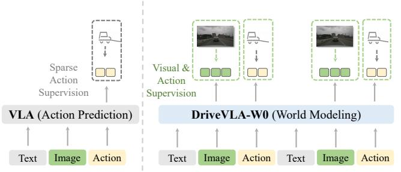  
(a) Action Prediction vs. World Modeling

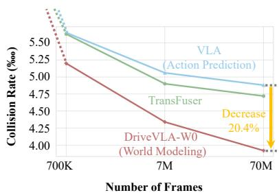  
(b) Scaling with Data Size  
Figure 1: World modeling as a catalyst for VLA data scalability. (a): Unlike standard VLAs trained solely on action supervision, our DriveVLA-W0 is trained to predict both future actions and visual scenes. (b): This world modeling task provides a dense source of supervision, enabling our model to better harness the benefits of large-scale data.

## ABSTRACT

Scaling Vision-Language-Action (VLA) models on large-scale data offers a promising path to achieving a more generalized driving intelligence. However, VLA models are limited by a “supervision deficit”: the vast model capacity is supervised by sparse, low-dimensional actions, leaving much of their representational power underutilized. To remedy this, we propose DriveVLA-W0, a training paradigm that employs world modeling to predict future images. This task generates a dense, self-supervised signal that compels the model to learn the underlying dynamics of the driving environment. We showcase the paradigm’s versatility by instantiating it for two dominant VLA archetypes: an autoregressive world model for VLAs that use discrete visual tokens, and a diffusion world model for those operating on continuous visual features. Building on the rich representations learned from world modeling, we introduce a lightweight action expert to address the inference latency for real-time deployment. Extensive experiments on the NAVSIM v1/v2 benchmark and a 680x larger in-house dataset demonstrate that DriveVLA-W0 significantly outperforms BEV and VLA baselines. Crucially, it amplifies the data scaling law, showing that performance gains accelerate as the training dataset size increases.

## 1 INTRODUCTION

The promise of scaling laws (Kaplan et al., 2020; Zhai et al., 2022; Baniodeh et al., 2025; Dehghani et al., 2023) presents an attractive path toward more generalized driving intelligence, with the hope that petabytes of driving data can be harnessed to train powerful foundation models. In the current landscape, two dominant paradigms exist. On one side are specialized models (Hu et al., 2022; Jiang et al., 2023) centered around Bird’s-Eye-View (BEV) representations (Li et al., 2022; Huang et al., 2021). These models are built upon carefully designed geometric priors, which, while effective for driving-specific tasks, make it less straightforward to leverage non-driving datasets. In addition, their relatively compact architectures may constrain their potential for large-scale data scalability. In response, Vision-Language-Action (VLA) models (Fu et al., 2025; Li et al., 2025b; Zhou et al., 2025c) have emerged as a promising alternative. By leveraging large-scale Vision-Language Models (VLMs) (Wang et al., 2024b; Bai et al., 2025) pretrained on internet-scale data, VLAs possess a significantly larger model size and a greater intrinsic potential for scaling.

However, this scaling potential is largely unrealized due to a critical challenge: the immense model size of VLA models is met with extremely sparse supervisory signals. The standard paradigm involves fine-tuning these VLM models solely on expert actions. This tasks the model with mapping high-dimensional sensory inputs to a few low-dimensional control signals (e.g., waypoints). This creates a severe “supervision deficit”. This deficit prevents the model from learning rich world representations, a fundamental limitation that cannot be overcome by simply increasing the volume of action-only training data. In fact, we observe that without sufficient supervision, large VLA models can even underperform smaller, specialized BEV models.

To address this supervision deficit, we harness the power of world modeling (Li et al., 2024a; Wang et al., 2025; Cen et al., 2025; Chen et al., 2024), integrating it as a dense self-supervised objective to supplement the sparse action signal. By tasking the model with predicting future images, we generate a dense and rich supervisory signal at every timestep. This objective forces the model to learn the underlying dynamics of the environment and build a rich, predictive world representation. To validate the effectiveness of our approach, we implement it across the two dominant VLA architectural families, which are primarily differentiated by their visual representation: discrete tokens versus continuous features. For VLAs that represent images as discrete visual tokens, world modeling is a natural extension. We propose an autoregressive world model to predict the sequence of discrete visual tokens of future images. For VLAs that operate on continuous features, this task is more challenging as they lack a visual vocabulary, making a direct next-token prediction approach infeasible. To bridge this gap, we introduce a diffusion world model that generates future image pixels conditioned on the vision and action features produced at the current frame.

We validate our world modeling approach across multiple data scales, from academic benchmarks to a massive in-house dataset. First, experiments scaling at academic benchmarks reveal that world modeling is crucial for generalization, as it learns robust visual patterns rather than overfitting to dataset-specific action patterns. To study true scaling laws, we then leverage a massive 70M-frame in-house dataset, as Figure 1 shows. This confirms our central hypothesis: world modeling amplifies the data scaling law. This advantage stems from the dense visual supervision provided by future frame prediction, creating a qualitative gap that cannot be closed by purely scaling the quantity of action-only data. Finally, to enable real-time deployment, we introduce a lightweight, MoE-based Action Expert. This expert decouples action generation from the large VLA backbone, reducing inference latency to just 63.1% of the baseline VLA and creating an efficient testbed to study different action decoders at a massive scale. This reveals a compelling reversal of performance trends from smaller to larger data scales. While complex flow-matching decoders often hold an advantage on small datasets, we find that this relationship inverts at a massive scale, where the simpler autoregressive decoder emerges as the top performer. Our work makes three primary contributions:

• We identify the “supervision deficit” as a critical bottleneck for scaling VLAs and propose DriveVLA-W0, a paradigm that uses world modeling to provide a dense, self-supervised learning signal from visual prediction.

• Our experiments reveal two key scaling advantages of world modeling. First, it enhances generalization across domains with differing action distributions by learning transferable visual representations. Second, on a massive 70M-frame dataset, it amplifies the data scaling law, providing a benefit that simply scaling up action-only supervision cannot achieve.

• We introduce a lightweight MoE-based Action Expert that reduces inference latency to 63.1% of the baseline. Using this expert as a testbed, we uncover a compelling scaling law reversal for action decoders: simpler autoregressive models surpass more complex flow-matching ones at a massive scale, inverting the performance trend seen on smaller datasets.

## 2 RELATED WORK

VLAs in Autonomous Driving. The development of VLMs in autonomous driving has progressed through three main stages, evolving from focusing on interpretation to integrated end-to-end VLA architectures. The first stage, language-based scene interpretation models, focused on enhancing interpretability. Models like DriveGPT4 (Xu et al., 2024) used Large Language Models (LLMs) to generate scene explanations and high-level maneuver suggestions, but without producing directly exe cutable actions (Chen et al., 2025; Zhou et al., 2025b). The second stage, modular language-to-action frameworks, aimed to connect high-level commands with low-level control. These approaches (Zhou et al., 2025a; Yuan et al., 2024; Zhang et al., 2025; Arai et al., 2025; Gao et al., 2025) utilize multi-stage pipelines where modules are connected via non-differentiable interfaces, such as discrete textual commands, which prevent gradient back-propagation. The current frontier is End-to-End VLAs (Renz et al., 2025; 2024; Jiang et al., 2025; Hwang et al., 2024; Yang et al., 2025; Zeng et al., 2025), which employ a unified architecture to directly map sensor inputs to trajectories. Within this paradigm, DriveMoE (Yang et al., 2025) introduced a Mixture-of-Experts (MoE) architecture, where an action decoder is serially connected after a VLM backbone. ReCogDrive (Li et al., 2025b) integrates a VLM with a diffusion planner trained via imitation and reinforcement learning to bridge the language-action gap. AutoVLA (Zhou et al., 2025c) tokenizes trajectories into action primitives, enabling a single autoregressive model to learn adaptive reasoning and planning. We follow this paradigm and propose an end-to-end VLA.

World Models in Driving and Robotics Research on world models typically follows two distinct philosophies: utilizing them as data synthesizers for simulation, or employing them as an auxiliary objective for representation learning. The first stream focuses on generation, aiming to synthesize high-quality driving data. Prominent works like GAIA-1 (Hu et al., 2023), DrivingGPT (Chen et al., 2024), and Doe-1 (Zheng et al., 2024a) generate future images or multi-modal tokens to create realistic scenarios, while Copilot4D (Zhang et al., 2023) specifically predicts future discrete visual tokens. Conversely, the second stream leverages world modeling as a self-supervised objective to enhance representation learning. While VaVAM (Bartoccioni et al., 2025) demonstrates the value of generative video pretraining, it lacks action conditioning. Addressing this, UniVLA (Wang et al., 2025) and WorldVLA (Cen et al., 2025) incorporate actions into autoregressive prediction to learn robust policies. In autonomous driving, LAW (Li et al., 2024a) pioneers this paradigm using a latent world model. Distinct from LAW’s latent prediction, our work supervises the model to predict future images, providing a richer and more direct dense learning signal for the VLA backbone.

## 3 METHODOLOGY

Our methodology unfolds in three key steps. First, we establish a VLA Baseline to demonstrate the challenges of sparse action-only supervision. Second, we enhance this baseline with World Modeling, our primary contribution, which provides dense self-supervision. Building on this, we tackle the inference bottleneck by introducing a lightweight, MoE-based Action Expert, ensuring our powerful model achieves real-time performance.

## 3.1 VLA BASELINE

Our Vision-Language-Action (VLA) baseline processes sequences of language instructions $( L _ { t } )$ front-view images $( V _ { t } )$ , and past actions $( A _ { t - 1 } )$ . To ensure broad applicability, we build variants on the two dominant VLM paradigms: VLA (VQ), which quantizes images into discrete visual tokens for an Emu3-style backbone, and VLA (ViT), which extracts continuous features for a Qwen2.5-VL-style backbone.

Input Tokenization. High-level driving language instructions $( L _ { t } )$ are processed using the VLM’s native tokenizer. For past actions, we use the FAST tokenizer (Pertsch et al., 2025) to convert continuous waypoint trajectories into a sequence of discrete tokens, denoted $A _ { t - 1 }$

VLM Backbone. At each timestep t, we form a deeply interleaved input sequence $S _ { t }$ by concatenating multimodal chunks over a history of $H$ steps following Wang et al. (2025); Fan et al. (2025): $\boldsymbol { S _ { t } } = [ L _ { t - H } , V _ { t - H } , A _ { t - H - 1 } , \ldots , \mathbf { \bar { \Lambda } } _ { L _ { t } } , V _ { t } , A _ { t - 1 } ]$ . This sequence is processed autoregressively by our VLM backbone, for which we select two representative models: Emu3 (8B) (Wang et al., 2024b)

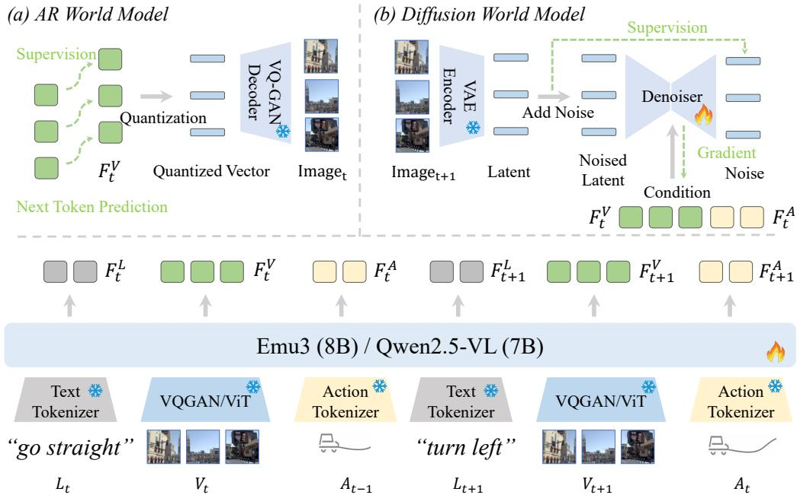  
Figure 2: The architecture of DriveVLA-W0, which achieves world modeling in two ways: (a) an AR World Model that predicts discrete visual tokens, and (b) a Diffusion World Model that denoises latent representations conditioned on multimodal inputs.

to handle discrete visual representations and Qwen2.5-VL (7B) (Bai et al., 2025) for continuous features, using a causal attention mask. The VLM backbone outputs the final-layer hidden states, which are then split according to their respective modalities into language $( F _ { t } ^ { L } )$ , vision $( F _ { t } ^ { V } )$ , and action $( F _ { t } ^ { A } )$ features.

Action Prediction. For training, we optimize the model to predict the ground-truth action token sequence $A _ { t } = ( a _ { 1 } , \dotsc , a _ { M } )$ using a standard cross-entropy loss:

$$
\mathcal { L } _ { \mathrm { A c t i o n } } = - \sum _ { i = 1 } ^ { L } \log P ( a _ { i } | S _ { t } , a _ { < i } ) .\tag{1}
$$

During inference, the trained model then autoregressively generates a sequence of action tokens conditioned on the context $S _ { t }$ . These tokens are subsequently converted back into a continuous waypoint trajectory by the FAST detokenizer (Pertsch et al., 2025).

## 3.2 WORLD MODELING

Prior VLA pipelines typically only supervise the model’s actions. This yields a sparse supervisory signal, compressing high-dimensional sensory inputs into a few low-dimensional control signals and results in a “supervision deficit”. To address this, we introduce world modeling as a powerful self-supervised objective. We implement the world model differently for our two VLA paradigms. For VLAs equipped with a discrete visual vocabulary, we formulate the world model as a next-token prediction task, creating our AR World Model. Conversely, for VLAs that operate on continuous visual features, we introduce a Diffusion World Model to generate future images in a continuous latent space.

AR World Model. Our AR World Model predicts the current visual scene by autoregressively generating its sequence of discrete visual tokens, conditioned on past observations and actions (Figure 2 (a)).

Training. The model learns to autoregressively generate the sequence of visual tokens for the current image, $\hat V _ { t } = ( v _ { 1 } , \ldots , v _ { N } )$ , conditioned on the preceding context $S _ { < V _ { t } }$ . The process is optimized by

minimizing the next-token prediction loss

$$
\mathcal { L } _ { \mathrm { W M \mathrm { - } A R } } = - \sum _ { i = 1 } ^ { N } \log P ( v _ { i } | S _ { < V _ { t } } , v _ { < i } ) .\tag{2}
$$

We refer to this complete framework as DriveVLA-W0 (VQ). It is trained jointly by optimizing a weighted sum of the action and AR world model losses: $\mathcal { L } _ { \mathrm { T o t a l } } = \mathcal { L } _ { \mathrm { A c t i o n } } + \alpha \mathcal { L } _ { \mathrm { W M - A R } }$ , where α is a balancing coefficient.

Inference. While the explicit generation of visual tokens is typically bypassed during inference to ensure low latency, this capability remains valuable for visualization purposes. To generate an image, the model autoregressively samples a sequence of visual tokens, which are then passed to the MoVQGAN (Zheng et al., 2022) decoder to render the final image $\hat { I } _ { t }$

Diffusion World Model. Unlike the VQ-based counterpart, our VLA (ViT) model lacks a discrete visual vocabulary suitable for next-token prediction. We therefore introduce a Diffusion World Model, which instead provides dense supervision by training a latent diffusion model (Rombach et al., 2021; Wang et al., 2024a) to generate future images conditioned on the VLA’s rich output features $( F _ { t } ^ { \dot { V } } , F _ { t } ^ { A } )$ as Figure 2 shows. This choice to predict the future frame $\left( \mathbf { I } _ { t + 1 } \right)$ is critical: since the model is conditioned on all present features simultaneously, predicting the future is necessary to learn predictive dynamics rather than simply performing a reconstruction task.

Training. This framework learns to predict the future visual scene $\left( \mathbf { I } _ { t + 1 } \right)$ conditioned on the VLA’s current visual and action features $( \stackrel { \cdot } { F } _ { t } ^ { V }$ and $F _ { t } ^ { A } )$ . Following the standard latent diffusion setup, the model is trained to denoise a noised version of the future image’s latent representation. This is optimized via an MSE objective

$$
{ \mathcal { L } } _ { \mathrm { W M - D i f f } } = \mathbb { E } _ { z _ { t + 1 } , \epsilon , k } \left[ \| \epsilon - \hat { \epsilon } ( z _ { t + 1 , k } , k , F _ { t } ^ { V } , F _ { t } ^ { A } ) \| ^ { 2 } \right] .\tag{3}
$$

where $z _ { t + 1 }$ is the latent of the future image $\mathbf { I } _ { t + 1 } , \epsilon \sim \mathcal { N } ( 0 , \mathbf { I } )$ is sampled Gaussian noise, $k$ is a random diffusion timestep, and ϵˆ is the denoiser network trained to predict the noise from the noised latent $z _ { t + 1 , k } $ . We term this overall framework DriveVLA-W0 (ViT). It is trained end-to-end by optimizing a joint objective that combines the action prediction loss and the diffusion world model loss: $\mathcal { L } _ { \mathrm { T o t a l } } = \mathcal { L } _ { \mathrm { A c t i o n } } + \beta \mathcal { L } _ { \mathrm { W M \mathrm { - D i f f } } }$ , where $\beta$ is a balancing coefficient.

Inference. As with the AR model, the diffusion process is bypassed during driving inference to ensure real-time performance. For qualitative analysis, future frames can be generated by running the reverse diffusion process, starting from random noise and conditioning on the features $\check { F _ { t } ^ { V } }$ and $\breve { F _ { t } ^ { A } }$ to produce a predicted image $\hat { I } _ { t + 1 }$

## 3.3 ACTION EXPERT

MoE Architecture. (Black et al.; Intelligence et al., 2025) While our large VLA backbone excels at representation learning, its size is prohibitive for real-time control. To address this, we introduce a lightweight action expert (500M) that operates alongside the main VLA Expert (our full VLA backbone) in a Mixture-of-Experts (MoE) architecture. The Action Expert shares a similar transformer block structure with the VLA Expert but uses a much smaller hidden dimension. This architectural similarity enables a deep and efficient fusion of information via a Joint Attention mechanism as Figure 3(a) shows. In this setup, both experts first compute their respective Query, Key, and Value matrices. These matrices are then concatenated along the token sequence dimension to create a single set of inputs for a Joint Attention operation

$$
\begin{array} { r } { Q = [ Q _ { \mathrm { V L A } } ; Q _ { \mathrm { A E } } ] , \quad K = [ K _ { \mathrm { V L A } } ; K _ { \mathrm { A E } } ] , \quad V = [ V _ { \mathrm { V L A } } ; V _ { \mathrm { A E } } ] . } \end{array}\tag{4}
$$

The resulting attention output is then split and routed back to each corresponding expert as Figure 3 shows. This approach allows for a tight, symmetric integration of the VLA’s rich representations and the Action Expert’s specialized context within a single, efficient computation.

This efficient MoE architecture also serves as an ideal test bed for systematically investigating three distinct action decoding strategies: a query-based, an autoregressive, and a flow matching expert. A key commonality among these variants is the prefilling of the previous action’s features $( A _ { t - 1 } )$ , which provides a strong temporal prior for the current decision.

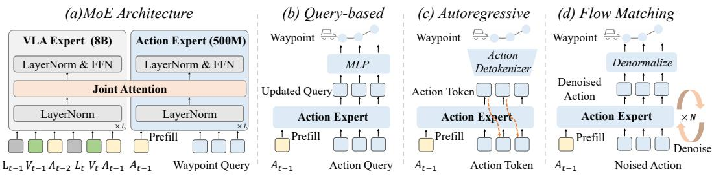  
Figure 3: (a) Our Mixture-of-Experts (MoE) architecture pairs a large VLA Expert with a lightweight Action Expert for efficient inference. (b-d) This framework serves as a testbed for comparing three action decoding schemes: query-based, autoregressive, and flow matching.

Query-based Action Expert. This expert employs a set of learnable action queries that interact with the VLA’s multimodal context via joint attention. The resulting updated queries are then projected by an MLP head to directly regress the continuous waypoint trajectory. The model is optimized by minimizing the L1 distance between the predicted and ground-truth trajectories.

Autoregressive Action Expert. This expert generates actions by autoregressively predicting a sequence of discrete tokens. Its training objective and formulation are identical to those used for our VLA Baseline (described in Section 3.1), minimizing a standard cross-entropy loss.

Flow Matching Action Expert. In contrast to the discrete nature of the autoregressive approach, we also implement a continuous action generation method based on flow matching. This method learns a conditional vector field, $v _ { \phi } .$ , that defines a direct “path” from a simple noise distribution to the complex distribution of real-world driving actions. During training, we define a simple straight-line trajectory between a random noise sample and a ground-truth action (Liu et al., 2022). The model is then optimized via a mean squared error loss to predict a vector field $v _ { \phi }$ that aligns with this trajectory at each point, conditioned on the multimodal context $\mathbf { c } _ { t } .$ . For inference, we simply start with a new noise sample and follow the learned vector field for a fixed number of steps using a numerical ODE solver. This process deterministically transforms the noise into a precise, continuous action that lie on the learned data manifold.

## 4 EXPERIMENT

## 4.1 DATASETS

NAVSIM. We use the NAVSIM (Dauner et al., 2024) benchmark derived from OpenScene (Contributors, 2023), for evaluating performance in safety-critical scenarios.

NAVSIM v1 metrics include No at-fault Collision (NC), Drivable Area Compliance (DAC), Time-To-Collision (TTC), Comfort (C.), and Ego Progress (EP). NAVSIM uses the Predictive Driver Model Score (PDMS) to evaluate model performance: $\begin{array} { r } { \dot { P } \dot { D } \dot { M } S = N C \times D A C \times \frac { 5 \times E P + 5 \times T T C + 2 \times C . } { 1 2 } } \end{array}$

NAVSIM v2 (Cao et al., 2025) includes several components, categorized as penalties or weighted subscores. Key metrics are No at-fault Collision (NC), Drivable Area Compliance (DAC), Driving Direction Compliance (DDC), Traffic Light Compliance (TLC), Ego Progress (EP), Time to Collision (TTC), Lane Keeping (LK), History Comfort (HC), and Extended Comfort (EC). NAVSIM $\mathbf { v } 2$ uses the Extended Predictive Driver Model Score (EPDMS) to evaluate model performance: EPDMS = NC × DAC × DDC × TLC × 5×EP+5×TTC+2×LK+2×HC+2×EC   
16

In-house Dataset. To test data scalability beyond academic benchmarks, we use a massive in-house dataset for training and evaluation. Our training set contains 70 millionframes from over 1 million unique clips. It is curated to be diverse and balanced across a wide spectrum of driving scenarios, while being significantly enriched with challenging and safety-critical events. The test set comprises 100 challenging scenarios. We evaluate trajectory using the Average Displacement Error (ADE) over a 3-second, 6-waypoint future trajectory (2 Hz), and safety using a Collision Rate. We compute our Collision Rate using the same methodology as the No at-fault Collision (NC) metric from the NAVSIM benchmark.

Table 1: Comparison with state-of-the-art methods on the NAVSIM v1. NC: no at-fault collision. DAC: drivable area compliance. TTC: time-to-collision. C.: comfort. EP: ego progress. PDMS: the predictive driver model score. Abbreviations: 1x Cam (single front-view camera), Nx Cam (surround view cameras), L (LiDAR). ∗: Using the query-based action expert. †: Using the query-based action expert with multiple trajectory anchors following Li et al. (2024b). ‡: Using the AR action expert with the best-of-N (N=6) strategy following Zhou et al. (2025c).
<table><tr><td>Method</td><td>Ref</td><td>Sensors</td><td>NC↑</td><td>DAC ↑</td><td>TTC ↑</td><td>C. ↑</td><td>EP↑</td><td>PDMS ↑</td></tr><tr><td>Human</td><td></td><td></td><td>100</td><td>100</td><td>100</td><td>99.9</td><td>87.5</td><td>94.8</td></tr><tr><td colspan="7">BEV-based Methods</td><td></td><td></td></tr><tr><td>UniAD (Hu et al., 2022) TransFuser (Prakash et al., 2021) PARA-Drive (Weng et al., 2024)</td><td>CVPR&#x27;23 TPAMI&#x27;23 CVPR&#x27;24</td><td>6x Cam 3x Cam + L 6x Cam</td><td>97.8 97.7 97.9</td><td>91.9 92.8 92.4</td><td>92.9 92.8</td><td>100.0 100.0</td><td>78.8 79.2</td><td>83.4 84.0</td></tr><tr><td>LAW (Li et al., 2024a) Hydra-MDP (Li et al., 2024b) DiffusionDrive (Liao et al., 2025)</td><td>ICLR&#x27;25 arXiv&#x27;24 CVPR&#x27;25</td><td>1x Cam 3x Cam + L 3x Cam + L</td><td>96.4 98.3 98.2</td><td>95.4 96.0 96.2</td><td>93.0 88.7 94.6 94.7</td><td>99.8 99.9 100.0</td><td>79.3 81.7 78.7</td><td>84.0 84.6 86.5</td></tr><tr><td>WoTE (Li et al., 2025a)</td><td>ICCV’25</td><td>3x Cam + L</td><td>98.5</td><td>96.8</td><td>94.4</td><td>100.0 99.9</td><td>82.2 81.9</td><td>88.1 88.3</td></tr><tr><td>VLA-based Methods</td><td></td><td>1x Cam</td><td></td><td></td><td></td><td></td><td></td><td></td></tr><tr><td>DriveVLA-W0*</td><td></td><td></td><td>98.7</td><td>96.2</td><td>95.5</td><td>100.0</td><td>82.2</td><td>88.4</td></tr><tr><td>AutoVLA (Zhou et al., 2025c)</td><td>NeurIPS&#x27;25</td><td>3x Cam</td><td>98.4</td><td>95.6</td><td>98.0</td><td>99.9</td><td>81.9</td><td>89.1</td></tr><tr><td>ReCogDrive (Li et al., 2025b)</td><td>arXiv&#x27;25</td><td>3x Cam</td><td>98.2</td><td>97.8</td><td>95.2</td><td>99.8</td><td>83.5</td><td>89.6</td></tr><tr><td>DriveVLA-W0†</td><td></td><td>1x Cam</td><td>98.7</td><td>99.1</td><td>95.3</td><td>99.3</td><td>83.3</td><td>90.2</td></tr><tr><td>AutoVLA† (Zhou et al., 2025c)</td><td>NeurIPS’25</td><td>3x Cam</td><td>99.1</td><td>97.1</td><td>97.1</td><td>100.0</td><td>87.6</td><td>92.1</td></tr><tr><td>DriveVLA-W0</td><td></td><td>1x Cam</td><td>99.3</td><td>97.4</td><td>97.0</td><td>99.9</td><td>88.3</td><td></td></tr><tr><td></td><td></td><td></td><td></td><td></td><td></td><td></td><td></td><td>93.0</td></tr></table>

Table 2: Comparison with state-of-the-art methods on the NAVSIM v2 with extended metrics. NC: No at-fault Collision. DAC: Drivable Area Compliance. DDC: Driving Direction Compliance. TLC: Traffic Light Compliance. EP: Ego Progress. TTC: Time to Collision. LK: Lane Keeping. HC: History Comfort. EC: Extended Comfort. EPDMS: Extended Predictive Driver Model Score.
<table><tr><td>Method</td><td>NC↑</td><td>DAC ↑</td><td>DDC ↑</td><td>TLC↑</td><td>EP↑</td><td>TTC ↑</td><td>LK↑</td><td>HC↑</td><td>EC↑</td><td>EPDMS ↑</td></tr><tr><td>Ego Status</td><td>93.1</td><td>77.9</td><td>92.7</td><td>99.6</td><td>86.0</td><td>91.5</td><td>89.4</td><td>98.3</td><td>85.4</td><td>64.0</td></tr><tr><td>TransFuser (Prakash et al., 2021)</td><td>96.9</td><td>89.9</td><td>97.8</td><td>99.7</td><td>87.1</td><td>95.4</td><td>92.7</td><td>98.3</td><td>87.2</td><td>76.7</td></tr><tr><td>HydraMDP++ (Li et al., 2024b)</td><td>97.2</td><td>97.5</td><td>99.4</td><td>99.6</td><td>83.1</td><td>96.5</td><td>94.4</td><td>98.2</td><td>70.9</td><td>81.4</td></tr><tr><td>DriveSuprem (Yao et al., 2025)</td><td>97.5</td><td>96.5</td><td>99.4</td><td>99.6</td><td>88.4</td><td>96.6</td><td>95.5</td><td>98.3</td><td>77.0</td><td>83.1</td></tr><tr><td>ARTEMIS (Feng et al., 2025)</td><td>98.3</td><td>95.1</td><td>98.6</td><td>99.8</td><td>81.5</td><td>97.4</td><td>96.5</td><td>98.3</td><td></td><td>83.1</td></tr><tr><td>DiffusionDrive (Liao et al., 2025)</td><td>98.2</td><td>95.9</td><td>99.4</td><td>99.8</td><td>87.5</td><td>97.3</td><td>96.8</td><td>98.3</td><td>87.7</td><td>84.5</td></tr><tr><td>DriveVLA-W0</td><td>98.5</td><td>99.1</td><td>98.0</td><td>99.7</td><td>86.4</td><td>98.1</td><td>93.2</td><td>97.9</td><td>58.9</td><td>86.1</td></tr></table>

## 4.2 IMPLEMENTATION DETAILS

Two-stage Training Paradigm. Our model is trained via a two-stage paradigm designed to first learn rich world representations and then specialize in action generation. In the first stage, we pretrain the VLA backbone utilizing the 6VA sequence configuration. The model is optimized with a joint objective, combining both the world model loss and the action prediction loss. In the second stage, we integrate the model with Action Expert. The VLA backbone now processes a 2VA input sequence. While we do not freeze the VLA backbone, the model is only supervised by the action loss from the action expert part.

NAVSIM. For experiments on the NAVSIM benchmark, models are pretrained on NuPlan (Caesar et al., 2021) for 8k steps and then fine-tuned on NAVSIM for 4k steps, processing 256x144 images. The training is conducted on 8 NVIDIA L20 GPUs with a global batch size of 48. We used the AdamW optimizer with a cosine learning rate schedule, an initial learning rate of 2e − 4, and bfloat16 mixed-precision. For our ablation studies, we select DriveVLA-W0 (VQ) as the default model due to its architectural simplicity.

In-house Dataset. For our large-scale experiments on the in-house dataset, models are pretrained for 50k steps and fine-tuned for 30k steps using the same data. This training utilized a cluster of 64 GPUs with a global batch size of 256. The optimizer and learning rate schedule remained identical to the NAVSIM setup.

World model enhances generalization to new action distributions  
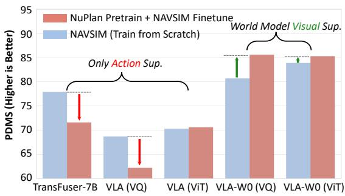

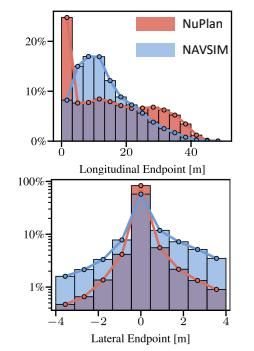  
(a) Different Action Distribution

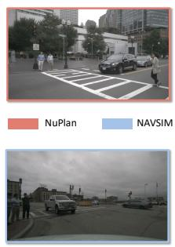  
(b) Similar Visual Distribution  
Figure 4: World modeling unlocks generalization with data scaling. Our world model turns pretraining from a detriment for sparse-supervision baselines (red arrows) into a benefit for our VLA-W0s (green arrows), enabling positive knowledge transfer across datasets with similar visuals (b) but different action distributions (a). Figure (a) is from Dauner et al. (2024).

Re-implemented TransFuser. To provide a solid baseline for our in-house dataset, we adapt and re-implement the well-known TransFuser (Prakash et al., 2021) architecture. For a fair comparison with our single-camera setup, we modify Latent-TransFuser (an image-only variant of TransFuser) to process a single front-view image instead of its original multi-view input. To investigate the impact of model size, we implement two versions: a 50M-parameter model and a 7B-parameter model. The smaller TransFuser-50M uses a standard ResNet-34 backbone. The larger TransFuser-7B employs a ViT-7B backbone, initialized with pretrained weights from DINOv3 (Siméoni et al., 2025).

## 4.3 COMPARISON WITH STATE-OF-THE-ART METHODS

As presented in Table 1 and Table 2, DriveVLA-W0 establishes a new state-of-the-art on the NAVSIM benchmark by surpassing top-performing methods across different architectural paradigms, including the BEV-based WoTE (Li et al., 2025a) and the VLA-based AutoVLA (Zhou et al., 2025c). Notably, our model achieves this top performance using only a single front-view camera, surpassing competitors that rely on richer sensor suites combining multi-view cameras and LiDAR. This superior performance is attributed to the powerful, dense supervision from our world modeling objective, which enables the model to learn a more effective feature representation.

## 4.4 WORLD MODELS AMPLIFY DATA SCALING LAW

World modeling unlocks generalization with data scaling. To test generalization across differing action distributions, we evaluate models by pretraining on the large-scale NuPlan dataset and then fine-tuning on NAVSIM, a smaller benchmark focused on challenging, long-tail maneuvers. This setup creates a significant domain shift in the action space while the visual domain remains similar, posing a challenge for knowledge transfer. As shown in Figure 4 and Table 7, world modeling is crucial for effective transfer. We observe two opposing trends: 1) Baseline models that rely solely on sparse action supervision often sufferfrom pretraining. For instance, TransFuser-7B and our VLA (VQ) baseline show significant performance degradation (red arrows). This is due to overfitting to NuPlan’s action distribution, which creates a detrimental prior that hinders adaptation to NAVSIM’s corner cases. 2) Our VLA-W0 models consistently benefitfrom pretraining. By forcing the model to predict future visual frames, the world modeling encourages the learning of transferable visual representations of the environment. These transferable visual representations lead to superior generalization.

World modeling outperforms action-only supervision with data scaling. We investigate data scalability by training models on three data scales (70k, 700k, and 70M frames). To cleanly ablate the impact of our world modeling paradigm, we conduct these experiments directly on the base VLA models, excluding the action experts. As shown in Table 3, the world model is critical for unlocking the benefits of large-scale data. While baseline models that rely on sparse action supervision quickly show performance saturation, our DriveVLA-W0 models demonstrate sustained improvement. The impact is most pronounced at the 70M-frame scale. Here, adding world modeling substantially boosts performance, improving the VQ model’s ADE by 28.8% and the ViT model’s collision rate by 15.9%. This demonstrates that even with a massive volume of training data, action-only supervision cannot replicate the qualitative advantage provided by our dense world model objective.

Table 3: World modeling outperforms action-only supervision with data scaling. Unlike baseline models that plateau early under sparse supervision, our VLA-W0 models show consistent improvement.
<table><tr><td rowspan="3">Model</td><td colspan="6">In-house Dataset Scale (Number of Frames)</td></tr><tr><td colspan="2">70k</td><td colspan="2">700k</td><td colspan="2">70M</td></tr><tr><td>ADE (m) ↓</td><td>Collision (%) ↓</td><td>ADE (m) ↓</td><td>Collision (%) ↓</td><td>ADE (m) ↓</td><td>Collision (%) ↓</td></tr><tr><td>TransFuser-50M</td><td>2.5893</td><td>0.0894</td><td>1.7464</td><td>0.0563</td><td>1.2627</td><td>0.0472</td></tr><tr><td>TransFuser-7B</td><td>2.5757</td><td>0.0839</td><td>2.1391</td><td>0.0710</td><td>1.2244</td><td>0.0539</td></tr><tr><td>VLA (VQ) (Baseline) + World Model (Ours)</td><td>2.8520</td><td>0.0982</td><td>1.5424</td><td>0.0565</td><td>1.4829</td><td>0.0488</td></tr><tr><td></td><td>2.7482↑3.6%</td><td>0.0956↑2.7%</td><td>1.5985 ↓3.6%</td><td>0.0520↑8.0%</td><td>1.0563↑28.8%</td><td>0.0392↑19.7%</td></tr><tr><td>VLA (ViT) (Baseline)</td><td>3.1524</td><td>0.0950</td><td>1.4202</td><td>0.0462</td><td>1.1051</td><td>0.0359</td></tr><tr><td>+ World Model (Ours)</td><td>2.5268↑19.9%</td><td>0.0834↑12.2%</td><td>1.3436↑5.4%</td><td>0.0513↓11.0%</td><td>1.0640↑3.7%</td><td>0.0302↑15.9%</td></tr></table>

Action experts reverse performance with data scaling. Our comparison of action expert on NAVSIM (100k frames) and in-house dataset (70M frames) reveals a striking performance reversal, driven by a trade-off between prediction precision and modeling capacity. As shown in Table 4, on the small-scale NAVSIM dataset, continuous decoders like query-based and flow matching excel. Here, the trajectory distribution is simple. The higher precision gives these experts an edge over the discrete autoregressive approach, which is hindered by quantization error. However, on our massive dataset, modeling a vastly more complex trajectory distribution becomes the dominant challenge. In this high-data regime, the autoregressive decoder’s strong modeling capacity and sample-efficient, teacher-forced training allow it to scale most effectively. Conversely, the query-based expert faces a representational bottleneck, and the flow matching expert proves too sample-inefficient to converge on the complex data manifold, leading to the observed performance reversal.

Table 4: Action experts reverse performance with data scaling. For each dataset, all three experts are initialized from an identical pretrained VLA model. Notably, the query-based expert that performs best on the small-scale data is surpassed by the autoregressive expert at the larger scale, highlighting a clear performance reversal.
<table><tr><td rowspan="2">Action Expert</td><td colspan="6">NAVSIM (103k Frames)</td><td colspan="2">In-house Dataset (70M Frames)</td></tr><tr><td>NC↑</td><td>DAC ↑</td><td>TTC ↑</td><td>C.↑</td><td>EP↑</td><td>PDMS ↑</td><td>ADE (m) ↓</td><td>Collision (%)↓</td></tr><tr><td>Query-based</td><td>98.7</td><td>96.2</td><td>95.5</td><td>100.0</td><td>82.2</td><td>88.4</td><td>1.1248</td><td>0.0453</td></tr><tr><td>Flow Matching</td><td>98.4</td><td>95.3</td><td>95.2</td><td>100.0</td><td>80.9</td><td>87.2↓1.4%</td><td>1.0362↑7.9%</td><td>0.0398↑12.1%</td></tr><tr><td>Autoregressive</td><td>98.4</td><td>93.6</td><td>94.5</td><td>100.0</td><td>79.3</td><td>85.3↓3.6%</td><td>1.0069↑10.5%</td><td>0.0295↑34.9%</td></tr></table>

## 4.5 ABLATION STUDY

The following two world model ablations are conducted without the action experts.

Vision-Only vs. Vision-Action Sequence As shown in Table 5, pretraining with an interleaved vision-action sequence (6VA) yields substantial gains over a baseline pretrained with only a vision loss (6V), improving the PDMS score from 84.1 to 85.6. This demonstrates that grounding visual predictions in corresponding ego actions is crucial. This conditioning compels the model to learn the environment’s underlying causal dynamics, as it must predict the specific visual outcome of an action rather than a generic or ambiguous future.

Ablation on Sequence Length We ablate the pretraining sequence length using three configurations: VA, 2VA, and 6VA. Table 6 reveals a clear trend where performance scales with temporal context, with the longest sequence (6VA) achieving the best results. This highlights that a longer context window is critical for learning complex, long-horizon environmental dynamics, as it enables the model to better capture temporal dependencies for planning.

Table 5: Ablation study on vision-only vs. vision-action sequence design.
<table><tr><td>Pretrain (NuPlan)</td><td>Finetune (NAVSIM)</td><td>NC↑</td><td>DAC ↑</td><td>PDMS ↑</td></tr><tr><td>1</td><td>2VA</td><td>97.1</td><td>90.3</td><td>80.7</td></tr><tr><td>6V</td><td>2VA</td><td>97.9</td><td>92.8</td><td>84.1</td></tr><tr><td>6VA</td><td>2VA</td><td>98.3</td><td>93.8</td><td>85.6</td></tr></table>

Table 6: Ablation study on varying the sequence length.
<table><tr><td>Pretrain (NuPlan)</td><td>Finetune (NAVSIM)</td><td>NC↑</td><td>DAC ↑</td><td>PDMS ↑</td></tr><tr><td>VA</td><td>VA</td><td>96.8</td><td>92.7</td><td>83.3</td></tr><tr><td>2VA</td><td>2VA</td><td>97.3</td><td>93.2</td><td>84.2</td></tr><tr><td>6VA</td><td>2VA</td><td>98.3</td><td>93.8</td><td>85.6</td></tr></table>

Ablation on Latency We validate the efficiency of MoE architecture by measuring inference latency on an H200 GPU. Compared to the baseline DriveVLA-W0 (117.8ms latency, 85.6 PDMS), the addition of our query-based MoE expert significantly cuts the latency to 74.3ms (just 63.1% of the original) while simultaneously boosting performance to 88.4 PDMS. More analysis is shown in AppendixB.1.

## 4.6 VISUALIZATION

Beyond achieving superior planning performance, DriveVLA-W0 exhibits strong capabilities in action-conditioned future generation, highlighting its potential as a reactive simulator. As illustrated in Figure 5, we explicitly condition the model on a counterfactual “decelerate” trajectory. The resulting frames show the surrounding scene flowing past the vehicle at a noticeably reduced rate compared to the ground truth. This precise alignment between control signals and visual dynamics confirms the model’s grounded physical understanding. For further qualitative analysis, including trajectory visualization and case comparisons (Figures 7, 8, 9, 10), future image generation (Figure 13), and counterfactual reasoning (Figure 14), please refer to Appendix C.

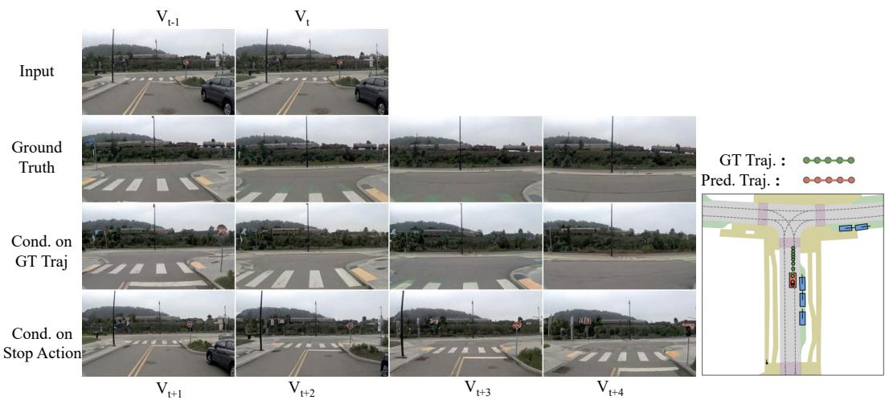  
Figure 5: Action-Conditioned Simulation. We demonstrate the utility of our world model as a simulator capable of generating diverse futures based on control signals. In the recorded ground truth, the ego vehicle maintains speed and drives forward. By conditioning the model on a counterfactua "decelerate" action, the world model generates a distinct visual outcome where the vehicle slows down.

## 5 CONCLUSION

In this work, we identified the “supervision deficit” as a fundamental bottleneck hindering the scalability of Vision-Language-Action models in autonomous driving. We proposed DriveVLA-W0, a paradigm that remedies this issue by employing future image prediction as a dense, self-supervised objective, tailored for both VQ- and ViT-based architectures. Our extensive experiments demonstrate that this approach not only unlocks superior data scalability and generalization compared to baselines, but also reveals a compelling performance reversal among action decoders at scale, where simpler autoregressive models ultimately prevail. Ultimately, our findings suggest that embracing dense, predictive world modeling is a crucial step toward realizing the full potential of large-scale data in the pursuit of a more generalized driving intelligence.

## REFERENCES

Hidehisa Arai, Keita Miwa, Kento Sasaki, Kohei Watanabe, Yu Yamaguchi, Shunsuke Aoki, and Issei Yamamoto. Covla: Comprehensive vision-language-action dataset for autonomous driving. In 2025 IEEE/CVF Winter Conference on Applications of Computer Vision (WACV), pp. 1933–1943. IEEE, 2025.

Shuai Bai, Keqin Chen, Xuejing Liu, Jialin Wang, Wenbin Ge, Sibo Song, Kai Dang, Peng Wang, Shijie Wang, Jun Tang, Humen Zhong, Yuanzhi Zhu, Mingkun Yang, Zhaohai Li, Jianqiang Wan, Pengfei Wang, Wei Ding, Zheren Fu, Yiheng Xu, Jiabo Ye, Xi Zhang, Tianbao Xie, Zesen Cheng, Hang Zhang, Zhibo Yang, Haiyang Xu, and Junyang Lin. Qwen2.5-vl technical report. arXiv preprint arXiv:2502.13923, 2025.

Mustafa Baniodeh, Kratarth Goel, Scott Ettinger, Carlos Fuertes, Ari Seff, Tim Shen, Cole Gulino, Chenjie Yang, Ghassen Jerfel, Dokook Choe, et al. Scaling laws of motion forecasting and planning–a technical report. arXiv preprint arXiv:2506.08228, 2025.

Florent Bartoccioni, Elias Ramzi, Victor Besnier, Shashanka Venkataramanan, Tuan-Hung Vu, Yihong Xu, Loick Chambon, Spyros Gidaris, Serkan Odabas, David Hurych, et al. Vavim and vavam: Autonomous driving through video generative modeling. arXiv preprint arXiv:2502.15672, 2025.

Kevin Black, Noah Brown, Danny Driess, Adnan Esmail, Michael Equi, Chelsea Finn, Niccolo Fusai, Lachy Groom, Karol Hausman, Brian Ichter, et al. π0: A vision-language-action flow model for general robot control. corr, abs/2410.24164, 2024. doi: 10.48550. arXiv preprint ARXIV.2410.24164.

Holger Caesar, Juraj Kabzan, Kok Seang Tan, Whye Kit Fong, Eric Wolff, Alex Lang, Luke Fletcher, Oscar Beijbom, and Sammy Omari. nuplan: A closed-loop ml-based planning benchmark for autonomous vehicles. arXiv preprint arXiv:2106.11810, 2021.

Wei Cao, Marcel Hallgarten, Tianyu Li, Daniel Dauner, Xunjiang Gu, Caojun Wang, Yakov Miron, Marco Aiello, Hongyang Li, Igor Gilitschenski, et al. Pseudo-simulation for autonomous driving. arXiv preprint arXiv:2506.04218, 2025.

Jun Cen, Chaohui Yu, Hangjie Yuan, Yuming Jiang, Siteng Huang, Jiayan Guo, Xin Li, Yibing Song, Hao Luo, Fan Wang, et al. Worldvla: Towards autoregressive action world model. arXiv preprint arXiv:2506.21539, 2025.

Lihong Chen, Hossein Hassani, and Soodeh Nikan. Ts-vlm: Text-guided softsort pooling for vision-language models in multi-view driving reasoning. arXiv preprint arXiv:2505.12670, 2025.

Yuntao Chen, Yuqi Wang, and Zhaoxiang Zhang. Drivinggpt: Unifying driving world modeling and planning with multi-modal autoregressive transformers. arXiv preprint arXiv:2412.18607, 2024.

OpenScene Contributors. Openscene: The largest up-to-date 3d occupancy prediction benchmark in autonomous driving, 2023.

Daniel Dauner, Marcel Hallgarten, Tianyu Li, Xinshuo Weng, Zhiyu Huang, Zetong Yang, Hongyang Li, Igor Gilitschenski, Boris Ivanovic, Marco Pavone, et al. Navsim: Data-driven non-reactive autonomous vehicle simulation and benchmarking. arXiv preprint arXiv:2406.15349, 2024.

Mostafa Dehghani, Josip Djolonga, Basil Mustafa, Piotr Padlewski, Jonathan Heek, Justin Gilmer, Andreas Peter Steiner, Mathilde Caron, Robert Geirhos, Ibrahim Alabdulmohsin, et al. Scaling vision transformers to 22 billion parameters. In International conference on machine learning, pp. 7480–7512. PMLR, 2023.

Cunxin Fan, Xiaosong Jia, Yihang Sun, Yixiao Wang, Jianglan Wei, Ziyang Gong, Xiangyu Zhao, Masayoshi Tomizuka, Xue Yang, Junchi Yan, et al. Interleave-vla: Enhancing robot manipulation with interleaved image-text instructions. arXiv preprint arXiv:2505.02152, 2025.

Renju Feng, Ning Xi, Duanfeng Chu, Rukang Wang, Zejian Deng, Anzheng Wang, Liping Lu, Jinxiang Wang, and Yanjun Huang. Artemis: Autoregressive end-to-end trajectory planning with mixture of experts for autonomous driving. arXiv preprint arXiv:2504.19580, 2025.

Haoyu Fu, Diankun Zhang, Zongchuang Zhao, Jianfeng Cui, Dingkang Liang, Chong Zhang, Dingyuan Zhang, Hongwei Xie, Bing Wang, and Xiang Bai. Orion: A holistic end-to-end autonomous driving framework by vision-language instructed action generation. arXiv:2503.19755, 2025.

Xiangbo Gao, Yuheng Wu, Rujia Wang, Chenxi Liu, Yang Zhou, and Zhengzhong Tu. Langcoop: Collaborative driving with language. In Proceedings ofthe Computer Vision and Pattern Recognition Conference, pp. 4226–4237, 2025.

Jordan Hoffmann, Sebastian Borgeaud, Arthur Mensch, Elena Buchatskaya, Trevor Cai, Eliza Rutherford, Diego de Las Casas, Lisa Anne Hendricks, Johannes Welbl, Aidan Clark, et al. Training compute-optimal large language models. arXiv preprint arXiv:2203.15556, 2022.

Anthony Hu, Lloyd Russell, Hudson Yeo, Zak Murez, George Fedoseev, Alex Kendall, Jamie Shotton, and Gianluca Corrado. Gaia-1: A generative world model for autonomous driving. arXiv preprint arXiv:2309.17080, 2023.

Yihan Hu, Jiazhi Yang, Li Chen, Keyu Li, Chonghao Sima, Xizhou Zhu, Siqi Chai, Senyao Du, Tianwei Lin, Wenhai Wang, et al. Goal-oriented autonomous driving. arXiv preprint arXiv:2212.10156, 2022.

Junjie Huang, Guan Huang, Zheng Zhu, and Dalong Du. Bevdet: High-performance multi-camera 3d object detection in bird-eye-view. arXiv preprint arXiv:2112.11790, 2021.

Jyh-Jing Hwang, Runsheng Xu, Hubert Lin, Wei-Chih Hung, Jingwei Ji, Kristy Choi, Di Huang, Tong He, Paul Covington, Benjamin Sapp, et al. Emma: End-to-end multimodal model for autonomous driving. arXiv preprint arXiv:2410.23262, 2024.

Physical Intelligence, Kevin Black, Noah Brown, James Darpinian, Karan Dhabalia, Danny Driess, Adnan Esmail, Michael Equi, Chelsea Finn, Niccolo Fusai, et al. \π\_0.5: a vision-language-action model with open-world generalization. arXiv preprint arXiv:2504.16054, 2025.

Anqing Jiang, Yu Gao, Zhigang Sun, Yiru Wang, Jijun Wang, Jinghao Chai, Qian Cao, Yuweng Heng, Hao Jiang, Yunda Dong, et al. Diffvla: Vision-language guided diffusion planning for autonomous driving. arXiv preprint arXiv:2505.19381, 2025.

Bo Jiang, Shaoyu Chen, Qing Xu, Bencheng Liao, Jiajie Chen, Helong Zhou, Qian Zhang, Wenyu Liu, Chang Huang, and Xinggang Wang. Vad: Vectorized scene representation for efficient autonomous driving. In ICCV, 2023.

Jared Kaplan, Sam McCandlish, Tom Henighan, Tom B Brown, Benjamin Chess, Rewon Child, Scott Gray, Alec Radford, Jeffrey Wu, and Dario Amodei. Scaling laws for neural language models. arXiv preprint arXiv:2001.08361, 2020.

Yingyan Li, Lue Fan, Jiawei He, Yuqi Wang, Yuntao Chen, Zhaoxiang Zhang, and Tieniu Tan. Enhancing end-to-end autonomous driving with latent world model. arXiv preprint arXiv:2406.08481, 2024a.

Yingyan Li, Yuqi Wang, Yang Liu, Jiawei He, Lue Fan, and Zhaoxiang Zhang. End-to-end driving with online trajectory evaluation via bev world model. arXiv preprint arXiv:2504.01941, 2025a.

Yongkang Li, Kaixin Xiong, Xiangyu Guo, Fang Li, Sixu Yan, Gangwei Xu, Lijun Zhou, Long Chen, Haiyang Sun, Bing Wang, et al. Recogdrive: A reinforced cognitive framework for end-to-end autonomous driving. arXiv preprint arXiv:2506.08052, 2025b.

Zhenxin Li, Kailin Li, Shihao Wang, Shiyi Lan, Zhiding Yu, Yishen Ji, Zhiqi Li, Ziyue Zhu, Jan Kautz, Zuxuan Wu, et al. Hydra-mdp: End-to-end multimodal planning with multi-target hydra-distillation. arXiv preprint arXiv:2406.06978, 2024b.

Zhiqi Li, Wenhai Wang, Hongyang Li, Enze Xie, Chonghao Sima, Tong Lu, Qiao Yu, and Jifeng Dai. Bevformer: Learning bird’s-eye-view representation from multi-camera images via spatiotemporal transformers. arXiv preprint arXiv:2203.17270, 2022.

Bencheng Liao, Shaoyu Chen, Haoran Yin, Bo Jiang, Cheng Wang, Sixu Yan, Xinbang Zhang, Xiangyu Li, Ying Zhang, Qian Zhang, et al. Diffusiondrive: Truncated diffusion model for end-to-end autonomous driving. In Proceedings ofthe Computer Vision and Pattern Recognition Conference, pp. 12037–12047, 2025.

Fanqi Lin, Yingdong Hu, Pingyue Sheng, Chuan Wen, Jiacheng You, and Yang Gao. Data scaling laws in imitation learning for robotic manipulation. In The Thirteenth International Conference on Learning Representations, 2025.

Xingchao Liu, Chengyue Gong, and Qiang Liu. Flow straight and fast: Learning to generate and transfer data with rectified flow. arXiv preprint arXiv:2209.03003, 2022.

Alexander Naumann, Xunjiang Gu, Tolga Dimlioglu, Mariusz Bojarski, Alperen Degirmenci, Alexander Popov, Devansh Bisla, Marco Pavone, Urs Muller, and Boris Ivanovic. Data scaling laws for end-to-end autonomous driving. In Proceedings of the Computer Vision and Pattern Recognition Conference, pp. 2571–2582, 2025.

Karl Pertsch, Kyle Stachowicz, Brian Ichter, Danny Driess, Suraj Nair, Quan Vuong, Oier Mees, Chelsea Finn, and Sergey Levine. Fast: Efficient action tokenization for vision-language-action models. arXiv preprint arXiv:2501.09747, 2025.

Aditya Prakash, Kashyap Chitta, and Andreas Geiger. Multi-modal fusion transformer for end-to-end autonomous driving. In CVPR, 2021.

Katrin Renz, Long Chen, Ana-Maria Marcu, Jan Hünermann, Benoit Hanotte, Alice Karnsund, Jamie Shotton, Elahe Arani, and Oleg Sinavski. Carllava: Vision language models for camera-only closed-loop driving. arXiv preprint arXiv:2406.10165, 2024.

Katrin Renz, Long Chen, Elahe Arani, and Oleg Sinavski. Simlingo: Vision-only closed-loop autonomous driving with language-action alignment. In Proceedings of the Computer Vision and Pattern Recognition Conference, pp. 11993–12003, 2025.

Robin Rombach, Andreas Blattmann, Dominik Lorenz, Patrick Esser, and Björn Ommer. Highresolution image synthesis with latent diffusion models, 2021.

Oriane Siméoni, Huy V Vo, Maximilian Seitzer, Federico Baldassarre, Maxime Oquab, Cijo Jose, Vasil Khalidov, Marc Szafraniec, Seungeun Yi, Michaël Ramamonjisoa, et al. Dinov3. arXiv preprint arXiv:2508.10104, 2025.

Qiao Sun, Shiduo Zhang, Danjiao Ma, Jingzhe Shi, Derun Li, Simian Luo, Yu Wang, Ningyi Xu, Guangzhi Cao, and Hang Zhao. Large trajectory models are scalable motion predictors and planners. arXiv preprint arXiv:2310.19620, 2023.

Haochen Wang, Anlin Zheng, Yucheng Zhao, Tiancai Wang, Zheng Ge, Xiangyu Zhang, and Zhaoxiang Zhang. Reconstructive visual instruction tuning. arXiv preprint arXiv:2410.09575, 2024a.

Xinlong Wang, Xiaosong Zhang, Zhengxiong Luo, Quan Sun, Yufeng Cui, Jinsheng Wang, Fan Zhang, Yueze Wang, Zhen Li, Qiying Yu, et al. Emu3: Next-token prediction is all you need. arXiv preprint arXiv:2409.18869, 2024b.

Yuqi Wang, Xinghang Li, Wenxuan Wang, Junbo Zhang, Yingyan Li, Yuntao Chen, Xinlong Wang, and Zhaoxiang Zhang. Unified vision-language-action model. arXiv preprint arXiv:2506.19850, 2025.

Xinshuo Weng, Boris Ivanovic, Yan Wang, Yue Wang, and Marco Pavone. Para-drive: Parallelized architecture for real-time autonomous driving. In Proceedings of the IEEE/CVF Conference on Computer Vision and Pattern Recognition, pp. 15449–15458, 2024.

Zhenhua Xu, Yujia Zhang, Enze Xie, Zhen Zhao, Yong Guo, Kwan-Yee K Wong, Zhenguo Li, and Hengshuang Zhao. Drivegpt4: Interpretable end-to-end autonomous driving via large language model. IEEE Robotics and Automation Letters, 2024.

Zhenjie Yang, Yilin Chai, Xiaosong Jia, Qifeng Li, Yuqian Shao, Xuekai Zhu, Haisheng Su, and Junchi Yan. Drivemoe: Mixture-of-experts for vision-language-action model in end-to-end autonomous driving. arXiv preprint arXiv:2505.16278, 2025.

Wenhao Yao, Zhenxin Li, Shiyi Lan, Zi Wang, Xinglong Sun, Jose M Alvarez, and Zuxuan Wu. Drivesuprim: Towards precise trajectory selection for end-to-end planning. arXiv preprint arXiv:2506.06659, 2025.

Jianhao Yuan, Shuyang Sun, Daniel Omeiza, Bo Zhao, Paul Newman, Lars Kunze, and Matthew Gadd. Rag-driver: Generalisable driving explanations with retrieval-augmented in-context learning in multi-modal large language model. arXiv preprint arXiv:2402.10828, 2024.

Shuang Zeng, Xinyuan Chang, Mengwei Xie, Xinran Liu, Yifan Bai, Zheng Pan, Mu Xu, Xing Wei, and Ning Guo. Futuresightdrive: Thinking visually with spatio-temporal cot for autonomous driving. arXiv preprint arXiv:2505.17685, 2025.

Xiaohua Zhai, Alexander Kolesnikov, Neil Houlsby, and Lucas Beyer. Scaling vision transformers. In Proceedings of the IEEE/CVF conference on computer vision and pattern recognition, pp. 12104–12113, 2022.

Jiawei Zhang, Xuan Yang, Taiqi Wang, Yu Yao, Aleksandr Petiushko, and Bo Li. Safeauto: Knowledge-enhanced safe autonomous driving with multimodal foundation models. arXiv preprint arXiv:2503.00211, 2025.

Lunjun Zhang, Yuwen Xiong, Ze Yang, Sergio Casas, Rui Hu, and Raquel Urtasun. Learning unsupervised world models for autonomous driving via discrete diffusion. arXiv preprint arXiv:2311.01017, 2023.

Chuanxia Zheng, Tung-Long Vuong, Jianfei Cai, and Dinh Phung. Movq: Modulating quantized vectors for high-fidelity image generation. Advances in Neural Information Processing Systems, 35:23412–23425, 2022.

Wenzhao Zheng, Zetian Xia, Yuanhui Huang, Sicheng Zuo, Jie Zhou, and Jiwen Lu. Doe-1: Closedloop autonomous driving with large world model. arXiv preprint arXiv:2412.09627, 2024a.

Yupeng Zheng, Zhongpu Xia, Qichao Zhang, Teng Zhang, Ben Lu, Xiaochuang Huo, Chao Han, Yixian Li, Mengjie Yu, Bu Jin, et al. Preliminary investigation into data scaling laws for imitation learning-based end-to-end autonomous driving. arXiv preprint arXiv:2412.02689, 2024b.

Xingcheng Zhou, Xuyuan Han, Feng Yang, Yunpu Ma, and Alois C Knoll. Opendrivevla: Towards end-to-end autonomous driving with large vision language action model. arXiv preprint arXiv:2503.23463, 2025a.

Xirui Zhou, Lianlei Shan, and Xiaolin Gui. Dynrsl-vlm: Enhancing autonomous driving perception with dynamic resolution vision-language models. arXiv preprint arXiv:2503.11265, 2025b.

Zewei Zhou, Tianhui Cai, Yun Zhao, Seth Z.and Zhang, Zhiyu Huang, Bolei Zhou, and Jiaqi Ma. Autovla: A vision-language-action model for end-to-end autonomous driving with adaptive reasoning and reinforcement fine-tuning. arXiv preprint arXiv:2506.13757, 2025c.

## APPENDIX

A Overall 15   
B More Experiments 15   
B.1 Latency Analysis . 15   
B.2 Positive Correlation Between Generative Fidelity and Planning Performance . 16   
B.3 Ablation Study 17   
C Visualization 17   
C.1 Planning Trajectory 17   
C.2 Failure Case . 18   
C.3 Future Image Generation 19   
C.4 Counterfactual Reasoning . 21   
D More Implementation Details 21   
E More Related Work 22   
F Use of LLMs 22

## A OVERALL

In this appendix, we provide supplementary materials to support the main paper. §B presents additional experiments, including a detailed latency analysis, a study on the correlation between generative fidelity and planning performance, and an ablation on the world model’s time horizon. We offer further qualitative results in §C, with visualizations of challenging case studies and images generated by our world model. More implementation details for our baselines and training setup are provided in §D. An expanded discussion of related work is available in §E. We disclose our use of LLMs for writing assistance in §F.

## B MORE EXPERIMENTS

Table 7: World model enhances generalization to new action distributions. This table presents the detailed result of Figure 4.
<table><tr><td rowspan="2">Model</td><td colspan="6">NAVSIM (Train from Scratch)</td><td colspan="6">NuPlan Pretrain + NAVSIM Finetune</td></tr><tr><td>NC↑</td><td>DAC ↑</td><td>TTC ↑</td><td>C.↑</td><td>EP↑</td><td>PDMS ↑</td><td>NC↑</td><td>DAC ↑</td><td>TTC ↑</td><td>C. ↑</td><td>EP↑</td><td>PDMS ↑</td></tr><tr><td>TransFuser-50M</td><td>93.2</td><td>91.7</td><td>86.2</td><td>100.0</td><td>76.4</td><td>79.2</td><td>96.0</td><td>93.6</td><td>90.2</td><td>100.0</td><td>80.1</td><td>83.6↑5.5%</td></tr><tr><td>TransFuser-7B</td><td>95.7</td><td>89.1</td><td>89.5</td><td>100.0</td><td>73.0</td><td>77.9</td><td>93.7</td><td>84.2</td><td>86.3</td><td>100.0</td><td>67.0</td><td>71.6↓8.1%</td></tr><tr><td>VLA-VQ</td><td>93.3</td><td>80.9</td><td>86.0</td><td>100.0</td><td>63.0</td><td>68.7</td><td>90.0</td><td>76.1</td><td>82.2</td><td>100.0</td><td>56.7</td><td>62.2↓9.5%</td></tr><tr><td>VLA-W0-VQ (Ours)</td><td>97.1</td><td>90.3</td><td>92.3</td><td>100.0</td><td>74.9</td><td>80.7</td><td>98.3</td><td>93.8</td><td>94.2</td><td>100.0</td><td>80.0</td><td>85.6↑6.1%</td></tr><tr><td>VLA-ViT</td><td>93.5</td><td>82.5</td><td>86.8</td><td>100.0</td><td>64.6</td><td>70.3</td><td>93.3</td><td>82.8</td><td>86.9</td><td>100.0</td><td>64.7</td><td>70.6↑0.4%</td></tr><tr><td>VLA-W0-ViT (Ours)</td><td>98.0</td><td>92.6</td><td>94.2</td><td>100.0</td><td>77.7</td><td>83.9</td><td>98.3</td><td>93.5</td><td>94.8</td><td>100.0</td><td>79.1</td><td>85.3↑1.7%</td></tr></table>

## B.1 LATENCY ANALYSIS

We analyze the inference latency of our MoE-based action experts against the full DrivingVLA-W0 backbone, with results shown in Figure 6. In our setup, the flow matching expert is configured to use 10 denoising steps, while the query-based expert generates the full trajectory in a single forward pass. The latency of the AR expert, similar to the full VLM backbone, is proportional to the number of generated action tokens L. The results clearly demonstrate that the MoE architecture provides a substantial acceleration. The query-based expert is the most efficient, maintaining a constant low latency of approximately 74ms. The flow matching expert also has a constant latency, albeit higher at around 145ms. To contextualize the AR expert’s performance, we consider the average trajectory token length. On the NAVSIM dataset, where trajectories average 5.6 tokens, the AR expert is highly efficient at 95ms, significantly outperforming the full backbone (118ms). For the more complex trajectories in our in-house dataset, which average 17.8 tokens, the AR expert’s latency increases to 170ms, but it remains much faster than the baseline’s 240ms. This analysis confirms that our MoE framework is critical for achieving the low-latency performance required for real-time deployment.

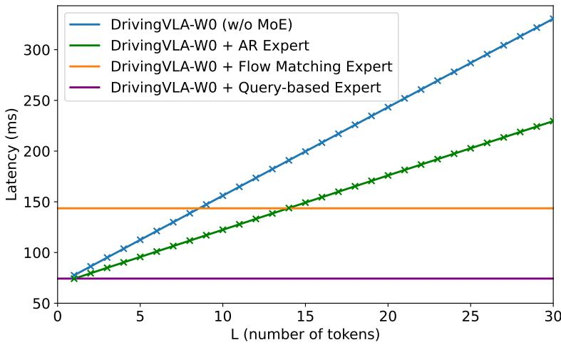  
Figure 6: Latency analysis. The latency of the AR expert and the VLA baseline scale linearly with the number of generated tokens L, while the flow matching and query-based experts maintain a constant inference time.

## B.2 POSITIVE CORRELATION BETWEEN GENERATIVE FIDELITY AND PLANNING PERFORMANCE

To investigate the link between a world model’s generative fidelity and its downstream planning performance, we conduct this experiment. First, we establish two models with different generative capabilities by pretraining them on NuPlan with varying context lengths: a 6VA model conditioned on five prior vision-action pairs, and a 2VA model conditioned on just one. As expected, evaluating these checkpoints directly shows that the 6VA model’s longer context yields a superior FID score (Table 8), confirming its higher generative fidelity. With these models of varying generative quality established, we

Table 8: Positive Correlation Between Generative Fidelity and Planning Performance. ∗: indicates the images reconstructed by the MoVQGAN encoder-decoder, which serves as an upper bound for generative quality.
<table><tr><td>Sequence Design</td><td>FID↓</td><td>PDMS↑</td></tr><tr><td>2VA</td><td>9.847</td><td>84.1</td></tr><tr><td>6VA</td><td>4.610</td><td>85.6</td></tr><tr><td>Upper Bound*</td><td>3.007</td><td></td></tr></table>

then test their potential for downstream planning. We fine-tune both NuPlan-pretrained checkpoints on NAVSIM under an identical setting (the same as the bottom two rows in Table 5) and evaluate their final PDMS scores. The results confirm a strong positive correlation: the 6VA checkpoint, which had superior generative fidelity, also achieves higher planning performance after fine-tuning. This provides compelling evidence that the model’s ability to generate high-quality, realistic future images is directly linked to its capacity for producing high-quality trajectories.

## B.3 ABLATION STUDY

The Time Horizon of World Model We conduct an ablation study to identify the optimal temporal horizon for our world model’s input. Using a shared 6VA-pretrained checkpoint, we fine-tune and evaluate three configurations that differ in their temporal input range, as shown in Table 9: i) VA: Uses only the current visual frame, providing no historical visual context. ii) VAVA (1s): Uses the current frame and a second frame from 1 second in the past. iii) VAVA (4s): Uses the current frame and a second frame from 4 seconds in the past. The VAVA (1s) configuration achieves the best overall performance, reaching the highest PDMS score of 85.6. This suggests an optimal trade-off in the temporal input. The VA setting, lacking a second visual frame, struggles to capture the environment’s dynamic information. Conversely, the 4-second interval in the VAVA (4s) setting introduces excessive scene variation between the two distant frames, which likely makes the future prediction task more challenging for the model.

## C VISUALIZATION

## C.1 PLANNING TRAJECTORY

In this section, we provide a qualitative case analysis to offer deeper insights into our model’s behavior and validate our key findings. Our analysis is twofold. First, as shown in Figure 7, we compare our DriveVLA-W0 against baseline models (VLA baseline and TransFuser) in a challenging corner case to visually demonstrate the benefits of world modeling for navigating complex scenarios. Second, we compare the trajectories generated by different action experts built upon the same VLA backbone. The subsequent visualizations in Figure 8,9,10 reveal that the AR expert generates markedly more stable trajectories than the flow-matching approach, particularly in terms of inter-frame consistency and avoiding aggressive maneuvers.

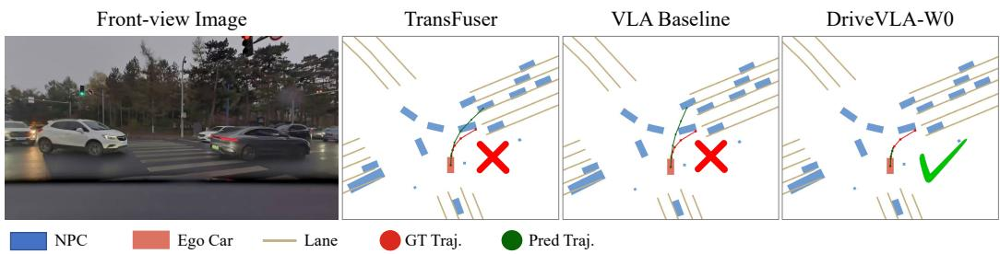  
Figure 7: World modeling improves trajectory planning in complex scenarios. TransFuser and VLA baseline often fail in such interaction scenarios due to their weak ability to predict scene dynamics. However, with the support of world modeling, VLA-W0 possesses strong predictive capabilities, thereby avoiding collision in this type of scenario.

Table 9: Ablation on the temporal interval for world model inputs. The results reveal a clear performance trade-off, with a 1-second interval being optimal. Using only the current frame (VA) lacks sufficient temporal context, while a 4-second interval introduces excessive scene variation.
<table><tr><td>Pretrain Type</td><td>Finetune Type</td><td>TI</td><td>NC↑</td><td>DAC ↑</td><td>TTC ↑</td><td>Comf. ↑</td><td>EP↑</td><td>PDMS ↑</td></tr><tr><td>6VA</td><td>VA</td><td>1</td><td>96.6</td><td>92.6</td><td>91.2</td><td>100.0</td><td>78.8</td><td>82.9</td></tr><tr><td>6VA</td><td>2VA</td><td>4s</td><td>97.9</td><td>93.2</td><td>93.9</td><td>100.0</td><td>78.3</td><td>84.3</td></tr><tr><td>6VA</td><td>2VA</td><td>1s</td><td>98.3</td><td>93.8</td><td>94.2</td><td>100.0</td><td>80.0</td><td>85.6</td></tr></table>

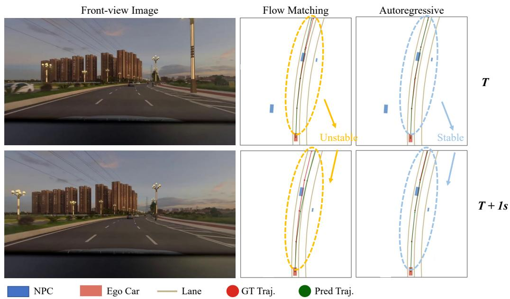  
Figure 8: Comparison of flow matching and autoregressive action expert. The trajectory generated by the flow matching action expert is relatively unstable, with jumps occurring between adjacent frames, while the AR action expert generates much more stable trajectories.

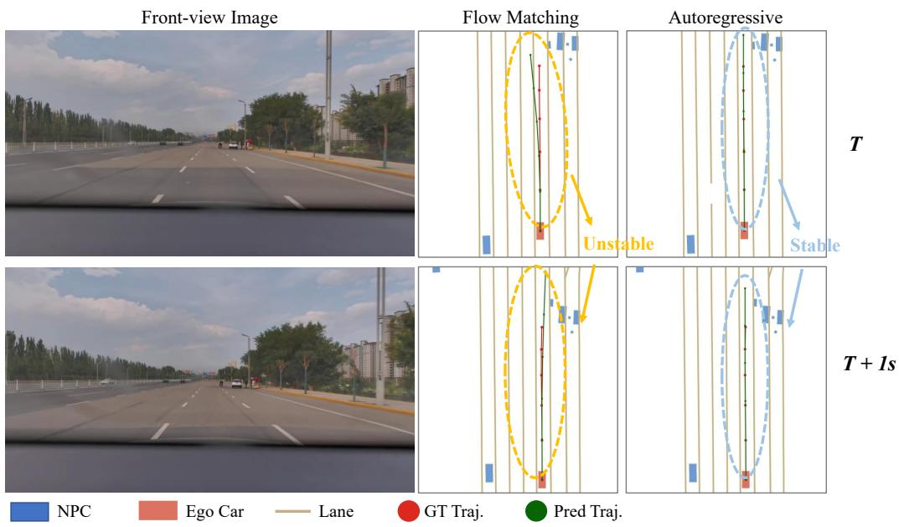  
Figure 9: Comparison of flow matching and autoregressive action expert. The trajectory generated by the flow matching action expert is relatively unstable, with jumps occurring between adjacent frames, while the AR action expert generates much more stable trajectories.

## C.2 FAILURE CASE

To provide a balanced view of our model’s performance and identify directions for future improvement, we analyze representative failure cases encountered during evaluation. We categorize these failures into two primary types: instruction ambiguity and dynamic prediction errors. As illustrated in Figure 11, coarse-grained navigation commands can lead to indecision in complex road topologies (e.g., Y-junctions). Additionally, Figure 12 highlights the challenge of predicting fine-grained dynamic objects (e.g., oncoming vehicles) in high-interaction scenarios.

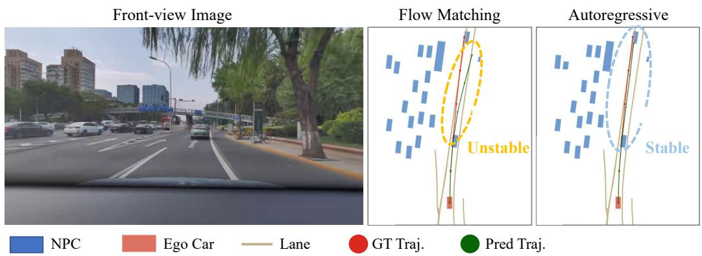  
Figure 10: Comparison of flow matching and autoregressive action expert. The trajectory generated by the flow matching action expert is relatively unstable, and it may go beyond the drivable area. The AR action expert generates much more stable trajectories.

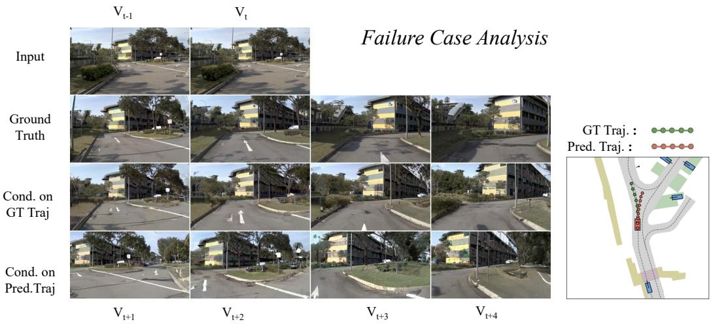  
Figure 11: Failure case analysis: ambiguity in driving commands. We illustrate a failure mode stemming from the ambiguity of coarse-grained navigation instructions. In this Y-shaped intersection, the model receives a generic “go straight” command. Due to the splitting road topology, this instruction is ambiguous, as it maps clearly to neither the left nor the right branch. Consequently, the model fails to commit to a valid lane, hesitantly driving straight into the fork area (as shown by the predicted red trajectory). This highlights a limitation in the current NAVSIM benchmark, where the discrete command set (restricted to simple Turn Left/Straight/Right) lacks the granularity to resolve ambiguities in complex geometries. Note: To faithfully represent the visual information available to the model, all displayed images are reconstructionsfrom the MoVQGAN tokens, rather than raw RGB frames.

## C.3 FUTURE IMAGE GENERATION

Our world model demonstrates both high visual fidelity and strong action consistency. As shown in Figure 13, it generates realistic and plausible images across diverse and challenging scenarios. More importantly, these visual predictions are tightly coupled with the model’s planning process.

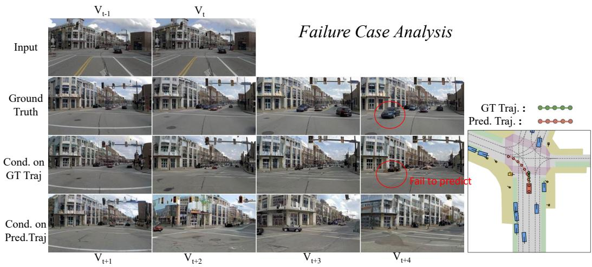  
Figure 12: Failure case analysis: dynamic object prediction. While our world model generalizes well to most dynamic scenes, it faces challenges in predicting multiple objects at complex intersections. In this specific case, the world model fails to anticipate the emergence of oncoming vehicles in the future frames (as reflected in the Cond. on GT Traj). Consequently, the planner, unaware of the potential conflict, incorrectly executes a left turn. This highlights the modeling of fine-grained dynamic objects as a valuable direction for future research. Note: To faithfully represent the visual information available to the model, all displayed images are reconstructions from the MoVQGAN tokens, rather than raw RGB frames.

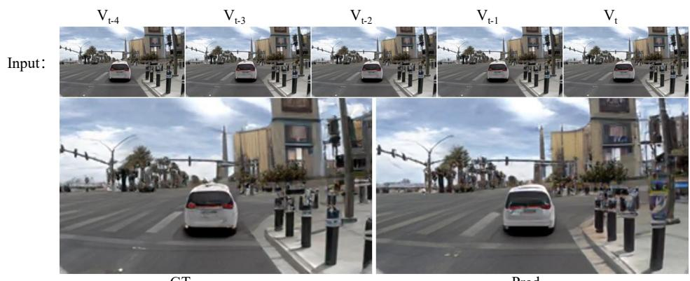

(a) Complex intersections  
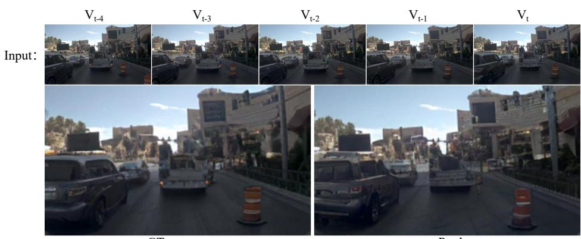  
GT  
(b) Static traffic jam scenarios  
Pred.  
Figure 13: Future image generation. Our world model demonstrates strong generative fidelity, producing visually realistic and contextually plausible futures across diverse and challenging scenarios, including complex intersections and dense traffic.

## C.4 COUNTERFACTUAL REASONING

This section investigates the model’s capability for counterfactual reasoning, synthesizing alternative futures based on hypothetical actions. As shown in Figure 14, conditioning the model on a "turn right" action generates realistic off-road imagery despite the ground truth being straight. This confirms that the model captures the underlying scene geometry rather than merely memorizing training trajectories.

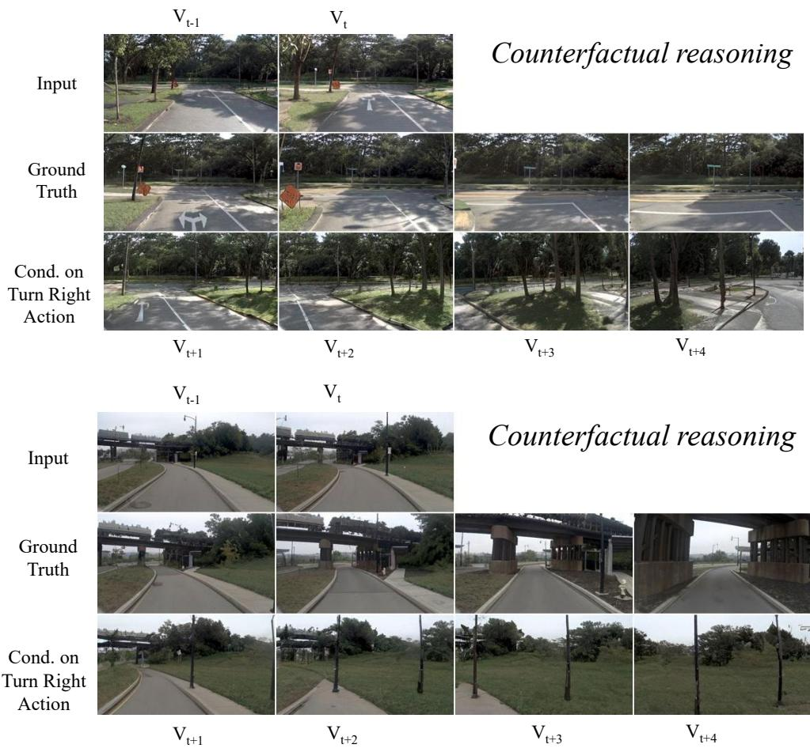  
Figure 14: Counterfactual reasoning. By conditioning on a counterfactual "turn right" action at the roadside, our world model generates realistic video sequences where the vehicle deviates from the ground truth trajectory and drives off-road. This validates that the model has learned the underlying scene geometry rather than simply memorizing the training data.

## D MORE IMPLEMENTATION DETAILS

TransFuser For consistency of the setting, we adopt Latent TransFuser, which replaces the LiDAR branch’s real sensor features with BEV latent queries. The camera branch supplies the primary semantic and appearance features, while the latent BEV branch provides learnable global query anchors; the two are aligned and made complementary via cross-modal cross-attention. In this way, Latent TransFuser retains the global geometric priors of the BEV view and achieves stable fusion and planning performance under a vision-only setup. We instantiate two image backbones to highlight capacity trade-offs: a lightweight ResNet-34 variant (TransFuser-50MB) and a large DINOv3 ViT-7B variant (TransFuser-7B). Concretely, the inputs are single front-view RGB image I and a latent BEV query tensor $\mathbf { Q } _ { \mathrm { b e v } }$ of size $H \times { \dot { W } }$ . After an image encoder (ResNet-34 or DINOv3) and a BEV latent encoder, we obtain $\mathbf { F } _ { \mathrm { i m g } }$ and $\mathbf { F } _ { \mathrm { b e v } }$ , which are then aligned and fused through a multi-scale cross-attention module to produce the fused representation $\mathbf { F } _ { \mathrm { f u s e } } .$ A planning head predicts K future waypoints $\{ \hat { \mathbf { p } } _ { t + 1 } , \dotsc , \hat { \mathbf { p } } _ { t + K } \}$ based on $\mathbf { F } _ { \mathrm { f u s e } }$

## E MORE RELATED WORK

Scaling Laws in Deep Learning. Kaplan et al. (2020) were the first to systematically demonstrate that pretraining loss scales as a power law with model size, dataset size, and computational cost. Chinchilla (Hoffmann et al., 2022) then showed many LMs were undertrained and derived a computeoptimal prescription that scales model size and tokens proportionally. In computer vision, Zhai et al. (2022) charted ViT scaling law with stable training recipes, and ViT-22B (Dehghani et al., 2023) scaled ViTs to 22B parameters, verifying predictable multi-task improvements. Lin et al. (2025) conducted a large-scale study of imitation-learning data scaling in robotics, and found near–power-law gains from increasing environmental and object diversity with improved zero-shot generalization. In autonomous driving, STR (Sun et al., 2023) shows large trajectory models scale steadily in both prediction and planning, and Baniodeh et al. (2025) reported power-law improvements for joint motion forecasting and planning with large driving datasets. For end-to-end driving, Naumann et al. (2025) observe roughly log-linear gains in both open- and closed-loop metrics as training data scale increases. Zheng et al. (2024b) also observe power-law improvements from data scaling in a large-scale imitation learning study. However, Zheng et al. (2024b) exclusively analyzes scaling behavior within the conventional paradigm of sparse action supervision. Our work, in contrast, provides the first study of how these scaling laws are reshaped by the self-supervised signals provided by world modeling.

## F USE OF LLMS

Large Language Models (LLMs) are employed to polish the writing in this manuscript.