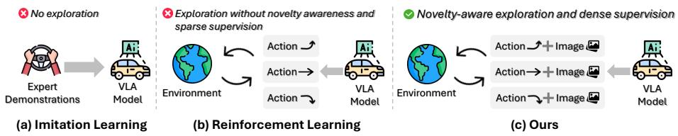
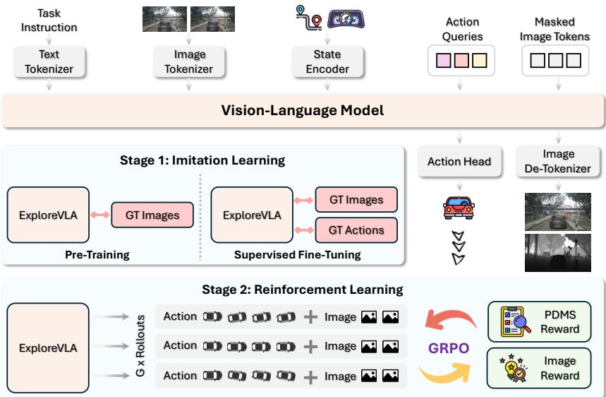
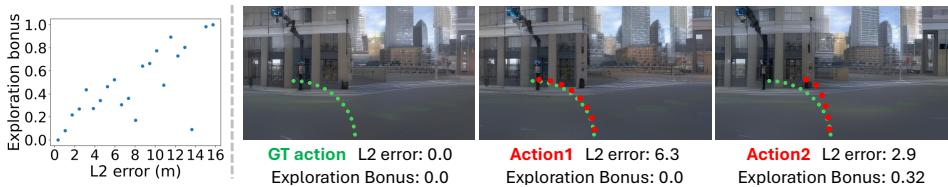
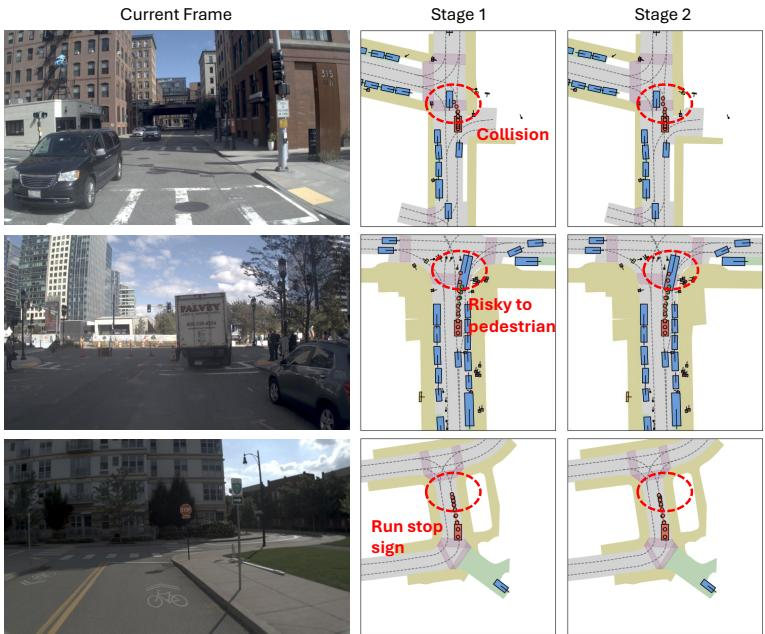
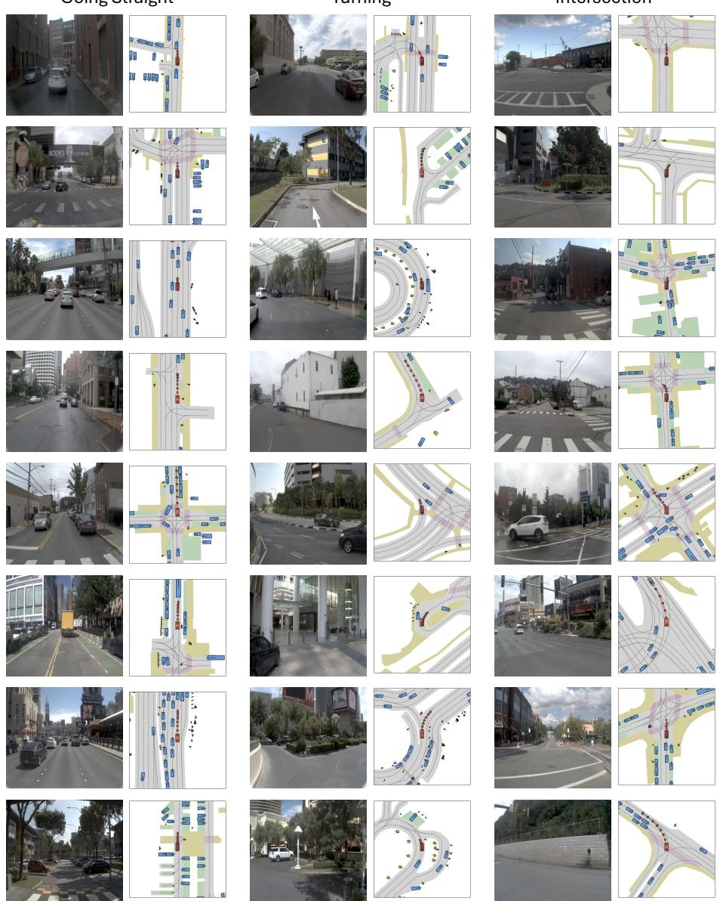
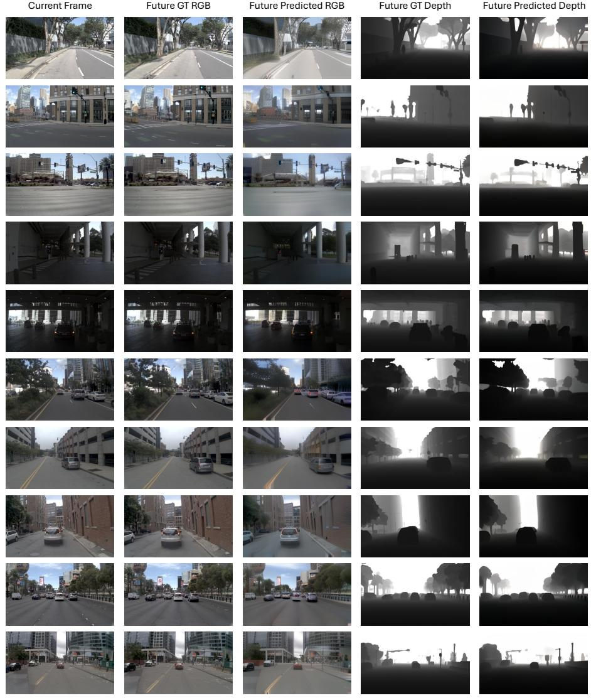

# ExploreVLA: Dense World Modeling and Exploration for End-to-End Autonomous Driving

Zihao Sheng1,2 \*, Xin Ye1, Jingru Luo1, Sikai Chen2 , and Liu Ren1

1 Bosch Research North America & Bosch Center for Artificial Intelligence (BCAI) 2 University of Wisconsin–Madison {zihao.sheng,sikai.chen}@wisc.edu {xin.ye3,jingru.luo,liu.ren}@us.bosch.com

Abstract. End-to-end autonomous driving models based on Vision-Language-Action (VLA) architectures have shown promising results by learning driving policies through behavior cloning on expert demonstrations. However, imitation learning inherently limits the model to replicating observed behaviors without exploring diverse driving strategies, leaving it brittle in novel or out-of-distribution scenarios. Reinforcement learning (RL) ofers a natural remedy by enabling policy exploration beyond the expert distribution. Yet VLA models, typically trained on ofline datasets, lack directly observable state transitions, necessitating a learned world model to anticipate action consequences. In this work, we propose a unified understanding-and-generation framework that leverages world modeling to simultaneously enable meaningful exploration and provide dense supervision. Specifically, we augment trajectory prediction with future RGB and depth image generation as dense world modeling objectives, requiring the model to learn fine-grained visual and geometric representations that substantially enrich the planning backbone. Beyond serving as a supervisory signal, the world model further acts as a source of intrinsic reward for policy exploration: its image prediction uncertainty naturally measures a trajectory’s novelty relative to the training distribution, where high uncertainty indicates outof-distribution scenarios that, if safe, represent valuable learning opportunities. We incorporate this exploration signal into a safety-gated reward and optimize the policy via Group Relative Policy Optimization (GRPO). Experiments on the NAVSIM and nuScenes benchmarks demonstrate the efectiveness of our approach, achieving a state-of-theart PDMS score of 93.7 and an EPDMS of 88.8 on NAVSIM. The code is available at https://zihaosheng.github.io/ExploreVLA/.

Keywords: Autonomous driving · Vision-language-action model · World action model

## 1 Introduction

End-to-end autonomous driving has advanced rapidly with the emergence of Vision-Language-Action (VLA) architectures [20,21,39,58], which unify perception, reasoning, and planning within a single model. By leveraging the representational power of large vision-language models, these models have demonstrated promising capabilities in translating raw sensor observations into driving actions. Yet, the dominant training paradigm for such models (behavior cloning on expert demonstrations or supervised fine-tuning) introduces a fundamental bottleneck: the learned policy can only replicate the behaviors it has observed, without the ability to discover alternative strategies that may be equally or more efective. This limitation manifests as distributional brittleness: when confronted with scenarios that deviate from the expert distribution, the policy lacks the exploratory experience needed to generalize [6, 34].

  
Fig. 1: Comparison of training paradigms for VLA-based autonomous driving. (a) Imitation learning directly clones expert demonstrations without exploration. (b) Previous reinforcement learning enables policy exploration, but cannot distinguish expert imitation from genuine out-of-distribution discovery and relies on sparse supervision. (c) Our approach augments RL with dense world modeling supervision via future image generation, while leveraging image prediction uncertainty as a novelty measure to identify and prioritize valuable exploratory strategies.

Reinforcement learning (RL) ofers a principled mechanism to overcome this limitation by allowing the agent to explore beyond the boundaries of expert data and optimize its policy through trial-and-error interaction [14]. Recent advances in RL post-training, exemplified by Group Relative Policy Optimization (GRPO) [35], have demonstrated that sampling diverse candidate outputs and performing relative ranking can efectively improve policy quality atop strong pretrained models. However, applying RL to autonomous driving poses challenges distinct from other domains. In language tasks, state transitions are fully determined by the model’s output, and outcomes are immediately observable. In robotics, high-fidelity simulators enable safe trial-and-error. Autonomous driving enjoys neither advantage: the consequences of a planned trajectory depend on complex scene dynamics that no existing simulator faithfully captures. These challenges motivate the need for a world model that can internalize environment dynamics and anticipate action consequences from data alone. Yet a further challenge remains: standard task-level rewards such as Predictive Driver Model Score (PDMS) [7] evaluate trajectory quality but do not distinguish between policies that merely replicate expert behavior and those that have genuinely discovered novel strategies. An exploration signal orthogonal to task performance is therefore essential to unlock the full potential of RL post-training.

A second limitation of existing VLA driving models is the sparsity of their supervisory signals. Most approaches rely on textual descriptions and trajectory waypoints as training targets [58, 59], which, while informative for high-level decision-making, fail to capture the rich spatial geometry and fine-grained appearance of driving scenes. This supervisory deficit constrains the model’s ability to build comprehensive representations, particularly for aspects of the environment (such as road topology, object extent, and depth ordering) that are critical for safe planning but are not explicitly encoded in sparse action labels [27].

In this work, we propose a unified understanding-and-generation framework that addresses both limitations through a single mechanism: dense world modeling and exploration (Fig. 1). Specifically, we augment trajectory prediction with future RGB and depth image generation as auxiliary objectives. On the supervision side, these generation tasks require the model to predict fine-grained visual appearance and metric geometry of future scenes, providing dense gradient signals that substantially enrich the planning backbone’s visual and geometric representations. On the exploration side, we leverage a key insight: the world model’s image prediction uncertainty naturally measures a trajectory’s novelty relative to the training distribution. Since the world model is trained exclusively on expert demonstrations, it produces low-uncertainty predictions for trajectories within the expert distribution but exhibits high uncertainty on out-ofdistribution (OOD) trajectories. Crucially, this uncertainty reflects distance to the entire training distribution, rather than deviation from a single ground-truth trajectory, which provides a more reliable novelty signal than trajectory distance alone. We incorporate this signal into a safety-gated exploration reward: trajectories that achieve high PDMS scores while exhibiting high prediction uncertainty are identified as valuable discoveries of new successful strategies and receive an exploration bonus. This composite reward is optimized via GRPO, enabling the policy to expand its behavioral repertoire while maintaining driving safety.

Our contributions can be summarized as follows:

We introduce a novel exploration mechanism for RL post-training that uses the world model’s image prediction uncertainty as an intrinsic novelty measure, coupled with a safety-gated reward to encourage beneficial out-ofdistribution exploration.

– We propose a unified VLA framework that jointly predicts future trajectories, RGB images, and depth images, leveraging dense world modeling to provide rich visual and geometric supervision for the planning backbone.

– We demonstrate state-of-the-art performance on the NAVSIM benchmark with a PDMS of 93.7 and an EPDMS of 88.8, and validate the generalizability of our approach on the nuScenes dataset.

## 2 Related Work

## 2.1 World Models for Autonomous Driving

In the context of autonomous driving, world models ofer the ability to predict future states of the driving scene, enabling planning, data augmentation, and closed-loop evaluation without costly real-world interactions [8,10,13,44]. A significant line of work focuses on video prediction-based world models [12, 15, 45]. For example, GAIA-1 [16] leverages a generative model conditioned on video, text, and action inputs to produce realistic driving videos. DriveDreamer [37] generates future driving frames conditioned on HDMaps and 3D bounding boxes. GenAD [46] proposes an action-conditioned video generation framework that supports long-horizon future prediction for planning. Another prominent direction explores world models within structured geometric spaces. UniWorld [33] proposes a unified framework for 4D occupancy forecasting, and OccWorld [55] extends this idea by predicting 3D occupancy and ego-motion jointly, providing a compact world representation for downstream planning. UniScene [24] further scales this paradigm by jointly generating consistent future semantic occupancy, LiDAR and multi-view images. Beyond generation and prediction, several works integrate world models into the planning pipeline. For instance, WoTE [28] incorporates a BEV world model to predict future states for online trajectory evaluation and selection. OmniNWM [25] employs a learned navigation world model to generate imagined futures and derive planning rewards from predicted scene dynamics. World4Drive [56] further introduces a latent world model that predicts future latent states under multiple driving intentions and selects trajectories via a learned selector. In our work, we leverage the world model not only for future state prediction but also as a source of intrinsic reward signals that encourage the policy to explore diverse and informative driving behaviors, thereby improving generalization beyond the coverage of the training data.

## 2.2 VLA Models for Autonomous Driving

The integration of vision, language, and action within a unified framework has emerged as a promising paradigm for autonomous driving [23, 29]. Early eforts, such as DriveGPT-4 [43], use frozen VLMs to narrate driving scenes but do not directly output control signals. Subsequent modular VLA approaches began embedding language into the planning loop. For example, OpenDriveVLA [58] fuses multimodal sensor inputs with textual route instructions to generate interpretable waypoints, while RAG-Driver [51] introduces retrieval-augmented planning for long-tail scenarios. The field then advances toward unified end-toend architectures. EMMA [20] jointly performs detection and planning within a single VLM, and DifVLA [21] combines difusion-based trajectory sampling with language-conditioned embeddings. Most recently, reasoning-augmented VLA mod els have pushed the frontier further. ORION [11] incorporates a transformer memory module for long-horizon reasoning, and AutoVLA [59] fuses CoT reasoning and trajectory planning in a single autoregressive transformer. Alpamayo-R1 [39] introduces causally grounded Chain-of-Causation reasoning tightly integrated with trajectory prediction, enhancing reasoning-action consistency and long-tail safety performance. Despite this rapid progress, most existing VLA models rely on textual descriptions and action trajectories as the primary supervisory signal, which are inherently sparse. This supervisory sparsity limits the model’s ability to learn comprehensive scene representations. In contrast, our work leverages RGB and depth images as auxiliary dense supervisory signals to encourage the model to capture richer visual and geometric cues, thereby yielding more accurate and robust trajectory planning.

## 2.3 Unified Understanding and Generation Models

In foundation model research, the long-standing separation between understanding and generation has motivated a growing efort to unify both within a single architecture for greater scalability and cross-task synergy [3, 38, 40]. In autonomous driving, this paradigm has gained significant traction as researchers seek to bridge the gap between world modeling and end-to-end planning. For example, FutureSightDrive [52] proposes a spatio-temporal visual Chain-of-Thought framework where a VLA model first generates future frames, including lane lines, 3D bounding boxes, and complete future images, as visual intermediate reasoning steps, then predicts trajectories conditioned on these imagined futures. Policy World Model (PWM) [54] pre-trains on large-scale action-free video generation to learn world dynamics, then fine-tunes with a collaborative formulation where trajectory planning is explicitly conditioned on forecasted future states. DriveVLA-W0 [27] introduces world modeling objectives to unlock data scaling laws for end-to-end driving. UniDrive-WM [42] unifies scene understanding, trajectory planning, and trajectory-conditioned future image generation within a single VLM. Epona [53] combines autoregressive causal modeling with difusion-based generation through decoupled spatiotemporal factorization, enabling both high-fidelity video synthesis and trajectory planning. Together, these works demonstrate that jointly modeling future scene generation and action prediction yields more informed and anticipatory planning. Our work follows this unified paradigm by leveraging RGB and depth image generation as dense supervisory signals alongside trajectory prediction, while further employing the world model to provide intrinsic reward signals that encourage exploratory driving behaviors and improve generalization beyond the training distribution.

## 3 Methodology

## 3.1 Overview

We present a unified understanding-and-generation framework for end-to-end autonomous driving that addresses two key limitations of existing VLA models: (1) the lack of exploration beyond expert demonstrations and (2) the reliance on sparse supervisory signals. Our framework consists of three components. First, we build upon a unified VLM backbone that jointly supports autoregressive text modeling and discrete image generation within a single architecture (Sec. 3.3). Second, we introduce future RGB and depth image generation as dense world modeling objectives that provide token-level supervision alongside trajectory prediction, encouraging the model to learn richer scene representations (Sec. 3.4). Third, we leverage the world model’s prediction uncertainty as an intrinsic reward signal to guide policy exploration via Group Relative Policy Optimization (GRPO), enabling the model to discover diverse driving strategies beyond mere imitation (Sec. 3.5). An overview of our framework is illustrated in Fig. 2.

  
Fig. 2: Model architecture and training paradigm of ExploreVLA. The model takes task instructions, multi-frame images, and ego status as input, and jointly predicts future trajectories and future images. Training proceeds in two stages: (1) imitation learning, consisting of pre-training on image generation and supervised fine-tuning on both actions and images, and (2) reinforcement learning, where GRPO optimizes the policy using a composite reward combining PDMS and image-based exploration bonus.

## 3.2 Problem Formulation

We formulate autonomous driving as a unified understanding-and-generation task, where a single model jointly predicts future trajectories and generates dense visual representations conditioned on the current driving context.

Input. At each timestep t, the model receives three inputs: (1) the current and T past front-view camera images $\{ \mathbf { I } _ { t - T } , \cdots , \mathbf { I } _ { t } \}$ with $\mathbf { I } \doteq \mathbb { R } ^ { H \times \mathnormal { W } \times 3 }$ , (2) a natural language command c, and (3) the ego-vehicle status $\mathbf { s } _ { t }$

Output. The model produces three types of outputs: (1) predicted future waypoints $\pmb { \tau } = \{ \hat { p } _ { i } \} _ { i = 1 } ^ { N _ { \tau } }$ , where $N _ { \tau }$ denotes the planning horizon, (2) predicted future RGB frames $\{ \hat { \mathbf { I } } _ { t + 1 } , \cdot \cdot \cdot , \hat { \mathbf { I } } _ { t + F } \}$ with $\hat { \textbf { I } } \in \ \mathbb { R } ^ { H ^ { \prime } \times W ^ { \prime } \times 3 }$ capturing the anticipated visual appearance of the driving scene, and (3) predicted future depth maps $\{ \hat { \mathbf { D } } _ { t + 1 } , \cdot \cdot \cdot , \hat { \mathbf { D } } _ { t + F } \}$ with $\hat { \mathbf { D } } \in \mathbb { R } ^ { \breve { H } ^ { \prime } \times W ^ { \prime } }$ encoding the geometric structure of the future scene. Here F denotes the number of future frames to generate.

## 3.3 Unified Understanding and Generation Architecture

Tokenization. We maintain a unified vocabulary of discrete tokens spanning text, images, and special task indicators. For text tokenization, we adopt the same tokenizer from the pre-trained LLM backbone, such that the language command c is tokenized into L text tokens $\mathbf { v } = \{ v _ { 1 } , v _ { 2 } , \cdot \cdot \cdot , v _ { L } \}$ . For image tokenization, we employ a pre-trained $\mathrm { M A G V I T - v 2 \ [ 4 9 ] }$ quantizer with a lookupfree codebook of size $K = 8 { , } 1 9 2$ . Each image is encoded into discrete tokens by partitioning it into non-overlapping patches of size $1 6 \times 1 6$ . Each of the $( T + 1 )$ input frames is independently tokenized into M image tokens, yielding the input image token sequence ${ \bf u } = \left\{ u _ { 1 } , u _ { 2 } , \cdot \cdot \cdot , u _ { ( T + 1 ) \times M } \right\}$ . For ego status encoding, the $\mathbf { s } _ { t }$ is projected into the transformer’s embedding space via a learnable MLP, producing ego status embeddings $\mathbf { e } _ { s }$ that are concatenated with the other input tokens.

Causal and Full Attention Mechanism. We adopt the omni-attention mechanism from Show-o [40], which adaptively combines causal and full attention depending on the token type. Text tokens v and ego status embeddings $\mathbf { e } _ { s }$ are processed via causal attention, where each token attends only to its preceding tokens. Image tokens u are processed via full attention, which allows comprehensive interaction among all spatial positions and ensures that the generation process is fully conditioned on the driving context.

Trajectory Prediction Head. In addition to the generation outputs, we extract the hidden states from the transformer at designated positions and feed them through a lightweight MLP head to predict future waypoints:

$$
\tau = \operatorname { M L P } ( \mathbf { h } ) ,\tag{1}
$$

where h denotes the hidden representation. This design decouples trajectory prediction from the discrete token vocabulary, allowing the model to produce continuous-valued waypoints while sharing the same contextualized representations learned through the joint understanding-and-generation objective.

## 3.4 Dense Supervisory Signals via World Modeling

A central limitation of existing VLA models for autonomous driving is their reliance on sparse supervisory signals. Textual descriptions provide only high-level semantic intent (e.g., “turn left”), while trajectory waypoints encode a thin, lowdimensional slice of the rich information embedded in driving scenes. As a result, the vast majority of scene structure, such as patial layout and depth ordering, remains unsupervised, which limits the model’s ability to learn comprehensive representations of the driving environment.

We address this by formulating future scene generation as an auxiliary world modeling objective that provides dense supervision alongside trajectory prediction. Our model is trained to generate F future frames of both RGB images and depth maps, efectively requiring it to “imagine” the future visual and geometric state of the world. This dense generation objective forces the model to internalize fine-grained knowledge about scene dynamics.

RGB Generation as Visual Supervision. The future RGB generation objective requires the model to predict the visual appearance of upcoming driving scenes, providing dense supervision over texture, color, object identity, and scene semantics. Each future RGB frame is tokenized via the shared MAGVIT-v2 quantizer, and the model learns to reconstruct randomly masked tokens through the mask token prediction objective. Formally, the RGB generation loss over all F future frames is:

$$
\mathcal { L } _ { \mathrm { r g b } } = - \sum _ { f = 1 } ^ { F } \sum _ { j } \log p _ { \boldsymbol \theta } \left( u _ { f , j } ^ { \mathrm { r g b } } \mid \mathbf { u } _ { f , * } ^ { \mathrm { r g b } } , \ \mathbf { v } , \ \mathbf { e } _ { s } , \ \mathbf { u } \right) ,\tag{2}
$$

where $u _ { f , j } ^ { \mathrm { r g b } }$ is the j-th masked token of the f-th future RGB frame, and ${ \mathbf { u } } _ { f , * } ^ { \mathrm { r g b } }$ denotes the corresponding masked sequence. By reconstructing future visual tokens, the model learns to capture how scene appearance evolves under the current driving context.

Depth Generation as Geometric Supervision. Complementary to RGB, the depth generation objective supervises the model on the 3D geometric structure of future scenes. Depth maps encode object distances, spatial layout, and surface orientation, which is critical for safe planning but entirely absent from text or trajectory supervision. The depth generation loss is defined analogously:

$$
\mathcal { L } _ { \mathrm { d e p t h } } = - \sum _ { f = 1 } ^ { F } \sum _ { j } \log p _ { \theta } \left( u _ { f , j } ^ { \mathrm { d e p } } \mid \mathbf { u } _ { f , * } ^ { \mathrm { d e p } } , \mathbf { u } _ { f , * } ^ { \mathrm { r g b } } , \mathbf { v } , \mathbf { e } _ { s } , \mathbf { u } \right) ,\tag{3}
$$

where $u _ { f , j } ^ { \mathrm { d e p } }$ is the j-th masked token of the f-th future depth map. The overall mask token prediction (MTP) loss decomposes as:

$$
\mathcal { L } _ { \mathrm { M T P } } = \mathcal { L } _ { \mathrm { r g b } } + \mathcal { L } _ { \mathrm { d e p t h } } .\tag{4}
$$

## 3.5 Intrinsic Reward from World Model for Exploration

Models trained purely via behavior cloning tend to narrowly replicate the expert’s actions and struggle to generalize when the test-time distribution deviates from the training data. In the second stage of training, we leverage the world model learned in the first stage as a source of intrinsic reward signals that encourage the policy to explore novel yet safe driving behaviors beyond mere imitation. The core idea is that the world model’s image prediction uncertainty provides a natural measure of trajectory novelty relative to the entire training distribution: high uncertainty indicates that the model has rarely encountered the visual consequences of a given action, signaling an out-of-distribution trajectory that, if safe, represents a valuable learning opportunity.

Uncertainty-Based Exploration Bonus. Given a candidate trajectory $\tau _ { i }$ sampled from the current VLA policy, we condition the world model on $\tau _ { i }$ and perform future image generation. For each predicted discrete image token, the model outputs a probability distribution over the MAGVIT-v2 codebook. We quantify the prediction uncertainty using the entropy of these token-level distributions, averaged across all generated future RGB and depth tokens:

$$
\mathcal { H } ( \pmb { \tau } _ { i } ) = - \frac { 1 } { \vert \mathcal { M } \vert } \sum _ { j \in \mathcal { M } } p _ { j } \log p _ { j } ,\tag{5}
$$

where M denotes the set of generated image token positions across all future RGB and depth frames, and $p _ { j }$ is the predicted probability of image token $j .$ A high entropy indicates that the world model is uncertain about the visual consequences of trajectory $\tau _ { i } ,$ meaning the trajectory leads to scenarios underrepresented in the training distribution. Conversely, low entropy indicates an in-distribution trajectory whose consequences the model has already learned to predict. We define the exploration bonus as the normalized entropy:

$$
b _ { i } = f ( \mathcal { H } ( \tau _ { i } ) ) ,\tag{6}
$$

where $f ( \mathcal { H } ) = ( \mathcal { H } - \mathcal { H } _ { \operatorname* { m i n } } ) / ( \mathcal { H } _ { \operatorname* { m a x } } - \mathcal { H } _ { \operatorname* { m i n } } )$ maps the raw entropy to a normalized bonus $b _ { i } \in [ 0 , 1 ]$ .

Safety-Gated Reward. High uncertainty alone does not guarantee that exploration is beneficial, since a trajectory leading to a collision is novel but not useful. We therefore gate the exploration bonus using the PDMS [7], which evaluates trajectory quality on a [0, 1] scale based on collision avoidance, comfort, and progress. The intrinsic reward for trajectory $\tau _ { i }$ is:

$$
R _ { i } = \left\{ \begin{array} { l l } { \mathrm { P D M S } _ { i } + \lambda \cdot b _ { i } , } & { \mathrm { i f ~ } \mathrm { P D M S } _ { i } > \delta , } \\ { \mathrm { P D M S } _ { i } , } & { \mathrm { o t h e r w i s e } , } \end{array} \right.\tag{7}
$$

where $\delta$ is a safety threshold and λ controls the exploration strength. The gating mechanism ensures that only safe trajectories $\left( \mathrm { P D M S } _ { i } > \delta \right)$ receive the exploration bonus. Unsafe or failed explorations are scored purely by their PDMS without additional encouragement. This design prioritizes trajectories that are simultaneously novel (high world model uncertainty) and good (high PDMS). Such trajectories represent out-of-distribution behaviors that are critical for improving generalization beyond expert demonstrations.

Policy Optimization via GRPO. We optimize the policy using GRPO [35]. At each iteration, we sample a group of $G$ candidate trajectories $\{ \tau _ { 1 } , \cdots , \tau _ { G } \}$ from the current policy. Each trajectory and corresponding predicted image tokens are scored using the reward in Eq. (7), and rewards are normalized within the group to compute relative advantages:

$$
\hat { A } _ { i } = \frac { R _ { i } - \operatorname* { m e a n } ( \{ R _ { 1 } , \cdot \cdot \cdot , R _ { G } \} ) } { \operatorname { s t d } ( \{ R _ { 1 } , \cdot \cdot \cdot , R _ { G } \} ) } .\tag{8}
$$

The policy is updated to increase the likelihood of trajectories with positive advantages and suppress those with negative advantages. This group-relative formulation naturally steers the policy toward trajectories that are both good and novel within each sampled group.

## 3.6 Training Strategy

As shown in Fig. 2, our training proceeds in two stages. The first stage consists of two phases: pre-training and supervised fine-tuning. During pre-training, ground-truth future actions are provided as input, and the model is trained solely with the image generation objective. This allows the model to adapt its visual generation capabilities to driving scenes. In the supervised fine-tuning phase, the model is trained to jointly predict both actions and future images. In the second stage, we further refine the policy using an intrinsic reward derived from the world model to encourage exploration.

## 4 Experiments

## 4.1 Experimental Setup

Datasets. We evaluate our method on two widely used autonomous driving benchmarks: NAVSIM and nuScenes.

NAVSIM [2, 7] is a recently proposed non-reactive simulation benchmark built upon the OpenScene dataset. NAVSIM v1 evaluates planning quality using PDMS [7], and NAVSIM v2 adopts the Extended PDMS (EPDMS) [2]. Both metrics aggregate factors such as progress, time-to-collision, and comfort, achieving stronger correlation with closed-loop evaluations. We train on the navtrain split and report results on the navtest split. In NAVSIM, the model predicts future waypoints in the form of $( x , y , \theta )$ over a 4-second planning horizon.

nuScenes [1] consists of 1,000 driving scenes and has become a standard benchmark for open-loop planning evaluation. Following prior works [18,19,22], we adopt the standard train/val split and evaluate using the L2 displacement error and collision rate between predicted and ground-truth trajectories. On nuScenes, the model predicts future waypoints in the form of $( x , y )$ . The evaluation results on nuScenes are presented in the supplementary material.

Implementation Details. Our model is built upon Show-o [40] as the backbone architecture. In the first training stage, we first pre-train the model for 10 epochs by conditioning on ground-truth future actions and supervising only the image generation. We then perform supervised fine-tuning for 15 epochs, where the model jointly predicts future trajectories and generates future RGB and depth images. In the second stage, we apply GRPO-based post-training with LoRA [17] for 5 epochs to further refine the policy using the exploration-aware reward described in Sec. 3.5. All experiments are conducted on 4×H200 GPUs. We obtain depth maps from a pre-trained monocular depth estimation model [48]. Detailed hyperparameters are provided in the supplementary material.

Table 1: Comparison on NAVSIM v1 with closed-loop metrics. The best performance is marked in bold, and the second best is underlined. Abbreviations: no at-fault collision (NC), drivable area compliance (DAC), ego progress (EP), time to collision (TTC), comfort (Comf.). SC: single-view camera; MC: multi-view camera; L: LiDAR; †: best-of-N (N=6) strategy [59].
<table><tr><td rowspan=1 colspan=1>Model</td><td rowspan=1 colspan=1>Input</td><td rowspan=1 colspan=2>NC↑DAC ↑EP↑ TTC ↑Comf. ↑PDMS ↑</td></tr><tr><td rowspan=1 colspan=1>Ego Status MLP</td><td rowspan=1 colspan=1></td><td rowspan=1 colspan=1>93.1   78.3   63.2   84.0    99.9</td><td rowspan=1 colspan=1>66.4</td></tr><tr><td rowspan=2 colspan=1>TransFuser [5]DRAMA [50]</td><td rowspan=1 colspan=1></td><td rowspan=1 colspan=1>97.8   92.6   78.9  92.9    99.9</td><td rowspan=1 colspan=1>83.9</td></tr><tr><td rowspan=1 colspan=1>MC+L</td><td rowspan=1 colspan=1>98.2   95.2  81.3  94.2   100.0</td><td rowspan=1 colspan=1>86.9</td></tr><tr><td rowspan=1 colspan=1>Hydra-MDP [31]</td><td rowspan=1 colspan=1>MC+L</td><td rowspan=1 colspan=1>99.1   98.3  85.2  96.6   100.0</td><td rowspan=1 colspan=1>91.3</td></tr><tr><td rowspan=2 colspan=1>Centaur [36]DriveSuprim [47]</td><td rowspan=1 colspan=1>MC+L</td><td rowspan=1 colspan=1>99.2   98.7  86.0  97.2    99.9</td><td rowspan=1 colspan=1>92.1</td></tr><tr><td rowspan=1 colspan=1>MC+L</td><td rowspan=1 colspan=1>98.6   98.6  91.3  95.5   100.0</td><td rowspan=1 colspan=1>93.5</td></tr><tr><td rowspan=1 colspan=1>DrivingGPT [4]</td><td rowspan=1 colspan=1>SC</td><td rowspan=1 colspan=1>98.9   90.7  79.9  94.9    95.6</td><td rowspan=1 colspan=1>82.4</td></tr><tr><td rowspan=1 colspan=1>FSDrive [52]</td><td rowspan=1 colspan=1>SC</td><td rowspan=1 colspan=1>98.2   93.8   80.1   93.3    99.9</td><td rowspan=1 colspan=1>85.1</td></tr><tr><td rowspan=1 colspan=1>PWM [54]</td><td rowspan=1 colspan=1>SC</td><td rowspan=1 colspan=1>98.9   95.8  81.5   95.9   100.0</td><td rowspan=1 colspan=1>88.1</td></tr><tr><td rowspan=2 colspan=1>AutoVLA [59]AutoVLA† [59]</td><td rowspan=1 colspan=1>MC</td><td rowspan=1 colspan=1>98.4   95.6   81.9   98.0    99.9</td><td rowspan=1 colspan=1>89.1</td></tr><tr><td rowspan=1 colspan=1>MC</td><td rowspan=2 colspan=1>99.1   97.1   87.6  97.1    99.998.7  99.1  87.6  97.1   100.0</td><td rowspan=2 colspan=1>92.190.2</td></tr><tr><td rowspan=2 colspan=1>DriveVLA-W0 [27]DriveVLA-W0† [27]</td><td rowspan=1 colspan=1>SC</td></tr><tr><td rowspan=1 colspan=1>SC</td><td rowspan=1 colspan=1>99.9   97.4  88.3  97.0    99.9</td><td rowspan=1 colspan=1>93.0</td></tr><tr><td rowspan=2 colspan=1>ExploreVLAExploreVLA↑</td><td rowspan=1 colspan=1>SC</td><td rowspan=1 colspan=1>98.8   98.4  83.5  96.5    99.9</td><td rowspan=2 colspan=1>90.493.7</td></tr><tr><td rowspan=1 colspan=1>SC</td><td rowspan=1 colspan=1>99.4   98.9  88.3  98.3    99.7</td></tr></table>

## 4.2 Main Results

Results on NAVSIM v1. Tab. 1 presents the comparison on the NAVSIM v1 benchmark. Our ExploreVLA achieves the highest PDMS of 93.7 with the best-of-N strategy, outperforming all prior approaches. Notably, ExploreVLA uses only a single-view camera, yet surpasses multi-sensor methods such as DriveSuprim and Centaur. Even without the best-of-N strategy, ExploreVLA attains a PDMS of 90.4, which is competitive with multi-view methods like AutoVLA. Among the sub-metrics, ExploreVLA† achieves the best TTC and the second-best scores on NC, DAC, and EP, demonstrating that our world-modelbased exploration reward helps the model internalize diverse and robust driving behaviors beyond what pure imitation learning can provide.

Results on NAVSIM v2. Tab. 2 further validates our approach on NAVSIM v2, which introduces extended closed-loop metrics including driving direction compliance (DDC), trafic light compliance (TLC), lane keeping (LK), history comfort (HC), and extended comfort (EC). ExploreVLA achieves the highest EPDMS of 88.8, surpassing the previous best result of 86.1 by DriveVLA-W0 by 2.7 points. Our method obtains the best scores on six out of nine individual metrics, while remaining highly competitive on the rest.

Table 2: Comparison on NAVSIM v2 with extended closed-loop metrics. The best performance is marked in bold, and the second best is underlined.
<table><tr><td>Model</td><td>|NC ↑ DAC ↑ DDC ↑ TLC ↑|EP ↑ TTC ↑ LK ↑ HC ↑ EC ↑</td><td></td><td></td><td></td><td></td><td></td><td></td><td></td><td>EPDMS ↑</td></tr><tr><td>Ego Status</td><td>93.1 77.9</td><td>92.7</td><td>99.6</td><td>86.0</td><td>91.5</td><td>89.4</td><td>98.3</td><td>85.4</td><td>64.0</td></tr><tr><td>TransFuser [5]</td><td>96.9 89.9</td><td>97.8</td><td>99.7</td><td>87.1</td><td>95.4</td><td>92.7</td><td>98.3</td><td>87.2</td><td>76.7</td></tr><tr><td>Hydra-MDP++ [26]</td><td>97.2 97.5</td><td>99.4</td><td>99.6</td><td>83.1</td><td>96.5</td><td>94.4</td><td>98.2</td><td>70.9</td><td>81.4</td></tr><tr><td>DriveSuprem [47]</td><td>97.5 96.5</td><td>99.4</td><td>99.6</td><td>88.4</td><td>96.6</td><td>95.5</td><td>98.3</td><td>77.0</td><td>83.1</td></tr><tr><td>ARTEMIS [9]</td><td>98.3 95.1</td><td>98.6</td><td>99.8</td><td>81.5</td><td>97.4</td><td>96.5</td><td>98.3</td><td></td><td>83.1</td></tr><tr><td>DiffusionDrive [32]</td><td>98.2 95.9</td><td>99.4</td><td>99.8</td><td>87.5</td><td>97.3</td><td>96.8</td><td>98.3</td><td>87.7</td><td>84.5</td></tr><tr><td>DiffusionDriveV2 [60]</td><td>97.7 96.6</td><td>99.2</td><td>99.8</td><td>88.9</td><td>97.2</td><td>96.0</td><td>97.8</td><td>91.0</td><td>85.5</td></tr><tr><td>DriveVLA-W0 [27]</td><td>98.5 99.1</td><td>98.0</td><td>99.7</td><td>86.4</td><td>98.1</td><td>93.2</td><td>97.9</td><td>58.9</td><td>86.1</td></tr><tr><td>ExploreVLA</td><td>98.8</td><td>96.2</td><td>99.6</td><td>99.8</td><td>87.1</td><td>98.2</td><td>97.8 98.3</td><td>86.8</td><td>88.8</td></tr></table>

  
Fig. 3: Analysis of the exploration bonus. Left: the exploration bonus is positively correlated with L2 error to the ground-truth trajectory. Right: our exploration bonus can properly measure the trajectory novelty that L2 error fails.

## 4.3 Analysis of Intrinsic Reward Modeling

Fig. 3 provides an analysis of our intrinsic reward modeling mechanism. The left shows a generally positive correlation between the exploration bonus and L2 error with respect to the ground-truth trajectory: as the sampled trajectory deviates further from the expert action, the world model’s prediction uncertainty tends to increase, resulting in higher exploration bonuses. However, L2 distance is not always an unreliable measure of novelty, and our uncertainty-based bonus reflects it more faithfully. The right of Fig. 3 shows a representative failure case: a trajectory that closely follows the expert’s direction may incur a large L2 error due to positional shift, while a trajectory that takes a fundamentally diferent route may have a smaller L2 error. Additionally, we randomly select 1,000 straightdriving scenes and apply two types of perturbation to the expert trajectory: (1) speed variation, which changes vehicle speed while following nearly identical paths, and (2) direction variation, which changes the driving direction and therefore represents genuinely diferent driving behaviors. As shown in Tab. 3, the speed perturbation produces a substantially larger L2 error despite exhibiting little behavioral novelty, whereas the direction perturbation yields a smaller L2 error while receiving a significantly higher exploration bonus. These results indicate that the proposed uncertainty-based reward better captures behavioral novelty than trajectory distance.

Table 3: L2 error vs. exploration bonus on 1,000 randomly selected straightdriving scenes under two perturbation types. L2 error misjudges novelty in both cases, whereas our exploration bonus correctly assigns low novelty to speed changes (similar path) and high novelty to direction changes (diferent path).
<table><tr><td colspan="3">Type 1 (speed ∆, similar path) Type 2 (direction ∆, different path)</td></tr><tr><td>L2 (m)</td><td> $5 . 8 2 \pm 1 . 7 4$ </td><td> $2 . 1 5 \pm 0 . 9 3$ </td></tr><tr><td>Exploration bonus</td><td> $0 . 0 4 \pm 0 . 0 3$ </td><td> $0 . 2 9 \pm 0 . 1 2$ </td></tr></table>

Table 4: Ablation study on dense visual supervision. We evaluate the efect of auxiliary RGB and depth image generation during Stage 1 imitation learning on the NAVSIM v1 navtest split.
<table><tr><td>RGB Img. Gen.</td><td>Depth Img. Gen.</td><td>NC↑</td><td> $\mathrm { D A C ~ \uparrow }$ </td><td> $\mathrm { E P \uparrow }$ </td><td> $\mathrm { T T C } \uparrow$ </td><td>Comf. ↑</td><td>PDMS ↑</td></tr><tr><td>x</td><td>x</td><td>98.6</td><td>94.4</td><td>80.1</td><td>94.8</td><td>100.0</td><td>86.2</td></tr><tr><td>√</td><td>x</td><td>98.7</td><td>96.0</td><td>81.5</td><td>95.4</td><td>99.9</td><td>87.9</td></tr><tr><td>x</td><td>√</td><td>98.7</td><td>95.8</td><td>81.4</td><td>95.6</td><td>99.9</td><td>87.8</td></tr><tr><td></td><td></td><td>98.7</td><td>96.3</td><td>82.3</td><td>95.7</td><td>99.9</td><td>88.5</td></tr></table>

## 4.4 Ablation Study

Efect of Dense Visual Supervision. Tab. 4 examines the contribution of RGB and depth image generation as auxiliary supervision during Stage 1 training. The trajectory-only baseline without any image generation achieves the lowest PDMS. Adding either RGB or depth generation alone yields comparable improvements, which confirms that both modalities provide meaningful dense supervisory signals for learning better scene representations. Combining both RGB and depth generation further improves PDMS to 88.5. This indicates that RGB and depth capture complementary information (visual appearance and geometric structure) and their joint supervision leads to a more comprehensive understanding of driving scenes.

Efect of Reward Design. Tab. 5 isolates the contribution of each reward component during Stage 2 RL. Starting from the Stage 1 model (PDMS 88.50), applying only the PDMS reward brings a substantial improvement to 90.19, demonstrating the efectiveness of GRPO-based post-training. Using the imagebased exploration reward alone yields only a marginal gain (88.53), which is expected since the image reward serves as an exploration bonus rather than a direct driving quality signal. Without the safety gate provided by PDMS thresholding, the exploration signal alone cannot efectively guide policy improvement. When combining both rewards, the model achieves the best PDMS of 90.36. This confirms that the image-based exploration reward provides a complementary learning signal that encourages the policy to discover diverse driving strategies beyond what the PDMS reward alone can incentivize.

Table 5: Ablation study on reward components. We evaluate the contribution of each reward signal during Stage 2 reinforcement learning on the NAVSIM v1 navtest split. The first row (no reward) corresponds to the Stage 1 baseline.
<table><tr><td>PDMS Reward</td><td>Image Reward</td><td>NC↑</td><td>DAC ↑</td><td>EP↑</td><td></td><td>TTC ↑ Comf. ↑</td><td>PDMS ↑</td></tr><tr><td>x</td><td>x</td><td>98.74</td><td>96.25</td><td>82.27</td><td>95.67</td><td>99.97</td><td>88.50</td></tr><tr><td>√</td><td>x</td><td>98.82</td><td>97.78</td><td>83.44</td><td>96.50</td><td>99.95</td><td>90.19</td></tr><tr><td>x</td><td>√</td><td>98.76</td><td>96.30</td><td>82.32</td><td>95.65</td><td>99.97</td><td>88.53</td></tr><tr><td></td><td></td><td>98.81</td><td>97.88</td><td>83.53</td><td>96.66</td><td>99.95</td><td>90.36</td></tr></table>

Table 6: Ablation on the safety threshold δ. We evaluate the efect of diferent safety thresholds in Eq. (7) during Stage 2 reinforcement learning on the NAVSIM v1 navtest split.
<table><tr><td>δ</td><td>NC↑</td><td>DAC ↑</td><td>EP↑</td><td>TTC ↑</td><td>Comf. ↑</td><td>PDMS ↑</td></tr><tr><td>0.0</td><td>98.85</td><td>97.82</td><td>83.48</td><td>96.53</td><td>99.92</td><td>90.25</td></tr><tr><td>0.3</td><td>98.83</td><td>97.78</td><td>83.47</td><td>96.49</td><td>99.91</td><td>90.21</td></tr><tr><td>0.6</td><td>98.81</td><td>97.79</td><td>83.44</td><td>96.54</td><td>99.93</td><td>90.22</td></tr><tr><td>0.9</td><td>98.81</td><td>97.88</td><td>83.53</td><td>96.66</td><td>99.95</td><td>90.36</td></tr></table>

Efect of the Safety Threshold. The safety threshold δ in Eq. (7) controls which trajectories are eligible for the exploration bonus. We ablate δ ∈ $\{ 0 , 0 . 3 , 0 . 6 , 0 . 9 \}$ in Tab. 6. The proposed exploration reward consistently improves over the PDMS-only baseline (second row in Tab. 5) across all threshold choices. This result indicates that the efectiveness of our method is not sensitive to the exact value of δ. Among all settings, $\delta = 0 . 9$ achieves the best performance. The similar performance observed for $\delta \in \{ 0 , 0 . 3 , 0 . 6 \}$ can be explained by the Stage 1 policy distribution. Approximately 99% of the sampled trajectories already achieve PDMS scores above 0.6, and thus making these thresholds insufficient for distinguishing safe trajectories from risky ones. When δ is increased to 0.9, the safety gate begins to efectively separate safe-and-novel trajectories from unsafe exploratory behaviors, leading to the highest PDMS.

Qualitative Analysis. Fig. 4 visualizes planned trajectories after Stage 1 and Stage 2 in three representative scenarios. In each case, the Stage 1 model exhibits a safety-critical failure (i.e., colliding with a vehicle, passing dangerously close to pedestrians, or running a stop sign). After Stage 2 reinforcement learning, the model successfully corrects these behaviors. These results demonstrate that our world-model-based RL not only improves aggregate metrics but also rectifies safety-critical failures that pure imitation learning struggles to resolve from expert demonstrations alone.

  
Fig. 4: Qualitative comparison of planned trajectories before and after RL post-training. We visualize three challenging driving scenarios in bird’s-eye view. The Stage 1 model exhibits safety-critical failures. After Stage 2 RL post-training, the model produces safer and more compliant trajectories. green: GT, orange: prediction.

## 5 Conclusion

We presented ExploreVLA, a unified framework that addresses the lack of exploration and sparse supervision in VLA-based autonomous driving. By jointly predicting future trajectories, RGB images, and depth maps, our approach provides dense world modeling supervision that enriches scene representations. We further leverage the world model’s prediction uncertainty as an intrinsic novelty measure, combined with a safety-gated reward and GRPO, to guide the policy toward diverse yet safe driving strategies beyond expert imitation. Extensive experiments on the NAVSIM and nuScenes benchmarks validate the efectiveness of our approach, achieving state-of-the-art performance on NAVSIM.

Limitations and Future Work. Our framework currently uses a single front-view camera; extending to multi-view inputs could further broaden spatial coverage and planning robustness. Moreover, our reinforcement learning stage relies on ofline/open-loop post-training, which may bias the policy toward the training distribution and provide limited opportunities to learn recovery behaviors from self-induced states. Future work will investigate integrating our uncertainty-guided exploration framework with large-scale closed-loop reinforcement learning and evaluation.

## References

1. Caesar, H., Bankiti, V., Lang, A.H., Vora, S., Liong, V.E., Xu, Q., Krishnan, A., Pan, Y., Baldan, G., Beijbom, O.: nuscenes: A multimodal dataset for autonomous driving. In: Proceedings of the IEEE/CVF conference on computer vision and pattern recognition. pp. 11621–11631 (2020)

2. Cao, W., Hallgarten, M., Li, T., Dauner, D., Gu, X., Wang, C., Miron, Y., Aiello, M., Li, H., Gilitschenski, I., et al.: Pseudo-simulation for autonomous driving. arXiv preprint arXiv:2506.04218 (2025)

3. Chen, X., Wu, Z., Liu, X., Pan, Z., Liu, W., Xie, Z., Yu, X., Ruan, C.: Janus-pro: Unified multimodal understanding and generation with data and model scaling. arXiv preprint arXiv:2501.17811 (2025)

4. Chen, Y., Wang, Y., Zhang, Z.: Drivinggpt: Unifying driving world modeling and planning with multi-modal autoregressive transformers. In: Proceedings of the IEEE/CVF International Conference on Computer Vision. pp. 26890–26900 (2025)

5. Chitta, K., Prakash, A., Jaeger, B., Yu, Z., Renz, K., Geiger, A.: Transfuser: Imitation with transformer-based sensor fusion for autonomous driving. IEEE Transactions on Pattern Analysis and Machine Intelligence 45(11), 12878–12895 (2022)

6. Codevilla, F., Santana, E., López, A.M., Gaidon, A.: Exploring the limitations of behavior cloning for autonomous driving. In: Proceedings of the IEEE/CVF International Conference on Computer Vision (ICCV). pp. 9329–9338 (2019)

7. Dauner, D., Hallgarten, M., Li, T., Weng, X., Huang, Z., Yang, Z., Li, H., Gilitschenski, I., Ivanovic, B., Pavone, M., et al.: Navsim: Data-driven non-reactive autonomous vehicle simulation and benchmarking. Advances in Neural Information Processing Systems 37, 28706–28719 (2024)

8. Ding, J., Zhang, Y., Shang, Y., Zhang, Y., Zong, Z., Feng, J., Yuan, Y., Su, H., Li, N., Sukiennik, N., et al.: Understanding world or predicting future? a comprehensive survey of world models. ACM Computing Surveys 58(3), 1–38 (2025)

9. Feng, R., Xi, N., Chu, D., Wang, R., Deng, Z., Wang, A., Lu, L., Wang, J., Huang, Y.: Artemis: Autoregressive end-to-end trajectory planning with mixture of experts for autonomous driving. IEEE Robotics and Automation Letters 11(1), 226–233 (2025)

10. Feng, T., Wang, W., Yang, Y.: A survey of world models for autonomous driving. arXiv preprint arXiv:2501.11260 (2025)

11. Fu, H., Zhang, D., Zhao, Z., Cui, J., Liang, D., Zhang, C., Zhang, D., Xie, H., Wang, B., Bai, X.: Orion: A holistic end-to-end autonomous driving framework by vision-language instructed action generation. In: Proceedings of the IEEE/CVF International Conference on Computer Vision. pp. 24823–24834 (2025)

12. Gao, S., Yang, J., Chen, L., Chitta, K., Qiu, Y., Geiger, A., Zhang, J., Li, H.: Vista: A generalizable driving world model with high fidelity and versatile controllability. Advances in Neural Information Processing Systems 37, 91560–91596 (2024)

13. Guan, Y., Liao, H., Li, Z., Hu, J., Yuan, R., Zhang, G., Xu, C.: World models for autonomous driving: An initial survey. IEEE Transactions on Intelligent Vehicles (2024)

14. Guo, Y., Zhang, J., Chen, X., Ji, X., Wang, Y.J., Hu, Y., Chen, J.: Improving vision-language-action model with online reinforcement learning. In: 2025 IEEE International Conference on Robotics and Automation (ICRA). pp. 15665–15672. IEEE (2025)

15. Hassan, M., Stapf, S., Rahimi, A., Rezende, P., Haghighi, Y., Brüggemann, D., Katircioglu, I., Zhang, L., Chen, X., Saha, S., et al.: Gem: A generalizable ego-vision

multimodal world model for fine-grained ego-motion, object dynamics, and scene composition control. In: Proceedings of the IEEE/CVF Conference on Computer Vision and Pattern Recognition. pp. 22404–22415 (2025)

16. Hu, A., Russell, L., Yeo, H., Murez, Z., Fedoseev, G., Kendall, A., Shotton, J., Corrado, G.: Gaia-1: A generative world model for autonomous driving. arXiv preprint arXiv:2309.17080 (2023)

17. Hu, E.J., Shen, Y., Wallis, P., Allen-Zhu, Z., Li, Y., Wang, S., Wang, L., Chen, W., et al.: Lora: Low-rank adaptation of large language models. Iclr 1(2), 3 (2022)

18. Hu, S., Chen, L., Wu, P., Li, H., Yan, J., Tao, D.: St-p3: End-to-end vision-based autonomous driving via spatial-temporal feature learning. In: European Conference on Computer Vision. pp. 533–549. Springer (2022)

19. Hu, Y., Yang, J., Chen, L., Li, K., Sima, C., Zhu, X., Chai, S., Du, S., Lin, T., Wang, W., et al.: Planning-oriented autonomous driving. In: Proceedings of the IEEE/CVF conference on computer vision and pattern recognition. pp. 17853– 17862 (2023)

20. Hwang, J.J., Xu, R., Lin, H., Hung, W.C., Ji, J., Choi, K., Huang, D., He, T., Covington, P., Sapp, B., et al.: Emma: End-to-end multimodal model for autonomous driving. arXiv preprint arXiv:2410.23262 (2024)

21. Jiang, A., Gao, Y., Sun, Z., Wang, Y., Wang, J., Chai, J., Cao, Q., Heng, Y., Jiang, H., Dong, Y., et al.: Difvla: Vision-language guided difusion planning for autonomous driving. arXiv preprint arXiv:2505.19381 (2025)

22. Jiang, B., Chen, S., Xu, Q., Liao, B., Chen, J., Zhou, H., Zhang, Q., Liu, W., Huang, C., Wang, X.: Vad: Vectorized scene representation for eficient autonomous driving. In: Proceedings of the IEEE/CVF International Conference on Computer Vision. pp. 8340–8350 (2023)

23. Jiang, S., Huang, Z., Qian, K., Luo, Z., Zhu, T., Zhong, Y., Tang, Y., Kong, M., Wang, Y., Jiao, S., et al.: A survey on vision-language-action models for autonomous driving. In: Proceedings of the IEEE/CVF International Conference on Computer Vision. pp. 4524–4536 (2025)

24. Li, B., Guo, J., Liu, H., Zou, Y., Ding, Y., Chen, X., Zhu, H., Tan, F., Zhang, C., Wang, T., et al.: Uniscene: Unified occupancy-centric driving scene generation. In: Proceedings of the computer vision and pattern recognition conference. pp. 11971–11981 (2025)

25. Li, B., Ma, Z., Du, D., Peng, B., Liang, Z., Liu, Z., Ma, C., Jin, Y., Zhao, H., Zeng, W., et al.: Omninwm: Omniscient driving navigation world models. arXiv preprint arXiv:2510.18313 (2025)

26. Li, K., Li, Z., Lan, S., Xie, Y., Zhang, Z., Liu, J., Wu, Z., Yu, Z., Alvarez, J.M.: Hydra-mdp++: Advancing end-to-end driving via expert-guided hydra-distillation. arXiv preprint arXiv:2503.12820 (2025)

27. Li, Y., Shang, S., Liu, W., Zhan, B., Wang, H., Wang, Y., Chen, Y., Wang, X., An, Y., Tang, C., et al.: Drivevla-w0: World models amplify data scaling law in autonomous driving. arXiv preprint arXiv:2510.12796 (2025)

28. Li, Y., Wang, Y., Liu, Y., He, J., Fan, L., Zhang, Z.: End-to-end driving with online trajectory evaluation via bev world model. In: Proceedings of the IEEE/CVF International Conference on Computer Vision. pp. 27137–27146 (2025)

29. Li, Y., Xiong, K., Guo, X., Li, F., Yan, S., Xu, G., Zhou, L., Chen, L., Sun, H., Wang, B., et al.: Recogdrive: A reinforced cognitive framework for end-to-end autonomous driving. arXiv preprint arXiv:2506.08052 (2025)

30. Li, Y., Bubeck, S., Eldan, R., Del Giorno, A., Gunasekar, S., Lee, Y.T.: Textbooks are all you need ii: phi-1.5 technical report. arXiv preprint arXiv:2309.05463 (2023)

31. Li, Z., Li, K., Wang, S., Lan, S., Yu, Z., Ji, Y., Li, Z., Zhu, Z., Kautz, J., Wu, Z., et al.: Hydra-mdp: End-to-end multimodal planning with multi-target hydradistillation. arXiv preprint arXiv:2406.06978 (2024)

32. Liao, B., Chen, S., Yin, H., Jiang, B., Wang, C., Yan, S., Zhang, X., Li, X., Zhang, Y., Zhang, Q., et al.: Difusiondrive: Truncated difusion model for end-to-end autonomous driving. In: Proceedings of the Computer Vision and Pattern Recognition Conference. pp. 12037–12047 (2025)

33. Min, C., Zhao, D., Xiao, L., Nie, Y., Dai, B.: Uniworld: Autonomous driving pretraining via world models. arXiv preprint arXiv:2308.07234 (2023)

34. Ross, S., Gordon, G., Bagnell, D.: A reduction of imitation learning and structured prediction to no-regret online learning. In: Proceedings of the Fourteenth International Conference on Artificial Intelligence and Statistics. vol. 15, pp. 627–635. PMLR (2011)

35. Shao, Z., Wang, P., Zhu, Q., Xu, R., Song, J., Bi, X., Zhang, H., Zhang, M., Li, Y., Wu, Y., et al.: Deepseekmath: Pushing the limits of mathematical reasoning in open language models. arXiv preprint arXiv:2402.03300 (2024)

36. Sima, C., Chitta, K., Yu, Z., Lan, S., Luo, P., Geiger, A., Li, H., Alvarez, J.M.: Centaur: Robust end-to-end autonomous driving with test-time training. arXiv preprint arXiv:2503.11650 (2025)

37. Wang, X., Zhu, Z., Huang, G., Chen, X., Zhu, J., Lu, J.: Drivedreamer: Towards real-world-drive world models for autonomous driving. In: European conference on computer vision. pp. 55–72. Springer (2024)

38. Wang, X., Cui, Y., Wang, J., Zhang, F., Wang, Y., Zhang, X., Luo, Z., Sun, Q., Li, Z., Wang, Y., et al.: Multimodal learning with next-token prediction for large multimodal models. Nature pp. 1–7 (2026)

39. Wang, Y., Luo, W., Bai, J., Cao, Y., Che, T., Chen, K., Chen, Y., Diamond, J., Ding, Y., Ding, W., et al.: Alpamayo-r1: Bridging reasoning and action prediction for generalizable autonomous driving in the long tail. arXiv preprint arXiv:2511.00088 (2025)

40. Xie, J., Mao, W., Bai, Z., Zhang, D.J., Wang, W., Lin, K.Q., Gu, Y., Chen, Z., Yang, Z., Shou, M.Z.: Show-o: One single transformer to unify multimodal understanding and generation. arXiv preprint arXiv:2408.12528 (2024)

41. Xing, S., Qian, C., Wang, Y., Hua, H., Tian, K., Zhou, Y., Tu, Z.: Openemma: Open-source multimodal model for end-to-end autonomous driving. In: Proceedings of the Winter Conference on Applications of Computer Vision. pp. 1001–1009 (2025)

42. Xiong, Z., Ye, X., Yaman, B., Cheng, S., Lu, Y., Luo, J., Jacobs, N., Ren, L.: Unidrive-wm: Unified understanding, planning and generation world model for autonomous driving. arXiv preprint arXiv:2601.04453 (2026)

43. Xu, Z., Zhang, Y., Xie, E., Zhao, Z., Guo, Y., Wong, K.Y.K., Li, Z., Zhao, H.: Drivegpt4: Interpretable end-to-end autonomous driving via large language model. IEEE Robotics and Automation Letters 9(10), 8186–8193 (2024)

44. Yan, T., Tang, T., Gui, X., Li, Y., Zhesng, J., Huang, W., Kong, L., Han, W., Zhou, X., Zhang, X., et al.: Ad-r1: Closed-loop reinforcement learning for end-to-end autonomous driving with impartial world models. arXiv preprint arXiv:2511.20325 (2025)

45. Yang, J., Chitta, K., Gao, S., Chen, L., Shao, Y., Jia, X., Li, H., Geiger, A., Yue, X., Chen, L.: Resim: Reliable world simulation for autonomous driving. arXiv preprint arXiv:2506.09981 (2025)

46. Yang, J., Gao, S., Qiu, Y., Chen, L., Li, T., Dai, B., Chitta, K., Wu, P., Zeng, J., Luo, P., et al.: Generalized predictive model for autonomous driving. In: Proceedings of the IEEE/CVF Conference on Computer Vision and Pattern Recognition. pp. 14662–14672 (2024)

47. Yao, W., Li, Z., Lan, S., Wang, Z., Sun, X., Alvarez, J.M., Wu, Z.: Drivesuprim: Towards precise trajectory selection for end-to-end planning. arXiv preprint arXiv:2506.06659 (2025)

48. Yin, W., Zhang, C., Chen, H., Cai, Z., Yu, G., Wang, K., Chen, X., Shen, C.: Metric3d: Towards zero-shot metric 3d prediction from a single image. In: Proceedings of the IEEE/CVF International Conference on Computer Vision (ICCV). pp. 9043–9053 (2023)

49. Yu, L., Lezama, J., Gundavarapu, N.B., Versari, L., Sohn, K., Minnen, D., Cheng, Y., Birodkar, V., Gupta, A., Gu, X., et al.: Language model beats difusion– tokenizer is key to visual generation. arXiv preprint arXiv:2310.05737 (2023)

50. Yuan, C., Zhang, Z., Sun, J., Sun, S., Huang, Z., Lee, C.D.W., Li, D., Han, Y., Wong, A., Tee, K.P., et al.: Drama: An eficient end-to-end motion planner for autonomous driving with mamba. arXiv preprint arXiv:2408.03601 (2024)

51. Yuan, J., Sun, S., Omeiza, D., Zhao, B., Newman, P., Kunze, L., Gadd, M.: Rag-driver: Generalisable driving explanations with retrieval-augmented in-context learning in multi-modal large language model. arXiv preprint arXiv:2402.10828 (2024)

52. Zeng, S., Chang, X., Xie, M., Liu, X., Bai, Y., Pan, Z., Xu, M., Wei, X., Guo, N.: Futuresightdrive: Thinking visually with spatio-temporal cot for autonomous driving. Advances in Neural Information Processing Systems (2025)

53. Zhang, K., Tang, Z., Hu, X., Pan, X., Guo, X., Liu, Y., Huang, J., Yuan, L., Zhang, Q., Long, X.X., et al.: Epona: Autoregressive difusion world model for autonomous driving. In: Proceedings of the IEEE/CVF International Conference on Computer Vision. pp. 27220–27230 (2025)

54. Zhao, Z., Fu, T., Wang, Y., Wang, L., Lu, H.: From forecasting to planning: Policy world model for collaborative state-action prediction. In: Advances in Neural Information Processing Systems (2025)

55. Zheng, W., Chen, W., Huang, Y., Zhang, B., Duan, Y., Lu, J.: Occworld: Learning a 3d occupancy world model for autonomous driving. In: European conference on computer vision. pp. 55–72. Springer (2024)

56. Zheng, Y., Yang, P., Xing, Z., Zhang, Q., Zheng, Y., Gao, Y., Li, P., Zhang, T., Xia, Z., Jia, P., et al.: World4drive: End-to-end autonomous driving via intentionaware physical latent world model. In: Proceedings of the IEEE/CVF International Conference on Computer Vision. pp. 28632–28642 (2025)

57. Zhou, H., Lin, L., Wang, J., Lu, Y., Bai, D., Liu, B., Wang, Y., Geiger, A., Liao, Y.: Hugsim: A real-time, photo-realistic and closed-loop simulator for autonomous driving. IEEE Transactions on Pattern Analysis and Machine Intelligence (2025)

58. Zhou, X., Han, X., Yang, F., Ma, Y., Knoll, A.C.: Opendrivevla: Towards end-toend autonomous driving with large vision language action model. arXiv preprint arXiv:2503.23463 (2025)

59. Zhou, Z., Cai, T., Zhao, S.Z., Zhang, Y., Huang, Z., Zhou, B., Ma, J.: Autovla: A vision-language-action model for end-to-end autonomous driving with adaptive reasoning and reinforcement fine-tuning. Advances in Neural Information Processing Systems (2025)

60. Zou, J., Chen, S., Liao, B., Zheng, Z., Song, Y., Zhang, L., Zhang, Q., Liu, W., Wang, X.: Difusiondrivev2: Reinforcement learning-constrained truncated difu-

sion modeling in end-to-end autonomous driving. arXiv preprint arXiv:2512.07745 (2025)

## A More Implementation Details

Our model is built upon Show-o [40], which employs Phi-1.5 [30] as the LLM backbone and a pre-trained MAGVIT-v2 [49] as the image tokenizer. The input to the model consists of the current front-view image and one historical image captured 0.5 seconds earlier, and the model predicts the future RGB and depth images 0.5 seconds ahead. Input images are resized to $2 5 6 \times 4 4 8$ . The ground-truth depth maps used for supervision are generated by Metric3D-ViT-Giant2 [48].

We use AdamW as the optimizer across all training stages. In Stage 1, the learning rate is $3 \times 1 0 ^ { - 5 }$ . In Stage 2, we apply LoRA [17] with rank 32 and train with a learning rate of $3 \times 1 0 ^ { - 6 }$ . For GRPO, the group size is set to $G = 8 ,$ with KL penalty coeficient $\beta = 0 . 0 1$ and clipping range $\epsilon = 0 . 1$ . The safety threshold δ in Eq. (7) is set to 0.9, and the exploration bonus weight λ is set to 0.5. The per-GPU batch size is 8 in Stage 1 and 1 in Stage 2. All experiments are conducted on 4×H200 GPUs.

## B More Experimental Results

## B.1 Evaluation on NAVSIM

More Qualitative Results. We present additional qualitative results on the navtest split in Fig. 5, covering three representative scenario categories: Going Straight, Turning, and Intersection. Across all scenarios, our method generates planned trajectories that closely align with the road topology and trafic context. In straight-driving cases, the predicted trajectories maintain stable lane-keeping behavior. For turning scenarios, our model produces smooth and well-timed turning maneuvers that conform to the curvature of the road. Notably, in complex intersection scenarios involving multiple lanes and diverse trafic participants, our method still plans reasonable and safe trajectories, demonstrating its ability to handle intricate spatial layouts and dynamic interactions.

Image Generation from Dense World Modeling Fig. 6 presents qualitative results of our dense world modeling on the navtest split. Given the current and historical frames, our model generates future RGB images and depth maps that closely align with the ground truth. We note that while fine-grained details such as texture sharpness and thin structures (e.g., trafic lights, tree branches) exhibit some degradation compared to ground truth, the global scene geometry and layout are well preserved.

Going Straight  
Turning  
Intersection  
  
Fig. 5: Additional qualitative results on the navtest split. We visualize the planned trajectories across three scenario categories: Going Straight, Turning, and Intersection. For each example, we show the front-view camera image and the corresponding BEV representation with trajectories overlaid (green: GT, orange: prediction).

  
Fig. 6: Qualitative results of dense world modeling on the navtest split. Each row shows a driving scenario with five columns: the current frame, ground truth and predicted future RGB images, and ground truth and predicted future depth maps.

Table 7: Comparison on the nuScenes dataset. The best performance is marked in bold.
<table><tr><td rowspan="3">Model</td><td colspan="8">ST-P3 metrics [18]</td><td colspan="8">UniAD metrics [19]</td></tr><tr><td colspan="4">L2 (m) ↓</td><td colspan="4">Collision (%) ↓</td><td colspan="4">L2 (m) ↓</td><td colspan="4">Collision (%) ↓</td></tr><tr><td>1s</td><td>2s</td><td>3s</td><td>Avg.</td><td>1s</td><td>2s</td><td>3s</td><td>Avg.</td><td>1s</td><td>2s</td><td>3s</td><td>Avg.</td><td>1s</td><td>2s</td><td>3s</td><td>Avg.</td></tr><tr><td>ST-P3 [18]</td><td>1.33</td><td>2.11</td><td>2.90</td><td>2.11</td><td>0.23</td><td>0.62</td><td>1.27</td><td>0.71</td><td></td><td></td><td>一</td><td></td><td></td><td></td><td></td><td></td></tr><tr><td>VAD [22]</td><td>0.17</td><td>0.34</td><td>0.60</td><td>0.37</td><td>0.07</td><td>0.10</td><td>0.24</td><td>0.14</td><td></td><td></td><td></td><td></td><td></td><td></td><td></td><td></td></tr><tr><td>UniAD [19]</td><td>0.44</td><td>0.67</td><td>0.96</td><td>0.69</td><td>0.04</td><td>0.08</td><td>0.23</td><td>0.12</td><td>0.48</td><td>0.96</td><td>1.65</td><td>1.03</td><td>0.05</td><td>0.17</td><td>0.71</td><td>0.31</td></tr><tr><td>EMMA [20]</td><td>0.14</td><td>0.29</td><td>0.54</td><td>0.32</td><td>-</td><td></td><td>1</td><td></td><td>1</td><td></td><td>1</td><td>1</td><td></td><td></td><td></td><td></td></tr><tr><td>OpenEMMA [41]</td><td>1.45</td><td>3.21</td><td>3.76</td><td>2.81</td><td></td><td></td><td></td><td></td><td></td><td></td><td></td><td></td><td></td><td></td><td></td><td></td></tr><tr><td>OpenDriveVLA [58]</td><td>0.14</td><td>0.30</td><td>0.55</td><td>0.33</td><td>0.02</td><td>0.07</td><td>0.22</td><td>0.10</td><td>0.19</td><td>0.58</td><td>1.24</td><td>0.67</td><td>0.02</td><td>0.18</td><td>0.70</td><td>0.30</td></tr><tr><td>AutoVLA [59]</td><td>0.21</td><td>0.38</td><td>0.60</td><td>0.40</td><td>0.13</td><td>0.18</td><td>0.28</td><td>0.20</td><td>0.28</td><td>0.66</td><td>1.16</td><td>0.70</td><td>0.14</td><td>0.25</td><td>0.53</td><td>0.31</td></tr><tr><td>ExploreVLA</td><td>0.28</td><td>0.40</td><td>0.65</td><td>0.44</td><td>0.01</td><td>0.05</td><td>0.25</td><td>0.10</td><td>0.31</td><td>0.64</td><td>1.37</td><td>0.77</td><td>1</td><td></td><td></td><td></td></tr></table>

## B.2 Evaluation on nuScenes

Evaluation Metrics. We adopt two widely used open-loop planning evaluation protocols on nuScenes: the ST-P3 protocol [18] and the UniAD protocol [19]. Both protocols evaluate planned trajectories over 1s, 2s, and 3s future horizons using two core metrics: L2 error, which measures the Euclidean distance between predicted and ground-truth trajectory waypoints, and collision rate, which computes the frequency of collisions between the ego vehicle’s occupied area along the planned trajectory and the bounding boxes of surrounding agents.

Quantitative Analysis. We further evaluate ExploreVLA on the nuScenes dataset to demonstrate the performance of our model. Note that we only apply Stage 1 (pre-training and supervised fine-tuning) without Stage 2 reinforcement learning post-training, as nuScenes lacks well-established closed-loop evaluation metrics that could serve as efective reward signals for RL optimization. As shown in Tab. 7, we compare ExploreVLA against state-of-the-art methods under both the ST-P3 [18] and UniAD [19] evaluation protocols. Under the ST-P3 protocol, ExploreVLA achieves competitive L2 errors (0.44m average) while attaining the lowest average collision rate of 0.10%, matching OpenDriveVLA [58] and substantially outperforming other baselines. Notably, our model achieves the best collision rate at 1s and 2s horizons, indicating strong short-term safety-aware planning. Under the UniAD protocol, ExploreVLA also obtains reasonable L2 errors (0.77m average), remaining competitive with established methods such as UniAD (1.03m) and AutoVLA (0.70m). These results confirm that even without RL-based post-training, our Stage 1 model already learns robust driving representations that perform consistently well across benchmarks.

## B.3 Closed-Loop Evaluation on HUGSIM

While our main experiments adopt the non-reactive NAVSIM benchmark and the open-loop nuScenes benchmark, we additionally assess ExploreVLA under a fully reactive closed-loop setting to examine how it behaves when its own actions drive the evolution of the scene. We evaluate on HUGSIM [57], a photorealistic closed-loop simulator built on 3D Gaussian Splatting that spans four source domains (KITTI-360, Waymo, nuScenes, and PandaSet). Performance is measured by the HD-Score [57], which aggregates no-collision, drivable-area compliance, time-to-collision, comfort, and route completion into a single value in [0, 1]. We conduct zero-shot evaluation, i.e., the model is trained as described in the main paper and directly deployed in HUGSIM without any closed-loop fine-tuning or domain adaptation.

Table 8: Zero-shot closed-loop evaluation on HUGSIM, reported as HD-Score (↑) on four source domains. The best result per domain is marked in bold and the second best is underlined. ExploreVLA is trained as in the main paper and deployed without any closed-loop fine-tuning.
<table><tr><td>Method</td><td>KITTI-360 ↑ Waymo ↑ nuScenes ↑ PandaSet ↑</td><td></td><td></td><td></td></tr><tr><td>VAD [22]</td><td>0.028</td><td>0.154</td><td>0.368</td><td>0.428</td></tr><tr><td>UniAD [19]</td><td>0.071</td><td>0.581</td><td>0.399</td><td>0.771</td></tr><tr><td>LTF [5]</td><td>0.054</td><td>0.480</td><td>0.626</td><td>0.857</td></tr><tr><td>ExploreVLA</td><td>0.105</td><td>0.360</td><td>0.517</td><td>0.821</td></tr></table>

As shown in Tab. 8, ExploreVLA performs competitively against strong closed-loop baselines despite never being optimized in a closed-loop setting. It achieves the best HD-Score on KITTI-360 and ranks second on both nuScenes and PandaSet. These results indicate that the dense world-modeling supervision and uncertainty-guided exploration learned during training transfer reasonably well to reactive closed-loop conditions.

We also observe a notable gap on the Waymo domain. We attribute this primarily to the open-loop nature of our RL fine-tuning: because the policy is refined from ground-truth states, it receives limited experience in recovering from the self-induced, rarely-seen states that arise under closed-loop rollout, and the exploration reward may still anchor the policy toward the training distribution. We regard closed-loop RL fine-tuning as a promising direction for future work.