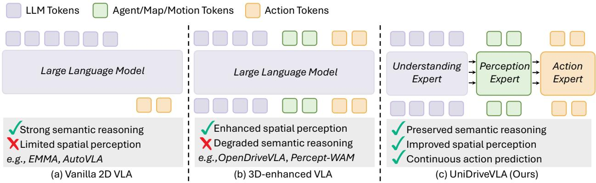
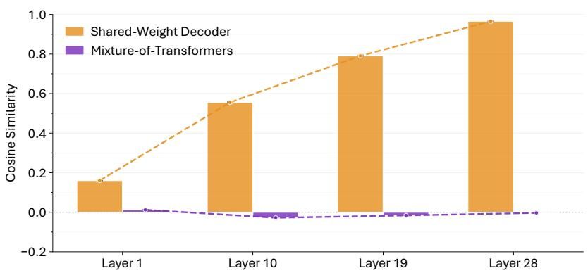
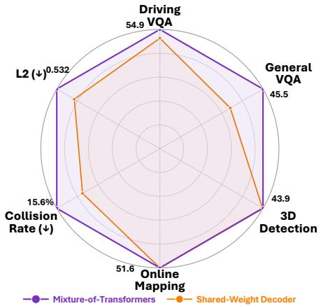
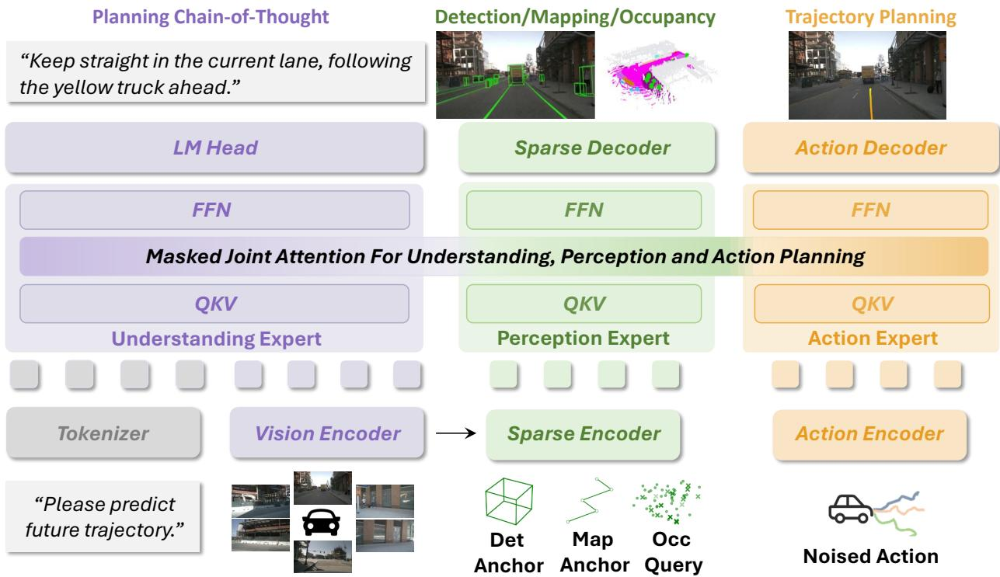
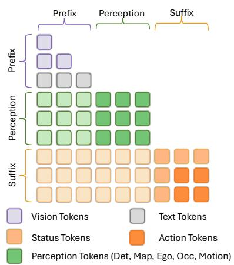

# UniDriveVLA: Unifying Understanding, Perception, and Action Planning for Autonomous Driving

Yongkang Li1,2, Lijun Zhou2, Sixu Yan1, Bencheng Liao1, Tianyi Yan2,3, Kaixin Xiong2, Long Chen2, Hongwei Xie2, Bing Wang2, Guang Chen2, Hangjun Ye2, Wenyu Liu1, Haiyang Sun2,†, Xinggang Wang1,B

1Huazhong University of Science and Technology 2Xiaomi EV 3SKL-IOTSC, University of Macau †Project Leader, BCorresponding author

Vision-Language-Action (VLA) models have recently emerged in autonomous driving, with the promise of leveraging rich world knowledge to improve the cognitive capabilities of driving systems. However, adapting such models for driving tasks currently faces a critical dilemma between spatial perception and semantic reasoning. Consequently, existing VLA systems are forced into suboptimal compromises: directly adopting 2D Vision-Language Models yields limited spatial perception, whereas enhancing them with 3D spatial representations often impairs the native reasoning capacity of VLMs. We argue that this dilemma largely stems from the coupled optimization of spatial perception and semantic reasoning within shared model parameters. To overcome this, we propose UniDriveVLA, a Unified Driving Vision-Language-Action model based on Mixture-of-Transformers that addresses the perception–reasoning conflict via expert decoupling. Specifically, it comprises three experts for driving understanding, scene perception, and action planning, which are coordinated through masked joint attention. In addition, we combine a sparse perception paradigm with a three-stage progressive training strategy to improve spatial perception while maintaining semantic reasoning capability. Extensive experiments show that UniDriveVLA achieves state-of-the-art performance in open-loop evaluation on nuScenes and closed-loop evaluation on Bench2Drive. Moreover, it demonstrates strong performance across a broad range of perception, prediction, and understanding tasks, including 3D detection, online mapping, motion forecasting, and driving-oriented VQA, highlighting its broad applicability as a unified model for autonomous driving.

Date: April 3, 2026 Project: https://xiaomi-research.github.io/unidrivevla Code: https://github.com/xiaomi-research/unidrivevla

## 1 Introduction

One expert to understand them all, one expert to perceive them all, one expert to act for all.1

Autonomous driving has made significant progress in perception [48, 50, 52], prediction [13, 25], and planning [29, 41] in recent years. Against this backdrop, Vision-Language-Action (VLA) models [22, 33, 47, 99, 120] have emerged as a promising direction, leveraging rich world knowledge and reasoning capabilities to improve driving cognition and planning. However, their efectiveness largely depends on the underlying 2D Vision-Language Models (VLMs) [3, 34, 122]. Because these base models are predominantly pre-trained on internet-scale image-text data, they are not designed for explicit spatial perception, which limits the spatial perception of VLA systems in driving scenarios. To improve spatial perception, recent works [18, 22, 59, 94, 96, 118] have explored enhancing VLA systems with 3D spatial representations, either by aligning structured 2D/3D features with language representations or by directly incorporating spatial tokens into a shared decoder. Yet this direction introduces a fundamental dilemma, as illustrated in Fig. 1: directly adopting 2D VLMs preserves native semantic reasoning but yields limited spatial perception, whereas enhancing them with 3D spatial representations improves spatial perception at the expense of native semantic reasoning.

  
Figure 1 Comparison of VLA paradigms for autonomous driving. (a) Vanilla 2D VLA provides strong semantic reasoning but limited spatial perception. (b) 3D-enhanced VLA improves spatial perception but may degrade semantic reasoning. (c) UniDriveVLA decouples understanding, perception, and action with the Mixture-of-Transformers architecture, achieving both.

At its core, this dilemma arises not merely from introducing 3D spatial representations, but from jointly optimizing spatial perception and semantic reasoning within shared model parameters. Specifically, although 3D spatial representations can improve spatial perception, jointly optimizing them with semantic reasoning in a shared parameter space introduces representation interference that undermines the native reasoning capacity of VLMs. However, most existing methods integrate spatial and semantic information within unified architectures with shared parameters. Among them, some recent approaches [96, 118] attempt to mitigate this interference by explicitly aligning structured 2D/3D features with language representations, thereby introducing spatial cues while preserving semantic reasoning. Nevertheless, because such alignment data remains far smaller than the internet-scale corpora used for VLM pre-training, these methods can only partially mitigate the conflict and cannot fully eliminate it. Other works [18, 26, 59] instead introduce spatial cues by directly incorporating spatial tokens into a shared decoder, where spatial and semantic tokens are jointly modeled. As we later show in Fig. 2, this observation is further supported by empirical analysis of representation similarity and downstream performance. Consequently, although these methods difer in how spatial information is introduced, they remain unable to fully reconcile spatial perception with semantic reasoning, highlighting the need to decouple these objectives during optimization.

To address this conflict, we propose UniDriveVLA, a unified Vision-Language-Action framework that unifies driving understanding, scene perception, and action planning within a single model. The core challenge is that simply decoupling these objectives is insuficient: the model must reduce optimization interference among heterogeneous semantic, spatial, and action tokens, while still preserving the unified decision process and the native semantic reasoning capability of the pre-trained VLM. To this end, UniDriveVLA adopts a Mixture-of-Transformers (MoT) architecture with three specialized experts for understanding, perception, and action, where optimization is decoupled across expert-specific pathways and masked joint attention maintains controlled cross-expert communication for coherent driving behavior. Moreover, instead of introducing dense 3D representations that may disrupt the native reasoning ability of VLMs, we adopt a sparse perception paradigm to extract critical spatial priors directly from 2D VLM tokens, thereby improving spatial perception while preserving semantic reasoning. Finally, to make this decoupled design trainable in practice, we introduce a three-stage progressive training strategy that progressively equips the model with perception and planning capabilities without sacrificing its foundational semantic understanding.

We evaluate UniDriveVLA on the widely used nuScenes and Bench2Drive benchmarks. Experimental results show that it achieves state-of-the-art performance in open-loop evaluation on nuScenes and closed-loop evaluation on Bench2Drive. Beyond driving planning, UniDriveVLA also performs well across a broad range of perception, prediction, and understanding tasks, including 3D detection, online mapping, motion forecasting, and driving-oriented visual question answering. These results highlight the advantage of our decoupled design: it improves spatial perception and driving performance while preserving the semantic reasoning ability of

VLMs, demonstrating broad applicability as a unified model for autonomous driving.

• We propose UniDriveVLA, a pioneering unified Vision-Language-Action model based on a Mixture-of-Transformers architecture, which mitigates the conflict between spatial perception and semantic reasoning by decoupling their optimization with dedicated experts.

• We introduce a sparse perception paradigm that extracts spatial priors directly from 2D VLM features, together with a three-stage joint training strategy that improves perception and planning while preserving the native reasoning ability of VLMs.

• Extensive experiments on nuScenes and Bench2Drive show that UniDriveVLA achieves state-of-the-art performance in open-loop evaluation on nuScenes and closed-loop evaluation on Bench2Drive, while also demonstrating broad applicability across diverse perception, prediction, and understanding tasks.

## 2 Related Work

## 2.1 Vision-Language-Action Models for Autonomous Driving.

Recent studies [22, 33, 47, 96, 99, 107, 111, 118] have explored integrating Vision-Language Models (VLMs) into autonomous driving, leveraging their rich world knowledge and reasoning capabilities to better address long-tail scenarios. Dual-system approaches, such as DriveVLM [92] and Senna [42], adopt a fast-slow paradigm that combines VLMs with end-to-end (E2E) driving models [29, 41, 86], where the VLM predicts low-frequency trajectories or provides high-level instructions to guide the E2E model. In contrast to these dual-system frameworks, recent methods have shifted toward unified single-system architectures [16, 22, 33, 46, 47, 77, 103, 114, 118, 120], enabling a single model to perform trajectory planning directly. To satisfy the high-frequency inference requirements of autonomous driving, several studies couple VLMs with action decoders [1, 22, 24, 40, 43, 46, 47, 58, 77, 78, 100, 105, 107] or employ Difusion Large Language Models (DLLMs) [17, 68, 104, 110, 121] to accelerate reasoning and support continuous action prediction. Recent works [23, 47, 64–66, 76, 80, 99, 104, 106, 115, 120] have also explored reinforcement learning (RL) for fine-tuning VLA models to further improve driving performance and policy alignment.

However, autonomous driving requires robust scene perception to recognize surrounding objects and road structures. Most existing VLA approaches [33, 99, 120] primarily rely on fine-tuning pre-trained open-source models, whose spatial perception remains insuficient for such spatially demanding driving tasks. To improve spatial perception in VLA models, some approaches incorporate BEV encoders [118] or 3D Q-Formers [5, 22, 96] to extract 3D features that are subsequently fed into LLMs. Alternatively, other methods [18, 26, 59] directly inject agent and occupancy tokens into the LLM decoder and jointly optimize the model for both linguistic and spatial perception objectives. Although these strategies enrich the model with 3D spatial information, they may also introduce interference between spatial perception and language reasoning in shared parameters, thereby weakening the efective use of pre-trained world knowledge. In contrast, our work focuses on reconciling spatial perception and semantic reasoning within a unified driving VLA framework.

## 2.2 Mixture-of-Transformers.

The Mixture-of-Transformers (MoT) [51] paradigm was originally introduced to unify multiple modalities by integrating modality-decoupled experts within a Mixture-of-Experts (MoE) [35] architecture together with decoupled attention mechanisms, thereby improving both modeling capacity and computational eficiency. Subsequent works [19, 63, 70, 74, 81, 87] extended MoT to multimodal understanding and generation tasks, where joint attention enables the incorporation of knowledge from Large Language Models (LLMs) into the generation process while preserving their comprehension capabilities, thereby improving generation performance. Concurrent with the emergence of Mixture-of-Transformers as a general architectural paradigm, π0 [8] independently adopted a conceptually similar mixture-based transformer design for robotics, integrating vision-language understanding with flow-matching action experts to unify discrete semantic reasoning and continuous action generation. Motivated by MoT’s ability to mitigate modality interference through decoupled parameter spaces and computational sparsity, subsequent works following $\pi _ { 0 }$ have adopted similar architectures in Vision-Language-Action (VLA) models for robotics [7, 10, 11, 14, 30, 44, 62, 73, 89, 90, 108] and autonomous driving [6, 31, 46, 99, 107, 124]. However, in the autonomous driving domain, existing approaches [46, 99, 107] largely follow the $\pi _ { 0 }$ design, yet their spatial perception remains limited, which can impair driving performance. In contrast, our work extends the MoT paradigm to autonomous driving by combining expert decoupling with sparse spatial perception, enabling a more efective unification of perception, reasoning, and planning.

  
(a) Semantic-Perception Representational Similarity

  
(b) Performance Comparison  
Figure 2 Analysis of representation interference and model performance. (a) Cosine similarity between LLM tokens and perception tokens across layers. In the shared-weight decoder, the similarity progressively increases toward 1, indicating feature collapse into nearly identical representations, whereas MoT maintains low similarity and preserves task decoupling. (b) Performance comparison. By mitigating optimization conflicts, UniDriveVLA consistently outperforms the shared-weight baseline across perception, reasoning, and planning metrics.

## 2.3 Sparse Perception for Autonomous Driving.

Traditional autonomous driving perception heavily relies on dense 3D representations [72] or BEV grid constructions [45, 48, 50], which introduce computational redundancy. To circumvent this limitation, sparse perception models have emerged as an eficient alternative. These approaches adopt a query-driven paradigm [12], using a set of sparse 3D queries to aggregate multi-view image features. Pioneering works such as DETR3D [98] and PETR [60] first introduced sparse object queries for 3D detection, bypassing dense view transformation. Subsequent advancements, including Sparse4D [53] and SparseBEV [55], further bolstered spatial perception by integrating temporal modeling and adaptive spatio-temporal sampling mechanisms. More recently, this sparse paradigm has been extended to end-to-end autonomous driving systems. Methods such as SparseDrive [86] and SparseAD [123] represent dynamic driving scenes using unified sparse queries and integrate detection, tracking, and planning within a single framework. Nevertheless, existing methods have not yet fully integrated sparse spatial perception with language-driven reasoning in VLA frameworks.

## 3 Methodology

In this section, we present the methodology of UniDriveVLA, with an overview shown in Fig. 3. We begin by formulating the perception–reasoning conflict in monolithic VLA models, where jointly optimizing spatial perception and semantic reasoning within shared parameters leads to representation interference. We then introduce the UniDriveVLA architecture based on a Mixture-of-Transformers (MoT) paradigm, which decouples the model into specialized experts for understanding, perception, and planning. Next, we describe a sparse perception mechanism that extracts spatial priors from 2D VLM features and supports downstream planning within the decoupled framework. Finally, we present a three-stage progressive training strategy that enables stable optimization of perception and planning without sacrificing the model’s semantic capabilities.

## 3.1 Problem Definition

The autonomous driving task aims to predict a safe future trajectory $T _ { \mathrm { t r a j } }$ from multi-view camera observations $I _ { \mathrm { c a m } } \in \mathbb { R } ^ { K \times V \times H \times W \times 3 }$ , historical trajectory $I _ { \mathrm { h i s t } } \in \mathbb { R } ^ { T _ { \mathrm { h i s t } } \times 2 }$ , and navigation command $L _ { \mathrm { n a v } }$

$$
T _ { \mathrm { t r a j } } = \Phi \big ( I _ { \mathrm { c a m } } , I _ { \mathrm { h i s t } } , L _ { \mathrm { n a v } } \big ) ,\tag{1}
$$

  
Figure 3 Architecture overview of UniDriveVLA. UniDriveVLA adopts a Mixture-of-Transformers architecture with three specialized experts for driving understanding, scene perception, and action planning. By decoupling heterogeneous tokens into dedicated experts and coordinating them through masked joint attention, the model mitigates optimization conflicts and unifies understanding, perception, and planning within a single framework.

where $T _ { \mathrm { t r a j } } = \{ ( x _ { t } , y _ { t } ) \} _ { t = 1 } ^ { T }$ denotes the predicted future trajectory.

To improve spatial perception, recent 3D-enhanced VLA models further introduce spatial representations $T _ { \mathrm { s p } }$ such as structured 2D/3D features or spatial tokens, into the same shared-weight decoder:

$$
T _ { \mathrm { t r a j } } = \Phi \big ( I _ { \mathrm { c a m } } , I _ { \mathrm { h i s t } } , L _ { \mathrm { n a v } } , T _ { \mathrm { s p } } \big ) .\tag{2}
$$

However, although these spatial representations can enhance spatial perception, jointly modeling them with semantic reasoning within shared parameters introduces representation interference between heterogeneous features. As shown in Fig. 2, this interference causes perception and semantic features to become increasingly entangled with depth, which weakens the native reasoning capacity of VLMs and ultimately degrades downstream driving performance.

## 3.2 UniDriveVLA Architecture

To address the perception–reasoning conflict in monolithic VLA models, UniDriveVLA adopts a Mixtureof-Transformers (MoT) [51] architecture that decouples the model into three specialized experts for driving understanding, scene perception, and action planning. Instead of forcing heterogeneous tokens to share a single parameter space, our architecture assigns them to expert-specific pathways while retaining controlled cross-expert interaction through masked joint attention.

Given multi-view images $I _ { \mathrm { c a m } }$ , historical trajectories $I _ { \mathrm { h i s t } }$ , and navigation command $L _ { \mathrm { n a v } }$ , UniDriveVLA constructs three groups of tokens. First, a vision-language backbone produces understanding tokens $T _ { \mathrm { u n d } }$ from visual observations and driving instructions. Second, a sparse perception module extracts perception tokens $T _ { \mathrm { p e r } }$ from visual features to encode spatial priors. Third, an action encoder produces action tokens $T _ { \mathrm { a c t } }$ for planning-oriented trajectory modeling, where the action inputs are constructed by standard flow matching interpolation between Gaussian noise and the target velocity sequence.

Within each MoT layer, the three token groups are first processed by expert-specific projections. For each

expert $g \in \{ \mathrm { u n d } , \mathrm { p e r } , \mathrm { a c t } \}$ , the query, key, and value representations are computed as

$$
\mathbf { Q } ^ { g } = T _ { g } \mathbf { W } _ { Q } ^ { g } , \mathbf { K } ^ { g } = T _ { g } \mathbf { W } _ { K } ^ { g } , \mathbf { V } ^ { g } = T _ { g } \mathbf { W } _ { V } ^ { g } .\tag{3}
$$

This expert-specific parameterization decouples understanding, perception, and action into separate parameter subspaces before cross-expert interaction.

To coordinate information flow across experts, we introduce Masked Joint Attention. After expert-specific projection, the representations from all experts are concatenated in the order of understanding, perception, and action:

$$
\mathbf { Q } = [ \mathbf { Q } ^ { \mathrm { { u n d } } } ; \mathbf { Q } ^ { \mathrm { { p e r } } } ; \mathbf { Q } ^ { \mathrm { { a c t } } } ] , \mathbf { K } = [ \mathbf { K } ^ { \mathrm { { u n d } } } ; \mathbf { K } ^ { \mathrm { { p e r } } } ; \mathbf { K } ^ { \mathrm { { a c t } } } ] , \mathbf { V } = [ \mathbf { V } ^ { \mathrm { { u n d } } } ; \mathbf { V } ^ { \mathrm { { p e r } } } ; \mathbf { V } ^ { \mathrm { { a c t } } } ] ,\tag{4}
$$

and attention is computed globally with a mask matrix M that controls the visibility pattern:

$$
\mathbf { Z } = \mathrm { S o f t m a x } \left( \frac { \mathbf { Q } \mathbf { K } ^ { \top } } { \sqrt { d _ { k } } } + \mathbf { M } \right) \mathbf { V } .\tag{5}
$$

The resulting attention features are then split back into three expert groups,

$$
{ \bf Z } = [ { \bf Z } ^ { \mathrm { u n d } } ; { \bf Z } ^ { \mathrm { p e r } } ; { \bf Z } ^ { \mathrm { a c t } } ] ,\tag{6}
$$

where ${ \bf Z } ^ { \mathrm { u n d } } , { \bf Z } ^ { \mathrm { p e r } }$ , and $\mathbf { Z } ^ { \mathrm { { a c t } } }$ correspond to the outputs associated with the understanding, perception, and action experts, respectively.

Here, understanding tokens follow causal masking and do not attend to subsequent perception or action tokens, preserving the semantic reasoning capability of the pre-trained vision-language model. Perception tokens attend to preceding understanding tokens to acquire semantic context, while action tokens aggregate both semantic and spatial information for planning. After attention, each expert group is further updated by expert-specific output projection, normalization, and feed-forward transformation:

$$
\mathbf { H } ^ { g } = T _ { g } + \mathrm { L N } _ { \mathrm { a t t n } } ^ { g } ( \mathbf { Z } ^ { g } \mathbf { W } _ { O } ^ { g } ) , { \mathbf O } ^ { g } = \mathbf { H } ^ { g } + \mathrm { L N } _ { \mathrm { f n } } ^ { g } ( \mathrm { F F N } ^ { g } ( \mathbf { H } ^ { g } ) ) ,\tag{7}
$$

where $g \in \{ \mathrm { u n d } , \mathrm { p e r } , \mathrm { a c t } \}$ . The resulting expert features are then jointly optimized with a unified objective over understanding, perception, and action modeling within a single framework. Specifically, the understand ing branch supports autoregressive language modeling, the perception branch is supervised by structured perception tasks, and the action branch is trained with flow-matching-based trajectory generation:

Figure 4 Illustration of Masked Joint Attention.

$$
{ \mathcal { L } } _ { \mathrm { t o t a l } } = \lambda _ { 1 } { \mathcal { L } } _ { \mathrm { a r } } + \lambda _ { 2 } { \mathcal { L } } _ { \mathrm { p e r } } + \lambda _ { 3 } { \mathcal { L } } _ { \mathrm { a c t } } .\tag{8}
$$

In this way, UniDriveVLA unifies understanding, perception, and planning within a single framework while avoiding the optimization conflict of monolithic shared-parameter VLA models.

## 3.3 Sparse Spatial Perception

Unlike recent approaches [96, 118] that inject dense bird’s-eye-view representations into Vision-Language-Action models, UniDriveVLA constructs sparse spatial perception directly from multi-scale 2D visual features. Specifically, projected visual features serve as the geometric evidence for a unified query-based perception module that jointly models detection, online mapping, ego-status estimation, and motion forecasting, rather than assigning each task to an isolated prediction head. Task-specific sparse queries are initialized from instance banks obtained by dataset-level K-Means clustering and are then updated through temporal interaction, intratask reasoning, inter-task communication, deformable feature aggregation, and task-wise refinement. In this way, the perception branch captures temporal dynamics, task-specific structure, and cross-task dependencies within a unified sparse decoding process. In parallel, occupancy is modeled as an auxiliary latent branch, so that the perception expert covers heterogeneous yet mutually supportive outputs, including 3D detection, map prediction, ego-status, motion, and occupancy.

To further enrich sparse perception with high-level semantics while preserving the native reasoning behavior of the pre-trained vision-language model, we project the first-pass perception outputs into the hidden space of the perception expert and let them interact with the understanding and action branches through masked joint attention. Concretely, detection, map, ego, motion, and occupancy tokens are lifted into the VLM hidden space, where understanding tokens remain causally masked, while perception and action tokens selectively aggregate preceding semantic and spatial context. As a result, perception tokens are semantically enhanced by the understanding branch and are further aggregated by the action branch to guide planning. The resulting features are then projected back to the sparse perception space and further refined by a subsequent perception decoder, yielding semantically enriched perception outputs that are better aligned with downstream planning. In this way, sparse perception in UniDriveVLA is not merely a one-shot geometric extractor, but a semantically enhanced perception module that collaborates with the understanding and action branches to guide planning, while also providing interpretable perception outputs.

## 3.4 Three-Stage Progressive Training

To preserve semantic reasoning while progressively acquiring spatial perception and planning capability, we devise a three-stage progressive training strategy for UniDriveVLA, which stabilizes optimization and mitigates catastrophic forgetting.

The first stage aims to anchor the model’s semantic reasoning capability through large-scale multimodal pre-training. We follow established paradigms [47] and curate a mixture of driving-specific visual questionanswering datasets and general-domain multimodal data. By filtering low-quality driving dialogues and maintaining a dominant sampling ratio for high-quality general data, we preserve the foundational semantic capabilities of the vision-language model.

The second stage aims to incorporate perception and planning supervision into the model through controlled joint optimization. We perform joint optimization over autoregressive language modeling, spatial perception tasks including 3D detection, online mapping, and occupancy prediction, together with flow-matching-based trajectory generation. To preserve semantic reasoning capability during this controlled joint optimization, we apply Low-Rank Adaptation [27] to the vision-language model. Furthermore, we reduce the base learning rate of the VLM parameters by half to suppress aggressive updates that may disrupt semantic reasoning.

The final stage aims to specialize the Perception Expert and Action Expert while preserving the semantic pathway of the vision-language model. We freeze the vision-language model and then fine-tune the Perception Expert and Action Expert while introducing an additional motion prediction objective. This objective is introduced to provide dynamic priors for the action expert and support motion-aware planning.

## 4 Experiments

## 4.1 Experimental Setup

Implementation Details. Our framework is built upon Qwen3-VL [3], a vision-language model consisting of a SigLIP-2 [93] vision encoder, an MLP-based vision-language merger, and a Qwen3 LM [4]. All input driving frames are resized to 960 × 544 to align with the 32× spatial downsampling stride of the Qwen3-VL vision encoder. For the first stage of driving pre-training, following ReCogDrive [47], we fully fine-tune the base VLM for 3 epochs with a learning rate of $4 \times 1 0 ^ { - 5 }$ on a mixture of driving-specific data and general vision-language data. The training mixture is constructed with a driving-to-general data ratio of 3:7, where the general-domain portion mainly comes from FineVision [101]. In the second stage, we jointly train the model for 30 epochs using AdamW [61]. The base learning rate is set to $2 \times 1 0 ^ { - 4 }$ , while the VLM backbone uses a 0.5× learning-rate multiplier, yielding an efective learning rate of $1 \times 1 0 ^ { - 4 }$ . We additionally apply LoRA [27] to the language model and use EMA during training. In the final stage, we freeze the vision-language model and fine-tune the Perception and Action Experts for 15 epochs, while enabling the motion forecasting objective. The base learning rate is set to $1 \times 1 0 ^ { - 4 }$ , and EMA is maintained during training.

Table 1 Open-loop and closed-loop planning results on Bench2Drive. Avg. L2 is computed over predictions within a 2-second horizon at 2 Hz. † Models trained on PDM-Lite, which provides higher-quality expert demonstrations than Think2Drive. Bold numbers indicate the best results among methods trained without PDM-Lite.
<table><tr><td rowspan="2">Method</td><td>Open-loop Metric</td><td colspan="4">Closed-loop Metric</td></tr><tr><td>Avg. L2 ↓</td><td>Driving Score ↑</td><td>Success Rate (%) ↑</td><td>Efficiency ↑</td><td>Comfortness ↑</td></tr><tr><td>AutoVLA† [NeurIPS25] [120]</td><td></td><td>78.84</td><td>57.73</td><td>146.93</td><td>39.33</td></tr><tr><td>SimLingo† [CVPR25] [77]</td><td></td><td>85.94</td><td>66.82</td><td>244.18</td><td>25.49</td></tr><tr><td>R2SE† [T-PAMI26] [57]</td><td></td><td>86.28</td><td>69.54</td><td>243.89</td><td>23.26</td></tr><tr><td>AD-MLP [arXiv23] [112]</td><td>3.64</td><td>18.05</td><td>0.00</td><td>48.45</td><td>22.63</td></tr><tr><td>VAD [ICCV23] [41]</td><td>0.91</td><td>42.35</td><td>15.00</td><td>157.94</td><td>46.01</td></tr><tr><td>SparseDrive [ICRA25] [86]</td><td>0.87</td><td>44.54</td><td>16.71</td><td>170.21</td><td>48.63</td></tr><tr><td>GenAD [ECČV24] [117]</td><td></td><td>44.81</td><td>15.90</td><td></td><td></td></tr><tr><td>UniAD [CVPR23] [29]</td><td>0.73</td><td>45.81</td><td>16.36</td><td>129.21</td><td>43.58</td></tr><tr><td>MomAD [CVPR25] [84]</td><td>0.82</td><td>47.91</td><td>18.11</td><td>174.91</td><td>51.20</td></tr><tr><td>SeerDrive [NeurIPS25] [113]</td><td>0.66</td><td>58.32</td><td>30.17</td><td></td><td></td></tr><tr><td>DriveDPO [NeurIPS25] [79]</td><td></td><td>62.02</td><td>30.62</td><td>166.80</td><td>26.79</td></tr><tr><td>ThinkTwice [CVPR22] [37]</td><td>0.95</td><td>62.44</td><td>31.23</td><td>69.33</td><td>16.22</td></tr><tr><td>DriveTransformer [ICLR25] [39]</td><td>0.62</td><td>63.46</td><td>35.01</td><td>100.64</td><td>20.78</td></tr><tr><td>DriveAdapter [ICCV23] [36]</td><td>1.01</td><td>64.22</td><td>33.08</td><td>70.22</td><td>16.01</td></tr><tr><td>RAP [ICLR26] [20]</td><td></td><td>66.42</td><td>37.27</td><td>165.47</td><td>23.63</td></tr><tr><td>ReCogDrive [ICLR26] [47]]</td><td></td><td>71.36</td><td>45.45</td><td>138.18</td><td>17.45</td></tr><tr><td>DriveMOE [ČVPR26] [ [107]</td><td>0.38</td><td>74.22</td><td>48.64</td><td>175.96</td><td>15.31</td></tr><tr><td>Orion [ICC25] [22]</td><td>0.68</td><td>77.74</td><td>54.62</td><td>151.48</td><td>17.38</td></tr><tr><td>UniDriveVLA</td><td>0.72</td><td>78.37</td><td>51.82</td><td>198.86</td><td>11.78</td></tr></table>

Table 2 Multi-ability results of end-to-end autonomous driving methods on Bench2Drive.
<table><tr><td rowspan="2">Method</td><td colspan="6">Ability (%) ↑</td></tr><tr><td>Merging</td><td>Overtaking</td><td>Emergency Brake</td><td>Give Way</td><td>Traffic Sign</td><td>Mean</td></tr><tr><td>AD-MLP [arXiv23] [112]</td><td>0.00</td><td>0.00</td><td>0.00</td><td>0.00</td><td>4.35</td><td>0.87</td></tr><tr><td>UniAD [CVPR23] [29]</td><td>14.10</td><td>17.78</td><td>21.67</td><td>10.00</td><td>14.21</td><td>15.55</td></tr><tr><td>VAD [IČCV23] [41]</td><td>8.11</td><td>24.44</td><td>18.64</td><td>20.00</td><td>19.15</td><td>18.07</td></tr><tr><td>ThinkTwice [CVPR22] [37]</td><td>13.72</td><td>22.93</td><td>52.99</td><td>50.00</td><td>47.78</td><td>37.48</td></tr><tr><td>DriveAdapter [ICCV23] [36]</td><td>14.55</td><td>22.61</td><td>54.04</td><td>50.00</td><td>50.45</td><td>38.33</td></tr><tr><td>DriveTransformer [ICLR25] [39]</td><td>17.57</td><td>35.00</td><td>48.36</td><td>40.00</td><td>52.10</td><td>38.60</td></tr><tr><td>ReCogDrive [ICLR26] [47]</td><td>29.73</td><td>20.00</td><td>69.09</td><td>20.00</td><td>71.34</td><td>42.03</td></tr><tr><td>DriveMOE [ČVPR26] [107]</td><td>34.67</td><td>40.00</td><td>65.45</td><td>40.00</td><td>59.44</td><td>47.91</td></tr><tr><td>Orion [ICCV25] [22]</td><td>25.00</td><td>71.11</td><td>78.33</td><td>33.00</td><td>69.15</td><td>54.72</td></tr><tr><td>UniDriveVLA</td><td>38.75</td><td>80.00</td><td>50.00</td><td>30.00</td><td>58.95</td><td>51.53</td></tr></table>

Dataset. We primarily evaluate our framework on two widely adopted autonomous driving benchmarks: nuScenes [9] and Bench2Drive [38], which are used for open-loop and closed-loop evaluation, respectively. The nuScenes dataset consists of 1,000 driving sequences collected in Boston and Singapore, and we use it to evaluate both perception tasks and open-loop planning. Bench2Drive is a large-scale fully annotated benchmark built on the CARLA simulator. It provides 6-view camera inputs at a resolution of 900 × 1600 and is used for closed-loop driving evaluation. The expert demonstrations in Bench2Drive are oficially generated using the Think2Drive [37] paradigm. In addition, we evaluate driving-oriented understanding on DriveBench [102], and assess broader multimodal capability on several general VQA benchmarks, including MMStar [15], MMMU [109], RealWorldQA, AI2D, MME [21], VLMsAreBlind [75], and ChartQA [71].

## 4.2 Main Results and Ablation Study

Experiments on the Bench2Drive Benchmark. We evaluate UniDriveVLA on Bench2Drive from both planning performance and fine-grained driving ability. As shown in Tab. 1, UniDriveVLA achieves the best Driving Score of 78.37 and the best Eficiency of 198.86 among methods trained without PDM-Lite, while obtaining a competitive Success Rate of 51.82%. In Tab. 2, UniDriveVLA demonstrates strong capability across diverse interactive scenarios, achieving the best performance on Merging with 38.75% and Overtaking with 80.00%, together with a competitive mean score of 51.53%. These results indicate that UniDriveVLA not only improves closed-loop driving quality, but also handles complex interactive behaviors efectively.

Table 3 End-to-end trajectory planning performance on nuScenes. We evaluate planning quality using L2 displacement error and collision rate across two mainstream protocols: ST-P3 [28] and UniAD [29]. \* denotes methods using ego-state information. Results for SparseDrive‡ are re-evaluated following the protocol established by GPT-Driver [69].
<table><tr><td rowspan="3">Method</td><td colspan="8">ST-P3 metrics</td><td colspan="8">UniAD metrics</td><td rowspan="3">LLM</td></tr><tr><td colspan="4">L2 (m) ↓</td><td colspan="4">Collision (%)↓</td><td colspan="3">L2 (m) ↓</td><td colspan="4">Collision (%)↓</td></tr><tr><td>2s</td><td></td><td>3s</td><td>Avg.</td><td>1s 2s</td><td>3s</td><td>Avg.</td><td>1s</td><td>2s</td><td>3s</td><td>Avg.</td><td>1s</td><td>2s</td><td>3s</td><td></td><td>Avg.</td></tr><tr><td></td><td></td><td></td><td></td><td></td><td></td><td>Methods with Ego Status</td><td></td><td></td><td></td><td></td><td></td><td></td><td></td><td></td><td></td><td></td><td></td></tr><tr><td>1.33</td><td></td><td>2.11</td><td>2.90</td><td>2.11</td><td>0.23</td><td>0.62</td><td>1.27</td><td>0.71</td><td></td><td></td><td></td><td></td><td></td><td></td><td></td><td></td><td></td></tr><tr><td>ST-P3* [28] VAD* [41]</td><td>0.17</td><td>0.34</td><td>0.60</td><td>0.37</td><td>0.04</td><td>0.27</td><td>0.67</td><td>0.33</td><td></td><td></td><td></td><td></td><td></td><td></td><td></td><td></td><td></td></tr><tr><td>UniAD* [29]</td><td></td><td></td><td></td><td></td><td></td><td></td><td></td><td></td><td>0.20</td><td>0.42</td><td>0.75</td><td>0.46</td><td>0.02</td><td>0.25</td><td>0.84</td><td>0.37</td><td></td></tr><tr><td>RDA-Driver* [32]</td><td>0.17</td><td>0.37</td><td>0.69</td><td>0.40</td><td>0.01</td><td>0.05</td><td>0.26</td><td>0.10</td><td>0.23</td><td>0.73</td><td>1.54</td><td>0.80</td><td>0.00</td><td>0.13</td><td>0.83</td><td>0.32</td><td>LLaVA-7B</td></tr><tr><td>BEV-Planner* [49]</td><td>0.16</td><td>0.32</td><td>0.57</td><td>0.35</td><td>0.00</td><td>0.29</td><td>0.73</td><td>0.34</td><td></td><td></td><td></td><td></td><td></td><td></td><td></td><td></td><td></td></tr><tr><td>HPP* [56]</td><td>0.26</td><td>0.37</td><td>0.59</td><td>0.40</td><td>0.02</td><td>0.05</td><td>0.11</td><td>0.06</td><td>0.30</td><td>0.61</td><td>1.15</td><td>0.72</td><td>0.03</td><td>0.07</td><td>0.35</td><td>0.15</td><td></td></tr><tr><td>OmniDrive* [96]</td><td>0.14</td><td>0.29</td><td>0.55</td><td>0.33</td><td>0.00</td><td>0.13</td><td>0.78</td><td>0.30</td><td></td><td></td><td></td><td></td><td></td><td></td><td></td><td></td><td>LLaVA-7B</td></tr><tr><td>Orion* [22]</td><td>0.17</td><td>0.31</td><td>0.55</td><td>0.34</td><td>0.05</td><td>0.25</td><td>0.80</td><td>0.37</td><td></td><td></td><td></td><td></td><td></td><td></td><td></td><td></td><td>LLaVA-7B</td></tr><tr><td>FSDrive*† [111]</td><td>0.14</td><td>0.25</td><td>0.46</td><td>0.28</td><td>0.03</td><td>0.06</td><td>0.21</td><td>0.10</td><td>0.18</td><td>0.39</td><td>0.77</td><td>0.45</td><td>0.00</td><td>0.06</td><td>0.42</td><td>0.16</td><td>Qwen2-VL-3B</td></tr><tr><td>AutoVLA* [120]</td><td>0.25</td><td>0.46</td><td>0.73</td><td>0.48</td><td>0.07</td><td>0.07</td><td>0.26</td><td>0.13</td><td>0.33</td><td>0.81</td><td>1.45</td><td>0.86</td><td>0.08</td><td>0.11</td><td>0.85</td><td>0.35</td><td>Qwen2.5-VL-3B</td></tr><tr><td>OpenDriveVLA* [118]</td><td>0.14</td><td>0.30</td><td>0.55</td><td>0.33</td><td>0.02</td><td>0.07</td><td>0.22</td><td>0.10</td><td>0.19</td><td>0.58</td><td>1.24</td><td>0.67</td><td>0.02</td><td>0.18</td><td>0.70</td><td>0.30</td><td>Qwen2.5-VL-3B</td></tr><tr><td></td><td></td><td>0.40</td><td>0.65</td><td></td><td>0.04</td><td>0.09</td><td></td><td></td><td></td><td></td><td></td><td></td><td></td><td></td><td></td><td></td><td></td></tr><tr><td>UniDriveVLA-Base* UniDriveVLA-Large*</td><td>0.23</td><td>0.40</td><td>0.63</td><td>0.43 0.42</td><td></td><td></td><td>0.18</td><td>0.10</td><td>0.30</td><td>0.69</td><td>1.32</td><td>0.77</td><td>0.03</td><td>0.13</td><td>0.52</td><td>0.23</td><td>Qwen3-VL-2B</td></tr><tr><td>0.24</td><td></td><td></td><td></td><td>0.03</td><td>0.09</td><td>0.16</td><td></td><td>0.10</td><td>0.30</td><td>0.66</td><td>1.25</td><td>0.74</td><td>0.02</td><td>0.18</td><td>0.40</td><td>0.20</td><td>Qwen3-VL-8B</td></tr><tr><td></td><td></td><td></td><td></td><td></td><td></td><td>Methods without Ego Status</td><td></td><td></td><td></td><td></td><td></td><td></td><td></td><td></td><td></td><td></td><td></td></tr><tr><td></td><td>0.41</td><td>0.70</td><td>1.05</td><td>0.72</td><td>0.03</td><td>0.19</td><td>0.43</td><td>0.21</td><td></td><td></td><td></td><td></td><td></td><td></td><td></td><td>=</td><td></td></tr><tr><td>VAD [41] UniAD [29]</td><td>0.45</td><td>0.70</td><td>1.04</td><td>0.73</td><td>0.62</td><td>0.58</td><td>0.63</td><td>0.61</td><td>0.59</td><td>1.01</td><td>1.48</td><td>1.03</td><td>0.16</td><td>0.51</td><td>1.64</td><td>0.77</td><td></td></tr><tr><td>ELM [1i9]</td><td></td><td></td><td></td><td></td><td></td><td></td><td></td><td></td><td>0.34</td><td>1.23</td><td>2.57</td><td>1.38</td><td>0.12</td><td>0.50</td><td>2.36</td><td>0.99</td><td>BLIP2-2.7B</td></tr><tr><td>OccWorld [116]</td><td>0.39</td><td>0.73</td><td>1.18</td><td>0.77</td><td>0.11</td><td>0.19</td><td>0.67</td><td>0.32</td><td>0.52</td><td>1.27</td><td>2.41</td><td>1.40</td><td>0.12</td><td>0.40</td><td>2.08</td><td>0.87</td><td>GPT3-like</td></tr><tr><td>BEV-Planner [49]</td><td>0.30</td><td>0.52</td><td>0.83</td><td>0.55</td><td>0.10</td><td>0.37</td><td>1.30</td><td>0.59</td><td></td><td></td><td></td><td></td><td></td><td></td><td></td><td></td><td></td></tr><tr><td>HPP [56]</td><td>0.41</td><td>0.61</td><td>0.86 0.84</td><td>0.63 0.55</td><td>0.03 0.03</td><td>0.08 0.05</td><td>0.24 0.15</td><td>0.12 0.08</td><td>0.48 0.38</td><td>0.91 0.92</td><td>1.54 1.66</td><td>0.97 0.99</td><td>0.03 0.02</td><td>0.17 0.08</td><td>0.68 0.53</td><td>0.29 0.21</td><td></td></tr><tr><td>SparseDrive‡ [86] OmniDrive [96]</td><td>0.28 0.40</td><td>0.53 0.80</td></table>

Table 4 Comparison of perception, mapping, and motion prediction performance on the nuScenes validation dataset.
<table><tr><td rowspan="2">Method</td><td colspan="2">Detection</td><td colspan="4">Map</td><td colspan="2">Motion</td></tr><tr><td>mAP↑</td><td>NDS↑</td><td> $\mathrm { A P } _ { p e d }$  ↑</td><td> $\mathrm { A P } _ { d i v i d e r }$ </td><td> $\mathrm { A P } _ { b o u n d a r y }$ </td><td>mAP↑</td><td>minADE(m) ↓</td><td>minFDE(m) ↓</td></tr><tr><td>UniAD [CVPR23] [29]</td><td>0.380</td><td>0.359</td><td></td><td></td><td></td><td></td><td>0.710</td><td>1.020</td></tr><tr><td>VAD [ICCV23] [41]</td><td>0.276</td><td>0.397</td><td>0.406</td><td>0.515</td><td>0.506</td><td>0.476</td><td></td><td></td></tr><tr><td>SparseDrive [ICRA25] [86]</td><td>0.418</td><td>0.525</td><td>0.499</td><td>0.570</td><td>0.584</td><td>0.551</td><td>0.600</td><td>0.960</td></tr><tr><td>EgoFSD [ICRA26] [85]</td><td>0.410</td><td>0.528</td><td>0.549</td><td>0.557</td><td>0.573</td><td>0.560</td><td></td><td></td></tr><tr><td>HiP-AD [ICCV25] [88]</td><td>0.424</td><td>0.535</td><td></td><td></td><td></td><td>0.571</td><td>0.610</td><td></td></tr><tr><td>UniDriveVLA-Base</td><td>0.397</td><td>0.434</td><td>0.462</td><td>0.556</td><td>0.543</td><td>0.520</td><td>1.396</td><td>2.289</td></tr><tr><td>UniDriveVLA-Large</td><td>0.407</td><td>0.460</td><td>0.491</td><td>0.556</td><td>0.557</td><td>0.535</td><td>1.264</td><td>2.121</td></tr></table>

Planning Results on the nuScenes Benchmark. Tab. 3 presents a comprehensive comparison of endto-end trajectory planning performance on nuScenes under two evaluation protocols, namely ST-P3 and UniAD. Overall, UniDriveVLA achieves competitive results in both the with-ego and without-ego settings. In particular, under the more challenging setting without ego-state inputs, UniDriveVLA-Large attains the best trajectory accuracy, achieving the lowest average L2 error under both the ST-P3 and UniAD protocols. In the with-ego setting, UniDriveVLA also remains competitive against recent VLA methods such as AutoVLA and FSDrive, as well as strong end-to-end driving baselines including UniAD and VAD. These results suggest that integrating sparse perception priors into a vision-language-action framework can substantially improve open-loop trajectory prediction, especially when explicit ego-state information is unavailable.

Perception Results on the nuScenes Benchmark. Beyond planning, we evaluate the intermediate perception capabilities of UniDriveVLA on the nuScenes validation set. As shown in Tab. 4, UniDriveVLA achieves competitive detection and mapping performance. In particular, UniDriveVLA-Large reaches a detection mAP of 0.407 and an NDS of 0.460, while achieving a map mAP of 0.535. Compared with earlier end-to-end driving methods such as VAD, our model shows clear improvements in both detection and mapping quality, indicating that the proposed sparse perception design can provide a solid spatial foundation for downstream planning. Although its motion prediction accuracy remains behind specialized baselines, these results show

Table 5 Ablation on nuScenes planning. L2 and CR denote average L2 error and collision rate, respectively.
<table><tr><td colspan="6">Components</td><td colspan="2">Metrics</td></tr><tr><td>Baseline</td><td>Ego</td><td>Det</td><td>Map</td><td>Occ</td><td>Motion</td><td>L2↓</td><td>CR (%) ↓</td></tr><tr><td>√</td><td></td><td></td><td></td><td></td><td></td><td>0.75</td><td>0.27</td></tr><tr><td>√</td><td>√</td><td></td><td></td><td></td><td></td><td>0.61</td><td>0.21</td></tr><tr><td>√</td><td>√</td><td>√</td><td></td><td></td><td></td><td>0.58</td><td>0.10</td></tr><tr><td>√</td><td>√</td><td>√</td><td>√</td><td></td><td></td><td>0.58</td><td>0.14</td></tr><tr><td>√</td><td>√</td><td>√</td><td>√</td><td>√</td><td></td><td>0.53</td><td>0.14</td></tr><tr><td>√</td><td>√</td><td>√</td><td>√</td><td>√</td><td>√</td><td>0.54</td><td>0.17</td></tr></table>

Table 6 DriveBench comparison. † ReCogDrive is pretrained only, without action training.
<table><tr><td>Method</td><td>Percep.</td><td>Predict.</td><td>Plan.</td><td>Behav.</td><td>Avg.</td></tr><tr><td>LLaVA-1.5 [54]</td><td>23.22</td><td>22.02</td><td>29.15</td><td>13.60</td><td>22.00</td></tr><tr><td>InternVL2 [91]</td><td>32.36</td><td>45.52</td><td>53.27</td><td>54.58</td><td>46.43</td></tr><tr><td>Qwen2-VL [95]</td><td>30.13</td><td>49.35</td><td>61.30</td><td>51.26</td><td>48.01</td></tr><tr><td>DriveLM [82]</td><td>16.85</td><td>44.33</td><td>68.71</td><td>42.78</td><td>43.17</td></tr><tr><td>Dolphins [67]</td><td>9.59</td><td>32.66</td><td>52.91</td><td>8.81</td><td>25.99</td></tr><tr><td>GPT-40 [34]]</td><td>35.37</td><td>51.30</td><td>75.75</td><td>45.40</td><td>51.96</td></tr><tr><td>ReCogDrive† [47]</td><td>64.95</td><td>49.34</td><td>70.20</td><td>42.36</td><td>56.71</td></tr><tr><td>UniDriveVLA</td><td>36.78</td><td>43.13</td><td>66.98</td><td>60.97</td><td>51.97</td></tr></table>

Table 7 Performance comparison between a shared-weight decoder and Mixture-of-Transformers (MoT) across understanding, perception, and planning tasks. General VQA is averaged over general multimodal benchmarks, DriveBench is used for driving-oriented understanding, and perception and planning metrics are reported on nuScenes.
<table><tr><td rowspan="2">Architecture</td><td colspan="2">Understanding</td><td colspan="2">Perception</td><td colspan="2">Planning</td></tr><tr><td>General VQA (%) ↑</td><td>DriveBench (%)↑</td><td>Det (NDS) ↑</td><td>Map (mAP) ↑</td><td>L2 (m) ↓</td><td>CR (%) ↓</td></tr><tr><td>Shared-Weight Decoder</td><td>31.1</td><td>50.8</td><td>0.437</td><td>0.516</td><td>0.641</td><td>0.175</td></tr><tr><td>Mixture-of-Transformers</td><td>45.5</td><td>54.9</td><td>0.439</td><td>0.516</td><td>0.533</td><td>0.140</td></tr></table>

Table 8 Comparison of UniDriveVLA with general-purpose and driving-specific models on general multimodal understanding benchmarks.
<table><tr><td>Model</td><td>Params</td><td>MMStar↑</td><td>MMMU↑</td><td>RealWorldQA↑</td><td>AI2D↑</td><td>MME↑</td><td>VLMsAreBlind↑</td><td>ChartQA↑</td></tr><tr><td>Qwen2.5-VL [2]</td><td>7B</td><td>63.7</td><td>51.1</td><td>69.0</td><td>82.5</td><td>2317</td><td>40.3</td><td>82.5</td></tr><tr><td>Qwen3-VL [4]</td><td>8B</td><td>63.0</td><td>52.8</td><td>69.0</td><td>83.2</td><td>2364</td><td>61.9</td><td>83.8</td></tr><tr><td>InternVL3 [122]</td><td>8B</td><td>69.1</td><td>54.8</td><td>67.8</td><td>83.9</td><td>2393</td><td>42.0</td><td>86.6</td></tr><tr><td>InternVL3.5 [97]</td><td>8B</td><td>66.3</td><td>57.3</td><td>63.0</td><td>82.3</td><td>2357</td><td>45.4</td><td>87.1</td></tr><tr><td>GPT-5 Nano [83]</td><td></td><td>41.3</td><td>57.6</td><td>60.7</td><td>65.7</td><td></td><td>40.2</td><td>48.6</td></tr><tr><td>UniDriveVLA</td><td>8B</td><td>43.3</td><td>47.3</td><td>49.9</td><td>76.3</td><td>1876</td><td>26.6</td><td>76.3</td></tr></table>

that UniDriveVLA maintains meaningful multi-task perception capability within a unified VLA framework.

Ablation on Planning Components. We progressively incorporate ego-state, detection, mapping, occupancy, and motion components into the planning framework, and report the results in Tab. 5. Starting from the baseline planner, introducing ego-state yields a substantial improvement in both trajectory accuracy and collision rate. Adding detection further reduces the collision rate to 0.10, indicating that explicit object-level perception is particularly beneficial for safe planning. Incorporating occupancy brings the best L2 error of 0.53, suggesting that dense spatial context is especially helpful for trajectory prediction. In contrast, adding mapping and motion does not lead to further gains in the current setting. We attribute this mainly to the limited headroom of open-loop planning on nuScenes, where improvements are already marginal and harder to realize.

Driving Scene Understanding. We evaluate UniDriveVLA on DriveBench to assess driving-oriented scene understanding, and further report results on several general VQA benchmarks to examine whether the model preserves multimodal capability after driving adaptation. As shown in Tab. 6, UniDriveVLA achieves strong performance on DriveBench, demonstrating driving-oriented understanding and behavior reasoning.

Effect of MoT Decoupling. Tab. 7 compares a shared-weight decoder with the proposed Mixture-of-Transformers. MoT consistently improves understanding, perception, and planning performance, with especially clear gains on trajectory prediction and collision reduction. These results support our claim that expert decoupling efectively mitigates the perception–reasoning conflict in unified driving VLA models.

General Visual Capabilities. A key challenge in driving-oriented adaptation is preserving the general multimodal capability of the foundation model. As shown in Tab. 8, although UniDriveVLA does not match strong general-purpose VLMs on these benchmarks, it retains meaningful performance across a diverse set of general visual understanding tasks, achieving 49.9 on RealWorldQA, 76.3 on AI2D, and 76.3 on ChartQA. These results suggest that our driving adaptation does not collapse the model’s multimodal reasoning ability, and that the adopted training strategy preserves a level of visual capability beyond autonomous driving.

## 5 Conclusion

In this work, we present UniDriveVLA, a unified Vision-Language-Action framework for autonomous driving that unifies understanding, perception, and planning within a single model. We identify a fundamental perception–reasoning conflict in existing monolithic VLA models, where jointly optimizing spatial perception and semantic reasoning within shared parameters leads to representation interference. To address this issue, we introduce a Mixture-of-Transformers architecture with dedicated Understanding, Perception, and Action experts, enabling controlled cross-expert interaction while reducing optimization conflict. We further adopt a sparse perception mechanism that extracts spatial priors directly from multi-scale 2D visual features, together with a three-stage progressive training strategy that improves perception and planning while preserving semantic reasoning capability. Extensive experiments on perception, understanding, and planning benchmarks demonstrate the efectiveness of UniDriveVLA as a unified model for autonomous driving. Moreover, the proposed decoupled VLA design may be further extended to robotic manipulation scenarios that require both structured spatial perception and high-level semantic reasoning.

## Acknowledgments

We use publicly available datasets, models, and code resources, including DriveLM, LingoQA, nuScenes, Bench2Drive, and other public research resources. We confirm that all such resources are used solely for academic research purposes and not for any commercial activity, in accordance with their respective licenses and terms of use.

We also thank Tianheng Cheng, Haoyu Fu, Lunbin Zeng, Hongyuan Tao, and Haochen Liu for their valuable discussions and helpful exchanges.

## References

[1] Sining Ang, Yuguang Yang, Chenxu Dang, Canyu Chen, Cheng Chi, Haiyan Liu, Xuanyao Mao, Jason Bao, Bingchuan Sun, Yan Wang, et al. From representational complementarity to dual systems: Synergizing vlm and vision-only backbones for end-to-end driving. arXiv e-prints, pages arXiv–2602, 2026.

[2] Shuai Bai, Keqin Chen, Xuejing Liu, Jialin Wang, Wenbin Ge, Sibo Song, Kai Dang, Peng Wang, Shijie Wang, Jun Tang, et al. others. 2025. qwen2. 5-vl technical report. arXiv preprint arXiv:2502.13923, 4(5), 1.

[3] Shuai Bai, Yuxuan Cai, Ruizhe Chen, Keqin Chen, Xionghui Chen, Zesen Cheng, Lianghao Deng, Wei Ding, Chang Gao, Chunjiang Ge, Wenbin Ge, Zhifang Guo, Qidong Huang, Jie Huang, Fei Huang, Binyuan Hui, Shutong Jiang, Zhaohai Li, Mingsheng Li, Mei Li, Kaixin Li, Zicheng Lin, Junyang Lin, Xuejing Liu, Jiawei Liu, Chenglong Liu, Yang Liu, Dayiheng Liu, Shixuan Liu, Dunjie Lu, Ruilin Luo, Chenxu Lv, Rui Men, Lingchen Meng, Xuancheng Ren, Xingzhang Ren, Sibo Song, Yuchong Sun, Jun Tang, Jianhong Tu, Jianqiang Wan, Peng Wang, Pengfei Wang, Qiuyue Wang, Yuxuan Wang, Tianbao Xie, Yiheng Xu, Haiyang Xu, Jin Xu, Zhibo Yang, Mingkun Yang, Jianxin Yang, An Yang, Bowen Yu, Fei Zhang, Hang Zhang, Xi Zhang, Bo Zheng, Humen Zhong, Jingren Zhou, Fan Zhou, Jing Zhou, Yuanzhi Zhu, and Ke Zhu. Qwen3-vl technical report. arXiv preprint arXiv:2511.21631, 2025.

[4] Shuai Bai, Yuxuan Cai, Ruizhe Chen, Keqin Chen, Xionghui Chen, Zesen Cheng, Lianghao Deng, Wei Ding, Chang Gao, Chunjiang Ge, et al. Qwen3-vl technical report. arXiv preprint arXiv:2511.21631, 2025.

[5] Yifan Bai, Dongming Wu, Yingfei Liu, Fan Jia, Weixin Mao, Ziheng Zhang, Yucheng Zhao, Jianbing Shen, Xing Wei, Tiancai Wang, et al. Is a 3d-tokenized llm the key to reliable autonomous driving? arXiv preprint arXiv:2405.18361, 2024.

[6] Florent Bartoccioni, Elias Ramzi, Victor Besnier, Shashanka Venkataramanan, Tuan-Hung Vu, Yihong Xu, Loick Chambon, Spyros Gidaris, Serkan Odabas, David Hurych, et al. Vavim and vavam: Autonomous driving through video generative modeling. arXiv preprint arXiv:2502.15672, 2025.

[7] Hongzhe Bi, Hengkai Tan, Shenghao Xie, Zeyuan Wang, Shuhe Huang, Haitian Liu, Ruowen Zhao, Yao Feng, Chendong Xiang, Yinze Rong, et al. Motus: A unified latent action world model. arXiv preprint arXiv:2512.13030, 2025.

[8] Kevin Black, Noah Brown, Danny Driess, Adnan Esmail, Michael Equi, Chelsea Finn, Niccolo Fusai, Lachy Groom, Karol Hausman, Brian Ichter, et al. pi\_0: A vision-language-action flow model for general robot control. arXiv preprint arXiv:2410.24164, 2024.

[9] Holger Caesar, Varun Bankiti, Alex H Lang, Sourabh Vora, Venice Erin Liong, Qiang Xu, Anush Krishnan, Yu Pan, Giancarlo Baldan, and Oscar Beijbom. nuscenes: A multimodal dataset for autonomous driving. In Proceedings of the IEEE/CVF conference on computer vision and pattern recognition, pages 11621–11631, 2020.

[10] Junhao Cai, Zetao Cai, Jiafei Cao, Yilun Chen, Zeyu He, Lei Jiang, Hang Li, Hengjie Li, Yang Li, Yufei Liu, et al. Internvla-a1: Unifying understanding, generation and action for robotic manipulation. arXiv preprint arXiv:2601.02456, 2026.

[11] Rui Cai, Jun Guo, Xinze He, Piaopiao Jin, Jie Li, Bingxuan Lin, Futeng Liu, Wei Liu, Fei Ma, Kun Ma, et al. Xiaomi-robotics-0: An open-sourced vision-language-action model with real-time execution. arXiv preprint arXiv:2602.12684, 2026.

[12] Nicolas Carion, Francisco Massa, Gabriel Synnaeve, Nicolas Usunier, Alexander Kirillov, and Sergey Zagoruyko. End-to-end object detection with transformers. In European conference on computer vision, pages 213–229. Springer, 2020.

[13] Yuning Chai, Benjamin Sapp, Mayank Bansal, and Dragomir Anguelov. Multipath: Multiple probabilistic anchor trajectory hypotheses for behavior prediction. arXiv preprint arXiv:1910.05449, 2019.

[14] Chilam Cheang, Sijin Chen, Zhongren Cui, Yingdong Hu, Liqun Huang, Tao Kong, Hang Li, Yifeng Li, Yuxiao Liu, Xiao Ma, et al. Gr-3 technical report. arXiv preprint arXiv:2507.15493, 2025.

[15] Lin Chen, Jinsong Li, Xiaoyi Dong, Pan Zhang, Yuhang Zang, Zehui Chen, Haodong Duan, Jiaqi Wang, Yu Qiao, Dahua Lin, et al. Are we on the right way for evaluating large vision-language models? Advances in Neural Information Processing Systems, 37:27056–27087, 2024.

[16] Haohan Chi, Huan-ang Gao, Ziming Liu, Jianing Liu, Chenyu Liu, Jinwei Li, Kaisen Yang, Yangcheng Yu, Zeda Wang, Wenyi Li, et al. Impromptu vla: Open weights and open data for driving vision-language-action models. arXiv preprint arXiv:2505.23757, 2025.

[17] Chenxu Dang, Sining Ang, Yongkang Li, Haochen Tian, Jie Wang, Guang Li, Hangjun Ye, Jie Ma, Long Chen, and Yan Wang. Drivefine: Refining-augmented masked difusion vla for precise and robust driving. arXiv preprint arXiv:2602.14577, 2026.

[18] Chenxu Dang, Jie Wang, Guang Li, Zhiwen Hou, Zihan You, Hangjun Ye, Jie Ma, Long Chen, and Yan Wang. Sparseoccvla: Bridging occupancy and vision-language models via sparse queries for unified 4d scene understanding and planning. arXiv preprint arXiv:2601.06474, 2026.

[19] Chaorui Deng, Deyao Zhu, Kunchang Li, Chenhui Gou, Feng Li, Zeyu Wang, Shu Zhong, Weihao Yu, Xiaonan Nie, Ziang Song, et al. Emerging properties in unified multimodal pretraining. arXiv preprint arXiv:2505.14683, 2025.

[20] Lan Feng, Yang Gao, Eloi Zablocki, Quanyi Li, Wuyang Li, Sichao Liu, Matthieu Cord, and Alexandre Alahi. Rap: 3d rasterization augmented end-to-end planning. arXiv preprint arXiv:2510.04333, 2025.

[21] Chaoyou Fu, Peixian Chen, Yunhang Shen, Yulei Qin, Mengdan Zhang, Xu Lin, Jinrui Yang, Xiawu Zheng, Ke Li, Xing Sun, et al. Mme: A comprehensive evaluation benchmark for multimodal large language models. arXiv preprint arXiv:2306.13394, 2023.

[22] Haoyu Fu, Diankun Zhang, Zongchuang Zhao, Jianfeng Cui, Dingkang Liang, Chong Zhang, Dingyuan Zhang, Hongwei Xie, Bing Wang, and Xiang Bai. Orion: A holistic end-to-end autonomous driving framework by vision-language instructed action generation. In Proceedings of the IEEE/CVF International Conference on Computer Vision, pages 24823–24834, 2025.

[23] Haoyu Fu, Diankun Zhang, Zongchuang Zhao, Jianfeng Cui, Hongwei Xie, Bing Wang, Guang Chen, Dingkang Liang, and Xiang Bai. Minddrive: A vision-language-action model for autonomous driving via online reinforcement learning. arXiv preprint arXiv:2512.13636, 2025.

[24] Yu Gao, Anqing Jiang, Yiru Wang, Wang Jijun, Hao Jiang, Zhigang Sun, Heng Yuwen, Wang Shuo, Hao Zhao, and Sun Hao. Difvla++: Bridging cognitive reasoning and end-to-end driving through metric-guided alignment. arXiv preprint arXiv:2510.17148, 2025.

[25] Junru Gu, Chenxu Hu, Tianyuan Zhang, Xuanyao Chen, Yilun Wang, Yue Wang, and Hang Zhao. Vip3d: End-to-end visual trajectory prediction via 3d agent queries. In Proceedings of the IEEE/CVF Conference on Computer Vision and Pattern Recognition, pages 5496–5506, 2023.

[26] Jianhua Han, Meng Tian, Jiangtong Zhu, Fan He, Huixin Zhang, Sitong Guo, Dechang Zhu, Hao Tang, Pei Xu, Yuze Guo, et al. Percept-wam: Perception-enhanced world-awareness-action model for robust end-to-end autonomous driving. arXiv preprint arXiv:2511.19221, 2025.

[27] Edward J Hu, Yelong Shen, Phillip Wallis, Zeyuan Allen-Zhu, Yuanzhi Li, Shean Wang, Liang Wang, Weizhu Chen, et al. Lora: Low-rank adaptation of large language models. Iclr, 1(2):3, 2022.

[28] Shengchao Hu, Li Chen, Penghao Wu, Hongyang Li, Junchi Yan, and Dacheng Tao. St-p3: End-to-end visionbased autonomous driving via spatial-temporal feature learning. In European Conference on Computer Vision, pages 533–549. Springer, 2022.

[29] Yihan Hu, Jiazhi Yang, Li Chen, Keyu Li, Chonghao Sima, Xizhou Zhu, Siqi Chai, Senyao Du, Tianwei Lin, Wenhai Wang, et al. Planning-oriented autonomous driving. In Proceedings of the IEEE/CVF conference on computer vision and pattern recognition, pages 17853–17862, 2023.

[30] Wenhui Huang, Changhe Chen, Han Qi, Chen Lv, Yilun Du, and Heng Yang. Motvla: A vision-language-action model with unified fast-slow reasoning. arXiv preprint arXiv:2510.18337, 2025.

[31] Wenhui Huang, Songyan Zhang, Qihang Huang, Zhidong Wang, Zhiqi Mao, Collister Chua, Zhan Chen, Long Chen, and Chen Lv. Automot: A unified vision-language-action model with asynchronous mixture-of-transformers for end-to-end autonomous driving. arXiv preprint arXiv:2603.14851, 2026.

[32] Zhijian Huang, Tao Tang, Shaoxiang Chen, Sihao Lin, Zequn Jie, Lin Ma, Guangrun Wang, and Xiaodan Liang. Making large language models better planners with reasoning-decision alignment. In European Conference on Computer Vision, pages 73–90. Springer, 2024.

[33] Jyh-Jing Hwang, Runsheng Xu, Hubert Lin, Wei-Chih Hung, Jingwei Ji, Kristy Choi, Di Huang, Tong He, Paul Covington, Benjamin Sapp, et al. Emma: End-to-end multimodal model for autonomous driving. arXiv preprint arXiv:2410.23262, 2024.

[34] Raisa Islam and Owana Marzia Moushi. Gpt-4o: The cutting-edge advancement in multimodal llm. In Intelligent Computing-Proceedings of the Computing Conference, pages 47–60. Springer, 2025.

[35] Robert A Jacobs, Michael I Jordan, Steven J Nowlan, and Geofrey E Hinton. Adaptive mixtures of local experts. Neural computation, 3(1):79–87, 1991.

[36] Xiaosong Jia, Yulu Gao, Li Chen, Junchi Yan, Patrick Langechuan Liu, and Hongyang Li. Driveadapter: Breaking the coupling barrier of perception and planning in end-to-end autonomous driving. In Proceedings of the IEEE/CVF International Conference on Computer Vision, pages 7953–7963, 2023.

[37] Xiaosong Jia, Penghao Wu, Li Chen, Jiangwei Xie, Conghui He, Junchi Yan, and Hongyang Li. Think twice before driving: Towards scalable decoders for end-to-end autonomous driving. In Proceedings of the IEEE/CVF Conference on Computer Vision and Pattern Recognition, pages 21983–21994, 2023.

[38] Xiaosong Jia, Zhenjie Yang, Qifeng Li, Zhiyuan Zhang, and Junchi Yan. Bench2drive: Towards multi-ability benchmarking of closed-loop end-to-end autonomous driving. Advances in Neural Information Processing Systems, 37:819–844, 2024.

[39] Xiaosong Jia, Junqi You, Zhiyuan Zhang, and Junchi Yan. Drivetransformer: Unified transformer for scalable end-to-end autonomous driving. arXiv preprint arXiv:2503.07656, 2025.

[40] Anqing Jiang, Yu Gao, Zhigang Sun, Yiru Wang, Jijun Wang, Jinghao Chai, Qian Cao, Yuweng Heng, Hao Jiang, Yunda Dong, et al. Difvla: Vision-language guided difusion planning for autonomous driving. arXiv preprint arXiv:2505.19381, 2025.

[41] Bo Jiang, Shaoyu Chen, Qing Xu, Bencheng Liao, Jiajie Chen, Helong Zhou, Qian Zhang, Wenyu Liu, Chang Huang, and Xinggang Wang. Vad: Vectorized scene representation for eficient autonomous driving. In Proceedings of the IEEE/CVF International Conference on Computer Vision, pages 8340–8350, 2023.

[42] Bo Jiang, Shaoyu Chen, Bencheng Liao, Xingyu Zhang, Wei Yin, Qian Zhang, Chang Huang, Wenyu Liu, and Xinggang Wang. Senna: Bridging large vision-language models and end-to-end autonomous driving. arXiv preprint arXiv:2410.22313, 2024.

[43] Jingyu Li, Junjie Wu, Dongnan Hu, Xiangkai Huang, Bin Sun, Zhihui Hao, Xianpeng Lang, Xiatian Zhu, and Li Zhang. Sgdrive: Scene-to-goal hierarchical world cognition for autonomous driving. arXiv preprint arXiv:2601.05640, 2026.

[44] Lin Li, Qihang Zhang, Yiming Luo, Shuai Yang, Ruilin Wang, Fei Han, Mingrui Yu, Zelin Gao, Nan Xue, Xing Zhu, et al. Causal world modeling for robot control. arXiv preprint arXiv:2601.21998, 2026.

[45] Yinhao Li, Zheng Ge, Guanyi Yu, Jinrong Yang, Zengran Wang, Yukang Shi, Jianjian Sun, and Zeming Li. Bevdepth: Acquisition of reliable depth for multi-view 3d object detection. In Proceedings of the AAAI conference on artificial intelligence, pages 1477–1485, 2023.

[46] Yingyan Li, Shuyao Shang, Weisong Liu, Bing Zhan, Haochen Wang, Yuqi Wang, Yuntao Chen, Xiaoman Wang, Yasong An, Chufeng Tang, et al. Drivevla-w0: World models amplify data scaling law in autonomous driving. arXiv preprint arXiv:2510.12796, 2025.

[47] Yongkang Li, Kaixin Xiong, Xiangyu Guo, Fang Li, Sixu Yan, Gangwei Xu, Lijun Zhou, Long Chen, Haiyang Sun, Bing Wang, et al. Recogdrive: A reinforced cognitive framework for end-to-end autonomous driving. arXiv preprint arXiv:2506.08052, 2025.

[48] Zhiqi Li, Wenhai Wang, Hongyang Li, Enze Xie, Chonghao Sima, Tong Lu, Qiao Yu, and Jifeng Dai. Bevformer: learning bird’s-eye-view representation from lidar-camera via spatiotemporal transformers. IEEE Transactions on Pattern Analysis and Machine Intelligence, 47(3):2020–2036, 2024.

[49] Zhiqi Li, Zhiding Yu, Shiyi Lan, Jiahan Li, Jan Kautz, Tong Lu, and Jose M Alvarez. Is ego status all you need for open-loop end-to-end autonomous driving? In Proceedings of the IEEE/CVF Conference on Computer Vision and Pattern Recognition, pages 14864–14873, 2024.

[50] Tingting Liang, Hongwei Xie, Kaicheng Yu, Zhongyu Xia, Zhiwei Lin, Yongtao Wang, Tao Tang, Bing Wang, and Zhi Tang. Bevfusion: A simple and robust lidar-camera fusion framework. Advances in neural information processing systems, 35:10421–10434, 2022.

[51] Weixin Liang, Lili Yu, Liang Luo, Srinivasan Iyer, Ning Dong, Chunting Zhou, Gargi Ghosh, Mike Lewis, Wen-tau Yih, Luke Zettlemoyer, et al. Mixture-of-transformers: A sparse and scalable architecture for multi-modal foundation models. arXiv preprint arXiv:2411.04996, 2024.

[52] Bencheng Liao, Shaoyu Chen, Xinggang Wang, Tianheng Cheng, Qian Zhang, Wenyu Liu, and Chang Huang. Maptr: Structured modeling and learning for online vectorized hd map construction. arXiv preprint arXiv:2208.14437, 2022.

[53] Xuewu Lin, Tianwei Lin, Zixiang Pei, Lichao Huang, and Zhizhong Su. Sparse4d: Multi-view 3d object detection with sparse spatial-temporal fusion. arXiv preprint arXiv:2211.10581, 2022.

[54] Haotian Liu, Chunyuan Li, Qingyang Wu, and Yong Jae Lee. Visual instruction tuning. Advances in neural information processing systems, 36:34892–34916, 2023.

[55] Haisong Liu, Yao Teng, Tao Lu, Haiguang Wang, and Limin Wang. Sparsebev: High-performance sparse 3d object detection from multi-camera videos. In Proceedings of the IEEE/CVF international conference on computer vision, pages 18580–18590, 2023.

[56] Haochen Liu, Zhiyu Huang, Wenhui Huang, Haohan Yang, Xiaoyu Mo, and Chen Lv. Hybrid-prediction integrated planning for autonomous driving. IEEE Transactions on Pattern Analysis and Machine Intelligence, 47(4):2597–2614, 2025.

[57] Haochen Liu, Tianyu Li, Haohan Yang, Li Chen, Caojun Wang, Ke Guo, Haochen Tian, Hongchen Li, Hongyang Li, and Chen Lv. Reinforced refinement with self-aware expansion for end-to-end autonomous driving. IEEE Transactions on Pattern Analysis and Machine Intelligence, 2026.

[58] Lin Liu, Ziying Song, Caiyan Jia, Hangjun Ye, Xiaoshuai Hao, Long Chen, et al. Driveworld-vla: Unified latentspace world modeling with vision-language-action for autonomous driving. arXiv preprint arXiv:2602.06521, 2026.

[59] Ruixun Liu, Lingyu Kong, Derun Li, and Hang Zhao. Occvla: Vision-language-action model with implicit 3d occupancy supervision. arXiv preprint arXiv:2509.05578, 2025.

[60] Yingfei Liu, Tiancai Wang, Xiangyu Zhang, and Jian Sun. Petr: Position embedding transformation for multi-view 3d object detection. In European conference on computer vision, pages 531–548. Springer, 2022.

[61] Ilya Loshchilov and Frank Hutter. Decoupled weight decay regularization. arXiv preprint arXiv:1711.05101, 2017.

[62] Hao Luo, Ye Wang, Wanpeng Zhang, Sipeng Zheng, Ziheng Xi, Chaoyi Xu, Haiweng Xu, Haoqi Yuan, Chi Zhang, Yiqing Wang, et al. Being-h0. 5: Scaling human-centric robot learning for cross-embodiment generalization. arXiv preprint arXiv:2601.12993, 2026.

[63] Run Luo, Xiaobo Xia, Lu Wang, Longze Chen, Renke Shan, Jing Luo, Min Yang, and Tat-Seng Chua. Next-omni: Towards any-to-any omnimodal foundation models with discrete flow matching. arXiv preprint arXiv:2510.13721, 2025.

[64] Yuechen Luo, Fang Li, Shaoqing Xu, Zhiyi Lai, Lei Yang, Qimao Chen, Ziang Luo, Zixun Xie, Shengyin Jiang, Jiaxin Liu, et al. Adathinkdrive: Adaptive thinking via reinforcement learning for autonomous driving. arXiv preprint arXiv:2509.13769, 2025.

[65] Yuechen Luo, Qimao Chen, Fang Li, Shaoqing Xu, Jaxin Liu, Ziying Song, Zhi-xin Yang, and Fuxi Wen. Unleashing vla potentials in autonomous driving via explicit learning from failures. arXiv preprint arXiv:2603.01063, 2026.

[66] Yuechen Luo, Fang Li, Shaoqing Xu, Yang Ji, Zehan Zhang, Bing Wang, Yuannan Shen, Jianwei Cui, Long Chen, Guang Chen, et al. Last-vla: Thinking in latent spatio-temporal space for vision-language-action in autonomous driving. arXiv preprint arXiv:2603.01928, 2026.

[67] Yingzi Ma, Yulong Cao, Jiachen Sun, Marco Pavone, and Chaowei Xiao. Dolphins: Multimodal language model for driving. In European Conference on Computer Vision, pages 403–420. Springer, 2024.

[68] Yingzi Ma, Yulong Cao, Wenhao Ding, Shuibai Zhang, Yan Wang, Boris Ivanovic, Ming Jiang, Marco Pavone, and Chaowei Xiao. dvlm-ad: Enhance difusion vision-language-model for driving via controllable reasoning. arXiv preprint arXiv:2512.04459, 2025.

[69] Jiageng Mao, Yuxi Qian, Junjie Ye, Hang Zhao, and Yue Wang. Gpt-driver: Learning to drive with gpt. arXiv preprint arXiv:2310.01415, 2023.

[70] Alexis Marouani, Oriane Siméoni, Hervé Jégou, Piotr Bojanowski, and Huy V Vo. Revisiting [cls] and patch token interaction in vision transformers. arXiv preprint arXiv:2602.08626, 2026.

[71] Ahmed Masry, Xuan Long Do, Jia Qing Tan, Shafiq Joty, and Enamul Hoque. Chartqa: A benchmark for question answering about charts with visual and logical reasoning. In Findings of the association for computational linguistics: ACL 2022, pages 2263–2279, 2022.

[72] Jonah Philion and Sanja Fidler. Lift, splat, shoot: Encoding images from arbitrary camera rigs by implicitly unprojecting to 3d. In European conference on computer vision, pages 194–210. Springer, 2020.

[73] Physical Intelligence, Kevin Black, Noah Brown, James Darpinian, Karan Dhabalia, Danny Driess, Adnan Esmail, Michael Equi, Chelsea Finn, Niccolo Fusai, et al. π : A vision-language-action model with open-world generalization. arXiv preprint arXiv:2504.16054, 2025.

[74] Luozheng Qin, Jia Gong, Yuqing Sun, Tianjiao Li, Mengping Yang, Xiaomeng Yang, Chao Qu, Zhiyu Tan, and Hao Li. Uni-cot: Towards unified chain-of-thought reasoning across text and vision. arXiv preprint arXiv:2508.05606, 2025.

[75] Pooyan Rahmanzadehgervi, Logan Bolton, Mohammad Reza Taesiri, and Anh Totti Nguyen. Vision language models are blind. In Proceedings of the Asian Conference on Computer Vision, pages 18–34, 2024.

[76] Ishaan Rawal, Shubh Gupta, Yihan Hu, and Wei Zhan. Nord: A data-eficient vision-language-action model that drives without reasoning. arXiv preprint arXiv:2602.21172, 2026.

[77] Katrin Renz, Long Chen, Elahe Arani, and Oleg Sinavski. Simlingo: Vision-only closed-loop autonomous driving with language-action alignment. In Proceedings of the Computer Vision and Pattern Recognition Conference, pages 11993–12003, 2025.

[78] Fabian Schmidt, Karol Fedurko, Markus Enzweiler, and Abhinav Valada. Lad-drive: Bridging language and trajectory with action-aware difusion transformers. arXiv preprint arXiv:2603.02035, 2026.

[79] Shuyao Shang, Yuntao Chen, Yuqi Wang, Yingyan Li, and Zhaoxiang Zhang. Drivedpo: Policy learning via safety dpo for end-to-end autonomous driving. arXiv preprint arXiv:2509.17940, 2025.

[80] Shuyao Shang, Bing Zhan, Yunfei Yan, Yuqi Wang, Yingyan Li, Yasong An, Xiaoman Wang, Jierui Liu, Lu Hou, Lue Fan, et al. Dynvla: Learning world dynamics for action reasoning in autonomous driving. arXiv preprint arXiv:2603.11041, 2026.

[81] Weijia Shi, Xiaochuang Han, Chunting Zhou, Weixin Liang, Xi Victoria Lin, Luke Zettlemoyer, and Lili Yu. Lmfusion: Adapting pretrained language models for multimodal generation. arXiv preprint arXiv:2412.15188, 2024.

[82] Chonghao Sima, Katrin Renz, Kashyap Chitta, Li Chen, Hanxue Zhang, Chengen Xie, Jens Beißwenger, Ping Luo, Andreas Geiger, and Hongyang Li. Drivelm: Driving with graph visual question answering. In European conference on computer vision, pages 256–274. Springer, 2024.

[83] Aaditya Singh, Adam Fry, Adam Perelman, Adam Tart, Adi Ganesh, Ahmed El-Kishky, Aidan McLaughlin, Aiden Low, AJ Ostrow, Akhila Ananthram, et al. Openai gpt-5 system card. arXiv preprint arXiv:2601.03267, 2025.

[84] Ziying Song, Caiyan Jia, Lin Liu, Hongyu Pan, Yongchang Zhang, Junming Wang, Xingyu Zhang, Shaoqing Xu, Lei Yang, and Yadan Luo. Don’t shake the wheel: Momentum-aware planning in end-to-end autonomous driving. In Proceedings of the IEEE/CVF Conference on Computer Vision and Pattern Recognition, pages 22432–22441, 2025.

[85] Haisheng Su, Wei Wu, and Junchi Yan. Difsd: Ego-centric fully sparse paradigm with uncertainty denoising and iterative refinement for eficient end-to-end self-driving. arXiv preprint arXiv:2409.09777, 2024.

[86] Wenchao Sun, Xuewu Lin, Yining Shi, Chuang Zhang, Haoran Wu, and Sifa Zheng. Sparsedrive: End-to-end autonomous driving via sparse scene representation. In 2025 IEEE International Conference on Robotics and Automation (ICRA), pages 8795–8801. IEEE, 2025.

[87] Bingda Tang, Boyang Zheng, Sayak Paul, and Saining Xie. Exploring the deep fusion of large language models and difusion transformers for text-to-image synthesis. In Proceedings of the Computer Vision and Pattern Recognition Conference, pages 28586–28595, 2025.

[88] Yingqi Tang, Zhuoran Xu, Zhaotie Meng, and Erkang Cheng. Hip-ad: Hierarchical and multi-granularity planning with deformable attention for autonomous driving in a single decoder. In Proceedings of the IEEE/CVF International Conference on Computer Vision, pages 25605–25615, 2025.

[89] GigaBrain Team, Angen Ye, Boyuan Wang, Chaojun Ni, Guan Huang, Guosheng Zhao, Haoyun Li, Jie Li, Jiagang Zhu, Lv Feng, et al. Gigabrain-0: A world model-powered vision-language-action model. arXiv preprint arXiv:2510.19430, 2025.

[90] GigaBrain Team, Boyuan Wang, Chaojun Ni, Guan Huang, Guosheng Zhao, Hao Li, Jie Li, Jindi Lv, Jingyu Liu, Lv Feng, et al. Gigabrain-0.5 m\*: a vla that learns from world model-based reinforcement learning. arXiv preprint arXiv:2602.12099, 2026.

[91] OpenGVLab Team. Internvl2: Better than the best—expanding performance boundaries of open-source multimodal models with the progressive scaling strategy, 2024.

[92] Xiaoyu Tian, Junru Gu, Bailin Li, Yicheng Liu, Yang Wang, Zhiyong Zhao, Kun Zhan, Peng Jia, Xianpeng Lang, and Hang Zhao. Drivevlm: The convergence of autonomous driving and large vision-language models. arXiv preprint arXiv:2402.12289, 2024.

[93] Michael Tschannen, Alexey Gritsenko, Xiao Wang, Muhammad Ferjad Naeem, Ibrahim Alabdulmohsin, Nikhil Parthasarathy, Talfan Evans, Lucas Beyer, Ye Xia, Basil Mustafa, et al. Siglip 2: Multilingual vision-language encoders with improved semantic understanding, localization, and dense features. arXiv preprint arXiv:2502.14786, 2025.

[94] Jie Wang, Guang Li, Zhijian Huang, Chenxu Dang, Hangjun Ye, Yahong Han, and Long Chen. Vggdrive: Empowering vision-language models with cross-view geometric grounding for autonomous driving. arXiv preprint arXiv:2602.20794, 2026.

[95] Peng Wang, Shuai Bai, Sinan Tan, Shijie Wang, Zhihao Fan, Jinze Bai, Keqin Chen, Xuejing Liu, Jialin Wang, Wenbin Ge, et al. Qwen2-vl: Enhancing vision-language model’s perception of the world at any resolution. arXiv preprint arXiv:2409.12191, 2024.

[96] Shihao Wang, Zhiding Yu, Xiaohui Jiang, Shiyi Lan, Min Shi, Nadine Chang, Jan Kautz, Ying Li, and Jose M Alvarez. Omnidrive: A holistic vision-language dataset for autonomous driving with counterfactual reasoning. In Proceedings of the computer vision and pattern recognition conference, pages 22442–22452, 2025.

[97] Weiyun Wang, Zhangwei Gao, Lixin Gu, Hengjun Pu, Long Cui, Xingguang Wei, Zhaoyang Liu, Linglin Jing, Shenglong Ye, Jie Shao, et al. Internvl3. 5: Advancing open-source multimodal models in versatility, reasoning, and eficiency. arXiv preprint arXiv:2508.18265, 2025.

[98] Yue Wang, Vitor Campagnolo Guizilini, Tianyuan Zhang, Yilun Wang, Hang Zhao, and Justin Solomon. Detr3d: 3d object detection from multi-view images via 3d-to-2d queries. In Conference on robot learning, pages 180–191. PMLR, 2022.

[99] Yan Wang, Wenjie Luo, Junjie Bai, Yulong Cao, Tong Che, Ke Chen, Yuxiao Chen, Jenna Diamond, Yifan Ding, Wenhao Ding, et al. Alpamayo-r1: Bridging reasoning and action prediction for generalizable autonomous driving in the long tail. arXiv preprint arXiv:2511.00088, 2025.

[100] Yiru Wang, Zichong Gu, Yu Gao, Anqing Jiang, Zhigang Sun, Shuo Wang, Yuwen Heng, and Hao Sun. Hist-vla: A hierarchical spatio-temporal vision-language-action model for end-to-end autonomous driving. arXiv preprint arXiv:2602.13329, 2026.

[101] Luis Wiedmann, Orr Zohar, Amir Mahla, Xiaohan Wang, Rui Li, Thibaud Frere, Leandro von Werra, Aritra Roy Gosthipaty, and Andrés Marafioti. Finevision: Open data is all you need. arXiv preprint arXiv:2510.17269, 2025.

[102] Shaoyuan Xie, Lingdong Kong, Yuhao Dong, Chonghao Sima, Wenwei Zhang, Qi Alfred Chen, Ziwei Liu, and Liang Pan. Are vlms ready for autonomous driving? an empirical study from the reliability, data and metric perspectives. In Proceedings of the IEEE/CVF International Conference on Computer Vision, pages 6585–6597, 2025.

[103] Shuo Xing, Chengyuan Qian, Yuping Wang, Hongyuan Hua, Kexin Tian, Yang Zhou, and Zhengzhong Tu. Openemma: Open-source multimodal model for end-to-end autonomous driving. In Proceedings of the Winter Conference on Applications of Computer Vision, pages 1001–1009, 2025.

[104] Mingwang Xu, Jiahao Cui, Feipeng Cai, Hanlin Shang, Zhihao Zhu, Shan Luan, Yifang Xu, Neng Zhang, Yaoyi Li, Jia Cai, et al. Wam-dif: A masked difusion vla framework with moe and online reinforcement learning for autonomous driving. arXiv preprint arXiv:2512.11872, 2025.

[105] Sixu Yan, Zeyu Zhang, Muzhi Han, Zaijin Wang, Qi Xie, Zhitian Li, Zhehan Li, Hangxin Liu, Xinggang Wang, and Song-Chun Zhu. M 2 difuser: Difusion-based trajectory optimization for mobile manipulation in 3d scenes. IEEE Transactions on Pattern Analysis and Machine Intelligence, 2025.

[106] Tianyi Yan, Tao Tang, Xingtai Gui, Yongkang Li, Jiasen Zhesng, Weiyao Huang, Lingdong Kong, Wencheng Han, Xia Zhou, Xueyang Zhang, et al. Ad-r1: Closed-loop reinforcement learning for end-to-end autonomous driving with impartial world models. arXiv preprint arXiv:2511.20325, 2025.

[107] Zhenjie Yang, Yilin Chai, Xiaosong Jia, Qifeng Li, Yuqian Shao, Xuekai Zhu, Haisheng Su, and Junchi Yan. Drivemoe: Mixture-of-experts for vision-language-action model in end-to-end autonomous driving. arXiv preprint arXiv:2505.16278, 2025.

[108] Tianyuan Yuan, Yicheng Liu, Chenhao Lu, Zhuoguang Chen, Tao Jiang, and Hang Zhao. Depthvla: Enhancing vision-language-action models with depth-aware spatial reasoning. arXiv preprint arXiv:2510.13375, 2025.

[109] Xiang Yue, Yuansheng Ni, Kai Zhang, Tianyu Zheng, Ruoqi Liu, Ge Zhang, Samuel Stevens, Dongfu Jiang, Weiming Ren, Yuxuan Sun, et al. Mmmu: A massive multi-discipline multimodal understanding and reasoning benchmark for expert agi. In Proceedings of the IEEE/CVF conference on computer vision and pattern recognition, pages 9556–9567, 2024.

[110] Lunbin Zeng, Jingfeng Yao, Bencheng Liao, Hongyuan Tao, Wenyu Liu, and Xinggang Wang. Difusionvl: Translating any autoregressive models into difusion vision language models. arXiv preprint arXiv:2512.15713, 2025.

[111] Shuang Zeng, Xinyuan Chang, Mengwei Xie, Xinran Liu, Yifan Bai, Zheng Pan, Mu Xu, Xing Wei, and Ning Guo. Futuresightdrive: Thinking visually with spatio-temporal cot for autonomous driving. arXiv preprint arXiv:2505.17685, 2025.

[112] Jiang-Tian Zhai, Ze Feng, Jinhao Du, Yongqiang Mao, Jiang-Jiang Liu, Zichang Tan, Yifu Zhang, Xiaoqing Ye, and Jingdong Wang. Rethinking the open-loop evaluation of end-to-end autonomous driving in nuscenes. arXiv preprint arXiv:2305.10430, 2023.

[113] Bozhou Zhang, Nan Song, Jingyu Li, Xiatian Zhu, Jiankang Deng, and Li Zhang. Future-aware end-to-end driving: Bidirectional modeling of trajectory planning and scene evolution. arXiv preprint arXiv:2510.11092, 2025.

[114] Songyan Zhang, Wenhui Huang, Zihui Gao, Hao Chen, and Chen Lv. Wisead: Knowledge augmented end-to-end autonomous driving with vision-language model. arXiv preprint arXiv:2412.09951, 2024.

[115] Songyan Zhang, Wenhui Huang, Zhan Chen, Chua Jiahao Collister, Qihang Huang, and Chen Lv. Openread: Reinforced open-ended reasoning for end-to-end autonomous driving with llm-as-critic. arXiv preprint arXiv:2512.01830, 2025.

[116] Wenzhao Zheng, Weiliang Chen, Yuanhui Huang, Borui Zhang, Yueqi Duan, and Jiwen Lu. Occworld: Learning a 3d occupancy world model for autonomous driving. In European conference on computer vision, pages 55–72. Springer, 2024.

[117] Wenzhao Zheng, Ruiqi Song, Xianda Guo, Chenming Zhang, and Long Chen. Genad: Generative end-to-end autonomous driving. In European Conference on Computer Vision, pages 87–104. Springer, 2024.

[118] Xingcheng Zhou, Xuyuan Han, Feng Yang, Yunpu Ma, Volker Tresp, and Alois Knoll. Opendrivevla: Towards end-to-end autonomous driving with large vision language action model. arXiv preprint arXiv:2503.23463, 2025.

[119] Yunsong Zhou, Linyan Huang, Qingwen Bu, Jia Zeng, Tianyu Li, Hang Qiu, Hongzi Zhu, Minyi Guo, Yu Qiao, and Hongyang Li. Embodied understanding of driving scenarios. In European Conference on Computer Vision, pages 129–148. Springer, 2024.

[120] Zewei Zhou, Tianhui Cai, Seth Z Zhao, Yun Zhang, Zhiyu Huang, Bolei Zhou, and Jiaqi Ma. Autovla: A vision-language-action model for end-to-end autonomous driving with adaptive reasoning and reinforcement fine-tuning. arXiv preprint arXiv:2506.13757, 2025.

[121] Fengqi Zhu, Rongzhen Wang, Shen Nie, Xiaolu Zhang, Chunwei Wu, Jun Hu, Jun Zhou, Jianfei Chen, Yankai Lin, Ji-Rong Wen, et al. Llada 1.5: Variance-reduced preference optimization for large language difusion models. arXiv preprint arXiv:2505.19223, 2025.

[122] Jinguo Zhu, Weiyun Wang, Zhe Chen, Zhaoyang Liu, Shenglong Ye, Lixin Gu, Hao Tian, Yuchen Duan, Weijie Su, Jie Shao, et al. Internvl3: Exploring advanced training and test-time recipes for open-source multimodal models. arXiv preprint arXiv:2504.10479, 2025.

[123] Runwen Zhu, Jianbo Zhao, Diankun Zhang, Guoan Wang, Xiwu Chen, Siyu Zhang, Jiahao Gong, Qibin Zhou, Wenyuan Zhang, Ningzi Wang, et al. Sparsead: Sparse query-centric paradigm for eficient end-to-end autonomous driving. IEEE Transactions on Artificial Intelligence, 2025.

[124] Sicheng Zuo, Yuxuan Li, Wenzhao Zheng, Zheng Zhu, Jie Zhou, and Jiwen Lu. Vega: Learning to drive with natural language instructions. arXiv preprint arXiv:2603.25741, 2026.