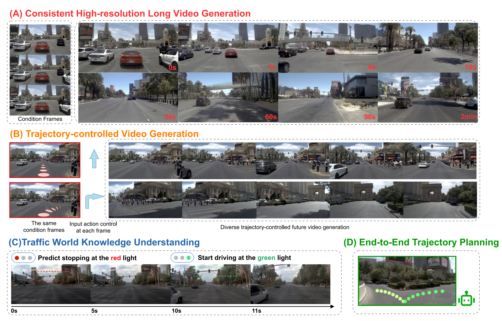

<p align="center">
  <h1 align="center"><i>Epona</i>: Autoregressive Diffusion World Model for Autonomous Driving</h1>
  <h3 align="center">ICCV 2025</h3>
  <p align="center">
                <span class="author-block">
                <a href="https://kevin-thu.github.io/homepage/" target="_blank">Kaiwen Zhang</a><sup>*</sup>,
              </span>
              <span class="author-block">
                <a href="https://github.com/Tzy010822/" target="_blank">Zhenyu Tang</a><sup>*</sup>,
              </span>
              <span class="author-block">
                <a href="https://huxiaotaostasy.github.io/" target="_blank">Xiaotao Hu</a>,
              </span>
              <span class="author-block">
                <a href="https://xingangpan.github.io/" target="_blank">Xingang Pan</a>,
              </span><br>
              <span class="author-block">
                <a href="https://xy-guo.github.io/" target="_blank">Xiaoyang Guo</a>,
              </span>
              <span class="author-block">
                <a href="https://liuyuan-pal.github.io/" target="_blank">Yuan Liu</a>,
              </span>
              <span class="author-block">
                <a href="https://scholar.google.com/citations?user=7eJBk1UAAAAJ&hl=zh-CN" target="_blank">Jingwei Huang</a>,
              </span>
              <span class="author-block">
                <a href="https://yuanli2333.github.io/" target="_blank">Yuan Li</a>,
              </span>
              <span class="author-block">
                <a href="https://scholar.google.com/citations?user=pCY-bikAAAAJ&hl=en&oi=ao" target="_blank">Qian Zhang</a>,
              </span><br>
              <span class="author-block">
                <a href="https://www.xxlong.site/" target="_blank">Xiaoxiao Long</a><sup>✝</sup>,
              </span>
              <span class="author-block">
                <a href="https://cite.nju.edu.cn/People/Faculty/20190621/i5054.html" target="_blank">Xun Cao</a>,
              </span>
              <span class="author-block">
                <a href="https://yvanyin.xyz/" target="_blank">Wei Yin</a><sup>§</sup>
  </p>

  <p align="center">
    <sep>*</sep>Equal Contribution
    <sep>✝</sep>Project Adviser
    <sep>§</sep>Project Lead, Corresponding Author
  </p>

  <p align="center">
    <a href="https://arxiv.org/pdf/2506.24113"></a>
    <a href="https://kevin-thu.github.io/Epona/"></a>
  <a href="https://huggingface.co/Kevin-thu/Epona"></a>
    <!-- <a href="https://twitter.com/sze68zkw"></a> -->
  </p>

  <div align="center">
    
    <p align="left"><b>Versatile capabilities of <i>Epona</i></b>: Given historical driving context, our Epona can generate consistent <b>minutes-long driving videos</b> at high resolution (A). It can be <b>controlled by diverse trajectories</b> (B), and understand real-world traffic knowledge (C). In addition, our world model can <b>predict future trajectories</b> and serve as an end-to-end real-time motion planner (D).
</p>
  </div>
</p>


## 🚀 Getting Started
### Installation
```bash
conda create -n epona python=3.10
conda activate epona
pip install -r requirements.txt
```
To run the code with CUDA properly, you can comment out `torch` and `torchvision` in `requirement.txt`, and install the appropriate version of `torch>=2.1.0+cu121` and `torchvision>=0.16.0+cu121` according to the instructions on [PyTorch](https://pytorch.org/get-started/locally/).


### Data Preparation
Please refer to [data preparation](./data_preparation/README.md) for more details to prepare and preprocess data.

After preprocessing, please change the `datasets_paths` in the config files (under `configs` folder) to your own data path.

### Inference
You can first download our pre-trained models (including the world models and the finetuned temporal-aware DCAE) from [Huggingface](https://huggingface.co/Kevin-thu/Epona).

In addition to our finetuned temporal-aware DCAE, you may also experiment with the original [DCAEs](https://github.com/mit-han-lab/efficientvit/blob/master/applications/dc_ae/README.md) provided by MIT Han Lab as the autoencoder: [dc-ae-f32c32-mix-1.0](https://huggingface.co/mit-han-lab/dc-ae-f32c32-mix-1.0) and [dc-ae-f32c32-sana-1.1](https://huggingface.co/mit-han-lab/dc-ae-f32c32-sana-1.1). After downloading, please change the `vae_ckpt` in the config files to your own autoencoder checkpoint path.

Then, you can run different scripts in `scripts/test` folder to test *Epona* for different uses:
| Script Name        | Dataset      | Trajectory Type                 | Video Length    | Use Case Description                                         |
| ------------------ | ------------ | ------------------------------- | --------------- | ------------------------------------------------------------ |
| `test_nuplan.py`   | NuPlan       | Fixed (from dataset)            | Fixed           | Evaluation on NuPlan test set with fixed setup.     |
| `test_free.py`     | NuPlan       | Self-predicted                  | Variable (free) | **Long-term video generation** with autonomous predictions.      |
| `test_ctrl.py`     | NuPlan       | User-provided (`poses`, `yaws`) | Variable (free) | **Trajectory-controlled video generation**; requires manual inputs in the script.    |
| `test_traj.py`     | NuPlan       | Prediction only                 | N/A             | Evaluates the model’s **trajectory prediction** accuracy.        |
| `test_nuscenes.py` | NuScenes     | Fixed (from dataset)            | Fixed           | Evaluation on nuScenes validation set with fixed setup.            |
| `test_demo.py`     | Custom input | Self-predicted                  | Variable (free) | Run *Epona* on your own input data. |


<!-- 1. **`test_nuplan.py`:** test the model on NuPlan test set with *fixed trajectories and fixed video length* in the dataset;
1. **`test_free.py`:** test the model on NuPlan test set with *self-predicted trajectories and free video length* (for *long-term video generation*);
2. **`test_demo.py`:** test the model on *your own input data* with self-predicted trajectories and free video length;
3. **`test_ctrl.py`:** test the model on NuPlan test set with *your input trajectories* (for *trajectory-controlled video generation*, need to set the `poses` and `yaws` according to the guidance in the script);
4. **`test_traj.py`:** test the model's trajectory prediction performance on NuPlan test set;
5. **`test_nuscenes.py`:** test the model on nuScenes test set with *fixed trajectories and fixed video length* in the dataset. -->

For example, to test the model on NuPlan test set, you can run:
```bash
python3 scripts/test/test_nuplan.py \
  --exp_name "test-nuplan" \
  --start_id 0 --end_id 100 \
  --resume_path "pretrained/epona_nuplan.pkl" \
  --config configs/dit_config_dcae_nuplan.py
```
where:
- `exp_name` is the name of the experiment;
- `start_id` and `end_id` are the range of the test samples;
- `resume_path` is the path to the pre-trained world model;
- `config` is the path to the config file.

All the inference scripts can be run on a single NVIDIA 4090 GPU.

### Training / Finetuning
We also provide a simple script `scripts/train_deepspeed.py` for you to train or finetune the world model with DeepSpeed.
For example, to train the world model on NuPlan dataset, you can run:
```bash
export NODES_NUM=4
export GPUS_NUM=8
torchrun --nnodes=$NODES_NUM --nproc_per_node=$GPUS_NUM \
scripts/train_deepspeed.py \
  --batch_size 2 \
  --lr 2e-5 \
  --exp_name "train-nuplan" \
  --config configs/dit_config_dcae_nuplan.py \
  --resume_path "pretrained/epona_nuplan.pkl" \ # set `resume_path` to resume training on previous checkpoint
  --eval_steps 2000
```
You can customize the configuration file in the `configs` folder (e.g., adjust image resolution, number of condition frames, model size, etc.).
Additionally, you can finetune our base world model on your own dataset by modifying the `dataset` folder to implement a custom dataset class.

## ❤️ Ackowledgement
Our implementation is based on [DrivingWorld](https://github.com/YvanYin/DrivingWorld), [Flux](https://github.com/black-forest-labs/flux) and [DCAE](https://github.com/mit-han-lab/efficientvit/tree/master/applications/dc_ae). Thanks for these great open-source works!

## 📌 Citation
If any part of our paper or code is helpful to your research, please consider citing our work 📝 and give us a star ⭐. Thanks for your support!
```bibtex
@inproceedings{zhang2025epona,
  author = {Zhang, Kaiwen and Tang, Zhenyu and Hu, Xiaotao and Pan, Xingang and Guo, Xiaoyang and Liu, Yuan and Huang,
  Jingwei and Yuan, Li and Zhang, Qian and Long, Xiao-Xiao and Cao, Xun and Yin, Wei},
  title = {Epona: Autoregressive Diffusion World Model for Autonomous Driving},
  booktitle = {Proceedings of the IEEE/CVF International Conference on Computer Vision (ICCV)},
  year = {2025}
}
```
